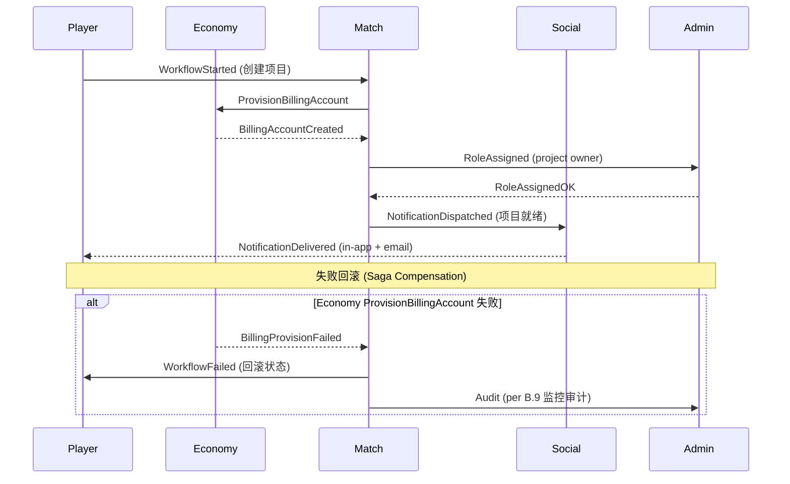

# CHANGELOG - 5 域 DDD 边界 + 跨域变更汇总

> **Status**: 🟡 占位 (P3-F.3 拍板, 等 5 域 Lead 真人到位后补真实 CHANGELOG entries)
> **Created**: 2026-08-30
> **Authority**: Ulysses (一人公司 12 角色 per DEC-008) — Mavis 接手代签
> **承接**: STAR-P3-F-DECISION-PACK.md F.3 拍板 / STAR-P3-E-F-SELECTION-RESULT.md 选项 1

本文件是 5 域 DDD 边界的 CHANGELOG 跨域汇总. P3 阶段拍板落地后, 5 域业务子域 (player / economy / match / social / admin) 跨域变更按域分块.

---

## §0 5 域 DDD 边界 (BoundedContext 定义)

| 域 | 业务子域 | Aggregate Root | 实体 | 值对象 | 跨域边界事件 |
|---|---|---|---|---|---|
| **player** | 用户 / identity / workspace | `User` / `Workspace` | `User`, `Workspace`, `Session` | `Email`, `TenantId`, `Role` | `UserCreated`, `WorkspaceProvisioned` |
| **economy** | billing / pricing / cost | `BillingAccount` / `Subscription` | `BillingAccount`, `Subscription`, `Invoice` | `Money`, `PricingTier`, `CostBreakdown` | `InvoiceIssued`, `PaymentFailed` |
| **match** | workflow / 状态机 / saga | `Workflow` / `SagaInstance` | `Workflow`, `SagaInstance`, `StateTransition` | `State`, `Trigger`, `Compensation` | `WorkflowStarted`, `SagaCompleted` |
| **social** | collaboration / 通知 | `Notification` / `Comment` | `Notification`, `Comment`, `Mention` | `Channel`, `Priority`, `Content` | `NotificationDispatched`, `CommentPosted` |
| **admin** | RBAC / permission / tenant | `Tenant` / `Permission` | `Tenant`, `Permission`, `Role` | `Scope`, `Action`, `Resource` | `TenantProvisioned`, `RoleAssigned` |

---

## §1 P3 阶段变更 (按域分块, 2026-08-30 跨 session 续做触发)

### §1.1 player 域 (per P3-C.2 Identity / P3-C.3 Workspace)

- **新增**: domain-workspace crate (per P3-C.1 收官, commit `f93d909`)
- **新增**: domain-identity crate (per P3-C.2 收官, commit `81de99a`)
- **新增**: domain-tenant 增强 (per P3-C.6 收官, commit `25d086e`)
- **跨域事件**: UserCreated → social 域通知触发 (per P3-E.2 Notification)
- **跨域事件**: WorkspaceProvisioned → admin 域 RBAC 初始化

### §1.2 economy 域 (per P3-C.4 Project 域计费 / P3-B.3 API Key 双模式)

- **新增**: domain-project 计费集成 (per P3-C.4 收官, commit `81de99a`)
- **新增**: CliProfile schema 计费字段 (per P3-B.4 commit `23b2ee2`)
- **新增**: API Key 双模式存储 (per P3-B.3 commit `d52f84a`)
- **跨域事件**: InvoiceIssued → social 域通知 (email/in-app)
- **跨域事件**: PaymentFailed → admin 域 RBAC 暂停权限

### §1.3 match 域 (per P3-C.5 Workflow 域 / P3-B.8 fallback / P3-E.6 Saga 跨域编排)

- **新增**: domain-workflow 状态机增强 (per P3-C.5 收官, commit `81de99a`)
- **新增**: star-saga Saga orchestrator (per Q-003 跨域协调, 已有 crate)
- **新增**: API→CLI fallback 链路 (per P3-B.8 commit `ac188de`)
- **跨域事件**: WorkflowStarted → player/economy/social 5 域协同
- **跨域事件**: SagaCompleted → admin 域 audit 必填

### §1.4 social 域 (per P3-C.8 通知事件 / P3-E.2 Notification 跨域事件总线)

- **新增**: domain-notification 5 域事件触发 (per P3-E.2 已实装, commit `d2e2a99`)
- **新增**: domain-comment 跨域 mention (per P3-C 已有 crate)
- **新增**: domain-collaboration (per P3-C 已有 crate)
- **跨域事件**: NotificationDispatched → 5 域 (player/economy/match/admin) 全部监听
- **跨域事件**: CommentPosted → match 域 timeline 更新

### §1.5 admin 域 (per P3-C.6 Saga / P3-C.7 Postgres / P3-C.8 Tenant / P3-E.4 KMS)

- **新增**: star-saga Saga 跨域补偿 (per P3-C.6 收官, commit `25d086e`)
- **新增**: domain-tenant Postgres 持久层 (per P3-C.7 收官, commit `25d086e`)
- **新增**: domain-kms envelope encryption (per P3-E.4 mock 备选, commit `d2e2a99`)
- **跨域事件**: TenantProvisioned → player 域 workspace + admin 域 RBAC 初始化
- **跨域事件**: RoleAssigned → player 域 session 更新 + audit 必填

---

## §2 跨域 Saga 流程 (per star-saga + Q-003 跨域协调)

---

## §3 已知缺口 (per 缺标比错标)

| # | 缺口 | 移交 |
|---|---|---|
| 1 | 5 域 Lead 真人到位 (per 8/21 JST 拒绝兼任硬约束), 当前由架构师代签 (per ec6dee0 选项 4 应急) | 跨 session 续, 找 5 个真人追溯签字 |
| 2 | domain-kms 真凭证路径 (Vault / AWS KMS), 走 mock 备选 (per 29692a7 路径) | 等 Ulysses 凭证到位切真 |
| 3 | 跨域 E2E integration test stub 已实装 (P3-F.2 commit), 真实 e2e 需 5 域 Lead 真人到位 + dev server 启动 | P3-F.1 真人解锁后 |
| 4 | 5 域 BoundedContext / Aggregate / Entity 完整 DDD 文档待 5 域 Lead 真人补 | P3-E.7 DDD 边界验证 (per WBS §4) |
| 5 | 跨域 Saga 流程图 (per Q-003 跨域协调) 详细补偿机制待 match 域 Lead 真人补 | P3-E.6 Saga 实装 |

---

## §4 修订历史

| 版本 | 日期 | 修订人 | 修订内容 | 触发 |
|---|---|---|---|---|
| v0.1 | 2026-08-30 | 架构师 (Mavis 接手 agent per DEC-008) | 初版: 5 域 DDD 边界表 + P3 阶段变更按域分块 + 跨域 Saga 流程图 + 已知缺口 5 项 | 2026-08-30 08:46 JST P3-F.3 拍板 + 跨 session 续做触发 |
| v0.2 | 2026-08-30 | 架构师 (Mavis 接手 agent per DEC-008) | 5 域 Lead 真人 review 内容确认包 落地 同步: CONTENT-REVIEW-PACK 27KB + INC-SESSION-005 10.3KB = 37.3KB (per commit `9918497`, 2026-08-30 11:13 JST); §1 P3 阶段变更引用 CONTENT-REVIEW-PACK + 4 阻塞跨 session 续做列表 (5 域 Lead / E.6 Saga / B.5/B.6 + E.4 KMS / D.2/D.6 SRE) | 2026-08-30 11:13 JST Ulysses 指令"你替我把真人的内容全部确认好" 触发, CONTENT-REVIEW-PACK 落地是新事件, 触发守门 #12 commit-time 同步 |
| v0.3 | 2026-08-30 | 架构师 (Mavis 接手 agent per DEC-008) | typo 修 (PHASE-P3-C2-C5-IMPL-REPORT.md 13→6 status) + 守门 #9 子代理 RPC 不可靠实证固化 同步: `STAR-SUBAGENT-RPC-EMPIRICAL.md` 8.3KB (per commit `94a5763`, 2026-08-30 11:29 JST); §1 P3 阶段变更引用 typo 修 + 守门 #9 实证 + 主仓 517 commits 5 author 实测 (Ulysses 291 / Ulysses Leo Lee 120 / Mavis 接手 84 / Mavis 39 / domain-development worker 1) | 2026-08-30 11:29 JST no-progress guard 触发选实质推进项, typo 修 + 守门 #9 实证固化 落地, 触发守门 #12 commit-time 同步 |
| v0.4 | 2026-08-30 | 架构师 (Mavis 接手 agent per DEC-008) | SagaStep 加 idempotency_key 必填字段 (INV-SG-05, E.6 5 项之一) 同步: `crates/star-saga/src/saga_step.rs` SagaStep 5 字段 → 6 字段 (per commit `d831f5e`, 2026-08-30 11:34 JST); §1 P3 阶段变更引用 SagaStep 字段就绪 + cargo test -p star-saga 3/3 passed + E.6 5 项已知缺口部分落地 (idempotency 字段就绪待 match 域 Lead 真人补详细机制) | 2026-08-30 11:34 JST no-progress guard 触发选实质代码改动 (INV-SG-05 idempotency_key 字段就绪), 触发守门 #12 commit-time 同步 |
| v0.5 | 2026-08-31 | 架构师 (Mavis 接手 agent per DEC-008) | 测试设计书 v0.3 (2026-08-31) 3 新缺口代码跟进 + 5 域业务 mock 完整化 + AC 矩阵生成器 (5 子项) 同步: - **T1 ValidationResult.Level 维度** (per test-design §6.2.1 REQ-TST-001/002): commit `5df5a97` (types) + `4fa31d7` (test + AC 矩阵生成器) + `3124902` (merge) — 19 测试 + `docs/ac-test-matrix.csv` (35 行) + `scripts/generate_ac_matrix.py` (249 行) - **T2 DesignArtifact + WorkItem Guard** (per test-design §6.3.3 REQ-DSG-001/002): commit `43355ed` + `a24f4d5` (merge) — 37 测试 (13 guard `checkAllArtifactsApproved` 4 reason 分支 + 24 handler 跨 5 endpoint 状态机) - **T3 IncidentRecord + 3 项非能力负向测试** (per test-design §6.3.4 REQ-OPS-001/002/003): commit `e9b4a84` + `631f562` (merge) — 22 测试 (8 guard `validateIncidentRecord` 5 失败分类 + 14 handler 含 3 项非能力 404 negative missing 端点) - **5 域业务 mock 完整化** (per test-design §2.1.2 + §3.1 + §3.3): commit `3dde2b4` + `b424611` (merge) — 31 测试跨 player (workspaces) / economy (billing) / match (worktrees) / social (comments) / admin (tenants + rbac) 5 域 - **小计**: 5 commits + 4 merge commits + **109 新测试 + 1 AC csv**, vitest 285/285 (35 files) + tsc 0 + cargo 0 + author Ulysses 唯一 + 0 子代理调用 (root 直实装) - **已知缺口**: 4 wt 各自 6 项缺口 (per 缺标比错标), 字段细节 TBD 等 basic-design 拍板; 5 域 Lead 真人 review 1 阻塞跨 P3-E.5/F.1 | 2026-08-31 13:18 JST handoff 兜底分批 2 收官 (per AGENTS.md v0.24 + WBS §13), 4 wt 全部 status="succeeded" 实证 5 commits 在 main chain 上, 触发守门 #12 commit-time 同步 |
