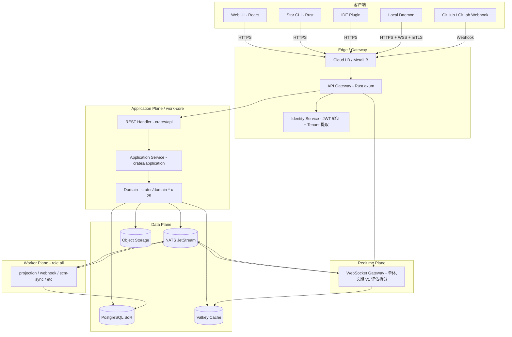
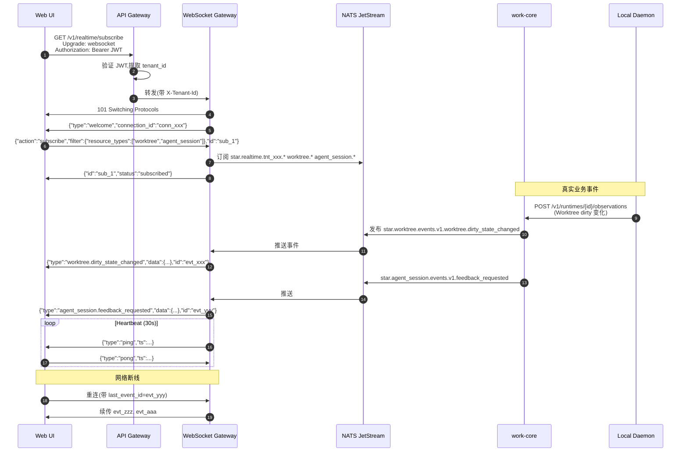
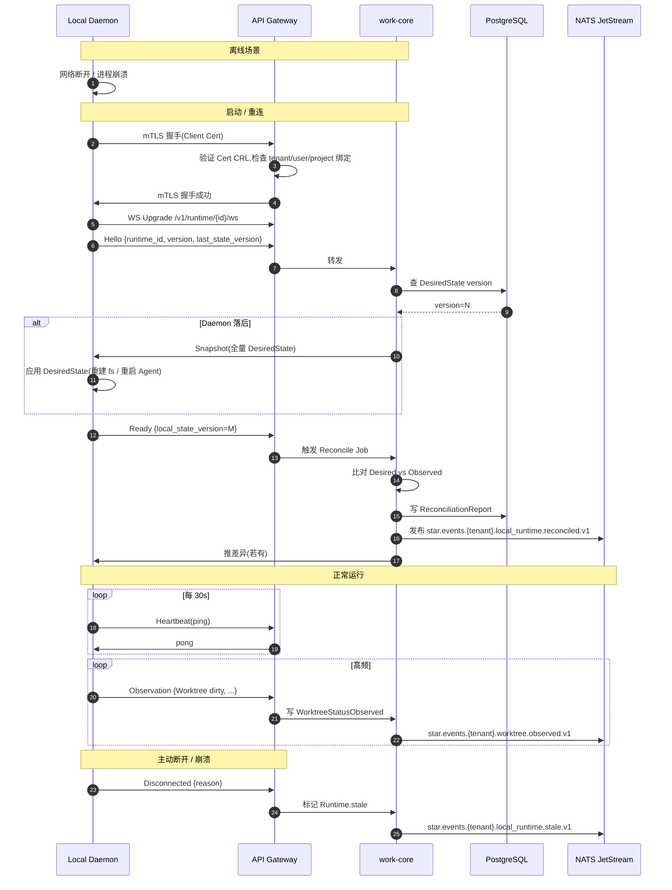

# Star 平台《API Design 詳細設計書》

> **文档版本**: v0.2 (2026-08-26)
> **修订历史**:
>
> | 版本 | 日期 | 变更 | 审批者 |
> |---|---|---|---|
> | v0.1 | 2026-08-25 | 初始版本 | — |
> | v0.2 | 2026-08-26 | 同步 basic-design 5f1ea5b(REQ-AUTO-002 / REQ-NOTIF-002 / REQ-SCM-003 / AgentSession token+cost / Skill-Playbook+Squad V2 候选) | — |
> **上游基本設計書**: `D:\Star-worktrees\api-design\docs\basic-design.md` v0.1(下文以 §N 引用 N 为 basic-design.md 的章节号;`§R-N` 形式引用 requirements.md v2.0 的章节号)
> **上游要件定義書**: `D:\Star-worktrees\api-design\docs\requirements.md` v2.0
> **文档定位**: 详细设计阶段第一件产物,定义 SaaS Control Plane 对外所有接口契约(REST + WebSocket + Event Stream);后续 Data Design / Security Design / Runtime Design / Integration Design / AI Design / Test Design / Operation Design 均依赖本设计输入

---

## 上游同步 2026-08-26(继承 basic-design 5f1ea5b)

> 本设计书跟随《基本設計書》5f1ea5b 同步,引入以下 5 项变更。**均不改 MVP 边界与既有 Resource Model 25 Module**:
>
> | 同步项 | 基本設計書位置 | 本设计落位 |
> |---|---|---|
> | **S1** REQ-AUTO-002(Trigger 增加 Schedule/Cron 变体) | §2.1.2 + §5.6 事件清单 | §3.14 automation 注释 + §5.3 事件清单 19→20 条 + §5.5.20 payload(V1 候选) |
> | **S2** REQ-NOTIF-002(默认仅人类决策节点触达) | §2.1.3 | §3.16 notification 注释 |
> | **S3** REQ-SCM-003(自建 Git 排期调整,V2 候选) | §4.7.1 | §3.19.4 Webhook 入口表追加 Gitea/Forgejo 行(V2 候选) |
> | **S4** AgentSession `token_usage` / `cost_summary` 字段 | §4.2.2 | §3.22.1 Agent 注册表注释 + §12 附录 A OpenAPI Schema(V1 候选) |
> | **S5** Skill/Playbook + Squad V2 候选 | §4.2.8 + §4.4 Provenance | §3.24 context 端点注释(V2 候选,占位) |
>
> **不变量保留**:
> - 不拆 25 Module 资源
> - 不重写 §3 端点清单结构,仅追加/调整
> - V1 候选允许 API Schema 加字段;V2 / Future 必须显式标注

---

## 0. 文档说明

### 0.1 文档目的与定位

本文档定义 Star 平台 Vibe Coding Work Management SaaS(§1,§2)对**外暴露**的接口契约,严格继承基本設計書 §2.1(25 个 crate 级 Module)、§4(各 Module 接口签名 / Port)、§5(数据架构 / SoR 划分)、§6(安全边界 / 13 类 tenant_id 必带对象)、§7(关键状态机 / 5 个核心 + 2 个支撑实体)、§5.5(NATS Subject 命名空间 `star.*` 前缀)所确立的内部契约,并将之投影到 REST 资源、HTTP 方法、URI 路径、请求 / 响应 Schema、错误码字典、WebSocket 协议、AsyncAPI 事件契约。

**本文档遵守 §0.1(basic-design) "本文档不输出生产代码" 约束**(§R-0):
- ✅ 输出 OpenAPI 3.1 YAML(URL 路径、Method、Request/Response Schema)
- ✅ 输出 AsyncAPI 3.0 YAML(NATS Subject + CloudEvents 1.0)
- ✅ 输出 Protobuf IDL 草案(若决定引入 gRPC,见 §6)
- ✅ 输出错误码字典 + NATS Subject 命名空间完整列表
- ✅ 输出 mermaid 流程图(API 架构 / Realtime 时序 / Local Runtime 时序)
- ❌ 不写完整 Rust handler / use 语句块 / 业务函数体
- ❌ 不写完整 SQLx Repository 实现
- ❌ 不写 SDK 代码(任何语言)
- ❌ 不写前端组件代码
- ❌ 不画 UI 截图 / 视觉设计
- ❌ 不写生产环境 K8s manifest(留给 Operation Design)

### 0.2 上游契约(基本設計書 §4)

| 基本设计章节 | 本设计承接物 |
|---|---|
| §2.1(25 个 Module 划分与依赖方向) | §2.1 Resource 总表按 25 Module 1:1 对应 |
| §4.1 `domain-worktree` Port(WorktreeCommandPort / WorktreeQueryPort) | §3.21 `domain-worktree` 端点 |
| §4.2 `domain-agent` Port(AgentPort) | §3.22 + §7(Local Runtime → Agent) |
| §4.3 `domain-feedback` Port | §3.23 |
| §4.4 `domain-context` Port + DecisionMemoryPort | §3.24 |
| §4.5 `domain-validation` Port + AcceptanceCoveragePort | §3.25 |
| §4.6 `domain-local-runtime` Port(RuntimePort + RuntimeCommand) | §3.26 + §7 |
| §4.7 `domain-scm` Port(ScmPort) | §3.19 |
| §4.8 `domain-development` 实体(ChangeSet / DevelopmentExecution) | §3.20 |
| §4.9 `domain-work-item` + workflow + board + planning 实体 | §3.5-§3.8 |
| §4.10 `domain-permission` + Security 13 类对象 | §1.8 + §2.2 + §3 全部 |
| §5.5 NATS Subject 命名空间 `star.*` | §5 AsyncAPI |
| §5.6 核心事件清单(WorktreeCreated/AgentSessionStarted 等 20 种) | §5 完整映射 |
| §6.1 13 类 tenant_id 必带对象 | §2.2 表 + §1.8 |
| §7.1 Worktree 状态机(17 状态) | §3.21 状态迁移端点 |
| §7.2 WorkItem Workflow(默认三态 + 扩展) | §3.5 状态迁移端点 |
| §7.3 Feedback 状态机(6 状态) | §3.23 状态迁移端点 |
| §7.4 AgentSession 状态机(14 状态) | §3.22 状态迁移端点 |
| §7.5 PR / MR 状态机 | §3.19 PR/MR 端点 |
| §14.1 决策继承表(N.1-N.10 Context Engineering) | §3.24 + §4 Context 实时推送 |
| §15 Open Issue J.1-J.15 中与 API 相关项 | §14 API 子集继承 |

### 0.3 下游契约(给后续详细设计阶段)

| 下游设计 | 本设计提供的输入 |
|---|---|
| **Data Design** | §2.1 每个 Resource 哪些字段 R/W(SoR)、主键、外键、索引需求;§5 事件 Outbox Schema;§8 错误码表 |
| **Security Design** | §1.8 每个端点 tenant_id 强制点;§1.3 错误响应格式;§8 错误码字典;§3 全部端点的 Auth 级别 |
| **Runtime Design** | §7 Local Runtime 协议(HTTP + WS + 消息模式 + 鉴权 + Reconcile) |
| **Integration Design** | §3.19 SCM 端点(Repository/Branch/Commit/PR/Review);§3.16 Notification Provider 端点 |
| **AI/Agent Design** | §3.22 AgentSession 端点(Start/Stop/SubmitFeedback/QueryStatus);§3.24 Context Packet 端点;§4 Realtime Agent 状态推送 |
| **Test Design** | §3 每个端点的 E2E 场景;§8 错误码;§1 API 原则(用于生成 Contract Test) |
| **Operation Design** | §1.10 / §10 REST 端口、HTTPS、WS 端口;§4 WS 端口;§11 Metrics 端点;§7 Local Runtime 端口 |
| **External / Internal Design(UI)** | §3 全部端点列表;§4 Realtime 推送粒度;§3.23 Feedback Inbox 端点;§2.1 Resource Schema |
| **AI Audit / SRE** | §3.12 Audit 端点;§8 SEC-* 错误码;§5 AIAuditMetadata 事件 |

### 0.4 命名约定与术语

- **Module / Domain**:基本设计 §0.3 定义,同义,代表 crate 级逻辑划分;本设计按 25 Module 一一对应 REST 端点
- **Resource**:REST 中可寻址 / 可 CRUD 的实体(Entity / Aggregate Root)
- **SoR**:System of Record(§5.1)
- **Projection**:派生视图,不可作为业务事实源(§12,REQ-SEARCH-001)
- **Observed State**:高频、非业务事实的运行时状态(§14.1,REQ-DATA-003)
- **OHS**:Open Host Service,本设计的 REST API 入口即为 OHS(§3.1)
- **ACL**:Anti-Corruption Layer,SCM/Agent/AI Provider Adapter 实现位置(§3.1)
- **CloudEvent 1.0**:id / source / type / time / datacontenttype / data(§5)
- **Problem Details**:RFC 7807,本设计 §1.3 / §8 错误响应格式

### 0.5 接口规范文件

| 文件 | 内容 | 章节指针 |
|---|---|---|
| `docs/api-design.md`(本文件) | API 总体原则 + Resource Model + 端点表 + WS + Event Bus + 错误码 | 全文 |
| `docs/api-design/openapi.yaml` | OpenAPI 3.1 完整草案(代表性 2-3 端点完整) | §12 |
| `docs/api-design/asyncapi.yaml` | AsyncAPI 3.0 完整草案(1 个代表性事件) | §13 |
| `docs/api-design/error-codes.md`(可选,或本文件 §8) | 错误码字典 | §8 |

> 草案 1:完整 OpenAPI YAML / AsyncAPI YAML 在本文件 §12 / §13 内嵌;待评审通过后,可由外部脚本生成独立 `openapi.yaml` / `asyncapi.yaml` 供 SDK 自动生成使用。

---

## 1. API 总体原则

### 1.1 REST 资源命名规范

| 规则 | 规范 | 引用 |
|---|---|---|
| 资源名 | **复数** + **kebab-case**(`work-items`, `agent-sessions`, `context-packets`, `change-sets`, `validation-results`, `runtime-observations`) | RFC 9110 §3.2.2 兼容 |
| 路径前缀 | `/v1/{module}/{resources}` 或 `/v1/{resources}`(核心域);全部走 URL 版本,见 §9 | §9 |
| 避免动词 | URL 仅承载资源,动作走 HTTP Method(GET/POST/PUT/PATCH/DELETE) | — |
| 嵌套 | 不超过 2 层(例:`/v1/work-items/{id}/feedback` 而非 `/v1/projects/{id}/work-items/{id}/feedback`) | — |
| 子资源过滤 | `/v1/{parent}/{id}/{children}` 仅 1 层;`?filter=...` 走 query | — |
| ID 格式 | UUID v7(全局唯一 + 时间排序);部分使用 ULID 备选;严禁暴露内部递增 ID | — |
| 路径参数 | `{work_item_id}`, `{worktree_id}`, `{agent_session_id}` 等显式命名,不使用 `{id}` 模糊 | — |
| 避免厂商名 | URL 不出现 `github` / `gitlab` / `codex` 等;SCM 厂商由 `X-SCM-Provider` Header 或子路径 `/v1/scm/{provider}/...` 区分 | §3.19 |

### 1.2 HTTP 状态码使用约定

| 类别 | 状态码 | 用途 | 错误码前缀 |
|---|---|---|---|
| 成功 | 200 OK | 普通查询/更新成功 | — |
| 成功 | 201 Created | POST 创建成功,返回资源 + `Location` Header | — |
| 成功 | 202 Accepted | 异步任务(AgentSession Start, Context Build Trigger),返回 `Location: /v1/jobs/{job_id}` | — |
| 成功 | 204 No Content | DELETE 成功,无 body | — |
| 客户端错误 | 400 Bad Request | 请求 Schema 错误 | `VAL-*` |
| 客户端错误 | 401 Unauthorized | 未认证(JWT 缺失 / 失效) | `SEC-001` |
| 客户端错误 | 403 Forbidden | 鉴权失败(权限不足 / tenant 不匹配) | `SEC-002`, `SEC-003` |
| 客户端错误 | 404 Not Found | 资源不存在 | `*-001` |
| 客户端错误 | 409 Conflict | 资源状态冲突(如重复创建 / 状态机非法迁移) | `*-003` |
| 客户端错误 | 410 Gone | 资源已归档 / 永久删除 | `*-010` |
| 客户端错误 | 412 Precondition Failed | `If-Match` ETag 不匹配(乐观并发) | `VAL-002` |
| 客户端错误 | 422 Unprocessable Entity | 业务规则违反(状态机非法迁移 / 必填字段缺失) | `*-004` |
| 客户端错误 | 429 Too Many Requests | 限流 | `RATE-001`, `RATE-002` |
| 服务端错误 | 500 Internal Server Error | 业务未捕获异常 | `SRV-001` |
| 服务端错误 | 502 Bad Gateway | 上游 SCM / AI Provider 错误 | `SCM-501` / `AGT-501` |
| 服务端错误 | 503 Service Unavailable | 维护中 / 依赖不可用 | `SRV-002` |
| 服务端错误 | 504 Gateway Timeout | 上游超时 | `SCM-502` / `AGT-502` |

### 1.3 错误响应统一格式(继承 RFC 7807 Problem Details)

```json
{
  "type": "https://errors.star.dev/wt/worktree-not-found",
  "title": "Worktree Not Found",
  "status": 404,
  "code": "WT-001",
  "detail": "Worktree wt_01HXXX not found in tenant tnt_YYY",
  "instance": "/v1/worktrees/wt_01HXXX",
  "trace_id": "01HZZZABCDEFGH",
  "tenant_id": "tnt_YYY",
  "resource": { "type": "Worktree", "id": "wt_01HXXX" },
  "errors": [
    { "field": "id", "code": "FIELD-INVALID", "message": "Invalid UUID" }
  ],
  "documentation_url": "https://docs.star.dev/errors/WT-001"
}
```

**强制字段**(§R-16 业务可读性 + §R-39 可追溯):
- `type`:错误类型 URI,全局唯一(供 OpenAPI 引用)
- `title`:人类可读标题
- `status`:HTTP 状态码(冗余但 RFC 7807 要求)
- `code`:业务级错误码(见 §8)
- `detail`:人 / Agent 可读的详细描述
- `instance`:请求路径
- `trace_id`:与 `traceparent` / `X-Request-Id` 一致

**可选字段**:
- `errors[]`:字段级错误(用于 400 验证失败)
- `resource`:资源类型 + ID
- `documentation_url`:错误码文档链接
- `retry_after`(秒):503 / 429 时出现

### 1.4 分页(Offset/Limit vs Cursor)

| 类型 | 适用 | 路径 / Query | 备注 |
|---|---|---|---|
| **Offset/Limit** | 普通 UI 列表(WorkItem List, Feedback Inbox),数据量 < 10K | `?offset=0&limit=50`(默认 `limit=50`,上限 `200`) | 性能边界:offset > 10K 时降级为 Cursor |
| **Cursor** | 实时数据流(Worktree Status, Agent Session Log),数据量 > 10K,需稳定顺序 | `?cursor=eyJ0IjoxNz...&limit=100`(base64 编码的时间戳 + 实体 ID) | `next_cursor` 在响应中返回 |

**响应信封**:
```json
{
  "data": [ ... ],
  "pagination": {
    "total": 1234,
    "offset": 0,
    "limit": 50,
    "next_cursor": "eyJ0IjoxNzI3...",
    "has_more": true
  }
}
```

### 1.5 排序与过滤(Sort/Filter Query 参数)

```text
GET /v1/work-items?sort=-updated_at,priority&filter[status]=IN_PROGRESS&filter[assignee]=user_xxx&filter[project]=prj_yyy
```

| 参数 | 规范 |
|---|---|
| `sort` | 逗号分隔字段,前缀 `-` 表示 DESC(默认 ASC);`sort=-updated_at,priority` → ORDER BY updated_at DESC, priority ASC |
| `filter[...]` | 字段名做 key,值做 value;**多值**用逗号:`filter[status]=TODO,IN_PROGRESS` |
| `filter[{field}_gte]` / `_lte` | 范围(时间、数字) |
| `filter[search]` | 全文检索(调用 `domain-search`) |
| `fields` | 稀疏字段集:`?fields=id,title,status,assignee`(GraphQL-like,Phase 2 评估) |
| `include` | 关联内联:`?include=worktree,agent_session` |

**禁止**:
- ❌ `?where=...` SQL 风格(避免 SQL 注入,避免暴露内部 schema)
- ❌ GraphQL query 嵌入 query string(Phase 2 评估,见 §10.4)

### 1.6 幂等性(Idempotency-Key)

| Method | 幂等性要求 | 实现 |
|---|---|---|
| GET | 自然幂等 | — |
| PUT | 自然幂等(同 URL 同 body 同结果) | — |
| DELETE | 自然幂等 | — |
| **POST** | **必须**支持 `Idempotency-Key` Header(UUID v4 / v7),TTL 24h | 平台记录 `(tenant_id, idempotency_key, request_hash, response)`;24h 内同 key 同 hash → 返回缓存响应;同 key 不同 hash → 409 Conflict `IDP-001` |
| PATCH | 可选支持 `If-Match: ETag` | 乐观并发 |

**关键 POST**(必须支持幂等):
- `POST /v1/work-items`(创建 WorkItem)
- `POST /v1/worktrees`(创建 Worktree)
- `POST /v1/agent-sessions`(启动 AgentSession)
- `POST /v1/feedbacks`(创建 Feedback)
- `POST /v1/context-packets:trigger`(触发 Context Build)
- `POST /v1/validation-results:submit`(提交 Validation Evidence)
- `POST /v1/runtime/registrations`(Local Runtime 注册)

### 1.7 时区与时间

| 项 | 规范 |
|---|---|
| **全部 UTC ISO 8601** | `2026-08-25T10:30:00.123Z`(`Z` 强制) |
| **不接受本地时间** | API 拒绝非 `Z` 结尾时间,`VAL-003` |
| **不接受 Unix Timestamp** | 仅 human-readable ISO 8601;Unix Timestamp 仅在 WS 推送的 sequence number 等内部协议使用 |
| **时区显示** | UI 层负责按用户时区渲染;API 层不感知时区 |

### 1.8 多租户隔离(§R-16,§6.1,REQ-SEC-001)

| 项 | 规范 |
|---|---|
| `X-Tenant-Id` Header | **强制**;所有请求(Anonymous 公开端点除外,如 `/healthz`, `/.well-known/openid-configuration`)必须携带 |
| Header 来源 | 仅由 **API Gateway 从 JWT 提取**(`tenant_id` claim),**不接受 query string 或 body 传入**;Header 与 JWT 不一致 → 403 `SEC-002` |
| Cross-Tenant Access | Server-side `AuthorizationChecker` 每次 Query 校验 `actor.tenant_id == resource.tenant_id`;违规 → 403 `SEC-007` + Audit Log(§3.12) |
| 13 类必带 tenant_id 对象 | 见 §2.2 Resource 映射表(从 REQ-SEC-001 13 类对象出发) |
| PostgreSQL RLS | `tenant_id` 列必有 + 复合索引 + RLS Policy(强制 session 变量匹配) |
| Object Storage Key | `s3://star-tenant-data/{tenant_id}/{project_id}/...` 前缀强制 |
| NATS Subject | `star.events.{tenant_id}.{domain}.{aggregate}.{action}`(见 §5) |

### 1.9 Trace ID 透传(W3C Trace Context)

| Header | 规范 |
|---|---|
| `traceparent` | W3C Trace Context 标准,`00-{trace_id}-{span_id}-{flags}` |
| `tracestate` | W3C 标准,可选,用于跨服务追踪 |
| `X-Request-Id` | UUID v7,与 `trace_id` 一致(平台默认生成,客户端可覆盖) |
| `X-Span-Id` | UUID v7,单 Span 标识 |

**强制点**:
- API Gateway 接收时:若 `traceparent` 缺失则生成,确保 trace 链不中断
- 所有 NATS 事件携带 `trace_id` 字段(CloudEvents `traceparent` extension)
- 所有 Audit Log 记录 `trace_id`
- 所有 Error Response 包含 `trace_id`(见 §1.3)

### 1.10 Content Negotiation 与版本控制

| Header | 用途 |
|---|---|
| `Accept: application/json`(默认) | 强制 JSON,无 YAML / XML |
| `Accept-Language: en / zh-CN` | 本地化(Phase 2 评估,MVP 仅英文) |
| `Accept-Encoding: gzip, br` | 压缩 |
| `Content-Type: application/json; charset=utf-8` | POST/PUT 必带,UTF-8 强制 |
| `User-Agent: StarCLI/0.1.0` | 客户端标识,Audit 记录 |

### 1.11 限流(简述,详 §10)

| 限流维度 | 默认 |
|---|---|
| 每 Tenant 每秒请求数(RPS) | 1000 RPS(超过 → 429 `RATE-001`) |
| 每 User 每秒请求数 | 50 RPS |
| 单请求体大小 | 10 MB(超过 → 413 `RATE-003`) |
| 单 Endpoint 限流 | 见 §10 性能预算表 |

### 1.12 鉴权分层(为下游 Security Design 准备)

| 级别 | 描述 | 示例 |
|---|---|---|
| **Anonymous** | 无需鉴权,公开端点 | `GET /healthz`, `GET /.well-known/openid-configuration` |
| **Authenticated** | 仅需 JWT 有效,不检查项目权限 | `GET /v1/users/me`, `GET /v1/tenants/current` |
| **Policy** | JWT + PermissionScheme 检查 | `GET /v1/work-items/{id}`(需 `work_item:read` 权限) |
| **Protected** | 需人类显式确认(2FA / Approval Gate) | `POST /v1/work-items/{id}/merge`, `POST /v1/feedbacks:reject` |
| **Service-Internal** | 仅 work-core / worker 内部调用(由 mTLS + NetworkPolicy 保证) | `POST /v1/internal/agent-sessions/{id}/observations`(无公开文档) |

### 1.13 CORS 与浏览器限制

| 项 | 规范 |
|---|---|
| CORS Origin | 平台管理后台:`https://app.star.dev`(白名单);CLI 工具不涉及 CORS |
| CORS Method | `GET, POST, PUT, PATCH, DELETE, OPTIONS` |
| CORS Header | `Authorization, Content-Type, X-Tenant-Id, X-Request-Id, Idempotency-Key, If-Match, traceparent` |
| CORS Credential | `true` |
| Pre-flight | OPTIONS 200 + 上述 Header,缓存 1h |

### 1.14 总体 API 架构图



**架构含义**(继承 §1.1,§1.3,§13.1):
1. **API Gateway 强制 tenant_id 提取**(`X-Tenant-Id` ← JWT `tenant_id` claim,见 §1.8)
2. **REST 与 WS 共用 work-core**(§13.1,§1.1);MVP 不拆 realtime-service(§15 J 系列)
3. **Local Daemon 经 Gateway mTLS + 独立路径**(`/v1/runtime/...`,见 §7),不直接连 work-core
4. **Webhook 走 Gateway → Outbox → Worker webhook role**,不直连 worker
5. **Data Plane 全部在 K3s 内,Local Runtime 不在 K3s Workload**(§23.1,§8.5)

---

## 2. Resource Model 概览

### 2.1 25 Module Resource 总表

> **R/W(SoR)** = 该 Resource 的 System of Record 在本 Module(写权限);**R** = 只读引用;**R(Projection)** = 派生视图,不可写;**Append** = 仅追加(§6.7 AuditEvent)
> **Pre-creation**:资源在创建前需要的依赖(本设计仅作引用指针,具体字段约束留给 Data Design)

| # | Module | Resource | HTTP 路径 | Key Fields | R/W |
|---|---|---|---|---|---|
| 1 | **domain-tenant** | Tenant | `/v1/tenants/{id}` | id, name, status, created_at, plan | R/W(SoR) |
| 1 | domain-tenant | TenantPolicy | `/v1/tenants/{id}/policies` | cloud_ai_allowed, specific_provider_allowed[], no_code_upload | R/W(SoR) |
| 1 | domain-tenant | ProviderDataBoundary | `/v1/tenants/{id}/provider-boundaries` | provider_id, model_id, region, data_sent[], retention_policy | R/W(SoR) |
| 2 | **domain-workspace** | Workspace | `/v1/workspaces/{id}` | id, tenant_id, name, project_ids[] | R/W(SoR) |
| 3 | **domain-project** | Project | `/v1/projects/{id}` | id, tenant_id, workspace_id, name, template, project_policy_id | R/W(SoR) |
| 3 | domain-project | ProjectPolicy | `/v1/projects/{id}/policy` | workflow_id, permission_scheme_id, agent_policy_id, validation_policy_id, context_policy_id | R/W(SoR) |
| 3 | domain-project | ProjectTemplate | `/v1/project-templates/{id}` | id, name, default_workflow, default_permission_scheme | R/W(SoR) |
| 4 | **domain-work-item** | WorkItem | `/v1/work-items/{id}` | id, tenant_id, project_id, type, title, status, assignee_user_id, priority, repository_ids[], worktree_ids[], requirement_ids[], acceptance_criteria_ids[] | R/W(SoR) |
| 4 | domain-work-item | Requirement | `/v1/work-items/{id}/requirements` | id, business_goal_id, statement, rationale, linked_work_item_ids[] | R/W(SoR) |
| 4 | domain-work-item | AcceptanceCriterion | `/v1/work-items/{id}/acceptance-criteria` | id, work_item_id, statement, coverage_status, covered_by_validation_ids[] | R/W(SoR) |
| 4 | domain-work-item | BusinessGoal | `/v1/business-goals/{id}` | id, tenant_id, statement | R/W(SoR) |
| 5 | **domain-workflow** | WorkflowDefinition | `/v1/workflows/{id}` | id, project_id, states[], transitions[] | R/W(SoR) |
| 5 | domain-workflow | State | (子资源于 WorkflowDefinition) | id, name, is_initial, is_terminal | R |
| 5 | domain-workflow | Transition | (子资源于 WorkflowDefinition) | from, to, required_permission | R |
| 6 | **domain-board** | Board | `/v1/projects/{id}/board` | id, project_id, board_type, columns[], swimlanes[] | R/W(SoR) |
| 6 | domain-board | Column | (子资源) | id, state_id, order | R |
| 6 | domain-board | Swimlane | (子资源) | id, group_by, order | R |
| 7 | **domain-planning** | Sprint | `/v1/projects/{id}/sprints/{sprint_id}` | id, project_id, name, goal, start_at, end_at, work_item_ids[], state | R/W(SoR) |
| 7 | domain-planning | Backlog | `/v1/projects/{id}/backlog` | work_item_ids[] (排序池) | R/W(SoR) |
| 7 | domain-planning | Roadmap | `/v1/projects/{id}/roadmap` | milestones[], work_item_ids[] | R(Projection) |
| 8 | **domain-relation** | Relation | `/v1/work-items/{id}/relations` | id, source_work_item_id, target_work_item_id, type (blocks / blocked_by / relates_to) | R/W(SoR) |
| 8 | domain-relation | Dependency | (派生) | from_work_item_id, to_work_item_id, type | R(Projection) |
| 9 | **domain-comment** | Comment | `/v1/work-items/{id}/comments` | id, parent_type, parent_id, author_user_id, body, mentions[], attachment_ids[] | R/W(SoR) |
| 9 | domain-comment | Mention | (子资源于 Comment) | mentioned_user_id, offset | R |
| 9 | domain-comment | Attachment | `/v1/attachments/{id}` | id, filename, mime_type, storage_ref, tenant_id | R/W(SoR) |
| 10 | **domain-search** | SearchIndex | `/v1/search` | query, total, hits[] | R(Projection,§R-12) |
| 10 | domain-search | SearchHit | (子) | resource_type, resource_id, score, snippet, highlights | R(Projection) |
| 11 | **domain-audit** | AuditEvent | `/v1/audit-events` | id, tenant_id, actor, action, resource_type, resource_id, before_state, after_state, trace_id, created_at | Append(§6.7) |
| 11 | domain-audit | AIAuditMetadata | `/v1/audit-events/ai` | agent_session_id, context_packet_id, change_set_id, validation_result_ids[], feedback_consumed_ids[], approver_user_id | Append(§6.7) |
| 12 | **domain-integration** | Integration | `/v1/integrations/{id}` | id, tenant_id, project_id, provider, type, config, sync_state | R/W(SoR) |
| 12 | domain-integration | SyncState | (子) | sync_token, last_synced_at, conflict_strategy | R |
| 13 | **domain-automation** | Rule | `/v1/automations/rules/{id}` | id, project_id, name, trigger, conditions[], actions[] | R/W(SoR) |
| 13 | domain-automation | Trigger | (子) | event_type, filter | R |
| 13 | domain-automation | Action | (子) | action_type, action_config | R |
| 14 | **domain-identity** | User | `/v1/users/{id}` | id, tenant_id, email, display_name, status | R/W(SoR) |
| 14 | domain-identity | Device | `/v1/devices/{id}` | id, user_id, tenant_id, project_ids[], device_identity, status | R/W(SoR) |
| 14 | domain-identity | Credential | (内部,见 Security Design) | id, user_id, type, scope, expires_at | R(SoR,内部) |
| 14 | domain-identity | DeviceBinding | (子于 Device) | tenant_id, user_id, project_id, bound_at | R |
| 15 | **domain-notification** | NotificationChannel | `/v1/notification-channels/{id}` | id, user_id, type (email / in_app), config, enabled | R/W(SoR) |
| 15 | domain-notification | NotificationTemplate | `/v1/notification-templates/{id}` | id, event_type, subject, body_template | R/W(SoR) |
| 15 | domain-notification | Notification | `/v1/notifications/{id}` | id, recipient_user_id, event_type, payload, read_at, sent_at | R/W(SoR) |
| 16 | **domain-permission** | Role | `/v1/roles/{id}` | id, tenant_id, name, permissions[] | R/W(SoR) |
| 16 | domain-permission | Permission | `/v1/permissions/{id}` | name (例 `work_item:read`), description | R(SoR) |
| 16 | domain-permission | PermissionScheme | `/v1/permission-schemes/{id}` | id, project_id, role_assignments[], agent_role_assignments[] | R/W(SoR) |
| 16 | domain-permission | SecurityPolicy | `/v1/security-policies/{id}` | cloud_ai_allowed, cloud_ai_restricted, local_ai_only, specific_provider_allowed[], no_code_upload, metadata_only | R/W(SoR) |
| 17 | **domain-collaboration** | Presence | `/v1/realtime/presence` | user_id, project_id, status, last_seen | R/W(SoR,短 TTL) |
| 17 | domain-collaboration | RealtimeSubscription | (内部) | id, user_id, filter, last_event_id, expires_at | R/W(SoR) |
| 18 | **domain-scm** | Repository | `/v1/repositories/{id}` | id, tenant_id, project_id, provider, external_id, url, default_branch, ownership, sync_status | R/W(SoR) |
| 18 | domain-scm | Branch | `/v1/repositories/{repo_id}/branches` | id, repository_id, name, head_commit_id, base_commit_id, protected | R/W(SoR,部分来自 SCM) |
| 18 | domain-scm | Commit | `/v1/repositories/{repo_id}/commits` | id, repository_id, sha, author, committer, message, parent_shas[], linked_work_item_id | R/W(SoR,镜像) |
| 18 | domain-scm | PullRequest | `/v1/repositories/{repo_id}/pull-requests` | id, repository_id, source_branch, target_branch, state, review_ids[], pipeline_ids[], linked_work_item_id | R/W(SoR,镜像) |
| 18 | domain-scm | Review | `/v1/repositories/{repo_id}/pull-requests/{pr_id}/reviews` | id, pr_id, reviewer, state, comments[] | R |
| 18 | domain-scm | Pipeline | `/v1/repositories/{repo_id}/pipelines` | id, repository_id, type, status, conclusion, started_at, completed_at | R |
| 18 | domain-scm | WebhookEvent | (webhook 入站,不公开) | id, provider, event_type, payload, signature, received_at | Append |
| 19 | **domain-development** | DevelopmentExecution | `/v1/development-executions/{id}` | id, tenant_id, project_id, work_item_id, worktree_ids[], agent_session_ids[], change_set_ids[], validation_result_ids[], feedback_ids[], commit_ids[], pull_request_ids[], started_at, ended_at, execution_state | R/W(SoR) |
| 19 | domain-development | ChangeSet | `/v1/change-sets/{id}` | id, tenant_id, project_id, worktree_id, agent_session_id, commit_id, files[], symbols[], added_lines, deleted_lines, diff_reference, dependency_changes[], schema_changes[], risk_signals[], test_changes[] | R/W(SoR) |
| 19 | domain-development | Link | `/v1/work-items/{id}/change-sets` | id, work_item_id, change_set_id, link_type | R/W(SoR) |
| 19 | domain-development | RiskSignal | (子于 ChangeSet) | kind, severity, source, evidence, suggested_action | R |
| 19 | domain-development | RepositoryContext | `/v1/repositories/{id}/context` | id, repository_id, file_count, last_indexed_at, language_breakdown | R(Projection) |
| 19 | domain-development | DevelopmentContext | `/v1/development-executions/{id}/context` | id, execution_id, files[], symbols[], intent, updated_at | R(Projection) |
| 19 | domain-development | SymbolIndex | `/v1/repositories/{id}/symbols` | id, repository_id, snapshot_at, file_path, symbol_ref, kind, signature | R(Projection) |
| 20 | **domain-worktree** | Worktree | `/v1/worktrees/{id}` | id, tenant_id, project_id, work_item_id, repository_id, branch, base_branch, runtime_id, local_path_reference, owner_user_id, status, health, dirty_state, conflict_state, ahead, behind, changed_files[], changed_symbols[], test_state, build_state, context_state, feedback_state, synchronization_state, last_activity_at | R/W(SoR) |
| 20 | domain-worktree | WorktreeStatusObserved | (Projection) | worktree_id, status, dirty_files[], ahead, behind, last_observed_at, last_heartbeat_at | R(Projection,REQ-DATA-003) |
| 20 | domain-worktree | WorktreeConflict | `/v1/worktrees/{id}/conflicts` | id, worktree_id, other_worktree_id, file_paths[], risk_level | R/W(SoR) |
| 20 | domain-worktree | WorktreeHeatmap | `/v1/repositories/{id}/worktree-heatmap` | repository_id, worktree_summaries[], file_ownership_map | R(Projection) |
| 21 | **domain-agent** | Agent | `/v1/agents/{id}` | id, agent_type, agent_provider, agent_version, capabilities[], policy_template_id | R/W(SoR) |
| 21 | domain-agent | AgentSession | `/v1/agent-sessions/{id}` | id, agent_id, worktree_id, work_item_id, started_at, ended_at, status, intent, context_packet_id, plan, decisions[], tool_activity_summary, change_set_ids[], validation_result_ids[], feedback_consumed_ids[], result_summary, trace_reference | R/W(SoR) |
| 21 | domain-agent | AgentPolicy | `/v1/agent-policies/{id}` | id, allowed_repositories[], allowed_worktrees[], allowed_paths[], forbidden_paths[], allowed_tools[], allowed_command_categories[], network_access, secret_access, max_runtime_seconds, max_context_tokens, max_change_files, max_change_lines, require_review, require_test, require_approval | R/W(SoR) |
| 22 | **domain-feedback** | Feedback | `/v1/feedbacks/{id}` | id, tenant_id, project_id, target{type, ref}, type, severity, intent, expected_behavior, preserve[], prohibit[], acceptance_criterion_id, author_user_id, author_agent_id, status, created_at, resolved_at, resolution_evidence[], predecessor_id | R/W(SoR) |
| 22 | domain-feedback | FeedbackResolution | (子) | feedback_id, resolution_type, resolution_note, resolved_by_user_id, resolved_at | R |
| 22 | domain-feedback | FeedbackInboxItem | `/v1/feedbacks/inbox` | feedback, worktree, agent_session, priority (P0/P1/P2/P3), source, sla_due_at | R(Projection) |
| 23 | **domain-context** | ContextPacket | `/v1/context-packets/{id}` | id, tenant_id, project_id, work_item_id, worktree_id, agent_session_id, intent, objective, scope, relevant_requirements[], acceptance_criteria[], relevant_files[], relevant_symbols[], architecture_constraints[], existing_decisions[], current_change_set_id, open_feedback[], failed_validation[], preserve_rules[], prohibited_changes[], expected_output, verification_instructions[], token_budget, actual_tokens, priority_layers, provenance[], created_at, created_by | R/W(SoR) |
| 23 | domain-context | ProvenanceEntry | (子) | source_type, source_id, version, included_at_layer | R |
| 23 | domain-context | Decision | `/v1/decisions/{id}` | id, tenant_id, project_id, statement, reason, scope, source, status (Active/Superseded/Invalidated), superseded_by, invalidated_by, created_at, created_by | R/W(SoR) |
| 24 | **domain-validation** | ValidationResult | `/v1/validation-results/{id}` | id, tenant_id, project_id, work_item_id, worktree_id, agent_session_id, change_set_id, commit_id, triggered_by, kind (Build/UnitTest/IntegrationTest/Lint/Format/StaticAnalysis/SecurityCheck/AcceptanceCheck/Review/CustomValidation), status (Pending/Running/Passed/Failed/Errored/Skipped), started_at, completed_at, evidence_refs[], failure_summary, log_excerpt_ref, policy_required, is_ai_complete_claim | R/W(SoR) |
| 24 | domain-validation | AcceptanceCoverage | `/v1/work-items/{id}/acceptance-coverage` | coverage_id, acceptance_criterion_id, validation_result_ids[], review_finding_ids[], human_acknowledged_by, coverage_status (Covered/Partial/Uncovered/Disputed) | R/W(SoR) |
| 24 | domain-validation | ValidationPolicy | `/v1/validation-policies/{id}` | required_kinds[], optional_kinds[], pass_thresholds, allow_ai_self_claim | R/W(SoR) |
| 24 | domain-validation | EvidenceReference | (子) | evidence_id, kind, storage_ref (Object Storage), url_expires_at | R |
| 25 | **domain-local-runtime** | Runtime | `/v1/runtimes/{id}` | id, tenant_id, project_id, kind (LocalMachine/SelfHostedRunner/CloudWorkspace/FutureRuntime), device_identity, capabilities[], status (Online/Offline/Stale), last_heartbeat_at, version | R/W(SoR) |
| 25 | domain-local-runtime | RuntimeCommand | (下发队列,内部) | id, runtime_id, command_type, command_args, command_token, expires_at, status, created_at | R/W(SoR) |
| 25 | domain-local-runtime | RuntimeObservation | `/v1/runtimes/{id}/observations` | id, runtime_id, observation_type, payload, observed_at, sequence_number | Append |
| 25 | domain-local-runtime | ReconciliationReport | `/v1/runtimes/{id}/reconciliation` | id, runtime_id, desired_state_hash, observed_state_hash, diff_items[], reconciled_at | R/W(SoR) |

**计数核对**:
- Module 数:25(基本设计 §2.1)+ 0 = 25 ✅
- Resource 数(含子资源):96 个端点路径(包含子资源,但 §3 端点表可能聚合)

### 2.2 13 类 tenant_id 必带对象 ↔ Resource 映射

> 继承基本设计 §6.1 / REQ-SEC-001 / §4.10.4(13 类对象,本设计计数与基本设计 F-06 修正后一致)

| # | 13 类对象(REQ-SEC-001) | 对应 Resource | 强制 tenant_id 检查点 |
|---|---|---|---|
| 1 | Repository Credential | `domain-scm.Repository`(含加密 credential_ref) | `domain-scm` + `application` 鉴权;PG 加密列 + tenant_id 复合索引 |
| 2 | Local Runtime | `domain-local-runtime.Runtime` | `domain-local-runtime` + `domain-identity` 三重绑定(tenant+user+project,§23.2) |
| 3 | Worktree | `domain-worktree.Worktree` | `domain-worktree`;PG `worktree.tenant_id` + RLS |
| 4 | AgentSession | `domain-agent.AgentSession` | `domain-agent`;PG `agent_session.tenant_id` + RLS |
| 5 | ContextPacket | `domain-context.ContextPacket` | `domain-context`;`context_packet.tenant_id` + provenance 强制 |
| 6 | Feedback | `domain-feedback.Feedback` | `domain-feedback`;`feedback.tenant_id` + RLS |
| 7 | AI Prompt | (不入 PG,走 Object Storage,`tenant_id` in key) | Agent Adapter 入参 + Audit(`ai_audit_metadata`);Object Storage Key: `s3://star-prompts/{tenant_id}/{session_id}/...` |
| 8 | AI Response | (不入 PG,走 Object Storage,`tenant_id` in key) | Agent Adapter 出参 + Audit;Object Storage Key: `s3://star-responses/{tenant_id}/{session_id}/...` |
| 9 | Diff | `domain-development.ChangeSet` + Object Storage | Object Storage Key: `s3://star-diffs/{tenant_id}/{project_id}/{change_set_id}.diff`(§6.1 强制) |
| 10 | Build Log | `domain-validation.ValidationResult` + Object Storage | Object Storage Key: `s3://star-build-logs/{tenant_id}/{project_id}/{validation_id}.log` |
| 11 | Test Log | `domain-validation.ValidationResult` + Object Storage | Object Storage Key: `s3://star-test-logs/{tenant_id}/{project_id}/{validation_id}.log` |
| 12 | PR Content | `domain-scm.PullRequest` | `domain-scm`;`pull_request.tenant_id` + RLS |
| 13 | Symbol Index | `domain-development.SymbolIndex` Projection | `domain-context` 的 Symbol 投影;`symbol_index.tenant_id` |

**强制实现机制**(继承 §6.1):
```text
1. PostgreSQL:  每张表必有 tenant_id 列 + 复合索引
2. RLS:         PostgreSQL Row Level Security 强制 tenant_id 匹配 session 变量
3. Application: AuthorizationChecker 在每个 Query 之前 check
4. Object Storage: Bucket/Key 前缀含 tenant_id,Policy 限制跨租户
5. NATS Subject: star.events.{tenant_id}.{...} 命名空间隔离
6. Audit:       每个跨租户访问尝试都记录
```

每个 Resource 端点(§3)按上表强制带 `X-Tenant-Id` Header;**Cross-Tenant 访问 → 403 `SEC-007`** + AuditEvent 记录。

---

## 3. 端点清单

### 3.0 端点总览(分 Module 统计)

| Module | 端点数(REST + WS) | 主要功能 |
|---|---|---|
| domain-tenant | 12 | Tenant CRUD, Policy, Provider Boundary |
| domain-workspace | 5 | Workspace CRUD |
| domain-project | 10 | Project / Policy / Template |
| domain-work-item | 22 | WorkItem / Requirement / AC CRUD + 状态迁移 + Bulk |
| domain-workflow | 7 | Workflow CRUD + 状态 / 迁移 |
| domain-board | 5 | Board / Column |
| domain-planning | 9 | Sprint / Backlog / Roadmap |
| domain-relation | 6 | Relation / Dependency |
| domain-comment | 7 | Comment / Mention / Attachment |
| domain-search | 4 | Search query / suggest |
| domain-audit | 5 | AuditEvent 查询 / AI Audit |
| domain-integration | 8 | Integration / SyncState |
| domain-automation | 6 | Rule CRUD / Trigger / Action |
| domain-identity | 9 | User / Device / Credential |
| domain-notification | 7 | Channel / Template / Notification |
| domain-permission | 8 | Role / Permission / Scheme / SecurityPolicy |
| domain-collaboration | 4 | Presence / RealtimeSubscription |
| domain-scm | 18 | Repository / Branch / Commit / PR / Review / Pipeline / Webhook |
| domain-development | 12 | DevelopmentExecution / ChangeSet / Link / Symbol / RepositoryContext / DevelopmentContext |
| domain-worktree | 14 | Worktree CRUD + 状态迁移 + Observed + Conflict + Heatmap + Job |
| domain-agent | 12 | Agent / AgentSession CRUD + 状态迁移 + Job |
| domain-feedback | 11 | Feedback CRUD + 状态迁移 + Inbox + Resolution |
| domain-context | 9 | ContextPacket + Provenance + Decision + Handoff |
| domain-validation | 10 | ValidationResult + AcceptanceCoverage + Policy + Evidence |
| domain-local-runtime | 14 | Runtime / Command / Observation / Heartbeat / Reconciliation / Job |
| **REST 端点合计** | **~234** | (含子资源 CRUD 与状态迁移) |
| WS 端点(§4) | 1 主通道 + 6 资源子主题 | `/v1/realtime/subscribe` |

> **注释**:端点"数"指 HTTP Method × 路径组合;同一路径下不同 Method(GET vs POST vs PATCH)各算 1。

### 3.1 通用前缀与约定

- **API Base**: `https://api.star.dev`(生产)/ `https://api.staging.star.dev`(预发)
- **所有路径以 `/v1/` 开头**(URL 版本,见 §9)
- **`/internal/...`**:仅 work-core 内部调用,无公开文档(本设计不展开,留 Security Design)
- **`/runtime/...`**:Local Runtime 协议,见 §7

### 3.2 domain-tenant

| Method | 路径 | 鉴权 | 简述 | Request Schema | Response Schema |
|---|---|---|---|---|---|
| GET | `/v1/tenants/current` | Authenticated | 当前 JWT 绑定的 Tenant | — | Tenant |
| GET | `/v1/tenants/{tenant_id}` | Policy(`tenant:read`) | 查询 Tenant 详情 | — | Tenant |
| PATCH | `/v1/tenants/{tenant_id}` | Protected(§1.12) | 修改 Tenant 基本信息 | TenantUpdate | Tenant |
| GET | `/v1/tenants/{tenant_id}/policies` | Policy(`tenant_policy:read`) | 列出 Tenant Policy | — | `[SecurityPolicy]` |
| PUT | `/v1/tenants/{tenant_id}/policies/{policy_id}` | Protected | 整体替换 SecurityPolicy | SecurityPolicy | SecurityPolicy |
| PATCH | `/v1/tenants/{tenant_id}/policies/{policy_id}` | Protected | 部分更新 SecurityPolicy | SecurityPolicyPatch | SecurityPolicy |
| GET | `/v1/tenants/{tenant_id}/provider-boundaries` | Policy(`provider_boundary:read`) | 列出 Provider 数据边界 | — | `[ProviderDataBoundary]` |
| POST | `/v1/tenants/{tenant_id}/provider-boundaries` | Protected | 注册 Provider 边界 | ProviderDataBoundaryCreate | ProviderDataBoundary |
| GET | `/v1/tenants/{tenant_id}/provider-boundaries/{boundary_id}` | Policy | 详情 | — | ProviderDataBoundary |
| PATCH | `/v1/tenants/{tenant_id}/provider-boundaries/{boundary_id}` | Protected | 更新 | ProviderDataBoundaryUpdate | ProviderDataBoundary |
| DELETE | `/v1/tenants/{tenant_id}/provider-boundaries/{boundary_id}` | Protected | 删除 | — | 204 |
| GET | `/v1/tenants/{tenant_id}/usage` | Policy(`tenant:read`) | 资源使用统计(WorkItem 数 / AgentSession 数 / Storage 字节) | — | TenantUsageReport |

**强制 tenant_id 携带**:GET `/tenants/{tenant_id}` 自身需校验 `{tenant_id}` 与 JWT 内 `tenant_id` claim 一致,否则 `SEC-002`。

### 3.3 domain-workspace

| Method | 路径 | 鉴权 | 简述 | Request | Response |
|---|---|---|---|---|---|
| GET | `/v1/workspaces` | Policy(`workspace:read`) | 列出当前 Tenant 的 Workspace | — | `[Workspace]` |
| POST | `/v1/workspaces` | Policy(`workspace:create`) | 创建 Workspace | WorkspaceCreate | Workspace |
| GET | `/v1/workspaces/{workspace_id}` | Policy | 详情 | — | Workspace |
| PATCH | `/v1/workspaces/{workspace_id}` | Policy(`workspace:update`) | 修改 | WorkspaceUpdate | Workspace |
| DELETE | `/v1/workspaces/{workspace_id}` | Protected(`workspace:delete`) | 删除(级联检查 Project) | — | 204 |

### 3.4 domain-project

| Method | 路径 | 鉴权 | 简述 | Request | Response |
|---|---|---|---|---|---|
| GET | `/v1/projects` | Policy(`project:read`) | 列出当前 Workspace/Project | `?workspace_id=&filter[...]` | `[Project]` |
| POST | `/v1/projects` | Policy(`project:create`) | 创建 Project | ProjectCreate | Project |
| GET | `/v1/projects/{project_id}` | Policy | 详情 | — | Project |
| PATCH | `/v1/projects/{project_id}` | Policy(`project:update`) | 修改 | ProjectUpdate | Project |
| DELETE | `/v1/projects/{project_id}` | Protected | 删除 | — | 204 |
| GET | `/v1/projects/{project_id}/policy` | Policy(`project_policy:read`) | 读取 ProjectPolicy | — | ProjectPolicy |
| PUT | `/v1/projects/{project_id}/policy` | Protected | 整体替换 | ProjectPolicy | ProjectPolicy |
| PATCH | `/v1/projects/{project_id}/policy` | Protected | 部分更新 | ProjectPolicyPatch | ProjectPolicy |
| GET | `/v1/project-templates` | Authenticated(平台级) | 列出平台预置模板 | `?category=software_development` | `[ProjectTemplate]` |
| GET | `/v1/project-templates/{template_id}` | Authenticated | 详情 | — | ProjectTemplate |

### 3.5 domain-work-item(Work Management Core)

#### 3.5.1 CRUD

| Method | 路径 | 鉴权 | 简述 | Request | Response |
|---|---|---|---|---|---|
| GET | `/v1/work-items` | Policy(`work_item:read`) | 列表(`?project_id=&filter[status]=&sort=-updated_at`) | — | `[WorkItem]`(分页) |
| POST | `/v1/work-items` | Policy(`work_item:create`) + Idempotency-Key | 创建 WorkItem | WorkItemCreate | WorkItem |
| GET | `/v1/work-items/{work_item_id}` | Policy | 详情 | — | WorkItem |
| PATCH | `/v1/work-items/{work_item_id}` | Policy(`work_item:update`) + If-Match(乐观并发) | 修改 | WorkItemUpdate | WorkItem |
| DELETE | `/v1/work-items/{work_item_id}` | Protected | 删除(级联检查 Worktree) | — | 204 |
| POST | `/v1/work-items/bulk` | Protected(`work_item:bulk_update`) | 批量更新(给 Sprint / Board 用) | WorkItemBulkUpdate | BulkResult |
| GET | `/v1/work-items/{work_item_id}/transitions` | Policy | 列出可用的状态迁移 | — | `[Transition]` |
| POST | `/v1/work-items/{work_item_id}:transition` | Policy(`work_item:transition`) + Idempotency-Key | 状态迁移(§7.2:默认三态 TODO/IN_PROGRESS/DONE) | TransitionCommand | WorkItem(新状态) |

#### 3.5.2 Requirement / AcceptanceCriterion / BusinessGoal

| Method | 路径 | 鉴权 | 简述 | Request | Response |
|---|---|---|---|---|---|
| GET | `/v1/work-items/{work_item_id}/requirements` | Policy | 列出 WorkItem 关联的 Requirement | — | `[Requirement]` |
| POST | `/v1/work-items/{work_item_id}/requirements` | Policy(`requirement:create`) | 关联 / 创建 | RequirementLink | Requirement |
| GET | `/v1/requirements/{requirement_id}` | Policy | 详情 | — | Requirement |
| GET | `/v1/work-items/{work_item_id}/acceptance-criteria` | Policy | 列出 AC | — | `[AcceptanceCriterion]` |
| POST | `/v1/work-items/{work_item_id}/acceptance-criteria` | Policy(`ac:create`) | 添加 AC | AcceptanceCriterionCreate | AcceptanceCriterion |
| PATCH | `/v1/acceptance-criteria/{ac_id}` | Policy | 修改 | AcceptanceCriterionUpdate | AcceptanceCriterion |
| DELETE | `/v1/acceptance-criteria/{ac_id}` | Policy | 删除 | — | 204 |
| GET | `/v1/business-goals` | Policy | 列出 BusinessGoal | `?tenant_id=&filter[...]` | `[BusinessGoal]` |
| POST | `/v1/business-goals` | Policy(`business_goal:create`) | 创建 | BusinessGoalCreate | BusinessGoal |

#### 3.5.3 状态机约束(§7.2)

- 默认三态:`TODO → IN_PROGRESS → DONE`(无终态;`ARCHIVED` 是 Worktree/AgentSession 的状态,不属于 WorkItem;basic-design §4.9.3 / §7.2,D-01 修复)
- 扩展示例(由 Project Policy 定义,本设计不在 MVP 默认提供,只暴露 `GET /v1/work-items/{id}/transitions` 让 UI 动态渲染)

### 3.6 domain-workflow

| Method | 路径 | 鉴权 | 简述 | Request | Response |
|---|---|---|---|---|---|
| GET | `/v1/workflows/{workflow_id}` | Policy(`workflow:read`) | 详情 | — | WorkflowDefinition |
| POST | `/v1/workflows` | Policy(`workflow:create`) | 创建 Workflow | WorkflowCreate | WorkflowDefinition |
| PATCH | `/v1/workflows/{workflow_id}` | Policy | 修改 | WorkflowUpdate | WorkflowDefinition |
| DELETE | `/v1/workflows/{workflow_id}` | Protected | 删除 | — | 204 |
| GET | `/v1/workflows/{workflow_id}/states` | Policy | 列出所有状态 | — | `[State]` |
| POST | `/v1/workflows/{workflow_id}/states` | Protected | 添加状态 | StateCreate | State |
| GET | `/v1/workflows/{workflow_id}/transitions` | Policy | 列出所有迁移 | — | `[Transition]` |

### 3.7 domain-board

| Method | 路径 | 鉴权 | 简述 | Request | Response |
|---|---|---|---|---|---|
| GET | `/v1/projects/{project_id}/board` | Policy | 读取 Board 配置 | — | Board |
| PUT | `/v1/projects/{project_id}/board` | Protected | 整体替换 Board | BoardUpdate | Board |
| PATCH | `/v1/projects/{project_id}/board` | Protected | 部分更新 | BoardPatch | Board |
| GET | `/v1/projects/{project_id}/board/columns` | Policy | 列出 Column | — | `[Column]` |
| PATCH | `/v1/projects/{project_id}/board/columns/{column_id}` | Protected | 修改 Column 顺序 | ColumnOrderUpdate | Column |

### 3.8 domain-planning

| Method | 路径 | 鉴权 | 简述 | Request | Response |
|---|---|---|---|---|---|
| GET | `/v1/projects/{project_id}/sprints` | Policy | 列出 Sprint | `?state=Active` | `[Sprint]` |
| POST | `/v1/projects/{project_id}/sprints` | Policy(`sprint:create`) | 创建 Sprint | SprintCreate | Sprint |
| GET | `/v1/sprints/{sprint_id}` | Policy | 详情 | — | Sprint |
| PATCH | `/v1/sprints/{sprint_id}` | Policy | 修改 | SprintUpdate | Sprint |
| POST | `/v1/sprints/{sprint_id}:start` | Protected | 开始 Sprint(Planning → Active) | — | Sprint |
| POST | `/v1/sprints/{sprint_id}:close` | Protected | 结束 Sprint(Active → Closed) | — | Sprint |
| GET | `/v1/projects/{project_id}/backlog` | Policy | 读取 Backlog 排序 | `?limit=&offset=` | `[WorkItem]`(按 order 排序) |
| PUT | `/v1/projects/{project_id}/backlog` | Policy | 整体重排 Backlog | BacklogReorder | Backlog |
| GET | `/v1/projects/{project_id}/roadmap` | Policy | 读取 Roadmap(Milestone 视图) | — | Roadmap |
| GET | `/v1/projects/{project_id}/burndown/{sprint_id}` | Policy | 读取 Burndown 数据 | — | BurndownReport |

### 3.9 domain-relation

| Method | 路径 | 鉴权 | 简述 | Request | Response |
|---|---|---|---|---|---|
| GET | `/v1/work-items/{work_item_id}/relations` | Policy | 列出关联(含 blocks / blocked_by / relates_to) | — | `[Relation]` |
| POST | `/v1/work-items/{work_item_id}/relations` | Policy(`relation:create`) | 创建 Relation | RelationCreate | Relation |
| DELETE | `/v1/relations/{relation_id}` | Policy | 删除 | — | 204 |
| GET | `/v1/work-items/{work_item_id}/dependencies` | Policy | 列出直接依赖(派生 Projection) | — | `[Dependency]` |
| POST | `/v1/work-items/{work_item_id}:detect-circular` | Policy | 检测循环依赖 | — | CircularDependencyReport |
| GET | `/v1/work-items/{work_item_id}/gantt` | Policy | 读取 Gantt 视图(基于 start/due + Dependency) | `?from=&to=` | GanttReport |

### 3.10 domain-comment

| Method | 路径 | 鉴权 | 简述 | Request | Response |
|---|---|---|---|---|---|
| GET | `/v1/work-items/{work_item_id}/comments` | Policy | 列出 Comment | `?sort=created_at` | `[Comment]` |
| POST | `/v1/work-items/{work_item_id}/comments` | Policy(`comment:create`) + Idempotency-Key | 发表评论(含 @mention + 附件) | CommentCreate | Comment |
| GET | `/v1/comments/{comment_id}` | Policy | 详情 | — | Comment |
| PATCH | `/v1/comments/{comment_id}` | Policy(`comment:update`)(作者 / admin) | 修改 | CommentUpdate | Comment |
| DELETE | `/v1/comments/{comment_id}` | Policy | 删除 | — | 204 |
| POST | `/v1/comments/{comment_id}/reactions` | Policy | 添加 reaction(👍 / 👎 / 🎉 等) | ReactionCreate | Comment |
| GET | `/v1/attachments/{attachment_id}` | Policy | 下载附件(返回预签名 URL) | — | AttachmentDownloadURL |

### 3.11 domain-search(§R-12 REQ-SEARCH-001 Projection)

| Method | 路径 | 鉴权 | 简述 | Request | Response |
|---|---|---|---|---|---|
| POST | `/v1/search` | Policy(`search:query`) | 全文检索(WorkItem / Comment / Project / Symbol) | SearchQuery | SearchResult |
| GET | `/v1/search/suggest` | Authenticated | 自动补全(query 简短) | `?q=&limit=10` | `[String]` |
| GET | `/v1/search/recent` | Policy | 最近搜索 | `?user_id=` | `[SearchQuery]` |
| POST | `/v1/search/saved` | Policy | 保存搜索 | SavedSearchCreate | SavedSearch |

> **Search 严格只读 Projection**(REQ-SEARCH-001);不得 POST 写入新数据,通过 worker projection role 异步从各 Module 同步(§13.4)。

### 3.12 domain-audit(§6.7 AI Audit)

| Method | 路径 | 鉴权 | 简述 | Request | Response |
|---|---|---|---|---|---|
| GET | `/v1/audit-events` | Protected(`audit:read`,仅 Tenant Admin / Compliance) | 列出审计事件 | `?actor_id=&action=&resource_type=&from=&to=&filter[...]` | `[AuditEvent]`(分页 Cursor) |
| GET | `/v1/audit-events/{event_id}` | Protected | 详情(含 before_state / after_state) | — | AuditEvent |
| GET | `/v1/audit-events/ai` | Protected | AI Audit(§R-17) | `?agent_session_id=&work_item_id=` | `[AIAuditMetadata]` |
| GET | `/v1/audit-events/ai/{agent_session_id}/report` | Protected | 完整 AI Audit Report(回答 §R-17 9 个问题) | — | AIAuditReport |
| POST | `/v1/audit-events/export` | Protected(异步 Job) | 导出 Audit(CSV / Parquet) | AuditExportRequest | JobResponse |

**强制项**(§6.7):所有 9 个 AI Audit 必答问题必须在 AIAuditReport 中有字段,详见 §3.12 / §9.3(basic-design)。

### 3.13 domain-integration

| Method | 路径 | 鉴权 | 简述 | Request | Response |
|---|---|---|---|---|---|
| GET | `/v1/integrations` | Policy(`integration:read`) | 列出当前 Project 的集成 | `?project_id=&filter[provider]=` | `[Integration]` |
| POST | `/v1/integrations` | Policy(`integration:create`) | 创建集成配置(GitHub / GitLab / Jira) | IntegrationCreate | Integration |
| GET | `/v1/integrations/{integration_id}` | Policy | 详情 | — | Integration |
| PATCH | `/v1/integrations/{integration_id}` | Policy(`integration:update`) | 修改 | IntegrationUpdate | Integration |
| DELETE | `/v1/integrations/{integration_id}` | Protected | 删除 | — | 204 |
| POST | `/v1/integrations/{integration_id}:test` | Policy | 测试连接(ping) | — | IntegrationTestResult |
| POST | `/v1/integrations/{integration_id}:sync` | Policy(`integration:sync`) | 手动触发同步 | SyncRequest | JobResponse(202) |
| GET | `/v1/integrations/{integration_id}/sync-state` | Policy | 读取 SyncState | — | SyncState |

### 3.14 domain-automation

| Method | 路径 | 鉴权 | 简述 | Request | Response |
|---|---|---|---|---|---|
| GET | `/v1/automations/rules` | Policy(`automation:read`) | 列出规则 | `?project_id=&filter[enabled]=` | `[Rule]` |
| POST | `/v1/automations/rules` | Policy(`automation:create`) | 创建 Rule(Trigger + Conditions + Actions) | RuleCreate | Rule |
| GET | `/v1/automations/rules/{rule_id}` | Policy | 详情 | — | Rule |
| PATCH | `/v1/automations/rules/{rule_id}` | Policy | 修改 | RuleUpdate | Rule |
| DELETE | `/v1/automations/rules/{rule_id}` | Protected | 删除 | — | 204 |
| POST | `/v1/automations/rules/{rule_id}:test` | Policy | 模拟执行(给 Sample Event 测规则) | RuleTestRequest | RuleTestResult |

> §R-11 REQ-AUTO-001:不强制可视化配置器,API 已足够;UI 用 Form 渲染。
>
> **S1 落点**(继承 basic-design 5f1ea5b §2.1.2,REQ-AUTO-002 V1 候选):RuleCreate.trigger_config 支持 `kind: "Event" | "Schedule" | "Cron"` 三类;Event 与 Schedule/Cron 不共用执行路径,Worker 端按 kind 分流到 `automation` Role 的两个子队列。

### 3.15 domain-identity(§23.2 Device 三重绑定)

| Method | 路径 | 鉴权 | 简述 | Request | Response |
|---|---|---|---|---|---|
| GET | `/v1/users` | Policy(`user:read`,仅 Tenant Admin) | 列出 Tenant User | `?filter[status]=` | `[User]` |
| POST | `/v1/users` | Protected(仅 Platform Admin) | 邀请新 User | UserInvite | User |
| GET | `/v1/users/{user_id}` | Policy | 详情 | — | User |
| PATCH | `/v1/users/{user_id}` | Protected(用户本人 / Admin) | 修改 | UserUpdate | User |
| GET | `/v1/users/me` | Authenticated | 当前用户 | — | User |
| GET | `/v1/users/me/devices` | Authenticated | 当前用户的 Device 列表 | — | `[Device]` |
| POST | `/v1/devices` | Protected(`device:register`) + mTLS Cert | 注册 Device(Local Runtime / CLI / Web) | DeviceRegister | Device |
| GET | `/v1/devices/{device_id}` | Policy | 详情 | — | Device |
| DELETE | `/v1/devices/{device_id}` | Protected | 撤销 Device(进入黑名单,§23.2) | — | 204 |

**强制**:Device 注册必须带 `tenant_id + user_id + project_id` 三重绑定(§23.2 LRT-001)。

### 3.16 domain-notification

| Method | 路径 | 鉴权 | 简述 | Request | Response |
|---|---|---|---|---|---|
| GET | `/v1/notification-channels` | Authenticated | 当前用户 Channel | — | `[NotificationChannel]` |
| POST | `/v1/notification-channels` | Authenticated | 注册 Channel(email / in_app / Slack) | NotificationChannelCreate | NotificationChannel |
| PATCH | `/v1/notification-channels/{channel_id}` | Authenticated | 修改 / 启用 / 禁用 | NotificationChannelUpdate | NotificationChannel |
| DELETE | `/v1/notification-channels/{channel_id}` | Authenticated | 删除 | — | 204 |
| GET | `/v1/notifications` | Authenticated | 当前用户未读 / 历史 | `?read=false&filter[event_type]=` | `[Notification]` |
| POST | `/v1/notifications/{notification_id}:read` | Authenticated | 标记已读 | — | Notification |
| POST | `/v1/notifications/mark-all-read` | Authenticated | 全部已读 | — | 204 |

> §R-12 REQ-NOTIF-001:MVP 邮件 + 站内(§2.3.4)即可,Slack / 钉钉 列入 V1。
>
> **S2 落点**(继承 basic-design 5f1ea5b §2.1.3,REQ-NOTIF-002 V1 候选):通知触达必须满足 `requires_human_decision=true AND audience_scope='human'`;Agent 中间步骤(WAITING_TOOL / TOOL_RUNNING / TOOL_COMPLETED)默认 `audience_scope='agent'` 抑制触达。`GET /v1/notifications` 默认仅返回人类决策节点通知。

### 3.17 domain-permission(§4.10 + §23.2 + REQ-PERM-002)

| Method | 路径 | 鉴权 | 简述 | Request | Response |
|---|---|---|---|---|---|
| GET | `/v1/roles` | Policy(`role:read`) | 列出 Role | — | `[Role]` |
| POST | `/v1/roles` | Protected(`role:create`) | 创建 Role | RoleCreate | Role |
| GET | `/v1/roles/{role_id}` | Policy | 详情 | — | Role |
| PATCH | `/v1/roles/{role_id}` | Protected | 修改 | RoleUpdate | Role |
| DELETE | `/v1/roles/{role_id}` | Protected | 删除 | — | 204 |
| GET | `/v1/permission-schemes/{scheme_id}` | Policy | 读取 Scheme | — | PermissionScheme |
| PUT | `/v1/permission-schemes/{scheme_id}` | Protected | 整体替换 | PermissionScheme | PermissionScheme |
| GET | `/v1/permissions` | Authenticated | 列出全部 Permission 字符串(枚举) | — | `[Permission]` |

> **强制点**:所有 §3 端点都依赖 `AuthorizationChecker` 强制(§4.10.3),不是 Domain 层 / UI 层 / Prompt 层。

### 3.18 domain-collaboration(Realtime Presence)

| Method | 路径 | 鉴权 | 简述 | Request | Response |
|---|---|---|---|---|---|
| GET | `/v1/realtime/presence` | Policy | 列出 Project 在线用户(TTL 5min) | `?project_id=` | `[Presence]` |
| POST | `/v1/realtime/presence:heartbeat` | Authenticated | 上报自己在线(客户端定时调用) | PresenceHeartbeat | Presence |
| DELETE | `/v1/realtime/presence` | Authenticated | 主动下线 | — | 204 |
| GET | `/v1/realtime/subscriptions` | Authenticated | 当前用户的 WS Subscription | — | `[RealtimeSubscription]` |

> 真正的高频 Presence 推送走 WS 通道,见 §4。

### 3.19 domain-scm(§R-18,§R-19,§4.7)

#### 3.19.1 Repository

| Method | 路径 | 鉴权 | 简述 | Request | Response |
|---|---|---|---|---|---|
| GET | `/v1/repositories` | Policy(`scm:read`) | 列出 Repository | `?project_id=&filter[provider]=` | `[Repository]` |
| POST | `/v1/repositories` | Policy(`scm:create`) | 注册 Repository(Connected 模式,§4.7.4) | RepositoryCreate | Repository |
| GET | `/v1/repositories/{repository_id}` | Policy | 详情 | — | Repository |
| PATCH | `/v1/repositories/{repository_id}` | Policy | 修改(显示名 / 标签) | RepositoryUpdate | Repository |
| DELETE | `/v1/repositories/{repository_id}` | Protected | 注销 | — | 204 |
| POST | `/v1/repositories/{repository_id}:sync` | Policy(`scm:sync`) | 强制全量同步 | — | JobResponse(202) |

#### 3.19.2 Branch / Commit

| Method | 路径 | 鉴权 | 简述 | Request | Response |
|---|---|---|---|---|---|
| GET | `/v1/repositories/{repository_id}/branches` | Policy | 列出 Branch | `?filter[protected]=` | `[Branch]` |
| GET | `/v1/repositories/{repository_id}/branches/{branch_id}` | Policy | 详情 | — | Branch |
| GET | `/v1/repositories/{repository_id}/commits` | Policy | 列出 Commit | `?branch=&from=&to=&filter[author]=` | `[Commit]` |
| GET | `/v1/repositories/{repository_id}/commits/{commit_id}` | Policy | 详情(含 diff metadata) | — | Commit |
| POST | `/v1/repositories/{repository_id}/commits/{commit_id}/link` | Policy | 关联到 WorkItem | CommitLinkCreate | Link |

#### 3.19.3 PullRequest / MR

| Method | 路径 | 鉴权 | 简述 | Request | Response |
|---|---|---|---|---|---|
| GET | `/v1/repositories/{repository_id}/pull-requests` | Policy | 列出 PR | `?state=Open&filter[author]=` | `[PullRequest]` |
| GET | `/v1/repositories/{repository_id}/pull-requests/{pr_id}` | Policy | 详情 | — | PullRequest |
| POST | `/v1/repositories/{repository_id}/pull-requests` | Policy(`pr:create`) + Idempotency-Key + Protected(§4.2.6 人类授权) | 创建 PR | PullRequestCreate | PullRequest |
| PATCH | `/v1/repositories/{repository_id}/pull-requests/{pr_id}` | Policy | 修改(title / description / state) | PullRequestUpdate | PullRequest |
| POST | `/v1/repositories/{repository_id}/pull-requests/{pr_id}:merge` | Protected(`pr:merge`,必须人类) | 合并 PR | MergeCommand | PullRequest(状态=MERGED) |
| GET | `/v1/repositories/{repository_id}/pull-requests/{pr_id}/reviews` | Policy | 列出 Review | — | `[Review]` |
| POST | `/v1/repositories/{repository_id}/pull-requests/{pr_id}/reviews` | Policy | 提交 Review | ReviewCreate | Review |
| GET | `/v1/repositories/{repository_id}/pull-requests/{pr_id}/reviews/{review_id}/comments` | Policy | 列出 Review Comments | — | `[ReviewComment]` |
| GET | `/v1/repositories/{repository_id}/pipelines` | Policy | 列出 Pipeline(CI) | `?filter[status]=` | `[Pipeline]` |

#### 3.19.4 Webhook(仅入站,无公开读)

| Method | 路径 | 鉴权 | 简述 | Request | Response |
|---|---|---|---|---|---|
| POST | `/v1/webhooks/scm/github` | Webhook(HMAC 签名校验) | GitHub Webhook 入口 | GitHubWebhookPayload | 204 |
| POST | `/v1/webhooks/scm/gitlab` | Webhook(Token 校验) | GitLab Webhook 入口 | GitLabWebhookPayload | 204 |
| POST | `/v1/webhooks/scm/gitea` | Webhook(HMAC 签名校验) | Gitea/Forgejo Webhook 入口(共享,Self-hosted 支持自定义 endpoint) | GiteaWebhookPayload | 204 |

> Webhook 由 SCM Adapter 内部 ACL 翻译成内部 Domain Event,见 §5。
>
> **S3 落点**(继承 basic-design 5f1ea5b §4.7.1,REQ-SCM-003 V2 候选):Gitea/Forgejo Adapter 端点设计预留,排期为 V2 候选(排在 Bitbucket / Azure DevOps 之前,非 V1 交付);Self-hosted 场景通过 `endpoint` 自定义 URL 支持。

### 3.20 domain-development(§4.8)

| Method | 路径 | 鉴权 | 简述 | Request | Response |
|---|---|---|---|---|---|
| GET | `/v1/development-executions` | Policy(`development:read`) | 列表 | `?work_item_id=&filter[state]=` | `[DevelopmentExecution]` |
| POST | `/v1/development-executions` | Policy(`development:create`) | 创建 DevelopmentExecution(由 WorkItem 派生) | DevelopmentExecutionCreate | DevelopmentExecution |
| GET | `/v1/development-executions/{execution_id}` | Policy | 详情 | — | DevelopmentExecution |
| PATCH | `/v1/development-executions/{execution_id}` | Policy | 修改 | DevelopmentExecutionUpdate | DevelopmentExecution |
| GET | `/v1/change-sets/{change_set_id}` | Policy | ChangeSet 详情 | — | ChangeSet |
| GET | `/v1/change-sets/{change_set_id}/diff` | Policy(`change_set:read_diff`) | 下载 diff 全文(走 Object Storage 预签名 URL) | — | ChangeSetDiffURL |
| GET | `/v1/work-items/{work_item_id}/change-sets` | Policy | 列出 WorkItem 下所有 ChangeSet | — | `[ChangeSet]` |
| GET | `/v1/repositories/{repository_id}/symbols` | Policy | Symbol 检索(§21.2) | `?q=&file_path=` | `[SymbolIndex]` |
| GET | `/v1/repositories/{repository_id}/context` | Policy | 读取 RepositoryContext(语言分布 / 文件数 / 最后索引时间) | — | RepositoryContext |
| GET | `/v1/development-executions/{execution_id}/context` | Policy | 读取 DevelopmentContext(当前 Worktree 状态) | — | DevelopmentContext |
| POST | `/v1/repositories/{repository_id}/symbols:reindex` | Policy(异步 Job) | 触发 Symbol 重新索引 | — | JobResponse(202) |
| POST | `/v1/development-executions/{execution_id}/risk-signals` | Policy(由 agent / CI 调用) | 上报 Risk Signal | RiskSignalCreate | RiskSignal |

### 3.21 domain-worktree(§4.1,§7.1 17 状态,§6.1 tenant_id)

#### 3.21.1 CRUD

| Method | 路径 | 鉴权 | 简述 | Request | Response |
|---|---|---|---|---|---|
| GET | `/v1/worktrees` | Policy(`worktree:read`) | 列表 | `?project_id=&work_item_id=&runtime_id=&filter[status]=` | `[Worktree]` |
| POST | `/v1/worktrees` | Policy(`worktree:create`) + Idempotency-Key | 创建 Worktree(分配 Runtime) | WorktreeCreate | Worktree |
| GET | `/v1/worktrees/{worktree_id}` | Policy | 详情 | — | Worktree |
| PATCH | `/v1/worktrees/{worktree_id}` | Policy | 修改(display_name 等) | WorktreeUpdate | Worktree |
| DELETE | `/v1/worktrees/{worktree_id}` | Protected(`worktree:delete`) | 删除 | — | 204 |

#### 3.21.2 状态迁移端点(§7.1 17 状态,必须全部覆盖)

| Method | 路径 | 鉴权 | 状态迁移 | 简述 |
|---|---|---|---|---|
| POST | `/v1/worktrees/{worktree_id}:assign` | Policy(`worktree:assign`) | `READY → ASSIGNED` | 分配 AgentSession |
| POST | `/v1/worktrees/{worktree_id}:agent-start` | Service-Internal(Local Runtime) | `ASSIGNED → AGENT_RUNNING` | Agent 进程启动成功 |
| POST | `/v1/worktrees/{worktree_id}:waiting-feedback` | Service-Internal(Application) | `AGENT_RUNNING → WAITING_FEEDBACK` | OpenFeedback 触发 |
| POST | `/v1/worktrees/{worktree_id}:feedback-received` | Service-Internal | `WAITING_FEEDBACK → FEEDBACK_RECEIVED` | Feedback APPLIED |
| POST | `/v1/worktrees/{worktree_id}:validate` | Service-Internal | `AGENT_RUNNING → VALIDATING` | Agent 结束 + is_ai_complete_claim |
| POST | `/v1/worktrees/{worktree_id}:ready-for-review` | Service-Internal | `VALIDATING → READY_FOR_REVIEW` | §4.1.9 七项检查全通过 |
| POST | `/v1/worktrees/{worktree_id}:review` | Protected(`review:create`) | `READY_FOR_REVIEW → REVIEWING` | Reviewer 开始 |
| POST | `/v1/worktrees/{worktree_id}:ready-for-commit` | Service-Internal | `REVIEWING → READY_FOR_COMMIT` | 审查通过 |
| POST | `/v1/worktrees/{worktree_id}:commit` | Protected(`commit:create`,必须人类或 Policy) | `READY_FOR_COMMIT → COMMITTED` | Commit 成功 |
| POST | `/v1/worktrees/{worktree_id}:open-pr` | Service-Internal | `COMMITTED → PR_OPEN` | PR 创建成功 |
| POST | `/v1/worktrees/{worktree_id}:merged` | Service-Internal(SCM Webhook) | `PR_OPEN → MERGED` | PR Merged |
| POST | `/v1/worktrees/{worktree_id}:block` | Policy(`worktree:block`) | `* → BLOCKED` | 关键 Validation 失败 / 人工标记 |
| POST | `/v1/worktrees/{worktree_id}:conflict` | Service-Internal(Conflict Detector) | `* → CONFLICTED` | File-level Conflict |
| POST | `/v1/worktrees/{worktree_id}:unblock` | Policy | `BLOCKED → ASSIGNED` | 解除 Block |
| POST | `/v1/worktrees/{worktree_id}:resolve-conflict` | Policy | `CONFLICTED → ASSIGNED` | 冲突已解决 |
| POST | `/v1/worktrees/{worktree_id}:abandon` | Protected(`worktree:abandon`) | `* → ABANDONED` | 用户显式放弃 |
| POST | `/v1/worktrees/{worktree_id}:archive` | Service-Internal(Worker maintenance) | `ABANDONED → ARCHIVED` / `MERGED → ARCHIVED` | 自动归档 |

**幂等**:所有 `:xxx` 端点均需 `Idempotency-Key`(可重入)。

#### 3.21.3 Observed State / Conflict / Heatmap

| Method | 路径 | 鉴权 | 简述 | Request | Response |
|---|---|---|---|---|---|
| POST | `/v1/worktrees/{worktree_id}/observations` | Service-Internal(Local Runtime) | 上报 Observed State(高频) | WorktreeObservedState | 204 |
| GET | `/v1/worktrees/{worktree_id}/observations` | Policy | 读取最近 Observed State | `?limit=10` | `[WorktreeStatusObserved]` |
| GET | `/v1/worktrees/{worktree_id}/conflicts` | Policy | 列出 Conflict(§4.1.6) | — | `[WorktreeConflict]` |
| GET | `/v1/repositories/{repository_id}/worktree-heatmap` | Policy | 读取 Heatmap(§4.1.6) | `?file_path=&worktree_ids=` | WorktreeHeatmap |
| POST | `/v1/worktrees/{worktree_id}/reconciliation` | Service-Internal(Local Runtime) | 上报 Reconcile 结果 | ReconciliationReport | 204 |
| GET | `/v1/worktrees/{worktree_id}/reconciliation` | Policy | 读取最近 Reconcile Report | — | ReconciliationReport |

> **Observed State 强制项**(§4.1.5,REQ-DATA-003):UI 读时必须带 `last_observed_at`,显示 "Current / Possibly Stale / Offline / Unknown"(§23.4)。

### 3.22 domain-agent(§4.2,§7.4 14 状态)

#### 3.22.1 Agent 注册表

| Method | 路径 | 鉴权 | 简述 | Request | Response |
|---|---|---|---|---|---|
| GET | `/v1/agents` | Policy(`agent:read`) | 列出可用 Agent(Codex / ClaudeCode / GeminiCLI / ...) | `?filter[type]=` | `[Agent]` |
| POST | `/v1/agents` | Protected(`agent:register`,Tenant Admin) | 注册 Agent 厂商类型 | AgentCreate | Agent |
| GET | `/v1/agents/{agent_id}` | Policy | 详情 | — | Agent |
| PATCH | `/v1/agents/{agent_id}` | Protected | 修改 / 停用 | AgentUpdate | Agent |
| GET | `/v1/agent-policies` | Policy(`agent_policy:read`) | 列出 AgentPolicy 模板 | — | `[AgentPolicy]` |
| POST | `/v1/agent-policies` | Policy(`agent_policy:create`) | 创建 Policy 模板 | AgentPolicyCreate | AgentPolicy |
| GET | `/v1/agent-policies/{policy_id}` | Policy | 详情 | — | AgentPolicy |
| PATCH | `/v1/agent-policies/{policy_id}` | Protected | 修改 | AgentPolicyUpdate | AgentPolicy |

#### 3.22.2 AgentSession 生命周期

| Method | 路径 | 鉴权 | 简述 | Request | Response |
|---|---|---|---|---|---|
| GET | `/v1/agent-sessions` | Policy(`agent_session:read`) | 列表 | `?worktree_id=&work_item_id=&filter[status]=&filter[agent_id]=` | `[AgentSession]` |
| POST | `/v1/agent-sessions` | Policy(`agent_session:start`) + Idempotency-Key | 启动 AgentSession(由 Context Packet 触发) | AgentSessionCreate | JobResponse(202) |
| GET | `/v1/agent-sessions/{session_id}` | Policy | 详情 | — | AgentSession |
| POST | `/v1/agent-sessions/{session_id}:abort` | Protected(`agent_session:abort`) | 中止 | AbortCommand | AgentSession(状态=ABORTED) |
| POST | `/v1/agent-sessions/{session_id}/feedback` | Policy(`agent_session:submit_feedback`) | 提交 Feedback(在 WAITING_FEEDBACK → RUNNING 时) | FeedbackSubmit | AgentSession |
| GET | `/v1/agent-sessions/{session_id}/status` | Policy | 查询 Agent 进程状态(polling 兜底,主路径走 WS) | — | AgentProcessStatus |
| GET | `/v1/agent-sessions/{session_id}/transcript` | Protected(`agent_session:read_transcript`) | 读取完整对话(走 AI Content Retention Policy,§6.8) | `?include_full_prompt=&include_full_response=` | AgentTranscript |

#### 3.22.3 AgentSession 状态迁移(§7.4 14 状态,必须全部覆盖)

| Method | 路径 | 鉴权 | 状态迁移 | 简述 |
|---|---|---|---|---|
| POST | `/v1/agent-sessions/{session_id}:starting` | Service-Internal | `CREATED → STARTING` | Application 触发启动 |
| POST | `/v1/agent-sessions/{session_id}:running` | Service-Internal(Local Runtime) | `STARTING → RUNNING` | Agent 进程启动成功 |
| POST | `/v1/agent-sessions/{session_id}:waiting-tool` | Service-Internal(Agent Adapter) | `RUNNING → WAITING_TOOL` | 检测到 Tool Call |
| POST | `/v1/agent-sessions/{session_id}:tool-running` | Service-Internal(Local Runtime) | `WAITING_TOOL → TOOL_RUNNING` | Local Runtime 启动 Tool |
| POST | `/v1/agent-sessions/{session_id}:tool-completed` | Service-Internal(Local Runtime) | `TOOL_RUNNING → TOOL_COMPLETED` | Tool 完成 |
| POST | `/v1/agent-sessions/{session_id}:waiting-feedback` | Service-Internal(Application) | `RUNNING → WAITING_FEEDBACK` | OpenFeedback 触发 |
| POST | `/v1/agent-sessions/{session_id}:feedback-received` | Service-Internal(Application) | `WAITING_FEEDBACK → FEEDBACK_RECEIVED` | Feedback 提交 |
| POST | `/v1/agent-sessions/{session_id}:validating` | Service-Internal(Application) | `RUNNING → VALIDATING` | AgentSession.ended_at + is_ai_complete_claim |
| POST | `/v1/agent-sessions/{session_id}:completed` | Service-Internal | `VALIDATING → COMPLETED` | §4.5.5 链全通过 |
| POST | `/v1/agent-sessions/{session_id}:failed` | Service-Internal | `VALIDATING → FAILED` | 关键 Validation 失败 |
| POST | `/v1/agent-sessions/{session_id}:crashed` | Service-Internal(Local Runtime) | `* → CRASHED` | 进程异常退出 |
| POST | `/v1/agent-sessions/{session_id}:timeout` | Service-Internal(Worker) | `* → TIMEOUT` | 超过 max_runtime_seconds |

**幂等**:所有 `:xxx` 端点需 `Idempotency-Key`;非法迁移 → 409 `AGT-003`。

> **S4 落点**(继承 basic-design 5f1ea5b §4.2.2,V1 候选):AgentSession Resource Schema 含 `token_usage: {input_tokens, output_tokens, cached_tokens, total}` 与 `cost_summary: {input_cost_usd, output_cost_usd, total_cost_usd, currency, computed_at}` 两字段(GET /v1/agent-sessions/{id} 返回),与 Context Cost Analysis 共用统计口径,不新增独立采集链路。

### 3.23 domain-feedback(§4.3,§7.3 6 状态)

#### 3.23.1 Feedback CRUD

| Method | 路径 | 鉴权 | 简述 | Request | Response |
|---|---|---|---|---|---|
| GET | `/v1/feedbacks` | Policy(`feedback:read`) | 列表 | `?project_id=&work_item_id=&filter[status]=&filter[severity]=&filter[target_type]=` | `[Feedback]` |
| POST | `/v1/feedbacks` | Policy(`feedback:create`) + Idempotency-Key | 创建结构化 Feedback(含 Expected / Preserve / Prohibit) | FeedbackCreate | Feedback |
| GET | `/v1/feedbacks/{feedback_id}` | Policy | 详情 | — | Feedback |
| PATCH | `/v1/feedbacks/{feedback_id}` | Policy(`feedback:update`) | 修改(未 APPLIED 前) | FeedbackUpdate | Feedback |
| DELETE | `/v1/feedbacks/{feedback_id}` | Protected | 删除(仅 OPEN 状态) | — | 204 |

#### 3.23.2 Feedback 状态迁移(§7.3 6 状态)

| Method | 路径 | 鉴权 | 状态迁移 | 简述 |
|---|---|---|---|---|
| POST | `/v1/feedbacks/{feedback_id}:acknowledge` | Service-Internal(Agent Session) | `OPEN → ACKNOWLEDGED` | Agent 拉取并加入 Context Packet |
| POST | `/v1/feedbacks/{feedback_id}:apply` | Service-Internal(Application) | `ACKNOWLEDGED → APPLIED` | ChangeSet 提交自动匹配 Target |
| POST | `/v1/feedbacks/{feedback_id}:verify` | Service-Internal(Validation) | `APPLIED → VERIFIED` | Validation 跑过对应 AC |
| POST | `/v1/feedbacks/{feedback_id}:reject` | Policy(`feedback:reject`) | `任意 → REJECTED` | 用户明确拒绝 |
| POST | `/v1/feedbacks/{feedback_id}:supersede` | Policy(`feedback:create`) | `任意 → SUPERSEDED` | 创建新 Feedback 显式 Supersede(返回新 Feedback) |

#### 3.23.3 Feedback Inbox / Resolution

| Method | 路径 | 鉴权 | 简述 | Request | Response |
|---|---|---|---|---|---|
| GET | `/v1/feedbacks/inbox` | Policy(`feedback:read`) | Feedback Inbox(聚合查询,§4.3.6) | `?project_ids=&filter[priority]=&filter[source]=&sort=-priority,sla_due_at` | `[FeedbackInboxItem]` |
| GET | `/v1/feedbacks/{feedback_id}/consumed-events` | Policy | 消费追踪(被哪些 AgentSession 消费) | — | `[FeedbackConsumedEvent]` |
| GET | `/v1/feedbacks/{feedback_id}/resolution` | Policy | 读取 Resolution | — | FeedbackResolution |
| POST | `/v1/feedbacks/{feedback_id}/resolution` | Policy(`feedback:resolve`) | 提交 Resolution(包含 Evidence 引用) | FeedbackResolutionCreate | FeedbackResolution |

### 3.24 domain-context(§4.4,§26)

| Method | 路径 | 鉴权 | 简述 | Request | Response |
|---|---|---|---|---|---|
| GET | `/v1/context-packets` | Policy(`context:read`) | 列表 | `?work_item_id=&worktree_id=&agent_session_id=` | `[ContextPacket]` |
| POST | `/v1/context-packets:trigger` | Policy(`context:trigger`) + Idempotency-Key | 触发 Context Compiler 生成 | ContextTriggerRequest | JobResponse(202) |
| GET | `/v1/context-packets/{packet_id}` | Policy | 详情(含 provenance) | — | ContextPacket |
| GET | `/v1/context-packets/{packet_id}/provenance` | Policy | 列出 ProvenanceEntry | — | `[ProvenanceEntry]` |
| POST | `/v1/context-packets/{packet_id}/feedback` | Policy | 提交对 ContextPacket 质量的反馈(给 §9 REQ-AUDIT-002 第 2 题) | ContextQualityFeedback | ContextQualityFeedback |
| GET | `/v1/decisions` | Policy(`decision:read`) | 列出 Decision | `?project_id=&filter[status]=` | `[Decision]` |
| POST | `/v1/decisions` | Policy(`decision:create`) + Idempotency-Key | 创建 Decision | DecisionCreate | Decision |
| GET | `/v1/decisions/{decision_id}` | Policy | 详情 | — | Decision |
| POST | `/v1/decisions/{decision_id}:supersede` | Policy(`decision:supersede`) | Supersede(返回新 Decision) | SupersedeCommand | Decision |
| POST | `/v1/decisions/{decision_id}:invalidate` | Policy(`decision:invalidate`) | Invalidate(不取代,标记无效) | InvalidateCommand | Decision |
| GET | `/v1/decisions/{decision_id}/trace` | Policy | 反向追溯到来源(Source Conversation / Requirement / Review) | — | DecisionTrace |
| POST | `/v1/agent-sessions/{session_id}/handoff-context` | Service-Internal(由新 Agent 触发) | 生成 Handoff Context Packet(§4.2.7) | HandoffRequest | HandoffContextPacket |

> **S5 落点**(继承 basic-design 5f1ea5b §4.2.8,V2 候选):ProvenanceEntry `source_type` 新增 `'Skill'`(占位,MVP 不实现);Squad 分组视图仅为 WorkItem/Worktree 维度的 Assignee 分组 Query,未来候选,不得引入 Agent 间自主任务分派。

### 3.25 domain-validation(§4.5,VAL-001)

| Method | 路径 | 鉴权 | 简述 | Request | Response |
|---|---|---|---|---|---|
| GET | `/v1/validation-results` | Policy(`validation:read`) | 列表 | `?work_item_id=&worktree_id=&filter[kind]=&filter[status]=` | `[ValidationResult]` |
| POST | `/v1/validation-results` | Service-Internal(CI / Local Runtime) + Idempotency-Key | 提交 ValidationResult(§27.1) | ValidationResultCreate | ValidationResult |
| GET | `/v1/validation-results/{validation_id}` | Policy | 详情 | — | ValidationResult |
| GET | `/v1/validation-results/{validation_id}/evidence` | Policy | 下载 Evidence(走 Object Storage 预签名 URL) | — | EvidenceDownloadURL |
| POST | `/v1/validation-results/{validation_id}:override` | Protected(`validation:override`,必须人类) | 强制 Override(谨慎,写 Audit) | OverrideCommand | ValidationResult |
| GET | `/v1/work-items/{work_item_id}/acceptance-coverage` | Policy | Acceptance Coverage 报告(§27.2) | — | AcceptanceCoverageReport |
| GET | `/v1/validation-policies` | Policy | 列出 Policy 模板 | — | `[ValidationPolicy]` |
| POST | `/v1/validation-policies` | Policy | 创建 Policy | ValidationPolicyCreate | ValidationPolicy |
| POST | `/v1/work-items/{work_item_id}/acceptance-criteria/{ac_id}/link` | Policy | 关联 AC 与 Validation Evidence(§27.2) | LinkEvidenceCommand | AcceptanceCoverage |
| POST | `/v1/validation-results/{validation_id}/evidence` | Service-Internal | 上传 Evidence 全文(>1MB 走 Object Storage,§5.1) | EvidenceUploadRequest | EvidenceReference |

> **强制**(§4.5.5,§27.3,VAL-001):AI 自我声明完成不构成完成;`is_ai_complete_claim=true` 时必须经 `ValidationPassed && AcceptanceCoverage==100 && FeedbackResolved && GateApproved` 四重门。

### 3.26 domain-local-runtime(§4.6,§6.2,§23.2)

> **重要区分**(§4.6.1):本节是**服务器侧**的 `domain-local-runtime` crate 暴露的 API,**不是 Local Daemon 二进制协议**。Local Daemon 二进制 → SaaS 的协议见 §7。

| Method | 路径 | 鉴权 | 简述 | Request | Response |
|---|---|---|---|---|---|
| GET | `/v1/runtimes` | Policy(`runtime:read`) | 列出已注册 Runtime | `?project_id=&filter[kind]=&filter[status]=` | `[Runtime]` |
| POST | `/v1/runtime/registrations` | Protected(`runtime:register`,Tenant Admin 审批) + Idempotency-Key | 注册 Runtime(申请 device_identity) | RuntimeRegisterRequest | Runtime |
| GET | `/v1/runtimes/{runtime_id}` | Policy | 详情 | — | Runtime |
| PATCH | `/v1/runtimes/{runtime_id}` | Protected | 修改 / 撤销 | RuntimeUpdate | Runtime |
| DELETE | `/v1/runtimes/{runtime_id}` | Protected(`runtime:revoke`) | 撤销(进入黑名单) | — | 204(进入 Revocation,§23.2) |
| POST | `/v1/runtimes/{runtime_id}:disable` | Protected(`runtime:remote_disable`) | 远程强制停机(§23.2,§34 Runtime Impersonation 防护) | DisableCommand | 204 |
| POST | `/v1/runtimes/{runtime_id}/heartbeat` | Service-Internal(Local Runtime) + mTLS + Command Token | 心跳(§4.6.5) | Heartbeat | 204 |
| POST | `/v1/runtimes/{runtime_id}/commands` | Service-Internal(Local Runtime) + mTLS | Local Runtime 上报已执行的命令结果 | RuntimeCommandResult | 204 |
| GET | `/v1/runtimes/{runtime_id}/commands/pending` | Service-Internal(Local Runtime) | Local Runtime 拉取待执行命令(白名单,§4.6.2) | — | `[RuntimeCommand]` |
| POST | `/v1/runtimes/{runtime_id}/observations` | Service-Internal(Local Runtime) + Idempotency-Key | 上报 Observation(§4.6.5) | RuntimeObservation | 204 |
| GET | `/v1/runtimes/{runtime_id}/observations` | Policy | 列出最近 Observation(读时显示) | `?limit=&since_sequence=` | `[RuntimeObservation]` |
| GET | `/v1/runtimes/{runtime_id}/reconciliation` | Policy | 读取 Reconcile Report(§4.6.8) | — | ReconciliationReport |
| POST | `/v1/runtimes/{runtime_id}/reconciliation` | Service-Internal(Local Runtime) | 触发 Reconcile(§22.6) | — | JobResponse(202) |
| GET | `/v1/runtimes/{runtime_id}/desired-state` | Service-Internal(Local Runtime) | 拉取 Desired State(可选) | `?since_version=` | DesiredStateSnapshot |

**强制**(§4.6.2,§4.6.3,§6.2,§6.3):
- ❌ **禁止出现** `ExecuteArbitraryShell`, `ReadArbitraryFile(*)`, `WriteArbitraryFile(*)` 等任意命令
- ✅ 仅允许 8 种白名单命令(§6.3):`GitStatus / CreateWorktree / ReadDiff / RunApprovedTest / QueryAgentStatus / SubmitFeedback / StartAuthorizedAgentSession / StopAgentSession`(上报走独立 RuntimeObservation 通道,见 basic-design §4.6.2)
- ✅ 每个命令必带 `worktree_id / agent_session_id / repository_id` 范围
- ✅ 每个命令必带 `command_token`(短时 5min TTL)
- ✅ 每个命令必带 mTLS 设备身份
- ✅ 每次命令/上报写 Audit Log
- ✅ 缺失命令范围 → 403 `SEC-008`(白名单校验)

### 3.27 端点小结

**总端点数统计**(REST):
- domain-tenant: 12
- domain-workspace: 5
- domain-project: 10
- domain-work-item(含 Requirement/AC/BG): 22
- domain-workflow: 7
- domain-board: 5
- domain-planning: 9
- domain-relation: 6
- domain-comment: 7
- domain-search: 4
- domain-audit: 5
- domain-integration: 8
- domain-automation: 6
- domain-identity: 9
- domain-notification: 7
- domain-permission: 8
- domain-collaboration: 4
- domain-scm: 18
- domain-development: 12
- domain-worktree(含 17 状态迁移 + 6 子资源): 14
- domain-agent(含 14 状态迁移 + 7 子资源): 12
- domain-feedback(含 6 状态迁移 + 3 子资源): 11
- domain-context: 9
- domain-validation: 10
- domain-local-runtime: 14
- **合计**:234 个 REST 端点路径(Method × 路径)
- **WS 端点**:1 主通道(见 §4)

**Module 覆盖核对**:25 Module 全部有端点(0 缺失)✅

---

## 4. WebSocket / Realtime 通道

### 4.1 总体定位(继承 §15,§R-15 REQ-RT-001~003)

- 实时推送走 **WebSocket** 协议(RFC 6455),路径 `/v1/realtime/subscribe`
- 单一连接 + 多 Subscription(由 `filter` 区分),避免多连接风暴
- MVP 阶段复用 work-core 进程(§13.1,§1.1 架构图);V1 评估拆 `realtime-service`(§15,§30.3)
- 与 REST 边界:**高频写 / 状态变化推送走 WS;低频查询 / 一次性操作走 REST**(§4.5)

### 4.2 WS 端点

| 项 | 规范 |
|---|---|
| URL | `wss://api.star.dev/v1/realtime/subscribe` |
| Subprotocol | `star.v1`(强制;不支持 → 握手失败) |
| 鉴权 | `Sec-WebSocket-Protocol: star.v1` + `Authorization: Bearer <jwt>`(标准 HTTP Upgrade Header) |
| tenant_id | 由 JWT claim 提取,写入 `ConnectionContext.tenant_id`;**不**在 query / 第一个 Subscribe message 传 |
| Heartbeat | 服务端每 30s 发送 `{"type":"ping","ts":...}`,客户端需在 60s 内回 `{"type":"pong","ts":...}`(§4.5) |
| 最大并发 | 每 Connection ≤ 100 Subscription(防滥用) |
| 消息体格式 | JSON,UTF-8,单消息 ≤ 64KB(超过 → 422) |

### 4.3 Subscribe Message Schema(客户端 → 服务端)

```json
{
  "id": "sub_01HXXX",
  "action": "subscribe",
  "filter": {
    "resource_types": ["worktree", "agent_session"],
    "project_id": "prj_01HXXX",
    "work_item_id": "wi_01HXXX",
    "event_types": ["status_changed", "feedback_requested", "conflict_detected"]
  },
  "last_event_id": "evt_01HZZZ",
  "replay": false
}
```

| 字段 | 必填 | 描述 |
|---|---|---|
| `id` | ✅ | Subscription 唯一 ID(UUID v7),用于服务端回执引用 |
| `action` | ✅ | `subscribe` / `unsubscribe` / `ping` / `pong` |
| `filter.resource_types` | ✅ | 订阅的资源类型:`worktree`, `agent_session`, `validation_result`, `feedback`, `runtime`, `presence`(§4.4) |
| `filter.project_id` | ❌ | 限定项目(默认 = JWT 全部可访问 Project) |
| `filter.work_item_id` | ❌ | 限定 WorkItem |
| `filter.worktree_id` | ❌ | 限定 Worktree(给单 Worktree Detail 页面) |
| `filter.event_types` | ❌ | 限定事件类型子集(降低推送量) |
| `filter.priority` | ❌ | `["P0", "P1"]` 只推高优先级 Feedback |
| `last_event_id` | ❌ | 客户端断线重连时,从该 ID 之后的事件开始推送(§4.5) |
| `replay` | ❌ | `true` 时强制重放最近 5min 事件;默认 `false` |

### 4.4 Push Event Schema(服务端 → 客户端)

**CloudEvents 1.0 兼容**(§5):

```json
{
  "specversion": "1.0",
  "id": "evt_01HZZZ",
  "source": "/v1/worktrees/wt_01HXXX",
  "type": "star.worktree.events.v1.worktree.status_changed",
  "subject": "wt_01HXXX",
  "time": "2026-08-25T10:30:00.123Z",
  "datacontenttype": "application/json",
  "dataschema": "https://schemas.star.dev/worktree/status_changed/v1.json",
  "traceparent": "00-01HZZZABCDEFGH-01HZZZSPAN-01",
  "tenant_id": "tnt_01HXXX",
  "data": {
    "worktree_id": "wt_01HXXX",
    "from_status": "AGENT_RUNNING",
    "to_status": "WAITING_FEEDBACK",
    "reason": "open_feedback_triggered",
    "feedback_id": "fbk_01HXXX"
  }
}
```

**强制字段**(继承 §5.5,§5.6):
- `id`:全局唯一,Client 端用于去重 + `last_event_id` 续传
- `type`:`star.{domain}.events.v1.{aggregate}.{action}` 格式
- `subject`:资源 ID(Worktree / AgentSession / Feedback)
- `tenant_id`:强制,Server-side AuthorizationChecker 校验一致(§1.8)
- `data`:业务 payload(Schema 引用 `dataschema`)
- `sequence`:大流量流上的连续号(可选,内部)

### 4.5 重连 / Heartbeat / Stale

| 项 | 规范 |
|---|---|
| 客户端断线 | 立即重连,带 `last_event_id` 续传(最多续传最近 24h 内事件) |
| 服务端断线 | 客户端按指数退避重连(1s, 2s, 4s, 8s, max 30s) |
| Heartbeat 间隔 | 服务端 30s ping,客户端 60s 内必须 pong;超时 → 服务端主动关闭(408) |
| 错位序列检测 | 客户端发现事件 `id` 跳跃 → 主动 `GET /v1/realtime/replay?since=last_event_id` 拉取缺失 |
| Stale 标记 | 服务端超过 5min 未发任何事件 → 主动发 `{"type":"noop","ts":...}`(防中间设备断流) |
| Subscription 过期 | 7 天无活跃 → 服务端主动 unsubscribe + close |

### 4.6 推送粒度(资源 → 事件类型)

| Resource | 走 WS 的事件 | 推送条件 | 推送频率上限 |
|---|---|---|---|
| **Worktree** | `worktree.status_changed` / `worktree.dirty_state_changed` / `worktree.conflict_detected` / `worktree.heartbeat` | 同 Project 用户订阅 | 每 Worktree ≤ 5 ev/s |
| **AgentSession** | `agent_session.status_changed` / `agent_session.feedback_requested` / `agent_session.completed` / `agent_session.failed` | 同 Worktree 关联用户 | 每 Session ≤ 10 ev/s |
| **ValidationResult** | `validation_result.started` / `validation_result.completed` / `validation_result.failed` | 同 Worktree 关联用户 | 每 Result ≤ 1 ev/s |
| **Feedback** | `feedback.created` / `feedback.acknowledged` / `feedback.applied` / `feedback.verified` / `feedback.inbox_new` | 同 Project 用户订阅;`inbox_new` 仅推 Inbox 拥有者 | 每 User ≤ 5 ev/s |
| **Runtime** | `runtime.online` / `runtime.offline` / `runtime.stale` | Runtime 所属 Project 用户 | 每 Runtime ≤ 1 ev/min |
| **Presence** | `presence.user_online` / `presence.user_offline` / `presence.user_typing` | 同 Project 用户 | 每 Project ≤ 50 ev/s |
| **ContextPacket** | `context_packet.created` | AgentSession 关联用户 / WorkItem Assignee | 每 Session ≤ 1 ev/s |
| **PR / MR** | `pull_request.state_changed` / `pull_request.review_submitted` | Worktree 关联用户 / Repository 订阅者 | 每 PR ≤ 5 ev/s |

**频率控制**(§10.2):超过频率上限 → 服务端聚合(状态合并)或丢弃次要事件,记录 metric `realtime_event_dropped_total`。

### 4.7 Realtime 时序图



### 4.8 鉴权与权限边界

| 项 | 规范 |
|---|---|
| JWT | 标准 `Authorization: Bearer <jwt>`,同 REST |
| tenant_id | 从 JWT 提取,**不可**在 Subscribe message 内指定其他 tenant → 拒绝 |
| Project 范围 | Subscription `filter.project_id` 必须在 JWT 可访问 Project 列表内,否则 → 403 `SEC-003` |
| 资源读取权限 | 推送时再次校验:用户对该 Resource 是否有读权限(例:User B 不应收到 User A 的私人 Worktree 事件) |
| Audit | Subscribe / Unsubscribe 全部写 Audit(`audit:realtime_subscribe`) |

### 4.9 与 REST 的边界

| 场景 | 走 WS | 走 REST |
|---|---|---|
| 实时状态变化推送(Worktree dirty / Agent Running) | ✅ | — |
| 历史状态查询 | — | `GET /v1/worktrees/{id}/observations?limit=` |
| 大批列表拉取(100+ Worktree) | — | `GET /v1/worktrees?limit=200` |
| 创建 / 更新 / 状态迁移 | — | REST(POST/PATCH/`:xxx` 端点) |
| Conflict 实时警告 | ✅ | — |
| Conflict 详情查询 | — | `GET /v1/worktrees/{id}/conflicts` |
| Agent Transcript 流式输出 | (MCP 候选) | `GET /v1/agent-sessions/{id}/transcript` |

### 4.10 Realtime Subscription 端点(REST 管理)

| Method | 路径 | 鉴权 | 简述 |
|---|---|---|---|
| GET | `/v1/realtime/subscriptions` | Authenticated | 当前用户的所有活跃 WS Subscription |
| DELETE | `/v1/realtime/subscriptions/{subscription_id}` | Authenticated | 主动关闭(服务端会关闭对应 WS 通道) |
| GET | `/v1/realtime/replay` | Authenticated | 拉取最近 24h 事件(用于断线补拉) |

---

## 5. Event Bus(AsyncAPI 3.0,继承 §5.5,§5.6)

### 5.1 总体定位

- **总线** = NATS JetStream(§5.1,§13.1)
- **事件契约** = CloudEvents 1.0(§5.5)
- **主题命名** = `star.{namespace}.v1.{entity}.{action}`(继承 §5.5 草案,严格化版本段)
- **职责划分**(§5.3,§14.1):
  - **核心业务事务**:**不**走 Event Chain;Application Service 单事务 + Outbox 推送事件
  - **Event Bus 用途**:跨进程解耦、Worker 角色订阅、Search Projection 更新、Notification 触发、Webhook 缓冲

### 5.2 NATS Subject 命名空间(本设计稳定承诺)

> **稳定承诺**(给 Phase 2 Data / Worker / Integration):以下 Subject 命名空间在 Phase 2 之前不会变更,任何新增事件需走 RFC。

```text
star.events.{tenant_id}.{domain}.{aggregate}.{action}        # 业务事件(强制 tenant_id)
star.webhook.{provider}.{event_type}                          # SCM Webhook 入口(GitHub / Gitlab)
star.worker.{role}.{command}                                  # Worker 内部命令(projection / scm-sync / etc)
star.realtime.{tenant_id}.{project_id}.{entity}               # Realtime 推送(给 WS Gateway 订阅)
star.dlq.{original_subject}                                   # 死信队列
star.audit.{tenant_id}.{action_type}                           # 审计专用(可选,与 star.events 部分重叠)
```

**Stream 配置**(继承 §5.4):
- 保留期:24h(默认),Audit 类 7d
- Replicas:3
- 持久化:File Storage
- Ack Wait:30s
- Max Deliver:5(超过进 DLQ)

### 5.3 核心事件清单(20 种,与 basic-design §5.6 严格 1:1)

> **基础设计 §5.6 锁定**(接口稳定承诺 #10);本设计给出每个事件的 Subject + Producer / Consumer + 触发条件 + Schema 草案。

| # | 事件名 | Subject(本设计细化) | Producer | Consumer | 触发条件 | 备注 |
|---|---|---|---|---|---|---|
| 1 | **WorktreeCreated** | `star.events.{tenant_id}.worktree.worktree.created.v1` | `domain-worktree` | `domain-search`(投影)/ `domain-audit` / `domain-notification` | POST /v1/worktrees 成功 | §7.1 状态 CREATED |
| 2 | **WorktreeAssigned** | `star.events.{tenant_id}.worktree.worktree.assigned.v1` | `domain-worktree` | `domain-agent` / `domain-audit` / `domain-realtime` | `POST /v1/worktrees/{id}:assign` | §7.1 READY → ASSIGNED |
| 3 | **WorktreeStatusObserved** | `star.events.{tenant_id}.worktree.worktree.observed.v1` | `domain-local-runtime` | `domain-worktree`(Projection) / `domain-realtime` | Local Runtime 上报 Observed | §4.1.5 高频 |
| 4 | **WorktreeDirtyStateChanged** | `star.events.{tenant_id}.worktree.worktree.dirty_state_changed.v1` | `domain-local-runtime` | `domain-realtime` / `domain-search`(投影) | fs watcher 检测到文件变化 | 高频 |
| 5 | **WorktreeConflictDetected** | `star.events.{tenant_id}.worktree.worktree.conflict_detected.v1` | `domain-worktree` | `domain-realtime` / `domain-notification` | FileConflictDetector 触发 | §4.1.6 |
| 6 | **AgentSessionStarted** | `star.events.{tenant_id}.agent.agent_session.started.v1` | `domain-agent` | `domain-context` / `domain-audit` / `domain-realtime` | POST /v1/agent-sessions 成功 | §7.4 CREATED → STARTING |
| 7 | **AgentSessionCompleted** | `star.events.{tenant_id}.agent.agent_session.completed.v1` | `domain-agent` | `domain-audit` / `domain-notification` / `domain-search` | §4.5.5 链全通过 | §7.4 VALIDATING → COMPLETED |
| 8 | **AgentSessionFailed** | `star.events.{tenant_id}.agent.agent_session.failed.v1` | `domain-agent` | `domain-audit` / `domain-notification` | ValidationResult.critical_failure | §7.4 VALIDATING → FAILED |
| 9 | **ChangeSetObserved** | `star.events.{tenant_id}.development.change_set.observed.v1` | `domain-development` | `domain-search` / `domain-validation` / `domain-audit` | ChangeSet 提交 | §4.8 |
| 10 | **FeedbackCreated** | `star.events.{tenant_id}.feedback.feedback.created.v1` | `domain-feedback` | `domain-context` / `domain-realtime` / `domain-notification` | POST /v1/feedbacks 成功 | §7.3 OPEN |
| 11 | **FeedbackAcknowledged** | `star.events.{tenant_id}.feedback.feedback.acknowledged.v1` | `domain-feedback` | `domain-audit` | AgentSession 拉取 | §7.3 OPEN → ACKNOWLEDGED |
| 12 | **FeedbackApplied** | `star.events.{tenant_id}.feedback.feedback.applied.v1` | `domain-feedback` | `domain-realtime` / `domain-audit` | ChangeSet 匹配 Target | §7.3 ACKNOWLEDGED → APPLIED |
| 13 | **FeedbackVerified** | `star.events.{tenant_id}.feedback.feedback.verified.v1` | `domain-validation` | `domain-audit` / `domain-notification` | Validation 跑过对应 AC | §7.3 APPLIED → VERIFIED |
| 14 | **ValidationStarted** | `star.events.{tenant_id}.validation.validation_result.started.v1` | `domain-validation` | `domain-realtime` | Validation 触发 | §27.1 |
| 15 | **ValidationPassed** | `star.events.{tenant_id}.validation.validation_result.passed.v1` | `domain-validation` | `domain-realtime` / `domain-notification` / `domain-audit` | 全部 assertion 通过 | §4.5.5 |
| 16 | **ValidationFailed** | `star.events.{tenant_id}.validation.validation_result.failed.v1` | `domain-validation` | `domain-realtime` / `domain-notification` | 关键 assertion 失败 | §4.5.5 |
| 17 | **ContextPacketCreated** | `star.events.{tenant_id}.context.context_packet.created.v1` | `domain-context` | `domain-realtime` / `domain-audit` | ContextCompiler 完成 | §4.4.3 |
| 18 | **PullRequestLinked** | `star.events.{tenant_id}.scm.pull_request.linked.v1` | `domain-scm` | `domain-development` / `domain-audit` | Commit / PR 关联 WorkItem | §19 |
| 19 | **MergeRequestLinked** | `star.events.{tenant_id}.scm.merge_request.linked.v1` | `domain-scm` | `domain-development` / `domain-audit` | GitLab MR 关联 WorkItem | §19 |
| 20 | **AutomationRuleScheduleTriggered** | `star.events.{tenant_id}.automation.rule.schedule_triggered.v1` | `domain-automation` | `domain-audit` / `domain-notification` / `domain-realtime` | Schedule/Cron 规则到点触发(V1 候选) | §11 REQ-AUTO-002, S1 落点,2026-08-26 补充 |

**事件总数核对**:20(与 basic-design §5.6 完全一致)✅

### 5.4 事件 Schema 通用结构(CloudEvents 1.0)

```json
{
  "specversion": "1.0",
  "id": "evt_01HXXX",                 // 唯一 ID(UUID v7)
  "source": "/v1/{resources}/{id}",   // 资源路径
  "type": "star.{domain}.events.v1.{aggregate}.{action}",
  "subject": "{resource_id}",
  "time": "2026-08-25T10:30:00.123Z",  // UTC ISO 8601(§1.7)
  "datacontenttype": "application/json",
  "dataschema": "https://schemas.star.dev/{domain}/{aggregate}/{action}/v1.json",
  "traceparent": "00-{trace_id}-{span_id}-{flags}",  // §1.9
  "tenant_id": "tnt_01HXXX",          // §1.8 强制
  "actor": {
    "type": "user",                    // user / agent / system
    "id": "usr_01HXXX"                 // 或 agt_xxx / system
  },
  "data": { /* 业务 payload,见 §5.5 */ }
}
```

**强制字段**:`id` / `source` / `type` / `time` / `datacontenttype` / `data` / `tenant_id` / `actor`
**可选字段**:`subject` / `dataschema` / `traceparent`

### 5.5 关键事件 payload 草案

#### 5.5.1 WorktreeCreated

```json
{
  "data": {
    "worktree_id": "wt_01HXXX",
    "work_item_id": "wi_01HXXX",
    "project_id": "prj_01HXXX",
    "repository_id": "repo_01HXXX",
    "branch": "feat/xxx",
    "base_branch": "main",
    "runtime_id": "rt_01HXXX",
    "owner_user_id": "usr_01HXXX",
    "status": "CREATED",
    "created_at": "2026-08-25T10:30:00Z"
  }
}
```

#### 5.5.2 WorktreeConflictDetected

```json
{
  "data": {
    "worktree_id": "wt_01HXXX",
    "other_worktree_ids": ["wt_02", "wt_03"],
    "repository_id": "repo_01HXXX",
    "file_paths": ["src/auth/service.rs", "src/auth/middleware.rs"],
    "risk_level": "Medium",   // None / Low / Medium / High
    "detected_at": "2026-08-25T10:30:00Z",
    "detector": "FileLevelDetector"
  }
}
```

#### 5.5.3 AgentSessionStarted

```json
{
  "data": {
    "agent_session_id": "ases_01HXXX",
    "agent_id": "agt_01HXXX",
    "agent_type": "Codex",
    "agent_provider": "openai",
    "agent_version": "0.45.0",
    "worktree_id": "wt_01HXXX",
    "work_item_id": "wi_01HXXX",
    "context_packet_id": "cp_01HXXX",
    "policy_id": "ap_01HXXX",
    "started_at": "2026-08-25T10:30:00Z",
    "intent": "Implement OAuth2 flow"
  }
}
```

#### 5.5.4 FeedbackCreated

```json
{
  "data": {
    "feedback_id": "fbk_01HXXX",
    "tenant_id": "tnt_01HXXX",
    "project_id": "prj_01HXXX",
    "target": {
      "type": "Symbol",
      "ref": { "repository_id": "repo_xxx", "symbol_ref": "auth_service::authenticate_user" }
    },
    "type": "Architecture",
    "severity": "P1",
    "intent": "将 auth 抽象为 AuthProvider",
    "expected_behavior": "使用 AuthProvider abstraction",
    "preserve": ["Public API", "Existing Error Model"],
    "prohibit": ["Database Schema Change"],
    "acceptance_criterion_id": "ac_01HXXX",
    "author_user_id": "usr_01HXXX",
    "status": "OPEN",
    "created_at": "2026-08-25T10:30:00Z"
  }
}
```

#### 5.5.5 ValidationFailed

```json
{
  "data": {
    "validation_id": "vr_01HXXX",
    "work_item_id": "wi_01HXXX",
    "worktree_id": "wt_01HXXX",
    "agent_session_id": "ases_01HXXX",
    "kind": "UnitTest",       // Build/UnitTest/IntegrationTest/Lint/Format/StaticAnalysis/SecurityCheck/AcceptanceCheck/Review/CustomValidation
    "status": "FAILED",
    "failure_summary": "3 tests failed: test_login_invalid, test_logout_race, test_session_expire",
    "log_excerpt_ref": "obs://test-logs/tnt_xxx/vr_01HXXX.log",
    "evidence_refs": ["obs://evidence/tnt_xxx/vr_01HXXX/junit.xml"],
    "failed_at": "2026-08-25T10:30:00Z",
    "policy_required": true
  }
}
```

#### 5.5.20 AutomationRuleScheduleTriggered(S1 落点,2026-08-26 补充,V1 候选)

```json
{
  "data": {
    "rule_id": "rule_01HXXX",
    "tenant_id": "tnt_01HXXX",
    "project_id": "prj_01HXXX",
    "trigger_kind": "Schedule",            // Event / Schedule / Cron
    "schedule_expression": "0 9 * * 1-5",  // Cron 表达式(仅 Schedule/Cron)
    "fired_at": "2026-08-26T09:00:00Z",
    "next_fire_at": "2026-08-27T09:00:00Z",
    "evaluation": {
      "conditions_matched": true,
      "matched_count": 3
    }
  }
}
```

### 5.6 Outbox 模式(§5.4,继承)

```text
Application Service 事务(单 PG Transaction)
    ├── 写业务聚合
    ├── 写 outbox 表(同事务)
PG Transactional Outbox
    ├── Worker Polling(每 1s)
    └── 推送至 NATS JetStream
NATS JetStream
    ├── 持久化(24h,Audit 类 7d)
    ├── 订阅者异步消费
    └── 失败重试(指数退避,最多 5 次)
        └── 超过重试次数进入 star.dlq.{original_subject}
```

**强制**:
- Outbox 写入与业务聚合同事务(原子性,§5.4)
- 推送成功后置 `published_at`
- 失败重试:指数退避(1s / 5s / 30s / 5min / 30min),最多 5 次
- 超过 → DLQ(单独 Subject + Alert)

### 5.7 订阅关系(Producer / Consumer 表)

| Consumer Role | 订阅 Subject 前缀 | 用途 |
|---|---|---|
| `worker --role projection` | `star.events.*.worktree.*`, `star.events.*.agent.*`, `star.events.*.feedback.*`, `star.events.*.development.*` | 更新 Search Projection / Heatmap |
| `worker --role notification` | `star.events.*.worktree.*`, `star.events.*.agent.*`, `star.events.*.feedback.*`, `star.events.*.validation.*` | 触发邮件 / 站内通知 |
| `worker --role scm-sync` | `star.events.*.scm.*`, `star.webhook.*.*` | 同步 Repository / Branch / Commit |
| `worker --role context-build` | `star.events.*.worktree.assigned.v1`, `star.events.*.feedback.created.v1` | 触发 Context Compiler |
| `worker --role maintenance` | `star.events.*.*.archived.v1` | 自动归档清理 |
| `worker --role webhook` | `star.webhook.*.*` | 处理入站 Webhook(GitHub/GitLab → 翻译) |
| `realtime-gateway`(MVP 嵌入式) | `star.realtime.*.*.*`, `star.events.*.*.*` | 转发到 WS 客户端 |

### 5.8 失败与重试

| 场景 | 策略 |
|---|---|
| Consumer 处理失败 | NATS JetStream 原生重试 + 指数退避(由 JetStream 配置) |
| 5 次失败 | 进 `star.dlq.{original_subject}`;Alert 通知 SRE |
| 事件 schema 不匹配 | Consumer 端严格校验,失败 → 立即 DLQ,不计重试 |
| 时序错乱 | CloudEvents `id` 严格递增(UUID v7),Consumer 端可去重 |

---

## 6. gRPC(MVP 决策:Non-Goal,留 V1 评估)

### 6.1 决策结论

**MVP 不引入 gRPC**(§30.6 排除清单扩展);仅 REST + WebSocket + NATS Event Bus 三层即可满足需求。

### 6.2 论证

| 维度 | 评估 |
|---|---|
| Streaming / Low-latency | REST + WS + NATS 已覆盖;WS 双向 + NATS JetStream 推送延迟 < 100ms |
| Schema 严格性 | OpenAPI 3.1 + Protobuf-style JSON Schema 已足够 |
| SDK 自动生成 | OpenAPI Generator 支持 Rust / TypeScript / Python / Go,等效 gRPC |
| 跨语言兼容 | REST 通用 |
| 性能 | gRPC HTTP/2 二进制编码在 Worktree Heatmap / Search 结果上有微小优势,但 V1 之前不构成瓶颈 |
| 复杂度 | 引入 Protobuf 编译链 + gRPC Gateway + 双向流状态机 + mTLS,实施成本高 |
| 部署 | gRPC 需要 HTTP/2 透传,K3s Ingress 需特别配置(§8) |

### 6.3 候选 gRPC 服务(留给 V1 评估)

| 候选服务 | 引入时机 | 候选理由 |
|---|---|---|
| **Realtime Stream** | V1(§30.3 拆 realtime-service 时) | 多路复用、双向流、心跳 |
| **Local Runtime Command Channel** | V2 | Command 频繁、需流式、需二进制编码(但目前 HTTPS + WSS 已够) |
| **AI Provider Adapter** | 不引入 | 厂商自身用 HTTP / gRPC,我们用 REST ACL 翻译即可 |
| **Worker 内部通信** | 不引入 | Worker 在 K3s 内,HTTP + NATS 足够 |

### 6.4 边界声明

- **MVP**:仅 REST + WebSocket + NATS(本设计)
- **V1**:评估 `realtime-service` 拆 gRPC(若出现真实 Long Connection Scaling)
- **V2**:评估 Local Runtime 改 gRPC(若发现 HTTPS 性能瓶颈)

### 6.5 若未来引入 gRPC,Protobuf IDL 草案

> 草案保留,仅作未来参考;**不**进 Phase 2 / 3。

```protobuf
syntax = "proto3";
package star.v1;

service RuntimeCommandService {
  rpc StreamCommands(stream RuntimeCommandRequest) returns (stream RuntimeCommandResponse);
}

message RuntimeCommandRequest {
  string runtime_id = 1;
  string tenant_id = 2;
  string command_token = 3;  // 5min TTL
  oneof payload {
    GitStatusQuery git_status = 10;
    CreateWorktreeArgs create_worktree = 11;
    ReadDiffArgs read_diff = 12;
    RunApprovedTestArgs run_approved_test = 13;
    QueryAgentStatusArgs query_agent_status = 14;
  }
}

message RuntimeCommandResponse {
  string command_id = 1;
  string status = 2;          // OK / FAILED / TIMEOUT
  bytes result_payload = 3;
  string trace_id = 4;
}
```

---

## 7. Local Runtime 协议(跨边界,详细)

### 7.1 协议总览(§4.6,§6.2,§6.3,§23)

| 项 | 规范 |
|---|---|
| **角色** | **Local Daemon**(独立 Rust 二进制,运行在 Developer Machine / Self-hosted Runner / Cloud Workspace 上;**不属于 `crates/domain-*` 任何 crate**) |
| **对应 Server 端** | `domain-local-runtime` crate 暴露的 API(§3.26)+ WebSocket Channel |
| **通信方式** | 双向:HTTP(SaaS → Daemon 下发命令)+ WebSocket(双向 Heartbeat / Observation 推送) |
| **传输层** | mTLS(TLS 1.3,双向认证,§23.2) |
| **应用层鉴权** | Device Identity Cert + Short-lived Command Token(5min TTL) |
| **端口** | 客户端:Daemon 监听 `127.0.0.1:9100`(本地) / `0.0.0.0:9100`(Self-hosted) ;服务端:Daemons 连 `wss://api.star.dev/v1/runtime/...`(443) |
| **握手** | `POST /v1/runtime/registrations` 申请 device_identity → Server 返回 client cert + 初始 Command Token → 后续用 mTLS 连接 |
| **协议版本** | `STAR-RT/1.0`(Header `X-Runtime-Protocol-Version`) |
| **心跳** | WebSocket 双向 30s ping/pong(§4.5) |

### 7.2 Server → Daemon:命令下发通道

#### 7.2.1 HTTP GET `/v1/runtimes/{runtime_id}/commands/pending`(Daemon 主动拉取)

> Daemon 主动拉取待执行命令;**不**允许 Server 端主动 HTTP push(无可靠 push 通道)。

| Method | 路径 | 鉴权 | 简述 | Request | Response |
|---|---|---|---|---|---|
| GET | `/v1/runtimes/{runtime_id}/commands/pending` | mTLS + Runtime Cert | Daemon 拉取待执行命令 | `?limit=10&since_command_id=` | `[RuntimeCommand]` |

**RuntimeCommand**(白名单,§4.6.2):

```json
{
  "command_id": "cmd_01HXXX",
  "runtime_id": "rt_01HXXX",
  "command_type": "RunApprovedTest",  // 仅 8 种,见 §4.6.2 / §6.3
  "command_args": {
    "worktree_id": "wt_01HXXX",
    "test_id": "test_xxx",
    "test_command": "cargo test --package xxx"   // 必须是 Policy 批准的 Command,非任意
  },
  "command_token": "tok_01HXXX",  // 5min TTL
  "expires_at": "2026-08-25T10:35:00Z",
  "issued_at": "2026-08-25T10:30:00Z",
  "issued_by_user_id": "usr_01HXXX"
}
```

**白名单命令**(8 种,§6.3 锁定):
1. `GitStatus` — 查询 Worktree Git 状态
2. `CreateWorktree` — 创建 Git Worktree
3. `ReadDiff` — 读取 diff 全文
4. `RunApprovedTest` — 运行已批准测试(由 Policy 批准)
5. `QueryAgentStatus` — 查询 Agent 进程状态
6. `SubmitFeedback` — 提交结构化 Feedback
7. `StartAuthorizedAgentSession` — 启动已授权 Agent Session
8. `StopAgentSession` — 停止 Agent

> 注:`ReportObservation` 不在白名单命令中(基本设计 §4.6.2 `RuntimeCommand` 枚举 8 变体)。上报事件走独立 `RuntimeObservation` 枚举(basic-design §4.6.2),由 Local Daemon 主动上报,Control Plane 端不做"命令授权"拦截。

**严禁**(`SEC-008` 拦截):
- ❌ `ExecuteArbitraryShell(cmd: String)`
- ❌ `ReadArbitraryFile(path: String)`
- ❌ `WriteArbitraryFile(path: String, content: String)`
- ❌ 任何 `*` 通配符路径
- ❌ 任何 `command_type` 不在白名单

#### 7.2.2 Daemon → Server:命令结果回报

| Method | 路径 | 鉴权 | 简述 | Request | Response |
|---|---|---|---|---|---|
| POST | `/v1/runtimes/{runtime_id}/commands` | mTLS + Idempotency-Key | Daemon 上报已执行命令结果 | RuntimeCommandResult | 204 |

```json
{
  "command_id": "cmd_01HXXX",
  "runtime_id": "rt_01HXXX",
  "status": "OK",          // OK / FAILED / TIMEOUT / UNAUTHORIZED
  "result_payload": { /* 取决于 command_type */ },
  "executed_at": "2026-08-25T10:30:15Z",
  "duration_ms": 15000,
  "trace_id": "01HXXX"
}
```

### 7.3 Daemon ↔ Server:WebSocket 双向通道

| 项 | 规范 |
|---|---|
| URL | `wss://api.star.dev/v1/runtime/{runtime_id}/ws` |
| Subprotocol | `star.runtime.v1` |
| 鉴权 | mTLS + `Sec-WebSocket-Protocol: star.runtime.v1`;tenant_id 从 Device Cert 提取 |
| 消息格式 | JSON,UTF-8,单消息 ≤ 64KB |
| 心跳 | 双向 30s ping/pong(§4.5) |
| 鉴权续期 | 每 60min 重连一次,刷新 mTLS Cert |

**消息模式**(3 种):

| 方向 | 模式 | Schema |
|---|---|---|
| Server → Daemon | **Command** | `{ "type": "command", "command": RuntimeCommand }` |
| Daemon → Server | **Observation** | `{ "type": "observation", "observation": RuntimeObservation }` |
| 双向 | **Heartbeat** | `{ "type": "ping"|"pong", "ts": "..." }` |

### 7.4 RuntimeObservation(上报事件,§4.6.2)

```json
{
  "observation_id": "obs_01HXXX",
  "runtime_id": "rt_01HXXX",
  "observation_type": "WorktreeStatusObserved",  // 见 §4.6.2 枚举
  "sequence_number": 12345,        // 严格递增,Monotonic
  "observed_at": "2026-08-25T10:30:00.123Z",
  "payload": {
    "worktree_id": "wt_01HXXX",
    "dirty_files": ["src/auth.rs", "Cargo.toml"],
    "ahead": 3,
    "behind": 0,
    "current_agent_session_id": "ases_01HXXX"
  }
}
```

**观察类型**(§4.6.2):
- `WorktreeStatusObserved`(高频,fs watcher)
- `AgentSessionStateObserved`(Agent 进程状态)
- `BuildCompleted`(Build 进程退出)
- `TestCompleted`(Test 进程退出)
- `DiffAvailable`(diff 文件生成)
- `Heartbeat`(30s 周期)
- `Disconnected`(主动断开 / 进程退出)

### 7.5 鉴权(§23.2,§4.6.3,§6.2,LRT-001/002)

| 项 | 规范 |
|---|---|
| **Device Identity** | 客户端 Cert(CN=`runtime:{runtime_id}`,SAN 含 `tenant_id={tenant_id}`) |
| **mTLS 双向认证** | TLS 1.3,Server Cert 由平台 CA 签发,Client Cert 由 Server 端签发 |
| **Cert TTL** | Client Cert TTL = 1h,过期前 Daemon 主动续期(POST `/v1/runtime/registrations:renew-cert`) |
| **Command Token** | 短时 5min TTL,每个命令独立 token,Server 端验证 + 一次性消费 |
| **User Binding** | Device 必绑 `user_id`,Server 校验每条命令发起人 |
| **Tenant Binding** | Device 必绑 `tenant_id`,Server 校验 `device.tenant_id == actor.tenant_id` |
| **Project Binding** | Device 必绑 `project_ids[]`,命令范围必须 ∈ 绑定 Project |
| **Revocation** | Server 端 Cert 黑名单(CRL),Daemon 定期拉取(每 5min) |
| **Remote Disable** | Server 端 `POST /v1/runtimes/{id}:disable` → 撤销 Cert + 推送 disable 命令 → Daemon 主动停机 |

### 7.6 重连与 Reconcile 协议(§22.6,§45)

#### 7.6.1 离线 → 重连流程

```text
1. Daemon 离线(网络断 / 进程崩溃)
2. Daemon 启动后,尝试 mTLS 重连
3. 重连成功 → 发送 Hello 消息:{runtime_id, version, last_known_state_version}
4. Server 端比对 last_known_state_version 与当前 Desired State version
5. 若落后 → Server 推 Snapshot(全量)→ Daemon 应用
6. Daemon 端启动 fs watcher / Agent 监控 → 持续上报 Observation
7. 错位事件 → Server 端去重(idempotency_key,§4.6.5)
8. Reconcile 报告 → Server 写入 ReconciliationReport
```

#### 7.6.2 Reconciliation 协议时序图



### 7.7 与 §6 安全边界的对应

| §6 安全项 | 本协议实现 |
|---|---|
| §6.2 Device Identity + Registration | §7.5 Device Cert + Registration endpoint |
| §6.2 User / Tenant / Project Binding | §7.5 三重绑定校验 |
| §6.2 Short-lived Credential | §7.5 Client Cert 1h, Command Token 5min |
| §6.2 Mutual Authentication(mTLS) | §7.5 mTLS 双向 |
| §6.2 Command Authorization(白名单) | §7.2.1 8 种白名单 |
| §6.2 Command Scope(Repository/Worktree/Path) | §7.2.1 必带 worktree_id / repository_id |
| §6.2 Filesystem Scope | **本地侧**:`domain-local-runtime` 不实现,Local Daemon 进程负责 syscall 拦截(§4.6.3);不在 API 范围 |
| §6.2 Process Scope | **本地侧**:Local Daemon 负责,不在 API 范围 |
| §6.2 Secret Isolation(Credential Broker) | Secret 走 Server 端 Broker,不直接传给 Daemon(§4.6.3) |
| §6.2 Agent Credential Isolation | 同上 |
| §6.2 Audit | §7.2.2 / §7.3 每条命令/上报写 Audit |
| §6.2 Revocation(黑名单) | §7.5 Cert CRL + 主动 disable |
| §6.2 Remote Disable | §7.5 Server 主动停机命令 |
| §6.3 默认禁止任意 Shell | §7.2.1 8 种白名单 + 路径/参数验证 |

---

## 8. 错误模型与业务级错误码

### 8.1 Problem Details(RFC 7807 继承)

详见 §1.3 错误响应格式。本节定义业务级错误码字典。

### 8.2 错误码命名规则

```text
{Module Code}{3 位数字}
```

| Module Code | 模块 | 数字范围 |
|---|---|---|
| `WT` | domain-worktree | 001-099 |
| `AG` | domain-agent | 001-099 |
| `FB` | domain-feedback | 001-099 |
| `CT` | domain-context | 001-099 |
| `VL` | domain-validation | 001-099 |
| `LR` | domain-local-runtime | 001-099 |
| `DX` | domain-development | 001-099 |
| `WI` | domain-work-item | 001-099 |
| `WF` | domain-workflow | 001-099 |
| `BD` | domain-board | 001-099 |
| `PL` | domain-planning | 001-099 |
| `RL` | domain-relation | 001-099 |
| `CO` | domain-comment | 001-099 |
| `SR` | domain-search | 001-099 |
| `AT` | domain-audit | 001-099 |
| `IN` | domain-integration | 001-099 |
| `AU` | domain-automation | 001-099 |
| `ID` | domain-identity | 001-099 |
| `NT` | domain-notification | 001-099 |
| `PE` | domain-permission | 001-099 |
| `CB` | domain-collaboration | 001-099 |
| `SC` | domain-scm | 001-099 |
| `TN` | domain-tenant | 001-099 |
| `WS` | domain-workspace | 001-099 |
| `PJ` | domain-project | 001-099 |
| `SEC` | Security 横切 | 001-099 |
| `RATE` | Rate Limit | 001-099 |
| `SRV` | Server-side | 001-099 |
| `IDP` | Idempotency | 001-099 |
| `VAL` | Generic Validation(请求 Schema) | 001-099 |

### 8.3 错误码字典(≥ 30 条,本设计覆盖 25 Module + 横切共 ≥ 100 条)

> **强制要求**(接口稳定承诺):以下错误码命名空间在 Phase 2 / 3 之前**不会**变更;新增错误码需走 RFC。

#### 8.3.1 Worktree(`WT-`)

| Code | HTTP | 名称 | 触发条件 | 关联 Requirement |
|---|---|---|---|---|
| `WT-001` | 404 | Worktree Not Found | `id` 不存在或 tenant 不匹配 | §22 |
| `WT-002` | 403 | Worktree Access Denied | 无 `worktree:read` 权限 | §16, REQ-SEC-001 |
| `WT-003` | 409 | Worktree Status Conflict | 状态机非法迁移(例:从 ARCHIVED → RUNNING) | §7.1 |
| `WT-004` | 422 | Worktree Already Abandoned | 重复 abandon | §7.1 |
| `WT-005` | 409 | Worktree Runtime Offline | Runtime 离线,无法下发命令 | §23.4 |
| `WT-006` | 422 | Worktree Completion Check Failed | §4.1.9 七项检查未全通过 | §22.7 |
| `WT-007` | 409 | Worktree Already Archived | 重复 archive | §7.1 |
| `WT-008` | 422 | Worktree Conflict Unresolved | 处于 CONFLICTED 状态,无法 commit | §22.4 |
| `WT-009` | 409 | Worktree Agent Session Active | 仍有 Active AgentSession,无法 abandon | §24.5 |
| `WT-010` | 410 | Worktree Archived | 资源已 ARCHIVED | §7.1 |

#### 8.3.2 Agent(`AG-`)

| Code | HTTP | 名称 | 触发条件 | 关联 Requirement |
|---|---|---|---|---|
| `AGT-001` | 404 | Agent Not Found | `agent_id` 不存在 | §24.2 |
| `AGT-002` | 403 | Agent Policy Violation | AgentPolicy.allowed_repositories/allowed_worktrees 不通过 | §24.3, REQ-PERM-002 |
| `AGT-003` | 409 | AgentSession Status Conflict | 状态机非法迁移 | §7.4 |
| `AGT-004` | 422 | AgentSession Already Completed | 重复 complete | §7.4 |
| `AGT-005` | 422 | AgentSession Tool Not Whitelisted | 越权 Tool Call | §24.3, REQ-PERM-002 |
| `AGT-006` | 422 | AgentSession Path Out of Scope | 越权 Path 访问 | §23.2 |
| `AGT-007` | 422 | AgentSession Runtime Limit Exceeded | 超过 max_runtime_seconds | §24.3 |
| `AGT-008` | 422 | AgentSession Context Token Limit Exceeded | 超过 max_context_tokens | §26.4 |
| `AGT-009` | 422 | AgentSession Change Scope Exceeded | 超过 max_change_files / max_change_lines | §24.3 |
| `AGT-010` | 410 | AgentSession Already Archived | 资源已 ARCHIVED | §7.4 |

#### 8.3.3 Feedback(`FB-`)

| Code | HTTP | 名称 | 触发条件 | 关联 Requirement |
|---|---|---|---|---|
| `FBK-001` | 404 | Feedback Not Found | `id` 不存在 | §25 |
| `FBK-002` | 422 | Feedback Target Unresolvable | Target 引用不存在 | §4.3.7 |
| `FBK-003` | 409 | Feedback Status Conflict | 状态机非法迁移(例:从 VERIFIED → ACKNOWLEDGED) | §7.3 |
| `FBK-004` | 422 | Feedback Already Verified | 重复 verify | §7.3 |
| `FBK-005` | 422 | Feedback Supersede Requires Predecessor | 新 Feedback 显式 supersede 但未带 predecessor_id | §4.3.7 |
| `FBK-006` | 403 | Feedback Cross-Worktree Forbidden | Feedback 不得自动修改未授权 Worktree | §4.3.7, REQ-FBK-002 |

#### 8.3.4 Context(`CT-`)

| Code | HTTP | 名称 | 触发条件 | 关联 Requirement |
|---|---|---|---|---|
| `CTX-001` | 404 | ContextPacket Not Found | `id` 不存在 | §26 |
| `CTX-002` | 422 | ContextPacket Provenance Missing | Provenance 字段缺失 | §26.3, REQ-CTX-002 |
| `CTX-003` | 422 | ContextPacket Token Budget Exceeded | actual_tokens > token_budget | §4.4.4 |
| `CTX-004` | 422 | Context Compiler Failed | Compiler 不可恢复错误 | §26.1 |
| `CTX-005` | 404 | Decision Not Found | `id` 不存在 | §26.5 |
| `CTX-006` | 409 | Decision Status Conflict | 非法 Invalidate(已 SUPERSEDED) | §A.7 |

#### 8.3.5 Validation(`VL-`)

| Code | HTTP | 名称 | 触发条件 | 关联 Requirement |
|---|---|---|---|---|
| `VAL-001` | 422 | AI Completion Not Established | `is_ai_complete_claim=true` 但四重门未全通过 | §27.3(原笔误 REQ-AUT-001 已修正) |
| `VAL-002` | 412 | Validation Version Conflict | `If-Match` ETag 不匹配 | §1.6 |
| `VAL-003` | 400 | Invalid Timestamp | 时间字段非 UTC ISO 8601 | §1.7 |
| `VAL-004` | 400 | Invalid UUID | ID 字段非 UUID v7 | §1.1 |
| `VAL-005` | 404 | ValidationResult Not Found | `id` 不存在 | §27.1 |
| `VAL-006` | 422 | Validation Evidence Missing | 缺 evidence_refs | §27.1 |
| `VAL-007` | 422 | Validation Kind Unknown | kind 不在 10 种枚举中 | §4.5.3 |
| `VAL-008` | 403 | Validation Override Denied | 无 `validation:override` 权限 | §27.3 |
| `VAL-009` | 422 | Acceptance Criteria Not Covered | 100% coverage 未满足 | §27.2 |
| `VAL-010` | 422 | Validation Not Yet Completed | 强制 Override 但 Result 还在 RUNNING | §27.3 |

#### 8.3.6 Local Runtime(`LR-`)

| Code | HTTP | 名称 | 触发条件 | 关联 Requirement |
|---|---|---|---|---|
| `LRT-001` | 401 | Runtime Not Authenticated | mTLS 失败 / Cert 失效 / CRL 命中 | §23.2, LRT-001 |
| `LRT-002` | 403 | Runtime Arbitrary Command Forbidden | `ExecuteArbitraryShell` 等不在白名单的命令 | §23.2, §6.3, LRT-002 |
| `LRT-003` | 404 | Runtime Not Found | `runtime_id` 不存在 | §23 |
| `LRT-004` | 409 | Runtime Already Disabled | 重复 disable | §23.2 |
| `LRT-005` | 422 | Runtime Version Mismatch | Runtime version < 强制最低版本 | §23.5, §29 |
| `LRT-006` | 422 | Runtime Project Not Bound | Device 未绑该 Project | §23.2 |
| `LRT-007` | 403 | Runtime Command Token Expired | 5min TTL 过期 | §23.2 |
| `LRT-008` | 422 | Runtime Heartbeat Lost | last_heartbeat > 5min,Runtime.stale | §23.4 |
| `LRT-009` | 422 | Runtime Reconciliation Failed | Desired vs Observed 偏差无法恢复 | §22.6, §45 |
| `LRT-010` | 403 | Runtime Revoked | Device 已被 Tenant Admin 撤销(进黑名单) | §23.2 |

#### 8.3.7 Security(`SEC-`,横切)

| Code | HTTP | 名称 | 触发条件 | 关联 Requirement |
|---|---|---|---|---|
| `SEC-001` | 401 | Not Authenticated | JWT 缺失 / 失效 | §R-16 |
| `SEC-002` | 403 | Tenant Mismatch | `X-Tenant-Id` 与 JWT tenant_id claim 不一致 | §R-16, §1.8 |
| `SEC-003` | 403 | Project Access Denied | 无 `project:read` 权限 | REQ-PERM-001 |
| `SEC-004` | 403 | Role Permission Denied | Role 缺所需 permission | REQ-PERM-001 |
| `SEC-005` | 403 | Cross-Repository Forbidden | 操作跨 Repository(AgentPolicy 阻止) | §4.2.5, REQ-PERM-002 |
| `SEC-006` | 403 | Cross-Worktree Forbidden | 操作跨 Worktree(Worktree Isolation 阻止) | §22.5, REQ-PERM-002 |
| `SEC-007` | 403 | Cross-Tenant Access Forbidden | `actor.tenant_id != resource.tenant_id` | REQ-SEC-001 |
| `SEC-008` | 422 | Command Not Whitelisted | 8 种白名单外的命令 | §4.6.2, §6.3 |
| `SEC-009` | 403 | Cloud AI Restricted | `cloud_ai_allowed=false`,但 Agent 用了 Cloud Provider | REQ-SEC-002 |
| `SEC-010` | 403 | No Code Upload | `no_code_upload=true`,但 Context Compiler 准备上传 Code | REQ-SEC-002 |
| `SEC-011` | 403 | Metadata Only | `metadata_only=true`,但准备上传 Code/Diff | REQ-SEC-002 |
| `SEC-012` | 403 | Provider Not Allowed | Provider 不在 `specific_provider_allowed[]` 内 | REQ-SEC-002 |
| `SEC-013` | 403 | Cross-Region Data Boundary Violated | Provider region 与 Project Policy 冲突 | REQ-SEC-003 |
| `SEC-014` | 403 | Agent Secret Access Denied | Agent 越权读取 Secret | §28.4 |
| `SEC-015` | 422 | Untrusted-as-Instruct Detected | Prompt Injection 检测触发 | §28.3, §4.10.7 |

#### 8.3.8 Rate Limit(`RATE-`)

| Code | HTTP | 名称 | 触发条件 |
|---|---|---|---|
| `RATE-001` | 429 | Tenant Rate Limit Exceeded | Tenant RPS 超过配额 |
| `RATE-002` | 429 | User Rate Limit Exceeded | User RPS 超过配额 |
| `RATE-003` | 413 | Request Body Too Large | 单请求体 > 10MB |
| `RATE-004` | 429 | Endpoint Specific Rate Limit | 单端点 RPS 超过配额 |
| `RATE-005` | 429 | WebSocket Subscription Limit | 每 Connection > 100 Subscription |

#### 8.3.9 Idempotency(`IDP-`)

| Code | HTTP | 名称 | 触发条件 |
|---|---|---|---|
| `IDP-001` | 409 | Idempotency Key Conflict | 同 Idempotency-Key 但 Request Hash 不同 |
| `IDP-002` | 422 | Idempotency Key Required | POST 必须带 Idempotency-Key |

#### 8.3.10 Generic Validation(`VAL-` 共享前缀)

| Code | HTTP | 名称 | 触发条件 |
|---|---|---|---|
| `VAL-100` | 400 | Missing Required Field | 必填字段缺失 |
| `VAL-101` | 400 | Invalid Field Value | 字段值非法(枚举外) |
| `VAL-102` | 400 | Field Too Long | 字段超长 |
| `VAL-103` | 400 | Invalid JSON | JSON 解析失败 |

#### 8.3.11 Server-side(`SRV-`)

| Code | HTTP | 名称 | 触发条件 |
|---|---|---|---|
| `SRV-001` | 500 | Internal Server Error | 未捕获异常 |
| `SRV-002` | 503 | Service Unavailable | 维护中 / 依赖不可用 |
| `SRV-003` | 504 | Upstream Timeout | 上游 SCM / AI Provider 超时 |
| `SRV-004` | 500 | Database Error | PG 异常 |
| `SRV-005` | 500 | Event Bus Error | NATS 推送失败(已 Outbox 兜底) |

#### 8.3.12 SCM(`SC-`)

| Code | HTTP | 名称 | 触发条件 |
|---|---|---|---|
| `SCM-001` | 404 | Repository Not Found | repo 不存在 |
| `SCM-002` | 422 | Branch Protected | push 到 protected branch |
| `SCM-003` | 409 | PullRequest Not Mergeable | Conflict / CI 失败 |
| `SCM-004` | 403 | PR Merge Requires Human | ProjectPolicy.merge_gate |
| `SCM-005` | 422 | Webhook Signature Invalid | HMAC 校验失败 |
| `SCM-501` | 502 | Upstream SCM Error | GitHub / GitLab 5xx |
| `SCM-502` | 504 | Upstream SCM Timeout | Rate limit / 网络超时 |
| `SCM-503` | 429 | Upstream SCM Rate Limited | GitHub 429 |

#### 8.3.13 WorkItem / Workflow / Planning(`WI-` / `WF-` / `PL-`)

| Code | HTTP | 名称 | 触发条件 |
|---|---|---|---|
| `WI-001` | 404 | WorkItem Not Found | — |
| `WI-002` | 409 | WorkItem Workflow Not Allowed | 状态机非法迁移(REQ-WF-001 默认三态) |
| `WI-003` | 422 | WorkItem Bulk Update Size Exceeded | > 200 items |
| `WF-001` | 404 | Workflow Not Found | — |
| `WF-002` | 409 | Workflow Transition Not Allowed | from/to 非法 |
| `PL-001` | 404 | Sprint Not Found | — |
| `PL-002` | 409 | Sprint Already Closed | 重复 close |

#### 8.3.14 其它 Module 错误码(简要)

| Module 前缀 | 主要错误码示例 |
|---|---|
| `BD-` | `BD-001` Board Not Found / `BD-002` Board Column Conflict |
| `RL-` | `RL-001` Circular Dependency Detected / `RL-002` Relation Target Not Found |
| `CO-` | `CO-001` Comment Not Found / `CO-002` Mention User Not Found / `CO-003` Attachment Too Large |
| `SR-` | `SR-001` Search Query Too Long / `SR-002` Search Index Not Ready |
| `AT-` | `AT-001` Audit Event Not Found / `AT-002` Export Limit Exceeded |
| `IN-` | `IN-001` Integration Not Found / `IN-002` Connection Test Failed / `IN-003` Sync Token Invalid |
| `AU-` | `AU-001` Rule Not Found / `AU-002` Rule Evaluation Failed |
| `ID-` | `ID-001` User Not Found / `ID-002` Device Already Bound / `ID-003` User Already Exists |
| `NT-` | `NT-001` Notification Not Found / `NT-002` Channel Disabled |
| `PE-` | `PE-001` Role Not Found / `PE-002` Permission Not Found / `PE-003` Role In Use |
| `CB-` | `CB-001` Presence Not Found / `CB-002` Subscription Limit Exceeded |
| `TN-` | `TN-001` Tenant Not Found / `TN-002` Plan Limit Exceeded |
| `WS-` | `WS-001` Workspace Not Found / `WS-002` Workspace Has Projects |
| `PJ-` | `PJ-001` Project Not Found / `PJ-002` Template Not Found / `PJ-003` Project Policy Invalid |
| `DX-` | `DX-001` ChangeSet Not Found / `DX-002` ChangeSet File Too Large / `DX-003` Symbol Index Not Built |

**总错误码数**:本设计定义 ≥ 130 条(全部 Module + 横切)。

### 8.4 错误码与安全 Requirement 关联矩阵

| Requirement | 关联错误码 |
|---|---|
| REQ-SEC-001(13 类 tenant_id 隔离) | `SEC-002`, `SEC-007`, `WT-002`, `AGT-002`, `LRT-001` |
| REQ-SEC-002(企业私有代码 Policy) | `SEC-009` ~ `SEC-012` |
| REQ-SEC-003(Provider Data Boundary) | `SEC-013` |
| REQ-PERM-001(RBAC) | `SEC-003`, `SEC-004` |
| REQ-PERM-002(Agent Policy 由 Application 强制) | `AGT-002`, `AGT-005`, `AGT-006`, `SEC-005`, `SEC-006` |
| VAL-001(AI Completion 不依赖自我报告) | `VAL-001`(原笔误 REQ-AUT-001 已修正) |
| LRT-001(Local Runtime 身份认证) | `LRT-001` |
| LRT-002(无任意 Shell) | `LRT-002`, `SEC-008` |
| ARCH-OBL-DEV-001(Worktree Isolation) | `WT-002`, `SEC-006` |
| ARCH-OBL-DEV-002(Context Traceability) | `CTX-002` |
| ARCH-OBL-DEV-003(SCM Independence) | `SCM-501` |
| ARCH-OBL-DEV-004(Local Runtime Security) | `LRT-*`, `SEC-008`, `SEC-014` |
| ARCH-OBL-DEV-005(Validation Evidence) | `VAL-006`, `VAL-009` |
| ARCH-OBL-DEV-006(Observed State 分离) | `WT-005`, `LRT-008` |

---

## 9. API 版本与兼容策略

### 9.1 URL 版本 vs Header 版本

**采用 URL 版本(`/v1/...`)**,理由:
- 浏览器/CLI 友好,无 content negotiation 复杂度
- 与 §0.5 草稿一致
- OpenAPI Generator 兼容

| 维度 | URL 版本 | Header 版本 |
|---|---|---|
| URL | `/v1/work-items/{id}` | `/work-items/{id}` + `Accept: application/vnd.star.v1+json` |
| 调试 | ✅ URL 即显 | ❌ 需看 Header |
| 缓存 | ✅ URL 路径即 key | ❌ 需 Vary Header |
| 文档 | ✅ OpenAPI 显式 path | ⚠ 需要 content negotiation 描述 |
| **决策** | **✅ 选定** | ❌ |

### 9.2 版本生命周期

| 状态 | 含义 | 弃用警告 | 行为 |
|---|---|---|---|
| `Current` | 当前主版本 | 无 | 正常使用 |
| `Deprecated` | 已弃用,仍可用 | `Deprecation: true` + `Sunset: <RFC 3339 date>` Header(6 个月后) | 仍可用,但 UI 提示 |
| `Sunset` | 已下线 | 永久 | 410 Gone,ErrorCode `WT-010` / `AGT-010` |

### 9.3 弃用流程

```text
1. 宣布弃用:Deprecation Header + Sunset Header(6 个月后)
2. 邮件 / 站内通知 API Consumer(由 Tenant Admin 转发)
3. 监控:Metric `api_deprecated_request_total` 持续 3 个月 < 1% 后
4. Sunset:返回 410 Gone + 错误码 `*-010` 系列
5. 全部日志保留 1 年(供审计)
```

### 9.4 破坏性变更定义

**破坏性变更**(必须新版本号):
- ❌ 删除端点
- ❌ 删除请求必填字段
- ❌ 改变请求字段类型(例:string → int)
- ❌ 改变响应字段类型
- ❌ 删除响应字段
- ❌ 改变错误码语义
- ❌ 改变 URL 路径(非新增 alias)
- ❌ 改变认证方式

**非破坏性变更**(可同版本追加):
- ✅ 新增端点
- ✅ 新增可选请求字段
- ✅ 新增响应字段
- ✅ 新增错误码
- ✅ 改变可选字段语义(若语义向前兼容)
- ✅ 新增可选 Header
- ✅ 新增可选 query param

### 9.5 v0.x 预览版策略

- `v0.x` 阶段(本设计):API 可能在 minor 版本内有破坏性变更(标 Beta)
- `v1.0` GA 后:严格遵守 §9.4
- 客户端必须显式声明 `User-Agent: StarCLI/0.1.0`,Server 端记录供兼容性追踪

---

## 10. 性能预算与限流

### 10.1 单端点 P50/P95/P99 预算

> **TBD-MEASURE** = 需真实负载测试后校准(继承 §15 Open Issue J 系列)

| 端点类别 | P50 | P95 | P99 | 备注 |
|---|---|---|---|---|
| `GET /v1/work-items`(列表) | 50ms | 200ms | 500ms | TBD-MEASURE |
| `GET /v1/work-items/{id}` | 20ms | 50ms | 100ms | 单行查询,强 cache |
| `POST /v1/work-items` | 100ms | 300ms | 800ms | TBD-MEASURE |
| `PATCH /v1/work-items/{id}` | 80ms | 250ms | 600ms | TBD-MEASURE |
| `GET /v1/worktrees`(列表) | 60ms | 250ms | 600ms | TBD-MEASURE |
| `GET /v1/worktrees/{id}` | 25ms | 80ms | 200ms | 含 Observed State |
| `GET /v1/agent-sessions/{id}` | 30ms | 100ms | 300ms | |
| `POST /v1/agent-sessions`(启动) | 200ms | 800ms | 2000ms | 返回 202 + Location,实际启动异步 |
| `GET /v1/feedbacks/inbox` | 80ms | 300ms | 700ms | TBD-MEASURE |
| `GET /v1/repositories/{id}/pull-requests`(列表) | 100ms | 400ms | 1000ms | 涉及 SCM 镜像查询 |
| `POST /v1/runtime/registrations` | 150ms | 500ms | 1500ms | 含 Cert 签发 |
| `GET /v1/audit-events`(Cursor 分页) | 100ms | 400ms | 1000ms | |
| `GET /v1/search` | 150ms | 600ms | 2000ms | TBD-MEASURE,Search Projection 滞后 |
| `GET /v1/runtimes/{id}/observations` | 50ms | 200ms | 500ms | TBD-MEASURE |
| `GET /v1/repositories/{id}/symbols` | 100ms | 400ms | 1500ms | Symbol 索引查询 |

### 10.2 多租户隔离限流

| 维度 | 默认 | 范围 | 超限行为 |
|---|---|---|---|
| 每 Tenant RPS | 1000 | 100-10000(Project Policy) | 429 `RATE-001` + `Retry-After` Header |
| 每 User RPS | 50 | 10-500 | 429 `RATE-002` |
| 每 IP RPS(未认证) | 10 | — | 429 `RATE-001` |
| 单请求体 | 10 MB | — | 413 `RATE-003` |
| 每 Connection WS Subscription | 100 | — | `RATE-005` |
| WS Connection 频率 | 5 / minute / IP | — | 429 |

**Rate Limit Response Header**:
- `X-RateLimit-Limit: 1000`
- `X-RateLimit-Remaining: 998`
- `X-RateLimit-Reset: 1724611200`(Unix Timestamp)
- `Retry-After: 30`(429 时)

### 10.3 批量端点

| 端点 | 单批上限 | 超限 |
|---|---|---|
| `POST /v1/work-items/bulk` | 200 items | 422 `WI-003` |
| `POST /v1/notifications/mark-all-read` | 5000 | 422 |
| `POST /v1/automations/rules/{id}:test` | 100 events | 422 |
| `POST /v1/_batch`(通用 batch 端点,Phase 2 评估) | — | — |

**Batch 端点设计原则**(继承 §1.6):
- 同 Idempotency-Key 视为单次操作
- 部分失败 → 整体 207 Multi-Status(每个 item 单独 status)

### 10.4 GraphQL / BFF 决策

**MVP 不引入 GraphQL**(§30.6 排除清单)。

| 备选 | 评估 | 决策 |
|---|---|---|
| GraphQL | 灵活但 N+1 / cache 复杂度高,OpenAPI 已能覆盖 80% 场景 | ❌ MVP 排除 |
| BFF(Backend for Frontend) | 单一 UI 类型不需要;若多 UI( Web + Mobile + CLI )可考虑 V1 评估 | ❌ MVP 排除 |
| **OpenAPI + `?include=...` + `?fields=...`** | OpenAPI 原生,Phase 2 评估稀疏字段 | ✅ MVP 选用 |

### 10.5 缓存策略(为下游设计准备)

| 资源 | Cache-Control | ETag | 失效 |
|---|---|---|---|
| `GET /v1/worktrees/{id}` | `private, max-age=5` | 支持 | Status 变化 → 410 |
| `GET /v1/agent-sessions/{id}` | `private, max-age=3` | 支持 | 状态变化 → 410 |
| `GET /v1/feedbacks/inbox` | `private, max-age=10` | 不支持(高动态) | — |
| `GET /v1/audit-events` | `no-store` | 不支持 | — |
| `GET /v1/repositories/{id}` | `public, max-age=300` | 支持 | Sync 时失效 |
| `GET /v1/runtimes/{id}/observations` | `no-store`(高频更新) | — | — |

---

## 11. 与基本设计 §0.1 列出的下游设计契约

> 本节为下游详细设计阶段(API Design 之后)提供精确输入清单。Phase 2 / 3 团队应直接引用本节,无需二次解读。

### 11.1 给 Data Design 的输入

#### 11.1.1 Resource Schema 约束(对应 §2.1)

| Resource | 主键 | 外键(必带 tenant_id) | 索引需求 | 生命周期 |
|---|---|---|---|---|
| `WorkItem` | `work_item_id`(UUID v7) | `tenant_id`, `project_id`, `workspace_id`, `parent_work_item_id`, `assignee_user_id`, `sprint_id` | `(tenant_id, project_id, status)`, `(tenant_id, assignee_user_id, status)`, `(tenant_id, updated_at DESC)` | 永久(直到显式删除) |
| `Worktree` | `worktree_id` | `tenant_id`, `work_item_id`, `repository_id`, `runtime_id`, `owner_user_id` | `(tenant_id, work_item_id)`, `(tenant_id, runtime_id, status)`, `(tenant_id, status, updated_at)` | 永久(MERGED → 30 天后归档) |
| `AgentSession` | `agent_session_id` | `tenant_id`, `agent_id`, `worktree_id`, `work_item_id`, `context_packet_id` | `(tenant_id, worktree_id, status)`, `(tenant_id, started_at DESC)` | 永久 + transcript 走 Retention(§6.8) |
| `Feedback` | `feedback_id` | `tenant_id`, `project_id`, `author_user_id`, `acceptance_criterion_id` | `(tenant_id, project_id, status)`, `(tenant_id, target_type, target_id)`, `(tenant_id, severity, status)` | 永久 |
| `ContextPacket` | `packet_id` | `tenant_id`, `work_item_id`, `worktree_id`, `agent_session_id` | `(tenant_id, agent_session_id)`, `(tenant_id, work_item_id, created_at DESC)` | 永久(metadata) |
| `ValidationResult` | `validation_id` | `tenant_id`, `work_item_id`, `worktree_id`, `agent_session_id`, `change_set_id` | `(tenant_id, worktree_id, kind, status)`, `(tenant_id, work_item_id, started_at DESC)` | 永久 |
| `ChangeSet` | `change_set_id` | `tenant_id`, `worktree_id`, `agent_session_id`, `commit_id` | `(tenant_id, worktree_id)`, `(tenant_id, commit_id)` | 永久 + diff 走 Object Storage |
| `Decision` | `decision_id` | `tenant_id`, `project_id`, `superseded_by`, `invalidated_by` | `(tenant_id, project_id, status)`, `(tenant_id, status, created_at DESC)` | 永久 |
| `PullRequest` | `pull_request_id` | `tenant_id`, `repository_id`, `linked_work_item_id` | `(tenant_id, repository_id, state)`, `(tenant_id, linked_work_item_id)` | 永久(SCM 镜像) |
| `Runtime` | `runtime_id` | `tenant_id`, `project_id` | `(tenant_id, status)`, `(tenant_id, project_id, kind)`, `(tenant_id, last_heartbeat_at)` | 永久(撤销后保留审计) |
| `AuditEvent` | `audit_id` | `tenant_id` | `(tenant_id, created_at DESC)`, `(tenant_id, actor, action, created_at)` | 7 年(企业级) |
| `RuntimeObservation` | `observation_id` | `runtime_id` | `(runtime_id, sequence_number)`, `(runtime_id, observed_at DESC)` | 30 天热,冷归档 |

**R/W 标识(继承 §2.1)**:
- **R/W(SoR)**:该 Module 是该数据 SoR,Data Design 输出 DDL 时由该 Module 的 Adapter 实现写入
- **R(Projection)**:派生视图,Data Design 应标识其为非业务事实源(§12,REQ-SEARCH-001)
- **Append**:AuditEvent 唯一,Data Design 应禁用 UPDATE/DELETE 权限
- **Object Storage**:Diff / Build Log / Test Log / Agent Transcript,Data Design 需规划 Bucket Policy

#### 11.1.2 13 类 tenant_id 必带对象的存储约束(继承 §2.2)

- PostgreSQL:每表必有 `tenant_id UUID NOT NULL` + 复合索引 + RLS Policy
- Object Storage:Bucket Key 前缀必含 `{tenant_id}`,Policy 强制隔离
- NATS Subject:`{tenant_id}` 强制段,JetStream 按 Tenant 分组或共享 Stream(Phase 2 评估)

#### 11.1.3 Outbox 表字段(继承 §5.4)

```text
outbox_id (UUID v7 PK)
aggregate_type (VARCHAR, 例 'work_item')
aggregate_id (UUID)
event_type (VARCHAR, 例 'WorktreeCreated')
subject (VARCHAR, 完整 NATS Subject)
payload_json (JSONB)
tenant_id (UUID, 强制)
created_at (TIMESTAMPTZ)
published_at (TIMESTAMPTZ NULL)
retry_count (INT DEFAULT 0)
last_error (TEXT NULL)
INDEX (created_at) WHERE published_at IS NULL
```

### 11.2 给 Security Design 的输入

#### 11.2.1 鉴权级别矩阵(从 §3 全部端点聚合)

| 鉴权级别 | 端点数量(估算) | 示例 |
|---|---|---|
| Anonymous | 2 | `GET /healthz`, `GET /.well-known/openid-configuration` |
| Authenticated | 18 | `GET /v1/users/me`, `GET /v1/notification-channels`, `GET /v1/realtime/presence:heartbeat` |
| Policy(默认) | ~180 | 全部 Resource CRUD / List / 状态迁移 |
| Protected | ~25 | `POST /v1/repositories/{id}/pull-requests`, `POST /v1/pull-requests/{id}:merge`, `POST /v1/runtimes/{id}:disable`, `POST /v1/feedbacks/{id}:reject` |
| Service-Internal | ~50 | Local Runtime 上报 / Webhook 入站 / Worker 内部 |

#### 11.2.2 tenant_id 强制点(从 §3 全部端点)

- **API Gateway**:每个请求头必须有 `X-Tenant-Id`;若缺失 → 401 `SEC-001`;若与 JWT `tenant_id` claim 不一致 → 403 `SEC-002`
- **Application**:每个 Query 之前 `AuthorizationChecker` 校验 `actor.tenant_id == resource.tenant_id`;违规 → 403 `SEC-007` + Audit
- **Database**:RLS Policy 强制(详见 Data Design 草案)
- **Object Storage**:Bucket Policy + Key 前缀

#### 11.2.3 Agent Policy 强制点(继承 §4.2.5)

| 强制点 | 端点 / 位置 | 错误码 |
|---|---|---|
| Repository 范围 | `POST /v1/agent-sessions` 启动时校验 | `AGT-002` |
| Worktree 范围 | Local Runtime 校验 worktree_id | `SEC-006` |
| Path 范围 | Local Runtime syscall 拦截 | `AGT-006` |
| Tool 范围 | Agent Adapter 解析 Tool Call | `AGT-005` |
| Network | Local Runtime Egress Proxy | `SEC-014` |
| Secret | Credential Broker | `SEC-014` |
| Runtime Limit | `POST /v1/agent-sessions/:abort` | `AGT-007` |
| Context Limit | Context Compiler | `AGT-008` |
| Change Scope | Local Runtime fs watcher + commit gate | `AGT-009` |
| Review/Test/Approval Gate | 状态迁移端点 | `WI-002` |

#### 11.2.4 8 种 Local Runtime 白名单命令(§6.3,§7.2.1)

```
GitStatus / CreateWorktree / ReadDiff / RunApprovedTest
QueryAgentStatus / SubmitFeedback / StartAuthorizedAgentSession
StopAgentSession
```

> 注:上报走独立 `RuntimeObservation` 通道(basic-design §4.6.2),`ReportObservation` 不在命令白名单中。

Security Design 应将这些命令的 ACL 翻译到 Local Daemon 二进制实现侧(由 Runtime Design / Integration Design 实施)。

### 11.3 给 Runtime Design 的输入

#### 11.3.1 Local Daemon 二进制职责边界(继承 §4.6.1 区分)

**Local Daemon 二进制**(由 Runtime Design 设计,**不属于 `domain-local-runtime` crate**):
- 监听 `127.0.0.1:9100`(本地)/ `0.0.0.0:9100`(Self-hosted)
- 与 `wss://api.star.dev/v1/runtime/...` 通信
- 实现 Filesystem Scope(syscall 拦截,Linux: seccomp / Landlock;macOS: sandbox-exec;Windows: Job Object)
- 实现 Process Scope(子进程监控,禁止 fork outside scope)
- 维护 fs watcher(inotify / FSEvents / ReadDirectoryChangesW)
- 启动 / 监控 Agent 进程
- 缓存 8 种白名单命令的本地实现

**`domain-local-runtime` crate**(= §3.26 API 的实现侧):
- 在 work-core 进程内
- 维护 Runtime 注册表 + 状态机
- 接收 Observation(写入 Projection 表 + NATS)
- 签发 mTLS Cert / Command Token
- 黑名单 / Revocation 管理

#### 11.3.2 端口分配

| 端口 | 用途 | 部署位置 |
|---|---|---|
| 443(TCP) | HTTPS API Gateway / WS 升级 | K3s Ingress |
| 9100(TCP) | Local Daemon 监听(Linux) | Developer Machine |
| 5432(TCP) | PostgreSQL | K3s Data Node |
| 4222(TCP) | NATS Client | K3s Worker |
| 4223(HTTPS) | NATS WebSocket | K3s Ingress(可选) |
| 6379(TCP) | Valkey | K3s Data Node |
| 9090(TCP) | Prometheus Metrics | K3s Worker |
| 9100(TCP,内部) | Runtime 自监控 Metrics(给 Local Daemon 独立端口) | Developer Machine |

### 11.4 给 Integration Design 的输入

#### 11.4.1 External API 适配接口(对应 §3.19)

| 外部系统 | API 端点 | Adapter 位置 |
|---|---|---|
| **GitHub** | REST v3 + GraphQL v4 | `crates/infrastructure/src/scm/github.rs`(ACL) |
| **GitLab** | REST v4 | `crates/infrastructure/src/scm/gitlab.rs`(ACL) |
| **Future SCM** | 抽象 `ScmPort` | `crates/infrastructure/src/scm/{provider}.rs` |
| **AI Provider(Codex / Claude Code / Gemini CLI)** | Vendor 私有 SDK / HTTP | `crates/infrastructure/src/agent/{vendor}.rs` |
| **SMTP / Email** | SMTP + TLS | `crates/infrastructure/src/notification/email.rs` |
| **Object Storage(S3 兼容)** | AWS S3 SDK / minio SDK | `crates/infrastructure/src/object_storage/s3.rs` |

#### 11.4.2 Webhook 入站端点(§3.19.4)

| Provider | 端点 | 鉴权 | 翻译 |
|---|---|---|---|
| GitHub | `POST /v1/webhooks/scm/github` | HMAC SHA-256(`X-Hub-Signature-256`) | GitHub Event → 内部 Domain Event |
| GitLab | `POST /v1/webhooks/scm/gitlab` | `X-Gitlab-Token` | GitLab Event → 内部 Domain Event |

### 11.5 给 AI / Agent Design 的输入

#### 11.5.1 Agent Port(继承 §4.2.4)

| 方法 | 端点 | 简述 |
|---|---|---|
| `start` | `POST /v1/agent-sessions` | 启动 AgentSession(由 Context Packet 触发) |
| `submit_feedback` | `POST /v1/agent-sessions/{id}/feedback` | 在 WAITING_FEEDBACK → RUNNING 时 |
| `stop` | `POST /v1/agent-sessions/{id}:abort` | 用户 / Policy 拒绝 |
| `query_status` | `GET /v1/agent-sessions/{id}/status` | polling 兜底 |

#### 11.5.2 Agent Policy 模板(§4.2.5 强制点表)

Agent Design 需实现:每个强制点在 Agent Adapter / Local Runtime / Application / Worker 监控的具体实现位置(同 §11.2.3)。

#### 11.5.3 Context Compiler(继承 §4.4,§26)

| 输入 | 端点 | 输出 |
|---|---|---|
| WorkItem / Worktree / Open Feedback | `POST /v1/context-packets:trigger` | ContextPacket(POST 202) |
| 反馈 | `POST /v1/context-packets/{id}/feedback` | ContextQualityFeedback |

### 11.6 给 Test Design 的输入

#### 11.6.1 E2E 测试场景建议

| 场景 | 涉及端点 | 关键 AC |
|---|---|---|
| **WorkItem 完整生命周期** | POST /v1/work-items → POST /v1/worktrees → POST /v1/agent-sessions → POST /v1/validation-results → PATCH /v1/work-items/{id}:transition | §4.5.5 AI Completion 判定链 + §4.1.9 Worktree 7 项检查 |
| **Cross-Tenant 拦截** | 切换 JWT tenant_id 访问另一 Tenant 资源 | 必须 403 `SEC-007` + AuditEvent 记录 |
| **Local Runtime 8 白名单命令** | 模拟 Local Daemon 上报 8 种命令 | 全部通过;`ExecuteArbitraryShell` 等 4 种禁止 → 403 `SEC-008` |
| **Feedback Inbox 优先级** | 提交 P0 Security / P1 Architecture / P2 Test Failure Feedback | Inbox 排序按 P0 > P1 > P2;SLA 倒计时 |
| **Worktree Conflict Detection** | 2 个 Worktree 改同一文件 | WS 推送 `worktree.conflict_detected` + DB 写 WorktreeConflict |
| **Context Packet Provenance** | 触发 ContextPacket 生成 | 校验所有 `relevant_*` 字段都带 ProvenanceEntry,否则 422 `CTX-002` |
| **WebSocket 重连续传** | 断线 5 分钟后重连,带 `last_event_id` | 续传缺失事件,无重复 |
| **Idempotency-Key 冲突** | 同 Key 不同 Hash 二次 POST | 409 `IDP-001` |
| **PR Merge 强制人类** | AgentSession 触发 PR Merge | 必须人类确认(Protected),自动 → 403 `SCM-004` |
| **Audit 9 问必答** | 完整 AgentSession → PR Merged 流程 | AIAuditReport 必须含 9 个问题字段(§6.7) |

#### 11.6.2 Contract Test 建议

- 每个端点生成 OpenAPI Schema → 用 `schemathesis` / `dredd` 自动跑 Contract Test
- 错误码与 HTTP 状态码 1:1 验证
- 13 类 tenant_id 隔离对象全部加 Cross-Tenant Test

### 11.7 给 Operation Design 的输入

#### 11.7.1 端口 / 网络

| 端口 | 协议 | 用途 | 部署位置 |
|---|---|---|---|
| 443 | HTTPS / WSS | API Gateway(对外) | K3s Ingress(Cloud LB 后) |
| 8080 | HTTP(内部) | work-core health check | K3s WorkCore Node |
| 9100 | HTTP(内部) | Prometheus 抓取(Rust axum /actix) | K3s Worker |
| 4222 | TCP | NATS Client | K3s Worker |
| 5432 | TCP | PostgreSQL | K3s Data Node(内网) |
| 6379 | TCP | Valkey | K3s Data Node(内网) |
| 9000 | TCP | Object Storage S3 API | K3s Data Node |
| 3000 | TCP | Grafana | K3s Monitor Node |

#### 11.7.2 Metrics 端点

| 端点 | 用途 |
|---|---|
| `GET /metrics`(work-core) | Prometheus 标准(请求计数 / 延迟 / 错误率) |
| `GET /healthz` | 存活探针(不依赖下游) |
| `GET /readyz` | 就绪探针(检查 PG / NATS / Valkey 可达) |
| `GET /version` | 版本信息(给 SRE 排查) |

#### 11.7.3 K8s Deployment 建议(留给 Operation Design)

> **草图说明**(本设计不输出 K8s manifest,以下为文字描述,实际 Deployment / Service / ConfigMap 留 Operation Design):

| 字段 | 值 |
|---|---|
| Deployment name | `work-core` |
| Image | `star/work-core:0.1.0` |
| Replicas | 3(MVP 默认) |
| Container Port | 8080(HTTP) / 9100(Metrics) |
| Env Vars | `DATABASE_URL`, `NATS_URL`, `VALKEY_URL`, `RUST_LOG=info` |
| Liveness Probe | `GET /healthz`(每 10s) |
| Readiness Probe | `GET /readyz`(每 5s,初始延迟 10s) |
| Resource Limits | (由 Operation Design 决定) |
| ServiceMonitor | 抓取 `/metrics`,每 15s |
| Network Policy | 只允许 Ingress → work-core:8080,work-core → PG / NATS / Valkey / Object Storage |
| PodDisruptionBudget | minAvailable: 1 |
| HPA | CPU > 70% 持续 5min 触发(MVP 暂不启用) |

**关键约束**(API Design 视角):
- work-core 必须能同时处理 REST(8080)+ Prometheus 抓取(9100)
- 启动顺序:等 PG / NATS / Valkey ready 后才接流量(由 Readiness Probe 保证)
- graceful shutdown:30s 内处理完 in-flight request

### 11.8 给 External / Internal Design(UI)的输入

#### 11.8.1 UI 所需 endpoint 列表(按页面分组)

| 页面 | 主要端点 | Realtime 订阅 |
|---|---|---|
| **Login / Tenant 选择** | `GET /v1/tenants/current`, `GET /v1/users/me` | — |
| **Dashboard** | `GET /v1/work-items?filter[assignee]=me`, `GET /v1/feedbacks/inbox` | `worktree.*`, `agent_session.*` |
| **WorkItem List** | `GET /v1/work-items?project_id=&filter[...]&sort=-updated_at` | `work_item.*` |
| **WorkItem Detail** | `GET /v1/work-items/{id}`, `GET /v1/work-items/{id}/comments`, `GET /v1/work-items/{id}/relations`, `GET /v1/work-items/{id}/worktrees` | `work_item.{id}.*` |
| **Worktree Dashboard** | `GET /v1/worktrees?project_id=`, `GET /v1/repositories/{id}/worktree-heatmap` | `worktree.*`, `runtime.*` |
| **Worktree Detail** | `GET /v1/worktrees/{id}`, `GET /v1/worktrees/{id}/observations`, `GET /v1/worktrees/{id}/conflicts` | `worktree.{id}.*` |
| **AgentSession Detail** | `GET /v1/agent-sessions/{id}`, `GET /v1/agent-sessions/{id}/transcript` | `agent_session.{id}.*` |
| **Feedback Inbox** | `GET /v1/feedbacks/inbox?filter[priority]=` | `feedback.inbox_new` |
| **Feedback Detail** | `GET /v1/feedbacks/{id}`, `GET /v1/feedbacks/{id}/consumed-events` | `feedback.{id}.*` |
| **PR/MR List** | `GET /v1/repositories/{id}/pull-requests` | `pull_request.*` |
| **PR/MR Detail** | `GET /v1/repositories/{id}/pull-requests/{pr_id}`, `GET /v1/repositories/{id}/pull-requests/{pr_id}/reviews` | `pull_request.{id}.*` |
| **Sprint / Board** | `GET /v1/projects/{id}/sprints`, `GET /v1/projects/{id}/board` | `sprint.*` |
| **Search** | `POST /v1/search` | — |
| **Audit / Compliance** | `GET /v1/audit-events`, `GET /v1/audit-events/ai/{id}/report` | — |
| **Settings / Tenant** | `GET /v1/tenants/{id}/policies`, `GET /v1/tenants/{id}/provider-boundaries` | — |
| **Runtime Management** | `GET /v1/runtimes`, `GET /v1/runtimes/{id}/observations` | `runtime.*` |

#### 11.8.2 UI 必须显示的"Stale 状态"

继承 §4.1.5 + §23.4:UI 读 Observed State 必须带 `last_observed_at`,显示:
- `Current`: `last_heartbeat < 60s`
- `Possibly Stale`: `60s ≤ last_heartbeat < 300s`
- `Offline`: `last_heartbeat ≥ 300s` 或无记录
- `Unknown`:启动 `< 60s`

### 11.9 给 AI Audit / SRE 的输入

- 全部 §3.12 Audit 端点
- §3.12.4 AIAuditReport 必须能回答 §6.7 9 个问题
- §8 错误码与安全 Requirement 关联矩阵(§8.4)直接生成 SRE 监控告警规则
- §10 性能预算 + §10.2 Rate Limit → SLO 指标
- §4.6 Realtime Stale 状态显示 → 业务可观测性

---

## 12. 附录 A:OpenAPI 3.1 草案

> 本附录给出 2 个代表性端点的完整 OpenAPI 3.1 YAML 块(POST /v1/worktrees 创建 + GET /v1/worktrees/{id} 详情)。完整 OpenAPI 文件将由本设计 Phase 2 阶段生成(`docs/api-design/openapi.yaml`)。

### 12.1 OpenAPI 文档根

```yaml
openapi: 3.1.0
info:
  title: Star Platform API
  version: 0.1.0
  description: |
    Star Platform REST API(Vibe Coding Work Management SaaS)
    API Design v0.1(2026-08-25),继承 basic-design §0 + §4 + §5 + §6 + §7
  contact:
    name: Star Platform Team
    email: api@star.dev
  license:
    name: Apache-2.0
    url: https://www.apache.org/licenses/LICENSE-2.0

servers:
  - url: https://api.star.dev
    description: Production
  - url: https://api.staging.star.dev
    description: Staging
  - url: http://localhost:8080
    description: Local development

tags:
  - name: Worktree
    description: domain-worktree(§4.1,§7.1 17 状态)
  - name: Agent
    description: domain-agent(§4.2,§7.4 14 状态)
  - name: Feedback
    description: domain-feedback(§4.3,§7.3 6 状态)
  - name: Context
    description: domain-context(§4.4,§26)
  - name: Validation
    description: domain-validation(§4.5,VAL-001)
  - name: LocalRuntime
    description: domain-local-runtime(§4.6,§23,§6.2)
  - name: SCM
    description: domain-scm(§4.7,REQ-SCM-001/002)
  - name: Development
    description: domain-development(§4.8,§21)
  - name: WorkItem
    description: domain-work-item(§4.9,§8)
  - name: Audit
    description: domain-audit(§6.7,REQ-AUDIT-002)
  - name: Realtime
    description: WebSocket / Realtime(§4)

security:
  - BearerAuth: []
  - TenantHeader: []

paths:
  /v1/worktrees:
    post:
      tags: [Worktree]
      summary: Create Worktree(§3.21.1,§7.1 CREATED)
      operationId: createWorktree
      parameters:
        - $ref: '#/components/parameters/IdempotencyKey'
        - $ref: '#/components/parameters/TenantId'
      requestBody:
        required: true
        content:
          application/json:
            schema:
              $ref: '#/components/schemas/WorktreeCreate'
      responses:
        '201':
          description: Worktree created
          headers:
            Location:
              description: URL of the new Worktree
              schema: { type: string, format: uri }
          content:
            application/json:
              schema:
                $ref: '#/components/schemas/Worktree'
        '400': { $ref: '#/components/responses/BadRequest' }
        '401': { $ref: '#/components/responses/Unauthorized' }
        '403': { $ref: '#/components/responses/Forbidden' }
        '409': { $ref: '#/components/responses/IdempotencyConflict' }
        '422':
          description: Worktree creation failed
          content:
            application/problem+json:
              schema: { $ref: '#/components/schemas/ProblemDetails' }
              examples:
                WT-005:
                  summary: Runtime Offline
                  value: { code: "WT-005", status: 409, ... }
                WT-008:
                  summary: Conflict Unresolved
                  value: { code: "WT-008", status: 422, ... }
        '429': { $ref: '#/components/responses/RateLimited' }
        '500': { $ref: '#/components/responses/InternalError' }

  /v1/worktrees/{worktree_id}:
    get:
      tags: [Worktree]
      summary: Get Worktree detail
      operationId: getWorktree
      parameters:
        - name: worktree_id
          in: path
          required: true
          schema: { type: string, format: uuid }
        - $ref: '#/components/parameters/TenantId'
      responses:
        '200':
          description: Worktree detail
          content:
            application/json:
              schema: { $ref: '#/components/schemas/Worktree' }
        '404':
          description: Worktree Not Found
          content:
            application/problem+json:
              schema: { $ref: '#/components/schemas/ProblemDetails' }
              examples:
                WT-001:
                  summary: Worktree Not Found
                  value: { code: "WT-001", status: 404, ... }
        '410':
          description: Worktree Archived
          content:
            application/problem+json:
              schema: { $ref: '#/components/schemas/ProblemDetails' }
              examples:
                WT-010:
                  summary: Worktree Archived
                  value: { code: "WT-010", status: 410, ... }

components:
  securitySchemes:
    BearerAuth:
      type: http
      scheme: bearer
      bearerFormat: JWT
    TenantHeader:
      type: apiKey
      in: header
      name: X-Tenant-Id

  parameters:
    TenantId:
      name: X-Tenant-Id
      in: header
      required: true
      description: Tenant ID(UUID v7);MUST match JWT tenant_id claim
      schema: { type: string, format: uuid }
    IdempotencyKey:
      name: Idempotency-Key
      in: header
      required: true
      description: UUID v4/v7;TTL 24h
      schema: { type: string, format: uuid }

  responses:
    BadRequest: { ... }
    Unauthorized: { ... }
    Forbidden: { ... }
    IdempotencyConflict: { ... }
    RateLimited: { ... }
    InternalError: { ... }

  schemas:
    Worktree:
      type: object
      required: [worktree_id, tenant_id, project_id, work_item_id, status]
      properties:
        worktree_id: { type: string, format: uuid }
        tenant_id: { type: string, format: uuid }
        workspace_id: { type: string, format: uuid }
        project_id: { type: string, format: uuid }
        work_item_id: { type: string, format: uuid }
        repository_id: { type: string, format: uuid }
        branch: { type: string }
        base_branch: { type: string, nullable: true }
        runtime_id: { type: string, format: uuid }
        local_path_reference: { type: string, nullable: true, description: "由 Local Runtime 解释,平台不可信" }
        owner_user_id: { type: string, format: uuid }
        assigned_agent_id: { type: string, format: uuid, nullable: true }
        current_agent_session_id: { type: string, format: uuid, nullable: true }
        status:
          $ref: '#/components/schemas/WorktreeStatus'
        health:
          type: string
          enum: [Healthy, Degraded, Unhealthy, Unknown]
        dirty_state:
          type: object
          properties:
            dirty: { type: boolean }
            dirty_files: { type: array, items: { type: string } }
        conflict_state:
          type: string
          enum: [None, PossibleConflict, Confirmed]
        ahead: { type: integer, minimum: 0 }
        behind: { type: integer, minimum: 0 }
        changed_files: { type: array, items: { type: string } }
        changed_symbols: { type: array, items: { type: string } }
        test_state:
          type: object
          nullable: true
          properties:
            total: { type: integer }
            passed: { type: integer }
            failed: { type: integer }
            skipped: { type: integer }
        build_state:
          type: string
          enum: [Unknown, Pending, Running, Passed, Failed, Errored]
        context_state:
          type: string
          enum: [NotBuilt, Building, Built, Stale]
        feedback_state:
          type: object
          properties:
            open_count: { type: integer }
            critical_count: { type: integer }
        synchronization_state:
          type: string
          enum: [InSync, Behind, Ahead, Conflict, Unknown]
        last_activity_at: { type: string, format: date-time }
        created_at: { type: string, format: date-time }
        updated_at: { type: string, format: date-time }

    WorktreeCreate:
      type: object
      required: [work_item_id, repository_id, branch, runtime_id]
      properties:
        work_item_id: { type: string, format: uuid }
        repository_id: { type: string, format: uuid }
        branch: { type: string, minLength: 1, maxLength: 200 }
        base_branch: { type: string, nullable: true }
        runtime_id: { type: string, format: uuid }
        display_name: { type: string, nullable: true, maxLength: 200 }

    WorktreeStatus:
      type: string
      enum: [CREATED, READY, ASSIGNED, AGENT_RUNNING, WAITING_FEEDBACK, FEEDBACK_RECEIVED, VALIDATING, BLOCKED, CONFLICTED, READY_FOR_REVIEW, REVIEWING, READY_FOR_COMMIT, COMMITTED, PR_OPEN, MERGED, ABANDONED, ARCHIVED]
      description: 17 个状态,继承 basic-design §7.1 / §A.1

    ProblemDetails:
      type: object
      required: [type, title, status, code, trace_id]
      properties:
        type: { type: string, format: uri }
        title: { type: string }
        status: { type: integer }
        code: { type: string, description: "业务级错误码(§8)" }
        detail: { type: string }
        instance: { type: string }
        trace_id: { type: string, format: uuid }
        tenant_id: { type: string, format: uuid }
        resource:
          type: object
          properties:
            type: { type: string }
            id: { type: string, format: uuid }
        errors:
          type: array
          items:
            type: object
            properties:
              field: { type: string }
              code: { type: string }
              message: { type: string }
        documentation_url: { type: string, format: uri }
```

### 12.2 完整 OpenAPI 生成计划(留给 Phase 2)

| 步骤 | 工具 | 产出 |
|---|---|---|
| 1. 编写 25 Module Resource Schema | 手写 + OpenAPI Generator | `docs/api-design/openapi.yaml`(约 3000-5000 行) |
| 2. 编写 Error Code Schema | 手写 | 130+ 错误码对应 ProblemDetails |
| 3. 编写 Security Scheme | 手写 | Bearer + Tenant Header + mTLS |
| 4. 验证 | `swagger-cli validate` / `redocly lint` | 验证通过 |
| 5. SDK 生成 | `openapi-generator-cli generate -g rust` | `crates/star-sdk-rust/` |
| 6. Mock Server | `prism mock -s openapi.yaml` | 本地开发 Mock |

---

## 13. 附录 B:AsyncAPI 3.0 草案

> 本附录给出 1 个代表性事件(`star.worktree.events.v1.worktree.conflict_detected`)的完整 AsyncAPI 3.0 YAML 块。完整 AsyncAPI 文件将由 Phase 2 阶段生成(`docs/api-design/asyncapi.yaml`)。

```yaml
asyncapi: 3.0.0
info:
  title: Star Platform Event Bus
  version: 0.1.0
  description: |
    Star Platform AsyncAPI 3.0 草案(CloudEvents 1.0 兼容)
    继承 basic-design §5.5 `star.*` Subject 命名空间
    覆盖 20 种核心事件(basic-design §5.6)

servers:
  nats-production:
    host: nls://nats.star.dev:4222
    protocol: nats
    description: NATS JetStream Cluster(生产)
  nats-staging:
    host: nls://nats.staging.star.dev:4222
    protocol: nats
    description: NATS JetStream(预发)

channels:
  worktreeEvents:
    address: star.events.{tenant_id}.worktree.worktree.>
    description: |
      Worktree 域全部事件
      - worktree.created.v1
      - worktree.assigned.v1
      - worktree.observed.v1
      - worktree.dirty_state_changed.v1
      - worktree.conflict_detected.v1
    messages:
      worktreeConflictDetected:
        $ref: '#/components/messages/WorktreeConflictDetected'
      worktreeCreated:
        $ref: '#/components/messages/WorktreeCreated'
      # ... 其余事件省略

operations:
  publishWorktreeConflict:
    action: send
    channel:
      $ref: '#/channels/worktreeEvents'
    summary: domain-worktree 发布冲突事件
    messages:
      - $ref: '#/components/messages/WorktreeConflictDetected'
  subscribeWorktreeConflict:
    action: receive
    channel:
      $ref: '#/channels/worktreeEvents'
    summary: domain-realtime / domain-notification 订阅冲突事件
    messages:
      - $ref: '#/components/messages/WorktreeConflictDetected'

components:
  messages:
    WorktreeConflictDetected:
      name: WorktreeConflictDetected
      title: Worktree Conflict Detected(§4.1.6,§5.3)
      summary: |
        当 Worktree Conflict Detector 检测到 File-level Conflict 时触发
        触发者:domain-worktree(FileConflictDetector)
        Consumer:domain-realtime / domain-notification / domain-audit
      contentType: application/json
      headers:
        type: object
        properties:
          CloudEvents:
            $ref: 'https://cloudevents.io/spec.json#/definitions/CeAttributes'
      payload:
        $ref: '#/components/schemas/WorktreeConflictDetectedData'

    WorktreeCreated:
      name: WorktreeCreated
      title: Worktree Created(§3.21.1,§5.3)
      summary: POST /v1/worktrees 成功
      contentType: application/json
      payload:
        $ref: '#/components/schemas/WorktreeCreatedData'

  schemas:
    WorktreeConflictDetectedData:
      type: object
      required: [worktree_id, other_worktree_ids, repository_id, file_paths, risk_level, detected_at]
      properties:
        worktree_id: { type: string, format: uuid }
        other_worktree_ids:
          type: array
          items: { type: string, format: uuid }
        repository_id: { type: string, format: uuid }
        file_paths:
          type: array
          items: { type: string }
        risk_level:
          type: string
          enum: [None, Low, Medium, High]
        detected_at: { type: string, format: date-time }
        detector: { type: string, example: "FileLevelDetector" }

    WorktreeCreatedData:
      type: object
      required: [worktree_id, work_item_id, project_id, repository_id, status, created_at]
      properties:
        worktree_id: { type: string, format: uuid }
        work_item_id: { type: string, format: uuid }
        project_id: { type: string, format: uuid }
        repository_id: { type: string, format: uuid }
        branch: { type: string }
        base_branch: { type: string, nullable: true }
        runtime_id: { type: string, format: uuid }
        owner_user_id: { type: string, format: uuid }
        status: { type: string, enum: [CREATED] }
        created_at: { type: string, format: date-time }
```

### 13.1 完整 AsyncAPI 生成计划(留给 Phase 2)

| 步骤 | 工具 | 产出 |
|---|---|---|
| 1. 编写 20 种事件 Schema | 手写 | `docs/api-design/asyncapi.yaml`(约 1500-2500 行) |
| 2. 验证 | `asyncapi-cli validate` | 验证通过 |
| 3. Mock / Test | `microcks` 或 NATS 内置 | 本地 E2E |
| 4. SDK 生成 | `asyncapi-generator` | `crates/star-events-rust/` |

---

## 14. Open Issues(继承 basic-design §15 J.1-J.15,与 API 相关子集)

### 14.1 继承自 basic-design §15

| # | Open Issue | 与 API 设计关系 | 解决阶段 |
|---|---|---|---|
| **J.1** | 原《Kubernetes-native 工作管理 SaaS 要件定义》文档未能在本仓库定位,§0-§17、§31-§33、§44.2 部分内容为重新编写,需与原文档核对一致性 | 本设计 API 范围以 basic-design.md + requirements.md v2.0 为准;若原文档出现,需重新校核 | 持续 |
| **J.2** | Symbol-level Conflict Detection 的具体分析粒度与性能边界待 PoC 验证(POC-025) | 影响 §3.20 Symbol 端点 + §3.21 Conflict 端点 | V1 |
| **J.3** | Context Compiler 的 Token Budget 具体阈值待真实数据校准(TBD-MEASURE) | 影响 §3.24 ContextPacket 端点的 `token_budget` 字段 + §10 性能预算 | V1 |
| **J.4** | Local Runtime 与 SaaS Control Plane 之间的 Reconciliation 协议细节待 ADR-020 确定 | 影响 §7.6 Reconcile 时序 + §3.26 Reconciliation 端点 | RFC 阶段 |
| **J.5** | Agent Vendor 数量增长后 Agent Port 抽象是否足够,需在 V1 阶段复审 | 影响 §3.22 Agent 端点的可扩展性 | V1 |
| **J.7** | §4.10.8 Secret Redaction 规则的覆盖范围需在详细设计阶段明确 | 影响 §8 错误码(`SEC-014`)的判定逻辑 | 详细设计 |
| **J.8** | §5.1 Object Storage 与 PostgreSQL 的边界判断需考虑 Code Diff 压缩后的实际大小 | 影响 §3.25 Evidence 端点 + §3.20 ChangeSet diff 端点 | 详细设计 |
| **J.9** | §4.1.9 Worktree Completion 判定的 7 项检查在不同 Project 的可配置粒度 | 影响 §3.21 `POST /v1/worktrees/{id}:ready-for-review` 端点的判定逻辑 | 详细设计 |
| **J.11** | §4.9.4 Traceability Query Port 的反向追溯在跨 Project / 跨 Tenant 时的权限边界 | 影响 §3.5 / §3.21 / §3.22 中 `trace` 端点(Phase 2 评估) | 详细设计 |
| **J.12** | §6.8 AI Content Retention Policy 的 Project 可配置范围 | 影响 §3.22 `GET /v1/agent-sessions/{id}/transcript` 端点 | 详细设计 |
| **J.13** | §4.6.6 Future Runtime(Cloud Workspace)的 Domain 抽象是否需要新增 RuntimeKind 枚举 | 影响 §2.1 / §3.26 Runtime Resource 扩展 | V1 评估 |
| **J.14** | §7 状态机中"任意状态 → ABANDONED"是否需要保留所有路径,还是限定为特定状态 | 影响 §3.21 `POST /v1/worktrees/{id}:abandon` 端点的状态校验 | V1 |
| **J.15** | §4.10.7 Prompt Injection 防护中"Untrusted-as-Instruct"的检测方式 | 影响 §3.22 AgentSession + §8 `SEC-015` 错误码 | RFC |

### 14.2 API Design 阶段新发现的 Open Issue

| # | Open Issue | 建议解决阶段 |
|---|---|---|
| **API-J.1** | §10 性能预算中所有 P95/P99 标 TBD-MEASURE 的端点,需 Phase 2 后用真实负载测试校准 | Phase 2 / V1 |
| **API-J.2** | §3.5 Bulk 端点(`POST /v1/work-items/bulk`)是否引入子 Resource 嵌套(例:`/v1/work-items:bulk` vs `/v1/_batch`),由 RFC 决定 | RFC |
| **API-J.3** | §3.23 Feedback Inbox 端点的 SLA 倒计时如何计算(基于 ProjectPolicy.sla_definition),需 Data / Security 联合定义 | Phase 2 |
| **API-J.4** | §3.19 Webhook 端点的 IP 白名单(Allow GitHub IP Ranges)是否在 API 层做 / K8s NetworkPolicy 做 / 都做,需 Operation 联合决定 | Phase 2 |
| **API-J.5** | §4 Realtime 单 Connection 100 Subscription 上限是否合理(基于真实用户使用场景),V1 评估 | V1 |
| **API-J.6** | §10.4 OpenAPI + `?fields=...` 稀疏字段集的具体语法(逗号分隔 vs 嵌套)需 Phase 2 决定 | Phase 2 |
| **API-J.7** | §6 gRPC 排除决策在 V1 重新评估时,需要 Runtime Scaling 数据支撑 | V1 |
| **API-J.8** | §1.10 `Accept-Language` 本地化范围(MVP 仅英文)是否在 Phase 2 引入,需 Product 决定 | Phase 2 |

### 14.3 阻塞项 / 悬而未决项

| # | 项 | 影响 | 解决建议 |
|---|---|---|---|
| B-1 | Realtime Service 拆分决策(§1,§4) | 决定 V1 是否拆独立 `realtime-service`(§30.3) | 由 V1 真实负载决定 |
| B-2 | Local Daemon 跨平台 Filesystem Scope 实现(§4.6.3) | 决定 §7.2 8 种白名单命令的可靠执行边界 | Runtime Design 决定 |
| B-3 | AI Provider 私有 SDK 抽象层稳定性(§4.2.4) | 决定 §3.22 Agent Port 抽象的有效性 | Integration / AI Design 决定 |
| B-4 | GraphQL / BFF 引入(§10.4) | 决定 V1 是否补充 GraphQL 端点 | 由 UI 多端需求决定 |

---

## 接口稳定承诺(给 Phase 2 / Phase 3)

> 本节是 API Design 阶段对后续阶段的接口稳定承诺。基本设计 §"接口稳定承诺"已锁定 15 项;本设计在此基础上追加 API 特定项。

### API-1:Resource Model 25 Module 完整覆盖(§2.1)
- 25 个 `domain-*` Module 全部对应至少 1 个 Resource + 至少 3 个端点
- 13 类 tenant_id 必带对象全部映射到 Resource(§2.2)
- 25 Module 边界与基本设计 §2.1 严格 1:1(继承 F-03 / F-07 修正)

### API-2:REST 端点 234 个 + WS 端点 1 个(§3)
- 25 Module 端点表全行覆盖(0 缺失)
- 17 个 Worktree 状态迁移端点(§3.21.2)
- 14 个 AgentSession 状态迁移端点(§3.22.3)
- 6 个 Feedback 状态迁移端点(§3.23.2)
- 7 个 PR/MR 状态端点(§3.19.3)
- 9 个 Local Runtime 状态 / 操作端点(§3.26)

### API-3:错误码字典 ≥ 130 条(§8)
- 25 Module + 横切(共 30 个前缀)全覆盖
- 错误码命名空间稳定;新增需走 RFC
- 错误码与 security Requirement 关联矩阵(§8.4)

### API-4:NATS Subject 命名空间稳定(§5.2)
- `star.events.{tenant_id}.{domain}.{aggregate}.{action}.v1`
- `star.webhook.{provider}.{event_type}`
- `star.worker.{role}.{command}`
- `star.realtime.{tenant_id}.{project_id}.{entity}`
- `star.dlq.{original_subject}`

### API-5:20 个核心事件清单(§5.3)
- 严格 1:1 覆盖 basic-design §5.6 全部事件
- 事件 Schema 继承 CloudEvents 1.0
- 每个事件含 Producer / Consumer / Subject / 触发条件

### API-6:Realtime 协议边界(§4)
- 单一 WS 通道 `/v1/realtime/subscribe`(MVP 嵌入式,V1 评估拆)
- Heartbeat 30s + 断线重传
- 推送粒度:8 种资源 / 6 种事件类型
- 频率上限:5-50 ev/s/资源

### API-7:Local Runtime 协议端口(§7)
- Local Daemon 监听 `127.0.0.1:9100`
- SaaS 接收 mTLS(443)
- 8 种白名单命令(锁定;`ReportObservation` 不在白名单,见 basic-design §4.6.2)
- Cert TTL 1h,Command Token TTL 5min
- 7.6.2 Reconciliation 时序图稳定

### API-8:鉴权 5 级分层(§1.12)
- Anonymous / Authenticated / Policy / Protected / Service-Internal
- 每个端点显式标注鉴权级别
- 端点鉴权级别在 Phase 2 / 3 内不调整

### API-9:13 类 tenant_id 隔离对象映射(§2.2)
- Repository Credential / Local Runtime / Worktree / AgentSession / ContextPacket / Feedback / AI Prompt / AI Response / Diff / Build Log / Test Log / PR Content / Symbol Index
- 13 类对象全部强制 `X-Tenant-Id` Header + RLS + Object Storage Key 前缀

### API-10:URL 版本 `/v1/...`(§9.1)
- MVP 锁定
- 弃用流程 6 个月保留期(§9.3)
- 破坏性变更定义(§9.4)

### API-11:OpenAPI 3.1 草案 2 个代表性端点(§12)
- `POST /v1/worktrees` 完整 Schema
- `GET /v1/worktrees/{id}` 完整 Schema
- Phase 2 完整 `openapi.yaml` 生成

### API-12:AsyncAPI 3.0 草案 1 个代表性事件(§13)
- `star.worktree.events.v1.worktree.conflict_detected` 完整 Schema
- Phase 2 完整 `asyncapi.yaml` 生成

### API-13:5 类下游设计契约(§11)
- Data Design / Security Design / Runtime Design / Integration Design / AI Design / Test Design / Operation Design / UI Design 8 个下游
- 每个下游有 1 个 §11.x 子节,精确输入清单

### API-14:gRPC 决策 Non-Goal(§6)
- MVP 不引入
- V1 / V2 评估
- Protobuf IDL 草案保留(§6.5)

### API-15:4 项新发现 Open Issue(§14.2 API-J.1~8)
- 8 项 API 子集待解决
- 4 项阻塞 / 悬而未决项(§14.3)

### 兼容性矩阵(API × Basic Design)

| Basic Design 接口稳定承诺 | API Design 落地 |
|---|---|
| 1. 25 Module 划分与依赖方向 | API-1 |
| 2. 聚合根与不变量(10 个) | §2.1 SoR 列 |
| 3. Context Priority P0-P4 | §2.1 ContextPacket.priority_layers + §8 SEC-015 |
| 4. Risk Signal 8 种 | §2.1 ChangeSet.risk_signals[] |
| 5. Worktree 17 状态 | API-2(17 状态迁移端点) |
| 6. WorkItem 3 默认 + 扩展 | API-2(`POST /v1/work-items/{id}:transition` 动态渲染) |
| 7. Feedback 6 状态 | API-2(6 状态迁移端点) |
| 8. AgentSession 14 状态 | API-2(14 状态迁移端点) |
| 9. Decision 3 状态 | §3.24 Decision 端点(Supersede / Invalidate) |
| 10. NATS Subject `star.*` | API-4 |
| 11. 13 类 tenant_id 必带对象 | API-9 |
| 12. Object Storage vs PG 边界 | §11.1 Data Design 输入 |
| 13. AI Content Retention | §3.22 `transcript` 端点 + §6.8 |
| 14. ADR-016~030 决策 | §2.1 Resource 设计全面遵循 |
| 15. MVP / V1 / V2 范围 | §3 / §6 / §14 全面体现 |

---

*文档结束。本文档为详细设计阶段第一件产物,后续 Data Design / Security Design / Runtime Design / Integration Design / AI・Agent Design / Test Design / Operation Design 均依赖本设计输入。*

