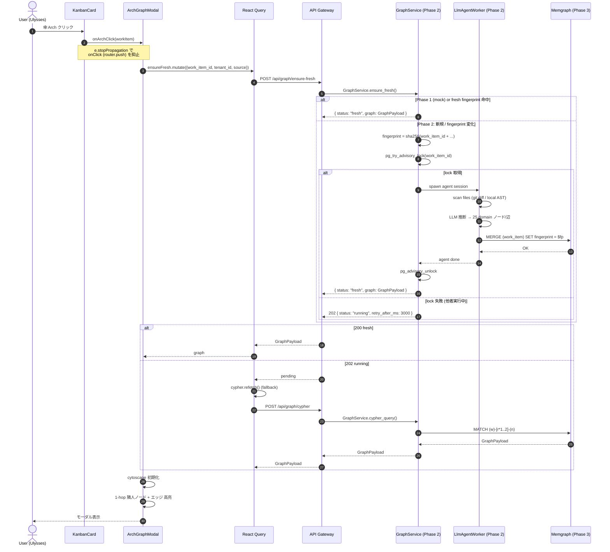
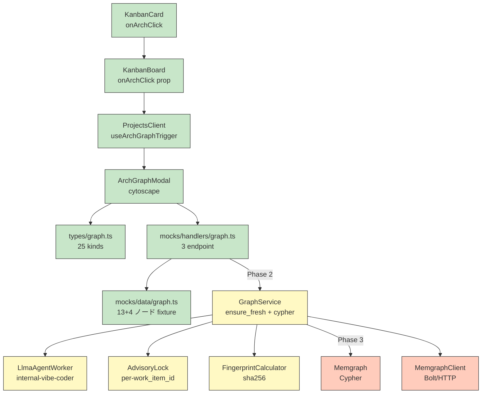

# arch-agent-graph-viewer 詳細設計 (Spec)

> **ドキュメントバージョン**: v0.1 (2026-09-02)
> **ステータス**: 🟢 Phase 1 完了 (フロントエンド契約 + MSW mock 実裝)
> **位置付け**: 詳細設計 (per 仓内惯例, agent-api/spec 配下)
> **一次出典**: [ADR-0041-arch-agent-graph-viewer v0.1](../../adr/0041-arch-agent-graph-viewer.md)
> **報告**: [ARCH-AGENT-GRAPH-001-REPORT v0.1](../../../reports/ARCH-AGENT-GRAPH-001-REPORT.md)
> **モジュール**: `domain-graph-agent` (Phase 2 新設, 22 domain 平行)
> **関連表**: [`graph.graph_node`](../../../data-design/ipa-detail/tables/graph_graph_node.md) (T-NEW) / [`graph.graph_edge`](../../../data-design/ipa-detail/tables/graph_graph_edge.md) (T-NEW) / [`graph.graph_fingerprint`](../../../data-design/ipa-detail/tables/graph_graph_fingerprint.md) (T-NEW)

> **dual-use 提醒 (per AGENTS.md §5 + 2026-08-31 22:45 JST Q1-D 拍板)**: 本 spec で扱う "25 domain 節点/辺" は Star 倉 22 `domain-*` crate DDD bounded context の投影, **RGS 5 域 (player/economy/match/social/admin) とは非対応**。5 域は RGS 倉歴史治理命名, 業務子域↔DDD マッピングは構築しない。

---

## §0 概要

### 0.1 目的

Kanban タスクカード (WorkItem) に対し, クリック 1 回で cypher 図 (25 domain 投影 + 1-hop 隣人) を表示し, 該当タスクがシステム全体のアーキテクチャのどこに位置するか把握できるようにする。

### 0.2 範囲

| # | 含む | 含まない |
|---|---|---|
| 1 | Kanban カードに 🕸 Arch ボタン追加 | IDE ジャンプ (Phase 2+) |
| 2 | ArchGraphModal (cytoscape.js 描画) | Symbol レベル詳細表示 (Phase 2+) |
| 3 | `POST /graph/ensure-fresh` (冪等+排他) | 実 memgraph 例 (Phase 3) |
| 4 | `POST /graph/cypher` (1-hop 問合せ) | ノード/辺手動編集 (Phase 2+) |
| 5 | `GET /graph/health` | export PNG/SVG/JSON (Phase 2+) |
| 6 | tenant_id 必帯 (per 13 類) | ノードクリック遷移 (Phase 2+) |
| 7 | 13 類 Multi-Tenant RLS | ノード lock-version 衝突検出 (Phase 2+) |

### 0.3 用語

| 用語 | 意味 |
|---|---|
| **work_item** | MRU 5 の中核, タスクカード 1 枚 |
| **fingerprint** | `sha256(work_item_id + worktree_branch + worktree_sha + source_kind + project_id)`, 冪等キー |
| **1-hop** | work_item と直接辺で結ばれた隣人ノード (11 類) |
| **2-hop code-side** | 1-hop の `cratemodule` / `symbol` から更に 1 跳び (コード側のみ) |
| **agent worker** | `crates/star-graph-agent/` (Phase 2), LLM で 25 domain ノード/辺を推断, memgraph に upsert |
| **advisory lock** | per-work_item_id 排他, 同一 work_item_id への並走 agent 起動を拒否 |

---

## §1 アーキテクチャ概要

### 1.1 3 層構造

```
┌─────────────────────────────────────────────────────────┐
│ Layer 1: Frontend (Next.js 14 + cytoscape.js)            │
│   - KanbanCard (🕸 Arch ボタン, e.stopPropagation)     │
│   - ArchGraphModal (modal 80vw×80vh)                    │
│   - types/graph.ts (TS 投影)                            │
│   - mocks/handlers/graph.ts (MSW 3 endpoint)            │
└─────────────────────────────────────────────────────────┘
                         ↓ HTTPS /api/graph/*
                         ↓ (Phase 1: MSW | Phase 2/3: real backend)
┌─────────────────────────────────────────────────────────┐
│ Layer 2: API Gateway (per ADR-0027 STAR IDE Gateway)    │
│   - /api/graph/ensure-fresh    POST                     │
│   - /api/graph/cypher          POST                     │
│   - /api/graph/health          GET                      │
│   - 13 類 tenant_id 必帯, JWT 検証                      │
└─────────────────────────────────────────────────────────┘
                         ↓ (Phase 2+: real call)
┌─────────────────────────────────────────────────────────┐
│ Layer 3: Backend (crates/star-graph-agent, Phase 2)     │
│   - GraphService.ensure_fresh()                         │
│   - GraphService.cypher_query()                         │
│   - LlmAgentWorker (internal-vibe-coder 復用)            │
│   - MemgraphClient (Bolt/HTTP, Phase 3)                 │
│   - FingerprintCalculator (sha256)                       │
│   - AdvisoryLock (per-work_item_id, 5min TTL)           │
└─────────────────────────────────────────────────────────┘
                         ↓ (Phase 3)
┌─────────────────────────────────────────────────────────┐
│ Storage: Memgraph (graph DB)                            │
│   - (:work_item {id, tenant_id, fingerprint, ...})      │
│   - (:worktree) (:agent_session) (:change_set) ...      │
│   - [:ASSIGNED_TO] [:IN_PROJECT] [:ON_WORKTREE] ...     │
│   - INDEX: (work_item_id, fingerprint)                  │
└─────────────────────────────────────────────────────────┘
```

### 1.2 データフロー (シーケンス図, 5 step)



### 1.3 コンポーネント図



---

## §2 API 契約 (3 endpoint)

> 共通ヘッダ: `Authorization: Bearer <jwt>` (per AGENTS.md §6.1 REQ-SEC-001 13 類)
> 共通レスポンス: `Content-Type: application/json; charset=utf-8`
> 共通エラーフォーマット: `{"error": "code", "message": "human readable"}` (per F-06 6 字段)

### 2.1 `POST /api/graph/ensure-fresh`

#### 2.1.1 リクエスト

```typescript
interface EnsureFreshRequest {
  work_item_id: Uuid;
  tenant_id: Uuid;     // 13 類必帯, per REQ-SEC-001
  source: "local" | "git";  // dataorigin_opt3, 2026-09-02 02:00 JST 拍板
}
```

| フィールド | 必須 | 制約 |
|---|---|---|
| `work_item_id` | ✓ | UUID v4, 既存 work_item に存在すること |
| `tenant_id` | ✓ | UUID v4, ActorContext.tenant_id と一致 |
| `source` | ✓ | enum: `"local"` \| `"git"` |

#### 2.1.2 レスポンス (200 OK) — データ最新

```typescript
interface EnsureFreshResponse {
  status: "fresh";
  graph: GraphPayload;
}
```

#### 2.1.3 レスポンス (202 Accepted) — Agent 実行中

```typescript
interface EnsureFreshPendingResponse {
  status: "running";
  retry_after_ms: number;  // 通常 3000ms
  phase?: "scanning" | "ast_extract" | "llm_infer" | "upsert" | "verify";
}
```

#### 2.1.4 エラーレスポンス (4xx/5xx)

| Status | error code | 条件 | 対処 |
|---|---|---|---|
| 400 | `invalid_payload` | body が EnsureFreshRequest 形不一致 | クライアント validation 修正 |
| 401 | `unauthenticated` | JWT 欠落/無効 | 再ログイン |
| 403 | `tenant_mismatch` | tenant_id ≠ ActorContext.tenant_id | 13 類 RLS 違反, 監査記録 |
| 404 | `work_item_not_found` | work_item_id 不存在 | work_item 削除済 or 別 tenant |
| 409 | `lock_unavailable` | advisory lock 取得失敗 + 5min 超 | フロント polling 延長 |
| 429 | `rate_limit_exceeded` | per-tenant 100 req/min 超 | バックオフ + jitter |
| 500 | `internal_error` | Memgraph 接続断 / agent crash | retry-after ヘッダ付与 |
| 503 | `agent_runtime_down` | LlmAgentWorker 生存確認失敗 | `GET /api/graph/health` で診断 |

#### 2.1.5 例 (curl)

```bash
curl -X POST https://api.star.local/api/graph/ensure-fresh \
  -H "Authorization: Bearer eyJ..." \
  -H "Content-Type: application/json" \
  -d '{
    "work_item_id": "wi-7c9e2f8a-1b4d-...",
    "tenant_id": "tenant-physis-corp",
    "source": "local"
  }'
```

### 2.2 `POST /api/graph/cypher`

#### 2.2.1 リクエスト

```typescript
interface GraphCypherRequest {
  work_item_id: Uuid;
  tenant_id: Uuid;
  max_hop: 1 | 2;  // 1 = 厳格 1-hop, 2 = 1-hop + コード側 2-hop
}
```

#### 2.2.2 レスポンス (200 OK)

```typescript
interface GraphCypherResponse extends GraphPayload {
  // GraphPayload 全フィールド + α
  // (frontend/src/types/graph.ts と一致)
}
```

#### 2.2.3 エラーレスポンス

| Status | error code | 条件 |
|---|---|---|
| 400 | `invalid_max_hop` | `max_hop` が 1 または 2 以外 |
| 401/403/404 | (同上) | (同上) |

#### 2.2.4 Cypher クエリ (実体, Phase 3 用)

```cypher
// 1-hop (max_hop=1)
MATCH (w:work_item {id: $work_item_id, tenant_id: $tenant_id})
OPTIONAL MATCH (w)-[r1]-(n1)
WHERE n1.tenant_id = $tenant_id  // 13 類 RLS
  AND (n1:work_item OR n1:identity OR n1:worktree OR n1:agent_session
       OR n1:change_set OR n1:scm_repository OR n1:pull_request
       OR n1:feedback OR n1:validation_case OR n1:comment
       OR n1:design_artifact OR n1:project OR n1:workspace
       OR n1:context_packet OR n1:permission_scheme OR n1:workflow)
RETURN w, collect(DISTINCT n1) AS nodes, collect(DISTINCT r1) AS edges

// 2-hop (max_hop=2): 上記 + コード側のみ 1 跳び追加
MATCH (w:work_item {id: $work_item_id, tenant_id: $tenant_id})
OPTIONAL MATCH (w)-[r1]-(n1)
WHERE n1.tenant_id = $tenant_id AND (... 1-hop フィルタ ...)
OPTIONAL MATCH (n1)-[r2]-(n2)
WHERE n2.tenant_id = $tenant_id
  AND (n2:cratemodule OR n2:symbol)
RETURN w, collect(DISTINCT n1) AS h1_nodes,
       collect(DISTINCT r1) AS h1_edges,
       collect(DISTINCT n2) AS h2_nodes,
       collect(DISTINCT r2) AS h2_edges
```

### 2.3 `GET /api/graph/health`

#### 2.3.1 レスポンス (200 OK)

```typescript
interface GraphHealthResponse {
  memgraph: "up" | "down";
  agent_runtime: "up" | "down";
  last_successful_run: Iso8601 | null;  // 最終 agent 成功時刻
  queue_depth: number;                  // 待機中 work_item_id 数
}
```

#### 2.3.2 エラーレスポンス

| Status | error code | 条件 |
|---|---|---|
| 503 | `service_degraded` | memgraph down OR agent_runtime down |

---

## §3 データモデル (DB 三類横展開, per 2026-09-01 18:30 JST 拍板)

> 倉内 100 表実續に做い, graph モジュールも **3 類 (Work / Transaction / Master) 必ず分離**。
> 詳細表設計: `docs/data-design/ipa-detail/tables/graph_*.md` (3 表 T-NEW)

### 3.1 3 表の類別

| 物理名 | 論理名 | 種別 | 分類根拠 | 主キー | RLS |
|---|---|---|---|---|---|
| `graph.graph_node` | グラフノード | **Master (M)** | 業務事実/参考/SCD Type 2 想定, 物理削除禁止 + 履歴保持 | `id UUID` | Yes (13 類) |
| `graph.graph_edge` | グラフエッジ | **Master (M)** | 同上, ノードに付随, SCD Type 2 | `id UUID` | Yes (13 類) |
| `graph.graph_fingerprint` | 指紋監査ログ | **Transaction (T)** | append-only, work_item 毎の冪等キー履歴, 物理削除禁止 | `id UUID` | Yes (13 類) |

> **Work 類なし**: 本モジュールは「短 TTL 作業中」データを保持しない (Phase 2 での agent session は `agent.agent_session` で扱う)。

### 3.2 `graph.graph_node` スキーマ概要

| # | 列 | 型 | NULL | デフォルト | 索引 | 説明 |
|---|---|---|---|---|---|---|
| 1 | `id` | UUID | NO | `gen_random_uuid()` | PK | 内部 ID (例 `WI:wi-7c9e2f8a-...`) |
| 2 | `tenant_id` | UUID | NO | − | idx (PT) | 13 類 RLS 必須 |
| 3 | `kind` | VARCHAR(32) | NO | − | idx (PT) | 25 domain kind union (work_item / worktree / ...) |
| 4 | `label` | VARCHAR(200) | NO | − | − | 表示用ラベル |
| 5 | `external_ref` | VARCHAR(200) | YES | `NULL` | UK (PT) | 業務 ID (e.g. work_item.key = "PHYSIS-123") |
| 6 | `properties` | JSONB | NO | `'{}'::jsonb` | − | 透過プロパティ (MRU フィールド) |
| 7 | `is_current` | BOOLEAN | NO | `FALSE` | − | (Phase 3) 現 hop 中心か (Modal 用) |
| 8 | `fingerprint` | VARCHAR(64) | NO | − | idx (PT) | 当該 work_item の fingerprint |
| 9 | `source` | VARCHAR(8) | NO | − | − | `"local"` \| `"git"` |
| 10 | `created_at` | TIMESTAMPTZ | NO | `NOW()` | − | SCD Type 2 開始 |
| 11 | `updated_at` | TIMESTAMPTZ | NO | `NOW()` | − | 自動更新 |
| 12 | `valid_from` | TIMESTAMPTZ | NO | `NOW()` | − | SCD Type 2 開始 |
| 13 | `valid_to` | TIMESTAMPTZ | YES | `NULL` | idx | SCD Type 2 終了 (`NULL` = 現有効) |
| 14 | `version` | INT | NO | `1` | − | 楽観ロック |

制約:
- `ck_graph_node_kind`: `kind IN ('work_item','worktree', ...)` 25 値
- `uq_graph_node_extref`: UNIQUE `(tenant_id, kind, external_ref, valid_from)` SCD UK
- `idx_graph_node_fp`: `(fingerprint)` partial `WHERE valid_to IS NULL`

### 3.3 `graph.graph_edge` スキーマ概要

| # | 列 | 型 | NULL | デフォルト | 索引 | 説明 |
|---|---|---|---|---|---|---|
| 1 | `id` | UUID | NO | `gen_random_uuid()` | PK | 内部 ID |
| 2 | `tenant_id` | UUID | NO | − | idx (PT) | 13 類 RLS 必須 |
| 3 | `kind` | VARCHAR(32) | NO | − | idx (PT) | 24 edge kind union (ASSIGNED_TO / IN_PROJECT / ...) |
| 4 | `source_id` | UUID | NO | − | idx (PT) | 始点ノード FK |
| 5 | `target_id` | UUID | NO | − | idx (PT) | 終点ノード FK |
| 6 | `hop_level` | SMALLINT | NO | `1` | − | 1 / 2 (Phase 3 コード側のみ 2) |
| 7 | `properties` | JSONB | NO | `'{}'::jsonb` | − | 透過プロパティ |
| 8 | `fingerprint` | VARCHAR(64) | NO | − | idx (PT) | 当該 work_item の fingerprint |
| 9 | `valid_from` | TIMESTAMPTZ | NO | `NOW()` | − | SCD Type 2 開始 |
| 10 | `valid_to` | TIMESTAMPTZ | YES | `NULL` | idx | SCD Type 2 終了 |
| 11 | `created_at` | TIMESTAMPTZ | NO | `NOW()` | − | 監査 |

制約:
- `ck_graph_edge_kind`: `kind IN ('ASSIGNED_TO', ...)` 24 値
- `ck_graph_edge_hop`: `hop_level IN (1, 2)`
- `fk_graph_edge_source`: `source_id REFERENCES graph.graph_node(id) ON DELETE RESTRICT`
- `fk_graph_edge_target`: `target_id REFERENCES graph.graph_node(id) ON DELETE RESTRICT`
- `uq_graph_edge_scd`: UNIQUE `(tenant_id, kind, source_id, target_id, valid_from)`

### 3.4 `graph.graph_fingerprint` スキーマ概要 (Transaction 類)

| # | 列 | 型 | NULL | デフォルト | 索引 | 説明 |
|---|---|---|---|---|---|---|
| 1 | `id` | UUID | NO | `gen_random_uuid()` | PK | 内部 ID |
| 2 | `tenant_id` | UUID | NO | − | idx (PT) | 13 類 RLS 必須 |
| 3 | `work_item_id` | UUID | NO | − | idx (PT) | 業務 work_item FK |
| 4 | `fingerprint` | VARCHAR(64) | NO | − | idx (PT) | sha256 ハッシュ |
| 5 | `worktree_branch` | VARCHAR(200) | YES | `NULL` | − | git branch (worktree なし時 NULL) |
| 6 | `worktree_sha` | VARCHAR(40) | YES | `NULL` | − | git commit SHA |
| 7 | `source` | VARCHAR(8) | NO | − | − | `"local"` \| `"git"` |
| 8 | `project_id` | UUID | NO | − | idx (PT) | プロジェクト FK |
| 9 | `agent_session_id` | UUID | YES | `NULL` | idx (PT) | 生成 agent session (Phase 2) |
| 10 | `phase` | VARCHAR(20) | NO | − | − | `scanning` / `ast_extract` / `llm_infer` / `upsert` / `verify` / `success` / `failed` |
| 11 | `started_at` | TIMESTAMPTZ | NO | `NOW()` | idx (PT) | agent 開始 |
| 12 | `ended_at` | TIMESTAMPTZ | YES | `NULL` | − | agent 終了 (NULL = 実行中) |
| 13 | `error_message` | TEXT | YES | `NULL` | − | 失敗時 (Phase 2) |
| 14 | `created_at` | TIMESTAMPTZ | NO | `NOW()` | − | 監査 (append-only) |

制約:
- `ck_graph_fp_phase`: `phase IN (...)` 7 値
- `ck_graph_fp_source`: `source IN ('local', 'git')`
- `idx_graph_fp_uniq`: UNIQUE `(work_item_id, fingerprint, started_at)` (同一 work_item で重複 fingerprint は別行で時刻区別)

### 3.5 13 類 RLS ポリシー (per REQ-SEC-001)

```sql
-- 3 表共通
ALTER TABLE graph.graph_node ENABLE ROW LEVEL SECURITY;
ALTER TABLE graph.graph_node FORCE ROW LEVEL SECURITY;
CREATE POLICY rls_graph_node_tenant ON graph.graph_node
  USING (tenant_id = current_setting('app.tenant_id')::UUID);

ALTER TABLE graph.graph_edge ENABLE ROW LEVEL SECURITY;
ALTER TABLE graph.graph_edge FORCE ROW LEVEL SECURITY;
CREATE POLICY rls_graph_edge_tenant ON graph.graph_edge
  USING (tenant_id = current_setting('app.tenant_id')::UUID);

ALTER TABLE graph.graph_fingerprint ENABLE ROW LEVEL SECURITY;
ALTER TABLE graph.graph_fingerprint FORCE ROW LEVEL SECURITY;
CREATE POLICY rls_graph_fingerprint_tenant ON graph.graph_fingerprint
  USING (tenant_id = current_setting('app.tenant_id')::UUID);
```

> 注: Memgraph は別途 Bolt レベルでマルチテナント制御, RLS は DB 同期時の補助 (Phase 3 で設計)

### 3.6 DB 三類横展開チェック (per 守門 #13)

| 項目 | 該当 | チェック |
|---|---|---|
| Work (短 TTL) | ❌ なし | agent 短 TTL は `agent.agent_session` で扱う, 物理削除 + タイマー失効 |
| Transaction (append-only) | ✅ `graph_fingerprint` | 物理削除禁止 + 監査必須 + RLS 13 類必携 |
| Master (SCD Type 2) | ✅ `graph_node` / `graph_edge` | 物理削除禁止 + SCD Type 2 + RLS 13 類必携 |

---

## §4 インターフェース契約 (Rust Trait, Phase 2)

```rust
// crates/star-graph-agent/src/port.rs
use async_trait::async_trait;
use uuid::Uuid;
use chrono::{DateTime, Utc};

#[derive(Debug, Clone)]
pub enum GraphSourceKind { Local, Git }

#[derive(Debug, Clone)]
pub struct EnsureFreshRequest {
    pub work_item_id: Uuid,
    pub tenant_id: Uuid,
    pub source: GraphSourceKind,
}

#[derive(Debug, Clone)]
pub enum EnsureFreshResult {
    Fresh(GraphPayload),
    Running { retry_after_ms: u64, phase: String },
}

#[derive(Debug, Clone)]
pub struct GraphCypherRequest {
    pub work_item_id: Uuid,
    pub tenant_id: Uuid,
    pub max_hop: u8,  // 1 | 2
}

#[async_trait]
pub trait GraphServicePort: Send + Sync {
    /// 冪等+排他: fingerprint 一致で skip, advisory lock で排他
    async fn ensure_fresh(&self, req: EnsureFreshRequest) -> Result<EnsureFreshResult, GraphError>;
    /// 1-hop 問合せ (Phase 3 で実 memgraph)
    async fn cypher_query(&self, req: GraphCypherRequest) -> Result<GraphPayload, GraphError>;
    /// 健全性
    async fn health(&self) -> Result<GraphHealth, GraphError>;
}

#[async_trait]
pub trait LlmAgentWorkerPort: Send + Sync {
    /// 1 work_item 分の graph ノード/辺 を推断 + memgraph 書込
    /// 失敗時 advisory lock は自動解放
    async fn run_graph_build(
        &self,
        work_item_id: Uuid,
        tenant_id: Uuid,
        fingerprint: String,
    ) -> Result<(), AgentError>;
}

#[async_trait]
pub trait AdvisoryLockPort: Send + Sync {
    /// per-work_item_id 排他 lock (5min TTL)
    async fn try_acquire(&self, work_item_id: Uuid) -> Result<LockGuard, LockError>;
}

pub struct LockGuard { /* Drop で自動解放 */ }

#[derive(thiserror::Error, Debug)]
pub enum GraphError {
    #[error("work item {0} not found")]
    WorkItemNotFound(Uuid),
    #[error("tenant mismatch: {0}")]
    TenantMismatch(Uuid),
    #[error("lock unavailable for {0}, retry in {1}ms")]
    LockUnavailable(Uuid, u64),
    #[error("memgraph down: {0}")]
    MemgraphDown(String),
    #[error("agent runtime down: {0}")]
    AgentRuntimeDown(String),
    #[error("rate limit exceeded for tenant {0}")]
    RateLimitExceeded(Uuid),
    #[error("internal: {0}")]
    Internal(String),
}
```

---

## §5 冪等性・排他性 設計 (Phase 2)

### 5.1 冪等性 (idempotency)

| 層 | 仕組み | 効果 |
|---|---|---|
| L1 クライアント | React Query `staleTime: 30_000` | 30s 以内重複 fetch skip |
| L2 バックエンド | `fingerprint = sha256(work_item_id + worktree_branch + worktree_sha + source + project_id)` | コード未変 = skip agent |
| L3 DB | `MERGE ... ON MATCH SET ... ON CREATE SET ...` (Cypher) | 既存ノード上書き, 新規作成 |
| L4 監査 | `graph_fingerprint` 履歴 append-only | 同 fingerprint でも実行時刻別行で記録 |
| L5 LLM | `temperature=0`, `top_p=0.1`, `seed=work_item_id.hash()` | LLM 出力 deterministic |

### 5.2 排他性 (mutex)

| 層 | 仕組み | TTL |
|---|---|---|
| L1 advisory lock | `pg_try_advisory_xact_lock(work_item_id_hash)` (Postgres) | 5 分 |
| L2 Redis 補完 | `SETNX graph:lock:{work_item_id} 1 EX 300` (任意) | 5 分 |
| L3 in-process coalesce | `pending[work_item_id] = oneshot::Receiver` | - |
| L4 失敗時 | lock 自動解放 (advisory_xact は transaction end, SETNX は EX) | - |
| L5 agent 状態 | `agent_session` 14 状態機で `failed/cancelled` 時即解放 | - |

### 5.3 失敗時フロー

```text
[User クリック]
     ↓
[Phase 2: ensure_fresh]
     ├─ fingerprint 計算
     ├─ 履歴チェック → 同 fp 存在 → 即 return
     ├─ advisory lock 取得試行
     │   ├─ 取得 OK → agent spawn
     │   └─ 取得 NG → 202 running + retry_after
     ├─ agent 実行
     │   ├─ 成功 → fingerprint fresh 化 + graph payload
     │   └─ 失敗 → 失敗記録 + lock 解放 → 500
     └─ lock TTL 5 分
```

---

## §6 性能目標 (per STAR-NFR)

| 指標 | 目標 | 備考 |
|---|---|---|
| `POST /ensure-fresh` レイテンシ (P50) | < 200ms | fingerprint 命中時 |
| `POST /ensure-fresh` レイテンシ (P95) | < 1s | fingerprint 命中時 |
| `POST /ensure-fresh` レイテンシ (P99) | < 5s | agent 起動含む |
| `POST /cypher` レイテンシ (P95) | < 500ms | 1-hop, 13 ノード程度 |
| `GET /health` レイテンシ (P95) | < 100ms | Memgraph ping + agent ping |
| agent 実行時間 (P50) | < 10s | local scan + AST + LLM infer + upsert |
| agent 実行時間 (P95) | < 60s | 大規模 repo (1000 files) |
| 同時実行 work_item 数 | 100 | per tenant |
| 1 tenant 1 分あたり req 上限 | 100 | rate limit |
| memgraph ノード数 (1 tenant) | < 100K | 業務上の上限想定 |
| memgraph エッジ数 (1 tenant) | < 1M | 業務上の上限想定 |
| frontend modal 起動時間 | < 1s | Phase 1 計測 |
| frontend cytoscape 描画時間 | < 500ms | 13 ノード + 13 エッジ |

---

## §7 セキュリティ (per AGENTS.md §4 守門 #5, #9, #10)

| 観点 | 対策 |
|---|---|
| **テナント分離** | 13 類 tenant_id 必帯, RLS 13 類ポリシー強制, JWT 検証 |
| **権限** | 業務権限 (per REQ-PERM-001) は `domain-permission` 経由, 本モジュールは `read:graph` を要件 |
| **Secret** | LLM API key は `agent.credential_broker` (Phase 2), エージェント本体に渡さず, 呼び出し時のみ broker が header 注入 |
| **LLM prompt injection** | 入力は git diff + local AST, ユーザ入力を LLM 直接渡さない, system prompt 固定 |
| **監査** | `graph_fingerprint` append-only, agent 実行全記録, per REQ-AUDIT-002 17 問遵守 |
| **データ保持** | ノード/辺 SCD Type 2 (履歴保持), fingerprint ログは 90 日 TTL (per AI Content Retention Policy 6.8) |
| **公開エンドポイント** | なし, 内部 API のみ, 外部公開は Phase 3+ で再評価 |
| **PII** | ノード properties に PII 含めない (work_item key/label のみ), identity.email は含めない (display_name のみ) |

---

## §8 テスト戦略

### 8.1 単体テスト (vitest, Phase 1 完了)

| テストファイル | 検証内容 | 件数 |
|---|---|---|
| `KanbanCard.test.tsx` | 4 テスト: dragstart + dragging + arch ボタン表示 + クリック stopPropagation | 4 |
| `mocks/__tests__/graph.test.ts` | 6 テスト: handler 登録 + fixture 完全性 + orphan edge 検出 | 6 |
| `mocks/__tests__/handlers-5d.test.ts` (既存) | 13 テスト (本モジュール変更なし, regression 確認) | 13 |

### 8.2 統合テスト (Phase 2)

- `crates/star-graph-agent` 単体テスト: advisory lock + fingerprint + LLM mock
- `crates/star-graph-agent` 統合テスト: ensure_fresh E2E (Postgres + Memgraph 実体)
- API 契約テスト: `POST /ensure-fresh` 全 status (200/202/400/401/403/404/409/429/500/503)

### 8.3 E2E テスト (Playwright, Phase 2)

- Kanban カードで 🕸 Arch クリック → modal 弾起 → cytoscape 描画 → 1-hop 高亮確認
- 背景 click で modal 閉じる
- Esc で modal 閉じる
- refresh ボタンで再 fetch

### 8.4 性能テスト (k6, Phase 3)

- `POST /ensure-fresh` P95 < 1s (fingerprint 命中)
- `POST /cypher` P95 < 500ms
- 同時 100 work_item アクセスで lock 競合率 < 1%

---

## §9 既知の缺口 (per 缺标比错标, 守門 #11)

| # | 缺口 | Phase 計画 |
|---|---|---|
| 1 | 実 memgraph 例未配備 | Phase 3 Bolt/HTTP client + 25 domain schema |
| 2 | LLM worker 未実装 | Phase 2 `crates/star-graph-agent/` |
| 3 | 冪等 advisory lock 未実装 | Phase 2 |
| 4 | ノード click 遷移先未実装 | Phase 2+ (IDE ジャンプ) |
| 5 | export PNG / SVG / JSON なし | Phase 2+ |
| 6 | cytoscape-cose-bilkent d.ts 公式未提供 | 自作 `cytoscape-ext.d.ts` 兜底 |
| 7 | Symbol 詳細 (file/line/snippet) 未表示 | Phase 2+ |
| 8 | Playwright 冒煙未実行 | Phase 2 |
| 9 | Agent 14 状態機との正式統合未実装 | Phase 2 |
| 10 | Worktree 状態変化 webhook 自動再生成未実装 | Phase 3+ |

---

## §10 改訂履歴

| バージョン | 日付 | 改訂人 | 改訂内容 | トリガ |
|---|---|---|---|---|
| v0.1 | 2026-09-02 | 架构师 (Mavis 接手 agent per DEC-008) — Mavis 接手代签 | 初版: 3 endpoint API 契約 / 3 表 DB 三類横展開 / 11 段詳細 / 序列図 / 性能目標 / 既知缺口 10 項 | 2026-09-02 00:33/00:36/02:00 JST Ulysses 7 輪拍板 (需求和基本设计 + 詳細设计 補完要求, 2026-09-02 02:10 JST) |

---

*本 spec は実装フェーズ (Phase 2/3) の起点であり, 段階的に更新する。*
