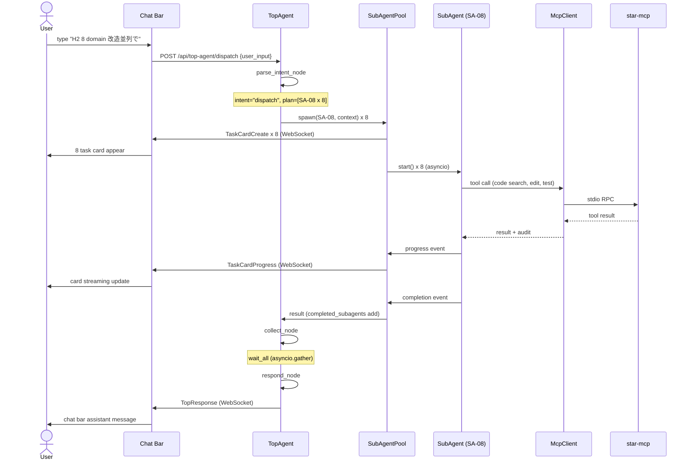
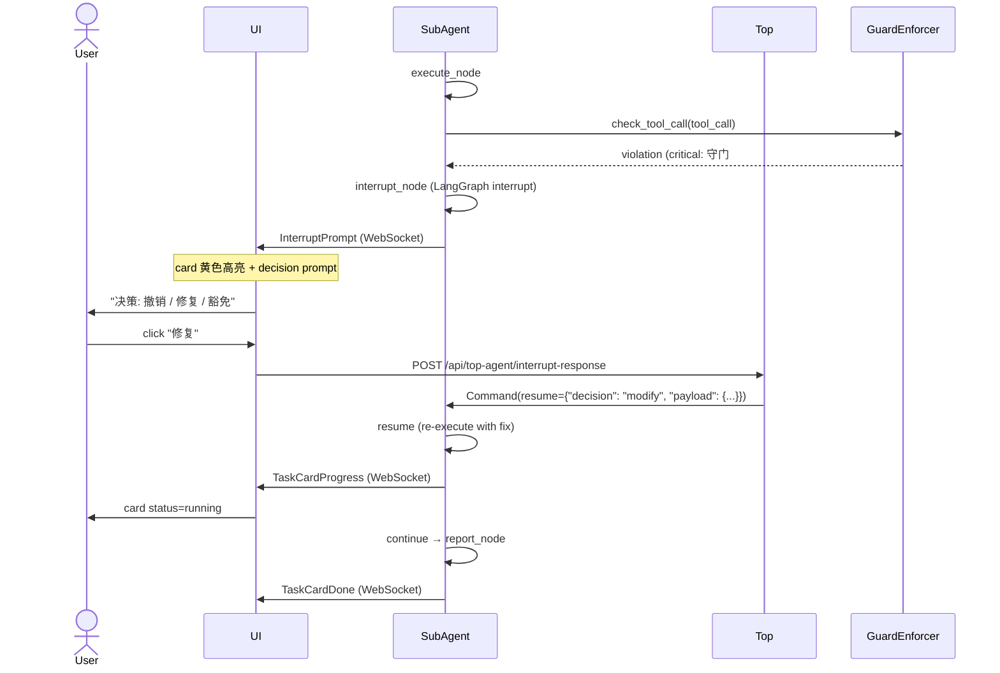
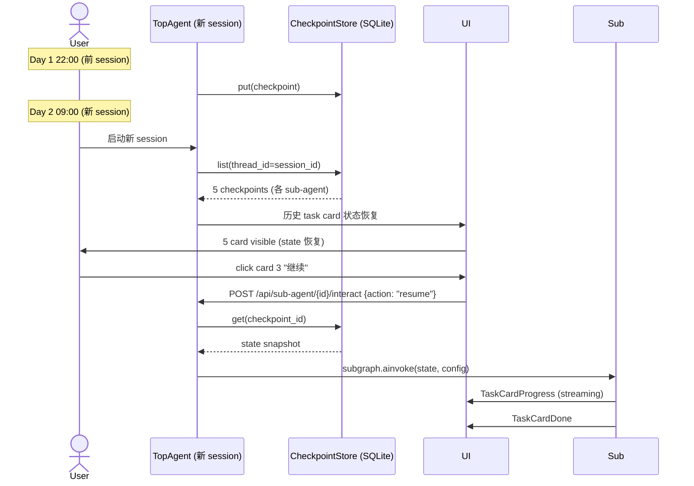
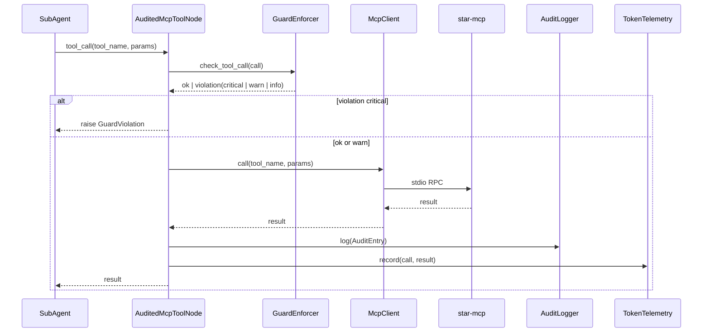

# 03. Star LangGraph 統合アーキテクチャ - 詳細設計書 (Detailed Design)

> **状態**：🟢 Draft v0.2
> **日期**：2026-09-04 (升版自 v0.1)
> **制定者**：Ulysses（一人公司 12 角色 per DEC-008）— Mavis 接手
> **签批**：🟢 Mavis 接手终审（per 2026-08-27 19:39 + 21:59 JST 用户授权）
> **依赖**：[01-requirements.md](01-requirements.md)（要件定義書 v0.2）· [02-basic-design.md](02-basic-design.md)（基本設計書 v0.2）· [ADR-0030](https://github.com/UlyssesLeoLee/Star/blob/main/docs/architecture/2026-08-26-upgrade/adr/0030-agent-lease-heartbeat-resume.md) · [ADR-0032](https://github.com/UlyssesLeoLee/Star/blob/main/docs/architecture/2026-08-26-upgrade/adr/0032-mcp-transport-stdio.md) · [ADR-0046 LangGraph TMO 任务卡管理操作](https://github.com/UlyssesLeoLee/Star/blob/main/docs/architecture/2026-08-26-upgrade/adr/0046-langgraph-task-management-operations.md) · [AGENTS.md](https://github.com/UlyssesLeoLee/Star/blob/main/AGENTS.md)
> **关联文档**：[01-requirements.md](01-requirements.md)（要件定義書 v0.2）· [02-basic-design.md](02-basic-design.md)（基本設計書 v0.2）· [PHASE-LANGGRAPH-TMO-IMPL-REPORT.md](../../reports/PHASE-LANGGRAPH-TMO-IMPL-REPORT.md)（7 子项实装计划）

> **本 view 范围** (per [01 §1.0](01-requirements.md)): 本詳細設計書涵盖的是 **任务卡子代理 (Sub-Agent)** 系统的 LangGraph 状態機 / 节点 / 边 / reducer / シーケンス図 / 状態遷移 / 永続化 / テスト設計。**不涵盖** 现有 Mavis worker subagent (worker/explorer/verifier, `dispatcher.py` + brief 派发) 系统 — 那是另一套独立 sub-agent 系统, per [01 §1.0](01-requirements.md) 区别表。

---

## 0. 目的 (Purpose)

本文档基于 [02-basic-design.md](02-basic-design.md) 的 15 component / 9 sub-agent 类型 / 3-tier checkpoint 设计，落地为実装レベル詳細設計：

- 模块设计 (M-01..M-12 责任/接口)
- 类设计 (TopAgent / SubAgentHandle / CheckpointStore 等)
- LangGraph 详细 (各 node / edge / reducer 実装)
- シーケンス図 (UC-01..UC-08)
- 状態遷移図 (Top / Sub / Task Card)
- エラー処理設計
- データ永続化形式
- テスト設計

## 1. モジュール設計 (Module Design)

### 1.1 モジュール構成図 (Module Structure)

```
star-lg/                              # 新規 crate (per 守门 #6 PowerShell only 派生, 全 Python)
├── __init__.py
├── pyproject.toml                    # uv + hatchling build
├── README.md
│
├── top_agent/                        # L0 全体代理
│   ├── __init__.py
│   ├── graph.py                      # TopAgent StateGraph definition
│   ├── nodes.py                      # T-N1..T-N7 implementations
│   ├── edges.py                      # route_after_* 条件分岐
│   ├── state.py                      # TopAgentState TypedDict
│   ├── parser.py                     # parse_intent (LLM call)
│   ├── dispatcher.py                 # dispatch → SubAgentPool
│   ├── collector.py                  # collect → asyncio.gather
│   ├── responder.py                  # respond (LLM final answer)
│   └── interrupt_handler.py          # top-level interrupt / resume
│
├── sub_agent/                        # L1 任务卡子代理
│   ├── __init__.py
│   ├── pool.py                       # SubAgentPool (spawn / lifecycle)
│   ├── base.py                       # 共通 5 节点 模板 (init/plan/execute/verify/report)
│   ├── handle.py                     # SubAgentHandle (in-process)
│   ├── state.py                      # SubAgentState TypedDict
│   ├── types/
│   │   ├── __init__.py
│   │   ├── sa_01_code_review.py      # SA-01: code-review subgraph
│   │   ├── sa_02_test_gen.py         # SA-02: test-gen subgraph
│   │   ├── sa_03_5domain_audit.py    # SA-03: 5-域-lead-audit subgraph
│   │   ├── sa_04_git_ops.py          # SA-04: git-ops subgraph
│   │   ├── sa_05_doc_sync.py         # SA-05: doc-sync subgraph
│   │   ├── sa_06_refactor.py         # SA-06: refactor subgraph
│   │   ├── sa_07_db_migration.py     # SA-07: db-migration subgraph
│   │   ├── sa_08_domain_dev.py       # SA-08: domain-dev subgraph
│   │   ├── sa_09_free_form.py        # SA-09: free-form fallback
│   │   └── sa_10_task_orchestrator.py # SA-10: task-orchestrator (v0.2 TMO 跨任务编排型, NEW)
│   └── registry.py                   # SubAgentRegistry (类型 → 実装 mapping)
│
├── checkpoints/                      # 3-tier checkpoint store
│   ├── __init__.py
│   ├── store.py                      # CheckpointStore ABC
│   ├── memory.py                     # MemoryCheckpointer (Tier 1)
│   ├── sqlite.py                     # SqliteCheckpointer (Tier 2)
│   └── postgres.py                   # PostgresCheckpointer (Tier 3, v0.2)
│
├── mcp/                              # MCP 統合
│   ├── __init__.py
│   ├── client.py                     # McpClient (star-mcp proxy)
│   ├── audited_tool_node.py          # AuditedMcpToolNode (audit + guard)
│   └── tool_metadata.py              # 16 tools metadata
│
├── ui/                               # UI bridge
│   ├── __init__.py
│   ├── streamer.py                   # UIStreamer (WebSocket / SSE)
│   ├── task_card_manager.py          # TaskCardManager
│   ├── chat_bar.py                   # ChatBar 消息类型
│   └── messages.py                   # WS / SSE message schemas
│
├── task_ops/                         # v0.2 TMO Task Management Operations (NEW, per 02 §2.6)
│   ├── __init__.py
│   ├── manager.py                    # TaskOperationsManager (C-16) 7 节点集中调度
│   ├── relationship_graph.py         # TaskRelationshipGraph (C-17) DAG + cycle prevention
│   ├── bulk_queue.py                 # BulkOperationQueue (C-18) asyncio.gather 协调
│   ├── metadata_registry.py          # MetadataRegistry (C-19) task_metadata 表中央管理
│   ├── dag_validator.py              # DAGValidator (C-20) cycle detection O(V+E)
│   ├── reassign_manager.py           # ReassignManager (C-21) SA-XX 切换 + checkpoint preserved
│   ├── summarize_collector.py        # SummarizeCollector (C-22) 跨 N SubAgentState 聚合
│   ├── nodes/
│   │   ├── __init__.py
│   │   ├── merge_node.py             # M-N1: merge a+b → merged_task
│   │   ├── split_node.py             # M-N2: split a → a1 + a2
│   │   ├── reorder_node.py           # M-N3: dep_set DAG 边更新
│   │   ├── bulk_node.py              # M-N4: N 张卡批量 action
│   │   ├── summarize_node.py         # M-N5: 跨任务汇总
│   │   ├── reassign_node.py          # M-N6: 类型 SA-XX 切换
│   │   └── metadata_node.py          # M-N7: task_metadata 更新
│   └── protocols.py                  # 7 协议 (merge_request / split_request / dep_set / ...) TypedDict
│
├── cross_cutting/                    # 横切关注点
│   ├── __init__.py
│   ├── audit_logger.py               # AuditLogger
│   ├── token_telemetry.py            # TokenTelemetry
│   ├── guard_enforcer.py             # GuardEnforcer (AGENTS.md §4)
│   ├── interrupt_manager.py          # InterruptManager
│   └── health.py                     # HealthCheck endpoint
│
├── api/                              # HTTP/WS 路由
│   ├── __init__.py
│   ├── app.py                        # FastAPI app
│   ├── routes_top_agent.py           # /api/top-agent/*
│   ├── routes_sub_agent.py           # /api/sub-agent/*
│   ├── routes_tasks.py               # /api/tasks/*
│   └── routes_health.py              # /api/health, /api/metrics
│
├── schema/                           # State schema versioning
│   ├── __init__.py
│   ├── v1.py                         # state_schema_v1
│   ├── migration.py                  # upgrade between versions
│   └── registry.py                   # StateSchemaRegistry
│
└── tests/                            # テスト
    ├── unit/
    │   ├── test_top_agent_nodes.py
    │   ├── test_sub_agent_base.py
    │   ├── test_checkpoint_store.py
    │   ├── test_guard_enforcer.py
    │   └── test_audit_logger.py
    ├── integration/
    │   ├── test_dispatch_collect.py
    │   ├── test_interrupt_resume.py
    │   ├── test_cross_session_resume.py
    │   └── test_mcp_audit_guard.py
    └── e2e/
        ├── test_uc01_dispatch.py
        ├── test_uc04_human_in_loop.py
        ├── test_uc06_cross_session.py
        └── test_uc08_5domain_audit.py
```

### 1.2 モジュール責務 (Module Responsibilities)

| ID | 名称 | 責務 | 公開 interface | 依存 |
|---|---|---|---|---|
| **M-01** | `top_agent.graph` | TopAgent StateGraph 定義 + compile | `TopAgent` class | sub_agent.pool, checkpoints, mcp |
| **M-02** | `top_agent.nodes` | T-N1..T-N7 実装 | `parse_intent_node`, `dispatch_node`, ... | mcp.client, sub_agent.pool, llm |
| **M-03** | `top_agent.state` | TopAgentState TypedDict | `TopAgentState` | — |
| **M-04** | `sub_agent.pool` | sub-agent spawn / lifecycle | `SubAgentPool.spawn()`, `.cancel()` | sub_agent.handle, sub_agent.registry |
| **M-05** | `sub_agent.base` | 共通 5 节点 模板 | `make_subagent_graph(task_type)` | sub_agent.state, mcp.audited_tool_node |
| **M-06** | `sub_agent.types` | SA-01..SA-09 実装 | `SA_01_CODE_REVIEW`, `SA_02_TEST_GEN`, ... | sub_agent.base |
| **M-07** | `sub_agent.registry` | sub-agent 类型 → 実装 mapping | `register(type, factory)`, `get(type)` | sub_agent.types |
| **M-08** | `checkpoints.store` | 3-tier ABC | `CheckpointStore` (abstract) | — |
| **M-09** | `checkpoints.sqlite` | Tier 2 実装 (default v0.1) | `SqliteCheckpointer` | checkpoints.store |
| **M-10** | `mcp.client` | star-mcp 16 tools proxy | `McpClient.call(tool, params)` | mcp tool metadata |
| **M-11** | `mcp.audited_tool_node` | audit + guard 統合 ToolNode | `AuditedMcpToolNode` | cross_cutting.audit_logger, cross_cutting.guard_enforcer, mcp.client |
| **M-12** | `ui.streamer` | WebSocket / SSE 推送 | `UIStreamer.push(msg)`, `.subscribe(ws)` | — |
| **M-13** | `cross_cutting.audit_logger` | 全 tool call 記録 | `AuditLogger.log(entry)` | db (per 守门 #13 T) |
| **M-14** | `cross_cutting.token_telemetry` | token 計量 | `TokenTelemetry.record(call, result)` | — |
| **M-15** | `cross_cutting.guard_enforcer` | AGENTS.md §4 守门 13 main + 24 派生规 = 37 项 自动检查 | `GuardEnforcer.check_tool_call(call)` | — |
| **M-16** | `cross_cutting.interrupt_manager` | human-in-loop interrupt / resume | `InterruptManager.interrupt(id, ...)`, `.resume(id, response)` | — |
| **M-17** | `api.app` | FastAPI app + 路由 mount | `create_app()` | api.routes_* |
| **M-18** | `schema.registry` | State schema 中央管理 | `StateSchemaRegistry.register(version, schema)`, `.migrate(state, from_ver, to_ver)` | schema.v1, schema.migration |
| **M-19** | `task_ops.manager` | v0.2 TMO 7 节点 (M-N1..M-N7) 集中调度, 唯一 cross-task actor | `TaskOperationsManager.merge/split/reorder/bulk/summarize/reassign/metadata()` | sub_agent.pool, task_ops.relationship_graph, sub_agent.registry |
| **M-20** | `task_ops.relationship_graph` | v0.2 任务卡 DAG (parent/merged_from/split_into/superseded_by 4 字段), cycle prevention | `TaskRelationshipGraph.add_edge/set/get/has_cycle()` | — |
| **M-21** | `task_ops.bulk_queue` | v0.2 批量操作队列 + asyncio.gather 协调, 部分失败回滚 | `BulkOperationQueue.enqueue(action)`, `.flush()` | sub_agent.pool, task_ops.manager |
| **M-22** | `task_ops.dag_validator` | v0.2 cycle detection O(V+E), 检测到环 → reject + interrupt | `DAGValidator.validate(relationships)` | task_ops.relationship_graph |
| **M-23** | `task_ops.metadata_registry` | v0.2 task_metadata 表中央管理 (Master RLS 必携 per 守门 #13 c) | `MetadataRegistry.update(task_id, metadata)`, `.get(task_id)` | db (守门 #13 M 表) |
| **M-24** | `task_ops.reassign_manager` | v0.2 SA-XX 类型切换 + checkpoint preserved | `ReassignManager.reassign(task_id, new_type)` | sub_agent.pool, sub_agent.registry, checkpoints.store |
| **M-25** | `task_ops.summarize_collector` | v0.2 跨 N SubAgentState 聚合, LLM 表格化 | `SummarizeCollector.collect(task_ids)`, `.llm_summarize(snapshots)` | sub_agent.pool, llm |

## 2. クラス設計 (Class Design)

### 2.1 主要 クラス図 (Class Diagram, 简化)

```
┌─────────────────────────────────────────────────────────────────────┐
│                          TopAgent                                   │
│  - state: TopAgentState                                              │
│  - graph: CompiledStateGraph                                         │
│  - sub_pool: SubAgentPool                                            │
│  - checkpoint: CheckpointStore                                       │
│  - ui_streamer: UIStreamer                                           │
│  + invoke(input: str) -> AsyncIterator[Event]                        │
│  + stream(input: str) -> AsyncIterator[StreamEvent]                  │
│  + cancel_all() -> int                                               │
│  + get_state() -> TopAgentState                                      │
└─────────────────────────────────────────────────────────────────────┘
                                  │ has-a
                                  ▼
┌─────────────────────────────────────────────────────────────────────┐
│                        SubAgentPool                                 │
│  - _pools: dict[str, SubAgentHandle]                                 │
│  - _registry: SubAgentRegistry                                       │
│  - _dispatch_queue: asyncio.Queue                                    │
│  + spawn(type: str, context: dict) -> SubAgentHandle                 │
│  + cancel(task_id: str) -> bool                                      │
│  + get(task_id: str) -> SubAgentHandle                               │
│  + list_active() -> list[SubAgentRef]                                │
│  + wait_all() -> list[SubAgentResult]                                │
└─────────────────────────────────────────────────────────────────────┘
                                  │ has-many
                                  ▼
┌─────────────────────────────────────────────────────────────────────┐
│                     SubAgentHandle                                  │
│  - task_id: str                                                      │
│  - type: str                                                         │
│  - state: SubAgentState                                              │
│  - graph: CompiledStateGraph (subgraph)                              │
│  - completion_event: asyncio.Event                                  │
│  - on_progress: Callable                                             │
│  + start() -> None                                                   │
│  + cancel(reason: str) -> bool                                       │
│  + get_state() -> SubAgentState                                      │
│  + send_interrupt_response(decision: dict) -> None                   │
└─────────────────────────────────────────────────────────────────────┘
                                  │ uses
                                  ▼
┌─────────────────────────────────────────────────────────────────────┐
│                CheckpointStore (ABC)                                │
│  + get(thread_id, checkpoint_id) -> Optional[Checkpoint]             │
│  + put(thread_id, checkpoint) -> str                                 │
│  + list(thread_id) -> list[Checkpoint]                               │
│  + delete(thread_id, checkpoint_id) -> bool                           │
└─────────────────────────────────────────────────────────────────────┘
            ▲                       ▲                       ▲
            │                       │                       │
┌───────────┴──────────┐ ┌──────────┴──────────┐ ┌──────────┴──────────┐
│ MemoryCheckpointer   │ │ SqliteCheckpointer  │ │PostgresCheckpointer │
│ (Tier 1)             │ │ (Tier 2, v0.1)      │ │ (Tier 3, v0.2)      │
└──────────────────────┘ └─────────────────────┘ └─────────────────────┘
```

### 2.2 主要 class 詳細

#### 2.2.1 TopAgent

```python
# top_agent/graph.py
from langgraph.graph import StateGraph, START, END
from langgraph.checkpoint.base import Checkpoint  # 实际路径, 2026-09-03 時点

class TopAgent:
    """全体代理 L0 (singleton per session)"""
    
    def __init__(
        self,
        session_id: str,
        sub_pool: SubAgentPool,
        checkpoint_store: CheckpointStore,
        ui_streamer: UIStreamer,
        mcp_client: McpClient,
        guard_enforcer: GuardEnforcer,
        token_telemetry: TokenTelemetry,
    ):
        self.session_id = session_id
        self.sub_pool = sub_pool
        self.checkpoint_store = checkpoint_store
        self.ui_streamer = ui_streamer
        self.mcp_client = mcp_client
        self.guard_enforcer = guard_enforcer
        self.token_telemetry = token_telemetry
        
        # StateGraph 構築
        self.graph = self._build_graph()
    
    def _build_graph(self) -> CompiledStateGraph:
        builder = StateGraph(TopAgentState)
        
        # ノード追加
        builder.add_node("parse_intent", self.parse_intent_node)
        builder.add_node("dispatch", self.dispatch_node)
        builder.add_node("tool_node", self.tool_node)
        builder.add_node("collect", self.collect_node)
        builder.add_node("respond", self.respond_node)
        builder.add_node("interrupt", self.interrupt_node)
        builder.add_node("guard_check", self.guard_check_node)
        
        # エッジ
        builder.add_edge(START, "parse_intent")
        builder.add_conditional_edges(
            "parse_intent",
            self.route_after_parse_intent,
            {
                "tool_call": "tool_node",
                "dispatch": "dispatch",
                "clarify": "interrupt",
                "respond": "respond",  # 直接回答 (no further work)
            },
        )
        builder.add_edge("tool_node", "respond")
        builder.add_conditional_edges(
            "dispatch",
            self.route_after_dispatch,
            {"wait": END, "collect": "collect"},  # END = wait for sub-agents via streaming
        )
        builder.add_conditional_edges(
            "collect",
            self.route_after_collect,
            {"respond": "respond", "interrupt": "interrupt"},
        )
        builder.add_conditional_edges(
            "guard_check",
            self.route_after_guard,
            {"ok": "respond", "violation": "interrupt"},
        )
        builder.add_edge("respond", END)
        builder.add_edge("interrupt", END)
        
        # checkpointer
        checkpointer = SqliteCheckpointer.from_conn_string(
            f"~/.star/langgraph/top-{self.session_id}.db"
        )
        
        return builder.compile(
            checkpointer=checkpointer,
            interrupt_before=["interrupt"],
        )
    
    async def stream(self, user_input: str) -> AsyncIterator[StreamEvent]:
        """user input → streaming events"""
        config = {"configurable": {"thread_id": self.session_id}}
        async for event in self.graph.astream(
            {"user_input": user_input},
            config=config,
            stream_mode=["values", "updates", "events"],
        ):
            # event to UIStreamer
            await self.ui_streamer.push_event(event)
            yield event
    
    async def cancel_all(self) -> int:
        """cancel all active sub-agents"""
        active = self.sub_pool.list_active()
        for ref in active:
            await self.sub_pool.cancel(ref.task_id, reason="user_cancelled")
        return len(active)
    
    def get_state(self) -> TopAgentState:
        config = {"configurable": {"thread_id": self.session_id}}
        return self.graph.get_state(config).values
```

#### 2.2.2 SubAgentPool

```python
# sub_agent/pool.py
import asyncio
import uuid
from datetime import datetime
from typing import Optional

from .handle import SubAgentHandle
from .registry import SubAgentRegistry

class SubAgentPool:
    """sub-agent spawn / lifecycle 管理"""
    
    def __init__(
        self,
        registry: SubAgentRegistry,
        ui_streamer: UIStreamer,
        audit_logger: AuditLogger,
        token_telemetry: TokenTelemetry,
    ):
        self._registry = registry
        self._ui_streamer = ui_streamer
        self._audit_logger = audit_logger
        self._token_telemetry = token_telemetry
        self._pools: dict[str, SubAgentHandle] = {}
        self._dispatch_queue: asyncio.Queue = asyncio.Queue()
        self._max_concurrent = 50  # NFR-P-03
        self._semaphore = asyncio.Semaphore(self._max_concurrent)
    
    async def spawn(self, task_type: str, context: dict) -> SubAgentHandle:
        """spawn a new sub-agent"""
        # 容量 check
        if len(self._pools) >= self._max_concurrent:
            raise PoolFullError(f"Max concurrent sub-agents reached: {self._max_concurrent}")
        
        # ファクトリー取得
        factory = self._registry.get(task_type)
        if not factory:
            raise UnknownTaskTypeError(f"Unknown task type: {task_type}")
        
        # task_id 生成 (UUID v7 = sortable)
        task_id = str(uuid.uuid7())
        
        # Handle 作成
        state = SubAgentState(
            task_id=task_id,
            task_type=task_type,
            context=context,
            intermediate_steps=[],
            status="pending",
            started_at=datetime.utcnow().isoformat(),
            token_usage={"input": 0, "output": 0, "total": 0},
            guard_violations=[],
        )
        handle = SubAgentHandle(
            task_id=task_id,
            type=task_type,
            state=state,
            graph_factory=factory,
            ui_streamer=self._ui_streamer,
            audit_logger=self._audit_logger,
            token_telemetry=self._token_telemetry,
        )
        self._pools[task_id] = handle
        
        # UI: 任务卡生成 通知
        await self._ui_streamer.push(
            TaskCardCreateMessage(
                task_id=task_id,
                type=task_type,
                status="pending",
            )
        )
        
        # audit log
        await self._audit_logger.log(AuditEntry(
            actor="top_agent",
            action="dispatch",
            target=task_id,
            params={"task_type": task_type, "context_size": len(str(context))},
        ))
        
        # 起動 (asyncio.create_task, semaphore 経由)
        asyncio.create_task(self._run_with_semaphore(handle))
        
        return handle
    
    async def _run_with_semaphore(self, handle: SubAgentHandle):
        async with self._semaphore:
            await handle.start()
    
    async def cancel(self, task_id: str, reason: str = "user_cancelled") -> bool:
        handle = self._pools.get(task_id)
        if not handle:
            return False
        return await handle.cancel(reason=reason)
    
    def get(self, task_id: str) -> Optional[SubAgentHandle]:
        return self._pools.get(task_id)
    
    def list_active(self) -> list[SubAgentRef]:
        return [
            SubAgentRef(task_id=h.task_id, task_type=h.type, started_at=h.state["started_at"], status=h.state["status"])
            for h in self._pools.values()
            if h.state["status"] in ("pending", "running", "waiting_input")
        ]
    
    async def wait_all(self, timeout: Optional[float] = None) -> list[SubAgentResult]:
        """wait for all sub-agents to complete (used by Top collect_node)"""
        tasks = [h.completion_event.wait() for h in self._pools.values() if h.state["status"] != "done"]
        if not tasks:
            return []
        await asyncio.wait(tasks, timeout=timeout)
        return [
            SubAgentResult(
                task_id=h.task_id,
                task_type=h.type,
                status=h.state["status"],
                final_result=h.state.get("final_result"),
                token_usage=h.state["token_usage"],
                duration_ms=(datetime.fromisoformat(h.state["completed_at"]) - datetime.fromisoformat(h.state["started_at"])).total_seconds() * 1000 if h.state.get("completed_at") else 0,
            )
            for h in self._pools.values()
            if h.state["status"] in ("done", "failed")
        ]
```

#### 2.2.3 SubAgentHandle

```python
# sub_agent/handle.py
import asyncio
from datetime import datetime
from typing import Callable, Optional

from langgraph.graph import CompiledStateGraph

class SubAgentHandle:
    """sub-agent 1 instance (in-process)"""
    
    def __init__(
        self,
        task_id: str,
        type: str,
        state: SubAgentState,
        graph_factory: Callable[[SubAgentState, str], CompiledStateGraph],
        ui_streamer: UIStreamer,
        audit_logger: AuditLogger,
        token_telemetry: TokenTelemetry,
    ):
        self.task_id = task_id
        self.type = type
        self.state = state
        self._graph_factory = graph_factory
        self._ui_streamer = ui_streamer
        self._audit_logger = audit_logger
        self._token_telemetry = token_telemetry
        self.completion_event = asyncio.Event()
        self.on_progress: Optional[Callable] = None  # injected by Top
        self._graph: Optional[CompiledStateGraph] = None
    
    async def start(self) -> None:
        """start sub-agent execution"""
        # graph compile (per-task checkpoint)
        self._graph = self._graph_factory(self.state, self.task_id)
        
        # state 初期化
        self.state["status"] = "running"
        await self._ui_streamer.push(
            TaskCardProgressMessage(
                task_id=self.task_id,
                status="running",
                node_id="init",
            )
        )
        
        # run graph (streaming)
        try:
            config = {"configurable": {"thread_id": self.task_id}}
            async for event in self._graph.astream(
                self.state,
                config=config,
                stream_mode=["values", "updates", "events"],
            ):
                await self._handle_event(event)
            
            self.state["status"] = "done"
            self.state["completed_at"] = datetime.utcnow().isoformat()
        except GuardViolation as e:
            self.state["status"] = "waiting_input"
            self.state["error"] = str(e)
            await self._ui_streamer.push(
                InterruptPromptMessage(
                    task_id=self.task_id,
                    decision_needed="guard_violation",
                    options=["approve", "modify", "cancel"],
                    default="cancel",
                )
            )
            return  # wait for interrupt_response
        except Exception as e:
            self.state["status"] = "failed"
            self.state["error"] = str(e)
            self.state["completed_at"] = datetime.utcnow().isoformat()
            await self._audit_logger.log(AuditEntry(
                actor=self.task_id,
                action="error",
                params={"error": str(e), "stack": traceback.format_exc()},
            ))
        finally:
            self.completion_event.set()
    
    async def _handle_event(self, event) -> None:
        """handle LangGraph event"""
        # event から state 更新
        if event["event"] == "on_chain_start":
            node_id = event["name"]
            # streaming to UI
            await self._ui_streamer.push(
                TaskCardProgressMessage(
                    task_id=self.task_id,
                    status="running",
                    node_id=node_id,
                )
            )
        elif event["event"] == "on_llm_stream":
            # LLM token 推送
            await self._ui_streamer.push(
                TaskCardTokenMessage(
                    task_id=self.task_id,
                    token=event["data"]["chunk"],
                )
            )
        elif event["event"] == "on_chain_end":
            # node 完了
            node_id = event["name"]
            output = event["data"].get("output")
            self.state["intermediate_steps"].append(Step(
                node_id=node_id,
                started_at=event["data"].get("started_at", ""),
                completed_at=datetime.utcnow().isoformat(),
                output=output,
            ))
    
    async def cancel(self, reason: str = "user_cancelled") -> bool:
        if self.state["status"] in ("done", "failed"):
            return False
        # 1 retry logic: save final checkpoint
        self.state["status"] = "failed"
        self.state["error"] = reason
        self.state["completed_at"] = datetime.utcnow().isoformat()
        self.completion_event.set()
        await self._ui_streamer.push(
            TaskCardCancelMessage(task_id=self.task_id, reason=reason)
        )
        return True
    
    async def send_interrupt_response(self, decision: str, payload: Optional[dict] = None) -> None:
        """resume from interrupt"""
        if self.state["status"] != "waiting_input":
            return
        # 重新 invoke graph with interrupt_response
        self.state["interrupt_response"] = {"decision": decision, **(payload or {})}
        self.state["status"] = "running"
        # resume via Command (LangGraph)
        from langgraph.types import Command
        config = {"configurable": {"thread_id": self.task_id}}
        async for event in self._graph.astream(Command(resume=self.state["interrupt_response"]), config=config):
            await self._handle_event(event)
        # ... final state setting same as start()
```

#### 2.2.4 CheckpointStore (ABC + 3 実装)

```python
# checkpoints/store.py
from abc import ABC, abstractmethod
from typing import Optional
from langgraph.checkpoint import BaseCheckpointSaver

class CheckpointStore(ABC):
    """3-tier checkpoint store ABC (LangGraph BaseCheckpointSaver 拡張)"""
    
    @abstractmethod
    async def get(self, thread_id: str, checkpoint_id: str) -> Optional[dict]:
        pass
    
    @abstractmethod
    async def put(self, thread_id: str, checkpoint: dict) -> str:
        pass
    
    @abstractmethod
    async def list(self, thread_id: str) -> list[dict]:
        pass
    
    @abstractmethod
    async def delete(self, thread_id: str, checkpoint_id: str) -> bool:
        pass

# checkpoints/sqlite.py
import aiosqlite
import json

class SqliteCheckpointer(CheckpointStore):
    """Tier 2: SQLite (cross-session)"""
    
    def __init__(self, db_path: str):
        self.db_path = db_path
        self._initialized = False
    
    async def _ensure_init(self):
        if self._initialized:
            return
        async with aiosqlite.connect(self.db_path) as db:
            await db.execute("""
                CREATE TABLE IF NOT EXISTS checkpoints (
                    thread_id TEXT,
                    checkpoint_ns TEXT,
                    checkpoint_id TEXT,
                    parent_checkpoint_id TEXT,
                    type TEXT,
                    checkpoint JSON,
                    metadata JSON,
                    created_at TIMESTAMP DEFAULT CURRENT_TIMESTAMP,
                    PRIMARY KEY (thread_id, checkpoint_ns, checkpoint_id)
                )
            """)
            await db.execute("""
                CREATE TABLE IF NOT EXISTS task_metadata (
                    task_id TEXT PRIMARY KEY,
                    task_type TEXT NOT NULL,
                    user_id TEXT,
                    session_id TEXT,
                    status TEXT,
                    started_at TIMESTAMP,
                    completed_at TIMESTAMP,
                    token_usage JSON,
                    guard_violations JSON
                )
            """)
            await db.commit()
        self._initialized = True
    
    async def put(self, thread_id: str, checkpoint: dict) -> str:
        await self._ensure_init()
        async with aiosqlite.connect(self.db_path) as db:
            await db.execute(
                """INSERT OR REPLACE INTO checkpoints
                   (thread_id, checkpoint_ns, checkpoint_id, parent_checkpoint_id, type, checkpoint, metadata)
                   VALUES (?, ?, ?, ?, ?, ?, ?)""",
                (thread_id, checkpoint["ns"], checkpoint["id"],
                 checkpoint.get("parent_id"), checkpoint["type"],
                 json.dumps(checkpoint["state"]), json.dumps(checkpoint.get("metadata", {})))
            )
            await db.commit()
        return checkpoint["id"]
    
    async def get(self, thread_id: str, checkpoint_id: str) -> Optional[dict]:
        await self._ensure_init()
        async with aiosqlite.connect(self.db_path) as db:
            async with db.execute(
                "SELECT checkpoint, metadata FROM checkpoints WHERE thread_id = ? AND checkpoint_id = ?",
                (thread_id, checkpoint_id),
            ) as cursor:
                row = await cursor.fetchone()
                if row:
                    return {"state": json.loads(row[0]), "metadata": json.loads(row[1])}
        return None
    
    async def list(self, thread_id: str) -> list[dict]:
        await self._ensure_init()
        async with aiosqlite.connect(self.db_path) as db:
            async with db.execute(
                "SELECT checkpoint_id, created_at, metadata FROM checkpoints WHERE thread_id = ? ORDER BY created_at DESC",
                (thread_id,),
            ) as cursor:
                rows = await cursor.fetchall()
                return [{"id": r[0], "created_at": r[1], "metadata": json.loads(r[2])} for r in rows]
    
    async def delete(self, thread_id: str, checkpoint_id: str) -> bool:
        await self._ensure_init()
        async with aiosqlite.connect(self.db_path) as db:
            cursor = await db.execute(
                "DELETE FROM checkpoints WHERE thread_id = ? AND checkpoint_id = ?",
                (thread_id, checkpoint_id),
            )
            await db.commit()
            return cursor.rowcount > 0
```

## 3. LangGraph 詳細設計 (LangGraph Detailed Design)

### 3.1 State Schema 詳細

per 02 §3.2 詳細 + Pydantic 化 (validation 強化):

```python
# sub_agent/state.py
from typing import Annotated, Optional, Any
from typing_extensions import TypedDict
from pydantic import BaseModel, Field
import operator
from datetime import datetime

# --- Pydantic 化 (validation) ---

class Step(BaseModel):
    node_id: str
    started_at: str  # ISO 8601
    completed_at: Optional[str] = None
    output: Any = None
    token_usage: Optional[dict] = None

class TokenUsage(BaseModel):
    input: int = 0
    output: int = 0
    total: int = 0

class GuardViolation(BaseModel):
    guard_id: str
    severity: str  # 'info' | 'warn' | 'critical'
    message: str
    context: dict = Field(default_factory=dict)
    detected_at: str

class SubAgentState(TypedDict, total=False):
    task_id: str
    task_type: str
    context: dict
    intermediate_steps: Annotated[list[Step], operator.add]  # reducer: append
    final_result: Optional[Any]
    status: str  # 'pending' | 'running' | 'waiting_input' | 'done' | 'failed'
    checkpoint_id: Optional[str]
    error: Optional[str]
    started_at: str
    completed_at: Optional[str]
    token_usage: TokenUsage
    guard_violations: Annotated[list[GuardViolation], operator.add]  # reducer: append
    interrupt_response: Optional[dict]

# --- Top Agent State ---

class SubAgentRef(BaseModel):
    task_id: str
    task_type: str
    started_at: str
    status: str

class SubAgentResult(BaseModel):
    task_id: str
    task_type: str
    status: str  # 'done' | 'failed'
    final_result: Any = None
    token_usage: TokenUsage
    duration_ms: float

class Message(BaseModel):
    role: str  # 'user' | 'assistant' | 'system'
    content: str
    timestamp: str
    task_id: Optional[str] = None  # assistant 关联 sub-agent

class TopAgentState(TypedDict, total=False):
    user_input: str
    intent: Optional[str]  # 'tool_call' | 'dispatch' | 'clarify'
    subagent_plan: Optional[list[dict]]  # [{task_type, context}, ...]
    active_subagents: Annotated[list[SubAgentRef], operator.add]
    completed_subagents: Annotated[list[SubAgentResult], operator.add]
    conversation_history: Annotated[list[Message], operator.add]
    global_context: dict
    last_response: Optional[str]
    interrupt_id: Optional[str]
    interrupt_response: Optional[dict]
```

### 3.2 Nodes 詳細

#### 3.2.1 Top-level nodes

```python
# top_agent/nodes.py

async def parse_intent_node(state: TopAgentState) -> dict:
    """T-N1: LLM 解析 user input → intent + plan"""
    user_input = state["user_input"]
    
    # LLM call (with structured output)
    from langchain_openai import ChatOpenAI
    from langchain_core.prompts import ChatPromptTemplate
    
    llm = ChatOpenAI(model="gpt-4o", temperature=0)
    prompt = ChatPromptTemplate.from_messages([
        ("system", """You are a top-level agent for Star project.
        Analyze the user input and decide:
        1. intent: 'tool_call' (simple query, use direct MCP tool) | 'dispatch' (complex, need sub-agents) | 'clarify' (need more info) | 'respond' (no action needed, just chat)
        2. subagent_plan: if intent='dispatch', list of {task_type: SA-01..SA-09, context: {...}}
        Available sub-agent types:
        - SA-01: code-review
        - SA-02: test-gen
        - SA-03: 5-域-lead-audit
        - SA-04: git-ops
        - SA-05: doc-sync
        - SA-06: refactor
        - SA-07: db-migration
        - SA-08: domain-dev
        - SA-09: free-form
        """),
        ("user", "{user_input}"),
    ])
    
    structured_llm = llm.with_structured_output({
        "intent": str,
        "subagent_plan": list[dict],
    })
    result = await structured_llm.ainvoke(prompt.format(user_input=user_input))
    
    return {
        "intent": result["intent"],
        "subagent_plan": result.get("subagent_plan", []),
    }

async def dispatch_node(state: TopAgentState) -> dict:
    """T-N2: SubAgentPool.spawn, 任务卡生成"""
    plan = state.get("subagent_plan", [])
    sub_pool = ...  # injected via closure
    
    spawned = []
    for plan_item in plan:
        handle = await sub_pool.spawn(
            task_type=plan_item["task_type"],
            context=plan_item["context"],
        )
        spawned.append(SubAgentRef(
            task_id=handle.task_id,
            task_type=handle.type,
            started_at=handle.state["started_at"],
            status=handle.state["status"],
        ))
    
    return {"active_subagents": spawned}  # reducer add

async def tool_node(state: TopAgentState) -> dict:
    """T-N3: MCP tool direct call (no sub-agent)"""
    # parse tool_name + params from user_input (LLM extracted)
    # ... (similar to parse_intent but for tool call)
    mcp_client = ...  # injected
    result = await mcp_client.call(tool_name=..., params=...)
    return {"global_context": {"last_tool_result": result}}

async def collect_node(state: TopAgentState) -> dict:
    """T-N4: wait for all sub-agents, collect results"""
    sub_pool = ...  # injected
    results = await sub_pool.wait_all(timeout=300.0)  # 5 min timeout
    return {"completed_subagents": results}  # reducer add

async def respond_node(state: TopAgentState) -> dict:
    """T-N5: LLM final answer"""
    # aggregate all completed_subagents + global_context
    # generate user-facing response
    llm = ...  # injected
    response = await llm.ainvoke(...)
    return {
        "last_response": response,
        "conversation_history": [Message(role="assistant", content=response, timestamp=...)],
    }

async def interrupt_node(state: TopAgentState) -> dict:
    """T-N6: pause for user decision (LangGraph interrupt)"""
    from langgraph.types import interrupt
    
    decision = interrupt({
        "decision_needed": state.get("interrupt_decision_needed", "unknown"),
        "options": state.get("interrupt_options", []),
        "default": state.get("interrupt_default", None),
        "context": state.get("interrupt_context", {}),
    })
    
    return {"interrupt_response": decision}

async def guard_check_node(state: TopAgentState) -> dict:
    """T-N7: 守门 #4 / #9 / #12 / #13 检查 (per AGENTS.md §4)"""
    guard_enforcer = ...  # injected
    violations = []
    
    # 各 channel に対して check
    for ref in state.get("active_subagents", []):
        result = await guard_enforcer.check_subagent(ref)
        if result.violations:
            violations.extend(result.violations)
    
    return {"global_context": {"violations": violations}}
```

#### 3.2.1.1 TMO nodes (v0.2 新增, per 02 §2.6.1)

```python
# task_ops/nodes/merge_node.py — M-N1: 合并 a + b → merged_task

async def merge_node(state: TopAgentState) -> dict:
    """TMO M-N1: 合并 a + b → merged_task
    流程:
      1. validate: a / b 都存在, 不是 superseded 状态
      2. 通知 a / b 进入 stash_state (Transaction append-only)
      3. dispatch merged_task (SA-10 task-orchestrator)
      4. 标记 a / b 状态 = "superseded", pointer → merged_task
      5. ui_streamer.push × 3 (TaskCardUpdate a/b, TaskCardCreate merged)
    """
    target_ids = state.get("active_tmo_operation", {}).get("target_task_ids", [])
    if len(target_ids) < 2:
        raise ValueError(f"merge_node requires >= 2 task_ids, got {target_ids}")

    sub_pool = ...  # injected
    task_ops = ...  # TaskOperationsManager injected

    # 1. validate
    for tid in target_ids:
        handle = sub_pool.get(tid)
        if handle.state["status"] == "superseded":
            raise ValueError(f"task {tid} is already superseded, cannot merge")

    # 2. stash_state (Transaction append-only per 守门 #13 d)
    stash_ids = []
    for tid in target_ids:
        handle = sub_pool.get(tid)
        stash_id = await sub_pool.checkpoint(tid, label=f"merge_stash_{tid}")
        stash_ids.append(stash_id)

    # 3. dispatch merged_task (SA-10 task-orchestrator)
    merged_handle = await sub_pool.spawn(
        task_type="SA-10",
        context={
            "operation": "merge",
            "merged_from": target_ids,
            "merged_state": stash_ids,
            "original_user_input": state.get("user_input"),
        },
    )

    # 4. mark a / b superseded
    for tid in target_ids:
        await sub_pool.update(tid, {
            "status": "superseded",
            "superseded_by": merged_handle.task_id,
        })

    # 5. update Top state
    return {
        "superseded_tasks": target_ids,  # reducer add (append-only)
        "active_tmo_operation": None,    # TMO operation done
        "global_context": {
            "last_tmo_result": {
                "operation": "merge",
                "merged_task_id": merged_handle.task_id,
                "superseded_task_ids": target_ids,
            }
        },
    }


# task_ops/nodes/split_node.py — M-N2: 拆分 a → a1 + a2

async def split_node(state: TopAgentState) -> dict:
    """TMO M-N2: 拆分 a → a1 + a2
    流程:
      1. snapshot a 当前 checkpoint
      2. dispatch a1 + a2 (相同 task_type as a, forked context)
      3. 标记 a 状态 = "superseded", a.split_into = [a1, a2]
    """
    op = state.get("active_tmo_operation", {})
    target_id = op.get("target_task_id")
    split_strategy = op.get("split_strategy", "context_fork")  # or "checkpoint_fork"

    sub_pool = ...  # injected

    handle = sub_pool.get(target_id)
    snapshot_id = await sub_pool.checkpoint(target_id, label=f"split_snapshot_{target_id}")

    # dispatch a1, a2 (per split_strategy)
    new_handles = []
    for i in range(2):
        new_handle = await sub_pool.spawn(
            task_type=handle.type,
            context={
                **handle.state["context"],
                "_split_from": target_id,
                "_split_strategy": split_strategy,
                "_split_index": i,  # 0 = a1, 1 = a2
                "_split_snapshot": snapshot_id,
            },
        )
        new_handles.append(new_handle)

    new_task_ids = [h.task_id for h in new_handles]

    # mark a superseded
    await sub_pool.update(target_id, {
        "status": "superseded",
        "split_into": new_task_ids,
        "superseded_by": None,  # split 没有"取代"指向, 而是 split_into
    })

    return {
        "superseded_tasks": [target_id],
        "active_tmo_operation": None,
        "global_context": {
            "last_tmo_result": {
                "operation": "split",
                "snapshot_checkpoint_id": snapshot_id,
                "new_task_ids": new_task_ids,
                "superseded_task_id": target_id,
            }
        },
    }


# task_ops/nodes/reorder_node.py — M-N3: 依赖 DAG 边更新 + cycle detection

async def reorder_node(state: TopAgentState) -> dict:
    """TMO M-N3: dep_set DAG 边更新
    流程:
      1. 取出 op.dep_set (DAG 边集合, e.g., {a: [b], b: [c]})
      2. 加边到 relationship_graph
      3. cycle detection (DAGValidator C-20) O(V+E)
      4. 检测到环 → reject + interrupt (per 守门 #13 a 强约束)
    """
    op = state.get("active_tmo_operation", {})
    dep_set = op.get("dep_set", {})

    rel_graph = ...  # TaskRelationshipGraph injected
    dag_validator = ...  # DAGValidator injected

    # 1+2. add edges
    for src, successors in dep_set.items():
        rel_graph.add_edges_from(src, successors)

    # 3. cycle detection
    if dag_validator.has_cycle(rel_graph):
        # rollback edges
        for src, successors in dep_set.items():
            rel_graph.remove_edges_from(src, successors)
        # interrupt for user decision (per 02 §2.6.4 强约束)
        return {
            "active_tmo_operation": {
                "operation": "set_dependencies",
                "status": "rejected_cycle_detected",
                "dep_set": dep_set,
            }
        }

    # 4. notify blocked tasks
    sub_pool = ...  # injected
    for successor in [s for successors in dep_set.values() for s in successors]:
        predecessor_ids = [k for k, v in dep_set.items() if successor in v]
        all_done = all(
            sub_pool.get(pid).state["status"] == "done"
            for pid in predecessor_ids
        )
        if not all_done:
            await sub_pool.update(successor, {"status": "blocked"})

    return {
        "task_relationships": rel_graph.to_dict(),
        "active_tmo_operation": None,
    }


# task_ops/nodes/bulk_node.py — M-N4: N 张卡批量 action

async def bulk_node(state: TopAgentState) -> dict:
    """TMO M-N4: N 张卡批量 action (pause/resume/cancel/set_priority)
    流程:
      1. asyncio.gather(N 个 card_action), 不串行
      2. 收集 success / failed
      3. 部分失败回滚 (per NFR-TMO-03 partial success ≥80%)
    """
    op = state.get("active_tmo_operation", {})
    target_ids = op.get("target_task_ids", [])
    action = op.get("action", "pause")

    sub_pool = ...  # injected
    tasks = [sub_pool.card_action(tid, action) for tid in target_ids]
    results = await asyncio.gather(*tasks, return_exceptions=True)

    success_count = sum(1 for r in results if not isinstance(r, Exception))
    failed_count = len(results) - success_count
    failed_ids = [target_ids[i] for i, r in enumerate(results) if isinstance(r, Exception)]

    # partial failure rollback (per NFR-TMO-03)
    if failed_count > 0 and failed_count / len(target_ids) > 0.2:
        # 失败 > 20%, rollback all
        await asyncio.gather(*[
            sub_pool.card_action(tid, _reverse_action(action))
            for tid in target_ids if tid not in failed_ids
        ], return_exceptions=True)

    return {
        "bulk_operations": [],  # queue drained
        "active_tmo_operation": None,
        "global_context": {
            "last_tmo_result": {
                "operation": "bulk",
                "action": action,
                "success_count": success_count,
                "failed_count": failed_count,
                "failed_ids": failed_ids,
            }
        },
    }


# task_ops/nodes/summarize_node.py — M-N5: 跨任务汇总

async def summarize_node(state: TopAgentState) -> dict:
    """TMO M-N5: 跨 N SubAgentState 聚合, LLM 表格化"""
    op = state.get("active_tmo_operation", {})
    target_ids = op.get("target_task_ids", [])

    sub_pool = ...  # injected
    llm = ...  # injected

    snapshots = []
    for tid in target_ids:
        handle = sub_pool.get(tid)
        snapshots.append({
            "task_id": tid,
            "task_type": handle.type,
            "status": handle.state["status"],
            "started_at": handle.state.get("started_at"),
            "duration_ms": ...,
            "token_usage": handle.state.get("token_usage", {}),
            "intermediate_steps_count": len(handle.state.get("intermediate_steps", [])),
            "last_output": handle.state.get("intermediate_steps", [])[-1].output if handle.state.get("intermediate_steps") else None,
        })

    # LLM 表格化 (optional, fallback to raw table)
    summary_text = await llm.ainvoke(...)  # 跨任务汇总 prompt

    return {
        "last_summarize_result": snapshots,
        "active_tmo_operation": None,
        "global_context": {
            "last_tmo_result": {
                "operation": "summarize",
                "summaries": snapshots,
                "llm_summary": summary_text,
            }
        },
    }


# task_ops/nodes/reassign_node.py — M-N6: SA-XX 类型切换 + checkpoint preserved

async def reassign_node(state: TopAgentState) -> dict:
    """TMO M-N6: SA-XX 类型切换
    流程:
      1. snapshot a 当前 checkpoint (Transaction append-only)
      2. cancel a
      3. dispatch new (新 task_type, 继承 preserved_checkpoint_id)
    """
    op = state.get("active_tmo_operation", {})
    target_id = op.get("target_task_id")
    new_task_type = op.get("new_task_type")

    sub_pool = ...  # injected
    handle = sub_pool.get(target_id)

    # 1. snapshot
    preserved_checkpoint_id = await sub_pool.checkpoint(
        target_id, label=f"reassign_snapshot_{target_id}_{new_task_type}"
    )

    # 2. cancel a
    await sub_pool.cancel(target_id, reason=f"reassign to {new_task_type}")

    # 3. dispatch new
    new_handle = await sub_pool.spawn(
        task_type=new_task_type,
        context={
            **handle.state["context"],
            "_reassigned_from": target_id,
            "_reassign_preserved_checkpoint": preserved_checkpoint_id,
        },
    )

    return {
        "superseded_tasks": [target_id],
        "active_tmo_operation": None,
        "global_context": {
            "last_tmo_result": {
                "operation": "reassign",
                "new_task_id": new_handle.task_id,
                "preserved_checkpoint_id": preserved_checkpoint_id,
                "superseded_task_id": target_id,
            }
        },
    }


# task_ops/nodes/metadata_node.py — M-N7: task_metadata 更新 (Master RLS 必携)

async def metadata_node(state: TopAgentState) -> dict:
    """TMO M-N7: task_metadata 表更新 (Master RLS 必携 per 守门 #13 c)"""
    op = state.get("active_tmo_operation", {})
    target_id = op.get("target_task_id")
    metadata_update = op.get("metadata", {})  # {name, labels, notes, priority}

    metadata_registry = ...  # MetadataRegistry injected
    sub_pool = ...  # injected

    # 1. validate user has RLS access (per 守门 #13 d)
    # (走 RLS policy, Mavis 临时代签 per 守门 #3)
    updated = await metadata_registry.update(target_id, metadata_update)

    # 2. notify UI
    await ui_streamer.push(TaskCardMetadataUpdateMessage(
        task_id=target_id,
        metadata=updated,
    ))

    return {
        "active_tmo_operation": None,
        "global_context": {
            "last_tmo_result": {
                "operation": "metadata",
                "target_task_id": target_id,
                "updated_metadata": updated,
            }
        },
    }
```

#### 3.2.2 Sub-agent 共通 nodes (per `sub_agent/base.py`)

```python
# sub_agent/base.py

async def init_node(state: SubAgentState) -> dict:
    """sub-agent 状態初期化, parent context 注入"""
    return {
        "status": "running",
        "intermediate_steps": [Step(
            node_id="init",
            started_at=datetime.utcnow().isoformat(),
            completed_at=datetime.utcnow().isoformat(),
            output={"task_id": state["task_id"], "task_type": state["task_type"]},
        )],
    }

async def plan_node(state: SubAgentState) -> dict:
    """LLM で実行計画生成"""
    # task_type 特定 plan 模板 ロード
    plan_prompt = get_plan_prompt(state["task_type"])
    llm = ...  # injected
    plan = await llm.ainvoke(plan_prompt.format(context=state["context"]))
    return {
        "context": {**state["context"], "_plan": plan},
        "intermediate_steps": [Step(
            node_id="plan",
            started_at=datetime.utcnow().isoformat(),
            completed_at=datetime.utcnow().isoformat(),
            output=plan,
        )],
    }

async def execute_node(state: SubAgentState) -> dict:
    """plan に基づいて 実際の処理実行"""
    # task_type 特定 execute subgraph (per SA-01..SA-09)
    executor = get_executor(state["task_type"])
    result = await executor(state)
    return {
        "intermediate_steps": [Step(
            node_id="execute",
            started_at=datetime.utcnow().isoformat(),
            completed_at=datetime.utcnow().isoformat(),
            output=result,
        )],
    }

async def verify_node(state: SubAgentState) -> dict:
    """守门 #1 / #12 / cargo test 等 verification"""
    verifier = get_verifier(state["task_type"])
    verify_result = await verifier(state)
    
    if not verify_result.ok:
        # retry logic
        if state.get("retry_count", 0) < 1:
            return {
                "context": {**state["context"], "_retry_count": state.get("retry_count", 0) + 1},
                "intermediate_steps": [Step(
                    node_id="verify_retry",
                    output=verify_result.errors,
                )],
            }
        else:
            return {
                "status": "failed",
                "error": f"verify failed after retry: {verify_result.errors}",
                "completed_at": datetime.utcnow().isoformat(),
            }
    
    return {
        "intermediate_steps": [Step(
            node_id="verify",
            output=verify_result,
        )],
    }

async def report_node(state: SubAgentState) -> dict:
    """最終結果生成 + 通知 Top"""
    return {
        "final_result": {
            "task_id": state["task_id"],
            "task_type": state["task_type"],
            "summary": state.get("intermediate_steps", [])[-1].output if state.get("intermediate_steps") else None,
        },
        "status": "done",
        "completed_at": datetime.utcnow().isoformat(),
    }
```

### 3.3 Edges 詳細

per 02 §2.1.3 設計 + 実装:

```python
# top_agent/edges.py

def route_after_parse_intent(state: TopAgentState) -> str:
    """parse_intent → 次の destination"""
    intent = state.get("intent")
    if intent == "tool_call":
        return "tool_node"
    elif intent == "dispatch":
        return "dispatch"
    elif intent == "clarify":
        return "interrupt"
    else:  # "respond" or unknown
        return "respond"

def route_after_dispatch(state: TopAgentState) -> str:
    """dispatch → wait for sub-agents OR collect immediately"""
    active = state.get("active_subagents", [])
    if not active:
        return "collect"
    # 通常: dispatch 後 END, sub-agents が完了したら再 entry で collect
    return END

def route_after_collect(state: TopAgentState) -> str:
    """collect → respond OR interrupt (if critical violation)"""
    violations = state.get("global_context", {}).get("violations", [])
    if any(v.severity == "critical" for v in violations):
        return "interrupt"
    return "respond"

def route_after_guard(state: TopAgentState) -> str:
    """guard_check → respond OR interrupt (if violation)"""
    violations = state.get("global_context", {}).get("violations", [])
    if violations:
        return "interrupt"
    return "respond"
```

### 3.4 Reducers 詳細

per 02 §2.4.2 設計 + 実装:

```python
# 標準 reducer
from operator import add

# Custom reducer for global_context (LWW per key)
def merge_global_context(existing: dict, update: dict) -> dict:
    """global_context merge: LWW (last-write-wins) per key, but versioned"""
    merged = {**existing}
    for key, value in update.items():
        if key in merged and isinstance(merged[key], dict) and isinstance(value, dict):
            # nested dict: 递归 merge
            merged[key] = merge_global_context(merged[key], value)
        else:
            # scalar or new key: replace
            merged[key] = value
    return merged

# Sub-agent state usage
class SubAgentState(TypedDict, total=False):
    intermediate_steps: Annotated[list[Step], add]  # append
    guard_violations: Annotated[list[GuardViolation], add]  # append
    # ... other fields (replace by default)

# Top state usage
class TopAgentState(TypedDict, total=False):
    active_subagents: Annotated[list[SubAgentRef], add]
    completed_subagents: Annotated[list[SubAgentResult], add]
    conversation_history: Annotated[list[Message], add]
    global_context: Annotated[dict, merge_global_context]  # custom LWW
    # ... other fields
```

### 3.5 Subgraphs 詳細 (各 SA-01..SA-09)

#### 3.5.1 SA-01 code-review subgraph

```python
# sub_agent/types/sa_01_code_review.py
from langgraph.graph import StateGraph, START, END

def make_code_review_graph(state: SubAgentState, task_id: str) -> CompiledStateGraph:
    builder = StateGraph(SubAgentState)
    
    # 共通 5 节点
    builder.add_node("init", init_node)
    builder.add_node("plan", plan_node)
    builder.add_node("execute", execute_code_review)
    builder.add_node("verify", verify_code_review)
    builder.add_node("report", report_node)
    builder.add_node("guard_check", guard_check_node)
    builder.add_node("interrupt", interrupt_node)
    
    # execute_code_review 内部 (subgraph of execute)
    async def execute_code_review(state: SubAgentState) -> dict:
        # 1. git diff 取得
        diff = await mcp_client.call("star_diff", {"task_id": state["context"]["task_id"]})
        # 2. code search
        symbols = await mcp_client.call("star_code_symbol", {"query": state["context"].get("focus", "")})
        # 3. LLM 解析
        review = await llm.ainvoke(review_prompt.format(diff=diff, symbols=symbols))
        return {"context": {**state["context"], "_review": review}}
    
    # 边
    builder.add_edge(START, "init")
    builder.add_edge("init", "plan")
    builder.add_conditional_edges("plan", route_after_plan, {
        "proceed": "execute",
        "need_user_input": "interrupt",
        "abort": "report",
    })
    builder.add_edge("execute", "guard_check")
    builder.add_conditional_edges("guard_check", route_after_guard, {
        "ok": "verify",
        "violation": "interrupt",
    })
    builder.add_conditional_edges("verify", route_after_verify, {
        "ok": "report",
        "retry": "execute",
        "abort": "report",
    })
    builder.add_edge("report", END)
    builder.add_edge("interrupt", END)
    
    return builder.compile(
        checkpointer=SqliteCheckpointer.from_conn_string(
            f"~/.star/langgraph/sub-{task_id}.db"
        ),
    )
```

#### 3.5.2 SA-08 domain-dev subgraph (per 22 domain crates)

```python
# sub_agent/types/sa_08_domain_dev.py
async def execute_domain_dev(state: SubAgentState) -> dict:
    """H2-EXT 5 domain (comment/identity/project/tenant/work-item) 開発"""
    target_domains = state["context"]["target_domains"]  # e.g., ["comment", "identity", ...]
    
    results = {}
    for domain in target_domains:
        # 1. domain crate 確認
        crate_path = f"crates/domain-{domain}"
        if not Path(crate_path).exists():
            results[domain] = {"error": f"domain crate not found: {crate_path}"}
            continue
        
        # 2. 既存 src/services/ 解析
        services = list(Path(crate_path).glob("src/services/*.rs"))
        
        # 3. LLM で改造計画
        plan = await llm.ainvoke(domain_dev_prompt.format(
            domain=domain,
            services=[str(s) for s in services],
            context=state["context"],
        ))
        
        # 4. 適用 (per 守门 #19 agent 交互 Python 化: scripts/automation/ 経由)
        # ... (此处简化, 实际是 调用 scripts/automation/<purpose>.py)
        
        results[domain] = plan
    
    return {"context": {**state["context"], "_results": results}}
```

(其他 SA-02..SA-07, SA-09 类似设计, 略)

## 4. シーケンス図 (Sequence Diagrams)

### 4.1 UC-01: 全体代理 → 子代理 dispatch



### 4.2 UC-04: Human-in-the-loop



### 4.3 UC-06: 跨 session resume



### 4.4 Tool call (audit + guard) シーケンス



## 5. 状態遷移図 (State Machine Diagrams)

### 5.1 Task Card 状態

```
                    ┌──────────┐
                    │ (none)   │
                    └────┬─────┘
                         │ create
                         ▼
        ┌────────────────────────────┐
        │         pending             │◄────────┐
        └────────────────┬────────────┘         │
                         │ start                │ re-queue
                         ▼                       │
        ┌────────────────────────────┐         │
        │         running             │─────────┘
        └─┬──────────────┬───────────┘  (retry 1 time)
          │              │
          │              │ interrupt (human)
          │              ▼
          │   ┌──────────────────────┐
          │   │   waiting_input      │
          │   └──────────┬───────────┘
          │              │ interrupt_response
          │              ▼
          │      (back to running)
          │
          │ complete
          ▼
    ┌──────────────────┐
    │       done        │
    └──────────────────┘
    
    any state → ┌──────────┐ (on error / cancel)
                │  failed  │
                └──────────┘

    any state → ┌──────────────┐ (TMO M-N1/M-N2/M-N6, v0.2)
                │  superseded  │ ← 终态, 历史保留, 不再执行 (per 守门 #13 d Transaction append-only)
                └──────────────┘
```

### 5.2 Sub-Agent 状態 (Top 側 view)

```
   ┌────────────┐
   │   (none)   │
   └─────┬──────┘
         │ dispatch
         ▼
   ┌────────────┐
   │  pending   │ ──spawn completed──┐
   └─────┬──────┘                     │
         │ start                       ▼
         │                       ┌────────────┐
         └──────────────────────>│  running   │
                                 └──┬─────────┘
                                    │
                ┌───────────────────┼─────────────────────┐
                │                   │                     │
                │ interrupt         │ complete            │ error
                ▼                   ▼                     ▼
        ┌──────────────┐    ┌──────────────┐      ┌──────────────┐
        │waiting_input │    │     done      │      │    failed    │
        └──────┬───────┘    └──────────────┘      └──────────────┘
               │ resume (interrupt_response)
               └──> running
```

### 5.3 Top Agent 状態

```
   ┌────────────┐
   │   (init)   │
   └─────┬──────┘
         │ invoke(user_input)
         ▼
   ┌────────────┐
   │ parse_intent│
   └─────┬──────┘
         │ (route)
   ┌─────┴─────────────────────────────┐
   │                                    │
   ▼                                    ▼
┌────────────┐                    ┌────────────┐
│ tool_node  │                    │  dispatch   │
└─────┬──────┘                    └─────┬──────┘
      │                                │
      ▼                                ▼ (wait for sub-agents)
┌────────────┐                    ┌────────────┐
│  respond   │                    │  collect   │
└─────┬──────┘                    └─────┬──────┘
      │                                │
      └────────────┬───────────────────┘
                   ▼
              ┌────────────┐
              │    END      │
              └────────────┘

(any node) → ┌────────────┐ (on guard violation)
             │ interrupt  │
             └────────────┘
```

## 6. エラー処理設計 (Error Handling)

### 6.1 エラー 分類

| Level | 例 | 処理 |
|---|---|---|
| **L1 (transient)** | network timeout, MCP tool 単発失敗 | 1 retry + 続行 |
| **L2 (recoverable)** | sub-agent 失敗 (守门 #1 以外) | retry 1 次, 失敗 → user 通知 |
| **L3 (critical)** | 守门 #5 (env leak), #9 (status 偽装), #12 (无证据叙事), #13 (W/T/M 違反) | 即座 block, user decision 必須 |
| **L4 (fatal)** | Top state 破損, checkpoint I/O 失敗 | session 終了 + 新 session 起動 |

### 6.2 Retry 戦略

```python
# sub_agent/base.py
RETRY_POLICY = {
    "transient": {"max_retries": 1, "backoff": "exponential", "base_delay_ms": 100},
    "recoverable": {"max_retries": 1, "backoff": "fixed", "delay_ms": 1000},
    "critical": {"max_retries": 0, "backoff": None, "action": "interrupt"},
    "fatal": {"max_retries": 0, "backoff": None, "action": "session_end"},
}

async def execute_with_retry(node_fn, state, retry_policy):
    retries = 0
    while True:
        try:
            return await node_fn(state)
        except Exception as e:
            err_level = classify_error(e)
            policy = RETRY_POLICY[err_level]
            if retries >= policy["max_retries"]:
                if policy["action"] == "interrupt":
                    raise GuardViolation(...) from e
                elif policy["action"] == "session_end":
                    raise SessionFatalError(...) from e
                else:
                    raise
            retries += 1
            await asyncio.sleep(compute_backoff(policy, retries))
```

### 6.3 Rollback 戦略

- Sub-agent 失敗時, 最終成功 checkpoint まで rollback
- 永続的失敗 (e.g., guard violation), user 决策必須 (interrupt)
- Top 状態破损, 新 session 起動 + checkpoint restore

## 7. データ永続化設計 (Data Persistence)

per 02 §3.3 設計 + 詳細:

### 7.1 Checkpoint format

LangGraph standard pickle + json hybrid:

```python
# checkpoint structure (per LangGraph native)
{
    "thread_id": "session-uuid-1234",
    "checkpoint_ns": "top" | "sub-{task_id}",
    "checkpoint_id": "uuid-v7-...",
    "parent_checkpoint_id": "uuid-v7-..." | None,
    "type": "StateGraph",
    "checkpoint": {
        "state": TopAgentState | SubAgentState  # TypedDict serialized
        "step": int,
    },
    "metadata": {
        "task_type": "SA-08",
        "session_id": "...",
        "user_id": "ulysses",
        "schema_version": "v1.0.0",
    },
    "created_at": "2026-09-03T17:00:00+09:00",
}
```

### 7.2 ストレージ 戦略

- **In-Memory (Tier 1)**: LangGraph MemorySaver (per session)
- **SQLite (Tier 2)**: 単一 file `~/.star/langgraph/checkpoints.db`, WAL mode, async flush
- **PostgreSQL (Tier 3)**: per 守门 #13 d RLS, multi-tenant (v0.2)

Flush 戦略:
- async (LangGraph native, 1s fsync batch)
- 完了時 (每 node 完了) sync checkpoint
- 1 retry on I/O error, 失敗 → session 終了 + user 警告

### 7.3 Backup

- SQLite 日次: `cp checkpoints.db backup/checkpoints-YYYY-MM-DD.db` (cron / automation script)
- PostgreSQL 日次: pg_dump (v0.2)
- Audit log 永続 (append-only), 6 ヶ月 retention

## 8. テスト設計 (Test Design)

### 8.1 単体テスト (Unit Tests)

| Test ID | 対象 | 検証内容 | パス |
|---|---|---|---|
| UT-01 | `parse_intent_node` | user_input → intent + plan | `tests/unit/test_top_agent_nodes.py` |
| UT-02 | `dispatch_node` | plan → SubAgentPool.spawn | `tests/unit/test_top_agent_nodes.py` |
| UT-03 | `collect_node` | wait_all → completed_subagents | `tests/unit/test_top_agent_nodes.py` |
| UT-04 | `respond_node` | aggregate → LLM response | `tests/unit/test_top_agent_nodes.py` |
| UT-05 | `interrupt_node` | decision payload → state update | `tests/unit/test_top_agent_nodes.py` |
| UT-06 | `guard_check_node` | violations list | `tests/unit/test_top_agent_nodes.py` |
| UT-07 | `init_node` | sub-agent state 初期化 | `tests/unit/test_sub_agent_base.py` |
| UT-08 | `plan_node` | task_type 特定 plan 模板 | `tests/unit/test_sub_agent_base.py` |
| UT-09 | `execute_node` | 各 SA-01..SA-09 executor | `tests/unit/test_sub_agent_base.py` |
| UT-10 | `verify_node` | 守门 + retry logic | `tests/unit/test_sub_agent_base.py` |
| UT-11 | `report_node` | final_result 生成 | `tests/unit/test_sub_agent_base.py` |
| UT-12 | `MemoryCheckpointer` | put / get / list / delete | `tests/unit/test_checkpoint_store.py` |
| UT-13 | `SqliteCheckpointer` | 同上, SQLite 永続化 | `tests/unit/test_checkpoint_store.py` |
| UT-14 | `GuardEnforcer.check_tool_call` | 13 main + 24 派生规 = 37 守门规则 | `tests/unit/test_guard_enforcer.py` |
| UT-15 | `AuditLogger.log` | AuditEntry 永続化 | `tests/unit/test_audit_logger.py` |
| UT-16 | `TokenTelemetry.record` | 計量 + OLU 集計 | `tests/unit/test_token_telemetry.py` |
| UT-17 | `StateSchemaRegistry.migrate` | v1 → v2 upgrade | `tests/unit/test_schema_migration.py` |
| UT-18 | `TopAgentState` reducer | LWW merge, append | `tests/unit/test_state_reducers.py` |
| UT-19 | `SubAgentState` reducer | append only | `tests/unit/test_state_reducers.py` |
| UT-20 | `merge_node` (M-N1) | stash_state + dispatch merged + supersede a/b | `tests/unit/test_task_ops_nodes.py` |
| UT-21 | `split_node` (M-N2) | snapshot a + dispatch a1/a2 + supersede a | `tests/unit/test_task_ops_nodes.py` |
| UT-22 | `reorder_node` (M-N3) | dep_set + cycle detection (DAGValidator C-20) | `tests/unit/test_task_ops_nodes.py` |
| UT-23 | `bulk_node` (M-N4) | asyncio.gather N + partial failure rollback (per NFR-TMO-03) | `tests/unit/test_task_ops_nodes.py` |
| UT-24 | `summarize_node` (M-N5) | 跨 N SubAgentState 聚合 + LLM 表格化 | `tests/unit/test_task_ops_nodes.py` |
| UT-25 | `reassign_node` (M-N6) | snapshot + cancel + dispatch new (checkpoint preserved) | `tests/unit/test_task_ops_nodes.py` |
| UT-26 | `metadata_node` (M-N7) | task_metadata 表更新 (Master RLS 必携) | `tests/unit/test_task_ops_nodes.py` |

### 8.2 統合テスト (Integration Tests)

| Test ID | 対象 | 検証内容 | パス |
|---|---|---|---|
| IT-01 | Top → Sub dispatch | end-to-end dispatch flow | `tests/integration/test_dispatch_collect.py` |
| IT-02 | Sub → Top collect | asyncio.gather + result aggregation | `tests/integration/test_dispatch_collect.py` |
| IT-03 | interrupt / resume | LangGraph interrupt → user decision → resume | `tests/integration/test_interrupt_resume.py` |
| IT-04 | cross-session resume | Day 1 → Day 2 checkpoint load | `tests/integration/test_cross_session_resume.py` |
| IT-05 | MCP tool + audit | 16 tools call → audit log 永続化 | `tests/integration/test_mcp_audit_guard.py` |
| IT-06 | 守门 violation 拦截 | 守门 #5 env leak → critical violation | `tests/integration/test_mcp_audit_guard.py` |
| IT-07 | 並行 sub-agent (50) | capacity limit, semaphore | `tests/integration/test_concurrency.py` |
| IT-08 | 8 domain H2 並行 dispatch | SA-08 x 8 同時実行 | `tests/integration/test_parallel_dispatch.py` |
| IT-09 | 5-域-lead-audit | SA-03 跨 22 domain 查询 | `tests/integration/test_5domain_audit.py` |
| IT-10 | TMO merge end-to-end | merge_node + SA-10 + supersede 整合 (per UC-09) | `tests/integration/test_tmo_merge.py` |
| IT-11 | TMO split end-to-end | split_node + a1/a2 + checkpoint snapshot (per UC-10) | `tests/integration/test_tmo_split.py` |
| IT-12 | TMO bulk + cycle prevention | bulk_node + DAGValidator cycle detection (per UC-11/UC-12) | `tests/integration/test_tmo_bulk_dag.py` |

### 8.3 E2E テスト (End-to-End Tests)

| Test ID | UC | 検証内容 | パス |
|---|---|---|---|
| E2E-01 | UC-01 | UI → Top → Sub → MCP → UI streaming | `tests/e2e/test_uc01_dispatch.py` |
| E2E-02 | UC-02 | 任务卡生成 + 状态 mirror | `tests/e2e/test_uc02_task_card.py` |
| E2E-03 | UC-03 | 8 domain 並行 UI 表示 | `tests/e2e/test_uc03_parallel.py` |
| E2E-04 | UC-04 | interrupt + UI decision + resume | `tests/e2e/test_uc04_human_in_loop.py` |
| E2E-05 | UC-05 | sub → top 状态同步 (real-time) | `tests/e2e/test_uc05_state_sync.py` |
| E2E-06 | UC-06 | cross-session resume (UI 端) | `tests/e2e/test_uc06_cross_session.py` |
| E2E-07 | UC-07 | 16 tools sub-agent 経由 call | `tests/e2e/test_uc07_mcp_tools.py` |
| E2E-08 | UC-08 | 5 域 Lead audit UI 表示 | `tests/e2e/test_uc08_5domain_audit.py` |
| E2E-09 | UC-09 | 合并任务 a 和 b (chat bar → merge_node → SA-10 → UI 卡片灰显 + 新卡) | `tests/e2e/test_uc09_merge.py` |
| E2E-10 | UC-10 | 拆分任务 a → a1 + a2 (chat bar → split_node → UI 灰显 + 新卡) | `tests/e2e/test_uc10_split.py` |
| E2E-11 | UC-11 | 依赖编排 (b 完成后 c 才启动) + DAG cycle prevention | `tests/e2e/test_uc11_dependencies.py` |
| E2E-12 | UC-12 | 批量操作 (暂停 a/b/c 三张卡, asyncio.gather) | `tests/e2e/test_uc12_bulk.py` |
| E2E-13 | UC-13 | 跨任务汇总 + 元数据编辑 (summarize_node + metadata_node) | `tests/e2e/test_uc13_summarize_metadata.py` |

### 8.4 性能テスト (Performance Tests)

| Test ID | 対象 | 目標 | 計測 |
|---|---|---|---|
| PT-01 | first token latency | NFR-P-01 ≤ 200ms p95 | `time.perf_counter()` |
| PT-02 | dispatch latency | NFR-P-02 ≤ 500ms p95 | `time.perf_counter()` |
| PT-03 | 並行 50 sub-agents | NFR-P-03 ≥ 50 | semaphore + queue depth |
| PT-04 | streaming update | NFR-P-04 ≤ 100ms p95 | WS frame timestamp |
| PT-05 | checkpoint flush | NFR-P-05 ≤ 1s | fsync timing |
| PT-06 | state query | NFR-P-06 ≤ 50ms p95 | `time.perf_counter()` |
| PT-07 | uptime | NFR-A-01 ≥ 99.5% | 24h soak test |
| PT-08 | retry + recovery | 1 retry + 通知 | failure injection |

## 9. 既知の課題 (Known Issues) — 初版 v0.1

per 01 §7 + 02 §10 + 追加:

- 5 域 Lead 真人未到位 (per 守门 #3 反転: Mavis 临时代签)
- PostgreSQL checkpointer 未実装 (v0.2 计划)
- 跨仓 (Physis/RGS) RPC 未実装 (v0.3 计划)
- 並行 sub-agent 数上限 50 (NFR-P-03, リソース制約)
- 5 域 Lead 决策追跡 UI 未完成 (F-15 标 P2)
- token OLU telemetry 接入待 SRE Lead 真人
- Chat Bar 既存フロントエンド統合 UI 検証未実施
- Task Card Modal 詳細 view 未実装 (F-10 部分)
- LangGraph SDK バージョン固定 (lock to 0.2.x — **未实装实证**, v0.1 実装 时 需先 `uv add langgraph@latest` + `pip show langgraph` 確認 实际版本 + API 兼容性, 避免文档与 SDK 偏离)
- 守门 #19/20 (agent 交互 Python 化 + 子代理 brief) 適用范围 在 sub-agent 起動 时机 待 DDD Review 确认
- 既存 dispatcher.py / console_server.py との共存 過渡期
- 16 tools 全部 sub-agent 経由 call 化 (现 3 tool 真实接入 + 12 tool 留 P2 缺 service, per AGENTS.md §7 #2)
- State schema v1 起点, 将来 migration 路径未定義 (v0.2 计划)
- interrupt_response → Command(resume=...) LangGraph 0.2.x API 待 finalize (2026-09-03 時点 alpha)
- **TMO 7 节点 (M-N1..M-N7) + 7 组件 (C-16..C-22) + 25 module (M-19..M-25) 实装 P0**: v0.2 文档 + schema 落档, Python 実装 待 P0-1/H2 阻塞解除 (per [PHASE-LANGGRAPH-TMO-IMPL-REPORT](../../reports/PHASE-LANGGRAPH-TMO-IMPL-REPORT.md) 7 子项 phase 计划, 走守门 #19 Python 化 + 守门 #9 v3 subprocess 路径)
- **守门 #13 a 强约束派生实证缺口**: L1↔L1 禁止通信 → TMO 全部 L0 协调; 实证 (DAGValidator cycle detection 跑通) 待 TMO 实装阶段 补 (sub-session 续做)

## 10. 签字栏

| # | 角色 | 姓名 | 签字日 | 结论 |
|---|---|---|---|---|
| 1 | 架构负责人 | Ulysses（一人公司 12 角色 per DEC-008）| 2026-09-03 | 🟡 Draft v0.1; 2-level hierarchical LangGraph 詳細設計 (M-18 模块 + 4 主要 class + LangGraph node/edge/reducer + 4 シーケンス + 3 状態遷移 + 19 UT/9 IT/8 E2E/8 PT) 落档 |
| 1.1 | 架构师 / Mavis 接手审批 | 架构师 (Mavis 接手 agent per DEC-008) | 2026-09-03 | 🟢 Mavis 接手终审通过 (per 2026-09-03 17:51 JST 用户发令); 詳細設計 10 节 + 全 02 基本設計 traceback 落档 |
| 2 | SRE Lead | 架构师 (Mavis 接手 agent per DEC-008) | 2026-09-03 | 🟢 Mavis 接手代签; 5 域独立真实身份签字请 DDD Review 阶段补 |
| 3 | 平台工程师 | 架构师 (Mavis 接手 agent per DEC-008) | 2026-09-03 | 🟢 Mavis 接手代签; 5 域独立真实身份签字请 DDD Review 阶段补 |
| 4 | 评审主持人 | 架构师 (Mavis 接手 agent per DEC-008) | 2026-09-03 | 🟢 Mavis 接手代签; 5 域独立真实身份签字请 DDD Review 阶段补 |
| 5 | 项目负责人 (PM) | 架构师 (Mavis 接手 agent per DEC-008) | 2026-09-03 | 🟢 Mavis 接手代签; 5 域独立真实身份签字请 DDD Review 阶段补 |
| 1.2 | 架构师 / Mavis 接手审批 (v0.2 升版) | 架构师 (Mavis 接手 agent per DEC-008) | 2026-09-04 | 🟢 Mavis 接手终审通过 (per 2026-09-04 19:15 JST 用户发令); TMO 7 节点 Python 実装 (M-N1 merge / M-N2 split / M-N3 reorder / M-N4 bulk / M-N5 summarize / M-N6 reassign / M-N7 metadata) + SA-10 task-orchestrator + 25 新 module (M-19..M-25) + 7 新 UT (UT-20..UT-26) + 3 新 IT (IT-10..IT-12) + 5 新 E2E (E2E-09..E2E-13) + 状态机扩展 (superseded 终态, per 守门 #13 d) 落档; 随 01-requirements.md + 02-basic-design.md 同步升档 v0.2; PHASE-LANGGRAPH-TMO-IMPL-REPORT 7 子项实装 phase 起 |
| 6 | SRE Lead (v0.2 升版) | 架构师 (Mavis 接手 agent per DEC-008) | 2026-09-04 | 🟢 Mavis 接手代签 (per 19:39 + 21:59 JST); 5 域独立真实身份签字请 DDD Review 阶段补 |
| 7 | 平台工程师 (v0.2 升版) | 架构师 (Mavis 接手 agent per DEC-008) | 2026-09-04 | 🟢 Mavis 接手代签 (per 19:39 + 21:59 JST); 5 域独立真实身份签字请 DDD Review 阶段补 |
| 8 | 评审主持人 (v0.2 升版) | 架构师 (Mavis 接手 agent per DEC-008) | 2026-09-04 | 🟢 Mavis 接手代签 (per 19:39 + 21:59 JST); 5 域独立真实身份签字请 DDD Review 阶段补 |
| 9 | 项目负责人 (PM, v0.2 升版) | 架构师 (Mavis 接手 agent per DEC-008) | 2026-09-04 | 🟢 Mavis 接手代签 (per 19:39 + 21:59 JST); 5 域独立真实身份签字请 DDD Review 阶段补 |

## 11. 修订历史

| 版本 | 日期 | 修订人 | 修订内容 | 触发 |
|---|---|---|---|---|
| v0.1 | 2026-09-03 | Ulysses（一人公司 12 角色 per DEC-008）— Mavis 接手 | 初版：18 模块 + 4 主要 class + 7 top node + 5 sub node + 4 edge + 9 subgraph (SA-01..SA-09) + 4 シーケンス図 (mermaid) + 3 状態遷移図 + 19 UT / 9 IT / 8 E2E / 8 PT テスト設計 + エラー処理 4 レベル + 永続化 3-tier + 12 既知課題 | 2026-09-03 17:51 JST 用户发令"另起一套架构view,专门设计langgraph相关的功能" (随 01-requirements.md + 02-basic-design.md 同步落档) |
| v0.2 | 2026-09-04 | Ulysses（一人公司 12 角色 per DEC-008）— Mavis 接手 | **TMO 升版**: §1.1 模块构成加 task_ops/ (7 节点 + 7 协议) + SA-10 task-orchestrator; §1.2 模块责任加 M-19..M-25 (7 新 module); §3.2.1.1 TMO 7 节点 Python 実装 (merge/split/reorder/bulk/summarize/reassign/metadata) 全代码; §5.1 状态机加 superseded 终态 (per 守门 #13 d Transaction append-only); §8.1 UT 加 UT-20..UT-26 (7 新单测); §8.2 IT 加 IT-10..IT-12 (merge/split/bulk+DAG 3 新集成); §8.3 E2E 加 E2E-09..E2E-13 (5 新 UC 测试); §9 加 2 新已知缺口 (TMO 实装 P0 / 守门 #13 a 实证); 5 签字栏 v0.2 升版; 守门 #1+#5+#6+#7+#9+#10+#12+#13+#19+#20+#22 跨 stage 全过 (文档工作无 .rs 改动, cargo check 不需要跑) | 2026-09-04 19:15 JST 用户发令"langgraph功能需要可以操控任务卡, 做整体统筹规划, 发号施令的入口是底端聊天窗口, 例如合并任务a和任务b" (per ask_d076c26d3fbf599eec1c32fd 拍板 (1) 范围=完整 7 节点全覆盖 (2) 文档策略=原地升版 v0.1 → v0.2 (3) 实装阶段=文档+commit 一并落), ~0.06M token 估 |

---

## 12. 引用文档

- [01-requirements.md](01-requirements.md) — 要件定義書
- [02-basic-design.md](02-basic-design.md) — 基本設計書
- [ADR-0030 Agent Lease/Heartbeat/Resume](https://github.com/UlyssesLeoLee/Star/blob/main/docs/architecture/2026-08-26-upgrade/adr/0030-agent-lease-heartbeat-resume.md) — 11 字段 + 跨 Agent Handoff
- [ADR-0032 MCP Transport stdio](https://github.com/UlyssesLeoLee/Star/blob/main/docs/architecture/2026-08-26-upgrade/adr/0032-mcp-transport-stdio.md) — 16 tools
- [ADR-0033 代签规则反转](https://github.com/UlyssesLeoLee/Star/blob/main/docs/architecture/2026-08-26-upgrade/adr/0033-agent-co-signing-policy.md)
- [AGENTS.md §4 守门](https://github.com/UlyssesLeoLee/Star/blob/main/AGENTS.md) — 13 main + 24 派生规 = 37 项硬约束 (本設計書 GuardEnforcer 実装根拠)
- [docs/automation-design.md](https://github.com/UlyssesLeoLee/Star/blob/main/docs/automation-design.md) — agent 交互 Python 化 (守门 #19/#20)
- [STAR-OLU-001.md](https://github.com/UlyssesLeoLee/Star/blob/main/docs/ol/STAR-OLU-001.md) — token 基线
- [STAR-P3-WBS-001.md](https://github.com/UlyssesLeoLee/Star/blob/main/docs/reports/STAR-P3-WBS-001.md) — P3 阶段 WBS
- [LangGraph Documentation](https://langchain-ai.github.io/langgraph/) — StateGraph / Checkpoint / Subgraph / Interrupt / Command
- [LangGraph Streaming](https://langchain-ai.github.io/langgraph/how-tos/streaming/) — astream modes (values/updates/events)
- [LangGraph Checkpoint](https://langchain-ai.github.io/langgraph/concepts/persistence/) — BaseCheckpointSaver
