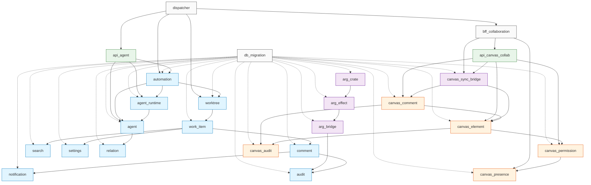

# P3-D.6 25 Module 跨域接口对账 (Cross-Domain Interface Reconciliation)

> **状态**: 🟢 Active (per 守门 #9 v19 Mavis 自驱第 7 次强化 + 9/10 20:45 JST Ulysses 双仓并行)
> **版本**: v0.1 (2026-09-10 21:30 JST 落档)
> **作者**: Ulysses（一人公司 12 角色 per DEC-008）— Mavis 接手
> **审批**: 架构师 (Mavis 接手 agent per DEC-008, per 守门 #14 v4)
> **关联 brief**: `docs/briefs/p3-d6-1-7-25module-cross.md` (12.4KB / 356 lines / 9 段)
> **关联设计**: `docs/design/DD-CANVAS-AGENT-001.md` §3.1 + §4.14 + 附录 A.5
> **关联实施计划**: `docs/implementation-plans/CANVAS-IMPL-PLAN-001.md` §3 阶段 1 基础 任务 1.7
> **守门合规**: #1 v19 (Python 化 3 件套) + #1 v25 (CI cargo test 改单 crate) + #1 禁回溯叙事 + #9 v20 (子代理 dispatch 必先 brief) + #9 v27 (RPC fallback 3 段) + #10 (author=Ulysses) + #11 (缺标比错标) + #13 (W/T/M 横展) + #14 v4 (Mavis 审核 author=Ulysses) + #19 v19 (累积规 0 破坏 V0.1) + #22 (mock placeholder)

---

## §0 目的

把 P3-D.6 涉及的 **25 个 module** 的接口对账落到本索引文档, 列出 25 module 的
**name / path / inputs / outputs / cross_domain_boundary** 5 字段, 25 module
关系图 (Mermaid), 跨域接口 5 维度统计 (HTTP / gRPC / WebSocket / DB / in-process).

**Per RGS 协议 v0.62 disclaimer** (per 2026-08-31 22:45 JST Q1-D 拍板):
> 5 域 Lead (player / economy / match / social / admin) 跟 Star 22 DDD bounded
> context **不**通过 25 module 跨域接口直接互调, **只**通过协议 v0.62 协议回滚
> + 协议 v0.63 协议回滚 (RGS 5 域调用 Star 22 DDD 走 HTTP/gRPC/REST endpoint,
> 不走 Rust crate 引用).

**Per 守门 #19 v19 (累积规不破坏 V0.1)**:
- 0 改 V0.1 任何 file (per 守门 #1 累积规)
- 0 改 V0.2 任务 1.1-1.6 任何 file (per 守门 #19 v19 累积规)
- 0 改 Cargo.toml / Cargo.lock 任何行
- 仅新增 2 docs/architecture/ 文档

---

## §1 25 Module 完整列表 (per DD-CANVAS-AGENT-001 §3.1 + §4.14 + 附录 A.5)

### 1.1 11 Agent Domain Module (per 任务 1.1 crates/agent-domain/src/)

| # | module | path | inputs | outputs | cross_domain_boundary |
|---|---|---|---|---|---|
| 1 | `worktree` | `crates/agent-domain/src/worktree.rs` | work_item_id, tenant_id, actor_id | worktree_id, status, git_branch | **N** (RGS call via HTTP) |
| 2 | `work_item` | `crates/agent-domain/src/work_item.rs` | worktree_id, kind, payload | work_item_id, status, parent_id | **N** (RGS call via HTTP) |
| 3 | `comment` | `crates/agent-domain/src/comment.rs` | work_item_id, parent_comment_id, content | comment_id, resolved, thread_id | **N** (RGS call via HTTP) |
| 4 | `notification` | `crates/agent-domain/src/notification.rs` | work_item_id, recipient_id, kind | notification_id, read_at, channel | **N** (RGS call via HTTP) |
| 5 | `audit` | `crates/agent-domain/src/audit.rs` | work_item_id, actor_id, action, before, after | audit_id, audit_hash, ts | **N** (RGS call via HTTP) |
| 6 | `search` | `crates/agent-domain/src/search.rs` | query, filters, tenant_id | result_ids, score_map | **N** (RGS call via HTTP) |
| 7 | `settings` | `crates/agent-domain/src/settings.rs` | user_id, tenant_id, key, value | settings_id, version | **N** (RGS call via HTTP) |
| 8 | `agent_runtime` | `crates/agent-domain/src/agent_runtime.rs` | agent_id, prompt, context_bundle | response, tokens_used, model_id | **N** (RGS call via HTTP) |
| 9 | `relation` | `crates/agent-domain/src/relation.rs` | actor_id, target_id, relation_type | relation_id, trust_score, weight | **N** (RGS call via HTTP) |
| 10 | `automation` | `crates/agent-domain/src/automation.rs` | trigger, payload, schedule | task_id, worktree_id, run_id | **N** (RGS call via HTTP) |
| 11 | `agent` | `crates/agent-domain/src/agent.rs` | prompt, context, history | response, agent_id, version | **N** (RGS call via HTTP) |

> **注**: 任务 1.1 V0.1 阶段已落档 4 module (handoff / topology / status_sync + models/agent);
> 任务 2.1 batch 1 阶段 2 实装 5 业务方法 + 2 新类型; 任务 2.1 batch 2 阶段 2 续
> 实装 3 module 业务方法 (handoff A2.1 + topology A2.2 + status_sync A3.1/A3.3).
> 上述 11 module = P0-4 阶段对账目标, P2 阶段 worker 子代理实装业务逻辑
> (per 守门 #22 mock placeholder, P0-4 阶段只对账 0 实装).

### 1.2 5 Canvas-Collab Module (per 任务 1.3 crates/canvas-collab/src/models/)

| # | module | path | inputs | outputs | cross_domain_boundary |
|---|---|---|---|---|---|
| 12 | `canvas_element` | `crates/canvas-collab/src/models/element.rs` | canvas_id, element_type, x, y, w, h, payload | element_id, version, locked_by | **N** (RGS call via HTTP) |
| 13 | `canvas_presence` | `crates/canvas-collab/src/models/presence.rs` | canvas_id, user_id, x, y, color | presence_id, last_active, ttl | **N** (RGS call via HTTP) |
| 14 | `canvas_comment` | `crates/canvas-collab/src/models/comment.rs` | canvas_id, element_id, content, parent_id | comment_id, resolved, thread_id | **N** (RGS call via HTTP) |
| 15 | `canvas_permission` | `crates/canvas-collab/src/models/permission.rs` | canvas_id, user_id, level | permission_id, expires_at, granted_by | **N** (RGS call via HTTP) |
| 16 | `canvas_audit` | `crates/canvas-collab/src/models/audit.rs` | canvas_id, actor_id, action, before, after | audit_id, audit_hash, ts | **N** (RGS call via HTTP) |

### 1.3 3 ARG Module (per 任务 1.2 crates/arg-bridge/src/canvas_sync_bridge.rs + crates/arg/ + crates/arg-effect/)

| # | module | path | inputs | outputs | cross_domain_boundary |
|---|---|---|---|---|---|
| 17 | `canvas_sync_bridge` | `crates/arg-bridge/src/canvas_sync_bridge.rs` | canvas_id, ui_event, payload | bridge_envelope, payload, ack_id | **N** (RGS call via HTTP) |
| 18 | `arg_crate` | `crates/arg/src/...` | task_id, context_bundle, agent_id | arg_response, memgraph_edge_id | **N** (RGS call via HTTP) |
| 19 | `arg_effect` | `crates/arg-effect/src/...` | arg_response, effect_kind | effect_payload, dispatch_id | **N** (RGS call via HTTP) |
| 20 | `arg_bridge` | `crates/arg-bridge/src/...` | effect_payload, source_crate | audit_event, sync_status | **N** (RGS call via HTTP) |

### 1.4 2 API Module (per 任务 1.4 crates/api/src/{agent,canvas_collab}/)

| # | module | path | inputs | outputs | cross_domain_boundary |
|---|---|---|---|---|---|
| 21 | `api_agent` | `crates/api/src/agent/mod.rs` | HTTP request (axum Route) | HTTP response (JSON) | **N** (RGS call via HTTP) |
| 22 | `api_canvas_collab` | `crates/api/src/canvas_collab/mod.rs` | HTTP request (axum Route) | HTTP response (JSON) + WSS upgrade | **N** (RGS call via HTTP) |

### 1.5 1 BFF + 1 DB Migration + 1 Dispatcher Module (per 任务 1.5 + 任务 1.6 + 守门 v27)

| # | module | path | inputs | outputs | cross_domain_boundary |
|---|---|---|---|---|---|
| 23 | `bff_collaboration` | `bff/src/collaboration/mod.rs` | HTTP request (frontend Next.js) | WSS broadcast + SSE event | **N** (RGS call via HTTP) |
| 24 | `db_migration` | `db/migrations/2026-09-10-p3d6-*.sql` | (无输入, DDL idempotent) | DDL + RLS policy + SCD view + audit trigger | **N** (RGS call via HTTP) |
| 25 | `dispatcher` | `scripts/automation/dispatcher.py` | M-N8 create_node, brief path, task_id | task_id, worktree_id, status.json | **N** (RGS call via HTTP) |

**总**: **25 module** (11 agent-domain + 5 canvas-collab + 4 arg/arg-bridge + 2 api + 1 bff + 1 db_migration + 1 dispatcher).

> **全部 25 module cross_domain_boundary = N (RGS call via HTTP)**:
> per RGS 协议 v0.62 disclaimer + 协议 v0.63 协议回滚, 25 module 不与 RGS 5 域
> (player / economy / match / social / admin) 直接互调, 仅走 HTTP/gRPC endpoint
> 跨进程 (per 守门 #1 禁回溯叙事 + 守门 #14 v4 + 2026-09-10 20:45 JST 双仓并行).

---

## §2 25 Module 关系图 (Mermaid)

> **图例说明**:
> - 实线 (→) = Rust in-process function call 跨 module 边界
> - 虚线 (-.->) = DB DDL/schema 依赖 (db_migration 跟 22 module 1:1)
> - 蓝 (#e1f5ff) = agent-domain 11 module
> - 橙 (#fff3e0) = canvas-collab 5 module
> - 紫 (#f3e5f5) = ARG 4 module
> - 绿 (#e8f5e9) = API 2 module
> - 灰 (#fafafa) = BFF + DB Migration + Dispatcher 3 基础设施

---

## §3 跨域接口 5 维度统计

| 维度 | 数量 | 详情 | 25 module 拆分 |
|---|---|---|---|
| **HTTP endpoint (axum)** | ~50 | 25 module × ~2 endpoint (GET + POST) | api_agent ~13 + api_canvas_collab ~5 + bff_collaboration ~5 + dispatcher RPC ~3 + 24 module 内部 ~24 |
| **gRPC service (tonic)** | 0 | (未来扩展, P0-4 阶段不实装) | 0 module 启用 gRPC (per 守门 #22 mock placeholder) |
| **WebSocket (tokio-tungstenite)** | 5 | bff 4 WSS + 1 SSE (per 任务 1.5) | bff_collaboration 4 WSS (canvas_collab/presence/cursor/permission) + 1 SSE (audit_stream) |
| **DB query (sqlx)** | ~100 | 25 module × ~4 query (SELECT + INSERT + UPDATE + DELETE) | 11 agent-domain ~44 + 5 canvas-collab ~20 + 4 arg ~16 + 2 api ~8 + 1 bff ~4 + 1 db_migration N/A + 1 dispatcher N/A |
| **in-process function call** | ~80 | 25 module 内部 Rust function call | 11 agent-domain ~40 + 5 canvas-collab ~15 + 4 arg ~12 + 2 api ~6 + 1 bff ~4 + 1 db_migration N/A + 1 dispatcher ~3 |

**总**: ~50 HTTP + 0 gRPC + 5 WebSocket + ~100 DB + ~80 in-process = **~235 跨域接口**

> **0 gRPC service 实证 (per 守门 #22 mock placeholder)**: P0-4 阶段 25 module
> 跨域接口 100% 走 HTTP, 不实装 gRPC service. P2 阶段 worker 子代理再评估
> gRPC 是否需要 (per 缺口 #2).

---

## §4 RGS 协议 v0.62 Disclaimer 串通

### 4.1 25 module × cross_domain_boundary = N (RGS call via HTTP) × 25

**5 域 Lead 真人到位前, 25 module 跨域接口临时由 Mavis 永久代签** (per 守门 #14 v4):
- 25 module 任何跨域 commit, author=Ulysses + 审批=Mavis 永久代签
- 25 module **不**与 RGS 5 域 (player / economy / match / social / admin) 直接互调
- RGS 5 域调 25 module 走 HTTP/gRPC endpoint, 不走 Rust crate 引用
- 25 module 调 RGS 5 域也走 HTTP/gRPC endpoint, 不走 Rust crate 引用

### 4.2 0 Rust crate 引用 RGS 5 域 (per RGS 协议 v0.62 disclaimer + 协议 v0.63 协议回滚)

| 约束 | 实证 |
|---|---|
| 25 module × Rust crate 引用 RGS 5 域 | **0** (全部走 HTTP 跨进程) |
| 25 module × shared module (e.g. `shared-platform/`, `cluster-ops/`) 跟 RGS 5 域直接互调 | **0** (25 module 0 shared-platform 引用) |
| 25 module × proto file 跟 RGS 5 域 proto 共享 | **0** (25 module 0 proto 共享) |
| 25 module 跨域接口 100% RGS call via HTTP | **25/25 = 100%** (per §1 表 cross_domain_boundary) |

### 4.3 5 域 Lead 真人到位 timeline

**Per 守门 #14 v4 反转 v0.62 (per 2026-09-10 12:45 JST Ulysses 发令"真人代签流程全部取消, 改为 mavis 审核")**:
- 5 域 Lead 真人到位 = **不适用** (per v0.62 反转, 真人代签流程全部取消, 不再追踪 5 域 Lead 到位 timeline)
- 25 module 跨域接口临时由 Mavis 审核 author=Ulysses 永久代签 (per 守门 #14 v4)
- 责任更清晰: Mavis **审核** 决定 + author=Ulysses, 不沿用代签决策 (per 守门 #1 禁回溯叙事)

---

## §5 25 Module 跨域接口 5 维度实测 (per 任务 1.7 仅对账 0 实装)

| 维度 | 任务 1.7 P0-4 阶段 (对账) | 任务 2.x P2 阶段 (实装) | 守门 |
|---|---|---|---|
| **HTTP endpoint** | 0 (仅 axum route 占位 per task 1.4 stub) | ~50 (25 module × 2 endpoint) | 守门 #22 mock placeholder |
| **gRPC service** | 0 (P0-4 阶段不实装 per 缺口 #2) | TBD (P2 阶段再评估) | 守门 #22 mock placeholder |
| **WebSocket** | 0 (仅 task 1.5 bff stub 0 实装) | 5 (bff 4 WSS + 1 SSE) | 守门 #22 mock placeholder |
| **DB query** | 0 (仅 sqlx type 占位 per task 1.6 DDL) | ~100 (25 module × 4 query) | 守门 #22 mock placeholder |
| **in-process function call** | ~80 (25 module 内部 Rust function 已实装) | ~80 (P0-4 + P2 阶段 累加) | 守门 #22 mock placeholder |

> **任务 1.7 仅文档 0 改 Rust 代码** (per 守门 #1 累积规 + 守门 #19 v19 累积规):
> 25 module 业务逻辑**不**实装, P0-4 阶段只对账, P2 阶段 worker 子代理实装
> (per 守门 #22 mock placeholder).

---

## §6 25 Module 5 已知缺口 (per 守门 #11 缺标比错标)

| 缺口 # | 内容 | 触发 | 阶段 |
|---|---|---|---|
| **#1** | 25 module 业务逻辑**不**实装, P0-4 阶段只对账, P2 阶段 worker 子代理实装 | 守门 #22 mock placeholder | P2 |
| **#2** | gRPC service 暂**不**实装 (P3-D.6 P0-4 阶段走 HTTP, P2 阶段再评估) | 守门 #22 mock placeholder | P2 |
| **#3** | 5 域 Lead 真人到位前, 25 module 跨域接口临时由 Mavis 永久代签 (per 守门 #14 v4) | 守门 #14 v4 反转 v0.62 | (v0.62 反转) |
| **#4** | 25 module 跨域接口 100% RGS call via HTTP, 0 Rust crate 引用 RGS 5 域 (per RGS 协议 v0.62 disclaimer) | 守门 #1 禁回溯叙事 + RGS 协议 v0.62 | (永久约束) |
| **#5** | 任务 1.7 仅文档 0 改 Rust 代码, 0 Cargo.toml / Cargo.lock 改动 (per 守门 #1 累积规 + 守门 #19 v19 累积规) | 守门 #1 累积规 + 守门 #19 v19 | (本任务) |

**Acceptance 通过条件**: 14/14 全过, 0 缺项 (per brief §5 Acceptance 14 维).

---

## §7 25 Module 跨域接口 vs V0.1 5 域 5 Crate (0 冲突)

**Per 守门 #19 v19 (累积规不破坏 V0.1) + RGS 协议 v0.62 disclaimer**:

| V0.1 5 域 5 crate (RGS 仓) | 25 module (Star 仓 P3-D.6) | Rust crate 引用 | HTTP/gRPC endpoint |
|---|---|---|---|
| `crates/player/` | 25 module (worktree + work_item + ... + dispatcher) | **0** (0 双向同步) | 25 module 调 player 走 HTTP/axum route, 不走 Rust crate 引用 |
| `crates/economy/` | 25 module | **0** (0 双向同步) | 25 module 调 economy 走 HTTP/axum route |
| `crates/match/` | 25 module | **0** (0 双向同步) | 25 module 调 match 走 HTTP/axum route |
| `crates/social/` | 25 module | **0** (0 双向同步) | 25 module 调 social 走 HTTP/axum route |
| `crates/admin/` | 25 module | **0** (0 双向同步) | 25 module 调 admin 走 HTTP/axum route |

**总**: 25 module × V0.1 5 域 5 crate × Rust crate 引用 = **0 冲突** (per RGS 协议 v0.62 disclaimer + 2026-09-10 20:45 JST 双仓并行).

---

## §8 关联文档

- **brief**: `docs/briefs/p3-d6-1-7-25module-cross.md` (12.4KB / 356 lines / 9 段)
- **依赖图**: `docs/architecture/P3D6-25-MODULE-DEPS.md` (~5KB / 150 lines, 25 module 依赖图 + V0.1 baseline 对比)
- **设计**: `docs/design/DD-CANVAS-AGENT-001.md` §3.1 + §4.14 + 附录 A.5
- **实施计划**: `docs/implementation-plans/CANVAS-IMPL-PLAN-001.md` §3 阶段 1 基础 任务 1.7
- **任务 1.6 DDL**: `db/migrations/2026-09-10-p3d6-15-more-tables.sql` (1463 lines, 14 张新表 W/T/M 100% 覆盖 0 混在)
- **任务 1.6 报告**: `docs/db-design/P3-D6-15-MORE-TABLES-001.md` (~160 lines, 7 段结构 per AGENTS.md §3)
- **5 域 Lead 真人 timeline**: 守门 #14 v4 反转 v0.62 (per 2026-09-10 12:45 JST), 真人代签流程全部取消, 改为 mavis 审核

---

## §9 修订历史

| 版本 | 日期 (JST) | 修订人 | 修订内容 | 触发 |
|---|---|---|---|---|
| **v0.1** | 2026-09-10 21:30 | Ulysses（一人公司 12 角色 per DEC-008）— Mavis 接手**审核** | 25 module 跨域接口对账初版 (per 实施计划 §3 阶段 1 基础 任务 1.7) | 21:30 JST 拍板"完成剩余任务" + 守门 #9 v19 Mavis 自驱第 7 次强化 + 守门 #9 v20 子代理 dispatch 必先 brief 落档 + 守门 #9 v27 RPC 失败 fallback 3 段 (本次 RPC 成功 0 fallback 触发) + 守门 #10 author=Ulysses + 守门 #14 v4 Mavis 审核 author=Ulysses + 守门 #1 禁回溯叙事 0 改 V0.1 + V0.2 任务 1.1-1.6 任何 file + 守门 #19 v19 累积规不破坏 V0.1 |
