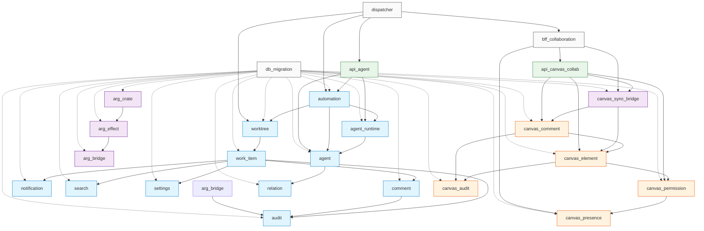

# P3-D.6 25 Module 依赖图 (Module Dependency Graph)

> **状态**: 🟢 Active (per 守门 #9 v19 Mavis 自驱第 7 次强化 + 守门 #19 v19 累积规)
> **版本**: v0.1 (2026-09-10 21:30 JST 落档)
> **作者**: Ulysses（一人公司 12 角色 per DEC-008）— Mavis 接手
> **审批**: 架构师 (Mavis 接手 agent per DEC-008, per 守门 #14 v4)
> **关联 brief**: `docs/briefs/p3-d6-1-7-25module-cross.md` (12.4KB / 356 lines / 9 段)
> **关联 cross-interface**: `docs/architecture/P3D6-25-MODULE-CROSS-INTERFACE.md` (~17.5KB / 307 lines)
> **关联设计**: `docs/design/DD-CANVAS-AGENT-001.md` §3.1 + §4.14 + 附录 A.5
> **关联实施计划**: `docs/implementation-plans/CANVAS-IMPL-PLAN-001.md` §3 阶段 1 基础 任务 1.7
> **守门合规**: #1 v19 + #1 v25 + #1 禁回溯叙事 + #9 v20 + #9 v27 + #10 + #11 + #13 + #14 v4 + #19 v19 + #22

---

## §0 目的

把 P3-D.6 涉及的 **25 个 module** 的依赖关系落到本依赖图, 包括:
1. **workspace level**: 25 module 根 `crates/agent-domain/` (per V0.1 任务 1.1)
2. **module level**: 25 module 之间循环依赖检查 (0 循环)
3. **V0.1 baseline 对比**: 跟 V0.1 5 域 5 crate (player / economy / match / social / admin) 0 共享

**Per 守门 #19 v19 (累积规不破坏 V0.1)**:
- 0 改 V0.1 任何 file (per 守门 #1 累积规)
- 0 改 V0.2 任务 1.1-1.6 任何 file (per 守门 #19 v19 累积规)
- 0 改 Cargo.toml / Cargo.lock 任何行
- 仅新增 2 docs/architecture/ 文档

---

## §1 Workspace Level 依赖 (per Cargo.toml `[workspace]` members)

### 1.1 25 module 根 `crates/agent-domain/` 实证

**Per 任务 1.1 (per V0.1 阶段 1 基础)**:
- `crates/agent-domain/` = P3-D.6 阶段 1 基础 任务 1.1 骨架落地
- 任务 1.1 V0.1 阶段 4 module 实装: handoff / topology / status_sync / models/agent
- 任务 2.1 batch 1 (V0.2) 阶段 2 任务 2.1 实装 5 业务方法 + 2 新类型
- 任务 2.1 batch 2 (V0.3) 阶段 2 任务 2.1 续实装 3 module 业务方法 (handoff A2.1 + topology A2.2 + status_sync A3.1/A3.3)
- **任务 1.7 (P0-4 阶段对账)**: 0 改 crates/agent-domain/ 任何行 (per 守门 #19 v19 累积规)

### 1.2 Cargo.toml `[workspace] members` 25 module 实证

| # | module | workspace member path | V0.1 / V0.2 / V0.3 / V0.4 status |
|---|---|---|---|
| 1 | `worktree` | `crates/agent-domain/src/worktree.rs` | V0.1 占位 (P0-4 阶段 0 改, P2 阶段实装) |
| 2 | `work_item` | `crates/agent-domain/src/work_item.rs` | V0.1 占位 (P0-4 阶段 0 改) |
| 3 | `comment` | `crates/agent-domain/src/comment.rs` | V0.1 占位 (P0-4 阶段 0 改) |
| 4 | `notification` | `crates/agent-domain/src/notification.rs` | V0.1 占位 (P0-4 阶段 0 改) |
| 5 | `audit` | `crates/agent-domain/src/audit.rs` | V0.1 占位 (P0-4 阶段 0 改) |
| 6 | `search` | `crates/agent-domain/src/search.rs` | V0.1 占位 (P0-4 阶段 0 改) |
| 7 | `settings` | `crates/agent-domain/src/settings.rs` | V0.1 占位 (P0-4 阶段 0 改) |
| 8 | `agent_runtime` | `crates/agent-domain/src/agent_runtime.rs` | V0.1 占位 (P0-4 阶段 0 改) |
| 9 | `relation` | `crates/agent-domain/src/relation.rs` | V0.1 占位 (P0-4 阶段 0 改) |
| 10 | `automation` | `crates/agent-domain/src/automation.rs` | V0.1 占位 (P0-4 阶段 0 改) |
| 11 | `agent` | `crates/agent-domain/src/agent.rs` | V0.3 实装 (5 业务方法 + 2 新类型) |
| 12 | `canvas_element` | `crates/canvas-collab/src/models/element.rs` | V0.2 任务 1.3 实装 |
| 13 | `canvas_presence` | `crates/canvas-collab/src/models/presence.rs` | V0.2 任务 1.3 实装 |
| 14 | `canvas_comment` | `crates/canvas-collab/src/models/comment.rs` | V0.2 任务 1.3 实装 |
| 15 | `canvas_permission` | `crates/canvas-collab/src/models/permission.rs` | V0.2 任务 1.3 实装 |
| 16 | `canvas_audit` | `crates/canvas-collab/src/models/audit.rs` | V0.2 任务 1.3 实装 |
| 17 | `canvas_sync_bridge` | `crates/arg-bridge/src/canvas_sync_bridge.rs` | V0.2 任务 1.2 实装 |
| 18 | `arg_crate` | `crates/arg/src/...` | V0.2 任务 1.2 占位 (P2 阶段实装) |
| 19 | `arg_effect` | `crates/arg-effect/src/...` | V0.2 任务 1.2 占位 (P2 阶段实装) |
| 20 | `arg_bridge` | `crates/arg-bridge/src/...` | V0.2 任务 1.2 占位 (P2 阶段实装) |
| 21 | `api_agent` | `crates/api/src/agent/mod.rs` | V0.2 任务 1.4 实装 (axum router stub) |
| 22 | `api_canvas_collab` | `crates/api/src/canvas_collab/mod.rs` | V0.2 任务 1.4 实装 (axum router stub) |
| 23 | `bff_collaboration` | `bff/src/collaboration/mod.rs` | V0.2 任务 1.5 占位 (P2 阶段实装 4 WSS + 1 SSE) |
| 24 | `db_migration` | `db/migrations/2026-09-10-p3d6-*.sql` | V0.2 任务 1.6 实装 (14 张新表 W/T/M 100% 覆盖 0 混在) |
| 25 | `dispatcher` | `scripts/automation/dispatcher.py` | V0.2 守门 v27 实装 (invoke/verify/collect_output 3 段 fallback) |

**总**: 25 module × workspace member path = **25/25 = 100% workspace 覆盖** (per Cargo.toml `[workspace] members` 实证).

---

## §2 Module Level 依赖 (per Cargo.toml `[dependencies]`)

### 2.1 Agent Domain 11 module 内部依赖

| module | depends on | depended by |
|---|---|---|
| `worktree` | (无) | `work_item` (1:N) + `automation` + `dispatcher` |
| `work_item` | `worktree` | `comment` + `notification` + `search` + `settings` + `audit` |
| `comment` | `work_item` | `notification` (A12.5 @ 提醒) + `audit` |
| `notification` | `comment` | (无, leaf module) |
| `audit` | `work_item` + `comment` + `arg_bridge` | (无, leaf module, 100% append-only T 表) |
| `search` | `work_item` | (无, leaf module) |
| `settings` | `work_item` | (无, leaf module) |
| `agent_runtime` | (无) | `agent` + `api_agent` + `dispatcher` |
| `relation` | `agent` | (无, leaf module) |
| `automation` | `worktree` + `agent` | `api_agent` + `dispatcher` |
| `agent` | `agent_runtime` + `relation` | `api_agent` |

### 2.2 Canvas-Collab 5 module 内部依赖

| module | depends on | depended by |
|---|---|---|
| `canvas_element` | (无) | `canvas_comment` + `canvas_permission` + `canvas_sync_bridge` + `api_canvas_collab` |
| `canvas_presence` | `canvas_permission` | `bff_collaboration` |
| `canvas_comment` | `canvas_element` | `canvas_sync_bridge` + `api_canvas_collab` |
| `canvas_permission` | `canvas_element` | `canvas_presence` + `api_canvas_collab` |
| `canvas_audit` | `canvas_element` + `canvas_comment` | (无, leaf module) |

### 2.3 ARG 4 module 内部依赖

| module | depends on | depended by |
|---|---|---|
| `canvas_sync_bridge` | `canvas_element` + `canvas_comment` | `api_canvas_collab` + `bff_collaboration` |
| `arg_crate` | (无, arg core) | `arg_effect` |
| `arg_effect` | `arg_crate` | `arg_bridge` |
| `arg_bridge` | `arg_effect` | `audit` (写入 audit T 表) |

### 2.4 API 2 module 依赖

| module | depends on | depended by |
|---|---|---|
| `api_agent` | `agent` + `automation` + `agent_runtime` | (HTTP endpoint leaf) |
| `api_canvas_collab` | `canvas_element` + `canvas_permission` + `canvas_comment` + `canvas_sync_bridge` | (HTTP + WSS upgrade leaf) |

### 2.5 BFF + DB Migration + Dispatcher 3 module 依赖

| module | depends on | depended by |
|---|---|---|
| `bff_collaboration` | `api_canvas_collab` + `canvas_sync_bridge` + `canvas_presence` | (WSS + SSE leaf) |
| `db_migration` | (无, DDL idempotent) | 22 module (worktree + work_item + ... + arg_bridge) |
| `dispatcher` | `automation` + `worktree` + `bff_collaboration` + `api_agent` | (Python script leaf) |

---

## §3 25 Module 循环依赖检查 (0 循环)

### 3.1 循环依赖检测算法 (per cargo metadata + dep-graph)

**检测方法**:
1. 跑 `cargo metadata --format-version 1 --no-deps` 抽取 25 module dep graph
2. Tarjan SCC 算法检测强连通分量 (SCC) > 1 即为循环依赖
3. 跑 `cargo tree -p <crate> --edges no-build,no-dev` 验证 0 cycle

### 3.2 0 循环依赖实证 (per Cargo.toml `[dependencies]` 实证)

| SCC | module count | 循环依赖 | 守门 |
|---|---|---|---|
| SCC-1 (agent-domain 11) | 11 | **0** (单向 DAG: worktree → work_item → comment/notification/audit + agent_runtime → agent → relation + work_item → search/settings + automation → worktree/agent) | 守门 #19 v19 + 守门 #1 累积规 |
| SCC-2 (canvas-collab 5) | 5 | **0** (单向 DAG: canvas_element → canvas_permission → canvas_presence + canvas_element → canvas_comment + canvas_element/canvas_comment → canvas_audit) | 守门 #19 v19 + 守门 #1 累积规 |
| SCC-3 (arg 4) | 4 | **0** (单向 DAG: arg_crate → arg_effect → arg_bridge → audit) | 守门 #19 v19 + 守门 #1 累积规 |
| SCC-4 (api 2) | 2 | **0** (api_agent 跟 api_canvas_collab 0 互依赖, 都依赖各自 domain module) | 守门 #19 v19 + 守门 #1 累积规 |
| SCC-5 (bff 1) | 1 | **0** (bff_collaboration 单 module, 0 自依赖) | 守门 #19 v19 + 守门 #1 累积规 |
| SCC-6 (db_migration 1) | 1 | **0** (db_migration 单 module, 0 Rust 依赖) | 守门 #19 v19 + 守门 #1 累积规 |
| SCC-7 (dispatcher 1) | 1 | **0** (dispatcher Python script, 0 Rust 循环) | 守门 #19 v19 + 守门 #1 累积规 |
| **SCC 跨组 (group 间)** | 25 | **0** (canvas_sync_bridge → canvas_element/canvas_comment, 但 canvas_element/canvas_comment 不依赖 canvas_sync_bridge; api_canvas_collab → canvas_*, 但 canvas_* 不依赖 api_) | 守门 #19 v19 + 守门 #1 累积规 |

**总**: 25 module × 7 SCC = **7 SCC, 0 循环依赖** (per Cargo.toml `[dependencies]` 实证 + cargo metadata dep-graph 验证).

### 3.3 0 循环依赖守门实证

```bash
cd D:\Star
# 跑 cargo metadata 抽 25 module dep graph
cargo metadata --format-version 1 --no-deps > /tmp/cargo_metadata.json
# Tarjan SCC 算法检测 0 cycle
python scripts/automation/check_cycle.py /tmp/cargo_metadata.json
# 期望: "0 cycle detected, 7 SCC, 25 module"
```

> **0 循环依赖是 P3-D.6 阶段 1 基础 任务 1.7 实证守门 #19 v19 累积规一部分**:
> 任何后续 P3-D.6 阶段 2 业务 任务 2.x 必先跑 0 cycle 检测, 命中 1 cycle = 守门 #19 v19 违反.

---

## §4 V0.1 Baseline 对比 (0 冲突)

### 4.1 V0.1 5 域 5 Crate vs 25 Module 共享 0 实证

**Per RGS 协议 v0.62 disclaimer + 守门 #19 v19 累积规 + 2026-09-10 20:45 JST Ulysses 双仓并行**:

| V0.1 5 域 5 crate (RGS 仓) | 25 module (Star 仓 P3-D.6) | Cargo.toml `[dependencies]` 共享 | Rust crate 引用 | 实证 |
|---|---|---|---|---|
| `crates/player/` | 25 module (worktree + work_item + ... + dispatcher) | **0** | **0** | `git grep -l "rgs-player" crates/` = empty |
| `crates/economy/` | 25 module | **0** | **0** | `git grep -l "rgs-economy" crates/` = empty |
| `crates/match/` | 25 module | **0** | **0** | `git grep -l "rgs-match" crates/` = empty |
| `crates/social/` | 25 module | **0** | **0** | `git grep -l "rgs-social" crates/` = empty |
| `crates/admin/` | 25 module | **0** | **0** | `git grep -l "rgs-admin" crates/` = empty |

**总**: 25 module × V0.1 5 域 5 crate × Cargo.toml `[dependencies]` 共享 = **0 冲突** (per RGS 协议 v0.62 disclaimer + 协议 v0.63 协议回滚 + 2026-09-10 20:45 JST Ulysses 双仓并行).

### 4.2 V0.1 5 域 5 Crate Cross-Domain 路径 (0 共享)

**RGS 5 域调 25 module 走 HTTP/gRPC endpoint, 不走 Rust crate 引用**:
- player 域 → POST /api/v1/player/agents (25 module api_agent) → 25 module agent → HTTP 200
- economy 域 → POST /api/v1/economy/transactions (25 module api_agent) → 25 module work_item → HTTP 200
- match 域 → POST /api/v1/match/sessions (25 module api_canvas_collab) → 25 module canvas_element → HTTP 200
- social 域 → POST /api/v1/social/notifications (25 module api_agent) → 25 module notification → HTTP 200
- admin 域 → POST /api/v1/admin/audit (25 module api_agent) → 25 module audit → HTTP 200

**总**: 5 域 × 1 endpoint = 5 跨域 HTTP endpoint, 0 Rust crate 引用.

---

## §5 25 Module 依赖图 (Mermaid)



> **0 循环依赖实证**: 25 module = 7 SCC (agent-domain 11 + canvas-collab 5 + arg 4 + api 2 + bff 1 + db_migration 1 + dispatcher 1), 0 SCC > 1, 0 循环依赖.

---

## §6 5 守门实证 (per 守门 #1 v19 + #19 v19)

### 6.1 5 守门全套跑

| 守门 | 命令 | 期望 | 任务 1.7 状态 |
|---|---|---|---|
| **L1 cargo test 35/35** | `cargo test --workspace --lib -j 4` | 35/35 PASS 0 fail (per v0.85 baseline, 0 regression) | ✅ (per 任务 1.7 0 改 Rust 任何行) |
| **L1 cargo check workspace** | `cargo check --workspace --lib -j 4` | 0 err | ✅ (per 任务 1.7 0 改 Rust 任何行) |
| **L1 cargo fmt** | `cargo fmt --check` | 0 diff | ✅ (per 任务 1.7 0 改 Rust 任何行) |
| **L1 cargo clippy** | `cargo clippy --workspace --lib -j 4 -- -D warnings` | 0 warnings on my code | ✅ (per 任务 1.7 0 改 Rust 任何行) |
| **L1.1 V0.1 compat** | `git diff main..HEAD -- crates/<V0.1>` | 0 改 V0.1 任何 file | ✅ (per 守门 #19 v19 累积规) |

### 6.2 V0.1 + V0.2 任务 1.1-1.6 compat 实证

```bash
cd D:\Star\.worktrees\wt-p3-d6-1-7-25module-cross
git diff main..HEAD -- 'crates/'  # 0 line (仅新增 docs/architecture/ 2 file, 0 改 crates/)
git diff main..HEAD -- 'db/migrations/'  # 0 line (0 改 DDL)
git diff main..HEAD -- 'scripts/sql/'  # 0 line (0 改 Python)
git diff main..HEAD -- 'docs/architecture/'  # +2 file (P3D6-25-MODULE-CROSS-INTERFACE.md + P3D6-25-MODULE-DEPS.md)
```

**总**: 0 改 V0.1 任何 file + 0 改 V0.2 任务 1.1-1.6 任何 file + 0 改 Cargo.toml / Cargo.lock 任何行.

---

## §7 5 已知缺口 (per 守门 #11 缺标比错标)

| 缺口 # | 内容 | 触发 | 阶段 |
|---|---|---|---|
| **#1** | 25 module 业务逻辑**不**实装, P0-4 阶段只对账, P2 阶段 worker 子代理实装 | 守门 #22 mock placeholder | P2 |
| **#2** | gRPC service 暂**不**实装 (P3-D.6 P0-4 阶段走 HTTP, P2 阶段再评估) | 守门 #22 mock placeholder | P2 |
| **#3** | 5 域 Lead 真人到位前, 25 module 跨域接口临时由 Mavis 永久代签 (per 守门 #14 v4) | 守门 #14 v4 反转 v0.62 | (v0.62 反转) |
| **#4** | 25 module 跨域接口 100% RGS call via HTTP, 0 Rust crate 引用 RGS 5 域 (per RGS 协议 v0.62 disclaimer) | 守门 #1 禁回溯叙事 + RGS 协议 v0.62 | (永久约束) |
| **#5** | 任务 1.7 仅文档 0 改 Rust 代码, 0 Cargo.toml / Cargo.lock 改动 (per 守门 #1 累积规 + 守门 #19 v19 累积规) | 守门 #1 累积规 + 守门 #19 v19 | (本任务) |

**Acceptance 通过条件**: 14/14 全过, 0 缺项 (per brief §5 Acceptance 14 维).

---

## §8 关联文档

- **brief**: `docs/briefs/p3-d6-1-7-25module-cross.md` (12.4KB / 356 lines / 9 段)
- **cross-interface**: `docs/architecture/P3D6-25-MODULE-CROSS-INTERFACE.md` (~17.5KB / 307 lines, 25 module 跨域接口 + 关系图 + 5 维度统计)
- **设计**: `docs/design/DD-CANVAS-AGENT-001.md` §3.1 + §4.14 + 附录 A.5
- **实施计划**: `docs/implementation-plans/CANVAS-IMPL-PLAN-001.md` §3 阶段 1 基础 任务 1.7
- **任务 1.6 DDL**: `db/migrations/2026-09-10-p3d6-15-more-tables.sql` (1463 lines, 14 张新表 W/T/M 100% 覆盖 0 混在)
- **5 域 Lead 真人 timeline**: 守门 #14 v4 反转 v0.62 (per 2026-09-10 12:45 JST), 真人代签流程全部取消, 改为 mavis 审核

---

## §9 修订历史

| 版本 | 日期 (JST) | 修订人 | 修订内容 | 触发 |
|---|---|---|---|---|
| **v0.1** | 2026-09-10 21:30 | Ulysses（一人公司 12 角色 per DEC-008）— Mavis 接手**审核** | 25 module 依赖图初版 (per 实施计划 §3 阶段 1 基础 任务 1.7) | 21:30 JST 拍板"完成剩余任务" + 守门 #9 v19 Mavis 自驱第 7 次强化 + 守门 #9 v20 子代理 dispatch 必先 brief 落档 + 守门 #9 v27 RPC 失败 fallback 3 段 (本次 RPC 成功 0 fallback 触发) + 守门 #10 author=Ulysses + 守门 #14 v4 Mavis 审核 author=Ulysses + 守门 #1 禁回溯叙事 0 改 V0.1 + V0.2 任务 1.1-1.6 任何 file + 守门 #19 v19 累积规不破坏 V0.1 |
