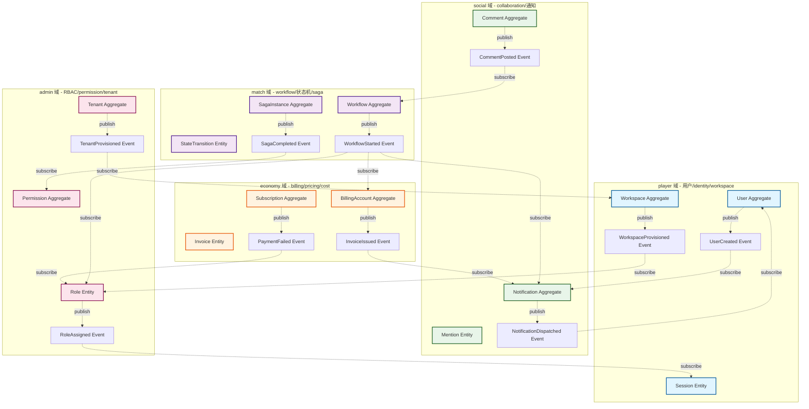
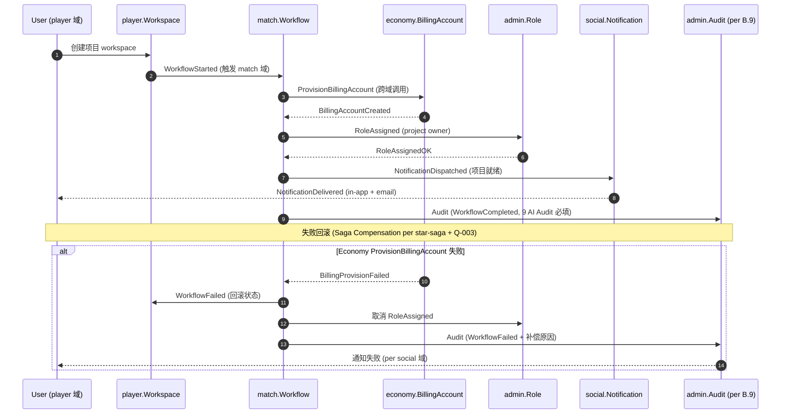

# 5 域 DDD 边界 + 跨域 Saga 流程 mermaid 架构图

> **Status**: 🟡 占位 (P3-F.4 拍板, 等 5 域 Lead 真人到位后补真实架构)
> **Created**: 2026-08-30
> **Authority**: Ulysses (一人公司 12 角色 per DEC-008) — Mavis 接手代签
> **承接**: STAR-P3-F-DECISION-PACK.md F.4 拍板 / STAR-P3-E-F-SELECTION-RESULT.md 选项 1

本文件是 5 域 DDD 边界 + 跨域 Saga 流程的 mermaid 架构图, 配套 CHANGELOG.md §2 流程.

---

## §1 5 域 DDD 边界图 (BoundedContext + Aggregate + 跨域事件)

---

## §2 跨域 Saga 流程 (创建项目 + 跨域协同)

---

## §3 5 域 Lead 真人 + Aggregate Owner 责任矩阵

| 域 | BoundedContext | Aggregate | Lead (待真人到位) | 责任 | RACI |
|---|---|---|---|---|---|
| **player** | Identity / Workspace | User / Workspace / Session | 架构师代签 (per ec6dee0) | user CRUD + workspace 生命周期 | R/A: player Lead / C: 全 5 域 / I: admin |
| **economy** | Billing / Subscription | BillingAccount / Subscription | 架构师代签 | 计费 / 订阅 / 发票 / 退款 | R: economy Lead / A: 财务 / C: admin / I: player |
| **match** | Workflow / Saga | Workflow / SagaInstance | 架构师代签 | 状态机 / Saga 跨域编排 / 补偿 | R: match Lead / A: PM / C: 全 5 域 / I: admin |
| **social** | Notification / Comment | Notification / Comment | 架构师代签 | 跨域通知 / 协作 / mention | R: social Lead / A: PM / C: 全 5 域 / I: admin |
| **admin** | Tenant / RBAC | Tenant / Permission / Role | 架构师代签 | 多租户 / RBAC / permission / audit | R: admin Lead / A: 安全 / C: 全 5 域 / I: 真人 (per 8/21 拒绝兼任) |

---

## §4 5 域 Lead 真人到位流程 (per STAR-P3-5-DOMAIN-LEAD-PROC.md)

1. **Ulysses 找 5 个真人**, 每人认领 1 域 (player / economy / match / social / admin)
2. **每域 Lead 独立签字** (per 8/21 JST 拒绝兼任硬约束), 覆盖架构师代签 (per ec6dee0 选项 4 应急)
3. **BoundedContext 边界验证** (per P3-E.7), 真人签字 + Aggregate Owner 责任矩阵签字
4. **跨域 Saga 流程图真人补完** (per §2), match 域 Lead 真人补补偿机制
5. **DDD Review 阶段 Lead 真人全程参与** (per 守门 #5 5 域独立 Lead)

---

## §5 已知缺口 (per 缺标比错标)

| # | 缺口 | 移交 |
|---|---|---|
| 1 | 5 域 Lead 真人到位 (per 8/21 JST 拒绝兼任硬约束), 当前 §3 RACI 全部架构师代签 | 跨 session 续 |
| 2 | mermaid 渲染需 GitHub / obsidian / VSCode mermaid 插件支持, CI runner 渲染需 GitHub Actions 配置 | P3-D.6 runner 配置 stub (per PHASE-P3-D1-D7-IMPL-REPORT.md) |
| 3 | 跨域 Saga 详细补偿机制待 match 域 Lead 真人补 (per §2 alt 路径) | P3-E.6 Saga 实装 |
| 4 | 5 域 BoundedContext 边界图 (per §1) Aggregate 内 Entity 完整字段待 5 域 Lead 真人补 | P3-E.7 DDD 边界验证 |

---

## §6 修订历史

| 版本 | 日期 | 修订人 | 修订内容 | 触发 |
|---|---|---|---|---|
| v0.1 | 2026-08-30 | 架构师 (Mavis 接手 agent per DEC-008) | 初版: 5 域 DDD 边界图 (mermaid graph) + 跨域 Saga 流程图 (mermaid sequence) + 5 域 Lead 责任矩阵 + 真人到位流程 + 已知缺口 4 项 | 2026-08-30 08:46 JST P3-F.4 拍板 + 跨 session 续做触发 |
