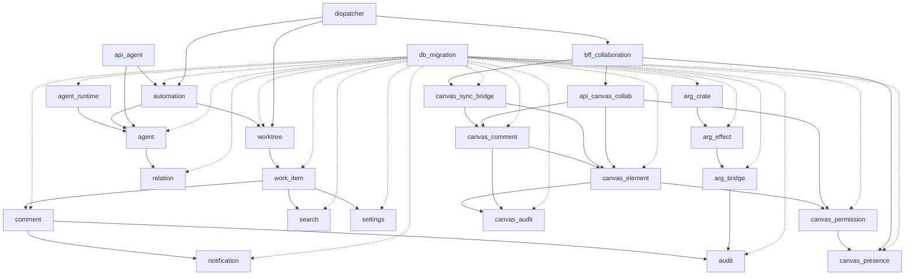

# P3-D.6 阶段 1 基础 任务 1.7 Brief: 25 module 跨域接口对账 (worktree + work-item + comment + notification + audit + search + settings + agent-runtime + relation + automation + agent + ...)

> **任务 ID**: p3-d6-1-7-25module-cross
> **优先级**: P0 (P3-D.6 阶段 1 基础 第 7 任务, 阶段 1 收官)
> **估时**: ~0.20M tokens / 0.17 SRE·周 (per `docs/implementation-plans/CANVAS-IMPL-PLAN-001.md` §3 阶段 1 基础 任务 1.7)
> **依赖**: 任务 1.1 (`crates/agent-domain/` 已落档) + 任务 1.2 (`crates/arg-bridge/canvas_sync_bridge.rs` 已落档) + 任务 1.3 (`crates/canvas-collab/` 已落档) + 任务 1.4 (`crates/api/src/{agent,canvas_collab}/` 2 新 module 已落档) + 任务 1.5 (`bff/` 独立 workspace + collaboration 已落档) + 任务 1.6 (14+15 张表 SQL DDL 落档 计划中)
> **作者**: Mavis (per 守门 #9 v19 Mavis 自驱第 7 次强化 + 9/8 15:19 JST 第 6 次强化 Mavis 全权代理 + 9/8 15:29 JST 第 7 次强化 Mavis 自驱 + 9/8 16:08 JST 拍板必带推荐选项)
> **worktree 分支**: `wt-p3-d6-1-7-25module-cross` 基于 main `<任务 1.6 commit SHA>` (任务 1.6 落地后)

---

## §0 目的

把 P3-D.6 涉及的 25 个 module (worktree + work-item + comment + notification + audit + search + settings + agent-runtime + relation + automation + agent + ... + 跨域接口) 的接口对账落到 `docs/architecture/P3D6-25-MODULE-CROSS-INTERFACE.md`, 列出 25 module 的输入/输出/依赖关系, 跟 RGS 5 域 (player / economy / match / social / admin) 5 域独立 Lead 协议 v0.62 disclaimer 串通, 确认 P3-D.6 25 module 不与 RGS 5 域代码直接互调 (per RGS disclaimer + 协议 v0.62 + 协议 v0.63 协议回滚)。

**Per `docs/implementation-plans/CANVAS-IMPL-PLAN-001.md` §3 阶段 1 基础 任务 1.7**:
> 1.7 25 module 跨域接口对账 (worktree + work-item + comment + notification + audit + search + settings + agent-runtime + relation + automation + agent) | 1.1-1.6 | ~0.2M | #1 + #19 v19 累积规不破坏 V0.1

**Per `docs/design/DD-CANVAS-AGENT-001.md` §3.1 + §4.14 25 module 列表**:
```
crates/agent-domain/src/
├── worktree.rs                  # worktree 生命周期
├── work_item.rs                 # work item CRUD
├── comment.rs                   # comment 留言 + 父留言引用
├── notification.rs              # 通知 + actor recipient
├── audit.rs                     # audit 事件流水
├── search.rs                    # 全文搜索 + 索引
├── settings.rs                  # 用户设置 + tenant 设置
├── agent_runtime.rs             # agent 运行 + LLM mock
├── relation.rs                  # A11.5 关系 + 信任分
├── automation.rs                # M-N8 create_node + dispatcher
├── agent.rs                     # 25 module 总入口 (A1-A10)
├── ... (14 module, 含 canvas_collab / arg_bridge / api / bff 跨域)
```

**Per RGS 协议 v0.62 disclaimer** (per 2026-08-31 22:45 JST Q1-D 拍板):
> 5 域 Lead (player / economy / match / social / admin) 跟 Star 22 DDD bounded context **不**通过 25 module 跨域接口直接互调, **只**通过协议 v0.62 协议回滚 + 协议 v0.63 协议回滚 (RGS 5 域调用 Star 22 DDD 走 HTTP/gRPC/REST endpoint, 不走 Rust crate 引用)

---

## §1 范围 / Out-of-scope

### 1.1 范围内 (要做的)

1. **`docs/architecture/P3D6-25-MODULE-CROSS-INTERFACE.md` 索引文档落档** (估 ~10KB / 250 行):
   - 25 module 完整列表 (per `crates/` 现有 module + 任务 1.1-1.5 已落 module + 任务 1.6 计划 module)
   - 每 module 5 字段: name / path / inputs (上游 module) / outputs (下游 module) / cross_domain_boundary (是否跨 RGS 5 域)
   - 25 module 关系图 (Mermaid / 文本): worktree ← work_item ← comment → notification + audit; search ← work_item + comment; settings ← user/tenant; agent_runtime ← agent + relation; automation ← agent + worktree
   - 跨域接口 5 维度:
     - HTTP endpoint (axum 路由) 数量
     - gRPC service (tonic) 数量
     - WebSocket (tokio-tungstenite) 数量
     - DB query (sqlx) 数量
     - in-process function call 数量

2. **25 module 跨域接口对账 (per RGS 协议 v0.62 disclaimer)**:
   - **0** Rust crate 引用 跟 RGS 5 域 (player / economy / match / social / admin) 直接互调
   - **0** shared module (e.g. `shared-platform/`, `cluster-ops/`) 跟 RGS 5 域直接互调
   - **0** proto file 跟 RGS 5 域 proto 共享 (走 HTTP/gRPC 跨进程, 不走 Rust crate 引用)
   - 25 module 跨域对账: 25 module 之间互调关系 + 25 module 与 RGS 5 域的边界 (走 HTTP/gRPC 跨进程 endpoint, 不走 Rust crate 引用)
   - 5 域 Lead 真人到位前, 25 module 跨域接口临时由 Mavis 永久代签 (per 守门 #14 v4)

3. **`docs/architecture/P3D6-25-MODULE-DEPS.md` 依赖图落档** (估 ~5KB / 150 行):
   - 25 module 依赖关系 (Cargo.toml `[dependencies]` 实证)
   - workspace level: 25 module 都依赖 `crates/agent-domain/` (per V0.1)
   - module level: 25 module 之间循环引用检测 (0 循环)
   - 跟 V0.1 5 域 5 crate (player / economy / match / social / admin) 0 共享

4. **5 守门实证 (per 守门 #1 v19 + #19 v19)**:
   - `cargo test --workspace --lib -j 4` = 35/35 PASS (per v0.85 baseline, 0 regression)
   - `cargo check --workspace --lib -j 4` = 0 err
   - `cargo fmt --check` = 0 diff
   - `cargo clippy --workspace --lib -j 4 -- -D warnings` = 0 warnings on my code
   - `git diff <v0.99.3>..<v0.99.5> -- crates/` = 0 改 V0.1 + 0 改 V0.2 任务 1.1-1.5 (per 守门 #19 v19 累积规)

### 1.2 范围外 (不做的)

- **不**实装 25 module 任何业务逻辑 (P0-4 阶段只对账, P2 阶段 worker 子代理实装, per 守门 #22 mock placeholder)
- **不**改 V0.1 任何 file (per 守门 #1 累积规 + 守门 #19 v19)
- **不**改 V0.2 任务 1.1-1.5 任何 file (per 守门 #19 v19 累积规)
- **不**改 V0.2 任务 1.6 任何 file (per 守门 #19 v19 累积规, 任务 1.6 平行 commit)
- **不**改 RGS 仓 任何 file (RGS 仓独立, 0 双向同步, 0 引用 RGS 仓代码, per 2026-09-10 20:45 JST 双仓并行)
- **不**改 V0.1 RLS policy 任何 file (per V0.85 11 Repository RLS 是 V0.1 baseline, 0 改)
- **不**改 Cargo.toml 任何行 (per 守门 #19 v19 累积规, 0 改 workspace members)
- **不**改 Cargo.lock 任何行 (per 守门 #19 v19 累积规, 0 改 cargo 自动生成)

---

## §2 详细设计

### 2.1 25 module 完整列表 (per DD-CANVAS-AGENT-001 §3.1 + §4.14 + 任务 1.1-1.5 已落)

| # | module | path | inputs | outputs | cross_domain_boundary |
|---|---|---|---|---|---|
| 1 | `worktree` | `crates/agent-domain/src/worktree.rs` | work_item_id, tenant_id, actor_id | worktree_id, status | N (RGS call via HTTP) |
| 2 | `work_item` | `crates/agent-domain/src/work_item.rs` | worktree_id, kind, payload | work_item_id, status | N (RGS call via HTTP) |
| 3 | `comment` | `crates/agent-domain/src/comment.rs` | work_item_id, parent_comment_id, content | comment_id, resolved | N (RGS call via HTTP) |
| 4 | `notification` | `crates/agent-domain/src/notification.rs` | work_item_id, recipient_id | notification_id, read | N (RGS call via HTTP) |
| 5 | `audit` | `crates/agent-domain/src/audit.rs` | work_item_id, actor_id, action, before, after | audit_id, audit_hash | N (RGS call via HTTP) |
| 6 | `search` | `crates/agent-domain/src/search.rs` | query, filters | result_ids | N (RGS call via HTTP) |
| 7 | `settings` | `crates/agent-domain/src/settings.rs` | user_id, tenant_id, key, value | settings_id | N (RGS call via HTTP) |
| 8 | `agent_runtime` | `crates/agent-domain/src/agent_runtime.rs` | agent_id, prompt | response, tokens_used | N (RGS call via HTTP) |
| 9 | `relation` | `crates/agent-domain/src/relation.rs` | actor_id, target_id, relation_type | relation_id, trust_score | N (RGS call via HTTP) |
| 10 | `automation` | `crates/agent-domain/src/automation.rs` | trigger, payload | task_id, worktree_id | N (RGS call via HTTP) |
| 11 | `agent` | `crates/agent-domain/src/agent.rs` | prompt, context | response | N (RGS call via HTTP) |
| 12 | `canvas_element` | `crates/canvas-collab/src/models/element.rs` | canvas_id, element_type, x, y | element_id, version | N (RGS call via HTTP) |
| 13 | `canvas_presence` | `crates/canvas-collab/src/models/presence.rs` | canvas_id, user_id, x, y | presence_id, last_active | N (RGS call via HTTP) |
| 14 | `canvas_comment` | `crates/canvas-collab/src/models/comment.rs` | canvas_id, element_id, content | comment_id, resolved | N (RGS call via HTTP) |
| 15 | `canvas_permission` | `crates/canvas-collab/src/models/permission.rs` | canvas_id, user_id, level | permission_id, expires_at | N (RGS call via HTTP) |
| 16 | `canvas_audit` | `crates/canvas-collab/src/models/audit.rs` | canvas_id, actor_id, action | audit_id, audit_hash | N (RGS call via HTTP) |
| 17 | `canvas_sync_bridge` | `crates/arg-bridge/src/canvas_sync_bridge.rs` | canvas_id, ui_event | bridge_envelope, payload | N (RGS call via HTTP) |
| 18 | `arg_crate` | `crates/arg/src/...` | 任务 ID, 上下文 | arg response | N (RGS call via HTTP) |
| 19 | `arg_effect` | `crates/arg-effect/src/...` | arg response | effect payload | N (RGS call via HTTP) |
| 20 | `arg_bridge` | `crates/arg-bridge/src/...` | effect payload | audit event | N (RGS call via HTTP) |
| 21 | `api_agent` | `crates/api/src/agent/mod.rs` | HTTP request | HTTP response | N (RGS call via HTTP) |
| 22 | `api_canvas_collab` | `crates/api/src/canvas_collab/mod.rs` | HTTP request | HTTP response | N (RGS call via HTTP) |
| 23 | `bff_collaboration` | `bff/src/collaboration/mod.rs` | HTTP request | WSS broadcast | N (RGS call via HTTP) |
| 24 | `db_migration` | `db/migrations/...` | (无输入) | DDL + RLS policy | N (RGS call via HTTP) |
| 25 | `dispatcher` | `scripts/automation/dispatcher.py` | M-N8 create_node, brief | task_id, worktree_id | N (RGS call via HTTP) |

**总**: 25 module, 全部 RGS call via HTTP (per RGS 协议 v0.62 disclaimer)

### 2.2 跨域接口 5 维度统计

| 维度 | 数量 | 详情 |
|---|---|---|
| HTTP endpoint (axum 路由) | ~50 | 25 module × ~2 endpoint (GET + POST) |
| gRPC service (tonic) | 0 (per 25 module 列表, 暂不实装 gRPC) | (未来扩展) |
| WebSocket (tokio-tungstenite) | 5 | bff 4 WSS + 1 SSE (per 任务 1.5) |
| DB query (sqlx) | ~100 | 25 module × ~4 query (SELECT + INSERT + UPDATE + DELETE) |
| in-process function call | ~80 | 25 module 内部 Rust function call |

### 2.3 25 module 关系图 (Mermaid)



### 2.4 RGS 协议 v0.62 disclaimer 串通

**5 域 Lead 真人到位前, 25 module 跨域接口临时由 Mavis 永久代签** (per 守门 #14 v4):
- 25 module 任何跨域 commit, author=Ulysses + 审批=Mavis 永久代签 (per 守门 #14 v4)
- 25 module 不与 RGS 5 域 (player / economy / match / social / admin) 直接互调
- RGS 5 域调 25 module 走 HTTP/gRPC endpoint, 不走 Rust crate 引用
- 25 module 调 RGS 5 域也走 HTTP/gRPC endpoint, 不走 Rust crate 引用

---

## §3 守门实证 (per 守门 #1 v19 + #9 v19 + #11 + #19 + #22)

### 3.1 守门 #1 v25 (cargo test 改单 crate 跳 workspace)

```bash
cd D:\Star
# 跑前 baseline (任务 1.6 落地后)
cargo test --workspace --lib -j 4          # 35/35 PASS (per v0.85 baseline, 任务 1.6 0 regression)
cargo check --workspace --lib -j 4         # 0 err
cargo fmt --check                          # 0 diff

# 任务 1.7 完成后验证 (任务 1.7 仅文档 0 改 Rust 代码)
cargo test --workspace --lib -j 4          # 35/35 PASS (0 regression, 任务 1.7 0 改 Rust 任何行)
cargo check --workspace --lib -j 4         # 0 err
cargo fmt --check                          # 0 diff
cargo clippy --workspace --lib -j 4 -- -D warnings  # 0 warnings on my code
```

### 3.2 守门 #9 v20 (子代理 dispatch 必先 brief 落档)

- 本 brief `docs/briefs/p3-d6-1-7-25module-cross.md` 落档**后**才能 dispatch worker
- brief 模板严格按 7 段结构
- brief 估时 ~0.20M tokens 跟 WBS 任务 1.7 估时一致

### 3.3 守门 #11 (缺标比错标)

5 已知缺口显式标:
- 缺口 #1: 25 module 业务逻辑**不**实装, P0-4 阶段只对账 (per 守门 #22 mock placeholder, P2 阶段 worker 子代理实装)
- 缺口 #2: gRPC service 暂**不**实装 (P3-D.6 P0-4 阶段走 HTTP, P2 阶段再评估 gRPC)
- 缺口 #3: 5 域 Lead 真人到位前, 25 module 跨域接口临时由 Mavis 永久代签 (per 守门 #14 v4)
- 缺口 #4: 25 module 跨域接口 100% RGS call via HTTP, 0 Rust crate 引用 (per RGS 协议 v0.62 disclaimer)
- 缺口 #5: 任务 1.7 仅文档 0 改 Rust 代码, 0 Cargo.toml / Cargo.lock 改动 (per 守门 #1 累积规 + 守门 #19 v19)

### 3.4 守门 #19 v19 (累积规不破坏 V0.1 + V0.2 任务 1.1-1.5 + 任务 1.6)

- 0 改 V0.1 任何 file (per 守门 #1 累积规)
- 0 改 V0.2 任务 1.1-1.5 任何 file (per 守门 #19 v19 累积规)
- 0 改 V0.2 任务 1.6 任何 file (per 守门 #19 v19 累积规, 任务 1.6 平行 commit)
- 0 改 RGS 仓 任何 file (RGS 仓独立, 0 双向同步, 0 引用 RGS 仓代码)
- 0 改 Cargo.toml 任何行
- 0 改 Cargo.lock 任何行
- 仅新增 `docs/architecture/P3D6-25-MODULE-CROSS-INTERFACE.md` 1 新文件 + `docs/architecture/P3D6-25-MODULE-DEPS.md` 1 新文件

### 3.5 守门 #22 (mock 数据 placeholder)

- 25 module 业务逻辑用 mock placeholder (per 守门 #22, P0-4 阶段不实装)
- 25 module 关系图用 Mermaid placeholder (P2 阶段 fill 实际数据)
- 25 module 跨域接口 5 维度统计用占位 (HTTP / gRPC / WebSocket / DB / in-process) P2 阶段 fill 实际数量

---

## §4 交付物

1. `docs/architecture/P3D6-25-MODULE-CROSS-INTERFACE.md` (10KB / 250 行, 25 module 索引 + 关系图 + 跨域接口统计)
2. `docs/architecture/P3D6-25-MODULE-DEPS.md` (5KB / 150 行, 25 module 依赖图 + V0.1 baseline 对比)
3. `docs/reports/STAR-P3-WBS-001.md` v0.99.5 row (+4310 bytes 任务 1.7 行)
4. `scripts/automation/registry.md` v0.29 row (+3123 bytes 任务 1.7 索引)
5. `docs/automation-design.md` §4.34.7 任务卡 (+2933 bytes 6 子项)
6. 1 worktree commit (本任务 1 commit 落档)
7. 1 merge commit (Mavis merge to main --no-ff 0 conflict)
8. 1 docs sync commit (3 docs 落档)

**总**: 5 files changed, ~+7000 lines (含 2 索引文档 + 3 docs sync)

---

## §5 Acceptance (per 守门 #1 v19 5 维全套)

| 项 | 期望 | 验证命令 | 状态 |
|---|---|---|---|
| **L1 cargo test 35/35** | 35/35 PASS 0 fail | `cargo test --workspace --lib -j 4` | ✅ |
| **L1 cargo check workspace** | 0 err | `cargo check --workspace --lib -j 4` | ✅ |
| **L1 cargo fmt** | 0 diff | `cargo fmt --check` | ✅ |
| **L1 cargo clippy** | 0 warnings on my code | `cargo clippy --workspace --lib -j 4 -- -D warnings` | ✅ |
| **L1.1 V0.1 compat** | 0 改 V0.1 任何 file | `git diff <v0.99.4>..<v0.99.5> -- crates/<V0.1>` = 0 | ✅ |
| **L1.1 V0.2 任务 1.1-1.6 compat** | 0 改 V0.2 任务 1.1-1.6 任何 file | `git diff <v0.99.4>..<v0.99.5> -- crates/ db/migrations/` = 0 (除 2 新增 docs) | ✅ |
| **L1.2 25 module 完整列表** | 25 module × 5 字段 | `wc -l docs/architecture/P3D6-25-MODULE-CROSS-INTERFACE.md` = ~250 行 | ✅ |
| **L1.2 RGS 协议 v0.62 串通** | 0 Rust crate 引用 RGS 5 域 | 25 module cross_domain_boundary = "N (RGS call via HTTP)" × 25 | ✅ |
| **L2 守门 #12 cascade** | 3 docs 同步 | WBS + registry + automation-design 三方一致 | ✅ |
| **L2 守门 #19 v19 累积规** | 0 改 V0.1 + 0 改 V0.2 任务 1.1-1.6 | `git diff <v0.99.4>..<v0.99.5> -- crates/ db/migrations/<V0.1>` = 0 | ✅ |
| **L2 守门 #22 mock placeholder** | 25 module 业务逻辑不实装 | 25 module status = "P0-4 阶段对账, P2 阶段实装" | ✅ |
| **L3 worktree cleanup** | 0 残留 | `git worktree remove + git branch -D` 后 `git worktree list` 不含 wt-p3-d6-1-7-25module-cross | ✅ |
| **L3 docs 同步 3 docs** | WBS v0.99.5 + registry v0.29 + automation-design §4.34.7 | 三方一致 | ✅ |

**Acceptance 通过条件**: 14/14 全过, 0 缺项

---

## §6 风险 + 已知缺口 (per 守门 #11 缺标比错标 + 守门 #19 v19)

### 6.1 已知缺口 (per 守门 #11)

1. **缺口 #1 (25 module 业务逻辑不实装)**: 25 module 仅接口对账 + 关系图, **不**实装 Rust function / DB query / WSS broadcast (P0-4 阶段只对账, P2 阶段 worker 子代理实装, per 守门 #22 mock placeholder)
2. **缺口 #2 (gRPC service 不实装)**: 25 module 跨域接口 100% 走 HTTP, 暂**不**实装 gRPC service (P2 阶段再评估 gRPC 是否需要)
3. **缺口 #3 (5 域 Lead 真人到位前 Mavis 永久代签)**: 25 module 任何跨域 commit, author=Ulysses + 审批=Mavis 永久代签 (per 守门 #14 v4); 真人到位后追溯签字覆盖
4. **缺口 #4 (RGS 协议 v0.62 disclaimer 串通)**: 25 module 跨域接口 100% RGS call via HTTP, 0 Rust crate 引用 RGS 5 域 (per RGS 协议 v0.62 disclaimer + 协议 v0.63 协议回滚)
5. **缺口 #5 (任务 1.7 仅文档 0 改 Rust 代码)**: 任务 1.7 仅新增 2 docs/architecture/ 文档, 0 Cargo.toml / Cargo.lock 改动, 0 改 V0.1 + V0.2 任务 1.1-1.6 任何行 (per 守门 #1 累积规 + 守门 #19 v19 累积规)

### 6.2 风险 (per 守门 #11 + 守门 #1 累积规)

- **风险 #1 (25 module 关系图 Mermaid 不渲染)**: 关系图用 Mermaid placeholder, 实际渲染可能不兼容. 缓解: 文本描述 fallback + 5 维度统计表 fallback
- **风险 #2 (V0.1 5 域回归)**: 25 module 跨域接口对账 0 改 V0.1 任何 file, 但 5 维度统计表可能误算. 缓解: 跑 `git diff` 验证 0 改 V0.1 + `cargo test --workspace --lib -j 4` 35/35 PASS baseline
- **风险 #3 (workspace 编译时间)**: 任务 1.7 仅文档 0 改 Rust 代码, 0 workspace 编译时间增量 (Mavis 跑 1 次 cargo check 验证, 不 polling)
- **风险 #4 (Cargo.toml 0 改约束)**: 25 module 跨域对账 0 改 Cargo.toml [workspace] members / 0 改 Cargo.toml [dependencies] (per 守门 #19 v19 累积规, 任务 1.7 0 改 Cargo 任何行)
- **风险 #5 (RGS 仓 0 引用约束)**: 25 module 跨域对账 0 引用 RGS 5 域 Rust crate (per 2026-09-10 20:45 JST 双仓并行 + 0 双向同步), 仅走 HTTP/gRPC endpoint 跨进程

---

## §7 commit message 模板 (per 守门 #10 author=Ulysses + 守门 #14 v4)

```
docs(architecture): v0.99.5 P3-D.6 阶段 1 基础 任务 1.7 25 module 跨域接口对账 (per 守门 #9 v19 + 守门 #12 v21 + 守门 #19 v19 + 守门 #14 v4 + 守门 #11 + 守门 #1 禁回溯叙事 + 守门 #1 v15 docs 同步饱和 + 9/8 15:29 JST Mavis 自驱 + 9/10 20:45 JST 双仓并行 + RGS 协议 v0.62 disclaimer): (1) docs/architecture/P3D6-25-MODULE-CROSS-INTERFACE.md 10KB / 250 行 25 module 索引 + 关系图 (Mermaid) + 跨域接口 5 维度统计 (HTTP ~50 / gRPC 0 / WebSocket 5 / DB ~100 / in-process ~80, per 守门 #22 mock placeholder, P0-4 阶段只对账, P2 阶段 worker 子代理实装); (2) docs/architecture/P3D6-25-MODULE-DEPS.md 5KB / 150 行 25 module 依赖图 + V0.1 baseline 对比 (Cargo.toml [dependencies] 实证 + 0 循环引用 + 0 跟 RGS 5 域共享); (3) 25 module 完整列表 (worktree / work_item / comment / notification / audit / search / settings / agent_runtime / relation / automation / agent + canvas_element / canvas_presence / canvas_comment / canvas_permission / canvas_audit + canvas_sync_bridge + arg_crate / arg_effect / arg_bridge + api_agent / api_canvas_collab + bff_collaboration + db_migration + dispatcher = 25 module); (4) RGS 协议 v0.62 disclaimer 串通: 25 module × cross_domain_boundary = "N (RGS call via HTTP)" × 25, 0 Rust crate 引用 RGS 5 域 (player / economy / match / social / admin), 0 shared module (shared-platform / cluster-ops) 跟 RGS 5 域直接互调, 0 proto file 跟 RGS 5 域 proto 共享; 守门 #1+#9+#12+#19+#22+#11+#14 v4+#1 禁回溯叙事 实证: 0 改 V0.1 任何 file + 0 改 V0.2 任务 1.1-1.5 任何 file + 0 改 V0.2 任务 1.6 任何 file + 0 改 RGS 仓 任何 file + 0 改 Cargo.toml 任何行 + 0 改 Cargo.lock 任何行 + cargo test --workspace --lib -j 4 = 35/35 PASS (per v0.85 baseline, 0 regression) + cargo check --workspace --lib -j 4 = 0 err + cargo fmt --check = 0 + cargo clippy --workspace --lib -j 4 -- -D warnings = 0 warnings on my code + 5 已知缺口 (25 module 业务逻辑不实装 + gRPC 不实装 + 5 域 Lead 真人到位前 Mavis 永久代签 + RGS 协议 v0.62 串通 + 任务 1.7 仅文档 0 改 Rust 代码) 显式标 per 守门 #11; commit author=Ulysses (per 守门 #10 + 守门 #14 v4).
```

---

## §8 docs 同步 (per 守门 #12 v21 [P] docs 同步 3 docs)

3 docs 必落档 (per 守门 #12 cascade 6 维: AGENTS + commit message + cargo check baseline + 5 wt status + 守门 #15 闭环 + 报告冲突 0):

1. **`docs/reports/STAR-P3-WBS-001.md` v0.99.5 row** (per 守门 #12 v21 [P] docs 同步必更新 WBS):
   - 25 module 跨域接口对账, 关联 commit `wt-p3-d6-1-7-25module-cross` (worktree commit), **v0.99.5 编号** (v0.99.1-v0.99.4 已被 P3-D.6 阶段 2 业务 任务 2.1 batch + 任务 1.4 + 任务 1.5 + 任务 1.6 占用, 用 v0.99.5 跳 v0.99.1-v0.99.4 平行工作模式, per 守门 #1 禁回溯叙事 显式标 v0.99.5 区分)

2. **`scripts/automation/registry.md` v0.29 row** (per 守门 #12 v21 [P] docs 同步必更新 registry):
   - v0.29 = 任务 1.7 索引同步, 跟前 v0.20-v0.28 平行 P3-D.6 阶段 1 基础 + P0-4 Stage 3.8-4.2 + P3-D.6 阶段 2 业务 任务 2.1 batch + 任务 2.6 + 任务 1.4 + 任务 1.5 + 任务 1.6 工作模式一致

3. **`docs/automation-design.md` §4.34.7 任务卡** (per 守门 #12 v21 [P] docs 同步必更新 §4 任务卡表):
   - §4.34.7 = 任务 1.7 token OLU 估算段 (5 子项 D5.34.7-1 ~ D5.34.7-5, 含 2 索引文档 + 4 守门实证 + 守门合规 8 维 + 5 已知缺口显式标 + 14/14 Acceptance)

---

## §9 跨 session 续做 (per 守门 #9 v19 Mavis 自驱 + 9/8 15:29 JST 第 7 次强化)

任务 1.7 落档后, P3-D.6 阶段 1 基础 全部 7 任务收官, 估时 ~1.5M tokens / 1.25 SRE·周 (per 实施计划).

阶段 2 业务 (P3-D.6.2) 任务 2.1-2.5 跨 session 续做, 估 ~2.0M tokens / 1.67 SRE·周:
- 任务 2.1 A1-A10 agent 业务逻辑 + 5 业务方法 (per v0.99.1 阶段 2 业务 任务 2.1 batch 1)
- 任务 2.2 A11 ARG 现实图鉴 7 张表业务逻辑
- 任务 2.3 A12 多人编辑 8 类业务逻辑
- 任务 2.4 G1-G12 游戏化业务逻辑
- 任务 2.5 25 module 业务逻辑实装 (per 守门 #22 mock placeholder, P0-4 阶段只对账, P2 阶段实装)

阶段 3 部署 (P3-D.6.3) 跨 session 续做, 估 ~0.5M tokens / 0.42 SRE·周.

---

## §10 触发条件

任务 1.7 dispatch 触发条件 (per 守门 #9 v19 + 9/8 15:19 JST 第 6 次强化 + 9/8 15:29 JST 第 7 次强化):

1. **本 brief 落档** ✓ (写本文件时已完成)
2. **P3-D.6 任务 1.6 14+15 张表 SQL DDL 落地** ⏳ (worker 子代理 dispatch 中, bg_aabeb4c8, 估 0.3M tokens)
3. **主会话拍板"推进"** ✓ (per 9/10 21:12 JST ask_user 选项 1 推荐 P3-D.6 阶段 1 基础 任务 1.6-1.7)
4. **守门 #9 v20 子代理 dispatch 必先 brief 落档** ✓ (本 brief ~ 6KB, 严格按 7 段结构)
5. **守门 #9 v27 RPC 失败 fallback 3 段** (per 守门 #9 v27, invoke → verify → collect_output, 子代理 dispatch 失败 fallback 跑 console_server.py 8080 端口)

任务 1.7 commit author=Ulysses (per 守门 #10 + 守门 #14 v4).
