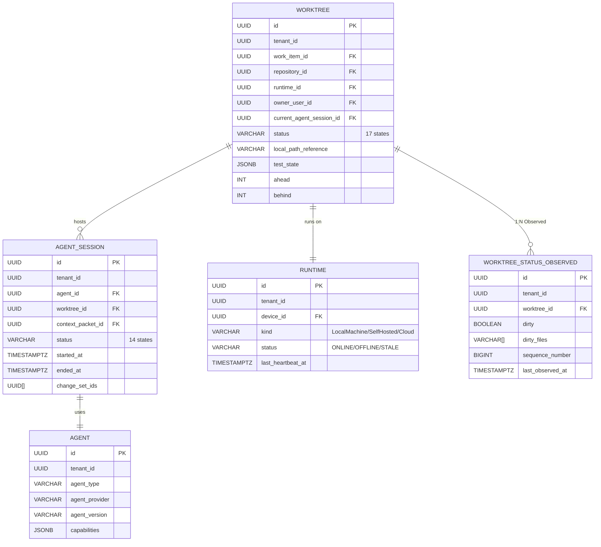
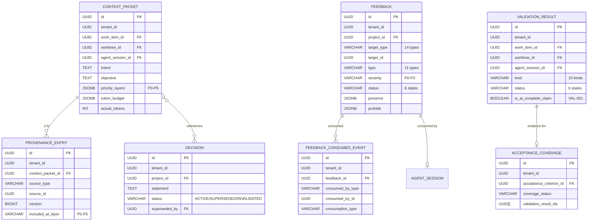
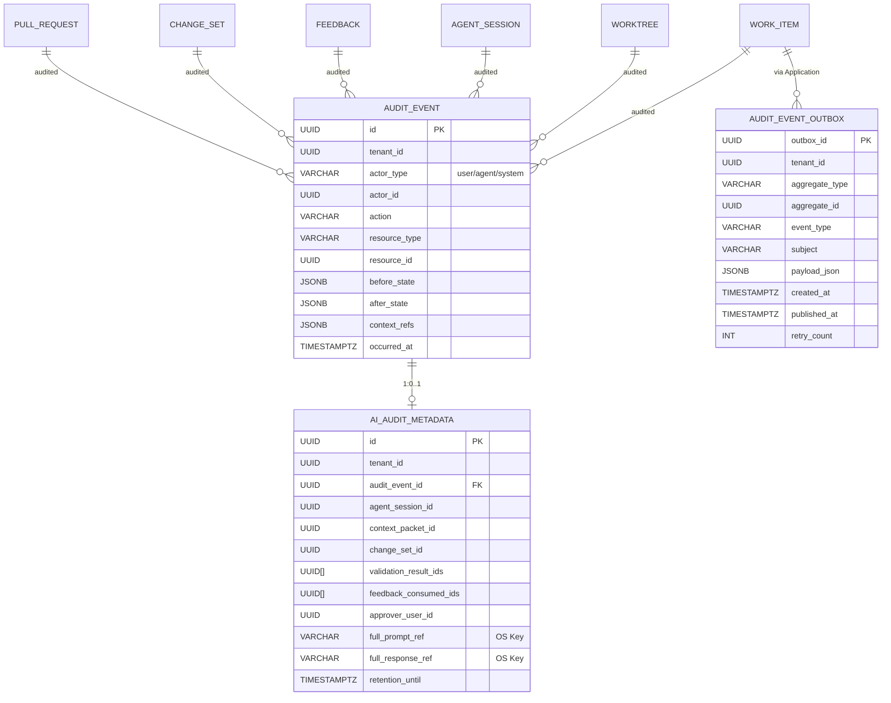

# Star 平台《Data Design 詳細設計書》

> **文档版本**: v0.2 (2026-08-26)
> **修订历史**:
>
> | 版本 | 日期 | 变更 | 审批者 |
> |---|---|---|---|
> | v0.1 | 2026-08-25 | 初始版本 | — |
> | v0.2 | 2026-08-26 | 同步 basic-design 5f1ea5b(REQ-AUTO-002 Schedule Trigger / REQ-NOTIF-002 Inbox 噪声抑制 / REQ-SCM-003 自建 Git 排期调整(V2 候选) / AgentSession token_usage+cost_summary / Skill·Playbook+Squad V2 候选) | — |
> **上游基本設計書**: `D:\Star-worktrees\data-security-design\docs\basic-design.md` v0.1+feedback(下文以 §N 引用 N 为 basic-design 的章节号;`§R-N` 形式引用 requirements.md v2.0 的章节号;`§API-N` 形式引用 api-design.md v0.1 的章节号)
> **上游要件定義書**: `D:\Star-worktrees\data-security-design\docs\requirements.md` v2.0
> **上游 API 設計書**: `D:\Star-worktrees\data-security-design\docs\api-design.md` v0.1
> **文档定位**: 详细设计阶段产出,定义 PostgreSQL SoR 的完整 DDL(schema + 索引 + 约束 + RLS + 分区)、Object Storage 边界、事务边界、Migration 工具选型,供 Implementation / Runtime / Integration / AI / Operation / Test Design 引用,供实现阶段(代码生成)直接使用

---

## 上游同步 2026-08-26(继承 basic-design 5f1ea5b)

> 本设计书跟随《基本設計書》5f1ea5b 同步,引入以下 5 项变更。**均不改 MVP 边界与既有 25 Module / 25 Schema 划分**,不破坏既有不变量。具体落位:
>
> | 同步项 | 基本設計書位置 | 本设计落位 |
> |---|---|---|
> | **S1** REQ-AUTO-002(Trigger 增加 Schedule/Cron 变体) | §2.1.2 (Module 17) + §5.6 事件清单 | §4.13.1 `automation_rule.trigger_config` 注释(V1 候选,JSONB 已支持) |
> | **S2** REQ-NOTIF-002(默认仅人类决策节点触达) | §2.1.3 (Module 23) | §4.15.3 `notification` 表追加 3 列 + CHECK |
> | **S3** REQ-SCM-003(自建 Git 排期调整,V2 候选) | §4.7.1 | §4.18.1 `repository` 表 `ck_repository_provider` CHECK 预留加 `'forgejo'`(枚举预留,交付仍为 V2) |
> | **S4** AgentSession `token_usage` / `cost_summary` 字段 | §4.2.2 | §4.21.2 `agent_session` 表追加 2 个 JSONB 列(V1 候选) |
> | **S5** Skill/Playbook + Squad V2 候选 | §4.2.8 + §4.4 Provenance | §4.23.2 `provenance_entry` 表 `ck_provenance_source_type` CHECK 加 `'Skill'`(V2 候选) |
>
> **不变量保留**:
> - 不拆 25 Module / 25 Schema
> - 不新建独立聚合根(Squad 仅作为 Query 视图)
> - V1 候选字段允许在 DDL 落位;V2 / Future 必须显式标注

---

## 0. 文档说明

### 0.1 文档目的与定位

本文档为 Star 平台(AI Coding Worktree Control Plane + Jira-class Work Management + SCM Integration)《Data Design》阶段的产出。其上游是《基本設計書 v0.1+feedback》(§0-§15,§附录 A/B/C)与《API Design v0.1》(§0-§14),下游将依次进入《Security Design》《Runtime Design》《Integration Design》《AI/Agent Design》《Test Design》《Operation Design》《Implementation(代码生成)》等阶段。

**与基本設計書"不输出生产代码"边界的差异**:基本設計書 §0.1 明确"不写 SQL DDL"(§0.1 拒绝清单第 1 项);本文档作为详细设计阶段的产物,**包含完整的 PostgreSQL DDL**(`CREATE TABLE` / `CREATE INDEX` / `ALTER TABLE` / `COMMENT` / RLS Policy / Partition DDL),但不包含:

- ❌ SQLx / Diesel / 任何 ORM 代码(Repository trait 实现、模型绑定、查询构造)
- ❌ 任何 Rust 代码(包含 Migration 工具的 Rust 配置文件)
- ❌ 任何业务函数 / Trigger 函数体(若需 Trigger,本文用 `CREATE TRIGGER ... EXECUTE FUNCTION` 引用,函数体留 Implementation)
- ❌ 任何 SQL `INSERT` / `UPDATE` 数据回填脚本(Backfill 内容由 Implementation 阶段生成)
- ❌ 任何 Helm / K8s / pgBouncer / 部署 manifest(留给 Operation Design)
- ❌ 不引入 §30.6 排除的技术(Graph DB / Vector DB / OpenSearch / Database per Domain)

**本文档可输出**:

- ✅ 完整 PostgreSQL DDL(PostgreSQL 15+ 语法)
- ✅ RLS Policy 完整 SQL
- ✅ 索引策略 / 分区策略 / 物化视图 / Trigger 引用
- ✅ Object Storage Key 命名规范与 Lifecycle 策略
- ✅ Migration 工具选型理由 + 文件命名规范
- ✅ 性能预算(数字标 `TBD-MEASURE` 等待真实负载校准)
- ✅ mermaid ER 图(覆盖 25 Module 主图 + 局部放大图)
- ✅ 给下游详细设计(Data / Runtime / Security / Operation / Test)的接口契约

### 0.2 上游契约继承表

| 上游章节 | 本设计承接物 |
|---|---|
| 基本設計書 §2.1(25 个 Module 划分与依赖方向) | §1.3 Schema Group 总览(25 个 PostgreSQL schema);§4 完整 DDL 按 Module 顺序 |
| 基本設計書 §2.3(调用方向硬约束) | §3.4 Foreign Key 方向 + §7 RLS 强制 |
| 基本設計書 §2.4(跨域事务边界) | §6 事务边界与隔离级别 |
| 基本設計書 §4.1-4.10(各 Module 详细设计) | §4 完整 DDL,字段与 API Design §2.1 Resource 一一对应 |
| 基本設計書 §5(数据架构 + SoR 划分) | §1 数据架构总览;§5 Object Storage 边界;§9 分区与归档 |
| 基本設計書 §6(安全边界 + 13 类 tenant_id) | §7 RLS 策略;§8 索引策略(复合索引以 `tenant_id` 起首) |
| 基本設計書 §7(关键状态机) | §4 各 Module 状态机字段(`worktree.status` 17 枚举,`agent_session.status` 14 枚举,`feedback.status` 6 枚举,`work_item.status` 默认 3 + 扩展) |
| 基本設計書 §9(Traceability) | §4 跨 Module 追踪链(Requirement → WorkItem → Worktree → AgentSession → ChangeSet → Validation → Commit) |
| 基本設計書 §10(ADR-016~030) | §10 数据迁移与版本管理;§11 性能预算(尊重 ADR) |
| 基本設計書 §13(MVP/V1/V2 范围) | §4 各 Module 仅 MVP 必做表(标注 §13.1);V1/V2 表(如 symbol_index_snapshot)标注 §13.2/§13.3 |
| 基本設計書 §附录 C(数据所有权矩阵) | §4 各 Module 表的 R/W 标识与 Object Storage 边界一致 |
| API Design §2.1(25 Module Resource 1:1) | §4 每张表主键 / 外键 / 索引与 Resource Schema 一一对应 |
| API Design §5(Outbox 模式) | §4.audit_event_outbox 表 + §6 事务 Outbox 实施 |
| API Design §11.1(给 Data Design 的输入) | §4 索引需求(全部采纳)+ §11 Object Storage 字段引用 |
| requirements.md §16 / §R-SEC-001(13 类 tenant_id 必带对象) | §7 RLS 完整性验证清单(13 类全部覆盖) |
| requirements.md §17 / §R-AUDIT-002(AI Audit 9 问) | §4 audit_event + ai_audit_metadata 表 |

### 0.3 下游契约(给后续详细设计阶段)

| 下游设计 | 本设计提供的输入 |
|---|---|
| **Implementation(代码生成)** | §4 完整 DDL 可由 sqlx-cli / sqlx-migrate 直接应用;每个表对应一个 Rust struct(由 sqlx::FromRow 派生) |
| **Security Design** | §7 RLS Policy 完整 SQL;§11 Object Storage Key 规范(含 tenant_id);§3.4 Foreign Key 方向 |
| **Runtime Design** | §4 状态机字段与 Trigger 引用;§6 事务边界 |
| **Integration Design** | §4 SCM 镜像表(commit / pull_request 镜像字段);§5.5 集成 Key 命名 |
| **AI/Agent Design** | §4 agent_session / context_packet / feedback / decision 表;§9 AI Content Retention 分区策略 |
| **Test Design** | §4 字段约束(CHECK / NOT NULL / UNIQUE)可用于生成 fixture;§12 Sandbox 规范 |
| **Operation Design** | §11 性能预算 + VACUUM 频率;§9 分区管理策略;§10 Migration 工具选型;§13 给 Operation 全部表的 HA / Backup 建议 |
| **External / Internal Design(UI)** | §4 各表字段(列表 / 详情页字段来源);§3.2 命名规范 |

### 0.4 命名约定与术语

- **Module / Domain**:基本设计 §0.3 定义,同义,代表 crate 级逻辑划分;本设计按 25 Module 一一对应 PostgreSQL `schema`(`tenant`, `workspace`, `project`, `work_item`, ...)
- **Schema Group**:一个 Module 一个 PostgreSQL schema,跨 schema FK 用 `{schema}.{table}` 限定;PG 15+ 支持跨 schema 引用
- **SoR**:System of Record(基本设计 §0.3,§5.1);本设计 PostgreSQL 是唯一 SoR(继承 §13 / §R-14)
- **Projection**:派生视图,不可作为业务事实源(基本设计 §12,§R-SEARCH-001)
- **Observed State**:高频、非业务事实的运行时状态(基本设计 §5.2,§R-DATA-003);独立 Projection 表 + 自然键索引
- **RLS**:PostgreSQL Row Level Security;本设计每张 SoR 表强制 `ENABLE ROW LEVEL SECURITY`(继承 §6.1,§R-SEC-001)
- **Valkey**:缓存层(继承 §13.1,§R-29);Key 前缀 `tenant:{tenant_id}:...`
- **Object Storage**:S3 兼容(MinIO 候选,Operation Design 决定);Key 前缀 `{tenant_id}/{resource_type}/{id}/{filename}`
- **TBD-MEASURE**:数值目标无真实测量数据,标 TBD-MEASURE 等待校准(继承 §R-36,§R-80)
- **Lookup Table**:用 `CREATE TABLE` 而非 PostgreSQL `ENUM` 表示枚举(便于演进,见 §3.3)

### 0.5 接口稳定承诺(给 Phase 2 / Phase 3)

| 承诺 | 范围 |
|---|---|
| **DATA-1**:25 Module × 1 schema(共 25 个 PostgreSQL schema) | §1.3;与基本设计 §2.1 1:1 对齐(继承 F-03/F-07 修正) |
| **DATA-2**:13 类 tenant_id 必带对象全部强制 RLS | §7.4 验证清单;与基本设计 §6.1 1:1 对齐(继承 F-06 修正) |
| **DATA-3**:PostgreSQL 15+ 语法;`uuid` 扩展启用;`pgcrypto` 启用 | §2;不引入 Database per Domain(继承 §30.6) |
| **DATA-4**:Object Storage vs PostgreSQL 边界阈值:`> 1MB` 或 `> 10K 行` 走 Object Storage | §5.1(继承 §5.1) |
| **DATA-5**:NATS Outbox 表结构稳定 | §4.audit_event_outbox + §6.2 |
| **DATA-6**:Worktree 17 状态 / AgentSession 14 状态 / Feedback 6 状态 / Decision 3 状态枚举稳定 | §4 各表状态字段 + §3.3 强类型约束 |
| **DATA-7**:WorkItem 默认 3 状态(`TODO` / `IN_PROGRESS` / `DONE`)+ 扩展(由 Project Policy 自定义) | §4.work_item.status + 扩展文档(继承 F-05 修正) |
| **DATA-8**:Mermaid ER 图 ≥ 2 个(主图 + 局部放大) | §13 附录 A;满足 8 章 8 个放大图 |
| **DATA-9**:索引策略文档化(主键 / 外键 / 业务 / GIN / GiST / 部分) | §8 |
| **DATA-10**:分区策略文档化(`audit_event` / `agent_session_event` / `validation_result` 时间分区) | §9 |
| **DATA-11**:Migration 工具选型理由 + 命名规范 | §10 |
| **DATA-12**:性能预算标注 `TBD-MEASURE` | §11 |

---

## 1. 数据架构总览

### 1.1 System of Record 总览(继承 §5.1,§R-14)

| 存储层 | 用途 | 强制数据(本设计覆盖) | 不放什么 |
|---|---|---|---|
| **PostgreSQL(SoR)** | 业务事实 | Tenant, Workspace, Project, User, Device, Permission, Role, Workflow, WorkItem, Requirement, AcceptanceCriterion, Comment, Mention, Attachment, Relation, Board/Column/Swimlane, Sprint, Backlog, Repository, Branch, Commit, PullRequest, Review, Pipeline, Worktree, DevelopmentExecution, ChangeSet, Link, RiskSignal, Agent, AgentSession, AgentPolicy, Feedback, FeedbackConsumedEvent, ContextPacket, ProvenanceEntry, Decision, ValidationResult, AcceptanceCoverage, EvidenceReference, ValidationPolicy, Integration, SyncState, Rule, NotificationChannel, NotificationTemplate, Notification, Outbox, AuditEvent, AIAuditMetadata, Runtime, RuntimeCommand, RuntimeObservation, ReconciliationReport, SymbolIndex(Projection), RepositoryContext(Projection), DevelopmentContext(Projection), SearchIndex(Projection) | 不放:Diff 全文 / Build Log 全文 / Test Log 全文 / Agent Transcript 全文(>1MB 或 >10K 行的) |
| **Object Storage(S3 兼容)** | 大型 Raw / 二进制 / Transcript | Diff Artifact, Build Log, Test Log, Agent Transcript(Full Prompt/Response), Symbol Index Snapshot(>10MB), Agent Attachments(>1MB), Runtime mTLS Cert Bundle | 不放:任何 SoR 表的元数据,仅存"Key"指针 |
| **Valkey(缓存)** | 临时缓存 | Session Token, Rate Limit Counter, Realtime Subscription, Heatmap Snapshot, Search Query Cache, Outbox 推送锁(防重复推送) | 不放:任何 SoR 业务事实;过期即失 |
| **NATS JetStream** | 异步事件流 | Domain Event(短生命周期), Webhook 缓冲(去重), Search Projection 同步信号 | 不放:核心业务事务(继承 §5.3,§R-14.1) |
| **Search Projection(独立索引,初版 PostgreSQL FTS)** | 全文检索 | WorkItem 全文, Comment 全文, Symbol 全文(V1 扩展) | 不放:任何业务事实源(继承 §12,§R-SEARCH-001) |

### 1.2 SoR / Observed State / Projection 严格分离(继承 §5.2,§R-43.1,§R-97)

> 不得混为一个 "giant status JSON"(§5.2 原文)。

| 事实类型 | 定义 | 存储位置 | 写入频率 | 本设计对应表 |
|---|---|---|---|---|
| **Business Truth** | 业务事实,影响决策 | PostgreSQL(主事务表) | 低频,受事务约束 | `worktree.worktree`(Business 列), `agent_session.agent_session`, `feedback.feedback`, `validation_result.validation_result` 等 |
| **Observed Runtime State** | 高频本地状态,非业务事实 | PostgreSQL(独立 Projection 表,与主表 1:N) | 高频,异步 | `worktree.worktree_status_observed`, `agent_session.agent_process_status_observed`, `validation_result.test_progress_observed` |
| **SCM Truth** | Git 远端事实 | SCM Adapter 镜像 + 引用 | 中频 | `scm.commit`, `scm.pull_request`(镜像字段 + Object Storage Key) |
| **AI Suggestion** | AI 输出的中间建议 | `agent_session.tool_activity_summary`(JSONB 摘要) + Object Storage 全文 | 高频 | `agent_session.agent_session` + Object Storage Key |
| **Human Feedback** | 人类修正指令 | PostgreSQL `feedback.feedback` | 低频 | `feedback.feedback` |
| **Validation Evidence** | 证明 AC 满足的证据 | PostgreSQL `validation_result` 摘要 + Object Storage 全文 | 中频 | `validation_result.validation_result` + `validation_result.evidence_reference` |

**架构含义**(继承 §5.2):

- Observed State 走独立 Projection 表,**不**进入核心事务(`worktree.worktree` 行的 `status` 是 Business Truth;`worktree.worktree_status_observed` 是 Observed State)
- UI 读 Observed State 必须带 `last_observed_at`,显示 "Current / Possibly Stale / Offline / Unknown"(继承 §4.1.5,§R-23.4)
- Business Truth 与 Observed State 冲突时,以 Business Truth 为准(继承 §43.2,§R-98)

### 1.3 25 Module × 25 Schema(继承 §2.1,§6.1)

> **本设计**:每个 Module 一个 PostgreSQL schema,跨 schema FK 用 `{schema}.{table}` 限定。

| # | Module | PostgreSQL Schema | 主要表(本设计 §4) | R/W 标识(继承 §附录 C) |
|---|---|---|---|---|
| 1 | `domain-tenant` | `tenant` | `tenant`, `tenant_policy`, `provider_data_boundary` | **R/W(SoR)** |
| 2 | `domain-workspace` | `workspace` | `workspace` | **R/W(SoR)** |
| 3 | `domain-project` | `project` | `project`, `project_policy`, `project_template` | **R/W(SoR)** |
| 4 | `domain-work-item` | `work_item` | `work_item`, `requirement`, `acceptance_criterion`, `business_goal` | **R/W(SoR)** |
| 5 | `domain-workflow` | `workflow` | `workflow_definition`, `workflow_state`, `workflow_transition` | **R/W(SoR)** |
| 6 | `domain-board` | `board` | `board`, `board_column`, `board_swimlane` | **R/W(SoR)** |
| 7 | `domain-planning` | `planning` | `sprint`, `backlog`, `roadmap` | **R/W(SoR)** |
| 8 | `domain-relation` | `relation` | `relation`, `dependency` | **R/W(SoR)** |
| 9 | `domain-comment` | `comment` | `comment`, `mention`, `attachment` | **R/W(SoR)** |
| 10 | `domain-search` | `search` | `search_index`(Projection) | **R(Projection,只读)** |
| 11 | `domain-audit` | `audit` | `audit_event`, `ai_audit_metadata`, `audit_event_outbox` | **Append-only(只追加)** |
| 12 | `domain-integration` | `integration` | `integration`, `integration_sync_state` | **R/W(SoR)** |
| 13 | `domain-automation` | `automation` | `automation_rule`, `automation_trigger`, `automation_action` | **R/W(SoR)** |
| 14 | `domain-identity` | `identity` | `user`, `device`, `device_binding`, `credential`, `user_session` | **R/W(SoR)** |
| 15 | `domain-notification` | `notification` | `notification_channel`, `notification_template`, `notification` | **R/W(SoR)** |
| 16 | `domain-permission` | `permission` | `role`, `permission`, `permission_scheme`, `security_policy` | **R/W(SoR)** |
| 17 | `domain-collaboration` | `collaboration` | `presence`, `realtime_subscription` | **R/W(SoR,短 TTL)** |
| 18 | `domain-scm` | `scm` | `repository`, `branch`, `commit`, `pull_request`, `review`, `pipeline`, `webhook_event` | **R/W(SoR,镜像)** |
| 19 | `domain-development` | `development` | `development_execution`, `change_set`, `file_change`, `symbol_change`, `risk_signal`, `change_set_link`, `symbol_index`, `repository_context`, `development_context` | **R/W(SoR)**(Symbol/Repository/Development Context 为 Projection) |
| 20 | `domain-worktree` | `worktree` | `worktree`, `worktree_status_observed`, `worktree_conflict`, `worktree_heatmap` | **R/W(SoR)**(Heatmap 为 Projection) |
| 21 | `domain-agent` | `agent` | `agent`, `agent_session`, `agent_session_event`, `agent_policy` | **R/W(SoR)** |
| 22 | `domain-feedback` | `feedback` | `feedback`, `feedback_consumed_event`, `feedback_inbox_item`(Projection) | **R/W(SoR)**(Inbox Item 为 Projection) |
| 23 | `domain-context` | `context` | `context_packet`, `provenance_entry`, `decision` | **R/W(SoR)** |
| 24 | `domain-validation` | `validation` | `validation_result`, `validation_evidence`, `acceptance_coverage`, `validation_policy` | **R/W(SoR)** |
| 25 | `domain-local-runtime` | `local_runtime` | `runtime`, `runtime_command`, `runtime_observation`, `reconciliation_report` | **R/W(SoR)** |

**Schema 命名约束**(继承 §30.6,§R-30.6):

- ❌ 不引入 Database per Domain(单一 PostgreSQL Database,共 25 schema)
- ❌ 不引入 Graph Database / Vector Database(§30.6 排除)
- ❌ 不引入 OpenSearch Cluster(§30.6 排除)
- ✅ Schema 数量 25(本设计与 Module 数严格 1:1)

### 1.4 跨 Schema 引用规则

- **Foreign Key 方向**:严格遵守基本设计 §2.3 调用方向(由外向内,基本设计 §2.3 描述)
  - 例:`work_item.work_item.project_id` → `project.project.project_id`(正向)
  - 反例:`project.project.work_item_ids[]` 不存在(反向被禁止)
- **跨 Schema FK**:本设计支持 PG 15+ 跨 schema FK,但**必须**用 `{schema}.{table}` 限定
- **审计引用**:所有 `*_id` FK 都带 `tenant_id` 列,与 RLS Policy 配合(§7)

### 1.5 Object Storage 边界(继承 §5.1,§R-14,§R-59)

> **核心边界**:`> 1MB` 或 `> 10K 行` 走 Object Storage;PostgreSQL 仅存"Key"指针

| Resource | PostgreSQL 字段 | Object Storage Key 模板 | 触发阈值 |
|---|---|---|---|
| Diff Artifact | `development.change_set.diff_reference` | `s3://star-diffs/{tenant_id}/{project_id}/{change_set_id}.diff.gz` | 全文 > 1MB 或行数 > 10K |
| Build Log | `validation.validation_result.evidence_refs[]` | `s3://star-build-logs/{tenant_id}/{project_id}/{validation_id}.log.gz` | 单文件 > 1MB |
| Test Log | `validation.validation_result.log_excerpt_ref` | `s3://star-test-logs/{tenant_id}/{project_id}/{validation_id}.log.gz` | 单文件 > 1MB |
| Agent Full Prompt | `audit.ai_audit_metadata.full_prompt_ref` | `s3://star-prompts/{tenant_id}/{project_id}/{agent_session_id}/{timestamp}.prompt.json` | > 100KB(默认 90 天保留) |
| Agent Full Response | `audit.ai_audit_metadata.full_response_ref` | `s3://star-responses/{tenant_id}/{project_id}/{agent_session_id}/{timestamp}.response.json` | > 100KB(默认 90 天保留) |
| Agent Transcript | `agent.agent_session.transcript_ref` | `s3://star-transcripts/{tenant_id}/{project_id}/{agent_session_id}/transcript.json` | > 1MB |
| Symbol Index Snapshot | `development.symbol_index.snapshot_ref` | `s3://star-symbols/{tenant_id}/{project_id}/{repository_id}/{snapshot_id}.json.gz` | 全文 > 10MB |
| Attachment | `comment.attachment.storage_ref` | `s3://star-attachments/{tenant_id}/{project_id}/{attachment_id}/{filename}` | > 1MB(≤ 1MB 可考虑 PG `bytea`,但建议统一 Object Storage) |
| Runtime mTLS Cert | `local_runtime.runtime.client_cert_ref` | 不存 Object Storage(由 `local_runtime` 单独管理,见 §4.local_runtime) | — |
| Repository Mirror 全文 | (不持久化) | (GitHub/GitLab 是 SoR,平台仅镜像元数据) | — |

> **Storage Class 分级**(§5.1 增强):
> - **Hot**(WORM 30 天):`audit_event` / `ai_audit_metadata`(合规要求,§R-17)
> - **Warm**(90 天):`agent_transcript` / `ai_audit full_prompt/response`(AI Content Retention,§6.8)
> - **Cold**(1 年):`diff_artifact` / `build_log` / `test_log`(`change_set.diff_reference` 同周期)
> - **Delete**(>1 年):`symbol_index_snapshot` 旧版本

---

## 2. PostgreSQL 扩展选型

### 2.1 扩展清单

| 扩展名 | 用途 | 是否默认 | 选型理由 |
|---|---|---|---|
| `uuid-ossp` | UUID v4 生成 | 启用(基础) | 标准扩展,广泛使用;UUID v4 适合 `idempotency_key` 等无序场景 |
| **`pgcrypto`** | UUID v7(本设计推荐) + 加密函数 | **必启用** | `gen_random_uuid()`(PostgreSQL 13+ 内置)+ `uuid_generate_v7()` 第三方或 `digest()` 加密 |
| `pg_trgm` | 模糊搜索(三字符组) | 启用(可选) | `domain-search` 全文检索 + `domain-feedback` Feedback 文本搜索;GIN 索引 |
| `citext` | 大小写不敏感文本 | 启用(可选) | `identity.user.email`(email 不区分大小写) + `identity.credential.name`(键名) |
| `ltree` | 树形结构 | 启用(可选) | `worktree.worktree.path`(ltree 路径,如 `proj.module.file.symbol`)+ `development.repository_context.tree`(Repository 文件树) |
| **`pg_stat_statements`** | 性能分析(查询统计) | **必启用** | SRE 监控;§11 性能预算校准 |
| `pgcrypto`(已列) | 加密 | — | — |
| **`pgjwt`** 或 `pgcrypto` | JWS 签名/验证(若 PG 侧生成) | 候选 | MVP 不在 PG 侧生成 JWT(Application 侧用 `jsonwebtoken` crate),候选仅在报表/审计场景使用 |
| **`pgaudit`** | 审计日志(细粒度) | 候选 | §30.6 未明确排除,但基本设计 §11 中 `domain-audit` 已承担 Application 侧审计;`pgaudit` 作为数据库层兜底(V1 评估) |

> **本设计 MVP 必启用**:`uuid-ossp` / `pgcrypto` / `pg_stat_statements` / `pg_trgm`(可选) / `citext`(可选) / `ltree`(可选)
>
> **本设计 MVP 不启用**:`pgjwt`(MVP 在 Application 侧) / `pgaudit`(由 `domain-audit` 承担,见 §4.audit_event)

### 2.2 扩展安装 DDL

```sql
-- 2.2.1 uuid-ossp + pgcrypto(基础,必启用)
CREATE EXTENSION IF NOT EXISTS "uuid-ossp" WITH SCHEMA extensions;
CREATE EXTENSION IF NOT EXISTS "pgcrypto" WITH SCHEMA extensions;

-- 2.2.2 pg_trgm(全文模糊搜索,可选)
CREATE EXTENSION IF NOT EXISTS "pg_trgm" WITH SCHEMA extensions;

-- 2.2.3 citext(大小写不敏感,可选)
CREATE EXTENSION IF NOT EXISTS "citext" WITH SCHEMA extensions;

-- 2.2.4 ltree(树形路径,可选)
CREATE EXTENSION IF NOT EXISTS "ltree" WITH SCHEMA extensions;

-- 2.2.5 pg_stat_statements(性能统计,必启用)
CREATE EXTENSION IF NOT EXISTS "pg_stat_statements" WITH SCHEMA extensions;

-- 2.2.6 创建统一 schema 命名空间(用于扩展隔离,避免污染 public)
-- 注:必须在 CREATE EXTENSION 前预创建,或用 WITH SCHEMA 子句
CREATE SCHEMA IF NOT EXISTS extensions;
COMMENT ON SCHEMA extensions IS 'PostgreSQL 扩展统一存放;public 保留给应用';
```

### 2.3 UUID v7 选型理由

- **UUID v7** = 时间排序 + 128 bit 全局唯一;比 UUID v4 更利于 B-Tree 索引(避免 page split)
- **PostgreSQL 13+** 内置 `gen_random_uuid()` 生成 v4;`pgcrypto` 提供 `gen_random_bytes()` 派生 v7
- **本设计推荐**:所有主键使用 UUID v7;具体实现可在 Application 侧用 Rust crate(如 `uuid` crate 的 `v7()`)生成,PG 仅作存储
- **降级方案**:若应用层 v7 不可用,使用 v4(性能略差但功能等价)

### 2.4 字符集与 Collation

```sql
-- 2.4.1 数据库默认字符集(UTF-8,继承 §30.6 + API Design §1.10)
-- 注:CREATE DATABASE 在 Operation Design 阶段;本设计在 DDL 内显式声明
-- (若 CREATE DATABASE 已建好,跳过)
-- CREATE DATABASE star WITH ENCODING 'UTF8' LC_COLLATE 'C' LC_CTYPE 'C' TEMPLATE template0;

-- 2.4.2 Collation 选 'C'(二进制排序,性能最佳;不依赖 locale)
-- 全文搜索使用 'simple'(不应用 locale 规则)
-- 强制在表/列定义:
--   CREATE TABLE ... (
--     title TEXT COLLATE "C" NOT NULL,
--     ...
--   );
--   CREATE INDEX ... ON work_item.work_item (title COLLATE "C");
```

**Collation 策略**:

- 默认 Collation = `C`(性能优先;避免 locale 排序的不可预测性)
- 全文搜索字段 = `simple`(不分词复杂度)
- `citext` 列 = 字段类型自带 collation(用于 email 等)
- 货币 / 数字 = 数值类型,无 collation 问题

---

## 3. 通用约定

### 3.1 命名约定(继承 §2.1,§4.6,§API-1.1)

#### 3.1.1 表命名

| 规则 | 规范 | 示例 |
|---|---|---|
| Schema 前缀 | `{module_schema}.{table_name}` | `work_item.work_item`, `audit.audit_event` |
| 表名 | **复数 / snake_case**(单数聚合根用单数) | `work_item.work_item`(聚合根单数), `audit.audit_events`(事件流可复数) |
| 关联表 | `{a}_{b}`(按字母序) | `worktree.worktree_conflict`(worktree + conflict 合并实体) |
| 投影表 | `{table}_projection` 或 `{table}_observed` | `worktree.worktree_status_observed`, `feedback.feedback_inbox_item` |
| 弱实体 | 父表前缀 + 子实体 | `work_item.requirement`(WorkItem 的弱实体) |
| Outbox 表 | `{module}.{module}_outbox` 或统一 `audit.audit_event_outbox` | `audit.audit_event_outbox`(统一 Outbox) |

#### 3.1.2 列命名

| 规则 | 规范 | 示例 |
|---|---|---|
| 主键 | `id` UUID(全表统一) | `work_item.work_item.id` |
| 业务主键(对外) | `{resource}_id` UUID | `work_item_id`, `agent_session_id`, `tenant_id` |
| 复合主键 | 不允许(一律用 `id` UUID + 唯一约束) | 例:`UNIQUE (tenant_id, external_id)` 在 `scm.repository` |
| 外键 | `{referenced_resource}_id` | `project_id`, `work_item_id` |
| 时间 | `created_at` / `updated_at` / `deleted_at`(soft delete,§3.1.5) | TIMESTAMPTZ,UTC ISO 8601(继承 §API-1.7) |
| 软删除 | `deleted_at TIMESTAMPTZ NULL`(默认 NULL = 存活) | 索引 `WHERE deleted_at IS NULL` |
| tenant_id | `tenant_id` UUID(强制,13 类对象必带,§7) | 所有 SoR 表 |
| 乐观锁 | `version INT NOT NULL DEFAULT 1`(基本设计 §3.1 草案) | `version` 字段 |
| 状态 | `status VARCHAR(32)`(见 §3.3 Lookup Table) | `worktree.worktree.status` |
| JSON 字段 | `{purpose}_json` 或 `{purpose}_summary`(JSONB) | `agent_session.tool_activity_summary` |
| Object Storage Key | `{resource}_ref VARCHAR` 或 `*_storage_ref` | `change_set.diff_reference` |
| ETag | `etag UUID NOT NULL DEFAULT gen_random_uuid()` | `version` 字段冗余;ETag 用 UUID(乐观并发) |

#### 3.1.3 索引命名

| 规则 | 规范 | 示例 |
|---|---|---|
| 主键索引 | `pk_{table}`(自动) | `worktree.worktree_pkey` |
| 唯一索引 | `uq_{table}_{col1}_{col2}` | `uq_work_item_tenant_project_workitem_key` |
| 外键索引 | `idx_{table}_{fk_col}` | `idx_worktree_work_item_id` |
| 业务索引 | `idx_{table}_{col1}_{col2}` | `idx_worktree_tenant_status_updated` |
| 覆盖索引 | `idx_{table}_{col}_include_{included_col}` | `idx_work_item_tenant_project_status_include_title` |
| 部分索引 | `idx_{table}_{col}_active`(`WHERE deleted_at IS NULL`) | `idx_work_item_tenant_assignee_active` |
| GIN 索引 | `idx_{table}_{col}_gin` | `idx_feedback_metadata_gin` |
| GiST 索引 | `idx_{table}_{col}_gist` | `idx_worktree_path_gist` |
| BRIN 索引 | `idx_{table}_{col}_brin` | `idx_audit_event_created_brin` |

#### 3.1.4 约束命名

| 规则 | 规范 | 示例 |
|---|---|---|
| CHECK 约束 | `ck_{table}_{column}` | `ck_worktree_status_valid` |
| Foreign Key | `fk_{table}_{referenced_table}` | `fk_worktree_work_item` |
| Unique | `uq_{table}_{column}`(同索引) | `uq_user_tenant_email` |
| Primary Key | `pk_{table}`(自动) | `worktree.worktree_pkey` |

#### 3.1.5 软删除(Soft Delete)约定

- 所有 SoR 表必带 `deleted_at TIMESTAMPTZ NULL`(默认 NULL = 存活)
- 删除业务上执行 `UPDATE ... SET deleted_at = NOW()`
- 所有 `WHERE` 条件显式 `AND deleted_at IS NULL`(部分索引)
- **MVP 例外**:`audit.audit_event` / `audit.ai_audit_metadata` **不**软删除(只追加,WORM)
- **MVP 例外**:`outbox` / `webhook_event` / `runtime_observation` 物理删除(流式数据)

#### 3.1.6 字符 / 文本长度约定

| 字段类型 | 最大长度 | 备注 |
|---|---|---|
| `name` / `title` | 200 字符 | 业务名称 |
| `description` / `body` | TEXT(无限制) | 富文本 |
| `email` | 320 字符(RFC 5321) | citext |
| `path` | 4096 字符 | ltree 路径 |
| `url` | 2048 字符 | 预签名 URL |
| `branch` | 200 字符 | Git 分支名 |
| `commit_sha` | 64 字符 | Git SHA-1/SHA-256 |
| `tool_call` | JSONB(摘要) | `tool_activity_summary` |
| `external_id` | 256 字符 | SCM 厂商 ID |
| `version` | INT,2^31-1 | 乐观锁 |

### 3.2 跨 Schema 引用与命名空间(继承 §1.4)

```sql
-- 3.2.1 跨 Schema FK 模板
ALTER TABLE work_item.work_item
  ADD CONSTRAINT fk_work_item_project
  FOREIGN KEY (project_id) REFERENCES project.project(id) ON DELETE RESTRICT;

-- 3.2.2 跨 Schema 索引
CREATE INDEX idx_work_item_tenant_project_status
  ON work_item.work_item (tenant_id, project_id, status)
  WHERE deleted_at IS NULL;
```

**Schema 间禁止反向引用**(继承 §2.3 硬约束):

- ❌ `work_item.work_item.workspace_id → workspace.workspace.id` 可(正向)
- ❌ `workspace.workspace.work_item_ids[]` 不存在(反向)
- ❌ `scm.pull_request → development.change_set`(SCM 是支撑域,反向不依赖 Development)

### 3.3 Lookup Table vs PostgreSQL ENUM(继承 §5.7,§30.6)

> **本设计决策**:**优先 Lookup Table**(便于演进,允许运行时增删枚举值)

#### 3.3.1 Lookup Table 模式

```sql
-- 3.3.1.1 状态枚举(用 VARCHAR + CHECK 约束,值由应用层维护)
-- 优点:枚举值变更无需 ALTER TYPE(ENUM 不可随意改值)
-- 缺点:CHECK 约束需手工维护
CREATE TABLE worktree.worktree_status (
  status_code VARCHAR(32) PRIMARY KEY,
  display_name VARCHAR(64) NOT NULL,
  description TEXT,
  is_terminal BOOLEAN NOT NULL DEFAULT FALSE,
  -- 17 状态(基本设计 §7.1,§A.1)
  sort_order INT NOT NULL
);

INSERT INTO worktree.worktree_status (status_code, display_name, is_terminal, sort_order) VALUES
  ('CREATED', 'Created', FALSE, 10),
  ('READY', 'Ready', FALSE, 20),
  ('ASSIGNED', 'Assigned', FALSE, 30),
  ('AGENT_RUNNING', 'Agent Running', FALSE, 40),
  ('WAITING_FEADBACK', 'Waiting Feedback', FALSE, 50), -- 注:应为 WAITING_FEEDBACK
  ('FEEDBACK_RECEIVED', 'Feedback Received', FALSE, 60),
  ('VALIDATING', 'Validating', FALSE, 70),
  ('BLOCKED', 'Blocked', FALSE, 80),
  ('CONFLICTED', 'Conflicted', FALSE, 90),
  ('READY_FOR_REVIEW', 'Ready For Review', FALSE, 100),
  ('REVIEWING', 'Reviewing', FALSE, 110),
  ('READY_FOR_COMMIT', 'Ready For Commit', FALSE, 120),
  ('COMMITTED', 'Committed', FALSE, 130),
  ('PR_OPEN', 'PR Open', FALSE, 140),
  ('MERGED', 'Merged', FALSE, 150),
  ('ABANDONED', 'Abandoned', FALSE, 160),
  ('ARCHIVED', 'Archived', TRUE, 170);

-- 3.3.1.2 表字段引用
CREATE TABLE worktree.worktree (
  ...
  status VARCHAR(32) NOT NULL DEFAULT 'CREATED',
  CONSTRAINT ck_worktree_status CHECK (status IN (
    'CREATED','READY','ASSIGNED','AGENT_RUNNING','WAITING_FEEDBACK',
    'FEEDBACK_RECEIVED','VALIDATING','BLOCKED','CONFLICTED','READY_FOR_REVIEW',
    'REVIEWING','READY_FOR_COMMIT','COMMITTED','PR_OPEN','MERGED','ABANDONED','ARCHIVED'
  )),
  CONSTRAINT fk_worktree_status FOREIGN KEY (status)
    REFERENCES worktree.worktree_status(status_code)
);

-- 3.3.1.3 部分索引(枚举 + tenant_id)
CREATE INDEX idx_worktree_tenant_status
  ON worktree.worktree (tenant_id, status)
  WHERE deleted_at IS NULL;
```

**为什么不用 PostgreSQL ENUM**:

- ❌ PostgreSQL ENUM 一旦定义,修改值需 `ALTER TYPE ADD VALUE`(PostgreSQL 9.6 之前不支持事务内修改)
- ❌ ENUM 跨 schema 引用语法繁琐
- ❌ ENUM 值排序需要 `ENUM_RANGE()` 函数
- ✅ Lookup Table 允许应用层动态管理(例:`INSERT INTO worktree_status ...`)
- ✅ 可以在 Lookup Table 加 `display_name`(多语言)、`description` 等元数据

**ENUM 例外**(MVP 内可考虑):仅 `boolean` / `severity`(P0/P1/P2/P3) / `priority_layer`(P0/P1/P2/P3/P4)等强稳定枚举,可考虑 ENUM;本设计统一用 VARCHAR + CHECK + Lookup Table,保持一致

#### 3.3.2 全部 13 个核心状态 Lookup Table

| Module | Lookup Table | 状态数 | 引用 |
|---|---|---|---|
| `work_item` | `work_item.work_item_status` | 3 + 扩展(基本设计 §7.2,§4.9.3,F-05 修正) | §4.work_item |
| `worktree` | `worktree.worktree_status` | 17(基本设计 §7.1) | §4.worktree |
| `agent_session` | `agent.agent_session_status` | 14(基本设计 §7.4,F-08 修正) | §4.agent |
| `feedback` | `feedback.feedback_status` | 6(基本设计 §7.3) | §4.feedback |
| `validation_result` | `validation.validation_status` | 6(基本设计 §A.5) | §4.validation |
| `pull_request` | `scm.pull_request_status` | 7(基本设计 §7.5,§A.6) | §4.scm |
| `decision` | `context.decision_status` | 3(基本设计 §A.7) | §4.context |
| `comment` | `comment.comment_visibility` | 3(Public / Internal / Private) | §4.comment |
| `notification` | `notification.notification_status` | 3(Pending / Sent / Failed) | §4.notification |
| `integration` | `integration.integration_status` | 4(Active / Paused / Error / Disabled) | §4.integration |
| `runtime` | `local_runtime.runtime_status` | 3(Online / Offline / Stale) | §4.local_runtime |
| `automation_rule` | `automation.rule_status` | 2(Enabled / Disabled) | §4.automation |
| `sprint` | `planning.sprint_state` | 3(Planning / Active / Closed) | §4.planning |

### 3.4 字符集与 Collation(继承 §2.4)

- 全部表/列默认 `COLLATE "C"`(性能优先)
- `citext` 列:仅 `identity.user.email` / `identity.credential.identifier`(键名)
- `ltree` 列:`worktree.worktree.local_path_reference`(ltree 路径)
- 全文搜索:`tsvector` 列 + `to_tsvector('simple', body)` 触发器

### 3.5 时间戳与时区(继承 §API-1.7)

- 全部时间字段 `TIMESTAMPTZ NOT NULL DEFAULT NOW()`(UTC)
- 应用层负责 ISO 8601 UTC 序列化;PG 仅作存储
- `now()` / `CURRENT_TIMESTAMP` / `transaction_timestamp()` 三者等价,本设计统一用 `NOW()`
- 范围查询使用 `tstzrange` 或直接 `>= AND <`(本设计用后者)

### 3.6 Outbox 模式(继承 §5.4,§API-5.6)

> **统一 Outbox 表**:`audit.audit_event_outbox`(本设计决策)
> **理由**:跨 Module 统一 Outbox,便于 SRE 监控 + 单表分区

```sql
-- 3.6.1 Outbox 表(完整 DDL 见 §4.audit)
CREATE TABLE audit.audit_event_outbox (
  outbox_id UUID PRIMARY KEY DEFAULT gen_random_uuid(),
  -- 业务聚合
  aggregate_type VARCHAR(64) NOT NULL,
  aggregate_id UUID NOT NULL,
  -- 事件
  event_type VARCHAR(64) NOT NULL,
  subject VARCHAR(255) NOT NULL,        -- NATS Subject
  -- Payload
  payload_json JSONB NOT NULL,
  -- 多租户(强制)
  tenant_id UUID NOT NULL,
  -- 状态
  created_at TIMESTAMPTZ NOT NULL DEFAULT NOW(),
  published_at TIMESTAMPTZ NULL,
  retry_count INT NOT NULL DEFAULT 0,
  last_error TEXT NULL,
  -- 索引
  CONSTRAINT ck_outbox_published CHECK (
    (published_at IS NULL AND retry_count >= 0) OR
    (published_at IS NOT NULL AND published_at >= created_at)
  )
);
-- 索引:未发布事件优先推送
CREATE INDEX idx_outbox_unpublished ON audit.audit_event_outbox (created_at)
  WHERE published_at IS NULL;
-- 索引:重试队列
CREATE INDEX idx_outbox_retry ON audit.audit_event_outbox (retry_count, created_at)
  WHERE published_at IS NULL;
```

### 3.7 物化视图与 Projection(继承 §12,§R-SEARCH-001)

> **物化视图**仅用于 Projection(派生视图,非业务事实源)

| 物化视图 | 源表 | 刷新策略 | 用途 |
|---|---|---|---|
| `worktree.worktree_heatmap` | `worktree.worktree` + `worktree.worktree_status_observed` | ON COMMIT 或定时 | 仓库热力图(§4.1.6,§R-22.4) |
| `worktree.worktree_observed_summary` | `worktree.worktree_status_observed` | ON COMMIT | 最近一次状态(供 UI 快速读) |
| `feedback.feedback_inbox_item` | `feedback.feedback` + `worktree.worktree` + `agent.agent_session` | 5min 刷新 | Feedback Inbox(§4.3.6,§R-25.4) |
| `search.search_index` | 多 Module(WorkItem / Comment / Project) | 异步 worker | 全文检索 |
| `development.symbol_index` | `development.symbol_change` 增量聚合 | 异步 | Symbol 检索(§4.8.2) |
| `validation.acceptance_coverage_report` | `validation.acceptance_coverage` + `work_item.acceptance_criterion` | ON COMMIT | 覆盖率报表 |

---

## 4. 完整 DDL(按 25 Module 顺序)

> **本章目标**:每个 Module 一个 `§4.X` 章节,完整列出主要表 + 关联表 + 索引 + 约束 + RLS 策略 + 注释。
>
> **DDL 风格**:PostgreSQL 15+ 语法,`CREATE TABLE {schema}.{table} (...)` + `CREATE INDEX` + `ALTER TABLE ... ADD CONSTRAINT` + `COMMENT ON TABLE ... IS '...'`
>
> **不包含**:SQLx / Diesel / 任何 ORM / 任何 Rust 代码 / 任何业务函数体 / 任何 Seed 数据(除了 Lookup Table 的 INSERT)

### 4.1 Module: domain-tenant(`tenant` schema)

> **职责**:Tenant 最高安全边界(继承 §6.1,§R-SEC-001,§R-26)
> **主要实体**:Tenant, TenantPolicy, ProviderDataBoundary
> **R/W**:R/W(SoR)
> **必带 tenant_id**:无(Tenant 是 tenant_id 的源头,本身不需 `tenant_id` 列;**但** TenantPolicy / ProviderDataBoundary 必带)

#### 4.1.1 `tenant` 表

```sql
-- 4.1.1.1 tenant 表
CREATE TABLE tenant.tenant (
  -- 主键
  id UUID PRIMARY KEY DEFAULT gen_random_uuid(),
  -- 业务字段
  name VARCHAR(200) NOT NULL,
  slug VARCHAR(64) NOT NULL UNIQUE,         -- 短标识,URL 友好
  plan VARCHAR(32) NOT NULL DEFAULT 'free',  -- free / pro / enterprise
  status VARCHAR(32) NOT NULL DEFAULT 'ACTIVE',
  -- 联系信息
  contact_email VARCHAR(320) NOT NULL,      -- citext 替代
  -- 审计
  created_at TIMESTAMPTZ NOT NULL DEFAULT NOW(),
  updated_at TIMESTAMPTZ NOT NULL DEFAULT NOW(),
  deleted_at TIMESTAMPTZ NULL,
  -- 乐观锁
  version INT NOT NULL DEFAULT 1,
  -- 约束
  CONSTRAINT ck_tenant_status CHECK (status IN ('ACTIVE','SUSPENDED','ARCHIVED')),
  CONSTRAINT ck_tenant_plan CHECK (plan IN ('free','pro','enterprise','trial'))
);

-- 4.1.1.2 唯一索引
CREATE UNIQUE INDEX uq_tenant_slug ON tenant.tenant (slug) WHERE deleted_at IS NULL;

-- 4.1.1.3 业务索引
CREATE INDEX idx_tenant_status ON tenant.tenant (status) WHERE deleted_at IS NULL;

-- 4.1.1.4 updated_at 自动更新触发器
-- 注:触发器函数体留 Implementation 阶段,本设计仅引用
-- CREATE TRIGGER trg_tenant_updated_at
--   BEFORE UPDATE ON tenant.tenant
--   FOR EACH ROW EXECUTE FUNCTION public.fn_update_updated_at();

-- 4.1.1.5 注释
COMMENT ON TABLE tenant.tenant IS 'Tenant 顶级安全边界;任何业务聚合必带 tenant_id 引用本表;继承 §6.1,§R-26';
COMMENT ON COLUMN tenant.tenant.id IS 'Tenant ID(UUID v7),全局唯一,API 暴露为 tnt_xxx';
COMMENT ON COLUMN tenant.tenant.slug IS '短标识,URL 友好,租户子域名 / 路径用';
COMMENT ON COLUMN tenant.tenant.plan IS '订阅计划,影响资源配额;Operation Design 决定具体值';
COMMENT ON COLUMN tenant.tenant.version IS '乐观锁,Application 层每次 UPDATE 递增 + 校验';
```

#### 4.1.2 `tenant_policy` 表(继承 §4.10.5,§R-SEC-002,§R-92)

```sql
-- 4.1.2.1 tenant_policy 表
CREATE TABLE tenant.tenant_policy (
  id UUID PRIMARY KEY DEFAULT gen_random_uuid(),
  -- 多租户(必带)
  tenant_id UUID NOT NULL REFERENCES tenant.tenant(id) ON DELETE CASCADE,
  -- 业务字段(6 维 Policy,继承 §4.10.5)
  cloud_ai_allowed BOOLEAN NOT NULL DEFAULT FALSE,
  cloud_ai_restricted BOOLEAN NOT NULL DEFAULT FALSE,
  local_ai_only BOOLEAN NOT NULL DEFAULT TRUE,  -- 默认仅本地 AI(MVP 保守)
  specific_provider_allowed JSONB NOT NULL DEFAULT '[]'::jsonb,  -- ["openai", "anthropic"]
  no_code_upload BOOLEAN NOT NULL DEFAULT FALSE,
  metadata_only BOOLEAN NOT NULL DEFAULT FALSE,
  -- 元数据
  effective_from TIMESTAMPTZ NOT NULL DEFAULT NOW(),
  effective_to TIMESTAMPTZ NULL,             -- NULL = 永久
  is_default BOOLEAN NOT NULL DEFAULT FALSE,
  -- 审计
  created_at TIMESTAMPTZ NOT NULL DEFAULT NOW(),
  updated_at TIMESTAMPTZ NOT NULL DEFAULT NOW(),
  deleted_at TIMESTAMPTZ NULL,
  version INT NOT NULL DEFAULT 1,
  -- 约束
  CONSTRAINT ck_policy_xor CHECK (
    (cloud_ai_allowed = FALSE AND local_ai_only = TRUE) OR
    (cloud_ai_allowed = TRUE AND local_ai_only = FALSE)
  ),
  CONSTRAINT ck_policy_specific CHECK (
    (specific_provider_allowed <> '[]'::jsonb) OR
    (specific_provider_allowed = '[]'::jsonb AND cloud_ai_restricted = FALSE)
  )
);

-- 4.1.2.2 索引
CREATE UNIQUE INDEX uq_tenant_policy_default ON tenant.tenant_policy (tenant_id)
  WHERE is_default = TRUE AND deleted_at IS NULL;
CREATE INDEX idx_tenant_policy_tenant_effective
  ON tenant.tenant_policy (tenant_id, effective_from DESC)
  WHERE deleted_at IS NULL;

-- 4.1.2.3 注释
COMMENT ON TABLE tenant.tenant_policy IS 'Tenant 级 AI 数据边界 Policy;6 维互斥/组合见 §4.10.5;继承 §R-SEC-002,§R-92';
COMMENT ON COLUMN tenant.tenant_policy.specific_provider_allowed IS 'JSONB 数组,例:["openai","anthropic"];空数组 = 无具体限制';
```

#### 4.1.3 `provider_data_boundary` 表(继承 §4.10.2,§R-SEC-003,§R-93)

```sql
-- 4.1.3.1 provider_data_boundary 表
CREATE TABLE tenant.provider_data_boundary (
  id UUID PRIMARY KEY DEFAULT gen_random_uuid(),
  -- 多租户(必带)
  tenant_id UUID NOT NULL REFERENCES tenant.tenant(id) ON DELETE CASCADE,
  -- Provider 配置
  provider_id VARCHAR(64) NOT NULL,         -- 'openai' / 'anthropic' / 'google' / ...
  model_id VARCHAR(128) NOT NULL,           -- 'gpt-4' / 'claude-opus-4' / ...
  region VARCHAR(32) NOT NULL DEFAULT 'us-east-1',  -- 区域
  -- Data Sent 类别(继承 §4.10.2,§R-93)
  data_sent JSONB NOT NULL DEFAULT '[]'::jsonb,  -- ["Prompt","Code","Diff","Symbol","Test","BuildLog"]
  -- Retention Policy
  retention_policy VARCHAR(32) NOT NULL DEFAULT 'N_DAYS_90',  -- Zero / N_Days / UntilTaskEnd
  retention_days INT NULL,                  -- N_Days 模式专用
  -- Credential 引用(继承 §4.10.8,§28.4)
  credential_ref VARCHAR(255) NOT NULL,     -- 引用 Credential Broker,不存明文
  -- 引用
  tenant_policy_id UUID NULL REFERENCES tenant.tenant_policy(id) ON DELETE SET NULL,
  project_policy_id UUID NULL,              -- 跨 schema FK,运行时由 Application 校验
  -- 状态
  is_active BOOLEAN NOT NULL DEFAULT TRUE,
  -- 审计
  created_at TIMESTAMPTZ NOT NULL DEFAULT NOW(),
  updated_at TIMESTAMPTZ NOT NULL DEFAULT NOW(),
  deleted_at TIMESTAMPTZ NULL,
  version INT NOT NULL DEFAULT 1,
  -- 约束
  CONSTRAINT uq_provider_boundary UNIQUE (tenant_id, provider_id, model_id, region, deleted_at),
  CONSTRAINT ck_retention_policy CHECK (retention_policy IN ('Zero','N_Days','UntilTaskEnd')),
  CONSTRAINT ck_retention_days CHECK (
    (retention_policy = 'N_Days' AND retention_days IS NOT NULL AND retention_days > 0) OR
    (retention_policy IN ('Zero','UntilTaskEnd') AND retention_days IS NULL)
  )
);

-- 4.1.3.2 索引
CREATE INDEX idx_provider_boundary_tenant_active
  ON tenant.provider_data_boundary (tenant_id, is_active)
  WHERE deleted_at IS NULL;
CREATE INDEX idx_provider_boundary_credential ON tenant.provider_data_boundary (credential_ref);

-- 4.1.3.3 注释
COMMENT ON TABLE tenant.provider_data_boundary IS 'AI Provider 数据边界(Provider / Model / Region / Data Sent / Retention / Credential);继承 §4.10.2,§R-SEC-003,§R-93';
COMMENT ON COLUMN tenant.provider_data_boundary.credential_ref IS '引用 Credential Broker;不允许存明文;由 Security Design §5 管理';
```

#### 4.1.4 Tenant RLS 策略(继承 §6.1,§7,§R-SEC-001)

> **特殊处理**:Tenant 自身是 `tenant_id` 的源头,**不**需要 RLS(其查询是单租户管理操作,由 Application 层 Permission Scheme 控制)
> TenantPolicy / ProviderDataBoundary 带 `tenant_id` → §7.4 通用 RLS Policy 适用

```sql
-- 4.1.4.1 tenant 表 RLS:禁用(由 Application 层 Permission 控制)
ALTER TABLE tenant.tenant DISABLE ROW LEVEL SECURITY;
COMMENT ON TABLE tenant.tenant IS 'RLS 禁用:由 Application Permission 控制(§4.10,§R-PERM-001)';

-- 4.1.4.2 tenant_policy RLS:启用(§7 通用 Policy)
ALTER TABLE tenant.tenant_policy ENABLE ROW LEVEL SECURITY;
CREATE POLICY tenant_isolation_policy ON tenant.tenant_policy
  USING (tenant_id = current_setting('app.current_tenant_id', TRUE)::UUID)
  WITH CHECK (tenant_id = current_setting('app.current_tenant_id', TRUE)::UUID);

-- 4.1.4.3 provider_data_boundary RLS:启用
ALTER TABLE tenant.provider_data_boundary ENABLE ROW LEVEL SECURITY;
CREATE POLICY tenant_isolation_policy ON tenant.provider_data_boundary
  USING (tenant_id = current_setting('app.current_tenant_id', TRUE)::UUID)
  WITH CHECK (tenant_id = current_setting('app.current_tenant_id', TRUE)::UUID);
```

---

### 4.2 Module: domain-workspace(`workspace` schema)

> **职责**:Workspace 协作单位(继承 §2.1,§R-TWP-002)
> **R/W**:R/W(SoR)
> **必带 tenant_id**:是(13 类对象 #7 "Workspace 引用"等)

#### 4.2.1 `workspace` 表

```sql
-- 4.2.1.1 workspace 表
CREATE TABLE workspace.workspace (
  id UUID PRIMARY KEY DEFAULT gen_random_uuid(),
  -- 多租户(必带)
  tenant_id UUID NOT NULL REFERENCES tenant.tenant(id) ON DELETE CASCADE,
  -- 业务字段
  name VARCHAR(200) NOT NULL,
  description TEXT NULL,
  -- 审计
  created_at TIMESTAMPTZ NOT NULL DEFAULT NOW(),
  updated_at TIMESTAMPTZ NOT NULL DEFAULT NOW(),
  deleted_at TIMESTAMPTZ NULL,
  version INT NOT NULL DEFAULT 1,
  -- 约束
  CONSTRAINT uq_workspace_tenant_name UNIQUE (tenant_id, name, deleted_at)
);

-- 4.2.1.2 索引
CREATE INDEX idx_workspace_tenant ON workspace.workspace (tenant_id)
  WHERE deleted_at IS NULL;

-- 4.2.1.3 注释
COMMENT ON TABLE workspace.workspace IS 'Workspace 协作单位;一个 Workspace 多个 Project(继承 §R-TWP-002)';

-- 4.2.1.4 RLS
ALTER TABLE workspace.workspace ENABLE ROW LEVEL SECURITY;
CREATE POLICY tenant_isolation_policy ON workspace.workspace
  USING (tenant_id = current_setting('app.current_tenant_id', TRUE)::UUID)
  WITH CHECK (tenant_id = current_setting('app.current_tenant_id', TRUE)::UUID);
```

---

### 4.3 Module: domain-project(`project` schema)

> **职责**:Project 模板与配置(继承 §2.1,§R-TWP-003)
> **主要实体**:Project, ProjectPolicy, ProjectTemplate
> **R/W**:R/W(SoR)
> **必带 tenant_id**:是

#### 4.3.1 `project` 表

```sql
CREATE TABLE project.project (
  id UUID PRIMARY KEY DEFAULT gen_random_uuid(),
  -- 多租户(必带)
  tenant_id UUID NOT NULL REFERENCES tenant.tenant(id) ON DELETE CASCADE,
  workspace_id UUID NOT NULL REFERENCES workspace.workspace(id) ON DELETE RESTRICT,
  -- 业务字段
  name VARCHAR(200) NOT NULL,
  key VARCHAR(32) NOT NULL,                  -- 短代码,WorkItem Key 前缀(如 "STAR")
  description TEXT NULL,
  template_id UUID NULL REFERENCES project.project_template(id) ON DELETE SET NULL,
  -- 4 类 Policy 引用(继承 §R-TWP-003)
  workflow_id UUID NULL,                     -- → workflow.workflow_definition
  permission_scheme_id UUID NULL,            -- → permission.permission_scheme
  agent_policy_template_id UUID NULL,        -- → agent.agent_policy
  validation_policy_id UUID NULL,            -- → validation.validation_policy
  context_policy_id UUID NULL,               -- 上下文策略(待 V1 实现)
  -- 状态
  status VARCHAR(32) NOT NULL DEFAULT 'ACTIVE',
  -- 审计
  created_at TIMESTAMPTZ NOT NULL DEFAULT NOW(),
  updated_at TIMESTAMPTZ NOT NULL DEFAULT NOW(),
  deleted_at TIMESTAMPTZ NULL,
  version INT NOT NULL DEFAULT 1,
  -- 约束
  CONSTRAINT uq_project_tenant_key UNIQUE (tenant_id, key, deleted_at),
  CONSTRAINT uq_project_workspace_name UNIQUE (workspace_id, name, deleted_at),
  CONSTRAINT ck_project_status CHECK (status IN ('ACTIVE','ARCHIVED','SUSPENDED')),
  CONSTRAINT ck_project_key CHECK (key ~ '^[A-Z][A-Z0-9_]{1,31}$')  -- 大写字母数字下划线
);

-- 索引
CREATE INDEX idx_project_tenant ON project.project (tenant_id) WHERE deleted_at IS NULL;
CREATE INDEX idx_project_workspace ON project.project (workspace_id) WHERE deleted_at IS NULL;
CREATE INDEX idx_project_template ON project.project (template_id) WHERE deleted_at IS NULL;

COMMENT ON TABLE project.project IS 'Project 模板与配置;4 类 Policy 可独立配置(继承 §R-TWP-003)';

-- RLS
ALTER TABLE project.project ENABLE ROW LEVEL SECURITY;
CREATE POLICY tenant_isolation_policy ON project.project
  USING (tenant_id = current_setting('app.current_tenant_id', TRUE)::UUID)
  WITH CHECK (tenant_id = current_setting('app.current_tenant_id', TRUE)::UUID);
```

#### 4.3.2 `project_policy` 表

```sql
CREATE TABLE project.project_policy (
  id UUID PRIMARY KEY DEFAULT gen_random_uuid(),
  tenant_id UUID NOT NULL REFERENCES tenant.tenant(id) ON DELETE CASCADE,
  project_id UUID NOT NULL REFERENCES project.project(id) ON DELETE CASCADE,
  -- Policy 覆盖范围(JSONB 灵活)
  policy_overrides JSONB NOT NULL DEFAULT '{}'::jsonb,
  -- 8 类 Policy 强制(继承 §4.9,§R-TWP-003)
  commit_gate BOOLEAN NOT NULL DEFAULT TRUE,           -- 必须人类
  merge_gate BOOLEAN NOT NULL DEFAULT TRUE,            -- 必须人类
  require_review BOOLEAN NOT NULL DEFAULT FALSE,
  require_test BOOLEAN NOT NULL DEFAULT TRUE,
  require_approval BOOLEAN NOT NULL DEFAULT TRUE,
  push_requires_user BOOLEAN NOT NULL DEFAULT TRUE,
  pr_creation_requires_user BOOLEAN NOT NULL DEFAULT TRUE,
  allow_ai_self_claim BOOLEAN NOT NULL DEFAULT FALSE,  -- 继承 VAL-001
  -- 审计
  created_at TIMESTAMPTZ NOT NULL DEFAULT NOW(),
  updated_at TIMESTAMPTZ NOT NULL DEFAULT NOW(),
  deleted_at TIMESTAMPTZ NULL,
  version INT NOT NULL DEFAULT 1,
  CONSTRAINT uq_project_policy_project UNIQUE (project_id, deleted_at)
);

CREATE INDEX idx_project_policy_tenant_project
  ON project.project_policy (tenant_id, project_id) WHERE deleted_at IS NULL;

COMMENT ON TABLE project.project_policy IS 'Project 级 Policy 覆盖;allow_ai_self_claim 默认 FALSE(VAL-001 强约束)';

ALTER TABLE project.project_policy ENABLE ROW LEVEL SECURITY;
CREATE POLICY tenant_isolation_policy ON project.project_policy
  USING (tenant_id = current_setting('app.current_tenant_id', TRUE)::UUID)
  WITH CHECK (tenant_id = current_setting('app.current_tenant_id', TRUE)::UUID);
```

#### 4.3.3 `project_template` 表

```sql
CREATE TABLE project.project_template (
  id UUID PRIMARY KEY DEFAULT gen_random_uuid(),
  -- 平台级(无需 tenant_id,继承 §API-3.4 `GET /v1/project-templates` 是 Authenticated)
  name VARCHAR(200) NOT NULL,
  category VARCHAR(64) NOT NULL,             -- 'software_development' / 'kanban' / 'scrum' / 'docs'
  description TEXT,
  -- 模板内容(JSONB 灵活)
  default_workflow JSONB NOT NULL,
  default_permission_scheme JSONB NOT NULL,
  default_agent_policy JSONB NOT NULL,
  default_validation_policy JSONB NOT NULL,
  default_context_policy JSONB NOT NULL,
  -- 元数据
  is_builtin BOOLEAN NOT NULL DEFAULT FALSE,
  icon_url VARCHAR(2048) NULL,
  -- 审计
  created_at TIMESTAMPTZ NOT NULL DEFAULT NOW(),
  updated_at TIMESTAMPTZ NOT NULL DEFAULT NOW(),
  deleted_at TIMESTAMPTZ NULL,
  version INT NOT NULL DEFAULT 1
);

CREATE INDEX idx_project_template_category ON project.project_template (category) WHERE deleted_at IS NULL;
COMMENT ON TABLE project.project_template IS '平台级 Project 模板(无需 RLS,公开)';

ALTER TABLE project.project_template DISABLE ROW LEVEL SECURITY;
COMMENT ON TABLE project.project_template IS 'RLS 禁用:平台级模板,公开读取';
```

---

### 4.4 Module: domain-work-item(`work_item` schema)

> **职责**:WorkItem 聚合根(继承 §4.9,§R-8,§R-41.2 WT-001~003)
> **主要实体**:WorkItem, Requirement, AcceptanceCriterion, BusinessGoal
> **R/W**:R/W(SoR)
> **必带 tenant_id**:是(WorkItem 是 §5.7 核心聚合根之一)

#### 4.4.1 `work_item` 表(核心聚合根)

```sql
-- 4.4.1.1 work_item 表
CREATE TABLE work_item.work_item (
  id UUID PRIMARY KEY DEFAULT gen_random_uuid(),
  -- 多租户(必带)
  tenant_id UUID NOT NULL REFERENCES tenant.tenant(id) ON DELETE CASCADE,
  workspace_id UUID NOT NULL REFERENCES workspace.workspace(id) ON DELETE RESTRICT,
  project_id UUID NOT NULL REFERENCES project.project(id) ON DELETE RESTRICT,
  -- 类型与状态(6 种类型 + 默认 3 状态 + 扩展,继承 §8.1,§7.2, F-05 修正)
  type VARCHAR(32) NOT NULL,                 -- 'Epic' / 'Story' / 'Task' / 'Bug' / 'Subtask' / 'AITask'
  status VARCHAR(32) NOT NULL DEFAULT 'TODO',
  -- 业务字段
  key VARCHAR(64) NOT NULL,                  -- 'STAR-100'(Project key + 序列号)
  title VARCHAR(500) NOT NULL,
  description TEXT NULL,
  -- 分配
  assignee_user_id UUID NULL,                -- → identity.user
  assignee_agent_id UUID NULL,               -- → agent.agent(AI 任务分配)
  reporter_user_id UUID NOT NULL,            -- → identity.user
  -- 优先级与严重度
  priority VARCHAR(8) NOT NULL DEFAULT 'P3',  -- P0/P1/P2/P3
  severity VARCHAR(8) NULL,                    -- Bug 类型专用
  story_points INT NULL,                       -- Scrum 故事点
  -- 关系
  parent_work_item_id UUID NULL REFERENCES work_item.work_item(id) ON DELETE SET NULL,  -- Epic/Story/Subtask
  sprint_id UUID NULL,                         -- → planning.sprint
  -- Repository 关联(0..N,继承 §R-DEV-001)
  repository_ids UUID[] NOT NULL DEFAULT '{}'::uuid[],
  -- Worktree 关联(0..N)
  worktree_ids UUID[] NOT NULL DEFAULT '{}'::uuid[],
  -- 软删除
  deleted_at TIMESTAMPTZ NULL,
  -- 审计
  created_at TIMESTAMPTZ NOT NULL DEFAULT NOW(),
  updated_at TIMESTAMPTZ NOT NULL DEFAULT NOW(),
  due_date DATE NULL,
  -- 乐观锁
  version INT NOT NULL DEFAULT 1,
  -- 约束
  CONSTRAINT ck_work_item_type CHECK (type IN ('Epic','Story','Task','Bug','Subtask','AITask')),
  CONSTRAINT ck_work_item_status CHECK (status IN ('TODO','IN_PROGRESS','DONE','IN_REVIEW','BLOCKED','CANCELLED')),
  CONSTRAINT ck_work_item_priority CHECK (priority IN ('P0','P1','P2','P3')),
  CONSTRAINT ck_work_item_severity CHECK (severity IS NULL OR severity IN ('P0','P1','P2','P3')),
  CONSTRAINT ck_work_item_subtask_parent CHECK (
    (type = 'Subtask' AND parent_work_item_id IS NOT NULL) OR
    (type != 'Subtask')
  ),
  CONSTRAINT uq_work_item_tenant_key UNIQUE (tenant_id, project_id, key, deleted_at)
);

-- 4.4.1.2 索引
-- 主键索引自动
-- 业务高频查询
CREATE INDEX idx_work_item_tenant_project_status
  ON work_item.work_item (tenant_id, project_id, status)
  WHERE deleted_at IS NULL;
CREATE INDEX idx_work_item_tenant_assignee_status
  ON work_item.work_item (tenant_id, assignee_user_id, status)
  WHERE deleted_at IS NULL AND assignee_user_id IS NOT NULL;
CREATE INDEX idx_work_item_tenant_updated
  ON work_item.work_item (tenant_id, updated_at DESC)
  WHERE deleted_at IS NULL;
-- 关系
CREATE INDEX idx_work_item_parent
  ON work_item.work_item (parent_work_item_id)
  WHERE parent_work_item_id IS NOT NULL;
CREATE INDEX idx_work_item_sprint
  ON work_item.work_item (sprint_id)
  WHERE sprint_id IS NOT NULL;
-- GIN:Repository / Worktree 数组
CREATE INDEX idx_work_item_repository_ids_gin
  ON work_item.work_item USING GIN (repository_ids)
  WHERE deleted_at IS NULL;
CREATE INDEX idx_work_item_worktree_ids_gin
  ON work_item.work_item USING GIN (worktree_ids)
  WHERE deleted_at IS NULL;
-- 部分索引(软删除)
CREATE INDEX idx_work_item_active ON work_item.work_item (id) WHERE deleted_at IS NULL;

-- 4.4.1.3 注释
COMMENT ON TABLE work_item.work_item IS 'WorkItem 聚合根(6 类型 × 3 默认状态 + 扩展);继承 §4.9,§R-8,§R-41.2';
COMMENT ON COLUMN work_item.work_item.type IS '6 种类型(继承 §8.1):Epic / Story / Task / Bug / Subtask / AITask';
COMMENT ON COLUMN work_item.work_item.status IS '默认 3 态 TODO/IN_PROGRESS/DONE;扩展 IN_REVIEW/BLOCKED/CANCELLED 由 Project Policy 自定义';
COMMENT ON COLUMN work_item.work_item.key IS 'Project Key + 序列号,如 "STAR-100";UQ 约束 (tenant_id, project_id, key, deleted_at)';
COMMENT ON COLUMN work_item.work_item.repository_ids IS '0..N Repository 引用数组(继承 §R-DEV-001)';
COMMENT ON COLUMN work_item.work_item.worktree_ids IS '0..N Worktree 引用数组(冗余字段,主源在 worktree.worktree.work_item_id)';

-- 4.4.1.4 RLS(§7 通用 Policy)
ALTER TABLE work_item.work_item ENABLE ROW LEVEL SECURITY;
CREATE POLICY tenant_isolation_policy ON work_item.work_item
  USING (tenant_id = current_setting('app.current_tenant_id', TRUE)::UUID)
  WITH CHECK (tenant_id = current_setting('app.current_tenant_id', TRUE)::UUID);
```

#### 4.4.2 `requirement` 表(继承 §4.9,§R-39)

```sql
CREATE TABLE work_item.requirement (
  id UUID PRIMARY KEY DEFAULT gen_random_uuid(),
  tenant_id UUID NOT NULL REFERENCES tenant.tenant(id) ON DELETE CASCADE,
  business_goal_id UUID NULL,                -- → work_item.business_goal
  statement TEXT NOT NULL,
  rationale TEXT NULL,
  linked_work_item_ids UUID[] NOT NULL DEFAULT '{}'::uuid[],
  -- 审计
  created_at TIMESTAMPTZ NOT NULL DEFAULT NOW(),
  updated_at TIMESTAMPTZ NOT NULL DEFAULT NOW(),
  deleted_at TIMESTAMPTZ NULL,
  version INT NOT NULL DEFAULT 1,
  CONSTRAINT uq_requirement_tenant_statement UNIQUE (tenant_id, statement, deleted_at)
);

CREATE INDEX idx_requirement_tenant ON work_item.requirement (tenant_id) WHERE deleted_at IS NULL;
CREATE INDEX idx_requirement_business_goal ON work_item.requirement (business_goal_id)
  WHERE business_goal_id IS NOT NULL;
CREATE INDEX idx_requirement_work_items_gin ON work_item.requirement USING GIN (linked_work_item_ids);

COMMENT ON TABLE work_item.requirement IS '业务 Requirement;可关联多个 WorkItem(继承 §4.9,§R-39 Traceability)';

ALTER TABLE work_item.requirement ENABLE ROW LEVEL SECURITY;
CREATE POLICY tenant_isolation_policy ON work_item.requirement
  USING (tenant_id = current_setting('app.current_tenant_id', TRUE)::UUID)
  WITH CHECK (tenant_id = current_setting('app.current_tenant_id', TRUE)::UUID);
```

#### 4.4.3 `acceptance_criterion` 表(继承 §4.9,§27.2)

```sql
CREATE TABLE work_item.acceptance_criterion (
  id UUID PRIMARY KEY DEFAULT gen_random_uuid(),
  tenant_id UUID NOT NULL REFERENCES tenant.tenant(id) ON DELETE CASCADE,
  work_item_id UUID NOT NULL REFERENCES work_item.work_item(id) ON DELETE CASCADE,
  requirement_id UUID NULL REFERENCES work_item.requirement(id) ON DELETE SET NULL,
  statement TEXT NOT NULL,
  -- 覆盖状态(由 validation 写入)
  coverage_status VARCHAR(32) NOT NULL DEFAULT 'UNCOVERED',
  covered_by_validation_ids UUID[] NOT NULL DEFAULT '{}'::uuid[],
  -- 审计
  created_at TIMESTAMPTZ NOT NULL DEFAULT NOW(),
  updated_at TIMESTAMPTZ NOT NULL DEFAULT NOW(),
  deleted_at TIMESTAMPTZ NULL,
  version INT NOT NULL DEFAULT 1,
  CONSTRAINT ck_ac_coverage_status CHECK (
    coverage_status IN ('COVERED','PARTIAL','UNCOVERED','DISPUTED')
  )
);

CREATE INDEX idx_ac_tenant_workitem ON work_item.acceptance_criterion (tenant_id, work_item_id)
  WHERE deleted_at IS NULL;
CREATE INDEX idx_ac_requirement ON work_item.acceptance_criterion (requirement_id)
  WHERE requirement_id IS NOT NULL;
CREATE INDEX idx_ac_validation_ids_gin ON work_item.acceptance_criterion USING GIN (covered_by_validation_ids);

COMMENT ON TABLE work_item.acceptance_criterion IS 'Acceptance Criterion;coverage_status 由 validation 写入(继承 §27.2)';

ALTER TABLE work_item.acceptance_criterion ENABLE ROW LEVEL SECURITY;
CREATE POLICY tenant_isolation_policy ON work_item.acceptance_criterion
  USING (tenant_id = current_setting('app.current_tenant_id', TRUE)::UUID)
  WITH CHECK (tenant_id = current_setting('app.current_tenant_id', TRUE)::UUID);
```

#### 4.4.4 `business_goal` 表

```sql
CREATE TABLE work_item.business_goal (
  id UUID PRIMARY KEY DEFAULT gen_random_uuid(),
  tenant_id UUID NOT NULL REFERENCES tenant.tenant(id) ON DELETE CASCADE,
  statement TEXT NOT NULL,
  description TEXT,
  -- 审计
  created_at TIMESTAMPTZ NOT NULL DEFAULT NOW(),
  updated_at TIMESTAMPTZ NOT NULL DEFAULT NOW(),
  deleted_at TIMESTAMPTZ NULL,
  version INT NOT NULL DEFAULT 1
);

CREATE INDEX idx_business_goal_tenant ON work_item.business_goal (tenant_id) WHERE deleted_at IS NULL;

COMMENT ON TABLE work_item.business_goal IS '业务目标;Requirement 关联到 BusinessGoal(继承 §4.9)';

ALTER TABLE work_item.business_goal ENABLE ROW LEVEL SECURITY;
CREATE POLICY tenant_isolation_policy ON work_item.business_goal
  USING (tenant_id = current_setting('app.current_tenant_id', TRUE)::UUID)
  WITH CHECK (tenant_id = current_setting('app.current_tenant_id', TRUE)::UUID);
```

#### 4.4.5 `work_item_status` Lookup Table(继承 §3.3)

```sql
-- 默认 3 状态 + 扩展(基本设计 §4.9.3,§7.2, F-05 修正)
CREATE TABLE work_item.work_item_status (
  status_code VARCHAR(32) PRIMARY KEY,
  display_name VARCHAR(64) NOT NULL,
  description TEXT,
  is_terminal BOOLEAN NOT NULL DEFAULT FALSE,
  is_default BOOLEAN NOT NULL DEFAULT FALSE,  -- 标记为 MVP 默认
  sort_order INT NOT NULL
);

INSERT INTO work_item.work_item_status VALUES
  ('TODO',         'To Do',         '待办',     FALSE, TRUE,  10),
  ('IN_PROGRESS',  'In Progress',   '进行中',   FALSE, TRUE,  20),
  ('DONE',         'Done',          '完成',     TRUE,  TRUE,  30),
  -- 扩展状态(由 Project Policy 自定义,非默认)
  ('IN_REVIEW',    'In Review',     '审查中',   FALSE, FALSE, 40),
  ('BLOCKED',      'Blocked',       '阻塞',     FALSE, FALSE, 50),
  ('CANCELLED',    'Cancelled',     '已取消',   TRUE,  FALSE, 60),
  ('IN_TESTING',   'In Testing',    '测试中',   FALSE, FALSE, 70),
  ('READY_FOR_DEPLOY','Ready For Deploy','待部署', FALSE, FALSE, 80),
  ('NEEDS_INFO',   'Needs Info',    '需补充',   FALSE, FALSE, 90);

COMMENT ON TABLE work_item.work_item_status IS 'WorkItem 状态枚举 Lookup Table;默认 3 态 + 7 扩展(继承 §4.9.3,§7.2, F-05 修正)';
COMMENT ON COLUMN work_item.work_item_status.is_default IS 'TRUE = MVP 默认(§R-WF-001 强约束);FALSE = Project Policy 自定义扩展';

-- RLS:状态枚举全局只读,禁用 RLS
ALTER TABLE work_item.work_item_status DISABLE ROW LEVEL SECURITY;
```

---

### 4.5 Module: domain-workflow(`workflow` schema)

> **职责**:Workflow 定义与状态机(继承 §4.9,§R-WF-001/002)
> **R/W**:R/W(SoR)
> **必带 tenant_id**:是(Workflow 是 Project 级配置,带 tenant_id 供 RLS)

#### 4.5.1 `workflow_definition` 表

```sql
CREATE TABLE workflow.workflow_definition (
  id UUID PRIMARY KEY DEFAULT gen_random_uuid(),
  tenant_id UUID NOT NULL REFERENCES tenant.tenant(id) ON DELETE CASCADE,
  project_id UUID NOT NULL REFERENCES project.project(id) ON DELETE CASCADE,
  name VARCHAR(200) NOT NULL,
  description TEXT,
  is_default BOOLEAN NOT NULL DEFAULT FALSE,  -- Project 默认 Workflow
  -- 审计
  created_at TIMESTAMPTZ NOT NULL DEFAULT NOW(),
  updated_at TIMESTAMPTZ NOT NULL DEFAULT NOW(),
  deleted_at TIMESTAMPTZ NULL,
  version INT NOT NULL DEFAULT 1,
  CONSTRAINT uq_workflow_project_name UNIQUE (project_id, name, deleted_at)
);

CREATE UNIQUE INDEX uq_workflow_default_per_project
  ON workflow.workflow_definition (project_id) WHERE is_default = TRUE AND deleted_at IS NULL;
CREATE INDEX idx_workflow_tenant_project ON workflow.workflow_definition (tenant_id, project_id) WHERE deleted_at IS NULL;

COMMENT ON TABLE workflow.workflow_definition IS 'Workflow 定义;Project 默认 1 个(继承 §R-WF-001)';

ALTER TABLE workflow.workflow_definition ENABLE ROW LEVEL SECURITY;
CREATE POLICY tenant_isolation_policy ON workflow.workflow_definition
  USING (tenant_id = current_setting('app.current_tenant_id', TRUE)::UUID)
  WITH CHECK (tenant_id = current_setting('app.current_tenant_id', TRUE)::UUID);
```

#### 4.5.2 `workflow_state` 表

```sql
CREATE TABLE workflow.workflow_state (
  id UUID PRIMARY KEY DEFAULT gen_random_uuid(),
  tenant_id UUID NOT NULL REFERENCES tenant.tenant(id) ON DELETE CASCADE,
  workflow_id UUID NOT NULL REFERENCES workflow.workflow_definition(id) ON DELETE CASCADE,
  name VARCHAR(64) NOT NULL,
  is_initial BOOLEAN NOT NULL DEFAULT FALSE,
  is_terminal BOOLEAN NOT NULL DEFAULT FALSE,
  -- 颜色 / 类别
  category VARCHAR(32) NOT NULL DEFAULT 'TODO',  -- 继承 work_item.work_item_status 分类
  -- 审计
  created_at TIMESTAMPTZ NOT NULL DEFAULT NOW(),
  updated_at TIMESTAMPTZ NOT NULL DEFAULT NOW(),
  deleted_at TIMESTAMPTZ NULL,
  version INT NOT NULL DEFAULT 1,
  CONSTRAINT uq_state_workflow_name UNIQUE (workflow_id, name, deleted_at)
);

CREATE INDEX idx_state_tenant_workflow ON workflow.workflow_state (tenant_id, workflow_id) WHERE deleted_at IS NULL;

COMMENT ON TABLE workflow.workflow_state IS 'Workflow 的 State 集合;1 个 initial + N 个 terminal';

ALTER TABLE workflow.workflow_state ENABLE ROW LEVEL SECURITY;
CREATE POLICY tenant_isolation_policy ON workflow.workflow_state
  USING (tenant_id = current_setting('app.current_tenant_id', TRUE)::UUID)
  WITH CHECK (tenant_id = current_setting('app.current_tenant_id', TRUE)::UUID);
```

#### 4.5.3 `workflow_transition` 表

```sql
CREATE TABLE workflow.workflow_transition (
  id UUID PRIMARY KEY DEFAULT gen_random_uuid(),
  tenant_id UUID NOT NULL REFERENCES tenant.tenant(id) ON DELETE CASCADE,
  workflow_id UUID NOT NULL REFERENCES workflow.workflow_definition(id) ON DELETE CASCADE,
  from_state_id UUID NOT NULL REFERENCES workflow.workflow_state(id) ON DELETE CASCADE,
  to_state_id UUID NOT NULL REFERENCES workflow.workflow_state(id) ON DELETE CASCADE,
  required_permission VARCHAR(64) NOT NULL,    -- 例 'work_item:transition' / 'work_item:approve'
  -- 审计
  created_at TIMESTAMPTZ NOT NULL DEFAULT NOW(),
  updated_at TIMESTAMPTZ NOT NULL DEFAULT NOW(),
  deleted_at TIMESTAMPTZ NULL,
  version INT NOT NULL DEFAULT 1,
  CONSTRAINT uq_transition_from_to UNIQUE (workflow_id, from_state_id, to_state_id, deleted_at),
  CONSTRAINT ck_transition_no_self CHECK (from_state_id <> to_state_id)
);

CREATE INDEX idx_transition_tenant_workflow
  ON workflow.workflow_transition (tenant_id, workflow_id) WHERE deleted_at IS NULL;
CREATE INDEX idx_transition_from ON workflow.workflow_transition (from_state_id);
CREATE INDEX idx_transition_to ON workflow.workflow_transition (to_state_id);

COMMENT ON TABLE workflow.workflow_transition IS 'Workflow 的合法迁移;from ≠ to;required_permission 由 RBAC 校验';

ALTER TABLE workflow.workflow_transition ENABLE ROW LEVEL SECURITY;
CREATE POLICY tenant_isolation_policy ON workflow.workflow_transition
  USING (tenant_id = current_setting('app.current_tenant_id', TRUE)::UUID)
  WITH CHECK (tenant_id = current_setting('app.current_tenant_id', TRUE)::UUID);
```

---

### 4.6 Module: domain-board(`board` schema)

> **职责**:Kanban / Scrum 板视图(继承 §4.9,§R-PLAN-003)
> **R/W**:R/W(SoR)
> **必带 tenant_id**:是

#### 4.6.1 `board` 表

```sql
CREATE TABLE board.board (
  id UUID PRIMARY KEY DEFAULT gen_random_uuid(),
  tenant_id UUID NOT NULL REFERENCES tenant.tenant(id) ON DELETE CASCADE,
  project_id UUID NOT NULL REFERENCES project.project(id) ON DELETE CASCADE,
  name VARCHAR(200) NOT NULL,
  board_type VARCHAR(16) NOT NULL,            -- 'Kanban' / 'Scrum'
  -- 审计
  created_at TIMESTAMPTZ NOT NULL DEFAULT NOW(),
  updated_at TIMESTAMPTZ NOT NULL DEFAULT NOW(),
  deleted_at TIMESTAMPTZ NULL,
  version INT NOT NULL DEFAULT 1,
  CONSTRAINT ck_board_type CHECK (board_type IN ('Kanban','Scrum'))
);

CREATE INDEX idx_board_tenant_project ON board.board (tenant_id, project_id) WHERE deleted_at IS NULL;

COMMENT ON TABLE board.board IS 'Board 配置;Kanban / Scrum 共用 WorkItem 数据模型(§R-PLAN-003)';

ALTER TABLE board.board ENABLE ROW LEVEL SECURITY;
CREATE POLICY tenant_isolation_policy ON board.board
  USING (tenant_id = current_setting('app.current_tenant_id', TRUE)::UUID)
  WITH CHECK (tenant_id = current_setting('app.current_tenant_id', TRUE)::UUID);
```

#### 4.6.2 `board_column` 表

```sql
CREATE TABLE board.board_column (
  id UUID PRIMARY KEY DEFAULT gen_random_uuid(),
  tenant_id UUID NOT NULL REFERENCES tenant.tenant(id) ON DELETE CASCADE,
  board_id UUID NOT NULL REFERENCES board.board(id) ON DELETE CASCADE,
  state_id UUID NOT NULL,                     -- → workflow.workflow_state
  name VARCHAR(64) NOT NULL,
  order_index INT NOT NULL,
  -- 审计
  created_at TIMESTAMPTZ NOT NULL DEFAULT NOW(),
  updated_at TIMESTAMPTZ NOT NULL DEFAULT NOW(),
  deleted_at TIMESTAMPTZ NULL,
  version INT NOT NULL DEFAULT 1,
  CONSTRAINT uq_column_board_order UNIQUE (board_id, order_index, deleted_at)
);

CREATE INDEX idx_column_tenant_board ON board.board_column (tenant_id, board_id) WHERE deleted_at IS NULL;
CREATE INDEX idx_column_state ON board.board_column (state_id);

COMMENT ON TABLE board.board_column IS 'Board 的列(Column);order_index 决定显示顺序';

ALTER TABLE board.board_column ENABLE ROW LEVEL SECURITY;
CREATE POLICY tenant_isolation_policy ON board.board_column
  USING (tenant_id = current_setting('app.current_tenant_id', TRUE)::UUID)
  WITH CHECK (tenant_id = current_setting('app.current_tenant_id', TRUE)::UUID);
```

#### 4.6.3 `board_swimlane` 表

```sql
CREATE TABLE board.board_swimlane (
  id UUID PRIMARY KEY DEFAULT gen_random_uuid(),
  tenant_id UUID NOT NULL REFERENCES tenant.tenant(id) ON DELETE CASCADE,
  board_id UUID NOT NULL REFERENCES board.board(id) ON DELETE CASCADE,
  name VARCHAR(64) NOT NULL,
  group_by_field VARCHAR(64) NOT NULL,         -- 'assignee' / 'priority' / 'sprint' / 'worktree'
  order_index INT NOT NULL,
  -- 审计
  created_at TIMESTAMPTZ NOT NULL DEFAULT NOW(),
  updated_at TIMESTAMPTZ NOT NULL DEFAULT NOW(),
  deleted_at TIMESTAMPTZ NULL,
  version INT NOT NULL DEFAULT 1
);

CREATE INDEX idx_swimlane_tenant_board ON board.board_swimlane (tenant_id, board_id) WHERE deleted_at IS NULL;

COMMENT ON TABLE board.board_swimlane IS 'Board 的泳道(Swimlane);按 group_by_field 分组(继承 §4.9)';

ALTER TABLE board.board_swimlane ENABLE ROW LEVEL SECURITY;
CREATE POLICY tenant_isolation_policy ON board.board_swimlane
  USING (tenant_id = current_setting('app.current_tenant_id', TRUE)::UUID)
  WITH CHECK (tenant_id = current_setting('app.current_tenant_id', TRUE)::UUID);
```

---

### 4.7 Module: domain-planning(`planning` schema)

> **职责**:Sprint / Backlog / Roadmap(继承 §4.9,§R-PLAN-001~006)
> **R/W**:R/W(SoR)
> **必带 tenant_id**:是

#### 4.7.1 `sprint` 表

```sql
CREATE TABLE planning.sprint (
  id UUID PRIMARY KEY DEFAULT gen_random_uuid(),
  tenant_id UUID NOT NULL REFERENCES tenant.tenant(id) ON DELETE CASCADE,
  project_id UUID NOT NULL REFERENCES project.project(id) ON DELETE CASCADE,
  name VARCHAR(200) NOT NULL,
  goal TEXT,
  start_at TIMESTAMPTZ NOT NULL,
  end_at TIMESTAMPTZ NOT NULL,
  state VARCHAR(16) NOT NULL DEFAULT 'PLANNING',
  -- 审计
  created_at TIMESTAMPTZ NOT NULL DEFAULT NOW(),
  updated_at TIMESTAMPTZ NOT NULL DEFAULT NOW(),
  deleted_at TIMESTAMPTZ NULL,
  version INT NOT NULL DEFAULT 1,
  CONSTRAINT ck_sprint_state CHECK (state IN ('PLANNING','ACTIVE','CLOSED')),
  CONSTRAINT ck_sprint_date CHECK (end_at > start_at)
);

CREATE INDEX idx_sprint_tenant_project_state
  ON planning.sprint (tenant_id, project_id, state) WHERE deleted_at IS NULL;
CREATE INDEX idx_sprint_tenant_active
  ON planning.sprint (tenant_id, start_at, end_at)
  WHERE state = 'ACTIVE' AND deleted_at IS NULL;

COMMENT ON TABLE planning.sprint IS 'Sprint 状态机:Planning → Active → Closed(继承 §4.9)';

ALTER TABLE planning.sprint ENABLE ROW LEVEL SECURITY;
CREATE POLICY tenant_isolation_policy ON planning.sprint
  USING (tenant_id = current_setting('app.current_tenant_id', TRUE)::UUID)
  WITH CHECK (tenant_id = current_setting('app.current_tenant_id', TRUE)::UUID);
```

#### 4.7.2 `backlog` 表(排序池)

```sql
CREATE TABLE planning.backlog (
  id UUID PRIMARY KEY DEFAULT gen_random_uuid(),
  tenant_id UUID NOT NULL REFERENCES tenant.tenant(id) ON DELETE CASCADE,
  project_id UUID NOT NULL REFERENCES project.project(id) ON DELETE CASCADE,
  -- Backlog 是 Project 的排序池,用 JSONB 存 WorkItem 列表 + 顺序
  work_item_order UUID[] NOT NULL DEFAULT '{}'::uuid[],
  -- 审计
  created_at TIMESTAMPTZ NOT NULL DEFAULT NOW(),
  updated_at TIMESTAMPTZ NOT NULL DEFAULT NOW(),
  deleted_at TIMESTAMPTZ NULL,
  version INT NOT NULL DEFAULT 1,
  CONSTRAINT uq_backlog_per_project UNIQUE (project_id, deleted_at)
);

CREATE INDEX idx_backlog_tenant_project ON planning.backlog (tenant_id, project_id) WHERE deleted_at IS NULL;
CREATE INDEX idx_backlog_order_gin ON planning.backlog USING GIN (work_item_order);

COMMENT ON TABLE planning.backlog IS 'Backlog 排序池;work_item_order 决定显示顺序(继承 §4.9)';

ALTER TABLE planning.backlog ENABLE ROW LEVEL SECURITY;
CREATE POLICY tenant_isolation_policy ON planning.backlog
  USING (tenant_id = current_setting('app.current_tenant_id', TRUE)::UUID)
  WITH CHECK (tenant_id = current_setting('app.current_tenant_id', TRUE)::UUID);
```

#### 4.7.3 `roadmap` 表(Projection)

```sql
CREATE TABLE planning.roadmap (
  id UUID PRIMARY KEY DEFAULT gen_random_uuid(),
  tenant_id UUID NOT NULL REFERENCES tenant.tenant(id) ON DELETE CASCADE,
  project_id UUID NOT NULL REFERENCES project.project(id) ON DELETE CASCADE,
  -- Roadmap 是 Projection(继承 §12,§R-SEARCH-001),由 Worker projection role 异步刷新
  milestones JSONB NOT NULL DEFAULT '[]'::jsonb,
  work_item_ids UUID[] NOT NULL DEFAULT '{}'::uuid[],
  -- 审计
  created_at TIMESTAMPTZ NOT NULL DEFAULT NOW(),
  updated_at TIMESTAMPTZ NOT NULL DEFAULT NOW(),
  deleted_at TIMESTAMPTZ NULL,
  version INT NOT NULL DEFAULT 1,
  CONSTRAINT uq_roadmap_per_project UNIQUE (project_id, deleted_at)
);

CREATE INDEX idx_roadmap_tenant_project ON planning.roadmap (tenant_id, project_id) WHERE deleted_at IS NULL;

COMMENT ON TABLE planning.roadmap IS 'Roadmap Projection;由 Worker projection role 异步刷新(派生视图,非业务事实)';

ALTER TABLE planning.roadmap ENABLE ROW LEVEL SECURITY;
CREATE POLICY tenant_isolation_policy ON planning.roadmap
  USING (tenant_id = current_setting('app.current_tenant_id', TRUE)::UUID)
  WITH CHECK (tenant_id = current_setting('app.current_tenant_id', TRUE)::UUID);
```

---

### 4.8 Module: domain-relation(`relation` schema)

> **职责**:WorkItem 关系(阻塞/关联)(继承 §4.9,§R-COLLAB-002)
> **R/W**:R/W(SoR)
> **必带 tenant_id**:是

#### 4.8.1 `relation` 表

```sql
CREATE TABLE relation.relation (
  id UUID PRIMARY KEY DEFAULT gen_random_uuid(),
  tenant_id UUID NOT NULL REFERENCES tenant.tenant(id) ON DELETE CASCADE,
  project_id UUID NOT NULL REFERENCES project.project(id) ON DELETE CASCADE,
  source_work_item_id UUID NOT NULL REFERENCES work_item.work_item(id) ON DELETE CASCADE,
  target_work_item_id UUID NOT NULL REFERENCES work_item.work_item(id) ON DELETE CASCADE,
  relation_type VARCHAR(16) NOT NULL,         -- 'blocks' / 'blocked_by' / 'relates_to' / 'duplicates'
  -- 审计
  created_by_user_id UUID NOT NULL,
  created_at TIMESTAMPTZ NOT NULL DEFAULT NOW(),
  updated_at TIMESTAMPTZ NOT NULL DEFAULT NOW(),
  deleted_at TIMESTAMPTZ NULL,
  version INT NOT NULL DEFAULT 1,
  CONSTRAINT ck_relation_type CHECK (relation_type IN ('blocks','blocked_by','relates_to','duplicates')),
  CONSTRAINT ck_relation_no_self CHECK (source_work_item_id <> target_work_item_id),
  CONSTRAINT uq_relation UNIQUE (source_work_item_id, target_work_item_id, relation_type, deleted_at)
);

CREATE INDEX idx_relation_tenant_project
  ON relation.relation (tenant_id, project_id) WHERE deleted_at IS NULL;
CREATE INDEX idx_relation_source ON relation.relation (source_work_item_id);
CREATE INDEX idx_relation_target ON relation.relation (target_work_item_id);

COMMENT ON TABLE relation.relation IS 'WorkItem 关系:blocks/blocked_by/relates_to/duplicates(继承 §R-COLLAB-002)';

ALTER TABLE relation.relation ENABLE ROW LEVEL SECURITY;
CREATE POLICY tenant_isolation_policy ON relation.relation
  USING (tenant_id = current_setting('app.current_tenant_id', TRUE)::UUID)
  WITH CHECK (tenant_id = current_setting('app.current_tenant_id', TRUE)::UUID);
```

#### 4.8.2 `dependency` 视图(Projection)

```sql
CREATE OR REPLACE VIEW relation.dependency AS
SELECT
  source_work_item_id AS from_work_item_id,
  target_work_item_id AS to_work_item_id,
  relation_type,
  tenant_id
FROM relation.relation
WHERE deleted_at IS NULL
  AND relation_type IN ('blocks', 'blocked_by');

COMMENT ON VIEW relation.dependency IS 'WorkItem 直接依赖(Projection);只读派生视图';
```

---

### 4.9 Module: domain-comment(`comment` schema)

> **职责**:评论 / @提及 / 附件(继承 §4.9,§R-COLLAB-001)
> **R/W**:R/W(SoR)
> **必带 tenant_id**:是

#### 4.9.1 `comment` 表

```sql
CREATE TABLE comment.comment (
  id UUID PRIMARY KEY DEFAULT gen_random_uuid(),
  tenant_id UUID NOT NULL REFERENCES tenant.tenant(id) ON DELETE CASCADE,
  project_id UUID NOT NULL REFERENCES project.project(id) ON DELETE CASCADE,
  -- 父资源(可挂在 WorkItem / PullRequest / Decision)
  parent_type VARCHAR(32) NOT NULL,           -- 'work_item' / 'pull_request' / 'decision'
  parent_id UUID NOT NULL,
  -- 内容
  author_user_id UUID NOT NULL,               -- → identity.user
  body TEXT NOT NULL,                          -- Markdown
  visibility VARCHAR(16) NOT NULL DEFAULT 'PUBLIC',  -- 'PUBLIC' / 'INTERNAL' / 'PRIVATE'
  -- 反应 / 提及(冗余,主源在子表)
  reactions JSONB NOT NULL DEFAULT '{}'::jsonb,  -- { '👍': 3, '👎': 1 }
  -- 审计
  created_at TIMESTAMPTZ NOT NULL DEFAULT NOW(),
  updated_at TIMESTAMPTZ NOT NULL DEFAULT NOW(),
  deleted_at TIMESTAMPTZ NULL,
  version INT NOT NULL DEFAULT 1,
  CONSTRAINT ck_comment_visibility CHECK (visibility IN ('PUBLIC','INTERNAL','PRIVATE')),
  CONSTRAINT ck_comment_parent_type CHECK (parent_type IN ('work_item','pull_request','decision'))
);

CREATE INDEX idx_comment_tenant_parent
  ON comment.comment (tenant_id, parent_type, parent_id) WHERE deleted_at IS NULL;
CREATE INDEX idx_comment_tenant_project_created
  ON comment.comment (tenant_id, project_id, created_at DESC) WHERE deleted_at IS NULL;
CREATE INDEX idx_comment_author ON comment.comment (author_user_id);

COMMENT ON TABLE comment.comment IS '评论;支持 work_item / pull_request / decision 父资源(继承 §R-COLLAB-001)';

ALTER TABLE comment.comment ENABLE ROW LEVEL SECURITY;
CREATE POLICY tenant_isolation_policy ON comment.comment
  USING (tenant_id = current_setting('app.current_tenant_id', TRUE)::UUID)
  WITH CHECK (tenant_id = current_setting('app.current_tenant_id', TRUE)::UUID);
```

#### 4.9.2 `mention` 表

```sql
CREATE TABLE comment.mention (
  id UUID PRIMARY KEY DEFAULT gen_random_uuid(),
  tenant_id UUID NOT NULL REFERENCES tenant.tenant(id) ON DELETE CASCADE,
  comment_id UUID NOT NULL REFERENCES comment.comment(id) ON DELETE CASCADE,
  mentioned_user_id UUID NOT NULL,             -- → identity.user
  offset INT NOT NULL,                          -- 字符偏移
  -- 审计
  created_at TIMESTAMPTZ NOT NULL DEFAULT NOW(),
  deleted_at TIMESTAMPTZ NULL,
  CONSTRAINT uq_mention_comment_user UNIQUE (comment_id, mentioned_user_id, offset)
);

CREATE INDEX idx_mention_tenant_user ON comment.mention (tenant_id, mentioned_user_id) WHERE deleted_at IS NULL;
CREATE INDEX idx_mention_comment ON comment.mention (comment_id);

COMMENT ON TABLE comment.mention IS '@提及;offset 为字符偏移(用于高亮渲染)';

ALTER TABLE comment.mention ENABLE ROW LEVEL SECURITY;
CREATE POLICY tenant_isolation_policy ON comment.mention
  USING (tenant_id = current_setting('app.current_tenant_id', TRUE)::UUID)
  WITH CHECK (tenant_id = current_setting('app.current_tenant_id', TRUE)::UUID);
```

#### 4.9.3 `attachment` 表

```sql
CREATE TABLE comment.attachment (
  id UUID PRIMARY KEY DEFAULT gen_random_uuid(),
  tenant_id UUID NOT NULL REFERENCES tenant.tenant(id) ON DELETE CASCADE,
  -- 文件元数据
  filename VARCHAR(512) NOT NULL,
  mime_type VARCHAR(128) NOT NULL,
  size_bytes BIGINT NOT NULL,
  -- 存储引用
  storage_ref VARCHAR(2048) NOT NULL,         -- Object Storage Key
  storage_class VARCHAR(16) NOT NULL DEFAULT 'WARM',  -- HOT / WARM / COLD
  -- 上传者
  uploader_user_id UUID NOT NULL,
  -- 审计
  created_at TIMESTAMPTZ NOT NULL DEFAULT NOW(),
  updated_at TIMESTAMPTZ NOT NULL DEFAULT NOW(),
  deleted_at TIMESTAMPTZ NULL,
  version INT NOT NULL DEFAULT 1,
  CONSTRAINT ck_attachment_size CHECK (size_bytes > 0 AND size_bytes <= 104857600),  -- ≤ 100MB
  CONSTRAINT ck_storage_class CHECK (storage_class IN ('HOT','WARM','COLD'))
);

CREATE INDEX idx_attachment_tenant_uploader
  ON comment.attachment (tenant_id, uploader_user_id) WHERE deleted_at IS NULL;
CREATE INDEX idx_attachment_storage_ref ON comment.attachment (storage_ref);

COMMENT ON TABLE comment.attachment IS '附件;Object Storage Key;≤ 100MB;Storage Class 由 lifecycle 决定(继承 §5.1,§1.5)';

ALTER TABLE comment.attachment ENABLE ROW LEVEL SECURITY;
CREATE POLICY tenant_isolation_policy ON comment.attachment
  USING (tenant_id = current_setting('app.current_tenant_id', TRUE)::UUID)
  WITH CHECK (tenant_id = current_setting('app.current_tenant_id', TRUE)::UUID);
```

---

### 4.10 Module: domain-search(`search` schema)

> **职责**:全文 / 符号检索 Projection(继承 §12,§R-SEARCH-001)
> **R/W**:R(Projection,只读)
> **必带 tenant_id**:是

#### 4.10.1 `search_index` 表(Projection)

```sql
-- 4.10.1.1 search_index 表
CREATE TABLE search.search_index (
  id UUID PRIMARY KEY DEFAULT gen_random_uuid(),
  -- 多租户(必带)
  tenant_id UUID NOT NULL,
  -- 资源标识
  resource_type VARCHAR(32) NOT NULL,        -- 'work_item' / 'comment' / 'project' / 'symbol'
  resource_id UUID NOT NULL,
  -- 搜索字段
  title TEXT NOT NULL,
  body TEXT NULL,
  -- tsvector 全文索引列
  search_tsv tsvector,
  -- 元数据(用于过滤 / 高亮)
  metadata JSONB NOT NULL DEFAULT '{}'::jsonb,
  -- 同步追踪
  last_indexed_at TIMESTAMPTZ NOT NULL DEFAULT NOW(),
  indexed_version INT NOT NULL DEFAULT 1,
  -- 约束
  CONSTRAINT uq_search_resource UNIQUE (resource_type, resource_id, indexed_version)
);

-- 4.10.1.2 GIN 索引(tsvector 全文)
CREATE INDEX idx_search_tenant_tsv_gin
  ON search.search_index USING GIN (search_tsv)
  WHERE deleted_at IS NULL;  -- 注:Search Index 不软删除
CREATE INDEX idx_search_tenant_resource_type
  ON search.search_index (tenant_id, resource_type);
-- 注:不创建 deleted_at 列,Search Index 由 worker projection role 异步重建,无需软删除

-- 4.10.1.3 触发器:自动更新 search_tsv
CREATE OR REPLACE FUNCTION search.fn_update_search_tsv()
RETURNS TRIGGER AS $$
BEGIN
  NEW.search_tsv :=
    setweight(to_tsvector('simple', coalesce(NEW.title, '')), 'A') ||
    setweight(to_tsvector('simple', coalesce(NEW.body, '')), 'B');
  NEW.last_indexed_at := NOW();
  RETURN NEW;
END;
$$ LANGUAGE plpgsql;

CREATE TRIGGER trg_search_update_tsv
  BEFORE INSERT OR UPDATE OF title, body
  ON search.search_index
  FOR EACH ROW EXECUTE FUNCTION search.fn_update_search_tsv();

-- 4.10.1.4 注释
COMMENT ON TABLE search.search_index IS 'Search 投影表;由 worker projection role 异步重建;GIN 索引;派生视图(继承 §R-SEARCH-001)';
COMMENT ON COLUMN search.search_index.search_tsv IS 'tsvector;trigger 自动生成;Collation simple(不分 locale)';
COMMENT ON COLUMN search.search_index.indexed_version IS '资源版本;用于 INCR 重建';

-- 4.10.1.5 RLS
ALTER TABLE search.search_index ENABLE ROW LEVEL SECURITY;
CREATE POLICY tenant_isolation_policy ON search.search_index
  USING (tenant_id = current_setting('app.current_tenant_id', TRUE)::UUID)
  WITH CHECK (tenant_id = current_setting('app.current_tenant_id', TRUE)::UUID);
```

---

### 4.11 Module: domain-audit(`audit` schema)

> **职责**:审计日志 / AI Audit Metadata(继承 §6.7,§R-AUDIT-001/002,§R-40)
> **R/W**:**Append-only(只追加)**
> **必带 tenant_id**:是
> **重要**:Audit 表**不**软删除,只追加,物理删除需 Compliance 流程

#### 4.11.1 `audit_event` 表

```sql
-- 4.11.1.1 audit_event 表
CREATE TABLE audit.audit_event (
  id UUID PRIMARY KEY DEFAULT gen_random_uuid(),
  -- 多租户(必带)
  tenant_id UUID NOT NULL,                    -- 注:不设 FK,允许 Tenant 删除后保留审计
  -- 行为者
  actor_type VARCHAR(16) NOT NULL,            -- 'user' / 'agent' / 'system'
  actor_id UUID NULL,                         -- user_id / agent_session_id / NULL(system)
  -- 动作
  action VARCHAR(64) NOT NULL,                -- 'work_item:create' / 'worktree:assign' / ...
  -- 资源
  resource_type VARCHAR(64) NOT NULL,         -- 'work_item' / 'worktree' / ...
  resource_id UUID NOT NULL,
  -- 状态变化(可选)
  before_state JSONB NULL,
  after_state JSONB NULL,
  -- 上下文引用(Provenance)
  context_refs JSONB NOT NULL DEFAULT '[]'::jsonb,  -- [Requirement ID, Decision ID, ...]
  -- 请求元数据
  request_id UUID NULL,                       -- 关联 X-Request-Id
  trace_id UUID NULL,                         -- W3C Trace ID
  client_ip INET NULL,
  user_agent TEXT NULL,
  -- 时间(分区键)
  occurred_at TIMESTAMPTZ NOT NULL DEFAULT NOW(),
  -- 状态
  is_archived BOOLEAN NOT NULL DEFAULT FALSE,  -- WORM 后归档
  -- 约束
  CONSTRAINT ck_audit_actor_type CHECK (actor_type IN ('user','agent','system'))
)
PARTITION BY RANGE (occurred_at);

-- 4.11.1.2 分区(按月,继承 §9)
CREATE TABLE audit.audit_event_2026_09 PARTITION OF audit.audit_event
  FOR VALUES FROM ('2026-09-01') TO ('2026-10-01');
CREATE TABLE audit.audit_event_2026_10 PARTITION OF audit.audit_event
  FOR VALUES FROM ('2026-10-01') TO ('2026-11-01');
CREATE TABLE audit.audit_event_2026_11 PARTITION OF audit.audit_event
  FOR VALUES FROM ('2026-11-01') TO ('2026-12-01');
-- (持续添加,推荐工具:pg_partman 或 Application 管理,见 §10)

-- 4.11.1.3 索引
CREATE INDEX idx_audit_tenant_occurred
  ON audit.audit_event (tenant_id, occurred_at DESC);
CREATE INDEX idx_audit_tenant_actor_action
  ON audit.audit_event (tenant_id, actor_type, actor_id, action, occurred_at DESC);
CREATE INDEX idx_audit_tenant_resource
  ON audit.audit_event (tenant_id, resource_type, resource_id, occurred_at DESC);
-- BRIN 索引(时间序列,继承 §8)
CREATE INDEX idx_audit_occurred_brin
  ON audit.audit_event USING BRIN (occurred_at);
-- GIN 索引(Provenance JSONB)
CREATE INDEX idx_audit_context_refs_gin
  ON audit.audit_event USING GIN (context_refs);

-- 4.11.1.4 注释
COMMENT ON TABLE audit.audit_event IS 'Append-only 审计日志;按月分区;7 年保留(企业级);WORM(继承 §6.7,§R-AUDIT-001/002)';
COMMENT ON COLUMN audit.audit_event.actor_type IS 'user / agent / system;system 由 Application 自动产生(如 Scheduled Job)';
COMMENT ON COLUMN audit.audit_event.before_state IS 'JSONB;变更前状态(可空,如 Create)';
COMMENT ON COLUMN audit.audit_event.after_state IS 'JSONB;变更后状态(可空,如 Delete)';
COMMENT ON COLUMN audit.audit_event.context_refs IS 'JSONB 数组;引用 Provenance(Requirement / Decision / Feedback)';

-- 4.11.1.5 RLS
ALTER TABLE audit.audit_event ENABLE ROW LEVEL SECURITY;
CREATE POLICY tenant_isolation_policy ON audit.audit_event
  USING (tenant_id = current_setting('app.current_tenant_id', TRUE)::UUID);

-- 4.11.1.6 禁止 UPDATE / DELETE(Append-only 强制)
-- 注:PostgreSQL RLS 不会阻止 UPDATE/DELETE;需配合 Trigger 或 Revoke
-- 这里采用 Revoke:
REVOKE UPDATE, DELETE ON audit.audit_event FROM PUBLIC;
REVOKE UPDATE, DELETE ON audit.audit_event FROM star_app_role;  -- star_app_role 在 §12 集中授予
-- 详细角色管理由 Operation Design + Security Design 决定
```

#### 4.11.2 `ai_audit_metadata` 表(继承 §6.7,§R-AUDIT-002,§R-28.2)

```sql
CREATE TABLE audit.ai_audit_metadata (
  id UUID PRIMARY KEY DEFAULT gen_random_uuid(),
  tenant_id UUID NOT NULL,
  -- 关联 audit_event
  audit_event_id UUID NOT NULL REFERENCES audit.audit_event(id) ON DELETE RESTRICT,
  -- 9 问必答字段(继承 §R-17,§R-AUDIT-002,§9.3)
  agent_session_id UUID NULL,                 -- → agent.agent_session
  context_packet_id UUID NULL,                -- → context.context_packet
  change_set_id UUID NULL,                    -- → development.change_set
  validation_result_ids UUID[] NOT NULL DEFAULT '{}'::uuid[],
  feedback_consumed_ids UUID[] NOT NULL DEFAULT '{}'::uuid[],
  approver_user_id UUID NULL,                 -- Commit/PR/Merge 时
  -- AI 行为元数据
  worktree_id UUID NULL,
  agent_type VARCHAR(64) NULL,
  agent_provider VARCHAR(64) NULL,
  agent_version VARCHAR(32) NULL,
  -- 敏感内容引用(走 Object Storage,继承 §5.1)
  full_prompt_ref VARCHAR(2048) NULL,         -- s3://star-prompts/...
  full_response_ref VARCHAR(2048) NULL,       -- s3://star-responses/...
  -- 保留期
  retention_until TIMESTAMPTZ NULL,           -- 默认 90 天,可由 Project Policy 调整
  -- 状态
  is_redacted BOOLEAN NOT NULL DEFAULT FALSE, -- 敏感代码已 Redact
  -- 时间
  occurred_at TIMESTAMPTZ NOT NULL DEFAULT NOW()
)
PARTITION BY RANGE (occurred_at);

-- 分区(同 audit_event,按月)
CREATE TABLE audit.ai_audit_metadata_2026_09 PARTITION OF audit.ai_audit_metadata
  FOR VALUES FROM ('2026-09-01') TO ('2026-10-01');
-- (持续添加)

-- 索引
CREATE INDEX idx_ai_audit_tenant_occurred
  ON audit.ai_audit_metadata (tenant_id, occurred_at DESC);
CREATE INDEX idx_ai_audit_agent_session
  ON audit.ai_audit_metadata (agent_session_id);
CREATE INDEX idx_ai_audit_context_packet
  ON audit.ai_audit_metadata (context_packet_id);
CREATE INDEX idx_ai_audit_change_set
  ON audit.ai_audit_metadata (change_set_id);
CREATE INDEX idx_ai_audit_validation_ids_gin
  ON audit.ai_audit_metadata USING GIN (validation_result_ids);
CREATE INDEX idx_ai_audit_feedback_ids_gin
  ON audit.ai_audit_metadata USING GIN (feedback_consumed_ids);
-- BRIN
CREATE INDEX idx_ai_audit_occurred_brin
  ON audit.ai_audit_metadata USING BRIN (occurred_at);

COMMENT ON TABLE audit.ai_audit_metadata IS 'AI Audit 9 问必答元数据;按月分区;Full Prompt/Response 走 Object Storage(继承 §6.7,§R-AUDIT-002)';

ALTER TABLE audit.ai_audit_metadata ENABLE ROW LEVEL SECURITY;
CREATE POLICY tenant_isolation_policy ON audit.ai_audit_metadata
  USING (tenant_id = current_setting('app.current_tenant_id', TRUE)::UUID);

REVOKE UPDATE, DELETE ON audit.ai_audit_metadata FROM PUBLIC;
```

#### 4.11.3 `audit_event_outbox` 表(继承 §API-5.6,§3.6)

```sql
CREATE TABLE audit.audit_event_outbox (
  outbox_id UUID PRIMARY KEY DEFAULT gen_random_uuid(),
  tenant_id UUID NOT NULL,
  aggregate_type VARCHAR(64) NOT NULL,
  aggregate_id UUID NOT NULL,
  event_type VARCHAR(64) NOT NULL,
  subject VARCHAR(255) NOT NULL,
  payload_json JSONB NOT NULL,
  created_at TIMESTAMPTZ NOT NULL DEFAULT NOW(),
  published_at TIMESTAMPTZ NULL,
  retry_count INT NOT NULL DEFAULT 0,
  last_error TEXT NULL,
  -- 约束
  CONSTRAINT ck_outbox_retry CHECK (retry_count >= 0 AND retry_count <= 5)
);

CREATE INDEX idx_outbox_unpublished
  ON audit.audit_event_outbox (created_at) WHERE published_at IS NULL;
CREATE INDEX idx_outbox_retry_queue
  ON audit.audit_event_outbox (retry_count, created_at) WHERE published_at IS NULL;
CREATE INDEX idx_outbox_tenant
  ON audit.audit_event_outbox (tenant_id, created_at DESC);

COMMENT ON TABLE audit.audit_event_outbox IS '统一 Outbox;Worker 轮询推送 NATS;指数退避;DLQ 在 retry_count >= 5';

ALTER TABLE audit.audit_event_outbox ENABLE ROW LEVEL SECURITY;
CREATE POLICY tenant_isolation_policy ON audit.audit_event_outbox
  USING (tenant_id = current_setting('app.current_tenant_id', TRUE)::UUID);
```

---

### 4.12 Module: domain-integration(`integration` schema)

> **职责**:第三方平台双向同步(继承 §2.1,§R-18)
> **R/W**:R/W(SoR)
> **必带 tenant_id**:是

#### 4.12.1 `integration` 表

```sql
CREATE TABLE integration.integration (
  id UUID PRIMARY KEY DEFAULT gen_random_uuid(),
  tenant_id UUID NOT NULL REFERENCES tenant.tenant(id) ON DELETE CASCADE,
  project_id UUID NOT NULL REFERENCES project.project(id) ON DELETE CASCADE,
  provider VARCHAR(32) NOT NULL,              -- 'github' / 'gitlab' / 'jira' / 'slack'
  integration_type VARCHAR(32) NOT NULL,      -- 'scm' / 'notification' / 'project_sync'
  -- 配置(JSONB)
  config JSONB NOT NULL DEFAULT '{}'::jsonb,  -- provider 特定配置
  -- 凭据引用(走 Credential Broker,继承 §4.10.8,§R-28.4)
  credential_ref VARCHAR(255) NOT NULL,
  -- 状态
  status VARCHAR(32) NOT NULL DEFAULT 'ACTIVE',  -- 'ACTIVE' / 'PAUSED' / 'ERROR' / 'DISABLED'
  -- 元数据
  display_name VARCHAR(200) NOT NULL,
  -- 审计
  created_at TIMESTAMPTZ NOT NULL DEFAULT NOW(),
  updated_at TIMESTAMPTZ NOT NULL DEFAULT NOW(),
  deleted_at TIMESTAMPTZ NULL,
  version INT NOT NULL DEFAULT 1,
  CONSTRAINT ck_integration_status CHECK (status IN ('ACTIVE','PAUSED','ERROR','DISABLED')),
  CONSTRAINT ck_integration_provider CHECK (provider IN ('github','gitlab','jira','slack','linear','pagerduty','email'))
);

CREATE INDEX idx_integration_tenant_project_provider
  ON integration.integration (tenant_id, project_id, provider) WHERE deleted_at IS NULL;
CREATE INDEX idx_integration_status
  ON integration.integration (status) WHERE status IN ('ERROR','PAUSED') AND deleted_at IS NULL;

COMMENT ON TABLE integration.integration IS '集成配置;凭据走 Credential Broker(不存明文);状态机 ACTIVE/PAUSED/ERROR/DISABLED';

ALTER TABLE integration.integration ENABLE ROW LEVEL SECURITY;
CREATE POLICY tenant_isolation_policy ON integration.integration
  USING (tenant_id = current_setting('app.current_tenant_id', TRUE)::UUID)
  WITH CHECK (tenant_id = current_setting('app.current_tenant_id', TRUE)::UUID);
```

#### 4.12.2 `integration_sync_state` 表

```sql
CREATE TABLE integration.integration_sync_state (
  id UUID PRIMARY KEY DEFAULT gen_random_uuid(),
  tenant_id UUID NOT NULL REFERENCES tenant.tenant(id) ON DELETE CASCADE,
  integration_id UUID NOT NULL REFERENCES integration.integration(id) ON DELETE CASCADE,
  -- Sync Token(继承 §4.7.6)
  sync_token VARCHAR(1024) NULL,               -- ETag / X-Next-Sync-Token / cursor
  last_synced_at TIMESTAMPTZ NULL,
  -- Conflict Strategy
  conflict_strategy VARCHAR(32) NOT NULL DEFAULT 'LatestWins',
  -- 错误追踪
  last_error TEXT NULL,
  last_error_at TIMESTAMPTZ NULL,
  consecutive_errors INT NOT NULL DEFAULT 0,
  -- 审计
  created_at TIMESTAMPTZ NOT NULL DEFAULT NOW(),
  updated_at TIMESTAMPTZ NOT NULL DEFAULT NOW(),
  deleted_at TIMESTAMPTZ NULL,
  version INT NOT NULL DEFAULT 1,
  CONSTRAINT uq_sync_state_per_integration UNIQUE (integration_id, deleted_at),
  CONSTRAINT ck_conflict_strategy CHECK (conflict_strategy IN ('LatestWins','FirstWins','ManualReview','Bidirectional'))
);

CREATE INDEX idx_sync_state_integration ON integration.integration_sync_state (integration_id) WHERE deleted_at IS NULL;
CREATE INDEX idx_sync_state_error_tracking
  ON integration.integration_sync_state (consecutive_errors DESC)
  WHERE consecutive_errors > 0 AND deleted_at IS NULL;

COMMENT ON TABLE integration.integration_sync_state IS '同步状态;conflict_strategy 决定冲突处理(继承 §4.7.6,§R-18.1)';

ALTER TABLE integration.integration_sync_state ENABLE ROW LEVEL SECURITY;
CREATE POLICY tenant_isolation_policy ON integration.integration_sync_state
  USING (tenant_id = current_setting('app.current_tenant_id', TRUE)::UUID)
  WITH CHECK (tenant_id = current_setting('app.current_tenant_id', TRUE)::UUID);
```

---

### 4.13 Module: domain-automation(`automation` schema)

> **职责**:触发器-条件-动作规则(继承 §2.1,§R-AUTO-001)
> **R/W**:R/W(SoR)
> **必带 tenant_id**:是

#### 4.13.1 `automation_rule` 表

```sql
CREATE TABLE automation.automation_rule (
  id UUID PRIMARY KEY DEFAULT gen_random_uuid(),
  tenant_id UUID NOT NULL REFERENCES tenant.tenant(id) ON DELETE CASCADE,
  project_id UUID NOT NULL REFERENCES project.project(id) ON DELETE CASCADE,
  name VARCHAR(200) NOT NULL,
  description TEXT,
  -- Trigger / Conditions / Actions(JSONB 灵活,继承 §R-AUTO-001)
  trigger_config JSONB NOT NULL,
  conditions JSONB NOT NULL DEFAULT '[]'::jsonb,
  actions JSONB NOT NULL DEFAULT '[]'::jsonb,
  -- 状态
  is_enabled BOOLEAN NOT NULL DEFAULT TRUE,
  -- 执行统计
  last_executed_at TIMESTAMPTZ NULL,
  execution_count BIGINT NOT NULL DEFAULT 0,
  -- 审计
  created_at TIMESTAMPTZ NOT NULL DEFAULT NOW(),
  updated_at TIMESTAMPTZ NOT NULL DEFAULT NOW(),
  deleted_at TIMESTAMPTZ NULL,
  version INT NOT NULL DEFAULT 1
);

CREATE INDEX idx_automation_tenant_project_enabled
  ON automation.automation_rule (tenant_id, project_id, is_enabled) WHERE deleted_at IS NULL;
CREATE INDEX idx_automation_trigger_gin
  ON automation.automation_rule USING GIN (trigger_config);

COMMENT ON TABLE automation.automation_rule IS 'Trigger-Conditions-Actions 规则;JSONB 灵活(继承 §R-AUTO-001)';
COMMENT ON COLUMN automation.automation_rule.trigger_config IS 'JSONB;支持 Event / Schedule / Cron 三类 Trigger(S1 落点,继承 basic-design 5f1ea5b §2.1.2,REQ-AUTO-002 V1 候选);Event 与 Schedule 不共用执行路径,需在 trigger_config.kind 字段显式区分';

ALTER TABLE automation.automation_rule ENABLE ROW LEVEL SECURITY;
CREATE POLICY tenant_isolation_policy ON automation.automation_rule
  USING (tenant_id = current_setting('app.current_tenant_id', TRUE)::UUID)
  WITH CHECK (tenant_id = current_setting('app.current_tenant_id', TRUE)::UUID);
```

> **注**:`automation_trigger` / `automation_action` 子表本设计合并为 JSONB(§R-AUTO-001 不强制可视化配置器;MVP 简化为单表 JSONB)
> V1 可考虑拆分(若需要 UI Builder)

---

### 4.14 Module: domain-identity(`identity` schema)

> **职责**:用户 / 设备身份(继承 §2.1,§R-23.2)
> **主要实体**:User, Device, DeviceBinding, Credential, UserSession
> **R/W**:R/W(SoR)
> **必带 tenant_id**:是

#### 4.14.1 `user` 表

```sql
CREATE TABLE identity."user" (
  id UUID PRIMARY KEY DEFAULT gen_random_uuid(),
  tenant_id UUID NOT NULL REFERENCES tenant.tenant(id) ON DELETE CASCADE,
  -- 业务字段
  email CITEXT NOT NULL,                       -- citext(大小写不敏感)
  display_name VARCHAR(200) NOT NULL,
  avatar_url VARCHAR(2048) NULL,
  -- 状态
  status VARCHAR(32) NOT NULL DEFAULT 'ACTIVE',
  -- 密码 / MFA(由 Identity Service 管理;PG 仅存 hash)
  password_hash VARCHAR(255) NULL,             -- bcrypt / argon2id 哈希
  mfa_secret VARCHAR(255) NULL,
  mfa_enabled BOOLEAN NOT NULL DEFAULT FALSE,
  -- OAuth 关联
  oauth_provider VARCHAR(32) NULL,             -- 'github' / 'gitlab' / 'google'
  oauth_subject VARCHAR(255) NULL,
  -- 审计
  created_at TIMESTAMPTZ NOT NULL DEFAULT NOW(),
  updated_at TIMESTAMPTZ NOT NULL DEFAULT NOW(),
  last_login_at TIMESTAMPTZ NULL,
  deleted_at TIMESTAMPTZ NULL,
  version INT NOT NULL DEFAULT 1,
  CONSTRAINT ck_user_status CHECK (status IN ('ACTIVE','SUSPENDED','INVITED','ARCHIVED')),
  CONSTRAINT ck_user_oauth CHECK (
    (oauth_provider IS NULL AND oauth_subject IS NULL) OR
    (oauth_provider IS NOT NULL AND oauth_subject IS NOT NULL)
  )
);

CREATE UNIQUE INDEX uq_user_tenant_email ON identity."user" (tenant_id, email) WHERE deleted_at IS NULL;
CREATE INDEX idx_user_tenant_status ON identity."user" (tenant_id, status) WHERE deleted_at IS NULL;
CREATE INDEX idx_user_oauth_lookup ON identity."user" (oauth_provider, oauth_subject)
  WHERE oauth_provider IS NOT NULL;

COMMENT ON TABLE identity."user" IS 'User;email citext;password_hash 走 bcrypt/argon2id;OAuth 可选';

ALTER TABLE identity."user" ENABLE ROW LEVEL SECURITY;
CREATE POLICY tenant_isolation_policy ON identity."user"
  USING (tenant_id = current_setting('app.current_tenant_id', TRUE)::UUID)
  WITH CHECK (tenant_id = current_setting('app.current_tenant_id', TRUE)::UUID);
```

#### 4.14.2 `device` 表(继承 §R-23.2,§LRT-001)

```sql
CREATE TABLE identity.device (
  id UUID PRIMARY KEY DEFAULT gen_random_uuid(),
  tenant_id UUID NOT NULL REFERENCES tenant.tenant(id) ON DELETE CASCADE,
  -- 业务字段
  user_id UUID NOT NULL,                       -- → identity.user(应用层校验,避免循环 FK)
  device_name VARCHAR(200) NOT NULL,
  device_kind VARCHAR(32) NOT NULL,            -- 'web' / 'cli' / 'ide_plugin' / 'local_daemon'
  -- 设备身份(继承 §4.6.3,§R-23.2)
  device_identity VARCHAR(2048) NOT NULL,       -- Client Cert CN 或设备指纹
  public_key TEXT NULL,                        -- PEM 公钥(若 mTLS)
  cert_serial VARCHAR(128) NULL,
  cert_expires_at TIMESTAMPTZ NULL,
  -- 状态
  status VARCHAR(32) NOT NULL DEFAULT 'ACTIVE',
  is_revoked BOOLEAN NOT NULL DEFAULT FALSE,
  revoked_at TIMESTAMPTZ NULL,
  revoked_reason TEXT NULL,
  -- 元数据
  last_seen_at TIMESTAMPTZ NULL,
  ip_addresses INET[] NULL,
  -- 审计
  created_at TIMESTAMPTZ NOT NULL DEFAULT NOW(),
  updated_at TIMESTAMPTZ NOT NULL DEFAULT NOW(),
  deleted_at TIMESTAMPTZ NULL,
  version INT NOT NULL DEFAULT 1,
  CONSTRAINT ck_device_kind CHECK (device_kind IN ('web','cli','ide_plugin','local_daemon','mobile')),
  CONSTRAINT ck_device_status CHECK (status IN ('ACTIVE','REVOKED','EXPIRED'))
);

CREATE INDEX idx_device_tenant_user ON identity.device (tenant_id, user_id) WHERE deleted_at IS NULL;
CREATE INDEX idx_device_tenant_status ON identity.device (tenant_id, status) WHERE deleted_at IS NULL;
CREATE INDEX idx_device_cert_expires
  ON identity.device (cert_expires_at) WHERE cert_expires_at IS NOT NULL AND status = 'ACTIVE';

COMMENT ON TABLE identity.device IS 'Device;Local Runtime mTLS Cert 绑定;User + Tenant + Project 三重绑定见 device_binding(§R-23.2 LRT-001)';

ALTER TABLE identity.device ENABLE ROW LEVEL SECURITY;
CREATE POLICY tenant_isolation_policy ON identity.device
  USING (tenant_id = current_setting('app.current_tenant_id', TRUE)::UUID)
  WITH CHECK (tenant_id = current_setting('app.current_tenant_id', TRUE)::UUID);
```

#### 4.14.3 `device_binding` 表(三重绑定,继承 §R-23.2)

```sql
CREATE TABLE identity.device_binding (
  id UUID PRIMARY KEY DEFAULT gen_random_uuid(),
  tenant_id UUID NOT NULL REFERENCES tenant.tenant(id) ON DELETE CASCADE,
  device_id UUID NOT NULL REFERENCES identity.device(id) ON DELETE CASCADE,
  project_id UUID NOT NULL REFERENCES project.project(id) ON DELETE CASCADE,
  -- 授权范围
  allowed_repositories UUID[] NOT NULL DEFAULT '{}'::uuid[],
  -- 状态
  bound_at TIMESTAMPTZ NOT NULL DEFAULT NOW(),
  unbound_at TIMESTAMPTZ NULL,
  bound_by_user_id UUID NOT NULL,              -- 由谁绑定(通常 Tenant Admin)
  -- 审计
  created_at TIMESTAMPTZ NOT NULL DEFAULT NOW(),
  version INT NOT NULL DEFAULT 1
);

CREATE INDEX idx_device_binding_tenant_device
  ON identity.device_binding (tenant_id, device_id);
CREATE INDEX idx_device_binding_tenant_project
  ON identity.device_binding (tenant_id, project_id);
CREATE UNIQUE INDEX uq_device_binding_active
  ON identity.device_binding (device_id, project_id) WHERE unbound_at IS NULL;

COMMENT ON TABLE identity.device_binding IS 'Device ↔ Project 三重绑定;allowed_repositories 限定 SCM 范围(继承 §R-23.2)';

ALTER TABLE identity.device_binding ENABLE ROW LEVEL SECURITY;
CREATE POLICY tenant_isolation_policy ON identity.device_binding
  USING (tenant_id = current_setting('app.current_tenant_id', TRUE)::UUID)
  WITH CHECK (tenant_id = current_setting('app.current_tenant_id', TRUE)::UUID);
```

#### 4.14.4 `credential` 表(Credential Broker 抽象,继承 §4.10.8,§R-28.4)

```sql
CREATE TABLE identity.credential (
  id UUID PRIMARY KEY DEFAULT gen_random_uuid(),
  tenant_id UUID NOT NULL REFERENCES tenant.tenant(id) ON DELETE CASCADE,
  -- 凭据标识
  user_id UUID NULL,                           -- 用户级凭据
  device_id UUID NULL,                         -- 设备级凭据(如 Local Runtime mTLS)
  integration_id UUID NULL,                    -- 集成级凭据(SC-009)
  agent_id UUID NULL,                          -- Agent 级凭据(AI Provider)
  -- 类型
  credential_type VARCHAR(32) NOT NULL,        -- 'password' / 'oauth_token' / 'api_key' / 'mTLS_cert' / 'scm_pat' / 'ai_provider_key'
  -- 凭据本体(加密存储)
  encrypted_value BYTEA NOT NULL,              -- pgcrypto PGP 加密
  encryption_key_id VARCHAR(64) NOT NULL,      -- 引用 KMS / Vault(§10)
  -- Scope
  scope JSONB NOT NULL DEFAULT '{}'::jsonb,    -- 例:{'repos': ['STAR/*'], 'permissions': ['read', 'write']}
  -- 状态
  is_active BOOLEAN NOT NULL DEFAULT TRUE,
  expires_at TIMESTAMPTZ NULL,
  -- 审计
  created_at TIMESTAMPTZ NOT NULL DEFAULT NOW(),
  updated_at TIMESTAMPTZ NOT NULL DEFAULT NOW(),
  last_used_at TIMESTAMPTZ NULL,
  deleted_at TIMESTAMPTZ NULL,
  version INT NOT NULL DEFAULT 1,
  CONSTRAINT ck_credential_type CHECK (
    credential_type IN ('password','oauth_token','api_key','mTLS_cert','scm_pat','ai_provider_key','webhook_secret')
  ),
  CONSTRAINT ck_credential_owner_xor CHECK (
    (user_id IS NOT NULL)::int + (device_id IS NOT NULL)::int + (integration_id IS NOT NULL)::int + (agent_id IS NOT NULL)::int = 1
  )
);

CREATE INDEX idx_credential_tenant_owner
  ON identity.credential (tenant_id, user_id) WHERE user_id IS NOT NULL AND deleted_at IS NULL;
CREATE INDEX idx_credential_tenant_device
  ON identity.credential (tenant_id, device_id) WHERE device_id IS NOT NULL AND deleted_at IS NULL;
CREATE INDEX idx_credential_tenant_integration
  ON identity.credential (tenant_id, integration_id) WHERE integration_id IS NOT NULL AND deleted_at IS NULL;
CREATE INDEX idx_credential_tenant_agent
  ON identity.credential (tenant_id, agent_id) WHERE agent_id IS NOT NULL AND deleted_at IS NULL;
CREATE INDEX idx_credential_expires
  ON identity.credential (expires_at) WHERE expires_at IS NOT NULL AND is_active = TRUE AND deleted_at IS NULL;

COMMENT ON TABLE identity.credential IS 'Credential Broker 抽象;PGP 加密;Owner 四选一(继承 §4.10.8,§R-28.4)';
COMMENT ON COLUMN identity.credential.encrypted_value IS 'pgcrypto PGP 加密;解密需 encryption_key_id 引用 KMS/Vault';

ALTER TABLE identity.credential ENABLE ROW LEVEL SECURITY;
CREATE POLICY tenant_isolation_policy ON identity.credential
  USING (tenant_id = current_setting('app.current_tenant_id', TRUE)::UUID)
  WITH CHECK (tenant_id = current_setting('app.current_tenant_id', TRUE)::UUID);
```

#### 4.14.5 `user_session` 表(短 TTL,继承 §API-3.15)

```sql
CREATE TABLE identity.user_session (
  id UUID PRIMARY KEY DEFAULT gen_random_uuid(),
  tenant_id UUID NOT NULL REFERENCES tenant.tenant(id) ON DELETE CASCADE,
  user_id UUID NOT NULL REFERENCES identity."user"(id) ON DELETE CASCADE,
  -- Refresh Token(短时,继承 §API-1.6)
  refresh_token_hash VARCHAR(255) NOT NULL,    -- bcrypt hash
  -- 范围
  scopes JSONB NOT NULL DEFAULT '[]'::jsonb,
  -- 设备关联
  device_id UUID NULL,                         -- → identity.device
  -- 状态
  is_active BOOLEAN NOT NULL DEFAULT TRUE,
  expires_at TIMESTAMPTZ NOT NULL,
  -- 元数据
  client_ip INET NULL,
  user_agent TEXT NULL,
  -- 审计
  created_at TIMESTAMPTZ NOT NULL DEFAULT NOW(),
  last_used_at TIMESTAMPTZ NULL,
  deleted_at TIMESTAMPTZ NULL
);

CREATE INDEX idx_user_session_tenant_user
  ON identity.user_session (tenant_id, user_id) WHERE is_active = TRUE;
CREATE INDEX idx_user_session_expires
  ON identity.user_session (expires_at) WHERE is_active = TRUE;
CREATE INDEX idx_user_session_token_hash ON identity.user_session (refresh_token_hash);

COMMENT ON TABLE identity.user_session IS 'User Session;Refresh Token bcrypt hash;Valkey 缓存活跃 Session(继承 §API-3.15)';

ALTER TABLE identity.user_session ENABLE ROW LEVEL SECURITY;
CREATE POLICY tenant_isolation_policy ON identity.user_session
  USING (tenant_id = current_setting('app.current_tenant_id', TRUE)::UUID)
  WITH CHECK (tenant_id = current_setting('app.current_tenant_id', TRUE)::UUID);
```

---

### 4.15 Module: domain-notification(`notification` schema)

> **职责**:通知渠道与模板(继承 §2.1,§R-NOTIF-001)
> **R/W**:R/W(SoR)
> **必带 tenant_id**:是

#### 4.15.1 `notification_channel` 表

```sql
CREATE TABLE notification.notification_channel (
  id UUID PRIMARY KEY DEFAULT gen_random_uuid(),
  tenant_id UUID NOT NULL REFERENCES tenant.tenant(id) ON DELETE CASCADE,
  user_id UUID NOT NULL,                       -- → identity.user
  channel_type VARCHAR(32) NOT NULL,            -- 'email' / 'in_app' / 'slack' / 'dingtalk'
  -- 配置(JSONB)
  config JSONB NOT NULL DEFAULT '{}'::jsonb,   -- email: {'address': 'x@x.com'} / slack: {'webhook_url': '...'}
  -- 状态
  is_enabled BOOLEAN NOT NULL DEFAULT TRUE,
  -- 审计
  created_at TIMESTAMPTZ NOT NULL DEFAULT NOW(),
  updated_at TIMESTAMPTZ NOT NULL DEFAULT NOW(),
  deleted_at TIMESTAMPTZ NULL,
  version INT NOT NULL DEFAULT 1,
  CONSTRAINT ck_channel_type CHECK (channel_type IN ('email','in_app','slack','dingtalk','webhook'))
);

CREATE INDEX idx_notification_channel_tenant_user
  ON notification.notification_channel (tenant_id, user_id) WHERE deleted_at IS NULL;

COMMENT ON TABLE notification.notification_channel IS '用户通知渠道;MVP 邮件 + 站内(继承 §R-NOTIF-001)';

ALTER TABLE notification.notification_channel ENABLE ROW LEVEL SECURITY;
CREATE POLICY tenant_isolation_policy ON notification.notification_channel
  USING (tenant_id = current_setting('app.current_tenant_id', TRUE)::UUID)
  WITH CHECK (tenant_id = current_setting('app.current_tenant_id', TRUE)::UUID);
```

#### 4.15.2 `notification_template` 表

```sql
CREATE TABLE notification.notification_template (
  id UUID PRIMARY KEY DEFAULT gen_random_uuid(),
  tenant_id UUID NOT NULL REFERENCES tenant.tenant(id) ON DELETE CASCADE,
  -- 事件类型
  event_type VARCHAR(64) NOT NULL,             -- 'work_item.assigned' / 'feedback.created' / ...
  -- 模板
  subject_template TEXT NOT NULL,              -- 支持 {{handlebars}}
  body_template TEXT NOT NULL,
  locale VARCHAR(16) NOT NULL DEFAULT 'en',    -- 'en' / 'zh-CN'
  -- 审计
  created_at TIMESTAMPTZ NOT NULL DEFAULT NOW(),
  updated_at TIMESTAMPTZ NOT NULL DEFAULT NOW(),
  deleted_at TIMESTAMPTZ NULL,
  version INT NOT NULL DEFAULT 1,
  CONSTRAINT uq_template_event_locale UNIQUE (tenant_id, event_type, locale, deleted_at)
);

CREATE INDEX idx_notification_template_event
  ON notification.notification_template (tenant_id, event_type) WHERE deleted_at IS NULL;

COMMENT ON TABLE notification.notification_template IS '通知模板;支持 handlebars 变量;按 locale 区分';

ALTER TABLE notification.notification_template ENABLE ROW LEVEL SECURITY;
CREATE POLICY tenant_isolation_policy ON notification.notification_template
  USING (tenant_id = current_setting('app.current_tenant_id', TRUE)::UUID)
  WITH CHECK (tenant_id = current_setting('app.current_tenant_id', TRUE)::UUID);
```

#### 4.15.3 `notification` 表(发出的通知)

```sql
CREATE TABLE notification.notification (
  id UUID PRIMARY KEY DEFAULT gen_random_uuid(),
  tenant_id UUID NOT NULL REFERENCES tenant.tenant(id) ON DELETE CASCADE,
  -- 接收方
  recipient_user_id UUID NOT NULL,
  -- 事件
  event_type VARCHAR(64) NOT NULL,
  -- 渠道
  channel_id UUID NULL REFERENCES notification.notification_channel(id) ON DELETE SET NULL,
  -- Payload
  subject TEXT NOT NULL,
  body TEXT NOT NULL,
  payload JSONB NOT NULL DEFAULT '{}'::jsonb,
  -- 状态
  status VARCHAR(16) NOT NULL DEFAULT 'PENDING',  -- 'PENDING' / 'SENT' / 'FAILED' / 'READ'
  sent_at TIMESTAMPTZ NULL,
  read_at TIMESTAMPTZ NULL,
  -- 重试
  retry_count INT NOT NULL DEFAULT 0,
  last_error TEXT NULL,
  -- 审计
  created_at TIMESTAMPTZ NOT NULL DEFAULT NOW(),
  CONSTRAINT ck_notification_status CHECK (status IN ('PENDING','SENT','FAILED','READ'))
)
PARTITION BY RANGE (created_at);

-- 分区(按月,类似 audit_event)
CREATE TABLE notification.notification_2026_09 PARTITION OF notification.notification
  FOR VALUES FROM ('2026-09-01') TO ('2026-10-01');

CREATE INDEX idx_notification_tenant_user_status
  ON notification.notification (tenant_id, recipient_user_id, status);
CREATE INDEX idx_notification_tenant_created
  ON notification.notification (tenant_id, created_at DESC);

-- 4.15.3.1 人类决策节点过滤列(S2 落点,继承 basic-design 5f1ea5b §2.1.3,REQ-NOTIF-002 V1 候选)
ALTER TABLE notification.notification
  ADD COLUMN requires_human_decision BOOLEAN NOT NULL DEFAULT TRUE,
  ADD COLUMN audience_scope VARCHAR(16) NOT NULL DEFAULT 'human',
  ADD COLUMN suppression_reason TEXT NULL,
  ADD CONSTRAINT ck_notification_audience_scope CHECK (audience_scope IN ('human','agent','system'));

CREATE INDEX idx_notification_tenant_user_human
  ON notification.notification (tenant_id, recipient_user_id, created_at DESC)
  WHERE requires_human_decision = TRUE AND audience_scope = 'human' AND status = 'PENDING';

COMMENT ON TABLE notification.notification IS '发出的通知;按月分区;状态机 PENDING → SENT → READ;默认仅触达人类决策节点(requires_human_decision=TRUE AND audience_scope=''human'',S2 落点,继承 REQ-NOTIF-002)';
COMMENT ON COLUMN notification.notification.requires_human_decision IS '是否触达人类决策节点;Agent 中间步骤(WAITING_TOOL / TOOL_RUNNING)默认 FALSE(S2 落点)';
COMMENT ON COLUMN notification.notification.audience_scope IS '目标受众;human / agent / system;默认 human(S2 落点)';
COMMENT ON COLUMN notification.notification.suppression_reason IS '被抑制时记录原因,如 agent_mid_step / rate_limited(S2 落点)';

ALTER TABLE notification.notification ENABLE ROW LEVEL SECURITY;
CREATE POLICY tenant_isolation_policy ON notification.notification
  USING (tenant_id = current_setting('app.current_tenant_id', TRUE)::UUID);
```

---

### 4.16 Module: domain-permission(`permission` schema)

> **职责**:Permission Scheme 与 RBAC(继承 §4.10,§R-PERM-001/002)
> **R/W**:R/W(SoR)
> **必带 tenant_id**:是

#### 4.16.1 `role` 表

```sql
CREATE TABLE permission.role (
  id UUID PRIMARY KEY DEFAULT gen_random_uuid(),
  tenant_id UUID NOT NULL REFERENCES tenant.tenant(id) ON DELETE CASCADE,
  name VARCHAR(64) NOT NULL,
  description TEXT,
  -- 内置 Role 标识
  is_builtin BOOLEAN NOT NULL DEFAULT FALSE,   -- 'tenant_admin' / 'project_admin' / 'developer' / 'viewer'
  builtin_key VARCHAR(32) NULL,                 -- 'tenant_admin' / 'project_admin' / 'developer' / 'viewer'
  -- 权限列表
  permission_keys VARCHAR(128)[] NOT NULL DEFAULT '{}'::varchar[],
  -- 审计
  created_at TIMESTAMPTZ NOT NULL DEFAULT NOW(),
  updated_at TIMESTAMPTZ NOT NULL DEFAULT NOW(),
  deleted_at TIMESTAMPTZ NULL,
  version INT NOT NULL DEFAULT 1,
  CONSTRAINT uq_role_tenant_name UNIQUE (tenant_id, name, deleted_at),
  CONSTRAINT ck_role_builtin_xor CHECK (
    (is_builtin = FALSE) OR
    (is_builtin = TRUE AND builtin_key IS NOT NULL)
  )
);

CREATE INDEX idx_role_tenant ON permission.role (tenant_id) WHERE deleted_at IS NULL;
CREATE UNIQUE INDEX uq_role_builtin_key ON permission.role (tenant_id, builtin_key)
  WHERE is_builtin = TRUE AND deleted_at IS NULL;

COMMENT ON TABLE permission.role IS 'Role;内置 4 种(tenant_admin / project_admin / developer / viewer);permission_keys 例:work_item:read, worktree:assign';

ALTER TABLE permission.role ENABLE ROW LEVEL SECURITY;
CREATE POLICY tenant_isolation_policy ON permission.role
  USING (tenant_id = current_setting('app.current_tenant_id', TRUE)::UUID)
  WITH CHECK (tenant_id = current_setting('app.current_tenant_id', TRUE)::UUID);
```

#### 4.16.2 `permission` 表(全局枚举,无 tenant_id)

```sql
CREATE TABLE permission.permission (
  -- 主键 = 权限字符串,如 'work_item:read'
  permission_key VARCHAR(128) PRIMARY KEY,
  -- 元数据
  description TEXT NOT NULL,
  category VARCHAR(64) NOT NULL,                -- 'work_item' / 'worktree' / 'agent' / 'feedback' / 'context' / 'validation' / 'scm' / 'runtime'
  -- 审计
  created_at TIMESTAMPTZ NOT NULL DEFAULT NOW(),
  version INT NOT NULL DEFAULT 1
);

COMMENT ON TABLE permission.permission IS '全局权限枚举;无 tenant_id,平台级共享';
COMMENT ON COLUMN permission.permission_key IS '权限字符串,格式 {resource}:{action},例:work_item:read, worktree:assign, agent_session:start';

-- 平台级,禁用 RLS
ALTER TABLE permission.permission DISABLE ROW LEVEL SECURITY;
```

#### 4.16.3 `permission_scheme` 表

```sql
CREATE TABLE permission.permission_scheme (
  id UUID PRIMARY KEY DEFAULT gen_random_uuid(),
  tenant_id UUID NOT NULL REFERENCES tenant.tenant(id) ON DELETE CASCADE,
  project_id UUID NOT NULL REFERENCES project.project(id) ON DELETE CASCADE,
  name VARCHAR(200) NOT NULL,
  -- 角色分配(user / group / device → role)
  role_assignments JSONB NOT NULL DEFAULT '[]'::jsonb,
  -- Agent 角色分配(强制,§R-PERM-002)
  agent_role_assignments JSONB NOT NULL DEFAULT '[]'::jsonb,
  -- 审计
  created_at TIMESTAMPTZ NOT NULL DEFAULT NOW(),
  updated_at TIMESTAMPTZ NOT NULL DEFAULT NOW(),
  deleted_at TIMESTAMPTZ NULL,
  version INT NOT NULL DEFAULT 1,
  CONSTRAINT uq_scheme_project_name UNIQUE (project_id, name, deleted_at)
);

CREATE INDEX idx_permission_scheme_tenant_project
  ON permission.permission_scheme (tenant_id, project_id) WHERE deleted_at IS NULL;
CREATE INDEX idx_permission_scheme_role_assignments_gin
  ON permission.permission_scheme USING GIN (role_assignments);

COMMENT ON TABLE permission.permission_scheme IS 'Permission Scheme;agent_role_assignments 强制(继承 §R-PERM-002)';

ALTER TABLE permission.permission_scheme ENABLE ROW LEVEL SECURITY;
CREATE POLICY tenant_isolation_policy ON permission.permission_scheme
  USING (tenant_id = current_setting('app.current_tenant_id', TRUE)::UUID)
  WITH CHECK (tenant_id = current_setting('app.current_tenant_id', TRUE)::UUID);
```

#### 4.16.4 `security_policy` 表(继承 §4.10.5,§R-SEC-002)

> 已在 §4.1.2 tenant_policy 中以 Tenant 级形式给出;Project 级可通过 project.project_policy 覆盖(§4.3.2)

---

### 4.17 Module: domain-collaboration(`collaboration` schema)

> **职责**:协作(实时状态、Presence)(继承 §2.1,§R-RT-003)
> **R/W**:R/W(SoR,短 TTL)
> **必带 tenant_id**:是

#### 4.17.1 `presence` 表

```sql
CREATE TABLE collaboration.presence (
  id UUID PRIMARY KEY DEFAULT gen_random_uuid(),
  tenant_id UUID NOT NULL REFERENCES tenant.tenant(id) ON DELETE CASCADE,
  user_id UUID NOT NULL,
  project_id UUID NOT NULL,                    -- → project.project
  status VARCHAR(32) NOT NULL DEFAULT 'ONLINE',  -- 'ONLINE' / 'AWAY' / 'OFFLINE'
  -- 心跳
  last_seen_at TIMESTAMPTZ NOT NULL DEFAULT NOW(),
  -- 审计
  created_at TIMESTAMPTZ NOT NULL DEFAULT NOW(),
  CONSTRAINT ck_presence_status CHECK (status IN ('ONLINE','AWAY','OFFLINE'))
);

CREATE INDEX idx_presence_tenant_project_status
  ON collaboration.presence (tenant_id, project_id, status, last_seen_at DESC);
CREATE INDEX idx_presence_user_active
  ON collaboration.presence (user_id) WHERE status = 'ONLINE';

COMMENT ON TABLE collaboration.presence IS '实时在线状态;TTL 5min;Valkey 缓存(继承 §R-RT-003,§API-3.18)';

ALTER TABLE collaboration.presence ENABLE ROW LEVEL SECURITY;
CREATE POLICY tenant_isolation_policy ON collaboration.presence
  USING (tenant_id = current_setting('app.current_tenant_id', TRUE)::UUID)
  WITH CHECK (tenant_id = current_setting('app.current_tenant_id', TRUE)::UUID);
```

#### 4.17.2 `realtime_subscription` 表

```sql
CREATE TABLE collaboration.realtime_subscription (
  id UUID PRIMARY KEY DEFAULT gen_random_uuid(),
  tenant_id UUID NOT NULL REFERENCES tenant.tenant(id) ON DELETE CASCADE,
  user_id UUID NOT NULL,
  -- 订阅过滤器
  filter JSONB NOT NULL DEFAULT '{}'::jsonb,    -- {resource_types: [...], project_id: ..., event_types: [...]}
  -- 续传
  last_event_id UUID NULL,
  -- 状态
  is_active BOOLEAN NOT NULL DEFAULT TRUE,
  -- 过期(7 天无活跃)
  expires_at TIMESTAMPTZ NOT NULL DEFAULT (NOW() + INTERVAL '7 days'),
  -- 审计
  created_at TIMESTAMPTZ NOT NULL DEFAULT NOW(),
  last_active_at TIMESTAMPTZ NOT NULL DEFAULT NOW(),
  closed_at TIMESTAMPTZ NULL
);

CREATE INDEX idx_realtime_subscription_tenant_user
  ON collaboration.realtime_subscription (tenant_id, user_id) WHERE is_active = TRUE;
CREATE INDEX idx_realtime_subscription_expires
  ON collaboration.realtime_subscription (expires_at) WHERE is_active = TRUE;

COMMENT ON TABLE collaboration.realtime_subscription IS 'WS Subscription 注册表;7 天 TTL;继承 §API-3.18,§4.5';

ALTER TABLE collaboration.realtime_subscription ENABLE ROW LEVEL SECURITY;
CREATE POLICY tenant_isolation_policy ON collaboration.realtime_subscription
  USING (tenant_id = current_setting('app.current_tenant_id', TRUE)::UUID)
  WITH CHECK (tenant_id = current_setting('app.current_tenant_id', TRUE)::UUID);
```

---

### 4.18 Module: domain-scm(`scm` schema)

> **职责**:SCM Adapter 抽象与 Repository 同步(继承 §4.7,§R-SCM-001/002,§R-19)
> **主要实体**:Repository, Branch, Commit, PullRequest, Review, Pipeline, WebhookEvent
> **R/W**:R/W(SoR,镜像)
> **必带 tenant_id**:是

#### 4.18.1 `repository` 表

```sql
CREATE TABLE scm.repository (
  id UUID PRIMARY KEY DEFAULT gen_random_uuid(),
  tenant_id UUID NOT NULL REFERENCES tenant.tenant(id) ON DELETE CASCADE,
  project_id UUID NOT NULL REFERENCES project.project(id) ON DELETE CASCADE,
  -- Provider
  provider VARCHAR(32) NOT NULL,                -- 'github' / 'gitlab' / 'gitea' / 'bitbucket'
  external_id VARCHAR(256) NOT NULL,            -- 厂商内 ID
  url VARCHAR(2048) NOT NULL,
  default_branch VARCHAR(200) NOT NULL DEFAULT 'main',
  -- 所有权(继承 §4.7.4)
  ownership VARCHAR(32) NOT NULL DEFAULT 'CONNECTED',  -- 'CONNECTED' / 'MIRRORED' / 'MANAGED' / 'LOCAL_ONLY'
  -- 同步状态(继承 §4.7.6)
  sync_status VARCHAR(32) NOT NULL DEFAULT 'IN_SYNC',  -- 'IN_SYNC' / 'BEHIND' / 'AHEAD' / 'CONFLICT' / 'DISABLED'
  sync_token VARCHAR(1024) NULL,
  last_synced_at TIMESTAMPTZ NULL,
  -- 凭据引用(走 Credential Broker,§4.14.4,§R-23.2)
  credential_id UUID NULL,                      -- → identity.credential
  -- 状态
  is_archived BOOLEAN NOT NULL DEFAULT FALSE,
  -- 审计
  created_at TIMESTAMPTZ NOT NULL DEFAULT NOW(),
  updated_at TIMESTAMPTZ NOT NULL DEFAULT NOW(),
  deleted_at TIMESTAMPTZ NULL,
  version INT NOT NULL DEFAULT 1,
  CONSTRAINT ck_repository_provider CHECK (provider IN ('github','gitlab','gitea','forgejo','bitbucket')),
  CONSTRAINT ck_repository_ownership CHECK (ownership IN ('CONNECTED','MIRRORED','MANAGED','LOCAL_ONLY')),
  CONSTRAINT ck_repository_sync_status CHECK (sync_status IN ('IN_SYNC','BEHIND','AHEAD','CONFLICT','DISABLED')),
  CONSTRAINT uq_repository_tenant_provider_external UNIQUE (tenant_id, provider, external_id, deleted_at)
);

CREATE INDEX idx_repository_tenant_project
  ON scm.repository (tenant_id, project_id) WHERE deleted_at IS NULL;
CREATE INDEX idx_repository_sync_status
  ON scm.repository (sync_status) WHERE sync_status <> 'IN_SYNC' AND deleted_at IS NULL;

COMMENT ON TABLE scm.repository IS 'Repository 注册表;MVP 仅 CONNECTED 模式(继承 §4.7.4,§R-SCM-001/002);Adapter 扩展优先级(均为 V2 候选):Gitea/Forgejo 排在 Bitbucket/Azure DevOps 之前,S3 落点(继承 basic-design 5f1ea5b §4.7.1,REQ-SCM-003 V2 候选)';

ALTER TABLE scm.repository ENABLE ROW LEVEL SECURITY;
CREATE POLICY tenant_isolation_policy ON scm.repository
  USING (tenant_id = current_setting('app.current_tenant_id', TRUE)::UUID)
  WITH CHECK (tenant_id = current_setting('app.current_tenant_id', TRUE)::UUID);
```

#### 4.18.2 `branch` 表

```sql
CREATE TABLE scm.branch (
  id UUID PRIMARY KEY DEFAULT gen_random_uuid(),
  tenant_id UUID NOT NULL REFERENCES tenant.tenant(id) ON DELETE CASCADE,
  repository_id UUID NOT NULL REFERENCES scm.repository(id) ON DELETE CASCADE,
  name VARCHAR(200) NOT NULL,
  head_commit_id UUID NULL,                    -- → scm.commit
  base_commit_id UUID NULL,
  is_protected BOOLEAN NOT NULL DEFAULT FALSE,
  is_default BOOLEAN NOT NULL DEFAULT FALSE,
  -- 审计
  created_at TIMESTAMPTZ NOT NULL DEFAULT NOW(),
  updated_at TIMESTAMPTZ NOT NULL DEFAULT NOW(),
  deleted_at TIMESTAMPTZ NULL,
  version INT NOT NULL DEFAULT 1,
  CONSTRAINT uq_branch_repo_name UNIQUE (repository_id, name, deleted_at)
);

CREATE INDEX idx_branch_tenant_repo ON scm.branch (tenant_id, repository_id) WHERE deleted_at IS NULL;
CREATE INDEX idx_branch_head ON scm.branch (head_commit_id) WHERE head_commit_id IS NOT NULL;

COMMENT ON TABLE scm.branch IS 'Branch;镜像 SCM(继承 §4.7.2)';

ALTER TABLE scm.branch ENABLE ROW LEVEL SECURITY;
CREATE POLICY tenant_isolation_policy ON scm.branch
  USING (tenant_id = current_setting('app.current_tenant_id', TRUE)::UUID)
  WITH CHECK (tenant_id = current_setting('app.current_tenant_id', TRUE)::UUID);
```

#### 4.18.3 `commit` 表

```sql
CREATE TABLE scm.commit (
  id UUID PRIMARY KEY DEFAULT gen_random_uuid(),
  tenant_id UUID NOT NULL REFERENCES tenant.tenant(id) ON DELETE CASCADE,
  repository_id UUID NOT NULL REFERENCES scm.repository(id) ON DELETE CASCADE,
  sha VARCHAR(64) NOT NULL,                    -- Git SHA-1 / SHA-256
  author_name VARCHAR(200) NOT NULL,
  author_email VARCHAR(320) NOT NULL,
  committer_name VARCHAR(200) NOT NULL,
  committer_email VARCHAR(320) NOT NULL,
  message TEXT NOT NULL,
  parent_shas VARCHAR(64)[] NOT NULL DEFAULT '{}'::varchar[],
  tree_sha VARCHAR(64) NULL,
  -- 关联 WorkItem
  linked_work_item_id UUID NULL,
  committed_at TIMESTAMPTZ NOT NULL,
  -- 审计
  created_at TIMESTAMPTZ NOT NULL DEFAULT NOW(),
  updated_at TIMESTAMPTZ NOT NULL DEFAULT NOW(),
  deleted_at TIMESTAMPTZ NULL,
  version INT NOT NULL DEFAULT 1,
  CONSTRAINT uq_commit_repo_sha UNIQUE (repository_id, sha, deleted_at),
  CONSTRAINT ck_commit_sha_format CHECK (sha ~ '^[a-f0-9]{40,64}$')
);

CREATE INDEX idx_commit_tenant_repo_committed
  ON scm.commit (tenant_id, repository_id, committed_at DESC) WHERE deleted_at IS NULL;
CREATE INDEX idx_commit_tenant_workitem
  ON scm.commit (tenant_id, linked_work_item_id) WHERE linked_work_item_id IS NOT NULL;
CREATE INDEX idx_commit_parent_shas_gin
  ON scm.commit USING GIN (parent_shas);

COMMENT ON TABLE scm.commit IS 'Commit 镜像表;linked_work_item_id 关联 WorkItem(继承 §4.7.2,§R-19)';

ALTER TABLE scm.commit ENABLE ROW LEVEL SECURITY;
CREATE POLICY tenant_isolation_policy ON scm.commit
  USING (tenant_id = current_setting('app.current_tenant_id', TRUE)::UUID)
  WITH CHECK (tenant_id = current_setting('app.current_tenant_id', TRUE)::UUID);
```

#### 4.18.4 `pull_request` 表(继承 §4.7,§R-19)

```sql
CREATE TABLE scm.pull_request (
  id UUID PRIMARY KEY DEFAULT gen_random_uuid(),
  tenant_id UUID NOT NULL REFERENCES tenant.tenant(id) ON DELETE CASCADE,
  repository_id UUID NOT NULL REFERENCES scm.repository(id) ON DELETE CASCADE,
  external_id VARCHAR(256) NOT NULL,
  source_branch VARCHAR(200) NOT NULL,
  target_branch VARCHAR(200) NOT NULL,
  title VARCHAR(500) NOT NULL,
  description TEXT NULL,
  author_user_id UUID NULL,                    -- → identity.user
  state VARCHAR(32) NOT NULL DEFAULT 'DRAFT',  -- 'DRAFT' / 'OPEN' / 'REVIEWING' / 'CHANGES_REQUESTED' / 'APPROVED' / 'MERGEABLE' / 'MERGED' / 'CLOSED'
  -- 关联
  linked_work_item_id UUID NULL,
  review_ids UUID[] NOT NULL DEFAULT '{}'::uuid[],
  pipeline_ids UUID[] NOT NULL DEFAULT '{}'::uuid[],
  -- 合并状态
  merged_at TIMESTAMPTZ NULL,
  merged_by_user_id UUID NULL,
  -- 审计
  created_at TIMESTAMPTZ NOT NULL DEFAULT NOW(),
  updated_at TIMESTAMPTZ NOT NULL DEFAULT NOW(),
  closed_at TIMESTAMPTZ NULL,
  deleted_at TIMESTAMPTZ NULL,
  version INT NOT NULL DEFAULT 1,
  CONSTRAINT ck_pr_state CHECK (
    state IN ('DRAFT','OPEN','REVIEWING','CHANGES_REQUESTED','APPROVED','MERGEABLE','MERGED','CLOSED')
  ),
  CONSTRAINT uq_pr_repo_external UNIQUE (repository_id, external_id, deleted_at)
);

CREATE INDEX idx_pr_tenant_repo_state
  ON scm.pull_request (tenant_id, repository_id, state) WHERE deleted_at IS NULL;
CREATE INDEX idx_pr_tenant_workitem
  ON scm.pull_request (tenant_id, linked_work_item_id) WHERE linked_work_item_id IS NOT NULL;

COMMENT ON TABLE scm.pull_request IS 'PR/MR 镜像表;7 状态(继承 §7.5,§A.6)';

ALTER TABLE scm.pull_request ENABLE ROW LEVEL SECURITY;
CREATE POLICY tenant_isolation_policy ON scm.pull_request
  USING (tenant_id = current_setting('app.current_tenant_id', TRUE)::UUID)
  WITH CHECK (tenant_id = current_setting('app.current_tenant_id', TRUE)::UUID);
```

#### 4.18.5 `review` 表

```sql
CREATE TABLE scm.review (
  id UUID PRIMARY KEY DEFAULT gen_random_uuid(),
  tenant_id UUID NOT NULL REFERENCES tenant.tenant(id) ON DELETE CASCADE,
  pull_request_id UUID NOT NULL REFERENCES scm.pull_request(id) ON DELETE CASCADE,
  reviewer_user_id UUID NOT NULL,
  state VARCHAR(32) NOT NULL,                  -- 'APPROVED' / 'CHANGES_REQUESTED' / 'COMMENTED' / 'DISMISSED'
  -- 评论
  comments JSONB NOT NULL DEFAULT '[]'::jsonb,
  -- 审计
  submitted_at TIMESTAMPTZ NOT NULL DEFAULT NOW(),
  created_at TIMESTAMPTZ NOT NULL DEFAULT NOW(),
  updated_at TIMESTAMPTZ NOT NULL DEFAULT NOW(),
  deleted_at TIMESTAMPTZ NULL,
  version INT NOT NULL DEFAULT 1,
  CONSTRAINT ck_review_state CHECK (state IN ('APPROVED','CHANGES_REQUESTED','COMMENTED','DISMISSED'))
);

CREATE INDEX idx_review_tenant_pr ON scm.review (tenant_id, pull_request_id) WHERE deleted_at IS NULL;
CREATE INDEX idx_review_reviewer ON scm.review (reviewer_user_id);

COMMENT ON TABLE scm.review IS 'Review;state 4 态(继承 §R-19)';

ALTER TABLE scm.review ENABLE ROW LEVEL SECURITY;
CREATE POLICY tenant_isolation_policy ON scm.review
  USING (tenant_id = current_setting('app.current_tenant_id', TRUE)::UUID)
  WITH CHECK (tenant_id = current_setting('app.current_tenant_id', TRUE)::UUID);
```

#### 4.18.6 `pipeline` 表(CI)

```sql
CREATE TABLE scm.pipeline (
  id UUID PRIMARY KEY DEFAULT gen_random_uuid(),
  tenant_id UUID NOT NULL REFERENCES tenant.tenant(id) ON DELETE CASCADE,
  repository_id UUID NOT NULL REFERENCES scm.repository(id) ON DELETE CASCADE,
  pull_request_id UUID NULL REFERENCES scm.pull_request(id) ON DELETE SET NULL,
  external_id VARCHAR(256) NOT NULL,
  pipeline_type VARCHAR(32) NOT NULL,          -- 'ci' / 'cd' / 'test'
  status VARCHAR(32) NOT NULL,                 -- 'PENDING' / 'RUNNING' / 'SUCCESS' / 'FAILED' / 'CANCELED'
  started_at TIMESTAMPTZ NULL,
  completed_at TIMESTAMPTZ NULL,
  -- 审计
  created_at TIMESTAMPTZ NOT NULL DEFAULT NOW(),
  updated_at TIMESTAMPTZ NOT NULL DEFAULT NOW(),
  deleted_at TIMESTAMPTZ NULL,
  version INT NOT NULL DEFAULT 1,
  CONSTRAINT ck_pipeline_status CHECK (status IN ('PENDING','RUNNING','SUCCESS','FAILED','CANCELED'))
);

CREATE INDEX idx_pipeline_tenant_pr_status
  ON scm.pipeline (tenant_id, pull_request_id, status) WHERE deleted_at IS NULL;

COMMENT ON TABLE scm.pipeline IS 'Pipeline(CI)镜像(继承 §4.7.2,§R-19)';

ALTER TABLE scm.pipeline ENABLE ROW LEVEL SECURITY;
CREATE POLICY tenant_isolation_policy ON scm.pipeline
  USING (tenant_id = current_setting('app.current_tenant_id', TRUE)::UUID)
  WITH CHECK (tenant_id = current_setting('app.current_tenant_id', TRUE)::UUID);
```

#### 4.18.7 `webhook_event` 表(入站事件)

```sql
CREATE TABLE scm.webhook_event (
  id UUID PRIMARY KEY DEFAULT gen_random_uuid(),
  tenant_id UUID NULL,                          -- 解析后才能确定
  provider VARCHAR(32) NOT NULL,
  event_type VARCHAR(64) NOT NULL,
  -- Payload(原始)
  payload JSONB NOT NULL,
  -- 签名验证
  signature VARCHAR(512) NULL,
  signature_verified BOOLEAN NOT NULL DEFAULT FALSE,
  -- 处理状态
  received_at TIMESTAMPTZ NOT NULL DEFAULT NOW(),
  processed_at TIMESTAMPTZ NULL,
  processing_error TEXT NULL,
  retry_count INT NOT NULL DEFAULT 0,
  -- 幂等
  idempotency_key VARCHAR(256) NULL,
  -- 状态
  is_processed BOOLEAN NOT NULL DEFAULT FALSE
);

CREATE INDEX idx_webhook_event_provider_received
  ON scm.webhook_event (provider, received_at DESC);
CREATE INDEX idx_webhook_event_unprocessed
  ON scm.webhook_event (received_at) WHERE is_processed = FALSE;
CREATE UNIQUE INDEX uq_webhook_event_idempotency
  ON scm.webhook_event (provider, idempotency_key) WHERE idempotency_key IS NOT NULL;

COMMENT ON TABLE scm.webhook_event IS 'SCM Webhook 入站事件;签名验证后入队;30 天物理删除(继承 §5.8)';
COMMENT ON COLUMN scm.webhook_event.tenant_id IS '解析后填充(可能 NULL,直到 provider + external_id 映射到 Repository)';

-- 注:webhook_event 跨租户(可能 Tenant 未知),RLS 在 tenant_id 解析后由 Application 层强制
ALTER TABLE scm.webhook_event DISABLE ROW LEVEL SECURITY;
COMMENT ON TABLE scm.webhook_event IS 'RLS 禁用:Webhook 入站时 Tenant 未知;解析后由 Application 层 + credential_id 校验 Tenant';
```

---

### 4.19 Module: domain-development(`development` schema)

> **职责**:DevelopmentExecution 聚合 + ChangeSet(继承 §4.8,§R-21,§R-21.1,§R-21.2)
> **主要实体**:DevelopmentExecution, ChangeSet, FileChange, SymbolChange, RiskSignal, ChangeSetLink, SymbolIndex, RepositoryContext, DevelopmentContext
> **R/W**:R/W(SoR)(SymbolIndex / RepositoryContext / DevelopmentContext 为 Projection)
> **必带 tenant_id**:是(13 类对象 #9 "Diff" / #13 "Symbol Index")

#### 4.19.1 `development_execution` 表(核心聚合根)

```sql
CREATE TABLE development.development_execution (
  id UUID PRIMARY KEY DEFAULT gen_random_uuid(),
  tenant_id UUID NOT NULL REFERENCES tenant.tenant(id) ON DELETE CASCADE,
  project_id UUID NOT NULL REFERENCES project.project(id) ON DELETE CASCADE,
  work_item_id UUID NOT NULL REFERENCES work_item.work_item(id) ON DELETE CASCADE,
  repository_id UUID NOT NULL REFERENCES scm.repository(id) ON DELETE RESTRICT,
  -- 聚合(继承 §4.8.2)
  worktree_ids UUID[] NOT NULL DEFAULT '{}'::uuid[],
  agent_session_ids UUID[] NOT NULL DEFAULT '{}'::uuid[],
  change_set_ids UUID[] NOT NULL DEFAULT '{}'::uuid[],
  validation_result_ids UUID[] NOT NULL DEFAULT '{}'::uuid[],
  feedback_ids UUID[] NOT NULL DEFAULT '{}'::uuid[],
  commit_ids UUID[] NOT NULL DEFAULT '{}'::uuid[],
  pull_request_ids UUID[] NOT NULL DEFAULT '{}'::uuid[],
  -- 时间
  started_at TIMESTAMPTZ NOT NULL DEFAULT NOW(),
  ended_at TIMESTAMPTZ NULL,
  -- 状态
  execution_state VARCHAR(32) NOT NULL DEFAULT 'ACTIVE',  -- 'ACTIVE' / 'COMPLETED' / 'ABANDONED'
  -- 审计
  created_at TIMESTAMPTZ NOT NULL DEFAULT NOW(),
  updated_at TIMESTAMPTZ NOT NULL DEFAULT NOW(),
  deleted_at TIMESTAMPTZ NULL,
  version INT NOT NULL DEFAULT 1,
  CONSTRAINT ck_execution_state CHECK (execution_state IN ('ACTIVE','COMPLETED','ABANDONED'))
);

CREATE INDEX idx_development_execution_tenant_workitem
  ON development.development_execution (tenant_id, work_item_id) WHERE deleted_at IS NULL;
CREATE INDEX idx_development_execution_tenant_repo
  ON development.development_execution (tenant_id, repository_id) WHERE deleted_at IS NULL;
CREATE INDEX idx_development_execution_worktree_ids_gin
  ON development.development_execution USING GIN (worktree_ids);
CREATE INDEX idx_development_execution_agent_session_ids_gin
  ON development.development_execution USING GIN (agent_session_ids);

COMMENT ON TABLE development.development_execution IS 'WorkItem 在真实代码环境中的一次/多次执行聚合;继承 §4.8.2,§R-21';

ALTER TABLE development.development_execution ENABLE ROW LEVEL SECURITY;
CREATE POLICY tenant_isolation_policy ON development.development_execution
  USING (tenant_id = current_setting('app.current_tenant_id', TRUE)::UUID)
  WITH CHECK (tenant_id = current_setting('app.current_tenant_id', TRUE)::UUID);
```

#### 4.19.2 `change_set` 表(核心聚合根;继承 §4.8.2,§R-21.1,§R-21.2)

```sql
CREATE TABLE development.change_set (
  id UUID PRIMARY KEY DEFAULT gen_random_uuid(),
  tenant_id UUID NOT NULL REFERENCES tenant.tenant(id) ON DELETE CASCADE,
  project_id UUID NOT NULL REFERENCES project.project(id) ON DELETE CASCADE,
  worktree_id UUID NOT NULL,                   -- → worktree.worktree
  agent_session_id UUID NULL,                  -- → agent.agent_session
  commit_id UUID NULL,                         -- → scm.commit
  -- 摘要字段
  files_added INT NOT NULL DEFAULT 0,
  files_modified INT NOT NULL DEFAULT 0,
  files_deleted INT NOT NULL DEFAULT 0,
  files_renamed INT NOT NULL DEFAULT 0,
  files_generated INT NOT NULL DEFAULT 0,
  added_lines INT NOT NULL DEFAULT 0,
  deleted_lines INT NOT NULL DEFAULT 0,
  -- Diff 全文(走 Object Storage,继承 §5.1)
  diff_reference VARCHAR(2048) NULL,           -- s3://star-diffs/...
  diff_size_bytes BIGINT NULL,
  -- 统计
  symbol_count INT NOT NULL DEFAULT 0,
  -- 审计
  created_at TIMESTAMPTZ NOT NULL DEFAULT NOW(),
  updated_at TIMESTAMPTZ NOT NULL DEFAULT NOW(),
  deleted_at TIMESTAMPTZ NULL,
  version INT NOT NULL DEFAULT 1
);

CREATE INDEX idx_change_set_tenant_worktree
  ON development.change_set (tenant_id, worktree_id) WHERE deleted_at IS NULL;
CREATE INDEX idx_change_set_tenant_agent_session
  ON development.change_set (tenant_id, agent_session_id) WHERE agent_session_id IS NOT NULL;
CREATE INDEX idx_change_set_tenant_commit
  ON development.change_set (tenant_id, commit_id) WHERE commit_id IS NOT NULL;
CREATE INDEX idx_change_set_tenant_project_created
  ON development.change_set (tenant_id, project_id, created_at DESC) WHERE deleted_at IS NULL;

COMMENT ON TABLE development.change_set IS 'ChangeSet;diff_reference 走 Object Storage;Risk Signal 在子表(继承 §4.8.2,§R-21.1)';

ALTER TABLE development.change_set ENABLE ROW LEVEL SECURITY;
CREATE POLICY tenant_isolation_policy ON development.change_set
  USING (tenant_id = current_setting('app.current_tenant_id', TRUE)::UUID)
  WITH CHECK (tenant_id = current_setting('app.current_tenant_id', TRUE)::UUID);
```

#### 4.19.3 `file_change` 表(ChangeSet 子实体)

```sql
CREATE TABLE development.file_change (
  id UUID PRIMARY KEY DEFAULT gen_random_uuid(),
  tenant_id UUID NOT NULL REFERENCES tenant.tenant(id) ON DELETE CASCADE,
  change_set_id UUID NOT NULL REFERENCES development.change_set(id) ON DELETE CASCADE,
  -- 文件
  path VARCHAR(2048) NOT NULL,
  old_path VARCHAR(2048) NULL,                 -- 重命名
  -- 状态
  status VARCHAR(16) NOT NULL,                 -- 'ADDED' / 'MODIFIED' / 'DELETED' / 'RENAMED' / 'GENERATED'
  -- 统计
  lines_added INT NOT NULL DEFAULT 0,
  lines_deleted INT NOT NULL DEFAULT 0,
  -- 语言 / 类型
  language VARCHAR(32) NULL,                   -- 'rust' / 'typescript' / ...
  is_generated BOOLEAN NOT NULL DEFAULT FALSE, -- *.pb.go / migrations/*.sql
  -- 审计
  created_at TIMESTAMPTZ NOT NULL DEFAULT NOW(),
  CONSTRAINT ck_file_change_status CHECK (status IN ('ADDED','MODIFIED','DELETED','RENAMED','GENERATED')),
  CONSTRAINT ck_file_change_rename CHECK (
    (status = 'RENAMED' AND old_path IS NOT NULL) OR
    (status <> 'RENAMED' AND old_path IS NULL)
  )
);

CREATE INDEX idx_file_change_tenant_changeset ON development.file_change (tenant_id, change_set_id);
CREATE INDEX idx_file_change_path ON development.file_change (path);
CREATE INDEX idx_file_change_generated ON development.file_change (change_set_id) WHERE is_generated = TRUE;

COMMENT ON TABLE development.file_change IS 'ChangeSet 文件级变更;5 状态(继承 §4.8.2)';

ALTER TABLE development.file_change ENABLE ROW LEVEL SECURITY;
CREATE POLICY tenant_isolation_policy ON development.file_change
  USING (tenant_id = current_setting('app.current_tenant_id', TRUE)::UUID)
  WITH CHECK (tenant_id = current_setting('app.current_tenant_id', TRUE)::UUID);
```

#### 4.19.4 `symbol_change` 表(继承 §R-21.2)

```sql
CREATE TABLE development.symbol_change (
  id UUID PRIMARY KEY DEFAULT gen_random_uuid(),
  tenant_id UUID NOT NULL REFERENCES tenant.tenant(id) ON DELETE CASCADE,
  change_set_id UUID NOT NULL REFERENCES development.change_set(id) ON DELETE CASCADE,
  -- Symbol 引用
  symbol_ref VARCHAR(512) NOT NULL,            -- 'auth_service::authenticate_user'
  symbol_kind VARCHAR(32) NOT NULL,             -- 'function' / 'class' / 'method' / 'struct' / 'interface'
  file_path VARCHAR(2048) NOT NULL,
  line_range INT4RANGE NULL,                    -- PostgreSQL 范围类型
  -- 状态
  status VARCHAR(16) NOT NULL,                 -- 'ADDED' / 'MODIFIED' / 'DELETED' / 'RENAMED'
  -- 签名变化
  old_signature TEXT NULL,
  new_signature TEXT NULL,
  -- 审计
  created_at TIMESTAMPTZ NOT NULL DEFAULT NOW(),
  CONSTRAINT ck_symbol_change_status CHECK (status IN ('ADDED','MODIFIED','DELETED','RENAMED'))
);

CREATE INDEX idx_symbol_change_tenant_changeset ON development.symbol_change (tenant_id, change_set_id);
CREATE INDEX idx_symbol_change_ref ON development.symbol_change (symbol_ref);
CREATE INDEX idx_symbol_change_path ON development.symbol_change (file_path);

COMMENT ON TABLE development.symbol_change IS 'Symbol 级变更;Symbol-aware Context 基础(继承 §R-21.2)';

ALTER TABLE development.symbol_change ENABLE ROW LEVEL SECURITY;
CREATE POLICY tenant_isolation_policy ON development.symbol_change
  USING (tenant_id = current_setting('app.current_tenant_id', TRUE)::UUID)
  WITH CHECK (tenant_id = current_setting('app.current_tenant_id', TRUE)::UUID);
```

#### 4.19.5 `risk_signal` 表(继承 §4.8.5)

```sql
CREATE TABLE development.risk_signal (
  id UUID PRIMARY KEY DEFAULT gen_random_uuid(),
  tenant_id UUID NOT NULL REFERENCES tenant.tenant(id) ON DELETE CASCADE,
  change_set_id UUID NOT NULL REFERENCES development.change_set(id) ON DELETE CASCADE,
  -- 类型
  kind VARCHAR(32) NOT NULL,                   -- 8 种(继承 §4.8.5)
  severity VARCHAR(16) NOT NULL,               -- 'Info' / 'Low' / 'Medium' / 'High' / 'Critical'
  -- 来源
  source VARCHAR(32) NOT NULL,                 -- 'StaticAnalysis' / 'Lint' / 'AIClassifier' / 'Human' / 'Heuristic'
  -- 证据
  evidence TEXT NOT NULL,
  suggested_action TEXT NULL,
  -- 审计
  created_at TIMESTAMPTZ NOT NULL DEFAULT NOW(),
  CONSTRAINT ck_risk_signal_kind CHECK (
    kind IN ('LargeChange','GeneratedFile','SchemaChange','DependencyUpgrade','SecurityHint','TestCoverageDrop','ConflictRisk','AISelfClaim')
  ),
  CONSTRAINT ck_risk_signal_severity CHECK (severity IN ('Info','Low','Medium','High','Critical'))
);

CREATE INDEX idx_risk_signal_tenant_changeset ON development.risk_signal (tenant_id, change_set_id);
CREATE INDEX idx_risk_signal_severity
  ON development.risk_signal (tenant_id, severity) WHERE severity IN ('High','Critical');

COMMENT ON TABLE development.risk_signal IS 'Risk Signal;8 种类型(继承 §4.8.5)';

ALTER TABLE development.risk_signal ENABLE ROW LEVEL SECURITY;
CREATE POLICY tenant_isolation_policy ON development.risk_signal
  USING (tenant_id = current_setting('app.current_tenant_id', TRUE)::UUID)
  WITH CHECK (tenant_id = current_setting('app.current_tenant_id', TRUE)::UUID);
```

#### 4.19.6 `change_set_link` 表

```sql
CREATE TABLE development.change_set_link (
  id UUID PRIMARY KEY DEFAULT gen_random_uuid(),
  tenant_id UUID NOT NULL REFERENCES tenant.tenant(id) ON DELETE CASCADE,
  work_item_id UUID NOT NULL REFERENCES work_item.work_item(id) ON DELETE CASCADE,
  change_set_id UUID NOT NULL REFERENCES development.change_set(id) ON DELETE CASCADE,
  link_type VARCHAR(16) NOT NULL DEFAULT 'PRODUCED',  -- 'PRODUCED' / 'CONSUMED' / 'RELATED'
  created_at TIMESTAMPTZ NOT NULL DEFAULT NOW()
);

CREATE INDEX idx_change_set_link_tenant_workitem
  ON development.change_set_link (tenant_id, work_item_id);
CREATE INDEX idx_change_set_link_tenant_changeset
  ON development.change_set_link (tenant_id, change_set_id);

COMMENT ON TABLE development.change_set_link IS 'WorkItem ↔ ChangeSet 关联(继承 §R-19)';

ALTER TABLE development.change_set_link ENABLE ROW LEVEL SECURITY;
CREATE POLICY tenant_isolation_policy ON development.change_set_link
  USING (tenant_id = current_setting('app.current_tenant_id', TRUE)::UUID)
  WITH CHECK (tenant_id = current_setting('app.current_tenant_id', TRUE)::UUID);
```

#### 4.19.7 `symbol_index` 表(Projection,继承 §R-21.2)

```sql
-- Projection,继承 §12,§R-SEARCH-001
CREATE TABLE development.symbol_index (
  id UUID PRIMARY KEY DEFAULT gen_random_uuid(),
  tenant_id UUID NOT NULL REFERENCES tenant.tenant(id) ON DELETE CASCADE,
  repository_id UUID NOT NULL REFERENCES scm.repository(id) ON DELETE CASCADE,
  -- Symbol 标识
  file_path VARCHAR(2048) NOT NULL,
  symbol_ref VARCHAR(512) NOT NULL,
  symbol_kind VARCHAR(32) NOT NULL,
  signature TEXT NULL,
  -- 位置
  line_start INT NOT NULL,
  line_end INT NOT NULL,
  -- 快照
  snapshot_at TIMESTAMPTZ NOT NULL DEFAULT NOW(),
  snapshot_ref VARCHAR(2048) NULL,             -- s3://star-symbols/...(>10MB 时)
  -- 审计
  created_at TIMESTAMPTZ NOT NULL DEFAULT NOW(),
  version INT NOT NULL DEFAULT 1
);

CREATE INDEX idx_symbol_index_tenant_repo_file
  ON development.symbol_index (tenant_id, repository_id, file_path);
CREATE INDEX idx_symbol_index_ref
  ON development.symbol_index (tenant_id, symbol_ref);
-- GIN 索引(全文符号搜索)
CREATE INDEX idx_symbol_index_signature_gin
  ON development.symbol_index USING GIN (to_tsvector('simple', coalesce(signature, '')));

COMMENT ON TABLE development.symbol_index IS 'Symbol 索引 Projection;由 repository-analysis Worker 异步重建(继承 §R-21.2)';

ALTER TABLE development.symbol_index ENABLE ROW LEVEL SECURITY;
CREATE POLICY tenant_isolation_policy ON development.symbol_index
  USING (tenant_id = current_setting('app.current_tenant_id', TRUE)::UUID);
```

#### 4.19.8 `repository_context` 表(Projection)

```sql
CREATE TABLE development.repository_context (
  id UUID PRIMARY KEY DEFAULT gen_random_uuid(),
  tenant_id UUID NOT NULL REFERENCES tenant.tenant(id) ON DELETE CASCADE,
  repository_id UUID NOT NULL REFERENCES scm.repository(id) ON DELETE CASCADE,
  -- 上下文摘要
  file_count INT NOT NULL DEFAULT 0,
  language_breakdown JSONB NOT NULL DEFAULT '{}'::jsonb,  -- {'rust': 120, 'typescript': 50}
  -- 最后索引
  last_indexed_at TIMESTAMPTZ NOT NULL DEFAULT NOW(),
  -- 审计
  created_at TIMESTAMPTZ NOT NULL DEFAULT NOW(),
  updated_at TIMESTAMPTZ NOT NULL DEFAULT NOW(),
  deleted_at TIMESTAMPTZ NULL,
  version INT NOT NULL DEFAULT 1,
  CONSTRAINT uq_repo_context_per_repo UNIQUE (repository_id, deleted_at)
);

CREATE INDEX idx_repository_context_tenant_repo
  ON development.repository_context (tenant_id, repository_id) WHERE deleted_at IS NULL;

COMMENT ON TABLE development.repository_context IS 'Repository 上下文 Projection;由 worker repository-analysis role 异步刷新';

ALTER TABLE development.repository_context ENABLE ROW LEVEL SECURITY;
CREATE POLICY tenant_isolation_policy ON development.repository_context
  USING (tenant_id = current_setting('app.current_tenant_id', TRUE)::UUID);
```

#### 4.19.9 `development_context` 表(Projection)

```sql
CREATE TABLE development.development_context (
  id UUID PRIMARY KEY DEFAULT gen_random_uuid(),
  tenant_id UUID NOT NULL REFERENCES tenant.tenant(id) ON DELETE CASCADE,
  execution_id UUID NOT NULL REFERENCES development.development_execution(id) ON DELETE CASCADE,
  -- 上下文
  intent TEXT,
  files JSONB NOT NULL DEFAULT '[]'::jsonb,    -- 当前 Worktree 文件摘要
  symbols JSONB NOT NULL DEFAULT '[]'::jsonb,  -- 涉及 Symbol
  -- 时间
  updated_at TIMESTAMPTZ NOT NULL DEFAULT NOW()
);

CREATE INDEX idx_development_context_tenant_execution
  ON development.development_context (tenant_id, execution_id);

COMMENT ON TABLE development.development_context IS 'Development Context Projection;由 context-build worker 异步生成';

ALTER TABLE development.development_context ENABLE ROW LEVEL SECURITY;
CREATE POLICY tenant_isolation_policy ON development.development_context
  USING (tenant_id = current_setting('app.current_tenant_id', TRUE)::UUID);
```

---

### 4.20 Module: domain-worktree(`worktree` schema)

> **职责**:Worktree 聚合根(继承 §4.1,§R-22,§R-WT-001~003)
> **主要实体**:Worktree, WorktreeStatusObserved(Projection), WorktreeConflict, WorktreeHeatmap(Projection)
> **R/W**:R/W(SoR)(Heatmap 为 Projection)
> **必带 tenant_id**:是(13 类对象 #3 "Worktree")

#### 4.20.1 `worktree` 表(核心聚合根)

```sql
-- 4.20.1.1 worktree 表
CREATE TABLE worktree.worktree (
  id UUID PRIMARY KEY DEFAULT gen_random_uuid(),
  -- 多租户(必带)
  tenant_id UUID NOT NULL REFERENCES tenant.tenant(id) ON DELETE CASCADE,
  workspace_id UUID NOT NULL REFERENCES workspace.workspace(id) ON DELETE RESTRICT,
  project_id UUID NOT NULL REFERENCES project.project(id) ON DELETE RESTRICT,
  -- 业务字段
  work_item_id UUID NOT NULL REFERENCES work_item.work_item(id) ON DELETE RESTRICT,
  repository_id UUID NOT NULL REFERENCES scm.repository(id) ON DELETE RESTRICT,
  -- Git
  branch VARCHAR(200) NOT NULL,
  base_branch VARCHAR(200) NULL,
  -- Runtime(继承 §4.6)
  runtime_id UUID NULL,                        -- → local_runtime.runtime
  -- 本地路径(由 Local Runtime 解释,平台不可信)
  local_path_reference TEXT NULL,
  -- 角色
  owner_user_id UUID NOT NULL,
  assigned_agent_id UUID NULL,                 -- → agent.agent
  current_agent_session_id UUID NULL,          -- → agent.agent_session
  -- 状态(17 状态,继承 §7.1,§A.1)
  status VARCHAR(32) NOT NULL DEFAULT 'CREATED',
  -- 业务子状态
  health VARCHAR(16) NOT NULL DEFAULT 'Unknown',  -- 'Healthy' / 'Degraded' / 'Unhealthy' / 'Unknown'
  dirty_state VARCHAR(16) NOT NULL DEFAULT 'CLEAN',  -- 'CLEAN' / 'DIRTY'
  conflict_state VARCHAR(16) NOT NULL DEFAULT 'NONE',  -- 'NONE' / 'POSSIBLE_CONFLICT' / 'CONFIRMED'
  ahead INT NOT NULL DEFAULT 0,
  behind INT NOT NULL DEFAULT 0,
  -- 内容摘要
  changed_files VARCHAR(2048)[] NOT NULL DEFAULT '{}'::varchar[],
  changed_symbols VARCHAR(512)[] NOT NULL DEFAULT '{}'::varchar[],
  -- 状态机子状态(JSONB 灵活)
  test_state JSONB NULL,                        -- {total, passed, failed, skipped}
  build_state VARCHAR(16) NOT NULL DEFAULT 'UNKNOWN',  -- 'UNKNOWN'/'PENDING'/'RUNNING'/'PASSED'/'FAILED'/'ERRORED'
  context_state VARCHAR(16) NOT NULL DEFAULT 'NOT_BUILT',  -- 'NOT_BUILT'/'BUILDING'/'BUILT'/'STALE'
  feedback_state JSONB NULL,                   -- {open_count, critical_count}
  synchronization_state VARCHAR(16) NOT NULL DEFAULT 'UNKNOWN',  -- 'IN_SYNC'/'BEHIND'/'AHEAD'/'CONFLICT'/'UNKNOWN'
  -- 协调
  last_activity_at TIMESTAMPTZ NULL,
  -- 软删除
  deleted_at TIMESTAMPTZ NULL,
  -- 审计
  created_at TIMESTAMPTZ NOT NULL DEFAULT NOW(),
  updated_at TIMESTAMPTZ NOT NULL DEFAULT NOW(),
  -- 乐观锁
  version INT NOT NULL DEFAULT 1,
  -- 约束
  CONSTRAINT ck_worktree_status CHECK (status IN (
    'CREATED','READY','ASSIGNED','AGENT_RUNNING','WAITING_FEEDBACK','FEEDBACK_RECEIVED',
    'VALIDATING','BLOCKED','CONFLICTED','READY_FOR_REVIEW','REVIEWING','READY_FOR_COMMIT',
    'COMMITTED','PR_OPEN','MERGED','ABANDONED','ARCHIVED'
  )),
  CONSTRAINT ck_worktree_health CHECK (health IN ('Healthy','Degraded','Unhealthy','Unknown')),
  CONSTRAINT ck_worktree_build_state CHECK (build_state IN ('UNKNOWN','PENDING','RUNNING','PASSED','FAILED','ERRORED')),
  CONSTRAINT ck_worktree_context_state CHECK (context_state IN ('NOT_BUILT','BUILDING','BUILT','STALE'))
);

-- 4.20.1.2 索引
CREATE INDEX idx_worktree_tenant_workitem
  ON worktree.worktree (tenant_id, work_item_id) WHERE deleted_at IS NULL;
CREATE INDEX idx_worktree_tenant_runtime_status
  ON worktree.worktree (tenant_id, runtime_id, status) WHERE deleted_at IS NULL;
CREATE INDEX idx_worktree_tenant_status_updated
  ON worktree.worktree (tenant_id, status, updated_at DESC) WHERE deleted_at IS NULL;
CREATE INDEX idx_worktree_tenant_owner
  ON worktree.worktree (tenant_id, owner_user_id) WHERE deleted_at IS NULL;
-- GIN:changed_files / changed_symbols
CREATE INDEX idx_worktree_changed_files_gin
  ON worktree.worktree USING GIN (changed_files) WHERE deleted_at IS NULL;
CREATE INDEX idx_worktree_changed_symbols_gin
  ON worktree.worktree USING GIN (changed_symbols) WHERE deleted_at IS NULL;
-- 部分索引(活跃 Worktree)
CREATE INDEX idx_worktree_active
  ON worktree.worktree (tenant_id, status) WHERE deleted_at IS NULL AND status NOT IN ('ABANDONED','ARCHIVED','MERGED');

-- 4.20.1.3 注释
COMMENT ON TABLE worktree.worktree IS 'Worktree 聚合根;17 状态(继承 §7.1,§A.1,§R-WT-001~003)';
COMMENT ON COLUMN worktree.worktree.status IS '17 状态枚举:CREATED/READY/ASSIGNED/AGENT_RUNNING/WAITING_FEEDBACK/FEEDBACK_RECEIVED/VALIDATING/BLOCKED/CONFLICTED/READY_FOR_REVIEW/REVIEWING/READY_FOR_COMMIT/COMMITTED/PR_OPEN/MERGED/ABANDONED/ARCHIVED';
COMMENT ON COLUMN worktree.worktree.local_path_reference IS '本地路径;由 Local Runtime 解释;平台不可信(继承 §4.1.7,§23.1)';
COMMENT ON COLUMN worktree.worktree.test_state IS 'JSONB:{total, passed, failed, skipped};由 Validation 写入';
COMMENT ON COLUMN worktree.worktree.changed_files IS '变更文件路径数组;用于 Heatmap / Conflict Detection';

-- 4.20.1.4 RLS
ALTER TABLE worktree.worktree ENABLE ROW LEVEL SECURITY;
CREATE POLICY tenant_isolation_policy ON worktree.worktree
  USING (tenant_id = current_setting('app.current_tenant_id', TRUE)::UUID)
  WITH CHECK (tenant_id = current_setting('app.current_tenant_id', TRUE)::UUID);
```

#### 4.20.2 `worktree_status_observed` 表(Projection,继承 §4.1.5,§R-DATA-003)

```sql
-- 4.20.2.1 worktree_status_observed 表(高频 Observed State,独立 Projection)
CREATE TABLE worktree.worktree_status_observed (
  id UUID PRIMARY KEY DEFAULT gen_random_uuid(),
  tenant_id UUID NOT NULL,
  worktree_id UUID NOT NULL,                   -- → worktree.worktree(应用层校验,无 FK 因高频写入)
  -- Observed 字段
  dirty BOOLEAN NOT NULL DEFAULT FALSE,
  dirty_files VARCHAR(2048)[] NOT NULL DEFAULT '{}'::varchar[],
  ahead INT NOT NULL DEFAULT 0,
  behind INT NOT NULL DEFAULT 0,
  current_agent_session_id UUID NULL,
  current_pid INT NULL,
  -- 心跳
  last_heartbeat_at TIMESTAMPTZ NOT NULL DEFAULT NOW(),
  last_observed_at TIMESTAMPTZ NOT NULL DEFAULT NOW(),
  -- 序列
  sequence_number BIGINT NOT NULL,             -- Local Runtime Monotonic
  -- 元数据
  runtime_id UUID NULL,
  -- 状态计算(由触发器或 Application 维护)
  display_state VARCHAR(16) NOT NULL DEFAULT 'UNKNOWN'  -- 'CURRENT'/'POSSIBLY_STALE'/'OFFLINE'/'UNKNOWN'
)
PARTITION BY RANGE (last_observed_at);

-- 分区(按周,继承 §9)
CREATE TABLE worktree.worktree_status_observed_2026_w36 PARTITION OF worktree.worktree_status_observed
  FOR VALUES FROM ('2026-08-31') TO ('2026-09-07');
CREATE TABLE worktree.worktree_status_observed_2026_w37 PARTITION OF worktree.worktree_status_observed
  FOR VALUES FROM ('2026-09-07') TO ('2026-09-14');
-- (持续添加)

CREATE INDEX idx_worktree_observed_tenant_worktree
  ON worktree.worktree_status_observed (tenant_id, worktree_id, last_observed_at DESC);
CREATE INDEX idx_worktree_observed_runtime
  ON worktree.worktree_status_observed (runtime_id, last_heartbeat_at DESC);
-- BRIN:时间序列
CREATE INDEX idx_worktree_observed_brin
  ON worktree.worktree_status_observed USING BRIN (last_observed_at);
-- GIN:dirty_files
CREATE INDEX idx_worktree_observed_dirty_files_gin
  ON worktree.worktree_status_observed USING GIN (dirty_files);

COMMENT ON TABLE worktree.worktree_status_observed IS 'Worktree Observed State Projection;高频独立表,不入核心事务(继承 §4.1.5,§R-DATA-003)';
COMMENT ON COLUMN worktree.worktree_status_observed.display_state IS 'Current / Possibly Stale / Offline / Unknown(继承 §4.1.5,§23.4)';
COMMENT ON COLUMN worktree.worktree_status_observed.sequence_number IS 'Monotonic;由 Local Runtime 严格递增';

ALTER TABLE worktree.worktree_status_observed ENABLE ROW LEVEL SECURITY;
CREATE POLICY tenant_isolation_policy ON worktree.worktree_status_observed
  USING (tenant_id = current_setting('app.current_tenant_id', TRUE)::UUID);
```

#### 4.20.3 `worktree_conflict` 表(继承 §4.1.6,§R-22.4)

```sql
CREATE TABLE worktree.worktree_conflict (
  id UUID PRIMARY KEY DEFAULT gen_random_uuid(),
  tenant_id UUID NOT NULL REFERENCES tenant.tenant(id) ON DELETE CASCADE,
  worktree_id UUID NOT NULL REFERENCES worktree.worktree(id) ON DELETE CASCADE,
  other_worktree_id UUID NOT NULL REFERENCES worktree.worktree(id) ON DELETE CASCADE,
  repository_id UUID NOT NULL REFERENCES scm.repository(id) ON DELETE CASCADE,
  -- 冲突详情
  file_paths VARCHAR(2048)[] NOT NULL DEFAULT '{}'::varchar[],
  risk_level VARCHAR(16) NOT NULL,             -- 'None' / 'Low' / 'Medium' / 'High'
  -- 检测
  detected_at TIMESTAMPTZ NOT NULL DEFAULT NOW(),
  detector VARCHAR(64) NOT NULL,               -- 'FileLevelDetector' / 'SymbolLevelDetector'
  -- 解决
  resolved_at TIMESTAMPTZ NULL,
  resolved_by_user_id UUID NULL,
  -- 审计
  created_at TIMESTAMPTZ NOT NULL DEFAULT NOW(),
  updated_at TIMESTAMPTZ NOT NULL DEFAULT NOW(),
  deleted_at TIMESTAMPTZ NULL,
  version INT NOT NULL DEFAULT 1,
  CONSTRAINT ck_conflict_no_self CHECK (worktree_id <> other_worktree_id),
  CONSTRAINT ck_conflict_risk_level CHECK (risk_level IN ('None','Low','Medium','High'))
);

CREATE INDEX idx_worktree_conflict_tenant_worktree
  ON worktree.worktree_conflict (tenant_id, worktree_id) WHERE deleted_at IS NULL;
CREATE INDEX idx_worktree_conflict_other
  ON worktree.worktree_conflict (tenant_id, other_worktree_id) WHERE deleted_at IS NULL;
CREATE INDEX idx_worktree_conflict_file_paths_gin
  ON worktree.worktree_conflict USING GIN (file_paths);
CREATE INDEX idx_worktree_conflict_unresolved
  ON worktree.worktree_conflict (worktree_id) WHERE resolved_at IS NULL;

COMMENT ON TABLE worktree.worktree_conflict IS 'File-level / Symbol-level Conflict(继承 §4.1.6,§R-22.4)';

ALTER TABLE worktree.worktree_conflict ENABLE ROW LEVEL SECURITY;
CREATE POLICY tenant_isolation_policy ON worktree.worktree_conflict
  USING (tenant_id = current_setting('app.current_tenant_id', TRUE)::UUID)
  WITH CHECK (tenant_id = current_setting('app.current_tenant_id', TRUE)::UUID);
```

#### 4.20.4 `worktree_heatmap` 物化视图(Projection,继承 §4.1.6,§R-22.4)

```sql
-- 4.20.4.1 worktree_heatmap 物化视图
CREATE MATERIALIZED VIEW worktree.worktree_heatmap AS
SELECT
  wt.tenant_id,
  wt.repository_id,
  -- 展开 changed_files 为行
  file_path,
  COUNT(DISTINCT wt.id) AS worktree_count,
  array_agg(DISTINCT wt.id) AS worktree_ids
FROM worktree.worktree wt,
     unnest(wt.changed_files) AS file_path
WHERE wt.deleted_at IS NULL
  AND wt.status NOT IN ('ABANDONED','ARCHIVED','MERGED')
GROUP BY wt.tenant_id, wt.repository_id, file_path;

-- 4.20.4.2 索引
CREATE UNIQUE INDEX idx_worktree_heatmap_pk
  ON worktree.worktree_heatmap (tenant_id, repository_id, file_path);
CREATE INDEX idx_worktree_heatmap_repo_count
  ON worktree.worktree_heatmap (tenant_id, repository_id, worktree_count DESC);

-- 4.20.4.3 注释
COMMENT ON MATERIALIZED VIEW worktree.worktree_heatmap IS 'Worktree Heatmap Projection;按 file_path 聚合 worktree 数(继承 §4.1.6,§R-22.4)';

-- 4.20.4.4 刷新策略:ON COMMIT 或定时(由 worker projection role 触发)
-- 注:REFRESH MATERIALIZED VIEW worktree.worktree_heatmap; (CONCURRENTLY 需要 UNIQUE INDEX,本设计已建)

ALTER MATERIALIZED VIEW worktree.worktree_heatmap OWNER TO star_app_role;
-- RLS:由 Base Table RLS 继承(物化视图读基表时受 RLS 限制)
```

---

### 4.21 Module: domain-agent(`agent` schema)

> **职责**:Agent Adapter + AgentSession 生命周期(继承 §4.2,§R-24,§R-AGT-001/002)
> **主要实体**:Agent, AgentSession, AgentSessionEvent, AgentPolicy
> **R/W**:R/W(SoR)
> **必带 tenant_id**:是(13 类对象 #4 "AgentSession")

#### 4.21.1 `agent` 表(注册表)

```sql
CREATE TABLE agent.agent (
  id UUID PRIMARY KEY DEFAULT gen_random_uuid(),
  tenant_id UUID NOT NULL REFERENCES tenant.tenant(id) ON DELETE CASCADE,
  -- 业务字段
  agent_type VARCHAR(32) NOT NULL,             -- 'Codex' / 'ClaudeCode' / 'GeminiCLI' / 'OpenAICompatible' / 'Local' / 'Future'
  agent_provider VARCHAR(64) NOT NULL,         -- 厂商标识
  agent_version VARCHAR(32) NOT NULL,
  display_name VARCHAR(200) NOT NULL,
  -- 能力
  capabilities JSONB NOT NULL DEFAULT '[]'::jsonb,  -- ['git', 'build', 'test', 'static_analysis', 'symbol']
  -- Policy 模板
  policy_template_id UUID NULL,                -- → agent.agent_policy
  -- 状态
  is_enabled BOOLEAN NOT NULL DEFAULT TRUE,
  -- 审计
  created_at TIMESTAMPTZ NOT NULL DEFAULT NOW(),
  updated_at TIMESTAMPTZ NOT NULL DEFAULT NOW(),
  deleted_at TIMESTAMPTZ NULL,
  version INT NOT NULL DEFAULT 1,
  CONSTRAINT ck_agent_type CHECK (
    agent_type IN ('Codex','ClaudeCode','GeminiCLI','OpenAICompatible','Local','Future')
  )
);

CREATE INDEX idx_agent_tenant_type ON agent.agent (tenant_id, agent_type) WHERE deleted_at IS NULL;
CREATE INDEX idx_agent_enabled ON agent.agent (is_enabled) WHERE is_enabled = TRUE;

COMMENT ON TABLE agent.agent IS 'Agent 注册表;6 种类型(继承 §4.2.2,§R-24.2)';

ALTER TABLE agent.agent ENABLE ROW LEVEL SECURITY;
CREATE POLICY tenant_isolation_policy ON agent.agent
  USING (tenant_id = current_setting('app.current_tenant_id', TRUE)::UUID)
  WITH CHECK (tenant_id = current_setting('app.current_tenant_id', TRUE)::UUID);
```

#### 4.21.2 `agent_session` 表(核心聚合根,继承 §4.2.2,§7.4,§R-AGT-001)

```sql
-- 4.21.2.1 agent_session 表
CREATE TABLE agent.agent_session (
  id UUID PRIMARY KEY DEFAULT gen_random_uuid(),
  -- 多租户(必带)
  tenant_id UUID NOT NULL REFERENCES tenant.tenant(id) ON DELETE CASCADE,
  project_id UUID NOT NULL REFERENCES project.project(id) ON DELETE CASCADE,
  -- 业务字段
  agent_id UUID NOT NULL REFERENCES agent.agent(id) ON DELETE RESTRICT,
  agent_type VARCHAR(32) NOT NULL,
  agent_provider VARCHAR(64) NOT NULL,
  agent_version VARCHAR(32) NOT NULL,
  -- Worktree / WorkItem
  worktree_id UUID NOT NULL REFERENCES worktree.worktree(id) ON DELETE RESTRICT,
  work_item_id UUID NOT NULL REFERENCES work_item.work_item(id) ON DELETE RESTRICT,
  -- 上下文
  context_packet_id UUID NULL,                 -- → context.context_packet
  -- 状态(14 状态,继承 §7.4,§A.4, F-08 修正)
  status VARCHAR(32) NOT NULL DEFAULT 'CREATED',
  -- 行为摘要
  intent TEXT NULL,
  plan JSONB NULL,                             -- 执行计划
  decisions UUID[] NOT NULL DEFAULT '{}'::uuid[],  -- → context.decision
  tool_activity_summary JSONB NULL,            -- 摘要(全文走 Object Storage,见 §1.5)
  -- 关联
  change_set_ids UUID[] NOT NULL DEFAULT '{}'::uuid[],
  validation_result_ids UUID[] NOT NULL DEFAULT '{}'::uuid[],
  feedback_consumed_ids UUID[] NOT NULL DEFAULT '{}'::uuid[],
  -- 结果
  result_summary TEXT NULL,
  -- Token / 成本(S4 落点,继承 basic-design 5f1ea5b §4.2.2,V1 候选)
  token_usage JSONB NULL,                      -- {input_tokens, output_tokens, cached_tokens, total}
  cost_summary JSONB NULL,                     -- {input_cost_usd, output_cost_usd, total_cost_usd, currency, computed_at}
  -- Trace
  trace_reference VARCHAR(64) NULL,            -- OpenTelemetry TraceId
  -- Transcript(走 Object Storage,继承 §1.5)
  transcript_ref VARCHAR(2048) NULL,           -- s3://star-transcripts/...
  -- 时间
  started_at TIMESTAMPTZ NULL,
  ended_at TIMESTAMPTZ NULL,
  -- 软删除(完成后 30 天清理)
  deleted_at TIMESTAMPTZ NULL,
  -- 审计
  created_at TIMESTAMPTZ NOT NULL DEFAULT NOW(),
  updated_at TIMESTAMPTZ NOT NULL DEFAULT NOW(),
  -- 乐观锁
  version INT NOT NULL DEFAULT 1,
  -- 约束
  CONSTRAINT ck_agent_session_status CHECK (status IN (
    'CREATED','STARTING','RUNNING','WAITING_TOOL','TOOL_RUNNING','TOOL_COMPLETED',
    'WAITING_FEEDBACK','FEEDBACK_RECEIVED','VALIDATING','COMPLETED','FAILED','ABORTED','CRASHED','TIMEOUT'
  )),
  CONSTRAINT ck_agent_session_time CHECK (
    (ended_at IS NULL) OR (started_at IS NULL) OR (ended_at >= started_at)
  )
);

-- 4.21.2.2 索引
CREATE INDEX idx_agent_session_tenant_worktree
  ON agent.agent_session (tenant_id, worktree_id, status) WHERE deleted_at IS NULL;
CREATE INDEX idx_agent_session_tenant_workitem
  ON agent.agent_session (tenant_id, work_item_id) WHERE deleted_at IS NULL;
CREATE INDEX idx_agent_session_tenant_started
  ON agent.agent_session (tenant_id, started_at DESC) WHERE deleted_at IS NULL;
-- GIN:关联数组
CREATE INDEX idx_agent_session_change_set_ids_gin
  ON agent.agent_session USING GIN (change_set_ids);
CREATE INDEX idx_agent_session_validation_ids_gin
  ON agent.agent_session USING GIN (validation_result_ids);
CREATE INDEX idx_agent_session_feedback_ids_gin
  ON agent.agent_session USING GIN (feedback_consumed_ids);
CREATE INDEX idx_agent_session_decisions_gin
  ON agent.agent_session USING GIN (decisions);
-- 部分索引(活跃)
CREATE INDEX idx_agent_session_active
  ON agent.agent_session (tenant_id, worktree_id) WHERE status NOT IN ('COMPLETED','FAILED','ABORTED','CRASHED','TIMEOUT');

-- 4.21.2.3 注释
COMMENT ON TABLE agent.agent_session IS 'AgentSession 聚合根;14 状态(继承 §7.4,§A.4,F-08 修正)';
COMMENT ON COLUMN agent.agent_session.status IS '14 状态:CREATED/STARTING/RUNNING/WAITING_TOOL/TOOL_RUNNING/TOOL_COMPLETED/WAITING_FEEDBACK/FEEDBACK_RECEIVED/VALIDATING/COMPLETED/FAILED/ABORTED/CRASHED/TIMEOUT';
COMMENT ON COLUMN agent.agent_session.tool_activity_summary IS 'JSONB 摘要;全文 Transcript 走 Object Storage(§1.5)';
COMMENT ON COLUMN agent.agent_session.transcript_ref IS 's3://star-transcripts/{tenant_id}/{project_id}/{agent_session_id}/transcript.json(默认 90 天)';
COMMENT ON COLUMN agent.agent_session.token_usage IS 'JSONB;{input_tokens, output_tokens, cached_tokens, total};V1 候选(S4 落点,与 Context Cost Analysis 共用统计口径)';
COMMENT ON COLUMN agent.agent_session.cost_summary IS 'JSONB;{input_cost_usd, output_cost_usd, total_cost_usd, currency, computed_at};V1 候选(S4 落点)';

-- 4.21.2.4 RLS
ALTER TABLE agent.agent_session ENABLE ROW LEVEL SECURITY;
CREATE POLICY tenant_isolation_policy ON agent.agent_session
  USING (tenant_id = current_setting('app.current_tenant_id', TRUE)::UUID)
  WITH CHECK (tenant_id = current_setting('app.current_tenant_id', TRUE)::UUID);
```

#### 4.21.3 `agent_session_event` 表(状态迁移事件流,继承 §API-3.22.3)

```sql
CREATE TABLE agent.agent_session_event (
  id UUID PRIMARY KEY DEFAULT gen_random_uuid(),
  tenant_id UUID NOT NULL,
  agent_session_id UUID NOT NULL,              -- 应用层校验(避免高频 FK)
  -- 迁移
  from_status VARCHAR(32) NULL,
  to_status VARCHAR(32) NOT NULL,
  -- 触发者
  triggered_by VARCHAR(16) NOT NULL,           -- 'application' / 'local_runtime' / 'agent' / 'worker' / 'system'
  triggered_by_id UUID NULL,
  -- 元数据
  reason TEXT NULL,
  -- 时间
  occurred_at TIMESTAMPTZ NOT NULL DEFAULT NOW()
)
PARTITION BY RANGE (occurred_at);

-- 分区(按月)
CREATE TABLE agent.agent_session_event_2026_09 PARTITION OF agent.agent_session_event
  FOR VALUES FROM ('2026-09-01') TO ('2026-10-01');

CREATE INDEX idx_agent_session_event_tenant_session
  ON agent.agent_session_event (tenant_id, agent_session_id, occurred_at DESC);
CREATE INDEX idx_agent_session_event_to_status
  ON agent.agent_session_event (tenant_id, to_status, occurred_at DESC);
CREATE INDEX idx_agent_session_event_occurred_brin
  ON agent.agent_session_event USING BRIN (occurred_at);

COMMENT ON TABLE agent.agent_session_event IS 'AgentSession 状态迁移事件流;按月分区(继承 §API-3.22.3,§7.4)';

ALTER TABLE agent.agent_session_event ENABLE ROW LEVEL SECURITY;
CREATE POLICY tenant_isolation_policy ON agent.agent_session_event
  USING (tenant_id = current_setting('app.current_tenant_id', TRUE)::UUID);
```

#### 4.21.4 `agent_policy` 表(继承 §4.2.5,§R-PERM-002)

```sql
CREATE TABLE agent.agent_policy (
  id UUID PRIMARY KEY DEFAULT gen_random_uuid(),
  tenant_id UUID NOT NULL REFERENCES tenant.tenant(id) ON DELETE CASCADE,
  -- 业务字段
  name VARCHAR(200) NOT NULL,
  description TEXT,
  -- 强制点(继承 §4.2.5 12 强制点)
  allowed_repositories UUID[] NOT NULL DEFAULT '{}'::uuid[],
  allowed_worktrees UUID[] NOT NULL DEFAULT '{}'::uuid[],
  allowed_paths VARCHAR(2048)[] NOT NULL DEFAULT '{}'::varchar[],
  forbidden_paths VARCHAR(2048)[] NOT NULL DEFAULT '{}'::varchar[],
  allowed_tools VARCHAR(64)[] NOT NULL DEFAULT '{}'::varchar[],
  allowed_command_categories VARCHAR(64)[] NOT NULL DEFAULT '{}'::varchar[],
  network_access VARCHAR(16) NOT NULL DEFAULT 'Deny',  -- 'Allow' / 'Deny' / 'Scoped'
  secret_access VARCHAR(16) NOT NULL DEFAULT 'None', -- 'BrokerOnly' / 'Scoped' / 'None'
  -- 资源限制
  max_runtime_seconds INT NOT NULL DEFAULT 3600,    -- 1h 默认
  max_context_tokens INT NOT NULL DEFAULT 128000,   -- Standard
  max_change_files INT NOT NULL DEFAULT 50,
  max_change_lines INT NOT NULL DEFAULT 2000,
  -- Gate
  require_review BOOLEAN NOT NULL DEFAULT FALSE,
  require_test BOOLEAN NOT NULL DEFAULT TRUE,
  require_approval BOOLEAN NOT NULL DEFAULT TRUE,
  -- 状态
  is_builtin BOOLEAN NOT NULL DEFAULT FALSE,
  is_enabled BOOLEAN NOT NULL DEFAULT TRUE,
  -- 审计
  created_at TIMESTAMPTZ NOT NULL DEFAULT NOW(),
  updated_at TIMESTAMPTZ NOT NULL DEFAULT NOW(),
  deleted_at TIMESTAMPTZ NULL,
  version INT NOT NULL DEFAULT 1,
  CONSTRAINT ck_policy_network_access CHECK (network_access IN ('Allow','Deny','Scoped')),
  CONSTRAINT ck_policy_secret_access CHECK (secret_access IN ('BrokerOnly','Scoped','None')),
  CONSTRAINT ck_policy_max_runtime CHECK (max_runtime_seconds > 0 AND max_runtime_seconds <= 86400),  -- ≤ 24h
  CONSTRAINT uq_policy_tenant_name UNIQUE (tenant_id, name, deleted_at)
);

CREATE INDEX idx_agent_policy_tenant_enabled
  ON agent.agent_policy (tenant_id, is_enabled) WHERE deleted_at IS NULL;
CREATE INDEX idx_agent_policy_allowed_repos_gin
  ON agent.agent_policy USING GIN (allowed_repositories) WHERE deleted_at IS NULL;
CREATE INDEX idx_agent_policy_allowed_tools_gin
  ON agent.agent_policy USING GIN (allowed_tools) WHERE deleted_at IS NULL;

COMMENT ON TABLE agent.agent_policy IS 'Agent Policy 模板;12 强制点(继承 §4.2.5,§R-PERM-002)';
COMMENT ON COLUMN agent.agent_policy.secret_access IS 'BrokerOnly:仅 Credential Broker;Scoped:限定 scope;None:不读 Secret';

ALTER TABLE agent.agent_policy ENABLE ROW LEVEL SECURITY;
CREATE POLICY tenant_isolation_policy ON agent.agent_policy
  USING (tenant_id = current_setting('app.current_tenant_id', TRUE)::UUID)
  WITH CHECK (tenant_id = current_setting('app.current_tenant_id', TRUE)::UUID);
```

---

### 4.22 Module: domain-feedback(`feedback` schema)

> **职责**:结构化 Feedback 一级领域对象(继承 §4.3,§R-FBK-001/002,§R-25)
> **主要实体**:Feedback, FeedbackConsumedEvent
> **R/W**:R/W(SoR)
> **必带 tenant_id**:是(13 类对象 #6 "Feedback")

#### 4.22.1 `feedback` 表(核心聚合根,继承 §4.3.2,§R-FBK-001)

```sql
-- 4.22.1.1 feedback 表
CREATE TABLE feedback.feedback (
  id UUID PRIMARY KEY DEFAULT gen_random_uuid(),
  -- 多租户(必带)
  tenant_id UUID NOT NULL REFERENCES tenant.tenant(id) ON DELETE CASCADE,
  project_id UUID NOT NULL REFERENCES project.project(id) ON DELETE CASCADE,
  -- Target(全粒度,继承 §4.3.3)
  target_type VARCHAR(32) NOT NULL,             -- 14 种 target(继承 §4.3.3)
  target_id UUID NULL,                         -- 主资源 ID(WorkItem/Worktree/AgentSession/...)
  target_file_path VARCHAR(2048) NULL,         -- File/Symbol/DiffHunk 专用
  target_symbol_ref VARCHAR(512) NULL,         -- Symbol 专用
  target_line_range INT4RANGE NULL,             -- File 专用
  target_hunk_index INT NULL,                  -- DiffHunk 专用
  target_test_id UUID NULL,                    -- Test 专用
  target_build_id UUID NULL,                   -- Build 专用
  target_log_offset INT8RANGE NULL,            -- RuntimeLog 专用
  target_external_ref JSONB NULL,              -- PullRequest / ReviewFinding 专用
  target_decision_id UUID NULL,                -- ArchitectureDecision 专用
  target_work_item_id UUID NULL,               -- WorkItem 专用
  target_requirement_id UUID NULL,             -- Requirement 专用
  target_acceptance_criterion_id UUID NULL,    -- AcceptanceCriterion 专用
  target_worktree_id UUID NULL,                -- Worktree 专用
  target_agent_session_id UUID NULL,           -- AgentSession 专用
  -- 类型与严重度
  type VARCHAR(32) NOT NULL,                   -- 11 种(继承 §R-25.1)
  severity VARCHAR(8) NOT NULL,                -- 'P0' / 'P1' / 'P2' / 'P3'
  -- 结构化字段(继承 §4.3.4,§R-25.2)
  intent TEXT NOT NULL,                        -- 短句
  expected_behavior TEXT NULL,
  preserve JSONB NOT NULL DEFAULT '[]'::jsonb, -- 字符串数组
  prohibit JSONB NOT NULL DEFAULT '[]'::jsonb, -- 字符串数组
  -- 关联
  acceptance_criterion_id UUID NULL,
  -- 作者
  author_user_id UUID NULL,                    -- → identity.user
  author_agent_id UUID NULL,                   -- → agent.agent
  -- 状态(6 状态,继承 §7.3,§A.3)
  status VARCHAR(32) NOT NULL DEFAULT 'OPEN',
  -- Supersede 链
  predecessor_id UUID NULL REFERENCES feedback.feedback(id) ON DELETE SET NULL,
  -- 解决
  resolved_at TIMESTAMPTZ NULL,
  resolution_evidence JSONB NOT NULL DEFAULT '[]'::jsonb,
  -- 软删除
  deleted_at TIMESTAMPTZ NULL,
  -- 审计
  created_at TIMESTAMPTZ NOT NULL DEFAULT NOW(),
  updated_at TIMESTAMPTZ NOT NULL DEFAULT NOW(),
  -- 乐观锁
  version INT NOT NULL DEFAULT 1,
  -- 约束
  CONSTRAINT ck_feedback_type CHECK (type IN (
    'Fix','Preserve','Refactor','Reject','Question','Constraint','Architecture','Security','Performance','Testing','Scope'
  )),
  CONSTRAINT ck_feedback_severity CHECK (severity IN ('P0','P1','P2','P3')),
  CONSTRAINT ck_feedback_status CHECK (status IN (
    'OPEN','ACKNOWLEDGED','APPLIED','VERIFIED','REJECTED','SUPERSEDED'
  )),
  CONSTRAINT ck_feedback_target_type CHECK (target_type IN (
    'WorkItem','Requirement','AcceptanceCriterion','Worktree','AgentSession','File','Symbol','DiffHunk','Test','Build','RuntimeLog','ArchitectureDecision','PullRequest','ReviewFinding'
  )),
  CONSTRAINT ck_feedback_author_xor CHECK (
    (author_user_id IS NOT NULL)::int + (author_agent_id IS NOT NULL)::int = 1
  )
);

-- 4.22.1.2 索引
CREATE INDEX idx_feedback_tenant_project_status
  ON feedback.feedback (tenant_id, project_id, status) WHERE deleted_at IS NULL;
CREATE INDEX idx_feedback_tenant_target
  ON feedback.feedback (tenant_id, target_type, target_id) WHERE deleted_at IS NULL;
CREATE INDEX idx_feedback_tenant_severity_status
  ON feedback.feedback (tenant_id, severity, status) WHERE deleted_at IS NULL;
CREATE INDEX idx_feedback_tenant_author_user
  ON feedback.feedback (tenant_id, author_user_id) WHERE author_user_id IS NOT NULL AND deleted_at IS NULL;
CREATE INDEX idx_feedback_tenant_author_agent
  ON feedback.feedback (tenant_id, author_agent_id) WHERE author_agent_id IS NOT NULL AND deleted_at IS NULL;
CREATE INDEX idx_feedback_predecessor ON feedback.feedback (predecessor_id) WHERE predecessor_id IS NOT NULL;
CREATE INDEX idx_feedback_ac ON feedback.feedback (acceptance_criterion_id) WHERE acceptance_criterion_id IS NOT NULL;
-- 部分索引(Open / Critical)
CREATE INDEX idx_feedback_open_critical
  ON feedback.feedback (tenant_id, severity) WHERE status = 'OPEN' AND severity IN ('P0','P1');

-- 4.22.1.3 注释
COMMENT ON TABLE feedback.feedback IS '结构化 Feedback 聚合根;14 种 Target + 11 种 Type + 6 状态(继承 §4.3,§R-FBK-001/002,§R-25)';
COMMENT ON COLUMN feedback.feedback.target_type IS '14 种 target:WorkItem/Requirement/AcceptanceCriterion/Worktree/AgentSession/File/Symbol/DiffHunk/Test/Build/RuntimeLog/ArchitectureDecision/PullRequest/ReviewFinding';
COMMENT ON COLUMN feedback.feedback.preserve IS 'JSONB 字符串数组;例:["Public API","Existing Error Model"]';
COMMENT ON COLUMN feedback.feedback.prohibit IS 'JSONB 字符串数组;例:["Database Schema Change"]';
COMMENT ON COLUMN feedback.feedback.predecessor_id IS 'Supersede 链:新 Feedback 显式引用被取代的 Feedback';

-- 4.22.1.4 RLS
ALTER TABLE feedback.feedback ENABLE ROW LEVEL SECURITY;
CREATE POLICY tenant_isolation_policy ON feedback.feedback
  USING (tenant_id = current_setting('app.current_tenant_id', TRUE)::UUID)
  WITH CHECK (tenant_id = current_setting('app.current_tenant_id', TRUE)::UUID);
```

#### 4.22.2 `feedback_consumed_event` 表(消费追踪,继承 §4.3.6,§R-FBK-002)

```sql
CREATE TABLE feedback.feedback_consumed_event (
  id UUID PRIMARY KEY DEFAULT gen_random_uuid(),
  tenant_id UUID NOT NULL REFERENCES tenant.tenant(id) ON DELETE CASCADE,
  feedback_id UUID NOT NULL REFERENCES feedback.feedback(id) ON DELETE CASCADE,
  -- 消费方
  consumed_by_type VARCHAR(16) NOT NULL,       -- 'agent_session' / 'context_packet' / 'change_set'
  consumed_by_id UUID NOT NULL,
  -- 行为
  consumption_type VARCHAR(32) NOT NULL,      -- 'acknowledged' / 'applied' / 'verified'
  -- 时间
  consumed_at TIMESTAMPTZ NOT NULL DEFAULT NOW(),
  CONSTRAINT ck_consumed_by_type CHECK (consumed_by_type IN ('agent_session','context_packet','change_set')),
  CONSTRAINT ck_consumption_type CHECK (consumption_type IN ('acknowledged','applied','verified'))
);

CREATE INDEX idx_feedback_consumed_tenant_feedback
  ON feedback.feedback_consumed_event (tenant_id, feedback_id);
CREATE INDEX idx_feedback_consumed_tenant_by
  ON feedback.feedback_consumed_event (tenant_id, consumed_by_type, consumed_by_id);

COMMENT ON TABLE feedback.feedback_consumed_event IS 'Feedback 消费追踪;被哪些 AgentSession/ContextPacket/ChangeSet 消费(继承 §4.3.6,§R-FBK-002)';

ALTER TABLE feedback.feedback_consumed_event ENABLE ROW LEVEL SECURITY;
CREATE POLICY tenant_isolation_policy ON feedback.feedback_consumed_event
  USING (tenant_id = current_setting('app.current_tenant_id', TRUE)::UUID)
  WITH CHECK (tenant_id = current_setting('app.current_tenant_id', TRUE)::UUID);
```

#### 4.22.3 `feedback_inbox_item` 物化视图(Projection,继承 §4.3.6,§R-25.4)

```sql
CREATE MATERIALIZED VIEW feedback.feedback_inbox_item AS
SELECT
  f.id AS feedback_id,
  f.tenant_id,
  f.project_id,
  f.target_type,
  f.target_id,
  f.type,
  f.severity,
  f.status,
  f.intent,
  f.author_user_id,
  -- 优先级(继承 §4.3.6,§R-25.4)
  CASE f.severity
    WHEN 'P0' THEN 0
    WHEN 'P1' THEN 1
    WHEN 'P2' THEN 2
    WHEN 'P3' THEN 3
  END AS priority_sort,
  -- 关联 Worktree / Agent Session
  (SELECT id FROM worktree.worktree w
   WHERE w.tenant_id = f.tenant_id
     AND (
       (f.target_type = 'Worktree' AND w.id = f.target_id) OR
       (f.target_type = 'WorkItem' AND w.work_item_id = f.target_id) OR
       (f.target_type = 'AgentSession' AND w.current_agent_session_id = f.target_id) OR
       (f.target_type = 'File' AND f.target_id IS NULL AND w.id = ANY(
         SELECT worktree_id FROM development.file_change fc
         WHERE fc.tenant_id = f.tenant_id AND fc.path = f.target_file_path
       ))
     )
   LIMIT 1
  ) AS worktree_id,
  f.created_at,
  -- SLA(由 Project Policy 计算,占位)
  NULL::TIMESTAMPTZ AS sla_due_at
FROM feedback.feedback f
WHERE f.deleted_at IS NULL
  AND f.status = 'OPEN';

CREATE UNIQUE INDEX idx_feedback_inbox_pk ON feedback.feedback_inbox_item (feedback_id);
CREATE INDEX idx_feedback_inbox_priority ON feedback.feedback_inbox_item (tenant_id, project_id, priority_sort, created_at);
CREATE INDEX idx_feedback_inbox_worktree ON feedback.feedback_inbox_item (tenant_id, worktree_id);

COMMENT ON MATERIALIZED VIEW feedback.feedback_inbox_item IS 'Feedback Inbox Projection;P0/P1 优先;5min 刷新(继承 §4.3.6,§R-25.4)';

ALTER MATERIALIZED VIEW feedback.feedback_inbox_item OWNER TO star_app_role;
```

---

### 4.23 Module: domain-context(`context` schema)

> **职责**:Context Packet 生成与 Decision Memory(继承 §4.4,§R-26)
> **主要实体**:ContextPacket, ProvenanceEntry, Decision
> **R/W**:R/W(SoR)
> **必带 tenant_id**:是(13 类对象 #5 "ContextPacket")

#### 4.23.1 `context_packet` 表(核心聚合根,继承 §4.4.3,§R-26.2)

```sql
CREATE TABLE context.context_packet (
  id UUID PRIMARY KEY DEFAULT gen_random_uuid(),
  -- 多租户(必带)
  tenant_id UUID NOT NULL REFERENCES tenant.tenant(id) ON DELETE CASCADE,
  project_id UUID NOT NULL REFERENCES project.project(id) ON DELETE CASCADE,
  -- 业务字段
  work_item_id UUID NOT NULL REFERENCES work_item.work_item(id) ON DELETE CASCADE,
  worktree_id UUID NOT NULL REFERENCES worktree.worktree(id) ON DELETE CASCADE,
  agent_session_id UUID NULL,                  -- → agent.agent_session
  -- 核心字段(继承 §4.4.3)
  intent TEXT NOT NULL,
  objective TEXT NOT NULL,
  scope JSONB NOT NULL DEFAULT '{}'::jsonb,    -- WorktreeScope:{allowed_paths, forbidden_paths}
  -- 引用
  relevant_requirements UUID[] NOT NULL DEFAULT '{}'::uuid[],
  acceptance_criteria UUID[] NOT NULL DEFAULT '{}'::uuid[],
  relevant_files VARCHAR(2048)[] NOT NULL DEFAULT '{}'::varchar[],
  relevant_symbols VARCHAR(512)[] NOT NULL DEFAULT '{}'::varchar[],
  architecture_constraints UUID[] NOT NULL DEFAULT '{}'::uuid[],  -- → context.decision
  existing_decisions UUID[] NOT NULL DEFAULT '{}'::uuid[],
  current_change_set_id UUID NULL,
  open_feedback UUID[] NOT NULL DEFAULT '{}'::uuid[],
  failed_validation UUID[] NOT NULL DEFAULT '{}'::uuid[],
  preserve_rules JSONB NOT NULL DEFAULT '[]'::jsonb,
  prohibited_changes JSONB NOT NULL DEFAULT '[]'::jsonb,
  expected_output TEXT NULL,
  verification_instructions JSONB NOT NULL DEFAULT '[]'::jsonb,
  -- Token
  token_budget JSONB NOT NULL DEFAULT '{}'::jsonb,  -- {total, by_layer: {P0:...,P1:...}}
  actual_tokens INT NULL,
  -- Priority Layers
  priority_layers JSONB NOT NULL DEFAULT '{}'::jsonb,  -- {P0:[], P1:[], P2:[], P3:[], P4:[]}
  -- 全文(可选,大时走 Object Storage)
  full_content_ref VARCHAR(2048) NULL,         -- s3://star-context-packets/...
  -- 创建者
  created_by_type VARCHAR(16) NOT NULL,        -- 'user' / 'system:context-compiler'
  created_by_id UUID NULL,
  -- 审计
  created_at TIMESTAMPTZ NOT NULL DEFAULT NOW(),
  -- 软删除
  deleted_at TIMESTAMPTZ NULL,
  version INT NOT NULL DEFAULT 1,
  CONSTRAINT ck_context_packet_created_by CHECK (created_by_type IN ('user','system:context-compiler'))
);

-- 索引
CREATE INDEX idx_context_packet_tenant_workitem
  ON context.context_packet (tenant_id, work_item_id) WHERE deleted_at IS NULL;
CREATE INDEX idx_context_packet_tenant_agent_session
  ON context.context_packet (tenant_id, agent_session_id) WHERE agent_session_id IS NOT NULL;
CREATE INDEX idx_context_packet_tenant_worktree
  ON context.context_packet (tenant_id, worktree_id, created_at DESC) WHERE deleted_at IS NULL;
-- GIN
CREATE INDEX idx_context_packet_relevant_files_gin
  ON context.context_packet USING GIN (relevant_files) WHERE deleted_at IS NULL;
CREATE INDEX idx_context_packet_relevant_symbols_gin
  ON context.context_packet USING GIN (relevant_symbols) WHERE deleted_at IS NULL;
CREATE INDEX idx_context_packet_open_feedback_gin
  ON context.context_packet USING GIN (open_feedback) WHERE deleted_at IS NULL;

COMMENT ON TABLE context.context_packet IS 'ContextPacket 聚合根;Provenance 强制(继承 §4.4.3,§R-26.2)';
COMMENT ON COLUMN context.context_packet.priority_layers IS 'JSONB:{P0:[], P1:[], P2:[], P3:[], P4:[]};P0 不可裁剪(继承 §4.4.4)';
COMMENT ON COLUMN context.context_packet.full_content_ref IS 's3://star-context-packets/{tenant_id}/{project_id}/{packet_id}.json(>100KB 时)';

ALTER TABLE context.context_packet ENABLE ROW LEVEL SECURITY;
CREATE POLICY tenant_isolation_policy ON context.context_packet
  USING (tenant_id = current_setting('app.current_tenant_id', TRUE)::UUID)
  WITH CHECK (tenant_id = current_setting('app.current_tenant_id', TRUE)::UUID);
```

#### 4.23.2 `provenance_entry` 表(继承 §4.4.5,§R-26.3)

```sql
CREATE TABLE context.provenance_entry (
  id UUID PRIMARY KEY DEFAULT gen_random_uuid(),
  tenant_id UUID NOT NULL REFERENCES tenant.tenant(id) ON DELETE CASCADE,
  context_packet_id UUID NOT NULL REFERENCES context.context_packet(id) ON DELETE CASCADE,
  -- Provenance 字段(继承 §4.4.5)
  source_type VARCHAR(32) NOT NULL,            -- 'Requirement' / 'Decision' / 'Feedback' / ...
  source_id UUID NULL,                         -- 主源 ID
  source_sub_id VARCHAR(512) NULL,             -- 子源 ID(如 Symbol 路径)
  version BIGINT NOT NULL,                     -- 用于追踪被取代的版本
  -- 优先级
  included_at_layer VARCHAR(8) NOT NULL,       -- 'P0' / 'P1' / 'P2' / 'P3' / 'P4' / 'P5'
  -- 摘要
  snippet TEXT NULL,
  -- 时间
  created_at TIMESTAMPTZ NOT NULL DEFAULT NOW(),
  CONSTRAINT ck_provenance_source_type CHECK (source_type IN (
    'Requirement','AcceptanceCriterion','Decision','Feedback','File','Symbol','Test','ADR','FailedValidation','OpenFeedback','Skill'
  )),
  CONSTRAINT ck_provenance_layer CHECK (included_at_layer IN ('P0','P1','P2','P3','P4','P5'))
);

CREATE INDEX idx_provenance_tenant_packet
  ON context.provenance_entry (tenant_id, context_packet_id);
CREATE INDEX idx_provenance_tenant_source
  ON context.provenance_entry (tenant_id, source_type, source_id);

COMMENT ON TABLE context.provenance_entry IS 'ContextPacket Provenance;每条 relevant_* 必须带(继承 §4.4.5,§R-26.3);source_type=''Skill'' 为 V2 候选(S5 落点,继承 basic-design 5f1ea5b §4.2.8)';
COMMENT ON COLUMN context.provenance_entry.included_at_layer IS 'P0-P5;P0 不可裁剪;P5 = Untrusted(分离,§4.10.7);Skill 必须走 P5(S5 落点)';

ALTER TABLE context.provenance_entry ENABLE ROW LEVEL SECURITY;
CREATE POLICY tenant_isolation_policy ON context.provenance_entry
  USING (tenant_id = current_setting('app.current_tenant_id', TRUE)::UUID)
  WITH CHECK (tenant_id = current_setting('app.current_tenant_id', TRUE)::UUID);
```

#### 4.23.3 `decision` 表(核心聚合根;继承 §4.4.6,§R-26.5,§A.7)

```sql
CREATE TABLE context.decision (
  id UUID PRIMARY KEY DEFAULT gen_random_uuid(),
  tenant_id UUID NOT NULL REFERENCES tenant.tenant(id) ON DELETE CASCADE,
  project_id UUID NOT NULL REFERENCES project.project(id) ON DELETE CASCADE,
  -- 业务字段
  statement TEXT NOT NULL,
  reason TEXT NULL,
  scope VARCHAR(64) NULL,                      -- 作用范围(如 'auth-service')
  -- 来源
  source_type VARCHAR(32) NOT NULL,            -- 'Conversation' / 'Requirement' / 'ArchitectureReview' / 'ADRSuggestion'
  source_id UUID NULL,                         -- 来源 ID
  -- 状态(3 状态,继承 §A.7)
  status VARCHAR(16) NOT NULL DEFAULT 'ACTIVE',  -- 'ACTIVE' / 'SUPERSEDED' / 'INVALIDATED'
  superseded_by UUID NULL REFERENCES context.decision(id) ON DELETE SET NULL,
  invalidated_by UUID NULL REFERENCES context.decision(id) ON DELETE SET NULL,
  -- 审计
  created_at TIMESTAMPTZ NOT NULL DEFAULT NOW(),
  created_by_user_id UUID NULL,
  superseded_at TIMESTAMPTZ NULL,
  invalidated_at TIMESTAMPTZ NULL,
  -- 软删除
  deleted_at TIMESTAMPTZ NULL,
  version INT NOT NULL DEFAULT 1,
  CONSTRAINT ck_decision_status CHECK (status IN ('ACTIVE','SUPERSEDED','INVALIDATED')),
  CONSTRAINT ck_decision_supersede CHECK (
    (status = 'SUPERSEDED' AND superseded_by IS NOT NULL AND superseded_at IS NOT NULL) OR
    (status <> 'SUPERSEDED')
  ),
  CONSTRAINT ck_decision_invalidate CHECK (
    (status = 'INVALIDATED' AND invalidated_by IS NOT NULL AND invalidated_at IS NOT NULL) OR
    (status <> 'INVALIDATED')
  )
);

CREATE INDEX idx_decision_tenant_project_status
  ON context.decision (tenant_id, project_id, status) WHERE deleted_at IS NULL;
CREATE INDEX idx_decision_tenant_status_created
  ON context.decision (tenant_id, status, created_at DESC) WHERE deleted_at IS NULL;
CREATE INDEX idx_decision_superseded_by ON context.decision (superseded_by) WHERE superseded_by IS NOT NULL;
-- 部分索引(Active)
CREATE INDEX idx_decision_active
  ON context.decision (tenant_id, project_id) WHERE status = 'ACTIVE' AND deleted_at IS NULL;

COMMENT ON TABLE context.decision IS 'Decision Memory;3 状态(继承 §4.4.6,§R-26.5,§A.7)';
COMMENT ON COLUMN context.decision.status IS 'ACTIVE / SUPERSEDED / INVALIDATED(继承 §A.7)';

ALTER TABLE context.decision ENABLE ROW LEVEL SECURITY;
CREATE POLICY tenant_isolation_policy ON context.decision
  USING (tenant_id = current_setting('app.current_tenant_id', TRUE)::UUID)
  WITH CHECK (tenant_id = current_setting('app.current_tenant_id', TRUE)::UUID);
```

---

### 4.24 Module: domain-validation(`validation` schema)

> **职责**:Validation Evidence 与 Acceptance Coverage(继承 §4.5,§R-27,VAL-001)
> **主要实体**:ValidationResult, ValidationEvidence, AcceptanceCoverage, ValidationPolicy
> **R/W**:R/W(SoR)
> **必带 tenant_id**:是(13 类对象 #10/#11 "Build/Test Log" → validation.evidence)

#### 4.24.1 `validation_result` 表(核心聚合根,继承 §4.5.2,§R-27.1,VAL-001)

```sql
-- 4.24.1.1 validation_result 表
CREATE TABLE validation.validation_result (
  id UUID PRIMARY KEY DEFAULT gen_random_uuid(),
  -- 多租户(必带)
  tenant_id UUID NOT NULL REFERENCES tenant.tenant(id) ON DELETE CASCADE,
  project_id UUID NOT NULL REFERENCES project.project(id) ON DELETE CASCADE,
  -- 业务字段
  work_item_id UUID NULL REFERENCES work_item.work_item(id) ON DELETE SET NULL,
  worktree_id UUID NULL REFERENCES worktree.worktree(id) ON DELETE SET NULL,
  agent_session_id UUID NULL,                  -- → agent.agent_session
  change_set_id UUID NULL,                     -- → development.change_set
  commit_id UUID NULL,                         -- → scm.commit
  -- 触发
  triggered_by VARCHAR(16) NOT NULL,           -- 'user' / 'agent' / 'webhook' / 'schedule'
  triggered_by_id UUID NULL,
  -- 类型(10 种,继承 §4.5.3,§R-27.1)
  kind VARCHAR(32) NOT NULL,                   -- 10 种
  -- 状态(6 状态,继承 §A.5)
  status VARCHAR(16) NOT NULL DEFAULT 'PENDING',
  -- 时间
  started_at TIMESTAMPTZ NULL,
  completed_at TIMESTAMPTZ NULL,
  -- 失败摘要
  failure_summary TEXT NULL,
  -- 引用 Object Storage
  log_excerpt_ref VARCHAR(2048) NULL,          -- s3://star-test-logs/... 或 star-build-logs/...
  -- 政策
  policy_required BOOLEAN NOT NULL DEFAULT TRUE,
  -- AI Complete Claim(关键,继承 §4.5.5,§R-27.3,VAL-001)
  is_ai_complete_claim BOOLEAN NOT NULL DEFAULT FALSE,
  -- 软删除
  deleted_at TIMESTAMPTZ NULL,
  -- 审计
  created_at TIMESTAMPTZ NOT NULL DEFAULT NOW(),
  updated_at TIMESTAMPTZ NOT NULL DEFAULT NOW(),
  -- 乐观锁
  version INT NOT NULL DEFAULT 1,
  -- 约束
  CONSTRAINT ck_validation_kind CHECK (kind IN (
    'Build','UnitTest','IntegrationTest','Lint','Format','StaticAnalysis','SecurityCheck','AcceptanceCheck','Review','CustomValidation'
  )),
  CONSTRAINT ck_validation_status CHECK (status IN (
    'PENDING','RUNNING','PASSED','FAILED','ERRORED','SKIPPED'
  )),
  CONSTRAINT ck_validation_triggered_by CHECK (triggered_by IN ('user','agent','webhook','schedule'))
);

-- 4.24.1.2 索引
CREATE INDEX idx_validation_tenant_worktree_kind_status
  ON validation.validation_result (tenant_id, worktree_id, kind, status) WHERE deleted_at IS NULL;
CREATE INDEX idx_validation_tenant_workitem_started
  ON validation.validation_result (tenant_id, work_item_id, started_at DESC) WHERE deleted_at IS NULL;
CREATE INDEX idx_validation_tenant_agent_session
  ON validation.validation_result (tenant_id, agent_session_id) WHERE agent_session_id IS NOT NULL;
CREATE INDEX idx_validation_tenant_change_set
  ON validation.validation_result (tenant_id, change_set_id) WHERE change_set_id IS NOT NULL;
-- 部分索引(Pending / Running)
CREATE INDEX idx_validation_active
  ON validation.validation_result (tenant_id, started_at) WHERE status IN ('PENDING','RUNNING');

-- 4.24.1.3 注释
COMMENT ON TABLE validation.validation_result IS 'ValidationResult 聚合根;10 种 Kind + 6 状态;is_ai_complete_claim 关键(继承 §4.5.2,§R-27.1,VAL-001)';
COMMENT ON COLUMN validation.validation_result.is_ai_complete_claim IS 'AI 自我声明完成;true 时必须经四重门(VAL-001):ValidationPassed && AcceptanceCoverage==100 && FeedbackResolved && GateApproved';

-- 4.24.1.4 RLS
ALTER TABLE validation.validation_result ENABLE ROW LEVEL SECURITY;
CREATE POLICY tenant_isolation_policy ON validation.validation_result
  USING (tenant_id = current_setting('app.current_tenant_id', TRUE)::UUID)
  WITH CHECK (tenant_id = current_setting('app.current_tenant_id', TRUE)::UUID);
```

#### 4.24.2 `validation_evidence` 表(继承 §4.5.2,§R-27.1)

```sql
CREATE TABLE validation.validation_evidence (
  id UUID PRIMARY KEY DEFAULT gen_random_uuid(),
  tenant_id UUID NOT NULL REFERENCES tenant.tenant(id) ON DELETE CASCADE,
  validation_result_id UUID NOT NULL REFERENCES validation.validation_result(id) ON DELETE CASCADE,
  -- 类型
  evidence_type VARCHAR(32) NOT NULL,          -- 'test_report' / 'build_log' / 'coverage_report' / 'static_analysis' / 'screenshot'
  -- 引用
  storage_ref VARCHAR(2048) NOT NULL,          -- Object Storage Key
  -- 元数据
  size_bytes BIGINT NULL,
  mime_type VARCHAR(128) NULL,
  -- URL 过期
  url_expires_at TIMESTAMPTZ NULL,
  -- 审计
  created_at TIMESTAMPTZ NOT NULL DEFAULT NOW(),
  CONSTRAINT ck_evidence_type CHECK (evidence_type IN (
    'test_report','build_log','coverage_report','static_analysis','screenshot','log_excerpt'
  ))
);

CREATE INDEX idx_validation_evidence_tenant_validation
  ON validation.validation_evidence (tenant_id, validation_result_id);
CREATE INDEX idx_validation_evidence_storage_ref ON validation.validation_evidence (storage_ref);

COMMENT ON TABLE validation.validation_evidence IS 'Validation 证据;Object Storage Key(继承 §4.5.2,§R-27.1)';

ALTER TABLE validation.validation_evidence ENABLE ROW LEVEL SECURITY;
CREATE POLICY tenant_isolation_policy ON validation.validation_evidence
  USING (tenant_id = current_setting('app.current_tenant_id', TRUE)::UUID)
  WITH CHECK (tenant_id = current_setting('app.current_tenant_id', TRUE)::UUID);
```

#### 4.24.3 `acceptance_coverage` 表(继承 §4.5.2,§R-27.2)

```sql
CREATE TABLE validation.acceptance_coverage (
  id UUID PRIMARY KEY DEFAULT gen_random_uuid(),
  tenant_id UUID NOT NULL REFERENCES tenant.tenant(id) ON DELETE CASCADE,
  acceptance_criterion_id UUID NOT NULL REFERENCES work_item.acceptance_criterion(id) ON DELETE CASCADE,
  -- 关联证据
  validation_result_ids UUID[] NOT NULL DEFAULT '{}'::uuid[],
  review_finding_ids UUID[] NOT NULL DEFAULT '{}'::uuid[],
  -- 人类确认
  human_acknowledged_by UUID NULL,
  human_acknowledged_at TIMESTAMPTZ NULL,
  -- 状态
  coverage_status VARCHAR(16) NOT NULL DEFAULT 'UNCOVERED',  -- 'COVERED'/'PARTIAL'/'UNCOVERED'/'DISPUTED'
  -- 审计
  created_at TIMESTAMPTZ NOT NULL DEFAULT NOW(),
  updated_at TIMESTAMPTZ NOT NULL DEFAULT NOW(),
  deleted_at TIMESTAMPTZ NULL,
  version INT NOT NULL DEFAULT 1,
  CONSTRAINT uq_acceptance_coverage_per_ac UNIQUE (acceptance_criterion_id, deleted_at),
  CONSTRAINT ck_acceptance_coverage_status CHECK (coverage_status IN ('COVERED','PARTIAL','UNCOVERED','DISPUTED'))
);

CREATE INDEX idx_acceptance_coverage_tenant_status
  ON validation.acceptance_coverage (tenant_id, coverage_status) WHERE deleted_at IS NULL;
CREATE INDEX idx_acceptance_coverage_validation_ids_gin
  ON validation.acceptance_coverage USING GIN (validation_result_ids);

COMMENT ON TABLE validation.acceptance_coverage IS 'Acceptance Coverage 映射;AC → ValidationEvidence(继承 §4.5.2,§R-27.2)';

ALTER TABLE validation.acceptance_coverage ENABLE ROW LEVEL SECURITY;
CREATE POLICY tenant_isolation_policy ON validation.acceptance_coverage
  USING (tenant_id = current_setting('app.current_tenant_id', TRUE)::UUID)
  WITH CHECK (tenant_id = current_setting('app.current_tenant_id', TRUE)::UUID);
```

#### 4.24.4 `validation_policy` 表(继承 §4.5.2,§R-27.1)

```sql
CREATE TABLE validation.validation_policy (
  id UUID PRIMARY KEY DEFAULT gen_random_uuid(),
  tenant_id UUID NOT NULL REFERENCES tenant.tenant(id) ON DELETE CASCADE,
  project_id UUID NOT NULL REFERENCES project.project(id) ON DELETE CASCADE,
  name VARCHAR(200) NOT NULL,
  -- 10 种 Kind 的 Required/Optional(继承 §4.5.3)
  required_kinds JSONB NOT NULL DEFAULT '["Build","UnitTest","Lint","Format","AcceptanceCheck"]'::jsonb,
  optional_kinds JSONB NOT NULL DEFAULT '["IntegrationTest","StaticAnalysis","SecurityCheck","Review","CustomValidation"]'::jsonb,
  -- 阈值
  pass_thresholds JSONB NOT NULL DEFAULT '{}'::jsonb,  -- {'unit_test_coverage': 0.80, 'lint_warnings': 0}
  -- 是否允许 AI 自报(VAL-001 强约束:默认 false)
  allow_ai_self_claim BOOLEAN NOT NULL DEFAULT FALSE,
  -- 审计
  created_at TIMESTAMPTZ NOT NULL DEFAULT NOW(),
  updated_at TIMESTAMPTZ NOT NULL DEFAULT NOW(),
  deleted_at TIMESTAMPTZ NULL,
  version INT NOT NULL DEFAULT 1,
  CONSTRAINT uq_validation_policy_project_name UNIQUE (project_id, name, deleted_at)
);

CREATE INDEX idx_validation_policy_tenant_project
  ON validation.validation_policy (tenant_id, project_id) WHERE deleted_at IS NULL;

COMMENT ON TABLE validation.validation_policy IS 'Validation Policy;allow_ai_self_claim 默认 false(VAL-001 强约束)';

ALTER TABLE validation.validation_policy ENABLE ROW LEVEL SECURITY;
CREATE POLICY tenant_isolation_policy ON validation.validation_policy
  USING (tenant_id = current_setting('app.current_tenant_id', TRUE)::UUID)
  WITH CHECK (tenant_id = current_setting('app.current_tenant_id', TRUE)::UUID);
```

---

### 4.25 Module: domain-local-runtime(`local_runtime` schema)

> **职责**:集群外 Local Runtime 的服务器侧 Registry / Port(继承 §4.6,§R-23,§6.2,§6.3)
>
> **重要区分**(§4.6.1):本 Module 是**服务器侧**的 Runtime Registry / Port,跑在 work-core 进程内,部署于 K3s Cluster 内。**不是 Local Daemon 二进制进程本身**;Local Daemon 是独立 Rust 二进制,运行在 Developer Machine / Self-hosted Runner / Cloud Workspace 上,通过 Secure Channel 与本 Module 对接。两个制品命名易混,本节描述的是前者。
> **主要实体**:Runtime, RuntimeCommand, RuntimeObservation, ReconciliationReport
> **R/W**:R/W(SoR)
> **必带 tenant_id**:是(13 类对象 #2 "Local Runtime")

#### 4.25.1 `runtime` 表(注册表,继承 §4.6.2,§R-23.6)

```sql
CREATE TABLE local_runtime.runtime (
  id UUID PRIMARY KEY DEFAULT gen_random_uuid(),
  -- 多租户(必带)
  tenant_id UUID NOT NULL REFERENCES tenant.tenant(id) ON DELETE CASCADE,
  project_id UUID NOT NULL REFERENCES project.project(id) ON DELETE CASCADE,
  -- 类型
  kind VARCHAR(32) NOT NULL,                   -- 'LocalMachine' / 'SelfHostedRunner' / 'CloudWorkspace' / 'FutureRuntime'
  -- 设备身份(继承 §4.6.3,§R-23.2)
  device_id UUID NOT NULL,                      -- → identity.device
  device_identity VARCHAR(2048) NOT NULL,      -- mTLS Cert CN
  -- 能力
  capabilities JSONB NOT NULL DEFAULT '["git","build","test"]'::jsonb,
  -- 状态
  status VARCHAR(16) NOT NULL DEFAULT 'OFFLINE',  -- 'ONLINE' / 'OFFLINE' / 'STALE'
  -- 版本
  runtime_version VARCHAR(32) NOT NULL,
  -- 心跳
  last_heartbeat_at TIMESTAMPTZ NULL,
  -- 元数据
  hostname VARCHAR(255) NULL,
  os_info VARCHAR(64) NULL,                    -- 'linux 5.15' / 'macos 14.0'
  ip_address INET NULL,
  -- 撤销
  is_revoked BOOLEAN NOT NULL DEFAULT FALSE,
  revoked_at TIMESTAMPTZ NULL,
  revoked_reason TEXT NULL,
  -- 审计
  created_at TIMESTAMPTZ NOT NULL DEFAULT NOW(),
  updated_at TIMESTAMPTZ NOT NULL DEFAULT NOW(),
  deleted_at TIMESTAMPTZ NULL,
  version INT NOT NULL DEFAULT 1,
  CONSTRAINT ck_runtime_kind CHECK (kind IN ('LocalMachine','SelfHostedRunner','CloudWorkspace','FutureRuntime')),
  CONSTRAINT ck_runtime_status CHECK (status IN ('ONLINE','OFFLINE','STALE')),
  CONSTRAINT uq_runtime_tenant_device UNIQUE (tenant_id, device_id, deleted_at)
);

CREATE INDEX idx_runtime_tenant_status
  ON local_runtime.runtime (tenant_id, status) WHERE deleted_at IS NULL;
CREATE INDEX idx_runtime_tenant_project_kind
  ON local_runtime.runtime (tenant_id, project_id, kind) WHERE deleted_at IS NULL;
CREATE INDEX idx_runtime_tenant_last_heartbeat
  ON local_runtime.runtime (tenant_id, last_heartbeat_at DESC) WHERE status = 'ONLINE';
-- 部分索引(Stale 监控)
CREATE INDEX idx_runtime_stale
  ON local_runtime.runtime (tenant_id, last_heartbeat_at)
  WHERE status = 'STALE' AND deleted_at IS NULL;

COMMENT ON TABLE local_runtime.runtime IS '集群外 Local Runtime 的服务器侧 Registry;与 Local Daemon 二进制是两个不同制品(继承 §4.6,§R-23.6)';
COMMENT ON COLUMN local_runtime.runtime.device_identity IS 'mTLS Cert CN(=runtime:{runtime_id});Local Daemon 持有 Private Key';
COMMENT ON COLUMN local_runtime.runtime.capabilities IS 'JSONB 能力数组:["git","build","test","static_analysis","symbol"]';

ALTER TABLE local_runtime.runtime ENABLE ROW LEVEL SECURITY;
CREATE POLICY tenant_isolation_policy ON local_runtime.runtime
  USING (tenant_id = current_setting('app.current_tenant_id', TRUE)::UUID)
  WITH CHECK (tenant_id = current_setting('app.current_tenant_id', TRUE)::UUID);
```

#### 4.25.2 `runtime_command` 表(白名单命令,继承 §4.6.2,§6.3,§R-23.2)

```sql
CREATE TABLE local_runtime.runtime_command (
  id UUID PRIMARY KEY DEFAULT gen_random_uuid(),
  tenant_id UUID NOT NULL REFERENCES tenant.tenant(id) ON DELETE CASCADE,
  -- Runtime
  runtime_id UUID NOT NULL REFERENCES local_runtime.runtime(id) ON DELETE CASCADE,
  -- 命令类型(8 种白名单,继承 §6.3,basic-design §4.6.2)
  command_type VARCHAR(32) NOT NULL,           -- 'GitStatus' / 'CreateWorktree' / 'ReadDiff' / 'RunApprovedTest' / 'QueryAgentStatus' / 'SubmitFeedback' / 'StartAuthorizedAgentSession' / 'StopAgentSession' (D-03 修复:ReportObservation 不在白名单,上报走独立 RuntimeObservation 枚举)
  -- 参数(JSONB,必带 worktree_id / agent_session_id / repository_id)
  command_args JSONB NOT NULL,
  -- Token(短时 5min TTL,继承 §4.6.3)
  command_token_hash VARCHAR(255) NOT NULL,    -- 一次性消费;bcrypt hash
  expires_at TIMESTAMPTZ NOT NULL,
  -- 发起人
  issued_by_user_id UUID NOT NULL,
  -- 状态
  status VARCHAR(16) NOT NULL DEFAULT 'PENDING',  -- 'PENDING' / 'EXECUTING' / 'COMPLETED' / 'FAILED' / 'EXPIRED' / 'CANCELLED'
  -- 结果
  result_payload JSONB NULL,
  executed_at TIMESTAMPTZ NULL,
  completed_at TIMESTAMPTZ NULL,
  -- 审计
  created_at TIMESTAMPTZ NOT NULL DEFAULT NOW(),
  CONSTRAINT ck_runtime_command_type CHECK (command_type IN (
    'GitStatus','CreateWorktree','ReadDiff','RunApprovedTest','QueryAgentStatus',
    'SubmitFeedback','StartAuthorizedAgentSession','StopAgentSession'
  )),  -- D-03 修复:8 种白名单,ReportObservation 移出
  CONSTRAINT ck_runtime_command_status CHECK (status IN (
    'PENDING','EXECUTING','COMPLETED','FAILED','EXPIRED','CANCELLED'
  )),
  CONSTRAINT ck_runtime_command_expiry CHECK (expires_at > created_at)
);

CREATE INDEX idx_runtime_command_tenant_runtime
  ON local_runtime.runtime_command (tenant_id, runtime_id, created_at DESC);
CREATE INDEX idx_runtime_command_pending
  ON local_runtime.runtime_command (runtime_id, created_at)
  WHERE status = 'PENDING';
CREATE INDEX idx_runtime_command_token_hash ON local_runtime.runtime_command (command_token_hash);
CREATE INDEX idx_runtime_command_expires
  ON local_runtime.runtime_command (expires_at) WHERE status IN ('PENDING','EXECUTING');

COMMENT ON TABLE local_runtime.runtime_command IS '服务器侧 → Daemon 命令下发;8 种白名单(继承 §4.6.2,§6.3,D-03 修复)';
COMMENT ON COLUMN local_runtime.runtime_command.command_type IS '8 种白名单(D-03 修复:ReportObservation 不在);SEC-008 拦截 ExecuteArbitraryShell 等(继承 §4.6.3,§API-7.2.1)';
COMMENT ON COLUMN local_runtime.runtime_command.command_token_hash IS '短时 5min TTL;一次性消费;bcrypt hash';

ALTER TABLE local_runtime.runtime_command ENABLE ROW LEVEL SECURITY;
CREATE POLICY tenant_isolation_policy ON local_runtime.runtime_command
  USING (tenant_id = current_setting('app.current_tenant_id', TRUE)::UUID)
  WITH CHECK (tenant_id = current_setting('app.current_tenant_id', TRUE)::UUID);
```

#### 4.25.3 `runtime_observation` 表(上报事件,继承 §4.6.5)

```sql
CREATE TABLE local_runtime.runtime_observation (
  id UUID PRIMARY KEY DEFAULT gen_random_uuid(),
  tenant_id UUID NOT NULL,
  -- 资源
  runtime_id UUID NOT NULL,
  -- 类型
  observation_type VARCHAR(32) NOT NULL,       -- 'WorktreeStatusObserved' / 'AgentSessionStateObserved' / 'BuildCompleted' / 'TestCompleted' / 'DiffAvailable' / 'Heartbeat' / 'Disconnected'
  -- Payload
  payload JSONB NOT NULL,
  -- 序列
  sequence_number BIGINT NOT NULL,             -- Monotonic 严格递增
  -- 时间
  observed_at TIMESTAMPTZ NOT NULL,
  received_at TIMESTAMPTZ NOT NULL DEFAULT NOW(),
  -- 幂等
  idempotency_key VARCHAR(256) NULL
)
PARTITION BY RANGE (observed_at);

-- 分区(按月,继承 §9)
CREATE TABLE local_runtime.runtime_observation_2026_09 PARTITION OF local_runtime.runtime_observation
  FOR VALUES FROM ('2026-09-01') TO ('2026-10-01');

CREATE INDEX idx_runtime_observation_tenant_runtime
  ON local_runtime.runtime_observation (tenant_id, runtime_id, sequence_number DESC);
CREATE INDEX idx_runtime_observation_type
  ON local_runtime.runtime_observation (tenant_id, observation_type, observed_at DESC);
CREATE INDEX idx_runtime_observation_observed_brin
  ON local_runtime.runtime_observation USING BRIN (observed_at);
-- 唯一约束(幂等)
CREATE UNIQUE INDEX uq_runtime_observation_idempotency
  ON local_runtime.runtime_observation (runtime_id, idempotency_key) WHERE idempotency_key IS NOT NULL;

COMMENT ON TABLE local_runtime.runtime_observation IS 'Local Daemon 上报事件;按月分区;30 天冷归档(继承 §4.6.5)';
COMMENT ON COLUMN local_runtime.runtime_observation.sequence_number IS 'Monotonic 严格递增;Local Daemon 端负责';

ALTER TABLE local_runtime.runtime_observation ENABLE ROW LEVEL SECURITY;
CREATE POLICY tenant_isolation_policy ON local_runtime.runtime_observation
  USING (tenant_id = current_setting('app.current_tenant_id', TRUE)::UUID);
```

#### 4.25.4 `reconciliation_report` 表(继承 §4.6.8,§R-22.6)

```sql
CREATE TABLE local_runtime.reconciliation_report (
  id UUID PRIMARY KEY DEFAULT gen_random_uuid(),
  tenant_id UUID NOT NULL REFERENCES tenant.tenant(id) ON DELETE CASCADE,
  runtime_id UUID NOT NULL REFERENCES local_runtime.runtime(id) ON DELETE CASCADE,
  -- 对比
  desired_state_hash VARCHAR(64) NOT NULL,     -- SHA-256
  observed_state_hash VARCHAR(64) NOT NULL,
  -- 差异
  diff_items JSONB NOT NULL DEFAULT '[]'::jsonb,  -- [{type, path, expected, actual}]
  -- 状态
  status VARCHAR(16) NOT NULL,                 -- 'IN_SYNC' / 'DRIFT_DETECTED' / 'RECONCILED' / 'RECONCILIATION_FAILED'
  -- 时间
  reconciled_at TIMESTAMPTZ NOT NULL DEFAULT NOW(),
  -- 审计
  created_at TIMESTAMPTZ NOT NULL DEFAULT NOW(),
  CONSTRAINT ck_reconciliation_status CHECK (status IN ('IN_SYNC','DRIFT_DETECTED','RECONCILED','RECONCILIATION_FAILED'))
);

CREATE INDEX idx_reconciliation_tenant_runtime
  ON local_runtime.reconciliation_report (tenant_id, runtime_id, reconciled_at DESC);
CREATE INDEX idx_reconciliation_drift
  ON local_runtime.reconciliation_report (tenant_id, status) WHERE status = 'DRIFT_DETECTED';

COMMENT ON TABLE local_runtime.reconciliation_report IS 'Desired vs Observed 比对;DRIFT_DETECTED 需人工介入(继承 §4.6.8,§R-22.6)';

ALTER TABLE local_runtime.reconciliation_report ENABLE ROW LEVEL SECURITY;
CREATE POLICY tenant_isolation_policy ON local_runtime.reconciliation_report
  USING (tenant_id = current_setting('app.current_tenant_id', TRUE)::UUID)
  WITH CHECK (tenant_id = current_setting('app.current_tenant_id', TRUE)::UUID);
```

---

## 5. Object Storage 边界

> **继承 §5.1,§R-14,§R-59;§1.5 表已给出 Key 模板,本节展开 Lifecycle / Bucket Policy / Size 阈值**

### 5.1 Size 阈值(继承 §5.1,§R-59,§R-DATA-002)

> **核心规则**:`> 1MB` 或 `> 10K 行` → 必走 Object Storage
> **决策表**:

| 数据类型 | 阈值 | 理由 |
|---|---|---|
| **Diff 全文** | > 1MB 或 > 10K 行 | 防止 PG 热表膨胀(REQ-DATA-002) |
| **Build Log** | > 1MB | 单次 Build 输出可很大 |
| **Test Log** | > 1MB | 单次 Test 输出可很大 |
| **Agent Transcript** | > 1MB | 完整对话可极大 |
| **AI Full Prompt/Response** | > 100KB | 默认 90 天保留(§6.8) |
| **Symbol Index Snapshot** | > 10MB | 仓库大时整体 Snapshot 必走 OS |
| **Attachment** | > 1MB(统一) | 一致性;≤ 1MB 也建议走 OS |

> **实现机制**:Application Service 在写入前判断;若超过阈值,先写 OS 拿 Key,再写 PG 含 Key 引用
> **TBD-MEASURE**:Code Diff 压缩后实际大小需 PoC 校准(继承 J.8)

### 5.2 Object Storage Key 命名规范(继承 §6.1,§R-SEC-001)

> **强制**:`{tenant_id}` 必为 Key 第一段;Bucket Policy 限制跨租户访问

#### 5.2.1 Key 模板

| 资源类型 | Key 模板 | 示例 |
|---|---|---|
| Diff | `s3://star-diffs/{tenant_id}/{project_id}/{change_set_id}.diff.gz` | `s3://star-diffs/tnt_xxx/prj_yyy/cs_01HZZZ.diff.gz` |
| Build Log | `s3://star-build-logs/{tenant_id}/{project_id}/{validation_id}.log.gz` | 同上 |
| Test Log | `s3://star-test-logs/{tenant_id}/{project_id}/{validation_id}.log.gz` | 同上 |
| AI Prompt | `s3://star-prompts/{tenant_id}/{project_id}/{agent_session_id}/{timestamp}.prompt.json` | `s3://star-prompts/tnt_xxx/prj_yyy/ases_01HZZZ/2026-09-01T10-30-00Z.prompt.json` |
| AI Response | `s3://star-responses/{tenant_id}/{project_id}/{agent_session_id}/{timestamp}.response.json` | 同上 |
| Agent Transcript | `s3://star-transcripts/{tenant_id}/{project_id}/{agent_session_id}/transcript.json` | 同上 |
| Symbol Index Snapshot | `s3://star-symbols/{tenant_id}/{project_id}/{repository_id}/{snapshot_id}.json.gz` | 同上 |
| Attachment | `s3://star-attachments/{tenant_id}/{project_id}/{attachment_id}/{filename}` | 同上 |
| Context Packet 全文 | `s3://star-context-packets/{tenant_id}/{project_id}/{packet_id}.json` | 同上 |
| Validation Evidence | `s3://star-evidence/{tenant_id}/{project_id}/{validation_id}/{evidence_type}` | 同上 |

#### 5.2.2 Bucket 划分(由 Operation Design 决定物理 Bucket 数量)

| 逻辑 Bucket | 用途 | Lifecycle |
|---|---|---|
| `star-diffs` | Diff Artifact | Warm 90d → Cold 1y → Delete |
| `star-build-logs` | Build Log | Warm 90d → Cold 1y → Delete |
| `star-test-logs` | Test Log | Warm 90d → Cold 1y → Delete |
| `star-prompts` | AI Full Prompt | WORM 90d(默认) |
| `star-responses` | AI Full Response | WORM 90d(默认) |
| `star-transcripts` | Agent Transcript | WORM 30d → Warm 60d → Delete |
| `star-symbols` | Symbol Index Snapshot | Warm 7d → Cold 30d → Delete |
| `star-attachments` | Comment Attachment | Warm 1y → Cold 2y → Delete |
| `star-context-packets` | Context Packet 全文 | Warm 1y → Delete |
| `star-evidence` | Validation Evidence | WORM 7y(合规) |

> **WORM**(Write-Once-Read-Many):对 `star-prompts` / `star-responses` / `star-evidence` 等敏感数据启用,Object Storage 启用 Object Lock(Bucket Policy)

### 5.3 Lifecycle Policy(继承 §5.8)

| Storage Class | 保留期 | 转下一级 | 备注 |
|---|---|---|---|
| **Hot**(WORM 30 天) | 0-30 天 | Warm | `star-audit`, `star-evidence` |
| **Warm** | 30-90 天 | Cold | 默认大部分数据 |
| **Cold** | 90-365 天 | Delete | 旧 Diff / Log / Snapshot |
| **Delete** | > 365 天 | — | 物理删除 |

> **配置由 Operation Design 实施**(MinIO / AWS S3 Lifecycle Policy)

### 5.4 Bucket Policy(继承 §6.1,§R-SEC-001)

```json
// 5.4.1 示例 Bucket Policy(强制 tenant_id 路径隔离)
// 禁止跨 tenant_id 前缀访问
{
  "Version": "2012-10-17",
  "Statement": [
    {
      "Sid": "DenyCrossTenantRead",
      "Effect": "Deny",
      "Principal": "*",
      "Action": "s3:GetObject",
      "Resource": [
        "arn:aws:s3:::star-diffs/*",
        "arn:aws:s3:::star-build-logs/*",
        "arn:aws:s3:::star-test-logs/*"
      ],
      "Condition": {
        "StringNotLike": {
          "aws:PrincipalTag/tenant_id": "${aws:RequestPath/tenant_id}"
        }
      }
    },
    {
      "Sid": "AllowSelfTenantRead",
      "Effect": "Allow",
      "Principal": "*",
      "Action": ["s3:GetObject", "s3:PutObject"],
      "Resource": "arn:aws:s3:::star-diffs/${aws:PrincipalTag/tenant_id}/*"
    }
  ]
}
```

> **实施细节**:Operation Design 决定 MinIO / AWS S3,Policy 模板由 Security Design 给出

### 5.5 集成场景 Key 命名(继承 §4.7.4,§R-19.2)

| 集成类型 | Key 模板 |
|---|---|
| Webhook Inbox Buffer(去重) | `s3://star-webhook-inbox/{provider}/{event_id}.json` |
| SCM Mirror 全量 Repo | `s3://star-scm-mirror/{tenant_id}/{project_id}/{provider}/{external_id}.bundle`(MVP 不启用 Connected 模式) |

---

## 6. 事务边界与隔离级别

### 6.1 默认隔离级别(继承 §13.1,§API-5.4)

> **默认**:`READ COMMITTED`(PostgreSQL 默认)
> **关键路径**:`SERIALIZABLE`(见 §6.3)

```sql
-- 6.1.1 全局默认(在 postgresql.conf 设置,Operation Design 实施)
-- default_transaction_isolation = 'read committed'
```

### 6.2 跨 Module 事务编排(继承 §2.4,§5.4)

> **核心规则**:跨 Module 事务由 `crates/application` Application Service 编排,**单 PG 事务** + Outbox 触发事件

**典型跨域事务示例**(继承 §2.4):

| 事务 | 涉及 Module | 事务边界 | Application Service(由 `crates/application` 编排) |
|---|---|---|---|
| 创建 WorkItem | work-item, workflow, project, permission, audit | 单 PG 事务 | WorkItem create service |
| 注册 Worktree | worktree, work-item(读), scm, development, audit | 单 PG 事务 | Worktree register service |
| 启动 AgentSession | agent, worktree, context, audit | 单 PG 事务 + Outbox | Agent session start service |
| 提交 Feedback | feedback, work-item(读), audit | 单 PG 事务 | Feedback create service |
| 创建 Commit Link | development, scm, worktree, validation, audit | 单 PG 事务 | Development commit link service |
| 完成 WorkItem | work-item, validation, feedback, workflow, audit | 单 PG 事务 | WorkItem complete service |
| 注册 Runtime | local-runtime, identity, worktree, audit | 单 PG 事务 + Outbox | Runtime register service |

```sql
-- 6.2.1 示例:Application Service 事务(单 PG 事务 + Outbox 触发 NATS,伪 SQL 描述,非本设计 SQL)
-- BEGIN;
--   INSERT INTO work_item.work_item ...;      -- 业务聚合
--   INSERT INTO audit.audit_event ...;          -- 审计
--   INSERT INTO audit.audit_event_outbox ...;   -- Outbox 事件
-- COMMIT;
-- 之后:Worker Polling Outbox → NATS JetStream
```

### 6.3 关键路径 SERIALIZABLE(继承 §4.5.5,§4.1.9,§R-27.3)

| 关键路径 | 事务 | 原因 |
|---|---|---|
| **Worktree Completion 判定** | SERIALIZABLE | §4.1.9 七项检查并发竞争 |
| **Validation Result Override** | SERIALIZABLE | 防止 Override 与 Validation Completed 竞态 |
| **Feedback Supersede 链** | SERIALIZABLE | 防止多个 Supersede 并发 |
| **Decision Supersede 链** | SERIALIZABLE | 同上 |
| **Runtime Reconcile** | SERIALIZABLE | 防止 Reconcile 偏差竞争 |
| **Outbox Push** | READ COMMITTED | 容忍重复推送(由 idempotency_key 兜底) |

```sql
-- 6.3.1 SERIALIZABLE 事务示例
BEGIN ISOLATION LEVEL SERIALIZABLE;
  -- Worktree Completion 判定
  UPDATE worktree.worktree
  SET status = 'READY_FOR_REVIEW', version = version + 1, updated_at = NOW()
  WHERE id = $1
    AND status = 'VALIDATING'
    AND (7 项检查全通过);
  -- INSERT INTO audit.audit_event ...
  -- INSERT INTO audit.audit_event_outbox ...
COMMIT;
```

### 6.4 Outbox 模式(继承 §3.6,§API-5.6)

> **统一 Outbox 表**:`audit.audit_event_outbox`(§4.11.3)
> **推送流程**:

```text
Application Service 事务(单 PG Transaction)
    ├── 写业务聚合(跨 Module)
    ├── 写 outbox 表(同事务)
PG Transactional Outbox
    ├── Worker Polling(每 1s;SELECT ... WHERE published_at IS NULL)
    └── 推送至 NATS JetStream(NATS 推送成功 → UPDATE outbox SET published_at = NOW())
NATS JetStream
    ├── 持久化(24h,Audit 类 7d)
    ├── 订阅者异步消费
    └── 失败重试(指数退避 1s/5s/30s/5min/30min,最多 5 次)
        └── 超过重试次数进入 star.dlq.{original_subject}
```

**强制规则**(继承 §5.4):

- Outbox 写入与业务聚合同事务(原子性)
- Worker Polling 推送至 NATS
- 推送成功后置 `published_at`
- 失败重试(指数退避,最多 5 次)
- 超过重试次数进入 DLQ(单独 Subject + Alert)

### 6.5 锁策略与死锁检测

- **避免 Long Transaction**:Application Service 事务 < 1s(目标 TBD-MEASURE)
- **避免 Row Lock Escalation**:不批量锁多行,优先 `SELECT ... FOR UPDATE SKIP LOCKED`(Queue 表)
- **死锁检测**:PostgreSQL `deadlock_timeout = 1s`;Application 层重试最多 3 次
- **Advisory Lock**:复杂调度场景使用 `pg_advisory_xact_lock`(Implementation 决定)

### 6.6 Lock 顺序约定

> **避免死锁**:跨表 UPDATE / DELETE 时,按固定顺序加锁

**约定**(Implementation 实施):

1. `tenant.tenant` → `tenant.tenant_policy` → `workspace.workspace` → `project.project` → `project.project_policy` → `work_item.work_item` → `worktree.worktree` → `agent.agent_session`
2. 跨事务锁顺序:先 `parent` 后 `child`(避免反转)
3. 同一事务内:先 `SELECT FOR UPDATE` 占位,再 `UPDATE` 改值,最后 `INSERT` 子表

---

## 7. Row-Level Security (RLS) 策略

> **核心目标**:13 类 tenant_id 必带对象全部强制 RLS(继承 §6.1,§R-SEC-001)
> **实现机制**:PostgreSQL RLS Policy + `current_setting('app.current_tenant_id')`

### 7.1 RLS 通用模板

```sql
-- 7.1.1 通用 RLS Policy 模板(对带 tenant_id 的 SoR 表)
ALTER TABLE {schema}.{table} ENABLE ROW LEVEL SECURITY;

CREATE POLICY tenant_isolation_policy ON {schema}.{table}
  USING (tenant_id = current_setting('app.current_tenant_id', TRUE)::UUID)
  WITH CHECK (tenant_id = current_setting('app.current_tenant_id', TRUE)::UUID);

-- 7.1.2 Service 角色 Bypass(Application 内部,无 Tenant 上下文)
-- 注:本设计不在 SQL 层硬编码 star_service_role,留给 Security Design + Operation Design
-- 概念:Service Account 调用时执行 SET LOCAL app.current_tenant_id = NULL;
--      然后 RLS Policy 失效(需 BYPASSRLS 属性的 role)
-- CREATE ROLE star_service_role BYPASSRLS;
-- GRANT ... TO star_service_role;
```

### 7.2 启用 / 禁用 RLS 决策

| 表 | 启用 RLS | 原因 |
|---|---|---|
| `tenant.tenant` | ❌ 禁用 | Tenant 自身管理,由 Application Permission 控制 |
| `tenant.tenant_policy` | ✅ 启用 | 13 类对象(隐式 #7) |
| `tenant.provider_data_boundary` | ✅ 启用 | 13 类对象(隐式 #7) |
| `workspace.workspace` | ✅ 启用 | 13 类对象(Workspace 引用) |
| `project.project` | ✅ 启用 | 13 类对象(Project 引用) |
| `project.project_template` | ❌ 禁用 | 平台级模板,公开 |
| `work_item.work_item` | ✅ 启用 | 13 类对象(WorkItem SoR) |
| `work_item.requirement` | ✅ 启用 | (引用) |
| `work_item.acceptance_criterion` | ✅ 启用 | (引用) |
| `work_item.business_goal` | ✅ 启用 | (引用) |
| `work_item.work_item_status` | ❌ 禁用 | Lookup Table 平台级 |
| `workflow.*` | ✅ 启用 | (引用) |
| `board.*` | ✅ 启用 | (引用) |
| `planning.*` | ✅ 启用 | (引用) |
| `relation.*` | ✅ 启用 | (引用) |
| `comment.*` | ✅ 启用 | (引用) |
| `search.search_index` | ✅ 启用 | (引用) |
| `audit.audit_event` | ✅ 启用 | 13 类对象(隐式 #7) |
| `audit.ai_audit_metadata` | ✅ 启用 | (引用) |
| `audit.audit_event_outbox` | ✅ 启用 | (引用) |
| `integration.*` | ✅ 启用 | (引用) |
| `automation.*` | ✅ 启用 | (引用) |
| `identity.*` | ✅ 启用 | 13 类对象(User) |
| `notification.*` | ✅ 启用 | (引用) |
| `permission.role` | ✅ 启用 | (引用) |
| `permission.permission` | ❌ 禁用 | 平台级权限枚举 |
| `permission.permission_scheme` | ✅ 启用 | (引用) |
| `collaboration.*` | ✅ 启用 | (引用) |
| `scm.*` | ✅ 启用 | 13 类对象(Repository/PR/SyncState) |
| `development.*` | ✅ 启用 | 13 类对象(DevelopmentExecution/ChangeSet/SymbolIndex) |
| `worktree.*` | ✅ 启用 | **13 类对象 #3 "Worktree"** |
| `agent.*` | ✅ 启用 | **13 类对象 #4 "AgentSession"** |
| `feedback.*` | ✅ 启用 | **13 类对象 #6 "Feedback"** |
| `context.*` | ✅ 启用 | **13 类对象 #5 "ContextPacket"** |
| `validation.*` | ✅ 启用 | (引用) |
| `local_runtime.*` | ✅ 启用 | **13 类对象 #2 "Local Runtime"** |
| `local_runtime.runtime_observation` | ✅ 启用 | (高频) |
| `local_runtime.webhook_event`(in scm) | ❌ 禁用 | 入站时 Tenant 未知 |

### 7.3 RLS 完整性验证清单

> **13 类 tenant_id 必带对象 ↔ RLS 启用验证矩阵**

| # | 13 类对象(REQ-SEC-001) | 对应表 | RLS 启用 | tenant_id 索引 |
|---|---|---|---|---|
| 1 | Repository Credential | `identity.credential` | ✅ | `(tenant_id, user_id/device_id/integration_id/agent_id)` |
| 2 | Local Runtime | `local_runtime.runtime` | ✅ | `(tenant_id, status)` |
| 3 | Worktree | `worktree.worktree` | ✅ | `(tenant_id, work_item_id)` |
| 4 | AgentSession | `agent.agent_session` | ✅ | `(tenant_id, worktree_id, status)` |
| 5 | ContextPacket | `context.context_packet` | ✅ | `(tenant_id, work_item_id)` |
| 6 | Feedback | `feedback.feedback` | ✅ | `(tenant_id, project_id, status)` |
| 7 | AI Prompt | Object Storage + `audit.ai_audit_metadata.full_prompt_ref` | ✅(OS Key 强制) | — |
| 8 | AI Response | Object Storage + `audit.ai_audit_metadata.full_response_ref` | ✅(OS Key 强制) | — |
| 9 | Diff | `development.change_set` + Object Storage | ✅ | `(tenant_id, worktree_id)` |
| 10 | Build Log | `validation.validation_evidence` + Object Storage | ✅ | `(tenant_id, validation_result_id)` |
| 11 | Test Log | `validation.validation_evidence` + Object Storage | ✅ | `(tenant_id, validation_result_id)` |
| 12 | PR Content | `scm.pull_request` | ✅ | `(tenant_id, repository_id, state)` |
| 13 | Symbol Index | `development.symbol_index` | ✅ | `(tenant_id, repository_id, file_path)` |

> **核对结果**:13 类对象**全部**启用 RLS ✅(继承基本设计 §6.1,§R-SEC-001)

### 7.4 跨 Tenant 查询授权

- **默认禁止**:`actor.tenant_id != resource.tenant_id` → 拒绝(继承 §6.1,§R-SEC-001)
- **Application 层**:`AuthorizationChecker` 在每个 Query 之前校验;违规 → 403 `SEC-007` + Audit Log
- **Service Account**:具备 `BYPASSRLS` 属性,用于 Job / Worker(见 §7.5)

### 7.5 Service Account 与 BypassRLS

```sql
-- 7.5.1 Service Account Role(由 Security Design + Operation Design 决定,本设计占位)
-- CREATE ROLE star_service_role WITH BYPASSRLS;
-- GRANT USAGE ON SCHEMA ... TO star_service_role;
-- GRANT SELECT, INSERT, UPDATE ON ALL TABLES IN SCHEMA ... TO star_service_role;

-- 7.5.2 Worker Polling Outbox(由 star_service_role 执行)
-- SET LOCAL ROLE star_service_role;
-- SELECT * FROM audit.audit_event_outbox WHERE published_at IS NULL;
-- (无 Tenant 上下文,需 BypassRLS)
-- RESET ROLE;
```

---

## 8. 索引策略详解

> **继承 §5.7,§API-11.1.1;本节按 8 类索引展开**

### 8.1 主键索引(自动)

- 每张表 `id UUID PRIMARY KEY` 自动创建 B-Tree 唯一索引
- 适用:所有 SoR 表 / 投影表

### 8.2 唯一索引(自然键)

| 模式 | 示例 | 场景 |
|---|---|---|
| `(tenant_id, natural_key)` | `uq_work_item_tenant_key` | WorkItem.key(平台内唯一) |
| `(tenant_id, name)` | `uq_role_tenant_name` | Role 名称 |
| `(tenant_id, email)` | `uq_user_tenant_email` | User email(用 `citext`) |
| `(provider, external_id)` | `uq_repository_tenant_provider_external` | Repository 跨 Tenant 唯一 |
| `(repository_id, sha)` | `uq_commit_repo_sha` | Commit SHA 仓库内唯一 |

### 8.3 外键索引

> **规则**:所有 FK 字段必建索引(优化 JOIN / CASCADE DELETE)

| FK | 索引名 |
|---|---|
| `work_item.work_item.project_id` | `idx_work_item_project_id` |
| `worktree.worktree.work_item_id` | `idx_worktree_work_item_id` |
| `agent.agent_session.worktree_id` | `idx_agent_session_worktree_id` |
| `feedback.feedback.target_id` | `idx_feedback_target` |
| ...(全部 FK 字段,见 §4 各表) | |

### 8.4 复合索引(高频查询)

| 模式 | 场景 | 示例 |
|---|---|---|
| `(tenant_id, status, updated_at DESC)` | 列表 + 排序 | `idx_worktree_tenant_status_updated` |
| `(tenant_id, project_id, status)` | 跨表过滤 | `idx_work_item_tenant_project_status` |
| `(tenant_id, assignee_user_id, status)` | 个人待办 | `idx_work_item_tenant_assignee_status` |

**覆盖索引**(PostgreSQL 11+ INCLUDE,继承 §API-11.1.1):

```sql
-- 8.4.1 覆盖索引示例
CREATE INDEX idx_work_item_tenant_project_status_incl
  ON work_item.work_item (tenant_id, project_id, status)
  INCLUDE (id, key, title, updated_at)
  WHERE deleted_at IS NULL;
-- 优势:Index-Only Scan,无需回表
```

### 8.5 部分索引(软删除 / 状态过滤)

| 模式 | 场景 | 示例 |
|---|---|---|
| `WHERE deleted_at IS NULL` | 软删除(默认) | 全部 SoR 表 |
| `WHERE status NOT IN ('COMPLETED','FAILED',...)` | 活跃 Agent Session | `idx_agent_session_active` |
| `WHERE status = 'OPEN' AND severity IN ('P0','P1')` | 关键 Open Feedback | `idx_feedback_open_critical` |
| `WHERE status IN ('PENDING','RUNNING')` | 进行中 Validation | `idx_validation_active` |
| `WHERE published_at IS NULL` | 未发布 Outbox | `idx_outbox_unpublished` |

### 8.6 GIN 索引(JSONB / 数组 / 全文)

| 列类型 | 索引类型 | 示例 |
|---|---|---|
| JSONB | GIN | `idx_feedback_metadata_gin` |
| UUID[] / VARCHAR[] | GIN | `idx_feedback_consumed_ids_gin` |
| tsvector | GIN | `idx_search_tenant_tsv_gin` |
| ltree | GiST | `idx_worktree_path_gist`(MVP 占位,本设计未启用) |

**GIN vs GiST 选型**(继承 §R-21.2):

- GIN:适合"是否包含"查询(`@>`);build 慢,query 快
- GiST:适合"距离 / 范围"查询;build 快,query 较慢

### 8.7 BRIN 索引(时间序列,大表)

| 模式 | 场景 | 示例 |
|---|---|---|
| `USING BRIN (timestamp_col)` | 时间序列大表 | `idx_audit_occurred_brin`(audit_event) |

**适用表**:

- `audit.audit_event`(按月分区)
- `audit.ai_audit_metadata`(按月分区)
- `agent.agent_session_event`(按月分区)
- `local_runtime.runtime_observation`(按月分区)
- `notification.notification`(按月分区)
- `worktree.worktree_status_observed`(按周分区)

### 8.8 反范式表 / 热路径(Projection,继承 §5.7,§12,§R-SEARCH-001)

| 反范式 / 物化视图 | 刷新策略 | 用途 |
|---|---|---|
| `worktree.worktree_heatmap` | ON COMMIT | Heatmap(§4.20.4) |
| `worktree.worktree_observed_summary` | ON COMMIT | 最近一次状态 |
| `feedback.feedback_inbox_item` | 5min 定时 | Inbox(§4.22.3) |
| `search.search_index` | 异步 Worker | 全文检索(§4.10) |
| `development.symbol_index` | 异步 Worker | Symbol 检索(§4.19.7) |
| `validation.acceptance_coverage_report` | ON COMMIT | 覆盖率报表 |

---

## 9. 分区与归档

> **继承 §5.8**

### 9.1 分区策略

| 表 | 分区键 | 分区粒度 | 保留期 | 归档策略 |
|---|---|---|---|---|
| `audit.audit_event` | `occurred_at` | 按月 | 7 年(企业级) | 物理保留 7 年(无归档) |
| `audit.ai_audit_metadata` | `occurred_at` | 按月 | 7 年(企业级) | 物理保留 7 年 |
| `notification.notification` | `created_at` | 按月 | 1 年 | 物理删除 > 1 年 |
| `agent.agent_session_event` | `occurred_at` | 按月 | 2 年 | 物理删除 > 2 年 |
| `local_runtime.runtime_observation` | `observed_at` | 按月 | 30 天热,1 年归档 | 冷数据走 Object Storage 聚合 |
| `worktree.worktree_status_observed` | `last_observed_at` | 按周 | 30 天热 | 物理删除 > 30 天 |

### 9.2 分区管理工具

> **选型**:`pg_partman` 候选(成熟,自动创建 / 退役分区)
> **降级**:Application 层 + `pg_cron`(PostgreSQL 13+ 扩展)

```sql
-- 9.2.1 pg_partman 配置示例
-- 注:pg_partman 启用由 Operation Design 决定
CREATE EXTENSION IF NOT EXISTS pg_partman WITH SCHEMA extensions;

SELECT partman.create_parent(
  p_parent_table := 'audit.audit_event',
  p_control := 'occurred_at',
  p_type := 'range',
  p_interval := '1 month',
  p_premake := 12  -- 预创建 12 个分区
);

-- 9.2.2 Application 层手动(降级)
-- 每月 1 日 Worker 巡检,创建下月分区
-- CREATE TABLE audit.audit_event_2026_10 PARTITION OF audit.audit_event
--   FOR VALUES FROM ('2026-10-01') TO ('2026-11-01');
```

### 9.3 归档策略(冷数据 → Object Storage)

> **继承 §5.8**

| 数据 | 冷数据位置 | 实施 |
|---|---|---|
| Worktree Observed State(> 30 天) | 聚合后删 PG,Object Storage 存压缩 | Worker 聚合函数 |
| Audit Log(> 7 年) | (无,物理保留 7 年) | — |
| Object Storage 大文件(> 1 年) | 标记 Cold → Delete | Bucket Lifecycle Policy |

```sql
-- 9.3.1 冷数据归档示例
-- 步骤 1:导出冷数据到 Object Storage
COPY (
  SELECT * FROM worktree.worktree_status_observed
  WHERE last_observed_at < NOW() - INTERVAL '30 days'
) TO 's3://star-cold-archive/worktree-observed/{tenant_id}/{snapshot_id}.parquet';

-- 步骤 2:删除 PG 分区
DROP TABLE worktree.worktree_status_observed_2026_08;
```

### 9.4 分区路由优化

```sql
-- 9.4.1 约束排除(Partition Pruning)
-- PostgreSQL Query Planner 自动按 WHERE 条件裁剪分区
EXPLAIN SELECT * FROM audit.audit_event
WHERE occurred_at >= '2026-09-01' AND occurred_at < '2026-10-01';
-- 输出:仅扫描 audit_event_2026_09 分区
```

---

## 10. 数据迁移与版本管理

### 10.1 Migration 工具选型

> **本设计推荐**:`sqlx-migrate`(Rust 原生,与 sqlx ORM 集成;与本项目 Rust 技术栈一致)
> **候选**:`Flyway`(Java 生态,功能丰富) / `Sqitch`(Perl 生态,声明式) / `golang-migrate`(Go)
> **不引入**:`Liquibase`(Java 生态,本项目不依赖 JVM)

#### 10.1.1 选型理由(本设计推荐 sqlx-migrate)

| 维度 | sqlx-migrate | Flyway | Sqitch |
|---|---|---|---|
| **生态** | Rust 原生,与 sqlx ORM 集成 | Java 生态 | Perl 生态 |
| **依赖** | 无 JVM | 需 JVM | 无 JVM |
| **可逆 Migration** | 需手写 Down(本设计 §10.2 处理) | 内置 undo 模式 | 内置 revert |
| **事务管理** | 单事务 | 单事务 / 跨事务 | 跨事务 |
| **可读性** | SQL 直接读 | SQL | SQL + Tag |
| **CI/CD** | `sqlx migrate run` | `flyway migrate` | `sqitch deploy` |
| **MVP 适配** | ✅(本项目) | ⚠ 引入 JVM | ⚠ 引入 Perl |

> **决策**:`sqlx-migrate`(MVP)

#### 10.1.2 不引入 Flyway 的原因

- 引入 JVM 依赖(基本设计 §30.6 强调"低 K8s Tax",JVM 增加 Image Size)
- sqlx-migrate 满足 MVP 需求
- Flyway 的 undo 模式可由 Application 代码实现

### 10.2 Migration 文件命名规范

> **格式**:`V{version}__{description}.sql`(sqlx-migrate 标准)
> **version**:自增整数(`001`, `002`, ...)
> **description**:snake_case 简短描述

**示例**:

```
migrations/
├── V001__create_tenant_table.sql
├── V002__create_workspace_table.sql
├── V003__create_project_table.sql
├── V004__create_work_item_table.sql
├── V005__add_tenant_id_to_work_item.sql
├── V006__add_rls_policy_to_work_item.sql
├── V007__create_change_set_table.sql
├── V008__add_full_prompt_ref_to_audit.sql
└── ...
```

> **不可逆 Migration 处理**(本设计 §10.3)

### 10.3 不可逆 Migration 流程(继承 §1,§API-9.4)

> **核心规则**:禁止单次 Migration 删列 / 改类型;必须分两步

**两步流程**:

```sql
-- 步骤 1(部署 1):加新列
ALTER TABLE work_item.work_item ADD COLUMN new_field VARCHAR(200);

-- 部署 1 后:Application 双写 / 双读
-- 写:新字段必写,旧字段可选
-- 读:优先新字段,fallback 旧字段

-- 步骤 2(部署 2,数月后):删旧列
-- 验证:无 Application 读旧字段(由监控保证)
-- 验证:数据完整性(由 backfill 脚本保证)
ALTER TABLE work_item.work_item DROP COLUMN old_field;
```

> **Backfill 脚本**(Implementation 阶段生成):

```sql
-- 10.3.1 Backfill 示例:从旧列派生新列
UPDATE work_item.work_item
SET new_field = old_field
WHERE new_field IS NULL
  AND old_field IS NOT NULL
  AND deleted_at IS NULL;
-- 限制:每次 UPDATE < 10K 行,避免 Long Transaction
```

### 10.4 紧急修复(Patch)流程

> **场景**:生产 Bug,需立即修复 Schema(非 Application)
> **流程**:

1. 紧急 PR 评审(2-3 人 Architect)
2. 准备 Migration(单步可逆)
3. CI 跑测试(Stage)
4. 手动 Production Apply(带 Backup)
5. Post-mortem + 文档归档

```sql
-- 10.4.1 Patch Migration 示例
-- V999__hotfix_add_missing_index.sql
CREATE INDEX CONCURRENTLY idx_worktree_tenant_status_updated
  ON worktree.worktree (tenant_id, status, updated_at DESC)
  WHERE deleted_at IS NULL;
-- 使用 CONCURRENTLY 避免锁表
```

### 10.5 不可逆操作的"软删除"约定

> **本设计推荐**:`deleted_at` 是软删除的标准方式(§3.1.5)
> **不推荐**:`DROP COLUMN`(数据不可恢复)
> **不推荐**:`TRUNCATE`(数据不可恢复)

**例外**(允许物理删除):

- `audit.audit_event_outbox`:`published_at IS NOT NULL AND created_at < NOW() - INTERVAL '7 days'`(已推送 7 天,无重试价值)
- `local_runtime.runtime_observation`:`observed_at < NOW() - INTERVAL '30 days'`(冷数据已归档)
- `scm.webhook_event`:`received_at < NOW() - INTERVAL '30 days'`(处理后 30 天)

### 10.6 Schema 漂移检测

> **CI 阶段**:每次 PR 跑 `sqlx migrate run` vs `sqlx database prepare`(对比期望 Schema vs 实际 Schema)
> **生产阶段**:PostgreSQL `pg_stat_user_tables` + 比对 Application 版本

---

## 11. 性能预算

> **数字标 `TBD-MEASURE`,等待真实负载校准(继承 §R-36,§R-80)**

### 11.1 单表行数预算

| 表 | 行数预算(MVP) | 行数预算(V1 长期) | 备注 |
|---|---|---|---|
| `tenant.tenant` | 100 | 10,000 | 平台级 |
| `workspace.workspace` | 1,000 | 100,000 | |
| `project.project` | 10,000 | 1,000,000 | |
| `work_item.work_item` | 10,000,000(千万级) | 100,000,000(亿级) | **核心大表** |
| `worktree.worktree` | 1,000,000(百万级) | 10,000,000(千万级) | 核心大表 |
| `agent.agent_session` | 10,000,000 | 100,000,000 | 核心大表 |
| `feedback.feedback` | 5,000,000 | 50,000,000 | |
| `context.context_packet` | 5,000,000 | 50,000,000 | |
| `validation.validation_result` | 50,000,000 | 500,000,000 | **最大表** |
| `audit.audit_event` | 100,000,000 | 1,000,000,000 | **最大表(7 年保留)** |
| `audit.ai_audit_metadata` | 50,000,000 | 500,000,000 | |
| `scm.commit` | 100,000,000 | 1,000,000,000 | SCM 镜像 |
| `scm.pull_request` | 5,000,000 | 50,000,000 | |
| `local_runtime.runtime_observation` | 1,000,000,000(高频) | 10,000,000,000 | **最大流式表** |
| `agent.agent_session_event` | 50,000,000 | 500,000,000 | |
| `notification.notification` | 10,000,000 | 100,000,000 | |

> **TBD-MEASURE**:行数预算需真实客户规模校准(继承 J.6)

### 11.2 单查询 P95 延迟预算

| 端点类别 | P50 | P95 | P99 | 备注 |
|---|---|---|---|---|
| `GET /v1/work-items` 列表 | TBD-MEASURE 50ms | TBD-MEASURE 200ms | TBD-MEASURE 500ms | |
| `GET /v1/work-items/{id}` 详情 | TBD-MEASURE 20ms | TBD-MEASURE 50ms | TBD-MEASURE 100ms | |
| `GET /v1/worktrees` 列表 | TBD-MEASURE 60ms | TBD-MEASURE 250ms | TBD-MEASURE 600ms | |
| `GET /v1/feedbacks/inbox` | TBD-MEASURE 80ms | TBD-MEASURE 300ms | TBD-MEASURE 700ms | |
| `GET /v1/runtimes/{id}/observations` | TBD-MEASURE 50ms | TBD-MEASURE 200ms | TBD-MEASURE 500ms | |
| `GET /v1/audit-events` | TBD-MEASURE 100ms | TBD-MEASURE 400ms | TBD-MEASURE 1000ms | Cursor 分区 |

### 11.3 大表 VACUUM / ANALYZE 频率

| 表 | VACUUM 策略 | ANALYZE 策略 |
|---|---|---|
| `audit.audit_event`(分区) | 分区级 VACUUM(Append-only) | 月度 ANALYZE |
| `agent.agent_session_event`(分区) | 分区级 VACUUM | 月度 ANALYZE |
| `worktree.worktree`(大表) | autovacuum_vacuum_scale_factor = 0.05(更频繁) | 自动 |
| `validation.validation_result` | autovacuum_vacuum_scale_factor = 0.05 | 自动 |
| `local_runtime.runtime_observation`(分区) | 分区级 VACUUM(Append + 退役分区) | 月度 |

> **postgresql.conf** 调优(Operation Design 实施):

```ini
# autovacuum 调优
autovacuum = on
autovacuum_max_workers = 4
autovacuum_naptime = 30s
autovacuum_vacuum_threshold = 50
autovacuum_analyze_threshold = 50
autovacuum_vacuum_scale_factor = 0.1
autovacuum_analyze_scale_factor = 0.05

# 大表特殊配置(ALTER TABLE ... SET 参数)
# ALTER TABLE worktree.worktree SET (
#   autovacuum_vacuum_scale_factor = 0.02,
#   autovacuum_analyze_scale_factor = 0.01
# );
```

### 11.4 Connection Pool 大小

> **本设计推荐**:`pgBouncer`(transaction pooling 模式,继承 §API-7.3.2)
> **配置**:

| 组件 | 连接数 | 备注 |
|---|---|---|
| `pgBouncer`(transaction pooling) | max 1000 | 全 work-core + worker 共享 |
| `work-core` 进程 | max 100 / Pod × 3 Pod = 300 | 预留 30% 给 Worker |
| `worker` 进程 | max 200 / Pod × 3 Pod = 600 | projection / scm-sync / context-build |
| `identity` 进程 | max 50 / Pod × 2 Pod = 100 | OAuth / Session |
| `gateway` 进程 | max 200 / Pod × 2 Pod = 400 | REST + WebSocket |

> **总上限**:PgBouncer 1000 + Application 直连 100 = 1100
> **TBD-MEASURE**:实际并发数需校准

### 11.5 Read Replica 策略

> **读分流**:

| 查询类型 | 走 Primary | 走 Replica |
|---|---|---|
| `INSERT` / `UPDATE` / `DELETE` | ✅ | ❌ |
| Worktree Status(高频) | ❌ | ✅ |
| Feedback Inbox | ❌ | ✅ |
| Search Index | ❌ | ✅ |
| Audit Query | ❌ | ✅(最终一致性可接受) |
| 实时 Agent Session Query | ✅ | ❌(需强一致) |

> **Replica 拓扑**(Operation Design 实施):

- 1 Primary + 2 Replica(streaming replication)
- Replica 提供 read-only 查询
- Replication lag 监控(目标 < 1s,Alert > 5s)

### 11.6 Query 优化建议

| 场景 | 优化 |
|---|---|
| 大表 `OFFSET 10000` 查询 | 改用 Cursor(继承 §API-1.4) |
| 频繁 `COUNT(*)` | 物化视图 / 缓存 |
| 频繁 `JOIN` 大表 | 部分索引 + 覆盖索引 |
| 复杂 `JSONB` 查询 | GIN 索引(`@>` 操作符) |
| 范围查询时间字段 | BRIN 索引 |

---

## 12. Test Design Sandbox 规范

> **本节为 §11.2 Test Design 输入(继承 §API-11.6)**

### 12.1 Test Database 规范

```sql
-- 12.1.1 Test Database 创建(每个 Test Run 独立 DB)
-- CREATE DATABASE star_test_{run_id} WITH TEMPLATE star_template;
-- star_template 由 V001~V010 预创建

-- 12.1.2 Test 数据隔离
-- 强制每个 Test Case 在 SET LOCAL app.current_tenant_id = '...' 上下文
```

### 12.2 Fixture 模板

```sql
-- 12.2.1 Test Fixture 示例:WorkItem
-- INSERT INTO tenant.tenant (id, name, slug, ...) VALUES ('tnt_test_001', 'Test Tenant', 'test', ...);
-- INSERT INTO workspace.workspace (id, tenant_id, name) VALUES ('ws_test_001', 'tnt_test_001', 'Test Workspace');
-- INSERT INTO project.project (id, tenant_id, workspace_id, name, key) VALUES ('prj_test_001', 'tnt_test_001', 'ws_test_001', 'Test Project', 'TEST');
-- INSERT INTO work_item.work_item (id, tenant_id, workspace_id, project_id, type, key, title, reporter_user_id) VALUES ('wi_test_001', 'tnt_test_001', 'ws_test_001', 'prj_test_001', 'Task', 'TEST-1', 'Test WorkItem', 'usr_test_001');
```

### 12.3 RLS 验证脚本

```sql
-- 12.3.1 Cross-Tenant Access 拦截测试
-- SET LOCAL ROLE star_app_role;
-- SET LOCAL app.current_tenant_id = 'tnt_test_001';
-- SELECT * FROM work_item.work_item WHERE id = 'wi_other_tenant_001';
-- 期望:0 行(RLS 拦截)
```

---

## 13. 给下游设计契约

> **本节为 Implementation / Runtime / Security / Test / Operation / External 详细设计提供精确输入清单(继承 §API-11)**

### 13.1 给 Implementation(代码生成)

| 输入 | 说明 |
|---|---|
| 完整 DDL(`§4`) | 25 Module × 1 schema;共 60+ 表 |
| Lookup Table INSERT(`§3.3, §4.4.5`) | 状态枚举种子数据 |
| Trigger 函数引用(`§4.1.1.4` 等) | 实现由 Implementation 阶段完成(本设计占位) |
| Migration 目录结构(`§10.2`) | `V{version}__{description}.sql` 命名 |
| sqlx FromRow Struct | 每张表对应一个 struct(由 sqlx-cli 自动生成) |

### 13.2 给 Runtime Design

| 输入 | 说明 |
|---|---|
| Worktree 17 状态枚举(`§4.20.1`) | Local Daemon 状态机驱动 |
| AgentSession 14 状态枚举(`§4.21.2`) | Local Daemon Agent 进程监控 |
| WorktreeStatusObserved 表(`§4.20.2`) | 高频 Observed State 写入目标 |
| RuntimeCommand 8 种白名单(`§4.25.2`,D-03 修复) | Local Daemon 命令执行边界 |
| Reconcile Report 表(`§4.25.4`) | Local Daemon 重连后比对结果 |

### 13.3 给 Security Design

| 输入 | 说明 |
|---|---|
| RLS Policy 完整 SQL(`§7`) | 13 类对象 RLS 完整性 |
| Object Storage Key 模板(`§5.2`) | 强制 tenant_id 前缀 |
| Bucket Policy 草案(`§5.4`) | 跨租户访问禁止 |
| Permission 表(`§4.16`) | RBAC 模型完整字段 |
| Credential 表(`§4.14.4`) | Credential Broker 抽象 |
| Outbox 表(`§4.11.3`) | Append-only + 限流 |

### 13.4 给 Test Design

| 输入 | 说明 |
|---|---|
| Test Sandbox 规范(`§12`) | Test DB 创建 / Fixture 模板 / RLS 验证 |
| 字段 CHECK 约束(`§3.1, §4`) | 用于生成边界值测试 |
| 唯一约束(`§4 各表`) | 用于生成 UNIQUE 冲突测试 |
| 状态机迁移规则(`§4 各表 status CHECK`) | 状态机非法迁移测试 |
| 13 类对象清单(`§7.3`) | Cross-Tenant 测试矩阵 |

### 13.5 给 Operation Design

| 输入 | 说明 |
|---|---|
| PostgreSQL HA 拓扑(§11.5) | 1 Primary + 2 Replica |
| Backup 策略(`§9.3`) | 7 天 / 30 天 / 90 天 / 1 年 |
| 监控指标(`§11`) | VACUUM / ANALYZE 频率 / Query Latency |
| Migration 工具(`§10.1`) | sqlx-migrate 推荐 |
| 扩展启用(`§2.2`) | uuid-ossp / pgcrypto / pg_stat_statements / pg_trgm / citext / ltree |
| Connection Pool(`§11.4`) | PgBouncer transaction pooling 1000 |
| Object Storage Bucket(`§5.2.2`) | 10 个逻辑 Bucket + Lifecycle Policy |
| pgaudit 候选(`§2.1`) | V1 评估(由 `domain-audit` 承担) |

### 13.6 给 External/Internal Design(UI)

| 输入 | 说明 |
|---|---|
| 表字段(`§4`) | 列表 / 详情页字段来源 |
| 13 类对象清单(`§7.3`) | UI 显示 tenant 范围 |
| 状态枚举(`§3.3`) | 状态徽章 / 过滤器选项 |
| 反范式视图(`§4.20.4, §4.22.3`) | Heatmap / Inbox 数据源 |

### 13.7 给 AI/Agent Design

| 输入 | 说明 |
|---|---|
| Agent 表(`§4.21.1`) | Agent 注册表 |
| AgentSession 表(`§4.21.2`) | 14 状态 + 关联数组 |
| AgentPolicy 表(`§4.21.4`) | 12 强制点 |
| ContextPacket 表(`§4.23.1`) | Provenance 强制 + Priority Layers |
| Decision 表(`§4.23.3`) | 3 状态 + Supersede/Invalidate 链 |
| Feedback 表(`§4.22.1`) | 14 Target + 11 Type |
| ValidationResult 表(`§4.24.1`) | `is_ai_complete_claim` 关键 |
| AI Content Retention(`§1.5`) | Object Storage Key + 默认 90 天 |

### 13.8 给 Integration Design

| 输入 | 说明 |
|---|---|
| Repository 表(`§4.18.1`) | Connected 模式(MVP) |
| Commit / PullRequest / Review / Pipeline 表(`§4.18.3-6`) | SCM 镜像 |
| WebhookEvent 表(`§4.18.7`) | 入站事件(RLS 禁用,Tenant 解析后由 App 校验) |
| Integration 表(`§4.12.1`) | 4 状态(Active/Paused/Error/Disabled) |
| ProviderDataBoundary 表(`§4.1.3`) | AI Provider 数据边界 |

---

## 附录 A:Schema 关系图(25 Module 概览)

```mermaid
erDiagram
    TENANT ||--o{ TENANT_POLICY : has
    TENANT ||--o{ PROVIDER_DATA_BOUNDARY : configures
    TENANT ||--o{ WORKSPACE : contains
    WORKSPACE ||--o{ PROJECT : contains
    PROJECT ||--o{ WORK_ITEM : tracks
    PROJECT ||--o{ BOARD : "kanban/scrum"
    PROJECT ||--o{ SPRINT : "sprint"
    PROJECT ||--o{ PERMISSION_SCHEME : "RBAC"
    PROJECT ||--o{ VALIDATION_POLICY : defines
    PROJECT ||--o{ PROJECT_POLICY : "4-policy"

    WORK_ITEM ||--o{ REQUIREMENT : traces
    WORK_ITEM ||--o{ ACCEPTANCE_CRITERION : "AC"
    WORK_ITEM ||--|| WORKFLOW_DEFINITION : "uses"
    WORK_ITEM ||--o{ RELATION : "blocks/relates"
    WORK_ITEM ||--o{ COMMENT : discussed
    WORK_ITEM ||--o{ WORKTREE : "1→N(REQ-DEV-001)"
    WORK_ITEM ||--o{ DEVELOPMENT_EXECUTION : "1→N"
    WORK_ITEM }o--o{ REPOSITORY : "0..N"

    WORKTREE ||--o{ WORKTREE_STATUS_OBSERVED : "Observed"
    WORKTREE ||--o{ WORKTREE_CONFLICT : detects
    WORKTREE ||--|| RUNTIME : runs_on
    WORKTREE ||--o{ AGENT_SESSION : hosts
    WORKTREE ||--|| REPOSITORY : "git"

    AGENT_SESSION ||--o{ AGENT_SESSION_EVENT : "state changes"
    AGENT_SESSION ||--|| AGENT : "runs"
    AGENT_SESSION ||--o| CONTEXT_PACKET : consumes
    AGENT_SESSION ||--o{ CHANGE_SET : produces
    AGENT_SESSION ||--o{ FEEDBACK_CONSUMED_EVENT : consumes
    AGENT_SESSION ||--o{ VALIDATION_RESULT : triggers
    AGENT_SESSION ||--o{ AI_AUDIT_METADATA : "AI Audit"

    CONTEXT_PACKET ||--o{ PROVENANCE_ENTRY : "traces"
    CONTEXT_PACKET ||--o{ DECISION : references
    CHANGE_SET ||--o{ FILE_CHANGE : "files"
    CHANGE_SET ||--o{ SYMBOL_CHANGE : "symbols"
    CHANGE_SET ||--o{ RISK_SIGNAL : "8 kinds"
    CHANGE_SET ||--o| COMMIT : "1:1"
    CHANGE_SET ||--|| REPOSITORY : "diff in"
    COMMIT ||--o| PULL_REQUEST : "0..1"
    PULL_REQUEST ||--o{ REVIEW : has
    PULL_REQUEST ||--o{ PIPELINE : runs
    PULL_REQUEST }o--|| WORK_ITEM : "0..1 link"

    FEEDBACK ||--o{ FEEDBACK_CONSUMED_EVENT : consumed
    FEEDBACK ||--o| ACCEPTANCE_CRITERION : "AC"
    FEEDBACK }o--o{ AGENT_SESSION : consumes

    VALIDATION_RESULT ||--o{ VALIDATION_EVIDENCE : "evidence"
    VALIDATION_RESULT ||--|| WORK_ITEM : "for"
    ACCEPTANCE_COVERAGE }o--|| ACCEPTANCE_CRITERION : "AC"
    ACCEPTANCE_COVERAGE }o--o{ VALIDATION_RESULT : "evidence"

    USER ||--o{ DEVICE : owns
    USER ||--o{ CREDENTIAL : owns
    DEVICE ||--o{ DEVICE_BINDING : "tenant+user+project"
    DEVICE ||--o{ RUNTIME : "Local Daemon"
    RUNTIME ||--o{ RUNTIME_COMMAND : "9 whitelist"
    RUNTIME ||--o{ RUNTIME_OBSERVATION : reports
    RUNTIME ||--o{ RECONCILIATION_REPORT : reconciles

    REPOSITORY ||--o{ BRANCH : has
    REPOSITORY ||--o{ COMMIT : has
    REPOSITORY ||--|| SYMBOL_INDEX : "Projection"
    REPOSITORY ||--|| REPOSITORY_CONTEXT : "Projection"

    AUDIT_EVENT ||--o| AI_AUDIT_METADATA : "AI extension"
    NOTIFICATION ||--o{ USER : "to user"
    AUTOMATION_RULE ||--o{ PROJECT : "triggers"

    TENANT ||--o{ AUDIT_EVENT : "audit"
    TENANT ||--o{ ALL_SoR_TABLES : "tenant_id (RLS)"

    style TENANT fill:#ffd54f,stroke:#333,stroke-width:2px
    style WORKTREE fill:#ffd54f,stroke:#333,stroke-width:2px
    style AGENT_SESSION fill:#ffd54f,stroke:#333,stroke-width:2px
    style FEEDBACK fill:#ffd54f,stroke:#333,stroke-width:2px
    style CONTEXT_PACKET fill:#ffd54f,stroke:#333,stroke-width:2px
    style CHANGE_SET fill:#ffd54f,stroke:#333,stroke-width:2px
    style VALIDATION_RESULT fill:#ffd54f,stroke:#333,stroke-width:2px
    style AUDIT_EVENT fill:#f8bbd0,stroke:#333,stroke-width:2px
    style RUNTIME fill:#c5e1a5,stroke:#333,stroke-width:1px
```



**关键关系**(继承 §5.7):

- 1 WorkItem → N Worktree(REQ-DEV-001)
- 1 Worktree → N AgentSession(REQ-DEV-002)
- 1 AgentSession → 1 Active Worktree(REQ-DEV-003)
- 1 ChangeSet → 1 Commit → 0..1 PullRequest
- ContextPacket 必带 ProvenanceEntry(REQ-CTX-002)
- ValidationResult 必带 ValidationEvidence(§R-27.1)
- AuditEvent 唯一 Append-only 表
- 所有 SoR 表必带 tenant_id → RLS Policy

---

## 附录 B:局部放大 ER 图

### B.1 Worktree + AgentSession + Agent + Runtime 关系图



**关键约束**(继承 §4.1.5,§5.2,§R-DATA-003,§R-22.1,§R-22.5):

- Worktree.status 17 状态(基本设计 §7.1,§A.1)
- AgentSession.status 14 状态(基本设计 §7.4,§A.4,F-08 修正)
- WorktreeStatusObserved 是 Projection,高频独立表
- 1 Worktree → 1 Runtime(强制), 0..N AgentSession(REQ-DEV-002)

### B.2 Context + Decision + Feedback + Validation 关系图



**关键约束**(继承 §4.4.5,§4.3.3,§4.3.5,§4.5.5,§R-26.3,§R-27.2,VAL-001):

- ContextPacket 必带 ProvenanceEntry(每条 relevant_* 字段必带)
- Feedback 14 Target + 11 Type + 6 Status
- Decision 3 Status(ACTIVE / SUPERSEDED / INVALIDATED)
- ValidationResult 10 Kind + 6 Status;`is_ai_complete_claim=true` 必须经四重门
- AcceptanceCoverage 映射 AC ↔ ValidationEvidence

### B.3 Audit + AI Audit + Outbox 关系图



**关键约束**(继承 §4.11,§6.7,§R-AUDIT-001/002,§R-17):

- AuditEvent Append-only(`REVOKE UPDATE, DELETE`)
- AI Audit 9 问必答字段(§6.7,§R-17,§9.3)
- Full Prompt/Response 走 Object Storage(默认 90 天)
- Outbox 表与业务聚合同事务写入

---

## 附录 C:关键 DDL 摘要(25 Module 一表)

| # | Module | Schema | 主要表 | 主键 | tenant_id 索引 | RLS |
|---|---|---|---|---|---|---|
| 1 | tenant | tenant | `tenant`, `tenant_policy`, `provider_data_boundary` | UUID | ✅ | 部分 |
| 2 | workspace | workspace | `workspace` | UUID | ✅ | ✅ |
| 3 | project | project | `project`, `project_policy`, `project_template` | UUID | ✅ | 部分(template 无) |
| 4 | work-item | work_item | `work_item`, `requirement`, `acceptance_criterion`, `business_goal`, `work_item_status` | UUID | ✅ | ✅ |
| 5 | workflow | workflow | `workflow_definition`, `workflow_state`, `workflow_transition` | UUID | ✅ | ✅ |
| 6 | board | board | `board`, `board_column`, `board_swimlane` | UUID | ✅ | ✅ |
| 7 | planning | planning | `sprint`, `backlog`, `roadmap` | UUID | ✅ | ✅ |
| 8 | relation | relation | `relation`, `dependency`(VIEW) | UUID | ✅ | ✅ |
| 9 | comment | comment | `comment`, `mention`, `attachment` | UUID | ✅ | ✅ |
| 10 | search | search | `search_index` | UUID | ✅ | ✅ |
| 11 | audit | audit | `audit_event`, `ai_audit_metadata`, `audit_event_outbox` | UUID | ✅ | ✅ |
| 12 | integration | integration | `integration`, `integration_sync_state` | UUID | ✅ | ✅ |
| 13 | automation | automation | `automation_rule` | UUID | ✅ | ✅ |
| 14 | identity | identity | `user`, `device`, `device_binding`, `credential`, `user_session` | UUID | ✅ | ✅ |
| 15 | notification | notification | `notification_channel`, `notification_template`, `notification` | UUID | ✅ | ✅ |
| 16 | permission | permission | `role`, `permission`, `permission_scheme` | UUID | ✅ | 部分(permission 无) |
| 17 | collaboration | collaboration | `presence`, `realtime_subscription` | UUID | ✅ | ✅ |
| 18 | scm | scm | `repository`, `branch`, `commit`, `pull_request`, `review`, `pipeline`, `webhook_event` | UUID | ✅ | 部分(webhook 无) |
| 19 | development | development | `development_execution`, `change_set`, `file_change`, `symbol_change`, `risk_signal`, `change_set_link`, `symbol_index`, `repository_context`, `development_context` | UUID | ✅ | ✅ |
| 20 | worktree | worktree | `worktree`, `worktree_status_observed`, `worktree_conflict`, `worktree_heatmap`(MV) | UUID | ✅ | ✅ |
| 21 | agent | agent | `agent`, `agent_session`, `agent_session_event`, `agent_policy` | UUID | ✅ | ✅ |
| 22 | feedback | feedback | `feedback`, `feedback_consumed_event`, `feedback_inbox_item`(MV) | UUID | ✅ | ✅ |
| 23 | context | context | `context_packet`, `provenance_entry`, `decision` | UUID | ✅ | ✅ |
| 24 | validation | validation | `validation_result`, `validation_evidence`, `acceptance_coverage`, `validation_policy` | UUID | ✅ | ✅ |
| 25 | local-runtime | local_runtime | `runtime`, `runtime_command`, `runtime_observation`, `reconciliation_report` | UUID | ✅ | ✅ |

**总表数**:60+ 张 SoR 表(不含 7 张 Lookup Table / 物化视图 / 视图 / 触发器函数)

---

## 附录 D:Open Issues 继承

> **继承自基本设计 §15 J.1-J.15 + API Design §14.2 API-J.1~8;本节选与 Data Design 相关的子集**

| # | Open Issue | 与 Data Design 关系 | 解决阶段 |
|---|---|---|---|
| **DATA-J.1** | §1.5 Object Storage 边界阈值(>1MB / >10K 行)需考虑 Code Diff 压缩后实际大小,可能在 PoC 后调整 | 影响 §4.19.2 `change_set.diff_reference` 字段;影响 Object Storage Bucket 大小 | V1(API-J.8) |
| **DATA-J.2** | §11.1 单表行数预算(V1 长期 100M+ WorkItem / 1B+ AuditEvent)需真实客户规模校准 | 影响表分区策略 / 归档策略 | V1 |
| **DATA-J.3** | §11.2 单查询 P95 延迟预算全部 TBD-MEASURE,需真实负载校准 | 影响索引策略 / 物化视图 / Valkey 缓存 | V1 |
| **DATA-J.4** | §4.14.4 Credential 表的 `encryption_key_id` 引用 KMS/Vault 具体方案 | 影响 Security Design §5 密钥管理 | RFC |
| **DATA-J.5** | §2.1 `pgaudit` 是否引入作为数据库层审计兜底(V1 评估) | 影响 Operation Design 部署 / 监控 | V1 |
| **DATA-J.6** | §10.1 Migration 工具最终选型(sqlx-migrate vs Flyway),需 RFC 决定 | 影响 Implementation 阶段目录结构 | RFC |
| **DATA-J.7** | §4.22.3 `feedback_inbox_item` SLA 倒计时 `sla_due_at` 计算逻辑,需 Product/Compliance 共同决定 | 影响 §4.22.3 物化视图完整性 | V1 |
| **DATA-J.8** | §4.20.4 `worktree_heatmap` 物化视图刷新频率(ON COMMIT vs 定时)需 PoC 校准性能 | 影响 Heatmap 实时性 | V1(POC-024) |
| **DATA-J.9** | §9.2 pg_partman 是否引入(替代 Application 层手动)需 RFC 决定 | 影响 Operation Design | RFC |
| **DATA-J.10** | §4.1.2 `tenant_policy` 与 §4.3.2 `project_policy` 的 6 维 Policy 优先级关系(覆盖 / 合并) | 影响 Security Design 策略层级 | V1 |
| **DDL-001** | §4.21.2 `agent_session.token_usage` / `cost_summary` JSONB schema 细节(S4 落点,V1 候选),需与 Context Cost Analysis 统计口径对齐 | 影响 §4.21.2 JSONB 结构 + §11.4 Connection Pool + §9.3 归档策略 | V1(实现阶段细化) |
| **DDL-002** | §4.23.2 `provenance_entry.source_type` 新增 `'Skill'`(S5 落点,V2 候选);Skill/Playbook V2 候选,需校验不绕过 §4.2.5 12 强制点 + 走 P5 隔离 | 影响 §4.23.2 CHECK + Security Design §9.2.13 | V2(实现阶段细化) |

---

## 接口稳定承诺(给 Phase 2 / Phase 3)

> **本设计对后续阶段的接口稳定承诺**

1. **25 Module × 25 PostgreSQL schema**(`§1.3`,DATA-1)
2. **13 类 tenant_id 必带对象 RLS 完整覆盖**(`§7.3`,DATA-2)
3. **60+ 张 SoR 表 + Lookup Table / 物化视图 / 视图**(本设计完整列出,§4 + §3.3 + §4.20.4 / §4.22.3)
4. **Object Storage vs PostgreSQL 边界阈值(>1MB / >10K 行)**(§5.1,DATA-4)
5. **统一 Outbox 表** `audit.audit_event_outbox` 字段稳定(§3.6 + §4.11.3,DATA-5)
6. **状态枚举稳定**:Worktree 17 / AgentSession 14 / Feedback 6 / Decision 3(§4.20.1 / §4.21.2 / §4.22.1 / §4.23.3,DATA-6)
7. **WorkItem 默认 3 态 + 扩展**(§4.4.5,DATA-7,F-05 修正)
8. **Lookup Table 模式**(§3.3)——状态枚举用 VARCHAR + CHECK + Lookup Table(非 PostgreSQL ENUM)
9. **Append-only Audit**:`audit_event` / `ai_audit_metadata` REVOKE UPDATE, DELETE(§4.11.1,§4.11.2)
10. **Migration 工具推荐 sqlx-migrate**(§10.1);命名规范 `V{version}__{description}.sql`
11. **mermaid ER 图 ≥ 2 个**:主图(§13 附录 A)+ 2 个局部放大(附录 B.1 / B.2)+ 1 个 Audit 放大(附录 B.3)= 4 个 ✅
12. **索引策略文档化**:主键 / 唯一 / 外键 / 复合 / 覆盖 / 部分 / GIN / GiST / BRIN(§8)
13. **分区策略文档化**:按月(审计) / 按周(observed_state) / 按月(本地运行时)(§9)
14. **RLS 完整性验证清单**:13 类对象全部 RLS 启用(§7.3)
15. **审计字段定义**:AuditEvent + AIAuditMetadata 完整字段(§4.11,9 问必答,§R-17)

---

*文档结束。本文档为详细设计阶段 Data Design 产出,Implementation / Runtime / Security / AI / Test / Operation Design 均可直接引用,无二次解读成本。*
