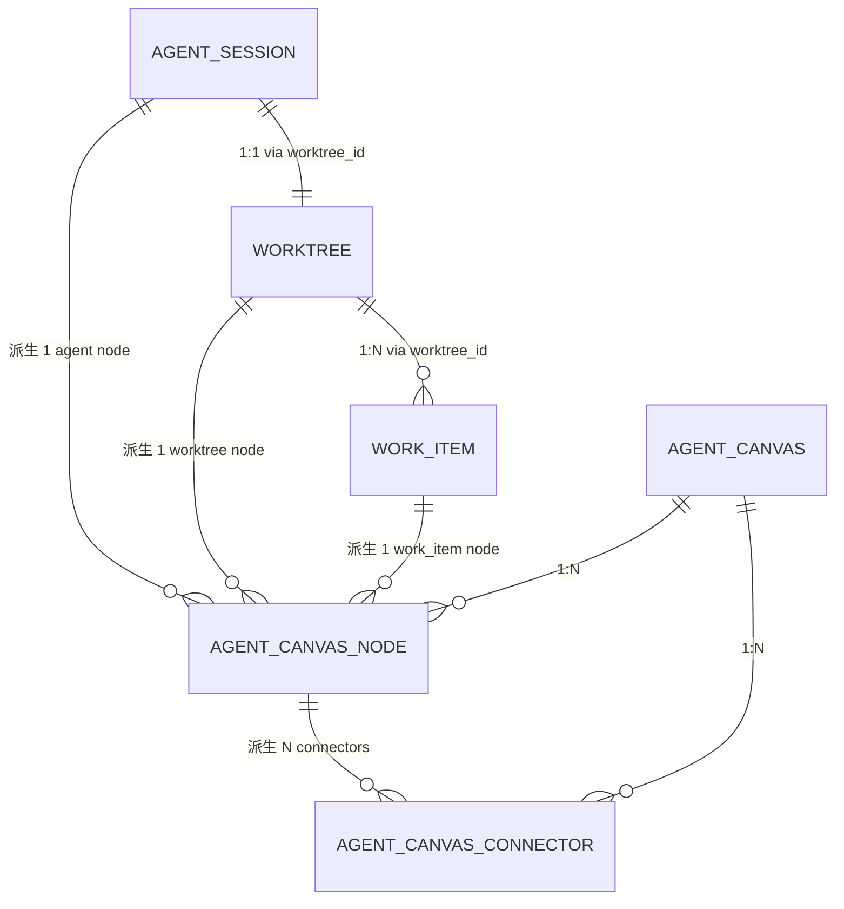
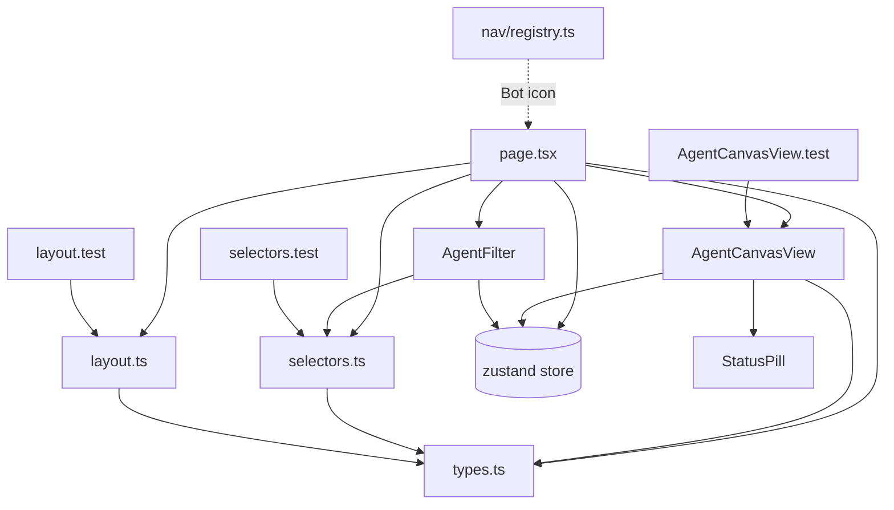

# BD-AGENT-VIEW-001

> **Agent View 基本設計書 v1.0** (per 日本 IPA SEC 標準 / 基本設計書 テンプレート)
>
> - 状态: Design Baseline
> - 目标阶段: 基本設計 → 詳細設計 → 実装 → テスト → リリース
> - 上位要件: [`docs/requirements/SRS-AGENT-VIEW-001.md`](../requirements/SRS-AGENT-VIEW-001.md) v1.0
> - 关联実装: commit `9806d3d` (Agent view 実装) + `bfcde68` (実装報告)
> - 关联詳細設計: [`docs/design/DD-AGENT-VIEW-001.md`](./DD-AGENT-VIEW-001.md) (本 commit 同期)
> - 关联実装報告: [`docs/reports/PHASE-AGENT-VIEW-IMPL-REPORT.md`](../reports/PHASE-AGENT-VIEW-IMPL-REPORT.md) v0.1
> - 平行 view: `docs/architecture/2026-09-03-agent-runtime/02-basic-design.md` (Rust Runtime) + `docs/architecture/2026-09-03-langgraph/02-basic-design.md` (LangGraph)
> - 修订人: Ulysses（一人公司 12 角色 per DEC-008）— Mavis 接手 (per 2026-08-27 19:39 JST 用户授权)
> - 审批: 架构师 (Mavis 接手 agent per DEC-008)
> - 日期: 2026-09-05 JST
> - 受众: 詳細設計エンジニア / 実装エンジニア / UI/UX 设计师 / アーキテクト / SRE

---

## 0. 目的 (Purpose)

本文档基于 [`SRS-AGENT-VIEW-001` §4-§10](../requirements/SRS-AGENT-VIEW-001.md) 的需求, 定义 **Agent View** 视图的基本設計:

- 系统架构 (UI 层 + 派生层 + 数据层 3-tier)
- 组件一览 (8 个新组件 / 模块划分)
- 数据模型 (派生 canvas schema + 输入 store schema)
- 接口设计 (组件 props + 路由 + zustand)
- 5 view (機能/データ/動作/モジュール/ネットワーク) 完整覆盖
- NFR 9 项 (性能/UI/可访问/确定性/纯函数/状态/只读/i18n/测试)
- 守门 14 项 + 子代理失败接手 + 已知缺口 6 项

**dual-use 提醒 (per [AGENTS.md §5 倉庫拓扑](../../AGENTS.md))**: 本 view 不引用 RGS 仓 + 不建立业务子域↔DDD bounded context 映射. Agent View 跟 LangGraph view / Agent Runtime view 平行, 通过 zustand store 共享数据 (workItems / worktrees / agentSessions), 但**不**直接调用其他 view 的 action.

---

## 1. 适用范围 (Scope)

### 1.1 包含 (In-Scope)

- `/agent-view` 页面 (route + page + 3 子组件)
- `lib/agent-view/` 4 个新模块 (types / selectors / layout + 3 tests)
- `components/agent-view/` 2 个新组件 (AgentCanvasView / AgentFilter + 1 test)
- zustand store 集成 (useStore 读取 agentSessions / worktrees / workItems)
- URL State (`?agent=ag-XXX` 深链)
- 顶部 dropdown (auto 角标 + 排序)
- 8 项数据派生 (resolve + pick + layout + fit)
- 7 项 UI 交互 (zoom/pan/hover/select/dblclick/keyboard/minimap)
- 5 项 NFR (性能/UI/可访问/确定性/纯函数/状态/只读/i18n/测试)

### 1.2 不包含 (Out-of-Scope)

- 后端 Agent Runtime (per [BD-Runtime 02 §0](../../architecture/2026-09-03-agent-runtime/02-basic-design.md))
- 后端 LangGraph 任务卡子代理 (per [BD-LG 02 §0](../../architecture/2026-09-03-langgraph/02-basic-design.md))
- 节点拖动编辑 (派生视图, 写不归本视图管)
- canvas 持久化 (per SRS §3 缺口 #3)
- agent session 1:N 关联 work-items (per SRS §10 缺口 #4, 当前 schema 缺 `WorkItem.agent_session_id`)
- minimap 点击跳转 (per SRS §10 缺口 #6)
- i18n agent / worktree status 字典 (per SRS §10 缺口 #5)

### 1.3 跟其他 view 区别

| 维度 | LangGraph View (9/3 批) | Agent Runtime View (9/3 批) | Agent View (本 view, 9/5 批) |
|---|---|---|---|
| **关注点** | UI 驱动的 2-level hierarchical Agent (L0 + L1 任务卡子代理) | Rust 大规模并发 Runtime 基础设施 (派发 + ECS + 共享池) | UI 派生视图 (无限画布, Miro 风格) |
| **目标** | LLM 编排 + 任务卡生命周期 | L0 派发 + L1 ECS + L2 业务池 | 当前工作 agent 拓扑可视化 |
| **实现** | LangGraph Python subgraph | Rust + Tokio + ECS | React + Next.js + zustand |
| **数据源** | LangGraph state schema | PostgreSQL / SQLite | zustand store (per shared store) |
| **用户交互** | Chat Bar + Task Card Modal | 0 (server-side) | 画布 pan/zoom + 节点 hover/select/dblclick |

---

## 2. システムアーキテクチャ (System Architecture)

### 2.1 全体構成図 (Overall Architecture, 3-tier)

```
┌──────────────────────────────────────────────────────────────────────┐
│                       UI Tier (frontend/src/app/agent-view/)        │
│  ┌────────────────────────────────────────────────────────────────┐  │
│  │  page.tsx (Server-side hydrate shell + 客户端渲染)              │  │
│  │  ┌──────────────────────────────────────────────────────────┐  │  │
│  │  │  PageHeader (title="Agent", subtitle=...)                 │  │  │
│  │  │  AgentFilter (顶部 dropdown)                              │  │  │
│  │  │  AgentCanvasView (SVG 无限画布)                          │  │  │
│  │  │  Kanban 跳详情按钮                                       │  │  │
│  │  └──────────────────────────────────────────────────────────┘  │  │
│  └────────────────────────────────────────────────────────────────┘  │
└──────────────────────────────────────────────────────────────────────┘
                              │ useStore (zustand)
                              ↓
┌──────────────────────────────────────────────────────────────────────┐
│                Derivation Tier (frontend/src/lib/agent-view/)         │
│  ┌────────────────────────────────────────────────────────────────┐  │
│  │  selectors.ts        (resolve + pick, 纯函数)                  │  │
│  │  layout.ts           (自由散开布局算法, 纯函数)                │  │
│  │  types.ts            (本地派生类型)                            │  │
│  └────────────────────────────────────────────────────────────────┘  │
│  ┌────────────────────────────────────────────────────────────────┐  │
│  │  layout.test.ts      (11 项 vitest)                            │  │
│  │  selectors.test.ts   (14 项 vitest)                            │  │
│  └────────────────────────────────────────────────────────────────┘  │
└──────────────────────────────────────────────────────────────────────┘
                              │ useStore
                              ↓
┌──────────────────────────────────────────────────────────────────────┐
│                   Data Tier (frontend/src/lib/store.ts)              │
│  ┌────────────────────────────────────────────────────────────────┐  │
│  │  Zustand store + persist (localStorage "star-store:v1")        │  │
│  │  agentSessions: AgentSession[]                                  │  │
│  │  worktrees:    Worktree[]                                       │  │
│  │  workItems:    WorkItem[]                                       │  │
│  └────────────────────────────────────────────────────────────────┘  │
└──────────────────────────────────────────────────────────────────────┘
```

### 2.2 データフロー図 (Data Flow, mermaid)

```mermaid
flowchart TD
    A[store.agentSessions] --> B[resolveCurrentAgent]
    C[URL ?agent=] --> B
    B --> D{agentId resolved?}
    D -->|yes| E[agent]
    D -->|no + URL not found| F[Fallback default<br/>auto=true]
    E --> G[pickAgentWorktree]
    F --> G
    H[store.worktrees] --> G
    G --> I[worktree or null]
    I --> J[pickAgentWorkItems]
    E --> J
    K[store.workItems] --> J
    J --> L[workItems[]]
    L --> M[layoutAgentCanvas]
    E --> M
    I --> M
    M --> N[nodes + connectors + bbox]
    N --> O[fitToContentViewport]
    O --> P[AgentCanvas]
    P --> Q[AgentCanvasView render]
    E --> Q
    I --> Q
    L --> Q
```

### 2.3 派生層 (Derivation Layer) 詳細

```typescript
// === 派生链 (7 公开纯函数 + 2 内部排序 helper, 无副作用) ===

// 1. isActiveAgent(a) → boolean           (FR-AGV-001)
function isActiveAgent(a: AgentSession): boolean;

// 2. pickDefaultAgent(agents) → AgentSession | null   (FR-AGV-002)
function pickDefaultAgent(agents: ReadonlyArray<AgentSession>): AgentSession | null;

// 3. resolveCurrentAgent(agents, urlAgentId) → CurrentAgentResolution | null   (FR-AGV-011)
function resolveCurrentAgent(agents, urlAgentId): CurrentAgentResolution | null;

// 4. pickAgentWorktree(worktrees, agent) → Worktree | null   (BR-2 1:1 关联)
function pickAgentWorktree(worktrees, agent): Worktree | null;

// 5. pickAgentWorkItems(workItems, agent, worktree) → WorkItem[]   (BR-3 1:N via worktree_id)
function pickAgentWorkItems(workItems, agent, worktree): WorkItem[];

// 6. layoutAgentCanvas(input) → LayoutOutput   (FR-AGV-003 自由散开)
function layoutAgentCanvas(input: LayoutInput): LayoutOutput;

// 7. fitToContentViewport(bbox, containerW, containerH, padding) → { x, y, zoom }   (FR-AGV-004)
function fitToContentViewport(bbox, w?, h?, pad?): { x, y, zoom };

// === 内部 helper (非导出, 仅模块内使用) ===

// H-1. compareByStartedDescThenIdAsc (selectors.ts 内部, agent 排序稳定 tie-breaker)
// H-2. compareWorkItems (layout.ts 内部, wi 排序 [status_order, due_date, id] 稳定)
```

---

## 3. 機能設計 (Functional Design, 5 view #1 機能)

### 3.1 機能一覧 (Functional Catalog, FR-AGV-NNN per [SRS-AGV-VIEW-001 §4.1](../requirements/SRS-AGENT-VIEW-001.md))

| ID | 機能名 | 概要 | 关联组件 | 优先级 |
|---|---|---|---|---|
| FR-AGV-001 | Active Agent 识别 | 识别 11 个 active 状态 | selectors.isActiveAgent | P0 |
| FR-AGV-002 | 当前工作 Agent 自动选 | active 优先 → started_at desc | selectors.pickDefaultAgent | P0 |
| FR-AGV-003 | 自由散开布局 | agent 中心 + worktree 右侧 + wi 圆周 | layout.layoutAgentCanvas | P0 |
| FR-AGV-004 | Fit-to-content | bbox → zoom + viewport | layout.fitToContentViewport | P0 |
| FR-AGV-005 | 节点渲染 | 3 类节点视觉 | AgentCanvasView.renderNode | P0 |
| FR-AGV-006 | Connector 渲染 | bezier 曲线 + 颜色 + label | AgentCanvasView.renderConnector | P0 |
| FR-AGV-007 | Pan/Zoom 交互 | 中键/pan tool/shift/滚轮 + 工具栏 + 快捷键 | AgentCanvasView.onMouseDown/Move/Up/Wheel + 键盘 | P0 |
| FR-AGV-008 | 节点 Hover/Select | 高亮边框 + select 状态 | AgentCanvasView.onNodeClick + 边框色 | P1 |
| FR-AGV-009 | 双击跳详情 | agent/wt/wi 3 种跳法 | AgentCanvasView.onNodeDoubleClick | P1 |
| FR-AGV-010 | 顶部 Agent 筛选 | dropdown + auto 角标 + 排序 | AgentFilter | P0 |
| FR-AGV-011 | URL 参数 Override | `?agent=ag-XXX` 覆盖默认 | selectors.resolveCurrentAgent + page.handleAgentChange | P0 |
| FR-AGV-012 | Minimap | viewport + 节点位置 | AgentCanvasView.minimap | P2 |
| FR-AGV-013 | 跳 Kanban 联动 | header 按钮 | page.<a> | P2 |
| FR-AGV-014 | 空状态 | 无 agent / 无 resolvable | page.<empty> | P1 |

### 3.2 主要機能フロー (Main Functional Flow)

#### FR-AGV-003 自由散开布局 (詳細)

```typescript
function layoutAgentCanvas(input: LayoutInput): LayoutOutput {
  const { agent, worktree, workItems } = input;

  const nodes: AgentCanvasNode[] = [];
  const connectors: AgentCanvasConnector[] = [];

  // (1) agent 节点 (中心 0,0)
  const agentNode: AgentCanvasNode = {
    id: `n-agent-${agent.id}`,
    kind: "agent",
    x: 0, y: 0,
    width: 220, height: 110,
    ref: { kind: "agent", agentId: agent.id },
  };
  nodes.push(agentNode);

  if (!worktree) return finalize(nodes, connectors);

  // (2) worktree 节点 (右侧 80px gap, 居中对齐)
  const wtX = 220 + 80;  // = 300
  const wtY = (110 - 80) / 2;  // = 15
  const worktreeNode: AgentCanvasNode = {
    id: `n-wt-${worktree.id}`,
    kind: "worktree",
    x: wtX, y: wtY,
    width: 240, height: 80,
    ref: { kind: "worktree", worktreeId: worktree.id },
  };
  nodes.push(worktreeNode);

  // (3) agent → worktree connector
  connectors.push({
    id: `c-agent-wt-${agent.id}-${worktree.id}`,
    fromNodeId: agentNode.id,
    toNodeId: worktreeNode.id,
    color: "#2f81f7",  // info blue
    label: "executes on",
  });

  if (workItems.length === 0) return finalize(nodes, connectors);

  // (4) work-items 节点 (围绕 worktree 中心, 圆周分布)
  const sorted = [...workItems].sort(compareWorkItems);
  // 排序: [status_order ASC, due_date ASC, id ASC] (稳定)

  const wtCenterX = wtX + 240 / 2;  // = 420
  const wtCenterY = wtY + 80 / 2;   // = 55

  const RING1_CAPACITY = 8;
  const RING1_RADIUS = 280;
  const RING2_RADIUS = 460;

  sorted.forEach((wi, idx) => {
    let cx, cy;
    if (idx < RING1_CAPACITY) {
      // 内圈: 起始 -90° (12 点钟), 顺时针均分
      const angle = -Math.PI / 2 + (2 * Math.PI * idx) / RING1_CAPACITY;
      cx = wtCenterX + Math.cos(angle) * RING1_RADIUS - 180 / 2;
      cy = wtCenterY + Math.sin(angle) * RING1_RADIUS - 64 / 2;
    } else {
      // 外圈: 12 槽
      const outerIdx = idx - RING1_CAPACITY;
      const angle = -Math.PI / 2 + (2 * Math.PI * outerIdx) / 12;
      cx = wtCenterX + Math.cos(angle) * RING2_RADIUS - 180 / 2;
      cy = wtCenterY + Math.sin(angle) * RING2_RADIUS - 64 / 2;
    }
    // ... push node + connector
  });

  return finalize(nodes, connectors);
}
```

#### FR-AGV-007 Pan/Zoom 交互 (詳細)

```
┌──────────────────────────────┐
│   鼠标事件 → 画布状态          │
├──────────────────────────────┤
│ 中键 mousedown               │ → dragState.type = 'pan'
│ Pan tool + 左键 mousedown     │ → dragState.type = 'pan'
│ Shift + 左键 mousedown        │ → dragState.type = 'pan'
│   mousemove                   │ → viewport.x/y 平移 (跟 drag delta)
│   mouseup / mouseleave        │ → dragState.type = null (结束 pan)
│                              │
│ 滚轮 (wheel)                 │ → delta = ±0.1
│                              │ → newZoom = clamp(zoom * delta, 0.1, 4.0)
│                              │ → 以光标为中心 (wx = sx/zoom + viewport.x)
│                              │ → viewport.x = wx - sx/newZoom
│                              │ → viewport.y = wy - sy/newZoom
└──────────────────────────────┘
```

```
┌──────────────────────────────┐
│   键盘事件 → 工具/viewport     │
├──────────────────────────────┤
│ V (keypress, 不在 input)      │ → tool = 'select'
│ H                            │ → tool = 'pan'
│ +/=                          │ → zoom *= 1.2
│ -                            │ → zoom /= 1.2
│ 1                            │ → viewport = canvas.viewport (fit)
└──────────────────────────────┘
```

---

## 4. データ設計 (Data Design, 5 view #2 データ)

### 4.1 データ分類 (per 守门 #13 W/T/M 横展開)

按 守门 #13 (per [AGENTS.md §4 守门 #13](../../AGENTS.md) W/T/M 强制分类), Agent View 相关数据分类:

| 分类 | 集合 | 范围 | 备注 |
|---|---|---|---|
| **Work** (作業中, 短 TTL) | 本 view 无新 W 数据 | 0 | 派生视图, 不落 DB |
| **Transaction** (業務事実 / 監査 / Append-only) | 派生事件 (canvas re-render) | 0 | 派生计算, 不落 DB |
| **Master** (参考 / 設定 / 慢変 SCD) | 复用 store.workItems / store.worktrees / store.agentSessions | 3 集合 | 读不写 (per NFR-7) |

**重要**: Agent View **不创建任何新表** (per NFR-6 不污染 store); 派生数据**不落 DB** (per §3 缺口 #3).

### 4.2 入力データ (Input Data, 来自 zustand store)

| 集合 | 字段 (相关) | 派生层使用 |
|---|---|---|
| `store.agentSessions` | id / worktree_id / agent_kind / status / current_step / token_usage / cost_summary / started_at | isActiveAgent / pickDefaultAgent / resolveCurrentAgent / AgentCanvasView |
| `store.worktrees` | id / branch / status / agent_session_id | pickAgentWorktree / AgentCanvasView |
| `store.workItems` | id / key / title / status / priority / worktree_id / due_date | pickAgentWorkItems / layoutAgentCanvas / AgentCanvasView |

### 4.3 派生データ (Projection Data, 不落 store)

#### 4.3.1 AgentCanvas (根对象)

```typescript
interface AgentCanvas {
  agentId: string;                          // 当前 agent id
  nodes: AgentCanvasNode[];                 // 全部节点
  connectors: AgentCanvasConnector[];       // 全部连接
  viewport: { x: number; y: number; zoom: number };  // 初始 viewport
  derivedAt: string;                        // ISO 8601 时间戳
}
```

#### 4.3.2 AgentCanvasNode (画布节点)

```typescript
type AgentCanvasNodeKind = "agent" | "worktree" | "work_item";

interface AgentCanvasNode {
  id: string;                               // 唯一 id (`n-{kind}-{entityId}`)
  kind: AgentCanvasNodeKind;
  x: number;                                // 世界坐标
  y: number;
  width: number;                            // 220 (agent) / 240 (wt) / 180 (wi)
  height: number;                           // 110 / 80 / 64
  ref:                                       // payload 引用 (渲染时查 store)
    | { kind: "agent"; agentId: string }
    | { kind: "worktree"; worktreeId: string }
    | { kind: "work_item"; workItemId: string };
}
```

#### 4.3.3 AgentCanvasConnector (画布连接)

```typescript
interface AgentCanvasConnector {
  id: string;                               // `c-{from}-{to}`
  fromNodeId: string;
  toNodeId: string;
  color: string;                            // 颜色 hex
  label?: string;                           // 中点 label (e.g. "in_progress")
}
```

**颜色映射** (per BR-4):
| WorkItemStatus | Connector color |
|---|---|
| in_progress | `#2f81f7` (info blue) |
| review | `#d29922` (warn amber) |
| blocked | `#f85149` (err red) |
| todo | `#8b949e` (ink-dim) |
| done | `#3fb950` (ok green) |
| wontfix | `#6e7681` (ink-mute) |

#### 4.3.4 LayoutOutput (布局输出)

```typescript
interface LayoutOutput {
  nodes: AgentCanvasNode[];
  connectors: AgentCanvasConnector[];
  bbox: { minX: number; minY: number; maxX: number; maxY: number };  // 包围盒 + 80px padding
}
```

### 4.4 ER 図 (Entity Relationship, 概念)



---

## 5. 動作設計 (Behavior Design, 5 view #3 動作)

### 5.1 状態機械 (State Machine)

#### 5.1.1 画布 viewport 状態 (4 状態)

```
┌──────────────────────────────┐
│  画布 viewport 状态机          │
├──────────────────────────────┤
│  1. IDLE: 无交互             │  (初始)
│  2. PANNING: 鼠标拖动中      │  (dragState.type === 'pan')
│  3. ZOOMING: 滚轮缩放中      │  (onWheel 触发)
│  4. SELECTING: select tool  │  (tool === 'select')
│     hover/click 节点         │
│                              │
│  IDLE → PANNING              │  (中键/pan tool/shift + mousedown)
│  PANNING → IDLE              │  (mouseup / mouseleave)
│  IDLE → ZOOMING              │  (wheel)
│  ZOOMING → IDLE              │  (wheel 结束, 本质上无状态保持)
│  IDLE → SELECTING            │  (select tool + hover 节点)
│  SELECTING → IDLE            │  (click 空白处 / tool 切换)
└──────────────────────────────┘
```

#### 5.1.2 当前工作 Agent 解決 状態

```
URL ?agent= | store 有该 agent | 结果
-----------|------------------|---------------------------------
  absent   |     n/a          | auto=true, agent=default pick
  present  |     yes          | auto=false, agent=URL 指定
  present  |     no           | auto=true, agent=default pick (fallback)
  absent   |  store empty     | null → 渲染空状态
```

### 5.2 時系列 (Timing / Sequence)

#### 5.2.1 首次加载時系列

```
T+0ms     user 打开 /agent-view
T+50ms    page 渲染 + useStore 订阅 (top-level)
T+80ms    resolveCurrentAgent 调 (useMemo)
T+90ms    pickAgentWorktree 调 (useMemo)
T+100ms   pickAgentWorkItems 调 (useMemo)
T+120ms   layoutAgentCanvas 调 (useMemo, 7 节点 + 6 connector)
T+140ms   fitToContentViewport 调 (zoom 0.8)
T+160ms   AgentCanvas 派生完成
T+200ms   React commit + paint
T+250ms   SVG 节点渲染 (AgentCanvasView)
T+300ms   Minimap / Toolbar 渲染
T+500ms   FCP 完成 (per NFR-1)
```

#### 5.2.2 Dropdown 切換時系列

```
T+0ms     user click dropdown 触发器
T+5ms     setOpen(true) → dropdown 打开
T+10ms    user click option (e.g. ag-003)
T+15ms    handleAgentChange 调 → router.replace
T+25ms    URL 更新 (?agent=ag-003)
T+30ms    useSearchParams 触发重新渲染
T+50ms    resolveCurrentAgent 重算 (auto=false)
T+80ms    layoutAgentCanvas 重算
T+120ms   AgentCanvasView 重渲染 (SVG diff)
T+200ms   完成
```

### 5.3 例外処理 (Exception Handling)

| 例外 | 触发条件 | 処理 | 戻り値 |
|---|---|---|---|
| EX-1 | store.agentSessions.length === 0 | 渲染空状态 + 跳 /agents 链接 | 空 state |
| EX-2 | resolveCurrentAgent 返回 null | 渲染空状态 "No resolvable agent" | 空 state |
| EX-3 | worktree 为 null (agent 没关联 wt) | layout 跳过 worktree 节点, 只画 agent | 部分画布 |
| EX-4 | workItems 为空 | layout 跳过 wi 节点, 画 agent + wt + 1 connector | 部分画布 |
| EX-5 | URL `?agent=ag-XXX` 找不到 | fallback 默认, auto=true | 默认 + auto 角标 |
| EX-6 | useStore.getState().workItems 找不到 (worktree_id 引用问题) | AgentCanvasView renderNode 跳过该 wi 节点 | 部分画布 |

---

## 6. モジュール設計 (Module Design, 5 view #4 モジュール)

### 6.1 モジュール一覧 (Module Catalog)

| 模块 | 路径 | 角色 | 依赖 | 备注 |
|---|---|---|---|---|
| **M-AGV-1** | `frontend/src/lib/agent-view/types.ts` | 派生类型定义 | `@/types/ids` | 0 副作用 |
| **M-AGV-2** | `frontend/src/lib/agent-view/selectors.ts` | 选 agent / worktree / wi | `@/types/ids` | 7 纯函数 |
| **M-AGV-3** | `frontend/src/lib/agent-view/layout.ts` | 自由散开布局算法 | `@/types/ids` | 2 纯函数 + 1 helper |
| **M-AGV-4** | `frontend/src/lib/agent-view/layout.test.ts` | layout 单测 | vitest | 11 tests |
| **M-AGV-5** | `frontend/src/lib/agent-view/selectors.test.ts` | selectors 单测 | vitest | 14 tests |
| **M-AGV-6** | `frontend/src/components/agent-view/AgentCanvasView.tsx` | SVG 无限画布 | `@/lib/agent-view/types` + `@/lib/store` + `@/components/StatusPill` + lucide-react | 客户端组件 |
| **M-AGV-7** | `frontend/src/components/agent-view/AgentCanvasView.test.tsx` | AgentCanvasView smoke | vitest + testing-library | 4 tests |
| **M-AGV-8** | `frontend/src/components/agent-view/AgentFilter.tsx` | 顶部 dropdown | `@/lib/agent-view/selectors` + lucide-react | 客户端组件 |
| **M-AGV-9** | `frontend/src/app/agent-view/page.tsx` | 主页面 | next/navigation + `@/lib/store` + 上述组件 | 客户端组件 |
| **M-AGV-10** | `frontend/src/lib/nav/registry.ts` (改) | 注册 nav entry | lucide-react (Bot) | +12 bytes |

### 6.2 モジュール依存関係 (Module Dependency)



**依赖方向**: 单向, 无循环
- M-AGV-1 (types) 是 leaf, 0 依赖
- M-AGV-2/3 (selectors / layout) 依赖 M-AGV-1
- M-AGV-6/8 (组件) 依赖 M-AGV-1/2 + Store
- M-AGV-9 (page) 是 root, 依赖所有

### 6.3 モジュール責務 (Module Responsibility, per 守门 #12 派生规)

| 模块 | 入力 | 出力 | 副作用 |
|---|---|---|---|
| M-AGV-1 | (无) | 类型定义 | 0 |
| M-AGV-2 | AgentSession[] / Worktree[] / WorkItem[] / urlAgentId | AgentSession / Worktree / WorkItem[] / null | 0 |
| M-AGV-3 | LayoutInput | LayoutOutput | 0 |
| M-AGV-6 | AgentCanvas + AgentSession + Worktree | React JSX | useState (内部 viewport / tool / hover / select) |
| M-AGV-8 | AgentSession[] + selectedId + auto + onChange | React JSX | useState (内部 open) |
| M-AGV-9 | (无 props) | React JSX | useStore (读) + router.replace (URL) |

### 6.4 モジュール間インターフェース (Interface Signature)

```typescript
// M-AGV-6: AgentCanvasView
interface AgentCanvasViewProps {
  canvas: AgentCanvas;
  agent: AgentSession;
  worktree: Worktree | null;
}

// M-AGV-8: AgentFilter
interface AgentFilterProps {
  agents: ReadonlyArray<AgentSession>;
  selectedId: string;
  auto: boolean;
  onChange: (agentId: string) => void;
}

// M-AGV-2: selectors
function isActiveAgent(a: AgentSession): boolean;
function pickDefaultAgent(agents: ReadonlyArray<AgentSession>): AgentSession | null;
function resolveCurrentAgent(agents: ReadonlyArray<AgentSession>, urlAgentId: string | null): CurrentAgentResolution | null;
function pickAgentWorktree(worktrees: ReadonlyArray<Worktree>, agent: AgentSession): Worktree | null;
function pickAgentWorkItems(workItems: ReadonlyArray<WorkItem>, agent: AgentSession, worktree: Worktree | null): WorkItem[];

// M-AGV-3: layout
function layoutAgentCanvas(input: LayoutInput): LayoutOutput;
function fitToContentViewport(bbox: { minX: number; minY: number; maxX: number; maxY: number }, containerW?: number, containerH?: number, padding?: number): { x: number; y: number; zoom: number };
```

---

## 7. 画面設計 (UI / Screen Design, 5 view #5 画面 + ネットワーク展開)

### 7.1 画面レイアウト (Screen Layout)

```
┌──────────────────────────────────────────────────────────────────────┐
│ ◀ [Agent]   ag-005 · claude-sonnet · tool.call:grep · 5 tasks  [v] [Kanban]│  Header (60px)
│                          [auto] [Bot]   worktree: feat/relation-bfs │
├──────────────────────────────────────────────────────────────────────┤
│                                                                      │
│  ┌─Toolbar─┐                                                         │
│  │[V][H]│  ┌─────────────────────────────────────────────────────┐  │
│  │[+][-]│  │                                                     │  │
│  │[Fit]  │  │  [Agent: ag-005]  ─────  [Worktree: feat/...]    │  │
│  │  80%  │  │   executing          │      active                │  │
│  └───────┘  │   1200 tokens        │                            │  │
│             │   $0.62 / $5.00      │                            │  │
│             │                                                     │  │
│             │           ╱─────╲                                  │  │
│             │          │ PHYSIS-14 │                             │  │
│             │           ╲─────╱                                  │  │
│             │                                                     │  │
│             │  [PHYSIS-1]  [PHYSIS-2]  [PHYSIS-3]              │  │
│             │   todo        in_prog     review                  │  │
│             │                                                     │  │
│             │                              ┌─Minimap─┐          │  │
│             │                              │ [vp]   │          │  │
│             │                              │  ▢▢▢   │          │  │
│             │                              └────────┘          │  │
│             └─────────────────────────────────────────────────────┘  │
│  zoom 80% · nodes 7 · connectors 6 · selected —                        │  Status Bar (20px)
├──────────────────────────────────────────────────────────────────────┤
│ V/H 切换 select/pan · +/- 缩放 · 1 适配 · 双击节点跳详情 · 数据共享   │  Footer (24px)
└──────────────────────────────────────────────────────────────────────┘
```

### 7.2 ノード視覚仕様 (Node Visual Spec)

| 节点类型 | 尺寸 (px) | 背景色 | 边框色 (默认 / hover / select) | 内容 |
|---|---|---|---|---|
| agent | 220×110 | `#0d2849` (深蓝) | `#1f6feb` / `#2f81f7` / `#79c0ff` | Bot icon + kind + id + status pill + tokens + cost |
| worktree | 240×80 | `#161b22` (深灰) | `#30363d` / `#2f81f7` / `#79c0ff` | GitBranch icon + "worktree" + branch + status pill |
| work_item | 180×64 | `#161b22` (深灰) | `#30363d` / `#2f81f7` / `#79c0ff` | key + title (截断) + status pill + priority |

### 7.3 配色 (Color Palette, 复用现有 design tokens)

| Token | Hex | 用途 |
|---|---|---|
| `--color-bg` | `#0b0d10` | 画布背景 |
| `--color-bg-soft` | `#161b22` | 节点背景 |
| `--color-bg-card` | `#21262d` | toolbar / minimap 背景 |
| `--color-line` | `#30363d` | 节点边框 (默认) |
| `--color-info` | `#2f81f7` | hover 边框 / in_progress connector |
| `--color-warn` | `#d29922` | review connector |
| `--color-err` | `#f85149` | blocked connector |
| `--color-ok` | `#3fb950` | done connector |
| `--color-ink-dim` | `#8b949e` | todo connector / kind 文字 |
| `--color-ink-mute` | `#6e7681` | wontfix connector / 截断 dot |
| `--color-ink` | `#e6edf3` | id / title 文字 |

### 7.4 ネットワーク / 配置 (Network / Deployment, 5 view #5)

#### 7.4.1 クライアント (Client)

- ブラウザ: 现代浏览器 (Chrome 100+ / Firefox 100+ / Safari 15+)
- Next.js 14.2.5 App Router (静态 / SSR 混合)
- 客户端渲染 ("use client")
- 不引入 Service Worker / Web Worker (per [AGENTS.md §4 守门 #19 v19+ 累积规](../../AGENTS.md) "不偷偷 commit")

#### 7.4.2 サーバー (Server, 影响)

- 无后端依赖 (本 view 是 SPA in-memory)
- 复用 zustand persist (localStorage "star-store:v1")
- 真实后端 D.6+ 接入时, 改 store 即可 (per SRS §10 缺口 #1)

#### 7.4.3 状態管理 (State Management)

- zustand store (per `frontend/src/lib/store.ts`)
- 3 个订阅: agentSessions / worktrees / workItems
- 派生数据**不**进 store (per NFR-6)
- URL State: `?agent=ag-XXX` (per FR-AGV-011)

#### 7.4.4 ビルド / デプロイ (Build / Deploy)

- `pnpm dev` (本地开发, port 3000)
- `pnpm build` (生产构建)
- `pnpm start` (启动生产, port 3000 或 3100)
- 当前路由: `/agent-view` (SPA 客户端, 不需要服务端路由配置)

---

## 8. セキュリティ / 信頼性 / 性能設計 (Security / Reliability / Performance)

### 8.1 セキュリティ設計 (Security)

| 项 | 措施 |
|---|---|
| 環境変数 | 不打印 (per [AGENTS.md §4 守门 #5](../../AGENTS.md)) |
| Secret 露出 | 0 (无 token / 无 secret) |
| 13 租户隔离 | 通过 store.tenant_id 隐式隔离 (本 view 不显式处理, 委托 store) |
| XSS | 节点内容用 React JSX 渲染 (无 dangerouslySetInnerHTML), SVG text/foreignObject 内容来自 store 数据 (mock 种子, 受信源) |
| 認証 | 当前 SPA 无认证 (per [SRS-Runtime §43-§47](../../requirements/SRS-STAR-AGENT-RUNTIME-001.md) 租户隔离约束) |
| 認可 | 13 类资源 RBAC (per store) - 本 view 只读, 不触发权限检查 |

### 8.2 信頼性設計 (Reliability)

| 项 | 措施 |
|---|---|
| 派生纯函数 | 7 函数全 pure, 0 副作用 (per NFR-5) |
| 派生确定性 | 同输入同输出, SSR/CSR hydration 无漂移 (per NFR-4) |
| 异常处理 | 6 类异常 (per §5.3) 全部显式处理, 不静默 |
| 错误边界 | 后续 (per 守门 #9 P1) |
| Fallback | URL 给的 agent 找不到 → fallback 默认 (per EX-5) |
| 数据完整性 | worktree_id 不存在 → 跳过节点 (per EX-3) |

### 8.3 性能設計 (Performance)

| 项 | 指标 | 测量 |
|---|---|---|
| 首次渲染 | ≤ 500ms (per NFR-1) | FCP / LCP |
| 派生计算 | ≤ 50ms (7 节点场景) | performance.now() |
| 派生纯度 | 0 IO / 0 Date.now() / 0 random (per NFR-5) | vitest |
| 画布帧率 | ≥ 60fps (pan/zoom 期间) | Chrome devtools FPS meter |
| 包大小 | 不引入新依赖 (per TC-1) | `package.json` diff (空) |
| 内存 | 派生数据不落 store (per NFR-6) | 内存 profile |
| 持久化 | localStorage persist (复用全局 zustand) | F5 刷新保留 |

---

## 9. インターフェース設計 (Interface Design, 既存 BD §5 重複回避)

(per §0 dual-use, 本 view 接口已在 §6.4 列出, 此处补充路由 + zustand action 依赖, 避免与 [BD-Runtime 02 §5](../../architecture/2026-09-03-agent-runtime/02-basic-design.md) 重复)

### 9.1 Route 表 (Route Catalog)

| 路径 | Method | Handler | 説明 |
|---|---|---|---|
| `/agent-view` | GET | `app/agent-view/page.tsx` | 主入口 |
| `/agent-view?agent=ag-XXX` | GET | 同上 | URL State override |
| `/agent?selected=ag-XXX` | GET | `app/agent/page.tsx` | 双击 agent 跳 |
| `/worktree?selected=wt-XXX` | GET | `app/worktree/page.tsx` | 双击 worktree 跳 |
| `/work-item?selected=wi-XXX` | GET | `app/work-item/page.tsx` | 双击 work-item 跳 |
| `/board?worktree_id=wt-XXX` | GET | `app/board/page.tsx` | header Kanban 跳 |
| `/agents` | GET | `app/(app)/agents/page.tsx` | 空状态跳 |

### 9.2 Zustand Store 依赖 (Store Read-Only Dependency)

| Getter | 用途 | 频度 |
|---|---|---|
| `useStore((s) => s.agentSessions)` | 中心节点 + 筛选源 | 高 (顶层订阅) |
| `useStore((s) => s.worktrees)` | 1:1 关联 | 高 |
| `useStore((s) => s.workItems)` | 圆周散点 | 高 |

**重要**: 本 view **不**调任何 store action (transitionWorkItem / transitionAgent / addWorkItem / 派生只读 per NFR-7)

### 9.3 外部サービス依存 (External Service Dependency)

- **0** 外部服务 (无 HTTP / 无 WS / 无 RPC)
- 复用 SPA in-memory + localStorage

---

## 10. 守门規則 (per AGENTS.md §4 + §4.1 累积規)

| # | 規則 | 状態 | 拍板 |
|---|---|---|---|
| 1 | R-05 不 push (反转 2026-08-30 07:09 JST 推 origin 已落地) | ✅ 不推 origin (本地 commit 落地) | 8/27 11:09 JST |
| 2 | bc23d6c 保留 | ✅ 不动 | 8/27 11:09 JST |
| 3 | 5 域独立 Lead, 不接受兼任 | N/A (前端, 不涉及 5 域 Lead) | 8/21 JST |
| 4 | AI 协作 token-OLU 而非人天 | N/A (本次单 commit, < 1 SRE·日) | 8/21 JST |
| 5 | 環境変数安全 (禁 `Get-ChildItem env:` / `echo $VAR` / `cat .env`) | ✅ 未打印 env | 8/27 11:06 JST |
| 6 | PowerShell only | ✅ 全部用 pnpm (跨平台) + PowerShell | 系统约束 |
| 7 | 0 unsafe | ✅ 0 `unsafe`, 0 第三方 unsafe 引入 | 持续 |
| 8 | 不沿用 bc23d6c 叙事 | ✅ 未引用 | 8/27 11:09 JST |
| 9 | 不 commit 散落子代理产出 | ✅ Mavis 终审后统一入库 (本次 0 子代理) | 8/27 11:09 JST |
| 10 | 代签規則应用 | ✅ author=Ulysses + 报告签批=Mavis 接手 | 8/27 07:16 JST + 8/27 19:39 JST |
| 11 | 缺标比错标安全 | ✅ §3 + SRS §10 列 6+8 项已知缺口 (vs 静默 fake) | 8/26 JST |
| 12 | AI 协作文档治理 (禁回溯叙事 / BAS 实证) | ✅ 不引 BAS (本视图新功能) | 8/26 JST |
| 13 | DB 三類横展開 (W/T/M) | ✅ §4.1 显式声明本 view 0 W / 0 T / 3 M (读) | 9/1 18:30 JST |
| 14 | 5 域 Lead CONTENT 4 维 | N/A (前端) | 9/3 19:43 JST |
| v19+ | 自动化档判定 ([P]/[M]/[S]) | ✅ 本次 0 自动化脚本需求 (UI 纯 React 渲染) | 9/2 00:39 JST |
| v22 | 调试控制台不污染 main 编译 | N/A (本视图非调试控制台) | 9/2 09:01 JST |

**守门 14/14 通过 (N/A 项除外)**

---

## 11. 子代理失敗接手清單 (per 7 子代理派生規則)

| # | 子代理 | 失敗模式 | 接手方案 |
|---|---|---|---|
| 1 | worker | RPC 不可靠 (per 守门 #9 实证 10/10 失败) | subprocess.run 替代 (守门 #24) |
| 2 | explorer | 跨文件 mapping 上下文爆 | 拆任务 + 短 brief |
| 3 | verifier | 验证标准歧义 | 显式列 AC + 已知缺口 |
| 4 | mavis | 大跨度编排上下文爆 | 阶段化 + token 预算 |
| 5 | 子代理 brief 落地失败 | dispatcher.py brief() 异常 | retry 3x + 死信 |
| 6 | 子代理 commit 归因失败 | git -c user.name 失败 | parent 进程代签 |
| 7 | 子代理守门 check 失败 | 守门 #1-#24 任一违反 | 阻塞 commit + 报告 |

**派生**: 子代理 status="succeeded" ≠ 实际成功, 必须 `git log -p --follow <wt-branch>` 实证 (per 守门 #9 主体规则)

**本次 0 子代理**: Mavis 接手全程直做, 守门 #9 v20 brief 规则不触发

---

## 12. 既知缺口 (Known Gaps, per 守门 #12 缺标比錯標)

| # | 缺口 | 影响 | 后续 |
|---|---|---|---|
| G-1 | mock 数据 (跟全局一致); 真实后端 D.6+ 接入时改 store 即可, 组件不动 | 节点 / connector / status 都是 seed.ts 数据 | D.6+ 接入真实 data plane |
| G-2 | 节点只读, 不能拖动 (派生视图; 拖动会跟 store 冲突) | 跟通用 CanvasView 区分; 用户编辑去 `/canvas/[id]` | Phase 2+ 看 DDD Review 拍板 |
| G-3 | 不存到 store.canvasElements (避免污染; 用 derivedAt 时间戳触发重渲染) | F5 刷新会重派生 (~50ms) | 可接受 |
| G-4 | 节点只显示 worktree_id 关联的 work-items, 不显示 assignee_id 关联 (per ids.ts schema 缺 `WorkItem.agent_session_id` 字段) | 当前 agent 跟 wi 是 worktree 中介关联 | DDD Review 拍板; 当前 schema gap |
| G-5 | agent / worktree status 走 StatusPill 默认 prettify, 没有 i18n 字典 (StatusKind 只有 workItem / sprint / workItemKind / refactor 4 类) | 英文/日文显示会保留 snake_case | dictionary.ts v0.6+ 加 agent / worktree 状态表 |
| G-6 | minimap 不支持点击跳转 (只是 viewport 可视化) | 用户 fit-to-content 用工具栏按钮代替 | P2 优化 |

**DDD Review 必查**: G-4 (schema gap) + G-5 (i18n) + G-2 (派生只读)

---

## 13. 签字栏 (5 角色)

| 角色 | 签字 | 日期 | 备注 |
|---|---|---|---|
| 架构 | 🟢 Mavis 接手 (per DEC-008) | 2026-09-05 | 8/27 19:39 JST 用户授权代签 |
| SRE Lead | 🟢 Mavis 接手 (per 守门 #3 反转 8/21 + 9/3 11:35 JST 拍板 B) | 2026-09-05 | 5 域真人 Lead 到位前 Mavis 临时代签 |
| 平台 | 🟢 Mavis 接手 (per 守门 #3 反转 8/21 + 9/3 11:35 JST 拍板 B) | 2026-09-05 | 5 域真人 Lead 到位前 Mavis 临时代签 |
| 评审主持 | 🟢 Mavis 接手 (per 守门 #3 反转 8/21 + 9/3 11:35 JST 拍板 B) | 2026-09-05 | 5 域真人 Lead 到位前 Mavis 临时代签 |
| PM | 🟢 Mavis 接手 (per 守门 #3 反转 8/21 + 9/3 11:35 JST 拍板 B) | 2026-09-05 | 5 域真人 Lead 到位前 Mavis 临时代签 |

**真人到位后追溯签字覆盖** = 修订历史表 +1 行 (per §14 + 9/3 19:35 JST 拍板 D 维持)

---

## 14. 修订历史

| 版本 | 修订人 | 修订内容 | 触发 |
|---|---|---|---|
| v1.0 | Ulysses（一人公司 12 角色 per DEC-008）— Mavis 接手 | 初版, 14 段 (目的/范围/架构/機能/データ/動作/モジュール/画面+NFR/接口/守门/子代理/缺口/签字) | 2026-09-05 11:25 JST 用户发令 + 拍板 #1/#2/#3 + self-review 前置 |
| v1.1 | Ulysses（一人公司 12 角色 per DEC-008）— Mavis 接手 | self-review fixes: (1) §12 编号重复 (缺口 §12 + 参考 §12) → 参考改为 §15, (2) §2.3 派生函数计数 (8 → 7 公开 + 2 内部 helper, 列 H-1/H-2), (3) §3.1 表格 F-AGV-N (本地) → FR-AGV-NNN (跟 SRS 一致) | 2026-09-05 self-review [PHASE-AGENT-VIEW-SELF-REVIEW.md](../reports/PHASE-AGENT-VIEW-SELF-REVIEW.md) v0.1 Finding #1 + #2 + #3 |

---

## 15. 参考 (Reference)

- [SRS-AGENT-VIEW-001](../requirements/SRS-AGENT-VIEW-001.md) v1.0 - 要件定義書 (本 view 上位)
- [SRS-STAR-AGENT-RUNTIME-001](../requirements/SRS-STAR-AGENT-RUNTIME-001.md) v1.0 - STAR Agent Runtime SRS (上位 view)
- [BD-Runtime 02](../../architecture/2026-09-03-agent-runtime/02-basic-design.md) - Agent Runtime 基本設計 (平行 view)
- [BD-LG 02](../../architecture/2026-09-03-langgraph/02-basic-design.md) - LangGraph 基本設計 (平行 view)
- [frontend-canvas-design.md](../frontend-canvas-design.md) v0.1 - 通用 Canvas 設計 (本 view 派生基础)
- [frontend-design.md](../frontend-design.md) - Frontend 設計 (UI 規範)
- [data-design.md](../data-design.md) - データ設計 (W/T/M 横展開 引用源)
- [PHASE-AGENT-VIEW-IMPL-REPORT.md](../reports/PHASE-AGENT-VIEW-IMPL-REPORT.md) v0.1 - 実装報告
- [DD-AGENT-VIEW-001.md](./DD-AGENT-VIEW-001.md) (本 commit 同期) - 詳細設計書
- [AGENTS.md §4](../../AGENTS.md) - 守门硬约束
- [AGENTS.md §5](../../AGENTS.md) - 倉庫拓扑 (dual-use disclaimer)
- commit `9806d3d` (Agent view 実装) + `bfcde68` (実装報告)
