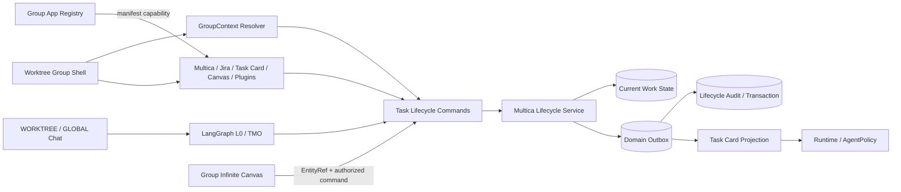
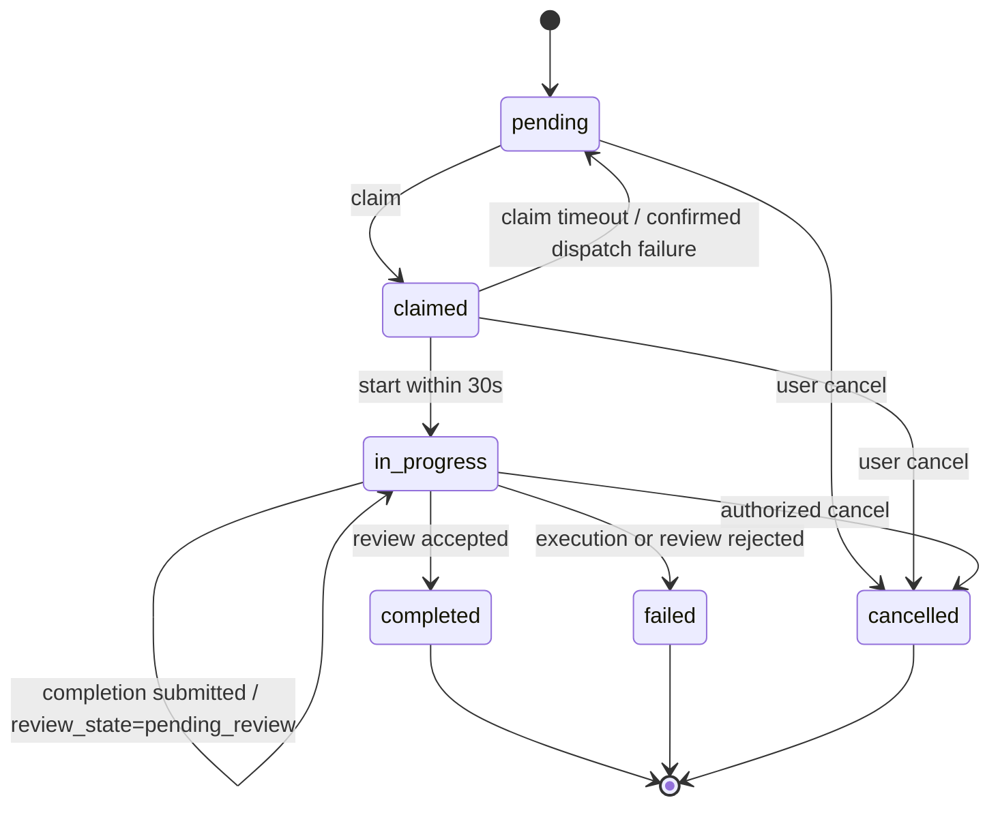

# BD-MULTICA-TASK-001

> **Multica Task Lifecycle 基本設計書 v0.1**
>
> - 状态: 🟡 Draft v0.1
> - 日期: 2026-09-28 JST
> - 上游需求: [`docs/requirements/SRS-MULTICA-TASK-001.md`](../requirements/SRS-MULTICA-TASK-001.md) v0.2
> - 渡口共享基线: [`docs/requirements.md`](../requirements.md) §50; [`docs/basic-design.md`](../basic-design.md) §16
> - Multica 状态来源: [`docs/adr/0026-multica-patterns-borrow.md`](../adr/0026-multica-patterns-borrow.md) v0.2 §2.1 模式 2
> - 下游詳細設計: [`docs/design/DD-MULTICA-TASK-001.md`](DD-MULTICA-TASK-001.md)
> - 修订人: Ulysses（一人公司 12 角色 per DEC-008）— Mavis 接手审核
> - 审批: Draft，未形成正式评审结论

---

## §0 目的与范围

本文档为 Multica Task Lifecycle 定义组件边界、状态控制、数据归属、跨应用接口和权限流。它落实 SRS 的任务 claim、review gate、session poison、404 标记与 WBS schema 需求，并把这些能力放入渡口 Worktree 群组。

Multica 负责任务生命周期命令和状态规则；Worktree Group Shell 负责导航、当前群组上下文和共享聊天入口；Task Card 是共同的执行工作面；CLI/Agent Session 由 Runtime/AgentPolicy 管理。它们共用任务身份，但不复制彼此的状态机。

---

## §1 渡口产品层级与领域边界

### 1.1 产品树

| 层级 | 节点 | 设计约束 |
|---|---|---|
| 顶层 | Worktree | 是产品导航根和默认授权边界；活动上下文至少包含 `worktree_id` |
| 群组同级入口 | Multica、Jira 等价任务视图、Task Card 索引、Group Infinite Canvas、已启用插件 | 是同一 Worktree 群组内的同级应用/视图，可互相深链 |
| Task Card 内 | CLI、Agent Session、输出、checkpoint、review、审计 | 会话绑定 `worktree_id`、`work_item_id`、`task_card_id` |
| 固定底栏 | Group Shell Chat Bar | 共享会话入口，可选 `WORKTREE` 或 `GLOBAL` 范围 |

Worktree Overview Graph 是 Project/Repository 级视图，不是此群组树中的 Group Infinite Canvas；两个 Canvas 只经 Worktree 与类型化实体引用互链。详见 [`SRS-WORKTREE-CANVAS-001.md`](../requirements/SRS-WORKTREE-CANVAS-001.md) §1.6。

### 1.2 事实源与投影

| 对象 | 事实源/所有者 | 其他视图如何使用 |
|---|---|---|
| Task Lifecycle | Multica Lifecycle Domain | Task Card、Jira 等价视图及聊天栏发起命令，读取同一任务状态 |
| WorkItem 身份 | WorkItem Domain | Multica `work_item_id`、Task Card 和 Canvas `EntityRef` 统一引用 |
| Task Card UI | Group Shell / Task Card Manager | 投影 WorkItem 与 Agent Session 状态，不维护平行状态机 |
| CLI/Agent Session | Runtime / AgentPolicy | Task Card 提供启动入口与绑定上下文；Runtime 决定执行、恢复和权限 |
| Canvas 元素 | Canvas Domain | 仅持有对象引用、关系、布局和可视化状态；任务变更走领域命令 |
| 插件清单/入口 | Group App Registry | 热插拔群组导航及声明 capability；插件不持有 Multica 任务事实 |

---

## §2 组件与依赖



| 组件 | 职责 | 不拥有的职责 |
|---|---|---|
| GroupContext Resolver | 校验 actor、tenant、`worktree_id`、scope 与目标对象 | 不授予比当前用户更大的权限 |
| Task Lifecycle Service | claim/start/complete/fail/cancel/review 的唯一命令入口 | 不执行 CLI、不直接编辑 Canvas 布局 |
| WBS Adapter | 映射现有 WBS 行与生命周期当前态字段，执行兼容迁移 | 不把外部 RPC 的成功回执当作任务完成证据 |
| Review Gate | 校验输出、提交及 artifact，接受或拒绝完成申请 | 不修改执行产物或隐藏失败原因 |
| Session Health Handler | 记录 poison 类型，阻止坏 session 恢复并启动 fresh session | 不把 poison 标记当作 Task Lifecycle 状态 |
| Task Card Manager | 按事件更新卡片投影，提供卡内 Runtime 面板 | 不生成第二个 `work_item_id` |
| Event Outbox / Audit Writer | 保证领域事件与事务审计可靠落档 | 不将可清理 Work 状态长期 append-only 保存 |
| Group App Registry | 根据启用 manifest 显示或撤销插件同级入口 | 不注册 Multica 状态机或覆盖领域 ACL |

依赖方向为 UI/编排 → 领域命令 → Lifecycle Service → 持久化与 Outbox；跨应用状态推送消费领域事件，不由应用之间直接写彼此数据库。

---

## §3 生命周期命令与状态

### 3.1 当前态与 Review Gate

当前态使用 SRS 定义的 `pending`、`claimed`、`in_progress`、`completed`、`failed`、`cancelled`。Review Gate 使用独立的 `review_state` (`none` / `pending_review` / `accepted` / `rejected`)，避免把 review 和 Runtime 执行状态混成另一套 Agent 状态机。



| 命令 | 前置条件 | 结果 | 必须记录 |
|---|---|---|---|
| `claim_task` | 当前态 `pending`，授权通过 | `claimed` + lease/claim 时间 | actor、worktree、task、claim correlation |
| `start_task` | 当前态 `claimed` 且 claim 未超时 | `in_progress` | runtime/session 引用、started_at |
| `submit_completion` | 当前态 `in_progress` | 仍为 `in_progress`，`review_state=pending_review` | commit、output、artifact 引用 |
| `review_accept` | 三项证据验证通过 | `completed`，`review_state=accepted` | reviewer、证据摘要、时间 |
| `review_reject` | review 未通过 | `failed`，写明原因 | reviewer、拒绝原因、证据摘要 |
| `mark_failed` / `cancel_task` | 状态允许且权限通过 | `failed` / `cancelled` | actor、原因、时间 |

重复命令使用 `idempotency_key`；非法状态转换返回领域错误，不直接覆盖当前态。claim 过期回退必须先核实 dispatcher/RPC 的真实结果，不能仅凭客户端 `succeeded` 标识重新派发。

### 3.2 Session Poison 与 404 事件

- `session_poisoned` 和 `session_poison_reason` 是执行会话健康数据；它们不改变任务身份。坏 session 不 resume，由 Runtime 创建新 session 并保留关联。
- Workspace/task/runtime 404 分别记录类型和观测时间。404 记录通知 Lifecycle Service 和 Task Card projection，不由 UI 直接删除任务。
- `stale_dispatch=true` 代表派发结果需复核；verify/collect_output 完成后才允许重试、恢复或转失败。

---

## §4 数据模型与 W/T/M 分类

所有当前态查询都按 `worktree_id`、`tenant_id` 和 actor 权限过滤。逻辑表最终字段在详细设计中映射到现有 WBS / 数据库结构。

| 逻辑数据集 | 分类 | 内容 | 保留/删除规则 |
|---|---|---|---|
| `task_lifecycle_current` | **Work** | `worktree_id`、`work_item_id`、`task_card_id`、当前 status、claim lease、session 当前引用、stale_dispatch | 明确 `retention_period`；过期可物理清理或重建投影 |
| `task_lifecycle_audit` | **Transaction** | 状态转换、review 决策、派发验证、404 观测和 actor/correlation 事实 | append-only，不物理删除；按 Transaction 规则携带审计和 RLS |
| `task_metadata` | **Master** | 人工维护的名称、优先级、标签、执行策略引用 | SCD Type 2；按 Master 规则携带 RLS |
| `task_session_health` | **Transaction** | session poison 原因、fresh-session 决定及 Runtime 关联事实 | append-only 审计记录；可查询当前有效标记，但不覆盖历史事实 |

WBS row 可保留兼容字段和便于读取的 audit JSON projection；权威 Transaction 记录写入 `task_lifecycle_audit`。projection 可重建，不替代审计事实。混合字段到物理表的拆分属于详细设计确认项。

---

## §5 群组上下文、CLI 与插件接口

### 5.1 GroupContext 和聊天范围

每个领域命令带 `GroupContext(worktree_id, tenant_id, actor_id, permissions, correlation_id)`。`WORKTREE` 只能触达当前 Worktree；`GLOBAL` 可跨多个获权 Worktree，但每个写操作先解析成明确的 `target_worktree_ids`，逐目标授权并记录结果。Global 不继承隐式“全仓管理员”权限。

### 5.2 Task Card 内 CLI

从 Multica、Jira 等价视图或 Canvas 打开卡片时都通过相同 `work_item_id` 定位同一 Task Card。Runtime 启动参数由卡片绑定上下文产生并校验：

```text
TaskExecutionContext = {
  worktree_id,
  work_item_id,
  task_card_id,
  actor_id,
  scope_kind,
  runtime_profile,
  permission_snapshot,
  correlation_id
}
```

CLI/Agent Session 出现在 Task Card 内。Shell 仅提供启动、输出和状态展示；Runtime/AgentPolicy 检查可执行目录、工具 capability、凭据访问和中止规则。浏览器当前路径不能替代 `worktree_id` 校验。

### 5.3 Canvas 与插件

- Group Infinite Canvas 使用 `EntityRef(type, id, worktree_id)`，通过 Lifecycle Command 修改任务；Canvas 本地保存布局、关系边和视图偏好。
- 内置应用和插件都通过领域 API/Outbox 读写。插件 `manifest` 至少声明 `plugin_id`、版本、scope、capabilities、所需权限和入口；启用/卸载即时刷新 Worktree 群组入口。
- 卸载插件不会删除 WorkItem、Task Card、审计或 Canvas 中的引用；缺失插件时保留可读的 disabled reference。
- Group App Registry 与 LangGraph `SubAgentRegistry` 分开。前者注册应用入口，后者注册可执行的 Agent 图；任何 capability bridge 都执行 scope 和权限校验。

---

## §6 接口与事件

接口以命令为边界，不让 UI、Canvas 或插件直写 Lifecycle 表。

| 命令/事件 | 生产方 | 消费方 | 核心字段 |
|---|---|---|---|
| `TaskClaimRequested` / `TaskClaimed` | Task Card / L0 | Lifecycle Service / Card Projection | Worktree、WorkItem、actor、idempotency key |
| `TaskStarted` | Runtime | Lifecycle Service / Card Projection | task_card_id、session_id、started_at |
| `TaskCompletionSubmitted` | Runtime | Review Gate | commit、output、artifact refs |
| `TaskReviewAccepted` / `TaskReviewRejected` | Review Gate | Lifecycle Service / Audit | reviewer、decision、reason |
| `TaskFailed` / `TaskCancelled` | Runtime / authorized user | Lifecycle Service / Audit | actor、failure/cancel reason |
| `TaskSessionPoisoned` | Session Health Handler | Runtime / Audit / Card | reason enum、session ref、fresh-start flag |
| `TaskLifecycleChanged` | Outbox | Multica / Jira view / Task Card / Canvas projection | canonical IDs、new status、version、correlation_id |

事件消费者以 `event_id` 去重；Outbox 发布失败时可重放。投影版本小于事件版本时拒绝旧事件覆盖新状态。

---

## §7 安全、失败与可观测性

- 每次读、写、CLI 启动和插件 capability 调用都按 tenant、Worktree、actor、WorkItem 做授权；GLOBAL 目标逐个记录允许/拒绝结果。
- 任务状态变更、review、取消、派发验证与 session poison 写 Transaction 审计；Work 数据不得因审计策略变成永久保留。
- Runtime 中断、Lease 过期、RPC 不确定、Outbox 延迟和插件卸载都提供可见状态；不把未知结果自动解释为成功。
- 关键指标包括 claim→start 延迟、review 等待时长、stale dispatch 数、poison session 数、事件 outbox lag、CLI 启动拒绝数及跨 Worktree 授权拒绝数。
- trace/correlation 链贯穿 Group Shell → L0 → Lifecycle Command → Runtime → Task Card/Canvas 投影。

---

## §8 验收映射

| SRS AC | 基本设计验收 |
|---|---|
| AC-1 / AC-5 | `task_lifecycle_current`、`task_lifecycle_audit`、`task_metadata` 和 `task_session_health` 完成 W/T/M 分类与保留策略；迁移前后身份不变 |
| AC-2 / AC-6 / AC-8 | 未经 Review Gate 不进入 `completed`；claim timeout、审计记录和 console 状态按定义呈现 |
| AC-3 / AC-4 / AC-7 | poison 原因完整；stale dispatch 有 verify/collect_output；四类 404 类型独立可见 |
| AC-9 | Multica、Jira 等价视图、Task Card 与 Canvas 对同一 `work_item_id` 显示一致状态 |
| AC-10 | Task Card 启动 CLI 时 `worktree_id`、`work_item_id`、`task_card_id` 校验一致；Lifecycle enum 不因 CLI 扩展 |
| AC-11 | Task Card Index 与 Group Infinite Canvas 是 Worktree 群组同级入口，任务写入经领域命令和 ACL |
| AC-12 | 插件热插拔只改变入口/capability 暴露，不删除任务、审计和实体引用 |

---

## §9 已知缺口

| 编号 | 缺口 | 处理阶段 |
|---|---|---|
| GAP-1 | WBS 兼容行中的 JSON audit projection 与权威 Transaction audit table 的物理映射未定 | 詳細設計 |
| GAP-2 | Task Card 与 WorkItem ID 的现存 schema 是否一对一，以及旧 WBS task_id 的迁移映射 | 詳細設計 / migration rehearsal |
| GAP-3 | Runtime profile 对 Claude Code、Codex、OpenCode、Multica CLI 的 capability 映射 | Runtime 詳細設計 |
| GAP-4 | Global 批量操作的部分成功 UI 与补偿策略 | LangGraph/TMO 詳細設計 |

---

## §10 修订历史

| 版本 | 日期 | 修订人 | 修订内容 | 触发 |
|---|---|---|---|---|
| v0.1 | 2026-09-28 JST | Ulysses（一人公司 12 角色 per DEC-008）— Mavis 接手审核 | 初版；定义 Worktree 群组入口、生命周期所有权、Task Card 内 CLI、Canvas/插件交互、scope 授权及 W/T/M 数据分类 | 用户要求将渡口 Worktree 顶层树同步至 Multica 与相关基本设计 |
