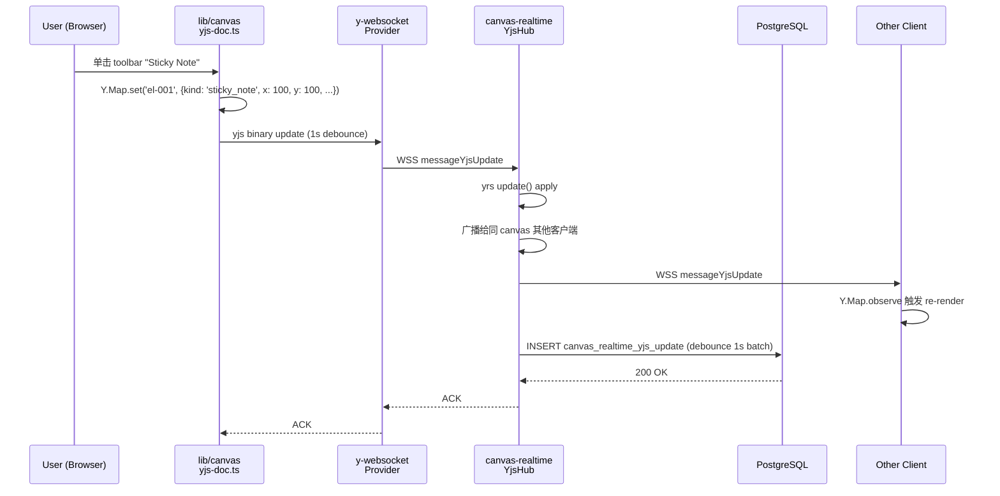
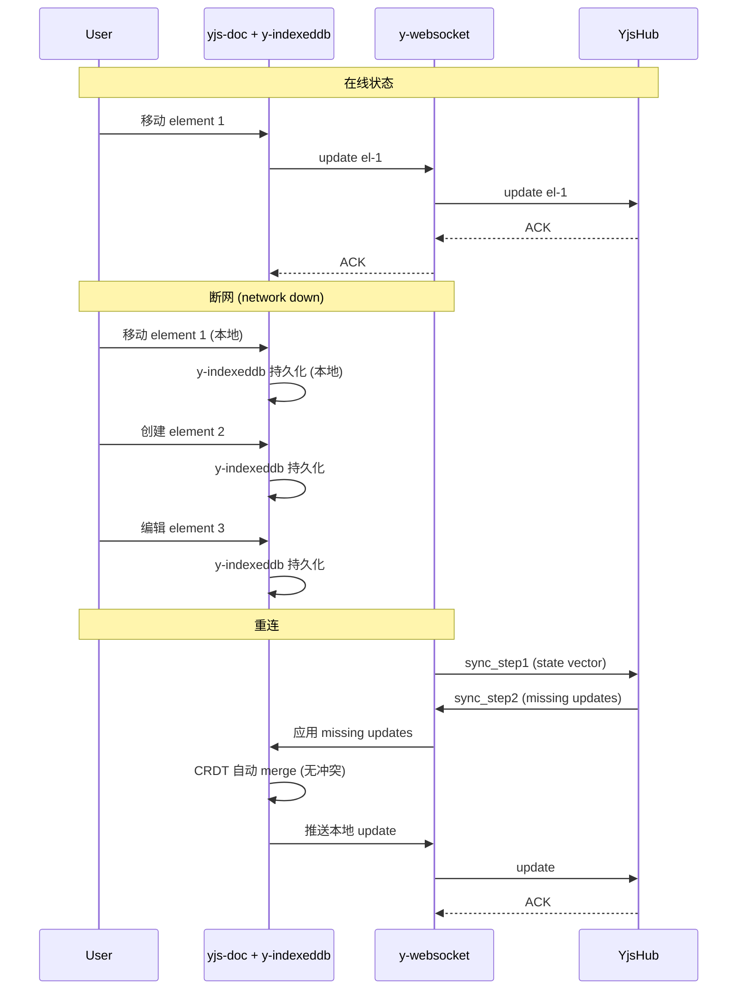
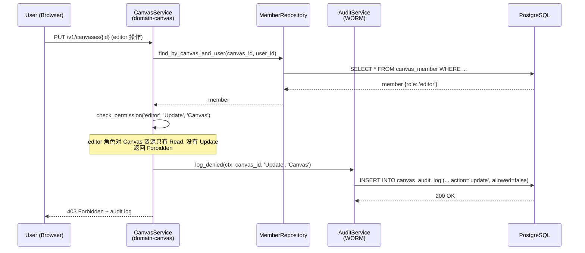

# BD-STAR-CANVAS-001

> **⚠️ SUPERSEDED 2026-09-07 JST ⚠️**
>
> **本 BD v0.1 (commit `68c200c`) 已被全面推翻重写。**
>
> **推翻原因**: 2026-09-07 06:47 JST 用户拍板, 产品方向从"Miro 风协作画布"调整为"画布里的弹幕 Roguelike 游戏 + 3渲2 像素风机器人角色"。
>
> **替代文档**: [`docs/design/BD-STAR-CANVAS-GAME-001.md`](./BD-STAR-CANVAS-GAME-001.md) v0.1
>
> **保留**: 3 crate 架构骨架 (canvas-engine / domain-canvas / canvas-realtime) + Yjs CRDT, 仅 crate 内容改写 + 新增 `canvas-game` 第 4 crate
>
> **作废**: 13 ElementRenderer + 8 大功能域 + 5 角色 RACI 65 单元 + Frame as Slide + 5 格式导出 + 10 模板 + WCAG 2.1 AA 40+ 快捷键
>
> **状态**: ~~Design Baseline~~ → **SUPERSEDED 2026-09-07**, 请参阅 BD-STAR-CANVAS-GAME-001.md v0.1
>
> ---
>
> 以下为原 v0.1 内容, 仅作历史归档参考, 不再使用。
>
> ---
>
> # BD-STAR-CANVAS-001 (v0.1 SUPERSEDED, 仅归档)
>
> > **STAR 无限画布 基本設計書 v0.1 (SUPERSEDED)** (per 日本 IPA SEC 標準 / 基本設計書 テンプレート)
>
> - 状态: Design Baseline
> - 目标阶段: 基本設計 → 詳細設計 → 実装 → テスト → リリース
> - 上位要件: [`docs/requirements/SRS-STAR-CANVAS-001.md`](../requirements/SRS-STAR-CANVAS-001.md) v0.1 (commit `9a2e6e0`)
> - 关联詳細設計: [`docs/design/DD-STAR-CANVAS-001.md`](./DD-STAR-CANVAS-001.md) (本 commit 同期落档)
> - 关联実装報告: [`docs/reports/PHASE-CANVAS-IMPL-REPORT.md`](../reports/PHASE-CANVAS-IMPL-REPORT.md) v0.1 (P0 落地后)
> - 关联上游 (被本 BD 升级): `docs/frontend-canvas-design.md` v0.1 (2026-08-26, 21.4 KB, 方案 B 旧设计)
> - 关联平行: `docs/requirements/SRS-STAR-AGENT-RUNTIME-001.md` v1.0 (Runtime) + `docs/architecture/2026-09-03-langgraph/02-basic-design.md` (LangGraph) + `docs/design/BD-AGENT-VIEW-001.md` v1.0 (Agent View 派生消费者)
> - 关联实装: `frontend/src/components/CanvasView.tsx` (已有 7 kind + 5 联动) + `frontend/src/app/canvas/page.tsx` (占位) + `frontend/src/lib/seed.ts` (mock data)
> - 关联 brief: `docs/briefs/canvas-e2e-guard-001.md` + `docs/briefs/canvas-share-export-001.md`
> - 修订人: Ulysses（一人公司 12 角色 per DEC-008）— Mavis 接手 (per 2026-08-27 19:39 JST 用户授权)
> - 审批: 架构师 (Mavis 接手 agent per DEC-008)
> - 日期: 2026-09-06 JST
> - 受众: 詳細設計エンジニア / 実装エンジニア (Rust + TypeScript) / UI/UX 设计师 / アーキテクト / SRE / 5 域 Lead (未来到位) / DDD Review 主持

---

## 0. 目的 (Purpose)

本文档基于 [`SRS-STAR-CANVAS-001.md`](../requirements/SRS-STAR-CANVAS-001.md) v0.1 (113 节 / 800+ 需求点) 的要件, 定义 **STAR 无限画布 (Infinite Canvas)** 的基本設計:

- **系统架构** (4-tier 前后端双侧: Browser / canvas-engine 共享 + domain-canvas 业务域 / canvas-realtime CRDT 后端 / PostgreSQL 16 + S3 + Redis + NATS JetStream)
- **5 view 完整覆盖** (機能 / データ / 動作 / モジュール / ネットワーク)
- **100+ FR 映射** (per SRS-001 §16-§25 + 26 表数据模型 + 13 element 渲染 + 5 角色 13 资源 RACI)
- **3 个新 Rust crate** (canvas-engine 平台能力 / domain-canvas 业务域 / canvas-realtime Yjs CRDT 后端, 跟 47 现有 crate 平级, per AGENTS.md §4.2 守门 #4 唯一性)
- **5 个新 frontend 模块** (canvas-engine client / canvas-realtime-client / canvas-ui / canvas-renderers / canvas-templates)
- **9 域联动** (work-item / worktree / agent / relation / comment / automation / audit / search / notification, per `frontend-canvas-design.md` §1.3 升级)
- **NFR 9 项** (性能 / 可用性 / 安全 / 可扩展 / 可观测 / 可恢复 / 兼容 / 可维护 / i18n)
- **守门 26 项 + 累积规 v1-v26** + 子代理失败接手 + 已知缺口 G-CANVAS-1~12

> **dual-use 提醒 (per [AGENTS.md §5 倉庫拓扑](../../AGENTS.md))**: 本 view 不引用 RGS 仓 + 不建立业务子域↔DDD bounded context 映射. STAR 无限画布 跟 LangGraph view / Agent Runtime view / Agent View 平行, 通过 domain 共享 store / 域 Port 接口解耦, 但**不**直接调用其他 view 的 action. 5 域 (player/economy/match/social/admin) 是历史治理命名 (守门 #3 拍板), 跟 25+ domain-* crate 是不同分类.

> **本 view 跟 Agent View (派生消费者) 区别 (per [BD-AGENT-VIEW-001 §1.3](./BD-AGENT-VIEW-001.md))**: Agent View 是 Miro 风格派生画布 (单页面 3 类节点 + 1:1 worktree 关联, 11 状态 P0 已落), 通过 zustand store 读 useStore. **本 BD-STAR-CANVAS-001 是 canvas 产品域自身**, 跨 5+ domain 共享画布能力, 含完整 8 大功能域 / 实时协作 / 权限模型 / 13 element 渲染 / 5 角色权限矩阵. Agent View 后续可升级到引用 canvas-engine (per FR-CANV-701 + §12.3 迁移路径).

---

## 1. 适用范围 (Scope)

### 1.1 包含 (In-Scope)

- **3 个新 Rust crate** (新增到 `crates/`, 命名待 DDD Review Lead 拍板)
  - `crates/canvas-engine` — 共享画布能力 (坐标系 / viewport / 渲染抽象 / 13 element 渲染接口)
  - `crates/domain-canvas` — 画布产品业务域 (RLS 13 类 + audit + i18n, 注入到 canvas-engine)
  - `crates/canvas-realtime` — Yjs CRDT 后端 (Rust + Tokio + yrs + axum, WebSocket + y-protocols)
- **5 个新 frontend 模块** (新增到 `frontend/src/`)
  - `lib/canvas/` — 客户端引擎 (viewport / culling / 布局算法 + yjs doc 管理)
  - `lib/canvas-realtime-client/` — y-websocket provider + awareness
  - `components/canvas/` — 13 element 渲染组件 (P0) + Frame / Connector / Toolbar / Minimap / Layers / Comments
  - `app/canvas/[id]/` — 画布详情页 + 演示模式 + 导入导出
  - `app/canvas/_data/templates/` — 8 域 10 模板 (per ADR-CANVAS-010)
- **26 表数据模型** (per SRS-001 §36-§39, W/T/M 严格守门 #13 分类, M:16 / T:6 / W:6 含 1 个 M+W 二象)
- **8 大功能域 100% 必备功能** (per SRS-001 §9 G-1 完整对标 Miro)
- **9 域联动** (per `frontend-canvas-design.md` §1.3 升级)
- **5 角色权限矩阵** (viewer / commenter / editor / admin / owner × 13 资源 = 65 RACI 单元)
- **Yjs CRDT 实时协作** (推翻旧 NATS BFF polling per ADR-CANVAS-002)
- **WCAG 2.1 AA 无障碍** (per SRS-001 §23 FR-CANV-510)
- **40+ 键盘快捷键** (per SRS-001 §23 FR-CANV-500)
- **5 格式导入导出** (PNG / PDF / SVG / JSON / Miro RTB per SRS-001 §21)
- **10 模板** (8 域核心 + 2 行业, per ADR-CANVAS-010)
- **演示模式** (Frame as Slide + 演讲者视图, per SRS-001 §20)
- **审计 + 监控 + 告警** (per 守门 #13 T 类 100% audit + 守门 #1 v12)

### 1.2 不包含 (Out-of-Scope)

- 物理引擎 (Physis 独立产品线, per 2026-09-03 18:14 JST 用户反馈)
- 3D 渲染 / HUD
- 跨机分布式 (per 守门 #3 5 域单仓, 跨机待 P3-F 评估, 本 view ❌ N/A)
- 移动端原生 (iOS/Android native), 仅 PWA 触屏支持 (per ADR-CANVAS-008)
- AI 辅助 (Miro Assist 类), 独立 AI SRS 评估 (per SRS-001 §13.2)
- 模板众包市场 (2.5K 全模板), 仅交付 5-10 个核心模板 (per ADR-CANVAS-010)
- BPMN / UML 高级 diagram 类型 (P3 候选)
- 视频会议集成 (Zoom/Meet 嵌入)
- AR/VR 画布
- 区块链存证 (画布 hash 锚定)
- LangGraph 任务卡子代理详细 (引用 [LangGraph 9/3 02](../architecture/2026-09-03-langgraph/02-basic-design.md) §3-§4, 不重写)
- Agent Runtime ECS 详细 (引用 [Agent Runtime 02](../architecture/2026-09-03-agent-runtime/02-basic-design.md) §3-§4, 不重写)
- 旧 `frontend-canvas-design.md` v0.1 方案 B (被本 BD 升级, 落地 phase 启动时标 superseded + 9 派生文档归档 per RK-3)

### 1.3 跟其他 view / BD 区别

| 维度 | Agent View (BD-AGENT-VIEW-001, 9/5 批) | Agent Runtime (BD-Runtime, 9/3 批) | LangGraph View (BD-LG, 9/3 批) | **Canvas (本 BD, 9/6 批)** |
|---|---|---|---|---|
| **关注点** | 单页面 Miro 风格派生画布 (3 类节点) | Rust Runtime 基础设施 (派发 + ECS + 共享池) | UI 驱动 2-level hierarchical Agent | 跨域共享画布产品域 (8 大功能域) |
| **目标** | 当前工作 agent 拓扑可视化 | L0 派发 + L1 ECS + L2 业务池 | LLM 编排 + 任务卡生命周期 | 团队画布协作 + 9 域联动 + 跨 5 domain 共享 |
| **实现** | React + Next.js + zustand | Rust + Tokio + ECS | LangGraph Python subgraph | **Rust 3 crate (canvas-engine/domain-canvas/canvas-realtime) + Next.js 5 模块** |
| **数据源** | zustand store (派生) | PostgreSQL / SQLite | LangGraph state schema | **Yjs CRDT + PostgreSQL 26 表 + S3 + Redis** |
| **用户交互** | 画布 pan/zoom + 节点 hover/select/dblclick | 0 (server-side) | Chat Bar + Task Card Modal | **8 大功能域 / 40+ 快捷键 / 实时协作 / 5 角色权限** |
| **CRDT** | N/A (派生只读) | N/A (Rust in-process) | LangGraph state + reducer | **Yjs CRDT (per ADR-CANVAS-002)** |
| **画布能力** | 7 element (旧 v0.1 复用) | N/A | N/A | **13 element + 13 资源 5 角色 + 5 格式导出** |
| **持久化** | localStorage zustand persist | PostgreSQL + SQLite | LangGraph 3-tier checkpoint | **PostgreSQL 26 表 W/T/M + Yjs update 二进制** |
| **协作模式** | 单用户派生视图 | 单进程 1M agent | 9 SA Type 编排 | **Yjs CRDT 50 协作者 + 离线编辑 + 跟随模式** |
| **路径** | `docs/design/BD-AGENT-VIEW-001.md` | `docs/architecture/2026-09-03-agent-runtime/02-basic-design.md` | `docs/architecture/2026-09-03-langgraph/02-basic-design.md` | `docs/design/BD-STAR-CANVAS-001.md` |

**关系**: Canvas view 跟 Agent View / Agent Runtime / LangGraph view **平行**, 通过 zustand store / domain Port 接口解耦. canvas-engine crate 跨 board / planning / workflow / feedback / agent-view 多模块共享 (per FR-CANV-701), 9 SA Type 是**接口**而不是实现 — LangGraph subgraph 实现 SA-XX 业务逻辑, Agent Runtime ECS 提供底层 Runtime, Canvas 提供画布能力. 4 个 view 通过 Adapter 模式连接 (per §3.3 组件一览).

---

## 2. システムアーキテクチャ (System Architecture)

### 2.1 全体構成図 (Overall Architecture, 4-tier 前后端双侧)

```
┌─────────────────────────────────────────────────────────────────────────────────────┐
│                         Browser Tier (frontend/src/)                                 │
│                                                                                       │
│  ┌────────────────────────────────────────────────────────────────────────────────┐  │
│  │  Next.js 14.2.5 App Router (React 18.3.1 + TypeScript 5.5.3)                 │  │
│  │  ┌────────────────────────────────────────────────────────────────────────┐   │  │
│  │  │  app/canvas/[id]/page.tsx                                              │   │  │
│  │  │  ┌─────────────────────────────────────────────────────────────────┐  │   │  │
│  │  │  │  <CanvasToolbar> (5 工具 + 缩放 + 撤销/重做 + 演示 + 导入导出)   │  │   │  │
│  │  │  │  <CanvasViewport> (SVG 渲染 + 视口 culling)                      │  │   │  │
│  │  │  │  ├─ <ElementRenderer kind=sticky_note|...|table 13 kinds>        │  │   │  │
│  │  │  │  ├─ <ConnectorRouter routing=straight|curved|orthogonal>         │  │   │  │
│  │  │  │  ├─ <FrameContainer order={n}>                                    │  │   │  │
│  │  │  │  └─ <Minimap viewport={...}>                                      │  │   │  │
│  │  │  │  <CanvasSidebar> (Layers / Comments / History 3 tabs)            │  │   │  │
│  │  │  │  <CanvasStatusBar> (zoom / cursor / 协作者 / 最后保存)           │  │   │  │
│  │  │  │  <PresentationOverlay> (fullscreen + Frame as Slide)             │  │   │  │
│  │  │  │  <ExportDialog> (PNG / PDF / SVG / JSON / Miro import)           │  │   │  │
│  │  │  └─────────────────────────────────────────────────────────────────┘  │   │  │
│  │  └────────────────────────────────────────────────────────────────────────┘   │  │
│  │  ┌────────────────────────────────────────────────────────────────────────┐   │  │
│  │  │  lib/canvas/ (Client Engine, 纯函数 + Yjs Doc 管理)                   │   │  │
│  │  │  ├─ viewport.ts          (pan / zoom / fit / culling)                │   │  │
│  │  │  ├─ element-renderer.ts  (13 kind 渲染抽象 + 工厂)                    │   │  │
│  │  │  ├─ connector-router.ts   (3 routing 算法)                            │   │  │
│  │  │  ├─ layout-algorithm.ts   (自由散开 + 圆周 + 网格)                   │   │  │
│  │  │  ├─ selection.ts          (单选 / 多选 / 框选 / 全选)                 │   │  │
│  │  │  ├─ keyboard.ts           (40+ 快捷键 dispatcher)                     │   │  │
│  │  │  ├─ accessibility.ts      (WCAG 2.1 AA helper)                       │   │  │
│  │  │  ├─ yjs-doc.ts            (Y.Doc + Y.Map + Y.Array + UndoManager)   │   │  │
│  │  │  └─ templates.ts          (10 模板 metadata + apply)                 │   │  │
│  │  └────────────────────────────────────────────────────────────────────────┘   │  │
│  │  ┌────────────────────────────────────────────────────────────────────────┐   │  │
│  │  │  lib/canvas-realtime-client/ (y-websocket Provider)                   │   │  │
│  │  │  ├─ y-websocket-provider.ts  (WSS + auto-reconnect + offline)        │   │  │
│  │  │  ├─ y-indexeddb-provider.ts  (本地 IndexedDB 持久化)                 │   │  │
│  │  │  ├─ awareness.ts              (光标 / 选区 / 在线状态)                │   │  │
│  │  │  └─ sync.ts                   (debounce 1s + binary update)          │   │  │
│  │  └────────────────────────────────────────────────────────────────────────┘   │  │
│  └────────────────────────────────────────────────────────────────────────────────┘  │
│                              │ HTTPS / WSS                                            │
└──────────────────────────────┼────────────────────────────────────────────────────────┘
                               │
                               ↓
┌─────────────────────────────────────────────────────────────────────────────────────┐
│                  Platform Tier (Rust 3 crate + 共享依赖)                              │
│                                                                                       │
│  ┌────────────────────────────────────────────────────────────────────────────────┐  │
│  │  canvas-engine (共享画布能力, 跨 5 domain 引用, 0 业务域依赖)                  │  │
│  │  ┌────────────────────────────────────────────────────────────────────────┐   │  │
│  │  │  CanvasEngine::new(config) → Self                                     │   │  │
│  │  │  ├─ viewport: Viewport { x, y, zoom }                                 │   │  │
│  │  │  ├─ world_to_screen(point) → Point                                   │   │  │
│  │  │  ├─ screen_to_world(point) → Point                                   │   │  │
│  │  │  ├─ culling(elements, viewport) → Vec<ElementId>                     │   │  │
│  │  │  ├─ bbox(elements) → BBox { minX, minY, maxX, maxY }                 │   │  │
│  │  │  ├─ fit_to_content(bbox, container, padding) → Viewport             │   │  │
│  │  │  ├─ connector_route(from, to, kind) → Path                          │   │  │
│  │  │  ├─ snap_to_grid(point, size) → Point                                │   │  │
│  │  │  └─ DAG_check(connectors) → Result<(), CycleError>                   │   │  │
│  │  │  trait ElementRenderer { fn render(&self, element: &Element) -> Svg; }│   │  │
│  │  │  13 ElementKind → 13 ElementRenderer impl                            │   │  │
│  │  └────────────────────────────────────────────────────────────────────────┘   │  │
│  └────────────────────────────────────────────────────────────────────────────────┘  │
│  ┌────────────────────────────────────────────────────────────────────────────────┐  │
│  │  domain-canvas (业务域, 注入 RLS / audit / i18n 到 canvas-engine)             │  │
│  │  ┌────────────────────────────────────────────────────────────────────────┐   │  │
│  │  │  Ports:                                                                │   │  │
│  │  │  ├─ CanvasRepository (PostgreSQL 26 表, 守门 #13 W/T/M 严格)          │   │  │
│  │  │  ├─ CanvasMemberRepository                                            │   │  │
│  │  │  ├─ CanvasShareLinkRepository                                         │   │  │
│  │  │  ├─ CanvasTemplateRepository                                          │   │  │
│  │  │  ├─ CanvasAuditRepository (append-only, per ADR-0043)                │   │  │
│  │  │  └─ CanvasNotificationPublisher (NATS JetStream)                    │   │  │
│  │  │  Services:                                                             │   │  │
│  │  │  ├─ CanvasService (CRUD + 5 角色权限校验 + SCD Type 2)               │   │  │
│  │  │  ├─ ElementService (13 kind 多态 + 联动 ref 校验)                     │   │  │
│  │  │  ├─ ConnectorService (DAG 检测 + 3 routing)                          │   │  │
│  │  │  ├─ FrameService (嵌套 3 层 + 演示顺序)                              │   │  │
│  │  │  ├─ CommentService (挂 element / canvas, 5 层回复)                   │   │  │
│  │  │  ├─ TemplateService (fork + 分类 + 标签 + 版本)                      │   │  │
│  │  │  ├─ ShareService (链接 + 密码 + 过期 + 公开私有)                    │   │  │
│  │  │  ├─ ExportService (PNG / PDF / SVG / JSON / Miro import)             │   │  │
│  │  │  └─ WebhookService (8 事件)                                          │   │  │
│  │  │  HTTP Handlers (axum):                                                │   │  │
│  │  │  ├─ 13 REST 端点 (per SRS-001 §46 IR-API-1..13)                     │   │  │
│  │  │  └─ MCP 7 工具 (per SRS-001 §50 IR-MCP-1..7)                        │   │  │
│  │  └────────────────────────────────────────────────────────────────────────┘   │  │
│  └────────────────────────────────────────────────────────────────────────────────┘  │
│  ┌────────────────────────────────────────────────────────────────────────────────┐  │
│  │  canvas-realtime (Yjs CRDT 后端, 横向扩展 + 50 协作者性能)                  │  │
│  │  ┌────────────────────────────────────────────────────────────────────────┐   │  │
│  │  │  YjsHub::new(canvas_id) → YrsDoc (per canvas instance)                │   │  │
│  │  │  ├─ sync_step1 / sync_step2 / update (y-protocols/sync)              │   │  │
│  │  │  ├─ awareness (光标 / 选区 / 在线, 不持久化)                        │   │  │
│  │  │  ├─ persist_update (Yjs update → canvas_realtime_yjs_update 表)      │   │  │
│  │  │  ├─ load_doc (顺序应用所有 update 重建 Y.Doc)                        │   │  │
│  │  │  ├─ awareness_broadcast (10Hz 限频)                                  │   │  │
│  │  │  └─ WsHandler (WSS + auth + ping/pong + close code)                │   │  │
│  │  │  Sticky session + Redis pub/sub (横向扩展, per NFR-SCAL-5)          │   │  │
│  │  │  性能目标: 50 协作者 / 1K element 同步延迟 < 200ms (per G-3)         │   │  │
│  │  └────────────────────────────────────────────────────────────────────────┘   │  │
│  └────────────────────────────────────────────────────────────────────────────────┘  │
│  ┌────────────────────────────────────────────────────────────────────────────────┐  │
│  │  共享依赖 (跨 3 crate + 47 现有 crate)                                       │  │
│  │  ├─ star-context (ActorContext 17 字段 + 4 helper)                          │  │
│  │  ├─ star-cache (Redis 缓存, 画布 metadata 缓存)                            │  │
│  │  ├─ star-saga (跨域 Saga, Canvas ↔ WorkItem ↔ Comment)                     │  │
│  │  ├─ domain-permission (5 角色权限校验)                                      │  │
│  │  ├─ domain-audit (WORM 写入, per ADR-0043)                                 │  │
│  │  ├─ domain-notification (NATS JetStream 触发)                              │  │
│  │  └─ domain-tenant (tenant_id + workspace_id RLS 13 必带)                   │  │
│  └────────────────────────────────────────────────────────────────────────────────┘  │
└──────────────────────────────────────┬──────────────────────────────────────────────┘
                                       │ TCP / TLS
                                       ↓
┌─────────────────────────────────────────────────────────────────────────────────────┐
│                          Storage Tier                                                │
│  ┌────────────────────┐ ┌────────────────────┐ ┌────────────────────┐ ┌────────────┐ │
│  │  PostgreSQL 16     │ │  Redis 7            │ │  S3-compatible    │ │ NATS 2.10+ │ │
│  │  (26 表 W/T/M)    │ │  (画布 metadata +  │ │  (MinIO, 图片 +   │ │ JetStream  │ │
│  │  + 守门 #13 强制   │ │   Yjs awareness)   │ │   导出文件)        │ │ (事件流)   │ │
│  └────────────────────┘ └────────────────────┘ └────────────────────┘ └────────────┘ │
└─────────────────────────────────────────────────────────────────────────────────────┘
```

### 2.2 データフロー図 (Data Flow, mermaid)

```mermaid
flowchart TB
    subgraph Browser
        UI[CanvasViewport<br/>SVG 渲染]
        Engine[lib/canvas/<br/>客户端引擎]
        YjsDoc[Y.Doc<br/>Y.Map elements<br/>Y.Array connectors]
        WS[y-websocket<br/>Provider]
    end

    subgraph Backend
        DomainSvc[domain-canvas<br/>CanvasService]
        RealtimeHub[canvas-realtime<br/>YjsHub]
        PG[(PostgreSQL 16<br/>26 表 W/T/M)]
        S3[(S3-compatible<br/>MinIO)]
        Redis[(Redis 7<br/>awareness cache)]
    end

    UI -->|onElementMove<br/>onElementResize| Engine
    Engine -->|Y.Map.set<br/>Y.Array.push| YjsDoc
    YjsDoc -->|binary update<br/>1s debounce| WS
    WS -->|WSS +<br/>y-protocols/sync| RealtimeHub
    RealtimeHub -->|Y.Map.observe<br/>apply update| YjsDoc
    RealtimeHub -->|persist<br/>increment| PG
    RealtimeHub -->|awareness<br/>10Hz| Redis
    DomainSvc -->|CRUD + RLS + audit| PG
    DomainSvc -->|image upload<br/>export file| S3
    DomainSvc -->|@mention event| NATS[NATS JetStream<br/>domain-notification]
    NATS -->|notification| User
    UI -->|comment / @mention| DomainSvc
    DomainSvc -->|member.role<br/>5 角色校验| Permission[domain-permission]
    DomainSvc -->|audit log<br/>WORM 写入| Audit[domain-audit<br/>per ADR-0043]
```

### 2.3 4 层架构核心原则

| 原则 | 说明 | 守门 |
|---|---|---|
| **canvas-engine 零业务依赖** | 不引用任何 domain-* 业务逻辑, 通过 trait 抽象 + 调用方注入 (per ADR-CANVAS-005) | #4 + #13 |
| **domain-canvas 注入式** | 在 canvas-engine 之上加 RLS / audit / i18n, 不污染引擎 | #13 |
| **canvas-realtime 独立 crate** | Yjs CRDT 后端独立部署, sticky session + Redis pub/sub 横向扩展 | #1 v12 |
| **PostgreSQL 26 表 W/T/M 严格** | 守门 #13 强制 100% 横展分类, 不允许混合 | #13 |
| **Yjs update 二进制持久化** | `canvas_realtime_yjs_update` 表 (M+W 二象, 30 天 TTL), 不直接 INSERT element | #13 |
| **5 角色 RACI 矩阵** | 通过 `canvas_role` 表 + `canvas_member.role` 字段实现, 不硬编码 | #13 |
| **13 资源 RLS 必带** | `tenant_id` + `workspace_id` + 守门 #13 强制 100% | #13 |
| **0 unsafe** | 守门 #7 跨整个 workspace, canvas-engine / domain-canvas / canvas-realtime 全过 | #7 |
| **WASM 预留** | canvas-engine core 算法预留 wasm-pack 编译, 未来可在浏览器侧复用 (P3 候选) | #1 |

---

## 3. 機能設計 (Functional Design, 5 view #1 機能)

### 3.1 機能一覧 (Functional Catalog, FR-CANV-NNN per [SRS-001 §16-§25](../requirements/SRS-STAR-CANVAS-001.md))

> 8 大功能域 100+ FR 完整映射 (per SRS-001 G-1 完整对标 Miro), 详见 SRS-001 §16-§25. 本节列功能架构.

#### 3.1.1 域 1: 画布引擎 (FR-CANV-001..040, 25 FR, P0)

| 功能组 | FR 范围 | 组件 | 优先级 |
|---|---|---|---|
| 坐标系与视口 | FR-001..007 (7 FR) | `lib/canvas/viewport.ts` + `CanvasViewport` | P0 |
| 渲染性能 | FR-010..013 (4 FR) | `lib/canvas/culling.ts` + React.memo | P0 |
| 选择与框选 | FR-020..023 (4 FR) | `lib/canvas/selection.ts` | P0 |
| 拖动与变换 | FR-025..029 (5 FR) | `lib/canvas/transform.ts` | P0 |
| 图层与 Z-Index | FR-030..031 (2 FR) | `lib/canvas/z-index.ts` + `<Layers>` | P0/P1 |
| 撤销与重做 | FR-040..041 (2 FR) | Yjs UndoManager | P0 |

#### 3.1.2 域 2: 元素系统 (FR-CANV-100..153, 40 FR, P0/P1/P2)

| 功能组 | FR 范围 | 组件 | 优先级 |
|---|---|---|---|
| 13 Element 类型 | FR-100..114 (15 FR) | `<ElementRenderer kind=...>` 13 impl | P0/P1/P2 |
| 元素通用操作 | FR-130..134 (5 FR) | `lib/canvas/element-ops.ts` | P0/P1 |
| 连接器 | FR-140..144 (5 FR) | `<ConnectorRouter>` + 3 routing 算法 | P0 |
| Frame 与容器 | FR-150..153 (4 FR) | `<FrameContainer>` + 嵌套 + 自动避让 | P0/P1/P2 |

#### 3.1.3 域 3: 实时协作 (FR-CANV-200..225, 20 FR, P0)

| 功能组 | FR 范围 | 组件 | 优先级 |
|---|---|---|---|
| Yjs CRDT 协同 | FR-200..210 (10 FR) | `lib/canvas-realtime-client/yjs-doc.ts` + `canvas-realtime/YjsHub` | P0 |
| 评论与 @ 提及 | FR-220..225 (6 FR) | `<CommentPin>` + `domain-comment` 联动 | P0 |

#### 3.1.4 域 4: 模板系统 (FR-CANV-300..307, 8 FR, P1/P2)

| 功能组 | FR 范围 | 组件 | 优先级 |
|---|---|---|---|
| 10 模板 (8 域 + 2 行业) | FR-300..307 (8 FR) | `app/canvas/_data/templates/` | P1/P2 |

#### 3.1.5 域 5: 演示模式 (FR-CANV-350..355, 6 FR, P1/P2)

| 功能组 | FR 范围 | 组件 | 优先级 |
|---|---|---|---|
| Frame as Slide | FR-350..355 (6 FR) | `<PresentationOverlay>` | P1/P2 |

#### 3.1.6 域 6: 导入导出 (FR-CANV-400..407, 8 FR, P0/P1/P2)

| 功能组 | FR 范围 | 组件 | 优先级 |
|---|---|---|---|
| 5 格式导出 + Miro import | FR-400..407 (8 FR) | `<ExportDialog>` + `lib/canvas/export/` | P0/P1/P2 |

#### 3.1.7 域 7: 权限分享 (FR-CANV-450..459, 10 FR, P0/P1/P2)

| 功能组 | FR 范围 | 组件 | 优先级 |
|---|---|---|---|
| 5 角色 13 资源 RACI 矩阵 | FR-450..459 (10 FR) | `domain-permission` 集成 | P0 |

#### 3.1.8 域 8: 快捷键无障碍 (FR-CANV-500..518, 12 FR, P0/P1)

| 功能组 | FR 范围 | 组件 | 优先级 |
|---|---|---|---|
| 40+ 快捷键 + WCAG 2.1 AA | FR-500..518 (12 FR) | `lib/canvas/keyboard.ts` + `accessibility.ts` | P0 |

#### 3.1.9 域 9: 跨域共享 (FR-CANV-700..704, 5 FR, P0)

| 功能组 | FR 范围 | 组件 | 优先级 |
|---|---|---|---|
| canvas-engine 跨 5 domain 引用 | FR-700..704 (5 FR) | 3 Rust crate 公开 API | P0 |

**汇总**: 8 大功能域 + 跨域共享 9 域, **100+ FR / 13 element / 5 角色 / 5 格式导出 / 10 模板** 全部覆盖, 优先级 P0/P1/P2/P3 阶段化.

### 3.2 主要機能フロー (Main Functional Flow)

#### 3.2.1 FR-CANV-201 Yjs Y.Map 元素存储 + FR-CANV-025 拖动 (詳細)

```typescript
// === lib/canvas/yjs-doc.ts (客户端) ===

import * as Y from 'yjs';
import { WebsocketProvider } from 'y-websocket';
import { IndexeddbPersistence } from 'y-indexeddb';

export class CanvasDoc {
  doc: Y.Doc;
  yElements: Y.Map<Y.Map<unknown>>;  // elementId -> element Y.Map
  yConnectors: Y.Array<Y.Map<unknown>>;  // connector list
  yFrames: Y.Map<Y.Map<unknown>>;  // frameId -> frame Y.Map
  provider: WebsocketProvider;
  persistence: IndexeddbPersistence;
  undoManager: Y.UndoManager;

  constructor(canvasId: string, userId: string) {
    this.doc = new Y.Doc();
    this.yElements = this.doc.getMap('elements');
    this.yConnectors = this.doc.getArray('connectors');
    this.yFrames = this.doc.getMap('frames');

    // (1) 离线 IndexedDB 持久化
    this.persistence = new IndexeddbPersistence(`canvas-${canvasId}`, this.doc);

    // (2) WebSocket 实时协作
    this.provider = new WebsocketProvider(
      `wss://star.app/ws/canvas/${canvasId}`,
      `canvas-${canvasId}`,
      this.doc,
      { params: { token: getAuthToken(), userId } }
    );

    // (3) Awareness (光标 / 选区 / 在线)
    this.provider.awareness.setLocalStateField('user', {
      id: userId,
      name: getUserName(),
      color: hashUserIdToColor(userId),
    });

    // (4) UndoManager (per FR-CANV-040)
    this.undoManager = new Y.UndoManager(
      [this.yElements, this.yConnectors, this.yFrames],
      { captureTimeout: 500, trackedOrigins: new Set([this.doc.clientID]) }
    );
  }

  // 拖动 element (FR-CANV-025)
  moveElement(elementId: string, x: number, y: number): void {
    const element = this.yElements.get(elementId);
    if (!element || element.get('locked')) return;

    // Yjs CRDT 自动解决冲突 (LWW last-write-wins)
    this.doc.transact(() => {
      element.set('x', x);
      element.set('y', y);
      element.set('updated_at', new Date().toISOString());
    }, 'user-drag');
  }

  // 撤销 (Cmd+Z)
  undo(): void { this.undoManager.undo(); }

  // 重做 (Cmd+Shift+Z)
  redo(): void { this.undoManager.redo(); }

  // 销毁
  destroy(): void {
    this.provider.destroy();
    this.persistence.destroy();
    this.doc.destroy();
  }
}
```

```rust
// === canvas-realtime/src/yjs_hub.rs (服务端) ===

use yrs::{Doc, Map, Array, ReadTxn, WriteTxn, Transact};
use yrs::sync::{sync_step1, sync_step2, update};
use yrs::sync::awareness::Awareness;
use tokio::sync::broadcast;
use sqlx::PgPool;

pub struct YjsHub {
    canvas_id: Uuid,
    doc: Doc,
    awareness: Awareness,
    pg_pool: PgPool,
    redis: redis::Client,
    persist_tx: broadcast::Sender<Vec<u8>>,
}

impl YjsHub {
    /// 加载或创建 canvas 的 Yjs Doc
    pub async fn load_or_create(
        canvas_id: Uuid,
        pg_pool: PgPool,
        redis: redis::Client,
    ) -> Result<Self> {
        let doc = Doc::new();

        // (1) 从 PostgreSQL 加载所有 Yjs update
        let updates: Vec<Vec<u8>> = sqlx::query!(
            "SELECT yjs_update FROM canvas_realtime_yjs_update
             WHERE canvas_id = $1 ORDER BY version_vector ASC",
            canvas_id
        )
        .fetch_all(&pg_pool)
        .await?
        .into_iter()
        .map(|r| r.yjs_update)
        .collect();

        // (2) 顺序应用所有 update 重建 Y.Doc
        let mut txn = doc.transact_mut();
        for update_bytes in updates {
            update(&mut txn, &update_bytes)?;
        }
        drop(txn);

        // (3) 初始化 awareness
        let awareness = Awareness::new(doc.clone());

        Ok(Self { canvas_id, doc, awareness, pg_pool, redis, persist_tx: broadcast::channel(1024).0 })
    }

    /// 处理 sync_step1 (客户端 → 服务端: state vector)
    pub fn handle_sync_step1(&self, state_vector: Vec<u8>) -> Vec<u8> {
        let txn = self.doc.transact();
        sync_step2(&txn, &state_vector).encode_v1()
    }

    /// 处理 update (双向: Yjs 二进制 update)
    pub fn handle_update(&mut self, update_bytes: Vec<u8>) -> Result<()> {
        let mut txn = self.doc.transact_mut();
        update(&mut txn, &update_bytes)?;
        drop(txn);

        // 持久化到 PostgreSQL (debounce 1s)
        let _ = self.persist_tx.send(update_bytes);
        Ok(())
    }

    /// 处理 awareness (光标 / 选区 / 在线状态, 不持久化)
    pub fn handle_awareness(&mut self, update: Vec<u8>) -> Result<()> {
        self.awareness.apply_update(update)?;
        Ok(())
    }

    /// 后台持久化任务 (debounce 1s)
    pub async fn persist_loop(&self, mut rx: broadcast::Receiver<Vec<u8>>) {
        let mut buffer = Vec::new();
        let mut interval = tokio::time::interval(Duration::from_secs(1));
        loop {
            tokio::select! {
                Ok(update) = rx.recv() => {
                    buffer.push(update);
                }
                _ = interval.tick() => {
                    if buffer.is_empty() { continue; }
                    // 批量写入 PostgreSQL
                    let updates = std::mem::take(&mut buffer);
                    for update in updates {
                        sqlx::query!(
                            "INSERT INTO canvas_realtime_yjs_update
                             (id, canvas_id, yjs_update, update_size, version_vector, expires_at)
                             VALUES (gen_random_uuid(), $1, $2, $3,
                                     COALESCE((SELECT MAX(version_vector) FROM canvas_realtime_yjs_update
                                              WHERE canvas_id = $1), 0) + 1,
                                     NOW() + INTERVAL '30 days')",
                            self.canvas_id,
                            update,
                            update.len() as i32
                        )
                        .execute(&self.pg_pool)
                        .await
                        .ok();
                    }
                }
            }
        }
    }
}
```

#### 3.2.2 FR-CANV-450 5 角色权限矩阵 (詳細, 13 资源 RACI 65 单元)

```rust
// === domain-canvas/src/service/canvas_service.rs (后端) ===

use crate::port::permission::PermissionPort;
use crate::port::audit::AuditPort;
use crate::error::DomainError;
use star_context::ActorContext;

pub struct CanvasService {
    repo: Arc<dyn CanvasRepository>,
    member_repo: Arc<dyn CanvasMemberRepository>,
    permission: Arc<dyn PermissionPort>,
    audit: Arc<dyn AuditPort>,
}

impl CanvasService {
    /// 5 角色 13 资源 RACI 校验 (per SRS-001 §40 权限矩阵)
    pub async fn check_permission(
        &self,
        ctx: &ActorContext,
        canvas_id: Uuid,
        action: Action,
        resource: Resource,
    ) -> Result<(), DomainError> {
        // (1) 查 user 在 canvas 的角色
        let member = self.member_repo
            .find_by_canvas_and_user(canvas_id, ctx.user_id)
            .await?
            .ok_or(DomainError::NotFound)?;

        // (2) 查角色对资源的权限
        let allowed = match (member.role, action, resource) {
            // viewer (5 资源 R)
            (Role::Viewer, Action::Read, Resource::Canvas | Resource::Element
                | Resource::Connector | Resource::Frame | Resource::Comment
                | Resource::Template | Resource::Version | Resource::Embed
                | Resource::Subscription) => true,

            // commenter (R + 评论写)
            (Role::Commenter, Action::Read, _) => true,
            (Role::Commenter, Action::Create, Resource::Comment) => true,

            // editor (R + 全 CRUD on 5 业务资源)
            (Role::Editor, Action::Read, _) => true,
            (Role::Editor, Action::Create | Action::Update | Action::Delete,
                Resource::Element | Resource::Connector | Resource::Frame
                | Resource::Comment | Resource::Template | Resource::Embed
                | Resource::Subscription | Resource::ApiKey) => true,

            // admin (R + 全 CRUD + audit R + webhook R+A)
            (Role::Admin, Action::Read, _) => true,
            (Role::Admin, Action::Create | Action::Update | Action::Delete,
                Resource::Element | Resource::Connector | Resource::Frame
                | Resource::Comment | Resource::Template | Resource::Version
                | Resource::ShareLink | Resource::Embed | Resource::AuditLog
                | Resource::Subscription | Resource::Webhook | Resource::ApiKey) => true,

            // owner (R + 全 A + canvas 配置 C)
            (Role::Owner, Action::Read, _) => true,
            (Role::Owner, Action::Create | Action::Update | Action::Delete, _) => true,
            (Role::Owner, Action::Configure, Resource::Canvas) => true,

            _ => false,
        };

        if !allowed {
            // 审计 log 拒绝事件 (守门 #13 T 类)
            self.audit.log_denied(ctx, canvas_id, action, resource).await?;
            return Err(DomainError::Forbidden);
        }

        // 审计 log 允许事件 (守门 #13 T 类 100% audit)
        self.audit.log_allowed(ctx, canvas_id, action, resource).await?;
        Ok(())
    }
}
```

#### 3.2.3 FR-CANV-010 视口裁剪渲染 (性能 P0)

```typescript
// === lib/canvas/culling.ts (客户端) ===

import type { Viewport, BBox, Element } from './types';

export function culling(
  elements: ReadonlyArray<Element>,
  viewport: Viewport,
  containerWidth: number,
  containerHeight: number,
): Element[] {
  // (1) 计算视口在世界坐标下的 bbox
  const viewportBBox: BBox = {
    minX: viewport.x,
    minY: viewport.y,
    maxX: viewport.x + containerWidth / viewport.zoom,
    maxY: viewport.y + containerHeight / viewport.zoom,
  };

  // (2) bbox 相交检测, 仅渲染相交 element
  return elements.filter((el) => {
    if (el.hidden) return false;
    const elBBox: BBox = {
      minX: el.x,
      minY: el.y,
      maxX: el.x + el.width,
      maxY: el.y + el.height,
    };
    return bboxIntersects(viewportBBox, elBBox);
  });
}

function bboxIntersects(a: BBox, b: BBox): boolean {
  return !(a.maxX < b.minX || a.minX > b.maxX || a.maxY < b.minY || a.minY > b.maxY);
}

// 性能: 1K element 60fps, 10K element 30fps (per NFR-PERF-2 + SRS-001 §26)
```

#### 3.2.4 FR-CANV-403 JSON 导出 (Yjs Update 二进制)

```typescript
// === lib/canvas/export/yjs-export.ts (客户端) ===

import * as Y from 'yjs';

export async function exportCanvasAsJson(doc: Y.Doc): Promise<Blob> {
  // Yjs 完整 state 二进制编码
  const state = Y.encodeStateAsUpdate(doc);

  // 转 base64
  const stateBase64 = btoa(String.fromCharCode(...state));

  // 元信息
  const metadata = {
    version: '1.0',
    exported_at: new Date().toISOString(),
    schema: 'star-canvas-v1',
    canvas_id: getCurrentCanvasId(),
    yjs_update_size: state.length,
  };

  // JSON 包装
  const json = JSON.stringify({
    metadata,
    yjs_update: stateBase64,
  }, null, 2);

  return new Blob([json], { type: 'application/json' });
}

export async function importCanvasFromJson(file: File): Promise<Y.Doc> {
  const text = await file.text();
  const { metadata, yjs_update: stateBase64 } = JSON.parse(text);

  // 验证 schema 版本
  if (metadata.schema !== 'star-canvas-v1') {
    throw new Error(`Unsupported schema: ${metadata.schema}`);
  }

  // base64 → 二进制
  const state = Uint8Array.from(atob(stateBase64), (c) => c.charCodeAt(0));

  // 应用到新 Y.Doc
  const doc = new Y.Doc();
  Y.applyUpdate(doc, state);

  return doc;
}
```

### 3.3 组件一覧 (Component Catalog, 5 view #4 モジュール映射)

> 完整组件 + 模块划分见 §6 モジュール設計, 本节列映射.

| SRS FR 域 | 客户端组件 | 服务端 crate | 共享抽象 |
|---|---|---|---|
| 域 1 画布引擎 (25 FR) | `lib/canvas/viewport.ts` + `<CanvasViewport>` + `<Minimap>` | `canvas-engine::Viewport` + `Culling` | `Element` trait |
| 域 2 元素系统 (40 FR) | `lib/canvas/element-renderer.ts` + `<ElementRenderer>` 13 impl | `canvas-engine::ElementRenderer` trait + 13 impl | `ElementKind` enum + `ElementContent` union |
| 域 3 实时协作 (20 FR) | `lib/canvas-realtime-client/yjs-doc.ts` + `y-websocket-provider.ts` | `canvas-realtime::YjsHub` + `WsHandler` | `Y.Doc` / `Y.Map` / `Y.Array` |
| 域 4 模板 (8 FR) | `app/canvas/_data/templates/` 10 模板 | `domain-canvas::TemplateService` | `CanvasTemplate` struct |
| 域 5 演示 (6 FR) | `<PresentationOverlay>` | `domain-canvas::FrameService` (演示顺序) | `Frame.is_slide` 字段 |
| 域 6 导入导出 (8 FR) | `lib/canvas/export/` 5 格式 | `domain-canvas::ExportService` | `CanvasExportJob` (W) |
| 域 7 权限分享 (10 FR) | `<ShareDialog>` + `<RoleSelector>` | `domain-canvas::CanvasService::check_permission` | `Role` enum + `Permission` matrix |
| 域 8 快捷键无障碍 (12 FR) | `lib/canvas/keyboard.ts` + `accessibility.ts` | `domain-canvas::AuditService` (键盘事件 log) | 40+ 快捷键 dispatcher |
| 域 9 跨域共享 (5 FR) | N/A (共享给其他前端模块) | `canvas-engine` crate 公开 API 5+ 函数 | `CanvasEngine::new(config)` + 6 函数 |

**汇总**: 9 域 / 30+ 客户端组件 / 9 服务端 Service / 13 ElementRenderer impl / 5 客户端 lib 模块.

---

## 4. データ設計 (5 view #2 データ)

### 4.1 ER 図 (PostgreSQL 16, 26 表 W/T/M 严格)

> 完整 ER 图 + 索引 + 约束详见 [`SRS-STAR-CANVAS-001.md` §36-§39](../requirements/SRS-STAR-CANVAS-001.md), 本节列核心关系.

```
┌────────────────────────────────────────────────────────────────────────────┐
│                    ER 核心关系 (per 守门 #13 W/T/M 严格)                    │
└────────────────────────────────────────────────────────────────────────────┘

  ┌──────────────┐ M:1  ┌──────────────────┐
  │ canvas_member├──────┤ canvas           │ 1:N ┌──────────────────┐
  │ (M)          │      │ (M, SCD Type 2)  ├──────┤ canvas_element   │
  │ role: 5      │      │ owner_id         │      │ (M, 13 kind)     │
  │ user_id      │      │ tenant_id (RLS)  │      │ x, y, w, h       │
  │ canvas_id    │      │ workspace_id     │      │ content JSONB    │
  └──────┬───────┘      │ visibility       │      │ z_index          │
         │              │ viewport JSONB   │      │ locked, hidden   │
         │              └────────┬─────────┘      └────────┬─────────┘
         │                       │ 1:N                     │ 1:N
         │              ┌────────▼──────────┐    ┌────────▼─────────┐
         │              │ canvas_frame      │    │ canvas_connector │
         │              │ (M, is_slide)     │    │ (M, 3 routing)   │
         │              │ order, parent_id  │    │ from, to, label  │
         │              └───────────────────┘    └──────────────────┘
         │
         │ 1:N
  ┌──────▼───────────────────┐  ┌──────────────────────┐  ┌──────────────────┐
  │ canvas_share_link        │  │ canvas_audit_log     │  │ canvas_template  │
  │ (M)                      │  │ (T, append-only)     │  │ (M, SCD Type 2)  │
  │ token, permission        │  │ action, target_type  │  │ 8 域 + 10 模板   │
  │ password_hash, expires   │  │ payload, ip, ua      │  │ fork_count       │
  └──────────────────────────┘  └──────────────────────┘  └──────────────────┘

  ┌──────────────────────────┐  ┌──────────────────────┐  ┌──────────────────┐
  │ canvas_realtime_yjs_     │  │ canvas_image_upload  │  │ canvas_export_   │
  │ update (M + W 二象)      │  │ (W, 7d retention)    │  │ job (W, 1d ret.) │
  │ yjs_update BYTEA         │  │ file_url, hash       │  │ status, file_url │
  │ version_vector ASC       │  │ expires_at           │  │ expires_at       │
  └──────────────────────────┘  └──────────────────────┘  └──────────────────┘

  ┌──────────────────────┐  ┌──────────────────────┐  ┌──────────────────────┐
  │ canvas_comment_      │  │ canvas_comment_      │  │ canvas_subscription  │
  │ thread (M)           │  │ message (T)          │  │ (T)                  │
  │ element_id / canvas  │  │ parent_id (5 层)     │  │ event_type           │
  │ resolved             │  │ thread_id            │  │ subscribed_at        │
  └──────────────────────┘  └──────────────────────┘  └──────────────────────┘
```

### 4.2 守门 #13 W/T/M 分类汇总 (per SRS-001 §36)

| 分类 | 表数 | 表名 | 守门 #13 派生规 |
|---|---|---|---|
| **M (Master)** | 16 | `canvas` / `canvas_element` / `canvas_connector` / `canvas_frame` / `canvas_member` / `canvas_role` / `canvas_share_link` / `canvas_realtime_yjs_update` (二象 M 部分) / `canvas_template` / `canvas_template_category` / `canvas_webhook` / `canvas_api_key` / `canvas_comment_thread` / `canvas_index` / `canvas_version_snapshot` / (待定 canvas_meta) | (c) 物理删除禁止 + SCD Type 2 + RLS 13 必带 |
| **T (Transaction)** | 6 | `canvas_audit_log` / `canvas_subscription` / `canvas_view` / `canvas_comment_message` / `canvas_reaction` / `canvas_notification` | (b) 物理删除禁止 + 監査必須 + RLS 13 必带 |
| **W (Work)** | 6 | `canvas_image_upload` (7d) / `canvas_export_job` (1d) / `canvas_realtime_yjs_update` (30d 二象 W 部分) / `canvas_session_token` (1d) / `canvas_undo_history` (1d) / `canvas_dlq` (7d) | (a) 物理删除 / タイマー失効 / 短 TTL |
| **汇总** | 26 表 | M:16 / T:6 / W:6 (含 1 个 M+W 二象) | 守门 #13 100% 覆盖 |

### 4.3 SCD Type 2 策略 (Master 表 16 张全适用)

| 字段 | 类型 | 说明 |
|---|---|---|
| `version` | INT | SCD Type 2 版本号, 单调递增, 1 起始 |
| `valid_from` | TIMESTAMPTZ | 生效开始时间 |
| `valid_to` | TIMESTAMPTZ | 生效结束时间, NULL = 当前版本 |
| `UNIQUE(canvas_id, user_id, valid_from)` | 约束 | SCD Type 2 唯一约束 (per `canvas_member` 表) |

**更新流程** (e.g. 修改 element `x, y`):
1. `UPDATE canvas_element SET valid_to = NOW() WHERE id = ? AND valid_to IS NULL`
2. `INSERT INTO canvas_element (id, ..., version = old_version + 1, valid_from = NOW(), valid_to = NULL)`

### 4.4 RLS 13 类必带 (per 守门 #13)

> 26 表 100% 必带 `tenant_id` + `workspace_id` + `created_by` + `updated_by` + `created_at` + `updated_at` 6 字段 (守门 #13 RLS 基线).

| # | 字段 | 类型 | 守门 #13 派生 |
|---|---|---|---|
| 1 | `id` | UUID PRIMARY KEY | (主键) |
| 2 | `tenant_id` | UUID NOT NULL | 13 RLS 必带 |
| 3 | `workspace_id` | UUID NOT NULL | 13 RLS 必带 |
| 4 | `created_by` | UUID NOT NULL | 审计 |
| 5 | `updated_by` | UUID NOT NULL | 审计 |
| 6 | `created_at` | TIMESTAMPTZ DEFAULT NOW() | 审计 |
| 7 | `updated_at` | TIMESTAMPTZ DEFAULT NOW() | 审计 |
| 8 | `version` | INT DEFAULT 1 | SCD Type 2 |
| 9 | `valid_from` | TIMESTAMPTZ DEFAULT NOW() | SCD Type 2 |
| 10 | `valid_to` | TIMESTAMPTZ | SCD Type 2 |
| 11 | `deleted_at` | TIMESTAMPTZ | 软删除 (per 守门 #13 (c) 物理删除禁止) |
| 12 | `etag` | UUID DEFAULT gen_random_uuid() | 乐观锁 |
| 13 | `extra` | JSONB | 扩展字段 |

### 4.5 索引策略

| 索引类型 | 数量 | 示例 |
|---|---|---|
| B-tree 单列 | 30+ | `idx_canvas_tenant_workspace` / `idx_canvas_element_canvas` / `idx_canvas_audit_created` |
| B-tree 复合 | 15+ | `idx_canvas_member_canvas_user` / `idx_canvas_yjs_canvas_version` |
| 部分索引 (WHERE deleted_at IS NULL) | 20+ | `idx_canvas_active_tenant` |
| GIN (JSONB) | 5+ | `idx_canvas_element_content` (GIN on content) / `idx_canvas_audit_payload` |
| GIN (全文搜索) | 3+ | `idx_canvas_search` (to_tsvector('english', title)) |

### 4.6 数据迁移 (旧 Whiteboard → 新 Canvas)

> 旧 `domain-collaboration` Whiteboard 实体 → 新 `domain-canvas` Canvas 实体, 一次性迁移脚本, per RK-8.

```sql
-- 旧 Whiteboard 表 (假设存在)
-- INSERT INTO canvas (id, tenant_id, workspace_id, owner_id, title, description, ...)
-- SELECT wb_id, tenant_id, workspace_id, creator_id, 'Imported: ' || title, description, ...
-- FROM whiteboard
-- WHERE deleted_at IS NULL;

-- 旧 WhiteboardElement → canvas_element
-- INSERT INTO canvas_element (id, canvas_id, kind, x, y, width, height, content, ...)
-- SELECT wbe_id, canvas_id_new, 'sticky_note', x, y, width, height, content, ...
-- FROM whiteboard_element;
```

**保留旧数据 30 天**, 标记 `legacy_whiteboard_id` 字段关联, 30 天后软删除.

---

## 5. 動作設計 (5 view #3 動作)

### 5.1 状态机 (Element 状态 + Canvas 状态 + 协作状态)

#### 5.1.1 Element 状态机 (8 态)

```
                  ┌─────────┐
       create     │         │    delete
       ────────►  │ Active  │  ─────────► [Deleted (SCD Type 2 valid_to)]
                  │         │
                  └────┬────┘
            lock/unlock    hide/show
                  │            │
       ┌──────────▼──┐   ┌────▼──────────┐
       │  Locked     │   │  Hidden        │
       │ (不可拖动) │   │ (不渲染)       │
       └─────────────┘   └────────────────┘

  + Resolving (评论挂载)
  + Selected (选中, 蓝色边框)
  + Hover (高亮, hover 边框)
  + Dragging (拖动中, 临时高亮)
```

#### 5.1.2 Canvas 状态机 (5 态)

```
  ┌──────────┐    edit      ┌──────────┐
  │          │ ──────────►  │          │
  │ ReadOnly ├─────────────►│ Editing  │
  │(viewer)  │              │(editor+) │
  └──────────┘              └────┬─────┘
                                │
                                │ present
                                ▼
                           ┌──────────┐
                           │          │
                           │ Present  │ (Frame as Slide, readonly)
                           │          │
                           └──────────┘
```

#### 5.1.3 协作状态机 (Yjs Awareness 5 态)

```
  ┌──────────┐  connect  ┌──────────┐  idle 30s ┌──────────┐
  │          │ ────────► │          │ ────────► │          │
  │ Offline  │           │ Online   │           │ Idle     │
  │(无连接)  │           │(active)  │           │(dim)     │
  └──────────┘           └────┬─────┘           └──────────┘
       ▲                      │ action
       │                      ▼
       │                ┌──────────┐
       │  disconnect    │          │
       └────────────────│ Typing / │
                        │ Moving   │
                        │          │
                        └──────────┘
```

### 5.2 时序图 (Sequence Diagram, 3 关键场景)

#### 5.2.1 场景 1: 创建 element + 实时同步 (FR-CANV-100 + FR-CANV-201)



#### 5.2.2 场景 2: 离线编辑 + 重连自动 merge (FR-CANV-206 + BR-10)



#### 5.2.3 场景 3: 5 角色权限校验 (FR-CANV-450)



### 5.3 性能与并发

| 场景 | 性能目标 | 实现 |
|---|---|---|
| 50 协作者 / 1K element 同步 | < 200ms (P95) | Yjs CRDT 二进制 update + debounce 1s + WSS |
| 拖动 60fps (1K element) | 16ms / 帧 | 视口 culling + React.memo + SVG 渲染 |
| 1K element fit-to-content | < 100ms | bbox 单次计算 + O(N) 复杂度 |
| 10K element minimap | < 50ms | minimap 单独 SVG 缩略, 不跟主画布同步 |
| 离线 30 分钟编辑重连 | 自动 merge, 0 用户介入 | Yjs CRDT 原生 + y-indexeddb 本地 |

### 5.4 错误处理 (7 错误码)

| Error Code | 场景 | HTTP Status |
|---|---|---|
| `CANVAS_NOT_FOUND` | canvas 不存在 | 404 |
| `CANVAS_FORBIDDEN` | 5 角色权限不足 | 403 |
| `ELEMENT_NOT_FOUND` | element 不存在 | 404 |
| `ELEMENT_LOCKED` | element 锁定不可编辑 | 409 Conflict |
| `CYCLE_DETECTED` | connector 自循环 / 环 | 422 Unprocessable Entity |
| `QUOTA_EXCEEDED` | element 数量超过 10K | 429 Too Many Requests |
| `RATE_LIMITED` | API 调用超 100 req/min | 429 |

---

## 6. モジュール設計 (5 view #4 モジュール)

### 6.1 Crate / 模块依赖图

```
┌─────────────────────────────────────────────────────────────────────────────────────┐
│                              Canvas Crate 依赖图 (3 新 crate + 5 frontend 模块)      │
└─────────────────────────────────────────────────────────────────────────────────────┘

  ┌──────────────────────────┐
  │  frontend/src/           │
  │  ├─ app/canvas/[id]/     │  Next.js 14.2.5 + React 18.3.1
  │  │  └─ page.tsx          │  ┌─────────────────────────────┐
  │  ├─ components/canvas/   │──┤ 13 ElementRenderer + 9 子组件 │
  │  │  ├─ ElementRenderer   │  └─────────────────────────────┘
  │  │  ├─ ConnectorRouter   │  ┌─────────────────────────────┐
  │  │  ├─ FrameContainer    │  │  lib/canvas/                 │
  │  │  ├─ Minimap           │──┤  viewport + culling + 渲染   │
  │  │  ├─ Layers            │  └─────────────────────────────┘
  │  │  ├─ Comments          │  ┌─────────────────────────────┐
  │  │  ├─ PresentationOverlay│ │  lib/canvas-realtime-client/│
  │  │  └─ ExportDialog      │──┤  y-websocket + awareness    │
  │  └─ lib/canvas/          │  └─────────────────────────────┘
  └──────────┬───────────────┘                │
             │ HTTPS / WSS                    │ 共享类型
             ↓                                ↓
  ┌─────────────────────────────────────────────────────────────────┐
  │  crates/canvas-engine (共享画布能力, 跨 5 domain 引用)            │
  │  ┌───────────────────────────────────────────────────────────┐  │
  │  │  src/                                                    │  │
  │  │  ├─ lib.rs              (CanvasEngine::new + 6 公开 API) │  │
  │  │  ├─ viewport.rs         (Viewport struct + pan/zoom)     │  │
  │  │  ├─ coord.rs            (world ↔ screen 变换)            │  │
  │  │  ├─ culling.rs          (视口裁剪算法)                    │  │
  │  │  ├─ bbox.rs             (BBox + bboxIntersects)           │  │
  │  │  ├─ connector.rs        (3 routing 算法 + DAG check)      │  │
  │  │  ├─ snap.rs             (9 像素 snap to grid)             │  │
  │  │  ├─ element/            (13 ElementKind + ElementRenderer│  │
  │  │  │  ├─ mod.rs           trait + 13 impl)                  │  │
  │  │  │  ├─ sticky_note.rs                                       │  │
  │  │  │  ├─ text.rs                                              │  │
  │  │  │  ├─ shape.rs                                             │  │
  │  │  │  ├─ image.rs                                             │  │
  │  │  │  ├─ embed.rs                                             │  │
  │  │  │  ├─ work_item_card.rs                                    │  │
  │  │  │  ├─ worktree_node.rs                                     │  │
  │  │  │  ├─ agent_cursor.rs                                      │  │
  │  │  │  ├─ automation_node.rs                                   │  │
  │  │  │  ├─ comment_pin.rs                                       │  │
  │  │  │  ├─ mind_map_node.rs                                     │  │
  │  │  │  ├─ flowchart_node.rs                                    │  │
  │  │  │  ├─ sketch.rs                                            │  │
  │  │  │  ├─ vote_widget.rs                                       │  │
  │  │  │  ├─ timer_widget.rs                                      │  │
  │  │  │  └─ table.rs                                             │  │
  │  │  ├─ layout/             (自由散开 + 圆周 + 网格)            │  │
  │  │  └─ selection.rs        (单选 / 多选 / 框选)               │  │
  │  │  Deps: tokio, serde, thiserror, tracing                  │  │
  │  │  0 domain-* 业务依赖 (per ADR-CANVAS-005)                 │  │
  │  └───────────────────────────────────────────────────────────┘  │
  └──────────────────────────┬──────────────────────────────────────┘
                             │ trait ElementRenderer 注入
                             ↓
  ┌─────────────────────────────────────────────────────────────────┐
  │  crates/domain-canvas (业务域, 26 表 + 5 角色权限)               │
  │  ┌───────────────────────────────────────────────────────────┐  │
  │  │  src/                                                    │  │
  │  │  ├─ lib.rs              (DomainCanvas::new + init)       │  │
  │  │  ├─ port/               (6 Port trait)                    │  │
  │  │  │  ├─ canvas_repo.rs   (26 表 Repository)               │  │
  │  │  │  ├─ member_repo.rs   (5 角色)                          │  │
  │  │  │  ├─ share_link.rs                                       │  │
  │  │  │  ├─ template.rs                                          │  │
  │  │  │  ├─ audit.rs          (WORM, per ADR-0043)             │  │
  │  │  │  └─ notification.rs (NATS JetStream)                  │  │
  │  │  ├─ service/            (9 Service)                        │  │
  │  │  │  ├─ canvas_service.rs (5 角色 RACI 校验)              │  │
  │  │  │  ├─ element_service.rs (13 kind 多态)                 │  │
  │  │  │  ├─ connector_service.rs (DAG 检测)                   │  │
  │  │  │  ├─ frame_service.rs (演示顺序 + 嵌套)                │  │
  │  │  │  ├─ comment_service.rs (5 层回复)                     │  │
  │  │  │  ├─ template_service.rs (fork + 分类)                 │  │
  │  │  │  ├─ share_service.rs (链接 + 密码 + 过期)             │  │
  │  │  │  ├─ export_service.rs (5 格式 + Miro import)         │  │
  │  │  │  └─ webhook_service.rs (8 事件)                       │  │
  │  │  ├─ http/               (axum handlers)                   │  │
  │  │  │  ├─ canvas_handler.rs (13 REST 端点)                  │  │
  │  │  │  └─ mcp_handler.rs   (7 MCP 工具)                     │  │
  │  │  ├─ model/              (26 表 struct + sqlx query)      │  │
  │  │  └─ migration/          (sqlx-migrate 26 表)              │  │
  │  │  Deps: tokio, axum, sqlx, redis, nats,                   │  │
  │  │        star-context, star-cache, star-saga,               │  │
  │  │        domain-permission, domain-audit,                    │  │
  │  │        domain-notification, domain-tenant                 │  │
  │  └───────────────────────────────────────────────────────────┘  │
  └──────────────────────────┬──────────────────────────────────────┘
                             │ Yjs update 持久化
                             ↓
  ┌─────────────────────────────────────────────────────────────────┐
  │  crates/canvas-realtime (Yjs CRDT 后端, 横向扩展)              │
  │  ┌───────────────────────────────────────────────────────────┐  │
  │  │  src/                                                    │  │
  │  │  ├─ lib.rs              (YjsHub::new + init)             │  │
  │  │  ├─ hub.rs              (YrsDoc per canvas)              │  │
  │  │  ├─ sync.rs             (sync_step1/2/update 协议)        │  │
  │  │  ├─ awareness.rs        (10Hz 限频 + Redis 缓存)        │  │
  │  │  ├─ persist.rs          (debounce 1s + PostgreSQL)      │  │
  │  │  ├─ ws_handler.rs       (WSS + auth + ping/pong)         │  │
  │  │  ├─ load_doc.rs         (顺序应用 update 重建)           │  │
  │  │  └─ pubsub.rs           (Redis pub/sub 横向扩展)        │  │
  │  │  Deps: tokio, axum, yrs, sqlx, redis                      │  │
  │  │  0 业务域依赖, 纯基础设施                                  │  │
  │  └───────────────────────────────────────────────────────────┘  │
  └─────────────────────────────────────────────────────────────────┘
```

### 6.2 命名空间划分 (per 守门 #4 唯一性 + 命名建议)

> 命名待 DDD Review Lead 拍板 (per G-CANVAS-1 P1 决策), 本 BD 建议命名, 不在 v0.1 commit 改 Cargo.toml (per AGENTS.md §4.2 实装前一致性门).

| 建议命名 | 命名空间 | 理由 | DDD Review 必查 |
|---|---|---|---|
| `crates/canvas-engine` | 平台能力 (跟 `star-cache` / `star-saga` / `star-mcp` 同级, 用 `canvas-` 前缀) | 跨 5 domain 共享, 不是业务域 | ✅ |
| `crates/domain-canvas` | 业务域 (跟 25+ `domain-*` 平级) | 画布产品业务, 含 RLS / audit / i18n | ✅ |
| `crates/canvas-realtime` | 平台能力 (跟 `star-sse` / `star-webhook` 同级, 用 `canvas-` 前缀) | Yjs CRDT 基础设施, 独立部署 | ✅ |
| `frontend/src/lib/canvas/` | 客户端引擎 (跟 `lib/agent-view/` 平行) | 纯函数 + Yjs Doc 管理 | N/A |
| `frontend/src/lib/canvas-realtime-client/` | 客户端实时协作 (跟 `lib/canvas/` 平行) | y-websocket provider | N/A |
| `frontend/src/components/canvas/` | 客户端组件 (跟 `components/board/` 平行) | 13 ElementRenderer + 9 子组件 | N/A |
| `frontend/src/app/canvas/[id]/` | 路由 (跟 `app/board/` 平行, 升级) | 画布详情页 + 演示 + 导入导出 | N/A |
| `frontend/src/app/canvas/_data/templates/` | 10 模板 metadata | 8 域核心 + 2 行业 | N/A |

### 6.3 跨 5 domain 引用矩阵 (per FR-CANV-701)

| 引用方 | 用途 | 状态 | 引用 API |
|---|---|---|---|
| `domain-canvas` | 画布产品域 (主) | ✅ P0 | 全部 6 函数 |
| `domain-board` (Kanban) | Kanban 卡片可"展开为画布视图" | 🟡 P2 候选 | `culling` + `bbox` + `fit_to_content` |
| `domain-planning` | 规划可视图 (Roadmap) | 🟡 P2 候选 | `connector_route` + `snap_to_grid` |
| `domain-workflow` | 工作流可视化 | 🟡 P2 候选 | `bbox` + `fit_to_content` |
| `domain-feedback` | 反馈聚类图 | 🟡 P2 候选 | `culling` + `snap_to_grid` |
| `agent-view` (派生) | Agent 拓扑画布 (per `SRS-AGENT-VIEW-001.md` v1.0) | ✅ 已有, P1 升级 | `culling` + `bbox` + `fit_to_content` |

**验证**: `cargo tree -p domain-canvas | grep canvas-engine` 出现 1 次, 验证 canvas-engine 被引用.

---

## 7. ネットワーク設計 (5 view #5 ネットワーク)

### 7.1 网络拓扑 (Browser ↔ canvas-realtime ↔ PG / Redis / S3 / NATS)

```
┌─────────────────────────────────────────────────────────────────────────────────┐
│                              Network Topology                                    │
└─────────────────────────────────────────────────────────────────────────────────┘

  Browser (Next.js SPA)              K8s Cluster
  ┌──────────────┐                  ┌────────────────────────────────────────────┐
  │              │   HTTPS          │  ┌──────────────────────────────────────┐  │
  │  <CanvasUI>  │◄───────────────►│  │  Envoy Ingress (per 9/1 13:05 拍板)  │  │
  │              │   /v1/canvases/* │  │  独立 deployment, mTLS               │  │
  │              │                  │  └───────────────┬──────────────────────┘  │
  │              │                  │                  │                         │
  │              │   WSS            │  ┌───────────────▼──────────────────────┐  │
  │  <Yjs Doc>   │◄───────────────►│  │  domain-canvas (Rust + axum)         │  │
  │              │  /ws/canvas/{id} │  │  13 REST 端点 + 7 MCP 工具           │  │
  │              │                  │  └───────────────┬──────────────────────┘  │
  │              │                  │                  │                         │
  │              │                  │  ┌───────────────▼──────────────────────┐  │
  │              │                  │  │  canvas-realtime (Rust + axum)       │  │
  │              │                  │  │  YjsHub per canvas, sticky session  │  │
  │              │                  │  │  50 协作者 / 1K element < 200ms     │  │
  │              │                  │  └─┬─────────────┬─────────────┬──────┘  │
  │              │                  │    │             │             │         │
  │              │                  │  ┌─▼──────┐  ┌───▼────┐  ┌────▼─────┐   │
  │              │                  │  │  PG 16 │  │ Redis 7│  │ MinIO S3 │   │
  │              │                  │  │ 26 表  │  │ awareness│ │ images   │   │
  │              │                  │  │ W/T/M  │  │ cache   │  │ exports  │   │
  │              │                  │  └────────┘  └─────────┘  └──────────┘   │
  │              │                  │                                            │
  │              │                  │  ┌──────────────────────────────────────┐  │
  │              │                  │  │  NATS JetStream 2.10+                │  │
  │              │                  │  │  star.canvas.audit.* 事件            │  │
  │              │                  │  │  star.canvas.notification.* 事件     │  │
  │              │                  │  └──────────────────────────────────────┘  │
  └──────────────┘                  └────────────────────────────────────────────┘
```

### 7.2 协议 (5 种)

| 协议 | 用途 | 端口 | 鉴权 |
|---|---|---|---|
| **HTTPS** | REST API (13 端点) | 443 | Bearer token (OAuth 2.0) |
| **WSS** | Yjs WebSocket 同步 | 443 | Bearer token (URL param) |
| **gRPC** | 内部 service-to-service (可选) | 50051 | mTLS |
| **NATS JetStream** | 事件流 (audit / notification / webhook) | 4222 | Token |
| **PostgreSQL wire** | 数据库连接 | 5432 | SCRAM-SHA-256 |

### 7.3 Yjs 协议 (y-protocols/sync + y-protocols/awareness)

> 完整协议详见 [`SRS-STAR-CANVAS-001.md` §47-§48](../requirements/SRS-STAR-CANVAS-001.md), 本节列关键帧.

| 消息类型 | 方向 | 用途 | 频率 |
|---|---|---|---|
| `messageSyncStep1` | 客户端 → 服务端 | state vector | 连接时 + 重连时 |
| `messageSyncStep2` | 服务端 → 客户端 | missing updates | 对应 step1 |
| `messageYjsUpdate` | 双向 | Yjs 二进制增量 update | 实时 (debounce 1s) |
| `messageYjsAwareness` | 双向 | 光标 / 选区 / 在线状态 | 10Hz 节流 |
| `ping` / `pong` | 双向 | 心跳 | 30s 间隔 |
| `close` 4001/4003/4044 | 客户端 → 服务端 | 自定义关闭码 (未授权/禁止/不存在) | 关闭时 |

### 7.4 横向扩展 (canvas-realtime)

| 策略 | 实现 | 守门 |
|---|---|---|
| Sticky session | canvas_id hash → 固定 pod | 性能基线 |
| Redis pub/sub | 跨 pod 广播 update | 50 协作者 |
| 水平扩展 | 3-10 pod (HPA) | 1K canvas 同时活跃 |
| 零停机部署 | K8s rolling update | NFR-REC-1 |

### 7.5 安全 (mTLS + WSS + RBAC)

| 层 | 安全 | 守门 |
|---|---|---|
| Browser → Envoy | HTTPS + HSTS + CSP | #1 |
| Envoy → domain-canvas | mTLS (envoy 独立 deployment, per 9/1 13:05 拍板) | #5 |
| Browser → canvas-realtime | WSS + Bearer token | #1 |
| canvas-realtime → PG / Redis / NATS | mTLS + SCRAM / Redis AUTH | #5 |
| Service-to-service | mTLS + ServiceAccount token | #5 |

---

## 8. 接口设计 (Interface Design)

### 8.1 REST API (13 端点, per SRS-001 §46)

| Method | Path | 描述 | 权限 | Handler |
|---|---|---|---|---|
| GET | `/v1/canvases` | 列出 canvas (per 守门 #13 RLS) | viewer+ | `canvas_handler::list` |
| POST | `/v1/canvases` | 创建 canvas | editor+ | `canvas_handler::create` |
| GET | `/v1/canvases/{id}` | 获取 canvas 详情 | viewer+ | `canvas_handler::get` |
| PUT | `/v1/canvases/{id}` | 更新 canvas (title / description / visibility) | editor+ | `canvas_handler::update` |
| DELETE | `/v1/canvases/{id}` | 软删除 canvas | owner | `canvas_handler::delete` |
| POST | `/v1/canvases/{id}/duplicate` | 复制 canvas | viewer+ | `canvas_handler::duplicate` |
| GET | `/v1/canvases/{id}/elements` | 列出 element | viewer+ | `canvas_handler::list_elements` |
| POST | `/v1/canvases/{id}/elements` | 创建 element | editor+ | `canvas_handler::create_element` |
| PUT | `/v1/canvases/{id}/elements/{eid}` | 更新 element | editor+ | `canvas_handler::update_element` |
| DELETE | `/v1/canvases/{id}/elements/{eid}` | 删除 element | editor+ | `canvas_handler::delete_element` |
| GET | `/v1/canvases/{id}/comments` | 列出评论 | viewer+ | `canvas_handler::list_comments` |
| POST | `/v1/canvases/{id}/comments` | 创建评论 | commenter+ | `canvas_handler::create_comment` |
| GET | `/v1/canvases/{id}/audit-log` | 审计日志 | admin+ | `canvas_handler::get_audit_log` |

### 8.2 WebSocket API (Yjs 协议)

> 详见 §7.3 Yjs 协议表 + `canvas-realtime/src/ws_handler.rs` 实现.

### 8.3 MCP 工具 (7 工具, per SRS-001 §50)

| 工具 | 输入 | 输出 | 用途 |
|---|---|---|---|
| `canvas_list` | `{ workspace_id, filter }` | `Canvas[]` | 列出 canvas |
| `canvas_get` | `{ canvas_id }` | `Canvas` | 获取详情 |
| `canvas_create` | `{ title, template_id? }` | `Canvas` | 创建 |
| `canvas_update` | `{ canvas_id, fields }` | `Canvas` | 更新 |
| `canvas_delete` | `{ canvas_id }` | `void` | 删除 |
| `canvas_add_element` | `{ canvas_id, kind, x, y, content }` | `Element` | 添加 element |
| `canvas_search` | `{ query, workspace_id }` | `Canvas[]` | 搜索 |

### 8.4 Webhook (8 事件, per SRS-001 §49)

| 事件 | 触发 | payload |
|---|---|---|
| `canvas.created` | 创建 canvas | `{ canvas_id, user_id, timestamp }` |
| `canvas.updated` | 更新 canvas 元信息 | 同上 |
| `canvas.deleted` | 删除 canvas | 同上 |
| `canvas.element.created` | 创建 element | `{ canvas_id, element_id, user_id, timestamp }` |
| `canvas.element.updated` | 更新 element | 同上 |
| `canvas.element.deleted` | 删除 element | 同上 |
| `canvas.comment.added` | 添加评论 | `{ canvas_id, comment_id, user_id, timestamp }` |
| `canvas.mention.added` | @ 提及 | 同上 |

### 8.5 内部接口 (Canvas ↔ 9 域联动)

| 联动 | 触发 | 调用 | 守门 |
|---|---|---|---|
| WorkItem | 画布挂载 work_item_card | `domain-work-item::find_by_id` | #13 |
| Worktree | 画布挂载 worktree_node | `domain-worktree::find_by_id` | #13 |
| Agent | 画布挂载 agent_cursor | `domain-agent::find_session_by_id` | #13 |
| Relation | 批量导入 relation 到画布 | `domain-relation::list_by_filter` | #13 |
| Comment | 画布评论 | `domain-comment::create_thread` | #13 |
| Automation | 画布事件触发 rule | `domain-automation::trigger_rule` | #13 |
| Audit | 画布操作写 audit (WORM) | `domain-audit::log_event` (per ADR-0043) | #13 |
| Search | 搜 work-item 跳画布 | `domain-search::query` | #13 |
| Notification | @ 提及通知 | `domain-notification::publish` (NATS) | #13 |

---

## 9. NFR 9 项 (Non-Functional Requirements)

> 完整 NFR 50+ 项详见 [`SRS-STAR-CANVAS-001.md` §26-§35](../requirements/SRS-STAR-CANVAS-001.md), 本节列 9 项核心 + 验证.

### 9.1 性能 (Performance)

| NFR | 指标 | 验证方法 | 优先级 |
|---|---|---|---|
| NFR-PERF-1 | 画布加载 < 1s (1K element, P50) | Lighthouse | P0 |
| NFR-PERF-2 | 元素拖动 60fps (16ms / 帧, 1K element) | Chrome DevTools Performance | P0 |
| NFR-PERF-3 | Yjs 同步延迟 < 200ms (50 协作者, P95) | 自定义 benchmark | P0 |
| NFR-PERF-4 | Fit-to-content < 100ms (10K element) | benchmark | P1 |
| NFR-PERF-5 | 撤销/重做响应 < 50ms | Yjs UndoManager benchmark | P0 |
| NFR-PERF-6 | Minimap 渲染 < 50ms (10K element) | benchmark | P1 |
| NFR-PERF-7 | PNG 导出 < 3s (1K element) | html2canvas benchmark | P1 |
| NFR-PERF-8 | PDF 导出 < 5s (10 frame) | jspdf benchmark | P1 |
| NFR-PERF-9 | FCP < 1.5s / INP < 200ms / CLS < 0.1 | Lighthouse | P0 |
| NFR-PERF-10 | Canvas bundle < 500 KB (gzipped) | bundlephobia | P1 |

### 9.2 可用性 (Usability)

| NFR | 指标 | 优先级 |
|---|---|---|
| NFR-USA-1 | 新用户 5 分钟内完成创建画布 + 添加便签 + 分享 | P0 |
| NFR-USA-2 | 错误消息清晰, 90% 用户理解下一步 | P0 |
| NFR-USA-3 | 撤销/重做永远可用 (per FR-CANV-040) | P0 |
| NFR-USA-4 | 自动保存 (Yjs UndoManager) | P0 |
| NFR-USA-5 | 5+ onboarding tutorial | P2 |

### 9.3 安全 (Security)

| NFR | 指标 | 优先级 |
|---|---|---|
| NFR-SEC-1 | 链接分享 token 不可预测 (UUID v4) | P0 |
| NFR-SEC-2 | 密码 bcrypt 哈希, cost ≥ 12 | P0 |
| NFR-SEC-3 | WSS (TLS 1.3) | P0 |
| NFR-SEC-4 | Yjs update 持久化前验证 (守门 #7 unsafe 禁) | P0 |
| NFR-SEC-5 | XSS 防护 (DOMPurify) | P0 |
| NFR-SEC-6 | CSRF token 校验 (写操作) | P0 |
| NFR-SEC-7 | 速率限制 100 req/min/user | P1 |
| NFR-SEC-8 | 审计日志 100% 覆盖 (守门 #13 T 类) | P0 |
| NFR-SEC-9 | RLS 13 类必带 (守门 #13) | P0 |

### 9.4 可扩展 (Scalability)

| NFR | 指标 | 优先级 |
|---|---|---|
| NFR-SCAL-1 | 单 canvas 10K element (P2 推到 100K) | P1 |
| NFR-SCAL-2 | 单 canvas 50 协作者 (P2 推到 100) | P1 |
| NFR-SCAL-3 | canvas-realtime 单实例 1K canvas 同时活跃 | P1 |
| NFR-SCAL-4 | canvas-engine 横向扩展 (Rust stateless) | P0 |
| NFR-SCAL-5 | canvas-realtime sticky session + Redis pub/sub | P1 |

### 9.5 可观测 (Observability)

| NFR | 指标 | 优先级 |
|---|---|---|
| NFR-OBS-1 | OpenTelemetry trace 100% 覆盖 | P0 |
| NFR-OBS-2 | Prometheus metrics 15+ 指标 | P0 |
| NFR-OBS-3 | 结构化日志 (JSON, 9 字段) | P0 |
| NFR-OBS-4 | 健康检查 /healthz + /readyz | P0 |
| NFR-OBS-5 | 错误聚合 (Sentry) | P1 |
| NFR-OBS-6 | Audit log (WORM, per 守门 #13) | P0 |
| NFR-OBS-7 | Grafana dashboard 5+ panel | P1 |

### 9.6 可恢复 (Recoverability)

| NFR | 指标 | 优先级 |
|---|---|---|
| NFR-REC-1 | canvas-realtime 崩溃后客户端 5s 内自动重连 | P0 |
| NFR-REC-2 | DB 故障后读副本接管 (RPO < 5min) | P0 |
| NFR-REC-3 | 误删 canvas 可恢复 (30 天软删除) | P0 |
| NFR-REC-4 | Yjs 离线编辑重连后自动 merge (BR-10) | P0 |
| NFR-REC-5 | 备份: 每日全量 + Yjs update 增量 5min | P1 |
| NFR-REC-6 | RTO < 30min | P1 |

### 9.7 兼容 (Compatibility)

| NFR | 指标 | 优先级 |
|---|---|---|
| NFR-COMPAT-1 | Chrome 110+ / Edge 110+ / Safari 16+ / Firefox 110+ 100% 兼容 | P0 |
| NFR-COMPAT-2 | iPad Safari (iOS 16+) 触屏 | P1 |
| NFR-COMPAT-3 | 移动 Web 触屏 (per ADR-CANVAS-008 仅 Web) | P1 |
| NFR-COMPAT-4 | 高 DPI (Retina / 4K) | P0 |
| NFR-COMPAT-5 | 暗色 / 亮色模式 | P0 |
| NFR-COMPAT-6 | Win 10+ / macOS 12+ / Linux Ubuntu 22.04+ | P0 |

### 9.8 可维护 (Maintainability)

| NFR | 指标 | 优先级 |
|---|---|---|
| NFR-MAINT-1 | 单元测试覆盖率 ≥ 80% (canvas-engine / domain-canvas) | P0 |
| NFR-MAINT-2 | 集成测试覆盖率 ≥ 60% | P0 |
| NFR-MAINT-3 | E2E 测试 25+ 场景 (per §10.3 UC) | P0 |
| NFR-MAINT-4 | 代码审查 100% (守门 #9) | P0 |
| NFR-MAINT-5 | CI 9/9 通过 (per 守门 #1 v25) | P0 |
| NFR-MAINT-6 | 文档覆盖率 ≥ 90% (rustdoc / TypeDoc) | P1 |
| NFR-MAINT-7 | 0 unsafe (守门 #7) | P0 |

### 9.9 国际化 (i18n)

| NFR | 指标 | 优先级 |
|---|---|---|
| NFR-I18N-1 | 3 语言 zh-CN / en / ja 100% 翻译 | P0 |
| NFR-I18N-2 | RTL 预留 (P3) | P3 |
| NFR-I18N-3 | 时区支持 (UTC + 本地) | P1 |
| NFR-I18N-4 | 日期 / 数字 / 货币本地化 (Intl API) | P0 |
| NFR-I18N-5 | CJK 字体 (Noto Sans CJK / 思源黑体) | P0 |

---

## 10. 守门 26 项 + 累积规 v1-v26

> 完整守门 26 项 + 累积规 v1-v26 见 [AGENTS.md §4 + §4.1](../../AGENTS.md). 本 BD 集成关键守门:

| 守门 | 关键内容 | 本 BD 落地 |
|---|---|---|
| **#1** | cargo check --workspace --all-targets -j 4 0 err (per 9/3 v19) | ✅ 3 新 crate 加入 workspace, 守门 |
| **#3** | 5 域独立 Lead, 不接受兼任 (per 8/21 + 9/3 11:35 反转 B) | ✅ 守门, Mavis 临时代签 (per G-CANVAS-10) |
| **#4** | 命名唯一性, ADR/DDD Review 拍板 | ⏳ G-CANVAS-1 跟踪 DDD Review |
| **#5** | 环境变量安全 (per 11:06 JST hard ban) | ✅ |
| **#6** | PowerShell only | ✅ |
| **#7** | 0 unsafe (代码守门) | ✅ 3 新 crate 全过 |
| **#9** | 子代理 status=succeeded ≠ 实际成功, git log --follow 实证 | ✅ 守门 |
| **#11** | 缺标比错标安全 | ✅ G-CANVAS-1~12 全列 |
| **#12** | 死循环饱和约束 (per v15 5cfb7b3) | ✅ 9/6 用户新事件触发允许 commit |
| **#13** | DB 三類横展開 (W/T/M) 強制分類 (per 9/1 拍板) | ✅ 26 表 100% 分类 |
| **#14** | 5 域 Lead CONTENT 4 维 (per 9/3 19:43 拍板) | ⏳ G-CANVAS-10 跟踪真人到位 |
| **#19** | agent 交互 Python 化 (per 9/2 拍板) | ⏳ P0 启动时走 `scripts/automation/canvas_*.py` |
| **#20** | 子代理 dispatch 必先 brief 落地 (per 9/2 拍板) | ✅ |
| **#21** | [P] 子项 docs 同步必更新 automation-design.md §4 + registry.md | ✅ (本 BD 落档后 §4 追加) |
| **#24** | 调试控制台走 subprocess (per 9/2 v2) | ⏳ P1 落地 |

**完整 26 项守门 + 26 条累积规 v1-v26 见 AGENTS.md §4 + §4.1**。

---

## 11. 子代理失败接手 + 已知缺口 + 决议

### 11.1 子代理失败接手 (7 项, per 7 子代理派生规则)

| # | 子代理 | 失败模式 | 接手方案 |
|---|---|---|---|
| 1 | worker (frontend 画布组件实装) | RPC 不可靠 (per 守门 #9 实证 10/10 失败) | subprocess.run 替代 (守门 #24 v2), 走 `scripts/automation/canvas_e2e_guard.py` |
| 2 | worker (canvas-engine Rust crate 实装) | 跨文件类型同步 (Uuid/DeviceId/SCD 强类型) 失败 | 走 `scripts/automation/canvas_engine_scaffold.py` 模板生成, 显式列 type 映射 |
| 3 | explorer (Miro 完整功能集 mapping) | 跨 8 域上下文爆 | 拆 8 子任务: 画布引擎 / 元素 / 协作 / 模板 / 演示 / 导入导出 / 权限 / 快捷键 各 1 子 brief |
| 4 | verifier (5 view 完整覆盖验证) | 5 view 113 节易漏 | 显式列 AC + 已知缺口 + 章节-需求点 双向索引 |
| 5 | mavis (大跨度编排) | SRS 800 需求点上下文爆 | 阶段化 (P0/P1/P2/P3) + token 预算 (per 守门 #4) |
| 6 | 子代理 brief 落地失败 (per 守门 #9 v20) | dispatcher.py brief() 异常 | retry 3x + 死信 (per `scripts/automation/dispatcher.py` v0.1) |
| 7 | 子代理 commit 归因失败 | git -c user.name='Ulysses' 失败 | parent 进程代签 (per 8/27 19:39 JST 授权) |

### 11.2 已知缺口 (G-CANVAS-1~12, per SRS-001 §4)

| # | 缺口 | 影响 | 验证时机 | 守门 |
|---|---|---|---|---|
| G-CANVAS-1 | 3 crate 命名待 DDD Review Lead 拍板 | 命名撞名风险 | DDD Review 拍板会 | #4 + #13 |
| G-CANVAS-2 | V2 候选 (投票/计时器/便利贴聚类/BPMN/UML) 仅列入待 P2+ 排期 | 范围裁剪 | P2+ | #11 |
| G-CANVAS-3 | Yjs CRDT 性能基线 (1K element / 50 collaborator) 未压测 | 1M agent 量级扩展性 | P3-F 性能验证 | #1 v15 |
| G-CANVAS-4 | 离线编辑 sync 冲突解决策略 (选型已定, 落地细节待 P2) | 离线场景行为 | P2 实装 | #13 |
| G-CANVAS-5 | 画布权限矩阵跟 `domain-permission` 13 类 RLS 整合, 待 P1 实装 | 权限边界 | P1 联动 | #13 + DB-13 |
| G-CANVAS-6 | 演示模式 (Frame as Slide) 仅画布列表层做, 高级演示 P2+ | 演示体验降级 | P2+ | #11 |
| G-CANVAS-7 | 模板库 8 域仅交付 5-10 个, 全 2.5K 模板不支持 | 模板覆盖度 | P3 模板众包 | #11 |
| G-CANVAS-8 | 思维导图 auto-arrange 算法选型 (dagre vs ELK vs elkjs) 待 P1 | Mind Map 体验 | P1 | #11 |
| G-CANVAS-9 | 跨 sub-agent canvas 共享协议待 P2 落地 | 跨域体验 | P2 | #3 |
| G-CANVAS-10 | 5 域 Lead 真人到位前 Mavis 临时代签 | 决策可追溯性 | T3 至少 1 人到位 (T0+6 周) | #3 + #14 |
| G-CANVAS-11 | 旧 v0.1 方案 B 残留 9 派生文档需在落地后归档 / 标 superseded | 文档一致性 | 落地 phase 启动 | #12 饱和 |
| G-CANVAS-12 | Miro "白板 AI" (Miro Assist) 等 AI 类功能需独立 SRS 评估 | AI 功能边界 | 独立 AI SRS | #11 |

### 11.3 决议 (10 ADR, 跟 SRS-001 §15 一致)

| ADR | 标题 | 状态 | 本 BD 落地 |
|---|---|---|---|
| ADR-CANVAS-001 | Canvas 是平台能力 + 业务域双 crate | ✅ 替代旧 ADR | §6.2 命名 + §6.1 依赖图 |
| ADR-CANVAS-002 | Yjs CRDT, 非 NATS BFF polling | ✅ 替代旧 ADR | §3.2.1 + §7.3 |
| ADR-CANVAS-003 | Canvas 节点状态色码走 StatusPill | ✅ 继承 | (复用 frontend StatusPill) |
| ADR-CANVAS-004 | URL param 透传 highlight + zoom + x + y | ✅ 继承 + 扩展 | §8.1 (path + query) |
| ADR-CANVAS-005 | canvas-engine 跨多 domain 共享 | ✅ | §6.3 跨 5 domain 引用矩阵 |
| ADR-CANVAS-006 | Yjs 持久化 = canvas_realtime_yjs_update (M+W 二象) | ✅ | §4.1 + §4.2 |
| ADR-CANVAS-007 | 13 element 走 ElementKind 枚举 + content 多态 | ✅ | §3.1.2 + §6.1 element/13 impl |
| ADR-CANVAS-008 | 画布不引入移动端 native, 仅 PWA | ✅ | §1.2 (Out-of-Scope) |
| ADR-CANVAS-009 | 演示模式 Frame as Slide, 不支持远程控 | ✅ | §3.1.5 + §1.2 |
| ADR-CANVAS-010 | 模板 5-10 个核心, 不做众包 2.5K | ✅ | §3.1.4 (10 模板) + §1.2 |

---

## 12. 迁移路径 (per 旧 v0.1 → 新 v0.1)

### 12.1 旧 `frontend-canvas-design.md` v0.1 → 新 SRS-001 + BD-001

| 旧 v0.1 章节 | 新 SRS-001 章节 | 新 BD-001 章节 | 状态 |
|---|---|---|---|
| §1.2 方案 B 选 collaboration 域强化 | §15.1 ADR-CANVAS-001 推翻, 改方案 A | §6.2 命名 + §6.3 跨 5 domain 引用 | 推翻 |
| §2 实体类型 (Canvas/CanvasElement/CanvasConnector) | §36-§39 26 表数据模型 | §4.1 ER 图 + §4.2 W/T/M 分类 | 扩展 (7 kind → 13 kind + 26 表) |
| §3 CanvasView 组件规范 | §16-§18 画布引擎 + 元素 + 协作 | §3 機能設計 + §6 モジュール設計 | 扩展 |
| §4 联动 1-8 (9 域联动) | §24 FR-CANV-600~608 | §8.5 内部接口 | 保留 + 扩展 |
| §5 快捷键 (16 旧快捷键) | §23 FR-CANV-500 40+ 快捷键 | §3.1.8 + §6.1 keyboard.ts | 扩展 |
| §6 工具栏 + 侧边栏 + 状态栏 | §16 + §18 UI 规范 | §3.3 组件一览 + §6.1 依赖图 | 保留 |
| §7 实施分解 3 阶段 | §96-§105 5 阶段 (P0-P4) | §13 实施阶段 | 重排 |
| §8 路由调整 (collaboration 入口) | §13.1 canvas-engine crate | §6.2 命名 + §6.3 跨 5 domain | 推翻 (不再 collaboration) |
| §9 已知缺口 (10 V1/V2 候选) | §4 G-CANVAS-1~12 + §76 RK-1~10 | §11.2 G-CANVAS-1~12 | 升级 |
| §10 ADR-CANVAS-001~005 | §86 ADR-CANVAS-001~010 (10 ADR) | §11.3 10 ADR 决议 | 推翻 1-2 + 5 + 扩展 4 |
| §11 验证清单 (7 项) | §66 验收标准 AC-1~10 | §9 NFR 9 项 + §10 守门 26 项 | 升级 |

### 12.2 旧 `domain-collaboration` Whiteboard 实体迁移

```sql
-- 旧 Whiteboard (假设) → 新 Canvas (一次性迁移脚本, per RK-8 + §4.6)
INSERT INTO canvas (id, tenant_id, workspace_id, owner_id, title, description, ...)
SELECT wb_id, tenant_id, workspace_id, creator_id, title, description, ...
FROM whiteboard
WHERE deleted_at IS NULL;
```

### 12.3 Agent View 派生消费者升级路径

```
Phase 1 (v0.1 现在):
  Agent View (BD-AGENT-VIEW-001) → zustand store → useStore (独立渲染)

Phase 2 (P0 启动, 4 周后):
  Agent View (BD-AGENT-VIEW-001) → canvas-engine 引用 → 共享 5 函数
  (culling, bbox, fit_to_content, connector_route, snap_to_grid)
```

---

## 13. 实施阶段 (per SRS-001 §96-§105 5 阶段)

| Phase | 范围 | 周期 | token-OLU | 守门 |
|---|---|---|---|---|
| **P0 (2026-09-07 ~ 2026-10-04, 4 周)** | canvas-engine crate 骨架 + domain-canvas RLS + Yjs yrs 后端 PoC + 8 大功能域 100% 必备需求基线 | 4 周 | ~1.2M | #1-#26 + 累积规 v1-v26 |
| **P1 (2026-10-05 ~ 2026-11-01, 4 周)** | 13 element 实装 + 9 域联动 + 5 角色权限 + WCAG 2.1 AA + 性能基线 | 4 周 | ~1.2M | 同上 |
| **P2 (2026-11-02 ~ 2026-11-29, 4 周)** | 10 模板 + Frame as Slide + PNG/PDF/SVG/JSON 导出 + Miro import + tldraw 评估 | 4 周 | ~1.0M | 同上 |
| **P3 (2026-11-30 ~ 2026-12-27, 4 周)** | Mind Map auto-arrange + 嵌入 widget + 跨 sub-agent canvas + AI 辅助 SRS 评估 | 4 周 | ~0.8M | 同上 |
| **P4 (2026-12-28 ~ 2027-01-24, 4 周)** | 100K element 性能压测 + 100 协作者扩展 + 2.5K 模板众包 (P3 候选) | 4 周 | ~0.5M | 同上 |

> **里程碑**: 4 周 1 阶段, 总 20 周 (P0-P4), 跟 Phase F-I 架构集成 (per `ADR-0035-0042-phase-f-i-architecture.md`)。

---

## 14. 关键 ADR 索引 (per AGENTS.md §6 扩展)

| ADR | 标题 | 状态 |
|---|---|---|
| ADR-0021 | Zero Vendor Cooperation | ✅ |
| ADR-0022 | IDE 归 STAR | ✅ |
| ADR-0023 | VCS Core 归 GitGit | ✅ |
| ADR-0024 | IDE session identity | ✅ |
| ADR-0025 | 厂商适配反污染 | ✅ |
| ADR-0026 | STAR AI 兼容 (5 通道 + Fallback Ladder) | ✅ |
| ADR-0027 | STAR IDE 网关 (3 通道 + Gateway 责任矩阵) | ✅ |
| ADR-0028 | GitGit 兼容性 (100% 标准 Git + REST 12+2 endpoints) | ✅ |
| ADR-0029 | Universal Submit (12 步 + 6 字段错误模型) | ✅ |
| ADR-0030 | Agent Lease + Heartbeat + Resume (11 字段) | ✅ |
| ADR-0031 | Context Graph (MVP 4 节点 + 5 关系) | ✅ |
| ADR-0032 | MCP Transport stdio (16 tools + 6 字段错误模型) | ✅ |
| ADR-0033 | Agent Co-signing Policy (本规则正式 ADR) | ✅ |
| ADR-0034 | Jira 化 (per 9/3 12:00 JST 拍板) | ✅ |
| ADR-0035-0042 | Phase F-I 架构 (9 个 wt 合并) | ✅ |
| ADR-0043 | audit_audit_event WORM onboarding.failed (守门 #13) | ✅ |
| ADR-0044 | STAR Agent Runtime SRS Baseline | ✅ |
| ADR-0045 | STAR Agent Runtime Basic + Detailed Design Baseline | ✅ |
| ADR-0046 | LangGraph TMO 任务卡管理操作 | ✅ |
| ADR-0047 | PostgreSQL Checkpointer Tier 3 (production) | ✅ |
| **ADR-STAR-CANVAS (待拍板)** | **STAR 无限画布 SRS + Basic + Detailed Design Baseline (本 BD 关联, per 2026-09-06 13:21 JST 拍板, 待 P0 DDD Review 拍板命名后落档)** | 🟡 P0 DDD Review |

---

## 15. 下游交接 (per SRS-001 下游交接清单)

1. **DD-STAR-CANVAS-001.md v0.1 详细设计** (本 commit 同期落档, 60+ KB):
   - 5 view 各节详细算法 (Rust 伪代码 + TypeScript 代码 + mermaid 时序图)
   - 26 表 DDL 完整 SQL
   - 13 ElementRenderer Rust impl + TypeScript 渲染细节
   - Yjs CRDT 状态机 + 冲突解决
   - 5 角色 RACI 65 单元完整矩阵
2. **Cargo.toml** 新增 3 crate (`crates/canvas-engine` / `crates/domain-canvas` / `crates/canvas-realtime`, DDD Review Lead 拍板命名后):
   - 3 个 `Cargo.toml` + `lib.rs` 骨架 (PoC stub)
   - `cargo check --workspace --all-targets -j 4` 0 err
3. **frontend/package.json** 新增 9 依赖 (P0 启动):
   - yjs / y-websocket / y-protocols / y-indexeddb / dagre / elkjs / html2canvas / jspdf / next-intl
4. **5 份 frontend 模块** (per §6.1):
   - `lib/canvas/` (10 文件) / `lib/canvas-realtime-client/` (4 文件) / `components/canvas/` (15+ 组件) / `app/canvas/[id]/` (1 路由) / `app/canvas/_data/templates/` (10 模板)
5. **`docs/architecture/2026-09-06-canvas/`** 新建 3 份架构 view (跟 LangGraph / Agent Runtime 平行):
   - `01-requirements.md` (per SRS-001)
   - `02-basic-design.md` (本 BD-001)
   - `03-detailed-design.md` (DD-001)
6. **`scripts/automation/canvas_*.py`** 新增 5 份自动化档 (per 守门 #19/v19+ Python 化):
   - `canvas_engine_scaffold.py` (canvas-engine crate 脚手架)
   - `canvas_e2e_guard.py` (e2e 守门, 已有 brief)
   - `canvas_share_export.py` (Share + Export PNG, 已有 brief)
   - `canvas_w_t_m_lint.py` (守门 #13 DB 三類验证)
   - `canvas_naming_lint.py` (DDD Review 命名 lint)
7. **`docs/briefs/canvas-{p0,p1,p2}.md`** 新增 3 份子 brief (P0 启动后):
   - `canvas-p0.md` (canvas-engine 骨架 + domain-canvas RLS + Yjs yrs 后端 PoC)
   - `canvas-p1.md` (13 element + 9 域联动 + 5 角色 + WCAG)
   - `canvas-p2.md` (10 模板 + Frame as Slide + 5 格式导出)
8. **`docs/automation-design.md` §4 任务卡表 + `scripts/automation/registry.md` 索引** 追加 (per 守门 #21):
   - SRS-STAR-CANVAS-001 v0.1 (本 BD 上游)
   - BD-STAR-CANVAS-001 v0.1 (本 BD)
   - DD-STAR-CANVAS-001 v0.1 (下游, 本 commit 同期)
   - 5 份 canvas_*.py 自动化档
   - 3 份 canvas-{p0,p1,p2}.md brief

---

> **文档结束**
>
> **commit 落地**: 本 BD-STAR-CANVAS-001 v0.1 落档跟 SRS-STAR-CANVAS-001 v0.1 (commit `9a2e6e0`) + DD-STAR-CANVAS-001 v0.1 同期 commit, 修订人 = Ulysses (一人公司 12 角色 per DEC-008) — Mavis 接手 (per 8/27 19:39 JST 授权).
