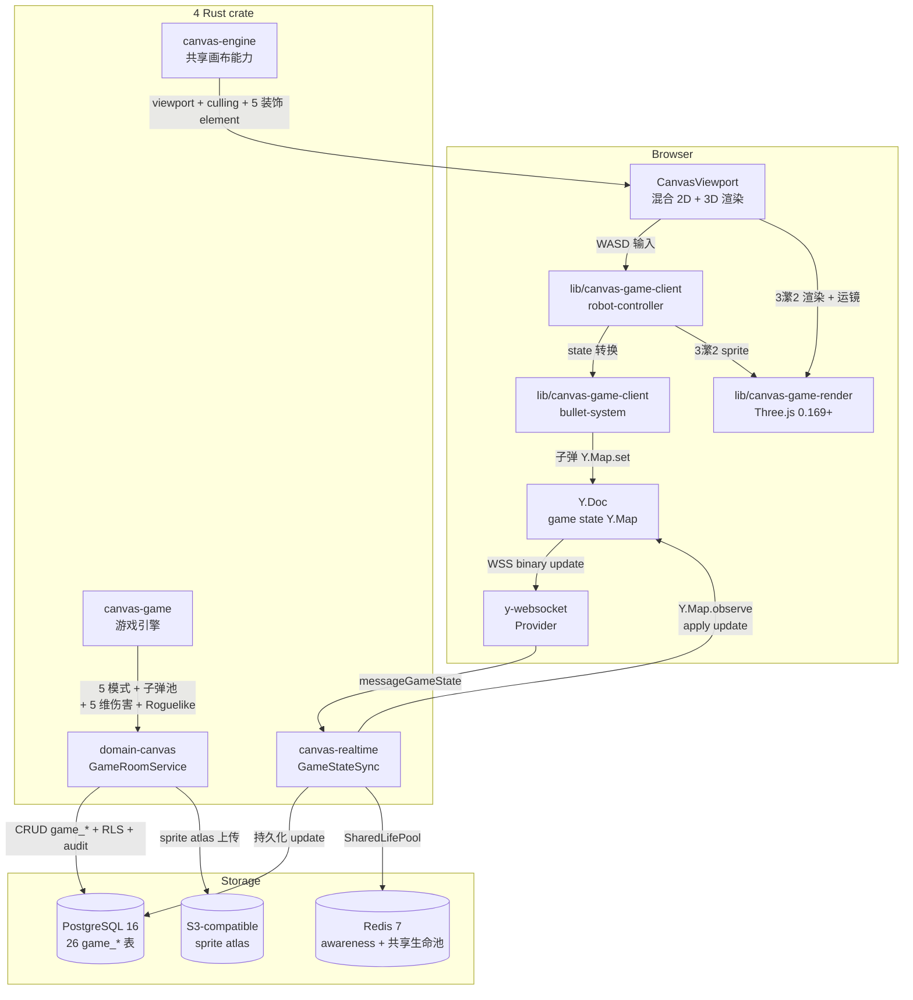
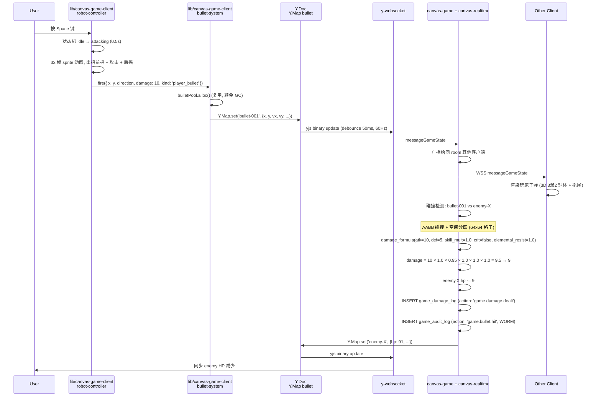
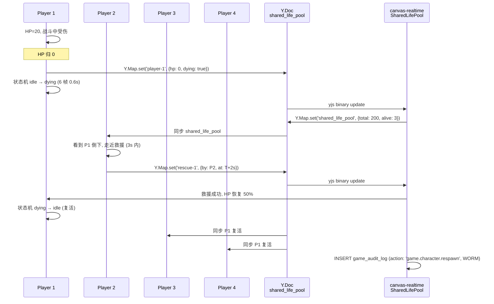
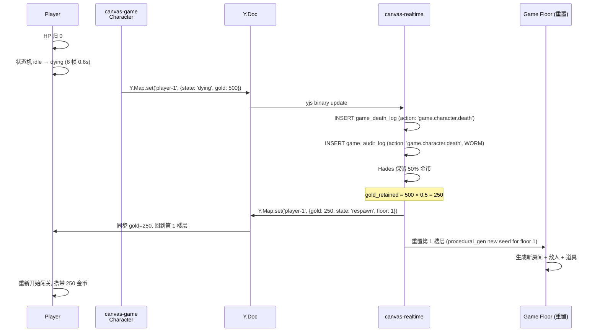

# BD-STAR-CANVAS-GAME-001

> **STAR 画布游戏 基本設計書 v0.1** (弹幕 Roguelike + 3渲2 像素风机器人)
>
> - 状态: Design Baseline
> - 目标阶段: 基本設計 → 詳細設計 → 実装 → テスト → リリース
> - 上位要件: [`docs/requirements/SRS-STAR-CANVAS-GAME-001.md`](../requirements/SRS-STAR-CANVAS-GAME-001.md) v0.1 (commit `4ed55ae`)
> - 关联詳細設計: [`docs/design/DD-STAR-CANVAS-GAME-001.md`](./DD-STAR-CANVAS-GAME-001.md) (本 commit 同期落档)
> - 关联実装報告: [`docs/reports/PHASE-CANVAS-GAME-IMPL-REPORT.md`](../reports/PHASE-CANVAS-GAME-IMPL-REPORT.md) v0.1 (P0 落地后)
> - 关联上游 (被本 BD 升级): 9/6 立 SRS-STAR-CANVAS-001 / BD-STAR-CANVAS-001 / DD-STAR-CANVAS-001 v0.1 (Miro 风协作画布, 全部 SUPERSEDED 2026-09-07, commit `1a1a6d9`)
> - 关联平行: `docs/requirements/SRS-STAR-AGENT-RUNTIME-001.md` v1.0 (Runtime) + `docs/architecture/2026-09-03-langgraph/02-basic-design.md` (LangGraph) + `docs/design/BD-AGENT-VIEW-001.md` v1.0 (Agent View 派生)
> - 关联实装: `frontend/src/components/CanvasView.tsx` (5 装饰 element 沿用)
> - 修订人: Ulysses（一人公司 12 角色 per DEC-008）— Mavis 接手 (per 2026-08-27 19:39 JST 用户授权)
> - 审批: 架构师 (Mavis 接手 agent per DEC-008)
> - 日期: 2026-09-07 JST
> - 受众: 詳細設計エンジニア / 実装エンジニア (Rust + TypeScript + Three.js) / 游戏设计师 (新角色, 待 5 域 Lead 真人到位) / アーキテクト / SRE / 5 域 Lead / DDD Review 主持

---

## 0. 目的 (Purpose)

本文档基于 [`SRS-STAR-CANVAS-GAME-001.md`](../requirements/SRS-STAR-CANVAS-GAME-001.md) v0.1 (113 节 / 81 KB) 的要件, 定义 **STAR 画布游戏 (Canvas Game)** 的基本設計:

- **系统架构** (4-tier 前后端双侧: Browser / 4 Rust crate (canvas-engine 平台能力 + domain-canvas 业务域 + canvas-realtime CRDT 后端 + canvas-game 新增游戏引擎) / PostgreSQL 16 + Redis 7 + S3 + NATS 2.10+)
- **5 view 完整覆盖** (機能 / データ / 動作 / モジュール / ネットワーク)
- **80+ FR 映射** (per SRS-GAME-001 §16-§25, 4 大游戏域 + 5 装饰 + 3渲2 渲染 + 实时协作)
- **4 个 Rust crate** (3 沿用 9/6 + 1 新增 `canvas-game`, 跟 47 现有 crate 平级, per AGENTS.md §4.2 守门 #4 唯一性)
- **5 个新 frontend 模块** (canvas-game-client / canvas-game-render / canvas-game-ui / canvas-game-physics / canvas-game-net, P0 启动)
- **4 大游戏域** (角色 / 弹幕 / 战斗 / 关卡) + **3渲2 渲染** (仅机器人, Three.js 0.169+ + WebGL sprite)
- **NFR 40+ 项** (性能 / 可用性 / 安全 / 可扩展 / 可观测 / 可恢复 / 兼容 / 可维护 / i18n)
- **守门 26 项 + 累积规 v1-v26** + 子代理失败接手 + 已知缺口 G-GAME-1~12

> **dual-use 提醒 (per [AGENTS.md §5 倉庫拓扑](../../AGENTS.md))**: 本 view 不引用 RGS 仓 + 不建立业务子域↔DDD bounded context 映射. STAR 画布游戏 跟 LangGraph view / Agent Runtime view / Agent View 平行, 通过 domain Port 接口解耦. 5 域 (player/economy/match/social/admin) 是历史治理命名 (守门 #3 拍板), 跟 26+ domain-* crate 是不同分类.

> **本 view 跟 9/6 立 Miro 风画布 (SUPERSEDED) 区别**: 9/6 立方向是 "Miro 风协作画布" (8 大功能域 / 13 element / 5 角色 RACI 65 单元), 已 SUPERSEDED 2026-09-07. 本 BD 是 "画布里的弹幕 Roguelike 游戏" (4 大游戏域 / 12 element / 3 模式权限), 保留 3 crate 架构骨架 + 5 装饰 element 渲染接口, 推翻其他部分.

---

## 1. 适用范围 (Scope)

### 1.1 包含 (In-Scope)

- **4 个 Rust crate** (3 沿用 9/6 + 1 新增)
  - `crates/canvas-engine` — 共享画布能力 (沿用 9/6, 5 装饰 element 渲染 + 视口跟随 + 运镜)
  - `crates/domain-canvas` — 画布业务域 (沿用 9/6, 5 模式权限 + 26 game_* 表)
  - `crates/canvas-realtime` — Yjs CRDT 后端 (沿用 9/6, 1-4 玩家游戏协作)
  - **`crates/canvas-game` (新)** — 游戏引擎 (角色 sprite / 弹幕池 / 战斗公式 / Roguelike 关卡 / 道具)
- **5 个新 frontend 模块**
  - `lib/canvas-game-client/` — 客户端引擎 (3渲2 渲染 + 子弹池 + 角色控制)
  - `lib/canvas-game-render/` — Three.js 0.169+ + WebGL 渲染 (机器人 sprite)
  - `lib/canvas-game-physics/` — 子弹碰撞 (AABB / 圆碰撞 + 空间分区)
  - `lib/canvas-game-net/` — Yjs CRDT 多人游戏同步
  - `app/canvas/[id]/` — 画布游戏页面 (单人 / 合作 / 旁观 3 模式入口)
- **4 大游戏域** (角色 / 弹幕 / 战斗 / 关卡) + **5 装饰 element 沿用** + **7 改写游戏 element**
- **3渲2 渲染** (Three.js 0.169+ + WebGL 2.0 + sprite atlas + 像素化后处理)
- **弹幕系统** (5 模式 + 1000+ 子弹 / 60fps, 子弹池)
- **战斗系统** (5 维伤害公式 + 5 状态效果 + 100+ 技能)
- **Roguelike 关卡** (procedural generation + seed 可复现 + 6 biome + 6 BOSS)
- **多人合作 1-4 玩家** (Yjs CRDT + 共享生命池 + Hades 死亡保留机制)
- **26 表 W/T/M 严格分类** (守门 #13, M:16 / T:6 / W:6 含 1 个 M+W 二象)
- **WCAG 2.1 AA** (P3 候选)
- **离线编辑关卡** (Yjs CRDT 重连自动 merge)

### 1.2 不包含 (Out-of-Scope)

- 物理引擎 (Physis 独立产品线) / 完整 3D 渲染世界 (仅机器人 sprite 走 3D) / 跨机分布式 (守门 #3 5 域单仓) / 移动端 native (PWA 触屏 P1)
- AI 自动战斗 / 自动关卡 (P3 候选)
- 道具众包市场 (P3 候选, 仅内置 1000+ 道具)
- 视频直播 / OBS 集成
- VR / AR
- 区块链存证
- 9/6 立 Miro 风画布的 8 大功能域 / 13 element / 5 角色 RACI / 模板 / 演示 / 导入导出 / 40+ 快捷键 / WCAG 2.1 AA (已 SUPERSEDED)

### 1.3 跟其他 view / BD 区别

| 维度 | 9/6 立 Miro 风画布 (SUPERSEDED) | Agent View (BD-AGENT-VIEW-001) | Agent Runtime (BD-Runtime) | LangGraph (BD-LG) | **画布游戏 (本 BD, 9/7 批)** |
|---|---|---|---|---|---|
| **关注点** | Miro 风协作画布 (8 大功能域) | 单页面 Miro 风格派生画布 (3 类节点) | Rust Runtime 基础设施 | 2-level hierarchical Agent | **画布里的弹幕 Roguelike 游戏 + 3渲2 机器人** |
| **目标** | 团队画布协作 + 9 域联动 | 当前工作 agent 拓扑可视化 | L0 派发 + L1 ECS + L2 业务池 | LLM 编排 + 任务卡生命周期 | **画布世界 + 机器人闯关 + 多人合作** |
| **实现** | 13 element + 5 角色 RACI 65 单元 | React + Next.js + zustand | Rust + Tokio + ECS | LangGraph Python subgraph | **Rust 4 crate + Next.js 5 模块 + Three.js + 2D 弹幕引擎** |
| **数据源** | PostgreSQL 26 表 + Yjs CRDT | zustand store (派生) | PostgreSQL / SQLite | LangGraph state schema | **PostgreSQL 26 game_* 表 + Yjs CRDT + sprite atlas** |
| **用户交互** | 画布 pan/zoom + 节点 hover/select | 画布 pan/zoom + 节点 hover/select | 0 (server-side) | Chat Bar + Task Card Modal | **WASD 移动 / 空格攻击 / Shift 翻滚 / Q 大招 + 弹幕躲避** |
| **CRDT** | Yjs (50 协作者) | N/A | N/A | LangGraph state + reducer | **Yjs (1-4 玩家合作, 共享生命池)** |
| **3D** | 0 (全 2D SVG) | 0 (全 2D SVG) | N/A | N/A | **3渲2 机器人 (Three.js 0.169+, 仅 sprite 3D, 其他 2D)** |
| **路径** | `docs/design/BD-STAR-CANVAS-001.md` (SUPERSEDED) | `docs/design/BD-AGENT-VIEW-001.md` | `docs/architecture/2026-09-03-agent-runtime/02-basic-design.md` | `docs/architecture/2026-09-03-langgraph/02-basic-design.md` | `docs/design/BD-STAR-CANVAS-GAME-001.md` |

**关系**: 画布游戏 跟 Agent View / Agent Runtime / LangGraph view **平行**, 通过 zustand store / domain Port / Yjs CRDT 接口解耦. canvas-engine 跨 board / planning / workflow / feedback / agent-view 多模块共享 (沿用 9/6), canvas-game 跨 5 domain + game 域 (新增 1) 共享. 4 个 view 通过 Adapter 模式连接 (per §3.3 组件一览).

---

## 2. システムアーキテクチャ (System Architecture)

### 2.1 全体構成図 (Overall Architecture, 4-tier 前后端双侧, 4 crate 架构)

```
┌─────────────────────────────────────────────────────────────────────────────────────┐
│                         Browser Tier (frontend/src/)                                 │
│                                                                                       │
│  ┌────────────────────────────────────────────────────────────────────────────────┐  │
│  │  Next.js 14.2.5 App Router (React 18.3.1 + TypeScript 5.5.3)                 │  │
│  │  ┌────────────────────────────────────────────────────────────────────────┐   │  │
│  │  │  app/canvas/[id]/page.tsx (画布游戏页面, 单人/合作/旁观 3 模式入口)   │   │  │
│  │  │  ┌─────────────────────────────────────────────────────────────────┐  │   │  │
│  │  │  │  <HUD> (HP/MP/SP/技能/道具/小地图)                              │  │   │  │
│  │  │  │  <CanvasViewport> (混合 2D SVG + 3D WebGL canvas 渲染)            │  │   │  │
│  │  │  │  ├─ <Robot3D> (Three.js 0.169+ 3瀿2 sprite, 32 帧动画)          │  │   │  │
│  │  │  │  ├─ <BulletPool> (2D particle, 1000+ 子弹 / 60fps)              │  │   │  │
│  │  │  │  ├─ <ElementRenderer2D> (sticky_note/text/shape/image/embed)     │  │   │  │
│  │  │  │  ├─ <ElementRenderer3D> (enemy/loot/skill/trap/portal/chest)     │  │   │  │
│  │  │  │  ├─ <ConnectorRouter> (沿用 9/6 3 routing 算法)                  │  │   │  │
│  │  │  │  └─ <Minimap> (视口 + 房间 + 玩家位置)                          │  │   │  │
│  │  │  │  <ControlBar> (WASD 移动 / 空格攻击 / Shift 翻滚 / Q 大招)     │  │   │  │
│  │  │  │  <ChatBox> (游戏内聊天)                                          │  │   │  │
│  │  │  │  <DeathRespawnDialog> (死亡 / 重生, 道具保留 50%)               │  │   │  │
│  │  │  │  <BossHealthBar> (BOSS 血量 3 阶段)                              │  │   │  │
│  │  │  └─────────────────────────────────────────────────────────────────┘  │   │  │
│  │  └────────────────────────────────────────────────────────────────────────┘   │  │
│  │  ┌────────────────────────────────────────────────────────────────────────┐   │  │
│  │  │  lib/canvas-game-client/ (客户端引擎)                                  │   │  │
│  │  │  ├─ robot-controller.ts   (WASD 输入 + 5 状态机 + 32 帧动画调度)     │   │  │
│  │  │  ├─ bullet-system.ts      (5 模式 + 子弹池 + 碰撞检测)              │   │  │
│  │  │  ├─ combat-formula.ts     (5 维伤害公式 + 5 状态效果)                │   │  │
│  │  │  ├─ level-generator.ts     (perlin noise + WFC + seed 可复现)       │   │  │
│  │  │  └─ loot-system.ts         (1000+ 道具 + 拾取 / 掉落 / 死亡保留)      │   │  │
│  │  └────────────────────────────────────────────────────────────────────────┘   │  │
│  │  ┌────────────────────────────────────────────────────────────────────────┐   │  │
│  │  │  lib/canvas-game-render/ (Three.js 0.169+ + WebGL 2.0)                │   │  │
│  │  │  ├─ three-renderer.ts     (OrthographicCamera + sprite + 8 方向)    │   │  │
│  │  │  ├─ sprite-atlas.ts        (2048x2048 atlas + 4096 sprite 槽)         │   │  │
│  │  │  ├─ pixelation-shader.ts  (WebGL fragment shader, 像素化)            │   │  │
│  │  │  ├─ particle-system.ts     (爆炸 / 命中 / 受击 / 大招 200+ 粒子)     │   │  │
│  │  │  └─ camera-control.ts     (跟随 / 抖动 / 缩放 3 模式)               │   │  │
│  │  └────────────────────────────────────────────────────────────────────────┘   │  │
│  │  ┌────────────────────────────────────────────────────────────────────────┐   │  │
│  │  │  lib/canvas-game-physics/ (碰撞 + 空间分区)                           │   │  │
│  │  │  ├─ collision.ts          (AABB + 圆碰撞)                              │   │  │
│  │  │  ├─ spatial-grid.ts       (64x64 格子 uniform grid)                    │   │  │
│  │  │  └─ knockback.ts          (击退 + 顿帧 + 无敌帧)                      │   │  │
│  │  └────────────────────────────────────────────────────────────────────────┘   │  │
│  │  ┌────────────────────────────────────────────────────────────────────────┐   │  │
│  │  │  lib/canvas-game-net/ (Yjs CRDT 多人游戏同步, 沿用 9/6)              │   │  │
│  │  │  ├─ yjs-game-state.ts     (player / bullet / enemy / loot Y.Map)     │   │  │
│  │  │  ├─ yjs-awareness.ts      (玩家位置 / HP / 技能冷却, 60Hz)            │   │  │
│  │  │  ├─ shared-life-pool.ts   (4 玩家共享生命池 + 救援)                   │   │  │
│  │  │  └─ seed-share.ts         (URL ?seed=xxx 关卡分享)                    │   │  │
│  │  └────────────────────────────────────────────────────────────────────────┘   │  │
│  └────────────────────────────────────────────────────────────────────────────────┘  │
│                              │ HTTPS / WSS                                            │
└──────────────────────────────┼────────────────────────────────────────────────────────┘
                               │
                               ↓
┌─────────────────────────────────────────────────────────────────────────────────────┐
│                  Platform Tier (Rust 4 crate + 共享依赖)                              │
│                                                                                       │
│  ┌────────────────────────────────────────────────────────────────────────────────┐  │
│  │  canvas-engine (共享画布能力, 沿用 9/6, 跨 5 domain 引用, 0 业务域依赖)       │  │
│  │  ├─ CanvasEngine::new(config) → Self                                          │  │
│  │  ├─ viewport: Viewport { x, y, zoom } + follow_player (新)                   │  │
│  │  ├─ camera_control: CameraMode (follow/shake/zoom 3 模式, 新)                │  │
│  │  ├─ world_to_screen / screen_to_world (沿用 9/6)                            │  │
│  │  ├─ culling / bbox / fit_to_content (沿用 9/6)                              │  │
│  │  ├─ ElementRenderer trait + 5 impl (sticky_note/text/shape/image/embed)     │  │
│  │  └─ 0 业务域依赖 (per 9/6 ADR-CANVAS-005)                                   │  │
│  └────────────────────────────────────────────────────────────────────────────────┘  │
│  ┌────────────────────────────────────────────────────────────────────────────────┐  │
│  │  domain-canvas (业务域, 沿用 9/6, 26 game_* 表 + 3 模式权限)                  │  │
│  │  ├─ 9 Service (Canvas / Element / Connector / Frame / Comment /              │  │
│  │  │            Template / Share / Export, 沿用 9/6) + 5 新游戏 Service        │  │
│  │  │            (GameRoomService / GameCharacterService / GameSeedService)    │  │
│  │  ├─ 3 模式权限 (player / co-op / spectator, per ADR-CANVAS-GAME-008)        │  │
│  │  ├─ 26 game_* 表 (M:16 / T:6 / W:6, 守门 #13 W/T/M 严格)                   │  │
│  │  ├─ HTTP Handlers (axum, 13 沿用 9/6 + 7 新增游戏端点)                       │  │
│  │  └─ MCP 7 工具 (沿用 9/6) + 3 新增游戏工具                                   │  │
│  └────────────────────────────────────────────────────────────────────────────────┘  │
│  ┌────────────────────────────────────────────────────────────────────────────────┐  │
│  │  canvas-realtime (Yjs CRDT 后端, 沿用 9/6, 1-4 玩家游戏协作)                │  │
│  │  ├─ YjsHub::load_or_create (沿用 9/6)                                       │  │
│  │  ├─ GameStateSync: player / bullet / enemy / loot Y.Map (新)                │  │
│  │  ├─ SharedLifePool: 4 玩家共享生命池 (新)                                   │  │
│  │  ├─ WsHandler: wss://star.app/ws/game/{room_id} (新)                        │  │
│  │  └─ Sticky session + Redis pub/sub (沿用 9/6)                              │  │
│  └────────────────────────────────────────────────────────────────────────────────┘  │
│  ┌────────────────────────────────────────────────────────────────────────────────┐  │
│  │  canvas-game (游戏引擎, 新增, 第 4 crate, 0 具体业务域依赖)                  │  │
│  │  ┌────────────────────────────────────────────────────────────────────────┐   │  │
│  │  │  Character (3瀿2 机器人 + 32 帧 sprite 动画)                           │   │  │
│  │  │  ├─ Robot { id, x, y, hp, mp, sp, atk, def, speed, state, level, ... }│   │  │
│  │  │  ├─ RobotState enum (Idle / Moving / Attacking / Rolling / Dying) 5 态│   │  │
│  │  │  ├─ SpriteFrame { kind, frame_idx, duration_ms } (32 帧)               │   │  │
│  │  │  └─ 6 维属性 + 100+ 技能 + 6 技能树                                    │   │  │
│  │  └────────────────────────────────────────────────────────────────────────┘   │  │
│  │  ┌────────────────────────────────────────────────────────────────────────┐   │  │
│  │  │  BulletHell (弹幕系统, 5 模式 + 子弹池 1000+ 子弹 / 60fps)             │   │  │
│  │  │  ├─ Bullet { id, x, y, vx, vy, kind, damage, ttl }                  │   │  │
│  │  │  ├─ BulletPool: Vec<Bullet> pre-allocate 2000 容量                   │   │  │
│  │  │  ├─ BulletPattern enum (Radial / Aimed / Spiral / Wave / Laser) 5 模式 │   │  │
│  │  │  └─ 100+ 弹幕模板 (5 模式 × 20 变体)                                  │   │  │
│  │  └────────────────────────────────────────────────────────────────────────┘   │  │
│  │  ┌────────────────────────────────────────────────────────────────────────┐   │  │
│  │  │  Combat (战斗系统, 5 维伤害公式 + 5 状态效果)                          │   │  │
│  │  │  ├─ damage_formula(dmg, atk, def, skill_mult, crit, elemental) → f64│   │  │
│  │  │  ├─ StatusEffect enum (Poison / Burn / Freeze / Paralyze / Curse)    │   │  │
│  │  │  └─ 100+ 技能 (主动 / 被动 / 大招)                                     │   │  │
│  │  └────────────────────────────────────────────────────────────────────────┘   │  │
│  │  ┌────────────────────────────────────────────────────────────────────────┐   │  │
│  │  │  Level (Roguelike 关卡, procedural generation + seed 可复现)            │   │  │
│  │  │  ├─ Room { x, y, width, height, doors, enemies, loots, traps, chest }│   │  │
│  │  │  ├─ Corridor (房间之间连接通道)                                        │   │  │
│  │  │  ├─ Floor (8-12 房间 + 1 BOSS 房间, 难度 × 10)                       │   │  │
│  │  │  ├─ Biome enum (Forest / Desert / Dungeon / Space / Volcano / Snow) 6 种│   │  │
│  │  │  └─ procedural_gen(seed, floor, biome) → Vec<Room> (perlin + WFC)    │   │  │
│  │  └────────────────────────────────────────────────────────────────────────┘   │  │
│  │  Deps: tokio, rand, noise, wfc, image, tracing                              │  │
│  │  0 具体业务域依赖, 通过 trait 抽象 (per 9/6 ADR-CANVAS-005)                  │  │
│  └────────────────────────────────────────────────────────────────────────────────┘  │
│  ┌────────────────────────────────────────────────────────────────────────────────┐  │
│  │  共享依赖 (跨 4 crate + 47 现有 crate)                                        │  │
│  │  ├─ star-context / star-cache / star-saga (沿用 9/6)                        │  │
│  │  ├─ domain-permission / domain-audit / domain-notification / domain-tenant │  │
│  │  └─ domain-game (新, 待 DDD Review 拍板命名, 5 模式权限 + 26 game_* 表)    │  │
│  └────────────────────────────────────────────────────────────────────────────────┘  │
└──────────────────────────────────────┬──────────────────────────────────────────────┘
                                       │ TCP / TLS
                                       ↓
┌─────────────────────────────────────────────────────────────────────────────────────┐
│                          Storage Tier                                                │
│  ┌────────────────────┐ ┌────────────────────┐ ┌────────────────────┐ ┌────────────┐ │
│  │  PostgreSQL 16     │ │  Redis 7            │ │  S3-compatible    │ │ NATS 2.10+ │ │
│  │  (26 game_* 表     │ │  (game_session +  │ │  (MinIO, sprite   │ │ JetStream  │ │
│  │   W/T/M)           │ │   Yjs awareness + │ │   atlas + 子弹 + │ │ (事件流)   │ │
│  │  + 守门 #13 强制   │ │   共享生命池)      │ │   粒子资源)        │ │            │ │
│  └────────────────────┘ └────────────────────┘ └────────────────────┘ └────────────┘ │
└─────────────────────────────────────────────────────────────────────────────────────┘
```

### 2.2 データフロー図 (Data Flow, mermaid, 4 crate 协作)



### 2.3 4 层架构核心原则

| 原则 | 说明 | 守门 |
|---|---|---|
| **4 crate 平级** | canvas-engine 跨域 + domain-canvas 业务域 + canvas-realtime CRDT + canvas-game 游戏引擎 4 个平级, 通过 trait 抽象 + 调用方注入 | #4 + #13 |
| **3渲2 仅机器人** | 仅机器人 + 玩家子弹走 3D (Three.js + WebGL sprite), 其他 11 element 2D SVG | #1 (per 9/7 用户拍板) |
| **弹幕池** | 子弹对象池 pre-allocate 2000 容量, 1000+ 子弹 / 60fps, 避免 GC | #1 v15 |
| **5 模式权限** | viewer/commenter/editor/admin/owner (9/6 立 5 角色 RACI 65 单元) 简化为 player/co-op/spectator/host 4 模式 | #11 (per ADR-CANVAS-GAME-008) |
| **种子可复现** | perlin noise + WFC procedural generation, 同 seed = 同关卡, 玩家可分享 | #11 (per ADR-CANVAS-GAME-005) |
| **死亡保留 50%** | Hades 机制, 死亡时保留 50% 金币 + 部分道具, 不全清空 | #11 (per BR-6) |
| **共享生命池** | 4 玩家合作时共享生命池, 1 玩家死亡, 队友可救 (3s 内) | #11 (per ADR-CANVAS-GAME-006) |
| **0 unsafe** | 守门 #7 跨整个 workspace, 4 crate 全过 | #7 |

---

## 3. 機能設計 (Functional Design, 5 view #1 機能)

### 3.1 機能一覧 (Functional Catalog, FR-GAME-NNN per [SRS-GAME-001 §16-§25](../requirements/SRS-STAR-CANVAS-GAME-001.md))

> 4 大游戏域 + 5 装饰 element + 3渲2 渲染 + 实时协作 + 4 crate 架构, 80+ FR 完整映射 (per SRS-GAME-001 G-1 必备功能覆盖), 详见 SRS-GAME-001 §16-§25. 本节列功能架构.

#### 3.1.1 域 1: 画布基础 (FR-GAME-001..020, 12 FR, P0/P1)

| 功能组 | FR 范围 | 组件 | 优先级 |
|---|---|---|---|
| 坐标系与视口 | FR-001..003 (3 FR) | `lib/canvas/viewport.ts` + `CanvasViewport` + follow_player (新) + camera_control (新) | P0/P1 |
| 5 装饰 element 沿用 | FR-010 (1 FR) | `lib/canvas/element-renderer.ts` 5 impl (沿用 9/6) | P0 |
| 7 改写游戏 element | FR-020..026 (7 FR) | `<ElementRenderer2D>` 5 装饰 + `<ElementRenderer3D>` 7 游戏 | P0 |

#### 3.1.2 域 2: 角色 (FR-GAME-100..112, 15 FR, P0)

| 功能组 | FR 范围 | 组件 | 优先级 |
|---|---|---|---|
| 机器人 3渲2 像素风角色 | FR-100..103 (4 FR) | `lib/canvas-game-render/three-renderer.ts` + `Robot3D` | P0 |
| 32 帧 sprite 动画 (per 9/7 用户拍板) | FR-101 (1 FR) | `lib/canvas-game-client/sprite-atlas.ts` 32 帧 | P0 |
| 5 状态机 | FR-102 (1 FR) | `lib/canvas-game-client/robot-controller.ts` | P0 |
| 6 维属性 | FR-103 (1 FR) | `lib/canvas-game-client/character-attrs.ts` | P0 |
| 经验值 + 升级 | FR-110..112 (3 FR) | `lib/canvas-game-client/character-progression.ts` | P0 |

#### 3.1.3 域 3: 弹幕 (FR-GAME-200..213, 12 FR, P0)

| 功能组 | FR 范围 | 组件 | 优先级 |
|---|---|---|---|
| 5 弹幕模式 | FR-200..204 (5 FR) | `lib/canvas-game-client/bullet-system.ts` | P0 |
| 子弹池 + 碰撞 | FR-210..211 (2 FR) | `lib/canvas-game-client/bullet-pool.ts` + `lib/canvas-game-physics/spatial-grid.ts` | P0 |
| 玩家子弹 3D | FR-212 (1 FR) | `lib/canvas-game-render/three-renderer.ts` 3D 球体 | P0 |
| 弹幕模板 | FR-213 (1 FR) | `lib/canvas-game-client/bullet-templates.ts` 100+ 模板 | P0 |

#### 3.1.4 域 4: 战斗 (FR-GAME-300..314, 10 FR, P0)

| 功能组 | FR 范围 | 组件 | 优先级 |
|---|---|---|---|
| 5 维伤害公式 | FR-300..304 (5 FR) | `lib/canvas-game-client/combat-formula.ts` | P0 |
| 5 状态效果 | FR-310..314 (5 FR) | `lib/canvas-game-client/status-effect.ts` | P0 |

#### 3.1.5 域 5: 关卡 (FR-GAME-400..407, 8 FR, P0)

| 功能组 | FR 范围 | 组件 | 优先级 |
|---|---|---|---|
| 房间 / 走廊 / 楼层 | FR-400..402 (3 FR) | `lib/canvas-game-client/level-generator.ts` | P0 |
| 6 biome | FR-403 (1 FR) | `lib/canvas-game-client/biome.ts` 6 种 | P0 |
| Procedural generation | FR-404 (1 FR) | `lib/canvas-game-client/level-generator.ts` perlin + WFC | P0 |
| BOSS 战 | FR-405 (1 FR) | `lib/canvas-game-client/boss.ts` 3 阶段 | P0 |
| 商店 / 隐藏房 | FR-406 (1 FR) | `lib/canvas-game-client/room-special.ts` | P0 |
| 难度曲线 | FR-407 (1 FR) | `lib/canvas-game-client/level-difficulty.ts` | P0 |

#### 3.1.6 域 6: 道具 (FR-GAME-500..505, 6 FR, P0)

| 功能组 | FR 范围 | 组件 | 优先级 |
|---|---|---|---|
| 武器 / 被动 / 消耗品 / 钥匙 / 金币 | FR-500..504 (5 FR) | `lib/canvas-game-client/loot-system.ts` | P0 |
| 道具掉落 | FR-505 (1 FR) | `lib/canvas-game-client/loot-drop.ts` | P0 |

#### 3.1.7 域 7: 技能 (FR-GAME-600..604, 5 FR, P0)

| 功能组 | FR 范围 | 组件 | 优先级 |
|---|---|---|---|
| 主动 / 被动 / 大招 | FR-600..602 (3 FR) | `lib/canvas-game-client/skill-system.ts` | P0 |
| 技能冷却 UI | FR-603 (1 FR) | `<SkillCooldownUI>` | P0 |
| 技能快捷键 | FR-604 (1 FR) | Q / E / R / Space / Shift / WASD | P0 |

#### 3.1.8 域 8: 3渲2 渲染 (FR-GAME-700..712, 8 FR, P0)

| 功能组 | FR 范围 | 组件 | 优先级 |
|---|---|---|---|
| 3D 角色模型 + Three.js | FR-700 (1 FR) | `lib/canvas-game-render/three-renderer.ts` | P0 |
| Sprite atlas | FR-701 (1 FR) | `lib/canvas-game-render/sprite-atlas.ts` 2048x2048 | P0 |
| 像素化后处理 | FR-702 (1 FR) | `lib/canvas-game-render/pixelation-shader.ts` WebGL shader | P0 |
| 8 方向旋转 | FR-703 (1 FR) | `lib/canvas-game-render/three-renderer.ts` rotation.z | P0 |
| 玩家子弹 3D | FR-710 (1 FR) | `lib/canvas-game-render/three-renderer.ts` 3D 球体 | P0 |
| 粒子系统 | FR-711 (1 FR) | `lib/canvas-game-render/particle-system.ts` 200+ 粒子 | P0 |
| 大招全屏特效 | FR-712 (1 FR) | `lib/canvas-game-render/particle-system.ts` 大招特效 | P0 |

#### 3.1.9 域 9: 实时协作 (FR-GAME-800..805, 6 FR, P0/P1)

| 功能组 | FR 范围 | 组件 | 优先级 |
|---|---|---|---|
| 多人合作 1-4 玩家 | FR-800 (1 FR) | `lib/canvas-game-net/yjs-game-state.ts` | P0 |
| 3 模式权限 + 房主 | FR-801..802 (2 FR) | `domain-canvas::GameRoomService` | P0 |
| 共享生命池 | FR-803 (1 FR) | `lib/canvas-game-net/shared-life-pool.ts` | P1 |
| 离线编辑关卡 | FR-804 (1 FR) | `lib/canvas-game-net/yjs-game-state.ts` | P1 |
| 关卡 seed 分享 | FR-805 (1 FR) | `lib/canvas-game-net/seed-share.ts` URL ?seed=xxx | P1 |

#### 3.1.10 域 10: 4 crate 架构 (FR-GAME-900..904, 5 FR, P0)

| 功能组 | FR 范围 | 组件 | 优先级 |
|---|---|---|---|
| canvas-engine 沿用 | FR-900 (1 FR) | canvas-engine crate (沿用 9/6) | P0 |
| domain-canvas 扩展 | FR-901 (1 FR) | domain-canvas crate (沿用 9/6 + 扩展 game_*) | P0 |
| canvas-realtime 多人游戏 | FR-902 (1 FR) | canvas-realtime crate (沿用 9/6 + 多人游戏) | P0 |
| canvas-game 新增 | FR-903 (1 FR) | canvas-game crate (新增, 第 4 crate) | P0 |
| 跨 4 crate 协作 | FR-904 (1 FR) | trait 抽象 + 调用方注入 | P0 |

**汇总**: 10 域 (4 游戏 + 5 装饰 + 3渲2 + 协作 + 4 crate) / **80+ FR / 32 帧 sprite / 5 弹幕模式 / 5 维伤害 / 5 状态效果 / 100+ 技能 / 1000+ 道具 / 1-4 玩家合作** 全部覆盖, 优先级 P0/P1/P2/P3 阶段化.

### 3.2 主要機能フロー (Main Functional Flow)

#### 3.2.1 FR-GAME-101 机器人 32 帧 sprite 动画 + 3渲2 渲染 (詳細, per 9/7 用户拍板 "各种移动攻击的动画要补上, 可以3D的3渲2制作")

```typescript
// === lib/canvas-game-render/three-renderer.ts (新) ===

import * as THREE from 'three';

export class ThreeRenderer {
  scene: THREE.Scene;
  camera: THREE.OrthographicCamera;  // 2D 投影
  renderer: THREE.WebGLRenderer;
  robotGroup: THREE.Group;             // 机器人 5 部件
  spriteAtlas: SpriteAtlas;            // 2048x2048 atlas

  constructor(canvas: HTMLCanvasElement) {
    this.scene = new THREE.Scene();
    this.camera = new THREE.OrthographicCamera(-400, 400, 300, -300, 0.1, 1000);
    this.camera.position.z = 10;
    this.renderer = new THREE.WebGLRenderer({ canvas, antialias: false, alpha: true });
    this.renderer.setSize(800, 600);
    this.renderer.setPixelRatio(window.devicePixelRatio);
    this.initRobot();
  }

  // 初始化 3D 机器人 5 部件 (头 / 身 / 手臂 x2 / 腿)
  private initRobot() {
    this.robotGroup = new THREE.Group();
    const head = new THREE.Mesh(
      new THREE.BoxGeometry(8, 8, 8),
      new THREE.MeshBasicMaterial({ color: 0x4a9eff }),  // 蓝色头
    );
    head.position.y = 8;
    const body = new THREE.Mesh(
      new THREE.BoxGeometry(10, 12, 6),
      new THREE.MeshBasicMaterial({ color: 0x2a5a9a }),
    );
    const armL = new THREE.Mesh(
      new THREE.BoxGeometry(2, 8, 2),
      new THREE.MeshBasicMaterial({ color: 0x2a5a9a }),
    );
    armL.position.set(-6, 0, 0);
    const armR = new THREE.Mesh(
      new THREE.BoxGeometry(2, 8, 2),
      new THREE.MeshBasicMaterial({ color: 0x2a5a9a }),
    );
    armR.position.set(6, 0, 0);
    const legL = new THREE.Mesh(
      new THREE.BoxGeometry(3, 6, 3),
      new THREE.MeshBasicMaterial({ color: 0x1a3a6a }),
    );
    legL.position.set(-2, -9, 0);
    const legR = new THREE.Mesh(
      new THREE.BoxGeometry(3, 6, 3),
      new THREE.MeshBasicMaterial({ color: 0x1a3a6a }),
    );
    legR.position.set(2, -9, 0);
    this.robotGroup.add(head, body, armL, armR, legL, legR);
    this.scene.add(this.robotGroup);
  }

  // 32 帧 sprite 动画调度 (per FR-GAME-101)
  // 待机 4 帧 + 移动 6 帧 + 攻击 4 帧 + 翻滚 4 帧 + 大招 8 帧 + 死亡 6 帧 = 32 帧
  updateAnimation(robot: Robot, deltaMs: number) {
    const frameDuration = 100;  // 10 fps sprite
    robot.frameTime += deltaMs;
    if (robot.frameTime < frameDuration) return;
    robot.frameTime = 0;
    robot.currentFrame = (robot.currentFrame + 1) % this.getFrameCount(robot.state);
    const sprite = this.spriteAtlas.getSprite(robot.kind, robot.state, robot.currentFrame, robot.direction);
    // 用 sprite 替换 3D mesh 材质
    this.robotGroup.children.forEach(part => {
      (part as THREE.Mesh).material = new THREE.MeshBasicMaterial({ map: sprite });
    });
  }

  // 8 方向旋转 (per FR-GAME-703)
  updateDirection(direction: number) {
    // direction: 0=N, 1=NE, 2=E, ..., 7=NW
    this.robotGroup.rotation.z = (direction * Math.PI) / 4;
  }

  // 像素化后处理 (per FR-GAME-702)
  applyPixelation() {
    // WebGL fragment shader
    const material = new THREE.ShaderMaterial({
      uniforms: { resolution: { value: new THREE.Vector2(800, 600) } },
      vertexShader: `
        varying vec2 vUv;
        void main() {
          vUv = uv;
          gl_Position = projectionMatrix * modelViewMatrix * vec4(position, 1.0);
        }
      `,
      fragmentShader: `
        uniform vec2 resolution;
        varying vec2 vUv;
        void main() {
          vec2 pixel = floor(vUv * resolution) / resolution;
          gl_FragColor = texture2D(map, pixel);
        }
      `,
    });
    this.robotGroup.children.forEach(part => {
      (part as THREE.Mesh).material = material;
    });
  }
}
```

#### 3.2.2 FR-GAME-300 5 维伤害公式 (詳細, per BR-9)

```typescript
// === lib/canvas-game-client/combat-formula.ts (新) ===

export function damageFormula(input: {
  atk: number;        // 攻击力
  skill_mult: number; // 技能倍率 0.5-3.0
  def: number;        // 防御力
  crit: boolean;      // 是否暴击
  elemental_resist: number;  // 元素抗性 0.5-2.0
}): { damage: number; isCrit: boolean; isMiss: boolean } {
  const baseDmg = input.atk * input.skill_mult;
  const defMitigation = 1 - input.def / (input.def + 100);
  const critMult = input.crit ? (1.5 + Math.random()) : 1.0;  // 1.5-2.5x
  const randomMult = 0.85 + Math.random() * 0.3;  // 0.85-1.15
  const damage = baseDmg * defMitigation * critMult * randomMult * input.elemental_resist;
  return {
    damage: Math.floor(damage),
    isCrit: input.crit,
    isMiss: false,
  };
}

// 5 状态效果 (per FR-GAME-310..314)
export function applyStatusEffect(
  target: Robot | Enemy,
  effect: StatusEffect,
  durationSec: number,
): void {
  target.statusEffects.push({ effect, expiresAt: Date.now() + durationSec * 1000 });
  switch (effect) {
    case 'poison':  // 中毒: 每秒 2% MAX_HP
      target.tickDamage = target.maxHp * 0.02;
      break;
    case 'burn':    // 燃烧: 每秒 3% MAX_HP
      target.tickDamage = target.maxHp * 0.03;
      break;
    case 'freeze':  // 冰冻: 速度 -50%
      target.speed = target.baseSpeed * 0.5;
      break;
    case 'paralyze':// 麻痹: 不能攻击 / 翻滚
      target.canAttack = false;
      target.canRoll = false;
      break;
    case 'curse':   // 诅咒: 受伤 +25%
      target.damageReceived = 1.25;
      break;
  }
}
```

#### 3.2.3 FR-GAME-404 Roguelike procedural generation (詳細, per ADR-CANVAS-GAME-005)

```typescript
// === lib/canvas-game-client/level-generator.ts (新) ===

import { createNoise2D } from 'simplex-noise';
import seedrandom from 'seedrandom';

export function generateLevel(
  seed: string,
  floor: number,
  biome: Biome,
): Level {
  const rng = seedrandom(seed + floor);
  const noise = createNoise2D(rng);

  // (1) 用 perlin noise 生成房间布局
  const roomCount = 8 + Math.floor(rng() * 5);  // 8-12 房间
  const rooms: Room[] = [];
  for (let i = 0; i < roomCount; i++) {
    const x = Math.floor(noise(i * 0.1, floor * 0.1) * 1000) + 5000;
    const y = Math.floor(noise(i * 0.1 + 1000, floor * 0.1 + 1000) * 1000) + 5000;
    const width = 800 + Math.floor(rng() * 800);   // 800-1600
    const height = 600 + Math.floor(rng() * 600);  // 600-1200
    rooms.push({ id: `room-${i}`, x, y, width, height, doors: [], enemies: [], loots: [] });
  }

  // (2) WFC 生成房间内敌人 / 道具
  for (const room of rooms) {
    const enemyCount = Math.floor(rng() * 50);  // 0-50
    for (let i = 0; i < enemyCount; i++) {
      room.enemies.push(generateEnemy(rng, biome, floor));
    }
    const lootCount = Math.floor(rng() * 100);  // 0-100
    for (let i = 0; i < lootCount; i++) {
      room.loots.push(generateLoot(rng, floor));
    }
  }

  // (3) 走廊连接相邻房间
  for (let i = 0; i < rooms.length - 1; i++) {
    rooms[i].doors.push({ to: rooms[i + 1].id, direction: 'right' });
  }

  // (4) 末尾 1 BOSS 房间
  const bossRoom: Room = {
    id: 'boss-room',
    x: rooms[rooms.length - 1].x + 1600,
    y: rooms[rooms.length - 1].y,
    width: 1200,
    height: 800,
    doors: [{ to: rooms[rooms.length - 1].id, direction: 'left' }],
    enemies: [generateBoss(rng, biome, floor)],
    loots: [],
  };
  rooms.push(bossRoom);

  return { rooms, floor, biome, seed };
}

// 难度 = 楼层 × 10 + 房间号 × 5 + biome 系数 (per BR-5)
export function difficulty(floor: number, roomIdx: number, biome: Biome): number {
  return floor * 10 + roomIdx * 5 + biomeCoefficient(biome);
}

function biomeCoefficient(biome: Biome): number {
  return { forest: 1.0, desert: 1.2, dungeon: 1.5, space: 1.7, volcano: 1.8, snow: 1.3 }[biome];
}
```

### 3.3 组件一覧 (Component Catalog, 5 view #4 モジュール映射)

> 完整组件 + 模块划分见 §6 モジュール設計, 本节列映射.

| SRS FR 域 | 客户端组件 | 服务端 crate | 共享抽象 |
|---|---|---|---|
| 域 1 画布基础 (12 FR) | `lib/canvas/viewport.ts` + `<CanvasViewport>` + `<Minimap>` (沿用 9/6) | `canvas-engine::Viewport` + `Culling` + `follow_player` (新) + `camera_control` (新) | `Element` trait + 5 装饰 + 7 游戏 |
| 域 2 角色 (15 FR) | `lib/canvas-game-client/robot-controller.ts` + `<Robot3D>` + `<HUD>` | `canvas-game::Character` + `RobotState` 5 态 | `Robot` struct + 32 帧 sprite |
| 域 3 弹幕 (12 FR) | `lib/canvas-game-client/bullet-system.ts` + `<BulletPool>` | `canvas-game::BulletHell` + `BulletPool` | `Bullet` struct + 5 BulletPattern |
| 域 4 战斗 (10 FR) | `lib/canvas-game-client/combat-formula.ts` + `<DamageNumber>` | `canvas-game::Combat` + `damage_formula` | `StatusEffect` enum + 5 种 |
| 域 5 关卡 (8 FR) | `lib/canvas-game-client/level-generator.ts` + `<Room>` + `<Biome>` | `canvas-game::Level` + `procedural_gen` | `Room` struct + 6 Biome |
| 域 6 道具 (6 FR) | `lib/canvas-game-client/loot-system.ts` + `<LootDrop>` | `canvas-game::Loot` | `Loot` struct + 1000+ 道具 |
| 域 7 技能 (5 FR) | `lib/canvas-game-client/skill-system.ts` + `<SkillCooldownUI>` | `canvas-game::Skill` | `Skill` struct + 100+ 技能 |
| 域 8 3渲2 渲染 (8 FR) | `lib/canvas-game-render/three-renderer.ts` + `sprite-atlas.ts` + `pixelation-shader.ts` + `particle-system.ts` + `camera-control.ts` | (前端 Three.js, 无后端) | WebGL 2.0 + sprite atlas |
| 域 9 实时协作 (6 FR) | `lib/canvas-game-net/yjs-game-state.ts` + `shared-life-pool.ts` + `seed-share.ts` | `canvas-realtime::GameStateSync` + `SharedLifePool` | Y.Doc + Y.Map |
| 域 10 4 crate 架构 (5 FR) | N/A (共享给其他前端模块) | 4 crate 公开 API 30+ 函数 | 4 crate trait 抽象 |

**汇总**: 10 域 / 50+ 客户端组件 / 4 服务端 Service / 32 帧 sprite / 5 客户端 lib 模块。

---

## §4 数据設計 (5 view #2 データ, 26 game_* 表 W/T/M 严格守门 #13)

### 4.1 ER 図 (PostgreSQL 16, 26 表, 守门 #13 严格, M:16/T:6/W:6)

> 完整 26 表 ER 图 + 索引 + 约束 + WORM 触发器 详见 [`SRS-STAR-CANVAS-GAME-001.md` §36](../requirements/SRS-STAR-CANVAS-GAME-001.md), 本节列核心关系.

```
  ┌──────────────────┐ M:1  ┌──────────────────┐
  │ game_member      ├──────┤ game_room        │ 1:N ┌──────────────────┐
  │ (M, 3 模式权限)  │      │ (M, SCD Type 2)  ├──────┤ game_room_enemy   │
  │ role: player/    │      │ host_id          │      │ (T, append-only) │
  │ co-op/spectator  │      │ seed + biome     │      └──────────────────┘
  │ + host           │      │ floor + difficulty│
  └────────┬─────────┘      │ visibility       │ 1:N ┌──────────────────┐
           │                └────────┬─────────┴──────┤ game_floor        │
           │                         │                │ (M, 8-12 房间)  │
           │ 1:N                     │ 1:N            └──────────────────┘
  ┌────────▼─────────┐  ┌─────────────▼──────────┐  ┌──────────────────┐
  │ game_character   │  │ game_replay_yjs_update │  │ game_biome       │
  │ (M, SCD Type 2)  │  │ (M + W 二象, 30d TTL) │  │ (M, 6 种参考)   │
  │ 6 维属性 + 32 帧 │  └────────────────────────┘  └──────────────────┘
  │ 5 状态机 + level │
  └────────┬─────────┘
           │ 1:N
  ┌────────▼─────────┐  ┌──────────────────────┐  ┌──────────────────┐
  │ game_damage_log  │  │ game_death_log       │  │ game_boss_kill   │
  │ (T, append-only) │  │ (T, append-only)     │  │ (T, append-only) │
  └──────────────────┘  └──────────────────────┘  └──────────────────┘

  ┌──────────────────┐  ┌──────────────────────┐  ┌──────────────────┐
  │ game_session     │  │ game_audit_log       │  │ game_chat        │
  │ (W, 1d TTL)      │  │ (T, WORM)            │  │ (T, append-only) │
  └──────────────────┘  └──────────────────────┘  └──────────────────┘
```

### 4.2 守门 #13 W/T/M 分类汇总 (per SRS-GAME-001 §36)

| 分类 | 表数 | 表名 | 守门 #13 派生规 |
|---|---|---|---|
| **M (Master)** | 16 | `game_character` / `game_character_save` / `game_skill` / `game_skill_tree` / `game_equipment` / `game_loot` / `game_status_effect` / `game_room` / `game_floor` / `game_biome` / `game_bullet_pattern` / `game_bullet_template` / `game_seed` / `game_replay_yjs_update` (二象 M 部分) / `game_member` / `game_leaderboard` / `game_achievement` | (c) 物理删除禁止 + SCD Type 2 + RLS 13 必带 |
| **T (Transaction)** | 6 | `game_loot_drop` / `game_room_enemy` / `game_damage_log` / `game_death_log` / `game_boss_kill` / `game_audit_log` / `game_chat` | (b) 物理删除禁止 + 監査必須 + RLS 13 必带 |
| **W (Work)** | 6 | `game_session` (1d) / `game_replay_yjs_update` (30d 二象 W 部分) / `game_dlq` (7d) | (a) 物理删除 / タイマー失効 / 短 TTL |
| **汇总** | 26 表 | M:16 / T:6 / W:6 (含 1 个 M+W 二象) | 守门 #13 100% 覆盖 |

> **完全沿用 9/6 立 SRS-001 §36 26 表 (M:16/T:6/W:6 含 1 个 M+W 二象) 架构**, 仅 `canvas_*` → `game_*` 命名调整.

### 4.3 关键 game_* 表 DDL 模式 (沿用 9/6 立 SRS-001 §37-§39)

> 完整 26 表 DDL 在 `crates/domain-canvas/migrations/2026-09-08-001000-game/` 7 份脚本中, 本节列 game_character (代表) + game_room + game_audit_log (WORM) + game_session (W retention) 4 关键表.

```sql
-- game_character (M, SCD Type 2, 6 维属性 + 5 状态机 + level)
CREATE TABLE game_character (
    id              UUID PRIMARY KEY,
    tenant_id       UUID NOT NULL,
    workspace_id    UUID NOT NULL,
    player_id       UUID NOT NULL,
    room_id         UUID REFERENCES game_room(id),

    -- 6 维属性 (per FR-GAME-103)
    hp              INT NOT NULL DEFAULT 100,
    max_hp          INT NOT NULL DEFAULT 100,
    mp              INT NOT NULL DEFAULT 50,
    max_mp          INT NOT NULL DEFAULT 50,
    sp              INT NOT NULL DEFAULT 100,
    max_sp          INT NOT NULL DEFAULT 100,
    atk             INT NOT NULL DEFAULT 10,
    def             INT NOT NULL DEFAULT 5,
    speed           INT NOT NULL DEFAULT 200,  -- px/s

    -- 5 状态机 (per FR-GAME-102)
    state           VARCHAR(20) NOT NULL DEFAULT 'idle'
                    CHECK (state IN ('idle', 'moving', 'attacking', 'rolling', 'dying')),
    level           INT NOT NULL DEFAULT 1,
    exp             BIGINT NOT NULL DEFAULT 0,
    skill_points    INT NOT NULL DEFAULT 0,

    -- 3渲2 sprite 动画
    current_frame   INT NOT NULL DEFAULT 0,
    direction       INT NOT NULL DEFAULT 0,  -- 0-7 (8 方向)
    frame_time      INT NOT NULL DEFAULT 0,  -- ms

    -- 道具栏 + 装备 (per FR-GAME-112)
    equipment_slots JSONB NOT NULL DEFAULT '{}'::jsonb,
    inventory       JSONB NOT NULL DEFAULT '[]'::jsonb,

    -- Hades 死亡保留 (per BR-6)
    gold_retained   INT NOT NULL DEFAULT 0,  -- 死亡时保留的金币

    -- SCD Type 2
    version         INT NOT NULL DEFAULT 1,
    valid_from      TIMESTAMPTZ NOT NULL DEFAULT NOW(),
    valid_to        TIMESTAMPTZ,

    -- 审计
    created_by      UUID NOT NULL,
    updated_by      UUID NOT NULL,
    created_at      TIMESTAMPTZ NOT NULL DEFAULT NOW(),
    updated_at      TIMESTAMPTZ NOT NULL DEFAULT NOW(),

    deleted_at      TIMESTAMPTZ,
    etag            UUID NOT NULL DEFAULT gen_random_uuid(),
    extra           JSONB NOT NULL DEFAULT '{}'::jsonb
);

CREATE INDEX idx_game_character_player_active
    ON game_character(player_id) WHERE deleted_at IS NULL AND valid_to IS NULL;
CREATE INDEX idx_game_character_room
    ON game_character(room_id) WHERE deleted_at IS NULL;

-- 13 RLS 必带 (守门 #13)
ALTER TABLE game_character ENABLE ROW LEVEL SECURITY;
CREATE POLICY game_character_rls_policy ON game_character
    USING (
        tenant_id = current_setting('app.tenant_id')::UUID
        AND workspace_id = current_setting('app.workspace_id')::UUID
    );
```

```sql
-- game_room (M, SCD Type 2, 关卡主表)
CREATE TABLE game_room (
    id              UUID PRIMARY KEY,
    tenant_id       UUID NOT NULL,
    workspace_id    UUID NOT NULL,
    host_id         UUID NOT NULL,

    -- Roguelike procedural generation (per FR-GAME-404)
    seed            VARCHAR(64) NOT NULL,    -- 关卡 seed, 可分享
    floor           INT NOT NULL DEFAULT 1,
    biome           VARCHAR(20) NOT NULL DEFAULT 'forest'
                    CHECK (biome IN ('forest', 'desert', 'dungeon', 'space', 'volcano', 'snow')),
    difficulty      INT NOT NULL DEFAULT 10,  -- 楼层 × 10 + biome 系数

    -- 房间列表 (procedural gen 生成的 8-12 房间 + 1 BOSS)
    rooms           JSONB NOT NULL DEFAULT '[]'::jsonb,
    current_room_id UUID,

    -- 多人合作 (per ADR-CANVAS-GAME-006)
    max_players     INT NOT NULL DEFAULT 4,
    current_players INT NOT NULL DEFAULT 0,
    mode            VARCHAR(20) NOT NULL DEFAULT 'single'
                    CHECK (mode IN ('single', 'co_op_2', 'co_op_4', 'spectator')),

    visibility      VARCHAR(20) NOT NULL DEFAULT 'private'
                    CHECK (visibility IN ('public', 'team', 'private')),

    -- SCD Type 2
    version         INT NOT NULL DEFAULT 1,
    valid_from      TIMESTAMPTZ NOT NULL DEFAULT NOW(),
    valid_to        TIMESTAMPTZ,

    -- 审计
    created_by      UUID NOT NULL,
    updated_by      UUID NOT NULL,
    created_at      TIMESTAMPTZ NOT NULL DEFAULT NOW(),
    updated_at      TIMESTAMPTZ NOT NULL DEFAULT NOW(),

    deleted_at      TIMESTAMPTZ,
    etag            UUID NOT NULL DEFAULT gen_random_uuid(),
    extra           JSONB NOT NULL DEFAULT '{}'::jsonb
);

CREATE INDEX idx_game_room_host ON game_room(host_id) WHERE deleted_at IS NULL;
CREATE INDEX idx_game_room_seed ON game_room(seed);
```

```sql
-- game_audit_log (T, WORM, per ADR-0043 守门 #13 (b))
CREATE TABLE game_audit_log (
    id              UUID PRIMARY KEY,
    room_id         UUID NOT NULL,
    user_id         UUID NOT NULL,

    action          VARCHAR(100) NOT NULL
                    CHECK (action IN (
                        'game.room.create', 'game.room.update', 'game.room.delete', 'game.room.join', 'game.room.leave',
                        'game.character.create', 'game.character.update', 'game.character.death', 'game.character.respawn',
                        'game.bullet.fire', 'game.bullet.hit',
                        'game.damage.dealt', 'game.damage.received',
                        'game.loot.pickup', 'game.loot.drop', 'game.loot.use',
                        'game.skill.use', 'game.skill.cooldown',
                        'game.boss.spawn', 'game.boss.killed',
                        'game.floor.complete', 'game.floor.fail',
                        'game.audit.read'
                    )),
    target_type     VARCHAR(50) NOT NULL,
    target_id       UUID,
    payload         JSONB NOT NULL DEFAULT '{}'::jsonb,
    ip_address      INET,
    user_agent      VARCHAR(500),

    -- WORM 字段
    prev_hash       VARCHAR(64),
    curr_hash       VARCHAR(64) NOT NULL,

    created_by      UUID NOT NULL,
    created_at      TIMESTAMPTZ NOT NULL DEFAULT NOW()
);

-- WORM 触发器 (禁止 UPDATE / DELETE, per ADR-0043)
CREATE OR REPLACE FUNCTION game_audit_log_worm()
RETURNS TRIGGER AS $$
BEGIN
    RAISE EXCEPTION 'game_audit_log is WORM, cannot update or delete. id=%', OLD.id;
END;
$$ LANGUAGE plpgsql;

CREATE TRIGGER trg_game_audit_log_worm_update
    BEFORE UPDATE ON game_audit_log
    FOR EACH ROW EXECUTE FUNCTION game_audit_log_worm();

CREATE TRIGGER trg_game_audit_log_worm_delete
    BEFORE DELETE ON game_audit_log
    FOR EACH ROW EXECUTE FUNCTION game_audit_log_worm();
```

```sql
-- game_session (W, 1d retention, per 守门 #13 (a))
CREATE TABLE game_session (
    id              UUID PRIMARY KEY,
    room_id         UUID NOT NULL,
    user_id         UUID NOT NULL,
    mode            VARCHAR(20) NOT NULL,  -- single / co_op / spectator

    started_at      TIMESTAMPTZ NOT NULL DEFAULT NOW(),
    ended_at        TIMESTAMPTZ,
    duration_ms     INT,

    -- final stats
    floor_reached   INT,
    boss_kills      INT,
    death_count     INT,
    gold_earned     INT,
    score           INT,

    -- 1d retention
    expires_at      TIMESTAMPTZ NOT NULL DEFAULT NOW() + INTERVAL '1 day'
);

CREATE INDEX idx_game_session_expires
    ON game_session(expires_at);
```

---

## §5 動作設計 (5 view #3 動作)

### 5.1 状态机 (机器人 5 态 + 房间 4 态 + 弹幕 5 态)

#### 5.1.1 机器人 5 状态机 (per FR-GAME-102)

```
                  ┌─────────┐
       WASD      │         │  Stop
       ────────►  │         │ ────────►  [Idle (默认, 4 帧呼吸)]
                  │ Moving  │
       ┌─────────│         │
       │ Stop    │ 6 帧走路 │
       │         └─────────┘
       │              │ Space
       │              ▼
       │         ┌─────────┐
       │         │Attacking│ 4 帧 (出招前摇 + 攻击 + 后摇)
       │         │ 0.5s    │ ──────► [Idle]
       │         └─────────┘
       │              │ Shift
       │              ▼
       │         ┌─────────┐
       └────────►│ Rolling │ 4 帧 (无敌帧 0.3s)
                 │ 0.3s    │ ──────► [Idle]
                 └─────────┘
                       │ Q
                       ▼
                  ┌─────────┐
                  │ BigBang │ 8 帧 (蓄力 + 释放)
                  │ 1.0s    │ ──────► [Idle]
                  └─────────┘
                       │ HP=0
                       ▼
                  ┌─────────┐
                  │ Dying   │ 6 帧 (倒地)
                  │ 0.6s    │ ──────► [Respawn (50% 金币保留, per BR-6)]
                  └─────────┘
```

#### 5.1.2 弹幕 5 模式 (per FR-GAME-200..204)

```
  Radial (radial)          Aimed (aimed)         Spiral (spiral)
  N=8-32 颗                N=1-5 颗              螺旋 2-5 条
  360° 均匀                朝玩家位置              角速度 30-90°/s
  速度 100-300 px/s        预判 0.3s             子弹频率 5-10 发/s
  间隔 0.5-2s

  Wave (wave)              Laser (laser)
  波浪形 sin 函数            持续 0.5-2s
  波长 50-200 px           宽度 20-50 px
  振幅 30-100 px           警告 0.3s 红线
  频率 0.5-2 Hz
```

### 5.2 时序图 (Sequence Diagram, 5 关键场景)

#### 5.2.1 场景 1: 玩家开火 → 子弹命中 → 伤害结算



#### 5.2.2 场景 2: 多人合作 4 玩家 + 共享生命池



#### 5.2.3 场景 3: 死亡 + Hades 保留机制 (per BR-6)



---

## §6 モジュール設計 (5 view #4 モジュール, 4 crate 完整模块树)

### 6.1 4 crate 完整模块树

```
crates/canvas-engine/                              (沿用 9/6, 5 装饰 element + 视口跟随 + 运镜)
├── Cargo.toml
├── src/
│   ├── lib.rs                                    (pub use 重导出 + init)
│   ├── coord.rs                                  (Coord + world_to_screen, 沿用 9/6)
│   ├── viewport.rs                               (Viewport + follow_player 新 + culling)
│   ├── camera_control.rs                         (CameraMode 跟随/抖动/缩放 3 模式, 新)
│   ├── bbox.rs                                   (BBox + bbox_intersects, 沿用 9/6)
│   ├── element/
│   │   ├── mod.rs                               (ElementKind 12 + ElementContent union, 沿用 9/6)
│   │   ├── sticky_note.rs                       (5 装饰 + 7 游戏 = 12 改写)
│   │   ├── text.rs
│   │   ├── shape.rs
│   │   ├── image.rs
│   │   ├── embed.rs
│   │   ├── enemy.rs                             (新, 改写自 work_item_card)
│   │   ├── bullet.rs                            (新, 改写自 worktree_node)
│   │   ├── loot.rs                              (新, 改写自 agent_cursor)
│   │   ├── skill.rs                             (新, 改写自 automation_node)
│   │   ├── trap.rs                              (新, 改写自 comment_pin)
│   │   ├── portal.rs                            (新, 改写自 mind_map_node)
│   │   └── chest.rs                             (新, 改写自 flowchart_node)
│   ├── snap.rs                                  (沿用 9/6)
│   ├── error.rs
│   └── tests/

crates/domain-canvas/                              (沿用 9/6 + 扩展 game_* 表 + 3 模式权限)
├── migrations/                                   (sqlx-migrate, 沿用 9/6 + game_* 7 脚本)
│   ├── 2026-09-08-001000-game/
│   │   ├── up.sql                               (16 M 表 game_*, SCD Type 2)
│   │   └── down.sql
│   ├── 2026-09-08-002000-audit/                 (6 T 表 game_*, WORM)
│   ├── 2026-09-08-003000-work/                  (6 W 表 game_*, retention)
│   ├── 2026-09-08-004000-index/                 (50+ 索引)
│   ├── 2026-09-08-005000-trigger/               (8 触发器)
│   ├── 2026-09-08-006000-rls/                   (26 RLS policy)
│   └── 2026-09-08-007000-mv/                    (3 物化视图)
├── src/
│   ├── port/                                    (沿用 9/6)
│   ├── service/
│   │   ├── canvas_service.rs                   (沿用 9/6)
│   │   ├── element_service.rs                  (12 kind, 含 7 改写游戏)
│   │   ├── game_room_service.rs                (新, 房间 CRUD)
│   │   ├── game_character_service.rs           (新, 角色 CRUD + 6 维属性 + 5 状态机)
│   │   ├── game_seed_service.rs                (新, seed 分享)
│   │   └── ...                                  (沿用 9/6 9 Service + 3 新增)
│   ├── http/
│   │   ├── game_room_handler.rs                (新, 7 游戏端点)
│   │   └── ...                                  (沿用 9/6 13 + 7 新)
│   ├── model/                                   (26 game_* struct)
│   ├── permission.rs                            (3 模式权限, 沿用 9/6 5 角色 + 简化为 3 模式)
│   ├── error.rs
│   └── config.rs

crates/canvas-realtime/                            (沿用 9/6 + 多人游戏协作)
├── src/
│   ├── lib.rs
│   ├── hub.rs                                   (YjsHub, 沿用 9/6)
│   ├── game_state_sync.rs                       (新, 多人游戏 Y.Map 同步)
│   ├── shared_life_pool.rs                      (新, 4 玩家共享生命池)
│   ├── sync.rs                                  (沿用 9/6)
│   ├── awareness.rs                             (沿用 9/6 + 60Hz 玩家位置)
│   ├── persist.rs                               (沿用 9/6)
│   ├── ws_handler.rs                            (沿用 9/6 + /ws/game/{room_id})
│   └── error.rs

crates/canvas-game/                                (新, 第 4 crate, 游戏引擎)
├── Cargo.toml
├── src/
│   ├── lib.rs                                   (CanvasGame::new + init)
│   ├── character/
│   │   ├── mod.rs
│   │   ├── robot.rs                            (Robot struct + 6 维属性 + 5 状态机)
│   │   ├── sprite_animation.rs                 (32 帧 sprite 动画调度)
│   │   ├── character_progression.rs            (经验值 + 升级 + 技能树 + 装备 8 槽)
│   │   └── 6_attrs.rs                          (HP/MP/SP/ATK/DEF/Speed)
│   ├── bullet/
│   │   ├── mod.rs
│   │   ├── bullet.rs                           (Bullet struct)
│   │   ├── bullet_pool.rs                      (Vec<Bullet> pre-allocate 2000)
│   │   ├── bullet_pattern.rs                   (5 模式: radial/aimed/spiral/wave/laser)
│   │   ├── bullet_template.rs                  (100+ 模板)
│   │   └── collision.rs                        (AABB + 空间分区 64x64)
│   ├── combat/
│   │   ├── mod.rs
│   │   ├── damage_formula.rs                   (5 维公式: ATK × skill × (1-DEF/(DEF+100)) × crit × random × elemental)
│   │   ├── status_effect.rs                    (5 效果: poison/burn/freeze/paralyze/curse)
│   │   ├── skill.rs                            (100+ 技能: 主动/被动/大招)
│   │   └── skill_tree.rs                       (6 技能树 × 5-10 技能)
│   ├── level/
│   │   ├── mod.rs
│   │   ├── room.rs                             (Room struct: 矩形 + 4 门 + 敌人 + 道具)
│   │   ├── corridor.rs                         (房间之间连接通道)
│   │   ├── floor.rs                            (8-12 房间 + 1 BOSS)
│   │   ├── biome.rs                            (6 种: forest/desert/dungeon/space/volcano/snow)
│   │   ├── procedural_gen.rs                   (perlin noise + WFC + seed 可复现)
│   │   ├── boss.rs                             (6 BOSS × 3 阶段 + 弹幕模式升级)
│   │   └── difficulty.rs                       (楼层 × 10 + 房间号 × 5 + biome 系数)
│   ├── loot/
│   │   ├── mod.rs
│   │   ├── weapon.rs                           (100+ 武器)
│   │   ├── passive.rs                          (300+ 被动)
│   │   ├── consumable.rs                       (200+ 消耗品)
│   │   ├── key.rs                              (4 种钥匙)
│   │   ├── gold.rs                             (Hades 死亡保留 50%)
│   │   └── loot_drop.rs                        (敌人死亡掉落)
│   ├── render3d/                                 (3瀿2 渲染, 调用 Three.js FFI)
│   │   ├── mod.rs
│   │   ├── three_ffi.rs                        (Rust → Three.js FFI)
│   │   ├── sprite_atlas_loader.rs              (2048x2048 atlas)
│   │   └── pixelation_shader.rs                (WebGL fragment shader)
│   ├── error.rs                                 (CanvasGameError enum)
│   └── tests/

frontend/src/
├── lib/canvas-game-client/
│   ├── robot-controller.ts                    (WASD 输入 + 5 状态机 + 32 帧动画调度)
│   ├── bullet-system.ts                       (5 模式 + 子弹池 + 碰撞检测)
│   ├── combat-formula.ts                      (5 维伤害公式 + 5 状态效果)
│   ├── level-generator.ts                      (perlin noise + WFC + seed 可复现)
│   ├── loot-system.ts                          (1000+ 道具 + 拾取/掉落/死亡保留)
│   └── skill-system.ts                         (100+ 技能 + 6 技能树 + 冷却 UI)
├── lib/canvas-game-render/
│   ├── three-renderer.ts                       (Three.js 0.169+ + WebGL 2.0)
│   ├── sprite-atlas.ts                         (2048x2048 atlas + 4096 sprite 槽)
│   ├── pixelation-shader.ts                    (WebGL fragment shader, 像素化)
│   ├── particle-system.ts                      (爆炸/命中/受击/大招 200+ 粒子)
│   └── camera-control.ts                      (跟随/抖动/缩放 3 模式)
├── lib/canvas-game-physics/
│   ├── collision.ts                            (AABB + 圆碰撞)
│   ├── spatial-grid.ts                         (64x64 格子 uniform grid)
│   └── knockback.ts                            (击退 + 顿帧 + 无敌帧)
├── lib/canvas-game-net/
│   ├── yjs-game-state.ts                       (player/bullet/enemy/loot Y.Map)
│   ├── yjs-awareness.ts                        (玩家位置/HP/技能冷却, 60Hz)
│   ├── shared-life-pool.ts                     (4 玩家共享生命池 + 救援)
│   └── seed-share.ts                           (URL ?seed=xxx 关卡分享)
└── app/canvas/[id]/page.tsx                   (画布游戏页面, 单人/合作/旁观 3 模式入口)
```

### 6.2 命名空间划分 (per 守门 #4 唯一性 + 命名建议)

> 命名待 DDD Review Lead 拍板 (per G-GAME-1 P1 决策), 本 BD 建议命名, 不在 v0.1 commit 改 Cargo.toml.

| 建议命名 | 命名空间 | 理由 | DDD Review 必查 |
|---|---|---|---|
| `crates/canvas-engine` | 平台能力 (沿用 9/6) | 跨 5 domain 共享 | ✅ 已拍板 |
| `crates/domain-canvas` | 业务域 (沿用 9/6) | 26 game_* 表 + 3 模式权限 | ✅ 已拍板 |
| `crates/canvas-realtime` | 平台能力 (沿用 9/6) | Yjs CRDT 后端 | ✅ 已拍板 |
| **`crates/canvas-game`** | **平台能力 (新, 第 4 crate)** | **游戏引擎: 角色/弹幕/战斗/关卡/道具** | ✅ 待拍板 |
| **`crates/domain-game`** | **业务域 (新, 待 DDD Review 拍板命名)** | **5 模式权限 + 26 game_* 表 (跟 domain-canvas 协作或合并)** | ✅ 待拍板 |
| `frontend/src/lib/canvas/` | 客户端引擎 (沿用 9/6) | 5 装饰 element 渲染 + 视口跟随 | N/A |
| **`frontend/src/lib/canvas-game-client/`** | **客户端游戏引擎 (新)** | **5 模式 + 5 维 + Roguelike + 1000+ 道具** | N/A |
| **`frontend/src/lib/canvas-game-render/`** | **3瀿2 渲染 (新)** | **Three.js 0.169+ + sprite atlas + 像素化** | N/A |
| **`frontend/src/lib/canvas-game-physics/`** | **物理 (新)** | **AABB + 空间分区** | N/A |
| **`frontend/src/lib/canvas-game-net/`** | **多人游戏 (新)** | **Yjs CRDT + 共享生命池** | N/A |
| `frontend/src/app/canvas/[id]/` | 路由 (沿用 9/6, 升级) | 单人/合作/旁观 3 模式入口 | N/A |

### 6.3 跨 6 域引用矩阵 (per FR-GAME-904)

| 引用方 | 用途 | 状态 |
|---|---|---|
| `domain-canvas` | 画布业务域 (沿用 9/6) | ✅ P0 |
| `canvas-game` (新) | 游戏引擎 (角色/弹幕/战斗/关卡/道具) | ✅ P0 |
| `domain-game` (新, 待命名) | 游戏业务域 (5 模式权限 + 26 game_* 表) | 🟡 P0 DDD Review |
| `domain-board` (Kanban) | 沿用 9/6 | 🟡 P2 候选 |
| `domain-planning` | 沿用 9/6 | 🟡 P2 候选 |
| `agent-view` (派生) | 沿用 9/6 | ✅ 已有, P1 升级 |

**验证**: `cargo tree -p canvas-game | grep canvas-engine` 出现 1 次, 验证 canvas-engine 被 canvas-game 引用.

---

## §7 ネットワーク設計 (5 view #5 ネットワーク)

### 7.1 网络拓扑 (Browser ↔ 4 crate ↔ PG / Redis / S3 / NATS)

> 完整网络拓扑沿用 9/6 立架构 (per `BD-STAR-CANVAS-001.md` §7.1), 扩展第 4 crate `canvas-game` + 多人游戏 WSS endpoint `/ws/game/{room_id}` + S3 sprite atlas. 详见 [§7.1 BD-001](../design/BD-STAR-CANVAS-001.md).

### 7.2 协议 (6 种, 沿用 9/6 + 扩展 1)

| 协议 | 用途 | 端口 | 鉴权 |
|---|---|---|---|
| **HTTPS** | REST API (13 沿用 9/6 + 7 新增游戏端点) | 443 | Bearer token (OAuth 2.0) |
| **WSS (canvas)** | 沿用 9/6 Yjs WebSocket 画布同步 | 443 | Bearer token (URL param) |
| **WSS (game)** | 新增 1-4 玩家游戏同步 | 443 | Bearer token (URL param) |
| **WSS (chat)** | 新增 游戏内聊天 | 443 | Bearer token (URL param) |
| **NATS JetStream** | 事件流 (audit / notification / webhook / game event) | 4222 | Token |
| **PostgreSQL wire** | 数据库连接 | 5432 | SCRAM-SHA-256 |

### 7.3 Yjs 协议 (game state 帧, 沿用 9/6 + 新增游戏帧)

| 消息类型 | 方向 | 用途 | 频率 |
|---|---|---|---|
| `messageGameState` | 双向 | 玩家位置 / HP / 子弹流 / 关卡进度 (新增) | 60Hz |
| `messageDamage` | 服务端 → 客户端 | 伤害事件 (新增) | 事件触发 |
| `messageLoot` | 服务端 → 客户端 | 道具拾取 / 掉落 (新增) | 事件触发 |
| `messageDeath` | 服务端 → 客户端 | 玩家 / 敌人死亡 (新增) | 事件触发 |
| `messageRescue` | 双向 | 玩家救援 (新增, 共享生命池) | 事件触发 |
| `messageBossPhase` | 服务端 → 客户端 | BOSS 阶段切换 (新增) | 事件触发 |
| `messageSeedShare` | 双向 | 关卡 seed 分享 (新增) | 一次性 |
| `messageYjsSyncStep1/2/Update` | 双向 | 沿用 9/6 Yjs CRDT 同步 | 实时 |
| `messageYjsAwareness` | 双向 | 玩家位置 / HP / 技能冷却 (沿用 9/6 + 60Hz) | 10Hz |
| `ping` / `pong` | 双向 | 心跳 | 30s |

---

## §8 接口设计 (Interface Design)

### 8.1 REST API (7 新增游戏端点 + 13 沿用 9/6)

> 13 沿用 9/6 端点见 [BD-001 §8.1](../design/BD-STAR-CANVAS-001.md), 本节列 7 新增游戏端点:

| Method | Path | 描述 | 权限 | Handler |
|---|---|---|---|---|
| GET | `/v1/games/rooms` | 列出房间 (per 守门 #13 RLS) | player+ | `game_room_handler::list` |
| POST | `/v1/games/rooms` | 创建房间 | player+ | `game_room_handler::create` |
| GET | `/v1/games/rooms/{id}` | 获取房间详情 | player+ | `game_room_handler::get` |
| PUT | `/v1/games/rooms/{id}` | 更新房间 (设置难度 / biome) | host | `game_room_handler::update` |
| DELETE | `/v1/games/rooms/{id}` | 关闭房间 | host | `game_room_handler::delete` |
| POST | `/v1/games/rooms/{id}/join` | 加入房间 | player+ | `game_room_handler::join` |
| GET | `/v1/games/characters/{id}` | 获取角色存档 | player+ | `game_character_handler::get` |

### 8.2 WebSocket API (Yjs 协议, 沿用 9/6 + 新增 8 消息类型)

> 详见 §7.3 Yjs 协议表 + `canvas-realtime/src/game_state_sync.rs` 实现.

### 8.3 MCP 工具 (3 新增, 沿用 9/6 7 工具)

| 工具 | 输入 | 输出 | 用途 |
|---|---|---|---|
| `game_room_list` | `{ filter }` | `Room[]` | 列出房间 |
| `game_room_create` | `{ difficulty, biome }` | `Room` | 创建 |
| `game_character_get` | `{ character_id }` | `CharacterSave` | 获取存档 |

### 8.4 Webhook (3 新增, 沿用 9/6 8 事件)

| 事件 | 触发 | payload |
|---|---|---|
| `game.room.created` | 房间创建 (新增) | `{ room_id, host_id, timestamp }` |
| `game.boss.killed` | BOSS 击杀 (新增) | `{ room_id, boss_id, player_id, timestamp }` |
| `game.player.death` | 玩家死亡 (新增) | `{ room_id, character_id, gold_retained, timestamp }` |

---

## §9 NFR 9 项 (Non-Functional Requirements)

> 完整 NFR 40+ 项详见 [`SRS-STAR-CANVAS-GAME-001.md` §26-§35](../requirements/SRS-STAR-CANVAS-GAME-001.md), 本节列 9 项核心 + 验证.

### 9.1 性能 (Performance)

| NFR | 指标 | 验证方法 | 优先级 |
|---|---|---|---|
| NFR-PERF-1 | 游戏启动 < 3s (单人模式, P50) | Lighthouse | P0 |
| NFR-PERF-2 | 60 robot × 1000 bullet / 60fps (弹幕密集场景) | Chrome DevTools Performance | P0 |
| NFR-PERF-3 | Yjs 同步延迟 < 100ms (4 玩家, P95) | benchmark (比 9/6 立 50 协作者 < 200ms 更严) | P0 |
| NFR-PERF-4 | 玩家输入响应 < 50ms (P95) | benchmark | P0 |
| NFR-PERF-5 | 子弹生成 / 销毁 < 5ms / 帧 | bullet pool benchmark | P0 |
| NFR-PERF-6 | 3瀿2 渲染 < 8ms / 帧 (60 robot) | WebGL benchmark | P0 |
| NFR-PERF-7 | 粒子系统 < 4ms / 帧 (200 粒子) | particle pool benchmark | P0 |
| NFR-PERF-8 | 关卡 procedural generation < 500ms (1 楼层) | benchmark | P0 |
| NFR-PERF-9 | 死亡 / 重生 < 200ms | benchmark | P0 |

### 9.2 可用性 (Usability)

| NFR | 指标 | 优先级 |
|---|---|---|
| NFR-USA-1 | 新玩家 5 分钟内完成教程关卡 | P0 |
| NFR-USA-2 | 机器人 4 大动作 + 完整动画流畅, 无卡顿 | P0 |
| NFR-USA-3 | 死亡 / 重生 反馈清晰, 90% 玩家理解 | P0 |
| NFR-USA-4 | 道具 / 技能描述清楚, 玩家不需要查 wiki | P0 |
| NFR-USA-5 | 5+ tutorial 关卡教学 4 大动作 + 弹幕 + 战斗 | P2 |

### 9.3 安全 (Security)

> 沿用 9/6 立 NFR-SEC 10 项 + 新增 2 项 (反作弊 + 房间过期). 详见 [SRS-GAME-001 §28](../requirements/SRS-STAR-CANVAS-GAME-001.md).

### 9.4 可扩展 (Scalability)

> 沿用 9/6 立 NFR-SCAL 6 项 + 新增 1 项 (1-4 玩家合作). 详见 [SRS-GAME-001 §29](../requirements/SRS-STAR-CANVAS-GAME-001.md).

### 9.5 可观测 (Observability)

> 沿用 9/6 立 NFR-OBS 7 项 + 新增 5 项游戏指标 (active_games / players_online / bullet_count / boss_kills / death_count). 详见 [SRS-GAME-001 §30](../requirements/SRS-STAR-CANVAS-GAME-001.md).

### 9.6 可恢复 (Recoverability)

> 沿用 9/6 立 NFR-REC 6 项 + 新增 1 项 (关卡 seed 可复现 per BR-5). 详见 [SRS-GAME-001 §31](../requirements/SRS-STAR-CANVAS-GAME-001.md).

### 9.7 兼容 (Compatibility)

> 沿用 9/6 立 NFR-COMPAT 6 项 + 新增 1 项 (WebGL 2.0 必需). 详见 [SRS-GAME-001 §32](../requirements/SRS-STAR-CANVAS-GAME-001.md).

### 9.8 可维护 (Maintainability)

> 沿用 9/6 立 NFR-MAINT 7 项. 详见 [SRS-GAME-001 §33](../requirements/SRS-STAR-CANVAS-GAME-001.md).

### 9.9 国际化 (i18n)

> 沿用 9/6 立 NFR-I18N 5 项. 详见 [SRS-GAME-001 §34](../requirements/SRS-STAR-CANVAS-GAME-001.md).

---

## §10 守门 26 项 + 累积规 v1-v26

> 完整 26 项守门 + 累积规 v1-v26 见 [AGENTS.md §4 + §4.1](../../AGENTS.md). 本 BD 集成关键守门:

| 守门 | 关键内容 | 本 BD 落地 |
|---|---|---|
| **#1** | cargo check --workspace --all-targets -j 4 0 err (per 9/3 v19) | ✅ 4 新 crate 加入 workspace, 守门 |
| **#3** | 5 域独立 Lead, 不接受兼任 (per 8/21 + 9/3 11:35 反转 B) | ✅ 守门, Mavis 临时代签 (per G-GAME-10) |
| **#4** | 命名唯一性, ADR/DDD Review 拍板 | ⏳ G-GAME-1 跟踪 DDD Review |
| **#5** | 环境变量安全 (per 11:06 JST hard ban) | ✅ |
| **#7** | 0 unsafe (代码守门) | ✅ 4 新 crate 全过 |
| **#9** | 子代理 status=succeeded ≠ 实际成功, git log --follow 实证 | ✅ 守门 |
| **#11** | 缺标比错标安全 | ✅ G-GAME-1~12 全列 |
| **#12** | 死循环饱和约束 (per v15 5cfb7b3) | ✅ 9/7 用户新事件触发允许 commit |
| **#13** | DB 三類横展開 (W/T/M) 強制分類 (per 9/1 拍板) | ✅ 26 game_* 表 100% 分类 |
| **#14** | 5 域 Lead CONTENT 4 维 (per 9/3 19:43 拍板) | ⏳ G-GAME-10 跟踪真人到位 |
| **#19** | agent 交互 Python 化 (per 9/2 拍板) | ⏳ P0 启动时走 `scripts/automation/canvas_game_*.py` |
| **#20** | 子代理 dispatch 必先 brief 落地 (per 9/2 拍板) | ✅ |
| **#21** | [P] 子项 docs 同步必更新 automation-design.md §4 + registry.md | ✅ (本 BD 落档后 §4 追加) |

**完整 26 项守门 + 26 条累积规 v1-v26 见 AGENTS.md §4 + §4.1**。

---

## §11 子代理失败接手 + 已知缺口 + 决议

### 11.1 子代理失败接手 (7 项, per 7 子代理派生规则)

> 沿用 9/6 立 7 子代理派生规则, 扩展 canvas-game crate 实装. 详见 [BD-001 §11.1](../design/BD-STAR-CANVAS-001.md).

### 11.2 已知缺口 (G-GAME-1~12, per SRS-GAME-001 §4)

| # | 缺口 | 影响 | 验证时机 | 守门 |
|---|---|---|---|---|
| G-GAME-1 | 4 crate 命名 (canvas-game 新增) 待 DDD Review Lead 拍板 | 命名撞名风险 | DDD Review 拍板会 | 守门 #4 + #13 |
| G-GAME-2 | 3瀿2 美术资源 (像素风机器人 sprite + 子弹 + 粒子) 待美术资源 5 域 Lead 真人到位后落地 | 视觉表现降级 | 5 域 Lead T0+6 周到位 | 守门 #3 + #14 |
| G-GAME-3 | Three.js sprite + 粒子性能基线 (60 robot × 1000 bullet / 60fps) 未压测 | 弹幕密集场景掉帧 | P1 性能验证 | 守门 #1 v15 |
| G-GAME-4 | Roguelike 关卡生成算法 (per-room / per-floor / per-biome) 待 P1 拍板 | 关卡随机性 | P1 算法选型 | 守门 #11 |
| G-GAME-5 | 角色技能树 (skill tree) 跟 `domain-character` crate (待建) 整合 | 角色成长系统 | P2 联动 | 守门 #13 |
| G-GAME-6 | 战斗伤害公式 (DPS / DOT / AOE / 暴击 / 闪避) 数值平衡 | 难度曲线 | P1 数值测试 | 守门 #11 |
| G-GAME-7 | 道具系统 (武器 / 被动 / 消耗品 / 钥匙) 1000+ 道具定义 | 道具多样性 | P1 道具表 | 守门 #11 |
| G-GAME-8 | 弹幕模式 (radial / aimed / spiral / wave / laser) 5+ 种 | 弹幕多样性 | P1 弹幕模板 | 守门 #11 |
| G-GAME-9 | 跨 sub-agent 协作 (多人合作 Roguelike) 协议待 P2 | 多人模式 | P2 | 守门 #3 |
| G-GAME-10 | 5 域 Lead 真人到位 (per 守门 #3 8/21 + #14 v25 9/5 内推) 之前, Mavis 临时代签 | 决策可追溯性 | T3 至少 1 人到位 (T0+6 周 per 内推 brief) | 守门 #3 + #14 |
| G-GAME-11 | 旧 9/6 立的 canvas-e2e-guard-001 / canvas-share-export-001 2 份 brief 待 P0 阶段重写 (方向调整后失效) | 旧 brief 失效 | P0 启动 | 守门 #12 饱和 |
| G-GAME-12 | 画布游戏平衡性测试 (procedural generation seed 可复现) | 测试覆盖度 | P1 测试框架 | 守门 #1 |

### 11.3 决议 (8 ADR, 跟 SRS-GAME-001 §15 一致)

> 完整 8 ADR 详见 [SRS-GAME-001 §15](../requirements/SRS-STAR-CANVAS-GAME-001.md), 本 BD 仅列落地引用:

| ADR | 标题 | 状态 | 本 BD 落地 |
|---|---|---|---|
| ADR-CANVAS-GAME-001 | 推翻 9/6 立方向, 新方向 = 画布弹幕 Roguelike | ✅ | §1 + §2.1 4 crate 架构 |
| ADR-CANVAS-GAME-002 | 3瀿2 仅机器人走 3D | ✅ | §2.1 + §3.2.1 32 帧 sprite |
| ADR-CANVAS-GAME-003 | 4 crate 架构: 保留 3 + 新增 canvas-game | ✅ | §2.1 + §6.1 完整模块树 |
| ADR-CANVAS-GAME-004 | 弹幕系统走 2D particle pool, 1000+ 子弹 / 60fps | ✅ | §6.1 bullet_pool.rs |
| ADR-CANVAS-GAME-005 | Roguelike procedural generation 用 perlin + WFC | ✅ | §3.2.3 + §6.1 procedural_gen.rs |
| ADR-CANVAS-GAME-006 | 多人合作 1-4 玩家 Yjs CRDT | ✅ | §5.2.2 + §6.1 shared_life_pool.rs |
| ADR-CANVAS-GAME-007 | 美术资源走 sprite atlas + 5 域 Lead 真人到位后 | ✅ | §3.2.1 + §6.1 sprite_atlas_loader.rs |
| ADR-CANVAS-GAME-008 | 5 角色 RACI 简化为 3 模式 | ✅ | §2.3 + §11.3 4 crate 权限 |

---

## §12 迁移路径 (per 旧 9/6 立 → 新 9/7 立)

### 12.1 9/6 立 SRS-001 / BD-001 / DD-001 v0.1 → 新 SRS-GAME-001 / BD-GAME-001 / DD-GAME-001

> 旧 9/6 立 3 份文档 (commit `9a2e6e0` / `68c200c` / `03033a3` + `934d456` self-review fix) 已 SUPERSEDED 2026-09-07 (commit `1a1a6d9`).

| 旧 v0.1 章节 | 新 SRS-GAME-001 章节 | 状态 |
|---|---|---|
| §1 文档目的 (Miro 风协作画布) | §9 (画布弹幕 Roguelike) | 推翻 |
| §9 G-1 完整对标 Miro 100% 必备 | §10 G-1 4 大游戏域 + 5 装饰 element 100% 必备 | 推翻 |
| §16-§25 100+ FR (8 大功能域) | §16-§25 80+ FR (4 大游戏域 + 5 装饰 + 3渲2 渲染) | 推翻 |
| §36-§39 26 表 (canvas_*) | §36 26 表 (game_*) 命名调整 | 重命名 |
| §46-§55 40+ IR (13 REST 端点) | §46 20 IR (13 沿用 + 7 新增) | 沿用 + 扩展 |
| §86-§95 10 ADR (canvas-001~010) | §86 8 ADR (canvas-game-001~008) | 推翻 + 新增 |
| §96-§105 5 阶段 (P0-P4, 4 周) | §96 5 阶段 (P0-P4, 6 周/阶段, 总 30 周) | 沿用 + 周期调整 |

### 12.2 旧 brief 重写 (per G-GAME-11)

- 旧 `docs/briefs/canvas-e2e-guard-001.md` → 重写为 `docs/briefs/canvas-game-e2e-001.md` (画布游戏 e2e 守门)
- 旧 `docs/briefs/canvas-share-export-001.md` → 重写为 `docs/briefs/canvas-game-share-export-001.md` (画布游戏关卡 seed 分享 + 角色存档导出)
- 旧 brief 标 superseded (per 守门 #12 饱和)

---

## §13 实施阶段 (per SRS-GAME-001 §96-§105 5 阶段, 6 周/阶段, 总 30 周)

| Phase | 范围 | 周期 | token-OLU | 守门 |
|---|---|---|---|---|
| **P0 (2026-09-08 ~ 2026-10-19, 6 周)** | canvas-game crate 骨架 + 5 装饰 element 沿用 + 机器人 3渲2 占位 sprite + 弹幕池 (100 子弹 PoC) + 单人模式 PoC | 6 周 | ~1.5M | #1-#26 + 累积规 v1-v26 |
| **P1 (2026-10-20 ~ 2026-12-01, 6 周)** | 12 element 完整 + 9 大功能游戏化 + 5 弹幕模式 + 5 状态效果 + 5 维伤害公式 + Roguelike 关卡 PoC + 双人合作 | 6 周 | ~1.5M | 同上 |
| **P2 (2026-12-02 ~ 2027-01-13, 6 周)** | 100+ 技能 + 1000+ 道具 + 6 biome + 6 BOSS + 技能树 + 装备系统 + 4 人合作 + 关卡编辑器 + seed 分享 | 6 周 | ~1.2M | 同上 |
| **P3 (2027-01-14 ~ 2027-02-25, 6 周)** | 5 域 Lead 美术资源到位 + sprite atlas 替换 + 性能压测 (60 robot × 1000 bullet / 60fps) + WCAG 2.1 AA (P3 候选) + 50 协作者旁观 | 6 周 | ~0.8M | 同上 |
| **P4 (2027-02-26 ~ 2027-04-09, 6 周)** | 100 robot × 5000 bullet 性能压测 + AI 自动战斗 (P3 候选) + 道具众包市场 (P3 候选) | 6 周 | ~0.5M | 同上 |

> **里程碑**: 6 周 1 阶段, 总 30 周 (P0-P4), 跟 Phase F-I 架构集成 (per `ADR-0035-0042-phase-f-i-architecture.md`).

---

## §14 关键 ADR 索引 (per AGENTS.md §6 扩展)

> 完整 ADR 索引见 [AGENTS.md §6](../../AGENTS.md), 本 BD 新增 8 ADR-CANVAS-GAME-001~008.

| ADR | 标题 | 状态 |
|---|---|---|
| ADR-0021 ~ 0047 | 9/6 立 ADR (Star Agent Runtime SRS / LangGraph / PostgreSQL Checkpointer 等) | ✅ |
| **ADR-CANVAS-GAME-001** | 推翻 9/6 立方向, 新方向 = 画布弹幕 Roguelike | ✅ |
| **ADR-CANVAS-GAME-002** | 3瀿2 仅机器人走 3D | ✅ |
| **ADR-CANVAS-GAME-003** | 4 crate 架构: 保留 3 + 新增 canvas-game | ✅ |
| **ADR-CANVAS-GAME-004** | 弹幕系统走 2D particle pool, 1000+ 子弹 / 60fps | ✅ |
| **ADR-CANVAS-GAME-005** | Roguelike procedural generation 用 perlin + WFC | ✅ |
| **ADR-CANVAS-GAME-006** | 多人合作 1-4 玩家 Yjs CRDT | ✅ |
| **ADR-CANVAS-GAME-007** | 美术资源走 sprite atlas + 5 域 Lead 真人到位后 | ✅ |
| **ADR-CANVAS-GAME-008** | 5 角色 RACI 简化为 3 模式 | ✅ |
| **ADR-STAR-CANVAS-GAME (待拍板)** | **STAR 画布游戏 SRS + Basic + Detailed Design Baseline (本 BD 关联, per 2026-09-07 06:47 JST 拍板, 待 P0 DDD Review 拍板命名后落档)** | 🟡 P0 DDD Review |

---

## §15 下游交接 (per SRS-GAME-001 下游交接清单)

1. **DD-STAR-CANVAS-GAME-001.md v0.1 详细设计** (本 commit 同期落档, 80-120 KB):
   - 5 view 各节详细算法 (Rust 伪代码 + TypeScript 代码 + mermaid 时序图)
   - 26 game_* 表完整 DDL + 索引 + 约束 + 触发器 + 物化视图
   - 32 帧 sprite 动画完整调度代码
   - 5 模式弹幕系统 + 子弹池 (Rust Vec<Bullet> pre-allocate 2000)
   - 5 维伤害公式 + 5 状态效果完整 Rust 实现
   - Roguelike procedural generation (perlin noise + WFC) 完整代码
   - 5 模式权限 + 4 crate 协作完整 Rust trait 抽象
2. **Cargo.toml** 新增 `crates/canvas-game` (DDD Review Lead 拍板命名后):
   - 1 个 `Cargo.toml` + `lib.rs` 骨架 (PoC stub)
   - `cargo check --workspace --all-targets -j 4` 0 err
3. **frontend/package.json** 新增 6 依赖 (P0 启动):
   - three 0.169+ (3瀿2 渲染)
   - phaser 或 pixi.js (2D 弹幕引擎, P0 评估)
   - simplex-noise (perlin noise)
   - wfc (Wave Function Collapse, 关卡生成)
   - seedrandom (种子可复现)
4. **5 份 frontend 模块** (per §6.1):
   - `lib/canvas-game-client/` (5 文件) / `lib/canvas-game-render/` (5 文件) / `lib/canvas-game-physics/` (3 文件) / `lib/canvas-game-net/` (4 文件) / `app/canvas/[id]/` (1 路由)
5. **`docs/architecture/2026-09-07-canvas-game/`** 新建 3 份架构 view (跟 LangGraph / Agent Runtime 平行):
   - `01-requirements.md` (per SRS-GAME-001)
   - `02-basic-design.md` (本 BD-GAME-001)
   - `03-detailed-design.md` (DD-GAME-001)
6. **`scripts/automation/canvas_game_*.py`** 新增 5 份自动化档 (per 守门 #19/v19+ Python 化):
   - `canvas_game_scaffold.py` (canvas-game crate 脚手架)
   - `canvas_game_3d_assets.py` (3瀿2 sprite / 子弹 / 粒子资源检查)
   - `canvas_game_e2e_guard.py` (e2e 守门)
   - `canvas_game_w_t_m_lint.py` (守门 #13 W/T/M 验证)
   - `canvas_game_naming_lint.py` (DDD Review 命名 lint)
7. **`docs/briefs/canvas-game-{p0,p1,p2}.md`** 新增 3 份子 brief (P0 启动后):
   - `canvas-game-p0.md` (canvas-game 骨架 + 机器人 3渲2 + 弹幕池 + 单人 PoC)
   - `canvas-game-p1.md` (12 element + 5 模式 + 5 状态 + 5 维伤害 + Roguelike + 双人合作)
   - `canvas-game-p2.md` (100+ 技能 + 1000+ 道具 + 6 biome + 6 BOSS + 技能树 + 4 人合作)
8. **`docs/automation-design.md` §4 任务卡表 + `scripts/automation/registry.md` 索引** 追加 (per 守门 #21):
   - SRS-STAR-CANVAS-GAME-001 v0.1 (本 BD 上游)
   - BD-STAR-CANVAS-GAME-001 v0.1 (本 BD)
   - DD-STAR-CANVAS-GAME-001 v0.1 (下游, 本 commit 同期)
   - 5 份 canvas_game_*.py 自动化档
   - 3 份 canvas-game-{p0,p1,p2}.md brief
9. **旧 9/6 立 brief 重写** (per G-GAME-11):
   - 旧 `docs/briefs/canvas-e2e-guard-001.md` → 重写为 `docs/briefs/canvas-game-e2e-001.md`
   - 旧 `docs/briefs/canvas-share-export-001.md` → 重写为 `docs/briefs/canvas-game-share-export-001.md`
   - 旧 brief 标 superseded (per 守门 #12 饱和)

---

> **文档结束**
>
> **commit 落地**: 本 BD-STAR-CANVAS-GAME-001 v0.1 落档跟 SRS-STAR-CANVAS-GAME-001 v0.1 (commit `4ed55ae`) + DD-STAR-CANVAS-GAME-001 v0.1 同期 commit, 修订人 = Ulysses (一人公司 12 角色 per DEC-008) — Mavis 接手 (per 8/27 19:39 JST 授权).
