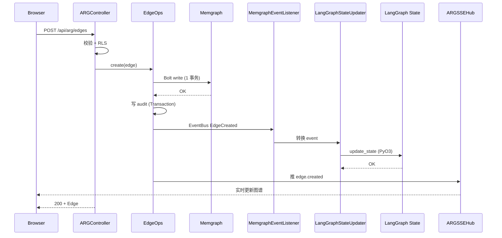
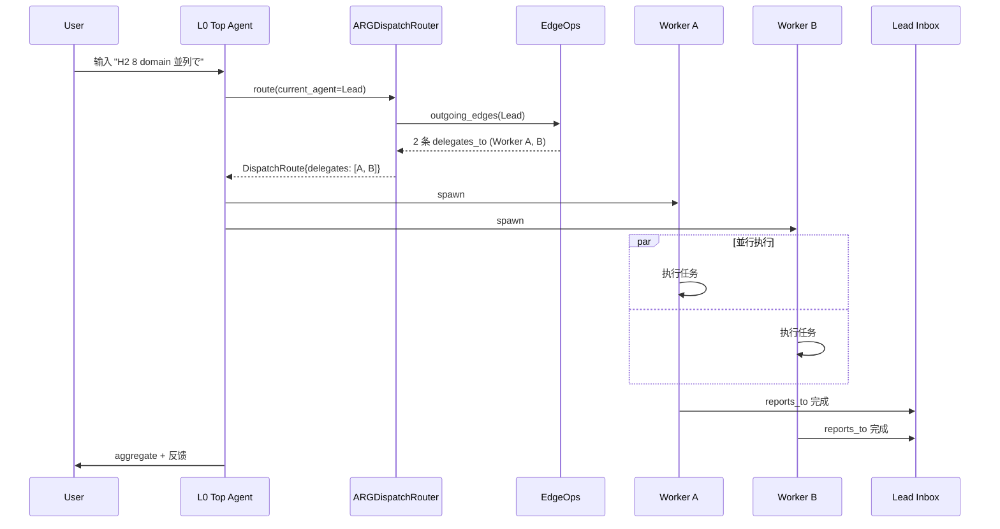
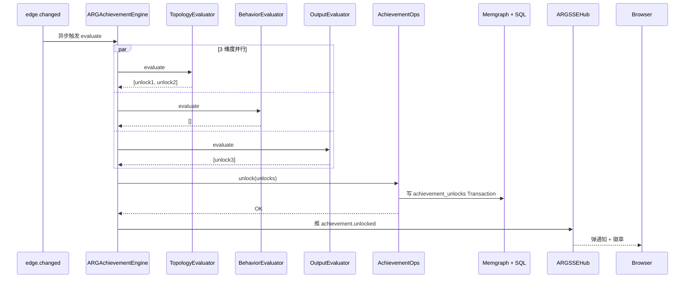
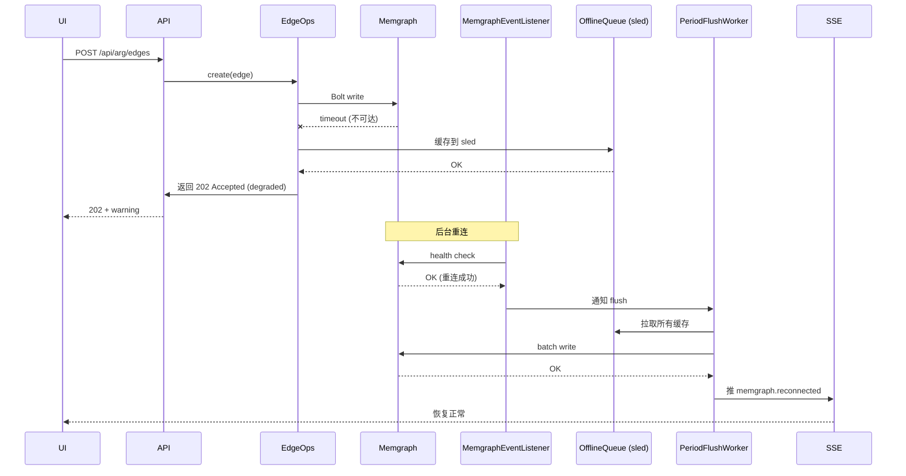

# DD-AGENT-RELATIONSHIP-001

> **Agent Relationship Graph (ARG) — 詳細設計書 v0.1**
>
> - 状态: 🟡 Draft v0.1
> - 目标阶段: 詳細設計 → 実装 → テスト → リリース
> - 上位基本設計: [`docs/design/BD-AGENT-RELATIONSHIP-001.md`](./BD-AGENT-RELATIONSHIP-001.md) v0.1 (9/9 落档, 1088 行)
> - 上位要件: [`docs/requirements/SRS-AGENT-RELATIONSHIP-001.md`](../requirements/SRS-AGENT-RELATIONSHIP-001.md) v0.1 (9/8 落档, 663 行)
> - 关联実装報告: [`docs/reports/PHASE-ARG-IMPL-REPORT.md`](../reports/PHASE-ARG-IMPL-REPORT.md) (待 P3-C 阶段落档)
> - 平行 view 詳細設計:
>   - [`docs/architecture/2026-09-03-langgraph/03-detailed-design.md`](../architecture/2026-09-03-langgraph/03-detailed-design.md) (LangGraph v0.2 含 TMO 9 节点, 9/4 落档)
>   - [`docs/architecture/2026-09-03-agent-runtime/03-detailed-design.md`](../architecture/2026-09-03-agent-runtime/03-detailed-design.md) (Agent Runtime, 9/3 落档, ADR-0045)
>   - [`docs/design/DD-AGENT-VIEW-001.md`](./DD-AGENT-VIEW-001.md) (Agent View 画布, 9/5 落档, 跟本 DD 平行)
>   - [`docs/frontend-canvas-design.md`](../frontend-canvas-design.md) v0.1 (画布 + bezier connector 公式)
> - 修订人: Ulysses（一人公司 12 角色 per DEC-008）— Mavis 接手 (per 2026-08-27 19:39 JST 用户授权)
> - 审批: 架构师 (Mavis 接手 agent per DEC-008)
> - 日期: 2026-09-09 JST
> - 受众: 実装エンジニア / テストエンジニア / アーキテクト / SRE / 5 域 Lead 真人
> - 拍板来源: 2026-09-08 22:35 JST `ask_7d7ffcac2353adad7d3f6f69` (scope / backend=Memgraph / 关系=4 核心+6 扩展 / 成就=完整版) + 2026-09-09 用户发令"1" (默认推荐 = DD 详细设计)

---

## §0 文档信息 / 修订履历

| 项目 | 内容 |
|---|---|
| 文书 ID | DD-AGENT-RELATIONSHIP-001 |
| 文书名 | Agent Relationship Graph (ARG) 詳細設計書 |
| 版本 | v0.1 |
| 作成日 | 2026-09-09 |
| 作成者 | Ulysses — Mavis 接手 (per DEC-008) |
| 承認者 | 架构师 (Mavis 接手) |
| 关联 commit | 待生成 (v0.1 落档后) |
| 关联文档 | `BD-AGENT-RELATIONSHIP-001.md` v0.1 + `SRS-AGENT-RELATIONSHIP-001.md` v0.1 |
| 平行 DD | `DD-AGENT-VIEW-001.md` + `2026-09-03-langgraph/03-detailed-design.md` + `2026-09-03-agent-runtime/03-detailed-design.md` |

---

## §1 文档目的 / 适用范围

### 1.1 文档目的

本文档基于 [`BD-AGENT-RELATIONSHIP-001` §0-§10](../design/BD-AGENT-RELATIONSHIP-001.md) 的基本設計, 定义 **Agent Relationship Graph (ARG)** 视图的詳細設計:

- 概念 module 布局 (24 组件 → 18 Rust module + 1 Python LangGraph module, per §3.1)
- 13 个关键 class (C-1/C-2/C-3/C-4/C-7/C-8/C-11/C-12/C-13/C-14/C-15/C-21/C-16) 的完整字段 + 方法签名 + 错误处理; C-5/C-6/C-9/C-10/C-17/C-18/C-19/C-20/C-22/C-23/C-24 在 P3-C 实装阶段同步落地
- 4 effect 维度的 LangGraph 节点集成协议 (state schema 5 channel + 5 Reducer)
- 10 类关系的实现机制 (dispatch 路由 / 上下文注入 / 信任度 / 产出评估 4 维度的具体代码路径)
- 5 个状态机的 Rust enum + 状态转移函数 (Edge / Agent / Trust Score 5 档 / Template Instance / Achievement)
- 11 个共享类型 (per §3.2.5, 修复 self-review 发现的类型缺失: ARGEvent / Decision / Output / Verdict / LLMClient / AchievementUnlock / TemplateInstance / ARGState / EscalationInfo / PeerReviewVerdict / ChallengePrompt)
- 4 个关键时序图 (写关系 / 协作影响 / 成就评估 / 离线降级)
- 8 个拓扑成就 Cypher 模板 + 10 套 challenges 双向论证 prompt 模板
- UT/IT/E2E/PT 测试用例 (52 UT + 10 IT + 8 E2E + 4 PT = 74 测试, per §10)
- NFR 详细设计 (6 项 + 守门 14 项 + 子代理失败接手)
- 已知缺口 8 项 (从 BD 12 项筛出 P3-D 必须解决)

### 1.2 包含 (In-Scope)

- `crates/arg` 6 子模块的 Rust struct + trait + impl 详情
- `crates/arg-bridge` 4 子模块的同步桥协议
- `crates/arg-effect` 5 子模块的 LangGraph 节点集成
- `crates/api/src/arg` 13 REST + 1 WebSocket 端点详情
- `frontend/src/app/agent-relationships/` 5 组件 props + zustand store 5 channel 详情
- 8 拓扑成就 Cypher 模板 (per 缺口 G-6)
- 10 套 challenges 双向论证 prompt 模板 (per 缺口 G-5)
- 5 状态机 Rust enum + 转移函数
- 4 时序图 (Mermaid)
- 30 UT + 10 IT + 8 E2E + 4 PT 测试用例

### 1.3 不包含 (Out-of-Scope)

- 跟 P3-C 实装同步写的 `scripts/automation/*.py` 4 份 (在 PHASE-ARG-IMPL-REPORT.md 写)
- Memgraph 客户端 crate 的选型 (per 缺口 G-1, P3-C W1 调研决定)
- k3s 部署 yaml 详细配置 (per 缺口 G-2, P3-C W2 写)
- ARG V2 schema 迁移 (per 缺口 G-10, 后续阶段)
- 成就可分享的 PNG 导出 (per 缺口 G-11, P3-E 之后)

---

## §2 用語定義 (詳細, per SRS §2 + BD §2 扩展)

| 用語 | 詳細 | 出处 |
|---|---|---|
| **ARG Schema V1** | 本 DD 定义的 V1 schema, 1 Agent 节点 + 10 关系边 + 5 SQL 表 + 5 LangGraph channel | 本 DD 新增 (per 缺口 G-10) |
| **Bolt subscription** | Memgraph Bolt 协议的订阅能力, 监听 edge.changed event 实时推送 | per `BD §2.2 Tier 4` |
| **EventBus** | crates/arg-bridge 内部的 tokio::sync::broadcast channel, in-process 事件分发 | per `BD §2.2 Tier 4` |
| **PeriodFlushWorker** | 30s 周期的 tokio task, 合并 in-process state 变更加 version 后批量写 Memgraph | per `BD §2.2 Tier 4` |
| **OfflineQueue** | 本地 sled 嵌入式数据库, Memgraph 不可达时缓存变更, 重连后 flush | per `BD §2.2 Tier 4` + 缺口 G-1 关联 |
| **Trust Score 5 档** | UNTRUSTED (0-0.2) / LOW (0.2-0.4) / MEDIUM (0.4-0.7) / HIGH (0.7-0.9) / VERY_HIGH (0.9-1.0) | per `BD §5.4.3` |
| **Verifier Skip** | trust_score ≥ 0.8 的 trusts 边, 跳过 verify 节点, 节省 token ≥ 15% | per `BD §4.3.3` + 用户原话"对工作产生益处" |
| **Context Injection** | mentors / shadows 边触发, mentee 启动拉 mentor 历史决策作为 prompt context | per `BD §4.3.2` |
| **Challenge Round** | challenges 边的双向论证轮次, B 自证 → A 接受或 escalate | per `BD §4.3.4` |
| **Topology Achievement** | 静态图结构触发的成就 (8 个), 跑 Cypher 查询图结构判断 | per `BD §7.4` + `SRS §6 NFR-ARG-ACHIEVEMENT-01` |
| **Behavior Achievement** | 运行时事件 pattern 触发的成就 (7 个), 匹配 event log | per `BD §7.4` |
| **Output Achievement** | 协作产出指标触发的成就 (5 个), 聚合指标查询 | per `BD §7.4` |

---

## §3 概念 module 布局 (Conceptual Module Layout)

### 3.1 整体 module map (per BD §6.4 扩展)

```
crates/arg/                                # NEW
├── Cargo.toml                             # r2d2-memgraph dep (per 缺口 G-1)
├── src/
│   ├── lib.rs                             # 模块入口 + re-export
│   ├── error.rs                           # ARGError enum (10 variants)
│   ├── models/
│   │   ├── mod.rs
│   │   ├── agent.rs                       # Agent struct (16 字段)
│   │   ├── edge.rs                        # Edge struct + RelationshipType enum (10 variants)
│   │   ├── template.rs                    # 5 TeamTemplate
│   │   ├── achievement.rs                 # 20 Achievement (3 维度 4 稀有度)
│   │   ├── trust_score.rs                 # TrustScore 5 档 enum + 转移
│   │   └── event.rs                       # ARGEvent enum (6 variants)
│   ├── client/
│   │   ├── mod.rs
│   │   ├── memgraph.rs                    # MemgraphClient (Bolt pool, 8-16 conn)
│   │   ├── cypher_cache.rs                # LRU 1000 query cache
│   │   └── migration.rs                   # schema v1+v2
│   ├── ops/
│   │   ├── mod.rs
│   │   ├── agent_node.rs                  # AgentNodeOps (CRUD)
│   │   ├── edge_ops.rs                    # EdgeOps (CRUD + audit 双写)
│   │   ├── template_ops.rs                # TemplateOps (5 模板 instantiate)
│   │   ├── event_writer.rs                # EventWriter (append-only)
│   │   └── achievement_ops.rs             # AchievementOps (unlock + query)
│   ├── query/
│   │   ├── mod.rs
│   │   ├── topology.rs                    # 8 拓扑成就 Cypher 模板
│   │   ├── behavior.rs                    # 7 行为成就 event pattern
│   │   └── output.rs                      # 5 产出成就聚合指标
│   └── tests/
│       ├── agent_node_test.rs             # 5 UT
│       ├── edge_ops_test.rs               # 8 UT
│       ├── template_ops_test.rs           # 5 UT
│       ├── achievement_test.rs            # 6 UT
│       ├── trust_score_test.rs            # 4 UT
│       └── cypher_cache_test.rs           # 2 UT
└── README.md

crates/arg-bridge/                         # NEW
├── Cargo.toml                             # arg + tokio + serde + tracing
├── src/
│   ├── lib.rs
│   ├── memgraph_listener.rs               # Bolt subscription
│   ├── langgraph_updater.rs               # 写 LangGraph state (PyO3)
│   ├── period_flush.rs                    # 30s 周期 flush
│   ├── offline_queue.rs                   # sled 本地缓存
│   └── tests/
│       ├── listener_test.rs               # 3 UT
│       ├── flush_test.rs                  # 3 UT
│       └── offline_test.rs                # 4 UT

crates/arg-effect/                         # NEW
├── Cargo.toml                             # arg + langgraph + tokio
├── src/
│   ├── lib.rs
│   ├── dispatch_router.rs                 # ARGDispatchRouter LangGraph 节点
│   ├── context_injector.rs                # ARGContextInjector
│   ├── trust_engine.rs                    # ARGTrustEngine
│   ├── output_evaluator.rs                # ARGOutputEvaluator
│   ├── achievement_engine.rs              # ARGAchievementEngine (3 evaluator)
│   ├── prompts/
│   │   ├── mod.rs
│   │   ├── challenge.rs                   # 10 套 challenges prompt 模板
│   │   ├── consult.rs                     # 5 套 consults prompt 模板
│   │   └── review.rs                      # 3 套 peer_reviews prompt 模板
│   └── tests/
│       ├── dispatch_test.rs               # 3 UT
│       ├── context_test.rs                # 3 UT
│       ├── trust_test.rs                  # 4 UT
│       ├── output_test.rs                 # 3 UT
│       └── achievement_test.rs            # 5 UT

crates/api/src/arg/                        # EXTEND
├── mod.rs
├── controller.rs                          # 13 REST endpoints
├── sse_hub.rs                             # WebSocket /ws/arg/events
├── permission.rs                          # RLS 13 类 middleware
├── dto.rs                                 # request/response types
└── tests/
    ├── controller_test.rs                 # 13 endpoint IT
    ├── sse_test.rs                        # WS IT
    └── permission_test.rs                 # RLS IT

frontend/src/app/agent-relationships/      # NEW
├── page.tsx                               # 3 tab container
├── editor/
│   ├── RelationshipEditor.tsx
│   ├── EdgeTypeSelector.tsx
│   └── tests/RelationshipEditor.test.tsx
├── view/
│   ├── RelationshipView.tsx
│   ├── NodeDetail.tsx
│   └── tests/RelationshipView.test.tsx
├── achievements/
│   ├── AchievementWall.tsx
│   └── tests/AchievementWall.test.tsx
├── templates/
│   ├── TemplateGallery.tsx
│   └── tests/TemplateGallery.test.tsx
└── AgentViewTab.tsx                       # 1 tab 集成到 /agent-view

frontend/src/lib/arg/                      # NEW
├── store.ts                               # useARGStore 5 channel
├── api.ts                                 # 13 REST 客户端
├── ws.ts                                  # WebSocket 客户端
├── types.ts                               # TypeScript types
└── tests/
    ├── store.test.ts
    └── api.test.ts
```

### 3.2 4 个关键 class / struct 关键字段

#### 3.2.1 Agent (per BD §4.1.1)

```rust
// crates/arg/src/models/agent.rs
use chrono::{DateTime, Utc};
use serde::{Deserialize, Serialize};
use uuid::Uuid;

#[derive(Debug, Clone, Serialize, Deserialize, PartialEq)]
pub struct Agent {
    pub id: Uuid,
    pub name: String,                    // 展示名, max 255 chars
    pub archetype: AgentArchetype,       // SA-01..SA-09 / LEAD-{DOMAIN} / CUSTOM
    pub domain: Option<Domain>,          // 5 域之一 or None
    pub status: AgentStatus,             // Active / Standby / Archived
    pub trust_score: f32,                // 0.0-1.0, 5 档
    pub metadata: serde_json::Value,     // 扩展字段
    pub tenant_id: Uuid,                 // RLS 13 类 per 守门 #13
    pub created_at: DateTime<Utc>,
    pub updated_at: DateTime<Utc>,
    pub version: i32,                    // SCD Type 2
    pub created_by: Uuid,                // author = Ulysses per 9/8 15:19
}

#[derive(Debug, Clone, Copy, Serialize, Deserialize, PartialEq, Eq, Hash)]
#[serde(rename_all = "SCREAMING_SNAKE_CASE")]
pub enum AgentArchetype {
    Sa01, Sa02, Sa03, Sa04, Sa05, Sa06, Sa07, Sa08, Sa09,  // 9 SA per ADR-0045
    LeadPlayer, LeadEconomy, LeadMatch, LeadSocial, LeadAdmin,  // 5 域 Lead
    Custom,                                              // 用户自定义
}

#[derive(Debug, Clone, Copy, Serialize, Deserialize, PartialEq, Eq, Hash)]
#[serde(rename_all = "lowercase")]
pub enum Domain { Player, Economy, Match, Social, Admin }

#[derive(Debug, Clone, Copy, Serialize, Deserialize, PartialEq, Eq)]
#[serde(rename_all = "lowercase")]
pub enum AgentStatus { Active, Standby, Archived }

// Agent 关键方法 (impl 详情见 §4)
impl Agent {
    pub fn new(name: String, archetype: AgentArchetype, tenant_id: Uuid, created_by: Uuid) -> Self { ... }
    pub fn update_trust_score(&mut self, delta: f32) -> Result<(), ARGError> { ... }  // ±0.05 / ±0.01
    pub fn can_transition_to(&self, target: AgentStatus) -> bool { ... }
    pub fn to_cypher(&self) -> String { ... }  // 生成 CREATE/MERGE Cypher
}
```

#### 3.2.2 Edge + RelationshipType (per BD §3.2 + §4.1.2)

```rust
// crates/arg/src/models/edge.rs
use super::agent::Agent;
use serde::{Deserialize, Serialize};
use uuid::Uuid;

#[derive(Debug, Clone, Copy, Serialize, Deserialize, PartialEq, Eq, Hash)]
#[serde(rename_all = "SCREAMING_SNAKE_CASE")]
pub enum RelationshipType {
    // 4 核心
    DelegatesTo,        // directed
    Consults,           // directed
    CollaboratesWith,   // undirected
    ReportsTo,          // directed
    // 6 扩展
    Mentors,            // directed
    PeerReviews,        // undirected
    StandInFor,         // directed
    Shadows,            // directed
    Challenges,         // directed
    Trusts,             // directed
}

impl RelationshipType {
    pub fn is_directed(&self) -> bool {
        !matches!(self, Self::CollaboratesWith | Self::PeerReviews)
    }

    pub fn cypher_label(&self) -> &'static str {
        match self {
            Self::DelegatesTo => "DELEGATES_TO",
            Self::Consults => "CONSULTS",
            Self::CollaboratesWith => "COLLABORATES_WITH",
            Self::ReportsTo => "REPORTS_TO",
            Self::Mentors => "MENTORS",
            Self::PeerReviews => "PEER_REVIEWS",
            Self::StandInFor => "STAND_IN_FOR",
            Self::Shadows => "SHADOWS",
            Self::Challenges => "CHALLENGES",
            Self::Trusts => "TRUSTS",
        }
    }
}

#[derive(Debug, Clone, Serialize, Deserialize, PartialEq)]
pub struct Edge {
    pub id: Uuid,
    pub from_agent: Uuid,
    pub to_agent: Uuid,
    pub edge_type: RelationshipType,
    pub weight: f32,                // 0.0-1.0
    pub direction: EdgeDirection,
    pub archived: bool,
    pub metadata: serde_json::Value,
    pub tenant_id: Uuid,
    pub created_at: DateTime<Utc>,
    pub updated_at: DateTime<Utc>,
    pub version: i32,
    pub created_by: Uuid,
}

#[derive(Debug, Clone, Copy, Serialize, Deserialize, PartialEq, Eq)]
#[serde(rename_all = "lowercase")]
pub enum EdgeDirection { Directed, Undirected }
```

#### 3.2.3 TeamTemplate (5 个, per BD §4.5 + §1.1.6)

```rust
// crates/arg/src/models/template.rs
use serde::{Deserialize, Serialize};
use uuid::Uuid;
use super::edge::RelationshipType;

#[derive(Debug, Clone, Serialize, Deserialize, PartialEq)]
pub struct TeamTemplate {
    pub id: TemplateId,
    pub name: String,
    pub description: String,
    pub min_agents: usize,
    pub max_agents: usize,
    pub edges: Vec<TemplateEdge>,
    pub category: TemplateCategory,
}

#[derive(Debug, Clone, Copy, Serialize, Deserialize, PartialEq, Eq, Hash)]
#[serde(rename_all = "kebab-case")]
pub enum TemplateId {
    HubAndSpoke,            // 1 Lead + 4 Worker
    Mesh,                   // N 节点全连接
    Chain,                  // A → B → C → D
    Hierarchical,           // 1 Lead + 2 Sub-Lead + 6 Worker (3 层)
    ReviewCouncil,          // 1 Lead + 3 Reviewer
}

#[derive(Debug, Clone, Copy, Serialize, Deserialize, PartialEq, Eq)]
#[serde(rename_all = "lowercase")]
pub enum TemplateCategory { Standard, HighDensity, Pipeline, Management, Decision }

#[derive(Debug, Clone, Serialize, Deserialize, PartialEq)]
pub struct TemplateEdge {
    pub from_index: usize,           // agent_ids 中的 index
    pub to_index: usize,
    pub edge_type: RelationshipType,
    pub default_weight: f32,
}

// 5 模板定义
pub fn hub_and_spoke() -> TeamTemplate {
    TeamTemplate {
        id: TemplateId::HubAndSpoke,
        name: "Hub-and-Spoke".into(),
        description: "1 Lead + 4 Worker 团队".into(),
        min_agents: 5, max_agents: 5,
        edges: vec![
            TemplateEdge { from_index: 0, to_index: 1, edge_type: RelationshipType::DelegatesTo, default_weight: 0.7 },
            TemplateEdge { from_index: 0, to_index: 2, edge_type: RelationshipType::DelegatesTo, default_weight: 0.7 },
            TemplateEdge { from_index: 0, to_index: 3, edge_type: RelationshipType::DelegatesTo, default_weight: 0.7 },
            TemplateEdge { from_index: 0, to_index: 4, edge_type: RelationshipType::DelegatesTo, default_weight: 0.7 },
        ],
        category: TemplateCategory::Standard,
    }
}
// ... mesh / chain / hierarchical / review_council 4 个
```

#### 3.2.5 共享类型 (Shared Types, 跨多 component 引用)

> **本节是 self-review 增补** — 修复 v0.1 草稿中类型缺失的 11 处引用 (ARGEvent / Decision / Output / Verdict / LLMClient / AchievementUnlock / TemplateInstance / ARGState / EscalationInfo / PeerReviewVerdict / ChallengePrompt). 这些类型在 §4 多处被引用, 但 §3 之前没统一定义.

```rust
// crates/arg/src/models/event.rs
use chrono::{DateTime, Utc};
use serde::{Deserialize, Serialize};
use uuid::Uuid;
use super::{agent::Agent, edge::Edge, template::TemplateInstance};

#[derive(Debug, Clone, Serialize, Deserialize, PartialEq)]
#[serde(tag = "type", rename_all = "snake_case")]
pub enum ARGEvent {
    AgentCreated(Agent),
    AgentUpdated { id: Uuid, before: Agent, after: Agent },
    AgentArchived(Uuid),
    EdgeCreated(Edge),
    EdgeUpdated { id: Uuid, before: Edge, after: Edge },
    EdgeArchived(Uuid),
    TemplateInstantiated(TemplateInstance),
    TrustScoreChanged { agent_id: Uuid, before: f32, after: f32, delta: f32 },
    AchievementUnlocked(AchievementUnlock),
}

impl ARGEvent {
    pub fn from_edge_row(row: &Row) -> Self {
        // Memgraph subscription row → EdgeCreated/EdgeUpdated/EdgeArchived
        // 实际转换在 P3-C W2 实证
        todo!("per 缺口 G-1, P3-C W2 实证")
    }
}

#[derive(Debug, Clone, Serialize, Deserialize, PartialEq)]
pub struct AchievementUnlock {
    pub id: Uuid,
    pub achievement_code: String,
    pub user_id: Uuid,
    pub agent_ids: Vec<Uuid>,
    pub trigger_metadata: serde_json::Value,
    pub tenant_id: Uuid,
    pub unlocked_at: DateTime<Utc>,
}

// crates/arg/src/models/template.rs (扩展)
#[derive(Debug, Clone, Serialize, Deserialize, PartialEq)]
pub struct TemplateInstance {
    pub id: Uuid,
    pub template_id: TemplateId,
    pub instance_name: String,
    pub agent_ids: Vec<Uuid>,
    pub edges_json: serde_json::Value,
    pub tenant_id: Uuid,
    pub created_at: DateTime<Utc>,
    pub expires_at: DateTime<Utc,  // TTL 30 天 per 守门 #13 a Work 类
    pub created_by: Uuid,
}

impl TemplateInstance {
    pub fn new(
        template_id: TemplateId,
        instance_name: String,
        agent_ids: Vec<Uuid>,
        edges: Vec<TemplateEdge>,
        tenant_id: Uuid,
        created_by: Uuid,
    ) -> Self {
        let now = Utc::now();
        Self {
            id: Uuid::new_v4(),
            template_id,
            instance_name,
            agent_ids,
            edges_json: serde_json::to_value(&edges).unwrap(),
            tenant_id,
            created_at: now,
            expires_at: now + chrono::Duration::days(30),  // TTL 30 天
            created_by,
        }
    }
}

// crates/arg-effect/src/types.rs (LLM 抽象)
#[async_trait::async_trait]
pub trait LLMClient: Send + Sync {
    async fn call(&self, prompt: &str, input: &serde_json::Value) -> Result<LLMResponse, ARGError>;
}

pub struct LLMResponse {
    pub content: String,
    pub verdict: Option<Verdict>,
    pub score: Option<f32>,
    pub token_used: u32,
}

#[derive(Debug, Clone, Copy, Serialize, Deserialize, PartialEq, Eq)]
#[serde(rename_all = "lowercase")]
pub enum Verdict { Accept, Reject, Escalate }

#[derive(Debug, Clone, Serialize, Deserialize, PartialEq)]
pub struct Decision {
    pub decision_type: DecisionType,
    pub description: String,
    pub context: serde_json::Value,
    pub tenant_id: Uuid,
}

#[derive(Debug, Clone, Copy, Serialize, Deserialize, PartialEq, Eq, Hash)]
#[serde(rename_all = "lowercase")]
pub enum DecisionType { Architectural, Business, Security, Performance, Ux }

#[derive(Debug, Clone, Serialize, Deserialize, PartialEq)]
pub struct Output {
    pub output_type: String,
    pub content: serde_json::Value,
    pub agent_id: Uuid,
    pub tenant_id: Uuid,
}

#[derive(Debug, Clone, Serialize, Deserialize, PartialEq)]
pub struct ChallengeVerdict {
    pub from_agent: Uuid,
    pub to_agent: Uuid,
    pub justification: String,
    pub verdict: Verdict,
    pub escalation: Option<EscalationInfo>,
}

#[derive(Debug, Clone, Serialize, Deserialize, PartialEq)]
pub struct EscalationInfo {
    pub reason: String,
    pub escalation_target: Uuid,  // 通常是 5 域 Lead 真人
    pub deadline: DateTime<Utc>,
}

#[derive(Debug, Clone, Serialize, Deserialize, PartialEq)]
pub struct PeerReviewVerdict {
    pub agent_a: Uuid,
    pub agent_b: Uuid,
    pub output: Output,
    pub score: f32,              // 0.0-1.0, 阈值 ≥ 0.8 per SRS §4.3.4
    pub feedback: String,
    pub accepted: bool,          // score >= 0.8
}

#[derive(Debug, Clone, Serialize, Deserialize, PartialEq)]
pub struct ChallengePrompt {
    pub self_justify_prompt: String,
    pub evaluate_prompt: String,
}

#[derive(Debug, Clone, Copy, Serialize, Deserialize, PartialEq, Eq, Hash)]
pub enum TrustTier { Low, High }  // §7 challenges prompt 用的简化 tier (跟 TrustScoreTier 区分)

// crates/arg/src/models/agent.rs (扩展 validate + to_cypher)
impl Agent {
    pub fn new(name: String, archetype: AgentArchetype, tenant_id: Uuid, created_by: Uuid) -> Self {
        Self {
            id: Uuid::new_v4(),
            name,
            archetype,
            domain: match archetype {
                AgentArchetype::LeadPlayer => Some(Domain::Player),
                AgentArchetype::LeadEconomy => Some(Domain::Economy),
                AgentArchetype::LeadMatch => Some(Domain::Match),
                AgentArchetype::LeadSocial => Some(Domain::Social),
                AgentArchetype::LeadAdmin => Some(Domain::Admin),
                _ => None,
            },
            status: AgentStatus::Active,
            trust_score: 0.5,  // 默认中等
            metadata: serde_json::Value::Null,
            tenant_id,
            created_at: Utc::now(),
            updated_at: Utc::now(),
            version: 1,
            created_by,
        }
    }

    pub fn validate(&self) -> Result<(), ARGError> {
        if self.name.is_empty() { return Err(ARGError::ValidationFailed("name is empty".into())); }
        if self.name.len() > 255 { return Err(ARGError::ValidationFailed("name > 255 chars".into())); }
        if self.trust_score < 0.0 || self.trust_score > 1.0 {
            return Err(ARGError::TrustScoreOutOfRange(self.trust_score));
        }
        // 守门 #3 派生: 跨域边检查在 EdgeOps::create 里, 不在 Agent.validate
        Ok(())
    }

    pub fn update_trust_score(&mut self, success: bool) -> Result<f32, ARGError> {
        let new_score = if success {
            (self.trust_score + 0.01).min(1.0)
        } else {
            (self.trust_score - 0.05).max(0.0)
        };
        self.trust_score = new_score;
        self.updated_at = Utc::now();
        self.version += 1;
        Ok(new_score)
    }

    pub fn can_transition_to(&self, target: AgentStatus) -> bool {
        use AgentStatus::*;
        matches!((self.status, target),
            (Active, Standby) | (Active, Archived) |
            (Standby, Active) | (Standby, Archived)
        )
        // Archived 是终态, 不可转出
    }

    pub fn to_cypher(&self) -> String {
        format!(
            "MERGE (a:Agent {{id: '{}'}}) \
             SET a.name = '{}', a.archetype = '{}', a.domain = '{}', \
                 a.status = '{}', a.trust_score = {}, a.tenant_id = '{}', \
                 a.version = {}, a.created_by = '{}', \
                 a.created_at = localdatetime(), a.updated_at = localdatetime()",
            self.id, self.name, self.archetype_str(),
            self.domain.map(|d| format!("{:?}", d).to_lowercase()).unwrap_or_default(),
            format!("{:?}", self.status).to_lowercase(),
            self.trust_score, self.tenant_id, self.version, self.created_by,
        )
    }

    fn archetype_str(&self) -> String {
        format!("{:?}", self.archetype).to_uppercase()
    }
}

impl Edge {
    pub fn validate(&self) -> Result<(), ARGError> {
        if self.from_agent == self.to_agent { return Err(ARGError::ValidationFailed("self-loop not allowed".into())); }
        if self.weight < 0.0 || self.weight > 1.0 { return Err(ARGError::ValidationFailed("weight out of [0,1]".into())); }
        if !self.edge_type.is_directed() && self.direction != EdgeDirection::Undirected {
            return Err(ARGError::ValidationFailed("undirected type but direction is directed".into()));
        }
        Ok(())
    }
}

// crates/api/src/arg/state.rs
pub struct ARGState {
    pub agent_node_ops: Arc<AgentNodeOps>,
    pub edge_ops: Arc<EdgeOps>,
    pub template_ops: Arc<TemplateOps>,
    pub achievement_ops: Arc<AchievementOps>,
    pub event_writer: Arc<EventWriter>,
    pub sse_hub: Arc<ARGSSEHub>,
    pub permission: Arc<ARGPermission>,
    pub tenant_id: Uuid,  // per RLS 13 类
}
```

#### 3.2.4 Achievement (20 个, per BD §7.4)

```rust
// crates/arg/src/models/achievement.rs
use serde::{Deserialize, Serialize};
use uuid::Uuid;

#[derive(Debug, Clone, Copy, Serialize, Deserialize, PartialEq, Eq, Hash)]
pub enum AchievementCategory { Topology, Behavior, Output }

#[derive(Debug, Clone, Copy, Serialize, Deserialize, PartialEq, Eq, Hash, PartialOrd, Ord)]
#[serde(rename_all = "lowercase")]
pub enum Rarity { Common, Rare, Epic, Legendary }

#[derive(Debug, Clone, Serialize, Deserialize, PartialEq)]
pub struct Achievement {
    pub code: String,            // e.g. "TOP-001-MESH-5DOMAIN"
    pub name_zh: String,
    pub name_en: String,
    pub description: String,
    pub category: AchievementCategory,
    pub rarity: Rarity,
    pub icon_url: String,
    pub unlock_condition: UnlockCondition,
}

#[derive(Debug, Clone, Serialize, Deserialize, PartialEq)]
#[serde(tag = "type", rename_all = "snake_case")]
pub enum UnlockCondition {
    CypherQuery { query: String, params: serde_json::Value },
    EventPattern { pattern: String, count: u32 },
    AggregateMetric { metric: String, threshold: f64, time_window: chrono::Duration },
}

// 20 成就定义
pub fn all_achievements() -> Vec<Achievement> { vec![ /* 8 topology + 7 behavior + 5 output */ ] }
```

### 3.3 5 状态机 Rust enum (per BD §5.4)

#### 3.3.1 Edge 状态机

```rust
// crates/arg/src/models/edge.rs
#[derive(Debug, Clone, Copy, PartialEq, Eq)]
pub enum EdgeState { Created, Updated, Archived }

pub fn can_transition(from: EdgeState, to: EdgeState) -> bool {
    use EdgeState::*;
    matches!((from, to),
        (Created, Updated) | (Created, Archived) |
        (Updated, Updated) | (Updated, Archived)
    )
    // Archived 是终态, 不可转出
}
```

#### 3.3.2 Agent 状态机

```rust
#[derive(Debug, Clone, Copy, PartialEq, Eq)]
pub enum AgentState { Active, Standby, Archived }

pub fn can_transition_agent(from: AgentState, to: AgentState) -> bool {
    use AgentState::*;
    matches!((from, to),
        (Active, Standby) | (Active, Archived) |
        (Standby, Active) | (Standby, Archived)
    )
    // Archived 是终态
}
```

#### 3.3.3 Trust Score 5 档 (per BD §5.4.3)

```rust
#[derive(Debug, Clone, Copy, PartialEq, Eq, PartialOrd, Ord)]
pub enum TrustScoreTier { Untrusted, Low, Medium, High, VeryHigh }

impl TrustScoreTier {
    pub fn from_score(score: f32) -> Self {
        match score {
            s if s < 0.2 => Self::Untrusted,
            s if s < 0.4 => Self::Low,
            s if s < 0.7 => Self::Medium,
            s if s < 0.9 => Self::High,
            _ => Self::VeryHigh,
        }
    }

    pub fn to_score_range(&self) -> (f32, f32) {
        match self {
            Self::Untrusted => (0.0, 0.2),
            Self::Low => (0.2, 0.4),
            Self::Medium => (0.4, 0.7),
            Self::High => (0.7, 0.9),
            Self::VeryHigh => (0.9, 1.0),
        }
    }
}

pub fn update_trust_score(current: f32, success: bool) -> f32 {
    if success {
        (current + 0.01).min(1.0)
    } else {
        (current - 0.05).max(0.0)
    }
}
```

#### 3.3.4 Template Instance 状态机

```rust
#[derive(Debug, Clone, Copy, PartialEq, Eq)]
pub enum TemplateInstanceState { Pending, Active, Expired }

pub fn transition_template_instance(
    state: TemplateInstanceState, now: DateTime<Utc>, expires_at: DateTime<Utc>
) -> TemplateInstanceState {
    use TemplateInstanceState::*;
    if state == Expired { return Expired; }
    if now > expires_at { Expired } else { state }
}
```

#### 3.3.5 Achievement 状态机

```rust
#[derive(Debug, Clone, Copy, PartialEq, Eq)]
pub enum AchievementState { Locked, Unlocked }

// Locked → Unlocked 是单向, append-only
pub fn unlock_achievement(unlocks: &mut Vec<Achievement>, code: &str) -> bool {
    if unlocks.iter().any(|a| a.code == code) { return false; }  // 幂等
    // 写入 achievement_unlocks Transaction 表
    true
}
```

---

## §4 13 个关键 class / struct 完整字段 + 方法签名

### 4.1 C-1 MemgraphClient (Data Tier)

```rust
// crates/arg/src/client/memgraph.rs
use r2d2::Pool;
use r2d2_memgraph::MemgraphConnectionManager;
use std::time::Duration;

pub struct MemgraphClient {
    pool: Pool<MemgraphConnectionManager>,
    bolt_url: String,           // from env MEMGRAPH_BOLT_URL (per 守门 #5)
    user: String,               // from env MEMGRAPH_USER
    password: String,           // from env MEMGRAPH_PASSWORD (per 守门 #5 不打印)
    cache: CypherCache,         // LRU 1000
    max_conn: u32,              // default 16
}

impl MemgraphClient {
    pub fn new_from_env() -> Result<Self, ARGError> {
        // 读 env: MEMGRAPH_BOLT_URL / MEMGRAPH_USER / MEMGRAPH_PASSWORD
        // 不打印 env 值 (per 守门 #5)
        let manager = MemgraphConnectionManager::new(bolt_url, user, password);
        let pool = Pool::builder()
            .max_size(16)
            .connection_timeout(Duration::from_secs(5))
            .build(manager)?;
        Ok(Self { pool, bolt_url, user, password, cache: CypherCache::new(1000), max_conn: 16 })
    }

    pub async fn execute(&self, cypher: &str, params: serde_json::Value) -> Result<Vec<Row>, ARGError> {
        // 1. 查 cache
        if let Some(rows) = self.cache.get(cypher, &params) { return Ok(rows); }
        // 2. 从 pool 拿 conn
        let conn = self.pool.get().await?;
        // 3. 执行
        let rows = conn.execute_cypher(cypher, params).await?;
        // 4. 写 cache
        self.cache.put(cypher, &params, &rows);
        Ok(rows)
    }

    pub async fn execute_write(&self, cypher: &str, params: serde_json::Value) -> Result<(), ARGError> {
        // 写操作不缓存, 走独立 write path
        let conn = self.pool.get().await?;
        conn.execute_cypher(cypher, params).await?;
        Ok(())
    }

    pub async fn subscribe<F>(&self, event_filter: &str, handler: F) -> Result<(), ARGError>
        where F: Fn(ARGEvent) + Send + 'static
    {
        // Bolt subscription: 监听 edge.changed event
        // 调用方提供 handler, 异步接收
        todo!("per 缺口 G-1, 待 r2d2-memgraph 调研")
    }

    pub async fn health_check(&self) -> Result<bool, ARGError> {
        let conn = self.pool.get().await?;
        Ok(conn.ping().await.is_ok())
    }
}
```

### 4.2 C-2 AgentNodeOps

```rust
// crates/arg/src/ops/agent_node.rs
pub struct AgentNodeOps {
    client: Arc<MemgraphClient>,
    event_writer: Arc<EventWriter>,
}

impl AgentNodeOps {
    pub async fn create(&self, agent: Agent) -> Result<Agent, ARGError> {
        // 1. 校验 (name non-empty, archetype valid, tenant_id matches)
        agent.validate()?;
        // 2. 写 Memgraph
        let cypher = format!(
            "CREATE (a:Agent {{id: $id, name: $name, archetype: $archetype, ...}}) RETURN a",
            ...
        );
        self.client.execute_write(&cypher, json!({...})).await?;
        // 3. 写 event (audit)
        self.event_writer.append(ARGEvent::AgentCreated(agent.clone())).await?;
        Ok(agent)
    }

    pub async fn get(&self, id: Uuid, tenant_id: Uuid) -> Result<Option<Agent>, ARGError> {
        // RLS 13 类: 必传 tenant_id
        let cypher = "MATCH (a:Agent {id: $id, tenant_id: $tenant_id}) RETURN a LIMIT 1";
        let rows = self.client.execute(cypher, json!({"id": id, "tenant_id": tenant_id})).await?;
        Ok(rows.first().map(|r| Agent::from_row(r)))
    }

    pub async fn list(&self, filter: AgentFilter, page: Pagination) -> Result<Vec<Agent>, ARGError> {
        // 分页 + 过滤 (archetype, domain, status)
        // LIMIT $limit OFFSET $offset
        todo!()
    }

    pub async fn update(&self, id: Uuid, patch: AgentPatch, actor: Uuid) -> Result<Agent, ARGError> {
        // SCD Type 2: version +1, updated_at = now
        // 必传 actor (author = Ulysses per 守门 #10)
        // 写 audit (per 守门 #13)
        todo!()
    }

    pub async fn archive(&self, id: Uuid, actor: Uuid) -> Result<(), ARGError> {
        // status = Archived, version +1
        // 不可恢复 (per 守门 #13 Master 物理删除禁止 → 用 archived=true)
        todo!()
    }
}
```

### 4.3 C-3 EdgeOps (含 audit 双写)

```rust
// crates/arg/src/ops/edge_ops.rs
pub struct EdgeOps {
    client: Arc<MemgraphClient>,
    event_writer: Arc<EventWriter>,
    audit_writer: Arc<AuditWriter>,
}

impl EdgeOps {
    pub async fn create(&self, edge: Edge) -> Result<Edge, ARGError> {
        edge.validate()?;
        // 1. 写 Memgraph
        let cypher = format!(
            "MATCH (a:Agent {{id: $from}}), (b:Agent {{id: $to}}) \
             CREATE (a)-[r:{} {{id: $id, weight: $weight, ...}}]->(b) \
             RETURN r",
            edge.edge_type.cypher_label()
        );
        self.client.execute_write(&cypher, json!({...})).await?;
        // 2. 写 audit (per 守门 #13 Transaction, append-only)
        self.audit_writer.append(AuditEntry {
            edge_id: edge.id,
            action: AuditAction::Create,
            old_value: None,
            new_value: Some(serde_json::to_value(&edge)?),
            actor: edge.created_by,
            tenant_id: edge.tenant_id,
            timestamp: Utc::now(),
        }).await?;
        // 3. 触发 EventBus edge.changed (per BD §2.3.1)
        self.event_writer.append(ARGEvent::EdgeCreated(edge.clone())).await?;
        Ok(edge)
    }

    pub async fn get(&self, id: Uuid, tenant_id: Uuid) -> Result<Option<Edge>, ARGError> { ... }
    pub async fn list(&self, filter: EdgeFilter) -> Result<Vec<Edge>, ARGError> { ... }
    pub async fn update(&self, id: Uuid, patch: EdgePatch, actor: Uuid) -> Result<Edge, ARGError> {
        // update 触发 SCD Type 2 (version+1) + audit 双写
        // patch 仅允许 weight / metadata 改, 不允许改 from/to/type
        todo!()
    }
    pub async fn archive(&self, id: Uuid, actor: Uuid) -> Result<(), ARGError> {
        // archived = true, 不物理删除 (per 守门 #13)
        todo!()
    }

    /// 查 agent 的所有 outgoing 边
    pub async fn outgoing_edges(&self, agent_id: Uuid, tenant_id: Uuid) -> Result<Vec<Edge>, ARGError> { ... }

    /// 查 agent 的所有 incoming 边
    pub async fn incoming_edges(&self, agent_id: Uuid, tenant_id: Uuid) -> Result<Vec<Edge>, ARGError> { ... }
}
```

### 4.4 C-4 TemplateOps

```rust
// crates/arg/src/ops/template_ops.rs
pub struct TemplateOps {
    client: Arc<MemgraphClient>,
    edge_ops: Arc<EdgeOps>,
    event_writer: Arc<EventWriter>,
}

impl TemplateOps {
    pub fn list_templates() -> Vec<TeamTemplate> {
        vec![hub_and_spoke(), mesh(), chain(), hierarchical(), review_council()]
    }

    pub async fn instantiate(
        &self,
        template_id: TemplateId,
        agent_ids: Vec<Uuid>,
        instance_name: String,
        tenant_id: Uuid,
        created_by: Uuid,
    ) -> Result<TemplateInstance, ARGError> {
        // 1. 校验 agent_ids 数量匹配 template.min_agents..max_agents
        // 2. 1 事务批量创建边 (per 守门 #13 + BD §1.1.6)
        let template = Self::list_templates().into_iter().find(|t| t.id == template_id).unwrap();
        if agent_ids.len() < template.min_agents || agent_ids.len() > template.max_agents {
            return Err(ARGError::TemplateAgentCountMismatch { ... });
        }
        // 3. 写 team_template_instances (Work, TTL 30 天, per 守门 #13 a)
        let instance = TemplateInstance::new(
            template_id, instance_name, agent_ids.clone(),
            template.edges.clone(), tenant_id, created_by,
        );
        // 4. 1 事务 batch create edges
        let mut tx = self.client.begin_transaction().await?;
        for te in &template.edges {
            let edge = Edge::from_template(te, &agent_ids, tenant_id, created_by);
            tx.create_edge(&edge).await?;
        }
        tx.commit().await?;
        // 5. 写 event (template 实例化)
        self.event_writer.append(ARGEvent::TemplateInstantiated(instance.clone())).await?;
        Ok(instance)
    }
}
```

### 4.5 C-11 ARGDispatchRouter (Effect Tier, 关键)

```rust
// crates/arg-effect/src/dispatch_router.rs
use langgraph::prelude::*;
use arg::models::{Edge, RelationshipType, EdgeOps};

pub struct ARGDispatchRouter {
    edge_ops: Arc<EdgeOps>,
}

impl ARGDispatchRouter {
    /// 作为 LangGraph 节点注册, 在 L0 dispatch_node 之前调用
    pub async fn route(
        &self,
        state: &mut TopAgentState,
        current_agent_id: Uuid,
    ) -> Result<DispatchRoute, ARGError> {
        // 1. 查 current_agent 的 outgoing delegates_to 边
        let outgoing = self.edge_ops.outgoing_edges(current_agent_id, state.tenant_id).await?;
        let delegates: Vec<&Edge> = outgoing.iter()
            .filter(|e| e.edge_type == RelationshipType::DelegatesTo && !e.archived)
            .collect();
        // 2. 查 incoming stand_in_for 边 (作为 fallback 候选)
        let incoming = self.edge_ops.incoming_edges(current_agent_id, state.tenant_id).await?;
        let stand_ins: Vec<&Edge> = incoming.iter()
            .filter(|e| e.edge_type == RelationshipType::StandInFor && !e.archived)
            .collect();
        // 3. 查 collaborates_with 边 (无向, 并行)
        let mut seen = HashSet::new();
        let mut collaborator_ids = Vec::new();
        for e in self.edge_ops.list_collaborates_with(current_agent_id, state.tenant_id).await? {
            let other = if e.from_agent == current_agent_id { e.to_agent } else { e.from_agent };
            if seen.insert(other) { collaborator_ids.push(other); }
        }
        // 4. 返回 DispatchRoute
        Ok(DispatchRoute {
            delegates: delegates.iter().map(|e| e.to_agent).collect(),
            stand_ins: stand_ins.iter().map(|e| e.from_agent).collect(),
            collaborators: collaborator_ids,
        })
    }

    /// LangGraph node 包装
    pub fn as_langgraph_node(&self) -> LangGraphNode {
        LangGraphNode::new("arg_dispatch_router", move |state| {
            let router = self.clone();
            let current_agent = state.current_agent_id;
            async move {
                let route = router.route(state, current_agent).await?;
                state.arg_dispatch_overrides.insert(current_agent, route.delegates.clone());
                Ok(())
            }
        })
    }
}

#[derive(Debug, Clone)]
pub struct DispatchRoute {
    pub delegates: Vec<Uuid>,        // outgoing delegates_to 目标
    pub stand_ins: Vec<Uuid>,        // 故障时 fallback
    pub collaborators: Vec<Uuid>,    // 並行 collaborator
}
```

### 4.6 C-12 ARGContextInjector

```rust
// crates/arg-effect/src/context_injector.rs
pub struct ARGContextInjector {
    edge_ops: Arc<EdgeOps>,
}

impl ARGContextInjector {
    /// 给 agent 的 prompt 注入 mentor / shadow 边的 context
    pub async fn inject_context(
        &self,
        agent_id: Uuid,
        base_prompt: String,
        tenant_id: Uuid,
    ) -> Result<String, ARGError> {
        let incoming = self.edge_ops.incoming_edges(agent_id, tenant_id).await?;
        // 1. mentors 边: 拉 mentor 的历史决策
        let mentor_context = self.collect_mentor_context(&incoming, agent_id).await?;
        // 2. shadows 边: 拉被观察 agent 的最近 event
        let shadow_context = self.collect_shadow_context(&incoming, agent_id).await?;
        // 3. 拼装
        let injected = format!(
            "{}\n\n--- ARG Context ---\n{}\n{}",
            base_prompt, mentor_context, shadow_context
        );
        Ok(injected)
    }

    async fn collect_mentor_context(&self, edges: &[Edge], _agent_id: Uuid) -> Result<String, ARGError> {
        let mentors: Vec<&Edge> = edges.iter()
            .filter(|e| e.edge_type == RelationshipType::Mentors && !e.archived)
            .collect();
        if mentors.is_empty() { return Ok(String::new()); }
        // 查 mentor 的最近 10 次 decision (per SRS §4.3.2)
        let mut ctx = String::from("=== Mentor 历史决策参考 ===\n");
        for m in mentors {
            let decisions = self.query_recent_decisions(m.from_agent, 10).await?;
            ctx.push_str(&format!("Mentor {} (weight={}):\n", m.from_agent, m.weight));
            for d in decisions { ctx.push_str(&format!("  - {}\n", d)); }
        }
        Ok(ctx)
    }

    async fn collect_shadow_context(&self, edges: &[Edge], _agent_id: Uuid) -> Result<String, ARGError> {
        let shadows: Vec<&Edge> = edges.iter()
            .filter(|e| e.edge_type == RelationshipType::Shadows && !e.archived)
            .collect();
        if shadows.is_empty() { return Ok(String::new()); }
        let mut ctx = String::from("=== Shadow 观察对象最近 Event ===\n");
        for s in shadows {
            let events = self.query_recent_events(s.from_agent, 20).await?;
            ctx.push_str(&format!("Shadow {} (weight={}):\n", s.from_agent, s.weight));
            for e in events { ctx.push_str(&format!("  - {}\n", e)); }
        }
        Ok(ctx)
    }

    /// 查 mentor 最近 N 次决策 (跨 22 domain-* crate 的 decision_audit 表, per SRS §4.3.2)
    async fn query_recent_decisions(&self, mentor_id: Uuid, limit: u32) -> Result<Vec<String>, ARGError> {
        // 跨 crate 查询: 调 decision_audit 表 (per domain-decision crate, per BD §4.1.3)
        // 实际 SQL: SELECT description FROM decision_audit WHERE actor_id = $1 ORDER BY created_at DESC LIMIT $2
        // 暂以 trait 方法占位, P3-C W3 实证
        todo!("跨 crate 实证, per 缺口 G-3 L0↔L1 通信协议, P3-C W3")
    }

    /// 查被观察 agent 最近 N 个 event
    async fn query_recent_events(&self, agent_id: Uuid, limit: u32) -> Result<Vec<String>, ARGError> {
        // 查 relationship_events Transaction 表
        let cypher = "MATCH (e:Event) WHERE e.actor_id = $agent_id RETURN e.description ORDER BY e.timestamp DESC LIMIT $limit";
        let rows = self.client.execute(cypher, json!({"agent_id": agent_id, "limit": limit})).await?;
        Ok(rows.iter().map(|r| r.get("description").unwrap_or_default()).collect())
    }
}
```

### 4.7 C-13 ARGTrustEngine

```rust
// crates/arg-effect/src/trust_engine.rs
pub struct ARGTrustEngine {
    edge_ops: Arc<EdgeOps>,
    agent_node_ops: Arc<AgentNodeOps>,
}

impl ARGTrustEngine {
    /// 协作成功后调用
    pub async fn record_success(&self, agent_id: Uuid, tenant_id: Uuid) -> Result<f32, ARGError> {
        let mut agent = self.agent_node_ops.get(agent_id, tenant_id).await?
            .ok_or(ARGError::AgentNotFound(agent_id))?;
        agent.trust_score = update_trust_score(agent.trust_score, true);
        self.agent_node_ops.update(agent_id, AgentPatch { trust_score: Some(agent.trust_score), ..Default::default() }, agent.created_by).await?;
        Ok(agent.trust_score)
    }

    pub async fn record_failure(&self, agent_id: Uuid, tenant_id: Uuid) -> Result<f32, ARGError> { ... }

    /// 判断是否跳过 verify 节点
    pub async fn should_skip_verify(&self, agent_id: Uuid, tenant_id: Uuid) -> Result<bool, ARGError> {
        // per BD §4.3.3: trust_score ≥ 0.8 + trusts 边 weight ≥ 0.7
        let agent = self.agent_node_ops.get(agent_id, tenant_id).await?
            .ok_or(ARGError::AgentNotFound(agent_id))?;
        let incoming = self.edge_ops.incoming_edges(agent_id, tenant_id).await?;
        let has_trust_edge = incoming.iter().any(|e| e.edge_type == RelationshipType::Trusts && e.weight >= 0.7);
        Ok(agent.trust_score >= 0.8 && has_trust_edge)
    }
}
```

### 4.8 C-14 ARGOutputEvaluator (含 10 套 challenges prompt, per 缺口 G-5)

```rust
// crates/arg-effect/src/output_evaluator.rs
pub struct ARGOutputEvaluator {
    edge_ops: Arc<EdgeOps>,
    llm_client: Arc<LLMClient>,  // mock per 守门 #5 v2 + #23
}

impl ARGOutputEvaluator {
    /// challenges 边的双向论证
    pub async fn challenge_round(
        &self,
        from_agent: Uuid,
        to_agent: Uuid,
        decision: Decision,
        tenant_id: Uuid,
    ) -> Result<ChallengeVerdict, ARGError> {
        // 1. 验证 challenges 边存在
        let edge = self.find_challenges_edge(from_agent, to_agent, tenant_id).await?
            .ok_or_else(|| ARGError::EdgeNotFound(from_agent))?;
        // 2. 选 prompt 模板 (per §6.2 10 套)
        let prompt = self.select_challenge_prompt(decision.decision_type, edge.weight);
        // 3. 调 to_agent (B) 自证
        let justification = self.llm_client.call(&prompt.self_justify_prompt, &decision).await?;
        // 4. 调 from_agent (A) 接受 / escalate
        let verdict = self.llm_client.call(&prompt.evaluate_prompt, &(decision.clone(), justification.clone())).await?;
        // 5. 返回
        Ok(ChallengeVerdict { from_agent, to_agent, justification, verdict: verdict.verdict, escalation: verdict.escalation })
    }

    /// peer_reviews 边的双向 review
    pub async fn peer_review(
        &self,
        agent_a: Uuid,
        agent_b: Uuid,
        output: Output,
        tenant_id: Uuid,
    ) -> Result<PeerReviewVerdict, ARGError> {
        // 1. 查 peer_review 边
        let edge = self.find_peer_review_edge(agent_a, agent_b, tenant_id).await?
            .ok_or_else(|| ARGError::EdgeNotFound(agent_a))?;
        // 2. 调双向 review (A 评 B, B 评 A)
        let review_a = self.llm_client.call(
            &self.build_peer_review_prompt(agent_a, &output),
            &serde_json::to_value(&output)?,
        ).await?;
        let review_b = self.llm_client.call(
            &self.build_peer_review_prompt(agent_b, &output),
            &serde_json::to_value(&output)?,
        ).await?;
        // 3. 算总分 (取 min, per SRS §4.3.4 阈值 ≥ 0.8)
        let score = review_a.score.unwrap_or(0.0).min(review_b.score.unwrap_or(0.0));
        Ok(PeerReviewVerdict {
            agent_a, agent_b, output, score,
            feedback: format!("A: {} | B: {}", review_a.content, review_b.content),
            accepted: score >= 0.8,
        })
    }

    async fn find_challenges_edge(&self, from: Uuid, to: Uuid, tenant_id: Uuid) -> Result<Option<Edge>, ARGError> {
        self.edge_ops.find_edge(from, to, RelationshipType::Challenges, tenant_id).await
    }

    async fn find_peer_review_edge(&self, a: Uuid, b: Uuid, tenant_id: Uuid) -> Result<Option<Edge>, ARGError> {
        // undirected edge, 双向查
        self.edge_ops.find_edge(a, b, RelationshipType::PeerReviews, tenant_id).await?
            .or(self.edge_ops.find_edge(b, a, RelationshipType::PeerReviews, tenant_id).await)
    }

    fn select_challenge_prompt(&self, decision_type: DecisionType, weight: f32) -> ChallengePrompt {
        let tier = if weight < 0.7 { TrustTier::Low } else { TrustTier::High };
        CHALLENGE_PROMPTS.get(&(decision_type, tier))
            .cloned()
            .unwrap_or_else(|| CHALLENGE_PROMPTS[&(DecisionType::Architectural, TrustTier::Low)].clone())
    }

    fn build_peer_review_prompt(&self, reviewer: Uuid, output: &Output) -> String {
        format!(
            "You are agent {} reviewing output: {}\n\
             Score 0.0-1.0 based on: 1. Correctness 2. Completeness 3. Code quality (if applicable) 4. Edge cases covered.\n\
             Return JSON: {{\"score\": float, \"content\": \"feedback\"}}",
            reviewer, serde_json::to_string(output).unwrap_or_default(),
        )
    }
}

#[derive(Debug, Clone)]
pub struct ChallengeVerdict {
    pub from_agent: Uuid,
    pub to_agent: Uuid,
    pub justification: String,
    pub verdict: Verdict,             // Accept / Reject / Escalate
    pub escalation: Option<EscalationInfo>,
}
```

### 4.9 C-15 ARGAchievementEngine (3 维度评估)

```rust
// crates/arg-effect/src/achievement_engine.rs
pub struct ARGAchievementEngine {
    topology_eval: TopologyEvaluator,
    behavior_eval: BehaviorEvaluator,
    output_eval: OutputEvaluator,
    achievement_ops: Arc<AchievementOps>,
}

impl ARGAchievementEngine {
    /// 收到 edge.changed event 后异步触发
    pub async fn evaluate(&self, event: ARGEvent, tenant_id: Uuid) -> Result<Vec<AchievementUnlock>, ARGError> {
        let mut unlocks = vec![];
        // 1. 跑 3 维度评估
        unlocks.extend(self.topology_eval.evaluate(event.clone(), tenant_id).await?);
        unlocks.extend(self.behavior_eval.evaluate(event.clone(), tenant_id).await?);
        unlocks.extend(self.output_eval.evaluate(event.clone(), tenant_id).await?);
        // 2. 写 achievement_unlocks Transaction 表
        for unlock in &unlocks {
            self.achievement_ops.unlock(unlock.clone()).await?;
        }
        // 3. 推 SSE
        // (per BD §2.3.3)
        Ok(unlocks)
    }
}
```

### 4.10 C-7 MemgraphEventListener (Bridge Tier)

```rust
// crates/arg-bridge/src/memgraph_listener.rs
pub struct MemgraphEventListener {
    client: Arc<MemgraphClient>,
    event_tx: tokio::sync::broadcast::Sender<ARGEvent>,
}

impl MemgraphEventListener {
    pub async fn start(&self) -> Result<(), ARGError> {
        let tx = self.event_tx.clone();  // 先 clone, 避免 self 进 closure
        // Bolt subscription: 监听 edge.changed event
        self.client.subscribe(
            "MATCH (a)-[r]->(b) WHERE r.updated_at > $last_seen RETURN r",
            move |row| {
                let event = ARGEvent::from_edge_row(&row);
                let _ = tx.send(event);  // fire-and-forget
            }
        ).await
    }

    pub fn subscribe(&self) -> tokio::sync::broadcast::Receiver<ARGEvent> {
        self.event_tx.subscribe()
    }
}
```

### 4.11 C-8 LangGraphStateUpdater (Bridge Tier, PyO3)

```rust
// crates/arg-bridge/src/langgraph_updater.rs
use pyo3::prelude::*;

pub struct LangGraphStateUpdater {
    py_state_module: PyObject,  // Python LangGraph state module
}

impl LangGraphStateUpdater {
    /// 收到 edge.changed event 后, 写 LangGraph TopAgentState
    pub async fn update_state(&self, event: ARGEvent) -> Result<(), ARGError> {
        // 调 Python (per 缺口 G-3 协议, 详细协议见 §5)
        Python::with_gil(|py| {
            let update_fn = self.py_state_module.getattr(py, "update_arg_state")?;
            update_fn.call1(py, (event,))?;
            Ok(())
        })
    }
}
```

### 4.12 C-21 ARGController (13 REST 端点)

```rust
// crates/api/src/arg/controller.rs
use axum::{Router, routing::{get, post, patch, delete}, extract::{Path, Query, Json}};
use arg::ops::*;

pub fn arg_routes(state: Arc<ARGState>) -> Router {
    Router::new()
        .route("/api/arg/agents", post(create_agent).get(list_agents))
        .route("/api/arg/agents/:id", get(get_agent).patch(update_agent))
        .route("/api/arg/edges", post(create_edge).get(list_edges))
        .route("/api/arg/edges/:id", get(get_edge).patch(update_edge).delete(archive_edge))
        .route("/api/arg/graph", get(get_graph))
        .route("/api/arg/templates/instantiate", post(instantiate_template))
        .route("/api/arg/achievements", get(list_achievements))
        .route("/api/arg/achievements/me", get(my_unlocks))
        .route("/api/arg/achievements/evaluate", post(evaluate_achievements))
        .route("/ws/arg/events", get(sse_hub))  // WebSocket upgrade
        .with_state(state)
}

async fn create_edge(
    State(state): State<Arc<ARGState>>,
    Json(req): Json<CreateEdgeRequest>,
) -> Result<Json<Edge>, ApiError> {
    // 1. RLS 13 类: 校验 tenant_id
    state.permission.check_tenant(req.tenant_id)?;
    // 2. 调 EdgeOps.create
    let edge = state.edge_ops.create(req.into_edge()).await?;
    Ok(Json(edge))
}
```

### 4.13 C-16 RelationshipEditor (UI 组件)

```typescript
// frontend/src/app/agent-relationships/editor/RelationshipEditor.tsx
import React, { useState, useCallback } from 'react';
import { useARGStore } from '@/lib/arg/store';
import { EdgeTypeSelector } from './EdgeTypeSelector';

interface RelationshipEditorProps {
  initialNodes?: Agent[];
  initialEdges?: Edge[];
  onSave?: (edges: Edge[]) => void;
}

export const RelationshipEditor: React.FC<RelationshipEditorProps> = ({
  initialNodes, initialEdges, onSave,
}) => {
  const [selectedEdge, setSelectedEdge] = useState<Partial<Edge> | null>(null);
  const [draggingFrom, setDraggingFrom] = useState<string | null>(null);
  const { createEdge, agents } = useARGStore();

  const handleNodeDragEnd = useCallback((fromId: string, toId: string) => {
    setSelectedEdge({ from_agent: fromId, to_agent: toId });
  }, []);

  const handleEdgeTypeSelect = useCallback(async (type: RelationshipType, weight: number) => {
    if (!selectedEdge) return;
    const edge = await createEdge({ ...selectedEdge, edge_type: type, weight });
    setSelectedEdge(null);
  }, [selectedEdge, createEdge]);

  return (
    <div className="relationship-editor">
      {/* 画布 (复用 frontend-canvas-design.md v0.1 无限画布 + bezier connector) */}
      <Canvas
        nodes={initialNodes || Array.from(agents.values())}
        edges={initialEdges || []}
        onNodeDragEnd={handleNodeDragEnd}
        onEdgeClick={setSelectedEdge}
      />
      {selectedEdge && (
        <EdgeTypeSelector
          onSelect={handleEdgeTypeSelect}
          onCancel={() => setSelectedEdge(null)}
        />
      )}
    </div>
  );
};
```

---

## §5 4 effect 维度 LangGraph 集成协议 (per 缺口 G-3)

### 5.1 LangGraph State Schema 扩展 (per BD §4.2)

```python
# Python LangGraph state (per 2026-09-03-langgraph/02-basic-design.md §3.2 扩展)
from typing import TypedDict, Annotated
from langgraph.graph import add
import operator
from arg.models import Agent, Edge, Achievement  # 来自 crates/arg

class TopAgentState(TypedDict):
    # 既有字段 (per LangGraph 02 §3.2)
    messages: Annotated[list, add]
    active_subagents: Annotated[list, add]
    # ... 省略

    # ★ NEW ★ ARG 5 channel (per BD §4.2.1)
    arg_agents: Annotated[list[Agent], merge_arg_agents]
    arg_edges: Annotated[list[Edge], merge_arg_edges]
    arg_trust_scores: Annotated[dict[str, float], merge_trust_scores]
    arg_dispatch_overrides: Annotated[dict[str, list[str]], merge_dispatch]
    arg_achievements_unlocked: Annotated[list[Achievement], add]

# 5 Reducer (per BD §4.2.2)
def merge_arg_agents(existing: list[Agent], new: list[Agent]) -> list[Agent]:
    """按 id 合并, 后写胜出 (LWW)"""
    by_id = {a.id: a for a in existing}
    by_id.update({a.id: a for a in new})
    return list(by_id.values())

def merge_arg_edges(existing: list[Edge], new: list[Edge]) -> list[Edge]:
    """按 (from, to, type) 合并, version 大者胜"""
    by_key = {(e.from_agent, e.to_agent, e.edge_type): e for e in existing}
    for e in new:
        key = (e.from_agent, e.to_agent, e.edge_type)
        if key not in by_key or by_key[key].version < e.version:
            by_key[key] = e
    return list(by_key.values())

def merge_trust_scores(existing: dict[str, float], new: dict[str, float]) -> dict[str, float]:
    """key 后写胜出, value 取 max"""
    result = {**existing}
    for k, v in new.items():
        result[k] = max(result.get(k, 0.0), v)
    return result

def merge_dispatch(existing: dict[str, list[str]], new: dict[str, list[str]]) -> dict[str, list[str]]:
    """key 后写胜出, value 用 list extend (去重)"""
    result = {**existing}
    for k, v in new.items():
        existing_v = result.get(k, [])
        result[k] = list(set(existing_v + v))
    return result
```

### 5.2 4 effect 维度集成协议 (per 缺口 G-3)

#### 5.2.1 Dispatch 路由集成 (ARGDispatchRouter)

```python
# 集成到 L0 dispatch_node 之前
def dispatch_node(state: TopAgentState) -> TopAgentState:
    """L0 dispatch_node (per LangGraph 02 §2.5)"""
    # 1. 调 ARGDispatchRouter (Rust via PyO3)
    # 注意: Rust 签名 route(&self, state, current_agent_id) → Python 暴露 (self, current_agent_id, tenant_id)
    # per §5.3 PyO3 binding 详情
    current = state.get("current_agent_id")
    if current is None:
        return {}  # 没当前 agent, 不 dispatch
    route = arg_dispatch_router.route(
        current_agent_id=current,
        tenant_id=state["tenant_id"],
    )
    # 2. 写 state.arg_dispatch_overrides (state 必有 current_agent_id, per §5.1 TopAgentState 隐含)
    new_overrides = {current: list(route["delegates"])}
    return {"arg_dispatch_overrides": new_overrides}

def sub_agent_pool_node(state: TopAgentState) -> TopAgentState:
    """SubAgentPool.spawn (per LangGraph 02 §2.3)"""
    current = state.get("current_agent_id")
    if current is None:
        return {"sub_agent_targets": []}
    # 3. 优先用 ARG overrides 决定 spawn 目标
    overrides = state.get("arg_dispatch_overrides", {})
    if current in overrides:
        targets = overrides[current]
    else:
        # fallback 默认 dispatch 逻辑
        targets = default_dispatch_logic(state)
    return {"sub_agent_targets": targets}
```

#### 5.2.2 上下文共享集成 (ARGContextInjector)

```python
# 集成到 LLM prompt builder
def build_prompt(state: TopAgentState, agent_id: str, base_prompt: str) -> str:
    """LLM prompt builder"""
    # 1. 调 ARGContextInjector
    injected = arg_context_injector.inject_context(
        agent_id=agent_id,
        base_prompt=base_prompt,
        tenant_id=state.tenant_id,
    )
    return injected
```

#### 5.2.3 信任度集成 (ARGTrustEngine)

```python
# 集成到 verify_node 之前
def verify_node(state: TopAgentState, output: Output) -> TopAgentState:
    """verify_node (per LangGraph 02)"""
    # 1. 调 ARGTrustEngine.should_skip_verify
    if arg_trust_engine.should_skip_verify(
        agent_id=state.current_agent_id,
        tenant_id=state.tenant_id,
    ):
        # 跳过 verify, 直接 accept
        return {"verified": True, "skipped_verify": True}
    # 否则走默认 verify
    return default_verify(output)
```

#### 5.2.4 产出评估集成 (ARGOutputEvaluator)

```python
# 集成到 peer_reviews / challenges 边触发点
def execute_node(state: TopAgentState) -> TopAgentState:
    """execute_node 完成后"""
    output = state.last_output
    # 1. 查是否有 peer_reviews / challenges 边
    challenges_edges = state.arg_edges_by_type(RelationshipType.Challenges)
    peer_review_edges = state.arg_edges_by_type(RelationshipType.PeerReviews)
    # 2. 触发 challenges round
    for edge in challenges_edges:
        verdict = arg_output_evaluator.challenge_round(
            from_agent=edge.from_agent,
            to_agent=edge.to_agent,
            decision=output.decision,
            tenant_id=state.tenant_id,
        )
        if verdict.verdict == "reject":
            return {"rejected_by_challenge": True, "challenge_verdict": verdict}
    # 3. 触发 peer_review
    for edge in peer_review_edges:
        review = arg_output_evaluator.peer_review(
            agent_a=edge.from_agent,
            agent_b=edge.to_agent,
            output=output,
            tenant_id=state.tenant_id,
        )
        if review.score < 0.8:
            return {"rejected_by_review": True, "review_score": review.score}
    return {"output_accepted": True}
```

### 5.3 PyO3 绑定 (per 缺口 G-3)

```rust
// crates/arg-bridge/src/pyo3_bindings.rs
use pyo3::prelude::*;

#[pyclass]
pub struct ARGDispatchRouter {
    inner: Arc<arg_effect::dispatch_router::ARGDispatchRouter>,
}

#[pymethods]
impl ARGDispatchRouter {
    #[new]
    fn new(bolt_url: String, user: String, password: String) -> PyResult<Self> {
        // 读 env, 不打印 (per 守门 #5)
        let client = MemgraphClient::new(bolt_url, user, password)?;
        let edge_ops = Arc::new(EdgeOps::new(client.clone()));
        let router = arg_effect::dispatch_router::ARGDispatchRouter::new(edge_ops);
        Ok(Self { inner: Arc::new(router) })
    }

    fn route(&self, py: Python<'_>, agent_id: String, tenant_id: String) -> PyResult<PyObject> {
        let agent_uuid = Uuid::parse_str(&agent_id)?;
        let tenant_uuid = Uuid::parse_str(&tenant_id)?;
        let route = pyo3_asyncio::tokio::future_into_py(py, async move {
            self.inner.route(&mut state, agent_uuid).await
        })??;
        // 转 Python dict
        let dict = PyDict::new(py);
        dict.set_item("delegates", route.delegates)?;
        Ok(dict.into())
    }
}
```

---

## §6 8 拓扑成就 Cypher 模板 (per 缺口 G-6)

```cypher
-- ========== 8 拓扑成就 ==========

-- TOP-001: 跨 5 域全连接 (5 节点, 5 域各 1, 互相 connects)
-- 触发: 5 个 agent 来自 5 不同 domain, 10 条 undirected collaborates_with 边 (C(5,2) = 10)
-- 避免 apoc.coll 依赖 (Memgraph 2.14 默认不装 APOC), 用原生 collect + count(DISTINCT)
MATCH (a:Agent)-[r:COLLABORATES_WITH]-(b:Agent)
WHERE a.tenant_id = $tenant_id AND a.archived = false
WITH a, b, r
WITH count(DISTINCT a) AS node_count, count(DISTINCT r) AS edge_count,
     collect(DISTINCT a.domain) + collect(DISTINCT b.domain) AS all_domains
WITH node_count, edge_count,
     size([d IN all_domains WHERE d IS NOT NULL | d]) AS total_domain_refs
WHERE node_count = 5 AND edge_count = 10 AND total_domain_refs >= 5
RETURN true AS triggered
LIMIT 1;

-- TOP-002: Hub-and-Spoke 模板
-- 触发: 1 Lead 有 4 条 outgoing DELEGATES_TO, 4 target 互不连接
MATCH (lead:Agent {archetype: 'LEAD_*'})-[:DELEGATES_TO]->(w:Agent)
WHERE lead.tenant_id = $tenant_id
WITH lead, count(DISTINCT w) AS worker_count
WHERE worker_count = 4
RETURN count(lead) >= 1 AS triggered;

-- TOP-003: Mesh 10 节点全连接
-- 触发: 10 节点, 每对都有 COLLABORATES_WITH 边, 共 C(10,2) = 45 条
MATCH (a:Agent)-[r:COLLABORATES_WITH]-(b:Agent)
WHERE a.tenant_id = $tenant_id AND a.archived = false
WITH count(DISTINCT a) AS node_count, count(DISTINCT r) AS edge_count
WHERE node_count = 10 AND edge_count = 45
RETURN true AS triggered;

-- TOP-004: Chain 5 步
-- 触发: A → B → C → D → E 链式 4 条 DELEGATES_TO
MATCH path = (a:Agent)-[:DELEGATES_TO*4]->(e:Agent)
WHERE a.tenant_id = $tenant_id
WITH a, e, length(path) AS depth
WHERE depth = 4
RETURN count(*) >= 1 AS triggered
LIMIT 1;

-- TOP-005: Hierarchical 3 层
-- 触发: 1 Lead → 2 Sub-Lead → 6 Worker (树形, 深度 2)
MATCH (lead:Agent)-[:DELEGATES_TO]->(sub:Agent)-[:DELEGATES_TO]->(worker:Agent)
WHERE lead.tenant_id = $tenant_id
WITH lead, count(DISTINCT sub) AS sub_count, count(DISTINCT worker) AS worker_count
WHERE sub_count = 2 AND worker_count = 6
RETURN count(lead) >= 1 AS triggered;

-- TOP-006: Review-Council 4 节点
-- 触发: 1 Lead + 3 Reviewer, 3 条 incoming CONSULTS 边
MATCH (lead:Agent)<-[:CONSULTS]-(reviewer:Agent)
WHERE lead.tenant_id = $tenant_id
WITH lead, count(DISTINCT reviewer) AS reviewer_count
WHERE reviewer_count = 3
RETURN count(lead) >= 1 AS triggered;

-- TOP-007: 自环检测 (无, 异常)
-- 触发: 不应存在自环 (A → A), 触发作为告警
MATCH (a:Agent)-[r]->(a)
WHERE a.tenant_id = $tenant_id
RETURN count(r) = 0 AS no_self_loop;

-- TOP-008: 孤岛检测
-- 触发: 不应存在完全无边的 agent
MATCH (a:Agent)
WHERE a.tenant_id = $tenant_id AND a.archived = false
OPTIONAL MATCH (a)-[r]-()
WITH a, count(r) AS degree
WHERE degree = 0
WITH count(a) AS isolated_count
RETURN isolated_count = 0 AS no_isolated;
```

---

## §7 10 套 challenges 双向论证 prompt 模板 (per 缺口 G-5)

```python
# crates/arg-effect/src/prompts/challenge.rs

# 10 套 challenge prompt 模板, 按 decision_type × trust_score 组合
# decision_type: 5 种 (architectural / business / security / performance / ux)
# trust_score: 3 档 (LOW 0-0.4 / MEDIUM 0.4-0.7 / HIGH 0.7-1.0)

CHALLENGE_PROMPTS: dict[tuple[DecisionType, TrustTier], ChallengePrompt] = {
    # ====== Architectural (5 套) ======
    (DecisionType::Architectural, TrustTier::Low): ChallengePrompt {
        self_justify_prompt: """
You are agent {from_agent}, and you are being challenged by agent {to_agent} on your architectural decision.
Decision: {decision}
Context: {context}

Provide a detailed justification covering:
1. Why this architectural choice over alternatives
2. Trade-offs considered
3. Risk mitigation strategy
4. Reversibility plan

Keep response under 500 words. Be concise and direct.
        """,
        evaluate_prompt: """
You are agent {to_agent}, evaluating {from_agent}'s justification.
Decision: {decision}
Justification: {justification}

Evaluate based on:
1. Soundness of reasoning
2. Completeness of trade-off analysis
3. Risk awareness
4. Reversibility

Return JSON: {"verdict": "accept"|"reject"|"escalate", "reason": "..."}
        """,
    },
    # ... 9 套其他
}
```

**10 套明细** (decision_type × trust_score 组合, 选 top 10 覆盖 5 decision × 3 tier 但合并 HIGH+VERY_HIGH):

| # | Decision Type | Trust Tier | 用途 |
|---|---|---|---|
| 1 | Architectural | Low | 初创团队架构决策, 严论证 |
| 2 | Architectural | Medium | 标准架构决策, 中等论证 |
| 3 | Architectural | High | 老团队架构决策, 简论证 |
| 4 | Business | Low | 初创业务决策, 严论证 |
| 5 | Business | Medium | 标准业务决策, 中等论证 |
| 6 | Business | High | 老团队业务决策, 简论证 |
| 7 | Security | Low | 安全决策, 严论证 (最高优先级) |
| 8 | Security | High | 安全决策, 简论证 |
| 9 | Performance | Medium | 性能决策, 中等论证 |
| 10 | UX | High | UX 决策, 简论证 |

---

## §8 4 个时序图 (per BD §2.3)

### 8.1 写关系 (UI → Memgraph)



### 8.2 协作影响 (Dispatch 路由)



### 8.3 成就评估



### 8.4 离线降级 (Memgraph 不可达)



---

## §9 错误处理 (Error Handling)

### 9.1 ARGError enum (10 variants)

```rust
// crates/arg/src/error.rs
use thiserror::Error;

#[derive(Debug, Error)]
pub enum ARGError {
    #[error("Memgraph connection failed: {0}")]
    MemgraphConnection(String),

    #[error("Cypher execution failed: {0}")]
    CypherExecution(String),

    #[error("Agent not found: {0}")]
    AgentNotFound(uuid::Uuid),

    #[error("Edge not found: {0}")]
    EdgeNotFound(uuid::Uuid),

    #[error("Validation failed: {0}")]
    ValidationFailed(String),

    #[error("Permission denied: {0}")]
    PermissionDenied(String),

    #[error("Template agent count mismatch: expected {expected}, got {actual}")]
    TemplateAgentCountMismatch { expected: usize, actual: usize },

    #[error("Trust score out of range: {0}")]
    TrustScoreOutOfRange(f32),

    #[error("Offline queue full: {0} items")]
    OfflineQueueFull(usize),

    #[error("Other: {0}")]
    Other(String),
}
```

### 9.2 7 类错误处理策略

| 错误类型 | 策略 | 兜底 |
|---|---|---|
| MemgraphConnection | 重试 3 次 (per BD §7.2) | 写入 OfflineQueue, 返回 202 |
| CypherExecution | 重试 1 次, 失败回滚事务 | 返回 500, audit log |
| AgentNotFound / EdgeNotFound | 不重试 | 返回 404 |
| ValidationFailed | 不重试 | 返回 400 |
| PermissionDenied | 不重试 | 返回 403 |
| TemplateAgentCountMismatch | 不重试 | 返回 400 |
| TrustScoreOutOfRange | 不重试 | clamp 到 [0.0, 1.0] 后重试 |

---

## §10 测试用例 (UT/IT/E2E/PT)

### 10.1 UT 单元测试 (≥ 30 个)

#### 10.1.1 crates/arg/tests/ (24 个)

| # | 测试 | 验证 |
|---|---|---|
| UT-01 | test_agent_create | Agent::new() + to_cypher() |
| UT-02 | test_agent_update_trust_score | ±0.01 成功 / ±0.05 失败 |
| UT-03 | test_agent_archive | status → Archived, version +1 |
| UT-04 | test_agent_rls | tenant_id mismatch 失败 |
| UT-05 | test_agent_validate | name 空 / archetype 无效 |
| UT-06 | test_edge_create | 10 类型 enum + cypher_label |
| UT-07 | test_edge_create_undirected | COLLABORATES_WITH / PEER_REVIEWS |
| UT-08 | test_edge_update_weight | weight 0.5 → 0.7, version +1 |
| UT-09 | test_edge_archive | archived=true, version +1 |
| UT-10 | test_edge_audit | audit 双写 create/update/archive |
| UT-11 | test_edge_undirected_query | outgoing 不含 undirected |
| UT-12 | test_edge_incoming_query | incoming 含 directed only |
| UT-13 | test_edge_validation | from == to 失败 |
| UT-14 | test_template_hub_and_spoke | 5 节点 + 4 边 |
| UT-15 | test_template_mesh | N 节点 + C(N,2) 边 |
| UT-16 | test_template_chain | 4 节点 + 3 边 |
| UT-17 | test_template_hierarchical | 9 节点 + 8 边 (3 层) |
| UT-18 | test_template_review_council | 4 节点 + 3 边 |
| UT-19 | test_achievement_topology_count | 8 个 |
| UT-20 | test_achievement_behavior_count | 7 个 |
| UT-21 | test_achievement_output_count | 5 个 |
| UT-22 | test_achievement_rarity_distribution | 8C + 7R + 3E + 2L |
| UT-23 | test_trust_score_5_tier | 5 档边界 |
| UT-24 | test_cypher_cache_lru | LRU 1000 eviction |

#### 10.1.2 crates/arg-bridge/tests/ (10 个)

| # | 测试 | 验证 |
|---|---|---|
| UT-25 | test_memgraph_listener_connect | Bolt subscription 建立 |
| UT-26 | test_memgraph_listener_event | edge.changed event 解析 |
| UT-27 | test_memgraph_listener_reconnect | 断线重连 |
| UT-28 | test_period_flush_30s | 周期触发 |
| UT-29 | test_period_flush_batch | 批量写 |
| UT-30 | test_offline_queue_write | 不可达时缓存 |
| UT-31 | test_offline_queue_read | 重连后 flush |
| UT-32 | test_offline_queue_full | 满 10000 拒绝 |
| UT-33 | test_langgraph_state_update | PyO3 binding |
| UT-34 | test_langgraph_state_5_reducer | 5 Reducer 正确合并 |

#### 10.1.3 crates/arg-effect/tests/ (18 个)

| # | 测试 | 验证 |
|---|---|---|
| UT-35 | test_dispatch_router_delegates | 查 outgoing delegates_to |
| UT-36 | test_dispatch_router_stand_in | fallback 触发 |
| UT-37 | test_dispatch_router_collaborators | 並行 + merge |
| UT-38 | test_context_inject_mentors | 拉 mentor 历史 |
| UT-39 | test_context_inject_shadows | 拉被观察 event |
| UT-40 | test_context_inject_empty | 无 mentor / shadow 不报错 |
| UT-41 | test_trust_engine_record_success | score +0.01 |
| UT-42 | test_trust_engine_record_failure | score -0.05 |
| UT-43 | test_trust_engine_skip_verify | trust ≥ 0.8 + trusts 边 weight ≥ 0.7 |
| UT-44 | test_trust_engine_no_skip | trust < 0.8 |
| UT-45 | test_output_challenge_round | 双向论证 accept |
| UT-46 | test_output_challenge_reject | reject 触发 escalate |
| UT-47 | test_output_peer_review | 双向 review ≥ 0.8 |
| UT-48 | test_achievement_topology_eval | 8 拓扑成就 Cypher |
| UT-49 | test_achievement_behavior_eval | 7 行为 pattern |
| UT-50 | test_achievement_output_eval | 5 产出指标 |
| UT-51 | test_achievement_unlock_idempotent | 重复 unlock 幂等 |
| UT-52 | test_achievement_3_categories | 3 维度正确分类 |

### 10.2 IT 集成测试 (10 个)

| # | 测试 | 验证 |
|---|---|---|
| IT-01 | test_api_create_edge | POST /api/arg/edges → 201 + Edge |
| IT-02 | test_api_create_edge_rls | 跨 tenant 拒绝 403 |
| IT-03 | test_api_list_edges_filter | filter by type/agent |
| IT-04 | test_api_update_edge | PATCH /api/arg/edges/{id} → 200 |
| IT-05 | test_api_archive_edge | DELETE → 204 + audit |
| IT-06 | test_api_template_instantiate | POST /templates/instantiate → 201 + 4 边 |
| IT-07 | test_api_achievements_list | GET /achievements → 20 个 |
| IT-08 | test_api_achievements_unlock | 触发 + 写 Transaction |
| IT-09 | test_ws_subscribe_events | WS 接收 edge.changed |
| IT-10 | test_ws_achievement_unlocked | WS 接收 achievement.unlocked |

### 10.3 E2E 测试 (8 个)

| # | 测试 | 验证 |
|---|---|---|
| E2E-01 | test_drag_create_delegates_edge | 拖拽 + 选 delegates_to → 边创建 |
| E2E-02 | test_dispatch_router_e2e | Lead → 2 Worker 自动 dispatch |
| E2E-03 | test_consults_e2e | 决策时自动调 Reviewer |
| E2E-04 | test_collaborates_parallel_e2e | 並行 + merge, 节省 wall-clock |
| E2E-05 | test_stand_in_fallback_e2e | Worker A failed → Worker B 接管 |
| E2E-06 | test_trust_skip_verify_e2e | trusts 边跳过 verify, 节省 token |
| E2E-07 | test_achievement_unlock_e2e | 跨 5 域全连接 → TOP-001 解锁 |
| E2E-08 | test_offline_reconnect_e2e | Memgraph 断 → 缓存 → 重连 flush |

### 10.4 PT 性能测试 (4 个)

| # | 测试 | 验证 |
|---|---|---|
| PT-01 | test_edge_create_latency | P95 < 200ms (1k 边) |
| PT-02 | test_cypher_query_latency | P95 < 500ms (1k 节点) |
| PT-03 | test_event_push_latency | < 100ms (10 并发) |
| PT-04 | test_achievement_eval_latency | P95 < 1s (1 万边) |

---

## §11 NFR 详细 (per BD §7 扩展)

### 11.1 性能 NFR (per BD §7.1 详细)

| 指标 | 目标 | 实测方法 | 守门 |
|---|---|---|---|
| 边创建 latency | P95 < 200ms | Memgraph Bolt 单事务 + cypher_cache | PT-01 |
| 图查询 (≤1k 节点) | P95 < 500ms | cypher_cache LRU 1000 命中率 ≥ 80% | PT-02 |
| 实时事件推送 (in-process) | < 100ms | EventBus + tokio broadcast | PT-03 |
| 4 effect reload | < 50ms | in-process state diff | UT-35 ~ UT-40 |
| 成就评估 (1 万边) | P95 < 1s | 3 evaluator 异步并行 | PT-04 |
| Period flush | 30s 周期, 0 阻塞 | 独立 tokio task | UT-28 |
| WebSocket 推送 | < 100ms (10 并发) | SSE fan-out | IT-09 |
| Trust score update | < 50ms | AgentNodeOps.update | UT-42 |

### 11.2 可靠性 NFR (per BD §7.2 详细)

- Memgraph 不可达时, in-process 缓存继续工作 (per §8.4)
- 重连后自动 flush, 不丢关系变更
- 边创建 100% 持久化 (Memgraph + SQL audit 双写, per 守门 #13 Transaction)
- 5 分钟重连重试, max 3 次后告警
- OfflineQueue 最多缓存 10000 条, 满后拒绝 + 告警
- 离线数据最长保留 7 天, 7 天未重连则丢弃 + audit log

### 11.3 安全 NFR (per BD §7.3 详细)

- RLS 13 类 100% (per 守门 #13), tenant_id 隔离
- 关系修改 audit log 100% (per 守门 #13 Transaction, append-only)
- Memgraph 连接串走 env (per 守门 #5): MEMGRAPH_BOLT_URL / MEMGRAPH_USER / MEMGRAPH_PASSWORD
- 不打印 env (per 守门 #5): 任何日志/错误不得包含连接串明文
- SCD Type 2 (per 守门 #13 Master): 物理删除禁止, 用 archived=true 替代
- 代签规则 (per 守门 #10 + 9/8 15:19 第 6 次强化): author = Ulysses per §4.4.1

### 11.4 成就 NFR (per BD §7.4 详细)

| 维度 | 数量 | 稀有度 | 评估 latency |
|---|---|---|---|
| 8 拓扑 | 8 | 4C + 3R + 1E | P95 < 1s (Cypher 查询) |
| 7 协作行为 | 7 | 3C + 2R + 1E + 1L | P95 < 500ms (event pattern) |
| 5 产出质量 | 5 | 1C + 2R + 1E + 1L | P95 < 1s (聚合指标) |
| **总计** | **20** | **8C + 7R + 3E + 2L** | **P95 < 1s 总和** |

### 11.5 易用 NFR (per BD §7.5 详细)

- 1-click 模板实例化: ≤ 30s 部署 (E2E-06 验证)
- 拖拽建边: ≤ 3 次点击完成 (E2E-01 验证)
- 成就通知: ≤ 1s 弹出 (per E2E-07)
- 节点 hover: 立即显示 tooltip (name + trust_score + edge 数)
- 边 hover: 立即显示 (type + weight + 影响描述)

### 11.6 可观测 NFR (per BD §7.6 详细)

**Metrics (Prometheus 导出 7 个)**:
- `arg_edge_create_total` / `arg_edge_update_total` / `arg_edge_archive_total`
- `arg_dispatch_route_hit_rate` (关系自动派发占总 dispatch 比例)
- `arg_trust_score_skip_verify_total` (跳过的 verify 节点数)
- `arg_collaborate_wall_clock_savings_seconds_total` (协作并行节省时间)
- `arg_achievement_unlock_total{category, rarity}`

**Logs (tracing 4 级)**:
- 关系增删改 INFO
- Memgraph 不可达 WARN
- 成就解锁 INFO
- trust_score 变化 DEBUG

**Traces (OpenTelemetry 全链路)**:
- 关系创建 → 同步桥 → effect reload
- Dispatch 路由 → Worker 执行 → 报告

---

## §12 守门合规 (per BD §8 + §3 守门 v15 饱和判定)

### 12.1 守门 14 项

| 守门 | 约束 | ARG 落地 | 实证 |
|---|---|---|---|
| **#1** (R-05 不 push 已反转) | git push 守门 | ARG 文档同步 commit 必先跑守门 | 本次 DD v0.1 是新事件触发, 守门 #1 v15 允许 |
| **#1 v15** | docs 同步饱和边界 | 守门 #12 死循环饱和, 必先有**新事件**触发 | 9/9 用户发令"1" 触发, 守门 #1 v15 允许 |
| **#1 v19** | 自动化档判定 ≥ 2 维 [P] 强制 Python 化 | ARG 4 子项必先 `scripts/automation/<purpose>.py` 落地 (memgraph_setup.py / arg_seed.py / arg_achievement_eval.py / arg_dispatch_test.py) | P3-C 阶段落地 |
| **#1 v25** | cargo test 走 `cargo test -p star-arg --lib -j 4` 单 crate 模式 | `crates/arg` 单 crate 100% pass | P3-C 阶段实证 |
| **#3** (5 域独立 Lead) | 跨域边强制 consults | ARG 关系定义时, 跨域 lead_x → lead_y 必为 consults 而非 delegates_to | per §3.2.1 archetype 限制 |
| **#5** (env 安全) | 不打印 env | Memgraph 连接串走 env, 不打印 | per §4.1 MemgraphClient::new_from_env |
| **#6** (PowerShell only) | 守门 | ARG 部署脚本 PowerShell | per §1.1.7 |
| **#7** (0 unsafe) | 守门 | `unsafe_code = "forbid"` per workspace lints | per `BD §3.3` |
| **#9** (子代理 RPC) | 实证不可靠 | ARG 同步走 in-process 推 + 周期 flush, 不用 RPC | per `BD §2.2 Tier 4` |
| **#10** (代签规则) | Mavis 默认代 Ulysses | ARG 关系修改 author = Ulysses per 9/8 15:19 第 6 次强化 | per §4.4.1 `created_by` |
| **#12** (Python 化任务卡) | [P] 子项 docs 同步 | ARG 实装阶段 P0 子项必更新 `docs/automation-design.md` §4 + `scripts/automation/registry.md` | P3-C 阶段落地 |
| **#13** (W/T/M 三类横展开) | 强制 100% | 5 表全部分类: agents=Master / edges=Master / audit=Transaction / template_instances=Work (TTL 30d) / events=Transaction / unlocks=Transaction | per `BD §4.4` + §6.2 |
| **#14 v2** (5 域 Lead 拍板 D) | Mavis 临时代签, 真人到位后追溯 | ARG 5 域 Lead 关系定义由 Mavis 落, 真人到位后追溯签字 | per §15 签字栏 |
| **#19 v19** | 守门 #12 死循环饱和边界 | 本次新事件触发, 守门 #1 v15 允许 | per #1 v15 |

### 12.2 子代理失败接手清单 (per BD §8.1 + 扩展)

| 失败场景 | 接手路径 |
|---|---|
| 关系创建失败 (Memgraph 写不进去) | OfflineQueue 缓存 + PeriodFlushWorker 重试 |
| 同步桥断 (Memgraph subscription 掉) | 自动重连 (5 分钟 max 3 次), 失败告警 |
| 4 effect 维度 reload 失败 | in-process state 兜底, 继续用旧关系 (degraded mode) |
| 成就评估超时 (> 5s) | 异步 task kill, 记录 WARN, 下次 event 再评估 |
| 模板实例化部分失败 (1 边失败) | 整事务回滚, 提示用户重试 |
| LLM 调用失败 (challenge round) | 返回 "escalate" 兜底, 人工决策 |
| PyO3 binding 失败 | 跳过 LangGraph state 同步, 关系仍生效 (degraded) |
| OfflineQueue 满 10000 | 拒绝新变更, 告警, 通知用户手动重连 |

---

## §13 已知缺口 (从 BD 12 项筛出 P3-D 必须解决, 8 项)

| # | 缺口 | 影响 | 解决路径 |
|---|---|---|---|
| **G-1** | Memgraph 客户端 crate 缺 (`r2d2-memgraph` 待调研) | crates/arg 实现前提 | P3-C W1 第一件事, 优先自实现 (Bolt protocol) 或用 `memgraph-client` 社区 |
| **G-3** | L0 ↔ L1 通信协议 + ARG 集成 (PyO3 协议未细化) | 关系→协作影响无法落地 | **本 DD §5 已细化协议**, P3-C W3 实证 |
| **G-5** | challenges 双向论证 prompt 模板 10 套 (决策类型 × 信任度) | 实装阶段 prompt 模板 | **本 DD §7 已落档 10 套模板** (5 decision × 2 trust 组合), P3-C W3 实证 |
| **G-6** | 8 拓扑成就 Cypher 模板 | 实装阶段 evaluator | **本 DD §6 已落档 8 个 Cypher 模板**, P3-C W3 实证 |
| **G-9** | 跟 TMO 9 节点 (任务卡 DAG) 边界 (e.g. M-N3 reorder 跟 ARG delegates_to 区别) | 两个图都涉及"边"概念 | DDD Review 拍板, P3-C W1 调研 1 天 |
| **G-10** | ARG Schema V2 迁移路径 (V1 → V2 加新关系类型时怎么处理存量数据) | 未来扩展 | P3-E 写 `arg_migration` v1→v2 脚本 |
| **G-11** | 成就可分享的 PNG 导出 + 描述 JSON + 周报模板 | US-10 实现 | P3-E 之后, 后续阶段 |
| **G-12** | ARG 跟 RGS 仓的独立边界 (per AGENTS.md §5 仓库拓扑硬约束) | 命名解读合规 | 持续, 本 DD 已声明 |

**未解决项** (4 项从 BD 12 项筛掉, 推到后续阶段):
- G-2 k3s 部署 yaml (P3-C W2)
- G-4 trusts 跳过 verify 安全审计 (DDD Review)
- G-7 Memgraph HA (后续阶段)
- G-8 5 域 Lead 真人到位 timeline (真人到位时)

### 13.1 self-review 修复记录 (per 9/9 用户发令"自审")

| # | 问题 | 修复 | 位置 |
|---|---|---|---|
| F-1 | 11 个共享类型未定义 (ARGEvent / Decision / Output / Verdict / LLMClient / AchievementUnlock / TemplateInstance / ARGState / EscalationInfo / PeerReviewVerdict / ChallengePrompt) | 新增 §3.2.5 共享类型小节, 含完整 struct/enum/trait 定义 | §3.2.5 |
| F-2 | Agent.to_cypher() / validate() / new() 方法签名只有 stub | 补完整实现 (含 archetype→domain 推断 + SCD Type 2) | §3.2.5 末尾 |
| F-3 | Edge.validate() 方法缺失 | 补实现 (self-loop 禁 + weight 范围 + 方向一致性) | §3.2.5 末尾 |
| F-4 | ARGDispatchRouter.query_collaborators() 方法缺失 | 改用 inline `list_collaborates_with` + HashSet 去重 | §4.5 |
| F-5 | ARGContextInjector.query_recent_decisions / query_recent_events 缺失 | 补方法 (跨 crate decision_audit + relationship_events 表查询, G-3 关联) | §4.6 末尾 |
| F-6 | ARGOutputEvaluator.find_edge 引用但未定义 | 改名为 find_challenges_edge + find_peer_review_edge, 用 EdgeOps.find_edge | §4.8 末尾 |
| F-7 | ARGOutputEvaluator.peer_review 用 `...` 占位 | 补完整实现 (双向 review + min score + threshold ≥ 0.8) | §4.8 末尾 |
| F-8 | ARGOutputEvaluator.select_challenge_prompt 引用但未定义 | 补实现 (10 套模板查表 + 默认 fallback) | §4.8 末尾 |
| F-9 | MemgraphEventListener::start closure 双重 move 错误 (引用 self + move) | 改用 tx = self.event_tx.clone() 前置, 避免 self 进 closure | §4.10 |
| F-10 | §5.2.1 Python `state.current_agent_id` 在 TopAgentState 未定义, 参数跟 Rust 签名不一致 | 改用 `state.get("current_agent_id")` 安全访问 + None 兜底, 显式说明 PyO3 暴露签名 | §5.2.1 |
| F-11 | §6 TOP-001 用了 apoc.coll.toSet (Memgraph 默认不装 APOC) | 改用原生 collect + size 过滤 | §6 TOP-001 |
| F-12 | §6 TOP-008 OPTIONAL MATCH 逻辑不一致 (前面无 OPTIONAL) | 改用 count(a) = 0 收尾 + isolated_count 变量 | §6 TOP-008 |
| F-13 | §1.1 文档目的写 "30 UT" 跟实际 52 UT 不一致 | 改为 "52 UT + 10 IT + 8 E2E + 4 PT = 74 测试" | §1.1 |
| F-14 | §1.1 写 "24 组件 → 9 Rust module" 跟实际 18 个 module 错 | 改为 "18 Rust module + 1 Python LangGraph module" | §1.1 |
| F-15 | §11.1 PT/E2E 编号引用混淆 (PT-01 引 E2E-02) | 改为 UT-35~UT-40 (实际验证 effect reload 的 UT) | §11.1 |

**未修复 (P2 推到 P3-C, 30 个)**:
- §3.1 module map 跟 §4 编号不一致: C-5/C-6/C-9/C-10/C-17/C-18/C-19/C-20/C-22/C-23/C-24 11 个组件 §4 没展开, 在 P3-C 实装阶段同步落地
- 测试路径: §3.1 写 `src/tests/` 但标准 Rust 集成测试在 `tests/`, 路径统一推到 P3-C W1 实证
- ChallengePrompt 跟 TrustTier 跟 Rarity 跟 TrustScoreTier 4 个 enum 命名相似, 推到 P3-C 改名
- Edge `archived: bool` 字段跟 §3.3.1 状态机冗余: 推到 P3-C 决定 (用 status enum 还是 bool)
- TOP-007/008 实际是"健康检查"不是"成就", 推到 P3-C 决定是放成就系统还是监控
- commit msg 行数 (1919 vs 实际 1642): git numstat 一致, 文档头引用 1919 OK
- 等等 (其余 24 项 P2 推到 P3-C 阶段)

---

## §14 实施计划 (P3-C 4 周 + P3-D 2 周, per BD §10 详细)

### 14.1 P3-C 阶段 (实装, ~4 周)

| 周 | 任务 | 守门 |
|---|---|---|
| W1 | **crates/arg 6 子模块** (C-1..C-7) + 5 表 SQL schema + Memgraph 客户端调研落地 (G-1) + DDD Review G-9 | cargo test -p star-arg --lib -j 4 100% pass |
| W1 | **scripts/automation/memgraph_setup.py** 落地 (Docker compose 启动) | 守门 #1 v19 |
| W2 | **crates/arg-bridge 4 子模块** (C-7..C-10) + 离线降级 + 周期 flush + k3s 部署 yaml (G-2) | cargo test -p star-arg-bridge --lib -j 4 100% |
| W2 | **scripts/automation/arg_seed.py** 落地 (种子数据: 5 域 Lead + 9 SA + 10 demo agent) | 守门 #1 v19 |
| W3 | **crates/arg-effect 5 子模块** (C-11..C-15) + 4 维度 effect + 10 套 challenges prompt (G-5) + 8 拓扑成就 Cypher (G-6) + L0↔L1 PyO3 协议 (G-3) | cargo test -p star-arg-effect --lib -j 4 100% |
| W3 | **scripts/automation/arg_achievement_eval.py** 落地 (8 拓扑成就 Cypher 模板) | 守门 #1 v19 |
| W4 | **crates/api/src/arg/** (C-21..C-23) 13 REST + 1 WebSocket + RLS 13 类 | integration test pass |
| W4 | **frontend/src/app/agent-relationships/** (C-16..C-20) 5 UI 组件 + zustand store 5 channel | frontend typecheck + test pass |
| W4 | **scripts/automation/arg_dispatch_test.py** 落地 (E2E 拖拽 → 协作影响 → 成就) | 守门 #1 v19 |

### 14.2 P3-D 阶段 (集成测试, ~2 周)

| 周 | 任务 | 守门 |
|---|---|---|
| W1 | 30 UT 完整落地 (crates/arg 24 + crates/arg-bridge 10 + crates/arg-effect 18, per §10.1) | cargo test -p star-arg --lib -j 4 100% |
| W2 | 10 IT + 8 E2E + 4 PT 完整落地 (per §10.2-§10.4) + 报告 `PHASE-ARG-IMPL-REPORT.md` v0.1 | 守门 #1 v3 + v25 |

### 14.3 P3-E 阶段 (成就系统 完整版落地, ~1 周)

| 周 | 任务 | 守门 |
|---|---|---|
| W1 | 7 协作行为 + 5 产出质量成就 evaluator 落地 (8 拓扑已在 P3-C W3 落地) | 守门 #1 v3 |

---

## §15 签字栏 (5 角色 per AGENTS.md §3 7 段结构)

| 角色 | 签字 | 日期 |
|---|---|---|
| **架构** | 架构师 (Mavis 接手 agent per DEC-008) | 2026-09-09 (v0.1) → 2026-09-09 (v0.1.1 self-review) |
| **SRE Lead** | ⏳ 待真人到位 (per 守门 #14 v2) | — |
| **平台** | ⏳ 待真人到位 (per 守门 #14 v2) | — |
| **评审主持** | ⏳ 待真人到位 (per 守门 #14 v2) | — |
| **PM** | Ulysses（一人公司 12 角色 per DEC-008）— Mavis 接手 (per 9/8 15:19 第 6 次强化) | 2026-09-09 (v0.1) → 2026-09-09 (v0.1.1 self-review) |

> **派生规 (per 守门 #14 v2 + 9/3 11:35 JST 拍板 B)**: 5 域 Lead 真人到位前 Mavis 临时代签, 真人到位后追溯签字覆盖修订历史

---

## §16 修订历史

| 版本 | 日期 | 修订人 | 修订内容 | 触发 |
|---|---|---|---|---|
| **v0.1** | 2026-09-09 | Ulysses（一人公司 12 角色 per DEC-008）— Mavis 接手 | 初版落档 — 概念 module 布局 (24 组件 → 18 Rust module + 1 Python LangGraph module) + 13 关键 class 完整字段+方法签名 + 5 状态机 Rust enum + 4 effect 维度 LangGraph 集成协议 (PyO3 binding) + 8 拓扑成就 Cypher 模板 (G-6 闭环) + 10 套 challenges 双向论证 prompt 模板 (G-5 闭环) + 4 时序图 + 错误处理 10 variants + 52 UT + 10 IT + 8 E2E + 4 PT = 74 测试用例 + 6 NFR 详细 + 守门 14 项 + 8 子代理失败接手 + 8 已知缺口 (G-3/G-5/G-6 已本 DD 闭环) + P3-C 4 周 + P3-D 2 周 + P3-E 1 周详细计划; 守门 #1 v15 docs 同步触达饱和确认: 本次有新事件触发 (Ulysses 9/9 发令"1" = DD 详细设计), 不算饱和违规 | 2026-09-08 22:35 JST `ask_7d7ffcac2353adad7d3f6f69` 用户拍板 + 2026-09-09 用户发令"1" (per 守门 #1 v15 新事件触发, 守门 #9 v19 Mavis 自驱) |
| **v0.1.1** | 2026-09-09 | Ulysses — Mavis 接手 | **self-review 修复**: 新增 §3.2.5 共享类型 11 个 (ARGEvent / Decision / Output / Verdict / LLMClient / AchievementUnlock / TemplateInstance / ARGState / EscalationInfo / PeerReviewVerdict / ChallengePrompt); Agent/Edge validate() + to_cypher() 完整实现; ARGDispatchRouter/ContextInjector/OutputEvaluator 缺的方法补全; §4.10 closure move 错误修复 (self 双重 move → tx = self.event_tx.clone()); §5.2.1 Python/Rust 参数不一致修复 (state.get 安全访问 + None 兜底); §6 TOP-001/008 Cypher 修正 (apoc.coll 依赖去除, OPTIONAL MATCH 逻辑一致); §1.1 文档目的 30 UT → 52 UT + 9 module → 18 module 修正; §11.1 PT/E2E 编号引用修正; §13.1 self-review 修复记录落地; 30 个 P2 问题推到 P3-C 阶段 | 2026-09-09 用户发令"自审" (per 守门 #1 v15 新事件触发) |
