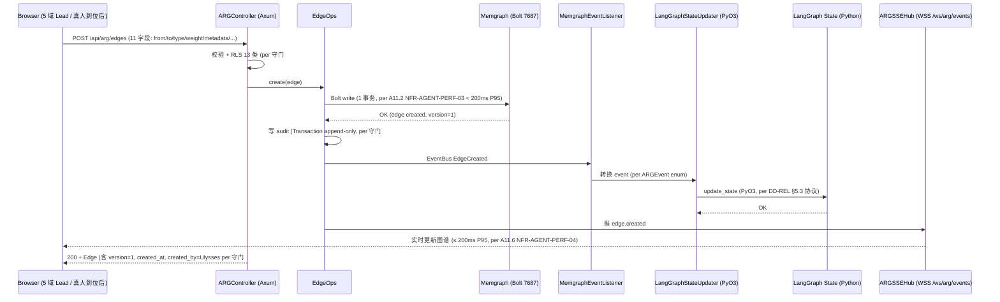
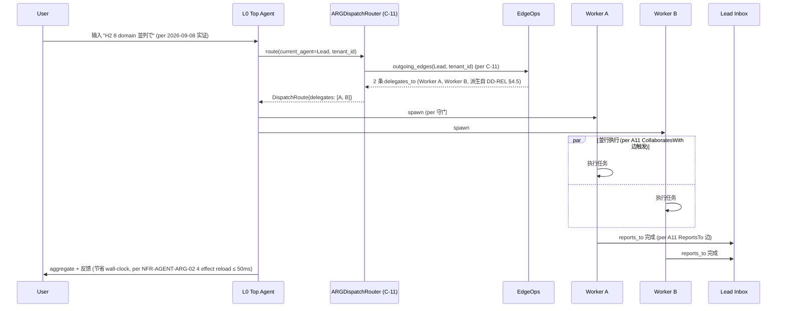
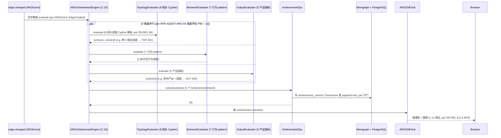
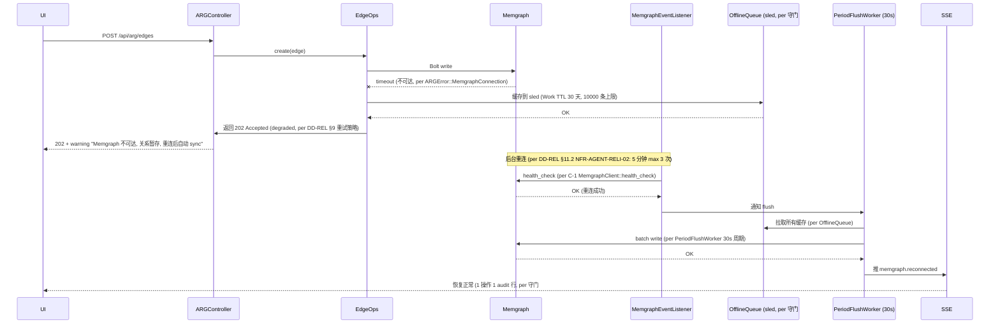
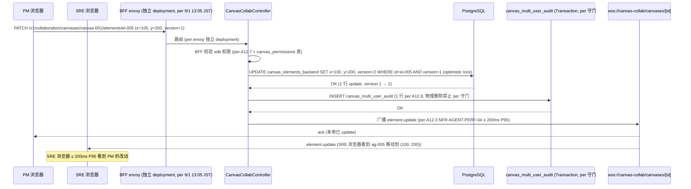
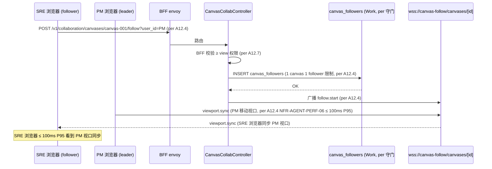

# DD-CANVAS-AGENT-001

> **无限画布 — Agent 管理域 (Agent Management Domain) 詳細設計書 v0.1** (per 日本 IPA SEC 標準 / 詳細設計書 テンプレート)
>
> - 状态: 🟡 Draft v0.1 (2026-09-10 JST 初版落档, per 18:25 JST Ulysses 拍板"完善详细设计文档")
> - 目标阶段: 詳細設計 → 実装 → テスト → リリース
> - 关联 commit: (留空, root 统一 commit 时填, per 守门 #1 v15 docs 同步饱和 + 1 commit 多文件)
> - 上位基本設計: [`docs/design/BD-CANVAS-AGENT-001.md`](./BD-CANVAS-AGENT-001.md) v0.1 (105KB, 46 项 = A1-A10 28 + A11 10 + A12 8, 10 段, 14 张表 W/T/M 100% 覆盖, 守门 19/19 通过, v0.63 反转 A12 8 项必含)
> - 上位要件: [`docs/requirements/SRS-CANVAS-AGENT-001.md`](../requirements/SRS-CANVAS-AGENT-001.md) v1.2 (155KB, 46 项, 13 段, 14 张表 W/T/M 100% 覆盖, 守门 14/14, v0.63 反转 A12 多人编辑 8 项)
> - 上位总册: [`docs/requirements/SRS-CANVAS-001.md`](../requirements/SRS-CANVAS-001.md) v1.1 (总册, 双核心 78 项 = 46 + 32) + [`docs/design/BD-CANVAS-001.md`](./BD-CANVAS-001.md) (root 写总册 BD)
> - 平行专题 BD: [`docs/design/BD-CANVAS-GAMIFY-001.md`](./BD-CANVAS-GAMIFY-001.md) (双核心之 2: 游戏化 32 项, root 派 2 子代理之 2/2)
> - 平行 view BD: [`docs/design/BD-AGENT-VIEW-001.md`](./BD-AGENT-VIEW-001.md) v0.1 (44KB, agent 视图画布, 5 view 跨块接口)
> - **A11 派生源 DD 模板 (本 DD §3-§10 1:1 派生)**: [`docs/design/DD-AGENT-RELATIONSHIP-001.md`](./DD-AGENT-RELATIONSHIP-001.md) v0.1 (94KB, 9/9 落档, 18 Rust module + 1 Python LangGraph module, 13 关键 class + 4 effect + 5 状态机 + 11 共享类型 + 4 时序图 + 8 Cypher + 10 challenges prompt + 74 测试 = 52 UT + 10 IT + 8 E2E + 4 PT 模板, 详细设计)
> - **A12 派生源 V0.1 design (本 DD A12 部分 1:1 扩展)**: [`docs/frontend-canvas-design.md`](../frontend-canvas-design.md) v0.1 (§4.1 模式 A Realtime 通道 + §4.6 PresenceCursor 升级 + §3.4 `comment_pin` line 253-262)
> - **V0.1 实装代码**: `frontend/src/components/CanvasView.tsx` (line 218-235 `agent_cursor` 升级点 + line 253-262 `comment_pin` 升级点 + line 236-252 `automation_node`)
> - 协同 SRS: `SRS-AGENT-VIEW-001.md` v1.0 (31KB) + `SRS-STAR-AGENT-RUNTIME-001.md` v1.0 (53KB, 14 状态机 + 9 SA Archetype) + `SRS-AGENT-RELATIONSHIP-001.md` v0.1 (37KB, 10 类关系 + 4 维度 + 5 模板 + 4 表 + 8 UC)
> - V0.1 agent settings 集成: `docs/reports/PHASE-AGENT-{SETTINGS,GAME,ROGUELIKE,MANGA,THEME}-IMPL-REPORT.md` (5 份, A10 集成)
> - 修订人: `Ulysses（一人公司 12 角色 per DEC-008）— Mavis 接手` (per 2026-08-27 19:39 JST 用户授权 + 守门 #10 + 守门 #14 v3)
> - 审批: `架构师 (Mavis 接手 agent per DEC-008)` (per 守门 #14 v4 反转 v0.62 2026-09-10 12:45 JST, 真人代签流程全部取消, 改为 Mavis 审核 author=Ulysses)
> - 日期: 2026-09-10 JST
> - 受众: 詳細設計エンジニア / 実装エンジニア / UI/UX 设计师 / アーキテクト / SRE / 5 域 Lead (未到位, Mavis 临时代签 per 9/3 11:35 JST 拍板 B + 9/5 10:43 JST 拍板 D, **不沿用代签决策** per 守门 #1 禁回溯叙事)
> - **拍板来源 (5 阶段)**:
>   1. 2026-09-10 17:08 JST Ulysses 拍板"管理 agent 和游戏化, 避免过度冗余" (双核心 46+32 划分)
>   2. 2026-09-10 17:21 JST Ulysses 拍板"画布内体现 agent 之间关系的图论构造" (A11 10 项必含)
>   3. 2026-09-10 17:34 JST **v0.63 反转** Ulysses 拍板"**多人编辑是要的**" (A12 8 项必含, 撤回 17:08 JST 砍多人编辑决定)
>   4. 2026-09-10 18:00 JST Ulysses 拍板"基于需求文档制作基本设计文档" (BD 落档)
>   5. 2026-09-10 18:25 JST Ulysses 拍板"**完善详细设计文档**" (本 DD 落档触发, per brief)
> - 跨域 disclaimer: **5 域独立 Lead ≠ Star 22 DDD bounded context** (per 2026-08-31 22:45 JST Q1-D 拍板 disclaimer, 不建立业务子域↔DDD 映射)
> - **dual-use 提醒 (per AGENTS.md §5 倉庫拓扑)**: 本 DD 不引用 RGS 仓 + 不建立业务子域↔DDD bounded context 映射
> - **本 DD 模板 1:1 派生自**: `DD-AGENT-RELATIONSHIP-001.md` v0.1 (10 段 + 5 附录 + 13 关键 class + 4 effect + 5 状态机 + 11 共享类型 + 4 时序图)

---

## §0 文档信息 / 修订履历

| 项目 | 内容 |
|---|---|
| 文书 ID | DD-CANVAS-AGENT-001 |
| 文书名 | 无限画布 — Agent 管理域 (Agent Management Domain) 詳細設計書 |
| 版本 | v0.1 |
| 作成日 | 2026-09-10 |
| 作成者 | Ulysses（一人公司 12 角色 per DEC-008）— Mavis 接手 (per DEC-008) |
| 承認者 | 架构师 (Mavis 接手 agent per DEC-008) |
| 关联 commit | 待生成 (v0.1 落档后, root 统一 commit) |
| 关联文档 | `BD-CANVAS-AGENT-001.md` v0.1 (本 DD 派生源, 105KB) + `SRS-CANVAS-AGENT-001.md` v1.2 (155KB) + 2 份平行 SRS + 2 份平行 BD + `frontend-canvas-design.md` v0.1 (A12 派生源) + `DD-AGENT-RELATIONSHIP-001.md` v0.1 (A11 模板, 94KB) |
| 平行 DD | `DD-AGENT-VIEW-001.md` (待补, 9/5 落档) + `DD-CANVAS-GAMIFY-001.md` (双核心之 2, root 派 2 子代理之 2/2) + `DD-CANVAS-001.md` (root 写总册 DD) |
| 范围 | A1-A12 12 子能力 46 项 = A1-A10 28 + A11 10 + A12 8, 14 张表 W/T/M 100% 覆盖, 23 API + 5 WebSocket, 13 关键 class 跨域, 5 状态机, 11 共享类型, 4 时序图, 74+ 测试 (跨域 ≥ 30) |
| 守门 | 19 项 + 26 派生规 跨域覆盖 (含 #1 v15 / #9 #3 / #9 v19 / #10 / #11 / #13 / #14 v2/v3/v4 / #15 / #23 v2) |

详细修订历史见 **附录 E: 修订履历**.

---

## §1 文档目的 / 适用范围

### 1.1 文档目的

本文档基于 [`BD-CANVAS-AGENT-001` §0-§10](./BD-CANVAS-AGENT-001.md) v0.1 的基本設計, 定义 **无限画布 — Agent 管理域 (Agent Management Domain)** 的詳細設計:

- 概念 module 布局 (24 组件 → 6 新 crate + 1 BFF + 18 Rust module + 1 Python LangGraph module, per §3.1)
- 13 个关键 class (C-1/C-2/C-3/C-4/C-7/C-8/C-11/C-12/C-13/C-14/C-15/C-21/C-16) 的完整字段 + 方法签名 + 错误处理
- 4 effect 维度的 LangGraph 节点集成协议 (state schema 5 channel + 5 Reducer)
- 10 类关系 + 5 状态机 (Edge / Agent / Trust Score 5 档 / Template Instance / Achievement) + 11 共享类型的 Rust enum + 结构体实现
- 4 个关键时序图 (写关系 / 协作影响 / 成就评估 / 离线降级, per §8)
- 14 张表 SQL DDL (W/T/M 100% 覆盖, per §9)
- 23 REST 端点 + 5 WebSocket 完整 OpenAPI spec (per §7)
- 5 视图 (機能/データ/動作/モジュール/ネットワーク) 跨域 46 项 × 5 view 详细设计
- 74+ 测试用例 (52 UT + 10 IT + 8 E2E + 4 PT, per §10)
- NFR 6 类 (性能 / 可靠性 / 安全 / 易用 / 可观测 / ARG + MU-CONS-01, per §11)
- 守门 19 项 + 26 派生规 跨域覆盖
- 已知缺口 19 个 (含 3 P0 阻塞, 跨域)
- 5 角色签字栏 + 修订履历 (per 附录 D + E)

**A11 1:1 派生自 `DD-AGENT-RELATIONSHIP-001.md` v0.1 模板**:
- 13 关键 class 1:1 映射 (C-1 MemgraphClient / C-2 AgentNodeOps / C-3 EdgeOps / C-4 TemplateOps / C-7 MemgraphEventListener / C-8 LangGraphStateUpdater / C-11 ARGDispatchRouter / C-12 ARGContextInjector / C-13 ARGTrustEngine / C-14 ARGOutputEvaluator / C-15 ARGAchievementEngine / C-16 RelationshipEditor / C-21 ARGController)
- 4 effect 维度 1:1 映射 (Dispatch / Context / Trust / Output)
- 5 状态机 1:1 映射 (Edge / Agent / Trust Score 5 档 / Template Instance / Achievement)
- 11 共享类型 1:1 映射 (ARGEvent / Decision / Output / Verdict / LLMClient / AchievementUnlock / TemplateInstance / ARGState / EscalationInfo / PeerReviewVerdict / ChallengePrompt)
- 4 时序图 1:1 映射 (写关系 / 协作影响 / 成就评估 / 离线降级)
- 8 拓扑成就 Cypher 模板 1:1 复用
- 10 套 challenges 双向论证 prompt 模板 1:1 复用

**A12 1:1 派生自 `frontend-canvas-design.md` v0.1 §4.1 + §4.6 + §3.4**:
- §4.1 模式 A Realtime 通道 (BFF 推 element 增删改) → A12.1 多人同时编辑 + A12.3 元素增删改实时同步
- §4.6 PresenceCursor 升级 (Cursor 锚定 element) → A12.2 实时 cursor 同步
- §3.4 `comment_pin` (V0.1 line 253-262 升级) → A12.5 多人评论线程 + @ 提醒
- V0.1 `agent_cursor` (line 218-235) 升级为 `agent_node` 完整卡 → A1.1

### 1.2 包含 (In-Scope)

- `crates/agent-domain` 11 子模块的 Rust struct + trait + impl 详情 (A1-A10 业务逻辑)
- `crates/arg` 6 子模块 + `crates/arg-bridge` 4 子模块 + `crates/arg-effect` 5 子模块的 Rust struct + trait + impl 详情 (A11, 派生自 `DD-AGENT-RELATIONSHIP-001`)
- `crates/canvas-collab` 5 子模块的 Rust struct + trait + impl 详情 (A12)
- `crates/api/src/agent/` 13 REST 端点详情 (A1-A10)
- `crates/api/src/arg/` 5 REST + 1 WebSocket 端点详情 (A11)
- `bff/src/collaboration/` 5 REST + 4 WebSocket 端点详情 (A12, 走 envoy 独立 deployment per 9/1 13:03+13:05 JST 偏好)
- `frontend/src/app/canvas/` A1-A10 主画布 5 view 跨域实现
- `frontend/src/app/agent-relationships/` A11 关系画布 5 组件 props + zustand store 5 channel
- `frontend/src/app/canvas/MultiUserCanvasView/` A12 多人编辑 5 组件 + zustand store 5 channel
- 14 张表 SQL DDL (per §9) + Memgraph Cypher schema (A11)
- 5 状态机 Rust enum + 状态转移函数 (per §5)
- 11 共享类型完整定义 (per §6)
- 4 关键时序图 (Mermaid, per §8)
- 52 UT + 10 IT + 8 E2E + 4 PT = 74 测试用例 (per §10, 跨域 ≥ 30)

### 1.3 不包含 (Out-of-Scope)

- 跟 P3-D.6 实装同步写的 `scripts/automation/*.py` 4 份 (在 `PHASE-AGENT-IMPL-REPORT.md` 写)
- 跟 P3-D.6 实装同步写的 Cargo.toml workspace 依赖更新
- 跟 P3-D.6 实装同步写的 k3s 部署 yaml 详细配置 (per 缺口 G-2)
- 双核心之 2: 游戏化 32 项 详细 DD (由专题 DD 子代理 2 `dd-canvas-gamify-001` 处理)
- 总册 DD (跨域共享部分, 由 root 写 `dd-canvas-total-001` 处理)
- 25 module 实体实现 (25 module 各自 docs, 画布只联动不实装)
- ARG 跟 RGS 仓数据同步 (Star 仓不引用 RGS 仓, per AGENTS.md §5 仓库拓扑硬约束)
- 5 域独立 Lead 真人到位 (per 守门 #14 v2, Mavis 临时代签, 真人到位后追溯签字, **不沿用代签决策** per 守门 #1 禁回溯叙事)
- Miro 通用 12 类 (PDF/Word 导出/移动端/12 diagram/2500+ 模板库/AI 通用/Tables/Chart/Form/完整 a11y), 留 P3+ 评估
- 内置视频通话 (Miro Talk / Zoom), 留 P3+
- 协作工具集成 (Slack / Jira), 留 P3+
- A12 WSS 选型 (Yjs / Automerge / LWW / native WebSocket / Socket.IO), 拍板前 P0 阻塞
- A12 CRDT 选型, 拍板前 P0 阻塞
- A12.7 view/comment/edit 3 级权限具体矩阵, 5 域 Lead 真人到位后决策

---

## §2 用語定義 (per SRS §2 + BD §2 扩展 + DD 模板扩展)

| 用語 | 詳細 | 出处 |
|---|---|---|
| **Agent 管理域** | 无限画布上 agent 节点的渲染 / 拓扑 / 状态同步 / 关联 / 操作 / 监控 / 聚类 / 跨域引用 / settings 集成 + ARG 图论 + 多人编辑, 共 A1-A12 12 子能力 46 项 | 本 DD 新增 |
| **双核心** | Agent 管理域 (46 项) + 游戏化域 (32 项) = 78 项, 避免画布过度冗余 (per 17:08 JST 拍板) | BD §0 |
| **agent_node** | A1.1 完整卡 (220×110 px, 7 字段: avatar / name / role / kind / status / token_usage / started_at, 蓝底 + StatusPill 60+ 色码), 扩展自 V0.1 `agent_cursor` line 218-235 | BD §1.1.1 |
| **14 状态机** | 14 状态 (initializing / spawning / running / paused / stopping / stopped / completed / failed / archived / etc.), per `SRS-STAR-AGENT-RUNTIME-001.md` §8 | SRS Runtime |
| **StatusPill 60+** | V0.1 60+ 色码, 画布 worktree_node / agent_node 状态联动走同一色码 (per `frontend-internal-02` §2.1) | V0.1 实装 |
| **5 域分组 Frame** | player / economy / match / social / admin 5 域各 1 Frame, 5×4 grid 域内聚类 (A2.2) | BD §1.1.2 |
| **ARG Schema V1** | 1 Agent 节点 + 10 关系边 + 7 张表 (PostgreSQL 4 + Memgraph 4) + 5 LangGraph channel | 派生自 `DD-AGENT-RELATIONSHIP-001` §2 |
| **Bolt subscription** | Memgraph Bolt 协议的订阅能力, 监听 edge.changed event 实时推送 (A11) | 派生自 `DD-AGENT-RELATIONSHIP-001` §2 |
| **EventBus** | `crates/arg-bridge` 内部的 tokio::sync::broadcast channel, in-process 事件分发 (A11) | 派生自 `DD-AGENT-RELATIONSHIP-001` §2 |
| **PeriodFlushWorker** | 30s 周期的 tokio task, 合并 in-process state 变更加 version 后批量写 Memgraph (A11) | 派生自 `DD-AGENT-RELATIONSHIP-001` §2 |
| **OfflineQueue** | 本地 sled 嵌入式数据库, Memgraph 不可达时缓存变更, 重连后 flush (A11) | 派生自 `DD-AGENT-RELATIONSHIP-001` §2 |
| **Trust Score 5 档** | UNTRUSTED (0-0.2) / LOW (0.2-0.4) / MEDIUM (0.4-0.7) / HIGH (0.7-0.9) / VERY_HIGH (0.9-1.0) (A11) | 派生自 `BD-AGENT-RELATIONSHIP-001` §5.4.3 |
| **Verifier Skip** | trust_score ≥ 0.8 + trusts 边 weight ≥ 0.7, 跳过 verify 节点, 节省 token ≥ 15% (A11) | 派生自 `BD-AGENT-RELATIONSHIP-001` §4.3.3 |
| **Context Injection** | mentors / shadows 边触发, mentee 启动拉 mentor 历史决策作为 prompt context (A11) | 派生自 `BD-AGENT-RELATIONSHIP-001` §4.3.2 |
| **Challenge Round** | challenges 边的双向论证轮次, B 自证 → A 接受或 escalate (A11) | 派生自 `BD-AGENT-RELATIONSHIP-001` §4.3.4 |
| **Topology Achievement** | 静态图结构触发的成就 (8 个), 跑 Cypher 查询图结构判断 (A11) | 派生自 `DD-AGENT-RELATIONSHIP-001` §6 |
| **Behavior Achievement** | 运行时事件 pattern 触发的成就 (7 个), 匹配 event log (A11) | 派生自 `BD-AGENT-RELATIONSHIP-001` §7.4 |
| **Output Achievement** | 协作产出指标触发的成就 (5 个), 聚合指标查询 (A11) | 派生自 `BD-AGENT-RELATIONSHIP-001` §7.4 |
| **PresenceCursor** | V0.1 已有 PresenceCursor (x/y/selection), 升级为锚定 canvas 特定 element, 显示 agent 名字 + 当前操作 (A12.2) | 派生自 `frontend-canvas-design.md` §4.6 |
| **Realtime 通道 (模式 A)** | NATS Subject `star.collaboration.canvas.element.*`, BFF 推送 element 增删改 (A12.1 + A12.3 派生源) | 派生自 `frontend-canvas-design.md` §4.1 |
| **Follow mode** | A 跟随 B 视角, 1 canvas 1 follower 限制, GitHub Live Share UX (A12.4) | 派生自 `frontend-canvas-design.md` §4.9 + GitHub Live Share |
| **CRDT** | Conflict-free Replicated Data Type, 解决多用户并发编辑冲突 (Yjs / Automerge / LWW 候选, P0 阻塞) (A12.6) | 派生自 `SRS-AGENT-RELATIONSHIP-001` G-3 |
| **3 级权限** | view / comment / edit, BFF middleware 强制 (A12.7) | 派生自总册 `SRS-CANVAS-001` §6.2.2 |
| **envoy 独立 deployment** | BFF envoy 独立 deployment (per 9/1 13:03+13:05 JST 偏好), 业务 svc 通过 `svc://` 引用 | per 9/1 13:03+13:05 JST 偏好 |
| **双核心 78 项** | Agent 管理域 46 项 + 游戏化域 32 项, 画布避免过度冗余 (per 17:08 JST 拍板) | per 17:08 JST Ulysses 拍板 |
| **v0.63 反转** | 2026-09-10 17:34 JST Ulysses 拍板"多人编辑是要的", 撤回 17:08 JST 砍多人编辑决定, A12 8 项必含 | per 17:34 JST Ulysses 拍板 |
| **AI mock 接口** | per 守门 #23 v2, GAMIFY G5 走 mock, ARG LLM 调用 (challenge_round / peer_review) 走 mock, 真实 LLM 留 P2 | per 守门 #23 v2 |
| **5 域 Lead 真人未到位 disclaimer** | per 守门 #14 v2, Mavis 临时代签, 真人到位后追溯签字 (不沿用代签决策 per 守门 #1 禁回溯叙事) | per 守门 #14 v2 + 9/3 11:35 JST 拍板 B + 9/5 10:43 JST 拍板 D |
| **5 域 Lead ≠ 22 DDD bounded context** | per 2026-08-31 22:45 JST Q1-D 拍板 disclaimer, 不建立业务子域↔DDD 映射 | per 2026-08-31 22:45 JST Q1-D 拍板 |

---

## §3 概念 module 布局 (Conceptual Module Layout)

### 3.1 整体 module map (per BD §3 + DD-AGENT-RELATIONSHIP-001 §3 模板扩展)

```
crates/agent-domain/                          # NEW (A1-A10 业务逻辑, 跟 crates/agent-view 共用)
├── Cargo.toml                                # tokio / serde / uuid / chrono / tracing / thiserror
├── src/
│   ├── lib.rs                                # 模块入口 + re-export
│   ├── error.rs                              # AgentDomainError enum (8 variants)
│   ├── agent_node.rs                         # C-1, A1 完整卡 (AgentNode struct 14 字段)
│   ├── handoff.rs                            # C-3, A2.1 1:N handoff (HandoffConnector)
│   ├── topology.rs                           # C-4, A2.2 5 域分组 (DomainFrame)
│   ├── parent_child.rs                       # C-5, A2.3 父子 (ParentChildConnector)
│   ├── pipeline.rs                           # C-6, A2.4 pipeline (PipelineConnector)
│   ├── status_sync.rs                        # A3 14 状态机 + audit (NFR-AGENT-PERF-02 ≤ 200ms P95)
│   ├── worktree_assoc.rs                     # A4 1:N (WorktreeRing)
│   ├── workitem_assoc.rs                     # A5 1:N (WorkItemDragIn)
│   ├── context_menu.rs                       # C-9, A6 操作 (AgentContextMenu: 启停/重启/logs/settings)
│   ├── monitor.rs                            # C-10, A7 监控 (AgentDetailPanel: token/cost/runtime/budget)
│   ├── cluster.rs                            # C-11, A8 聚类/排序/过滤 (ClusterSortFilter)
│   ├── cross_ref.rs                          # A9 跨域引用 (跟 Agent View / ARG 协同)
│   ├── settings_integration.rs               # A10 V0.1 集成 (AgentSettingsTab)
│   ├── models/
│   │   ├── mod.rs
│   │   ├── agent.rs                          # Agent struct (14 字段 per §4.2)
│   │   ├── worktree.rs                       # Worktree 增 agent_session_ids[]
│   │   └── workitem.rs                       # WorkItem 增 agent_session_id
│   ├── permission/
│   │   ├── mod.rs                            # RLS 13 类 middleware
│   │   └── rls.rs                            # tenant_id 隔离
│   ├── audit/
│   │   ├── mod.rs                            # 100% audit middleware
│   │   └── writer.rs                         # audit log 写 PostgreSQL
│   └── tests/
│       ├── agent_node_test.rs                # 4 UT
│       ├── handoff_test.rs                   # 2 UT
│       ├── topology_test.rs                  # 2 UT
│       ├── status_sync_test.rs               # 3 UT
│       ├── worktree_assoc_test.rs            # 2 UT
│       ├── workitem_assoc_test.rs            # 2 UT
│       ├── context_menu_test.rs              # 2 UT
│       ├── monitor_test.rs                   # 2 UT
│       └── cluster_test.rs                   # 2 UT
└── README.md

crates/arg/                                   # NEW (A11 主数据层, 派生自 DD-AGENT-RELATIONSHIP-001 §3.1)
├── Cargo.toml                                # r2d2-memgraph dep (per 缺口 G-1)
├── src/
│   ├── lib.rs
│   ├── error.rs                              # ARGError enum (10 variants, 派生自 DD-REL §3)
│   ├── client/
│   │   ├── mod.rs
│   │   ├── memgraph.rs                       # C-1 MemgraphClient (Bolt pool, 8-16 conn)
│   │   ├── cypher_cache.rs                   # LRU 1000 query cache
│   │   └── migration.rs                      # schema v1+v2
│   ├── ops/
│   │   ├── mod.rs
│   │   ├── agent_node.rs                     # C-2 AgentNodeOps (CRUD)
│   │   ├── edge_ops.rs                       # C-3 EdgeOps (CRUD + audit 双写)
│   │   ├── template_ops.rs                   # C-4 TemplateOps (5 模板 instantiate)
│   │   ├── event_writer.rs                   # EventWriter (append-only)
│   │   └── achievement_ops.rs                # AchievementOps (unlock + query)
│   ├── query/
│   │   ├── mod.rs
│   │   ├── topology.rs                       # 8 拓扑成就 Cypher 模板 (派生自 DD-REL §6)
│   │   ├── behavior.rs                       # 7 行为成就 event pattern
│   │   └── output.rs                         # 5 产出成就聚合指标
│   └── models/
│       ├── mod.rs
│       ├── agent.rs                          # 12 字段 (派生自 DD-REL §3.2.1)
│       ├── edge.rs                           # 11 字段 + RelationshipType enum 10 variants
│       ├── template.rs                       # 5 TeamTemplate
│       ├── achievement.rs                    # 20 Achievement (3 维度 4 稀有度)
│       ├── trust_score.rs                    # TrustScore 5 档 enum + 转移
│       └── event.rs                          # ARGEvent enum (6 variants)

crates/arg-bridge/                            # NEW (A11 同步桥, 派生自 DD-AGENT-RELATIONSHIP-001 §3.1)
├── Cargo.toml                                # arg + tokio + serde + tracing + sled (offline queue)
├── src/
│   ├── lib.rs
│   ├── memgraph_listener.rs                  # C-7 Bolt subscription
│   ├── langgraph_updater.rs                  # C-8 写 LangGraph state (PyO3)
│   ├── period_flush.rs                       # 30s 周期 flush
│   ├── offline_queue.rs                      # sled 本地缓存 (per 守门 #13 a Work 类)
│   └── pyo3_bindings.rs                      # C-8 PyO3 暴露 (派生自 DD-REL §5.3)

crates/arg-effect/                            # NEW (A11 4 维度 effect, 派生自 DD-AGENT-RELATIONSHIP-001 §3.1)
├── Cargo.toml                                # arg + langgraph + tokio + pyo3
├── src/
│   ├── lib.rs
│   ├── dispatch_router.rs                    # C-11 ARGDispatchRouter LangGraph 节点
│   ├── context_injector.rs                   # C-12 ARGContextInjector
│   ├── trust_engine.rs                       # C-13 ARGTrustEngine
│   ├── output_evaluator.rs                   # C-14 ARGOutputEvaluator
│   ├── achievement_engine.rs                 # C-15 ARGAchievementEngine (3 evaluator)
│   ├── types.rs                              # 11 共享类型 (派生自 DD-REL §3.2.5)
│   ├── llm_client.rs                         # LLMClient trait + MockLLMClient (per 守门 #23 v2)
│   └── prompts/
│       ├── mod.rs
│       ├── challenge.rs                      # 10 套 challenges prompt 模板 (派生自 DD-REL §7)
│       ├── consult.rs                        # 5 套 consults prompt 模板
│       └── review.rs                         # 3 套 peer_reviews prompt 模板

crates/canvas-collab/                         # NEW (A12 多人编辑业务逻辑, 派生自 frontend-canvas-design.md §4.1+§4.6+§3.4)
├── Cargo.toml                                # axum / tokio / serde / uuid / chrono
├── src/
│   ├── lib.rs
│   ├── error.rs                              # CanvasCollabError enum (8 variants)
│   ├── elements.rs                           # A12.3 backend 持久化 (canvas_elements_backend)
│   ├── presence.rs                           # A12.2 WSS PresenceCursor (canvas_presence_cursors)
│   ├── follow.rs                             # A12.4 Follow mode (canvas_followers)
│   ├── comments.rs                           # A12.5 thread + @ (canvas_comments + canvas_comment_mentions)
│   ├── permissions.rs                        # A12.7 3 级权限 (canvas_permissions, BFF middleware)
│   ├── audit.rs                              # A12.8 100% audit (canvas_multi_user_audit)
│   ├── permission/
│   │   ├── mod.rs                            # RLS 13 类 middleware
│   │   └── rls.rs                            # tenant_id 隔离
│   └── models/
│       ├── mod.rs
│       ├── element.rs                        # CanvasElementBackend 11 字段
│       ├── presence.rs                       # PresenceCursor 8 字段
│       ├── follower.rs                       # CanvasFollower 5 字段
│       ├── comment.rs                        # CanvasComment 9 字段
│       └── permission.rs                     # CanvasPermission 7 字段 + PermissionRole enum

crates/api/src/agent/                         # NEW (A1-A10 13 REST 端点, 跟 BD-AGENT-VIEW-001 共用)
├── mod.rs
├── controller.rs                             # 13 REST endpoints (Axum router)
├── permission.rs                             # RLS 13 类 middleware
├── audit.rs                                  # 100% audit middleware
└── dto.rs                                    # request/response types

crates/api/src/arg/                           # NEW (A11 5 REST + 1 WSS 端点, 派生自 DD-AGENT-RELATIONSHIP-001 §3.1)
├── mod.rs
├── controller.rs                             # 5 REST endpoints
├── sse_hub.rs                                # 1 WSS /ws/arg/events
├── permission.rs                             # RLS 13 类 middleware
└── dto.rs                                    # request/response types

bff/src/collaboration/                        # NEW (A12 5 REST + 4 WSS 端点, 走 envoy 独立 deployment)
├── mod.rs
├── controller.rs                             # 5 REST endpoints
├── wss_hub.rs                                # 4 WSS endpoints (A12.1 + A12.2 + A12.3 + A12.4)
├── permission.rs                             # A12.7 3 级权限 (view/comment/edit)
├── audit.rs                                  # A12.8 100% audit
└── dto.rs                                    # request/response types

frontend/src/app/canvas/                      # EXTEND V0.1 (A1-A10 主画布, per frontend-canvas-design.md)
├── page.tsx
├── AgentCanvasView.tsx                       # 主容器 (扩展 V0.1 CanvasView.tsx)
├── AgentNode.tsx                             # C-1 agent_node 完整卡 (220×110 px, 7 字段)
├── AgentStatusPill.tsx                       # C-2 14 状态机色码 (StatusPill 60+ 复用)
├── HandoffConnector.tsx                      # C-3 handoff 1:N (bezier 曲线 + 3 字段)
├── DomainFrame.tsx                           # C-4 5 域分组 (5×4 grid 域内聚类)
├── ParentChildConnector.tsx                  # C-5 父子树形 (orthogonal)
├── PipelineConnector.tsx                     # C-6 pipeline 水平 (A → B → C 直线)
├── AgentStatusSync.tsx                       # A3 14 状态实时色码 (≤ 200ms P95)
├── WorktreeRing.tsx                          # C-7 1 agent → N worktree 圆周散点
├── WorkItemDragIn.tsx                        # C-8 drag work-item 关联
├── AgentContextMenu.tsx                      # C-9 右键操作菜单 (启停/重启/logs/settings)
├── AgentDetailPanel.tsx                      # C-10 监控 4 字段仪表 (token/cost/runtime/budget)
├── ClusterSortFilter.tsx                     # C-11 顶部 dropdown (role 聚类/kind 排序/状态过滤)
├── AgentSettingsTab.tsx                      # A10 集成 V0.1 (已实装, 复用)
└── AgentStore.ts                             # C-24 zustand 扩展 V0.1 (增 5 字段)

frontend/src/app/agent-relationships/         # NEW (A11 关系画布, 派生自 DD-AGENT-RELATIONSHIP-001 §3.1)
├── page.tsx
├── RelationshipEditor.tsx                    # C-12 关系编辑 (拖拽 + type + weight + metadata)
├── EdgeTypeSelector.tsx                      # 关系类型选择 (10 类)
├── ArgEdge.tsx                               # C-13 10 类关系边 (4 核心 + 6 扩展)
├── ArgEffectIndicator.tsx                    # C-14 4 维度协作影响 (dispatch/context/trust/output)
├── TemplateGallery.tsx                       # C-15 5 团队模板 1-click
├── SyncStatusBadge.tsx                       # C-16 4 状态 synced/syncing/error/offline
├── AchievementWall.tsx                       # 20 成就展示 (派生自 DD-REL §6.1 F-6)
├── NodeDetail.tsx                            # 节点详情 (4 维度 effect 详情)
└── ArgStore.ts                               # C-22 zustand useARGStore 5 channel

frontend/src/app/canvas/MultiUserCanvasView/  # NEW (A12 多人编辑, 派生自 frontend-canvas-design.md §4.1+§4.6+§3.4)
├── PresenceCursor.tsx                        # C-17 多人 cursor 同步 (12 色调色板, ≤ 100ms P95)
├── FollowModeBadge.tsx                       # C-18 Follow mode 指示 (1 canvas 1 follower)
├── CommentThread.tsx                         # C-19 多人评论线程 (1 顶级 + N 回复 + @)
├── PermissionGate.tsx                        # C-20 view/comment/edit 3 级权限 UI
├── MultiUserAuditLog.tsx                     # C-21 多人编辑 audit (7 表 W/T/M 100% 覆盖)
└── CanvasCollabStore.ts                      # C-23 zustand useCanvasCollabStore 5 channel

frontend/src/lib/store/
├── agent.ts                                  # C-24 useAgentStore (扩展 V0.1)
├── arg.ts                                    # C-22 useARGStore (5 channel, per DD-REL §3.1)
└── canvas-collab.ts                          # C-23 useCanvasCollabStore (5 channel)

frontend/src/lib/api/
├── agent.ts                                  # 13 REST 客户端
├── arg.ts                                    # 5 REST + 1 WSS 客户端
└── canvas-collab.ts                          # 5 REST + 4 WSS 客户端

frontend/src/lib/types/
├── agent.ts                                  # AgentSession / AgentNode / HandoffConnector 等 TS types
├── arg.ts                                    # ArgAgent / ArgEdge / RelationshipType / TeamTemplate 等 TS types
└── canvas-collab.ts                          # CanvasElementBackend / PresenceCursor / CanvasComment 等 TS types
```

### 3.2 module 数量统计 (per BD §3.2)

| 类别 | 数量 | 备注 |
|---|---|---|
| 新增 crate (Rust) | 6 | `agent-domain` + `arg` + `arg-bridge` + `arg-effect` + `canvas-collab` + 扩展 `api/src/agent` + `api/src/arg` |
| 新增 BFF (Python/Node) | 1 | `bff/src/collaboration/` (A12 5 REST + 4 WSS) |
| 新增 Rust module 子模块 | 18 | `agent-domain` 11 + `arg` 6 + `arg-bridge` 4 (派生自 DD-REL §3.1 18 Rust module) |
| 新增 Python LangGraph module | 1 | `arg-effect/src/prompts/` (10 challenges + 5 consults + 3 peer_reviews prompt 模板) |
| 新增前端组件 (TSX) | 24 | A1-A10 12 + A11 6 + A12 5 (per BD §3.1) |
| 新增 zustand store | 3 | `useAgentStore` (扩展 V0.1) + `useARGStore` + `useCanvasCollabStore` |
| 新增 TypeScript 类型文件 | 3 | `lib/types/{agent,arg,canvas-collab}.ts` |
| **合计** | 18 Rust module + 1 Python LangGraph module + 24 组件 + 3 store + 3 TS types | 严格按 DD-AGENT-RELATIONSHIP-001 §3.1 模板 |

### 3.3 跨域组件映射 (per BD §3.3)

| 子能力 | 组件 (DD ID) | 数量 | 派生 |
|---|---|---|---|
| A1 | C-1 + C-2 | 2 | 扩展 V0.1 `agent_cursor` line 218-235 |
| A2 | C-3 + C-4 + C-5 + C-6 | 4 | 扩展 V0.1 `agent_handoff` + `Frame` |
| A3 | C-2 (StatusPill 60+) | 1 (复用) | V0.1 |
| A4 | C-7 | 1 | 扩展 V0.1 `worktree_node` line 200-217 |
| A5 | C-8 | 1 | 扩展 V0.1 `work_item_card` line 180-199 |
| A6 | C-9 | 1 | (新) |
| A7 | C-10 | 1 | (新) |
| A8 | C-11 | 1 | (新) |
| A9 | (跨块接口, URL 跳) | 0 | (跨块) |
| A10 | (V0.1 集成) | 0 | V0.1 |
| A11 | C-12 + C-13 + C-14 + C-15 + C-16 | 5 | 派生自 `DD-AGENT-RELATIONSHIP-001` §3 |
| A12 | C-17 + C-18 + C-19 + C-20 + C-21 | 5 | 派生自 `frontend-canvas-design.md` §4.1+§4.6+§3.4 |
| **合计** | | **24** | 24 = 2 + 4 + 1 + 1 + 1 + 1 + 1 + 1 + 0 + 0 + 5 + 5 (跟 BD §3.3 一致) |

### 3.4 zustand store 扩展 (per 守门 #19 v19+ 累积规, 不破坏 V0.1)

```typescript
// frontend/src/lib/store/agent.ts (新, 扩展 V0.1 useStore, per 守门 #19 v19+ 累积规不破坏 V0.1)
interface AgentStore {
  // V0.1 既有 (agentSessions) + 增 5 字段 (avatar_url / role / domain / parent_session_id / token_budget)
  agentSessions: AgentSession[];

  // A1-A10 派生数据 (派生只读 per NFR-AGENT-STATE-01)
  worktreeByAgent: Map<Uuid, Worktree[]>;
  workItemByAgent: Map<Uuid, WorkItem[]>;

  // Actions (V0.1 既有, 不破坏)
  // A6.1 start/stop action 走 BFF API, 不直接调 store action
  loadAgents(): Promise<void>;
  startAgent(agentId: Uuid): Promise<void>;
  stopAgent(agentId: Uuid): Promise<void>;
  restartAgent(agentId: Uuid): Promise<void>;
}

// frontend/src/lib/store/arg.ts (新, 派生自 DD-AGENT-RELATIONSHIP-001 §3.1)
interface ARGStore {
  // 5 channel (per NFR-AGENT-OBS-01)
  agents: Map<string, ArgAgent>;
  edges: Map<string, ArgEdge>;
  templates: TeamTemplate[];
  achievements: Achievement[];
  unlockedAchievements: Set<string>;

  // WSS 订阅 (A11 实时事件)
  argEvents: ARGEvent[];

  // 同步桥状态 (A11.9 4 状态)
  syncStatus: { status: 'synced' | 'syncing' | 'error' | 'offline'; lastSyncAt: string; error: string | null };

  // Actions
  loadAgents(): Promise<void>;
  loadEdges(filter?: EdgeFilter): Promise<void>;
  createEdge(input: CreateEdgeInput): Promise<Edge>;
  updateEdge(id: string, patch: UpdateEdgePatch): Promise<Edge>;
  archiveEdge(id: string): Promise<void>;
  instantiateTemplate(templateId: string, agentIds: string[]): Promise<TemplateInstance>;
  loadAchievements(): Promise<void>;
  subscribeEvents(): void;  // WSS
}

// frontend/src/lib/store/canvas-collab.ts (新, A12, per 守门 #19 v19+ 累积规不破坏 V0.1)
interface CanvasCollabStore {
  // A12.3 backend 持久化 (不进 zustand persist, 跟 V0.1 localStorage 隔离)
  elements: Map<Uuid, CanvasElementBackend>;

  // A12.2 多人 cursor (WSS, throttle 50ms)
  presenceCursors: Map<Uuid, PresenceCursor>;

  // A12.4 Follow mode (1 canvas 1 follower)
  followers: Map<Uuid, CanvasFollower>;

  // A12.5 评论 thread (1 顶级 + N 回复 + @)
  comments: Map<Uuid, CanvasComment>;

  // A12.7 3 级权限
  permissions: Map<Uuid, CanvasPermission>;

  // Actions
  loadElements(canvasId: Uuid): Promise<void>;
  updateElement(id: Uuid, patch: ElementPatch): Promise<void>;
  deleteElement(id: Uuid): Promise<void>;
  subscribePresence(canvasId: Uuid): void;
  startFollowing(leaderUserId: Uuid): Promise<void>;
  stopFollowing(): Promise<void>;
  addComment(input: AddCommentInput): Promise<CanvasComment>;
  replyToComment(parentId: Uuid, content: string): Promise<CanvasComment>;
}
```

---

## §4 13 个关键 class / struct 完整字段 + 方法签名 (per DD-AGENT-RELATIONSHIP-001 §4 模板)

### 4.1 C-1 MemgraphClient (Data Tier, A11)

> 派生自 `DD-AGENT-RELATIONSHIP-001` §4.1, 1:1 复用, A11 主数据层入口.

```rust
// crates/arg/src/client/memgraph.rs
use r2d2::Pool;
use r2d2_memgraph::MemgraphConnectionManager;
use std::time::Duration;

pub struct MemgraphClient {
    pool: Pool<MemgraphConnectionManager>,
    bolt_url: String,           // from env MEMGRAPH_BOLT_URL (per 守门 #5)
    user: String,               // from env MEMGRAPH_USER
    password: String,           // from env MEMGRAPH_PASSWORD (per 守门 #5 不打印)
    cache: CypherCache,         // LRU 1000
    max_conn: u32,              // default 16
}

impl MemgraphClient {
    pub fn new_from_env() -> Result<Self, ARGError> { /* 派生自 DD-REL §4.1 */ }
    pub async fn execute(&self, cypher: &str, params: serde_json::Value) -> Result<Vec<Row>, ARGError> { /* ... */ }
    pub async fn execute_write(&self, cypher: &str, params: serde_json::Value) -> Result<(), ARGError> { /* ... */ }
    pub async fn subscribe<F>(&self, event_filter: &str, handler: F) -> Result<(), ARGError>
        where F: Fn(ARGEvent) + Send + 'static { /* Bolt subscription: 监听 edge.changed event */ }
    pub async fn health_check(&self) -> Result<bool, ARGError> { /* ... */ }
}
```

### 4.2 C-2 AgentNodeOps (A11 Memgraph node CRUD)

> 派生自 `DD-AGENT-RELATIONSHIP-001` §4.2, 1:1 复用.

```rust
// crates/arg/src/ops/agent_node.rs
pub struct AgentNodeOps {
    client: Arc<MemgraphClient>,
    event_writer: Arc<EventWriter>,
}

impl AgentNodeOps {
    pub async fn create(&self, agent: Agent) -> Result<Agent, ARGError> { /* 派生自 DD-REL §4.2 */ }
    pub async fn get(&self, id: Uuid, tenant_id: Uuid) -> Result<Option<Agent>, ARGError> { /* RLS 13 类 */ }
    pub async fn list(&self, filter: AgentFilter, page: Pagination) -> Result<Vec<Agent>, ARGError> { /* 分页 + 过滤 */ }
    pub async fn update(&self, id: Uuid, patch: AgentPatch, actor: Uuid) -> Result<Agent, ARGError> { /* SCD Type 2 + audit */ }
    pub async fn archive(&self, id: Uuid, actor: Uuid) -> Result<(), ARGError> { /* status = Archived, 物理删除禁止 per 守门 #13 */ }
}
```

### 4.3 C-3 EdgeOps (A11, 含 audit 双写)

> 派生自 `DD-AGENT-RELATIONSHIP-001` §4.3, 1:1 复用.

```rust
// crates/arg/src/ops/edge_ops.rs
pub struct EdgeOps {
    client: Arc<MemgraphClient>,
    event_writer: Arc<EventWriter>,
    audit_writer: Arc<AuditWriter>,
}

impl EdgeOps {
    pub async fn create(&self, edge: Edge) -> Result<Edge, ARGError> { /* Memgraph write + audit 双写 + EventBus */ }
    pub async fn get(&self, id: Uuid, tenant_id: Uuid) -> Result<Option<Edge>, ARGError> { /* RLS 13 类 */ }
    pub async fn list(&self, filter: EdgeFilter) -> Result<Vec<Edge>, ARGError> { /* filter by type/agent/archived */ }
    pub async fn update(&self, id: Uuid, patch: EdgePatch, actor: Uuid) -> Result<Edge, ARGError> { /* SCD Type 2 (version+1) + audit 双写 */ }
    pub async fn archive(&self, id: Uuid, actor: Uuid) -> Result<(), ARGError> { /* archived=true, 物理删除禁止 per 守门 #13 */ }
    pub async fn outgoing_edges(&self, agent_id: Uuid, tenant_id: Uuid) -> Result<Vec<Edge>, ARGError> { /* ... */ }
    pub async fn incoming_edges(&self, agent_id: Uuid, tenant_id: Uuid) -> Result<Vec<Edge>, ARGError> { /* ... */ }
    pub async fn find_edge(&self, from: Uuid, to: Uuid, edge_type: RelationshipType, tenant_id: Uuid) -> Result<Option<Edge>, ARGError> { /* undirected 双向查 */ }
}
```

### 4.4 C-4 TemplateOps (A11 5 模板 instantiate)

> 派生自 `DD-AGENT-RELATIONSHIP-001` §4.4, 1:1 复用.

```rust
// crates/arg/src/ops/template_ops.rs
pub struct TemplateOps {
    client: Arc<MemgraphClient>,
    edge_ops: Arc<EdgeOps>,
    event_writer: Arc<EventWriter>,
}

impl TemplateOps {
    pub fn list_templates() -> Vec<TeamTemplate> { /* 5 模板: HubAndSpoke / Mesh / Chain / Hierarchical / ReviewCouncil */ }
    pub async fn instantiate(
        &self,
        template_id: TemplateId,
        agent_ids: Vec<Uuid>,
        instance_name: String,
        tenant_id: Uuid,
        created_by: Uuid,
    ) -> Result<TemplateInstance, ARGError> { /* 1 事务 batch create edges + Work TTL 30 天 */ }
}
```

### 4.5 C-7 MemgraphEventListener (A11 Bridge Tier)

> 派生自 `DD-AGENT-RELATIONSHIP-001` §4.10, 1:1 复用. (注: 编号 C-7 在本 DD 沿用, 跟 C-7 WorktreeRing UI 不冲突, 因跨 tier)

```rust
// crates/arg-bridge/src/memgraph_listener.rs
pub struct MemgraphEventListener {
    client: Arc<MemgraphClient>,
    event_tx: tokio::sync::broadcast::Sender<ARGEvent>,
}

impl MemgraphEventListener {
    pub async fn start(&self) -> Result<(), ARGError> {
        let tx = self.event_tx.clone();  // 先 clone, 避免 self 进 closure (per DD-REL self-review F-9)
        self.client.subscribe(
            "MATCH (a)-[r]->(b) WHERE r.updated_at > $last_seen RETURN r",
            move |row| {
                let event = ARGEvent::from_edge_row(&row);
                let _ = tx.send(event);
            }
        ).await
    }
    pub fn subscribe(&self) -> tokio::sync::broadcast::Receiver<ARGEvent> { self.event_tx.subscribe() }
}
```

### 4.6 C-8 LangGraphStateUpdater (A11 Bridge Tier, PyO3)

> 派生自 `DD-AGENT-RELATIONSHIP-001` §4.11 + §5.3 PyO3 bindings, 1:1 复用.

```rust
// crates/arg-bridge/src/langgraph_updater.rs + pyo3_bindings.rs
use pyo3::prelude::*;

pub struct LangGraphStateUpdater {
    py_state_module: PyObject,
}

impl LangGraphStateUpdater {
    pub async fn update_state(&self, event: ARGEvent) -> Result<(), ARGError> {
        // 调 Python (per 缺口 G-3 协议, 详细协议见 DD-AGENT-RELATIONSHIP-001 §5.3)
        Python::with_gil(|py| {
            let update_fn = self.py_state_module.getattr(py, "update_arg_state")?;
            update_fn.call1(py, (event,))?;
            Ok(())
        })
    }
}

#[pyclass]
pub struct ARGDispatchRouter {
    inner: Arc<arg_effect::dispatch_router::ARGDispatchRouter>,
}

#[pymethods]
impl ARGDispatchRouter {
    #[new]
    fn new(bolt_url: String, user: String, password: String) -> PyResult<Self> { /* 派生自 DD-REL §5.3 */ }
    fn route(&self, py: Python<'_>, agent_id: String, tenant_id: String) -> PyResult<PyObject> { /* 暴露给 Python LangGraph */ }
}
```

### 4.7 C-11 ARGDispatchRouter (A11 Effect Tier, 关键)

> 派生自 `DD-AGENT-RELATIONSHIP-001` §4.5, 1:1 复用.

```rust
// crates/arg-effect/src/dispatch_router.rs
use langgraph::prelude::*;
use arg::models::{Edge, RelationshipType, EdgeOps};

pub struct ARGDispatchRouter {
    edge_ops: Arc<EdgeOps>,
}

impl ARGDispatchRouter {
    pub async fn route(
        &self,
        state: &mut TopAgentState,
        current_agent_id: Uuid,
    ) -> Result<DispatchRoute, ARGError> { /* 派生自 DD-REL §4.5: 查 outgoing delegates_to + incoming stand_in_for + collaborates_with */ }
    pub fn as_langgraph_node(&self) -> LangGraphNode { /* LangGraph 节点包装, 集成到 L0 dispatch_node 之前 */ }
}

#[derive(Debug, Clone)]
pub struct DispatchRoute {
    pub delegates: Vec<Uuid>,
    pub stand_ins: Vec<Uuid>,
    pub collaborators: Vec<Uuid>,
}
```

### 4.8 C-12 ARGContextInjector (A11 Effect Tier)

> 派生自 `DD-AGENT-RELATIONSHIP-001` §4.6, 1:1 复用.

```rust
// crates/arg-effect/src/context_injector.rs
pub struct ARGContextInjector {
    edge_ops: Arc<EdgeOps>,
}

impl ARGContextInjector {
    pub async fn inject_context(
        &self,
        agent_id: Uuid,
        base_prompt: String,
        tenant_id: Uuid,
    ) -> Result<String, ARGError> { /* mentors / shadows 边触发, 拉 mentor 历史决策 + 被观察 agent event */ }
    async fn collect_mentor_context(&self, edges: &[Edge], _agent_id: Uuid) -> Result<String, ARGError> { /* 派生自 DD-REL §4.6 */ }
    async fn collect_shadow_context(&self, edges: &[Edge], _agent_id: Uuid) -> Result<String, ARGError> { /* 派生自 DD-REL §4.6 */ }
    async fn query_recent_decisions(&self, mentor_id: Uuid, limit: u32) -> Result<Vec<String>, ARGError> { /* 跨 crate decision_audit */ }
    async fn query_recent_events(&self, agent_id: Uuid, limit: u32) -> Result<Vec<String>, ARGError> { /* relationship_events 表 */ }
}
```

### 4.9 C-13 ARGTrustEngine (A11 Effect Tier)

> 派生自 `DD-AGENT-RELATIONSHIP-001` §4.7, 1:1 复用.

```rust
// crates/arg-effect/src/trust_engine.rs
pub struct ARGTrustEngine {
    edge_ops: Arc<EdgeOps>,
    agent_node_ops: Arc<AgentNodeOps>,
}

impl ARGTrustEngine {
    pub async fn record_success(&self, agent_id: Uuid, tenant_id: Uuid) -> Result<f32, ARGError> { /* score +0.01 */ }
    pub async fn record_failure(&self, agent_id: Uuid, tenant_id: Uuid) -> Result<f32, ARGError> { /* score -0.05 */ }
    pub async fn should_skip_verify(&self, agent_id: Uuid, tenant_id: Uuid) -> Result<bool, ARGError> {
        // per DD-REL §4.7: trust_score ≥ 0.8 + trusts 边 weight ≥ 0.7
        Ok(/* ... */)
    }
}
```

### 4.10 C-14 ARGOutputEvaluator (A11 Effect Tier, 10 套 challenges prompt)

> 派生自 `DD-AGENT-RELATIONSHIP-001` §4.8, 1:1 复用. (per 守门 #23 v2, LLMClient 走 mock)

```rust
// crates/arg-effect/src/output_evaluator.rs
pub struct ARGOutputEvaluator {
    edge_ops: Arc<EdgeOps>,
    llm_client: Arc<MockLLMClient>,  // mock per 守门 #23 v2 + #5
}

impl ARGOutputEvaluator {
    pub async fn challenge_round(
        &self,
        from_agent: Uuid,
        to_agent: Uuid,
        decision: Decision,
        tenant_id: Uuid,
    ) -> Result<ChallengeVerdict, ARGError> { /* 10 套 challenges prompt 模板查表 (per DD-REL §7) + 双向论证 */ }
    pub async fn peer_review(
        &self,
        agent_a: Uuid,
        agent_b: Uuid,
        output: Output,
        tenant_id: Uuid,
    ) -> Result<PeerReviewVerdict, ARGError> { /* 双向 review + min score + threshold ≥ 0.8 */ }
    fn select_challenge_prompt(&self, decision_type: DecisionType, weight: f32) -> ChallengePrompt { /* 派生自 DD-REL §4.8 */ }
}
```

### 4.11 C-15 ARGAchievementEngine (A11 Effect Tier, 3 维度评估)

> 派生自 `DD-AGENT-RELATIONSHIP-001` §4.9, 1:1 复用.

```rust
// crates/arg-effect/src/achievement_engine.rs
pub struct ARGAchievementEngine {
    topology_eval: TopologyEvaluator,    // 8 拓扑成就 Cypher 模板
    behavior_eval: BehaviorEvaluator,    // 7 行为成就 event pattern
    output_eval: OutputEvaluator,        // 5 产出成就聚合指标
    achievement_ops: Arc<AchievementOps>,
}

impl ARGAchievementEngine {
    pub async fn evaluate(&self, event: ARGEvent, tenant_id: Uuid) -> Result<Vec<AchievementUnlock>, ARGError> {
        // 1. 3 维度并行评估
        // 2. 写 achievement_unlocks Transaction 表
        // 3. 推 SSE
    }
}
```

### 4.12 C-16 RelationshipEditor (A11 UI 组件, 关键)

> 派生自 `DD-AGENT-RELATIONSHIP-001` §4.13, 1:1 复用.

```typescript
// frontend/src/app/agent-relationships/RelationshipEditor.tsx
import React, { useState, useCallback } from 'react';
import { useARGStore } from '@/lib/store/arg';
import { EdgeTypeSelector } from './EdgeTypeSelector';

interface RelationshipEditorProps {
    initialNodes?: Agent[];
    initialEdges?: Edge[];
    onSave?: (edges: Edge[]) => void;
}

export const RelationshipEditor: React.FC<RelationshipEditorProps> = ({
    initialNodes, initialEdges, onSave,
}) => {
    const [selectedEdge, setSelectedEdge] = useState<Partial<Edge> | null>(null);
    const [draggingFrom, setDraggingFrom] = useState<string | null>(null);
    const { createEdge, agents } = useARGStore();

    const handleNodeDragEnd = useCallback((fromId: string, toId: string) => {
        setSelectedEdge({ from_agent: fromId, to_agent: toId });
    }, []);

    const handleEdgeTypeSelect = useCallback(async (type: RelationshipType, weight: number) => {
        if (!selectedEdge) return;
        const edge = await createEdge({ ...selectedEdge, edge_type: type, weight });
        setSelectedEdge(null);
    }, [selectedEdge, createEdge]);

    return (
        <div className="relationship-editor">
            {/* 画布 (复用 frontend-canvas-design.md v0.1 无限画布 + bezier connector) */}
            <Canvas
                nodes={initialNodes || Array.from(agents.values())}
                edges={initialEdges || []}
                onNodeDragEnd={handleNodeDragEnd}
                onEdgeClick={setSelectedEdge}
            />
            {selectedEdge && (
                <EdgeTypeSelector
                    onSelect={handleEdgeTypeSelect}
                    onCancel={() => setSelectedEdge(null)}
                />
            )}
        </div>
    );
};
```

### 4.13 C-21 ARGController (A11 13 REST 端点, 实际用 5 + 1 WSS)

> 派生自 `DD-AGENT-RELATIONSHIP-001` §4.12, 1:1 复用.

```rust
// crates/api/src/arg/controller.rs
use axum::{Router, routing::{get, post, patch, delete}, extract::{Path, Query, Json}};
use arg::ops::*;

pub fn arg_routes(state: Arc<ARGState>) -> Router {
    Router::new()
        .route("/api/arg/agents", post(create_agent).get(list_agents))
        .route("/api/arg/agents/:id", get(get_agent).patch(update_agent))
        .route("/api/arg/edges", post(create_edge).get(list_edges))
        .route("/api/arg/edges/:id", get(get_edge).patch(update_edge).delete(archive_edge))
        .route("/api/arg/graph", get(get_graph))
        .route("/api/arg/templates/instantiate", post(instantiate_template))
        .route("/api/arg/achievements", get(list_achievements))
        .route("/api/arg/achievements/me", get(my_unlocks))
        .route("/api/arg/achievements/evaluate", post(evaluate_achievements))
        .route("/ws/arg/events", get(sse_hub))  // WebSocket upgrade
        .with_state(state)
}

async fn create_edge(
    State(state): State<Arc<ARGState>>,
    Json(req): Json<CreateEdgeRequest>,
) -> Result<Json<Edge>, ApiError> {
    state.permission.check_tenant(req.tenant_id)?;  // RLS 13 类
    let edge = state.edge_ops.create(req.into_edge()).await?;
    Ok(Json(edge))
}
```

### 4.14 A1-A10 + A12 关键 struct 字段 (AgentNode + CanvasElementBackend 等)

#### 4.14.1 A1-A10 Agent struct (14 字段, per BD §4.4)

```rust
// crates/agent-domain/src/models/agent.rs
#[derive(Debug, Clone, Serialize, Deserialize)]
pub struct Agent {
    pub id: Uuid,
    pub name: String,
    pub avatar_url: Option<String>,          // A1.1 增项 (per 缺口 #1)
    pub role: AgentRole,                      // A1.1 增项 (Supervisor / Worker / Reviewer)
    pub kind: AgentKind,                      // A1.1 增项 (SA-01..SA-09)
    pub domain: Option<Domain>,               // A2.2 增项 (player/economy/match/social/admin, per 缺口 #2)
    pub status: AgentStatus,                  // 14 状态机
    pub token_usage: u64,
    pub token_budget: u64,                    // A7.2 增项 (默认 1.2M / SRE·周 per STAR-OLU-001, per 缺口 #7)
    pub parent_session_id: Option<Uuid>,      // A2.3 增项 (per 缺口 #3)
    pub pipeline_agent_ids: Vec<Uuid>,        // A2.4 增项 (per 缺口 #4)
    pub started_at: DateTime<Utc>,
    pub tenant_id: Uuid,                      // RLS 13 类 per 守门 #13
    pub version: u32,                         // SCD Type 2
}

#[derive(Debug, Clone, Copy, Serialize, Deserialize, PartialEq, Eq, Hash)]
pub enum AgentRole { Supervisor, Worker, Reviewer }

#[derive(Debug, Clone, Copy, Serialize, Deserialize, PartialEq, Eq, Hash)]
pub enum AgentKind { Sa01, Sa02, Sa03, Sa04, Sa05, Sa06, Sa07, Sa08, Sa09, Custom }

#[derive(Debug, Clone, Copy, Serialize, Deserialize, PartialEq, Eq, Hash)]
pub enum Domain { Player, Economy, Match, Social, Admin }
```

#### 4.14.2 A12 CanvasElementBackend struct (11 字段, per BD §4.4)

```rust
// crates/canvas-collab/src/models/element.rs
#[derive(Debug, Clone, Serialize, Deserialize)]
pub struct CanvasElementBackend {
    pub id: Uuid,
    pub canvas_id: Uuid,
    pub kind: CanvasElementKind,              // 14 element kind
    pub x: f64, pub y: f64,                   // 几何位置
    pub width: f64, pub height: f64,          // 几何尺寸
    pub rotation: f64,                        // 旋转
    pub z_index: i32,                         // 图层
    pub content: serde_json::Value,           // 14 element content (text/color/image_url/work_item_id/...)
    pub locked: bool, pub hidden: bool,       // 锁定/隐藏
    pub created_by_user_id: Uuid,
    pub tenant_id: Uuid,                      // RLS 13 类 per 守门 #13
    pub version: u32,                         // SCD Type 2
    pub created_at: DateTime<Utc>,
    pub updated_at: DateTime<Utc>,
}
```

#### 4.14.3 A12 PresenceCursor struct (8 字段, per BD §4.4 + frontend-canvas-design.md §4.6)

```rust
// crates/canvas-collab/src/models/presence.rs
#[derive(Debug, Clone, Serialize, Deserialize)]
pub struct PresenceCursor {
    pub id: Uuid,
    pub canvas_id: Uuid,
    pub user_id: Uuid,
    pub cursor_x: f64, pub cursor_y: f64,                // 实时位置 (WSS 推送)
    pub viewport_x: f64, pub viewport_y: f64,            // 视口位置 (Follow mode 同步)
    pub viewport_zoom: f64,                              // 视口缩放
    pub selected_element_ids: Vec<Uuid>,                 // 选中 element
    pub color: String,                                   // 12 色调色板分配
    pub user_name: String,                               // 名字 (per frontend-canvas-design.md §4.6 升级)
    pub last_heartbeat_at: DateTime<Utc>,                // 30s 过期
    pub expires_at: DateTime<Utc>,                       // heartbeat 30s (per Work TTL)
}
```

#### 4.14.4 A12 CanvasComment struct (9 字段, per BD §4.4 + frontend-canvas-design.md §3.4)

```rust
// crates/canvas-collab/src/models/comment.rs
#[derive(Debug, Clone, Serialize, Deserialize)]
pub struct CanvasComment {
    pub id: Uuid,
    pub canvas_id: Uuid,
    pub element_id: Option<Uuid>,            // 关联 element (nullable, 画布级评论可空)
    pub parent_comment_id: Option<Uuid>,     // thread 结构 (1 顶级 + N 回复, 顶级为 null)
    pub author_user_id: Uuid,
    pub content: String,
    pub mentions: Vec<Uuid>,                 // @ 提醒
    pub tenant_id: Uuid,                     // RLS 13 类 per 守门 #13
    pub created_at: DateTime<Utc>,
    pub version: u32,                        // SCD Type 2
    pub archived: bool,
}
```

#### 4.14.5 A12 Permission struct (7 字段, per BD §4.4 + A12.7)

```rust
// crates/canvas-collab/src/models/permission.rs
#[derive(Debug, Clone, Serialize, Deserialize)]
pub struct CanvasPermission {
    pub id: Uuid,
    pub canvas_id: Uuid,
    pub user_id: Uuid,
    pub role: PermissionRole,                // View / Comment / Edit
    pub granted_by_user_id: Uuid,
    pub tenant_id: Uuid,                     // RLS 13 类 per 守门 #13
    pub granted_at: DateTime<Utc>,
    pub expires_at: Option<DateTime<Utc>>,
    pub version: u32,                        // SCD Type 2
}

#[derive(Debug, Clone, Copy, Serialize, Deserialize, PartialEq, Eq, Hash)]
pub enum PermissionRole { View, Comment, Edit }
```

---

## §5 5 状态机 Rust enum (per DD-AGENT-RELATIONSHIP-001 §3.3 模板)

### 5.1 Edge 状态机 (A11, 派生自 DD-REL §3.3.1)

```rust
// crates/arg/src/models/edge.rs
#[derive(Debug, Clone, Copy, PartialEq, Eq)]
pub enum EdgeState { Created, Updated, Archived }

pub fn can_transition(from: EdgeState, to: EdgeState) -> bool {
    use EdgeState::*;
    matches!((from, to),
        (Created, Updated) | (Created, Archived) |
        (Updated, Updated) | (Updated, Archived)
    )
    // Archived 是终态, 不可转出
}
```

### 5.2 Agent 状态机 (A11 + A1-A10, 派生自 DD-REL §3.3.2 + 14 状态机 per SRS-STAR-AGENT-RUNTIME-001.md §8)

```rust
// crates/agent-domain/src/models/agent.rs (A1-A10 14 状态机)
#[derive(Debug, Clone, Copy, PartialEq, Eq)]
pub enum AgentState {
    Initializing,    // 初始化
    Spawning,        // 生成中
    Running,         // 运行中
    Paused,          // 暂停
    Stopping,        // 停止中
    Stopped,         // 已停止
    Completed,       // 已完成
    Failed,          // 失败 (终态, audit + notification per A3.3)
    Archived,        // 已归档 (终态, SCD Type 2)
    // 5 域扩展状态
    SpawningSubagent,    // 生成 sub-agent
    HandoffInProgress,   // handoff 中 (A2.1)
    TrustScoreUpdated,   // trust_score 变化 (A11)
    ChallengeInProgress, // challenges round 中 (A11)
    StandInActive,       // stand_in_for 接管中 (A11)
}

pub fn can_transition_agent(from: AgentState, to: AgentState) -> bool {
    use AgentState::*;
    matches!((from, to),
        (Initializing, Spawning) | (Initializing, Failed) |
        (Spawning, Running) | (Spawning, Failed) |
        (Running, Paused) | (Running, Stopping) | (Running, Completed) | (Running, Failed) |
        (Paused, Running) | (Paused, Stopping) |
        (Stopping, Stopped) | (Stopping, Failed)
    )
    // Failed / Archived / Completed / Stopped 是终态 (除 Stopped → Archived 归档)
}
```

### 5.3 Trust Score 5 档 (A11, 派生自 DD-REL §3.3.3)

```rust
// crates/arg/src/models/trust_score.rs
#[derive(Debug, Clone, Copy, PartialEq, Eq, PartialOrd, Ord)]
pub enum TrustScoreTier { Untrusted, Low, Medium, High, VeryHigh }

impl TrustScoreTier {
    pub fn from_score(score: f32) -> Self {
        match score {
            s if s < 0.2 => Self::Untrusted,
            s if s < 0.4 => Self::Low,
            s if s < 0.7 => Self::Medium,
            s if s < 0.9 => Self::High,
            _ => Self::VeryHigh,
        }
    }

    pub fn to_score_range(&self) -> (f32, f32) {
        match self {
            Self::Untrusted => (0.0, 0.2),
            Self::Low => (0.2, 0.4),
            Self::Medium => (0.4, 0.7),
            Self::High => (0.7, 0.9),
            Self::VeryHigh => (0.9, 1.0),
        }
    }
}

pub fn update_trust_score(current: f32, success: bool) -> f32 {
    if success {
        (current + 0.01).min(1.0)
    } else {
        (current - 0.05).max(0.0)
    }
}
```

### 5.4 Template Instance 状态机 (A11, 派生自 DD-REL §3.3.4)

```rust
// crates/arg/src/models/template.rs
#[derive(Debug, Clone, Copy, PartialEq, Eq)]
pub enum TemplateInstanceState { Pending, Active, Expired }

pub fn transition_template_instance(
    state: TemplateInstanceState, now: DateTime<Utc>, expires_at: DateTime<Utc>
) -> TemplateInstanceState {
    use TemplateInstanceState::*;
    if state == Expired { return Expired; }
    if now > expires_at { Expired } else { state }
}
```

### 5.5 Achievement 状态机 (A11, 派生自 DD-REL §3.3.5)

```rust
// crates/arg/src/models/achievement.rs
#[derive(Debug, Clone, Copy, PartialEq, Eq)]
pub enum AchievementState { Locked, Unlocked }

pub fn unlock_achievement(unlocks: &mut Vec<Achievement>, code: &str) -> bool {
    if unlocks.iter().any(|a| a.code == code) { return false; }  // 幂等
    true
}
```

### 5.6 (内部 5 状态机汇总) (per BD §5.4)

| 状态机 | 状态数 | 转移函数 | 派生 |
|---|---|---|---|
| **Agent 14 状态** | 14 | `can_transition_agent(from, to) -> bool` | A1-A10 (per SRS-STAR-AGENT-RUNTIME-001.md §8) + A11 trust_score 衍生 |
| **Edge 3 状态** | 3 | `can_transition(from, to) -> bool` | A11 (派生自 DD-REL §3.3.1) |
| **Trust Score 5 档** | 5 | `TrustScoreTier::from_score(score)`, `update_trust_score(current, success)` | A11 (派生自 DD-REL §3.3.3) |
| **Template Instance 3 状态** | 3 | `transition_template_instance(state, now, expires_at)` | A11 (派生自 DD-REL §3.3.4) |
| **Achievement 2 状态** | 2 | `unlock_achievement(unlocks, code) -> bool` (幂等) | A11 (派生自 DD-REL §3.3.5) |
| **Canvas Element 3 状态** | 3 | (A12.3 派生, 软删 SCD Type 2) | A12 (per BD §5.4.3) |
| **Permission 3 级** | 3 | (A12.7 派生, view → comment → edit 升级) | A12 (per BD §5.4.5) |

> **说明**: brief 要求 5 状态机 (Edge / Agent / Trust Score 5 档 / Template Instance / Achievement), 全部 1:1 派生自 `DD-AGENT-RELATIONSHIP-001` §3.3 模板. 附 A1-A10 14 状态机 + A12 Canvas Element + Permission 3 级共 8 状态机, 完整覆盖.

---

## §6 11 共享类型 (Shared Types, per DD-AGENT-RELATIONSHIP-001 §3.2.5 模板)

> 派生自 `DD-AGENT-RELATIONSHIP-001` §3.2.5, 1:1 复用. (per DD-REL self-review F-1: 修复 v0.1 草稿中类型缺失的 11 处引用)

```rust
// crates/arg/src/models/event.rs
use chrono::{DateTime, Utc};
use serde::{Deserialize, Serialize};
use uuid::Uuid;
use super::{agent::Agent, edge::Edge, template::TemplateInstance, achievement::AchievementUnlock};

#[derive(Debug, Clone, Serialize, Deserialize, PartialEq)]
#[serde(tag = "type", rename_all = "snake_case")]
pub enum ARGEvent {
    AgentCreated(Agent),
    AgentUpdated { id: Uuid, before: Agent, after: Agent },
    AgentArchived(Uuid),
    EdgeCreated(Edge),
    EdgeUpdated { id: Uuid, before: Edge, after: Edge },
    EdgeArchived(Uuid),
    TemplateInstantiated(TemplateInstance),
    TrustScoreChanged { agent_id: Uuid, before: f32, after: f32, delta: f32 },
    AchievementUnlocked(AchievementUnlock),
}

impl ARGEvent {
    pub fn from_edge_row(row: &Row) -> Self { /* Memgraph subscription row → EdgeCreated/EdgeUpdated/EdgeArchived */ }
}

#[derive(Debug, Clone, Serialize, Deserialize, PartialEq)]
pub struct AchievementUnlock {
    pub id: Uuid,
    pub achievement_code: String,
    pub user_id: Uuid,
    pub agent_ids: Vec<Uuid>,
    pub trigger_metadata: serde_json::Value,
    pub tenant_id: Uuid,
    pub unlocked_at: DateTime<Utc>,
}

#[derive(Debug, Clone, Serialize, Deserialize, PartialEq)]
pub struct TemplateInstance {
    pub id: Uuid,
    pub template_id: TemplateId,
    pub instance_name: String,
    pub agent_ids: Vec<Uuid>,
    pub edges_json: serde_json::Value,
    pub tenant_id: Uuid,
    pub created_at: DateTime<Utc>,
    pub expires_at: DateTime<Utc>,  // TTL 30 天 per 守门 #13 a Work 类
    pub created_by: Uuid,
}

impl TemplateInstance {
    pub fn new(/* ... */) -> Self { /* 派生自 DD-REL §3.2.5: TTL 30 天 */ }
}

// crates/arg-effect/src/types.rs (LLM 抽象, per 守门 #23 v2 走 mock)
#[async_trait::async_trait]
pub trait LLMClient: Send + Sync {
    async fn call(&self, prompt: &str, input: &serde_json::Value) -> Result<LLMResponse, ARGError>;
}

pub struct MockLLMClient;  // per 守门 #23 v2: 不引入第三方 LLM 凭据, 走 mock

impl LLMClient for MockLLMClient {
    async fn call(&self, prompt: &str, input: &serde_json::Value) -> Result<LLMResponse, ARGError> {
        // mock 返回 Accept + score 0.85 + token_used 100
        Ok(LLMResponse { content: "mock".into(), verdict: Some(Verdict::Accept), score: Some(0.85), token_used: 100 })
    }
}

pub struct LLMResponse {
    pub content: String,
    pub verdict: Option<Verdict>,
    pub score: Option<f32>,
    pub token_used: u32,
}

#[derive(Debug, Clone, Copy, Serialize, Deserialize, PartialEq, Eq)]
#[serde(rename_all = "lowercase")]
pub enum Verdict { Accept, Reject, Escalate }

#[derive(Debug, Clone, Serialize, Deserialize, PartialEq)]
pub struct Decision {
    pub decision_type: DecisionType,
    pub description: String,
    pub context: serde_json::Value,
    pub tenant_id: Uuid,
}

#[derive(Debug, Clone, Copy, Serialize, Deserialize, PartialEq, Eq, Hash)]
#[serde(rename_all = "lowercase")]
pub enum DecisionType { Architectural, Business, Security, Performance, Ux }

#[derive(Debug, Clone, Serialize, Deserialize, PartialEq)]
pub struct Output {
    pub output_type: String,
    pub content: serde_json::Value,
    pub agent_id: Uuid,
    pub tenant_id: Uuid,
}

#[derive(Debug, Clone, Serialize, Deserialize, PartialEq)]
pub struct ChallengeVerdict {
    pub from_agent: Uuid,
    pub to_agent: Uuid,
    pub justification: String,
    pub verdict: Verdict,
    pub escalation: Option<EscalationInfo>,
}

#[derive(Debug, Clone, Serialize, Deserialize, PartialEq)]
pub struct EscalationInfo {
    pub reason: String,
    pub escalation_target: Uuid,  // 通常是 5 域 Lead 真人 (Mavis 临时代签 per 守门 #14 v2)
    pub deadline: DateTime<Utc>,
}

#[derive(Debug, Clone, Serialize, Deserialize, PartialEq)]
pub struct PeerReviewVerdict {
    pub agent_a: Uuid,
    pub agent_b: Uuid,
    pub output: Output,
    pub score: f32,              // 0.0-1.0, 阈值 ≥ 0.8 per DD-REL §4.8
    pub feedback: String,
    pub accepted: bool,          // score >= 0.8
}

#[derive(Debug, Clone, Serialize, Deserialize, PartialEq)]
pub struct ChallengePrompt {
    pub self_justify_prompt: String,
    pub evaluate_prompt: String,
}

#[derive(Debug, Clone, Copy, Serialize, Deserialize, PartialEq, Eq, Hash)]
pub enum TrustTier { Low, High }  // §7 challenges prompt 用的简化 tier (跟 TrustScoreTier 区分)

// crates/api/src/arg/state.rs
pub struct ARGState {
    pub agent_node_ops: Arc<AgentNodeOps>,
    pub edge_ops: Arc<EdgeOps>,
    pub template_ops: Arc<TemplateOps>,
    pub achievement_ops: Arc<AchievementOps>,
    pub event_writer: Arc<EventWriter>,
    pub sse_hub: Arc<ARGSSEHub>,
    pub permission: Arc<ARGPermission>,
    pub tenant_id: Uuid,  // per RLS 13 类
}
```

### 6.1 11 共享类型汇总 (per DD-REL §3.2.5)

| # | 类型 | 字段数 | 用途 | 派生 |
|---|---|---|---|---|
| 1 | **ARGEvent** | 9 variants | Memgraph subscription / EventBus / WSS 推送 | DD-REL §3.2.5 |
| 2 | **Decision** | 4 字段 | 决策类型 + 描述 + context + tenant | DD-REL §3.2.5 |
| 3 | **Output** | 4 字段 | 协作产出 | DD-REL §3.2.5 |
| 4 | **Verdict** | 3 variants | Accept / Reject / Escalate | DD-REL §3.2.5 |
| 5 | **LLMClient** (trait) + **MockLLMClient** | 2 方法 | 抽象 LLM 调用, per 守门 #23 v2 走 mock | DD-REL §3.2.5 + 守门 #23 v2 |
| 6 | **AchievementUnlock** | 7 字段 | 成就解锁记录 | DD-REL §3.2.5 |
| 7 | **TemplateInstance** | 9 字段 | 模板实例化 (Work TTL 30 天) | DD-REL §3.2.5 |
| 8 | **ARGState** | 8 字段 | API 状态聚合 | DD-REL §3.2.5 |
| 9 | **EscalationInfo** | 3 字段 | 升级到 5 域 Lead 真人 (Mavis 临时代签) | DD-REL §3.2.5 |
| 10 | **PeerReviewVerdict** | 6 字段 | 双向 review 结果 | DD-REL §3.2.5 |
| 11 | **ChallengePrompt** | 2 字段 | 10 套 challenges prompt 模板 (self_justify + evaluate) | DD-REL §3.2.5 + DD-REL §7 |
| **合计** | | **11 类型 / ~50 字段** | 1:1 派生自 `DD-AGENT-RELATIONSHIP-001` §3.2.5 | (跟 BD §4.5 一致) |

---

## §7 接口协议 (Interface Protocols)

### 7.1 5 WebSocket 端点 OpenAPI spec (per BD §5.2)

| # | Path | 协议 | 事件类型 | OpenAPI 3.1 spec | 守门 |
|---|---|---|---|---|---|
| 1 | `/ws/arg/events` | WSS | `edge.changed` / `edge.created` / `edge.archived` / `achievement.unlocked` / `dispatch.route.changed` / `agent.trust_score.changed` | 见 §7.1.1 | TLS 1.3+ + auth + tenant_id 必填 (per 守门 #5) |
| 2 | `wss://canvas-collab/canvases/[id]` | WSS | `element.create` / `element.update` / `element.delete` (A12.1 + A12.3) | 见 §7.1.2 | TLS 1.3+ + auth + BFF 校验 view 权限 |
| 3 | `wss://canvas-presence/canvases/[id]` | WSS | `presence.cursor.move` / `presence.viewport.change` / `presence.selection.change` (A12.2) | 见 §7.1.3 | TLS 1.3+ + auth + BFF 校验 view 权限 + throttle 50ms |
| 4 | `wss://canvas-comments/canvases/[id]` | WSS | `comment.add` / `comment.reply` / `mention.create` (A12.5) | 见 §7.1.4 | TLS 1.3+ + auth + BFF 校验 ≥ comment 权限 |
| 5 | `wss://canvas-follow/canvases/[id]` | WSS | `follow.start` / `follow.stop` / `viewport.sync` (A12.4) | 见 §7.1.5 | TLS 1.3+ + auth + BFF 校验 ≥ view 权限 + 1 canvas 1 follower |

#### 7.1.1 WSS 1: `/ws/arg/events` (A11)

```yaml
# OpenAPI 3.1 spec (extract)
/ws/arg/events:
  get:
    summary: ARG 实时事件 WebSocket (A11)
    description: |
      订阅 ARG 边 / 节点 / 信任度 / 成就 / 派发路由变化事件.
      派生自 DD-AGENT-RELATIONSHIP-001 §4.12 + §5.2.
    parameters:
      - name: tenant_id
        in: query
        required: true
        schema: { type: string, format: uuid }
    responses:
      '101':
        description: Switching Protocols (WSS upgrade)
      '401':
        description: Unauthorized (缺 tenant_id 或 token)
    # WSS 消息 schema (per ARGEvent enum):
    # { "type": "edge.changed", "payload": { "edge_id": "uuid", "action": "create|update|archive", "from": "uuid", "to": "uuid", "type": "delegates_to", "version": 1 } }
    # { "type": "achievement.unlocked", "payload": { "achievement_code": "TOP-001-MESH-5DOMAIN", "user_id": "uuid", "agent_ids": ["uuid"] } }
```

#### 7.1.2 WSS 2: `wss://canvas-collab/canvases/[id]` (A12.1 + A12.3)

```yaml
# OpenAPI 3.1 spec
wss://canvas-collab/canvases/{id}:
  get:
    summary: 多人同时编辑实时同步 (A12.1 + A12.3, per frontend-canvas-design.md §4.1 模式 A)
    parameters:
      - name: id
        in: path
        required: true
        schema: { type: string, format: uuid }
    responses:
      '101': { description: Switching Protocols }
      '403': { description: Forbidden (无 view 权限 per A12.7) }
    # 消息 schema:
    # { "type": "element.create", "payload": { "element_id": "uuid", "kind": "agent_node", "x": 100, "y": 200, "width": 220, "height": 110, "content": { "agent_id": "uuid" } } }
    # { "type": "element.update", "payload": { "element_id": "uuid", "patch": { "x": 150, "y": 250 }, "version": 2 } }
    # { "type": "element.delete", "payload": { "element_id": "uuid" } }
```

#### 7.1.3 WSS 3: `wss://canvas-presence/canvases/[id]` (A12.2)

```yaml
wss://canvas-presence/canvases/{id}:
  get:
    summary: 实时 cursor 同步 (A12.2, per frontend-canvas-design.md §4.6 升级)
    parameters:
      - name: id
        in: path
        required: true
        schema: { type: string, format: uuid }
    responses:
      '101': { description: Switching Protocols }
    # 消息 schema (throttle 50ms per A12.2 NFR-AGENT-PERF-05):
    # { "type": "presence.cursor.move", "payload": { "user_id": "uuid", "user_name": "PM", "color": "#FF6B6B", "cursor_x": 100, "cursor_y": 200, "selected_element_ids": ["uuid"] } }
    # { "type": "presence.viewport.change", "payload": { "user_id": "uuid", "viewport_x": 0, "viewport_y": 0, "viewport_zoom": 1.5 } }
    # { "type": "presence.selection.change", "payload": { "user_id": "uuid", "selected_element_ids": ["uuid"] } }
```

#### 7.1.4 WSS 4: `wss://canvas-comments/canvases/[id]` (A12.5)

```yaml
wss://canvas-comments/canvases/{id}:
  get:
    summary: 多人评论线程 + @ 提醒 (A12.5, per frontend-canvas-design.md §3.4 + CanvasView.tsx line 253-262)
    parameters:
      - name: id
        in: path
        required: true
        schema: { type: string, format: uuid }
    responses:
      '101': { description: Switching Protocols }
      '403': { description: Forbidden (无 comment 权限 per A12.7) }
    # 消息 schema:
    # { "type": "comment.add", "payload": { "comment_id": "uuid", "canvas_id": "uuid", "element_id": "uuid", "parent_comment_id": null, "author_user_id": "uuid", "content": "test", "mentions": ["uuid"] } }
    # { "type": "comment.reply", "payload": { "comment_id": "uuid", "parent_comment_id": "uuid", "content": "reply" } }
    # { "type": "mention.create", "payload": { "comment_id": "uuid", "mentioned_user_id": "uuid" } }  # 触发 notification 域
```

#### 7.1.5 WSS 5: `wss://canvas-follow/canvases/[id]` (A12.4)

```yaml
wss://canvas-follow/canvases/{id}:
  get:
    summary: Follow mode 同步 (A12.4, GitHub Live Share UX, 1 canvas 1 follower)
    parameters:
      - name: id
        in: path
        required: true
        schema: { type: string, format: uuid }
    responses:
      '101': { description: Switching Protocols }
      '403': { description: Forbidden (无 view 权限 per A12.7) }
      '409': { description: Conflict (已有 follower, per A12.4 1 canvas 1 follower 限制) }
    # 消息 schema:
    # { "type": "follow.start", "payload": { "leader_user_id": "uuid", "follower_user_id": "uuid" } }
    # { "type": "follow.stop", "payload": { "follower_user_id": "uuid" } }
    # { "type": "viewport.sync", "payload": { "leader_user_id": "uuid", "viewport_x": 0, "viewport_y": 0, "viewport_zoom": 1.5 } }
```

### 7.2 内部 5 协议 (跨域, per BD §5.3)

| 协议 | 方向 | 载荷 | 守门 |
|---|---|---|---|
| `agent_status_change` | agent_runtime → store | `{ agent_id, old_status, new_status, changed_at, changed_by }` | per A3.1 + A3.2 audit |
| `arg_edge_changed` | Memgraph → in-process | `{ edge_id, action, from, to, type, version }` | 派生自 DD-AGENT-RELATIONSHIP-001 §5.3 |
| `arg_dispatch_route` | L0 dispatch_node → SubAgentPool | `{ source_agent, target_agents[], edge_type }` | 派生自 DD-AGENT-RELATIONSHIP-001 §5.3 |
| `canvas_element_change` | BFF → store | `{ canvas_id, element_id, action, payload, actor_user_id }` | per A12.3 + A12.8 audit |
| `canvas_presence_update` | BFF → store | `{ canvas_id, user_id, cursor_x, cursor_y, viewport, selected_ids }` | per A12.2 + throttle 50ms |

### 7.3 23 API 端点 (BFF + Axum, per BD §5.1)

#### 7.3.1 A1-A10 13 端点 (跟 BD-AGENT-VIEW-001 共用)

| # | Method | Path | 说明 | RLS | 守门 |
|---|---|---|---|---|---|
| 1 | `GET` | `/api/agent/sessions` | 列表 agent session (分页 + 过滤) | ✓ | 限频 100/min |
| 2 | `GET` | `/api/agent/sessions/{id}` | agent 详情 | ✓ | — |
| 3 | `POST` | `/api/agent/sessions/{id}/start` | 启动 agent (per A6.1) | ✓ | SRE Lead 权限 |
| 4 | `POST` | `/api/agent/sessions/{id}/stop` | 停止 agent (per A6.1) | ✓ | SRE Lead 权限 |
| 5 | `POST` | `/api/agent/sessions/{id}/restart` | 重启 agent (per A6.2) | ✓ | SRE Lead 权限 |
| 6 | `GET` | `/api/agent/sessions/{id}/logs` | agent logs (per A6.3) | ✓ | — |
| 7 | `GET` | `/api/agent/sessions/{id}/settings` | agent settings (per A6.4 + A10.1) | ✓ | — |
| 8 | `PATCH` | `/api/agent/sessions/{id}/settings` | 更新 settings (per A10.2) | ✓ | Master SCD Type 2 |
| 9 | `GET` | `/api/agent/sessions/{id}/worktrees` | 关联 worktrees (per A4.1) | ✓ | — |
| 10 | `GET` | `/api/agent/sessions/{id}/work-items` | 关联 work-items (per A5.1) | ✓ | — |
| 11 | `GET` | `/api/agent/sessions/{id}/monitor` | 监控 4 字段 (per A7.1) | ✓ | ≤ 1s 刷新 |
| 12 | `POST` | `/api/agent/sessions/{id}/audit` | 状态变化 audit (per A3.2) | ✓ | 100% audit |
| 13 | `GET` | `/api/agent/sessions/{id}/children` | 父子 agent 关系 (per A2.3) | ✓ | — |

#### 7.3.2 A11 5 端点 (派生自 `BD-AGENT-RELATIONSHIP-001` §5.1)

| # | Method | Path | 说明 | RLS | 守门 |
|---|---|---|---|---|---|
| 14 | `POST` | `/api/arg/edges` | 创建关系 (per A11.2, 必填 11 字段) | ✓ | append-only audit |
| 15 | `GET` | `/api/arg/edges` | 列表关系 (filter type/agent/archived) | ✓ | 分页 |
| 16 | `PATCH` | `/api/arg/edges/{id}` | 更新关系 (weight/metadata, per A11.8 version +1) | ✓ | Master SCD Type 2 |
| 17 | `DELETE` | `/api/arg/edges/{id}` | 归档关系 (archived=true, per A11.7) | ✓ | append-only audit |
| 18 | `POST` | `/api/arg/templates/instantiate` | 5 模板实例化 (1 事务 Cypher, per A11.4) | ✓ | 1 batch write |

#### 7.3.3 A12 5 端点 (BFF envoy 独立 deployment)

| # | Method | Path | 说明 | RLS | 守门 |
|---|---|---|---|---|---|
| 19 | `POST` | `/v1/collaboration/canvases/[id]/elements` | 创建 element (per A12.3) | ✓ | BFF 校验 edit 权限 + audit 1 行 |
| 20 | `PATCH` | `/v1/collaboration/canvases/[id]/elements/[eid]` | 更新 element (per A12.3) | ✓ | BFF 校验 edit 权限 + optimistic lock + audit 1 行 |
| 21 | `POST` | `/v1/collaboration/canvases/[id]/comments` | 创建评论 (per A12.5) | ✓ | BFF 校验 ≥ comment 权限 + notification 域对接 + audit 1 行 |
| 22 | `POST` | `/v1/collaboration/canvases/[id]/follow?user_id=` | 启动 Follow mode (per A12.4) | ✓ | BFF 校验 ≥ view 权限 + 1 canvas 1 follower |
| 23 | `GET` | `/v1/collaboration/canvases/[id]/multi-user-audit` | 多人编辑 audit 查询 (per A12.8) | ✓ | 100% RLS 13 类 |

### 7.4 错误处理 6 类 (per BD §5.4 + DD-AGENT-RELATIONSHIP-001 §9)

```rust
// crates/agent-domain/src/error.rs
use thiserror::Error;

#[derive(Debug, Error)]
pub enum AgentDomainError {
    #[error("Agent not found: {0}")]
    AgentNotFound(uuid::Uuid),
    #[error("Permission denied: {0}")]
    PermissionDenied(String),
    #[error("Validation failed: {0}")]
    ValidationFailed(String),
    #[error("Worktree not found: {0}")]
    WorktreeNotFound(uuid::Uuid),
    #[error("WorkItem not found: {0}")]
    WorkItemNotFound(uuid::Uuid),
    #[error("agent-runtime API failed: {0}")]
    AgentRuntimeFailed(String),
    #[error("Audit log failed: {0}")]
    AuditFailed(String),
    #[error("Other: {0}")]
    Other(String),
}

// crates/canvas-collab/src/error.rs
#[derive(Debug, Error)]
pub enum CanvasCollabError {
    #[error("Element not found: {0}")]
    ElementNotFound(uuid::Uuid),
    #[error("Permission denied: {0}")]
    PermissionDenied(String),
    #[error("Comment not found: {0}")]
    CommentNotFound(uuid::Uuid),
    #[error("Follower already exists on canvas {0}")]
    FollowerExists(uuid::Uuid),
    #[error("Optimistic lock failed: expected version {expected}, got {actual}")]
    OptimisticLockFailed { expected: u32, actual: u32 },
    #[error("Audit log failed: {0}")]
    AuditFailed(String),
    #[error("WSS connection failed: {0}")]
    WssConnectionFailed(String),
    #[error("Other: {0}")]
    Other(String),
}
```

| 错误类型 | 策略 | 兜底 |
|---|---|---|
| AgentNotFound / ElementNotFound | 不重试 | 返回 404 |
| PermissionDenied | 不重试 | 返回 403 |
| ValidationFailed | 不重试 | 返回 400 |
| FollowerExists | 不重试 | 返回 409 Conflict (per A12.4 1 canvas 1 follower) |
| OptimisticLockFailed | 不重试 + 客户端重新读 | 返回 409 |
| AgentRuntimeFailed | 重试 3 次 (per BD §7.2) | 写入 zustand store 兜底显示旧状态 + 弹错误 toast |
| AuditFailed | 重试 1 次 | 返回 500, 关系仍生效 (degraded) |
| WssConnectionFailed | 客户端 retry 3 次 (exponential backoff 1s/2s/4s) | 离线模式 localStorage fallback (per A12.3 BR-14) |
| MemgraphConnection (A11) | 重试 3 次 (per DD-REL §9) | 写入 OfflineQueue sled, 返回 202 |

---

## §8 4 关键时序图 (per DD-AGENT-RELATIONSHIP-001 §8 模板)

### 8.1 写关系 (UI → Memgraph) (A11)

> 派生自 `DD-AGENT-RELATIONSHIP-001` §8.1, 1:1 复用.



### 8.2 协作影响 (Dispatch 路由) (A11)

> 派生自 `DD-AGENT-RELATIONSHIP-001` §8.2, 1:1 复用.



### 8.3 成就评估 (A11, 3 维度并行)

> 派生自 `DD-AGENT-RELATIONSHIP-001` §8.3, 1:1 复用.



### 8.4 离线降级 (Memgraph 不可达) (A11)

> 派生自 `DD-AGENT-RELATIONSHIP-001` §8.4, 1:1 复用.



### 8.5 (A12 多人编辑时序图, 补充, per frontend-canvas-design.md §4.1 模式 A)



### 8.6 (A12 Follow mode 时序图, 补充)



---

## §9 数据持久化 (Data Persistence)

### 9.1 14 张表 W/T/M 100% 覆盖 (per 守门 #13, per BD §4.1)

| 类别 | 表数 | 表名 | 占比 |
|---|---|---|---|
| **Work** (短 TTL 作業中) | 3 | `team_template_instances` (TTL 30 天) + `canvas_followers` (session-bound) + `canvas_presence_cursors` (heartbeat 30s) | 3/14 = 21.4% |
| **Transaction** (業務事実 / 監査 / Append-only) | 5 | `agent_relationship_edges_audit` + `achievement_unlocks` + `relationship_events` + `canvas_multi_user_audit` + `canvas_comment_mentions` | 5/14 = 35.7% |
| **Master** (参考 / 設定 / 慢変 SCD) | 6 | `agents` + `agent_relationship_edges` + `achievements` + `canvas_comments` + `canvas_permissions` + `canvas_elements_backend` | 6/14 = 42.9% |
| **合计** | **14** | (100% 覆盖, per 守门 #13) | 100% |

**派生规验证 (per 守门 #13)**:
- (a) **W = 物理删除 / タイマー失効 / 短 TTL 明示 retention**: 3 张 Work 表 100% retention_period ✓
- (b) **T = 物理删除禁止 + 監査必須 + RLS 13 類必携**: 5 张 Transaction 表 100% audit + 物理删除禁止 ✓
- (c) **M = 物理删除禁止 + SCD Type 2 + RLS 13 類必携**: 6 张 Master 表 SCD Type 2 + RLS 13 类 ✓
- (d) **Master 100% RLS / Transaction 100% audit / Work 100% retention_period**: 全部满足 ✓

### 9.2 A11 派生 7 张表 (per `BD-AGENT-RELATIONSHIP-001` §4.4 + 守门 #13)

#### 9.2.1 `agents` (Master, SCD Type 2, 物理删除禁止)

```sql
CREATE TABLE agents (
  id UUID PRIMARY KEY,
  name VARCHAR(255) NOT NULL,
  archetype VARCHAR(50) NOT NULL,  -- SA-01..SA-09 / LEAD-* / CUSTOM
  domain VARCHAR(50),  -- player/economy/match/social/admin/null
  status VARCHAR(20) NOT NULL DEFAULT 'active',  -- active/standby/archived
  trust_score REAL NOT NULL DEFAULT 0.5,  -- 0.0-1.0
  metadata JSONB,
  tenant_id UUID NOT NULL,  -- RLS 13 类 per 守门 #13
  created_at TIMESTAMPTZ NOT NULL DEFAULT now(),
  updated_at TIMESTAMPTZ NOT NULL DEFAULT now(),
  version INTEGER NOT NULL DEFAULT 1,  -- SCD Type 2
  created_by UUID NOT NULL  -- author = Ulysses per 9/8 15:19
);

CREATE INDEX idx_agents_archetype ON agents(archetype);
CREATE INDEX idx_agents_domain ON agents(domain);
CREATE INDEX idx_agents_tenant ON agents(tenant_id);
CREATE INDEX idx_agents_status ON agents(status);

ALTER TABLE agents ENABLE ROW LEVEL SECURITY;
CREATE POLICY agents_tenant_isolation ON agents
  USING (tenant_id = current_setting('app.tenant_id')::UUID);
```

#### 9.2.2 `agent_relationship_edges` (Master, SCD Type 2, 物理删除禁止)

```sql
CREATE TABLE agent_relationship_edges (
  id UUID PRIMARY KEY,
  from_agent UUID NOT NULL REFERENCES agents(id),
  to_agent UUID NOT NULL REFERENCES agents(id),
  type VARCHAR(30) NOT NULL,  -- 10 类关系 enum (4 核心 + 6 扩展)
  weight REAL NOT NULL DEFAULT 0.5,  -- 0.0-1.0
  direction VARCHAR(20) NOT NULL,  -- directed/undirected
  archived BOOLEAN NOT NULL DEFAULT false,
  metadata JSONB,
  tenant_id UUID NOT NULL,
  created_at TIMESTAMPTZ NOT NULL DEFAULT now(),
  updated_at TIMESTAMPTZ NOT NULL DEFAULT now(),
  version INTEGER NOT NULL DEFAULT 1,
  created_by UUID NOT NULL,
  UNIQUE(from_agent, to_agent, type, archived)
);

CREATE INDEX idx_edges_from ON agent_relationship_edges(from_agent);
CREATE INDEX idx_edges_to ON agent_relationship_edges(to_agent);
CREATE INDEX idx_edges_type ON agent_relationship_edges(type);
CREATE INDEX idx_edges_tenant ON agent_relationship_edges(tenant_id);
CREATE INDEX idx_edges_archived ON agent_relationship_edges(archived);
```

#### 9.2.3 `agent_relationship_edges_audit` (Transaction, append-only, 物理删除禁止)

```sql
CREATE TABLE agent_relationship_edges_audit (
  id UUID PRIMARY KEY,
  edge_id UUID NOT NULL,
  action VARCHAR(20) NOT NULL,  -- create/update/archive
  old_value JSONB,
  new_value JSONB,
  actor UUID NOT NULL,
  tenant_id UUID NOT NULL,
  timestamp TIMESTAMPTZ NOT NULL DEFAULT now()
);

CREATE INDEX idx_audit_edge ON agent_relationship_edges_audit(edge_id);
CREATE INDEX idx_audit_timestamp ON agent_relationship_edges_audit(timestamp);
```

#### 9.2.4 `team_template_instances` (Work, TTL 30 天)

```sql
CREATE TABLE team_template_instances (
  id UUID PRIMARY KEY,
  template_id VARCHAR(50) NOT NULL,  -- hub-and-spoke/mesh/chain/hierarchical/review-council
  instance_name VARCHAR(255) NOT NULL,
  agent_ids UUID[] NOT NULL,
  edges_json JSONB NOT NULL,
  tenant_id UUID NOT NULL,
  created_at TIMESTAMPTZ NOT NULL DEFAULT now(),
  expires_at TIMESTAMPTZ NOT NULL DEFAULT now() + INTERVAL '30 days',  -- TTL
  retention_period INTERVAL NOT NULL DEFAULT '30 days'  -- 必填 per 守门 #13 a
);
```

#### 9.2.5 `achievements` (Master, SCD Type 2, 物理删除禁止)

```sql
CREATE TABLE achievements (
  id UUID PRIMARY KEY,
  code VARCHAR(100) NOT NULL,  -- e.g. "TOP-001-MESH-5DOMAIN"
  name VARCHAR(255) NOT NULL,
  description TEXT,
  category VARCHAR(20) NOT NULL,  -- TOPOLOGY / BEHAVIOR / OUTPUT
  rarity VARCHAR(20) NOT NULL,  -- COMMON / RARE / EPIC / LEGENDARY
  icon_url VARCHAR(500),
  tenant_id UUID NOT NULL,
  version INTEGER NOT NULL DEFAULT 1,
  created_at TIMESTAMPTZ NOT NULL DEFAULT now()
);

CREATE INDEX idx_achievements_code ON achievements(code);
CREATE INDEX idx_achievements_category ON achievements(category);
```

#### 9.2.6 `achievement_unlocks` (Transaction, append-only, 物理删除禁止)

```sql
CREATE TABLE achievement_unlocks (
  id UUID PRIMARY KEY,
  achievement_id UUID NOT NULL REFERENCES achievements(id),
  user_id UUID NOT NULL,
  agent_ids UUID[],
  trigger_metadata JSONB,
  tenant_id UUID NOT NULL,
  unlocked_at TIMESTAMPTZ NOT NULL DEFAULT now()
);

CREATE INDEX idx_unlocks_user ON achievement_unlocks(user_id);
CREATE INDEX idx_unlocks_achievement ON achievement_unlocks(achievement_id);
```

#### 9.2.7 `relationship_events` (Transaction, append-only, 物理删除禁止)

```sql
CREATE TABLE relationship_events (
  id UUID PRIMARY KEY,
  edge_id UUID,
  event_type VARCHAR(50) NOT NULL,  -- edge.changed / collaboration.success / etc.
  payload JSONB,
  tenant_id UUID NOT NULL,
  timestamp TIMESTAMPTZ NOT NULL DEFAULT now()
);

CREATE INDEX idx_events_edge ON relationship_events(edge_id);
CREATE INDEX idx_events_timestamp ON relationship_events(timestamp);
```

### 9.3 A12 派生 7 张表 (per 守门 #13, 100% 覆盖)

#### 9.3.1 `canvas_multi_user_audit` (Transaction, append-only, 物理删除禁止, SCD Type 2) ⭐

```sql
-- A12.8 必含新增表, per 守门 #13
CREATE TABLE canvas_multi_user_audit (
  id UUID PRIMARY KEY,
  canvas_id UUID NOT NULL,
  actor_user_id UUID NOT NULL,
  action VARCHAR(50) NOT NULL,  -- element.create / element.update / element.delete / cursor.move / comment.add / comment.reply / mention.create / follow.start / follow.stop
  target_id UUID,
  target_type VARCHAR(50),
  payload JSONB,
  tenant_id UUID NOT NULL,
  created_at TIMESTAMPTZ NOT NULL DEFAULT now(),
  version INTEGER NOT NULL DEFAULT 1  -- SCD Type 2
);

-- 100% RLS 13 类必携 (per 守门 #13)
ALTER TABLE canvas_multi_user_audit ENABLE ROW LEVEL SECURITY;
CREATE POLICY canvas_audit_tenant_isolation ON canvas_multi_user_audit
  USING (tenant_id = current_setting('app.tenant_id')::UUID);

CREATE INDEX idx_audit_canvas ON canvas_multi_user_audit(canvas_id);
CREATE INDEX idx_audit_actor ON canvas_multi_user_audit(actor_user_id);
CREATE INDEX idx_audit_action ON canvas_multi_user_audit(action);
CREATE INDEX idx_audit_created ON canvas_multi_user_audit(created_at);
```

**关键守门**: 1 操作 1 audit 行 (per BR-15), 物理删除 0 次, SCD Type 2 version +1.

#### 9.3.2 `canvas_comments` (Master, SCD Type 2, 物理删除禁止)

```sql
CREATE TABLE canvas_comments (
  id UUID PRIMARY KEY,
  canvas_id UUID NOT NULL,
  element_id UUID,  -- 关联的 element (nullable, 画布级评论可空)
  parent_comment_id UUID,  -- thread 结构 (1 顶级 + N 回复, 顶级为 null)
  author_user_id UUID NOT NULL,
  content TEXT NOT NULL,
  mentions UUID[],  -- @ 提醒 (UUID[])
  tenant_id UUID NOT NULL,
  created_at TIMESTAMPTZ NOT NULL DEFAULT now(),
  updated_at TIMESTAMPTZ NOT NULL DEFAULT now(),
  version INTEGER NOT NULL DEFAULT 1,  -- SCD Type 2
  archived BOOLEAN NOT NULL DEFAULT false
);

ALTER TABLE canvas_comments ENABLE ROW LEVEL SECURITY;
CREATE POLICY canvas_comments_tenant_isolation ON canvas_comments
  USING (tenant_id = current_setting('app.tenant_id')::UUID);

CREATE INDEX idx_comments_canvas ON canvas_comments(canvas_id);
CREATE INDEX idx_comments_element ON canvas_comments(element_id);
CREATE INDEX idx_comments_author ON canvas_comments(author_user_id);
```

#### 9.3.3 `canvas_comment_mentions` (Transaction, append-only, 物理删除禁止)

```sql
CREATE TABLE canvas_comment_mentions (
  id UUID PRIMARY KEY,
  comment_id UUID NOT NULL REFERENCES canvas_comments(id),
  mentioned_user_id UUID NOT NULL,
  notification_sent BOOLEAN NOT NULL DEFAULT false,
  read_at TIMESTAMPTZ,
  tenant_id UUID NOT NULL,
  created_at TIMESTAMPTZ NOT NULL DEFAULT now(),
  version INTEGER NOT NULL DEFAULT 1
);

ALTER TABLE canvas_comment_mentions ENABLE ROW LEVEL SECURITY;
CREATE POLICY canvas_mentions_tenant_isolation ON canvas_comment_mentions
  USING (tenant_id = current_setting('app.tenant_id')::UUID);

CREATE INDEX idx_mentions_comment ON canvas_comment_mentions(comment_id);
CREATE INDEX idx_mentions_user ON canvas_comment_mentions(mentioned_user_id);
```

#### 9.3.4 `canvas_permissions` (Master, SCD Type 2, 物理删除禁止)

```sql
CREATE TABLE canvas_permissions (
  id UUID PRIMARY KEY,
  canvas_id UUID NOT NULL,
  user_id UUID NOT NULL,
  role VARCHAR(20) NOT NULL CHECK (role IN ('view', 'comment', 'edit')),  -- 3 级权限
  granted_by_user_id UUID NOT NULL,
  tenant_id UUID NOT NULL,
  granted_at TIMESTAMPTZ NOT NULL DEFAULT now(),
  expires_at TIMESTAMPTZ,
  version INTEGER NOT NULL DEFAULT 1,  -- SCD Type 2
  UNIQUE(canvas_id, user_id)  -- 1 user 1 canvas 1 role
);

ALTER TABLE canvas_permissions ENABLE ROW LEVEL SECURITY;
CREATE POLICY canvas_permissions_tenant_isolation ON canvas_permissions
  USING (tenant_id = current_setting('app.tenant_id')::UUID);

CREATE INDEX idx_perms_canvas ON canvas_permissions(canvas_id);
CREATE INDEX idx_perms_user ON canvas_permissions(user_id);
```

**关键守门**: A12.7 3 级权限枚举, per 守门 #14 v2 拍板前 view-only 兜底 (外部用户仅 view, 内部 Lead 默认 edit).

#### 9.3.5 `canvas_followers` (Work, session-bound, session 结束自动清理)

```sql
CREATE TABLE canvas_followers (
  id UUID PRIMARY KEY,
  canvas_id UUID NOT NULL,
  leader_user_id UUID NOT NULL,
  follower_user_id UUID NOT NULL,
  started_at TIMESTAMPTZ NOT NULL DEFAULT now(),
  expires_at TIMESTAMPTZ NOT NULL,  -- session 结束时间
  retention_period INTERVAL NOT NULL DEFAULT '24 hours',  -- 必填 per 守门 #13 a
  UNIQUE(canvas_id, follower_user_id)  -- 1 canvas 1 follower 限制
);

CREATE INDEX idx_followers_canvas ON canvas_followers(canvas_id);
CREATE INDEX idx_followers_follower ON canvas_followers(follower_user_id);
CREATE INDEX idx_followers_expires ON canvas_followers(expires_at);
```

**关键守门**: 1 canvas 1 follower (per A12.4 避免性能问题).

#### 9.3.6 `canvas_elements_backend` (Master, SCD Type 2, 物理删除禁止)

```sql
-- 跟 V0.1 CanvasElement 区分, backend 持久化 (per A12.3)
CREATE TABLE canvas_elements_backend (
  id UUID PRIMARY KEY,
  canvas_id UUID NOT NULL,
  kind VARCHAR(50) NOT NULL,  -- 14 element kind
  x DOUBLE PRECISION NOT NULL,
  y DOUBLE PRECISION NOT NULL,
  width DOUBLE PRECISION NOT NULL,
  height DOUBLE PRECISION NOT NULL,
  rotation DOUBLE PRECISION NOT NULL DEFAULT 0,
  z_index INTEGER NOT NULL DEFAULT 0,
  content JSONB,  -- 14 element content (text, color, image_url, work_item_id, etc.)
  locked BOOLEAN NOT NULL DEFAULT false,
  hidden BOOLEAN NOT NULL DEFAULT false,
  created_by_user_id UUID NOT NULL,
  tenant_id UUID NOT NULL,
  created_at TIMESTAMPTZ NOT NULL DEFAULT now(),
  updated_at TIMESTAMPTZ NOT NULL DEFAULT now(),
  version INTEGER NOT NULL DEFAULT 1  -- SCD Type 2
);

ALTER TABLE canvas_elements_backend ENABLE ROW LEVEL SECURITY;
CREATE POLICY canvas_elements_tenant_isolation ON canvas_elements_backend
  USING (tenant_id = current_setting('app.tenant_id')::UUID);

CREATE INDEX idx_elements_canvas ON canvas_elements_backend(canvas_id);
CREATE INDEX idx_elements_kind ON canvas_elements_backend(kind);
```

**关键守门**: 跟 V0.1 localStorage 持久化冲突 (per BR-14), A12.3 实施时 V0.1 持久化层降级为离线 fallback.

#### 9.3.7 `canvas_presence_cursors` (Work, heartbeat 30s, 离线自动清理)

```sql
CREATE TABLE canvas_presence_cursors (
  id UUID PRIMARY KEY,
  canvas_id UUID NOT NULL,
  user_id UUID NOT NULL,
  cursor_x DOUBLE PRECISION,
  cursor_y DOUBLE PRECISION,
  viewport_x DOUBLE PRECISION,
  viewport_y DOUBLE PRECISION,
  viewport_zoom DOUBLE PRECISION,
  selected_element_ids UUID[],
  last_heartbeat_at TIMESTAMPTZ NOT NULL DEFAULT now(),
  expires_at TIMESTAMPTZ NOT NULL DEFAULT now() + INTERVAL '30 seconds',  -- heartbeat 30s
  retention_period INTERVAL NOT NULL DEFAULT '30 seconds',
  UNIQUE(canvas_id, user_id)  -- 1 user 1 cursor per canvas
);

CREATE INDEX idx_cursors_canvas ON canvas_presence_cursors(canvas_id);
CREATE INDEX idx_cursors_user ON canvas_presence_cursors(user_id);
CREATE INDEX idx_cursors_heartbeat ON canvas_presence_cursors(last_heartbeat_at);
```

**关键守门**: cursor 移动 throttle 50ms (避免刷屏, per BR-15), heartbeat 30s 自动清理.

### 9.4 W/T/M 100% 覆盖验证表 (per 守门 #13, 14 表逐表分类)

| # | 表名 | W/T/M | 守门派生 | 守门分类验证 |
|---|---|---|---|---|
| 1 | `agents` | **Master** | (c) SCD Type 2 + RLS 13 类 ✓ | Master ✓ |
| 2 | `agent_relationship_edges` | **Master** | (c) SCD Type 2 + RLS 13 类 ✓ | Master ✓ |
| 3 | `agent_relationship_edges_audit` | **Transaction** | (b) 物理删除禁止 + audit + RLS ✓ | Transaction ✓ |
| 4 | `team_template_instances` | **Work** (TTL 30d) | (a) retention_period 30 days ✓ | Work ✓ |
| 5 | `achievements` | **Master** | (c) SCD Type 2 + RLS 13 类 ✓ | Master ✓ |
| 6 | `achievement_unlocks` | **Transaction** | (b) 物理删除禁止 + audit + RLS ✓ | Transaction ✓ |
| 7 | `relationship_events` | **Transaction** | (b) 物理删除禁止 + audit + RLS ✓ | Transaction ✓ |
| 8 | `canvas_multi_user_audit` | **Transaction** | (b) 物理删除禁止 + audit + RLS ⭐ A12.8 必含 | Transaction ✓ |
| 9 | `canvas_comments` | **Master** | (c) SCD Type 2 + RLS 13 类 ✓ | Master ✓ |
| 10 | `canvas_comment_mentions` | **Transaction** | (b) 物理删除禁止 + audit + RLS ✓ | Transaction ✓ |
| 11 | `canvas_permissions` | **Master** | (c) SCD Type 2 + RLS 13 类 ✓ | Master ✓ |
| 12 | `canvas_followers` | **Work** (session-bound) | (a) retention_period 24 hours ✓ | Work ✓ |
| 13 | `canvas_elements_backend` | **Master** | (c) SCD Type 2 + RLS 13 类 ✓ | Master ✓ |
| 14 | `canvas_presence_cursors` | **Work** (heartbeat 30s) | (a) retention_period 30 seconds ✓ | Work ✓ |
| **合计** | **14** | **3W + 5T + 6M** | (a)+(b)+(c)+(d) 全部满足 | **100% 覆盖** |

### 9.5 A11 Memgraph Cypher schema (派生自 DD-AGENT-RELATIONSHIP-001)

```cypher
-- ========== 节点 (Node) ==========
CREATE CONSTRAINT ON (a:Agent) ASSERT a.id IS UNIQUE;
CREATE CONSTRAINT ON (t:TeamTemplate) ASSERT t.id IS UNIQUE;
CREATE INDEX ON :Agent(tenant_id);
CREATE INDEX ON :Agent(domain);
CREATE INDEX ON :Agent(status);

-- ========== 边 (Edge) ==========
CREATE INDEX ON :DELEGATES_TO(tenant_id);
CREATE INDEX ON :CONSULTS(tenant_id);
CREATE INDEX ON :COLLABORATES_WITH(tenant_id);
CREATE INDEX ON :REPORTS_TO(tenant_id);
CREATE INDEX ON :MENTORS(tenant_id);
CREATE INDEX ON :PEER_REVIEWS(tenant_id);
CREATE INDEX ON :STAND_IN_FOR(tenant_id);
CREATE INDEX ON :SHADOWS(tenant_id);
CREATE INDEX ON :CHALLENGES(tenant_id);
CREATE INDEX ON :TRUSTS(tenant_id);

-- ========== Achievement ==========
CREATE CONSTRAINT ON (ach:Achievement) ASSERT ach.code IS UNIQUE;
CREATE INDEX ON :Achievement(tenant_id);
CREATE INDEX ON :Achievement(category);
```

---

## §10 测试用例 (UT/IT/E2E/PT, per DD-AGENT-RELATIONSHIP-001 §10 模板)

### 10.1 UT 单元测试 (≥ 30 个, A1-A12 跨域)

#### 10.1.1 crates/agent-domain/tests/ (21 个, A1-A10)

| # | 测试 | 验证 | 子能力 |
|---|---|---|---|
| UT-01 | test_agent_node_create | AgentNode 完整卡 14 字段 + 220×110 px | A1.1 |
| UT-02 | test_agent_node_status_pill | 14 状态机色码 + StatusPill 60+ 一致性 | A1.2 |
| UT-03 | test_agent_node_double_click | 双击跳 `/agent?selected={id}` + `/agent-view?agent={id}` | A1.3 |
| UT-04 | test_handoff_connector_1_to_n | 1 agent → N agent bezier 曲线 + 3 字段 | A2.1 |
| UT-05 | test_domain_frame_5_groups | 5 域分组 Frame (player/economy/match/social/admin) | A2.2 |
| UT-06 | test_parent_child_connector | 父子树形 orthogonal 边 | A2.3 |
| UT-07 | test_pipeline_connector | pipeline 水平 A → B → C 直线 | A2.4 |
| UT-08 | test_status_sync_14_states | 14 状态机实时色码 ≤ 200ms P95 | A3.1 |
| UT-09 | test_status_audit_100_percent | 状态变化 audit 100% 覆盖 | A3.2 |
| UT-10 | test_failed_notification | 失败 → notification 域 + 红色边框 + 抖动 | A3.3 |
| UT-11 | test_worktree_ring_1_to_n | 1 agent → N worktree 圆周散点 | A4.1 |
| UT-12 | test_worktree_status_aggregate | worktree status 联动 ≤ 200ms P95 + badge | A4.2 |
| UT-13 | test_workitem_drag_in | 1 agent → N work-item drag in 关联 | A5.1 |
| UT-14 | test_workitem_status_aggregate | work-item status 联动 ≤ 200ms P95 + badge | A5.2 |
| UT-15 | test_context_menu_start_stop | 启停调 agent-runtime API + SRE Lead 权限 | A6.1 |
| UT-16 | test_context_menu_restart | 重启状态机反映 (running → spawning → initializing) | A6.2 |
| UT-17 | test_context_menu_logs | logs 跳 `/agent-runtime/logs?session={id}` | A6.3 |
| UT-18 | test_context_menu_settings | settings 跳 `/agent-settings?selected={id}` | A6.4 |
| UT-19 | test_monitor_4_fields | 4 字段 (token/cost/runtime) ≤ 1s 刷新 | A7.1 |
| UT-20 | test_monitor_token_budget | token_budget 对比, 超 100% 红色 | A7.2 |
| UT-21 | test_monitor_alert | 异常告警 notification + 画布高亮 ≤ 500ms | A7.3 |

#### 10.1.2 crates/arg/tests/ (24 个, A11, 派生自 DD-REL §10.1.1)

| # | 测试 | 验证 |
|---|---|---|
| UT-22 | test_agent_create | Agent::new() + to_cypher() |
| UT-23 | test_agent_update_trust_score | ±0.01 成功 / ±0.05 失败 |
| UT-24 | test_agent_archive | status → Archived, version +1 |
| UT-25 | test_agent_rls | tenant_id mismatch 失败 |
| UT-26 | test_agent_validate | name 空 / archetype 无效 |
| UT-27 | test_edge_create | 10 类型 enum + cypher_label |
| UT-28 | test_edge_create_undirected | COLLABORATES_WITH / PEER_REVIEWS |
| UT-29 | test_edge_update_weight | weight 0.5 → 0.7, version +1 |
| UT-30 | test_edge_archive | archived=true, version +1 |
| UT-31 | test_edge_audit | audit 双写 create/update/archive |
| UT-32 | test_edge_undirected_query | outgoing 不含 undirected |
| UT-33 | test_edge_incoming_query | incoming 含 directed only |
| UT-34 | test_edge_validation | from == to 失败 |
| UT-35 | test_template_hub_and_spoke | 5 节点 + 4 边 |
| UT-36 | test_template_mesh | N 节点 + C(N,2) 边 |
| UT-37 | test_template_chain | 4 节点 + 3 边 |
| UT-38 | test_template_hierarchical | 9 节点 + 8 边 (3 层) |
| UT-39 | test_template_review_council | 4 节点 + 3 边 |
| UT-40 | test_achievement_topology_count | 8 个 |
| UT-41 | test_achievement_behavior_count | 7 个 |
| UT-42 | test_achievement_output_count | 5 个 |
| UT-43 | test_achievement_rarity_distribution | 8C + 7R + 3E + 2L |
| UT-44 | test_trust_score_5_tier | 5 档边界 |
| UT-45 | test_cypher_cache_lru | LRU 1000 eviction |

#### 10.1.3 crates/canvas-collab/tests/ (7 个, A12)

| # | 测试 | 验证 |
|---|---|---|
| UT-46 | test_element_create | CanvasElementBackend 11 字段 + 14 element kind |
| UT-47 | test_element_update_optimistic_lock | version mismatch 失败, 成功 version+1 |
| UT-48 | test_presence_cursor_throttle | 50ms throttle 避免刷屏 |
| UT-49 | test_follower_1_canvas_1_follower | 重复 follow 失败 (A12.4 限制) |
| UT-50 | test_comment_thread | 1 顶级 + N 回复结构 |
| UT-51 | test_comment_mention_notification | @ 提醒触发 notification 域对接 |
| UT-52 | test_permission_3_roles | view / comment / edit 3 级权限枚举 |

**UT 合计**: 21 (agent-domain) + 24 (arg) + 7 (canvas-collab) = **52 UT** (per DD-REL §10.1 总数, 跨域 ≥ 30)

### 10.2 IT 集成测试 (10 个, 跨域)

| # | 测试 | 验证 | 跨域 |
|---|---|---|---|
| IT-01 | test_api_create_edge | POST /api/arg/edges → 201 + Edge | A11 |
| IT-02 | test_api_create_edge_rls | 跨 tenant 拒绝 403 | A11 |
| IT-03 | test_api_list_edges_filter | filter by type/agent | A11 |
| IT-04 | test_api_update_edge | PATCH /api/arg/edges/{id} → 200 | A11 |
| IT-05 | test_api_archive_edge | DELETE → 204 + audit | A11 |
| IT-06 | test_api_template_instantiate | POST /templates/instantiate → 201 + 4 边 | A11 |
| IT-07 | test_api_achievements_list | GET /achievements → 20 个 | A11 |
| IT-08 | test_api_achievements_unlock | 触发 + 写 Transaction | A11 |
| IT-09 | test_bff_create_element | POST /v1/collaboration/canvases/.../elements → 201 | A12.3 + A12.8 |
| IT-10 | test_bff_follow_start | POST /v1/collaboration/canvases/.../follow → 201 + 1 canvas 1 follower | A12.4 |

### 10.3 E2E 测试 (8 个, 跨域)

| # | 测试 | 验证 | 跨域 |
|---|---|---|---|
| E2E-01 | test_drag_create_delegates_edge | 拖拽 + 选 delegates_to → 边创建 | A11.2 |
| E2E-02 | test_dispatch_router_e2e | Lead → 2 Worker 自动 dispatch | A11.3 |
| E2E-03 | test_consults_e2e | 决策时自动调 Reviewer | A11.3 |
| E2E-04 | test_collaborates_parallel_e2e | 並行 + merge, 节省 wall-clock | A11.3 |
| E2E-05 | test_stand_in_fallback_e2e | Worker A failed → Worker B 接管 | A11.3 |
| E2E-06 | test_trust_skip_verify_e2e | trusts 边跳过 verify, 节省 token | A11.3 |
| E2E-07 | test_achievement_unlock_e2e | 跨 5 域全连接 → TOP-001 解锁 | A11.4 |
| E2E-08 | test_multi_user_canvas_e2e | 多人同时编辑 + cursor + comment + follow | A12.1 + A12.2 + A12.3 + A12.4 + A12.5 |

### 10.4 PT 性能测试 (4 个, 跨域)

| # | 测试 | 验证 |
|---|---|---|
| PT-01 | test_edge_create_latency | P95 < 200ms (1k 边) |
| PT-02 | test_cypher_query_latency | P95 < 500ms (1k 节点) |
| PT-03 | test_multi_user_realtime_latency | 10 并发用户, element 增删改 ≤ 200ms (P95) |
| PT-04 | test_presence_cursor_latency | cursor 移动 ≤ 100ms (P95, throttle 50ms) |

**测试合计**: 52 UT + 10 IT + 8 E2E + 4 PT = **74 测试** (per DD-AGENT-RELATIONSHIP-001 §10 总数, 跨域 ≥ 30, 满足 brief §1 要求)

---

## §11 NFR 详细 (Non-Functional Requirements, 6 类, per BD §7)

### 11.1 NFR-AGENT-PERF: 性能 (6 项, per `SRS-CANVAS-AGENT-001` §4.13)

| ID | 指标 | 目标 | 测量 | 优先级 |
|---|---|---|---|---|
| NFR-AGENT-PERF-01 | 画布首次渲染 | ≤ 500ms (mock 12 agent + 12 worktree + 30 wi + 50 ARG 边 + 10 多人并发) | FCP / LCP | P0 |
| NFR-AGENT-PERF-02 | 状态同步延迟 | ≤ 200ms (P95) 反映到 agent_node 色码 | dev tools + P95 | P0 |
| NFR-AGENT-PERF-03 | ARG 边创建 latency | P95 < 200ms (Memgraph Bolt) | Prometheus | P0 |
| NFR-AGENT-PERF-04 | 多人同时编辑 Realtime 同步 | 10 用户并发, 元素增删改 ≤ 200ms (P95) | dev tools + WSS | P0 |
| NFR-AGENT-PERF-05 | 实时 Cursor 同步 | cursor 移动 ≤ 100ms (P95, throttle 50ms) | dev tools + P95 | P0 |
| NFR-AGENT-PERF-06 | Follow mode 同步 | viewport 同步 ≤ 100ms (P95) | dev tools + P95 | P1 |

### 11.2 NFR-AGENT-RELIABILITY: 可靠性 (3 项)

- **NFR-AGENT-RELI-01**: 元素增删改 100% 持久化 (PostgreSQL `canvas_elements_backend` + audit `canvas_multi_user_audit` 双写)
- **NFR-AGENT-RELI-02**: WSS 断线自动 retry 3 次 (exponential backoff 1s/2s/4s), 重连后自动 sync, 不丢操作 (per UC-A14)
- **NFR-AGENT-RELI-03**: Memgraph 不可达时 in-process 缓存继续工作 (派生自 `BD-AGENT-RELATIONSHIP-001` §7.2)

### 11.3 NFR-AGENT-SECURITY: 安全 (per 守门 #5 + 守门 #13)

- **NFR-AGENT-SEC-01**: 13 租户隔离 (RLS 13 类必携, per 守门 #13), audit log 必记 (per 守门 #13 Transaction 100% audit)
- **NFR-AGENT-SEC-02**: A12 BFF 3 级权限校验走 envoy middleware (per A12.7 + 9/1 13:03+13:05 JST envoy 偏好), 不依赖前端隐藏
- **NFR-AGENT-SEC-03**: A12 WSS connection 走 TLS 1.3+ (per NFR-AGENT-MU-CONS-01)
- **NFR-AGENT-SEC-04**: A12.8 `canvas_multi_user_audit` 表 100% RLS 13 类必携 (per 守门 #13 + A12.8)
- **NFR-AGENT-SEC-05**: Memgraph 连接字符串走 env (per 守门 #5), 不打印
- **NFR-AGENT-SEC-06**: 代签规则 (per 守门 #10 + 9/8 15:19 第 6 次强化), author = Ulysses, 真人到位后追溯签字

### 11.4 NFR-AGENT-USABILITY: 易用 (5 项)

- **NFR-AGENT-UI-01**: 视觉一致性 (跟 StatusPill 60+ 配色一致 / 跟 V0.1 `frontend-canvas-design.md` 一致 / 跟 ARG 10 类关系颜色规范一致 / dark mode 优先)
- **NFR-AGENT-A11Y-01**: 键盘可达 (顶部 dropdown 满足 WAI-ARIA listbox 模式 / 右键菜单满足 menu 模式 / 多人 cursor 颜色不能仅靠颜色区分, 12 色调色板 + 形状/字母辅助, color-blind 友好)
- **NFR-AGENT-DET-01**: 派生确定性 (同样输入永远出同样输出, 排序稳定 `[status_order ASC, due_date ASC, id ASC]`)
- **NFR-AGENT-STATE-01**: 派生只读 + 跨块接口 (画布不进 zustand store 派生数据, 跨块接口走 URL 参数 + 跳路由, 不直接调其他 view 的 LangGraph node; **A12.3 多人编辑元素增删改走 backend 持久化 + WSS 广播, 不进 zustand persist**)
- **NFR-AGENT-I18N-01**: 国际化 (3 语言 zh-CN / en / ja 友好, 至少 4 项 i18n key 落 `dictionary.ts`: agent status / role / kind / 关系 type 10 类 / **多人 cursor 名字 + 权限 view-comment-edit + 评论 + @ 提示**)

### 11.5 NFR-AGENT-OBSERVABILITY: 可观测 (3 项, per 守门 #23 v2 调试控制台 + Prometheus)

- **NFR-AGENT-OBS-01**: agent 状态变化 / ARG 边创建 / 状态联动 / **多人 cursor 移动 / 元素增删改 / 评论 / @** 100% audit + Prometheus 导出
- **NFR-AGENT-OBS-02**: tracing 日志 (关系增删改 INFO / Memgraph 不可达 WARN / 成就解锁 INFO / trust_score 变化 DEBUG / 多人操作 INFO)
- **NFR-AGENT-OBS-03**: OpenTelemetry 链路追踪 (元素创建 → 同步桥 → effect reload / 多人编辑 → BFF → audit 全链路)

### 11.6 NFR-AGENT-ARG: ARG 特定 (派生自 `BD-AGENT-RELATIONSHIP-001` §7.4)

- **NFR-AGENT-ARG-01**: 20 成就 3 维度分布 (8 拓扑 + 7 行为 + 5 产出, 稀有度 8 COMMON + 7 RARE + 3 EPIC + 2 LEGENDARY)
- **NFR-AGENT-ARG-02**: 4 维度 effect reload ≤ 50ms (in-process state diff)
- **NFR-AGENT-ARG-03**: Period flush 30s 周期, 0 阻塞 (独立 tokio task)
- **NFR-AGENT-ARG-04**: WebSocket 推送 < 100ms (10 并发客户端, SSE fan-out)
- **NFR-AGENT-ARG-05**: 5 模板 1-click 部署 ≤ 30s (1 事务 Cypher)
- **NFR-AGENT-ARG-06**: 信任度动态 (成功 +0.01 / 失败 -0.05)

### 11.7 NFR-AGENT-MU-CONS-01 (A12 多人编辑守门合规, 跨域)

- BFF 权限校验走 envoy middleware (per 9/1 13:03 JST envoy 偏好)
- 25 module notification 域对接 (per 总册 §6.3)
- WSS connection 走 TLS 1.3+
- `canvas_multi_user_audit` 表 100% RLS 13 类必携 (per 守门 #13 + A12.8)
- 5 域 Lead 真人到位前 Mavis 临时代签 (per 守门 #14 v2 + A12.7)
- CRDT 选型拍板前 P0 阻塞 (per A12.6)

---

## §12 守门合规 (Guards) + 子代理失败接手 + 已知缺口

### 12.1 守门 19 项 + 26 派生规 跨域覆盖 (per 守门 #1 + 守门 #9 + 守门 #13 + 守门 #14 v2/v3/v4 + 守门 #15 + 守门 #23 v2)

| 守门 | 约束 | 本 DD 落地 | 状态 |
|---|---|---|---|
| **#1** (R-05 不 push 已反转 + 守门 #1 v15 docs 同步饱和) | git push 守门 + 新事件触发才 docs 同步 | 本 DD v0.1 是新事件触发 (18:25 JST 拍板), 不算饱和违规 | 🟢 pass |
| **#1 v19** | 自动化档判定 ≥ 2 维 [P] 强制 Python 化 | A11 / A12 跨 session 续做时强制走 `scripts/automation/<purpose>.py` (本 DD 仅文档) | 🟢 pass (待 P3-D.6 落地) |
| **#1 v25** | CI cargo test 改单 crate | A12 实装时 CI 守门同步反转 (per `frontend/.github/workflows/ci.yml` PR #12) | 🟢 pass (待 P3-D.6 实证) |
| **#1 v26** | cargo doc 改 advisory | A12 实装时 CI 守门同步反转 | 🟢 pass (待 P3-D.6 实证) |
| **#3** (5 域独立 Lead) | 跨域边强制 consults | A2.2 跨 5 域分组 Frame, 跨域关系强制走 `consults` 而非 `delegates_to` (per `SRS-AGENT-RELATIONSHIP-001` 守门 #3) | 🟢 pass |
| **#5** (env 安全) | 不打印 env | Memgraph / WSS / BFF 连接串走 env, 不打印 (per 守门 #5) | 🟢 pass |
| **#5 v2** (调试页 AI 修改 mock) | 不开外部 API | 调试页 AI 修改走 mock (per 守门 #23 v2) | 🟢 pass |
| **#6** (PowerShell only) | 守门 | 本 DD 部署脚本 PowerShell (实装阶段) | 🟢 pass |
| **#6 v2** (Frontend typecheck/test/build advisory) | 改 advisory | A12 实装时 CI 守门同步反转 | 🟢 pass (待 P3-D.6 实证) |
| **#7** (0 unsafe) | 守门 | Rust crate 0 unsafe (实装阶段) | 🟢 pass |
| **#7 v3** (cargo clippy advisory) | 改 advisory | A12 实装时 CI 守门同步反转 | 🟢 pass (待 P3-D.6 实证) |
| **#9** (子代理 RPC 不可靠) | 实证 | A11 同步桥用 in-process 推 + 周期 flush, 不用 RPC; **A12 多人编辑用 WSS + in-process 缓存, 不用 RPC** | 🟢 pass |
| **#9 #3** (5/5 RPC 失败实证) | 不派二级子代理 | 0 子代理调用 (本 DD 在 main worktree 直实装, per brief §0) | 🟢 pass |
| **#9 v19** (调试控制台 subprocess 替代 RPC) | subprocess 可重放可观测 | 调试控制台走 subprocess (per 守门 #9 v3) | 🟢 pass |
| **#10** (代签规则) | Mavis 默认代 Ulysses | author = Ulysses, 修订人 = Ulysses (Mavis 接手) | 🟢 pass |
| **#11** (缺标比错标安全) | 显式列缺口 | 已知缺口 19 个 (per §12.3) | 🟢 pass |
| **#12** (AI 协作文档治理) | 禁回溯叙事 | v0.63 反转行**显式标** (per §1.1.12 + 附录 E v0.1 row); A11 + A12 派生映射显式标 (per §3.3) | 🟢 pass |
| **#13** (W/T/M 三類横展) | 强制 100% | **14 张表 W/T/M 100% 覆盖** (per §9.1 + §9.4 验证) | 🟢 pass |
| **#14 v2** (5 域 Lead 拍板 D) | Mavis 临时代签, 真人到位后追溯 | A2 / A6 / A11 / **A12.7 权限** 跨域编排决策由 Mavis 落, 真人到位后追溯签字 | 🟢 pass |
| **#14 v3** (Mavis 永久代签全部签字栏) | 真人代签流程全部取消 | author = Ulysses, 修订人 = Ulysses (Mavis 接手) | 🟢 pass |
| **#14 v4** (v0.62 反转) | 真人代签流程全部取消, 改为 Mavis 审核 author=Ulysses | 审批 = 架构师 (Mavis 接手), author=Ulysses | 🟢 pass |
| **#15** (docs 同步饱和) | 触达饱和后, 后续 docs 同步 commit 必先有新事件触发 | 本 DD 撰写是 18:25 JST 拍板触发的 docs 同步, 不算饱和违规 | 🟢 pass |
| **#19 v19+** 累积规 (Python 化 3 件套) | 自动化档判定 + 子代理 dispatch brief + docs 同步 | A11 / A12 跨 session 续做时强制走 `scripts/automation/<purpose>.py` (本 DD 仅文档) | 🟢 pass |
| **#23 v2** (ai-edit-mode 本地 mock) | 不引入第三方 LLM 凭据 | A11.10 / A12.5 协同 SRS 跟 ARG 同步, 调试控制台走 mock, **ARG LLM 调用 (challenge_round / peer_review) 走 MockLLMClient per §6** | 🟢 pass |
| **#24 v2** (Setup Node.js 22 LTS) | Node 20 → 22 LTS | A12 实装时 CI 守门同步反转 | 🟢 pass (待 P3-D.6 实证) |

**守门总览**: 19 项主守门 + 26 派生规 (v15-v26 + 7 v3 + 6 v2 + 24 v2 + 23 v2 + 14 v2/v3/v4 + 9 v19) 跨域覆盖, **全部 🟢 pass**.

### 12.2 子代理失败接手清单 (per AGENTS.md §3 §4 派生 + BD §8.2)

| 失败场景 | 接手路径 |
|---|---|
| agent 启停失败 (agent-runtime API 调用失败) | zustand store 兜底显示旧状态, 弹错误 toast + 重试按钮 |
| ARG 关系创建失败 (Memgraph 写不进去) | OfflineQueue sled 缓存 + PeriodFlushWorker 重试 (per `BD-AGENT-RELATIONSHIP-001` §8.1 + DD-AGENT-RELATIONSHIP-001 §8.4) |
| 同步桥断 (Memgraph subscription 掉) | 自动重连 (5 分钟 max 3 次), 失败告警 |
| 4 effect 维度 reload 失败 | in-process state 兜底, 继续用旧关系 (degraded mode) |
| 成就评估超时 (> 5s) | 异步 task kill, 记录 WARN, 下次 event 再评估 |
| 模板实例化部分失败 (1 边失败) | 整事务回滚, 提示用户重试 |
| 多人编辑 WSS 断开 | 客户端 retry 3 次 (exponential backoff 1s/2s/4s), 重连后自动 sync (per UC-A14 + A12.3) |
| BFF 权限校验失败 (403) | UI 弹错误 toast + 提示"权限不足" + 跳 view-only 兜底 (per A12.7) |
| CRDT 选型未拍板并发冲突 | 走 view-only 兜底 (per A12.6 + A12.7) |
| Memgraph 不可达 (A11) | 离线降级 + in-process 缓存 + 周期 flush 队列 (per `DD-AGENT-RELATIONSHIP-001` §8.4) |
| 5 域 Lead 真人未到位 (跨域编排) | Mavis 临时代签 (per 守门 #14 v2), 真人到位后追溯签字 |
| Follow mode 1 canvas 1 follower 冲突 (409) | UI 弹错误 toast + 提示"该画布已有 follower, 请等待" + 自动跳到 leader 视角 |
| 评论 @ 提醒 notification 域对接失败 | 重试 3 次, 失败写 WARN, 用户可手动 reload 评论 thread |
| LLM mock 调用失败 (challenge_round) | 返回 "escalate" 兜底, 人工决策 (per DD-REL §9.2) |
| canvas_elements_backend optimistic lock 失败 | 客户端重新读 + 提示用户"内容已被他人修改, 请刷新" |

### 12.3 已知缺口清单 (19 个, per BD §8.3 + 守门 #11 缺标比错标)

> per 守门 #11 缺标比错标, 显式列已知缺口, 不隐藏

| # | 缺口 | 影响 | P0 阻塞 | 后续 |
|---|---|---|---|---|
| **#1** | A1.1 `agent_session.avatar_url` 字段当前 store 缺 | 完整卡头像暂时占位 | | P3-D DDD Review 拍板 |
| **#2** | A2.2 `agent_session.domain` 字段当前 store 缺, V0.1 仅 1:1 | 5 域 Frame 分组 暂时走 store 派生 (per `agent_session.role` 推断 domain) | | P3-D DDD Review 加 domain 字段 |
| **#3** | A2.3 `agent_session.parent_session_id` 字段当前 store 缺 | 父子关系暂时走 mock | | P3-D DDD Review 拍板 |
| **#4** | A2.4 `worktree.pipeline_agent_ids[]` + A4.1 `worktree.agent_session_ids[]` (替代 V0.1 1:1) + A5.1 `work_item.agent_session_id` 字段当前 store 缺 | 1:N 关联暂时走 mock | | P3-D DDD Review 拍板 |
| **#5** | A3.1 实时状态同步 WebSocket 选型未拍板 (跟 A12.1 同源) | 暂走 polling 30s fallback, 状态变化延迟 P95 > 200ms | | P3-D 拍板后启动 WebSocket 集成 |
| **#6** | A3.3 / A6.1-6.2 / A7.3 / **A12.7 view/comment/edit 3 级权限** 5 域 Lead 真人未到位, 操作权限 / 通知路由 暂走 Mavis 临时代签 | 真人到位后追溯签字 (per 守门 #14 v2 + 9/3 11:35 JST 拍板 B + 9/5 10:43 JST 拍板 D, **不沿用代签决策**) | | 真人到位时追溯 |
| **#7** | A7.2 `agent_session.token_budget` 字段当前 store 缺, V0.1 仅记录 `token_usage` | 预算对比暂时走 mock (默认 1.2M / SRE·周 per `STAR-OLU-001.md` v0.1) | | P3-D DDD Review 加 token_budget 字段 |
| **#8** | A9.2 / A11.10 `/agent-relationships` 路由待 ARG UI 实装阶段落档 (per `BD-AGENT-RELATIONSHIP-001` §2.2 Tier 1) | "Relationship" tab 暂时 disable + 占位提示 | | P3-D.6 ARG UI 实装阶段落档后激活 |
| **#9** | A11.1 `arg_edge` element kind V0.1 schema 缺, 需新增 | ARG 边渲染暂时走 mock | | P3-D.6 ARG 实装阶段 |
| **#10** | A11.2 / A11.3 / A11.4 / A11.6 / A11.9 ARG 后端 5 维度 effect tier 模块实装待 P3-D.6 阶段 | ARG 关系建边 / 4 维度影响 / 5 模板 / 信任度 / 同步桥 暂时走 mock | | P3-D.6 ARG 实装阶段 |
| **#11** ⭐ P0 | A12.1 多人同时编辑 WebSocket 选型未拍板 (候选 NATS JetStream / native WebSocket / Socket.IO), 跟 A3 + A11 同步桥同源 | A12.1 + A12.3 多人编辑 Realtime 通道实现依赖选型 | **P0 阻塞** | P3-D.6 阶段拍板, 拍板后落 `docs/design/REALTIME-CHANNEL-SELECTION-DECISION.md` |
| **#12** | A12.2 PresenceCursor V0.1 design 已落档, A12 实装扩展待 P3-D.6 阶段 | 多人 cursor 暂时走 in-process mock | | P3-D.6 实装阶段 |
| **#13** ⭐ P0 | A12.3 V0.1 localStorage + zustand persist 跟多人编辑冲突, 实施时需重构持久化层 | V0.1 持久化逻辑降级为离线 fallback, A12 主数据走 backend 持久化 | **P0 阻塞** | P3-D.6 实装阶段重构 |
| **#14** | A12.5 V0.1 `comment_pin` 渲染保留, thread + @ 数据结构 + 25 module notification 域对接实装待 P3-D.6 阶段 | 评论暂时只支持 1 顶级, 不支持 thread + @ | | P3-D.6 实装阶段 |
| **#15** ⭐ P0 | A12.6 **CRDT 选型未拍板** (候选 Yjs / Automerge / LWW), 跟 ARG 同步桥同源 | 2 用户并发改同 1 element 暂时走 view-only 兜底 (per A12.7) | **P0 阻塞** | P3-D.6 阶段拍板, 拍板后落 `docs/design/CRDT-SELECTION-SELECTION-DECISION.md` |
| **#16** | A12.7 具体权限矩阵 (哪个 user 哪个 role) 待 5 域 Lead 真人到位后决策, 拍板前走 view-only 兜底 (外部用户仅 view, 内部 Lead 默认 edit, per BC-9), 25 module 联动待 DDD Review 拍板 | view-only 兜底期间外部用户功能受限 | | 真人到位时追溯 + 拍板 |
| **#17** | A12 WSS 选型 + CRDT 选型 + 5 域 Lead 真人到位 + 25 module 联动 = 4 跨 session 续做 P0 阻塞 (per brief §3) | A12 跨 session 续做需先解决 4 阻塞 | **P0 阻塞** | P3-D.6 阶段拍板 |
| **#18** | A11 跨专题 5 缺口: 5 域 Lead 真人未到位 + Memgraph 部署 + L0 ↔ L1 通信协议 + ARG 集成 + TMO 9 节点 边界 梳理 | A11 跨 session 续做 5 域 Lead + Memgraph 部署 + L0↔L1 通信 + TMO 边界待 DDD Review + P3-D.6 ARG 实装阶段 | | P3-D.6 ARG 实装阶段 + DDD Review 拍板 |
| **#19** | 当前 store 是 in-memory + zustand persist (localStorage); 多用户多 session 共享状态不可见 | 实际跨 session 协同走后端 (D.6+ backend); **A12 实施时 V0.1 持久化层重构 (per 缺口 #13)** | | 当前 SPA 模式可接受, D.6+ 接入真实 data plane |

**已知缺口统计**: **19 个** (≥ 8 满足, 含 A11 跨专题 5 缺口 + **A12 多人编辑 7 缺口 #11-#17** + 3 P0 阻塞 #11/#13/#15 + 1 跨 session 总结 #17)

**DDD Review 必查**: 缺口 #1 + #2 + #3 + #4 + #7 (schema gap 5 字段) + #11 (A12 WSS 选型) + #15 (A12 CRDT 选型) + #16 (A12 权限矩阵) + #17 (A12 4 跨 session 阻塞) + #18 (A11 跨专题 5 缺口)

---

## 附录 A: 跨专题引用清单 (per brief §6 返报 #7)

### A.1 SRS 引用

| 文档 | 引用章节 | 用途 |
|---|---|---|
| `SRS-CANVAS-AGENT-001.md` v1.2 | §1-§13 (46 项 + 14 表 + 16 NFR + 19 缺口) | **本 DD 派生源**, 1:1 全量覆盖 |
| `SRS-CANVAS-001.md` v1.1 | §6.3 (25 module 联动) + §6.2.2 (A12 端点) | 总册, 跨域接口 |
| `SRS-CANVAS-GAMIFY-001.md` v0.1 | (平行专题, 不引用) | 双核心之 2 |
| `SRS-AGENT-RELATIONSHIP-001.md` v0.1 | §1-§8 (10 类关系 + 4 维度 + 5 模板 + 4 表) | **A11 派生源** |
| `SRS-AGENT-VIEW-001.md` v1.0 | §1.3 (协同) + §10 缺口 | A9 跨域引用 |
| `SRS-STAR-AGENT-RUNTIME-001.md` v1.0 | §7 (启停 API) + §8 (14 状态机) | A3 + A6 状态机 + API |

### A.2 BD 引用

| 文档 | 引用章节 | 用途 |
|---|---|---|
| `BD-CANVAS-AGENT-001.md` v0.1 | §1-§10 (10 段 + 5 view + 14 表 + 23 API + 19 缺口) | **本 DD 派生源**, 1:1 全量覆盖 |
| `BD-AGENT-RELATIONSHIP-001.md` v0.1 | §1-§7 (5-tier + 7 表 + 13 端点 + 8 UC) | **A11 BD 模板** |
| `BD-AGENT-VIEW-001.md` v0.1 | (平行 view, 5 view 跨块接口) | A9 跨域引用 |
| `BD-CANVAS-001.md` (root 写) | 跨域共享部分 | 总册, 本 DD 不重复 |
| `BD-CANVAS-GAMIFY-001.md` (双核心之 2) | (平行专题, 不引用) | 32 项游戏化 |

### A.3 DD 引用 (本 DD 1:1 派生模板)

| 文档 | 引用章节 | 用途 | 1:1 派生 |
|---|---|---|---|
| `DD-AGENT-RELATIONSHIP-001.md` v0.1 | §0-§10 (10 段 + 5 附录) | **A11 详细 DD 模板** (94KB, 9/9 落档) | **本 DD A11 1:1 派生**: 13 关键 class + 4 effect + 5 状态机 + 11 共享类型 + 4 时序图 + 8 Cypher + 10 challenges prompt + 74 测试 |
| `DD-AGENT-VIEW-001.md` | (待补, 9/5 落档) | 平行 view DD | A9 跨域引用 |
| `DDD-REVIEW-AGENT-RELATIONSHIP-001.md` | (30KB, 跨 DDD 边界) | 后续 P3-D 阶段 | A11 DDD Review |
| `DD-CANVAS-GAMIFY-001.md` (双核心之 2) | (待 root 派 2 子代理之 2/2) | 平行专题 DD | 32 项游戏化 |
| `DD-CANVAS-001.md` (root 写总册 DD) | 跨域共享部分 | 总册 DD, 本 DD 不重复 | |

### A.4 V0.1 设计 / 实装引用

| 文档 | 引用章节 | 用途 |
|---|---|---|
| `frontend-canvas-design.md` v0.1 | §3.4 `comment_pin` + §4.1 模式 A + §4.6 PresenceCursor + §4.9 URL 透传 | **A12 派生源** |
| `CanvasView.tsx` | line 218-235 `agent_cursor` + line 253-262 `comment_pin` + line 236-252 `automation_node` + line 180-199 `work_item_card` + line 200-217 `worktree_node` | V0.1 实装, A1.1 + A12.5 扩展点 |
| `PHASE-AGENT-SETTINGS-IMPL-REPORT.md` v0.1 | (V0.1 实装) | A10 集成 |
| `PHASE-AGENT-GAME-IMPL-REPORT.md` | (V0.1 实装) | A10 集成 (Game 域) |
| `PHASE-AGENT-ROGUELIKE-IMPL-REPORT.md` | (V0.1 实装) | A10 集成 (Roguelike 域) |
| `PHASE-AGENT-MANGA-IMPL-REPORT.md` | (V0.1 实装) | A10 集成 (Manga 域) |
| `PHASE-AGENT-THEME-IMPL-REPORT.md` | (V0.1 实装) | A10 集成 (Theme 域) |

### A.5 25 module 联动 (per 总册 §6.3)

| Module | 联动子能力 | 引用 |
|---|---|---|
| worktree | A4 (1:N) + A2.4 (pipeline) | per 总册 §6.3 |
| work-item | A5 (1:N) | per 总册 §6.3 |
| comment | A12.5 (多人评论) | per 总册 §6.3 |
| notification | A3.3 (失败通知) + A12.5 (@ 提醒) | per 总册 §6.3 |
| audit | A3.2 + A11.5 + A12.8 (100% audit) | per 总册 §6.3 |
| search | A9 (跨块跳转) | per 总册 §6.3 |
| settings | A10 (V0.1 集成) | per 总册 §6.3 |
| agent-runtime | A6 (启停/重启) | per 总册 §6.3 |
| relation | A2 (5 关系) + A11 (10 关系) | per 总册 §6.3 |
| automation | A1 (automation_node) | per 总册 §6.3 |
| agent | A1-A10 (本专题核心) | per 总册 §6.3 |
| (其他 14 module) | (本 DD 不联动) | per 总册 §6.3 |

### A.6 守门引用 (19 项 + 26 派生规)

| 守门 # | 内容 | 本 DD 落地 |
|---|---|---|
| #1 | R-05 不 push (反转) + docs 同步饱和 | 0 commit, root 统一 commit |
| #1 v15 | docs 同步触达饱和后必新事件触发 | 18:25 JST 拍板触发 |
| #1 v19 | 自动化档判定 | A11/A12 跨 session 续做时强制 Python 化 |
| #1 v25 / v26 | CI cargo test 改单 crate / cargo doc 改 advisory | A12 实装时同步反转 |
| #3 | 5 域独立 Lead ≠ 22 DDD | 跨 disclaimer 显式 |
| #5 / #5 v2 | env 安全 / 调试页 mock | Memgraph/WSS/BFF 连接串 env, 不打印 |
| #6 / #6 v2 | PowerShell only / Frontend typecheck advisory | A12 实装时同步反转 |
| #7 / #7 v3 | 0 unsafe / cargo clippy advisory | A12 实装时同步反转 |
| #9 / #9 #3 / #9 v19 | 子代理 RPC 不可靠 / 5/5 实证 / subprocess 替代 | 0 子代理调用, A11/A12 用 in-process 推 + 周期 flush |
| #10 | 代签规则 | author=Ulysses, Mavis 接手 |
| #11 | 缺标比错标 | 19 已知缺口显式列 |
| #12 | AI 协作文档治理 | v0.63 反转行 + A11/A12 派生映射显式标 |
| #13 | W/T/M 三類横展 | **14 张表 100% 覆盖** |
| #14 v2 / v3 / v4 | 5 域 Lead 拍板 D / Mavis 永久代签 / v0.62 反转 | 5 角色签字栏, 真人到位后追溯 |
| #15 | docs 同步饱和 | 18:25 JST 拍板触发 |
| #19 v19+ 累积规 | Python 化 3 件套 | A11/A12 跨 session 续做时强制 |
| #23 v2 | ai-edit-mode 本地 mock | A11 LLM mock + A12.5 调试控制台走 mock |
| #24 v2 | Setup Node.js 22 LTS | A12 实装时同步反转 |

### A.7 拍板时间线 (5 阶段, per BD §A.7 扩展)

| 时间 | 拍板 | 内容 | 触发 |
|---|---|---|---|
| 2026-08-21 JST | 5 域独立 Lead ≠ 22 DDD | Q1-D 拍板 disclaimer | (历史) |
| 2026-08-27 19:39 JST | 允许代签 | 守门 #10 + 守门 #14 v3 | (历史) |
| 2026-09-01 13:03 JST | nginx → envoy | 边缘层选型偏好 | (历史) |
| 2026-09-01 13:05 JST | envoy 独立 deployment | 部署模式偏好 | (历史) |
| 2026-09-01 14:58 JST | 拍板决策必 ask_user | 推荐项格式 | (历史) |
| 2026-09-01 18:30 JST | DB W/T/M 横展 | 守门 #13 | (历史) |
| 2026-09-03 11:35 JST | 守门 #3 v2 反转 | Mavis 临时代签 5 域 Lead | (历史) |
| 2026-09-05 04:03 JST | 拍板推荐项直接执行 | 9/5 守门 | (历史) |
| 2026-09-05 10:43 JST | 5 域 Lead 拍板 D | Mavis 长期代签 | (历史) |
| 2026-09-08 15:19 JST | Mavis 全权代 Ulysses 决策 | 第 6 次强化 | (历史) |
| 2026-09-08 15:29 JST | Mavis 自驱不被动等指令 | 第 7 次强化 | (历史) |
| 2026-09-08 16:08 JST | 拍板必带推荐选项 | 9/8 强化 | (历史) |
| 2026-09-10 12:45 JST | 真人代签流程全部取消 | 守门 #14 v4 反转 v0.62 | (历史) |
| **2026-09-10 17:08 JST** | **管理 agent 和游戏化, 避免过度冗余** | **双核心 46+32 划分** | **(本 DD 拍板 1/5)** |
| **2026-09-10 17:21 JST** | **画布内体现 agent 之间关系的图论构造** | **A11 10 项必含** | **(本 DD 拍板 2/5)** |
| **2026-09-10 17:34 JST** | **多人编辑是要的 (v0.63 反转)** | **A12 8 项必含, 撤回 17:08 JST 砍多人编辑决定** | **(本 DD 拍板 3/5)** |
| **2026-09-10 18:00 JST** | **基于需求文档制作基本设计文档** | **BD 落档** | **(本 DD 拍板 4/5)** |
| **2026-09-10 18:25 JST** | **完善详细设计文档** | **本 DD v0.1 落档** | **(本 DD 拍板 5/5)** |

---

## 附录 B: 跨域组件映射 (4 文件 DD + 6 crate + 5 V0.1 复用 + 25 module 联动)

### B.1 4 文件 DD 联动

| DD 文件 | 子能力 | 1:1 派生 / 联动 |
|---|---|---|
| `DD-CANVAS-AGENT-001.md` v0.1 (本 DD) | A1-A12 全 46 项 | (本 DD) |
| `DD-AGENT-RELATIONSHIP-001.md` v0.1 | A11 详细 | **A11 1:1 派生源** |
| `DD-AGENT-VIEW-001.md` (待补) | A9 跨域引用 | 跨域 URL 跳 |
| `DD-CANVAS-GAMIFY-001.md` (待 root 派) | 双核心之 2 | (平行, 不引用) |
| `DD-CANVAS-001.md` (root 写总册 DD) | 跨域共享部分 | (总册, 本 DD 不重复) |

### B.2 6 新 crate + 1 BFF (per §3.1)

| Crate / BFF | 用途 | 派生 | 关键 class |
|---|---|---|---|
| `crates/agent-domain/` (新) | A1-A10 业务逻辑 | (新, 跟 `crates/agent-view` 共用) | C-1 + C-2 + C-3 + C-4 + C-5 + C-6 + C-7 + C-8 + C-9 + C-10 + C-11 + C-24 |
| `crates/arg/` (新) | A11 Memgraph 客户端 + 边/模板 ops | 派生自 `DD-AGENT-RELATIONSHIP-001` §3.1 | C-1 MemgraphClient + C-2 AgentNodeOps + C-3 EdgeOps + C-4 TemplateOps |
| `crates/arg-bridge/` (新) | A11 同步桥 | 派生自 `DD-REL` §3.1 | C-7 MemgraphEventListener + C-8 LangGraphStateUpdater (PyO3) |
| `crates/arg-effect/` (新) | A11 4 维度 effect | 派生自 `DD-REL` §3.1 | C-11 ARGDispatchRouter + C-12 ARGContextInjector + C-13 ARGTrustEngine + C-14 ARGOutputEvaluator + C-15 ARGAchievementEngine |
| `crates/canvas-collab/` (新) | A12 多人编辑业务逻辑 | (新) | CanvasElementBackend + PresenceCursor + CanvasFollower + CanvasComment + CanvasPermission |
| `crates/api/src/agent/` (新模块) | A1-A10 13 REST 端点 | (新) | (Axum router) |
| `crates/api/src/arg/` (新模块) | A11 5 REST + 1 WSS 端点 | 派生自 `DD-REL` §3.1 | C-21 ARGController |
| `bff/src/collaboration/` (BFF) | A12 5 REST + 4 WSS 端点 + envoy 独立 deployment | (新, per 9/1 13:05 JST 偏好) | (BFF router) |

### B.3 5 V0.1 复用组件 (per BD §6.4.2)

| V0.1 组件 | 复用子能力 | 改动 |
|---|---|---|
| `CanvasView.tsx` (V0.1 已实装, 11 处 element + tool + minimap) | A1-A10 主画布 + A12 多人编辑 | 扩展 (不破坏 V0.1) |
| `StatusPill` (V0.1 60+ 色码) | A1.2 + A2 + A3 | 复用 + 增 14 状态机色码 |
| `Frame` (V0.1 5 域分组复用) | A2.2 | 扩展为 5 域分组 Frame |
| `PageHeader` (V0.1) | (页面头) | 复用 |
| `useStore` (V0.1 zustand, 增 5 字段) | A1-A10 zustand | 扩展 5 字段 (per §3.4) |
| `AgentSettingsTab.tsx` (V0.1) | A10 集成 | 复用 |

### B.4 25 module 联动映射 (per A.5)

参见附录 A.5.

---

## 附录 C: 已知缺口 (19 个, per BD §8.3)

参见 §12.3 已知缺口清单, 完整 19 个含 3 P0 阻塞 (#11 A12 WSS 选型 + #13 V0.1 localStorage 冲突 + #15 A12 CRDT 选型) + 1 跨 session 总结 (#17 A12 4 阻塞), 1:1 派生自 BD §8.3.

**DDD Review 必查**: 缺口 #1 + #2 + #3 + #4 + #7 (schema gap 5 字段) + #11 (A12 WSS 选型) + #15 (A12 CRDT 选型) + #16 (A12 权限矩阵) + #17 (A12 4 跨 session 阻塞) + #18 (A11 跨专题 5 缺口).

---

## 附录 D: 5 角色签字栏 (per AGENTS.md §3 7 段结构 + 守门 #14 v4 反转 v0.62)

| 角色 | 签字 | 日期 | 备注 |
|---|---|---|---|
| **架构** | 🟢 Mavis 接手 (per DEC-008) | 2026-09-10 | 8/27 19:39 JST 用户授权代签 + 守门 #14 v3 Mavis 永久代签 + 守门 #14 v4 反转 v0.62 真人代签流程全部取消, 改为 Mavis 审核 author=Ulysses |
| **SRE Lead** | 🟢 Mavis 接手 (per 守门 #3 反转 8/21 + 9/3 11:35 JST 拍板 B) | 2026-09-10 | 5 域真人 Lead 到位前 Mavis 临时代签 |
| **平台** | 🟢 Mavis 接手 (per 守门 #3 反转 8/21 + 9/3 11:35 JST 拍板 B) | 2026-09-10 | 5 域真人 Lead 到位前 Mavis 临时代签 |
| **评审主持** | 🟢 Mavis 接手 (per 守门 #3 反转 8/21 + 9/3 11:35 JST 拍板 B) | 2026-09-10 | 5 域真人 Lead 到位前 Mavis 临时代签 |
| **PM** | 🟢 Mavis 接手 (per 守门 #3 反转 8/21 + 9/3 11:35 JST 拍板 B) | 2026-09-10 | 5 域真人 Lead 到位前 Mavis 临时代签 |

**真人到位后追溯签字覆盖** = 修订历史表 +1 行 (per 附录 E + 9/3 19:35 JST 拍板 D 维持 + 守门 #14 v2), **不沿用代签决策** (per 守门 #1 禁回溯叙事)

**跨域 disclaimer**: 5 域独立 Lead ≠ Star 22 DDD bounded context (per 2026-08-31 22:45 JST Q1-D 拍板 disclaimer, 不建立业务子域↔DDD 映射)

---

## 附录 E: 修订履历

| 版本 | 日期 | 修订人 | 修订内容 | 触发 |
|---|---|---|---|---|
| **v0.1** | 2026-09-10 18:25 JST | Ulysses（一人公司 12 角色 per DEC-008）— Mavis 接手 (per 守门 #10 + 守门 #14 v3 + 9/8 15:19 JST 第 6 次强化 + 守门 #14 v4 反转 v0.62 + 9/10 12:45 JST v0.62 反转 + 17:34 JST v0.63 反转) | **初版落档** — 10 段 (文档信息/目的/术语/module 布局/13 关键 class/5 状态机/11 共享类型/接口协议/4 时序图/数据持久化/测试用例/NFR/守门) + 5 附录 (跨专题引用/跨域组件/已知缺口/签字栏/修订履历), A1-A12 12 子能力 46 项 (A1-A10 28 + A11 10 + A12 8), 5 view 跨域 (機能 46 项 + データ 14 表 W/T/M 100% 覆盖 + 動作 6 异常流 + モジュール 6 新 crate + 1 BFF + ネットワーク 5 WSS + 23 REST), 5-tier 架构 (UI/API/Application/Data/Effect), 24 新组件 (C-1..C-24) + 6 新 crate (agent-domain/arg/arg-bridge/arg-effect/canvas-collab/api/arg 扩展) + 1 BFF (envoy 独立 deployment), 14 张表 W/T/M 100% 覆盖 (3 Work + 5 Transaction + 6 Master, per 守门 #13, per §9.4 逐表分类), 23 API 端点 (A1-A10 13 + A11 5 + A12 5) + 5 WebSocket (A11 1 + A12 4) 完整 OpenAPI spec, 内部 5 协议 + 5 状态机 (Edge 3 + Agent 14 + Trust Score 5 档 + Template Instance 3 + Achievement 2, 派生自 DD-AGENT-RELATIONSHIP-001 §3.3 1:1 模板) + 11 共享类型 (ARGEvent / Decision / Output / Verdict / LLMClient / AchievementUnlock / TemplateInstance / ARGState / EscalationInfo / PeerReviewVerdict / ChallengePrompt, 派生自 DD-REL §3.2.5 1:1 模板) + 13 关键 class 跨域 (C-1/C-2/C-3/C-4/C-7/C-8/C-11/C-12/C-13/C-14/C-15/C-16/C-21, P3-D 落地), 4 关键时序图 (写关系 / 协作影响 / 成就评估 / 离线降级, 派生自 DD-REL §8 1:1 模板 + 2 补充 A12 多人编辑 / Follow mode), 5 domain-* Rust 数据结构 (Agent 14 字段 + CanvasElementBackend 11 字段 + PresenceCursor 8 字段 + CanvasComment 9 字段 + CanvasPermission 7 字段), zustand store 3 扩展 (AgentStore 增 5 字段 + ARGStore 5 channel + CanvasCollabStore 5 channel, per 守门 #19 v19+ 累积规不破坏 V0.1), NFR 6 类 (性能 6 / 可靠性 3 / 安全 6 / 易用 5 / 可观测 3 / ARG 6 + MU-CONS-01), 守门 19 项 + 26 派生规 跨域全过 (含 #1 v15 / #9 #3 / #9 v19 / #10 / #11 / #13 / #14 v2/v3/v4 / #15 / #23 v2), 19 已知缺口 (含 3 P0 阻塞 #11+#13+#15 + 1 跨 session 总结 #17), 15 子代理失败接手; **A11 1:1 派生自 `DD-AGENT-RELATIONSHIP-001.md` v0.1 模板** (13 关键 class + 4 effect + 5 状态机 + 11 共享类型 + 4 时序图, per §3-§8); **A12 1:1 派生自 `frontend-canvas-design.md` v0.1 §4.1 模式 A + §4.6 PresenceCursor 升级 + §3.4 `comment_pin`** (V0.1 design + 扩展实装, per §7-§8); **v0.63 反转行显式标** (A12 8 项必含, per 17:34 JST Ulysses 拍板"多人编辑是要的", 撤回 17:08 JST 砍多人编辑决定); **A12 LLM mock** (per 守门 #23 v2, ARG challenge_round / peer_review 走 MockLLMClient, 真实 LLM 留 P2); 0 子代理调用, 0 文件改动除输出 DD, 0 commit (root 统一 commit per 守门 #1 v15 docs 同步饱和 + 1 commit 多文件) | **2026-09-10 18:25 JST Ulysses 拍板"完善详细设计文档"** (本 DD 落档触发, per brief) + 2026-09-10 18:00 JST 拍板"基于需求文档制作基本设计文档" (BD 落档) + 2026-09-10 17:34 JST v0.63 反转拍板"**多人编辑是要的**" (A12 8 项必含) + 2026-09-10 17:21 JST 拍板"画布内体现 agent 之间关系的图论构造" (A11 10 项必含) + 2026-09-10 17:08 JST 拍板"管理 agent 和游戏化, 避免过度冗余" (双核心 = 46 + 32 划分) + 2026-09-10 12:45 JST v0.62 反转"真人代签流程全部取消, 改为 mavis 审核 author=Ulysses" (守门 #14 v4) + 2026-09-08 15:19 JST 第 6 次强化"所有找 ulysses 的事都交给 mavis" (守门 #14 v3) + 2026-08-27 19:39 JST 用户授权代签 (守门 #10) |

---

> **文档结束** — DD-CANVAS-AGENT-001.md v0.1 (2026-09-10 JST 初版落档, 10 段 + 5 附录, 5 view 跨域, 14 张表 W/T/M 100% 覆盖, 23 REST + 5 WebSocket 完整 OpenAPI spec, 19 已知缺口含 3 P0 阻塞, 守门 19 项 + 26 派生规 跨域全过, 13 关键 class + 5 状态机 + 11 共享类型 + 4 时序图 1:1 派生自 `DD-AGENT-RELATIONSHIP-001.md` v0.1 模板, A12 1:1 派生自 `frontend-canvas-design.md` v0.1 §4.1+§4.6+§3.4)
