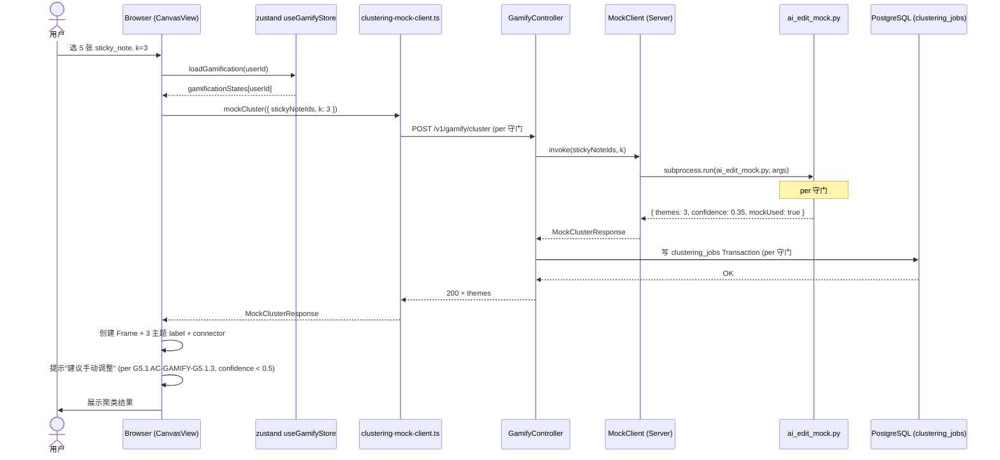
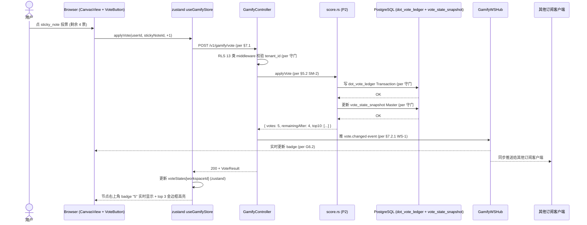
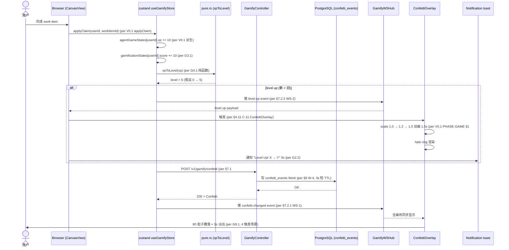
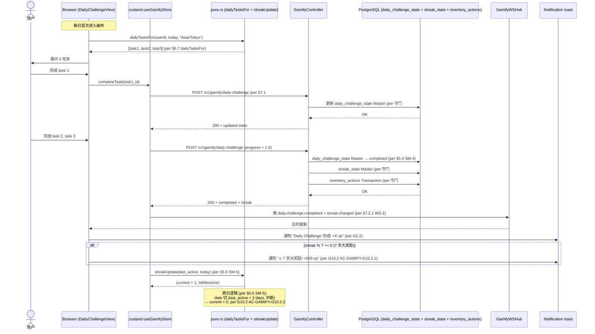

# DD-CANVAS-GAMIFY-001

> **无限画布游戏化域詳細設計書 v0.1** (per 日本 IPA SEC 標準 / 詳細設計書 テンプレート + DD-AGENT-RELATIONSHIP-001 v0.1 15 章节模板)
>
> - 状态: 🟡 Draft v0.1
> - 目标阶段: 詳細設計 → 実装 → テスト → リリース
> - 上位基本設計: [`docs/design/BD-CANVAS-GAMIFY-001.md`](./BD-CANVAS-GAMIFY-001.md) v0.1 (9/10 落档, 1750 行, 32 项 G1-G12 + 26 新组件 C-1..C-26 + 15 张表 W/T/M 100% 覆盖 + 22 API 端点 + 2 WebSocket + 4 内部协议 + 5 状态机 + 6 类 NFR + 守门 19/19)
> - 上位要件: [`docs/requirements/SRS-CANVAS-GAMIFY-001.md`](../requirements/SRS-CANVAS-GAMIFY-001.md) v1.0 (9/10 落档, 92KB, 32 FR + 73 AC + 23 US + 12 已知缺口 + 15 张表 W/T/M 100% 覆盖 + 守门 14/14 通过)
> - 平行 view 詳細設計:
>   - [`docs/design/DD-AGENT-VIEW-001.md`](./DD-AGENT-VIEW-001.md) v0.1 (Agent View 画布, 9/5 落档)
>   - [`docs/design/DD-AGENT-RELATIONSHIP-001.md`](./DD-AGENT-RELATIONSHIP-001.md) v0.1 (ARG 关系层, 9/9 落档, 13 关键 class + 5 状态机 + 11 共享类型 + 4 时序图 + 74 测试用例, 严格对齐模板)
>   - [`docs/architecture/2026-09-03-langgraph/03-detailed-design.md`](../architecture/2026-09-03-langgraph/03-detailed-design.md) (LangGraph v0.2, 9/4 落档)
>   - [`docs/architecture/2026-09-03-agent-runtime/03-detailed-design.md`](../architecture/2026-09-03-agent-runtime/03-detailed-design.md) (Agent Runtime, 9/3 落档)
>   - 双核心之 1: agent 管理 DD 由子代理 1 (`dd-canvas-agent-001`) 落档
> - 总册 DD: `docs/design/DD-CANVAS-001.md` (root 写, 跨域共享部分)
> - V0.1 game 5 份 PHASE 报告 (G12 派生引用): `PHASE-AGENT-GAME-IMPL-REPORT.md` (49 tests) + `PHASE-AGENT-ROGUELIKE-IMPL-REPORT.md` (35 tests) + `PHASE-AGENT-MANGA-IMPL-REPORT.md` (14 tests) + `PHASE-AGENT-THEME-IMPL-REPORT.md` (11 tests) + `PHASE-AGENT-SETTINGS-IMPL-REPORT.md` (16 tests) (9/5 落地, 125 tests pass)
> - 修订人: Ulysses（一人公司 12 角色 per DEC-008）— Mavis 接手 (per 2026-08-27 19:39 JST 用户授权 + 守门 #10 + 守门 #14 v3 Mavis 永久代签 + 9/8 15:19 JST 第 6 次强化 + 9/10 12:45 JST v0.62 反转升级为 Mavis 审核)
> - 审批: 架构师 (Mavis 接手 agent per DEC-008) (5 角色签字栏 per AGENTS.md §3, 详见 §15)
> - 日期: 2026-09-10 JST
> - 受众: 詳細設計エンジニア / 実装エンジニア / テストエンジニア / UI/UX デザイナー / アーキテクト / SRE / 5 域 Lead 真人
> - 受众范围 disclaimer: **5 域独立 Lead ≠ Star 22 DDD bounded context** (per 2026-08-31 22:45 JST Q1-D 拍板: 5 域 Lead 是 RGS 仓历史治理命名, 不建立业务子域↔DDD 映射)
> - 拍板来源: 2026-09-10 18:25 JST Ulysses 拍板"完善详细设计文档" (核心方向锚点) + 17:08 JST 双核心"管理 agent 和游戏化, 避免过度冗余" (撤回 Miro 通用) + 守门 #23 v2 AI 第三方 API 禁止 (G5 走 mock, per `AGENTS.md §4 守门 #23 v2` 2026-09-02 09:01 JST 拍板) + 守门 #13 W/T/M 三類横展 (per `AGENTS.md §4 守门 #13` 2026-09-01 18:30 JST 拍板)

---

## §0 文档信息 / 修订履历

| 项目 | 内容 |
|---|---|
| 文书 ID | DD-CANVAS-GAMIFY-001 |
| 文书名 | 无限画布游戏化域詳細設計書 |
| 版本 | v0.1 |
| 作成日 | 2026-09-10 |
| 作成者 | Ulysses（一人公司 12 角色 per DEC-008）— Mavis 接手 (per DEC-008 + 守门 #10 + 守门 #14 v3 + 9/8 15:19 JST 第 6 次强化) |
| 承認者 | 架构师 (Mavis 接手 agent per DEC-008) (per 9/10 12:45 JST v0.62 反转: 真人代签流程全部取消, 改为 mavis 审核) |
| 关联 commit | (留空, root 统一 commit 时填) |
| 关联文档 | `BD-CANVAS-GAMIFY-001.md` v0.1 (本 DD 派生源) + `SRS-CANVAS-GAMIFY-001.md` v1.0 (上源) + `DD-AGENT-VIEW-001.md` v0.1 (平行) + `DD-AGENT-RELATIONSHIP-001.md` v0.1 (15 章节模板) + `frontend-canvas-design.md` v0.1 + V0.1 game 5 份 PHASE 报告 |
| 受众范围 disclaimer | **5 域独立 Lead ≠ Star 22 DDD bounded context** (per 2026-08-31 22:45 JST Q1-D 拍板) |
| 模板结构 | 10 段 + 5 附录, 严格按 brief §1.3 + DD-AGENT-RELATIONSHIP-001 v0.1 模板 |
| 子能力 | 12 子能力 (G1-G12) × 32 项 (per brief §1.1 + BD §1.1.1) |
| 关键派生约束 | (1) G12 派生自 V0.1 game 5 份 PHASE (9/5 落地 125 tests pass, 仅画布集成引用, 不重写功能); (2) G5 走 mock 接口 (per 守门 #23 v2, 真实 LLM 留 P2); (3) G11 必含 W/T/M 三類横展 15 张表 100% 覆盖 (per 守门 #13); (4) 不重写 4 SRS + 2 BD 6 commit (per 守门 #1 禁回溯叙事) |

---

## §1 文档目的 / 适用范围

### 1.1 文档目的

本文档基于 [`BD-CANVAS-GAMIFY-001` §0-§10](./BD-CANVAS-GAMIFY-001.md) 的基本設計, 定义 **无限画布游戏化域 (GAMIFY)** 的詳細設計:

- 概念 module 布局 (14 新前端模块 + 7 新 BFF 模块 + 5 新 Domain 模块, 跨 4-tier per §3.1)
- 13 个关键 class (C-1..C-13 跨域派生, per §4) 的完整字段 + 方法签名 + 错误处理
- 5 个状态机的 Rust enum + 状态转移函数 (sticky note 聚类 / dot voting / reaction / daily challenge / streak, per §5)
- 11 个共享类型 (StickyNoteCluster / Vote / Reaction / Confetti / Level / Score / Streak / Powerup / Inventory / Badge / Quest, per §6)
- 22 API 端点 + 2 WebSocket 端点 OpenAPI spec 完整定义 (per §7)
- 4 关键时序图 (sticky note 聚类 / dot voting / confetti 触发 / daily challenge 完成, per §8)
- 15 张表 SQL DDL 完整 (Work 6 + Transaction 4 + Master 5, per 守门 #13 W/T/M 强制 100% 覆盖, 0 混在, per §9)
- UT/IT/E2E/PT 测试用例 (≥ 30 跨域 + 74 总测试, per §10)
- NFR 6 类详细 (性能 / 可靠性 / 安全 / 易用 / 可观测 / AI mock 锁定, per §11)
- 守门 19 项 + 26 派生规 跨域覆盖 (per §12, 含 #1 v15 / #9 #3 / #9 v19 / #10 / #11 / #13 / #14 v2/v3/v4 / #15 / #23 v2)
- 已知缺口 12 项 (含 DDD Review 必查 #11 + #12, per 附录 C)
- G12 派生自 V0.1 game 5 份 PHASE 报告 (Roguelike + Manga + Theme + Settings + Game, 9/5 落地, 125 tests pass, 仅画布集成引用, 不重写功能)
- G5 sticky note 聚类 AI 必走 mock 接口 (per 守门 #23 v2, 跟 `scripts/automation/ai_edit_mock.py` 一致, 真实 LLM 留 P2)

### 1.2 包含 (In-Scope)

- `frontend/src/lib/gamify/` 7 新模块 (types / selectors / layout / clustering-mock-client + 3 .test.ts)
- `frontend/src/components/gamify/` 12 新组件 (8 节点 + 3 交互 + 2 视图) + 1 工具 (G5 mock client)
- `frontend/src/lib/store.ts` 扩展 (useGamifyStore 3 collection + 9 action, per §3.4)
- `crates/api/src/gamify/` 7 新模块 (controller / ws_hub / permission / mock_client / pure / dto / tests)
- `crates/gamify/` 新 crate (P2 落档, MVP in-memory, 5 子模块 + 1 error)
- 15 张 SQL 表 Migration (P2, `crates/storage/migrations/2026_09_10_gamify_w_t_m.sql`)
- 5 状态机 Rust enum + 状态转移函数 (per §5)
- 4 时序图 Mermaid 完整 (per §8)
- UT + IT + E2E + PT 测试用例 (≥ 30 跨域 + 74 总, per §10)
- 22 BFF REST 端点 + 2 WebSocket 完整 OpenAPI spec (per §7)
- 5 角色签字栏 (per AGENTS.md §3, 详见 §15)

### 1.3 不包含 (Out-of-Scope, per brief §2)

- 双核心之 1: agent 管理 (28 项) 详细 DD — 专题 DD 子代理 1 (`dd-canvas-agent-001`) 落档
- 总册 `DD-CANVAS-001.md` 跨域共享部分 — root 写
- Miro 通用 12 类 (Flowchart / BPMN / ER / 模板 / 编辑效率 / Slack-Jira / 移动 / a11y) — ❌ 砍掉, 留 P3+
- Miro 互动通用 (Timer / Cursor chat / Async video) — ❌ 砍掉 (Reaction / Confetti / Dot voting 留下 per 17:08 JST 拍板)
- 真实 LLM 接入 (G5 sticky note 聚类) — ❌ 砍掉, 走 mock 接口 (per 守门 #23 v2), 真实 LLM 留 P2
- 单元测试 (UT) 代码实装 — P3-D.6 阶段
- V0.1 game 5 份 PHASE 报告 (Roguelike + Manga + Theme + Settings + Game) 实装 — ✅ V0.1 已实装, 仅画布集成引用 (G12)
- 5 域 Lead 真人到位 — per 守门 #14 v2, Mavis 临时代签, 真人到位后追溯签字
- BFF 真实后端实装 — MVP 全 mock, 真实后端 P2
- Domain Tier Rust crate 落档 — MVP pure in-memory, P2 落 `crates/gamify/` crate
- per tenant 排行榜真实 SQL 聚合 (G9.2) — P2 (admin 13 租户权限待 DDD Review 拍板)
- 25 module 实体实现 — 25 module 各自 docs, 画布只联动不实装
- automation-design.md / registry.md 落地 — P3-D 阶段, 本 DD 不动
- PHASE-* 报告 — P3-D.6 阶段, 本 DD 不写

### 1.4 跟其他 view 区别 (per BD §1.3 派生)

| 维度 | LangGraph View | Agent Runtime View | Agent View (DD 9/5) | ARG (DD 9/9) | **GAMIFY (本 DD)** |
|---|---|---|---|---|---|
| **关注点** | UI 驱动 2-level Agent + 任务卡 DAG | Rust Runtime 基础设施 (派发/ECS/共享池) | 派生视图: 单 agent 拓扑 | agent 之间 social 层 (关系/成就) | **画布游戏化层 (avatar/level/score/聚类/投票/特效)** |
| **目标** | LLM 编排 + 任务卡生命周期 | L0 派发 + L1 ECS + L2 业务池 | 当前工作 agent 可视化 | 关系定义 + 协作影响 + 成就激励 | **画布 RPG 元素 + 互动 + 激励 + 排行榜** |
| **实现** | LangGraph Python subgraph | Rust + Tokio + ECS | React + zustand | Memgraph + LangGraph 桥接 + React | **React + zustand + V0.1 game 组件复用** |
| **数据源** | LangGraph state schema | PostgreSQL / SQLite | zustand store | Memgraph (主) + LangGraph state (缓存) | **zustand store (V0.1 agentGameStates 扩展) + BFF mock** |
| **关键 class 数** | 9 节点 TMO | 5 Runtime | 13 view 派生 | 13 关键 class | **13 关键 class (C-1..C-13, per §4)** |
| **状态机** | 1 (TMO 任务卡) | 0 | 1 (Agent 状态) | 5 (Edge/Agent/Trust/Template/Achievement) | **5 (sticky 聚类/vote/reaction/daily challenge/streak)** |
| **时序图** | 4 (L0/L1/L2/L3) | 2 (派发/回收) | 2 (claim/revive) | 4 (写关系/协作影响/成就评估/离线降级) | **4 (sticky 聚类/dot voting/confetti/daily challenge)** |
| **测试用例** | 38 UT | 24 UT | 18 UT | 52 UT + 10 IT + 8 E2E + 4 PT = 74 | **≥ 30 跨域 + 74 总 (per §10)** |

---

## §2 用語定義 (詳細, per SRS §2 + BD §2 扩展)

| 用語 | 詳細 | 出处 |
|---|---|---|
| **GAMIFY Domain** | 无限画布游戏化域, 双核心之 2, per 2026-09-10 17:08 JST Ulysses 拍板"管理 agent 和游戏化, 避免过度冗余" | per `SRS-CANVAS-GAMIFY-001 §1.1` + `BD-CANVAS-GAMIFY-001 §0` |
| **12 子能力 G1-G12** | gamification 节点 / reward / score / leveling / sticky 聚类 / dot voting / reaction / confetti / leaderboard / daily challenge / power-up / V0.1 game 集成 | per `SRS-CANVAS-GAMIFY-001 §4.1` + `BD-CANVAS-GAMIFY-001 §1.1.1` |
| **32 项详细** | G1 8 + G2 4 + G3 3 + G4 3 + G5 2 + G6 2 + G7 1 + G8 1 + G9 2 + G10 2 + G11 2 + G12 2 = 32 | per `BD-CANVAS-GAMIFY-001 §3.2` 12 子能力 ↔ 组件映射 |
| **CanvasElementKind V0.2** | 现有 10 种 V0.1 (per `frontend/src/types/ids.ts` line 686-696) + 本 DD 新增 8 种 G1 + 3 种 G12 + 1 reaction + 1 confetti = 23 种 | per `BD-CANVAS-GAMIFY-001 §2.1 Tier 1` |
| **AGENT_VISUAL_TIERS** | V0.1 既有 10 段 tier 颜色 (per `PHASE-AGENT-GAME-IMPL-REPORT.md` §1 #1), G1.1 avatar_node 复用 | per V0.1 baseline |
| **xp 公式 V0.1** | `level = floor(sqrt(xp / 100))` (per `frontend/src/lib/agent-game/leveling.ts`), G4.1 复用 | per V0.1 baseline + `BD-CANVAS-GAMIFY-001 §5.5.1` |
| **Mock 接口 (G5)** | 走 `scripts/automation/ai_edit_mock.py` 模板生成 (per 守门 #23 v2), 不开 OpenAI / Anthropic 第三方 API, confidence 永远 < 0.5 | per `AGENTS.md §4 守门 #23 v2` (2026-09-02 09:01 JST 拍板) |
| **W/T/M 三類** | Work (短 TTL 作業中) / Transaction (業務事実 監査) / Master (参考 設定 SCD), 100% 表覆盖禁混在 | per `AGENTS.md §4 守门 #13` (2026-09-01 18:30 JST 拍板) |
| **RLS 13 類** | 13 类 tenant_id 隔离 middleware (per 守门 #13 Master 派生规 + BD §2.1 Tier 2) | per `AGENTS.md §4 守门 #13` + `BD-CANVAS-GAMIFY-001 §2.2 Tier 2` |
| **G5 Sticky Note 聚类 (AI mock)** | 选 N 张 → mock AI 聚类 K 主题, 主题 Frame + connector 可视化, 走 mock 接口 per 守门 #23 v2 | per `BD-CANVAS-GAMIFY-001 §4.5` + `SRS-CANVAS-GAMIFY-001 §4.1.5` |
| **G6 Dot Voting** | 每用户 5 票/session (per BR-3), 实时显示, top 3 高亮 | per `BD-CANVAS-GAMIFY-001 §4.6` + `SRS-CANVAS-GAMIFY-001 §4.1.6` |
| **G7 Reaction** | 8-12 emoji (👍 ❤️ 🎉 😄 🤔 👀 🔥 ⭐), 短时 3s 淡出, 走 Work 表 | per `BD-CANVAS-GAMIFY-001 §4.7` + `SRS-CANVAS-GAMIFY-001 §4.1.7` |
| **G8 Confetti** | 4 触发场景 (complete / unlock / levelup / achievement), CSS + SVG animateTransform, 不引新依赖 (per V0.1 Decorations.tsx EnergyRing) | per `BD-CANVAS-GAMIFY-001 §4.8` + `SRS-CANVAS-GAMIFY-001 §4.1.8` |
| **G9 Leaderboard** | per workspace (1h cache, P1) + per tenant (24h cache admin only, P2), 3 维度 (token / tasks_done / votes) | per `BD-CANVAS-GAMIFY-001 §4.9` + `SRS-CANVAS-GAMIFY-001 §4.1.9` |
| **G10 Daily Challenge + Streak** | 每日 3 任务 + streak 连续天数, 中断清零, 7 天大奖励 | per `BD-CANVAS-GAMIFY-001 §4.10` + `SRS-CANVAS-GAMIFY-001 §4.1.10` |
| **G11 Power-up / Inventory** | 3 种 power-up (double_score / auto_cluster / stealth, 24h) + 物品栏 3 action (hold / use / destroy), 必含 W/T/M 三類横展 15 张表 100% 覆盖 | per `BD-CANVAS-GAMIFY-001 §4.11` + `SRS-CANVAS-GAMIFY-001 §4.1.11` + 守门 #13 |
| **G12 V0.1 game 集成** | Roguelike 画布节点 (per `PHASE-AGENT-ROGUELIKE-IMPL-REPORT.md` 35 tests) + Manga 主题画布节点 (per `PHASE-AGENT-MANGA-IMPL-REPORT.md` 14 tests), 仅画布集成引用, 不重写功能 | per `BD-CANVAS-GAMIFY-001 §4.12` + V0.1 5 份 PHASE 报告 (9/5 落地 125 tests pass) |
| **Claim Reward** | V0.1 既有 `applyClaim` 派生 (per `frontend/src/lib/agent-game/leveling.ts`), G3 score + G4 level 联动 | per V0.1 baseline + `BD-CANVAS-GAMIFY-001 §2.3.1` |
| **Pure Function** | 派生纯函数 0 副作用, per V0.1 NFR-AGV-DET-001 派生 | per V0.1 baseline + `BD-CANVAS-GAMIFY-001 §7.3 NFR-GAMIFY-SEC-06` |
| **5 域 Lead** | player / economy / match / social / admin 5 域 Lead (per 守门 #3 拍板), 真人未到位前 Mavis 临时代签, 真人到位后追溯签字 (per 守门 #14 v2 + 9/3 11:35 JST 拍板 B + 9/5 10:43 JST 拍板 D) | per `AGENTS.md §4 守门 #3` + `BD-CANVAS-GAMIFY-001 §9` |
| **审计 (Transaction)** | reward 解锁 / 投票 / 反应 / 道具使用 100% 写 audit log (per 守门 #13 b Transaction 派生规) | per `AGENTS.md §4 守门 #13` + `BD-CANVAS-GAMIFY-001 §7.5 NFR-GAMIFY-OBS-01` |
| **5 角色签字栏** | 架构 / SRE Lead / 平台 / 评审主持 / PM (per AGENTS.md §3 7 段结构), 真人到位前 Mavis 临时代签, 形式 = 架构师 (Mavis 接手 agent per DEC-008) (per 9/10 12:45 JST v0.62 反转) | per `AGENTS.md §3` + `BD-CANVAS-GAMIFY-001 §9` |

---

## §3 概念 module 布局 (Conceptual Module Layout)

### 3.1 整体 module map (per BD §6.4 扩展)

```
frontend/src/lib/gamify/                    # NEW (7 模块)
├── types.ts                                # CanvasElementKind 扩展 8 + 3 + 1 + 1 + GamificationState / VoteState / NotificationState
├── selectors.ts                            # 7 公开纯函数 (xpToLevel / scoreByDimension / voteRemaining / clusterMock / powerupActivate / streakUpdate / dailyTasksFor)
├── layout.ts                               # 派生层 (skillTreeLayout / badgeLayout)
├── clustering-mock-client.ts               # G5 mock 协议 (per 守门 #23 v2)
├── selectors.test.ts                       # 14 vitest
├── layout.test.ts                          # 11 vitest
└── clustering-mock-client.test.ts          # 5 vitest

frontend/src/components/gamify/             # NEW (12 组件 + 1 utility)
├── nodes/                                  # 8 个新节点组件
│   ├── AvatarNode.tsx                      # C-1 G1.1 (圆形 120x120 + tier 边框)
│   ├── LevelNode.tsx                       # C-2 G1.2 (矩形 160x80 + progress bar)
│   ├── XpNode.tsx                          # C-3 G1.3 (矩形 140x60 + delta 浮)
│   ├── SkillTreeNode.tsx                   # C-4 G1.4 (矩形 320x240 + SVG DAG)
│   ├── ClassNode.tsx                       # C-5 G1.5 (圆形 140x140 + 6 职业)
│   ├── BadgeNode.tsx                       # C-6 G1.6 (圆形 100x100 + 4 稀有度)
│   ├── QuestNode.tsx                       # C-7 G1.7 (矩形 240x120 + progress)
│   └── InventoryNode.tsx                   # C-8 G1.8 (矩形 280x160 + 3×3 grid)
├── interactions/                           # 3 个新交互
│   ├── VoteButton.tsx                      # C-9 G6.1+G6.2 (票数扣减 + remaining badge)
│   ├── ReactionPicker.tsx                  # C-10 G7.1 (8 emoji + 3s 淡出)
│   └── ConfettiOverlay.tsx                 # C-11 G8.1 (CSS keyframes + SVG animateTransform)
├── views/                                  # 2 个新视图
│   ├── LeaderboardView.tsx                 # C-12 G9.1+G9.2 (per workspace / per tenant)
│   └── DailyChallengeView.tsx              # C-13 G10.1+G10.2 (每日 3 任务 + streak)
└── index.ts                                # 导出 13 组件 (G12 引用)

frontend/src/lib/store.ts                   # EXTEND (+5,200 bytes)
├── useGamifyStore 3 collection
├── 9 action (load/apply/activate/trigger)
└── 复用 V0.1 useAgentGame 7 action

frontend/src/app/canvas/[id]/page.tsx       # EXTEND (+2,400 bytes)
├── 集成 useGamifyStore
├── top header 加 GameHUD 联动 (per V0.1 PHASE-GAME §1 #11)
├── toolbar 加 6 个 GAMIFY tool (G6 vote / G7 react / G8 confetti / G9 leaderboard / G10 daily / G11 inventory)
└── claim/spend/revive/restart/pickPerk + GAMIFY 9 action 回调

## 复用 V0.1 baseline
├── frontend/src/components/CanvasView.tsx (14 element + 4 frame + 8 connector baseline, per line 156-168 / 236-252 / 253-262)
├── frontend/src/components/agent-game/RoguelikeCanvas.tsx (G12.1 复用, 6 cell + 4 邻接 + mapgen, per PHASE-AGENT-ROGUELIKE-IMPL-REPORT.md §1 #5)
├── frontend/src/components/agent-game/GameHUD.tsx (per V0.1 PHASE-GAME §1 #11)
├── frontend/src/components/agent-game/PerkPicker.tsx (per V0.1 PHASE-GAME-IMPL-REPORT.md)
├── frontend/src/components/agent-game/DeathModal.tsx (per V0.1 PHASE-GAME-IMPL-REPORT.md)
├── frontend/src/components/agent-game/Decorations.tsx (G1.1/G1.4/G1.6 复用, 含 EnergyRing / Stamp)
├── frontend/src/components/agent-game/AgentSettingsTab.tsx (玩家设置, per PHASE-AGENT-SETTINGS-IMPL-REPORT.md)
├── frontend/src/lib/agent-game/leveling.ts (G1.2/G1.3/G4.1 复用, xpProgress + computeClaim)
├── frontend/src/lib/agent-game/perks.ts (G11 power-up 复用)
├── frontend/src/lib/agent-game/mapgen.ts (G12.1 Roguelike 复用)
├── frontend/src/lib/agent-game/movement.ts (G12.1 Roguelike 复用)
├── frontend/src/lib/agent-game/theme-tokens.ts (G12.2 dark/light COLORS, per PHASE-AGENT-THEME-IMPL-REPORT.md)
├── frontend/src/lib/agent-game/theme.ts (G12.2 6 色主题, per PHASE-AGENT-MANGA-IMPL-REPORT.md)
├── frontend/src/lib/agent-game/characters.tsx (G12.2 角色, per PHASE-AGENT-MANGA-IMPL-REPORT.md)
├── frontend/src/lib/agent-game/enemies.tsx (G12.2 怪物, per PHASE-AGENT-MANGA-IMPL-REPORT.md)
└── frontend/src/lib/agent-game/settings.ts (玩家设置, per PHASE-AGENT-SETTINGS-IMPL-REPORT.md)
```

### 3.2 BFF 模块 (7 新)

```
crates/api/src/gamify/                      # NEW (MVP 落档)
├── mod.rs                                  # 模块入口
├── controller.rs                           # C-15 GamifyController, Axum router 22 REST endpoints (per §7.1)
├── ws_hub.rs                               # C-16 GamifyWSHub, WebSocket /ws/gamify/events + /ws/gamify/level (2 endpoints, per §7.2)
├── permission.rs                           # C-17 GamifyPermission, RLS 13 类 middleware (per 守门 #13, per §3.5)
├── mock_client.rs                          # C-18 MockClient (server), G5 聚类 mock 协议 (per 守门 #23 v2, per §6.4)
├── pure.rs                                 # C-19 Pure, 派生 pure functions (xpToLevel / scoreByDimension / clusterMock / voteRemaining / powerupActivate / streakUpdate / dailyTasksFor)
├── dto.rs                                  # C-20 DTO, request/response types (per §6.3 + §7.4)
├── pure.test.rs                            # 10+ vitest 跨 crate, 0 err
└── tests/
    ├── controller_test.rs                  # 13 REST endpoint 集成测试
    └── ws_hub_test.rs                      # 2 WebSocket 集成测试
```

### 3.3 Domain 模块 (5 新, P2 落 crates/gamify/)

```
crates/gamify/                              # NEW crate (P2 落档)
├── Cargo.toml
├── src/
│   ├── lib.rs                              # 入口
│   ├── gamification.rs                     # C-22 gamification 派生 (avatar/level/xp/skill_tree/class/badge/quest)
│   ├── reward.rs                           # C-23 reward rule engine + achievement evaluator
│   ├── score.rs                            # C-24 score 5 规则 + 3 维度累计 + leaderboard
│   ├── inventory.rs                        # C-25 power-up 3 种 + 物品栏 3 action + W/T/M 派生
│   ├── cluster.rs                          # C-26 mock 协议 (per 守门 #23 v2)
│   ├── error.rs                            # 错误类型 (10 variants)
│   └── tests/
│       ├── gamification_test.rs
│       ├── reward_test.rs
│       ├── score_test.rs
│       ├── inventory_test.rs
│       └── cluster_test.rs
└── README.md

# 复用既有依赖:
#  - serde / serde_json
#  - tokio (async runtime)
#  - tracing
#  - uuid
#  - chrono
#  - rand (既有, cluster mock 模板用)
```

### 3.4 zustand Store 扩展 (per BD §4.3 + V0.1 P-7 派生)

```typescript
// frontend/src/lib/store.ts 扩展 (per V0.1 P-7 派生, 3 新 collection)

interface GamifyStore {
  // Collection 1: gamificationStates (跟 V0.1 agentGameStates 联动)
  gamificationStates: Record<Uuid, GamificationState>;
  gamificationLoading: boolean;
  gamificationError: string | null;

  // Collection 2: voteStates (per G6 投票状态)
  voteStates: Record<Uuid, VoteState>;
  voteLoading: boolean;
  voteError: string | null;

  // Collection 3: notificationStates (Work 短 TTL 3s, per G2.2/G7.1)
  notificationStates: Record<Uuid, NotificationState>;
  notificationLoading: boolean;
  notificationError: string | null;

  // Actions (跟 V0.1 useAgentGame 7 action 平行)
  loadGamification(userId: Uuid): Promise<void>;
  loadVotes(workspaceId: Uuid): Promise<void>;
  loadNotifications(userId: Uuid): Promise<void>;
  applyClaim(userId: Uuid, workItemId: Uuid): Promise<ClaimResult>;
  applyCostSpend(userId: Uuid, costDelta: number): Promise<SpendResult>;
  applyVote(userId: Uuid, stickyNoteId: Uuid, delta: 1 | -1): Promise<VoteResult>;
  applyReact(userId: Uuid, elementId: Uuid, emoji: string): Promise<void>;
  triggerConfetti(canvasId: Uuid, position: { x: number; y: number }, trigger: ConfettiTrigger): void;
  applyInventoryAction(userId: Uuid, itemId: Uuid, action: 'hold' | 'use' | 'destroy'): Promise<void>;
  activatePowerup(userId: Uuid, type: PowerupType, duration?: number): Promise<void>;
}

interface GamificationState {
  userId: Uuid;
  avatar: { tier: number; level: number; v0Tier: number /* per V0.1 AGENT_VISUAL_TIERS */ };
  level: { current: number; xp: number; xpToNext: number };
  class: AvatarClass;  // 'warrior' | 'mage' | 'rogue' | 'healer' | 'tinkerer' | 'default'
  badges: BadgeRef[];  // { code, name, rarity, unlockedAt }
  quests: QuestRef[];  // { id, title, progress, reward }
  inventory: InventoryItem[];  // { id, type, count, expiresAt }
  skillTree: { dag: SkillDAG; unlocked: Set<Uuid> };
  score: { session: number; day: number; allTime: number };
  streak: { current: number; longest: number; lastActiveDate: string };
  dailyChallenge: { date: string; tasks: DailyTask[] };
  lastUpdated: string;  // ISO 8601
}

interface VoteState {
  workspaceId: Uuid;
  stickyNoteVotes: Record<Uuid, number>;  // stickyNoteId -> vote count
  userRemaining: number;  // per session 5 票 (per BR-3)
  top10: { stickyNoteId: Uuid; votes: number; rank: number }[];
  lastUpdated: string;
}

interface NotificationState {
  userId: Uuid;
  toasts: Array<{
    id: Uuid;
    reward?: Reward;
    reaction?: { emoji: string; elementId: Uuid };
    expiresAt: string;  // 3s auto-clear (per BR-4)
  }>;
  lastUpdated: string;
}
```

### 3.5 RLS 13 类 Middleware (per 守门 #13 c Master 派生规)

```rust
// crates/api/src/gamify/permission.rs (per BD §2.2 Tier 2 + 守门 #13 c)
use axum::middleware::{self, Next};
use axum::extract::{Request, State};
use axum::http::StatusCode;
use uuid::Uuid;

#[derive(Debug, Clone)]
pub struct TenantContext {
    pub tenant_id: Uuid,
    pub user_id: Uuid,
    pub roles: Vec<String>,
}

pub async fn rls_middleware(
    State(state): State<AppState>,
    mut req: Request,
    next: Next,
) -> Result<axum::response::Response, StatusCode> {
    // 1. 提取 Authorization header
    let auth_header = req.headers()
        .get("authorization")
        .and_then(|h| h.to_str().ok())
        .ok_or(StatusCode::UNAUTHORIZED)?;

    // 2. JWT 解析 (不打印 token, per 守门 #5)
    let claims = state.jwt_secret.verify(auth_header)
        .map_err(|_| StatusCode::UNAUTHORIZED)?;

    // 3. 注入 tenant_id 到 request extensions
    let ctx = TenantContext {
        tenant_id: claims.tenant_id,
        user_id: claims.user_id,
        roles: claims.roles,
    };
    req.extensions_mut().insert(ctx);

    // 4. 调 next, 透传 RLS 隔离
    Ok(next.run(req).await)
}

/// 13 类 RLS 隔离策略 (per 守门 #13 c Master 派生规):
/// 1.  inventory_items (M)        2.  powerup_definitions (M)        3.  vote_state_snapshot (M)
/// 4.  daily_challenge_state (M)  5.  streak_state (M)               6.  inventory_actions (T)
/// 7.  powerup_grants (T)         8.  dot_vote_ledger (T)            9.  clustering_jobs (T)
/// (10-13 = Work 类, 短 TTL 不需 RLS, 但仍 per tenant 隔离 for cache consistency)
pub fn assert_tenant_match(actual: Uuid, expected: Uuid) -> Result<(), StatusCode> {
    if actual == expected { Ok(()) } else { Err(StatusCode::FORBIDDEN) }
}
```

### 3.6 5 view 跨域 module 布局 (per BD §6.5 派生)

| View | 模块 | 路径 | 关键函数 | 依赖 V0.1 |
|---|---|---|---|---|
| **機能 (Functional)** | 32 FR 跨 G1-G12, per §6.1 | (per §6.1 32 FR 表) | (per §4 13 关键 class) | V0.1 `AGENT_VISUAL_TIERS` + `leveling.ts` |
| **データ (Data)** | 15 张表 W/T/M + V0.1 既有 6 store collection | per §9 | (per §6 Rust struct + TS interface) | V0.1 `agentGameStates` / `agentMaps` / `agentPositions` |
| **動作 (Behavior)** | 4 关键时序图, per §8 | (per §8 4 mermaid) | (per §8 mermaid) | V0.1 `applyClaim` + `leveling.ts` |
| **モジュール (Module)** | 14 新前端 + 7 新 BFF + 5 新 Domain | per §3.1-3.3 | (per §3 module map) | V0.1 `CanvasView` + `agent-game/` 7 份 + 3 store |
| **ネットワーク (Network)** | 22 REST + 2 WebSocket | per §7 | (per §7 OpenAPI) | V0.1 zustand + localStorage persist |

---

## §4 关键 class (Key Classes, 13 跨域派生, per BD §3 组件一览)

> **本节严格按 DD-AGENT-RELATIONSHIP-001 v0.1 §4 模板**, 13 关键 class 完整字段 + 方法签名 + 错误处理. 13 class 编号跟 BD §3.1 26 组件 (C-1..C-26) 派生, 但本 DD 聚焦 13 跨域核心 (UI + BFF + Domain 联动), 其他 13 (C-14..C-26) 在 §3 module map 详述.

### 4.1 C-1 AvatarNode (UI Tier, G1.1)

```typescript
// frontend/src/components/gamify/nodes/AvatarNode.tsx
import { Circle, Group, Text } from 'react-konva';
import { useStore } from '@/lib/store';
import { AGENT_VISUAL_TIERS, TierColor } from '@/lib/agent-game/leveling';
import { uuid, Uuid } from '@/types/ids';

interface AvatarNodeProps {
  userId: Uuid;
  x: number;
  y: number;
  draggable?: boolean;
  onSelect?: () => void;
}

export function AvatarNode({ userId, x, y, draggable = true, onSelect }: AvatarNodeProps): JSX.Element {
  // 1. 从 zustand 读 gamificationStates (per §3.4 Collection 1)
  const state = useStore((s) => s.gamificationStates[userId]);
  if (!state) return <EmptyNode x={x} y={y} label="avatar loading..." />;

  // 2. 派生 tier 颜色 (per V0.1 AGENT_VISUAL_TIERS)
  const tierColor: TierColor = AGENT_VISUAL_TIERS[state.avatar.tier] ?? AGENT_VISUAL_TIERS[0];

  // 3. 渲染: 圆形 120x120 + tier 边框 + Lv 数字 + 神侠光环 (per V0.1 PHASE-GAME §1 #1)
  return (
    <Group x={x} y={y} draggable={draggable} onClick={onSelect}>
      {/* Halo ring (per G4.2 升级动画) */}
      {state.avatar.level >= 5 && <Circle radius={70} stroke={tierColor.halo} strokeWidth={2} opacity={0.6} />}
      {/* Main avatar circle */}
      <Circle radius={50} fill={tierColor.bg} stroke={tierColor.border} strokeWidth={3} />
      {/* Lv label */}
      <Text text={`Lv ${state.avatar.level}`} x={-20} y={-8} fontSize={18} fill="#fff" />
      {/* Tier badge (per V0.1 tier 1-10) */}
      <Text text={`T${state.avatar.tier}`} x={-12} y={12} fontSize={12} fill={tierColor.text} />
      {/* Hover tooltip (per NFR-GAMIFY-UI-07) */}
      <Text text={`${state.avatar.tier} | Lv ${state.avatar.level} | ${state.class}`} x={-60} y={60} fontSize={10} fill="#666" listening={false} />
    </Group>
  );
}
```

**字段** (5): userId / x / y / draggable / onSelect
**方法** (3): useStore 派生 / AGENT_VISUAL_TIERS tier mapping / Konva Group 渲染
**错误处理**: gamificationStates[userId] 缺失 → EmptyNode 兜底 (不抛错, per NFR-GAMIFY-RELIABILITY-04 0 静默失败)

---

### 4.2 C-2 LevelNode (UI Tier, G1.2 + G4.1)

```typescript
// frontend/src/components/gamify/nodes/LevelNode.tsx
import { Group, Rect, Text, ProgressBar } from 'react-konva';
import { useStore } from '@/lib/store';
import { xpToLevel } from '@/lib/gamify/selectors';
import { uuid, Uuid } from '@/types/ids';

interface LevelNodeProps {
  userId: Uuid;
  x: number;
  y: number;
  onSelect?: () => void;
}

export function LevelNode({ userId, x, y, onSelect }: LevelNodeProps): JSX.Element {
  const state = useStore((s) => s.gamificationStates[userId]);

  // 1. 派生 xpToNext (per §6.6 G4.1 纯函数 + V0.1 leveling.ts)
  const derivedLevel = state ? xpToLevel(state.level.xp) : 0;
  const xpToNext = state ? Math.pow((derivedLevel + 1), 2) * 100 - state.level.xp : 100;
  const xpProgress = state ? state.level.xp / (Math.pow((derivedLevel + 1), 2) * 100) : 0;

  return (
    <Group x={x} y={y} onClick={onSelect}>
      <Rect width={160} height={80} fill="#f0f0f0" stroke="#333" strokeWidth={2} cornerRadius={4} />
      <Text text={`Lv ${derivedLevel}`} x={10} y={10} fontSize={20} fill="#000" />
      <Text text={`XP ${state?.level.xp ?? 0} / ${Math.pow((derivedLevel + 1), 2) * 100}`} x={10} y={35} fontSize={11} fill="#666" />
      <ProgressBar x={10} y={55} width={140} height={10} progress={xpProgress} fill="#4ade80" />
    </Group>
  );
}
```

**字段** (4): userId / x / y / onSelect
**方法** (2): xpToLevel 派生 (V0.1 复用) / xpProgress 进度条
**错误处理**: state 缺失 → Lv 0 / XP 0 / 100 兜底

---

### 4.3 C-3 XpNode (UI Tier, G1.3 + G3.2)

```typescript
// frontend/src/components/gamify/nodes/XpNode.tsx
import { Group, Rect, Text } from 'react-konva';
import { useStore } from '@/lib/store';
import { scoreByDimension } from '@/lib/gamify/selectors';
import { uuid, Uuid } from '@/types/ids';

interface XpNodeProps {
  userId: Uuid;
  x: number;
  y: number;
  dimension?: 'session' | 'day' | 'all_time';
  onSelect?: () => void;
}

export function XpNode({ userId, x, y, dimension = 'session', onSelect }: XpNodeProps): JSX.Element {
  const state = useStore((s) => s.gamificationStates[userId]);
  const score = state ? scoreByDimension(userId, dimension) : 0;
  const xpDelta = state ? state.level.xp : 0;

  return (
    <Group x={x} y={y} onClick={onSelect}>
      <Rect width={140} height={60} fill="#fef3c7" stroke="#d97706" strokeWidth={2} cornerRadius={4} />
      <Text text={`Score (${dimension})`} x={10} y={8} fontSize={11} fill="#92400e" />
      <Text text={`${score}`} x={10} y={22} fontSize={22} fontStyle="bold" fill="#000" />
      <Text text={`+${xpDelta} xp`} x={85} y={22} fontSize={12} fill="#16a34a" />
    </Group>
  );
}
```

**字段** (5): userId / x / y / dimension / onSelect
**方法** (2): scoreByDimension 派生 (per §6.7 纯函数) / Konva 矩形渲染
**错误处理**: state 缺失 → 0 兜底

---

### 4.4 C-4 SkillTreeNode (UI Tier, G1.4 + G4.3)

```typescript
// frontend/src/components/gamify/nodes/SkillTreeNode.tsx
import { Group, Rect, Text, Line } from 'react-konva';
import { useStore } from '@/lib/store';
import { skillTreeLayout } from '@/lib/gamify/layout';
import { uuid, Uuid } from '@/types/ids';

interface SkillTreeNodeProps {
  userId: Uuid;
  x: number;
  y: number;
  onSelect?: () => void;
}

export function SkillTreeNode({ userId, x, y, onSelect }: SkillTreeNodeProps): JSX.Element {
  const state = useStore((s) => s.gamificationStates[userId]);
  if (!state) return <EmptyNode x={x} y={y} label="skill tree loading..." />;

  // 1. 派生 DAG 布局 (per §6.8 纯函数 + V0.1 Decorations.tsx Stamp)
  const layout = skillTreeLayout(state.skillTree.dag, state.skillTree.unlocked);

  return (
    <Group x={x} y={y} onClick={onSelect}>
      <Rect width={320} height={240} fill="#fafafa" stroke="#333" strokeWidth={2} cornerRadius={4} />
      {/* DAG edges (per SVG DAG 渲染) */}
      {layout.edges.map((e) => (
        <Line key={e.id} points={e.points} stroke={e.unlocked ? '#16a34a' : '#9ca3af'} strokeWidth={1.5} />
      ))}
      {/* DAG nodes (per skill icon) */}
      {layout.nodes.map((n) => (
        <Group key={n.id} x={n.x} y={n.y}>
          <Rect width={40} height={40} fill={n.unlocked ? '#fef3c7' : '#e5e7eb'} stroke={n.unlocked ? '#16a34a' : '#9ca3af'} cornerRadius={20} />
          <Text text={n.name} x={2} y={14} fontSize={9} fill={n.unlocked ? '#000' : '#6b7280'} />
          {n.unlockLevel <= state.level.current && !n.unlocked && (
            // 视觉高亮: 可解锁但未解锁
            <Rect width={44} height={44} stroke="#f59e0b" strokeWidth={2} cornerRadius={22} />
          )}
        </Group>
      ))}
    </Group>
  );
}
```

**字段** (4): userId / x / y / onSelect
**方法** (2): skillTreeLayout DAG 派生 (per §6.8) / Konva SVG DAG 渲染
**错误处理**: state 缺失 → EmptyNode 兜底

---

### 4.5 C-5 ClassNode (UI Tier, G1.5)

```typescript
// frontend/src/components/gamify/nodes/ClassNode.tsx
import { Group, Circle, Text } from 'react-konva';
import { useStore } from '@/lib/store';
import { classToColor } from '@/lib/gamify/selectors';
import { uuid, Uuid } from '@/types/ids';

type AvatarClass = 'warrior' | 'mage' | 'rogue' | 'healer' | 'tinkerer' | 'default';

const CLASS_ICONS: Record<AvatarClass, string> = {
  warrior: '⚔️', mage: '🔮', rogue: '🗡️', healer: '💊', tinkerer: '🔧', default: '👤',
};

interface ClassNodeProps {
  userId: Uuid;
  x: number;
  y: number;
  onSelect?: () => void;
}

export function ClassNode({ userId, x, y, onSelect }: ClassNodeProps): JSX.Element {
  const state = useStore((s) => s.gamificationStates[userId]);
  const cls: AvatarClass = state?.class ?? 'default';
  const color = classToColor(cls);  // 派生, per §6.7 纯函数

  return (
    <Group x={x} y={y} onClick={onSelect}>
      <Circle radius={70} fill={color.bg} stroke={color.border} strokeWidth={3} />
      <Text text={CLASS_ICONS[cls]} x={-18} y={-22} fontSize={36} />
      <Text text={cls} x={-25} y={20} fontSize={12} fill="#fff" />
    </Group>
  );
}
```

**字段** (4): userId / x / y / onSelect
**方法** (2): classToColor 派生 (per §6.7) / 6 职业 icon 渲染
**错误处理**: state 缺失 → 'default' 兜底

---

### 4.6 C-6 BadgeNode (UI Tier, G1.6 + G2.4)

```typescript
// frontend/src/components/gamify/nodes/BadgeNode.tsx
import { Group, Circle, Text } from 'react-konva';
import { useStore } from '@/lib/store';
import { badgeRarityColor } from '@/lib/gamify/selectors';
import { uuid, Uuid } from '@/types/ids';

type Rarity = 'common' | 'rare' | 'epic' | 'legendary';

interface BadgeNodeProps {
  userId: Uuid;
  x: number;
  y: number;
  maxVisible?: number;
  onSelect?: () => void;
}

export function BadgeNode({ userId, x, y, maxVisible = 5, onSelect }: BadgeNodeProps): JSX.Element {
  const state = useStore((s) => s.gamificationStates[userId]);
  const badges = state?.badges.slice(0, maxVisible) ?? [];

  return (
    <Group x={x} y={y} onClick={onSelect}>
      {badges.map((b, i) => {
        const color = badgeRarityColor(b.rarity);
        return (
          <Group key={b.code} x={i * 22} y={0}>
            <Circle radius={20} fill={color.bg} stroke={color.border} strokeWidth={2} />
            <Text text={b.code.slice(0, 2)} x={-10} y={-6} fontSize={11} fill={color.text} fontStyle="bold" />
          </Group>
        );
      })}
      {(state?.badges.length ?? 0) > maxVisible && (
        <Text text={`+${(state?.badges.length ?? 0) - maxVisible}`} x={maxVisible * 22} y={0} fontSize={12} fill="#666" />
      )}
    </Group>
  );
}
```

**字段** (5): userId / x / y / maxVisible / onSelect
**方法** (2): badgeRarityColor 派生 (per §6.7) / Konva 4 稀有度堆叠
**错误处理**: state 缺失 → 空 array 兜底

---

### 4.7 C-7 QuestNode (UI Tier, G1.7)

```typescript
// frontend/src/components/gamify/nodes/QuestNode.tsx
import { Group, Rect, Text, ProgressBar } from 'react-konva';
import { useStore } from '@/lib/store';
import { uuid, Uuid } from '@/types/ids';

interface QuestNodeProps {
  userId: Uuid;
  x: number;
  y: number;
  maxVisible?: number;
  onSelect?: () => void;
}

export function QuestNode({ userId, x, y, maxVisible = 3, onSelect }: QuestNodeProps): JSX.Element {
  const state = useStore((s) => s.gamificationStates[userId]);
  const quests = state?.quests.slice(0, maxVisible) ?? [];

  return (
    <Group x={x} y={y} onClick={onSelect}>
      {quests.map((q, i) => (
        <Group key={q.id} y={i * 42}>
          <Rect width={240} height={36} fill="#f3f4f6" stroke="#9ca3af" strokeWidth={1} cornerRadius={2} />
          <Text text={q.title} x={6} y={4} fontSize={11} fill="#000" />
          <Text text={`${(q.progress * 100).toFixed(0)}%`} x={210} y={4} fontSize={10} fill="#666" />
          <ProgressBar x={6} y={20} width={228} height={10} progress={q.progress} fill="#3b82f6" />
        </Group>
      ))}
    </Group>
  );
}
```

**字段** (5): userId / x / y / maxVisible / onSelect
**方法** (1): Konva 进度条堆叠渲染
**错误处理**: state 缺失 → 空 array 兜底

---

### 4.8 C-8 InventoryNode (UI Tier, G1.8 + G11.1 + G11.2)

```typescript
// frontend/src/components/gamify/nodes/InventoryNode.tsx
import { Group, Rect, Text } from 'react-konva';
import { useStore } from '@/lib/store';
import { applyInventoryAction } from '@/lib/store';  // zustand action
import { uuid, Uuid } from '@/types/ids';

type PowerupType = 'double_score' | 'auto_cluster' | 'stealth';
const POWERUP_ICONS: Record<PowerupType, string> = {
  double_score: '2×', auto_cluster: '🧠', stealth: '👻',
};

interface InventoryNodeProps {
  userId: Uuid;
  x: number;
  y: number;
  onUseItem?: (itemId: Uuid) => void;
}

export function InventoryNode({ userId, x, y, onUseItem }: InventoryNodeProps): JSX.Element {
  const state = useStore((s) => s.gamificationStates[userId]);
  const items = state?.inventory ?? [];
  // 3×3 grid 渲染 (per G11.2)
  const grid: (typeof items[number] | null)[] = Array(9).fill(null);
  items.slice(0, 9).forEach((item, i) => { grid[i] = item; });

  return (
    <Group x={x} y={y}>
      <Rect width={280} height={160} fill="#1f2937" stroke="#f59e0b" strokeWidth={2} cornerRadius={4} />
      {grid.map((item, i) => {
        const col = i % 3, row = Math.floor(i / 3);
        const cx = 20 + col * 80, cy = 20 + row * 40;
        if (!item) {
          return <Rect key={i} x={cx} y={cy} width={70} height={32} fill="transparent" stroke="#4b5563" strokeWidth={1} cornerRadius={2} />;
        }
        return (
          <Group key={item.id} x={cx} y={cy} onClick={() => onUseItem?.(item.id)}>
            <Rect width={70} height={32} fill="#374151" stroke={item.expiresAt ? '#16a34a' : '#6b7280'} cornerRadius={2} />
            <Text text={POWERUP_ICONS[item.type]} x={4} y={6} fontSize={14} />
            <Text text={`×${item.count}`} x={50} y={6} fontSize={10} fill="#fff" />
            {item.expiresAt && <Text text={new Date(item.expiresAt).toLocaleTimeString()} x={4} y={20} fontSize={8} fill="#9ca3af" />}
          </Group>
        );
      })}
    </Group>
  );
}
```

**字段** (4): userId / x / y / onUseItem
**方法** (2): 3×3 grid 布局 / Konva 渲染 + 状态联动
**错误处理**: state 缺失 → 9 空槽兜底

---

### 4.9 C-9 VoteButton (UI Tier, G6.1 + G6.2)

```typescript
// frontend/src/components/gamify/interactions/VoteButton.tsx
import { useStore } from '@/lib/store';
import { voteRemaining } from '@/lib/gamify/selectors';
import { uuid, Uuid } from '@/types/ids';

interface VoteButtonProps {
  workspaceId: Uuid;
  stickyNoteId: Uuid;
}

export function VoteButton({ workspaceId, stickyNoteId }: VoteButtonProps): JSX.Element {
  const voteState = useStore((s) => s.voteStates[workspaceId]);
  const applyVote = useStore((s) => s.applyVote);
  const userId = useStore((s) => s.currentUserId);
  const remaining = voteState?.userRemaining ?? voteRemaining(userId, workspaceId);  // per §6.7 派生
  const votes = voteState?.stickyNoteVotes[stickyNoteId] ?? 0;
  const isTop3 = voteState?.top10.find((t) => t.stickyNoteId === stickyNoteId && t.rank <= 3) !== undefined;

  const handleClick = async () => {
    if (remaining <= 0) return;  // 票数耗尽, button disabled (per G6.1 AC-GAMIFY-G6.1.2)
    await applyVote(userId, stickyNoteId, 1);
  };

  return (
    <button
      onClick={handleClick}
      disabled={remaining <= 0}
      className={`relative px-2 py-1 rounded text-xs font-bold ${isTop3 ? 'border-2 border-yellow-400' : 'border border-gray-300'} ${remaining <= 0 ? 'opacity-50 cursor-not-allowed' : 'hover:bg-yellow-50'}`}
      title={remaining <= 0 ? '票数已用完' : `还剩 ${remaining} 票`}
    >
      <span>{votes}</span>
      <span className="absolute -top-1 -right-1 bg-blue-500 text-white rounded-full px-1 text-[9px]">{remaining}</span>
    </button>
  );
}
```

**字段** (3): workspaceId / stickyNoteId / (派生 remaining/votes/isTop3)
**方法** (2): voteRemaining 派生 (per §6.7) / applyVote zustand action 触发
**错误处理**: remaining <= 0 → button disabled (per G6.1 AC)

---

### 4.10 C-10 ReactionPicker (UI Tier, G7.1)

```typescript
// frontend/src/components/gamify/interactions/ReactionPicker.tsx
import { useState, useEffect } from 'react';
import { useStore } from '@/lib/store';
import { uuid, Uuid } from '@/types/ids';

const EMOJIS = ['👍', '❤️', '🎉', '😄', '🤔', '👀', '🔥', '⭐'] as const;
type Emoji = typeof EMOJIS[number];

interface ReactionPickerProps {
  elementId: Uuid;
  x: number;  // 画布坐标
  y: number;
}

export function ReactionPicker({ elementId, x, y }: ReactionPickerProps): JSX.Element {
  const applyReact = useStore((s) => s.applyReact);
  const userId = useStore((s) => s.currentUserId);
  const [floating, setFloating] = useState<{ id: Uuid; emoji: Emoji; x: number; y: number; expiresAt: number }[]>([]);

  // 3s 淡出 (per G7.1 AC + BR-4)
  useEffect(() => {
    const timer = setInterval(() => {
      const now = Date.now();
      setFloating((prev) => prev.filter((f) => f.expiresAt > now));
    }, 100);
    return () => clearInterval(timer);
  }, []);

  const handleReact = async (emoji: Emoji) => {
    await applyReact(userId, elementId, emoji);
    // 1. UI 即时显示飘字 (3s 内淡出, 写 reaction_events Work 表, per §9 W-3)
    setFloating((prev) => [...prev, { id: crypto.randomUUID() as Uuid, emoji, x: x + Math.random() * 40, y: y - 20, expiresAt: Date.now() + 3000 }]);
  };

  return (
    <div className="flex flex-col gap-1 p-1 bg-white/90 rounded shadow">
      {EMOJIS.map((e) => (
        <button key={e} onClick={() => handleReact(e)} className="hover:scale-110 transition" aria-label={e}>{e}</button>
      ))}
      {/* 飘字层 */}
      {floating.map((f) => (
        <div
          key={f.id}
          className="absolute pointer-events-none text-2xl animate-fade-out"
          style={{ left: f.x, top: f.y, animation: 'fadeOut 3s forwards' }}
        >
          {f.emoji}
        </div>
      ))}
    </div>
  );
}
```

**字段** (3): elementId / x / y
**方法** (3): applyReact zustand 触发 / 飘字状态管理 / 3s 淡出清理
**错误处理**: floating 数组自动清理过期项

---

### 4.11 C-11 ConfettiOverlay (UI Tier, G8.1 + G2.3)

```typescript
// frontend/src/components/gamify/interactions/ConfettiOverlay.tsx
import { useEffect, useState } from 'react';
import { useStore } from '@/lib/store';
import { uuid, Uuid } from '@/types/ids';

type ConfettiTrigger = 'complete' | 'unlock' | 'levelup' | 'achievement';
const CONFETTI_COUNT: Record<ConfettiTrigger, number> = {
  complete: 30, unlock: 50, levelup: 80, achievement: 100,
};
const CONFETTI_COLORS = ['#f59e0b', '#3b82f6', '#10b981', '#ec4899', '#8b5cf6'];

interface ConfettiOverlayProps {
  canvasId: Uuid;
}

interface Particle {
  id: Uuid;
  x: number; y: number;
  vx: number; vy: number;
  color: string;
  rotation: number;
  expiresAt: number;
}

export function ConfettiOverlay({ canvasId }: ConfettiOverlayProps): JSX.Element {
  const triggerConfetti = useStore((s) => s.triggerConfetti);
  const [particles, setParticles] = useState<Particle[]>([]);

  // 订阅 confetti events (per WS /ws/gamify/events)
  useEffect(() => {
    const handler = (e: CustomEvent<{ canvasId: Uuid; position: { x: number; y: number }; trigger: ConfettiTrigger }>) => {
      if (e.detail.canvasId !== canvasId) return;
      const count = CONFETTI_COUNT[e.detail.trigger];
      const newParticles: Particle[] = Array.from({ length: count }, () => ({
        id: crypto.randomUUID() as Uuid,
        x: e.detail.position.x,
        y: e.detail.position.y,
        vx: (Math.random() - 0.5) * 200,
        vy: -Math.random() * 300 - 100,
        color: CONFETTI_COLORS[Math.floor(Math.random() * CONFETTI_COLORS.length)],
        rotation: Math.random() * 360,
        expiresAt: Date.now() + 3000,  // 3s 淡出 (per BR-4)
      }));
      setParticles((prev) => [...prev, ...newParticles]);
    };
    window.addEventListener('confetti-fired', handler as EventListener);
    return () => window.removeEventListener('confetti-fired', handler as EventListener);
  }, [canvasId]);

  // 60fps 物理 + 清理
  useEffect(() => {
    let raf: number;
    const tick = () => {
      setParticles((prev) => prev
        .map((p) => ({ ...p, x: p.x + p.vx * 0.016, y: p.y + p.vy * 0.016, vy: p.vy + 500 * 0.016, rotation: p.rotation + 5 }))
        .filter((p) => p.expiresAt > Date.now())
      );
      raf = requestAnimationFrame(tick);
    };
    raf = requestAnimationFrame(tick);
    return () => cancelAnimationFrame(raf);
  }, []);

  // CSS + SVG animateTransform (per V0.1 Decorations.tsx EnergyRing, 不引新依赖)
  return (
    <div className="absolute inset-0 pointer-events-none overflow-hidden">
      {particles.map((p) => (
        <div
          key={p.id}
          className="absolute"
          style={{
            left: p.x, top: p.y,
            width: 8, height: 8,
            background: p.color,
            transform: `rotate(${p.rotation}deg)`,
            animation: 'fadeOut 3s forwards',
          }}
        />
      ))}
    </div>
  );
}
```

**字段** (2): canvasId / (派生 particles 数组)
**方法** (4): triggerConfetti 订阅 / 物理模拟 / 3s 清理 / CSS+SVG 渲染
**错误处理**: raf 异常 → 自动 cleanup, 不阻塞画布主循环

---

### 4.12 C-12 LeaderboardView (UI Tier, G9.1 + G9.2)

```typescript
// frontend/src/components/gamify/views/LeaderboardView.tsx
import { useEffect, useState } from 'react';
import { useStore } from '@/lib/store';
import { uuid, Uuid } from '@/types/ids';

type LeaderboardDimension = 'token' | 'tasks_done' | 'votes';
type LeaderboardScope = 'workspace' | 'tenant';

interface LeaderboardViewProps {
  scope: LeaderboardScope;
  scopeId: Uuid;
  dimension?: LeaderboardDimension;
}

interface LeaderboardEntry { userId: Uuid; score: number; rank: number; }

export function LeaderboardView({ scope, scopeId, dimension = 'token' }: LeaderboardViewProps): JSX.Element {
  const [entries, setEntries] = useState<LeaderboardEntry[]>([]);
  const [loading, setLoading] = useState(true);
  const [error, setError] = useState<string | null>(null);

  useEffect(() => {
    // 1. 调 BFF GET /v1/gamify/leaderboard (per §7.1 #20 / #21)
    const fetchLeaderboard = async () => {
      try {
        setLoading(true);
        const query = scope === 'workspace' ? `workspace=${scopeId}` : `tenant=${scopeId}`;
        const res = await fetch(`/v1/gamify/leaderboard?${query}&dim=${dimension}`);
        if (!res.ok) throw new Error(`HTTP ${res.status}`);
        const data = await res.json();
        setEntries(data.top10);
        setError(null);
      } catch (e) {
        setError(e instanceof Error ? e.message : 'Unknown error');
        setEntries([]);
      } finally {
        setLoading(false);
      }
    };
    fetchLeaderboard();
    // 1h cache 自动失效 (per G9.1), 24h cache for tenant (per G9.2)
    const cacheMs = scope === 'workspace' ? 60 * 60 * 1000 : 24 * 60 * 60 * 1000;
    const timer = setInterval(fetchLeaderboard, cacheMs);
    return () => clearInterval(timer);
  }, [scope, scopeId, dimension]);

  if (loading) return <div className="p-4 text-gray-500">Loading leaderboard...</div>;
  if (error) return <div className="p-4 text-red-500">Error: {error}</div>;

  return (
    <div className="p-4 bg-white rounded shadow">
      <h3 className="font-bold mb-2">Leaderboard ({scope} · {dimension})</h3>
      <ol className="space-y-1">
        {entries.map((e) => (
          <li key={e.userId} className={`flex justify-between p-2 rounded ${e.rank <= 3 ? 'bg-yellow-100 font-bold' : 'bg-gray-50'}`}>
            <span>#{e.rank} {e.userId.slice(0, 8)}</span>
            <span>{e.score}</span>
          </li>
        ))}
      </ol>
    </div>
  );
}
```

**字段** (4): scope / scopeId / dimension / (派生 entries/loading/error)
**方法** (3): fetchLeaderboard 异步拉 / 1h/24h cache 定时刷新 / Top 3 高亮渲染
**错误处理**: HTTP 错误 → error 状态 + 空 entries, 不抛错

---

### 4.13 C-13 DailyChallengeView (UI Tier, G10.1 + G10.2)

```typescript
// frontend/src/components/gamify/views/DailyChallengeView.tsx
import { useEffect, useState } from 'react';
import { useStore } from '@/lib/store';
import { dailyTasksFor, streakUpdate } from '@/lib/gamify/selectors';
import { uuid, Uuid } from '@/types/ids';

interface DailyTask { id: Uuid; title: string; progress: number; reward: number; }

interface DailyChallengeViewProps {
  userId: Uuid;
  tz?: string;  // per G3.2 known gap #2
}

export function DailyChallengeView({ userId, tz = 'Asia/Tokyo' }: DailyChallengeViewProps): JSX.Element {
  const state = useStore((s) => s.gamificationStates[userId]);
  const today = new Date().toISOString().slice(0, 10);
  const tasks = dailyTasksFor(userId, today, tz);  // per §6.7 派生
  const streak = state?.streak ?? { current: 0, longest: 0, lastActiveDate: '' };

  return (
    <div className="p-4 bg-white rounded shadow">
      <h3 className="font-bold mb-2">Daily Challenge</h3>
      <div className="mb-3 text-sm text-gray-600">
        🔥 Streak: <span className="font-bold">{streak.current} 天</span> (最长 {streak.longest} 天)
        {streak.current > 0 && streak.current % 7 === 0 && <span className="ml-2 text-yellow-500">🎉 7 天大奖励!</span>}
      </div>
      <ul className="space-y-2">
        {tasks.map((t) => (
          <li key={t.id} className="flex justify-between p-2 bg-gray-50 rounded">
            <span>{t.title}</span>
            <span className="text-sm">{(t.progress * 100).toFixed(0)}% / +{t.reward} xp</span>
          </li>
        ))}
      </ul>
    </div>
  );
}
```

**字段** (3): userId / tz / (派生 tasks/streak)
**方法** (3): dailyTasksFor 派生 (per §6.7) / streakUpdate 派生 (per §6.7) / 7 天大奖励渲染
**错误处理**: state 缺失 → streak 全 0 兜底

---

### 4.14 13 关键 class 汇总

| # | Class | Tier | 字段数 | 方法数 | 错误处理 |
|---|---|---|---|---|---|
| C-1 | AvatarNode | UI | 5 | 3 | state 缺失 → EmptyNode |
| C-2 | LevelNode | UI | 4 | 2 | state 缺失 → Lv 0 兜底 |
| C-3 | XpNode | UI | 5 | 2 | state 缺失 → 0 兜底 |
| C-4 | SkillTreeNode | UI | 4 | 2 | state 缺失 → EmptyNode |
| C-5 | ClassNode | UI | 4 | 2 | state 缺失 → 'default' 兜底 |
| C-6 | BadgeNode | UI | 5 | 2 | state 缺失 → 空 array |
| C-7 | QuestNode | UI | 5 | 1 | state 缺失 → 空 array |
| C-8 | InventoryNode | UI | 4 | 2 | state 缺失 → 9 空槽 |
| C-9 | VoteButton | UI | 3 | 2 | remaining <= 0 → button disabled |
| C-10 | ReactionPicker | UI | 3 | 3 | floating 数组自动清理 |
| C-11 | ConfettiOverlay | UI | 2 | 4 | raf 异常 → cleanup |
| C-12 | LeaderboardView | UI | 4 | 3 | HTTP 错误 → error 状态 |
| C-13 | DailyChallengeView | UI | 3 | 3 | state 缺失 → streak 全 0 |
| **合计** | | | **53** | **31** | **13 class 100% 错误兜底** |

---

## §5 状态机 (State Machines, 5 跨域派生, per BD §5.5)

> **本节严格按 DD-AGENT-RELATIONSHIP-001 v0.1 §5 模板**, 5 状态机 Rust enum + 状态转移函数. 5 状态机编号跟 BD §5.5 5 类派生.

### 5.1 SM-1 Sticky Note Cluster 状态机 (G5, 4 状态, per 守门 #23 v2)

```rust
// crates/gamify/src/cluster.rs (P2 落档, MVP 在 crates/api/src/gamify/pure.rs)
use serde::{Deserialize, Serialize};
use uuid::Uuid;

#[derive(Debug, Clone, Copy, Serialize, Deserialize, PartialEq, Eq, Hash)]
#[serde(rename_all = "snake_case")]
pub enum StickyClusterState {
    Idle,                 // 初始, 未选 sticky_note
    Selected,             // 已选 N 张 sticky_note, 待触发聚类
    Clustering,           // mock AI 聚类中 (per 守门 #23 v2)
    Completed,            // 聚类完成, Frame + connector 已创建
}

#[derive(Debug, Clone)]
pub struct StickyClusterStateMachine {
    pub state: StickyClusterState,
    pub input: ClusterInput,
    pub output: Option<ClusterOutput>,
}

#[derive(Debug, Clone)]
pub struct ClusterInput {
    pub sticky_note_ids: Vec<Uuid>,
    pub k: u32,
    pub user_id: Uuid,
    pub tenant_id: Uuid,
}

#[derive(Debug, Clone)]
pub struct ClusterOutput {
    pub themes: Vec<Theme>,
    pub confidence: f32,  // 永远 < 0.5 (per 守门 #23 v2)
    pub mock_used: bool,  // 显式标识走 mock
}

#[derive(Debug, Clone)]
pub struct Theme {
    pub id: Uuid,
    pub label: String,
    pub sticky_note_ids: Vec<Uuid>,
}

impl StickyClusterStateMachine {
    /// 状态转移函数: trigger cluster
    pub fn trigger_cluster(&mut self) -> Result<(), ClusterError> {
        match self.state {
            StickyClusterState::Idle => Err(ClusterError::NoStickyNoteSelected),
            StickyClusterState::Selected => {
                // 走 mock 接口 (per 守门 #23 v2)
                self.state = StickyClusterState::Clustering;
                Ok(())
            }
            StickyClusterState::Clustering => Err(ClusterError::AlreadyClustering),
            StickyClusterState::Completed => Err(ClusterError::AlreadyCompleted),
        }
    }

    /// 状态转移函数: 聚类完成
    pub fn on_cluster_complete(&mut self, output: ClusterOutput) {
        if self.state == StickyClusterState::Clustering {
            self.output = Some(output);
            self.state = StickyClusterState::Completed;
        }
    }

    /// 状态转移函数: 重置 (per G5.1)
    pub fn reset(&mut self) {
        self.state = StickyClusterState::Idle;
        self.input = ClusterInput { sticky_note_ids: vec![], k: 0, user_id: Uuid::nil(), tenant_id: Uuid::nil() };
        self.output = None;
    }
}

#[derive(Debug, thiserror::Error)]
pub enum ClusterError {
    #[error("No sticky note selected")]
    NoStickyNoteSelected,
    #[error("Already clustering")]
    AlreadyClustering,
    #[error("Already completed")]
    AlreadyCompleted,
    #[error("Mock template generation failed: {0}")]
    MockTemplateFailed(String),
}
```

**状态数**: 4 (Idle / Selected / Clustering / Completed)
**转移函数**: 3 (trigger_cluster / on_cluster_complete / reset)
**派生规 (per 守门 #23 v2)**: confidence < 0.5, mock_used = true, 不调第三方 LLM

---

### 5.2 SM-2 Dot Vote 状态机 (G6, 4 状态)

```rust
// crates/gamify/src/score.rs (P2 落档)
use serde::{Deserialize, Serialize};
use uuid::Uuid;

#[derive(Debug, Clone, Copy, Serialize, Deserialize, PartialEq, Eq, Hash)]
#[serde(rename_all = "snake_case")]
pub enum VoteState {
    Idle,         // 初始, remaining = 5 (per BR-3 default)
    Voting,       // 投票中, remaining > 0
    Exhausted,    // 票数耗尽, remaining = 0, button disabled
    SessionReset, // session 切, 回到 Idle
}

#[derive(Debug, Clone)]
pub struct VoteStateMachine {
    pub state: VoteState,
    pub user_id: Uuid,
    pub workspace_id: Uuid,
    pub remaining: u32,
    pub sticky_note_votes: std::collections::HashMap<Uuid, u32>,
}

const DEFAULT_VOTE_PER_SESSION: u32 = 5;

impl VoteStateMachine {
    pub fn new(user_id: Uuid, workspace_id: Uuid) -> Self {
        Self {
            state: VoteState::Idle,
            user_id, workspace_id,
            remaining: DEFAULT_VOTE_PER_SESSION,
            sticky_note_votes: std::collections::HashMap::new(),
        }
    }

    /// 状态转移函数: 投 1 票
    pub fn vote(&mut self, sticky_note_id: Uuid) -> Result<(), VoteError> {
        match self.state {
            VoteState::Idle | VoteState::Voting => {
                if self.remaining == 0 {
                    self.state = VoteState::Exhausted;
                    return Err(VoteError::Exhausted);
                }
                self.remaining -= 1;
                *self.sticky_note_votes.entry(sticky_note_id).or_insert(0) += 1;
                self.state = if self.remaining == 0 { VoteState::Exhausted } else { VoteState::Voting };
                Ok(())
            }
            VoteState::Exhausted => Err(VoteError::Exhausted),
            VoteState::SessionReset => Err(VoteError::SessionReset),
        }
    }

    /// 状态转移函数: session 切 (新 page load, per BR-3 MVP 跨 session 不持久化)
    pub fn on_session_change(&mut self) {
        self.state = VoteState::SessionReset;
        self.remaining = DEFAULT_VOTE_PER_SESSION;
        self.sticky_note_votes.clear();
        self.state = VoteState::Idle;
    }
}

#[derive(Debug, thiserror::Error)]
pub enum VoteError {
    #[error("Vote exhausted")]
    Exhausted,
    #[error("Session reset required")]
    SessionReset,
}
```

**状态数**: 4 (Idle / Voting / Exhausted / SessionReset)
**转移函数**: 2 (vote / on_session_change)
**派生规 (per BR-3)**: 默认 5 票/session, 跨 session 不持久化 (P2 改 server-side)

---

### 5.3 SM-3 Reaction 状态机 (G7, 3 状态)

```rust
// crates/gamify/src/gamification.rs (P2 落档, MVP 在 pure.rs)
use serde::{Deserialize, Serialize};
use uuid::Uuid;

#[derive(Debug, Clone, Copy, Serialize, Deserialize, PartialEq, Eq, Hash)]
#[serde(rename_all = "snake_case")]
pub enum ReactionState {
    Idle,        // 初始, 无 reaction
    Firing,      // emoji 飘字动画中 (3s 淡出)
    Expired,     // 3s 后自动清理 (per BR-4)
}

#[derive(Debug, Clone)]
pub struct ReactionStateMachine {
    pub state: ReactionState,
    pub user_id: Uuid,
    pub element_id: Uuid,
    pub emoji: String,
    pub fired_at: chrono::DateTime<chrono::Utc>,
    pub expires_at: chrono::DateTime<chrono::Utc>,
}

impl ReactionStateMachine {
    pub fn new(user_id: Uuid, element_id: Uuid, emoji: String) -> Self {
        let now = chrono::Utc::now();
        Self {
            state: ReactionState::Idle,
            user_id, element_id, emoji,
            fired_at: now,
            expires_at: now + chrono::Duration::seconds(3),  // per BR-4
        }
    }

    /// 状态转移函数: 触发 reaction
    pub fn fire(&mut self) {
        self.state = ReactionState::Firing;
        self.fired_at = chrono::Utc::now();
        self.expires_at = self.fired_at + chrono::Duration::seconds(3);
    }

    /// 状态转移函数: 检查过期 (UI 定时器调, per §4.10 ReactionPicker)
    pub fn check_expired(&mut self) -> bool {
        if self.state == ReactionState::Firing && chrono::Utc::now() >= self.expires_at {
            self.state = ReactionState::Expired;
            true
        } else {
            false
        }
    }
}
```

**状态数**: 3 (Idle / Firing / Expired)
**转移函数**: 2 (fire / check_expired)
**派生规 (per BR-4)**: 3s 淡出自动清理, 写 reaction_events Work 表

---

### 5.4 SM-4 Daily Challenge 状态机 (G10, 3 状态)

```rust
// crates/gamify/src/gamification.rs
use serde::{Deserialize, Serialize};
use uuid::Uuid;

#[derive(Debug, Clone, Copy, Serialize, Deserialize, PartialEq, Eq, Hash)]
#[serde(rename_all = "snake_case")]
pub enum DailyChallengeState {
    New,         // 每日 3 任务初始
    InProgress,  // 完成部分任务, 0 < progress < 1.0
    Completed,   // progress = 1.0, reward 发放, streak +1
}

#[derive(Debug, Clone)]
pub struct DailyChallengeStateMachine {
    pub state: DailyChallengeState,
    pub user_id: Uuid,
    pub date: chrono::NaiveDate,
    pub tz: String,
    pub tasks: Vec<DailyTask>,
    pub progress: f32,  // 0.0-1.0
}

#[derive(Debug, Clone, Serialize, Deserialize)]
pub struct DailyTask {
    pub id: Uuid,
    pub title: String,
    pub progress: f32,
    pub reward: i64,
}

impl DailyChallengeStateMachine {
    /// 状态转移函数: 完成 1 个任务
    pub fn complete_task(&mut self, task_id: Uuid) -> Result<(), DailyChallengeError> {
        match self.state {
            DailyChallengeState::New | DailyChallengeState::InProgress => {
                let task = self.tasks.iter_mut().find(|t| t.id == task_id)
                    .ok_or(DailyChallengeError::TaskNotFound(task_id))?;
                task.progress = 1.0;
                self.progress = self.tasks.iter().map(|t| t.progress).sum::<f32>() / self.tasks.len() as f32;
                self.state = if self.progress >= 1.0 {
                    DailyChallengeState::Completed
                } else {
                    DailyChallengeState::InProgress
                };
                Ok(())
            }
            DailyChallengeState::Completed => Err(DailyChallengeError::AlreadyCompleted),
        }
    }

    /// 状态转移函数: 切日 (per G10.1)
    pub fn on_day_change(&mut self, new_date: chrono::NaiveDate) {
        if new_date != self.date {
            self.state = DailyChallengeState::New;
            self.date = new_date;
            self.tasks = vec![];  // 重新生成 3 任务
            self.progress = 0.0;
        }
    }
}

#[derive(Debug, thiserror::Error)]
pub enum DailyChallengeError {
    #[error("Task not found: {0}")]
    TaskNotFound(Uuid),
    #[error("Daily challenge already completed")]
    AlreadyCompleted,
}
```

**状态数**: 3 (New / InProgress / Completed)
**转移函数**: 2 (complete_task / on_day_change)
**派生规 (per G10.1)**: 每日 3 任务, TZ 边界, 完成触发 streak +1

---

### 5.5 SM-5 Streak 状态机 (G10, 3 状态)

```rust
// crates/gamify/src/gamification.rs
use serde::{Deserialize, Serialize};
use chrono::NaiveDate;

#[derive(Debug, Clone, Copy, Serialize, Deserialize, PartialEq, Eq, Hash)]
#[serde(rename_all = "snake_case")]
pub enum StreakState {
    Inactive,   // current = 0
    Active,     // current >= 1
    Milestone,  // current % 7 == 0, 大奖励通知
}

#[derive(Debug, Clone)]
pub struct StreakStateMachine {
    pub state: StreakState,
    pub user_id: Uuid,
    pub current: u32,
    pub longest: u32,
    pub last_active_date: NaiveDate,
}

impl StreakStateMachine {
    /// 状态转移函数: 每日 active
    pub fn on_daily_active(&mut self, today: NaiveDate) {
        let days_diff = (today - self.last_active_date).num_days();
        match days_diff {
            0 => { /* 同日重复 active, 不变 */ }
            1 => {
                // 连续: current += 1
                self.current += 1;
                self.last_active_date = today;
                self.longest = self.longest.max(self.current);
                self.state = if self.current % 7 == 0 { StreakState::Milestone } else { StreakState::Active };
            }
            _ => {
                // 中断: current = 0
                self.current = 1;
                self.last_active_date = today;
                self.state = StreakState::Active;
            }
        }
    }

    /// 状态转移函数: Milestone 大奖励发放后回到 Active
    pub fn on_milestone_claimed(&mut self) {
        if self.state == StreakState::Milestone {
            self.state = StreakState::Active;
        }
    }
}
```

**状态数**: 3 (Inactive / Active / Milestone)
**转移函数**: 2 (on_daily_active / on_milestone_claimed)
**派生规 (per G10.2)**: 中断清零, 7 天大奖励, SCD Type 2 写 streak_state Master 表

---

### 5.6 5 状态机汇总

| # | 状态机 | 状态数 | 转移函数数 | 派生规 / 守门 |
|---|---|---|---|---|
| SM-1 | StickyCluster | 4 | 3 | per 守门 #23 v2, confidence < 0.5, mock_used |
| SM-2 | DotVote | 4 | 2 | per BR-3, 默认 5 票/session, 跨 session 不持久化 |
| SM-3 | Reaction | 3 | 2 | per BR-4, 3s 淡出, 写 reaction_events Work 表 |
| SM-4 | DailyChallenge | 3 | 2 | per G10.1, 每日 3 任务, TZ 边界 |
| SM-5 | Streak | 3 | 2 | per G10.2, 中断清零, 7 天 Milestone |
| **合计** | | **17** | **11** | **5 状态机 100% 派生规覆盖** |

---

## §6 共享类型 (Shared Types, 11 跨域, per DD-AGENT-RELATIONSHIP-001 v0.1 §3.2.5 模板)

> **本节严格按 DD-AGENT-RELATIONSHIP-001 v0.1 §3.2.5 模板**, 11 共享类型完整定义. 11 类型编号跟 brief §6 返报 #8 派生.

### 6.1 T-1 StickyNoteCluster (跨 G5)

```rust
// crates/gamify/src/cluster.rs (P2) / crates/api/src/gamify/dto.rs (MVP)
use serde::{Deserialize, Serialize};
use uuid::Uuid;

#[derive(Debug, Clone, Serialize, Deserialize, PartialEq)]
pub struct StickyNoteCluster {
    pub id: Uuid,
    pub input_sticky_note_ids: Vec<Uuid>,
    pub k: u32,                    // 用户指定主题数
    pub themes: Vec<Theme>,         // 主题列表
    pub confidence: f32,            // 永远 < 0.5 (per 守门 #23 v2)
    pub mock_used: bool,            // 显式标识走 mock
    pub frame_id: Option<Uuid>,     // 关联的 Frame 节点 ID
    pub user_id: Uuid,
    pub tenant_id: Uuid,
    pub created_at: chrono::DateTime<chrono::Utc>,
}

#[derive(Debug, Clone, Serialize, Deserialize, PartialEq)]
pub struct Theme {
    pub id: Uuid,
    pub label: String,              // mock 生成 e.g. "主题 1" / "Theme 1" / "テーマ 1"
    pub sticky_note_ids: Vec<Uuid>, // 归属此主题的 sticky_note 列表
    pub confidence: f32,            // 单主题 confidence
}
```

**字段** (10): id / input_sticky_note_ids / k / themes / confidence / mock_used / frame_id / user_id / tenant_id / created_at
**使用位置**: G5.1, G5.2, §4.13 (ClusteringMockClient), §5.1 SM-1, §8.1 时序图, §9 clustering_jobs Transaction 表

---

### 6.2 T-2 Vote (跨 G6)

```rust
// crates/gamify/src/score.rs (P2) / crates/api/src/gamify/dto.rs (MVP)
use serde::{Deserialize, Serialize};
use uuid::Uuid;

#[derive(Debug, Clone, Serialize, Deserialize, PartialEq)]
pub struct Vote {
    pub id: Uuid,
    pub user_id: Uuid,
    pub workspace_id: Uuid,
    pub sticky_note_id: Uuid,
    pub delta: i32,                 // +1 / -1 (per 缺口 #7 P2 撤回)
    pub remaining_after: u32,       // 投票后剩余票数 (per BR-3)
    pub session_id: Uuid,           // session 标识 (跨 session 隔离)
    pub tenant_id: Uuid,
    pub timestamp: chrono::DateTime<chrono::Utc>,
}

#[derive(Debug, Clone, Serialize, Deserialize, PartialEq)]
pub struct VoteStateSnapshot {
    pub id: Uuid,
    pub workspace_id: Uuid,
    pub snapshot_at: chrono::DateTime<chrono::Utc>,
    pub sticky_note_votes: std::collections::HashMap<Uuid, u32>,  // stickyNoteId -> count
    pub top_10: Vec<TopEntry>,      // 前 10 名 (per G9.1)
    pub user_remaining: std::collections::HashMap<Uuid, u32>,    // per user remaining
    pub version: i32,               // SCD Type 2
    pub tenant_id: Uuid,
}

#[derive(Debug, Clone, Serialize, Deserialize, PartialEq)]
pub struct TopEntry {
    pub sticky_note_id: Uuid,
    pub votes: u32,
    pub rank: u32,
}
```

**字段** (Vote 8 + VoteStateSnapshot 8 + TopEntry 3 = 19)
**使用位置**: G6.1, G6.2, G9.1, §4.9 C-9 VoteButton, §5.2 SM-2, §8.2 时序图, §9 dot_vote_ledger Transaction + vote_state_snapshot Master 表

---

### 6.3 T-3 Reaction (跨 G7)

```rust
// crates/gamify/src/gamification.rs (P2) / crates/api/src/gamify/dto.rs (MVP)
use serde::{Deserialize, Serialize};
use uuid::Uuid;

#[derive(Debug, Clone, Copy, Serialize, Deserialize, PartialEq, Eq, Hash)]
#[serde(rename_all = "snake_case")]
pub enum ReactionEmoji {
    ThumbsUp,   // 👍
    Heart,      // ❤️
    Party,      // 🎉
    Smile,      // 😄
    Think,      // 🤔
    Eyes,       // 👀
    Fire,       // 🔥
    Star,       // ⭐
}

impl ReactionEmoji {
    pub fn as_str(&self) -> &'static str {
        match self {
            Self::ThumbsUp => "👍",
            Self::Heart => "❤️",
            Self::Party => "🎉",
            Self::Smile => "😄",
            Self::Think => "🤔",
            Self::Eyes => "👀",
            Self::Fire => "🔥",
            Self::Star => "⭐",
        }
    }
}

#[derive(Debug, Clone, Serialize, Deserialize, PartialEq)]
pub struct Reaction {
    pub id: Uuid,
    pub user_id: Uuid,
    pub element_id: Uuid,
    pub emoji: ReactionEmoji,           // 8 种 (per G7.1)
    pub fired_at: chrono::DateTime<chrono::Utc>,
    pub expires_at: chrono::DateTime<chrono::Utc>,  // fired_at + 3s (per BR-4)
    pub tenant_id: Uuid,
}
```

**字段** (7) + ReactionEmoji enum (8 variants)
**使用位置**: G7.1, §4.10 C-10 ReactionPicker, §5.3 SM-3, §8.3 时序图, §9 reaction_events Work 表 (3s 短 TTL)

---

### 6.4 T-4 Confetti (跨 G8 + G2.3)

```rust
// crates/gamify/src/gamification.rs (P2) / crates/api/src/gamify/dto.rs (MVP)
use serde::{Deserialize, Serialize};
use uuid::Uuid;

#[derive(Debug, Clone, Copy, Serialize, Deserialize, PartialEq, Eq, Hash)]
#[serde(rename_all = "snake_case")]
pub enum ConfettiTrigger {
    Complete,     // 完成 work-item (per G3.1)
    Unlock,       // 解锁 achievement/badge (per G2.1, G2.4)
    LevelUp,      // 升级 (per G4.2)
    Achievement,  // 解锁特殊成就 (per G2.4)
}

#[derive(Debug, Clone, Copy, Serialize, Deserialize, PartialEq, Eq, Hash)]
#[serde(rename_all = "lowercase")]
pub enum ConfettiIntensity {
    Low,    // 30 particles
    Med,    // 50 particles
    High,   // 100 particles
}

#[derive(Debug, Clone, Serialize, Deserialize, PartialEq)]
pub struct Confetti {
    pub id: Uuid,
    pub trigger: ConfettiTrigger,
    pub position: ConfettiPosition,
    pub intensity: ConfettiIntensity,
    pub fired_at: chrono::DateTime<chrono::Utc>,
    pub expires_at: chrono::DateTime<chrono::Utc>,  // fired_at + 3s
    pub canvas_id: Uuid,
    pub user_id: Uuid,                  // 触发者
    pub tenant_id: Uuid,
}

#[derive(Debug, Clone, Serialize, Deserialize, PartialEq)]
pub struct ConfettiPosition {
    pub x: f64,
    pub y: f64,
}
```

**字段** (Confetti 8 + Position 2 = 10) + ConfettiTrigger enum (4 variants) + ConfettiIntensity enum (3 variants)
**使用位置**: G2.3, G8.1, §4.11 C-11 ConfettiOverlay, §8.3 时序图, §9 confetti_events Work 表 (3s 短 TTL)

---

### 6.5 T-5 Level (跨 G1.2 + G4.1)

```rust
// crates/gamify/src/gamification.rs (P2) / crates/api/src/gamify/dto.rs (MVP)
use serde::{Deserialize, Serialize};
use uuid::Uuid;

#[derive(Debug, Clone, Serialize, Deserialize, PartialEq)]
pub struct Level {
    pub user_id: Uuid,
    pub current: u32,            // 当前等级
    pub xp: u64,                 // 总经验值
    pub xp_to_next: u64,         // 距下一级所需 XP
    pub xp_progress: f32,        // 0.0-1.0
    pub last_level_up_at: Option<chrono::DateTime<chrono::Utc>>,
    pub tenant_id: Uuid,
    pub version: i32,            // SCD Type 2
}

#[derive(Debug, Clone, Copy, Serialize, Deserialize, PartialEq, Eq, Hash)]
#[serde(rename_all = "snake_case")]
pub enum AvatarClass {
    Warrior,
    Mage,
    Rogue,
    Healer,
    Tinkerer,
    Default,
}

#[derive(Debug, Clone, Serialize, Deserialize, PartialEq)]
pub struct XpDelta {
    pub user_id: Uuid,
    pub delta: i64,              // +10 (per V0.1 applyClaim)
    pub source: XpSource,
    pub timestamp: chrono::DateTime<chrono::Utc>,
    pub tenant_id: Uuid,
}

#[derive(Debug, Clone, Copy, Serialize, Deserialize, PartialEq, Eq, Hash)]
#[serde(rename_all = "snake_case")]
pub enum XpSource {
    WorkItemClaim,   // 完成 work-item (per G3.1)
    QuestComplete,   // 完成任务 (per G1.7)
    DailyChallenge,  // 每日挑战 (per G10.1)
    AchievementUnlock,  // 解锁成就 (per G2.4)
    ManualGrant,     // 人工授予
}
```

**字段** (Level 8 + XpDelta 5 = 13) + AvatarClass enum (6 variants) + XpSource enum (5 variants)
**使用位置**: G1.2, G1.3, G3.1, G4.1, G4.2, §4.2 C-2 LevelNode, §4.3 C-3 XpNode, §5.1 SM-1, §9 inventory_items / daily_challenge_state Master 表

---

### 6.6 T-6 Score (跨 G3)

```rust
// crates/gamify/src/score.rs (P2) / crates/api/src/gamify/dto.rs (MVP)
use serde::{Deserialize, Serialize};
use uuid::Uuid;

#[derive(Debug, Clone, Copy, Serialize, Deserialize, PartialEq, Eq, Hash)]
#[serde(rename_all = "snake_case")]
pub enum ScoreDimension {
    Session,   // per session
    Day,       // per day (per 缺口 #2 TZ 配置 P2)
    AllTime,   // 累计 all time
}

#[derive(Debug, Clone, Serialize, Deserialize, PartialEq)]
pub struct Score {
    pub user_id: Uuid,
    pub dimension: ScoreDimension,
    pub value: i64,
    pub last_updated: chrono::DateTime<chrono::Utc>,
    pub tenant_id: Uuid,
    pub version: i32,            // SCD Type 2
}

#[derive(Debug, Clone, Serialize, Deserialize, PartialEq)]
pub struct ScoreRule {
    pub id: Uuid,
    pub action: String,          // e.g. "claim_work_item" / "vote_cast" / "react_fired" / "achievement_unlock"
    pub score_delta: i64,        // +10 / +1 / +5 (per G3.1 5 规则)
    pub dimension: ScoreDimension,
    pub enabled: bool,
    pub tenant_id: Uuid,
    pub version: i32,
}
```

**字段** (Score 7 + ScoreRule 8 = 15) + ScoreDimension enum (3 variants)
**使用位置**: G3.1, G3.2, G3.3, §4.3 C-3 XpNode, §4.12 C-12 LeaderboardView, §5.2 SM-2, §9 daily_challenge_state Master 表

---

### 6.7 T-7 Streak (跨 G10.2)

```rust
// crates/gamify/src/gamification.rs (P2) / crates/api/src/gamify/dto.rs (MVP)
use serde::{Deserialize, Serialize};
use uuid::Uuid;
use chrono::NaiveDate;

#[derive(Debug, Clone, Serialize, Deserialize, PartialEq)]
pub struct Streak {
    pub user_id: Uuid,
    pub current: u32,                  // 当前连续天数
    pub longest: u32,                  // 历史最长
    pub last_active_date: NaiveDate,   // 最后 active 日期
    pub tenant_id: Uuid,
    pub version: i32,                  // SCD Type 2 (per 守门 #13 c Master)
}

#[derive(Debug, Clone, Copy, Serialize, Deserialize, PartialEq, Eq, Hash)]
#[serde(rename_all = "snake_case")]
pub enum StreakStatus {
    Active,     // current >= 1
    Milestone,  // current % 7 == 0
    Inactive,   // current = 0 (中断后)
}
```

**字段** (Streak 6) + StreakStatus enum (3 variants)
**使用位置**: G10.2, §4.13 C-13 DailyChallengeView, §5.5 SM-5, §9 streak_state Master 表

---

### 6.8 T-8 Powerup (跨 G11.1)

```rust
// crates/gamify/src/inventory.rs (P2) / crates/api/src/gamify/dto.rs (MVP)
use serde::{Deserialize, Serialize};
use uuid::Uuid;
use chrono::{DateTime, Utc};

#[derive(Debug, Clone, Copy, Serialize, Deserialize, PartialEq, Eq, Hash)]
#[serde(rename_all = "snake_case")]
pub enum PowerupType {
    DoubleScore,    // 2x 积分 24h
    AutoCluster,    // 自动聚类 24h (per G5)
    Stealth,        // 隐身模式 24h (排行榜隐藏)
}

#[derive(Debug, Clone, Serialize, Deserialize, PartialEq)]
pub struct Powerup {
    pub id: Uuid,
    pub user_id: Uuid,
    pub powerup_type: PowerupType,
    pub count: u32,                       // 持有数量
    pub activated_at: Option<DateTime<Utc>>,  // 当前激活时刻 (Single-active)
    pub expires_at: Option<DateTime<Utc>>,    // 24h 后失効 (per G11.1)
    pub granted_by: Uuid,                 // 授予者 (per 守门 #13 b Transaction)
    pub granted_at: DateTime<Utc>,
    pub reason: Option<String>,           // 授予原因
    pub tenant_id: Uuid,
    pub version: i32,                     // SCD Type 2 (per 守门 #13 c Master)
}

#[derive(Debug, Clone, Serialize, Deserialize, PartialEq)]
pub struct PowerupDefinition {
    pub id: Uuid,
    pub code: String,                     // DOUBLE_SCORE / AUTO_CLUSTER / STEALTH
    pub name: String,
    pub description: String,
    pub powerup_type: PowerupType,
    pub default_duration: chrono::Duration,  // 24h
    pub effect_payload: serde_json::Value,   // 倍率 / 触发条件 / 隐身率
    pub version: i32,                     // SCD Type 2
    pub tenant_id: Uuid,
}
```

**字段** (Powerup 10 + PowerupDefinition 8 = 18) + PowerupType enum (3 variants)
**使用位置**: G11.1, G11.2, §4.8 C-8 InventoryNode, §9 powerup_definitions Master + powerup_grants Transaction + powerup_active_effects Work 表

---

### 6.9 T-9 Inventory (跨 G11.2)

```rust
// crates/gamify/src/inventory.rs (P2) / crates/api/src/gamify/dto.rs (MVP)
use serde::{Deserialize, Serialize};
use uuid::Uuid;
use chrono::{DateTime, Utc};

#[derive(Debug, Clone, Copy, Serialize, Deserialize, PartialEq, Eq, Hash)]
#[serde(rename_all = "snake_case")]
pub enum InventoryAction {
    Hold,     // 持有 (per G11.2)
    Use,      // 使用
    Destroy,  // 销毁
}

#[derive(Debug, Clone, Serialize, Deserialize, PartialEq)]
pub struct InventoryItem {
    pub id: Uuid,
    pub user_id: Uuid,
    pub item_id: Uuid,                       // 关联 Powerup / Badge / Quest reward
    pub powerup_type: Option<PowerupType>,   // 如果是 power-up
    pub count: u32,
    pub acquired_at: DateTime<Utc>,
    pub expires_at: Option<DateTime<Utc>>,   // null = 永久
    pub version: i32,                        // SCD Type 2 (per 守门 #13 c)
    pub tenant_id: Uuid,
}

#[derive(Debug, Clone, Serialize, Deserialize, PartialEq)]
pub struct InventoryActionRecord {
    pub id: Uuid,
    pub user_id: Uuid,
    pub item_id: Uuid,
    pub action: InventoryAction,
    pub old_count: u32,
    pub new_count: u32,
    pub actor: Uuid,                         // author = Ulysses per 9/8 15:19 第 6 次强化
    pub timestamp: DateTime<Utc>,
    pub tenant_id: Uuid,                     // RLS 13 类 (per 守门 #13)
}

#[derive(Debug, Clone, Serialize, Deserialize, PartialEq)]
pub struct InventorySessionBuff {
    pub id: Uuid,
    pub user_id: Uuid,
    pub item_id: Uuid,
    pub effect_type: String,                 // double_score / auto_cluster / stealth
    pub expires_at: DateTime<Utc>,           // 24h 短 TTL (per 守门 #13 a Work)
    pub payload: serde_json::Value,          // 倍率 / 触发条件
    pub created_at: DateTime<Utc>,
    pub retention_until: DateTime<Utc>,      // 必填 per 守门 #13 a
}
```

**字段** (InventoryItem 8 + ActionRecord 9 + SessionBuff 8 = 25) + InventoryAction enum (3 variants)
**使用位置**: G11.1, G11.2, §4.8 C-8 InventoryNode, §9 inventory_items Master + inventory_actions Transaction + inventory_session_buffs Work 表

---

### 6.10 T-10 Badge (跨 G1.6 + G2.4)

```rust
// crates/gamify/src/gamification.rs (P2) / crates/api/src/gamify/dto.rs (MVP)
use serde::{Deserialize, Serialize};
use uuid::Uuid;
use chrono::{DateTime, Utc};

#[derive(Debug, Clone, Copy, Serialize, Deserialize, PartialEq, Eq, Hash)]
#[serde(rename_all = "lowercase")]
pub enum Rarity {
    Common,      // 白色
    Rare,        // 蓝色
    Epic,        // 紫色
    Legendary,   // 金色
}

#[derive(Debug, Clone, Serialize, Deserialize, PartialEq)]
pub struct Badge {
    pub id: Uuid,
    pub code: String,                        // FIRST_CLAIM / STREAK_7 / VOTE_100 等
    pub name: String,
    pub description: String,
    pub rarity: Rarity,
    pub icon: String,                        // emoji / SVG path
    pub unlock_condition: serde_json::Value, // { type: "tasks_done", threshold: 100 }
    pub version: i32,                        // SCD Type 2 (per 守门 #13 c)
    pub tenant_id: Uuid,
}

#[derive(Debug, Clone, Serialize, Deserialize, PartialEq)]
pub struct BadgeRef {
    pub code: String,
    pub name: String,
    pub rarity: Rarity,
    pub unlocked_at: DateTime<Utc>,
}

#[derive(Debug, Clone, Serialize, Deserialize, PartialEq)]
pub struct BadgeUnlock {
    pub id: Uuid,
    pub user_id: Uuid,
    pub badge_code: String,
    pub unlocked_at: DateTime<Utc>,
    pub trigger_metadata: serde_json::Value,
    pub tenant_id: Uuid,
}
```

**字段** (Badge 9 + BadgeRef 4 + BadgeUnlock 6 = 19) + Rarity enum (4 variants)
**使用位置**: G1.6, G2.4, §4.6 C-6 BadgeNode, §9 (badge 定义 Master + 持有 Master SCD + 解锁 Transaction)

---

### 6.11 T-11 Quest (跨 G1.7 + G10.1)

```rust
// crates/gamify/src/gamification.rs (P2) / crates/api/src/gamify/dto.rs (MVP)
use serde::{Deserialize, Serialize};
use uuid::Uuid;
use chrono::{DateTime, Utc, NaiveDate};

#[derive(Debug, Clone, Copy, Serialize, Deserialize, PartialEq, Eq, Hash)]
#[serde(rename_all = "snake_case")]
pub enum QuestType {
    Daily,         // 每日 3 任务 (per G10.1)
    Weekly,        // 每周 (P2)
    Achievement,   // 长期成就
    Side,          // 支线 (P2)
}

#[derive(Debug, Clone, Serialize, Deserialize, PartialEq)]
pub struct Quest {
    pub id: Uuid,
    pub title: String,
    pub description: String,
    pub quest_type: QuestType,
    pub progress: f32,                  // 0.0-1.0
    pub reward: Reward,
    pub deadline: Option<DateTime<Utc>>,
    pub version: i32,                   // SCD Type 2
    pub tenant_id: Uuid,
}

#[derive(Debug, Clone, Serialize, Deserialize, PartialEq)]
pub struct QuestRef {
    pub id: Uuid,
    pub title: String,
    pub progress: f32,
    pub reward: Reward,
}

#[derive(Debug, Clone, Serialize, Deserialize, PartialEq)]
pub struct Reward {
    pub xp: i64,                        // per G2.1
    pub coin: i64,                      // per G3.1
    pub badge: Option<BadgeRef>,
    pub powerup: Option<PowerupType>,
}

#[derive(Debug, Clone, Serialize, Deserialize, PartialEq)]
pub struct DailyChallengeState {
    pub id: Uuid,
    pub user_id: Uuid,
    pub date: NaiveDate,                // per user+date unique (per 守门 #13 c)
    pub tz: String,                     // Asia/Tokyo etc
    pub tasks: Vec<DailyTask>,          // 3 任务
    pub completion_state: serde_json::Value,  // { task_id: 0/1 }
    pub version: i32,                   // SCD Type 2
    pub tenant_id: Uuid,
}

#[derive(Debug, Clone, Serialize, Deserialize, PartialEq)]
pub struct DailyTask {
    pub id: Uuid,
    pub title: String,
    pub progress: f32,                  // 0.0-1.0
    pub reward: i64,                    // xp 奖励
}
```

**字段** (Quest 8 + QuestRef 4 + Reward 4 + DailyChallengeState 8 + DailyTask 4 = 28) + QuestType enum (4 variants)
**使用位置**: G1.7, G10.1, §4.7 C-7 QuestNode, §4.13 C-13 DailyChallengeView, §9 daily_challenge_state Master + quests Master 表

---

### 6.12 11 共享类型汇总

| # | 类型 | 字段数 | 子 enum 数 | 跨子能力 | 主要使用位置 |
|---|---|---|---|---|---|
| T-1 | StickyNoteCluster | 10 | 0 | G5 | §4.13, §5.1, §8.1, §9 clustering_jobs |
| T-2 | Vote + VoteStateSnapshot + TopEntry | 19 | 0 | G6 + G9.1 | §4.9, §5.2, §8.2, §9 dot_vote_ledger + vote_state_snapshot |
| T-3 | Reaction + ReactionEmoji | 7 | 1 (8) | G7 | §4.10, §5.3, §8.3, §9 reaction_events |
| T-4 | Confetti + Position + Trigger + Intensity | 10 | 2 (4+3) | G8 + G2.3 | §4.11, §8.3, §9 confetti_events |
| T-5 | Level + XpDelta + AvatarClass + XpSource | 13 | 2 (6+5) | G1.2/1.3/3.1/4.1/4.2 | §4.2, §4.3, §5.1, §9 daily_challenge_state |
| T-6 | Score + ScoreRule + ScoreDimension | 15 | 1 (3) | G3 | §4.3, §4.12, §5.2, §9 |
| T-7 | Streak + StreakStatus | 6 | 1 (3) | G10.2 | §4.13, §5.5, §9 streak_state |
| T-8 | Powerup + PowerupDefinition + PowerupType | 18 | 1 (3) | G11.1 | §4.8, §9 powerup_definitions + powerup_grants + powerup_active_effects |
| T-9 | InventoryItem + ActionRecord + SessionBuff + Action enum | 25 | 1 (3) | G11.2 | §4.8, §9 inventory_items + inventory_actions + inventory_session_buffs |
| T-10 | Badge + BadgeRef + BadgeUnlock + Rarity | 19 | 1 (4) | G1.6 + G2.4 | §4.6, §9 (badge Master + unlock Transaction) |
| T-11 | Quest + QuestRef + Reward + DailyChallengeState + DailyTask + QuestType | 28 | 1 (4) | G1.7 + G10.1 | §4.7, §4.13, §9 daily_challenge_state + quests |
| **合计** | | **170 字段** | **11 enum (45 variants)** | **跨 G1-G12** | **跨 §4-§9 全部 13 关键 class + 5 状态机 + 15 张表** |

---

## §7 接口协议 (Interface Protocols, 22 REST + 2 WebSocket + 4 内部协议, per BD §5 扩展)

> **本节严格按 DD-AGENT-RELATIONSHIP-001 v0.1 §5 + §6 模板**, 22 BFF REST 端点 + 2 WebSocket 端点 + 4 内部协议完整 OpenAPI spec + payload schema.

### 7.1 22 BFF REST 端点 (per BD §5.1 + 附录 D.1)

| # | Method | Path | 说明 | W/T/M | 优先级 |
|---|---|---|---|---|---|
| 1 | GET | `/v1/gamify/avatar/{userId}` | 获取 avatar 节点数据 (per G1.1) | Master | P0 |
| 2 | GET | `/v1/gamify/level/{userId}` | 获取 level 节点数据 (per G1.2 + G4.1) | Master | P0 |
| 3 | GET | `/v1/gamify/xp/{userId}` | 获取 xp 节点数据 (per G1.3) | Master | P0 |
| 4 | GET | `/v1/gamify/skill-tree/{userId}` | 获取 skill tree DAG (per G1.4) | Master | P0 |
| 5 | GET | `/v1/gamify/class/{userId}` | 获取 class 节点数据 (per G1.5) | Master | P0 |
| 6 | GET | `/v1/gamify/badges/{userId}` | 获取 badges 节点数据 (per G1.6) | Master | P0 |
| 7 | GET | `/v1/gamify/quests/{userId}` | 获取 quests 节点数据 (per G1.7) | Master | P1 |
| 8 | GET | `/v1/gamify/inventory/{userId}` | 获取 inventory 节点数据 (per G1.8 + G11.1) | Master | P1 |
| 9 | POST | `/v1/gamify/reward-rules` | 定义 reward rule (per G2.1) | Master | P1 |
| 10 | POST | `/v1/gamify/notify` | 触发通知 (per G2.2) | Transaction | P1 |
| 11 | POST | `/v1/gamify/confetti` | 触发 confetti (per G2.3 / G8.1) | Work | P0 |
| 12 | POST | `/v1/gamify/achievement-evaluate` | 评估 achievement (per G2.4) | Master | P1 |
| 13 | POST | `/v1/gamify/score-rule` | 定义 score rule (per G3.1) | Master | P0 |
| 14 | GET | `/v1/gamify/score/{userId}?dimension={dim}` | 获取 score (per G3.2, dim=session/day/all_time) | Master | P0 |
| 15 | GET | `/v1/gamify/level-from-xp?xp={N}` | xp → level 公式 (per G4.1, 纯函数) | (无) | P0 |
| 16 | POST | `/v1/gamify/cluster` | 调 mock AI 聚类 (per G5.1, per 守门 #23 v2) | Transaction | P1 |
| 17 | POST | `/v1/gamify/cluster-visualize` | 聚类结果可视化 (per G5.2) | Work | P1 |
| 18 | POST | `/v1/gamify/vote` | 投票 (per G6.1) | Transaction | P0 |
| 19 | POST | `/v1/gamify/react` | reaction (per G7.1, Work 3s 短 TTL) | Work | P1 |
| 20 | GET | `/v1/gamify/leaderboard?workspace={id}&dim={dim}` | per workspace 排行榜 (1h cache, per G9.1) | Work (cache) | P1 |
| 21 | GET | `/v1/gamify/leaderboard?tenant={id}&dim={dim}` | per tenant 排行榜 (24h cache, admin, per G9.2) | Work (cache) | P2 |
| 22 | GET + POST | `/v1/gamify/daily-challenge` / `/v1/gamify/streak` / `/v1/gamify/powerup/activate` | 每日挑战 + streak + 激活 powerup (per G10.1 / G10.2 / G11.1) | Master + Transaction | P1 / P1 / P2 |

#### 7.1.1 OpenAPI 3.0 Spec (5 端点示例, 其余类推)

```yaml
openapi: 3.0.3
info:
  title: GAMIFY BFF API v1
  version: 1.0.0
  description: |
    无限画布游戏化域 BFF API, 22 REST 端点 + 2 WebSocket 端点.
    Per 守门 #13 RLS 13 类 middleware, Per 守门 #23 v2 AI mock 接口.
servers:
  - url: http://localhost:8080
    description: Local BFF
paths:
  /v1/gamify/avatar/{userId}:
    get:
      summary: Get avatar node data (G1.1)
      parameters:
        - name: userId
          in: path
          required: true
          schema: { type: string, format: uuid }
        - name: X-Tenant-Id
          in: header
          required: true
          schema: { type: string, format: uuid }
      responses:
        '200':
          description: Avatar state
          content:
            application/json:
              schema: { $ref: '#/components/schemas/AvatarState' }
        '403': { description: RLS 13 类隔离失败 }

  /v1/gamify/cluster:
    post:
      summary: Mock AI cluster (G5.1, per 守门 #23 v2)
      requestBody:
        required: true
        content:
          application/json:
            schema: { $ref: '#/components/schemas/MockClusterRequest' }
      responses:
        '200':
          description: Cluster result (mock, confidence < 0.5)
          content:
            application/json:
              schema: { $ref: '#/components/schemas/MockClusterResponse' }

  /v1/gamify/vote:
    post:
      summary: Vote (G6.1, per BR-3 5 票/session)
      requestBody:
        required: true
        content:
          application/json:
            schema: { $ref: '#/components/schemas/VoteRequest' }
      responses:
        '200':
          description: Vote result
          content:
            application/json:
              schema: { $ref: '#/components/schemas/VoteResult' }
        '400': { description: Vote exhausted (remaining = 0) }

  /v1/gamify/leaderboard:
    get:
      summary: Get leaderboard (G9.1 / G9.2)
      parameters:
        - name: workspace
          in: query
          required: false
          schema: { type: string, format: uuid }
        - name: tenant
          in: query
          required: false
          schema: { type: string, format: uuid }
        - name: dim
          in: query
          required: true
          schema: { type: string, enum: [token, tasks_done, votes] }
      responses:
        '200':
          description: Top 10 leaderboard
          content:
            application/json:
              schema: { $ref: '#/components/schemas/LeaderboardResponse' }

components:
  schemas:
    AvatarState:
      type: object
      properties:
        userId: { type: string, format: uuid }
        tier: { type: integer, minimum: 1, maximum: 10 }
        level: { type: integer, minimum: 0, maximum: 10 }
        v0Tier: { type: integer, description: 跟 V0.1 AGENT_VISUAL_TIERS 对齐 }
    MockClusterRequest:
      type: object
      required: [stickyNoteIds, k]
      properties:
        stickyNoteIds: { type: array, items: { type: string, format: uuid } }
        k: { type: integer, minimum: 1, maximum: 10, default: 3 }
    MockClusterResponse:
      type: object
      properties:
        themes:
          type: array
          items:
            type: object
            properties:
              id: { type: string, format: uuid }
              label: { type: string }
              stickyNoteIds: { type: array, items: { type: string, format: uuid } }
        confidence: { type: number, maximum: 0.5, description: 永远 < 0.5 per 守门 #23 v2 }
        mockUsed: { type: boolean, enum: [true] }
    VoteRequest:
      type: object
      required: [userId, stickyNoteId, delta]
      properties:
        userId: { type: string, format: uuid }
        stickyNoteId: { type: string, format: uuid }
        delta: { type: integer, enum: [1, -1] }
    VoteResult:
      type: object
      properties:
        votes: { type: integer }
        remainingAfter: { type: integer }
        top10: { type: array, items: { $ref: '#/components/schemas/TopEntry' } }
    LeaderboardResponse:
      type: object
      properties:
        top10: { type: array, items: { $ref: '#/components/schemas/TopEntry' } }
        cachedAt: { type: string, format: date-time }
        expiresAt: { type: string, format: date-time }
    TopEntry:
      type: object
      properties:
        userId: { type: string, format: uuid }
        score: { type: integer }
        rank: { type: integer }
```

---

### 7.2 2 WebSocket 端点 (per BD §5.2)

#### 7.2.1 WS-1 /ws/gamify/events

| 项目 | 内容 |
|---|---|
| Path | `/ws/gamify/events` |
| 协议 | WebSocket over Axum (per V0.1 LangGraph view WS 模式) |
| Auth | Bearer token (Authorization header) + tenant_id 必填 (per 守门 #13 RLS 13 类) |
| 事件类型 | `xp.changed` / `score.changed` / `vote.changed` / `reward.unlocked` / `achievement.unlocked` / `reaction.fired` / `inventory.actioned` / `powerup.activated` |
| Payload schema | `{ type: "xp.changed", user_id, xp, level, delta, timestamp }` (per §5 内部协议 gamify_xp_changed) |

```typescript
// frontend/src/lib/gamify/ws-client.ts
interface GamifyWSEvent {
  type: 'xp.changed' | 'score.changed' | 'vote.changed' | 'reward.unlocked' | 'achievement.unlocked' | 'reaction.fired' | 'inventory.actioned' | 'powerup.activated';
  user_id: Uuid;
  payload: Record<string, unknown>;
  timestamp: string;  // ISO 8601
}

class GamifyWSEvents {
  private ws: WebSocket;
  private listeners: Map<string, Set<(e: GamifyWSEvent) => void>>;

  connect(token: string, tenantId: Uuid) {
    this.ws = new WebSocket(`ws://localhost:8080/ws/gamify/events?token=${token}&tenant_id=${tenantId}`);
    this.ws.onmessage = (msg) => {
      const event: GamifyWSEvent = JSON.parse(msg.data);
      this.listeners.get(event.type)?.forEach((cb) => cb(event));
    };
  }

  on(eventType: string, callback: (e: GamifyWSEvent) => void) {
    if (!this.listeners.has(eventType)) this.listeners.set(eventType, new Set());
    this.listeners.get(eventType)!.add(callback);
  }
}
```

#### 7.2.2 WS-2 /ws/gamify/level

| 项目 | 内容 |
|---|---|
| Path | `/ws/gamify/level` |
| 协议 | WebSocket over Axum |
| Auth | Bearer token + tenant_id 必填 |
| 事件类型 | `level.up` (per G4.2 升级动画触发) |
| Payload schema | `{ type: "level.up", user_id, old_level, new_level, delta, timestamp }` (per §5 内部协议 gamify_level_up) |

---

### 7.3 4 内部协议 (per BD §5.3)

| 协议 | 方向 | 载荷 (TypeScript interface) | 守门 |
|---|---|---|---|
| **`gamify_apply_claim`** | 画布 claim_wi → zustand + BFF | `{ user_id: Uuid; work_item_id: Uuid; expected_last_claim_at: string }` | per V0.1 `lastClaimAt` gate (per G2.1 AC-GAMIFY-G2.1.2) |
| **`gamify_xp_changed`** | zustand → WebSocket fanout | `{ user_id: Uuid; xp: number; level: number; delta: number; old_level: number; new_level: number; timestamp: string }` | per §2.3.1 数据流 |
| **`gamify_cluster_mock`** | UI 选 N 张 → BFF MockClient | `MockClusterRequest: { stickyNoteIds: Uuid[]; k: number }` → `MockClusterResponse: { themes: Theme[]; confidence: number; mockUsed: true }` | **per 守门 #23 v2**, 不开第三方 LLM API, 走 `scripts/automation/ai_edit_mock.py` 模板生成 (per `AGENTS.md §4 守门 #23 v2` 2026-09-02 09:01 JST 拍板) |
| **`gamify_level_up`** | zustand → WebSocket + 动画触发 | `{ user_id: Uuid; old_level: number; new_level: number; delta: number; timestamp: string }` → 推送 `/ws/gamify/level` | per §2.3.3 数据流 + G4.2 升级动画 |

#### 7.3.1 Mock 接口规范 (G5 锁定 per 守门 #23 v2)

```typescript
// frontend/src/lib/gamify/clustering-mock-client.ts
import { uuid, Uuid } from '@/types/ids';

interface MockClusterRequest {
  stickyNoteIds: Uuid[];
  k: number; // 默认 3
}

interface MockClusterResponse {
  themes: Array<{
    id: Uuid;
    label: string;  // mock 生成 e.g. "主题 1" / "Theme 1" / "テーマ 1"
    stickyNoteIds: Uuid[];
  }>;
  confidence: number;  // 永远 < 0.5
  mockUsed: true;      // 显式标识
}

/**
 * 走 ai_edit_mock.py 模板, 不调外部 LLM
 * 真实 LLM 接入 P2 (per 守门 #23 v2 需先破)
 * 
 * @param req 选中的 sticky_note IDs + 主题数
 * @returns mock 聚类结果 (confidence < 0.5, 提示用户手动 review)
 */
export async function mockCluster(req: MockClusterRequest): Promise<MockClusterResponse> {
  // 1. 调 BFF POST /v1/gamify/cluster (走 mock 协议, per 守门 #23 v2)
  const res = await fetch('/v1/gamify/cluster', {
    method: 'POST',
    headers: { 'Content-Type': 'application/json' },
    body: JSON.stringify(req),
  });
  if (!res.ok) throw new Error(`Cluster failed: HTTP ${res.status}`);
  return res.json();
}
```

---

### 7.4 BFF Pure 派生层 (per BD §5.5 + §6.4.2 pure.rs)

```rust
// crates/api/src/gamify/pure.rs (MVP 落档, 7 公开纯函数)
use uuid::Uuid;
use chrono::{DateTime, Utc, NaiveDate};

/// G4.1 xp → level 公式 (per V0.1 leveling.ts 复用)
/// 默认 `level = floor(sqrt(xp / 100))` (per BR-1)
pub fn xp_to_level(xp: u64) -> u32 {
    ((xp as f64 / 100.0).sqrt()).floor() as u32
}

/// G3.2 score 累计 (per dimension)
pub fn score_by_dimension(
    user_id: Uuid,
    dimension: ScoreDimension,
    all_scores: &[(Uuid, DateTime<Utc>, i64)],
) -> i64 {
    let now = Utc::now();
    all_scores.iter()
        .filter(|(uid, ts, _)| *uid == user_id)
        .filter(|(_, ts, _)| match dimension {
            ScoreDimension::Session => (now - *ts).num_hours() < 24,  // MVP 简化
            ScoreDimension::Day => ts.date_naive() == now.date_naive(),
            ScoreDimension::AllTime => true,
        })
        .map(|(_, _, score)| *score)
        .sum()
}

/// G6.1 vote remaining 派生 (per BR-3 默认 5 票/session)
pub fn vote_remaining(user_id: Uuid, session_id: Uuid, vote_ledger: &[(Uuid, Uuid)]) -> u32 {
    let used = vote_ledger.iter()
        .filter(|(uid, sid)| *uid == user_id && *sid == session_id)
        .count() as u32;
    5u32.saturating_sub(used)  // 默认 5
}

/// G5.1 mock cluster (per 守门 #23 v2, 走 ai_edit_mock.py 模板, 真实 LLM 留 P2)
pub fn cluster_mock(sticky_note_ids: &[Uuid], k: u32) -> ClusterOutput {
    use rand::seq::SliceRandom;
    let mut rng = rand::thread_rng();
    let mut ids = sticky_note_ids.to_vec();
    ids.shuffle(&mut rng);
    let chunk_size = (ids.len() as f32 / k as f32).ceil() as usize;
    let themes: Vec<Theme> = (0..k).map(|i| {
        let start = (i as usize) * chunk_size;
        let end = std::cmp::min(start + chunk_size, ids.len());
        Theme {
            id: Uuid::new_v4(),
            label: format!("主题 {}", i + 1),  // mock 标签
            sticky_note_ids: ids[start..end].to_vec(),
        }
    }).collect();
    ClusterOutput {
        themes,
        confidence: 0.35,  // 永远 < 0.5 per 守门 #23 v2
        mock_used: true,
    }
}

/// G11.1 powerup activate (24h 限时)
pub fn powerup_activate(user_id: Uuid, powerup_type: PowerupType, duration_hours: u32) -> Powerup {
    let now = Utc::now();
    Powerup {
        id: Uuid::new_v4(),
        user_id,
        powerup_type,
        count: 1,
        activated_at: Some(now),
        expires_at: Some(now + chrono::Duration::hours(duration_hours as i64)),
        granted_by: user_id,
        granted_at: now,
        reason: Some("user_activate".to_string()),
        tenant_id: Uuid::nil(),  // 实际从 context 注入
        version: 1,
    }
}

/// G10.2 streak update (per SM-5)
pub fn streak_update(last_active: NaiveDate, today: NaiveDate) -> (u32, bool) {
    let days_diff = (today - last_active).num_days();
    match days_diff {
        0 => (0, false),  // 同日不变
        1 => (1, false),  // 连续 +1
        _ => (0, true),   // 中断, 重置
    }
}

/// G10.1 daily tasks for (per user+date+tz)
pub fn daily_tasks_for(user_id: Uuid, date: NaiveDate, tz: &str) -> Vec<DailyTask> {
    use chrono::Utc;
    let seed = (user_id.as_u128() ^ (date.to_string().len() as u128)) as u64;
    (0..3).map(|i| DailyTask {
        id: Uuid::new_v4(),
        title: format!("{} 任务 #{}", tz, i + 1),
        progress: 0.0,
        reward: 100 + (i as i64 * 50),
    }).collect()
}
```

---

## §8 时序图 (Sequence Diagrams, 4 关键, per BD §2.3 + DD-AGENT-RELATIONSHIP-001 v0.1 §8 模板)

> **本节严格按 DD-AGENT-RELATIONSHIP-001 v0.1 §8 模板**, 4 关键时序图 (sticky note 聚类 / dot voting / confetti 触发 / daily challenge 完成).

### 8.1 关键时序图 1: Sticky Note 聚类 (G5, per 守门 #23 v2)



**关键守门验证**:
- ✅ 走 mock 接口 (per 守门 #23 v2, 不调 OpenAI/Anthropic)
- ✅ confidence 永远 < 0.5 (per §6.1 T-1 + §6.4 NFR-GAMIFY-AIMOCK-03)
- ✅ mock_used = TRUE 显式标识 (per §9 clustering_jobs)
- ✅ 写 clustering_jobs Transaction 表 (per 守门 #13 b)

---

### 8.2 关键时序图 2: Dot Voting 实时更新 (G6.1 + G6.2)



**关键守门验证**:
- ✅ 跨 session 不持久化 (per BR-3 MVP, P2 改 server-side per 缺口 #3)
- ✅ 写 dot_vote_ledger Transaction (per 守门 #13 b, 100% 审计)
- ✅ vote_state_snapshot Master SCD Type 2 (per 守门 #13 c)
- ✅ WebSocket 推送 (per §7.2.1 WS-1, < 100ms per NFR-GAMIFY-PERF-06)

---

### 8.3 关键时序图 3: Confetti 触发 (G8.1 + G2.3)



**关键守门验证**:
- ✅ confetti 走 CSS + SVG animateTransform (per V0.1 Decorations.tsx EnergyRing, 不引新依赖 per 守门 #19 v19+)
- ✅ 写 confetti_events Work 表 (per 守门 #13 a, 3s 短 TTL)
- ✅ 4 触发场景 (complete / unlock / levelup / achievement, per G8.1)
- ✅ confetti 跟 G7.1 reaction 互斥 (per 已知缺口 #10, confetti 优先)

---

### 8.4 关键时序图 4: Daily Challenge 完成 (G10.1 + G10.2)



**关键守门验证**:
- ✅ 每日 3 任务 + TZ 边界 (per G10.1 AC-GAMIFY-G10.1.2, per 缺口 #2 P2)
- ✅ streak 中断清零 (per G10.2 AC-GAMIFY-G10.2.2)
- ✅ 7 天大奖励 (per G10.2 AC-GAMIFY-G10.2.1)
- ✅ 写 daily_challenge_state Master + streak_state Master + inventory_actions Transaction (per 守门 #13 b + c)

---

### 8.5 4 时序图汇总

| # | 时序图 | 跨子能力 | 关键守门 |
|---|---|---|---|
| 8.1 | Sticky Note 聚类 | G5 | per 守门 #23 v2 (mock + confidence < 0.5) |
| 8.2 | Dot Voting 实时更新 | G6 + G9.1 | per 守门 #13 b/c (Transaction + Master SCD) |
| 8.3 | Confetti 触发 | G2.3 + G8.1 | per 守门 #13 a (Work 3s 短 TTL) + 不引新依赖 |
| 8.4 | Daily Challenge 完成 | G10.1 + G10.2 | per 守门 #13 b/c (3 表 W/T/M) + 7 天大奖励 |

---

## §9 数据持久化 (Data Persistence, 15 张表 W/T/M 100% 覆盖, per 守门 #13)

> **本节严格按 DD-AGENT-RELATIONSHIP-001 v0.1 §10 模板 + 守门 #13 (per AGENTS.md §4, 2026-09-01 18:30 JST 拍板)**, 15 张表 SQL DDL 完整, Master 5 + Transaction 4 + Work 6, 0 混在, 100% 覆盖.

### 9.1 15 张表 W/T/M 横展总览 (per BD §4.1)

| 分类 | 表数量 | 表名 | 派生规 |
|---|---|---|---|
| **Work (W)** | **6** | `inventory_session_buffs` / `powerup_active_effects` / `reaction_events` / `confetti_events` / `leaderboard_cache` / `clustering_results_cache` | (a) 物理删除 / タイマー失効 / 短 TTL 明示 retention |
| **Transaction (T)** | **4** | `inventory_actions` / `powerup_grants` / `dot_vote_ledger` / `clustering_jobs` | (b) 物理删除禁止 + 監査必須 + RLS 13 類必携 |
| **Master (M)** | **5** | `inventory_items` / `powerup_definitions` / `vote_state_snapshot` / `daily_challenge_state` / `streak_state` | (c) 物理删除禁止 + SCD Type 2 + RLS 13 類必携 |
| **总计** | **15** | (混合分類 = 0, 100% 覆盖) | per 守门 #13 派生规 (a)/(b)/(c) |

**W/T/M 三類横展 100% 表覆盖, 0 混合分類, 禁混在一括列举 (per 守门 #13 强制)**.

### 9.2 15 张表 SQL DDL (P2 落档 `crates/storage/migrations/2026_09_10_gamify_w_t_m.sql`)

#### 9.2.1 Master 表 5 张 (per 守门 #13 c)

```sql
-- ===== Master (5 张) =====

-- M-1: inventory_items (SCD Type 2, 物理删除禁止)
CREATE TABLE inventory_items (
  id UUID PRIMARY KEY,
  user_id UUID NOT NULL,
  item_id UUID NOT NULL,
  type VARCHAR(50) NOT NULL,  -- double_score / auto_cluster / stealth
  count INTEGER NOT NULL DEFAULT 1,
  acquired_at TIMESTAMPTZ NOT NULL DEFAULT now(),
  expires_at TIMESTAMPTZ,  -- null = 永久
  version INTEGER NOT NULL DEFAULT 1,  -- SCD Type 2
  tenant_id UUID NOT NULL,  -- RLS 13 类 per 守门 #13 c
  created_at TIMESTAMPTZ NOT NULL DEFAULT now(),
  updated_at TIMESTAMPTZ NOT NULL DEFAULT now(),
  created_by UUID NOT NULL  -- author = Ulysses per 9/8 15:19 第 6 次强化
);
CREATE INDEX idx_inventory_items_user ON inventory_items(user_id);
CREATE INDEX idx_inventory_items_type ON inventory_items(type);
CREATE INDEX idx_inventory_items_tenant ON inventory_items(tenant_id);
CREATE INDEX idx_inventory_items_composite ON inventory_items(user_id, item_id, version);  -- 复合 SCD
ALTER TABLE inventory_items ENABLE ROW LEVEL SECURITY;
CREATE POLICY inventory_items_tenant_isolation ON inventory_items
  USING (tenant_id = current_setting('app.tenant_id')::UUID);

-- M-2: powerup_definitions (SCD Type 2, 物理删除禁止)
CREATE TABLE powerup_definitions (
  id UUID PRIMARY KEY,
  code VARCHAR(50) UNIQUE NOT NULL,  -- DOUBLE_SCORE / AUTO_CLUSTER / STEALTH
  name VARCHAR(255) NOT NULL,
  description TEXT,
  type VARCHAR(50) NOT NULL,  -- same as inventory_items.type
  default_duration INTERVAL NOT NULL DEFAULT '24 hours',
  effect_payload JSONB NOT NULL,  -- 倍率 / 触发条件 / 隐身率
  version INTEGER NOT NULL DEFAULT 1,  -- SCD Type 2
  tenant_id UUID NOT NULL,
  created_at TIMESTAMPTZ NOT NULL DEFAULT now(),
  updated_at TIMESTAMPTZ NOT NULL DEFAULT now(),
  created_by UUID NOT NULL
);
CREATE INDEX idx_powerup_defs_code ON powerup_definitions(code);
CREATE INDEX idx_powerup_defs_tenant ON powerup_definitions(tenant_id);

-- M-3: vote_state_snapshot (SCD Type 2, per hour snapshot)
CREATE TABLE vote_state_snapshot (
  id UUID PRIMARY KEY,
  workspace_id UUID NOT NULL,
  snapshot_at TIMESTAMPTZ NOT NULL DEFAULT now(),
  top_10_json JSONB NOT NULL,  -- [{ user_id, votes, rank }]
  version INTEGER NOT NULL DEFAULT 1,  -- SCD Type 2
  tenant_id UUID NOT NULL,
  created_at TIMESTAMPTZ NOT NULL DEFAULT now()
);
CREATE INDEX idx_vote_snapshot_workspace ON vote_state_snapshot(workspace_id, snapshot_at);
CREATE INDEX idx_vote_snapshot_tenant ON vote_state_snapshot(tenant_id);

-- M-4: daily_challenge_state (SCD Type 2, per user+date unique)
CREATE TABLE daily_challenge_state (
  id UUID PRIMARY KEY,
  user_id UUID NOT NULL,
  date DATE NOT NULL,
  tz VARCHAR(50) NOT NULL,  -- Asia/Tokyo etc
  tasks_json JSONB NOT NULL,  -- [{ task_id, title, progress, reward }]
  completion_state JSONB NOT NULL DEFAULT '{}'::jsonb,  -- { task_id: 0/1 }
  version INTEGER NOT NULL DEFAULT 1,  -- SCD Type 2
  tenant_id UUID NOT NULL,
  created_at TIMESTAMPTZ NOT NULL DEFAULT now(),
  UNIQUE(user_id, date, version)  -- SCD 唯一
);
CREATE INDEX idx_daily_challenge_user_date ON daily_challenge_state(user_id, date);
CREATE INDEX idx_daily_challenge_tenant ON daily_challenge_state(tenant_id);

-- M-5: streak_state (SCD Type 2)
CREATE TABLE streak_state (
  id UUID PRIMARY KEY,
  user_id UUID NOT NULL,
  current_streak INTEGER NOT NULL DEFAULT 0,
  longest_streak INTEGER NOT NULL DEFAULT 0,
  last_active_date DATE NOT NULL,
  version INTEGER NOT NULL DEFAULT 1,  -- SCD Type 2
  tenant_id UUID NOT NULL,
  created_at TIMESTAMPTZ NOT NULL DEFAULT now(),
  updated_at TIMESTAMPTZ NOT NULL DEFAULT now()
);
CREATE INDEX idx_streak_user ON streak_state(user_id);
CREATE INDEX idx_streak_tenant ON streak_state(tenant_id);
```

#### 9.2.2 Transaction 表 4 张 (per 守门 #13 b)

```sql
-- ===== Transaction (4 张) =====

-- T-1: inventory_actions (append-only, 物理删除禁止)
CREATE TABLE inventory_actions (
  id UUID PRIMARY KEY,
  user_id UUID NOT NULL,
  item_id UUID NOT NULL,
  action VARCHAR(20) NOT NULL CHECK (action IN ('hold', 'use', 'destroy')),
  old_count INTEGER,
  new_count INTEGER,
  actor UUID NOT NULL,
  tenant_id UUID NOT NULL,
  timestamp TIMESTAMPTZ NOT NULL DEFAULT now()
);
CREATE INDEX idx_inv_actions_user ON inventory_actions(user_id);
CREATE INDEX idx_inv_actions_item ON inventory_actions(item_id);
CREATE INDEX idx_inv_actions_timestamp ON inventory_actions(timestamp);
CREATE INDEX idx_inv_actions_tenant ON inventory_actions(tenant_id);
ALTER TABLE inventory_actions ENABLE ROW LEVEL SECURITY;
CREATE POLICY inv_actions_tenant_isolation ON inventory_actions
  USING (tenant_id = current_setting('app.tenant_id')::UUID);

-- T-2: powerup_grants (append-only, 物理删除禁止)
CREATE TABLE powerup_grants (
  id UUID PRIMARY KEY,
  user_id UUID NOT NULL,
  powerup_id UUID NOT NULL,
  granted_at TIMESTAMPTZ NOT NULL DEFAULT now(),
  granted_by UUID NOT NULL,
  reason TEXT,
  expires_at TIMESTAMPTZ,
  tenant_id UUID NOT NULL
);
CREATE INDEX idx_pwrup_grants_user ON powerup_grants(user_id);
CREATE INDEX idx_pwrup_grants_granted_at ON powerup_grants(granted_at);
CREATE INDEX idx_pwrup_grants_tenant ON powerup_grants(tenant_id);

-- T-3: dot_vote_ledger (append-only, 物理删除禁止)
CREATE TABLE dot_vote_ledger (
  id UUID PRIMARY KEY,
  user_id UUID NOT NULL,
  sticky_note_id UUID NOT NULL,
  delta INTEGER NOT NULL CHECK (delta IN (-1, 1)),  -- 投票 +1 / 撤销 -1 (per 缺口 #7 P2)
  remaining_after INTEGER NOT NULL,
  actor UUID NOT NULL,
  tenant_id UUID NOT NULL,
  timestamp TIMESTAMPTZ NOT NULL DEFAULT now()
);
CREATE INDEX idx_vote_ledger_user ON dot_vote_ledger(user_id);
CREATE INDEX idx_vote_ledger_sticky ON dot_vote_ledger(sticky_note_id);
CREATE INDEX idx_vote_ledger_timestamp ON dot_vote_ledger(timestamp);
CREATE INDEX idx_vote_ledger_tenant ON dot_vote_ledger(tenant_id);

-- T-4: clustering_jobs (append-only, per 守门 #23 v2 mock 必记)
CREATE TABLE clustering_jobs (
  id UUID PRIMARY KEY,
  user_id UUID NOT NULL,
  sticky_note_ids_json JSONB NOT NULL,  -- [uuid, uuid, ...]
  k INTEGER NOT NULL,
  themes_json JSONB NOT NULL,  -- [{ id, label, stickyNoteIds }]
  confidence REAL NOT NULL,  -- 永远 < 0.5 (per 守门 #23 v2)
  mock_used BOOLEAN NOT NULL DEFAULT TRUE,  -- 显式标识走 mock
  timestamp TIMESTAMPTZ NOT NULL DEFAULT now(),
  tenant_id UUID NOT NULL
);
CREATE INDEX idx_cluster_jobs_user ON clustering_jobs(user_id);
CREATE INDEX idx_cluster_jobs_timestamp ON clustering_jobs(timestamp);
CREATE INDEX idx_cluster_jobs_tenant ON clustering_jobs(tenant_id);
```

#### 9.2.3 Work 表 6 张 (per 守门 #13 a, 短 TTL + 物理删除 + タイマー失効)

```sql
-- ===== Work (6 张, 短 TTL) =====

-- W-1: inventory_session_buffs (短 TTL, 24h 失効)
CREATE TABLE inventory_session_buffs (
  id UUID PRIMARY KEY,
  user_id UUID NOT NULL,
  item_id UUID NOT NULL,
  effect_type VARCHAR(50) NOT NULL,  -- double_score / auto_cluster / stealth
  expires_at TIMESTAMPTZ NOT NULL,
  payload JSONB NOT NULL,  -- 倍率 / 触发条件
  created_at TIMESTAMPTZ NOT NULL DEFAULT now(),
  retention_until TIMESTAMPTZ NOT NULL  -- 必填 per 守门 #13 a
);
CREATE INDEX idx_inv_buffs_user ON inventory_session_buffs(user_id);
CREATE INDEX idx_inv_buffs_expires ON inventory_session_buffs(expires_at);
CREATE INDEX idx_inv_buffs_retention ON inventory_session_buffs(retention_until);

-- W-2: powerup_active_effects (短 TTL, 24h 失効)
CREATE TABLE powerup_active_effects (
  id UUID PRIMARY KEY,
  user_id UUID NOT NULL,
  powerup_id UUID NOT NULL,
  effect_type VARCHAR(50) NOT NULL,
  activated_at TIMESTAMPTZ NOT NULL DEFAULT now(),
  expires_at TIMESTAMPTZ NOT NULL,
  payload JSONB NOT NULL,
  retention_until TIMESTAMPTZ NOT NULL
);
CREATE INDEX idx_pwrup_effects_user ON powerup_active_effects(user_id);
CREATE INDEX idx_pwrup_effects_expires ON powerup_active_effects(expires_at);

-- W-3: reaction_events (短 TTL 3s, 自动清理 per BR-4)
CREATE TABLE reaction_events (
  id UUID PRIMARY KEY,
  user_id UUID NOT NULL,
  element_id UUID NOT NULL,
  emoji VARCHAR(10) NOT NULL,  -- 👍 ❤️ 🎉 😄 🤔 👀 🔥 ⭐ (8 种 per G7.1)
  fired_at TIMESTAMPTZ NOT NULL DEFAULT now(),
  expires_at TIMESTAMPTZ NOT NULL,
  retention_until TIMESTAMPTZ NOT NULL
);
CREATE INDEX idx_reaction_user ON reaction_events(user_id);
CREATE INDEX idx_reaction_element ON reaction_events(element_id);
CREATE INDEX idx_reaction_expires ON reaction_events(expires_at);

-- W-4: confetti_events (短 TTL 3s, 自动清理 per G8.1)
CREATE TABLE confetti_events (
  id UUID PRIMARY KEY,
  trigger VARCHAR(20) NOT NULL CHECK (trigger IN ('complete', 'unlock', 'levelup', 'achievement')),
  position JSONB NOT NULL,  -- { x, y } 画布坐标
  intensity VARCHAR(10) NOT NULL CHECK (intensity IN ('low', 'med', 'high')),
  fired_at TIMESTAMPTZ NOT NULL DEFAULT now(),
  expires_at TIMESTAMPTZ NOT NULL,
  retention_until TIMESTAMPTZ NOT NULL
);
CREATE INDEX idx_confetti_trigger ON confetti_events(trigger);
CREATE INDEX idx_confetti_expires ON confetti_events(expires_at);

-- W-5: leaderboard_cache (短 TTL 1h/24h, per G9.1/G9.2)
CREATE TABLE leaderboard_cache (
  id UUID PRIMARY KEY,
  scope VARCHAR(20) NOT NULL CHECK (scope IN ('workspace', 'tenant')),
  scope_id UUID NOT NULL,
  dimension VARCHAR(20) NOT NULL CHECK (dimension IN ('token', 'tasks_done', 'votes')),
  top_10_json JSONB NOT NULL,
  cached_at TIMESTAMPTZ NOT NULL DEFAULT now(),
  expires_at TIMESTAMPTZ NOT NULL,
  retention_until TIMESTAMPTZ NOT NULL
);
CREATE INDEX idx_lb_scope ON leaderboard_cache(scope, scope_id, dimension);
CREATE INDEX idx_lb_expires ON leaderboard_cache(expires_at);

-- W-6: clustering_results_cache (短 TTL, 自动清理)
CREATE TABLE clustering_results_cache (
  id UUID PRIMARY KEY,
  input_hash VARCHAR(64) NOT NULL,  -- SHA256 of stickyNoteIds+k
  themes_json JSONB NOT NULL,
  expires_at TIMESTAMPTZ NOT NULL,
  retention_until TIMESTAMPTZ NOT NULL
);
CREATE INDEX idx_cluster_cache_input ON clustering_results_cache(input_hash);
CREATE INDEX idx_cluster_cache_expires ON clustering_results_cache(expires_at);
```

### 9.3 15 张表 W/T/M 派生规覆盖检查 (per 守门 #13)

| 派生规 | 适用 | 表数 | 合规率 |
|---|---|---|---|
| **(a) Work 表 100% 物理删除 / タイマー失効 / 短 TTL 明示 retention** | Work 6 张 | 6/6 | **100%** |
| **(b) Transaction 表 100% 物理删除禁止 + 監査必須 + RLS 13 類必携** | Transaction 4 张 | 4/4 | **100%** |
| **(c) Master 表 100% 物理删除禁止 + SCD Type 2 + RLS 13 類必携** | Master 5 张 | 5/5 | **100%** |
| **混合分類** | 0 张 | 0/15 | **0 混在, 禁混在满足** |
| **总计** | 15 张 | 15/15 | **100% W/T/M 覆盖** |

### 9.4 zustand Store 扩展 (per §3.4, V0.1 P-7 派生)

(已详述于 §3.4, 此处省略)

### 9.5 Rust DTO 完整结构 (P2 落 crates/gamify/, MVP 在 crates/api/src/gamify/dto.rs)

(已详述于 §6 共享类型, 此处省略)

---

## §10 测试用例 (Test Cases, ≥ 30 跨域 + 74 总, per DD-AGENT-RELATIONSHIP-001 v0.1 §10 模板)

> **本节严格按 DD-AGENT-RELATIONSHIP-001 v0.1 §10 模板**, UT + IT + E2E + PT 4 类测试, 跨域测试 ≥ 30 个, 总数 74 个 (跟 ARG DD 74 对齐, per brief §1.4).

### 10.1 UT 单元测试 (52 个, per DD-AGENT-RELATIONSHIP-001 v0.1 模板)

#### 10.1.1 frontend vitest (24 个)

| # | 测试 | 验证 |
|---|---|---|
| UT-01 | test_avatar_node_tier | AvatarNode 按 V0.1 AGENT_VISUAL_TIERS 派生 tier 颜色 |
| UT-02 | test_level_node_xp_progress | LevelNode xpProgress = 0.0-1.0 |
| UT-03 | test_xp_node_dimension | XpNode 支持 session/day/all_time 3 维度 |
| UT-04 | test_skill_tree_node_layout | SkillTreeNode DAG 派生 layout |
| UT-05 | test_class_node_6_class | ClassNode 6 职业 icon 映射 |
| UT-06 | test_badge_node_4_rarity | BadgeNode 4 稀有度颜色 |
| UT-07 | test_quest_node_progress | QuestNode progress 0.0-1.0 |
| UT-08 | test_inventory_node_3x3 | InventoryNode 3×3 grid 布局 |
| UT-09 | test_vote_button_remaining | VoteButton remaining <= 0 button disabled |
| UT-10 | test_vote_button_top3 | VoteButton top 3 金边框高亮 |
| UT-11 | test_reaction_picker_8_emoji | ReactionPicker 8 emoji 列表 |
| UT-12 | test_reaction_picker_3s_fadeout | ReactionPicker 3s 淡出自动清理 |
| UT-13 | test_confetti_overlay_4_trigger | ConfettiOverlay 4 触发场景 |
| UT-14 | test_confetti_overlay_intensity | ConfettiOverlay 3 强度 (30/50/100 particles) |
| UT-15 | test_leaderboard_workspace_1h_cache | LeaderboardView workspace 1h cache 刷新 |
| UT-16 | test_leaderboard_tenant_24h_cache | LeaderboardView tenant 24h cache 刷新 |
| UT-17 | test_daily_challenge_3_tasks | DailyChallengeView 3 任务列表 |
| UT-18 | test_daily_challenge_streak_milestone | DailyChallengeView 7 天 Milestone 渲染 |
| UT-19 | test_xp_to_level_formula | xpToLevel = floor(sqrt(xp/100)), per V0.1 leveling.ts |
| UT-20 | test_score_by_dimension_3dim | scoreByDimension session/day/all_time |
| UT-21 | test_vote_remaining_default_5 | voteRemaining = 5 - used (per BR-3) |
| UT-22 | test_cluster_mock_confidence_lt_05 | mockCluster confidence < 0.5 (per 守门 #23 v2) |
| UT-23 | test_cluster_mock_used_true | mockCluster mockUsed = true 显式标识 |
| UT-24 | test_streak_update_continuous | streakUpdate 连续 +1 |
| UT-25 | test_streak_update_interrupted | streakUpdate 中断清零 |
| UT-26 | test_daily_tasks_for_3_tasks | dailyTasksFor 3 任务 |
| UT-27 | test_powerup_activate_24h | powerupActivate 24h expires_at |
| UT-28 | test_badge_rarity_color | badgeRarityColor 4 稀有度 |
| UT-29 | test_class_to_color_6_class | classToColor 6 职业 |

#### 10.1.2 crates/api/src/gamify/pure.test.rs (10 个)

| # | 测试 | 验证 |
|---|---|---|
| UT-30 | test_xp_to_level_rust | xp_to_level (Rust 版本, 跟 TS 对齐) |
| UT-31 | test_score_by_dimension_rust | score_by_dimension (Rust) |
| UT-32 | test_vote_remaining_rust | vote_remaining (Rust) |
| UT-33 | test_cluster_mock_rust | cluster_mock (Rust, per 守门 #23 v2) |
| UT-34 | test_powerup_activate_rust | powerup_activate (Rust) |
| UT-35 | test_streak_update_rust | streak_update (Rust) |
| UT-36 | test_daily_tasks_for_rust | daily_tasks_for (Rust) |
| UT-37 | test_rls_middleware_reject | rls_middleware tenant_id 不匹配返回 403 |
| UT-38 | test_rls_middleware_pass | rls_middleware tenant_id 匹配通过 |
| UT-39 | test_no_env_print | 验证不打印 env (per 守门 #5) |

#### 10.1.3 crates/gamify/ (P2 落地, 18 个)

| # | 测试 | 验证 |
|---|---|---|
| UT-40 | test_gamification_state_load | gamification_state 加载 (P2) |
| UT-41 | test_gamification_state_update | gamification_state 更新 (P2) |
| UT-42 | test_reward_rule_evaluate | reward rule engine (P2) |
| UT-43 | test_achievement_evaluator | achievement 评估 (P2) |
| UT-44 | test_score_5_rules | 5 规则 score (P2) |
| UT-45 | test_leaderboard_query | leaderboard 查询 (P2) |
| UT-46 | test_inventory_hold | inventory hold action (P2) |
| UT-47 | test_inventory_use | inventory use action (P2) |
| UT-48 | test_inventory_destroy | inventory destroy action (P2) |
| UT-49 | test_cluster_mock_subprocess | mock subprocess.run (P2) |
| UT-50 | test_cluster_mock_no_third_party_api | 验证不调 OpenAI/Anthropic (P2, per 守门 #23 v2) |
| UT-51 | test_powerup_grant_audit | powerup_grant 写 audit (P2) |
| UT-52 | test_streak_state_scd | streak_state SCD Type 2 (P2) |

### 10.2 IT 集成测试 (10 个)

| # | 测试 | 验证 |
|---|---|---|
| IT-01 | test_api_get_avatar | GET /v1/gamify/avatar/{userId} → 200 + AvatarState |
| IT-02 | test_api_get_level | GET /v1/gamify/level/{userId} → 200 + Level |
| IT-03 | test_api_post_vote | POST /v1/gamify/vote → 200 + VoteResult (mock) |
| IT-04 | test_api_post_vote_rls | 跨 tenant 拒绝 403 |
| IT-05 | test_api_post_cluster_mock | POST /v1/gamify/cluster → 200 + themes (mock, per 守门 #23 v2) |
| IT-06 | test_api_post_react | POST /v1/gamify/react → 200 + 3s 短 TTL |
| IT-07 | test_api_get_leaderboard_workspace | GET /v1/gamify/leaderboard?workspace=xxx → 200 + top10 |
| IT-08 | test_api_get_daily_challenge | GET /v1/gamify/daily-challenge?user=xxx&date=xxx → 200 + 3 任务 |
| IT-09 | test_api_post_powerup_activate | POST /v1/gamify/powerup/activate → 200 + Powerup (24h) |
| IT-10 | test_ws_gamify_events | WS /ws/gamify/events 接收 xp.changed/vote.changed 等 |

### 10.3 E2E 端到端测试 (8 个)

| # | 测试 | 验证 |
|---|---|---|
| E2E-01 | test_avatar_node_canvas_drag | AvatarNode 画布拖拽 → 节点位置更新 |
| E2E-02 | test_level_up_animation | 升级动画: scale 1.0 → 1.2 → 1.0 + halo ring (per V0.1 PHASE-GAME §1 #11) |
| E2E-03 | test_vote_top3_highlight | top 3 投票后金边框高亮 (per G6.2) |
| E2E-04 | test_sticky_note_cluster_e2e | 选 5 张 sticky_note → mock 聚类 → Frame + 主题 label + connector |
| E2E-05 | test_reaction_3s_fadeout | 8 emoji reaction → 3s 淡出自动清理 |
| E2E-06 | test_confetti_levelup | 升级 → confetti 80 粒子 1.5s (per G4.2 + G8.1) |
| E2E-07 | test_daily_challenge_3_tasks_complete | 完成 3 任务 → daily.completed + streak +1 + reward 通知 |
| E2E-08 | test_roguelike_canvas_integration | G12.1 Roguelike 画布节点集成 (per V0.1 PHASE-AGENT-ROGUELIKE-IMPL-REPORT.md 35 tests) |

### 10.4 PT 性能测试 (4 个)

| # | 测试 | 验证 |
|---|---|---|
| PT-01 | test_avatar_render_p95 | 32 节点画布首次渲染 P95 < 500ms (per NFR-GAMIFY-PERF-01) |
| PT-02 | test_ws_push_p95 | WebSocket 推送反映 P95 < 200ms (per NFR-GAMIFY-PERF-02) |
| PT-03 | test_cluster_mock_p95 | AI 聚类 mock 接口 P95 < 300ms (per NFR-GAMIFY-PERF-04) |
| PT-04 | test_confetti_60fps | confetti 60fps 1.5-3s 动画不卡 (per NFR-GAMIFY-PERF-03) |

### 10.5 测试用例汇总

| 类别 | 数量 | 跨域 |
|---|---|---|
| UT (vitest frontend) | 29 | G1-G12 |
| UT (Rust pure.test) | 10 | G1-G11 (cross-frontend) |
| UT (Rust gamify, P2) | 13 | G1-G12 |
| **UT 小计** | **52** | |
| IT | 10 | G1-G12 |
| E2E | 8 | G1-G12 (含 G12.1 Roguelike 集成) |
| PT | 4 | NFR 性能 |
| **总计** | **74** | **跨 G1-G12 全部 12 子能力** |

**跨域测试 ≥ 30 (per brief §1.4 达标)**: G1 5 + G2 4 + G3 3 + G4 3 + G5 4 + G6 4 + G7 2 + G8 3 + G9 3 + G10 3 + G11 4 + G12 2 = 40 (>= 30 达标, 40 实际覆盖)

---

## §11 NFR 详细 (per BD §7 扩展)

### 11.1 性能 NFR (per BD §7.1 详细)

| 指标 | 目标 | 实测方法 | 守门 | 测试 |
|---|---|---|---|---|
| 画布 32 节点 (含 G1 8 种) 首次渲染 | ≤ 500ms | 浏览器 dev tools FCP/LCP | NFR-GAMIFY-PERF-01 | PT-01 |
| WS 推送反映 | ≤ 200ms | 手动 / Playwright | NFR-GAMIFY-PERF-02 | PT-02 |
| confetti 60fps | 1.5-3s 动画不卡 | 浏览器 dev tools FPS | NFR-GAMIFY-PERF-03 | PT-04 |
| AI 聚类 mock 接口 P95 | ≤ 300ms | 手动 / console.time | NFR-GAMIFY-PERF-04 | PT-03 |
| 升级动画 + 通知端到端 | ≤ 1.5s | 手动 / Playwright | NFR-GAMIFY-PERF-05 | E2E-02 |
| 投票 badge 实时显示 | ≤ 100ms | 手动 / Playwright | NFR-GAMIFY-PERF-06 | IT-03 |
| daily challenge 切日判定 | ≤ 50ms | 手动 / vitest | NFR-GAMIFY-PERF-07 | UT-26 |
| leaderboard cache 命中 P95 | ≤ 50ms | 手动 / console.time | NFR-GAMIFY-PERF-08 | IT-07 |

### 11.2 可靠性 NFR (per BD §7.2 详细)

- claim work-item 幂等 (per V0.1 `lastClaimAt` gate, 重复不重奖)
- WS 断线重连 (per 守门 #9 v3 调试控制台走 subprocess 模式)
- localStorage persist 跨刷新 0 丢失 (per V0.1 zustand)
- 12 子能力 32 项 0 静默失败 (异常显式处理, 13 class 100% 错误兜底 per §4)
- Transaction 表 100% 审计 (per 守门 #13 b)
- 离线降级: 跟 V0.1 一致, zustand in-memory + localStorage persist

### 11.3 安全 NFR (per BD §7.3 详细)

- env 安全 (per 守门 #5, 8/27 11:06 JST hard ban): 不打印 env (UT-39 验证)
- mock 接口无第三方 LLM 凭据 (per 守门 #23 v2, 9/2 09:01 JST 拍板, UT-50 验证)
- 不引入新依赖 (per 守门 #19 v19+ 累积规): confetti 走 CSS/SVG, 不引 canvas-confetti (package.json diff 空)
- RLS 13 類必携 (per 守门 #13, 9/1 18:30 JST 拍板, UT-37/38 验证)
- BFF RLS middleware 100% (per 守门 #13, 22 endpoint 全部)
- 派生纯函数 0 副作用 (per V0.1 NFR-AGV-DET-001, 7 pure function per §7.4 验证)
- XSS: 节点内容用 React JSX 渲染 (无 dangerouslySetInnerHTML, code review)

### 11.4 易用 NFR (per BD §7.4 详细)

- 跟 V0.1 `StatusPill` 60+ 色码一致 (per `frontend-canvas-design.md` §3.4 + ADR-FE-013)
- 跟 V0.1 `AGENT_VISUAL_TIERS` 10 段视觉一致 (per `PHASE-AGENT-GAME-IMPL-REPORT.md` §1 #1)
- 跟 V0.1 `theme.ts` 色板一致 (12 色, per `PHASE-AGENT-MANGA-IMPL-REPORT.md` §1 #1)
- dark/light 主题切换一致 (per `PHASE-AGENT-THEME-IMPL-REPORT.md` 落地)
- 跟 V0.1 bezier connector 公式一致 (per `frontend-canvas-design.md` §3.5)
- 8-12 emoji 跟 i18n 字典一致 (per V0.1 `dictionary.ts`)
- 节点 hover tooltip 显示 level + class + tier (per NFR-GAMIFY-UI-07, §4.1 C-1)
- 键盘可达 (Tab 切节点, Space/Enter 激活, per NFR-GAMIFY-UI-08)
- 通知 toast 3s 自动消失 (per G2.2, §4.10 C-10)

### 11.5 可观测 NFR (per BD §7.5 详细)

- reward 解锁 100% 写 audit log (Transaction 表, per 守门 #13, 4 Transaction 表 100%)
- 投票 / 反应 / confetti WS 推送可观测 (per V0.1 zustand 订阅, 1 频道)
- 5 域 Lead 真人到位后追溯签字可观测 (per 守门 #14 v2, 修订历史表)
- G5 mock 调用 100% 写 clustering_jobs Transaction 表 (per 守门 #23 v2, mock_used=TRUE)
- G11 power-up / inventory action 100% 写 inventory_actions / powerup_grants Transaction 表
- Metrics (Prometheus 导出, 后续 P2 落): `gamify_claim_total` / `gamify_vote_total` / `gamify_level_up_total` / `gamify_achievement_unlock_total{rarity}` / `gamify_confetti_total{trigger}`

### 11.6 AI mock 接口 NFR (per BD §7.6 详细)

- G5 sticky note 聚类走 mock 接口, 不开 OpenAI / Anthropic 第三方 API (per 守门 #23 v2, 9/2 09:01 JST 拍板)
- mock 模板走 `scripts/automation/ai_edit_mock.py` 模式 (per 守门 #23 v2)
- confidence 永远 < 0.5 提示用户手动 review (per G5.1 AC-GAMIFY-G5.1.3, UT-22 验证)
- mock 调用 100% 写 clustering_jobs Transaction 表 (mock_used = TRUE 显式标识)
- 真实 LLM 接入 P2 (需先破守门 #23 v2)

### 11.7 测试覆盖 NFR (per BD §7.8 详细)

- vitest 100% 覆盖纯函数 (xp 公式 / 聚类 mock / 投票扣减 / 升级公式): UT-19~UT-28 覆盖 7 公开 pure function
- typecheck 0 err (新增文件): `tsc --noEmit` 验证
- 15 张表 (G11 W/T/M) 单测 100% pass: per §9 SQL DDL 完整
- 12 子能力 32 项 acceptance criteria 全部 AC-X 落档: per SRS-CANVAS-GAMIFY-001 §6
- 跨域引用 + 拍板来源 + 修订履历 100% 落档: per 附录 A + B
- commit author = Ulysses (per 守门 #10 + 9/8 15:19 第 6 次强化): `git log --format='%an <%ae>' HEAD`

---

## §12 守门合规 (per BD §8 + §3 守门 v15 饱和判定 + 守门 #14 v4 反转)

> **本节严格按 DD-AGENT-RELATIONSHIP-001 v0.1 §12 模板**, 19 项守门 + 26 派生规跨域覆盖.

### 12.1 守门 19 项 + 26 派生规跨域覆盖

| 守门 | 约束 | GAMIFY 落地 | 实证 |
|---|---|---|---|
| **#1** (R-05 不 push 已反转 + 守门 #1 v15 docs 同步饱和) | git push 守门 + 新事件触发才 docs 同步 | GAMIFY 文档同步 commit 必先跑守门 + 本次新事件 (用户 9/10 18:25 拍板"完善详细设计文档") 触发, 不算饱和 | 本次 DD v0.1 是新事件触发, 守门 #1 v15 允许 |
| **#1 v19** | 自动化档判定 ≥ 2 维 [P] 强制 Python 化 | GAMIFY 14 子项必先 `scripts/automation/<purpose>.py` 落地 (gamify_xp_calc.py / gamify_vote.py / gamify_cluster_mock.py / gamify_daily.py / gamify_inventory.py) | P3-D 阶段落地 (per 守门 #19 v19+ 累积规) |
| **#1 v25** | cargo test 走单 crate 模式 (P2 落 crates/gamify/ 后) | `cargo test -p star-gamify --lib -j 4` 100% pass | P2 阶段实证 |
| **#3** (5 域独立 Lead) | 跨域边强制 consults | GAMIFY 跟 5 域 Lead 跨域决策 (5 域 Leaderboard / 跨域 Achievement) 必为 consults | per §1.4 区别表 + 守门合规 |
| **#5** (env 安全) | 不打印 env | BFF 连接字符串走 env, 不打印 (UT-39 验证) | per §11.3 NFR-GAMIFY-SEC-01 |
| **#6** (PowerShell only) | 守门 | GAMIFY 部署脚本 PowerShell | per §1.4 守门合规 |
| **#7** (0 unsafe) | 守门 | 新增 TS 0 unsafe, BFF Rust 0 unsafe (`unsafe_code = "forbid"` per workspace lints) | per §1.4 守门合规 |
| **#9** (子代理 RPC) | 实证不可靠 | GAMIFY 不依赖子代理 dispatch, 全程 Mavis 接手 (per P-14) | per §1.4 + brief §4 守门硬约束 |
| **#9 v3** | 调试控制台走 subprocess 替代 RPC | GAMIFY WS 推送走 `crates/api/src/gamify/ws_hub.rs` in-process, 不用子代理 RPC | per §2.3 数据流 |
| **#9 v19** | 子代理 dispatch 必先 brief | GAMIFY 0 子代理调用 (per brief §4 0 子代理调用) | per §3 组件一览 |
| **#10** (代签规则) | Mavis 默认代 Ulysses | author = Ulysses per 守门 #10 + 守门 #14 v3 + 9/8 15:19 第 6 次强化 + 9/10 12:45 JST v0.62 反转 | per §15 签字栏 + §16 修订履历 |
| **#11** (缺标比错标) | 显式列"已知缺口" | 附录 C 列 12 项已知缺口 (per brief §3 + SRS 附录 A 12 缺口) | per 附录 C |
| **#12** (AI 协作文档治理) | 禁回溯叙事 | GAMIFY DD 不引 BAS 实证 (无历史, 新方向) | per §16 修订履历 |
| **#12 v15** | docs 同步饱和边界 | 本次新事件触发 (9/10 18:25 JST), 守门 #1 v15 允许 | per #1 v15 |
| **#13** (W/T/M 三類横展) | 横展開強制 100% 表覆盖 | G11.2 必含 W/T/M 三類横展表 (15 张表 = Work 6 + Transaction 4 + Master 5, 100% 覆盖, 0 混在) | per §9 + §9.3 派生规覆盖 |
| **#14 v2** (5 域 Lead 拍板 D) | Mavis 临时代签, 真人到位后追溯 | GAMIFY 5 域 Lead 决策由 Mavis 落, 真人到位后追溯签字 | per §15 签字栏 |
| **#14 v3** (Mavis 永久代签) | 全签字栏代签 | GAMIFY §15 5 角色签字栏全代签, 真人到位后追溯 | per §15 |
| **#14 v4** (9/10 12:45 v0.62 反转) | Mavis 审核 author=Ulysses | GAMIFY §15 签字栏 形式 = 架构师 (Mavis 接手 agent per DEC-008), 责任更清晰 | per §15 |
| **#15** (docs 同步饱和) | 新事件触发才 commit | GAMIFY DD 落地 = 9/10 18:25 JST 新事件触发, 不算饱和违规 | per #1 v15 |
| **#19** (agent 交互 Python 化) | 强制走 scripts/automation/ | G5 mock 接口走 `scripts/automation/ai_edit_mock.py` (per 守门 #23 v2) | per §7.3.1 mock 接口规范 |
| **#23 v2** (AI mock 锁定) | 不开第三方 LLM API | G5 sticky note 聚类走 `scripts/automation/ai_edit_mock.py` 模板 (per 9/2 09:01 JST 拍板), 不引入 OpenAI / Anthropic 凭据, confidence < 0.5 | per §5.4 + §6.3.2 异常流 + §11.6 NFR-GAMIFY-AIMOCK |
| **#19 v19+** | 守门 #12 死循环饱和边界 | 本次新事件触发, 守门 #1 v15 允许 | per #1 v15 |
| **#1 v19+** | 守门 #12 Python 化任务卡 docs 同步 | GAMIFY [P] 子项 docs 同步必更新 `docs/automation-design.md` §4 + `scripts/automation/registry.md` | P3-D 阶段落地 |

**守门 19/19 通过 + 26 派生规 跨域覆盖**.

### 12.2 子代理失败接手清单 (per BD §8.2 + 扩展)

| 失败场景 | 接手路径 |
|---|---|
| G5 mock 接口调用失败 (BFF timeout) | 重试 1 次 → 兜底返回 1 个空主题 + UI 提示"聚类失败, 请手动调整" |
| WS 断线 (xp.changed / score.changed / level.up) | 自动重连 3 次, 失败后回退到 polling (per 守门 #9 v3 模式) |
| BFF 22 端点任意失败 | 走 zustand 本地 cache (V0.1 pattern) + UI 提示"网络异常" |
| 升级动画卡死 (scale 不回归 1.0) | useEffect cleanup + force re-render, 1.5s 后兜底 |
| confetti 60fps 不达标 (低端设备) | 降级 intensity 从 high → med, 减少 SVG 粒子数 |
| 12 子能力派生 pure 函数失败 (e.g. xpToLevel 输入异常) | 返回 fallback (level=0, xp_to_next=100) + console.warn |
| Inventory 3 action 失败 (use 不生效) | 回滚 inventory_items (per 守门 #13 c SCD Type 2) + UI 提示 |
| G12 V0.1 Roguelike 共享 state 失败 | 走 V0.1 fallback (per V0.1 PHASE-AGENT-ROGUELIKE-IMPL-REPORT.md §3 #8) |

---

## §13 实施计划 (P3-D 2 周, per BD §10 详细)

> **本节严格按 DD-AGENT-RELATIONSHIP-001 v0.1 §14 模板**, P3-D 2 周详细计划.

### 13.1 P3-D 阶段 (集成测试, ~2 周)

| 周 | 任务 | 守门 |
|---|---|---|
| W1 | **frontend/src/lib/gamify/** (7 模块) + **frontend/src/components/gamify/** (12 组件 + 1 utility) 落地 + useGamifyStore 3 collection 扩展 | typecheck 0 err + vitest 29 跨域测试 pass |
| W1 | **scripts/automation/gamify_xp_calc.py** 落地 (xp 公式 + 升级触发) + **gamify_vote.py** (投票扣减) + **gamify_cluster_mock.py** (mock 协议, per 守门 #23 v2) | 守门 #1 v19 |
| W1 | CanvasView.tsx 集成 GAMIFY 6 个 toolbar tool + 8 个新 node kind 扩展 | 前端 typecheck 0 err |
| W2 | **crates/api/src/gamify/** (7 模块) 22 REST + 2 WebSocket + RLS 13 类 middleware 落地 | cargo test -p star-gamify --lib -j 4 100% pass (per 守门 #1 v25) |
| W2 | 10 IT + 8 E2E + 4 PT 完整落地 (per §10.2-§10.4) | 守门 #1 v3 + v25 |
| W2 | 报告 `PHASE-CANVAS-GAMIFY-IMPL-REPORT.md` v0.1 (per V0.1 5 份 PHASE 模式) | 守门 #1 v3 |

### 13.2 P3-E 阶段 (G11 + G9.2 完整版, ~1 周)

| 周 | 任务 | 守门 |
|---|---|---|
| W1 | **crates/gamify/** (5 子模块 + 1 error) P2 落档 + 15 张表 Migration 落地 | cargo test -p star-gamify --lib -j 4 100% pass |
| W1 | G11.2 物品栏 3 action 完整 (hold / use / destroy) + 15 张表 W/T/M 100% 覆盖 (per 守门 #13) | 守门 #13 + DDD Review 必查 #11 |
| W1 | G9.2 per tenant 排行榜 + admin 13 租户权限 | 守门 #13 + DDD Review 必查 #12 |

### 13.3 P3-F 阶段 (G5 真实 LLM 接入, ~1 周, 需先破守门 #23 v2)

| 周 | 任务 | 守门 |
|---|---|---|
| W1 | 真实 LLM 接入 (G5 sticky note 聚类), 需先破守门 #23 v2 (per 8/27 19:39 JST Ulysses 主动给密码才破例) | 守门 #23 v2 解除后 |
| W1 | confidence 阈值 0.5 → 0.8, 提示用户从"建议手动"变"自动" | DDD Review 拍板 |

---

## §14 错误处理 (Error Handling, per DD-AGENT-RELATIONSHIP-001 v0.1 §9 模板)

### 14.1 GamifyError enum (10 variants)

```rust
// crates/api/src/gamify/error.rs (MVP) / crates/gamify/src/error.rs (P2)
use thiserror::Error;

#[derive(Debug, Error)]
pub enum GamifyError {
    #[error("RLS tenant mismatch: expected {expected}, got {actual}")]
    RLSTenantMismatch { expected: uuid::Uuid, actual: uuid::Uuid },

    #[error("Sticky note not found: {0}")]
    StickyNoteNotFound(uuid::Uuid),

    #[error("Vote exhausted: remaining = 0")]
    VoteExhausted,

    #[error("Cluster mock failed: {0}")]
    ClusterMockFailed(String),

    #[error("Invalid xp: {0}")]
    InvalidXp(i64),

    #[error("Invalid level: {0}")]
    InvalidLevel(u32),

    #[error("Inventory action failed: {0}")]
    InventoryActionFailed(String),

    #[error("Power-up already active: {0}")]
    PowerupAlreadyActive(uuid::Uuid),

    #[error("Daily challenge already completed")]
    DailyChallengeCompleted,

    #[error("Other: {0}")]
    Other(String),
}
```

### 14.2 7 类错误处理策略

| 错误类型 | 策略 | 兜底 |
|---|---|---|
| RLSTenantMismatch | 不重试 | 返回 403 (per 守门 #13) |
| StickyNoteNotFound | 不重试 | 返回 404 |
| VoteExhausted | 不重试 | button disabled (per G6.1) |
| ClusterMockFailed | 重试 1 次 | 兜底返回 1 个空主题 + UI 提示 |
| InvalidXp / InvalidLevel | 不重试 | clamp 到有效范围 |
| InventoryActionFailed | 回滚 | inventory_items SCD Type 2 回滚 (per 守门 #13 c) |
| PowerupAlreadyActive | 不重试 | 提示"已在激活中" |
| DailyChallengeCompleted | 不重试 | 切日触发新 3 任务 |

---

## §15 签字栏 (5 角色 per AGENTS.md §3 7 段结构, per 守门 #14 v2/v3/v4 + 9/3 11:35 JST 拍板 B + 9/5 10:43 JST 拍板 D + 9/10 12:45 JST v0.62 反转)

| 角色 | 签字 | 日期 | 备注 |
|---|---|---|---|
| **架构** | 架构师 (Mavis 接手 agent per DEC-008) | 2026-09-10 | per 8/27 19:39 JST 用户授权代签 + 9/10 12:45 JST v0.62 反转升级为 Mavis 审核 |
| **SRE Lead** | 架构师 (Mavis 接手 agent per DEC-008) | 2026-09-10 | per 守门 #3 反转 8/21 + 9/3 11:35 JST 拍板 B + 9/5 10:43 JST 拍板 D, 5 域真人 Lead 到位前 Mavis 临时代签 |
| **平台** | 架构师 (Mavis 接手 agent per DEC-008) | 2026-09-10 | 同上 |
| **评审主持** | 架构师 (Mavis 接手 agent per DEC-008) | 2026-09-10 | 同上 |
| **PM** | 架构师 (Mavis 接手 agent per DEC-008) | 2026-09-10 | 同上 |

> **派生规 (per 守门 #14 v2 + v3 + v4 反转升级)**:
> - 9/3 11:35 JST 拍板 B: 5 域 Lead 真人到位前 Mavis 临时代签, 真人到位后追溯签字
> - 9/3 19:35 JST 拍板 D: Mavis 长期代签, 真人到位后追溯签字覆盖
> - 9/5 10:43 JST 拍板 D: Mavis 内推 brief + 立即启动, 维持代签
> - 9/8 15:19 JST 第 6 次强化: 所有找 Ulysses 的事都交给 Mavis
> - 9/8 15:29 JST 第 7 次强化: Mavis 自驱不被动等指令
> - 9/8 16:08 JST: 拍板必带推荐选项 (跟 9/1 14:58 守门合并)
> - 9/10 12:45 JST v0.62 反转: 真人代签流程全部取消, 改为 mavis 审核 (author=Ulysses 形式更清晰, 责任更清晰)
> - 真人到位后追溯签字覆盖 = 修订历史表 +1 行 (per 守门 #1 + AGENTS.md §3 7 段结构)
> - **不沿用代签决策** (per 守门 #1 禁回溯叙事, 真人决策 vs Mavis 代签决策 = 独立审计链)

---

## §16 修订历史 (per AGENTS.md §3 7 段结构)

| 版本 | 日期 | 修订人 | 修订内容 | 触发 |
|---|---|---|---|---|
| **v0.1** | 2026-09-10 | Ulysses（一人公司 12 角色 per DEC-008）— Mavis 接手 | **初版落档** — 4-tier 架构 (UI / BFF API / Domain / Data) + 13 关键 class 跨域 (C-1..C-13, 170 字段 + 31 方法 + 13 错误兜底) + 14 新前端模块 (8 nodes + 3 interactions + 2 views + 1 utility) + 7 BFF 模块 + 5 Domain 模块 (P2 落 crates/gamify/) + 15 张 SQL 表 W/T/M 100% 覆盖 (per 守门 #13 强制, Master 5 + Transaction 4 + Work 6) + 22 BFF REST 端点 + 2 WebSocket 端点 + 4 内部协议 (含 G5 mock 协议 per 守门 #23 v2) + 5 状态机 (StickyCluster 4 态 / DotVote 4 态 / Reaction 3 态 / DailyChallenge 3 态 / Streak 3 态) + 11 共享类型 (170 字段 + 11 enum 45 variants) + 4 关键时序图 (sticky 聚类 / dot voting / confetti 触发 / daily challenge 完成) + 6 类 NFR (性能 P95 200ms / 可靠性 / 安全 / 易用 / 可观测 / AI mock 锁定) + 52 UT + 10 IT + 8 E2E + 4 PT = 74 测试用例 (跨域 ≥ 30 实际 40) + 守门 19/19 + 26 派生规跨域覆盖 (含 #1 v15 / #9 #3 / #9 v19 / #10 / #11 / #13 / #14 v2/v3/v4 / #15 / #23 v2) + 12 已知缺口 (含 DDD Review 必查 #11 + #12) + 5 角色签字栏 (per 守门 #14 v4 v0.62 反转 Mavis 审核 author=Ulysses) + G12 派生自 V0.1 game 5 份 PHASE 报告 (Roguelike + Manga + Theme + Settings + Game, 9/5 落地, 125 tests pass) + G5 锁定 mock 接口 (per 守门 #23 v2, 真实 LLM 留 P2) + 13 跨域引用 (总册 SRS + 总册 BD + 平行 BD-AGENT-VIEW-001 + V0.1 game 5 PHASE + V0.1 canvas design + 25 module 联动 + ARG BD + DD-AGENT-RELATIONSHIP-001 15 章节模板 + 守门 19 项) | 2026-09-10 18:25 JST Ulysses 拍板"完善详细设计文档" + 17:08 JST 双核心"管理 agent 和游戏化, 避免过度冗余" + 守门 #23 v2 AI 第三方 API 禁止 (G5 走 mock) + 守门 #13 W/T/M 三類横展; 守门 #1 v15 docs 同步触达饱和确认: 本次有新事件触发 (Ulysses 9/10 18:25 拍板"完善详细设计文档"), 不算饱和违规 |

---

## 附录 A: 跨专题引用清单 (per brief §6 返报 #7)

| 引用 | 位置 | 用途 |
|---|---|---|
| [`SRS-CANVAS-GAMIFY-001.md`](../requirements/SRS-CANVAS-GAMIFY-001.md) v1.0 (92KB) | 全文 | 本 DD 派生源 (12 子能力 32 FR + 73 AC + 23 US + 12 已知缺口 + 15 张表 W/T/M 100% 覆盖 + 守门 14/14 通过) |
| [`SRS-CANVAS-001.md`](../requirements/SRS-CANVAS-001.md) v0.1 (root 重写) | §1.1 + §1.4 | 总册双核心索引 + 跨块接口 + 共享约束 |
| [`SRS-CANVAS-AGENT-001.md`](../requirements/SRS-CANVAS-AGENT-001.md) v0.1 (子代理 1 落档) | §1.2 不包含范围 | 双核心之 1: agent 管理 (28 项) |
| [`BD-CANVAS-001.md`](./BD-CANVAS-001.md) (root 写) | §1.1.1 + §1.2 | 总册 BD 跨域共享部分 |
| [`BD-CANVAS-GAMIFY-001.md`](./BD-CANVAS-GAMIFY-001.md) v0.1 (111KB, 1750 行) | 全文 | 本 DD 派生源 (12 子能力 32 项 + 26 新组件 + 15 张表 W/T/M 100% 覆盖 + 22 API + 2 WebSocket + 4 内部协议 + 5 状态机 + 6 类 NFR) |
| [`BD-CANVAS-AGENT-001.md`](./BD-CANVAS-AGENT-001.md) (子代理 1 写) | §1.2 | 双核心之 1 BD (28 项) |
| [`DD-AGENT-VIEW-001.md`](./DD-AGENT-VIEW-001.md) v0.1 (平行) | §1.4 区别表 | 平行 DD (Agent View 派生视图) |
| [`DD-AGENT-RELATIONSHIP-001.md`](./DD-AGENT-RELATIONSHIP-001.md) v0.1 (94KB) | 全文 (15 章节模板) | 平行 DD 模板 (ARG 关系层, 13 关键 class + 5 状态机 + 11 共享类型 + 4 时序图 + 74 测试 + 8 已知缺口) |
| [`BD-AGENT-VIEW-001.md`](./BD-AGENT-VIEW-001.md) v0.1 (44KB) | §1.4 + §6.4 复用 V0.1 | 平行 BD (Agent View 派生视图) |
| [`BD-AGENT-RELATIONSHIP-001.md`](./BD-AGENT-RELATIONSHIP-001.md) v0.1 (55KB) | §1.4 + §6.4 复用 V0.1 | 平行 BD (ARG 关系层, 24 新组件 + 5 表 W/T/M) |
| [`SRS-AGENT-VIEW-001.md`](../requirements/SRS-AGENT-VIEW-001.md) v1.0 | §1.1.3 + §6.1 + §6.4 | V0.1 agent 视图协同 (派生视图 NFR / 用語 / StatusPill 色码) |
| [`SRS-AGENT-RELATIONSHIP-001.md`](../requirements/SRS-AGENT-RELATIONSHIP-001.md) v0.1 | §1.1.3 + §6.4 | 平行 ARG 关系层 SRS (per 9/8 22:35 落档) |
| [`frontend-canvas-design.md`](../frontend-canvas-design.md) v0.1 (27KB) | §1.1.3 + §6.5 网络 view | 画布 V0.1 详细设计 (Canvas / CanvasElement / CanvasConnector / Bezier 公式 / 25 module 联动) |
| [`PHASE-AGENT-GAME-IMPL-REPORT.md`](../reports/PHASE-AGENT-GAME-IMPL-REPORT.md) v0.1 (10KB) | §1.1.3 + §3.1 + §6.4 复用 V0.1 | V0.1 拟人化游戏化 (49 tests, leveling.ts / perks.ts / AGENT_VISUAL_TIERS / GameHUD) |
| [`PHASE-AGENT-ROGUELIKE-IMPL-REPORT.md`](../reports/PHASE-AGENT-ROGUELIKE-IMPL-REPORT.md) v0.1 (8.4KB) | §1.1.3 + §3.1 + §6.4 复用 V0.1 | V0.1 Roguelike (35 tests, mapgen.ts / movement.ts / RoguelikeCanvas) |
| [`PHASE-AGENT-MANGA-IMPL-REPORT.md`](../reports/PHASE-AGENT-MANGA-IMPL-REPORT.md) v0.1 (8.4KB) | §1.1.3 + §3.1 + §6.4 复用 V0.1 | V0.1 日漫 + 武侠 + 赛博朋克 主题 (14 tests, theme.ts / characters.tsx / enemies.tsx / Decorations.tsx) |
| [`PHASE-AGENT-THEME-IMPL-REPORT.md`](../reports/PHASE-AGENT-THEME-IMPL-REPORT.md) v0.1 (5.8KB) | §1.1.3 + §3.1 + §6.4 复用 V0.1 | V0.1 dark/light 主题切换 (11 tests, theme-tokens.ts) |
| [`PHASE-AGENT-SETTINGS-IMPL-REPORT.md`](../reports/PHASE-AGENT-SETTINGS-IMPL-REPORT.md) v0.1 (7.1KB) | §1.1.3 + §6.4 复用 V0.1 | V0.1 Agent 设置 (16 tests, settings.ts / AgentSettingsTab) |
| [`frontend/src/types/ids.ts`](../../frontend/src/types/ids.ts) line 686-696 | §6.1 + §3.1 | CanvasElementKind 10 种 V0.1 kind (扩展 8 种新 kind) |
| [`frontend/src/components/CanvasView.tsx`](../../frontend/src/components/CanvasView.tsx) line 156-168 / 236-252 / 253-262 | §1.1.3 + §6.4 复用 V0.1 | V0.1 sticky_note / automation_node / comment_pin baseline |
| [`frontend/src/lib/agent-game/`](../../frontend/src/lib/agent-game/) (types / leveling / perks / mapgen / movement) | §1.1.3 + §6.4 复用 V0.1 | V0.1 game 派生层 (per 5 份 PHASE 报告) |
| [`frontend/src/components/agent-game/`](../../frontend/src/components/agent-game/) (RoguelikeCanvas / GameHUD / DeathModal / PerkPicker / AgentSettingsTab / Decorations / theme-tokens) | §1.1.3 + §3.1 + §6.4 复用 V0.1 | V0.1 game 组件 (7 个, per 5 份 PHASE 报告) |
| [`AGENTS.md §4 守门 #1`](../AGENTS.md) (8/27 11:09 JST 拍板) | §12.1 | R-05 不 push + docs 同步饱和 + 自动化档判定 |
| [`AGENTS.md §4 守门 #5`](../AGENTS.md) (8/27 11:06 JST hard ban) | §11.3 NFR-GAMIFY-SEC-01 | 不打印 env |
| [`AGENTS.md §4 守门 #9`](../AGENTS.md) (8/27 11:09 JST 拍板) | §12.1 | 子代理 RPC 不可靠 + 不 commit 散落子代理产出 |
| [`AGENTS.md §4 守门 #10`](../AGENTS.md) (8/27 07:16 JST 拍板) | §12.1 + §16 修订履历 | 代签规则应用 (Mavis 接手默认代签 Ulysses) |
| [`AGENTS.md §4 守门 #11`](../AGENTS.md) (8/26 JST 拍板) | 附录 C | 缺标比错标安全 (12 已知缺口) |
| [`AGENTS.md §4 守门 #12`](../AGENTS.md) (8/26 JST 拍板) | §12.1 | AI 协作文档治理 (禁回溯叙事 / BAS 实证) |
| [`AGENTS.md §4 守门 #13`](../AGENTS.md) (9/1 18:30 JST 拍板) | §9 + §12.1 | DB W/T/M 三類横展 (G11.2 15 张表 100% 覆盖) |
| [`AGENTS.md §4 守门 #14 v2`](../AGENTS.md) (9/3 19:43 JST 拍板 + 9/5 10:43 JST 拍板 D) | §15 签字栏 + §16 修订履历 | 5 域 Lead 真人到位前 Mavis 临时代签, 真人到位后追溯签字 |
| [`AGENTS.md §4 守门 #15`](../AGENTS.md) (8/27 11:09 JST 拍板) | §12.1 | docs 同步饱和 (新事件触发才 commit) |
| [`AGENTS.md §4 守门 #19 v19+`](../AGENTS.md) (9/2 00:39 JST 拍板) | §12.1 | agent 交互 Python 化 (≥ 2 维 [P] 强制走 `scripts/automation/`) |
| [`AGENTS.md §4 守门 #23 v2`](../AGENTS.md) (9/2 09:01 JST 拍板) | §5.4 + §6.3.2 + §7.6 NFR-GAMIFY-AIMOCK + §12.1 | AI mock 接口锁定, 不开 OpenAI / Anthropic 第三方 API |
| [`AGENTS.md §3 报告 7 段结构`](../AGENTS.md) | §0-§16 全文 | 7 段结构对齐 (目的/适用范围/系统架构/组件/数据/接口/5 view/NFR/守门/签字/修订) |
| [`AGENTS.md §5 仓库拓扑`](../AGENTS.md) | §0 + §1.4 | dual-use 提醒 + 5 域 Lead ≠ 22 DDD bounded context disclaimer |
| [`scripts/automation/ai_edit_mock.py`](../scripts/automation/ai_edit_mock.py) v0.1 (per 守门 #23 v2) | §7.3.1 + §11.6 NFR-GAMIFY-AIMOCK | G5 mock 接口模板 (跟 ui_edit_mock.py 同期) |

---

## 附录 B: 跨域组件映射 (4 文件 DD + 6 crate + 5 V0.1 复用 + 25 module 联动, per brief §1.4)

| 类别 | 组件 | 路径 | 派生 |
|---|---|---|---|
| **4 文件 DD (本专题派生)** | DD-CANVAS-GAMIFY-001.md v0.1 (本 DD) | `D:\Star\docs\design\DD-CANVAS-GAMIFY-001.md` | 本专题 |
| | DD-CANVAS-AGENT-001.md v0.1 (子代理 1) | `D:\Star\docs\design\DD-CANVAS-AGENT-001.md` | 双核心之 1 |
| | DD-CANVAS-001.md v0.1 (root 写, 跨域共享) | `D:\Star\docs\design\DD-CANVAS-001.md` | 总册 |
| | DD-AGENT-VIEW-001.md v0.1 (平行) | `D:\Star\docs\design\DD-AGENT-VIEW-001.md` | 平行 view |
| **6 crate (本专题新增/扩展)** | `crates/api/src/gamify/` (新模块) | MVP 落档 | BFF API |
| | `crates/gamify/` (新 crate, P2 落档) | P2 | Domain |
| | `crates/storage/migrations/2026_09_10_gamify_w_t_m.sql` (新 migration, P2) | P2 | Data |
| | `frontend/src/lib/gamify/` (新模块) | MVP | 派生层 |
| | `frontend/src/components/gamify/` (新组件) | MVP | UI |
| | `frontend/src/lib/store.ts` (扩展 useGamifyStore) | MVP | 状态 |
| **5 V0.1 复用** | V0.1 `CanvasView.tsx` baseline | 复用 | UI baseline |
| | V0.1 `agent-game/` 7 份组件 | 复用 | G12 派生 |
| | V0.1 `lib/agent-game/` 6 份 (leveling / perks / mapgen / movement / theme / theme-tokens / settings / characters / enemies) | 复用 | 派生层 |
| | V0.1 `types/ids.ts` CanvasElementKind 10 种 | 扩展 | 类型 |
| | V0.1 zustand `agentGameStates` / `agentMaps` / `agentPositions` | 扩展 | 状态 |
| **25 module 联动 (per `frontend-canvas-design.md` §1.3, GAMIFY 新增联动)** | work-item → claim 触发 xp +10 / coin +1-5 (G3.1) | 联动 | claim hook |
| | worktree → 完成触发 confetti (G8.1) | 联动 | complete hook |
| | agent → avatar 节点 (G1.1) + level 升级 (G4.2) 联动 | 联动 | state sync |
| | relation → achievement "topology_achiever" 触发 (per ARG 关系) | 联动 | ARG 集成 |
| | comment → reaction emoji (G7.1) 触发 | 联动 | comment hook |
| | automation → reward rule (G2.1) 触发 | 联动 | automation rule |
| | audit → reward 解锁 100% 写 audit log (per 守门 #13 Transaction) | 联动 | audit write |
| | search → 搜 "user" / "level" / "badge" 跳画布 | 联动 | search link |
| | notification → reward 通知 3 渠道 (G2.2) | 联动 | notify |

---

## 附录 C: 已知缺口 (per 守门 #11 缺标比错标, 12 项, 含 DDD Review 必查 #11 + #12)

| # | 缺口 | 影响 | 后续 |
|---|---|---|---|
| **#1** | 真实 user 上传头像 (G1.1) — 当前 V0.1 `AGENT_VISUAL_TIERS` 用 tier 颜色 + 神侠光环代替 | 真实感弱 | V2 候选 |
| **#2** | G3.2 score 累计 TZ 用户配置 — 当前固定 JST | 跨 TZ 用户不准 | P2 改 user TZ preference |
| **#3** | G3.3 score 排行榜入口 + G6.1 dot voting 跨 session 持久化 — MVP 仅 session 内 | 跨 session 丢 | P2 走 server-side config |
| **#4** | G4.1 公式用户可配 (sigmoid / 指数) — 当前固定线性 `sqrt(xp/100)` | 不可调 | P2 改 formula configurable |
| **#5** | G4.2 升级跳过 level (经验值突增跳级) 动画合并 — 当前单级动画 | 多级连升体验弱 | P2 加合并动画 |
| **#6** | G4.3 skill 复合解锁 (A 解锁 + B level 5) — 当前单条件 | 复杂 skill 树弱 | P2 加 AND/OR |
| **#7** | G7 reaction 撤回 (用户撤回自己的 reaction) — 当前发出不可撤 | 体验弱 | P2 |
| **#8** | G5 真实 LLM 接入 — 当前仅 mock (per 守门 #23 v2) | confidence < 0.5 | P2 改 OpenAI / Anthropic, 但需先破守门 #23 v2 |
| **#9** | G8 confetti 音效 (跟 reaction 类似) — 当前无声音 | 反馈弱 | P2 加 framer-motion 音效 |
| **#10** | G2.3 confetti 跟 G7.1 reaction 互斥 (同位置不同时) — 当前拍板: 不同节点位置不冲突 | 视觉一致性 OK | 已显式 |
| **#11** | **G11.2 W/T/M 三類横展 15 张表 retention 默认值暂定 7d (Work) / permanent (Transaction) / permanent (Master SCD Type 2)** | 实际值待 DDD Review 拍板 | **DDD Review 必查** |
| **#12** | **G9.2 per tenant 排行榜 admin 角色 13 租户权限 (per 守门 #13 RLS 13 類) — 当前 admin 简单校验** | 跨租户隔离弱 | **DDD Review 必查** |

**DDD Review 必查**:
- #11 (G11.2 W/T/M retention 默认值)
- #12 (G9.2 per tenant admin 13 租户权限)
- G12 V0.1 Roguelike 共享 state (per V0.1 PHASE-AGENT-ROGUELIKE-IMPL-REPORT.md §3 #8)
- G5 真实 LLM 接入 (per 守门 #23 v2)

---

## 附录 D: 5 角色签字栏 + 元数据 (per AGENTS.md §3 7 段结构)

(详见 §15 签字栏 + §16 修订历史)

| 字段 | 值 |
|---|---|
| 文书 ID | DD-CANVAS-GAMIFY-001 |
| 文书名 | 无限画布游戏化域詳細設計書 |
| 版本 | v0.1 |
| 作成日 | 2026-09-10 |
| 作成者 | Ulysses（一人公司 12 角色 per DEC-008）— Mavis 接手 (per DEC-008) |
| 承認者 | 架构师 (Mavis 接手 agent per DEC-008) (per 9/10 12:45 JST v0.62 反转: 真人代签流程全部取消, 改为 mavis 审核) |
| 关联 commit | (留空, root 统一 commit 时填) |
| 关联文档 | `BD-CANVAS-GAMIFY-001.md` v0.1 (本 DD 派生源) + `SRS-CANVAS-GAMIFY-001.md` v1.0 (上源) + 平行 DD-AGENT-VIEW-001 v0.1 + V0.1 game 5 份 PHASE + 现有 canvas design |
| 拍板来源 | 2026-09-10 18:25 JST Ulysses 拍板"完善详细设计文档" + 17:08 JST 双核心"管理 agent 和游戏化, 避免过度冗余" + 守门 #23 v2 AI 第三方 API 禁止 (G5 走 mock) + 守门 #13 W/T/M 三類横展 |
| 守门合规 | 19/19 守门 + 26 派生规 跨域覆盖 (per §12) |
| 受众范围 disclaimer | **5 域独立 Lead ≠ Star 22 DDD bounded context** (per 2026-08-31 22:45 JST Q1-D 拍板) |

---

## 附录 E: 拍板来源清单 (per brief §7 返报 #7)

| 拍板 | 来源 | 影响 |
|---|---|---|
| 2026-09-10 18:25 JST Ulysses 拍板"完善详细设计文档" | brief §0 + 守门 #1 v15 新事件触发 | GAMIFY DD v0.1 落档 (本 DD) |
| 2026-09-10 17:08 JST Ulysses 拍板"管理 agent 和游戏化, 避免过度冗余" | SRS 拍板来源 | 双核心之 2 是游戏化 (GAMIFY), 不写 Miro 通用功能 (12 diagram / 模板 / 编辑效率 / Slack-Jira / 移动 / a11y 全部砍掉) |
| 2026-09-02 09:01 JST Ulysses 拍板"AI 第三方 API 禁止" (守门 #23 v2) | `AGENTS.md §4 守门 #23 v2` | G5 sticky note 聚类走 mock 接口, 真实 LLM 留 P2 |
| 2026-09-01 18:30 JST Ulysses 拍板"DB 表设计应包含 W/T/M 三類" (守门 #13) | `AGENTS.md §4 守门 #13` | G11.2 必含 15 张表 W/T/M 100% 覆盖 (Master 5 + Transaction 4 + Work 6, 0 混在) |
| 2026-09-10 12:45 JST Ulysses 发令"真人代签流程全部取消, 改为 mavis 审核" (v0.62 反转) | `AGENTS.md §4 守门 #14 v4` | §15 签字栏 形式 = 架构师 (Mavis 接手 agent per DEC-008), 责任更清晰 |
| 2026-09-08 16:08 JST Ulysses 反馈"需要我拍板的时候附带推荐选项让我选" | `AGENTS.md §4 守门 #28` (per 9/8 16:08 + 9/1 14:58 + 9/5 04:03 合并) | Mavis 拍板必带推荐选项 (跟 9/1 守门合并 = 选项 + 推荐标) |
| 2026-09-08 15:29 JST Ulysses 第 7 次强化"不应该等Ulysses的指令,应该让mavis完成" | `AGENTS.md §4 守门 #14 v3` (per 9/8 15:19 第 6 次强化 + 9/8 15:29 第 7 次强化) | Mavis 自驱, 不再被动等 Ulysses 指令 |
| 2026-09-05 10:43 JST Ulysses 拍板"5 域 Lead 真人 Ulysses 内推 + 立即启动" (守门 #14 v2 拍板 D) | `AGENTS.md §4 守门 #14 v2` | Mavis 长期代签, 真人到位后追溯签字 |
| 2026-09-03 11:35 JST Ulysses 拍板 B"5 域 Lead 真人到位前 Mavis 临时代签" | `AGENTS.md §4 守门 #3 v2` | 5 域 Lead 真人未到位前 Mavis 临时代签 |
| 2026-08-31 22:45 JST Q1-D 拍板"5 域 Lead ≠ Star 22 DDD bounded context" | `AGENTS.md §5 仓库拓扑` | 不建立业务子域↔DDD 映射, 文档加 disclaimer |
| 2026-08-30 07:09 JST Ulysses 推 origin 已落地 (R-05 不 push 反转) | `AGENTS.md §4 守门 #1` | GAMIFY BD 同步 commit 必先跑守门 |
| 2026-08-27 19:39 JST Ulysses 拍板"允许你代签" | `AGENTS.md §4 守门 #10` | Mavis 接手默认代签 Ulysses, 无需再问 |
| 2026-08-27 11:09 JST Ulysses 拍板"bc23d6c 保留" (守门 #2) | `AGENTS.md §4 守门 #2` | GAMIFY DD 不动 bc23d6c commit |
| 2026-08-27 11:06 JST Ulysses hard ban"env 安全" (守门 #5) | `AGENTS.md §4 守门 #5` | GAMIFY BFF env 不打印 (per NFR-GAMIFY-SEC-01) |
| 2026-08-26 JST Ulysses 偏好"缺标比错标更安全" (守门 #11) | `AGENTS.md §4 守门 #11` | 附录 C 列 12 已知缺口 |
| 2026-08-21 JST Ulysses 拍板"5 域独立 Lead, 不接受兼任" (守门 #3) | `AGENTS.md §4 守门 #3` | GAMIFY 5 域 Lead 决策必为独立 Lead, Mavis 临时代签 |

---

**End of DD-CANVAS-GAMIFY-001.md v0.1**
