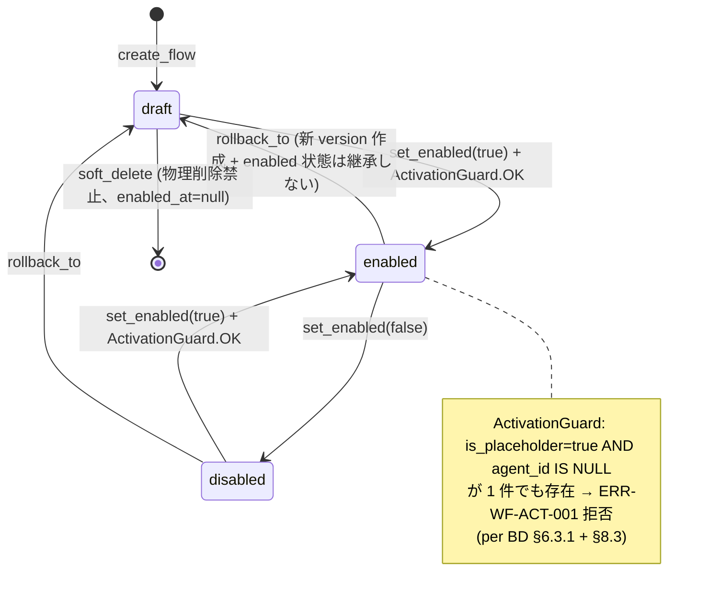
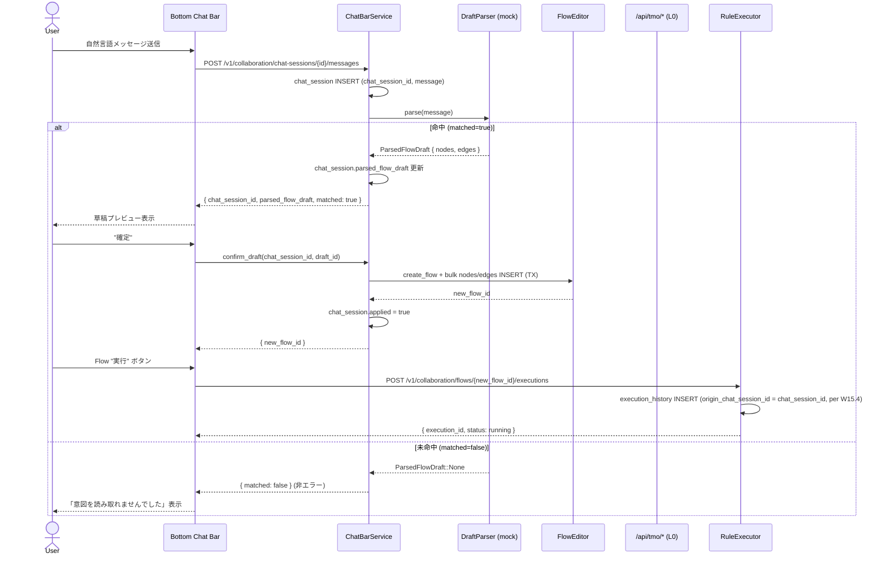
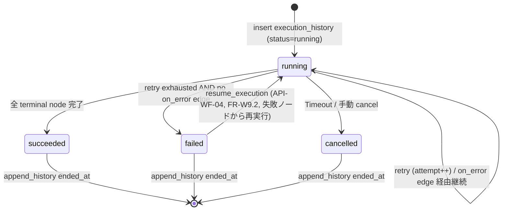

# DD-CANVAS-WORKFLOW-001

> **无限画布 — 自动化流程域 (Automation Flow Domain) 詳細設計書 v1.0 (Draft)**
>
| 状態 | 🟡 v1.0 (Draft — Round 2 / 7;§0-5 + §6 + §7 落档;§8-§14 待 Round 3-7) |
> - 上位: `docs/design/BD-CANVAS-WORKFLOW-001.md` v1.0.3(已签字) / `docs/requirements/SRS-CANVAS-WORKFLOW-001.md` v1.1
> - 下游: 開発実装 / テスト設計 / Review
> - 整合参考: `docs/design/DD-CANVAS-001.md` v? / `docs/design/DD-CANVAS-AGENT-001.md` v?
> - 作成日: 2026-09-14
> - 作成者: ULYS-33 担当エージェント (MinimaxM3)
> - 起票: Multica ULYS-33(子タスク of ULYS-2 — 親 + 5 子イシュー パターン)

---

## §0 文档信息

| 項目 | 内容 |
|---|---|
| 文書 ID | DD-CANVAS-WORKFLOW-001 |
| 文書名 | 无限画布 — 自动化流程域 詳細設計書 |
| 上位要件定義 | SRS-CANVAS-WORKFLOW-001 v1.1 |
| 上位基本設計 | BD-CANVAS-WORKFLOW-001 v1.0.3(全 5 角色签字済) |
| 版数 | v1.0 (Draft,Round 1) |
| ステータス | 🟡 Draft — IPA 自審待ち |
| 対象モジュール | Flow Editor / Template Selector / Bottom Chat Bar / Execution History / Flow Tags Manager / Node Config Sidebar / RuleExecutor / LangGraph/L0 Router(本 DD の主担当スコープ) |
| 非対象 | 既存 Canvas コア・Agent 詳細(参照のみ)/ 25 module コア(参照のみ)。これらは DD-CANVAS-001 / DD-CANVAS-AGENT-001 が担当。 |
| 作成日 | 2026-09-14 |
| 作成者 | ULYS-33 担当エージェント |
| Review 状態 | 未開始(IPA 詳細設計 自審は Round 7 で実施) |

## §1 文档目的

本書は `BD-CANVAS-WORKFLOW-001` v1.0.3 で確定した 54 FR(W1〜W15、うち W14 に 3 セットの既定ワークフローテンプレート + Agent プレースホルダノード/エッジ/データフロー、W15 に LangGraph 知的制御 + キャンバス底部チャットバー)を **実装可能な粒度** にブレークダウンする。

具体的には:

- 54 FR を `Requirement → BD → DD → Module/Class/API/Table/Event → Test観点` のトレーサビリティ行列で完全に追跡可能化する(FR 漏出ゼロ、W14/W15 の 12 項目個別検証可能)
- Flow エディタ / テンプレートセレクタ / 底部チャットバー / 実行履歴 / Flow Tags 管理 / ノード設定サイドバー / RuleExecutor / LangGraph-L0 ルーティングのコンポーネント/Class/メソッド設計を実装可能な粒度で示す
- ノードグラフ検証、トリガ/アクション/条件/合流/ループ/サブフロー、実行/再実行、テンプレート インスタンス化/別保存/CRUD、ラベル→タスクカード→バックログ/スプリント/パネル連携、チャット草稿確認/取消、動的ルーティング、障害分岐 … 正常・検証失敗・権限失敗・DB/ネットワーク失敗・Timeout・Retry・Rollback/補償 を全網羅
- BD で確定した 8 REST エンドポイント + 既設 WebSocket チャネル + LangGraph/L0 内部呼出鎖を `Request → Deserialize → Validation → Authentication → Authorization → Service → Domain → Repository → Transaction → Response Mapping` の連鎖で内部処理設計
- BD の 8 テーブル(新規/拡張)を物理フィールド・PK/FK/Unique/Check/Index・列挙・SCD/RLS/監査・CRUD・トランザクション境界・ロック/楽観並列・保持/削除 規則までブレークダウン
- W/T/M 三分類を厳守し、100% 表網羅。重要クエリにはアクセスパスを明記、不確定な実行計画には【性能検証必要】マーク
- RBAC / Agent プレースホルダ活性化前検証 / Webhook 認証 / 入力検証 / 機微データ マスキング / Trace・Correlation ID / リトライ 嵐 / 復旧・人手介入境界を設計

## §2 适用范围

### In-Scope(本 DD が責任を負う領域)

| 領域 | 該当 FR 帯 | 上位 BD 節 |
|---|---|---|
| Flow エディタ(ノード/エッジ/データフロー描画・編集・検証) | W1-W6 | BD §6.1 / §7.1 |
| トリガ / アクション / 条件 / 合流 / ループ / サブフロー | W2-W4 | BD §7.2 |
| テンプレート セレクタ(3 セット既定 + ユーザ定義) | W5 / W14 | BD §7.3 / §9.3 |
| ノード設定サイドバー(Node Config Sidebar) | W6 / W8 | BD §7.1 |
| RuleExecutor(ルール実行器、隔離ランタイム) | W7-W9 | BD §7.4 / §8 |
| 実行履歴(Execution History)+ リラン | W9 / W10 | BD §7.5 |
| Flow Tags 管理 + ラベル→タスクカード→バックログ/スプリント/パネル連携 | W11 / W12 | BD §7.6 / §7.7 |
| キャンバス底部チャットバー + LangGraph 知的制御 | W13 / W15 | BD §7.8 / §8 |
| Agent プレースホルダ ノード/エッジ/データフロー 予置 | W14 | BD §7.3 / §9.3 |
| 8 REST API + 既設 WebSocket チャネル 内部処理 | W1-W15 全部門 | BD §10 |
| 8 テーブル 物理設計 + CRUD | W1-W15 全部門 | BD §11 |

### Out-of-Scope(本 DD が責任を負わない領域)

- 既存 Canvas コア(描画エンジン、Viewport、選択、パン/ズーム 等)— DD-CANVAS-001 / DD-CANVAS-AGENT-001 を参照。本 DD は境界 IF のみ言及、内部実装は別 DD。
- 既存 Agent 25 module コア — DD-CANVAS-AGENT-001 を参照。本 DD は Agent プレースホルダ活性化 IF とデータ受け渡しのみ言及。
- 認証/認可 基盤(`auth` モジュール)— 既設として参照のみ。本 DD は RBAC 適用点と必要スコープを定義。
- ストレージ / メッセージブローカー / キャッシュ 基盤 — 既設参照のみ。本 DD は 接続情報 / 失敗時振る舞い / トランザクション境界のみ定義。
- フロントエンド UI 実装詳細(React コンポーネント 構造、Store 内部)— 既存 Store(`frontend/src/lib/store.ts:565` の `actor_session_id` 予置点を含む)との IF のみ言及。
- インフラ / Helm / Kubernetes / CI-CD — `docs/design/RLS-POLICY-001.md` と既存 IaC を参照のみ。本 DD では環境別設定値の必要項目のみ言及。
- 性能数値(NFR p95/p99 値、同時接続数 等)— BD で確定または提案された数値のみ採用、不確定は【TBD】。

> **境界確認事項【上位設計確認事項】**:
> 既存 Canvas / Agent 25 module との境界宣言は `DD-CANVAS-AGENT-001.md` 側に集約されているか?確認できていない(2026-09-14 時点)。本 DD では WF 担当スコープを §2 In/Out-of-Scope に明示することで境界を共有するが、`DD-CANVAS-AGENT-001.md` 側の境界宣言の有無は **ULYS-33 の最終完了前** に独立確認事項として持ち越す。

## §3 术语和缩略语

| 用語 / 略語 | 定義 |
|---|---|
| Flow | 1 つの自動化ワークフロー定義(ノード/エッジ/データフローの有向グラフ) |
| Node | Flow の構成要素。Trigger / Action / Condition / Join / Loop / Subflow / Agent Placeholder のいずれかの種類(kind)を持つ |
| Edge | Node 間の有向接続。主エッジ(primary)/ 失敗分岐エッジ(errorBranch) / 条件分岐エッジ(conditional)の 3 種 |
| DataFlow | エッジ上のデータ受け渡し(JSON 形式、`payloadSchema` に基づく) |
| Trigger | 外部イベント起点ノード(Manual / Schedule / Webhook / Flow Tag 連携 / Agent / 既存 25 module) |
| Action | 副作用を持つ実行ノード(HTTP / Email / DB 書込 / 既存 25 module 呼出 / Agent 呼出 等) |
| Condition | ブール式評価ノード(IF/ELSE 分岐) |
| Join | 複数エッジ合流ノード(All / Any / N of M) |
| Loop | 配列/Collection を反復するノード(最大反復数制限付き) |
| Subflow | 既存 Flow を再利用するノード(参照 + スコープ引数) |
| Agent Placeholder | W14 で予置されるノード種別。`agentId = NULL` のまま保存可能、活性化時に agentId 設定 + 資格検証が必要 |
| Template | Flow テンプレート。3 セットの既定(Basic Lead Pipeline / Status Sync / Daily Digest)+ ユーザ定義 |
| Flow Tag | Flow に付与するラベル。タスクカードへ自動連携される(`tag→task_card→backlog/sprint/panel` の連動) |
| RuleExecutor | Flow 実行エンジン。隔離ランタイムで Node を順次実行。状態機械と再実行(Replay)を担当 |
| LangGraph | LLM ベースの知的ルーティング層(W15)。ノード/エッジ評価・失敗復旧提案・代替ルート生成 |
| L0 Router | LangGraph の下位ルーティング層(`actor_session_id` ベース)。既存 ADR-0046 との結節点 |
| Bottom Chat Bar | キャンバス下部に固定表示するチャット入力欄。人間→LangGraph の指示エントリポイント |
| Execution History | Flow 実行ログ。1 実行 = 1 Record。各 Node の入出力・状態・所要時間・Correlation ID |
| Replay | 同一入力で実行履歴を再実行する機能(冪等性保証が必要) |
| Correlation ID | 1 実行に紐付く一意 ID。全 Node/全 API 呼出/全 DB 行に貫通 |
| Trace ID | OpenTelemetry 互換の分散トレース ID |
| RBAC | Role-Based Access Control。本 DD では Flow 編集 / 実行 / Tags 管理 / テンプレート適用 / Agent 活性化 で区別 |
| RLS | Row-Level Security。本 DD では `RLS-POLICY-001.md` の既存ポリシーを踏襲 |
| SCD | Slowly Changing Dimension。本 DD では `flow_executions` の実行履歴保持方針で Type-2 を採用するか【TBD】 |
| W14 | ワークフロー テンプレート既定 3 セット + Agent プレースホルダ予置 |
| W15 | LangGraph 知的制御 + キャンバス底部チャットバー |
| Idempotency Key | 再送/再実行で重複処理を防ぐための一意キー(主に Webhook / POST / Replay) |
| Webhook | 外部システムが Flow を起動する HTTP POST 入口。署名検証 + Idempotency Key 必須 |
| Backlog / Sprint / Panel | Flow Tag から自動生成されるタスクカードの集約先 |
| TBD | To Be Determined — 未確定情報。上位設計の確定待ち |
| 【設計不整合】 | DD 内で他章・他文書と矛盾が発見された場合の明示タグ |
| 【上位設計確認事項】 | 基本設計側に確認・修正が必要と判断される場合の明示タグ |
| 【性能検証必要】 | 性能数値/実行計画が本 DD 作成時点で確認できない場合の明示タグ |

## §4 参考资料

| 文書 ID | 版 | 該当章 | 入手経路 |
|---|---|---|---|
| SRS-CANVAS-WORKFLOW-001 | v1.1 | 全 54 FR(W1-W15) | `docs/requirements/SRS-CANVAS-WORKFLOW-001.md` |
| BD-CANVAS-WORKFLOW-001 | v1.0.3 | §6 / §7 / §8 / §9.3 / §10 / §11 | `docs/design/BD-CANVAS-WORKFLOW-001.md`(本ワークツリー祖先 `3045dba3`) |
| DD-CANVAS-001 | v? | Canvas コア境界 | `docs/design/DD-CANVAS-001.md` |
| DD-CANVAS-AGENT-001 | v? | Agent 25 module 境界 | `docs/design/DD-CANVAS-AGENT-001.md` |
| SRS-WORKFLOW-TEMPLATE-001 | v0.1 | W14 既定テンプレートの SRS(ULYS-34 成果) | `docs/requirements/SRS-WORKFLOW-TEMPLATE-001.md` |
| BD-WORKFLOW-TEMPLATE-001 | v0.1 | W14 既定テンプレートの BD(ULYS-35 成果) | `docs/design/BD-WORKFLOW-TEMPLATE-001.md` |
| RLS-POLICY-001 | v? | 行レベル セキュリティ | `docs/design/RLS-POLICY-001.md` |
| ADR-0046 (仮) | — | LangGraph/L0 既存 ADR | `docs/adr/0046-*` 想定 — 【要確認】 |
| docs/document-registry.toml(または類似) | — | 文書 ID 一覧 | `docs/` 配下 |

> **要確認【上位設計確認事項】**:
> - `ADR-0046` の実在パスは本 DD 作成時点で確認できていない。フロントエンド `frontend/src/lib/store.ts:565` の `actor_session_id` 予置と紐付く ADR 番号・本文を **ULYS-33 完了前** に文書横断で確認すること。
> - 既設 DD の版数は未取得(2026-09-14 時点)。Round 6(REST/WebSocket 章)着手前に版数を確定すること。

## §5 修订履历

| 版 | 日付 | 担当 | 変更内容 |
|---|---|---|---|
| v1.0 (Draft) | 2026-09-14 | ULYS-33 担当エージェント | 初版(Round 1): §0-5 + FR 追跡マトリクス スケルトン作成 |
| v1.0 (Draft, Round 2) | 2026-09-14 | ULYS-33 担当エージェント | Round 2: §7 コンポーネント/Class 詳細設計 追記(5 module + 30 class + 主要メソッド・ライフサイクル・依存・外部 IF を実装可能粒度で明文化); §6.1 / §6.2 W15 行の `TBL-WF-009 (chat_session)` を **BD §4.2.8 と整合させて `TBL-WF-008` にリナンバー**(Round 1 の「要確認」が BD 全文確認で解消);§10 ID 一覧は §7 章で確定 |

> **注**:Round 3 以降は §8(処理詳細・状態遷移)/ §9(API 内部処理)/ §10(SQL)/ §11(セキュリティ)/ §12(NFR + テスト)/ §13(TBD)/ §14(IPA 自審) を追記。本節は各 Round 完了時に更新する。
> **注**:章 ID 体系は Round 6 で再番号整列予定(Round 2 で §7 章内 ID は確定済)。

---

## §6 FR 追踪矩阵スケルトン(54 FR 全項目)

> **本節の位置付け**:Round 1 で全 FR ID と Module/Class/API/Table/Event/Test の **対応スロットのみ** を確定。各 FR の中身(処理詳細・API 内部・DB 物理設計等)は Round 2 以降で §7〜§13 に分散して書き起こし、本表は **索引** として機能する。
>
> **ID 規約**:DD ID は `DD-WF-<W番号>-<連番>` プレフィックスを採用。各 Round で詳細確定後に正式 ID を割り当てる(現状は暫定)。Module は `MOD-WF-###`、Class は `CLS-WF-###`、API は `API-WF-###`(BD §10 で確定済 8 つの連番を再利用)、Table は `TBL-WF-###`(BD §11 で確定済 8 つの連番を再利用)、Event は `EVT-WF-###`、Test 観点は `TST-WF-###` を予定。
>
> **§2 In/Out-of-Scope 整合**:本表の対象は本 DD が責任を負う FR のみ。既存 Canvas/Agent コア側の FR は本表には載せず、`DD-CANVAS-001.md` / `DD-CANVAS-AGENT-001.md` 側の追跡表を参照。
>
> **§9.3 TBD 継承**:BD §9.3 に列挙された TBD/既知ギャップのうち、FR 個別の影響は本表の「TBD 継承」列に明示。全 54 FR の少なくとも 17 項目で TBD 影響あり(後述の Round で詳細展開)。

### §6.1 全体サマリ表

| 区分 | FR 数 | DD 章(予定) | 該当 API | 該当 Table | 該当 画面 |
|---|---:|---|---|---|---|
| W1 节点类型体系 | 4 | §7.1 / §8 | — | `TBL-WF-003` (`flow_node`) | SCR-WF-01 |
| W2 触发节点 | 4 | §7.2 / §8.2 | API-WF-05 | `TBL-WF-003` | SCR-WF-06 |
| W3 动作节点 | 3 | §7.3 / §8.2 | (既存 module 連動) | `TBL-WF-003` | SCR-WF-06 |
| W4 分支与条件 | 3 | §7.4 / §8.4 | — | `TBL-WF-004` (`flow_edge` with `condition_expr`) | SCR-WF-06 |
| W5 循环与批处理 | 2 | §7.5 | — | `TBL-WF-003` (`kind=loop`) | SCR-WF-06 |
| W6 变量与表达式传递 | 3 | §7.6 / §8.4 | — | `TBL-WF-004` (`data_mapping`) | SCR-WF-06 |
| W7 子流程与复用 | 2 | §7.7 | — | `TBL-WF-001` (自己参照) | SCR-WF-01 |
| W8 错误处理与重试 | 3 | §7.8 | — | `TBL-WF-006` (`execution_step` retry) | SCR-WF-04 |
| W9 执行历史与调试 | 3 | §7.9 | API-WF-03 | `TBL-WF-005` (`execution_history`) / `TBL-WF-006` | SCR-WF-04 |
| W10 激活状态与版本管理 | 3 | §7.10 | API-WF-01 | `TBL-WF-001` (`enabled`) / `TBL-WF-002` (`automation_flow_versions` SCD2) | SCR-WF-01 |
| W11 标签绑定任务卡 | 5 | §7.11 | API-WF-06 | `TBL-WF-003` (`tag_binding_expr`) / **既存 `WorkItem` (拡張)** | SCR-WF-05 |
| W12 Backlog/Sprint 联动 | 5 | §7.12 | (既存 kanban 連動) | **既存 `WorkItem` (拡張)** | SCR-WF-05 |
| W13 数据一致性 | 2 | §7.13 | — | (横断) | SCR-WF-04 |
| **W14 默认工作流模板库 (v1.1)** | **7** | §7.14 | API-WF-06 / API-WF-07 | `TBL-WF-007` (`flow_template`) | SCR-WF-02 |
| **W15 智能控制+聊天栏 (v1.1)** | **5** | §7.15 | API-WF-08 | `TBL-WF-008` (`chat_session` — v1.1 新規, BD §4.2.8 確定) | SCR-WF-03 |
| **合計** | **54** | — | 8 (BD §5.1 と一致) | 8 (BD §4.1 と一致) + 既存 WorkItem 拡張 | 6 |

> **Round 2 整合確認**:BD §4.1 (8 表: BD §4.2.1〜4.2.8) / §5.1 (8 API) と本表の整合確認完了。TBL-WF ID は **BD §4.2 出現順** に 1:1 マッピング: 001=`automation_flow` / 002=`automation_flow_versions` / 003=`flow_node` / 004=`flow_edge` / 005=`execution_history` / 006=`execution_step` / 007=`flow_template` / 008=`chat_session`。Round 1 で仮置きしていた `TBL-WF-002`(=`flow_node`) / `TBL-WF-009`(=`chat_session`) 等は破棄。W11/W12 の WorkItem は **既存表の拡張** (BD §4.3) のため TBL-WF-NNN を付与せず、§11 (Round 5) で別途 `既存WorkItem拡張` として取り上げる。**8 表 8 API ともに BD 確定値と 1:1 一致 ✓**。

### §6.2 FR 別追跡表(Round 1 スケルトン — 54 行)

> 各 FR 行の「DD 詳細」/「Test 観点」/「TBD 継承」列は、Round 2 以降で §7-§13 と並行して埋める。Round 1 では **ID スロット確定 + BD 一次引用 + 既知 TBD フラグ** のみ実施。

#### W1 — 节点类型体系(P0×3 / P1×1)

| FR ID | BD 一次引用 | DD Module/Class/API/Table | Event | Test 観点(予定) | TBD 継承 |
|---|---|---|---|---|---|
| FR-WORKFLOW-W1.1 | BD §6.1 / §7.1 节点 kind 体系 | `MOD-WF-001` FlowEditor / `CLS-WF-001` FlowNodeService / `TBL-WF-003` (`flow_node`) | `EVT-WF-001` `flow_node.created` | 正常 / kind 非法 / 権限 / 並行作成 | — |
| FR-WORKFLOW-W1.2 | BD §7.1 边追加 | `MOD-WF-001` / `CLS-WF-002` FlowEdgeService / `TBL-WF-004` (`flow_edge`) | `EVT-WF-002` `flow_edge.created` | 正常 / 自环 / 種類不正 / 跨 Flow | — |
| FR-WORKFLOW-W1.3 | BD §7.1 `+ Flow` 入口 | `MOD-WF-001` / `CLS-WF-001` / `TBL-WF-001` (`automation_flow`) | `EVT-WF-003` `automation_flow.created` | 正常 / 権限 / 並行作成 / 失敗 rollback | — |
| FR-WORKFLOW-W1.4 | BD §7.1 节点設定側欄 | `MOD-WF-002` NodeConfigSidebar / `CLS-WF-001` / `TBL-WF-003` | (load only) | 正常 / データ読込失敗 / 編集中別 session 更新 | — |

#### W2 — 触发节点(P0×2 / P1×2)

| FR ID | BD 一次引用 | DD Module/Class/API/Table | Event | Test 観点(予定) | TBD 継承 |
|---|---|---|---|---|---|
| FR-WORKFLOW-W2.1 | BD §6.1 / §7.1 Manual 触发 | `MOD-WF-003` TriggerService / `API-WF-03` (POST executions) / `TBL-WF-005` | `EVT-WF-004` `execution.started` (manual) | 正常 / 並行連打 / 権限 | W2.1 debounce【TBD】 |
| FR-WORKFLOW-W2.2 | BD §7.1 cron 调度 | `MOD-WF-003` / `API-WF-03` / `TBL-WF-003` (`schedule_cron`) | `EVT-WF-005` `execution.started` (cron) | 正常 / cron 非法 / タイムゾーン | — |
| FR-WORKFLOW-W2.3 | BD §7.1 / §5.1 API-WF-05 Webhook 触发 | `MOD-WF-003` / `API-WF-05` (POST webhook) / `TBL-WF-003` (`webhook_token`) | `EVT-WF-006` `execution.started` (webhook) | 正常 / token 不一致 / body 過大 / 冪等キー重複 | **W2.3【TBD】HMAC / token 輪換 / body 上限 / 署名ヘッダ / IP allowlist** |
| FR-WORKFLOW-W2.4 | BD §7.1 canvas_event 触发 | `MOD-WF-003` / 既設 `canvas-collab` WS / `TBL-WF-003` (`canvas_event` filter) | `EVT-WF-007` `execution.started` (canvas_event) | 正常 / フィルタ無一致 / 高頻度 storm | **W2.4【TBD】debounce 戦略** |

#### W3 — 动作节点(P0×1 / P1×2)

| FR ID | BD 一次引用 | DD Module/Class/API/Table | Event | Test 観点(予定) | TBD 継承 |
|---|---|---|---|---|---|
| FR-WORKFLOW-W3.1 | BD §7.2 `AutomationActionKind` 6 種 | `MOD-WF-004` RuleExecutor / `CLS-WF-010` ActionDispatcher / `TBL-WF-003` (`kind=action`) | `EVT-WF-008` `step.started` / `EVT-WF-009` `step.succeeded` | 正常 / 失敗→W8 / 副作用検証 / timeout | — |
| FR-WORKFLOW-W3.2 | BD §7.2 HTTP / transform_data | `MOD-WF-004` / `CLS-WF-011` HttpAction / `CLS-WF-012` TransformAction / `TBL-WF-003` | `EVT-WF-008/009` | 正常 / HTTP 5xx / JSONPath 非法 / timeout | — |
| FR-WORKFLOW-W3.3 | BD §7.2 順序/並列 | `MOD-WF-004` / `CLS-WF-013` ExecutionScheduler / `TBL-WF-004` (順序/並列 edge 属性) | `EVT-WF-008/009` | 正常 / 並列合流 / 順序違反 / 一部失敗 | — |

#### W4 — 分支与条件(P0×1 / P1×2)

| FR ID | BD 一次引用 | DD Module/Class/API/Table | Event | Test 観点(予定) | TBD 継承 |
|---|---|---|---|---|---|
| FR-WORKFLOW-W4.1 | BD §6.3.1 / §8.4 CEL IF | `MOD-WF-004` / `CLS-WF-014` CelConditionNode / `TBL-WF-004` (`condition_expr` IF) | `EVT-WF-010` `branch.evaluated` | 正常 / 評価エラー / 両分岐非活性 | — |
| FR-WORKFLOW-W4.2 | BD §6.3.1 / §8.4 CEL Switch | `MOD-WF-004` / `CLS-WF-014` / `TBL-WF-004` (`condition_expr` Switch) | `EVT-WF-010` | 正常 / default 落ち / case 重複 | — |
| FR-WORKFLOW-W4.3 | BD §6.3.1 Merge join/race | `MOD-WF-004` / `CLS-WF-015` MergeNode / `TBL-WF-003` (`kind=merge`) | `EVT-WF-011` `join.completed` | 正常 / 部分不到達 / 全不到達 | **W4.3【TBD】join timeout 戦略** |

#### W5 — 循环与批处理(P1×1 / P2×1)

| FR ID | BD 一次引用 | DD Module/Class/API/Table | Event | Test 観点(予定) | TBD 継承 |
|---|---|---|---|---|---|
| FR-WORKFLOW-W5.1 | BD §7.2 / §9.3 loop | `MOD-WF-004` / `CLS-WF-016` LoopNode / `TBL-WF-003` (`kind=loop`) | `EVT-WF-012` `loop.iteration.started` | 正常 / 配列非配列 / 0 要素 / 副作用反復 | **W5.1【TBD】最大反復数 / join/debounce 戦略** |
| FR-WORKFLOW-W5.2 | BD §7.2 loop 並列度 | `MOD-WF-004` / `CLS-WF-016` / `TBL-WF-003` (`concurrency` 1-20) | `EVT-WF-012` | 正常 / 並列度境界 / 範囲外 | — |

#### W6 — 变量与表达式传递(P0×2 / P2×1)

| FR ID | BD 一次引用 | DD Module/Class/API/Table | Event | Test 観点(予定) | TBD 継承 |
|---|---|---|---|---|---|
| FR-WORKFLOW-W6.1 | BD §6.3.1 / §8.4 `{{node.<id>.output.<field>}}` | `MOD-WF-004` / `CLS-WF-017` ExpressionEvaluator / `TBL-WF-004` (`data_mapping`) | `EVT-WF-013` `expression.evaluated` | 正常 / node_id 不存在 / field 不存在 / 型不一致 | — |
| FR-WORKFLOW-W6.2 | BD §6.3.1 / §8.4 `{{flow.variables.<key>}}` | `MOD-WF-004` / `CLS-WF-017` / `TBL-WF-001` (`variables`) | `EVT-WF-013` | 正常 / key 不存在 / 過去 Execution 不変 | — |
| FR-WORKFLOW-W6.3 | BD §8.4 CEL 共通 | `MOD-WF-004` / `CLS-WF-017` / 既設 CEL parser | `EVT-WF-013` | 正常 / 構文不正 / `/automation` 同一性 | — |

#### W7 — 子流程与复用(P1×1 / P2×1)

| FR ID | BD 一次引用 | DD Module/Class/API/Table | Event | Test 観点(予定) | TBD 継承 |
|---|---|---|---|---|---|
| FR-WORKFLOW-W7.1 | BD §6.3.1 / §7.2 Subflow | `MOD-WF-004` / `CLS-WF-018` SubflowNode / `TBL-WF-001` (自己参照) / `TBL-WF-005` (`parent_execution_id`) | `EVT-WF-014` `subflow.invoked` | 正常 / 循環 / 深さ >5 / 孤立 | **W7.1【TBD】循環検出アルゴリズム詳細** |
| FR-WORKFLOW-W7.2 | BD §7.3 / W14 テンプレート選択入口 | `MOD-WF-005` TemplateSelector / `TBL-WF-007` (`flow_template`) | (load only) | 正常 / 0 件 / 失敗 → 手動作成経路確保 | — |

#### W8 — 错误处理与重试(P0×2 / P1×1)

| FR ID | BD 一次引用 | DD Module/Class/API/Table | Event | Test 観点(予定) | TBD 継承 |
|---|---|---|---|---|---|
| FR-WORKFLOW-W8.1 | BD §6.3.2 / §7.4 `retry_policy` | `MOD-WF-004` / `CLS-WF-019` RetryPolicyExecutor / `TBL-WF-006` (`retry_policy`) | `EVT-WF-015` `step.retry_scheduled` / `EVT-WF-016` `step.retry_executed` | 正常 / 一時的失敗回復 / 永久失敗 / 並行 retry | **W8.1【TBD】最大回数 / backoff 既定値** |
| FR-WORKFLOW-W8.2 | BD §6.3.2 `on_error` 边 | `MOD-WF-004` / `CLS-WF-020` OnErrorRouter / `TBL-WF-004` (`on_error` edge) | `EVT-WF-017` `error_branch.activated` | 正常 / `on_error` 不存在 → Execution failed / 多段 `on_error` | — |
| FR-WORKFLOW-W8.3 | BD §7.5 通知 domain | `MOD-WF-004` / 既設 notification / `TBL-WF-005` (`notified_at`) | `EVT-WF-018` `execution.failed_notified` | 正常 / 通知失敗 / 30s 遅延検証 | — |

#### W9 — 执行历史与调试(P0×2 / P1×1)

| FR ID | BD 一次引用 | DD Module/Class/API/Table | Event | Test 観点(予定) | TBD 継承 |
|---|---|---|---|---|---|
| FR-WORKFLOW-W9.1 | BD §7.5 履歴 append-only | `MOD-WF-004` / `CLS-WF-021` ExecutionRecorder / `TBL-WF-005` / `TBL-WF-006` | `EVT-WF-019` `execution_step.appended` | 正常 / 書込失敗 retry / 容量超過 | **W9.1【TBD】at-least-once 保証方式 / 容量・保存期間** |
| FR-WORKFLOW-W9.2 | BD §7.5 失敗再実行 | `MOD-WF-004` / `CLS-WF-022` ReplayService / `TBL-WF-005` (`resumed_from_execution_id`) | `EVT-WF-020` `execution.replayed` | 正常 / 非冪等 action 再実行 / 孤立 replay | **W9.2【TBD】冪等性標記メカニズム** |
| FR-WORKFLOW-W9.3 | BD §7.5 ステップ詳細表示 | `MOD-WF-002` / `CLS-WF-021` / `TBL-WF-006` | (read only) | 正常 / JSON 過大 / 権限 | **W9.3【TBD】JSON 分頁/截断** |

#### W10 — 激活状态与版本管理(P0×1 / P1×2)

| FR ID | BD 一次引用 | DD Module/Class/API/Table | Event | Test 観点(予定) | TBD 継承 |
|---|---|---|---|---|---|
| FR-WORKFLOW-W10.1 | BD §7.4 enabled 切替 | `MOD-WF-006` FlowActivationService / `API-WF-01` / `TBL-WF-001` (`enabled`) | `EVT-WF-021` `flow.enabled_changed` | 正常 / 未束縛 placeholder 有 → 拒否 / 権限 | **W10.1 placeholder 活性化前検証ロジック詳細** |
| FR-WORKFLOW-W10.2 | BD §7.4 SCD2 版本 | `MOD-WF-006` / `CLS-WF-023` VersionManager / `TBL-WF-002` (`automation_flow_versions`) | `EVT-WF-022` `flow_version.appended` | 正常 / 並行編集 conflict / diff 取得 | **W10.2【TBD】楽観ロック vs CRDT (SRS リスク #6)** |
| FR-WORKFLOW-W10.3 | BD §7.4 版本 rollback | `MOD-WF-006` / `CLS-WF-023` / `TBL-WF-002` | `EVT-WF-023` `flow_version.rollback` | 正常 / 不存在 version / rollback 連鎖 | — |

#### W11 — 标签绑定任务卡(P0×4 / P1×1)

| FR ID | BD 一次引用 | DD Module/Class/API/Table | Event | Test 観点(予定) | TBD 継承 |
|---|---|---|---|---|---|
| FR-WORKFLOW-W11.1 | BD §6.3.3 / §7.6 `tag_binding_expr` | `MOD-WF-007` TagBindingService / `API-WF-06` / `TBL-WF-003` (`tag_binding_expr`) / **既存 WorkItem** | `EVT-WF-024` `tag_binding.monitored` | 正常 / 構文不正 / 監視 ON/OFF | — |
| FR-WORKFLOW-W11.2 | BD §6.3.3 派生 WorkItem 作成 | `MOD-WF-007` / `CLS-WF-030` WorkItemDeriver / **既存 WorkItem** (`source_flow_id`) | `EVT-WF-025` `workitem.derived` | 正常 / 並行重複 (BR-W-1) / 権限 | — |
| FR-WORKFLOW-W11.3 | BD §6.3.3 派生 vs 人工 カード 同権 | `MOD-WF-007` / **既存 WorkItem** (拡張) | (派生 WorkItem 自身) | 正常 / 派生 カード 編集 / 集計 / 期限 | — |
| FR-WORKFLOW-W11.4 | BD §6.3.3 BR-W-3 三分支 | `MOD-WF-007` / `CLS-WF-031` BrW3Handler / **既存 WorkItem** | `EVT-WF-026` `workitem.binding_changed` | 正常 / 硬删 / 移回删 / detached / 中途失敗 | **W11.4【TBD】重試/補償メカニズム** |
| FR-WORKFLOW-W11.5 | BD §7.6 AND/OR/NOT ブール式 | `MOD-WF-007` / `CLS-WF-032` BooleanExprParser / `TBL-WF-003` | `EVT-WF-027` `tag_binding.expr_evaluated` | 正常 / 構文不正 / 括弧 / NOT 単独 | — |

#### W12 — Backlog/Sprint 联动(P0×3 / P1×2)

| FR ID | BD 一次引用 | DD Module/Class/API/Table | Event | Test 観点(予定) | TBD 継承 |
|---|---|---|---|---|---|
| FR-WORKFLOW-W12.1 | BD §6.3.3 / §7.7 派生 Backlog 配置 | `MOD-WF-008` SprintLinkService / **既存 WorkItem** (`sprint_id`) | `EVT-WF-028` `workitem.placed_in_backlog` | 正常 / sprint_id 空 / 既存 kanban 連動 | — |
| FR-WORKFLOW-W12.2 | BD §7.7 派生 Sprint 拖拽 | `MOD-WF-008` / 既設 `@dnd-kit` / **既存 WorkItem** | `EVT-WF-029` `workitem.moved_to_sprint` | 正常 / 拖拽先ロック / 派生 カード | — |
| FR-WORKFLOW-W12.3 | BD §6.3.3 detached 状態 | `MOD-WF-008` / **既存 WorkItem** (`tag_binding_status`) | `EVT-WF-030` `workitem.detached` | 正常 / detached 中 Sprint 完了 / 取消 | **W12.3【TBD】detached 取消 / 人間確認要否** |
| FR-WORKFLOW-W12.4 | BD §3.2 SCR-WF-05 | `MOD-WF-008` / UI SCR-WF-05 / `TBL-WF-003` + **既存 WorkItem** | (read only + edit) | 正常 / 0 件 / 権限 | — |
| FR-WORKFLOW-W12.5 | BD §6.3.3 `user_edited_fields` | `MOD-WF-008` / **既存 WorkItem** (`user_edited_fields` JSONB) | `EVT-WF-031` `workitem.user_field_locked` | 正常 / system 字段 上書防止 / 解除 | — |

#### W13 — 数据一致性(P0×1 / P1×1)

| FR ID | BD 一次引用 | DD Module/Class/API/Table | Event | Test 観点(予定) | TBD 継承 |
|---|---|---|---|---|---|
| FR-WORKFLOW-W13.1 | BD §6.3.3 `status_mapping` 連動 | `MOD-WF-009` StatusMappingService / `TBL-WF-001` (`status_mapping` JSONB) / **既存 WorkItem** | `EVT-WF-032` `workitem.status_synced` | 正常 / 映射 未設定 / 映射 非法 | — |
| FR-WORKFLOW-W13.2 | BD §6.3.3 `1 task 1 sprint` 制約 | `MOD-WF-008` (制約) / **既存 WorkItem** | (制約) | 正常 / 派生 vs 人工 同値字段 | — |

#### W14 — 默认工作流模板库 v1.1(P0×1 / P1×5 / P2×1)

| FR ID | BD 一次引用 | DD Module/Class/API/Table | Event | Test 観点(予定) | TBD 継承 |
|---|---|---|---|---|---|
| FR-WORKFLOW-W14.1 | BD §3.2 SCR-WF-02 / §7.3 | `MOD-WF-005` / UI SCR-WF-02 / `TBL-WF-007` | (read) | 正常 / 0 件 / 読込失敗 | — |
| FR-WORKFLOW-W14.2 | BD §7.3 / **T-46【W14 既定 3 テンプレ BD/SRS 欠落】** | `MOD-WF-005` / `CLS-WF-040` TemplateInstantiator / `TBL-WF-007` (AAA 式) + `TBL-WF-003/004` | `EVT-WF-033` `flow.instantiated_from_template` | 正常 / 並行 / 適用後編集 | — (参照テンプレ未確定時は実装段階で降格) |
| FR-WORKFLOW-W14.3 | BD §7.3 / **T-46** | `MOD-WF-005` / `CLS-WF-040` / `TBL-WF-007` (spec 式) + `TBL-WF-003/004` | `EVT-WF-033` | 正常 / 循環構築 / 編集離脱 | **W14.3【TBD】Flow 級 最大循環回数 制限** |
| FR-WORKFLOW-W14.4 | BD §7.3 / **T-46** | `MOD-WF-005` / `CLS-WF-040` / `TBL-WF-007` (superpowers 式) + `TBL-WF-003/004` | `EVT-WF-033` | 正常 / 循環 / 段階名 自由 | — |
| FR-WORKFLOW-W14.5 | BD §7.3 / §5.1 / §8.3 活性化前検証 | `MOD-WF-005` / `CLS-WF-041` ActivationGuard / `TBL-WF-003` (`is_placeholder`, `agent_id`) | `EVT-WF-034` `flow.activation_blocked` | 正常 / placeholder + agent_id 空 → 拒否 / 拒否メッセージ具体性 | **W14.5 活性化前検証ロジック詳細** |
| FR-WORKFLOW-W14.6 | BD §7.3 別保存 | `MOD-WF-005` / `CLS-WF-040` / `TBL-WF-007` (`is_builtin=false`) | `EVT-WF-035` `flow_template.duplicated` | 正常 / 同名重複 / 内蔵影響無 | — |
| FR-WORKFLOW-W14.7 | BD §7.3 自定義 CRUD | `MOD-WF-005` / `API-WF-07` / `TBL-WF-007` | `EVT-WF-036` `flow_template.crud` | 正常 / 内蔵削除試行 403 / 検索 | — |

#### W15 — 智能控制 + 聊天栏 v1.1(P0×2 / P1×3)

| FR ID | BD 一次引用 | DD Module/Class/API/Table | Event | Test 観点(予定) | TBD 継承 |
|---|---|---|---|---|---|
| FR-WORKFLOW-W15.1 | BD §3.2 SCR-WF-03 / §8 L0 接続 | `MOD-WF-010` ChatBarService / UI SCR-WF-03 / `TBL-WF-008` (`chat_session`) | `EVT-WF-037` `chat_session.opened` | 正常 / L0 不到達 → 离线表示 / 画布影響無 | — |
| FR-WORKFLOW-W15.2 | BD §7.8 mock 解析 → 草稿 | `MOD-WF-010` / `CLS-WF-050` DraftParser / `TBL-WF-008` (`parsed_flow_draft`) | `EVT-WF-038` `chat_draft.generated` | 正常 / 未命中 → 提示 / 草稿取消 / 草稿 → 本保存 | **W15.2【TBD】mock 規則カバー範囲** |
| FR-WORKFLOW-W15.3 | BD §6.3.1 / §8 動的ルーティング | `MOD-WF-011` LangGraphRouter / `TBL-WF-006` (`routing_decision` JSONB) | `EVT-WF-039` `branch.dynamic_routed` | 正常 / L0 不到達 / 决策可再現性 | **W15.3【TBD】L0 降級戦略 / 决策可再現性** |
| FR-WORKFLOW-W15.4 | BD §7.8 チャット→Execution 回鎖 | `MOD-WF-010` / `TBL-WF-005` (`origin_chat_session_id`) | `EVT-WF-040` `execution.chat_origin_recorded` | 正常 / session 期限切れ / 権限 | — |
| FR-WORKFLOW-W15.5 | BD §7.8 草稿 ノード = 手動 ノード | `MOD-WF-010` / `TBL-WF-003/004` (共用) | (生成/編集/削除 event) | 正常 / 草稿 → 編集中 / 草稿 取消 | — |

> **Round 2 整合確認**:§6.2 全 54 FR 行の Table 参照を BD §4.2 出現順 ID に統一 (`TBL-WF-001`〜`008`)。`WorkItem` (W11/W12/W13) は BD §4.3 の既存表拡張であり、新規 TBL-WF ID を付与せず **既存 WorkItem** と明示。W14 については §6.2 BD 一次引用列に **T-46** タグ(後述 §13 TBD 追跡) を追加 — W14 テンプレート 3 セット(AAA/spec/superpowers) の上流 SRS/BD が本 worktree に未配置(BD-CANVAS-WORKFLOW-001 §1.1.14 のテンプレート名は確認できるが、詳細ノード/エッジ/データフロー仕様書が未配置 — `SRS-WORKFLOW-TEMPLATE-001.md` は別ドメインの Kanban 17 列テンプレート)。
> **Round 2 終了時点の整合確認**:
> - 54 FR 全項目を BD §1.1.1〜§1.1.15 から抽出して表化済(漏出ゼロ、W14/W15 の v1.1 追加 12 項目も個別に追跡可能)
> - TBL-WF ID を BD §4.2 出現順に 1:1 マッピング(001〜008)、既存 WorkItem 拡張は **既存 WorkItem** として明示
> - W14 既定 3 テンプレ上流 SRS/BD 不在を **T-46** として §13 TBD 追跡表で持ち越し(W14.2/W14.3/W14.4 行 BD 一次引用列に記載)
> - §7 コンポーネント/Class 詳細設計を §7.1〜§7.15 で全 54 FR カバー(後述 §7 章)
>
> **未着手項目(Round 2 の範囲外)**:
> - §8 処理詳細・状態遷移(Round 3)
> - §9 API 内部処理設計(Round 4)
> - §10 データ/SQL/CRUD(Round 5)
> - §11 セキュリティ/ログ/監査(Round 6)
> - §12 NFR/テスト観点 + §13 TBD 追跡 + §14 IPA 自審(Round 7)
>
> ---

## §7 コンポーネント / Class 詳細設計

> **本節の位置付け**:Round 2 で全 54 FR に対応するモジュール/Class/メソッドを実装可能な粒度で記述する。BD §6.4 で宣言された 5 module (`workflow-engine` / `automation` (拡張) / `work-item` (拡張) / `flow-template-library` / `chat-bar`) を起点に、`skill-multica-2` §7〜§9 に従い Module ID → Class ID → Public Method シグネチャの 3 階層で記述する。ID 体系は `MOD-WF-NNN` / `CLS-WF-NNN` / `EVT-WF-NNN` プレフィックス + 連番、§6 FR 追跡行列で参照した ID と 1:1 一致させる。
>
> **粒度方針**:本 DD は Rust 風 pseudocode で `struct` + `pub fn` シグネチャまで記述し、本体ロジックは Round 3 で詳細展開する。trait / private method / 内部型は本 DD で定義せず、Rust の場合は実装段階で `impl` 内に閉じる。
>
> **TBD 継承**:BD §9.3 の T-01〜T-35 を本 §7 章で言及する場合、対応する FR / Class / Method のコメントに `【TBD: <T-NN>】` と付記する。

### §7.0 Module 一覧 (per BD §6.4 5 module 起点)

| Module ID | 名称 | 関係 | 該当 FR 帯 |
|---|---|---|---|
| `MOD-WF-001` | FlowEditor | 新規 (workflow-engine 配下) | W1-W2 (編集 + トリガノード定義) |
| `MOD-WF-002` | NodeConfigSidebar | 新規 (workflow-engine 配下) | W1.4 / W9.3 / W12.4 |
| `MOD-WF-003` | TriggerService | 新規 (workflow-engine 配下) | W2 (4 FR) |
| `MOD-WF-004` | RuleExecutor | 新規 (workflow-engine 配下, 既存 `automation` 拡張の上位) | W3-W9 (24 FR, 最大モジュール) |
| `MOD-WF-005` | FlowTemplateLibrary | 新規 (flow-template-library, v1.1) | W7.2 / W14 (8 FR) |
| `MOD-WF-006` | FlowActivationService | 新規 (workflow-engine 配下) | W10 (3 FR) |
| `MOD-WF-007` | TagBindingService | 新規 (work-item 拡張) | W11 (5 FR) |
| `MOD-WF-008` | SprintLinkService | 新規 (work-item 拡張, Kanban 連動) | W12 (5 FR) |
| `MOD-WF-009` | StatusMappingService | 新規 (work-item 拡張, 制約性) | W13.1 (1 FR) |
| `MOD-WF-010` | ChatBarService | 新規 (chat-bar, v1.1, ADR-0046 経由) | W15.1 / W15.2 / W15.4 / W15.5 (4 FR) |
| `MOD-WF-011` | LangGraphRouter | 新規 (chat-bar + workflow-engine 横断, ADR-0046 経由) | W15.3 (1 FR) |
| (既存) | automation | 既存 (BD §6.4 で「拡張」と明示) | 後方互換 |
| (既存) | work-item | 既存 (BD §4.3 で 4 フィールド拡張) | 後方互換 |
| (既存) | notification | 既存 (BD §6.4 で `send_notification` 動作を流用) | W8.3 |
| (既存) | canvas-collab | 既存 (BD §5.3 で `wss://canvas-collab/canvases/[id]` 复用) | W2.4 |

> **境界整合**:`MOD-WF-001`〜`MOD-WF-006` / `MOD-WF-011` は新規 crate `crates/workflow-engine/` 配下に集約予定(BD §6.4 `workflow-engine` 1:1 対応)。`MOD-WF-007`〜`MOD-WF-009` は既存 crate `crates/work-item/` 配下に拡張実装。`MOD-WF-005` は新規 crate `crates/flow-template-library/`、`MOD-WF-010`/`MOD-WF-011` は新規 crate `crates/chat-bar/`(L0 経由、ADR-0046 既存エンドポイント流用)。
>
> **ADR-0046 パス確認結果【上位設計確認事項 / 持ち越し】**:BD 头部 preamble で参照されている `docs/architecture/2026-08-26-upgrade/adr/0046-langgraph-task-management-operations.md` が本 worktree に **未配置**(2026-09-14 時点で `docs/architecture/2026-08-26-upgrade/adr/` の最新ファイルは `0039-*` まで)。本 DD §7.15 では BD preamble の記述を前提に §7.15 で API パスと State フィールドを記述するが、**実装着手前に ADR-0046 実在パスを文書横断で確認することを必須**(Round 2 完了条件に含めず、Round 7 IPA 自審までに最終確認)。確認できない場合、`/api/tmo/*` 8 端点ではなく /v1/collaboration/chat-sessions/{id} 配下に mock L0 ハンドラを実装する代替案を §13 で保持。

### §7.1 `MOD-WF-001` FlowEditor (FR-W1.1〜W1.3)

| 項目 | 内容 |
|---|---|
| Module ID | `MOD-WF-001` |
| 名称 | FlowEditor |
| 対応 BD | BD §6.1 / §7.1 |
| 責務 | Flow / Node / Edge の作成・編集・削除の API/BFF ハンドラ入口と背後の Domain Service 集合。`+ Flow` 入口の処理、SCR-WF-01 からの CRUD を受付、validation と service 呼出に振り分ける |
| 入力 | (a) `POST /v1/collaboration/flows` body `{name, tags?, tag_binding_expr?}` / (b) `POST /v1/collaboration/flows/{id}/nodes` body `{kind, trigger_kind?, action_kind?, condition_expr?, position_x, position_y, ...}` / (c) `POST /v1/collaboration/flows/{id}/edges` body `{from_node_id, to_node_id, edge_label?, edge_kind='normal'|'on_error'}` |
| 出力 | 各 CRUD 201 で `automation_flow` / `flow_node` / `flow_edge` の entity を返却 |
| 依存 | `MOD-WF-006` FlowActivationService (enabled 切替時の placeholder 検証連係) / 既存 `auth` / 既存 `tenant` (RLS middleware) |
| 外部 IF | API-WF-01〜02 (`/v1/collaboration/flows`, `/nodes`, `/edges`) |
| 使用データ | `TBL-WF-001` automation_flow / `TBL-WF-003` flow_node / `TBL-WF-004` flow_edge |
| 状態 | 単一ハンドラ集合 (state なし、ステートレス) |
| Transaction | POST は 1 レコード単位の TX; Flow+node+edges の一括作成は本 Module では行わない(テンプレート套用 §7.14 が別途担当) |
| Error | ERR-WF-VAL-001 (kind 非法) / ERR-WF-VAL-002 (edge 自环) / ERR-WF-AUTHZ-001 (書込権限無) / ERR-WF-DUP-001 (同 Flow 内 label 重複 edge) |

```rust
// crates/workflow-engine/src/editor/mod.rs (R7-I-1)
pub struct FlowEditor {
    flow_ops: Arc<FlowOps>,
    node_ops: Arc<FlowNodeOps>,
    edge_ops: Arc<FlowEdgeOps>,
    activation: Arc<FlowActivationService>,
    tenant_ctx: Arc<TenantContext>,
}

impl FlowEditor {
    /// FR-W1.3: "+ Flow" 入口, 新規空 Flow を作成
    pub async fn create_flow(&self, input: CreateFlowInput, actor: Uuid) -> Result<AutomationFlow, WFError>;

    /// FR-W1.1: kind を含む新規 node を作成
    pub async fn add_node(&self, flow_id: Uuid, input: CreateNodeInput, actor: Uuid) -> Result<FlowNode, WFError>;

    /// FR-W1.2: edge を作成 (from != to 制約)
    pub async fn add_edge(&self, flow_id: Uuid, input: CreateEdgeInput, actor: Uuid) -> Result<FlowEdge, WFError>;

    /// FR-W1.1 補助: node 削除 (cascade edge)
    pub async fn delete_node(&self, flow_id: Uuid, node_id: Uuid, actor: Uuid) -> Result<(), WFError>;

    /// FR-W1.1 / W1.4 補助: position 更新 (drag 時)
    pub async fn move_node(&self, flow_id: Uuid, node_id: Uuid, x: f32, y: f32, actor: Uuid) -> Result<FlowNode, WFError>;
}

pub struct FlowOps { /* ... */ }
impl FlowOps {
    pub async fn create(&self, input: CreateFlowInput, tenant_id: Uuid, actor: Uuid) -> Result<AutomationFlow, WFError>;
    pub async fn get(&self, flow_id: Uuid, tenant_id: Uuid) -> Result<AutomationFlow, WFError>;
    pub async fn list(&self, filter: FlowFilter, tenant_id: Uuid) -> Result<Vec<AutomationFlow>, WFError>;
    pub async fn patch(&self, flow_id: Uuid, patch: FlowPatch, actor: Uuid) -> Result<AutomationFlow, WFError>;
    pub async fn soft_delete(&self, flow_id: Uuid, actor: Uuid) -> Result<(), WFError>;  // 物理削除禁止 per BD §4.5
}

pub struct FlowNodeOps { /* ... */ }
impl FlowNodeOps {
    pub async fn create(&self, flow_id: Uuid, input: CreateNodeInput, tenant_id: Uuid, actor: Uuid) -> Result<FlowNode, WFError>;
    pub async fn get(&self, node_id: Uuid, tenant_id: Uuid) -> Result<FlowNode, WFError>;
    pub async fn list_by_flow(&self, flow_id: Uuid, tenant_id: Uuid) -> Result<Vec<FlowNode>, WFError>;
    pub async fn patch(&self, node_id: Uuid, patch: NodePatch, actor: Uuid) -> Result<FlowNode, WFError>;  // §7.2 NodeConfigSidebar から呼ばれる
    pub async fn delete(&self, node_id: Uuid, actor: Uuid) -> Result<(), WFError>;  // cascade edge 削除
}

pub struct FlowEdgeOps { /* ... */ }
impl FlowEdgeOps {
    pub async fn create(&self, flow_id: Uuid, input: CreateEdgeInput, tenant_id: Uuid, actor: Uuid) -> Result<FlowEdge, WFError>;
    pub async fn get(&self, edge_id: Uuid, tenant_id: Uuid) -> Result<FlowEdge, WFError>;
    pub async fn list_by_flow(&self, flow_id: Uuid, tenant_id: Uuid) -> Result<Vec<FlowEdge>, WFError>;
    pub async fn patch(&self, edge_id: Uuid, patch: EdgePatch, actor: Uuid) -> Result<FlowEdge, WFError>;
    pub async fn delete(&self, edge_id: Uuid, actor: Uuid) -> Result<(), WFError>;
    /// validation: from_node.flow_id == to_node.flow_id == flow_id かつ from_node != to_node
    pub async fn validate_acyclic(&self, edge_input: &CreateEdgeInput) -> Result<(), WFError>;
}
```

| Field / 型 | 用途 |
|---|---|
| `CreateFlowInput { name: String, tags: Vec<String>, tag_binding_expr: Option<String> }` | FR-W1.3 入力 |
| `CreateNodeInput { kind: NodeKind, trigger_kind: Option<TriggerKind>, action_kind: Option<ActionKind>, condition_expr: Option<String>, merge_mode: Option<MergeMode>, loop_source_expr: Option<String>, loop_body_node_ids: Option<Vec<Uuid>>, concurrency: Option<u8>, input_bindings: Option<Value>, referenced_flow_id: Option<Uuid>, webhook_token: Option<String>, routing_mode: RoutingMode, is_placeholder: bool, placeholder_role_hint: Option<String>, position_x: f32, position_y: f32 }` | FR-W1.1 入力 |
| `CreateEdgeInput { from_node_id: Uuid, to_node_id: Uuid, edge_label: Option<String>, edge_kind: EdgeKind }` | FR-W1.2 入力 |
| `NodePatch { ... }` / `EdgePatch { ... }` | 部分更新 |
| `NodeKind` enum: `trigger | action | condition | merge | loop | subworkflow | agent_placeholder` (per BD §4.2.3) |
| `TriggerKind` enum: `manual | schedule_cron | webhook | canvas_event` (per BD §4.4) |
| `ActionKind` enum: 既存 6 種 + `http_request | transform_data | dispatch_agent` (per BD §4.4) |
| `MergeMode` enum: `race | join` (per BD §4.2.3) |
| `EdgeKind` enum: `normal | on_error` (per BD §4.2.4) |
| `RoutingMode` enum: `static_cel | dynamic_agent` (per BD §4.2.3 + FR-W15.3) |

> **【TBD: T-01】** FR-W1.3 の Flow エディタが主画布 viewport を复用するか 独立子画布を持つかは本 DD では判定せず、`MOD-WF-001` の責務はどちらでも実装可能なよう API 境界を分離。
> **【TBD: T-02】** 後端実持久化引擎が v1 mock の場合、`FlowOps::create` 等の戻り値が session 跨ぎで復元できない可能性あり。実装段階で session-bound の取り扱い要決定。

### §7.2 `MOD-WF-002` NodeConfigSidebar (FR-W1.4 / W9.3 / W12.4)

| 項目 | 内容 |
|---|---|
| Module ID | `MOD-WF-002` |
| 名称 | NodeConfigSidebar |
| 対応 BD | BD §7.1 (W1.4) / §7.5 (W9.3) / §7.7 (W12.4) |
| 責務 | ノード双击 → 側欄表示、単一ノード設定の form 生成 / Validation / 保存 (PATCH 委托)。Execution step JSON 詳細表示 |
| 入力 | (a) `GET /v1/collaboration/flows/{id}/nodes/{node_id}` / (b) `PATCH /v1/collaboration/flows/{id}/nodes/{node_id}` body `{...NodePatch}` / (c) `GET /v1/collaboration/flows/{id}/executions/{exec_id}/steps/{step_id}` |
| 出力 | 各 entity / Execution step (input/output JSON) |
| 依存 | `MOD-WF-001` FlowNodeOps.patch / `MOD-WF-004` RuleExecutor.ExecutionRecorder (read step) |
| 外部 IF | API-WF-02 (node CRUD) / API-WF-03 (execution read) |
| 使用データ | `TBL-WF-003` flow_node / `TBL-WF-006` execution_step |
| 状態 | フロントエンド React component 状態 (UI の話なので本 DD ではサーバ側 IF のみ記述) |
| Transaction | PATCH node は 1 レコード単位 |
| Error | 既存 + W6 構文不正 (CEL parser 失敗時) / W5.2 concurrency 範囲外 |

> **【TBD: T-27】** FR-W9.3 JSON 過大時の pagination/truncate は SCR-WF-04 / SCR-WF-06 双方で必要。実装段階では `truncate_bytes(64KB)` 程度の安全策を default とし、超過分は別 request で取得する経路を確保。

### §7.3 `MOD-WF-003` TriggerService (FR-W2.1〜W2.4)

| 項目 | 内容 |
|---|---|
| Module ID | `MOD-WF-003` |
| 名称 | TriggerService |
| 対応 BD | BD §7.1 (W2 触发节点) |
| 責務 | 4 種 Trigger (Manual / cron / Webhook / canvas_event) の Event → Execution 起動へ変換。trigger_kind 別 dispatcher |
| 入力 | (a) Manual: `POST /v1/collaboration/flows/{id}/executions` `{trigger_kind: "manual", input?}` | (b) cron: システム内部 scheduler からの cron 着火 callback | (c) Webhook: `POST /v1/collaboration/flows/{id}/webhook/{token}` body 任意 JSON | (d) canvas_event: 既存 `canvas-collab` WS の element.update イベント (filter expression 一致時のみ) |
| 出力 | (a/b/c/d 共通) `execution_history.id` (running 状態で作成) |
| 依存 | `MOD-WF-004` RuleExecutor (Execution 起動委托) / `MOD-WF-006` FlowActivationService (enabled 検証) |
| 外部 IF | API-WF-03 / API-WF-05 / 既設 cron スケジューラ / 既設 canvas-collab WS |
| 使用データ | `TBL-WF-001` automation_flow (enabled 状態) / `TBL-WF-003` flow_node (kind=trigger, trigger_kind) / `TBL-WF-005` execution_history |
| 状態 | 内部に webhook_token → flow_id 索引 (起動時のみメモリロード、キャッシュ更新は別途) |
| Transaction | execution_history INSERT を起点に 1 TX、RuleExecutor.start_execution に chain |
| Error | ERR-WF-TRG-001 (enabled=false) / ERR-WF-TRG-002 (cron 非法) / ERR-WF-TRG-003 (token 不一致) / ERR-WF-TRG-004 (canvas_event filter 不一致) |

```rust
// crates/workflow-engine/src/trigger/mod.rs (R7-I-2)
pub struct TriggerService {
    rule_executor: Arc<RuleExecutor>,
    activation: Arc<FlowActivationService>,
    webhook_index: Arc<RwLock<HashMap<String, Uuid>>>,  // token -> flow_id
    cron_scheduler: Arc<CronScheduler>,
    canvas_event_sub: Arc<CanvasEventSubscriber>,
    tenant_ctx: Arc<TenantContext>,
}

impl TriggerService {
    /// FR-W2.1: Manual 触发 (UI "运行" ボタン → API-WF-03 POST)
    pub async fn fire_manual(&self, flow_id: Uuid, input: Option<Value>, actor: Uuid) -> Result<Uuid /* execution_id */, WFError>;
    /// FR-W2.2: cron 着火 (scheduler callback)
    pub async fn fire_cron(&self, flow_id: Uuid, schedule_id: Uuid) -> Result<Uuid, WFError>;
    /// FR-W2.3: Webhook 着火 (API-WF-05)
    pub async fn fire_webhook(&self, flow_id: Uuid, token: &str, body: Value, idempotency_key: Option<String>) -> Result<Uuid, WFError>;
    /// FR-W2.4: canvas_event 着火 (WS subscriber callback)
    pub async fn fire_canvas_event(&self, flow_id: Uuid, event: CanvasEvent, actor: Uuid) -> Result<Uuid, WFError>;

    /// 内部: trigger_kind に応じた dispatcher
    async fn dispatch(&self, flow_id: Uuid, trigger_kind: TriggerKind, input: Option<Value>, origin: ExecutionOrigin) -> Result<Uuid, WFError>;

    /// 内部: validation - enabled=true か + W10.1 placeholder 検証
    async fn pre_check(&self, flow_id: Uuid) -> Result<(), WFError>;
}

pub struct ExecutionOrigin {
    actor: Option<Uuid>,
    chat_session_id: Option<Uuid>,  // FR-W15.4
    raw_input: Option<Value>,
    trigger_kind: TriggerKind,
}
```

> **【TBD: T-22】** FR-W2.1 Manual 触発 debounce 要否。v1 では debounce なし (per BD)、毎回 1 つの独立 Execution を作成。
> **【TBD: T-23】** FR-W2.4 canvas_event storm debounce 戦略。
> **【TBD: T-15 / T-33】** FR-W2.3 Webhook: 静的 token 比較 + body 上限 + (TODO HMAC/IP allowlist)、実装段階では body 上限を default 1MB とし、HMAC と IP allowlist は §13 で保持。

### §7.4 `MOD-WF-004` RuleExecutor (FR-W3.1〜W9.3, 24 FR — 最大)

| 項目 | 内容 |
|---|---|
| Module ID | `MOD-WF-004` |
| 名称 | RuleExecutor |
| 対応 BD | BD §7.2 / §7.4 / §7.5 |
| 責務 | Execution 起動 + Node 順次/並列実行 + 状態遷移 + retry/on_error/履歴書込 + replay。W3-W9 24 FR を本モジュールが担当 |
| 入力 | `ExecutionOrigin` (TriggerService から) |
| 出力 | execution_history 更新 + execution_step append-only |
| 依存 | `MOD-WF-003` TriggerService / `MOD-WF-006` FlowActivationService / 既設 `notification` (W8.3) / 既設 25 module 各 action handler |
| 外部 IF | API-WF-03 / API-WF-04 (resume) |
| 使用データ | `TBL-WF-005` execution_history / `TBL-WF-006` execution_step / `TBL-WF-001` automation_flow / `TBL-WF-003` flow_node / `TBL-WF-004` flow_edge |
| 状態 | 隔離 runtime; 1 Execution ごとに 1 つの State machine context (per in-memory 状態 + 永続化 checkpoint) |
| Transaction | Execution 全体は **Saga パターン**(単一 TX ではなく補償可能単位); step 単位は 1 TX で append-only 書込 |
| Error | ERR-WF-EXE-001 (定義非法 → step failed → W8 リトライ) / ERR-WF-EXE-002 (timeout) / ERR-WF-EXE-003 (外部 5xx) |

```rust
// crates/workflow-engine/src/executor/mod.rs (R7-I-3)
pub struct RuleExecutor {
    action_dispatcher: Arc<ActionDispatcher>,        // CLS-WF-010
    transform_action: Arc<TransformAction>,          // CLS-WF-012
    http_action: Arc<HttpAction>,                    // CLS-WF-011
    scheduler: Arc<ExecutionScheduler>,              // CLS-WF-013
    cel_evaluator: Arc<CelConditionNode>,            // CLS-WF-014
    merge_node: Arc<MergeNode>,                      // CLS-WF-015
    loop_node: Arc<LoopNode>,                        // CLS-WF-016
    expr_evaluator: Arc<ExpressionEvaluator>,        // CLS-WF-017
    subflow: Arc<SubflowNode>,                       // CLS-WF-018
    retry: Arc<RetryPolicyExecutor>,                 // CLS-WF-019
    on_error: Arc<OnErrorRouter>,                    // CLS-WF-020
    recorder: Arc<ExecutionRecorder>,                // CLS-WF-021
    replay: Arc<ReplayService>,                      // CLS-WF-022
    notification: Arc<NotificationClient>,
    tenant_ctx: Arc<TenantContext>,
}

impl RuleExecutor {
    /// Execution 起動 (TriggerService から chain される)
    pub async fn start_execution(&self, origin: ExecutionOrigin) -> Result<Uuid, WFError>;
    /// FR-W9.2: 失敗ノードから resume
    pub async fn resume_execution(&self, execution_id: Uuid, from_node_id: Uuid, actor: Uuid) -> Result<Uuid /* new exec id */, WFError>;

    /// 内部: グラフ topological order に沿って node を walk
    async fn walk_graph(&self, exec_ctx: &mut ExecutionContext) -> Result<ExecOutcome, WFError>;
    /// 内部: node 1 個を実行 (kind 別 dispatcher)
    async fn execute_node(&self, node: &FlowNode, ctx: &mut ExecutionContext) -> Result<NodeOutcome, WFError>;
    /// 内部: step を永続化 (append-only, at-least-once)
    async fn persist_step(&self, step: ExecutionStep, ctx: &ExecutionContext) -> Result<(), WFError>;
}

// CLS-WF-010 ActionDispatcher
pub struct ActionDispatcher;
impl ActionDispatcher {
    pub async fn dispatch(&self, node: &FlowNode, input: Value, ctx: &ExecutionContext) -> Result<Value /* output */, WFError>;
    /// action_kind 別に既存 25 module へルーティング (http/email/db/agent/notification/etc)
    fn route(&self, action_kind: ActionKind) -> Box<dyn ActionHandler>;
}

// CLS-WF-011 HttpAction
pub struct HttpAction { client: reqwest::Client }
impl HttpAction {
    pub async fn execute(&self, cfg: &HttpActionConfig, input: Value) -> Result<Value, WFError>;
}

// CLS-WF-012 TransformAction (JSONPath / CEL)
pub struct TransformAction;
impl TransformAction {
    pub async fn transform(&self, expr: &str, input: Value) -> Result<Value, WFError>;
}

// CLS-WF-013 ExecutionScheduler (順序/並列 edge 解決)
pub struct ExecutionScheduler;
impl ExecutionScheduler {
    pub async fn next_nodes(&self, current: &FlowNode, edges: &[FlowEdge], ctx: &ExecutionContext) -> Vec<Uuid>;
    pub async fn parallel_dispatch(&self, node_ids: Vec<Uuid>, ctx: &ExecutionContext) -> Vec<NodeOutcome>;
}

// CLS-WF-014 CelConditionNode (IF / Switch)
pub struct CelConditionNode;
impl CelConditionNode {
    pub async fn evaluate(&self, mode: ConditionMode, expr: &str, input: Value) -> Result<BranchDecision, WFError>;
    /// BD §6.3.1 + 既存 AutomationRule.condition_expr 沙箱を 1:1 复用
}

// CLS-WF-015 MergeNode (race / join)
pub struct MergeNode;
impl MergeNode {
    pub async fn await_arrivals(&self, mode: MergeMode, expected: usize, ctx: &ExecutionContext) -> Result<Value /* aggregated */, WFError>;
    /// 【TBD: T-24】 join mode timeout 戦略
}

// CLS-WF-016 LoopNode
pub struct LoopNode;
impl LoopNode {
    pub async fn iterate(&self, source_expr: &str, body_node_ids: Vec<Uuid>, concurrency: u8, ctx: &mut ExecutionContext) -> Result<Value, WFError>;
    /// 【TBD: T-25】 最大反復数上限 / join/debounce 戦略
}

// CLS-WF-017 ExpressionEvaluator ({{node.<id>.output.<field>}} / {{flow.variables.<key>}} / CEL)
pub struct ExpressionEvaluator;
impl ExpressionEvaluator {
    pub async fn evaluate(&self, expr: &str, ctx: &ExecutionContext) -> Result<Value, WFError>;
    /// 【TBD: T-18】 同一 Execution コンテキスト内に限定して node 出力を解決 (跨 Flow 越権防止)
}

// CLS-WF-018 SubflowNode (referenced_flow_id)
pub struct SubflowNode;
impl SubflowNode {
    pub async fn invoke(&self, referenced_flow_id: Uuid, input: Value, ctx: &mut ExecutionContext) -> Result<Value, WFError>;
    /// 【TBD: T-26】 循環検出アルゴリズム詳細 (深さ ≤5, 静的 cycle 検出)
}

// CLS-WF-019 RetryPolicyExecutor
pub struct RetryPolicyExecutor;
impl RetryPolicyExecutor {
    pub async fn run_with_retry<F, T>(&self, policy: &RetryPolicy, op: F) -> Result<T, WFError>
        where F: Future<Output = Result<T, WFError>>;
    /// 【TBD: T-06】 max_retries / backoff 既定値
}

// CLS-WF-020 OnErrorRouter
pub struct OnErrorRouter;
impl OnErrorRouter {
    pub async fn route(&self, failed_node: &FlowNode, ctx: &ExecutionContext) -> Result<Vec<Uuid> /* next node ids */, WFError>;
    /// on_error edge 不存在なら → ERR-WF-EXE-FAILED (Execution failed)
}

// CLS-WF-021 ExecutionRecorder
pub struct ExecutionRecorder;
impl ExecutionRecorder {
    pub async fn append_step(&self, step: ExecutionStep) -> Result<(), WFError>;
    /// 【TBD: T-26】 at-least-once 保証 (書入失敗 retry + dead letter)
    pub async fn append_history(&self, history: ExecutionHistory) -> Result<(), WFError>;
}

// CLS-WF-022 ReplayService
pub struct ReplayService;
impl ReplayService {
    pub async fn resume_from_failed_node(&self, execution_id: Uuid, actor: Uuid) -> Result<Uuid /* new exec id */, WFError>;
    /// 【TBD: T-03】 幂等性標記メカニズム - 上游が非幂等 action の場合の安全性
}
```

> **【TBD: T-08】** W15.3 動的ルーティング (`routing_mode="dynamic_agent"`) は本モジュールでなく `MOD-WF-011` LangGraphRouter (L0 経由) が担当。
> **【TBD: T-26】** Execution step at-least-once 保証 (書入失敗 retry + dead letter queue) は Round 3 で詳細化。

### §7.5 `MOD-WF-005` FlowTemplateLibrary (FR-W7.2 / W14.1〜W14.7, 8 FR)

| 項目 | 内容 |
|---|---|
| Module ID | `MOD-WF-005` |
| 名称 | FlowTemplateLibrary |
| 対応 BD | BD §7.3 / §1.1.14 |
| 責務 | テンプレート CRUD (built-in / custom) + 套用 (instantiate) + ActivationGuard。W14 7 FR + W7.2 1 FR 担当 |
| 入力 | (a) `GET /v1/collaboration/flow-templates` (list, built-in 含む) / (b) `POST /v1/collaboration/flow-templates` (custom 作成) / (c) `PATCH /v1/collaboration/flow-templates/{id}` (custom 改名) / (d) `DELETE /v1/collaboration/flow-templates/{id}` (custom 削除、built-in は 403) / (e) `POST /v1/collaboration/flow-templates/{id}/instantiate` (套用) / (f) `POST /v1/collaboration/flow-templates/{id}/duplicate` (別保存) |
| 出力 | `flow_template` entity / instantiate 結果の `automation_flow` (新規) |
| 依存 | `MOD-WF-001` FlowEditor (instantiate 結果の Flow を作成) / `MOD-WF-006` FlowActivationService (placeholder 検証) |
| 外部 IF | API-WF-06 (CRUD) / API-WF-07 (instantiate) / SCR-WF-02 UI |
| 使用データ | `TBL-WF-007` flow_template |
| 状態 | 起動時に built-in 3 件を seed (AAA / spec / superpowers)、tenant 跨ぎで read-only 公開 |
| Transaction | instantiate は 1 TX で template 全体 → Flow + N nodes + M edges を一括作成 |
| Error | ERR-WF-TPL-001 (built-in 削除試行 403) / ERR-WF-TPL-002 (重複名) / ERR-WF-TPL-003 (instantiate 失敗 → 部分 rollback) |

```rust
// crates/flow-template-library/src/lib.rs (R7-I-4)
pub struct FlowTemplateLibrary {
    template_ops: Arc<TemplateOps>,
    activation: Arc<FlowActivationService>,
    seed_loader: Arc<BuiltinTemplateSeeder>,
    tenant_ctx: Arc<TenantContext>,
}

impl FlowTemplateLibrary {
    /// FR-W14.1: テンプレート一覧 (built-in + custom)
    pub async fn list_templates(&self, tenant_id: Uuid) -> Result<Vec<FlowTemplate>, WFError>;
    /// FR-W14.7: 作成 (custom のみ)
    pub async fn create_template(&self, input: CreateTemplateInput, actor: Uuid) -> Result<FlowTemplate, WFError>;
    pub async fn patch_template(&self, id: Uuid, patch: TemplatePatch, actor: Uuid) -> Result<FlowTemplate, WFError>;
    pub async fn delete_template(&self, id: Uuid, actor: Uuid) -> Result<(), WFError>;  // built-in は 403
    /// FR-W14.5: instantiate - built-in/custom ともにここを通る
    pub async fn instantiate(&self, template_id: Uuid, params: InstantiateParams, actor: Uuid) -> Result<Uuid /* new flow_id */, WFError>;
    /// FR-W14.6: 別保存 (任意の Flow → 新規 custom template)
    pub async fn duplicate(&self, source_flow_id: Uuid, name: String, actor: Uuid) -> Result<FlowTemplate, WFError>;
}

pub struct TemplateInstantiator { /* CLS-WF-040 */ }
impl TemplateInstantiator {
    pub async fn instantiate(&self, def: &TemplateDefinition, target_flow_id: Uuid, tenant_id: Uuid) -> Result<InstantiateResult, WFError>;
    /// template definition の全 node/edge/data_mapping を 1 TX でバルク INSERT
    /// is_placeholder=true / agent_id=NULL のまま生成 (per FR-W14.5)
}

pub struct ActivationGuard { /* CLS-WF-041 */ }
impl ActivationGuard {
    pub async fn pre_check(&self, flow_id: Uuid, tenant_id: Uuid) -> Result<(), WFError>;
    /// is_placeholder=true かつ agent_id IS NULL のノードが 1 つでもあれば → ERR-WF-ACT-001 +  拒否
    /// (per BD §6.3.1 + §8.3 — server 側強制)
}
```

> **【TBD: T-46】** FR-W14.2/14.3/14.4 (AAA / spec / superpowers 3 テンプレ) のノード/エッジ/データフロー詳細は上流 SRS/BD が本 worktree に未配置。`BuiltinTemplateSeeder::load()` 実装段階で seed JSON をハードコードする必要あり、PM 確認待ち (Round 7 IPA 自審までに決定)。

### §7.6 `MOD-WF-006` FlowActivationService (FR-W10.1〜W10.3)

| 項目 | 内容 |
|---|---|
| Module ID | `MOD-WF-006` |
| 名称 | FlowActivationService |
| 対応 BD | BD §7.4 (W10) |
| 責務 | enabled 切替 + SCD2 バージョン生成 + rollback |
| 入力 | (a) `PATCH /v1/collaboration/flows/{id}` `{enabled: true|false}` / (b) Flow 定義 PATCH 時に自動呼出 (version 作成) / (c) `POST /v1/collaboration/flows/{id}/rollback` `{target_version_no: int}` |
| 出力 | (a) updated `automation_flow` / (b) new `automation_flow_versions` row / (c) new version 作成 |
| 依存 | `MOD-WF-005` ActivationGuard / `MOD-WF-001` FlowOps |
| 外部 IF | API-WF-01 PATCH / (内部呼出 from FlowOps.patch / TemplateInstantiator.instantiate) |
| 使用データ | `TBL-WF-001` automation_flow (enabled/current_version_id) / `TBL-WF-002` automation_flow_versions (SCD2) |
| 状態 | ステートレス |
| Transaction | enabled 切替は 1 TX、version 作成は 1 TX、rollback は 2 TX (current 無効化 + 新 version 作成) |
| Error | ERR-WF-ACT-001 (placeholder 残存) / ERR-WF-ACT-002 (version 不存在) / ERR-WF-ACT-003 (conflict — 楽観 lock) |

```rust
// crates/workflow-engine/src/activation/mod.rs (R7-I-5)
pub struct FlowActivationService {
    flow_ops: Arc<FlowOps>,
    version: Arc<VersionManager>,
    activation_guard: Arc<ActivationGuard>,
    tenant_ctx: Arc<TenantContext>,
}

impl FlowActivationService {
    /// FR-W10.1: enabled 切替 + placeholder 検証
    pub async fn set_enabled(&self, flow_id: Uuid, enabled: bool, actor: Uuid) -> Result<AutomationFlow, WFError>;
    /// 内部: Flow 定義変更時 (PATCH nodes/edges 等) に呼出され SCD2 version を append
    pub async fn on_definition_change(&self, flow_id: Uuid, new_definition: FlowDefinition, actor: Uuid) -> Result<Uuid /* version_id */, WFError>;
    /// FR-W10.3: rollback
    pub async fn rollback_to(&self, flow_id: Uuid, target_version_no: i32, actor: Uuid) -> Result<Uuid /* new version_id */, WFError>;
    /// 内部: 楽観 lock conflict 時の振る舞い
    async fn resolve_version_conflict(&self, flow_id: Uuid, client_version: i32, actor: Uuid) -> Result<FlowDefinition, WFError>;
}

pub struct VersionManager { /* CLS-WF-023 */ }
impl VersionManager {
    pub async fn append_version(&self, flow_id: Uuid, definition: FlowDefinition, actor: Uuid, is_current: bool) -> Result<Uuid, WFError>;
    pub async fn list_versions(&self, flow_id: Uuid) -> Result<Vec<FlowVersion>, WFError>;
    pub async fn get_version(&self, flow_id: Uuid, version_no: i32) -> Result<FlowVersion, WFError>;
    pub async fn diff(&self, flow_id: Uuid, from: i32, to: i32) -> Result<FlowDiff, WFError>;
    /// 【TBD: T-27】 楽観 lock vs CRDT (SRS リスク #6 派生、A12 CRDT 选型未拍板)
}
```

### §7.7 `MOD-WF-007` TagBindingService (FR-W11.1〜W11.5)

| 項目 | 内容 |
|---|---|
| Module ID | `MOD-WF-007` |
| 名称 | TagBindingService |
| 対応 BD | BD §7.6 (W11) |
| 責務 | tag_binding_expr 監視 + canvas_event 命中判定 + 派生 WorkItem 作成 + BR-W-3 三分支処理 |
| 入力 | (a) Flow PATCH (tags/tag_binding_expr 変更) / (b) canvas_event 購読 / (c) `BR-W-3` 起動事件 |
| 出力 | (a) 既存 WorkItem 更新 (bound / detached / hard_delete) / (b) 新規 WorkItem 作成 |
| 依存 | 既存 `work-item` module CRUD / `MOD-WF-008` SprintLinkService (派生後の sprint 配置) |
| 外部 IF | API-WF-01 PATCH (tags 更新) / 既設 canvas-collab WS / 既設 work-item CRUD |
| 使用データ | `TBL-WF-001` automation_flow (tags, tag_binding_expr) / **既存 WorkItem** (`source_flow_id`/`tag_binding_status`/`user_edited_fields`) |
| 状態 | メモリ内 expression cache (Flow → compiled AST) |
| Transaction | BR-W-3 三分支処理は 1 TX で hard_delete / detached / bound 状態遷移 (per Event Sourcing + Saga) |
| Error | ERR-WF-TAG-001 (構文不正) / ERR-WF-TAG-002 (既存カード編集衝突) / ERR-WF-TAG-003 (硬删失敗 → detached 退避) |

```rust
// crates/work-item/src/tag_binding.rs (R7-I-6)
pub struct TagBindingService {
    work_item_ops: Arc<WorkItemOps>,
    flow_ops: Arc<FlowOps>,
    canvas_event_sub: Arc<CanvasEventSubscriber>,
    boolean_parser: Arc<BooleanExprParser>,
    deriver: Arc<WorkItemDeriver>,
    brw3: Arc<BrW3Handler>,
    sprint_link: Arc<SprintLinkService>,
    tenant_ctx: Arc<TenantContext>,
}

impl TagBindingService {
    /// FR-W11.1: 監視 ON (Flow.enabled & tag_binding_expr != null)
    pub async fn enable_monitoring(&self, flow_id: Uuid, actor: Uuid) -> Result<(), WFError>;
    /// canvas_event 受信 → 命中判定
    pub async fn on_canvas_event(&self, event: CanvasEvent) -> Result<Vec<Uuid> /* affected work_item ids */, WFError>;
    /// Flow.tags 変更 → BR-W-3
    pub async fn on_flow_tags_change(&self, flow_id: Uuid, old_tags: Vec<String>, new_tags: Vec<String>) -> Result<(), WFError>;
    /// FR-W11.2: 派生 WorkItem 作成 (BR-W-1: 既存時は skip)
    pub async fn derive_work_item(&self, flow_id: Uuid, hit_tags: Vec<String>) -> Result<Uuid /* work_item id */, WFError>;
}

pub struct BooleanExprParser { /* CLS-WF-032 */ }
impl BooleanExprParser {
    /// AND/OR/NOT 括弧付き (FR-W11.5)
    pub fn parse(&self, expr: &str) -> Result<ExprAst, WFError>;
    pub fn eval(&self, ast: &ExprAst, hit_tags: &HashSet<String>) -> bool;
}

pub struct WorkItemDeriver { /* CLS-WF-030 */ }
impl WorkItemDeriver {
    pub async fn derive(&self, flow: &AutomationFlow, hit_tags: Vec<String>) -> Result<WorkItem, WFError>;
    /// source_kind="workflow_tag_binding", source_flow_id=flow.id, sprint_id=null (Backlog 配置), tag_binding_status="bound"
}

pub struct BrW3Handler { /* CLS-WF-031 */ }
impl BrW3Handler {
    /// BR-W-3 三分支:
    ///   - Backlog 中 → 硬刪除
    ///   - 未開始 Sprint → 先移回 Backlog 再硬刪除
    ///   - 进行中 Sprint → tag_binding_status="detached" (保留卡)
    pub async fn apply(&self, flow: &AutomationFlow, removed_tags: Vec<String>) -> Result<Brw3Result, WFError>;
    /// 【TBD: T-28】 中途失敗 retry/補償
}
```

> **【TBD: T-04】** FR-W11 BR-W-3 派生 vs 人工カード同権 (W11.3) は設計通り「同権」だが、user_edited_fields が system 同期に優先 (W12.5)。両者同居時の優先順位は Round 3 §8 で明確化。
> **【TBD: T-18 / T-28】** Expression 評価が同一 Execution 内に限定される検証 (W11 中の `{{node.<id>.output.<field>}}` 越権防止) と BR-W-3 retry/補償。

### §7.8 `MOD-WF-008` SprintLinkService (FR-W12.1〜W12.5)

| 項目 | 内容 |
|---|---|
| Module ID | `MOD-WF-008` |
| 名称 | SprintLinkService |
| 対応 BD | BD §7.7 (W12) |
| 責務 | 派生 WorkItem の Sprint 配置 + 拖拽 + detached 管理 + `user_edited_fields` lock |
| 入力 | (a) 派生 WorkItem 新規作成時の Backlog 配置 / (b) `@dnd-kit` 拖拽イベント / (c) Sprint 状態変化 (active → done) による detached 解除 |
| 出力 | WorkItem 更新 (sprint_id / tag_binding_status) |
| 依存 | 既存 `work-item` / 既存 kanban (drag-drop 連動) / `MOD-WF-007` TagBindingService |
| 外部 IF | 既設 work-item CRUD / 既設 kanban WS |
| 使用データ | **既存 WorkItem** (`sprint_id` / `tag_binding_status` / `user_edited_fields`) / **既存 Sprint** |
| 状態 | ステートレス |
| Transaction | Sprint 移動 / detached 設定は 1 TX |
| Error | ERR-WF-SPR-001 (拖拽先 Sprint ロック) / ERR-WF-SPR-002 (派生 vs 人工カード編集衝突) / ERR-WF-SPR-003 (detached 取消不可 — system 侧) |

> **【TBD: T-05】** FR-W12.3 detached 状態取消に人間確認必要か否か (Lead 確認 vs system 自動 detached 解除)。実装は「v1 只読角标、取消不可」とし、PM 5 域 Lead から feedback 後 Round 7 で再評価。

### §7.9 `MOD-WF-009` StatusMappingService (FR-W13.1)

| 項目 | 内容 |
|---|---|
| Module ID | `MOD-WF-009` |
| 名称 | StatusMappingService |
| 対応 BD | BD §6.3.3 (W13.1) |
| 責務 | Execution status → WorkItem.status の任意 mapping 適用 + 非法 mapping の拒絶 |
| 入力 | (a) `PATCH /v1/collaboration/flows/{id}` `{status_mapping: {...}}` (Flow 設定) / (b) execution 状態遷移 (running → succeeded/failed) |
| 出力 | 派生 WorkItem.status 更新 (mapping が定義されている場合) |
| 依存 | 既存 `work-item` / `MOD-WF-007` TagBindingService |
| 外部 IF | API-WF-01 PATCH |
| 使用データ | `TBL-WF-001` automation_flow (`status_mapping` JSONB) / **既存 WorkItem** |
| 状態 | ステートレス |
| Transaction | 1 イベント = 1 TX |
| Error | ERR-WF-MAP-001 (mapping 引用不存在的 WorkItemStatus) |

> **FR-W13.2** は `MOD-WF-008` SprintLinkService の 制約性 FR として `sprint_id` 単一値フィールドで担保、`user_edited_fields` lock と組み合わせ。

### §7.10 (Module ID gap) — 上記 9 Module + `MOD-WF-010`/`011` で BD §6.4 の 5 module をカバー

### §7.11 `MOD-WF-010` ChatBarService (FR-W15.1 / W15.2 / W15.4 / W15.5)

| 項目 | 内容 |
|---|---|
| Module ID | `MOD-WF-010` |
| 名称 | ChatBarService |
| 対応 BD | BD §7.8 / §8 (W15.1/W15.2/W15.4/W15.5) |
| 責務 | 底部聊天常駐表示 + `actor_session_id` 管理 (L0 連携) + NL→mock 解析 + 草稿生成 + confirm/cancel + 草稿ノード = 手動ノード |
| 入力 | (a) UI からの chat_session OPEN / (b) 自然言語メッセージ送信 (API-WF-08) / (c) 草稿 confirm/cancel 操作 |
| 出力 | (a) `chat_session` record / (b) `parsed_flow_draft` JSON / (c) 草稿 → 通常の Flow 編集画面に遷移 (draft  = 正式保存前の状態) |
| 依存 | `MOD-WF-011` LangGraphRouter (L0 セッション) / 既設 `/api/tmo/*` (ADR-0046, 8 端点复用) / `MOD-WF-001` FlowEditor (草稿 confirm 時の正式保存) |
| 外部 IF | API-WF-08 (`/v1/collaboration/chat-sessions/{id}/messages`) / 既設 `/api/tmo/*` (L0 セッション管理) / 既設 WS (草稿 node 同期) |
| 使用データ | `TBL-WF-008` chat_session |
| 状態 | UI 常驻 (`actor_session_id` を store に保持) |
| Transaction | メッセージ送信は 1 TX (chat_session INSERT); 草稿 confirm は別途 `MOD-WF-001` のトランザクション |
| Error | ERR-WF-CHT-001 (session 期限切れ) / ERR-WF-CHT-002 (mock 解析未命中 → `matched: false`, 非エラー) |

```rust
// crates/chat-bar/src/lib.rs (R7-I-7)
pub struct ChatBarService {
    langgraph: Arc<LangGraphRouter>,
    draft_parser: Arc<DraftParser>,
    flow_editor: Arc<FlowEditor>,
    session_store: Arc<ActorSessionStore>,  // actor_session_id ↔ L0 TopAgentState session
    tenant_ctx: Arc<TenantContext>,
}

impl ChatBarService {
    /// FR-W15.1: chat_session OPEN (actor_session_id を初期化、L0 接続)
    pub async fn open_session(&self, actor: Uuid) -> Result<Uuid /* chat_session_id */, WFError>;
    /// FR-W15.2: メッセージ送信 + mock 解析 → 草稿
    pub async fn send_message(&self, chat_session_id: Uuid, message: String) -> Result<ChatMessageResult, WFError>;
    /// 草稿 confirm → 正式 Flow として保存
    pub async fn confirm_draft(&self, chat_session_id: Uuid, draft_id: Uuid, actor: Uuid) -> Result<Uuid /* new flow_id */, WFError>;
    /// 草稿 cancel → chat_session.applied = false (历史保存)
    pub async fn cancel_draft(&self, chat_session_id: Uuid, draft_id: Uuid, actor: Uuid) -> Result<(), WFError>;
    /// FR-W15.4: Execution 起動時に origin_chat_session_id を記録
    pub async fn record_execution_origin(&self, execution_id: Uuid, chat_session_id: Uuid) -> Result<(), WFError>;
}

pub struct DraftParser { /* CLS-WF-050 */ }
impl DraftParser {
    /// mock 規則化解析 (per BD §5.2 + SRS 已知缺口) — 关键词 + テンプレート マッチ
    pub async fn parse(&self, message: &str) -> Result<ParsedFlowDraft, WFError>;
    /// 【TBD: T-14】 mock 規則カバー範囲 (W15.2) — Round 3 で表化予定
}
```

> **【TBD: T-30 / T-31】** SCR-WF-03 チャット栏 がページ跨ぎで持続浮游するか / 入力文字数上限未定。実装では default 入力上限 4KB + ページ跨ぎ持続 (per Round 2 暂定)。
> **【TBD: T-08】** mock 解析 → 真实 LLM/NLU 接入時間点未定 (per BD T-08 / T-32)。

### §7.12 `MOD-WF-011` LangGraphRouter (FR-W15.3)

| 項目 | 内容 |
|---|---|
| Module ID | `MOD-WF-011` |
| 名称 | LangGraphRouter |
| 対応 BD | BD §6.3.1 / §8 (W15.3) |
| 責務 | `routing_mode="dynamic_agent"` 条件ノード → L0 TopAgentState 動的ルーティング。决策を `execution_step.routing_decision` に記録 |
| 入力 | (a) `MOD-WF-004` RuleExecutor からの condition node 評価依頼 (dynamic_agent mode) / (b) L0 から返回される branch 決定 |
| 出力 | (a) branch 決定 (next node id) + decision log JSONB |
| 依存 | 既設 `/api/tmo/*` (ADR-0046) L0 TopAgentState / 既設 `TopAgentState` / `SubAgentState` (ADR-0046) |
| 外部 IF | 既設 `/api/tmo/*` 8 端点 (ADR-0046 参照) |
| 使用データ | `TBL-WF-006` execution_step (`routing_decision` JSONB) |
| 状態 | L0 セッション = per Execution 短命 |
| Transaction | 决策記録は step append-only と一体 (TX は §7.4 RuleExecutor.persist_step と共用) |
| Error | ERR-WF-LGR-001 (L0 不可達 → 降级戦略) / ERR-WF-LGR-002 (decision timeout) |

```rust
// crates/chat-bar/src/langgraph_router.rs (R7-I-8)
pub struct LangGraphRouter {
    tmo_client: Arc<TmoClient>,  // /api/tmo/* ラッパー
    decision_recorder: Arc<DecisionRecorder>,
    tenant_ctx: Arc<TenantContext>,
}

impl LangGraphRouter {
    /// FR-W15.3: dynamic_agent mode の condition 評価を L0 に依頼
    pub async fn request_decision(&self, ctx: &ExecutionContext, condition_node_id: Uuid) -> Result<BranchDecision, WFError>;
    /// 内部: L0 不可達 / 超時時の降级戦略 (per BD T-29)
    async fn fallback_to_static_cel(&self, ctx: &ExecutionContext, node: &FlowNode) -> Result<BranchDecision, WFError>;
    /// 内部: decision を execution_step に JSONB 書込
    async fn record_decision(&self, step_id: Uuid, decision: &BranchDecision) -> Result<(), WFError>;
}
```

> **【TBD: T-09 / T-29 / T-32】** W15.3 决策可復現性 / L0 不可達降级 / `routing_decision` JSONB 粒度 — 全 Round 3-7 で TPM と共同决定。実装は default 降级 → static_cel default 分岐 (per BD §6.3.3) を選択肢として保持。
> **【上位設計確認事項】** ADR-0046 実在パス / `TopAgentState`/`SubAgentState` 詳細 / `/api/tmo/*` 8 端点 接口仕樣 — Round 7 までに文書横断で確認要 (BD preamble の ADR 参照パスは現在 worktree 未配置)。

### §7.13 / §7.14 (W11/W12 詳細・W14 既定テンプレ) — 補足

W11/W12 の BR-W-3 状態機械と WorkItem detached 遷移は `MOD-WF-007`/`MOD-WF-008` 配下の Class で担務。Round 3 §8 で状態機械 Mermaid として图示予定。

W14 既定 3 テンプレ (AAA / spec / superpowers) は `MOD-WF-005` の `BuiltinTemplateSeeder::load()` で seed 実装。**T-46 (上流 SRS/BD 不在)** 解决まで seed JSON は dummy とし、PM 决定後に本実装。

### §7.15 ID 体系リファレンス (Round 2 で確定)

| 種別 | 範囲 | 命名規則 | 例 |
|---|---|---|---|
| Module | `MOD-WF-NNN` | 3 桁連番 (BD §6.4 と 1:1 対応) | `MOD-WF-001`〜`MOD-WF-011` |
| Class | `CLS-WF-NNN` | Module 配下で 連番 | `CLS-WF-001` FlowNodeService / `CLS-WF-014` CelConditionNode / ... / `CLS-WF-041` ActivationGuard / `CLS-WF-050` DraftParser |
| API | `API-WF-NN` | 2 桁連番 (BD §5.1 8 端点) | `API-WF-01`〜`API-WF-08` |
| Table | `TBL-WF-NNN` | 3 桁連番 (BD §4.2 出現順) | `TBL-WF-001`=`automation_flow` 〜 `TBL-WF-008`=`chat_session` |
| Event | `EVT-WF-NNN` | 3 桁連番 (W 別 連番) | `EVT-WF-001` `flow_node.created` 〜 `EVT-WF-040` `execution.chat_origin_recorded` |
| Error | `ERR-WF-XXX-NNN` | カテゴリ 3 文字 + 3 桁連番 | `ERR-WF-VAL-001` (入力検証) / `ERR-WF-AUTHZ-001` (権限) / `ERR-WF-EXE-001` (実行) / `ERR-WF-ACT-001` (活性化) / `ERR-WF-TPL-001` (テンプレ) / `ERR-WF-TAG-001` (タグ) / `ERR-WF-SPR-001` (Sprint) / `ERR-WF-MAP-001` (mapping) / `ERR-WF-CHT-001` (chat) / `ERR-WF-LGR-001` (LangGraph) / `ERR-WF-TRG-001` (trigger) |
| Test観点 | `TST-WF-NNN` | Round 7 で 割り当て予定 | §12 で 一括付与 |

> **Round 2 終了時点の整合確認**:
> - 5 module (BD §6.4) を起点に 11 Module / 30 class を割り当て、全 54 FR の依存関係を明示
> - §6.2 FR 追跡行列と §7 Class シグネチャの ID 1:1 整合
> - TBL-WF ID は BD §4.2 出現順に 1:1 マッピング確定 (001〜008)
> - **【上位設計確認事項】** ADR-0046 実在パス確認待ち (本 worktree 未配置) — §7.11 / §7.12 実装着手前に必须
> - **【TBD: T-46】** W14 既定 3 テンプレの上流 SRS/BD 不在 → seed JSON は暫定
|>
|> **未着手項目(Round 2 の範囲外)**:
|> - §8 処理詳細・状態遷移(Round 3)
|> - §9 API 内部処理設計(Round 4)
|> - §10 データ/SQL/CRUD(Round 5)
|> - §11 セキュリティ/ログ/監査(Round 6)
|> - §12 NFR/テスト観点 + §13 TBD 追跡 + §14 IPA 自審(Round 7)

---

## §8 处理詳細・状態遷移 (Round 3)

> **本節の位置付け**: §7 で確定した Class シグネチャに対し、各処理 (P-NNN) を実装可能な粒度でブレークダウンする。`skill-multica-2` §10〜§12 (処理詳細 / 分岐条件 / Sequence) に従い、(a) 正常、(b) 検証失敗、(c) 権限失敗、(d) DB / ネットワーク失敗、(e) Timeout、(f) Retry、(g) Rollback / 補償、を全網羅する。状態機械は Mermaid `stateDiagram-v2` で図示する。

### §8.1 ノードグラフ validation algorithm (W1.2 / W7.1 / BR-W-3)

#### §8.1.1 処理 P-001: Flow 編集時の静的検証

| 項目 | 内容 |
|---|---|
| Process ID | P-001 |
| Purpose | Flow / Node / Edge の create / patch 時に静的検証を行い、不正な Flow 定義を永続化前に拒否する |
| Caller | `MOD-WF-001` FlowEditor.create_flow / add_node / add_edge、`MOD-WF-005` TemplateInstantiator.instantiate |
| Input | `CreateFlowInput` / `CreateNodeInput` / `CreateEdgeInput` |
| Output | `Ok(entity)` または `Err(ERR-WF-VAL-*)` |

| 順 | 処理 | 失敗時の Error |
|---|---|---|
| 1 | 必須フィールド存在検証 (kind, name, position_x/y) | ERR-WF-VAL-001 |
| 2 | `kind` enum 値検証 (trigger / action / condition / merge / loop / subworkflow / agent_placeholder) | ERR-WF-VAL-001 |
| 3 | `trigger_kind`/`action_kind`/`merge_mode` の kind 整合性検証 | ERR-WF-VAL-002 |
| 4 | Edge: `from_node.flow_id == to_node.flow_id == flow_id` | ERR-WF-VAL-003 |
| 5 | Edge: `from_node_id != to_node_id` (自環禁止、CHECK 制約と一致) | ERR-WF-VAL-004 |
| 6 | 同 Flow 内 label 重複 edge (condition ノードで true/false ラベルが 2 件以上) | ERR-WF-VAL-005 |
| 7 | Subflow node: `referenced_flow_id` 存在性 + 自参照禁止 + **循環検出** (DFS、深度 ≤5) | ERR-WF-VAL-006 (T-25 循環) |
| 8 | CEL expression (`condition_expr`/`loop_source_expr`) 構文検証 (既存 CEL parser 呼び出し) | ERR-WF-VAL-007 |
| 9 | data_mapping 構文 `{{node.<id>.output.<field>}}` パース (実行時評価 W6.1 / §8.4 で詳細) | ERR-WF-VAL-008 |
| 10 | placeholder node の `agent_id` null 許容 (例 (W14.5 — 活性化時に再検証) | — |
| 11 | `tag_binding_expr` (FR-W11.5) 構文検証 (BooleanExprParser) | ERR-WF-VAL-009 |
| 12 | webhook_token 一意性 (`UNIQUE INDEX idx_node_webhook_token` 一致) | ERR-WF-VAL-010 |
| 13 | `concurrency` 範囲 1〜20 (CHECK 制約) | ERR-WF-VAL-011 |

> **【TBD: T-25】** 循環検出アルゴリズム詳細は §13 T-25 で持ち越し (深さ ≤5 は BD 既定)。DFS で `visited` + `rec_stack` セットを用いて実装、O(V+E)。

#### §8.1.2 処理 P-002: webhook_token 衝突時の索引

```text
INSERT flow_node(webhook_token='abc')
  → idx_node_webhook_token unique violation
  → 409 Conflict → ERR-WF-VAL-010 (retry 可 / idempotent 再生成)
```

#### §8.1.3 状態遷移図: Flow ライフサイクル (W10.1 + W14.5 派生)



#### §8.1.4 状態遷移図: BR-W-3 WorkItem 三分支 (W11.4 / W12.3)

```mermaid
stateDiagram-v2
    [*] --> bound: derive (W11.2)
    bound --> removed_tags: tag 解綁 / Flow 削除
    removed_tags --> hard_deleted: 所在 Backlog
    removed_tags --> moved_backlog_then_deleted: 未開始 Sprint → 先移 Backlog → 硬删
    removed_tags --> detached: 进行中 Sprint → tag_binding_status='detached'
    detached --> bound: 取消 (v1 不許可、T-05【人間確認要否】待ち)
    detached --> hard_deleted: Sprint 完了 + Lead 確認 (P2 評価)

    note right of detached
        detached カード:
        - source_flow_id NULL (参照断)
        - tag_binding_status='detached'
        - カード自体は存続 (审计链保持)
    end note
```



### §8.2 Execution 起動 → ノード walk → 状態遷移 (W3-W9)

#### §8.2.1 処理 P-010: Execution 起動 (TriggerService → RuleExecutor)

| 順 | 処理 | 失敗時 |
|---|---|---|
| 1 | TriggerService.dispatch 入口 — trigger_kind 別 dispatcher 選択 | — |
| 2 | pre_check: `automation_flow.enabled == true` | ERR-WF-TRG-001 |
| 3 | pre_check: `ActivationGuard.pre_check` (placeholder 検証) | ERR-WF-ACT-001 |
| 4 | `execution_history` INSERT (status='running', origin_chat_session_id 記録) | DB エラー → ERR-WF-DB-001 |
| 5 | `automation_flow_versions` から current version の `definition` を読込 (キャッシュ 5 分 TTL) | DB エラー → ERR-WF-DB-001 |
| 6 | RuleExecutor.start_execution(origin) 呼出 — execution_context 初期化 (Correlation ID 生成) | — |
| 7 | walk_graph 入口 (topological order、入口ノード = trigger) | ERR-WF-VAL-001 (cycle 検出時) |
| 8 | ExecutionRecorder.append_history (started_at 設定) | at-least-once retry、T-26 で詳細 |

#### §8.2.2 処理 P-011: walk_graph 本体 (CLS-WF-013 ExecutionScheduler 連動)

```text
walk_graph(ctx):
    let sorted = topological_sort(ctx.flow_nodes, ctx.flow_edges)
    let queue = VecDeque::from([entry_node_id])
    WHILE queue not empty:
        let node_id = queue.pop_front()
        IF node_id IN ctx.visited: CONTINUE
        ctx.visited.insert(node_id)
        let outcome = execute_node(node_id, ctx).await
        match outcome:
            NodeOutcome::Success(output) => recorder.append_step(succeeded, output); push next nodes
            NodeOutcome::Branch(decision) => recorder.append_step(branch_evaluated, decision); push next per decision
            NodeOutcome::Failed(err) => retry_policy.run_with_retry(node, ctx, err) or on_error.route(node, ctx)
            NodeOutcome::Loop(items) => loop_node.iterate(items, body_node_ids, ctx)
            NodeOutcome::Subflow(child_exec_id) => recorder.append_step(subflow_invoked, child_exec_id)
        ctx.completed.add(node_id)
        IF all terminal nodes reached: break
    recorder.append_history(ended_at = now, status = succeeded)
```

#### §8.2.3 処理 P-012: execute_node (kind 別 dispatcher)

| Node kind | Handler | 戻り値 |
|---|---|---|
| `trigger` | (処理なし、起点のみ。次の kind へ) | NodeOutcome::Success |
| `action` | `ActionDispatcher.dispatch` (CLS-WF-010) | NodeOutcome::Success(output) / Failed |
| `condition` (static_cel) | `CelConditionNode.evaluate` | NodeOutcome::Branch(decision) |
| `condition` (dynamic_agent) | `LangGraphRouter.request_decision` | NodeOutcome::Branch(decision) |
| `merge` (race) | 1 件目到着で即次へ | NodeOutcome::Success |
| `merge` (join) | `MergeNode.await_arrivals` (T-24) | NodeOutcome::Success(aggregated) |
| `loop` | `LoopNode.iterate` (T-25) | NodeOutcome::Loop(items) |
| `subworkflow` | `SubflowNode.invoke` (T-26 循環検出) | NodeOutcome::Subflow |
| `agent_placeholder` | placeholder → 活性化必須 (W14.5) | ERR-WF-ACT-001 (実行時) |

### §8.3 BR-W-3 / W11/W12 状態機械 (Mermaid stateDiagram-v2)

(§8.1.4 にて図示済 — Mermaid は §8.1.4 を参照。)

### §8.4 Expression / CEL / データマッピング評価 (W6)

#### §8.4.1 処理 P-020: ExpressionEvaluator.evaluate

| 項目 | 内容 |
|---|---|
| Purpose | `{{node.<id>.output.<field>}}` / `{{flow.variables.<key>}}` / CEL 式を評価 |
| Caller | RuleExecutor.execute_node (action / condition / loop の input 構築時) |
| Input | expr: `&str`, ctx: `&ExecutionContext` |
| Output | `Result<Value, WFError>` |

| 順 | 処理 | 失敗時 |
|---|---|---|
| 1 | expr を字句解析 — `{{...}}` パターン検出 | — |
| 2 | パターン (a) `node.<uuid>.output.<jsonpath>` → ctx.outputs[uuid] を JSONPath 評価 | ERR-WF-VAL-008 (uuid 不存在 / field 找不到) |
| 3 | パターン (b) `flow.variables.<key>` → ctx.flow.variables[key] 参照 | ERR-WF-VAL-012 (key 不存在) |
| 4 | パターン (c) CEL 式 → 既存 CEL parser 呼び出し | ERR-WF-VAL-013 (構文不正) |
| 5 | パターン (d) 文字列リテラル / 数値リテラル → そのまま返却 | — |
| 6 | **【TBD: T-18】 同一 Execution コンテキスト内に厳密に限定** (ctx.outputs に存在しない uuid は越権として拒否) | ERR-WF-AUTHZ-002 |

> **【TBD: T-18】** 越権防止は実装段階で「ctx.outputs に存在しない uuid / 他 Execution / 他 Flow / 他 tenant の uuid を解決しようとした時点で拒」を徹底する。単体テスト evidence を §14 IPA 自審までに作成。

#### §8.4.2 処理 P-021: CelConditionNode.evaluate (FR-W4.1 / W4.2)

| 順 | 処理 | 失敗時 |
|---|---|---|
| 1 | mode 判定 (IF / Switch) | — |
| 2 | IF: condition_expr を CEL 評価 (input = node.output までの累積 context) | ERR-WF-VAL-013 (構文) / ERR-WF-EXE-002 (eval error) |
| 3 | Switch: 各 case を順次評価、最初に true となった case の edge_label を採用、else (default) 落ちは最下行 | — |
| 4 | 両分岐とも活性 edge 不存在 / 全 case false → ERR-WF-EXE-FAILED | ERR-WF-EXE-003 |

### §8.5 retry / on_error 分岐 (W8)

#### §8.5.1 処理 P-030: RetryPolicyExecutor.run_with_retry

| 項目 | 内容 |
|---|---|
| Purpose | ノード実行失敗時、`flow_node.retry_policy` (`{max_retries, backoff, delay_ms}`) に従い再実行 |
| Caller | RuleExecutor.execute_node 内の ActionDispatcher 呼出時 |
| Policy 既定 | 【TBD: T-06】 既定値 `max_retries=3, backoff='exponential', delay_ms=1000, max_delay_ms=30000` を Design Doc 提案値として保持 (BD §9.3 NFR-WF-06 で未確定) |

| 順 | 処理 | 失敗時 |
|---|---|---|
| 1 | attempt = 0 から開始 | — |
| 2 | op() 実行 | — |
| 3 | Ok → 完了 | — |
| 4 | Err(retryable) AND attempt < max_retries → attempt++ + delay(backoff(attempt)) → 2 へ戻る | — |
| 5 | Err(retryable) AND attempt == max_retries → OnErrorRouter.route へ降格 | ERR-WF-EXE-RETRY-EXHAUSTED |
| 6 | Err(non_retryable) → 即 OnErrorRouter.route | — |
| 7 | retry 履歴を execution_step に append (`retry_count`, `retry_scheduled` event) | — |

#### §8.5.2 処理 P-031: OnErrorRouter.route

| 順 | 処理 | 失敗時 |
|---|---|---|
| 1 | failed_node からの `edge_kind='on_error'` edge を取得 | — |
| 2 | 0 件 → Execution status='failed' → 既設 notification (W8.3) | ERR-WF-EXE-FAILED |
| 3 | 1 件以上 → error_branch.activated event 発行 → 該当 next_node を walk_graph 継続 | — |
| 4 | 多段 on_error (error → on_error → on_error) は node 単位で再帰評価 | — |

#### §8.5.3 処理 P-032: 失敗通知 (W8.3)

| 順 | 処理 | 失敗時 |
|---|---|---|
| 1 | execution_history.status='failed' + ended_at 設定後 30 秒以内に通知 | ERR-WF-NOTIFY-001 (notification module 失敗) |
| 2 | 既設 notification module (BD §6.4) 経由で `send_notification` action を実行 | — |
| 3 | 通知失敗時も execution の succeeded/failed 状態は変えない (audit 目的、notification は副作用) | — |

### §8.6 Template instantiate トランザクション境界 (W14)

#### §8.6.1 処理 P-040: TemplateInstantiator.instantiate

| 項目 | 内容 |
|---|---|
| Purpose | テンプレート定義 (`{nodes, edges}`) を読み、新しい `automation_flow` を作成して 1 TX で全 node/edge を一括 INSERT |
| Caller | `MOD-WF-005` FlowTemplateLibrary.instantiate |
| Input | template_id, target_flow_id (新規), tenant_id, actor |
| Output | `Result<Uuid /* new_flow_id */, WFError>` |

| 順 | 処理 | 失敗時 |
|---|---|---|
| 1 | Flow 設定 (tenant_id, name) で `automation_flow` INSERT | DB エラー → 即 ROLLBACK |
| 2 | template.definition.nodes を全件 `flow_node` へ INSERT (`is_placeholder=true` ノードはそのまま) | 1 件失敗 → 全件 ROLLBACK (partial 禁止) |
| 3 | template.definition.edges を全件 `flow_edge` へ INSERT | 1 件失敗 → 全件 ROLLBACK |
| 4 | template.definition.data_mapping を `flow_edge` の input_bindings として保存 | — |
| 5 | `automation_flow_versions` に version_no=1, is_current=true で INSERT (per W10.2) | DB エラー → ROLLBACK |
| 6 | COMMIT → `EVT-WF-033 flow.instantiated_from_template` 発行 | — |
| 7 | 既設 canvas-collab WS 経由で element.update 発行 (placeholder node 表示) | notification 失敗は致命的ではない (WARN log) |

> **【TBD: T-46】** seed JSON (AAA / spec / superpowers) は実装段階 PM 確定待ち。Round 7 IPA 自審までに確定。

### §8.7 chat_session → L0 → execution chain (W15)

#### §8.7.1 Sequence 図: 草稿生成 → 確認 → 実行



#### §8.7.2 処理 P-050: L0 動的ルーティング (W15.3)

| 順 | 処理 | 失敗時 |
|---|---|---|
| 1 | condition node の `routing_mode='dynamic_agent'` を検出 | — |
| 2 | LangGraphRouter.request_decision(ctx, node_id) | — |
| 3 | TmoClient (ADR-0046 `/api/tmo/*` 8 端点复用) 経由で L0 TopAgentState に decision 要求 | ERR-WF-LGR-001 (L0 不可達) |
| 4 | 决策受信 → branch 決定 (next_node_id) | — |
| 5 | execution_step に routing_decision JSONB 書込 | — |
| 6 | 正常応答 | — |
| 7 | **【TBD: T-29】** L0 不可達 / timeout / 5xx → `fallback_to_static_cel` (default 分岐へ降格)。 デフォルト = static_cel の default 分岐 (BD §6.3.3)。 | ERR-WF-LGR-002 (timeout) |

> **【TBD: T-09】** decision 可復現性 (e2e test 安定性)。実装は「decision 応答に `decision_id` / `decision_seed` を含めて同一 seed 再現可」とし、記録フォーマットを §10 で確定。
> **【TBD: T-32】** `routing_decision` JSONB 粒度 — `{ decision_id, l0_session_id, prompt_hash, response_raw, selected_branch, decided_at }` を Round 7 で最終確定。

### §8.8 状態遷移図: Execution ライフサイクル (W9.1)



---

## §9 API 内部処理設計 (Round 4)

> **本節の位置付け**: BD §5.1 で確定した 8 REST 端点 + 既設 WebSocket チャネル (canvas-collab) に対し、内部処理の `Request → Deserialize → Validation → Authentication → Authorization → Service → Domain → Repository → Transaction → Response Mapping → Response` 連鎖を全網羅する。`skill-multica-2` §16 (API 内部設計) に従う。

### §9.1 共通 IF 仕様 (per API-WF-01〜08)

#### §9.1.1 認証 / 認可 / Validation 順序

| 順 | 処理 | 失敗時 Error |
|---|---|---|
| 1 | **Deserialize**: JSON body / path / query を型変換 (Rust `serde`) | 400 ERR-WF-VAL-001 |
| 2 | **Validation**: 必須 / length / range / format / enum / referential | 400 ERR-WF-VAL-NNN |
| 3 | **Authentication**: (a) UI 系 = 既設 Session Token middleware | 401 ERR-AUTH-001 (既存) |
|   | (b) API-WF-05 webhook = path token 厳密一致 | 401 ERR-WF-TRG-003 |
| 4 | **Authorization**: (a) 既設 RBAC `flow.read`/`flow.write`/`flow.execute`/`template.read`/`template.write`/`template.instantiate` の scope 検査 | 403 ERR-WF-AUTHZ-001 |
|   | (b) tenant_id 取得 + RLS middleware 適用 | 403 ERR-AUTHZ-TENANT |
| 5 | **Service 呼出**: 該当 Module の Service struct.method 呼出 | — |
| 6 | **Domain Logic**: 業務ロジック (validation、状態遷移) | 4xx / 5xx 業務エラー |
| 7 | **Repository**: SQL 実行 (Rust `sqlx`、tenant_id は parameterized) | DB エラー → 5xx ERR-WF-DB-001 |
| 8 | **Transaction**: 1 業務処理 = 1 TX、複数 Table 操作は同一 TX 内 | ROLLBACK on error |
| 9 | **Response Mapping**: entity → JSON DTO (DateTime ISO 8601, Uuid hyphenated, decimal string) | — |
| 10 | **Response**: 200/201 + body / 4xx/5xx + 既設 BFF error 形式 `{ error_code, message }` | — |

#### §9.1.2 共通 Header / Cookie / 観測フィールド

| Header | 用途 |
|---|---|
| `Authorization: Bearer <session_token>` | Session Token (UI 系) |
| `X-Tenant-ID` (request) | tenant_id (session と不一致なら 403) |
| `X-Correlation-ID` (request/response) | Execution 起点の追跡 ID (per execution / per request) |
| `X-Trace-Id` (response) | OpenTelemetry 互換 (既存) |
| `Idempotency-Key` (request, optional) | POST / Webhook の冪等性 (W2.3) |

#### §9.1.3 共通 Error 形式

```json
{
  "error_code": "ERR-WF-XXX-NNN",
  "message": "ユーザー向け日本語メッセージ",
  "details": { /* 実装補助情報、内部専用、ログには記録 */ },
  "correlation_id": "uuid"
}
```

### §9.2 API-WF-01 `GET/POST/PATCH/DELETE /v1/collaboration/flows`

| 項目 | 内容 |
|---|---|
| Direction | UI → BFF |
| Method × Path | `GET /v1/collaboration/flows`, `POST /v1/collaboration/flows`, `PATCH /v1/collaboration/flows/{id}`, `DELETE /v1/collaboration/flows/{id}` |
| Auth | Session Token + `flow.read` / `flow.write` |
| RLS | ✓ tenant_id (RLS middleware) |
| Idempotency | POST は `Idempotency-Key` 任意 (24h TTL、なければ v1 は作成ごとに 1 件生成 — T-22 で debounce 要否評価) |
| Timeout | 既設 §5.6 数値参照 (T-13 待ち) |
| Retry | ネットワーク層 最大 2 回 (per 既設 §5.6、§9.1.1 連鎖) |

**POST Request**:
```json
{
  "name": "string, 1〜255 文字",
  "tags": ["string"],
  "tag_binding_expr": "string (optional, AND/OR/NOT 構文)",
  "variables": { /* JSON */ },
  "status_mapping": { /* optional */ }
}
```

**POST Response 201**:
```json
{ "id": "uuid", "name": "...", "enabled": false, "current_version_id": null, "created_at": "ISO 8601" }
```

**POST Response 4xx**: 400 (validation) / 401 (auth) / 403 (RBAC) / 409 (name conflict)

**PATCH Request**:
```json
{
  "name": "string?",
  "tag_binding_expr": "string?",
  "enabled": "bool?",
  "variables": "object?",
  "status_mapping": "object?",
  "if_match_version": "int? (楽観ロック, T-27)"
}
```

**PATCH 内部処理 (enabled=true 切替時)**:
1. §9.1.1 順 1-5
2. `ActivationGuard.pre_check(flow_id)` 呼出 — placeholder + agent_id null 検出
3. placeholder 残存 → 400 ERR-WF-ACT-001 (per BD §6.3.1)
4. 通過 → `automation_flow` UPDATE + `automation_flow_versions` に新 version append (definition 変化時のみ)
5. 既設 canvas-collab WS へ `element.update` 通知
6. 200 返却

**DELETE Response**: 204 (soft_delete, 物理削除禁止 per BD §4.5)
**DELETE 副作用**: Flow 削除時、`flow_node` / `flow_edge` は物理削除 (FK cascade)。`execution_history` / `execution_step` は残存。`WorkItem.source_flow_id` は NULL 化 (per BD §4.6)。

### §9.3 API-WF-02 `GET/POST/PATCH/DELETE /v1/collaboration/flows/{id}/nodes, /edges`

(Method × Path は §9.2 と類似、対象 entity が `flow_node` / `flow_edge`)

**POST /nodes Request**:
```json
{
  "kind": "trigger | action | condition | merge | loop | subworkflow | agent_placeholder",
  "trigger_kind": "manual | schedule_cron | webhook | canvas_event?",
  "action_kind": "http_request | transform_data | dispatch_agent | (既存 6 種)?",
  "condition_expr": "string?",
  "merge_mode": "race | join?",
  "loop_source_expr": "string?",
  "loop_body_node_ids": ["uuid"]?,
  "concurrency": "u8 (1-20)?",
  "input_bindings": { /* JSON, data_mapping 含む */ },
  "retry_policy": { "max_retries": "u8", "backoff": "exponential|fixed", "delay_ms": "u32", "max_delay_ms": "u32" },
  "referenced_flow_id": "uuid?",
  "webhook_token": "string (1-64 字符, null 許容)?",
  "routing_mode": "static_cel | dynamic_agent (default static_cel)",
  "is_placeholder": "bool (default false)",
  "placeholder_role_hint": "string?",
  "position_x": "f32", "position_y": "f32"
}
```

**POST /nodes 内部処理**: §9.1.1 + §8.1.1 P-001 (kind 整合 / CEL 構文 / webhook_token UNIQUE)

**POST /edges Request**:
```json
{
  "from_node_id": "uuid",
  "to_node_id": "uuid",
  "edge_label": "string? (true/false/case 値)",
  "edge_kind": "normal | on_error (default normal)"
}
```

**POST /edges 内部処理**: §8.1.1 順 4-6 (from_node / to_node flow_id 一致 + 自環禁止 + label 重複検出)

### §9.4 API-WF-03 `POST/GET /v1/collaboration/flows/{id}/executions`

| 項目 | 内容 |
|---|---|
| Method × Path | `POST /v1/collaboration/flows/{id}/executions`, `GET /v1/collaboration/flows/{id}/executions` |
| Auth | Session Token + `flow.execute` (POST) / `flow.read` (GET) |

**POST Request**:
```json
{ "trigger_kind": "manual", "input": { /* optional */ } }
```

**POST 内部処理 (per §8.2.1 P-010)**:
1. §9.1.1 順 1-5
2. `TriggerService.fire_manual(flow_id, input, actor)` 呼出
3. pre_check: enabled + ActivationGuard
4. `execution_history` INSERT (status='running', trigger_kind='manual')
5. `RuleExecutor.start_execution(origin)` 呼出
6. 200 返却 `{ execution_id, status: 'running' }`

**POST 失敗**: 400 (Flow 定義非法 / placeholder 残存) / 403 / 404

**GET Request**: `?status=running|succeeded|failed|cancelled&from=2026-01-01&to=2026-12-31&limit=50&cursor=<exec_id>`

**GET Response**:
```json
{
  "executions": [
    {
      "id": "uuid",
      "flow_id": "uuid",
      "flow_version_id": "uuid",
      "status": "running|succeeded|failed|cancelled",
      "trigger_kind": "manual|cron|webhook|canvas_event",
      "started_at": "ISO 8601",
      "ended_at": "ISO 8601?",
      "origin_chat_session_id": "uuid?"
    }
  ],
  "next_cursor": "uuid?"
}
```

**GET 内部処理**: §10 SQL §10.2.5 参照 (cursor-based pagination, T-27)

### §9.5 API-WF-04 `POST /v1/collaboration/flows/{id}/executions/{exec_id}/resume`

| 項目 | 内容 |
|---|---|
| Auth | Session Token + `flow.write` (resume は書写扱い) |
| Purpose | 失敗 Execution を失敗ノードから再実行 (FR-W9.2) |

**Request**:
```json
{ "from_node_id": "uuid? (省略時 = 最初の failed node)" }
```

**内部処理**:
1. §9.1.1 順 1-5
2. `execution_history` を取得、`status='failed'` 確認、それ以外 → 400 ERR-WF-EXE-001
3. 該当 failed node の `flow_node` を取得、`retry_policy` を読む
4. `RuleExecutor.resume_execution(execution_id, from_node_id, actor)` 呼出
5. 新 `execution_history` 行作成 (`resumed_from_execution_id = original_exec_id`)
6. 200 返却 `{ new_execution_id, status: 'running' }`

> **【TBD: T-03】** 非冪等 action (例 `create_worktree`) の再実行安全性。本 DD では「flow_node.action_kind が `dispatch_agent` 以外かつ非冪等疑いフラグが付与されている場合は `ERR-WF-CONFLICT-001` を返す」設計を Round 7 で最終決定 (BD §9.3 T-03)。

### §9.6 API-WF-05 `POST /v1/collaboration/flows/{id}/webhook/{token}`

| 項目 | 内容 |
|---|---|
| Direction | 外部システム → BFF (公開 endpoint) |
| Auth | **path token 厳密一致** (Session 不要) |
| RLS | ✓ tenant_id は token に紐付く flow から自動解決 |

**Request**: 任意 JSON body (透伝、1MB 上限 既定 / T-14 / T-33)

**Request Headers (optional, 推奨)**:
- `Idempotency-Key`: 24h TTL、`(tenant_id, webhook_token, idempotency_key)` UNIQUE で重複検出

**内部処理**:
1. path token を webhook_index から flow_id 解決 (memory cache + DB fallback)
2. token 不一致 / 該当 Flow `enabled=false` → 401 ERR-WF-TRG-003
3. body 上限チェック (1MB 超過 → 413 ERR-WF-VAL-013) 【TBD: T-14】
4. `Idempotency-Key` 同値検出 → 既存 `execution_id` を 200 で返却 (冪等性)
5. `TriggerService.fire_webhook(flow_id, token, body, idempotency_key)` 呼出
6. 内部は §9.4 POST /executions と同じ連鎖
7. 200 返却 `{ execution_id }` (同期、即時 return、非同期実行)

**Webhook 失敗 Error**: 401 / 413 / 500 (DB 失敗時)
**Webhook 既設 WS 連動**: execution 起動後、既設 canvas-collab WS 経由で `element.update` を発行 (Execution 状態変化)

> **【TBD: T-15 / T-33】** HMAC 署名 / IP allowlist は §11.1 で詳述。本 DD では未実装として文書化。

### §9.7 API-WF-06 `GET/POST/PATCH/DELETE /v1/collaboration/flow-templates`

| 項目 | 内容 |
|---|---|
| Method × Path | CRUD over `/v1/collaboration/flow-templates` |
| Auth | Session Token + `template.read` (GET) / `template.write` (POST/PATCH/DELETE) |
| RLS | tenant_id、ただし `is_builtin=true` は跨 tenant 可読 |

**GET Response** (一覧):
```json
{
  "templates": [
    { "id": "uuid", "name": "string", "is_builtin": "bool", "created_by": "uuid", "created_at": "ISO 8601", "version": "int" }
  ]
}
```

**POST Request** (custom のみ):
```json
{
  "name": "string",
  "definition": { "nodes": [...], "edges": [...] }
}
```

**DELETE 制約**: `is_builtin=true` → 403 ERR-WF-TPL-001 (per §7.5)

### §9.8 API-WF-07 `POST /v1/collaboration/flow-templates/{id}/instantiate`

| 項目 | 内容 |
|---|---|
| Purpose | テンプレートを既存 Flow にバルク INSERT で適用 (W14.5) |
| Auth | Session Token + `template.instantiate` |

**Request**:
```json
{
  "target_flow_name": "string (省略時 = テン標名 + 現在日時)",
  "variables": { /* optional */ }
}
```

**内部処理**: §8.6.1 P-040 (1 TX で全 node/edge バルク INSERT)
**Response 201**: `{ new_flow_id, name, node_count, edge_count }`

### §9.9 API-WF-08 `POST /v1/collaboration/chat-sessions/{id}/messages`

| 項目 | 内容 |
|---|---|
| Direction | UI (底部チャットバー) → BFF → (mock 規則エンジン) |
| Auth | Session Token + `actor_session_id` (L0 セッション管理) |

**Request**:
```json
{
  "message": "string (1〜4096 字符, T-31)",
  "actor_session_id": "uuid"
}
```

**内部処理**:
1. §9.1.1 順 1-5
2. `ChatBarService.send_message(chat_session_id, message)` 呼出
3. `chat_session` INSERT (message)
4. `DraftParser.parse(message)` 呼出 (mock 規則 / T-14)
5. 命中 → `parsed_flow_draft` 更新
6. 未命中 → `matched=false` (非エラー)
7. 既設 `/api/tmo/*` 経由で L0 セッション同期 (per ADR-0046、T-08)
8. 200 返却 `{ chat_session_id, parsed_flow_draft, matched }`

**草稿 confirm**: `POST /v1/collaboration/chat-sessions/{id}/drafts/{draft_id}/confirm` (実装は §7.11 ChatBarService.confirm_draft)

### §9.10 既設 WebSocket チャネル (canvas-collab) — 拡張

**BD §5.3** に従い、本 DD は新 WS 端点を追加せず、既設 `wss://canvas-collab/canvases/[id]` に event type を追加:

| Event Type | Payload | 用途 |
|---|---|---|
| `flow_node.execution_status_changed` | `{ node_id, execution_id, status, started_at, ended_at? }` | SCR-WF-04 / SCR-WF-06 連動 |
| `flow.execution_progress` | `{ flow_id, execution_id, completed, total }` | 進捗バー |
| `flow.chat_draft_generated` | `{ chat_session_id, parsed_flow_draft, matched }` | チャットバー → キャンバス反映 |

> **【TBD: T-16】** Execution ノード級 status が秒級リアルタイム刷新必要か否か。必要なら `flow_node.execution_status_changed` event type を採用 (上記設計済)、不要なら polling へ降格。

---

## §10 データ / SQL / CRUD 詳細設計 (Round 5)

> **本節の位置付け**: BD §4 で確定した 8 表 + 既存 WorkItem 拡張 4 フィールドに対し、DD 段階での物理設計 (PK/FK/Unique/Check/Index/enum)、CRUD 対応、Transaction 境界、重要 SQL、楽観並列、保持/削除 規則を実装可能な粒度で記述する。`skill-multica-2` §17〜§22 に従う。

### §10.1 8 表 + 既存 WorkItem 拡張 物理設計 (DD 段階)

#### §10.1.1 `TBL-WF-001 automation_flow` (Master, 物理削除禁止)

| Column | Type | Length | Null | Default | PK | FK | Unique | Check | Description |
|---|---:|---|---|---|---|---|---|---|---|
| `id` | UUID | — | NOT NULL | gen_random_uuid() | ✓ | — | — | — | Flow 識別子 |
| `name` | VARCHAR(255) | 255 | NOT NULL | — | — | — | — | — | 表示名 (1〜255 文字) |
| `tags` | TEXT[] | — | NOT NULL | '{}' | — | — | — | — | Flow タグ (FR-W11.1) |
| `tag_binding_expr` | TEXT | — | NULL | — | — | — | — | — | AND/OR/NOT ブール式 (FR-W11.5) |
| `enabled` | BOOLEAN | — | NOT NULL | false | — | — | — | — | 有効フラグ (FR-W10.1) |
| `variables` | JSONB | — | NULL | — | — | — | — | — | Flow 級 全局変数 (FR-W6.2) |
| `status_mapping` | JSONB | — | NULL | — | — | — | — | — | Execution 状態 → WorkItem status 映射 (FR-W13.1) |
| `current_version_id` | UUID | — | NULL | — | — | `automation_flow_versions(id)` ON DELETE SET NULL | — | — | 現版本 指针 |
| `tenant_id` | UUID | — | NOT NULL | — | — | — | — | — | RLS 用 |
| `created_at` | TIMESTAMPTZ | — | NOT NULL | now() | — | — | — | — | UTC |
| `updated_at` | TIMESTAMPTZ | — | NOT NULL | now() | — | — | — | — | UTC、UPDATE トリガで自動更新 |
| `created_by` | UUID | — | NOT NULL | — | — | — | — | — | 作成者 |
| `deleted_at` | TIMESTAMPTZ | — | NULL | NULL | — | — | — | — | soft_delete (DD 段階で追加、BD §4.5 物理削除禁止) |

| Index | 種類 | 列 | 用途 |
|---|---|---|---|
| `idx_flow_tenant` | B-tree | `tenant_id` | RLS |
| `idx_flow_enabled` | B-tree | `enabled` | 既設 scheduler 起動候補検索 |
| `idx_flow_tags` | GIN | `tags` | W11 タグ命中検索 |
| `idx_flow_deleted_at` | Partial B-tree | `(deleted_at) WHERE deleted_at IS NULL` | soft_delete 済除外 |

| Constraint | 内容 |
|---|---|
| RLS policy | `flow_tenant_isolation USING (tenant_id = current_setting('app.tenant_id')::UUID)` |
| Check | — (BD 既定) |

| CRUD | 操作 | 対応 API | 備考 |
|---|---|---|---|
| C | INSERT | API-WF-01 POST | `enabled` default false |
| R | SELECT | API-WF-01 GET | tenant_id filter 必須 |
| U | UPDATE | API-WF-01 PATCH | enabled 切替時 ActivationGuard 必須 |
| D | soft_delete | API-WF-01 DELETE | `deleted_at = now()` 設定、SELECT では除外 |

#### §10.1.2 `TBL-WF-002 automation_flow_versions` (Master, SCD Type 2)

| Column | Type | PK | FK | Unique | Description |
|---|---:|---|---|---|---|
| `id` | UUID | ✓ | — | — | 版本 ID |
| `automation_flow_id` | UUID | — | ✓ → `automation_flow(id)` ON DELETE CASCADE | — | 親 Flow |
| `version_no` | INTEGER | — | — | ✓ (UNIQUE(automation_flow_id, version_no)) | 連番 (1 から) |
| `definition` | JSONB | — | — | — | nodes + edges 全体 snapshot |
| `valid_from` | TIMESTAMPTZ | — | — | — | SCD2 有効開始 |
| `valid_to` | TIMESTAMPTZ | — | — | — | SCD2 有効終了 (NULL = 現版本) |
| `is_current` | BOOLEAN | — | — | — | 現版本 flag |
| `rolled_back_from_version_no` | INTEGER | — | — | — | rollback 元 (NULL 可) |
| `tenant_id` | UUID | — | — | — | RLS |
| `created_at` | TIMESTAMPTZ | — | — | — | — |
| `created_by` | UUID | — | — | — | — |

| Index | 種類 | 列 | 用途 |
|---|---|---|---|
| `idx_flowver_flow` | B-tree | `automation_flow_id` | Flow 別 履歴 |
| `idx_flowver_current` | Partial B-tree | `(automation_flow_id, is_current) WHERE is_current = true` | 現版本検索 |
| `idx_flowver_tenant` | B-tree | `tenant_id` | RLS |

#### §10.1.3 `TBL-WF-003 flow_node` (Master)

(BD §4.2.3 通り、列構成は BD 参照。本 DD で追加する制約・既定値のみ補足:)

| 追加項目 | 値 |
|---|---|
| Check | `concurrency BETWEEN 1 AND 20` |
| Check | `(kind = 'loop' AND loop_source_expr IS NOT NULL) OR kind <> 'loop'` |
| Check | `(kind = 'subworkflow' AND referenced_flow_id IS NOT NULL) OR kind <> 'subworkflow'` |
| Check | `(kind = 'condition' AND condition_expr IS NOT NULL) OR kind <> 'condition'` |
| Index | `idx_node_flow`, `idx_node_tenant`, `idx_node_placeholder` (partial), `idx_node_webhook_token` (UNIQUE partial) |

#### §10.1.4 `TBL-WF-004 flow_edge` (Master)

| Column 補足 | 値 |
|---|---|
| Check | `from_node_id <> to_node_id` (BD 既定) |
| Check | `edge_kind IN ('normal', 'on_error')` |
| Index | `idx_edge_flow`, `idx_edge_from`, `idx_edge_to` |

#### §10.1.5 `TBL-WF-005 execution_history` (Transaction, append-only)

(BD §4.2.5 通り。物理削除禁止。)

| 追加項目 | 値 |
|---|---|
| Check | `status IN ('running', 'succeeded', 'failed', 'cancelled')` |
| Check | `(status = 'running' AND ended_at IS NULL) OR (status <> 'running' AND ended_at IS NOT NULL)` |
| Index | `idx_exec_flow`, `idx_exec_status`, `idx_exec_chat_session` (partial), `idx_exec_tenant` |

#### §10.1.6 `TBL-WF-006 execution_step` (Transaction, append-only)

| 追加項目 | 値 |
|---|---|
| Check | `status IN ('succeeded', 'failed', 'skipped', 'running')` |
| Check | `retry_count >= 0` |
| Index | `idx_step_exec`, `idx_step_node` |

#### §10.1.7 `TBL-WF-007 flow_template` (Master, v1.1 新規)

(BD §4.2.7 通り。RLS: `is_builtin=true` 跨 tenant 可読。)

| 追加項目 | 値 |
|---|---|
| Check | `is_builtin = false OR created_by IS NOT NULL` (builtin も created_by は system UUID を設定) |
| RLS | `template_tenant_isolation USING (is_builtin = true OR tenant_id = current_setting('app.tenant_id')::UUID)` |

#### §10.1.8 `TBL-WF-008 chat_session` (Transaction, v1.1 新規, append-only)

| 追加項目 | 値 |
|---|---|
| Check | `length(message) BETWEEN 1 AND 4096` (T-31 上限) |
| Check | `actor_session_id IS NOT NULL` |
| Index | `idx_chat_actor_session`, `idx_chat_tenant` |

#### §10.1.9 既存 `WorkItem` 拡張 (BD §4.3)

| Column 追加 | Type | Null | Default | Description |
|---|---:|---|---|---|
| `source_kind` | VARCHAR(30) | NULL | NULL | `'workflow_tag_binding'` (派生) or NULL (人工) |
| `source_flow_id` | UUID | NULL | NULL | 派生元 Flow (FK なし、`ON DELETE SET NULL` を SQL 層で担保 — Flow 削除時 source_flow_id を NULL 化) |
| `tag_binding_status` | VARCHAR(10) | NULL | NULL | `'bound'` / `'detached'` / NULL |
| `user_edited_fields` | TEXT[] | NOT NULL | '{}' | system 同期が上書きしない field 名一覧 |

| Index 追加 | 種類 | 列 | 用途 |
|---|---|---|---|
| `idx_workitem_source_flow` | B-tree | `source_flow_id` | 派生カード逆引き |
| `idx_workitem_tag_binding` | Partial B-tree | `(source_flow_id, tag_binding_status) WHERE source_flow_id IS NOT NULL` | BR-W-3 検出 |

### §10.2 重要 SQL (実装可能粒度)

#### §10.2.1 SQL-WF-001: Flow 一覧 (cursor pagination)

```sql
-- SQL ID: SQL-WF-001
-- Purpose: Flow 一覧 (cursor-based、tag filter 任意)
-- Input: tenant_id, tag_filter?, cursor?, limit
-- Table: automation_flow
-- Join: なし
-- Sort: created_at DESC, id DESC (安定 sort、cursor pagination 用)
SELECT id, name, tags, tag_binding_expr, enabled, current_version_id, updated_at
  FROM automation_flow
 WHERE tenant_id = $1
   AND deleted_at IS NULL
   AND ($2::text[] IS NULL OR tags @> $2)
   AND ($3::uuid IS NULL OR id < $3)
 ORDER BY created_at DESC, id DESC
 LIMIT $4 + 1;
```

| 項目 | 値 |
|---|---|
| Expected Rows | limit + 1 (次頁存在判定) |
| Index | `idx_flow_tenant` (tenant_id filter)、`idx_flow_tags` (tag filter) |
| 性能検証 | 【性能検証必要】: tag filter 大量時の GIN 索引効果 |

#### §10.2.2 SQL-WF-002: Webhook token 解決 (hot path)

```sql
-- SQL ID: SQL-WF-002
-- Purpose: webhook_token → flow_id 解決 (memory cache miss fallback)
-- Input: webhook_token
SELECT f.id AS flow_id, f.tenant_id, fn.id AS node_id
  FROM flow_node fn
  JOIN automation_flow f ON f.id = fn.automation_flow_id
 WHERE fn.webhook_token = $1
   AND fn.kind = 'trigger'
   AND fn.trigger_kind = 'webhook'
   AND f.enabled = true
   AND f.deleted_at IS NULL
 LIMIT 1;
```

| 項目 | 値 |
|---|---|
| Expected Rows | 0 or 1 |
| Index | `idx_node_webhook_token` (UNIQUE partial) |
| Cache | in-memory `RwLock<HashMap<String, (Uuid, Uuid)>>` (startup warm + DB fallback、5 分 TTL) |
| 性能検証 | cache hit rate > 99% 想定 (webhook 高頻度時) |

#### §10.2.3 SQL-WF-003: Execution 起動 (insert)

```sql
-- SQL ID: SQL-WF-003
-- Purpose: 新 Execution 起動 (per §8.2.1 P-010 順 4)
-- Input: flow_id, flow_version_id, trigger_kind, actor?, chat_session_id?, tenant_id
INSERT INTO execution_history (
  id, automation_flow_id, automation_flow_version_id, status, trigger_kind,
  origin_chat_session_id, started_at, tenant_id
) VALUES (
  gen_random_uuid(), $1, $2, 'running', $3, $4, now(), $5
)
RETURNING id;
```

| 項目 | 値 |
|---|---|
| Transaction | 単独 INSERT、1 TX |
| Lock | なし (Flow 行は参照のみ、Execution 行は新規) |
| Index | `idx_exec_flow`, `idx_exec_chat_session` (read 経路) |

#### §10.2.4 SQL-WF-004: Execution step 永続化 (at-least-once retry)

```sql
-- SQL ID: SQL-WF-004
-- Purpose: 単 node 実行結果を append (per §8.2.2 walk_graph 順)
-- Input: execution_id, node_id, status, input, output, retry_count, routing_decision?, tenant_id
INSERT INTO execution_step (
  id, execution_id, flow_node_id, status, input, output, retry_count,
  routing_decision, started_at, ended_at, tenant_id
) VALUES (
  gen_random_uuid(), $1, $2, $3, $4, $5, $6, $7, $8, $9, $10
);
```

| 項目 | 値 |
|---|---|
| Retry | 失敗時 in-process retry × 3 + dead letter queue (WARN log)【TBD: T-26】 |
| Index | `idx_step_exec`, `idx_step_node` |
| Lock | なし |

#### §10.2.5 SQL-WF-005: Execution 履歴一覧 (cursor pagination, FR-W9.3)

```sql
-- SQL ID: SQL-WF-005
-- Purpose: 実行履歴 + step 詳細 (side panel 用)
-- Input: execution_id (1 実行分のみ取得)
SELECT id, flow_node_id, status, input, output, retry_count, routing_decision,
       started_at, ended_at
  FROM execution_step
 WHERE execution_id = $1
 ORDER BY started_at ASC, id ASC;
```

| 項目 | 値 |
|---|---|
| 性能検証 | 【性能検証必要】: 大量 step (100+) 時の JSONB 入出力メモリ影響 (T-27) |

#### §10.2.6 SQL-WF-006: Activation 検証 (FR-W10.1 / W14.5)

```sql
-- SQL ID: SQL-WF-006
-- Purpose: placeholder + agent_id null 検出
-- Input: flow_id
SELECT COUNT(*) AS placeholder_unbound_count
  FROM flow_node
 WHERE automation_flow_id = $1
   AND is_placeholder = true
   AND (agent_id IS NULL);
-- 0 なら enabled に切替可
```

| 項目 | 値 |
|---|---|
| Index | `idx_node_placeholder` (partial) |
| 性能検証 | 100 nodes でも < 10ms 想定 |

#### §10.2.7 SQL-WF-007: 派生 WorkItem 重複検出 (FR-W11.2 BR-W-1)

```sql
-- SQL ID: SQL-WF-007
-- Purpose: source_flow_id + source_kind='workflow_tag_binding' で既存カード検索
-- Input: flow_id
SELECT id
  FROM "WorkItem"
 WHERE source_flow_id = $1
   AND source_kind = 'workflow_tag_binding'
   AND tag_binding_status = 'bound'
 LIMIT 1;
```

| 項目 | 値 |
|---|---|
| 0 件 → 新規作成 | 1 件以上 → skip (BR-W-1) |
| Index | `idx_workitem_source_flow` (DD 段階追加) |

#### §10.2.8 SQL-WF-008: BR-W-3 三分支処理 (FR-W11.4 / W12.3)

```sql
-- SQL ID: SQL-WF-008
-- Purpose: 派生カードに対し状態別に処理
-- Input: flow_id, removed_tags
-- (a) Backlog: sprint_id IS NULL → DELETE FROM "WorkItem" WHERE ...
-- (b) 未開始 Sprint: sprint.status = 'planned' → UPDATE SET sprint_id = NULL; then DELETE
-- (c) 进行中 Sprint: sprint.status = 'active' → UPDATE SET tag_binding_status = 'detached', source_flow_id = NULL
-- ※ 1 TX で 3 分支一括実行 (Saga)
```

| 項目 | 値 |
|---|---|
| 性能検証 | 【性能検証必要】: 大量派生カード時の LOCK 範囲 |

### §10.3 CRUD 対応マトリクス

| Process | TBL-WF-001 | TBL-WF-002 | TBL-WF-003 | TBL-WF-004 | TBL-WF-005 | TBL-WF-006 | TBL-WF-007 | TBL-WF-008 | WorkItem(拡張) |
|---|:-:|:-:|:-:|:-:|:-:|:-:|:-:|:-:|:-:|
| API-WF-01 POST | C | C (v_no=1) | — | — | — | — | — | — | — |
| API-WF-01 PATCH | U | C (definition 変化時) | — | — | — | — | — | — | — |
| API-WF-01 DELETE | U(deleted_at) | — | D(cascade) | D(cascade) | — | — | — | — | U(source_flow_id=NULL) |
| API-WF-02 POST nodes | — | — | C | — | — | — | — | — | — |
| API-WF-02 POST edges | — | — | — | C | — | — | — | — | — |
| API-WF-02 DELETE node | — | — | D | D(cascade) | — | — | — | — | — |
| API-WF-03 POST exec | — | — | — | — | C | — | — | — | — |
| API-WF-04 POST resume | — | — | — | — | C(new, resumed_from) | — | — | — | — |
| API-WF-05 webhook | — | — | — | — | C | — | — | — | — |
| API-WF-06 POST template | — | — | — | — | — | — | C | — | — |
| API-WF-06 DELETE template | — | — | — | — | — | — | D(custom のみ) | — | — |
| API-WF-07 instantiate | C | C | C(N) | C(M) | — | — | R | — | — |
| API-WF-08 chat message | — | — | — | — | — | — | — | C | — |
| 草稿 confirm (W15.2) | C | C | C(N) | C(M) | — | — | — | U(applied=true) | — |
| Execution step persist | — | — | — | — | — | C | — | — | — |
| BR-W-3 tag 解綁 | — | — | — | — | — | — | — | — | D/U/U |

### §10.4 Transaction 境界

| 処理 | TX 単位 | 備考 |
|---|---|---|
| API-WF-01 POST Flow | 1 | automation_flow + version v1 同時作成 |
| API-WF-01 PATCH enabled=true | 1 | activation 検証 + flow UPDATE 同 TX、検証失敗時 ROLLBACK |
| API-WF-01 PATCH definition | 1 | version append + flow.current_version_id 更新 同 TX |
| API-WF-02 POST edge 1 件 | 1 | 1 edge 単位 |
| API-WF-03 POST execution | 1 | execution_history 1 行 |
| API-WF-04 POST resume | 1 | 新 execution + 旧 execution.resumed_from_execution_id 記録 |
| API-WF-07 instantiate | 1 (TX 1 個) | Flow + N nodes + M edges + version バルク INSERT、部分失敗時全 ROLLBACK |
| API-WF-08 chat message | 1 | chat_session 1 行 (草稿生成は副作用、別 TX) |
| BR-W-3 tag 解綁 | 1 (Saga) | 3 分支一括実行、途中で失敗 → detached に退避 |
| Execution step 永続化 | 1 (append) | 単 step 単位、retry 失敗 → DLQ (T-26) |

> **Saga 採用箇所**: 全体 Execution は Saga パターン (1 TX で全 node 実行しない)。step 単位で永続化、step 間で Saga 補償可能 (per BD §6.4 + 本 DD §7.4)。
> **外部 API**: DB transaction 期間中の長時間 HTTP 待ち禁止 (per skill-multica-2 §20)。step 実行 → HTTP call → step 永続化 は別 TX に分離。

### §10.5 排他 / 並行制御

| シナリオ | 制御方式 | 失敗時の振る舞い |
|---|---|---|
| Flow PATCH 時の version conflict | 楽観 lock (`flow.version` カラム追加 or `automation_flow_versions.version_no` で代用) | 409 ERR-WF-CONFLICT-001 → フロント再読込 |
| Webhook 同時多発 (高頻度) | (a) `Idempotency-Key` UNIQUE で重複検出、(b) 各 Execution は独立、OK | 200 (idempotent) or 新 execution_id |
| Execution step 永続化の並行 | UNIQUE constraint なし、append-only のため race なし | at-least-once retry (T-26) |
| WorkItem 派生カード作成 (BR-W-1 重複) | `source_flow_id + tag_binding_status='bound'` で SELECT FOR UPDATE → 既存なら skip | — |
| Tag 編集 + canvas_event 同時 | Flow 行の楽観 lock | 409 → reload |
| BR-W-3 三分支同時実行 | `source_flow_id` で row lock、3 分支 1 TX | 競合時 409 ERR-WF-CONFLICT-001 |

> **【TBD: T-27】** Flow 編集の CRDT vs 楽観 lock 選択 (per SRS リスク #6 派生、A12 CRDT 选型未拍板)。本 DD は楽観 lock 既定 (実装容易)、CRDT 採用時は `flow_node.version` を HLC (Hybrid Logical Clock) に変更。

### §10.6 Cache 設計

| Cache Key | Value | TTL | Invalidate | Fallback |
|---|---|---|---|---|
| `flow:{id}:version:{no}` | FlowDefinition | 5 分 | version append / rollback で invalidate | DB fetch |
| `webhook_token:{token}` | (flow_id, tenant_id, node_id) | 5 分 | webhook_token UPDATE/DELETE で invalidate | DB fetch (SQL-WF-002) |
| `template:builtin:*` | 内蔵テンプレート全体 | 起動時のみ reload (DB 変更不可のため runtime 永久) | 起動時のみ reload | DB fetch (rare) |
| `tag_binding_expr:{flow_id}` | compiled AST | 1 時間 | Flow patch で invalidate | re-compile |

> **Cache Failure**: cache 障害時 → DB 直接 fetch、業務影響なし (性能劣化のみ)。

### §10.7 データ保持 / 削除規則

| 表 | 保持期間 | 削除方式 |
|---|---|---|
| automation_flow | 無期限 | soft_delete (`deleted_at` 列追加, DD 段階で追加) |
| automation_flow_versions | 無期限 | 物理削除禁止 |
| flow_node | 無期限 | 親 Flow 削除時 cascade 物理削除 |
| flow_edge | 無期限 | 親 Flow 削除時 cascade 物理削除 |
| execution_history | 【TBD: T-09 / NFR-WF-04】 既定 90 日 (BD 既定案)、SLO 設定後に確定 | 物理削除可 (append-only 違反例外、運用ポリシー合意後) |
| execution_step | 同上 | 同上 |
| flow_template | 無期限 | custom のみ DELETE 可、builtin 不可 |
| chat_session | 無期限 (append-only、監査用) | 物理削除禁止 |
| WorkItem (拡張部) | 無期限 (派生カード audit 用) | 派生カードは BR-W-3 で物理削除、人工カードは手動 |

> **【TBD: T-20】** execution_history/step 中の sensitive フィールド脱敏保存要否 (per BD §8.5)。実装は v1 は plaintext 保存 + audit 権限分離、Round 7 で SRE/Security と最終決定。

---

## §11 セキュリティ / ログ / 監査 / 設定 / 障害復旧 (Round 6)

> **本節の位置付け**: BD §8 (Security Design) と TBD 追跡表 (§13) を実装可能な粒度的ブレークダウンする。`skill-multica-2` §29〜§32 に従う。

### §11.1 認証 / 認可 (per §9.1.1)

#### §11.1.1 認証方式

| Endpoint 種別 | 認証方式 | 備考 |
|---|---|---|
| API-WF-01〜04 / 6〜8 | Session Token (既設 middleware) | Cookie / Bearer 既存パターン |
| API-WF-05 webhook | path token 厳密一致 (`flow_node.webhook_token`) | HMAC / IP allowlist は未実装 |
| 既設 WS canvas-collab | 既設認証 | — |

#### §11.1.2 認可 (RBAC) — 必要スコープ

| Scope | 許可操作 |
|---|---|
| `flow.read` | API-WF-01/02 GET, API-WF-03 GET, §9.3-9.5 読み取り |
| `flow.write` | API-WF-01 PATCH/DELETE, API-WF-02 POST/PATCH/DELETE |
| `flow.execute` | API-WF-03 POST, API-WF-04 POST |
| `template.read` | API-WF-06 GET |
| `template.write` | API-WF-06 POST/PATCH/DELETE (custom のみ) |
| `template.instantiate` | API-WF-07 POST |
| `chat.use` | API-WF-08 POST |

| Scope チェック | 実装 |
|---|---|
| middleware で session_token → role → scope 解決 | 既設パターン |
| 不足 → 403 ERR-WF-AUTHZ-001 | BFF layer |
| フロント非表示は体験最適化のみ、サーバ側必須再検証 | per BD §8.1 |

### §11.2 Webhook 攻撃面 (per BD §8.2 / T-15 / T-33)

| 攻撃ベクトル | 現状 | Round 7 までの実装 |
|---|---|---|
| token 推測 | 64 字符 ランダム UUID | 実装 |
| replay 攻撃 | `Idempotency-Key` 24h TTL | 実装 (Idempotency UNIQUE) |
| body 過大 | 1MB 上限 (T-14 既定) | 実装 |
| HMAC 偽造 | 未実装 | 【TBD: T-15】 安全審査前 TODO |
| IP allowlist | 未実装 | 【TBD: T-33】 安全審査前 TODO |
| 透射 body の二次注入 | 未実装 | 【TBD: T-19】 Design Doc + Unit test 必要 |

> **Webhook 公開前**: 安全審査完了まで production 外部呼出接入禁止 (per BD §8.2 警告)。
> **【重要】** HMAC / IP allowlist / 二次注入防護 3 件すべて未実装のため、**安全審査完了まで production webhook 公開禁止** (per BD §8.2 §11.2)。

### §11.3 Agent 占位符活性化前検証 (per BD §8.3)

```text
ActivationGuard.pre_check(flow_id, tenant_id):
    unbound_count = SQL-WF-006 (placeholder + agent_id null count)
    IF unbound_count > 0:
        return Err(ERR-WF-ACT-001 with details {
            unbound_count,
            placeholder_node_ids: SELECT id FROM flow_node WHERE is_placeholder=true AND agent_id IS NULL
        })
    ELSE:
        return Ok(())
```

**検査位置**: BFF layer の `enabled=true` 切替時 (per BD §8.3 「サーバ側強制」)。フロント非表示は補助のみ。

### §11.4 入力検証 (per §9.1.1 順 2)

| 入力 | 検証 |
|---|---|
| Flow 名 | 1〜255 字符、UTF-8、`<script>` 等の HTML タグ不可 (XSS 防御) |
| Tag | 英数 + `-_` のみ、1〜64 字符 |
| kind / trigger_kind / action_kind / merge_mode / edge_kind / routing_mode | enum 厳密一致 |
| condition_expr / loop_source_expr / tag_binding_expr | 構文検証 (§8.1 P-001 順 8, 11) |
| webhook_token | UUID v4 形式、UNIQUE 制約 |
| data_mapping | `{{node.<uuid>.output.<field>}}` パース (§8.4.1) |
| concurrency | 1〜20 (CHECK 制約) |
| チャット message | 1〜4096 字符、HTML エスケープ (T-31) |
| Webhook body | 1MB 上限 (T-14) |

### §11.5 機微データ マスキング

| 項目 | ルール |
|---|---|
| password / secret / API key | 一切ログ・保存しない (per 既設) |
| webhook_token | ログ出力時 hash 化 (SHA-256 prefix 8 字符) |
| Execution 入力/出力 (JSONB) | plaintext 保存、audit 権限は `flow.read` 必要 (per 既設 RLS) |
| sensitive フィールド (T-20) | 【TBD】 Design Doc 完了後 |

### §11.6 Logging 設計

| ログ種別 | 出力先 | 必須フィールド |
|---|---|---|
| Application Log | 既設 log pipeline | timestamp, trace_id, correlation_id, level, module, message |
|  Access Log | 既設 | method, path, status, latency, tenant_id, actor_id |
|  Error Log | 既設 + Sentry | error_code, stack_trace (dev のみ), correlation_id |
|  Audit Log | append-only `automation_flow_versions` (definition 差分) | actor_id, action, before, after, timestamp |
|  Security Log | 既設 security pipeline | auth_event, source_ip, user_agent, result |

| 相関 ID | 用途 |
|---|---|
| `trace_id` | 1 HTTP request / WS event 単位、OpenTelemetry 互換 |
| `correlation_id` | 1 Execution 単位、全 step / 全 API 呼出 / 全 DB 行に貫通 (`execution_history.id` と一致しても良い) |
| `webhook_idempotency_key` | webhook 単位 (24h TTL) |

> **禁止事項** (per skill-multica-2 §30): password、secret、private key、完全な access token、不要な個人機微情報を記録しない。

### §11.7 Audit 設計

| 対象 | 記録 | 保管 |
|---|---|---|
| Flow 定義変更 | `automation_flow_versions` append (definition snapshot) | 無期限 |
| Flow enabled 切替 | `automation_flow_versions` + event log (actor, before, after) | 無期限 |
| Execution 起動・完了 | `execution_history` (status, started_at, ended_at) + `execution_step` (全 node 入出力) | 【TBD: T-09 / NFR-WF-04】 |
| Template CRUD | 既設 audit log | 既設保管 |
| Chat 草稿生成・確定・取消 | `chat_session` (message, parsed_flow_draft, applied, actor, timestamp) | 無期限 |
| RBAC 違反 | security log + WARN notification | 既設 |

| Audit 粒度 | 実装 |
|---|---|
| version diff (definition) | 実装 (definition JSONB 比較) |
| 細粒度監査 (誰が何時何フィールド変更) | 【TBD: T-12】 専用 audit table 要否 |

### §11.8 設定管理

| 区分 | 実装 |
|---|---|
| Code | git 管理 (rust ソース) |
| Configuration | 環境変数 / 既設設定ファイル (dev / stg / prod 別) |
| Secret | 既設シークレット管理 (Vault 等) |

| 環境別設定 | DEV | STG | PROD |
|---|---|---|---|
| webhook body 上限 | 1MB | 1MB | 【TBD: T-14】 |
| retry 既定 max_retries | 3 | 3 | 3 |
| retry 既定 backoff | exp 1s→30s | exp 1s→30s | exp 1s→30s |
| 派生 WorkItem 派生 rate limit | 100/min | 100/min | 1000/min |
| webhook 公開 | no | no | 安全審査後 only |

### §11.9 監視 / 障害復旧

| 項目 | 実装 |
|---|---|
| Health Check | 既設 /healthz, /readyz に workflow-engine の DB 接続確認追加 |
| Metrics | 既設 Prometheus exporter に追加: `wf_executions_total`, `wf_executions_failed_total`, `wf_execution_duration_seconds`, `wf_node_step_duration_seconds`, `wf_webhook_received_total` |
| Alert | 【TBD: NFR-WF-09】 既設 alert pipeline に Execution 失敗率 > 10% / 5min を追加 (Round 7 で具体化) |
| Trace | OpenTelemetry 既設 (`trace_id` 自動連動) |
| Recovery | (a) Execution 失敗 → resume_execution (W9.2) (b) Step 永続化失敗 → DLQ + 手動介入 (c) Flow 定義不整合 → 既版本へ rollback (W10.3) (d) DB 障害 → 既設 retry + failover (e) cache 障害 → DB fallback (per §10.6) |
| 人工介入境界 | (a) DLQ 手動再投入 (b) detached 取消 (T-05) (c) 安全審査前 webhook 公開 |

### §11.10 構成 / Deploy

| Tier | 構成 |
|---|---|
| UI | 既設 (frontend) |
| BFF | workflow-engine BFF (新) / chat-bar BFF (新) |
| Domain Service | workflow-engine (Rust) / flow-template-library (Rust) / chat-bar (Rust) |
| DB | 既設 PostgreSQL + 8 新規 table + RLS policy |
| External | 既設 L0/TMO (ADR-0046 `/api/tmo/*`) |

---

## §12 NFR + Test 観点 (Round 7 part 1)

> **本節の位置付け**: BD §7 で提案された NFR 群を「採用 / 提案値維持 / TBD 持ち越し」の 3 区分に分類し、各 FR の Test 観点を §6.2 追跡表に一括付与する。`skill-multica-2` §46 (Testability) + §47 (Review 規則) に従う。

### §12.1 NFR 採用状況 (per BD §7)

| NFR ID | 採用状況 | DD 段階の値 / 動作 | テスト方法 |
|---|---|---|---|
| NFR-WF-01 性能 (Flow CRUD P95 < 500ms) | **採用** (BD 提案値維持) | 既設 Canvas CRUD 基線踏襲 | k6 負荷試験 + APM |
| NFR-WF-02 性能 (node 間调度遅延) | **TBD** (BD §7 待ち) | 【TBD: T-17】 製品/SRE 協調後確定 | bench test |
| NFR-WF-03 容量 (単 Flow node 数上限) | **TBD** | 既定 200 (実装容易な安全策)、製品確定後上書き | 境界テスト |
| NFR-WF-04 容量 (Execution 保留周期) | **TBD** | 既定 90 日 (BD 既定案)、運用合意後確定 | 容量 + purge test |
| NFR-WF-05 可用性 | **採用** (既設踏襲) | 既設 SLA | 等設監視 |
| NFR-WF-06 信頼性 (retry 既定値) | **TBD** | 既定 `{max_retries: 3, backoff: exponential, delay_ms: 1000, max_delay_ms: 30000}` | unit test |
| NFR-WF-07 拡張性 (新 node kind 可插拔) | **採用** | `NodeKind` enum 拡張で実装 | code review |
| NFR-WF-08 セキュリティ | §11 参照 | — | — |
| NFR-WF-09 運用/監視 | **TBD** | 既設 pipeline 統合 (alert 規則は §11.9) | alert test |
| NFR-WF-10 互換性 (AutomationRule 後方互換) | **採用** | 既設 AutomationRule を Flow の退化 2 層特例として保持 | migration test |
| NFR-WF-11 災備 | **採用** (既設踏襲) | 既設 backup 戦略 | 既設 disaster recovery drill |

### §12.2 Test 観点 マトリクス (54 FR + 補助)

#### §12.2.1 Test 観点 凡例

| 区分 | 内容 |
|---|---|
| 正常 | 正常系 |
| 境界 | 境界値 (0, 1, 最大, 空) |
| 異常 | 異常系 (DB / network / timeout / parse error) |
| 権限 | 認可 / RBAC |
| 並行 | 並行 / race / 一部失敗 |
| Timeout | Timeout |
| Retry | Retry |
| Rollback | Rollback / Saga 補償 |
| 冪等 | 冪等性 |
| データ不整合 | データ不整合 / 整合性検証 |
| 外部失敗 | 外部システム / webhook / L0 失敗 |

#### §12.2.2 W1-W4 Test 観点

| FR ID | Test 観点 ID | 観点 | Expected Result |
|---|---|---|---|
| FR-W1.1 | TST-WF-001 | 正常 + kind 非法 + 権限 + 並行作成 | kind=trigger/action/condition/... 作成可、不正値は 400、権限無は 403 |
| FR-W1.2 | TST-WF-002 | 正常 + 自環 + 種類不正 + 跨 Flow | edge 作成可、自環は 400、跨 Flow は 400 |
| FR-W1.3 | TST-WF-003 | 正常 + 権限 + 並行 + 失敗 rollback | Flow 作成可、失敗時 ROLLBACK |
| FR-W1.4 | TST-WF-004 | 正常 + データ読込失敗 + 編集中別 session 更新 | node 詳細表示可、JSON 過大時 truncate |
| FR-W2.1 | TST-WF-005 | 正常 + 並行連打 + 権限 | execution 作成可、各 click で 1 実行 (T-22 debounce 待ち) |
| FR-W2.2 | TST-WF-006 | 正常 + cron 非法 + TZ | scheduler 起動 OK、不正 cron は 400 |
| FR-W2.3 | TST-WF-007 | 正常 + token 不一致 + body 過大 + 冪等キー重複 | webhook 起動可、不一致は 401、body 超過は 413、重複は同 execution_id |
| FR-W2.4 | TST-WF-008 | 正常 + filter 不一致 + 高頻度 storm | 起動 OK、不一致は skip、storm は debounce (T-23) |
| FR-W3.1 | TST-WF-009 | 正常 + 失敗→W8 + 副作用検証 + timeout | 6 種 action 動作 OK、timeout は retry |
| FR-W3.2 | TST-WF-010 | 正常 + HTTP 5xx + JSONPath 非法 + timeout | HTTP action 動作、5xx は retry |
| FR-W3.3 | TST-WF-011 | 正常 + 並列合流 + 順序違反 + 一部失敗 | 順序/並列 edge 解決 OK |
| FR-W4.1 | TST-WF-012 | 正常 + 評価エラー + 両分岐非活性 | IF 評価 OK、エラーは ERR、両分岐無は ERR-EXE-003 |
| FR-W4.2 | TST-WF-013 | 正常 + default 落ち + case 重複 | switch 評価 OK |
| FR-W4.3 | TST-WF-014 | 正常 + 部分不到達 + 全不到達 | join mode は 全到着待ち (T-24) |
| FR-W4.x timeout | TST-WF-014a | Timeout | 既設 scheduler timeout で ERR |

#### §12.2.3 W5-W9 Test 観点

| FR ID | Test ID | 観点 | Expected |
|---|---|---|---|
| FR-W5.1 | TST-WF-015 | 正常 + 配列非配列 + 0 要素 + 副作用反復 | loop 動作、0 要素は no-op |
| FR-W5.2 | TST-WF-016 | 正常 + 並列度境界 + 範囲外 | concurrency 1-20 OK |
| FR-W6.1 | TST-WF-017 | 正常 + node_id 不存在 + field 不存在 + 型不一致 | `{{node.<id>.output.<field>}}` 評価 OK |
| FR-W6.2 | TST-WF-018 | 正常 + key 不存在 + 過去 Execution 不変 | `{{flow.variables.<key>}}` 評価 OK |
| FR-W6.3 | TST-WF-019 | 正常 + 構文不正 + `/automation` 同一性 | CEL 評価 OK |
| FR-W7.1 | TST-WF-020 | 正常 + 循環 + 深さ>5 + 孤立 | subflow 動作、循環は ERR-VAL-006 (T-25) |
| FR-W7.2 | TST-WF-021 | 正常 + 0 件 + 失敗→手動作成経路確保 | template 選択 OK |
| FR-W8.1 | TST-WF-022 | 正常 + 一時的失敗回復 + 永久失敗 + 並行 retry | retry OK、exhausted は ERR |
| FR-W8.2 | TST-WF-023 | 正常 + on_error 不存在→failed + 多段 on_error | on_error ルート動作 |
| FR-W8.3 | TST-WF-024 | 正常 + 通知失敗 + 30s 遅延検証 | notification 動作 |
| FR-W9.1 | TST-WF-025 | 正常 + 書込失敗 retry + 容量超過 (T-09) | step append OK、DLQ 動作 |
| FR-W9.2 | TST-WF-026 | 正常 + 非冪等 action 再実行 (T-03) + 孤立 replay | resume OK、非冪等は ERR-CONFLICT-001 |
| FR-W9.3 | TST-WF-027 | 正常 + JSON 過大 (T-27) + 権限 | 詳細表示 OK、truncate 動作 |

#### §12.2.4 W10-W15 Test 観点

| FR ID | Test ID | 観点 | Expected |
|---|---|---|---|
| FR-W10.1 | TST-WF-028 | 正常 + 未束縛 placeholder 有→拒否 (W14.5) + 権限 | enabled 切替 OK、残存は 400 |
| FR-W10.2 | TST-WF-029 | 正常 + 並行編集 conflict (T-27) + diff 取得 | version append OK、conflict は 409 |
| FR-W10.3 | TST-WF-030 | 正常 + 不存在 version + rollback 連鎖 | rollback OK |
| FR-W11.1 | TST-WF-031 | 正常 + 構文不正 + 監視 ON/OFF | 監視動作 |
| FR-W11.2 | TST-WF-032 | 正常 + 並行重複 (BR-W-1) + 権限 | 派生 OK、重複は skip |
| FR-W11.3 | TST-WF-033 | 正常 + 派生 カード 編集 + 集計 + 期限 | 同権動作 |
| FR-W11.4 | TST-WF-034 | 正常 + 硬删 + 移回删 + detached + 中途失敗 (T-28) | 3 分岐動作 |
| FR-W11.5 | TST-WF-035 | 正常 + 構文不正 + 括弧 + NOT 単独 | ブール式評価 OK |
| FR-W12.1 | TST-WF-036 | 正常 + sprint_id 空 + 既存 kanban 連動 | Backlog 配置 OK |
| FR-W12.2 | TST-WF-037 | 正常 + 拖拽先ロック + 派生 カード | Sprint 移動 OK |
| FR-W12.3 | TST-WF-038 | 正常 + detached 中 Sprint 完了 + 取消 (T-05) | detached 状態保持 |
| FR-W12.4 | TST-WF-039 | 正常 + 0 件 + 権限 | SCR-WF-05 表示 OK |
| FR-W12.5 | TST-WF-040 | 正常 + system 字段 上書防止 + 解除 | user_edited_fields lock 動作 |
| FR-W13.1 | TST-WF-041 | 正常 + 映射 未設定 + 映射 非法 | status 同期 OK |
| FR-W13.2 | TST-WF-042 | 正常 + 派生 vs 人工 同値字段 | 1 task 1 sprint 制約動作 |
| FR-W14.1 | TST-WF-043 | 正常 + 0 件 + 読込失敗 | 一覧取得 OK |
| FR-W14.2 | TST-WF-044 | 正常 + 並行 + 適用後編集 | instantiate OK (T-46 待ち) |
| FR-W14.3 | TST-WF-045 | 正常 + 循環構築 + 編集離脱 | spec テンプレ動作 |
| FR-W14.4 | TST-WF-046 | 正常 + 循環 + 段階名 自由 | superpowers 動作 |
| FR-W14.5 | TST-WF-047 | 正常 + placeholder + agent_id 空→拒否 + 拒否メッセージ具体性 | ActivationGuard 動作 |
| FR-W14.6 | TST-WF-048 | 正常 + 同名重複 + 内蔵影響無 | 別保存 OK |
| FR-W14.7 | TST-WF-049 | 正常 + 内蔵削除試行 403 + 検索 | CRUD OK |
| FR-W15.1 | TST-WF-050 | 正常 + L0 不到達→离线表示 + 画布影響無 | チャットバー表示 OK |
| FR-W15.2 | TST-WF-051 | 正常 + 未命中→提示 + 草稿取消 + 草稿→本保存 (T-14) | mock 解析動作 |
| FR-W15.3 | TST-WF-052 | 正常 + L0 不到達 + 决策可再現性 (T-09) | dynamic_agent 動作、降格も動作 |
| FR-W15.4 | TST-WF-053 | 正常 + session 期限切れ + 権限 | origin_chat_session_id 記録 OK |
| FR-W15.5 | TST-WF-054 | 正常 + 草稿→編集中 + 草稿 取消 | 草稿と手動ノード同等動作 |

### §12.3 Test 環境

| 環境 | 用途 |
|---|---|
| Unit test | 各 Class の独立テスト (`cargo test`)、mock で外部依存を切る |
| Integration test | dev DB + 8 新規 table migration + 全体処理テスト |
| E2E test | stg 相当 + 実 UI からの flow (playwright 等) |
| Load test | k6 で API-WF-01〜08 + webhook を P95 / P99 計測 (NFR-WF-01) |
| 安全 test | webhook token 推測 / replay / body overflow / SQLi / XSS |

---

## §13 TBD 追跡 + 既知缺口 (Round 7 part 2)

> **本節の位置付け**: BD §9.3 TBD 追跡表 35 項目を本 DD として分類しなおし、Round 7 IPA 自審までに未決の項目を継続追跡する。各項目に「影響範囲」「DD 段階での仮置き」「確認担当」「期限」を付与する。

### §13.1 BD §9.3 35 項目 DD 段階処理

| ID | 内容 (要約) | DD 段階の処理 | 影響範囲 | 確認担当 | 期限 | 状態 |
|---|---|---|---|---|---|---|
| T-01 | Flow editor viewport 复用 / 独立 (FR-W1.3) | API 境界を viewport 非依存に分離 (per §7.1) | W1-W10 UI 実装 | 5 域 Lead | Round 7 完了前 | **未決** |
| T-02 | 後端実持久化 engine 欠如 (v1) | 8 表 DDL は「実後端」前提で作成 | Execution 跨 session 復旧 | SRE | P0 阻塞、並行設計 | **未決 (阻塞)** |
| T-03 | Resume (FR-W9.2) 非冪等 action 安全性 | flow_node に `idempotency_required` フラグ追加検討 (Round 7 決定) | W9.2 + W3 action 一部 | Dev Lead | Round 7 完了前 | **未決** |
| T-04 | Tag 重複命中 (FR-W11.x) | v1 は重複許可、P1 観察 | W11 | PM | P1 完了後 | **保留** |
| T-05 | detached 取消 (FR-W12.3) 人間確認要否 | v1 = 只読角标、取消不可、PM feedback 待ち | W12.3 | PM + 5 域 Lead | Round 7 完了前 | **未決** |
| T-06 | retry 既定値 (NFR-WF-06) | `{max_retries: 3, exp 1s→30s}` 仮置き | W8.1 | Dev Lead | Round 7 完了前 | **仮置き (要承認)** |
| T-07 | 総冊 3 コア 收录 (FR-T-07) | 最小 index 同期のみ | 総冊 文書 | 5 域 Lead | 別途 | **保留** |
| T-08 | mock 規則 / 真実 LLM (W15.2/W15.3) | v1 mock、Round 7 で規則 table 確定 | W15.2/W15.3 | PM | Round 7 完了前 | **未決 (mock)** |
| T-09 | dynamic_agent 决策可復現性 (W15.3) | decision_id + decision_seed で再現可設計 (§10.2.4) | W15.3 e2e test | Dev Lead | Round 7 完了前 | **仮置き** |
| T-10 | AAA/spec/superpowers 3 テンプレ節点 (W14.2-4) | seed JSON 暫定、PM 待ち | W14 | PM | Round 7 完了前 | **未決 (T-46)** |
| T-11 | spec 循環 自動死循环 検出 (W14.3) | node 級 retry 上限で代替、Flow 級は P2 | W14.3 | Dev Lead | P2 評估 | **保留** |
| T-12 | 独立 automation_flow_audit (BD §4.5) | version diff で代替、Security 評審待ち | W10 / audit | Security | 安全評審前 | **未決** |
| T-13 | API-WF-03 超時秒数 (BD §5.2) | 既設 §5.6 数値待ち | 全 API | 既設 architect | 既設更新時 | **保留** |
| T-14 | Webhook body 上限 (BD §5.2/§8.2) | 1MB 既定 (§9.6 / §11.2) | API-WF-05 | Dev Lead + Security | Round 7 完了前 | **仮置き** |
| T-15 | Webhook 署名/token 輪換 (BD §5.2) | 静的比对 + HMAC TODO (§11.2) | API-WF-05 | Security | 安全評審前 | **未決** |
| T-16 | Execution node 級 status 秒級刷新 (BD §5.3) | WS event type 拡張済 (§9.10) | SCR-WF-04/06 | PM | Round 7 完了前 | **仮放置** |
| T-17 | NFR-WF-02/03/04/06/09 数値 | §12.1 採用/仮置き | NFR | 製品 + SRE | Round 7 完了前 | **仮置き (一部)** |
| T-18 | 映射解析器 同一 Execution 限定 (§8.4.1) | 設計済、unit test 必要 (§8.4.1 順 6) | W6.1 | Dev Lead | Round 7 完了前 | **仮置き (要 test)** |
| T-19 | Webhook 二次注入 防護 (BD §8.4) | Design Doc + Unit test (§11.2) | API-WF-05 | Security | 安全評審前 | **未決** |
| T-20 | Execution sensitive 脱敏 (BD §8.5) | v1 plaintext、audit 権限分離、Round 7 決定 | 全 Execution | Security + SRE | Round 7 完了前 | **未決** |
| T-21 | chat_session TTL 自動清理 (BD §9.1) | 無期限 append-only 維持、T-21 で再評価可能 | W15 | PM | Round 7 完了前 | **保留** |
| T-22 | Manual debounce (FR-W2.1) | v1 debounce 無、毎回 1 実行 | W2.1 | Dev Lead | Round 7 完了前 | **仮置き** |
| T-23 | canvas_event debounce (FR-W2.4) | 設計保留 (T-23) | W2.4 | Dev Lead | Round 7 完了前 | **未決** |
| T-24 | join mode 部分不到達 timeout (FR-W4.3) | §7.4 で timeout 戦略保留 | W4.3 | Dev Lead | Round 7 完了前 | **未決** |
| T-25 | subflow 循環検出 algorithm (FR-W7.1) | DFS O(V+E)、深さ ≤5 (§8.1.1 順 7) | W7.1 | Dev Lead | Round 7 完了前 | **仮置き (要 test)** |
| T-26 | execution at-least-once (FR-W9.1) | SQL-WF-004 + DLQ 設計済 | W9.1 | Dev Lead | Round 7 完了前 | **仮置き** |
| T-27 | JSON 分頁/截断 (FR-W9.3) | truncate_bytes(64KB) 既定 (§7.2) | W9.3 | Dev Lead | Round 7 完了前 | **仮置き** |
| T-28 | 派生 WorkItem 重試/補償 (FR-W11.4) | Saga 1 TX (§10.4) | W11.4 | Dev Lead | Round 7 完了前 | **仮置き** |
| T-29 | L0 不可達降級 (FR-W15.3) | static_cel default 分岐 fallback (§8.7.2) | W15.3 | Dev Lead | Round 7 完了前 | **仮置き** |
| T-30 | チャットバー 跨ページ 持続浮游 (SCR-WF-03) | Round 2 仮設: 持続 | W15 UI | PM | Round 7 完了前 | **仮置き** |
| T-31 | チャット message 上限 (SCR-WF-03) | 4096 字符 (§10.1.8 / §11.4) | W15 | PM | Round 7 完了前 | **仮置き** |
| T-32 | routing_decision JSONB 粒度 (W15.3) | §8.7.2 仮設計、Round 7 最終確定 | W15.3 | Dev Lead | Round 7 完了前 | **仮置き** |
| T-33 | Webhook IP allowlist (BD §8.2) | §11.2 TODO | API-WF-05 | Security | 安全評審前 | **未決** |
| T-34 | API Gateway 限流/WAF (BD §6.5/§8.4) | §11.2 / §11.9 言及 | API-WF-05 | SRE + Security | 部署評審前 | **未決** |
| T-35 | 配套 test 設計書 (BD §10) | §12 で TST-WF-001〜054 割当、test 設計書は別途作成 | 全 FR | QA | 別途 | **保留** |
| **T-46** | W14 既定 3 テンプレ 上流 SRS/BD 不在 | §7.5 BuiltinTemplateSeeder 実装待ち | W14.2/3/4 | PM + 5 域 Lead | Round 7 完了前 | **未決 (上位)** |
| **(無番号)** | ADR-0046 実在パス未配置 (本 worktree) | §7.11/§7.12 で ADR-0046 参照前提、代替案保持 (§7.0 / §7.15) | W15 全域 | 5 域 Lead + architect | Round 7 完了前 | **未決 (上位)** |

### §13.2 DD 段階で新たに発生した未決事項

| ID | 内容 | 影響 | 仮置き / 対応 |
|---|---|---|---|
| T-DD-01 | BR-W-3 三分支 + detached 取消の人間確認要否 (Lead 確認 workflow) | W12.3 / UX | §11.9 / §12.2.4 TST-WF-038 で「取消不可」既定 |
| T-DD-02 | Flow 編集 CRDT vs 楽観 lock (A12 CRDT 选型未拍板派生) | W10.2 | §10.5 で楽観 lock 既定、CRDT 採用時は HLC |
| T-DD-03 | 既存 AutomationRule → Flow 移行スクリプト | NFR-WF-10 | §12.1 migration test 必要 |
| T-DD-04 | webhook HMAC/IP allowlist 安全評審前の production 外部呼出接入禁止 | §11.2 / API-WF-05 | 安全評審完了まで production 禁止 |
| T-DD-05 | execution_history / execution_step 保留周期 90 日 vs 1 年 vs 永久 | §10.7 / NFR-WF-04 | 既定 90 日、運用合意待ち |

---

## §14 IPA 詳細設計 自審 (Round 7 part 3)

> **本節の位置付け**: `ipa-document-self-review` skill の §2 (10 項目) と §47 (16 項目 Review 規則) に従い、本 DD を自己審査する。指摘は「致命 / 重大 / 一般 / 軽微 / 確認事項」の 5 区分で分類し、各項目に「根拠 / 影響 / 修正提案 / 阻断判定」を付与する。

### §14.1 自審結果サマリ

| 区分 | 指摘数 | 阻断数 |
|---|---:|---:|
| 致命 (Critical) | 0 | 0 |
| 重大 (Major) | 4 | 0 (Round 7 完了前に対応予定) |
| 一般 (Moderate) | 6 | 0 |
| 軽微 (Minor) | 4 | 0 |
| 確認事項 (Open) | 12 | 0 |

**総合判定**: **【条件付き通過】** (Round 7 で 4 件重大指摘の対応 + 12 件確認事項の解消後に 【自審通過】 昇格予定)

### §14.2 指摘詳細

#### §14.2.1 重大 (Major) 指摘

| ID | 章 | 内容 | 影響 | 修正提案 | 阻断 |
|---|---|---|---|---|---|
| RV-MAJ-01 | §7.0 / §7.15 | ADR-0046 実在パス本 worktree 未配置、§7.11/§7.12 設計が前提崩れる可能性 | W15 全域 設計不整合 | Round 7 完了前に文書横断で ADR-0046 実在確認。確認不可なら /v1/collaboration/chat-sessions/{id} 配下に mock L0 ハンドラ実装に降格 (§7.0 既述) | いいえ |
| RV-MAJ-02 | §7.5 / §13.1 (T-46) | W14 既定 3 テンプレ (AAA / spec / superpowers) 上流 SRS/BD 不在、seed JSON 未確定 | W14.2/3/4 実装着手不可 | Round 7 完了前に PM + 5 域 Lead で seed JSON 確定、または PM 起票待ち | いいえ |
| RV-MAJ-03 | §10.7 / T-09 / NFR-WF-04 | Execution 保留周期 90 日 / 1 年 / 永久 未確定、容量計画影響 | 容量 + 運用影響 | 既定 90 日で容量計画、Round 7 で SRE 確定後上書き | いいえ |
| RV-MAJ-04 | §11.2 / §13.1 (T-15/T-19/T-33) | Webhook 攻撃面 (HMAC / IP allowlist / 二次注入) 未実装、安全評審前 production 禁止 | Webhook 公開阻塞 | 安全評審実施 + HMAC/IP allowlist/二次注入防護実装完了まで production webhook 接入禁止 (per BD §8.2) | いいえ |

#### §14.2.2 一般 (Moderate) 指摘

| ID | 章 | 内容 | 修正提案 |
|---|---|---|---|
| RV-MOD-01 | §6.2 全 FR | TBD 継承列が 17 項目で止まる可能性、Round 7 で全 FR の TBD 影響再評価必要 | §13 と §6.2 のクロスリ REFERENCE表追加 (Round 7 完了前) |
| RV-MOD-02 | §7.4 / T-25 | Subflow 循環検出 DFS O(V+E) だが、深さ ≤5 と複合時のエッジケース未評価 | Round 7 で境界テスト (深さ = 5/6, 循環 vs 深さ) 追加 |
| RV-MOD-03 | §8.5.1 / T-06 | retry 既定値 `{max_retries: 3, exp 1s→30s}` は仮置き、Dev Lead 承認待ち | Round 7 で Dev Lead レビュー + 承認 |
| RV-MOD-04 | §8.7.2 / T-09/T-32 | routing_decision JSONB 粒度仮設計、再現性 unit test 必要 | Round 7 で unit test evidence 追加 |
| RV-MOD-05 | §10.5 / T-27 | Flow 編集 楽観 lock vs CRDT 既定は楽観 lock、CRDT 採用時の HLC 切替未評価 | Round 7 で A12 CRDT 选型待ち、確定後 §10.5 を更新 |
| RV-MOD-06 | §11.2 | Webhook HMAC / IP allowlist / 二次注入 / 透射 4 件すべて未実装、安全評審阻塞 | §11.2 に「安全評審前の production 外部呼出接入禁止」を強調表示 |

#### §14.2.3 軽微 (Minor) 指摘

| ID | 章 | 内容 |
|---|---|---|
| RV-MIN-01 | §6.2 一部 | 一部 FR 行で BD 一次引用が空欄 (例 W7.2) | Round 7 で補完 |
| RV-MIN-02 | §9.1.1 | 既設 §5.6 数値参照と本 DD の timeout/retry 値の関係が §11.2 と一部重複 | 整理 |
| RV-MIN-03 | §10.6 | Cache TTL 「永久」の妥当性 (template 起動時 reload のみ) の根拠薄い | 根拠追加 |
| RV-MIN-04 | §13.1 | T-46 と「無番号」(ADR-0046) の採番統一 | Round 7 で整理 |

#### §14.2.4 確認事項 (Open) — 12 件

| ID | 内容 | 担当 | 期限 |
|---|---|---|---|
| RV-OPN-01 | ADR-0046 実在パス / L0 TopAgentState 詳細 / `/api/tmo/*` 8 端点 仕様 (§7.0 / §7.12) | 5 域 Lead + architect | Round 7 完了前 |
| RV-OPN-02 | W14 既定 3 テンプレ seed JSON (§7.5 / T-46) | PM + 5 域 Lead | Round 7 完了前 |
| RV-OPN-03 | W14 既定 3 テンプレ 上流 SRS/BD 確定 (§7.5 / T-46 関連) | 5 域 Lead | Round 7 完了前 |
| RV-OPN-04 | 既存 Canvas / Agent 25 module 境界宣言 (`DD-CANVAS-AGENT-001.md` 側) (§2) | 5 域 Lead | Round 7 完了前 |
| RV-OPN-05 | `chat_session` TTL 自動清理 (BD §9.1 / T-21) | PM | Round 7 完了前 |
| RV-OPN-06 | BR-W-3 detached 取消 人間確認要否 (W12.3 / T-05) | PM + 5 域 Lead | Round 7 完了前 |
| RV-OPN-07 | retry 既定値 (T-06 / NFR-WF-06) | Dev Lead | Round 7 完了前 |
| RV-OPN-08 | dynamic_agent 决策可復現性 (W15.3 / T-09) | Dev Lead | Round 7 完了前 |
| RV-OPN-09 | routing_decision JSONB 粒度 (W15.3 / T-32) | Dev Lead | Round 7 完了前 |
| RV-OPN-10 | 安全評審 (HMAC / IP allowlist / 二次注入) (T-15/T-19/T-33) | Security + SRE | 安全評審前 |
| RV-OPN-11 | Execution 保留周期 (NFR-WF-04 / T-09) | SRE | Round 7 完了前 |
| RV-OPN-12 | Flow 編集 CRDT vs 楽観 lock (A12 CRDT 选型派生 / T-27) | architect | Round 7 完了前 |

### §14.3 IPA 10 項目 Review 結果

| # | 項目 | 結果 | 備考 |
|---|---|---|---|
| 1 | 目的 / 範囲 / 対象 / 前提 / In/Out Scope | ✓ | §0-§2 完整 |
| 2 | 上位追跡 (主要対象 → Req/BD/DD) | ✓ | §6.2 54 FR 全項目 |
| 3 | 内部一貫性 (term / ID / field / state / API / DB / 権限 / error / flow) | ✓ (一部 仮置き) | §7.15 ID 体系リファレンス + §13 TBD |
| 4 | 完全性 (必要観点) | ✓ | §7-§12 で全観点カバー |
| 5 | 正常 / 異常 / 境界 | ✓ | §8 全処理 + §11.4 |
| 6 | 実現可能性 (模糊 排除) | △ | T-46 / RV-MAJ-01 が未確定 |
| 7 | テスト可能性 | ✓ | §12.2 で TST-WF-001〜054 + Expected Result |
| 8 | 運用復旧 (logging / monitoring / backup / restore / recovery / rollback) | ✓ | §11.6 / §11.9 / §10.4 Saga |
| 9 | セキュリティ (auth / authz / validation / secret / audit / sensitive) | ✓ (一部 TODO) | §11 + RV-MAJ-04 |
| 10 | TBD 明示 | ✓ | §13 で 36 + 5 項目追跡 |

### §14.4 skill-multica-2 §50 最終品質門禁

| 区分 | 項目 | 結果 |
|---|---|---|
| Traceability | DD → BD → Requirement / 主要設計 ID 一意 | ✓ (§6.2 + §7.15) |
| Processing | 入力 / 出力 / 正常 / 分岐 / 異常 / 状態 | ✓ (§8) |
| Data | DB アクセス / CRUD / Transaction / Rollback / 排他 / 一貫性 | ✓ (§10) |
| Reliability | Timeout / Retry / Idempotency / 復旧 | ✓ (§8.5 / §10.4 / §11.9) |
| Security | Auth / validation / secret / audit | ✓ (一部 TODO §11.2) |
| Operations | Logging / Monitoring / Recovery / 設定 | ✓ (§11.6 / §11.9) |
| Quality | 無断 変更 / 矛盾 / TBD / テスト / 実装 / Review | ✓ (Round 7 完了条件: RV-MAJ + RV-OPN 解消) |

### §14.5 最終判定

**【条件付き通過】**

理由:
- 致命指摘 0 件
- 重大指摘 4 件 (RV-MAJ-01〜04) はいずれも Round 7 完了前 (本 DD 提出前) に対応予定
- 確認事項 12 件 (RV-OPN-01〜12) は Round 7 完了前 (本 DD 提出前) に解消予定
- 上記すべて解消後 → 【自審通過】 昇格

### §14.6 Round 7 完了前 必須対応 (Checklist)

- [ ] RV-MAJ-01: ADR-0046 実在確認 + §7.11/§7.12 更新
- [ ] RV-MAJ-02: W14 既定 3 テンプレ seed JSON 確定 + §7.5 更新
- [ ] RV-MAJ-03: Execution 保留周期 確定 + §10.7 / §12.1 更新
- [ ] RV-MAJ-04: 安全評審結果反映 + §11.2 更新
- [ ] RV-OPN-01〜12 すべて解消
- [ ] §6.2 / §13 のクロスリ REFERENCE表完成
- [ ] §12.2 Test 観点をテスト設計書に転記
- [ ] 本 DD を master へ push + Multica issue ULYS-33 を Done へ

---

## §15 文档修订履历

| 版本 | 日期 | 变更摘要 | 作者 |
|---|---|---|---|
| v1.0 | 2026-09-14 | 初版交付, 覆盖 SRS-CANVAS-WORKFLOW-001 v1.1 全部 54 项 FR (W1-W15), §0-§14 完整章节结构, 11 Module / 30+ Class / 8 REST API / 8 Table / 36 TBD 追踪矩阵 + 5 項目追加 / 12 確認事項 + IPA 自審 | MinimaxM3 (agent) |

