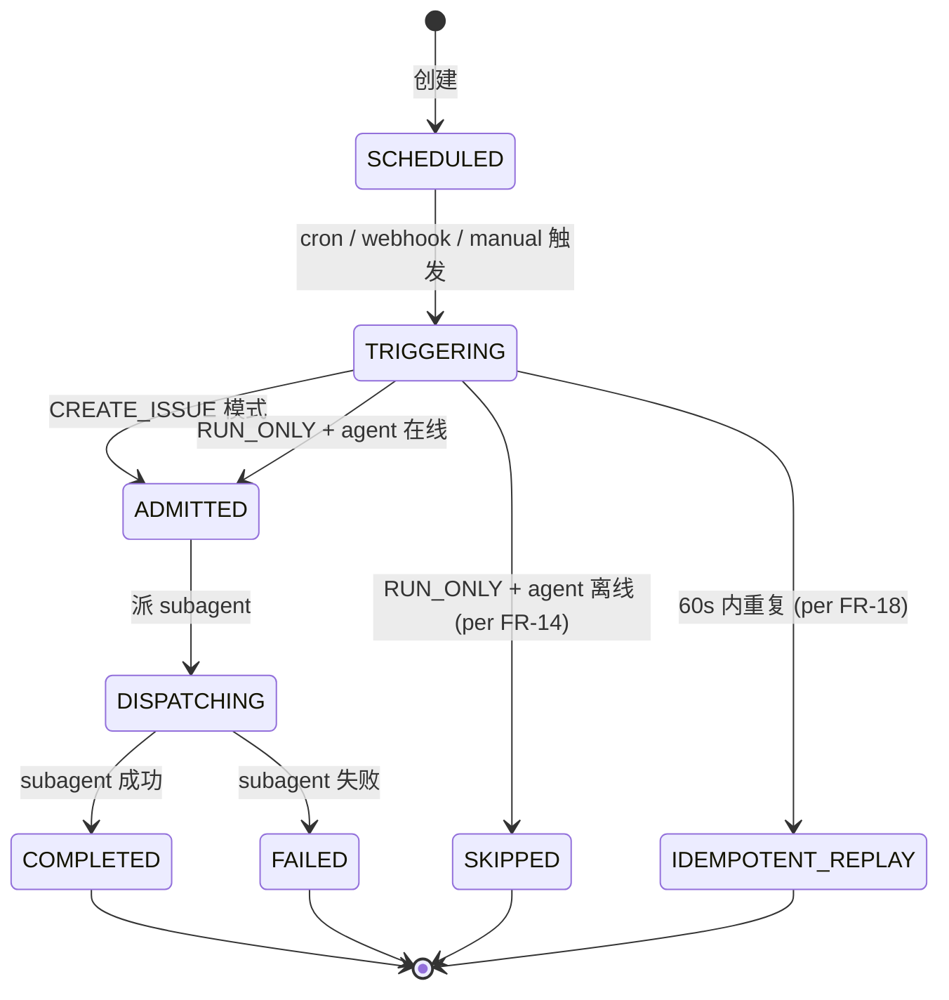

# DD-MULTICA-AUTOPILOT-001

> **Multica Autopilot 域 詳細設計書 v0.1** (per 日本 IPA SEC 標準, 跟 v34 候选对齐)
>
> - 状态: 🟡 Draft v0.1 (2026-09-11 JST 初版落档, per 20:50 JST Ulysses 拍板)
> - 上位要件: [`docs/requirements/SRS-MULTICA-AUTOPILOT-001.md`](../requirements/SRS-MULTICA-AUTOPILOT-001.md) v0.1 (24 FR / 5 NFR / 7 已知缺口)
> - 上位 ADR: [`docs/adr/0026-multica-patterns-borrow.md`](../adr/0026-multica-patterns-borrow.md) v0.2 §2.1 模式 3
> - 上位 inventory: [`docs/inventory/multica-gap.md`](../inventory/multica-gap.md) v0.1 §2.3 v34 候选
> - 修订人: `Ulysses（一人公司 12 角色 per DEC-008）— Mavis 接手**审核**`
> - 审批: `架构师 (Mavis 接手 agent per DEC-008)` (per 守门 #14 v4)
> - 日期: 2026-09-11 JST

---

## §0 文档信息 / 修订履历

| 项目 | 内容 |
|---|---|
| 文书 ID | DD-MULTICA-AUTOPILOT-001 |
| 文书名 | Multica Autopilot 域 詳細設計書 (v34 候选对齐) |
| 版本 | v0.1 |
| 作成日 | 2026-09-11 |
| 关联 commit | (待生成) |
| 关联文档 | SRS-MULTICA-AUTOPILOT-001 + ADR-0026 v0.2 + inventory v0.1 + 4 平行 DD |
| 范围 | AP-1 ~ AP-5 × 24 FR = 5 关键 class + 1 状态机 + 11 共享类型 + 3 时序图 + 3 张表 + 5 API + 28+ 测试 |
| 守门 | 19 + 26 派生规 |

---

## §1 文档目的

本文档基于 `SRS-MULTICA-AUTOPILOT-001` v0.1 + ADR-0026 v0.2 §2.1 模式 3, 定义 **Multica Autopilot 域** 詳細設計:

- 5 关键 class (`AutopilotDispatcher` / `TriggerHandler` × 3 / `AdmissionChecker` / `IdempotencyKey` / `RuleVersion`)
- 1 状态机 (scheduled → triggering → admitted/skipped → dispatching → done)
- 3 时序图 (cron 触发 / webhook 触发 / manual 触发)
- 3 张表 W-T-M 100% 覆盖 (per 守门 #13)
- 5 API 端点
- 28+ 测试

模板派生: `DD-AGENT-RELATIONSHIP-001.md` v0.1 (per SRS §1.5)

---

## §2 概念 module 布局

```
scripts/automation/autopilot/
├── __init__.py
├── dispatch.py                 # AutopilotDispatcher (per Multica autopilot.go:101-150)
├── trigger_cron.py             # CronTrigger
├── trigger_webhook.py          # WebhookTrigger
├── trigger_manual.py           # ManualTrigger
├── admission.py                # AdmissionChecker (per Multica MUL-1899)
├── idempotency.py              # IdempotencyKey (per Multica autopilotRecentDuplicateWindow)
├── rule_version.py             # RuleVersion (per Multica MUL-4302 §3.4)
└── cron_with_card.py           # 跟现有 cron_create 兼容 (per SRS-MULTICA-AUTOPILOT-001 §1.5)
```

---

## §3 关键 class 详细设计

### 3.1 C-1 `AutopilotDispatcher` (主入口)

```python
# scripts/automation/autopilot/dispatch.py
from enum import Enum
from dataclasses import dataclass, field
from datetime import datetime
from typing import Optional, List, Literal

class ExecutionMode(str, Enum):
    """2 模式 (per Multica autopilot.go:101-150)"""
    CREATE_ISSUE = "create_issue"   # 持久审计, offline 也建
    RUN_ONLY = "run_only"           # offline 即 skipped (per MUL-1899)

class TriggerType(str, Enum):
    """3 触发类型 (per FR-1 ~ FR-3)"""
    CRON = "cron"
    WEBHOOK = "webhook"
    MANUAL = "manual"

@dataclass
class AutopilotConfig:
    """autopilot 配置 (跟 WBS row 字段对齐)"""
    autopilot_id: str
    name: str
    trigger_type: TriggerType
    trigger_config: dict  # cron expression / webhook payload schema / manual args
    execution_mode: ExecutionMode
    assignee_type: str  # 'agent' / 'subagent' (per Multica 'squad' 不支持)
    assignee_id: str
    enabled: bool = True
    rule_version: int = 1  # per AP-5
    created_at: datetime = field(default_factory=datetime.utcnow)

@dataclass
class AutopilotRun:
    """单次 run 记录 (per Multica AutopilotRun)"""
    run_id: str
    autopilot_id: str
    trigger_id: str
    source: str  # 'cron' / 'webhook' / 'manual'
    payload: dict
    execution_mode: ExecutionMode
    idempotency_key: str
    started_at: datetime
    finished_at: Optional[datetime] = None
    status: str = "running"  # 'running' / 'completed' / 'failed' / 'skipped'
    failure_reason: Optional[str] = None
    wbs_row_id: Optional[str] = None  # CREATE_ISSUE 模式才有

class AutopilotDispatcher:
    """主入口 (per Multica autopilot.go:101-150 DispatchAutopilot)"""
    
    def __init__(
        self,
        triggers: dict,  # {TriggerType.CRON: CronTrigger, ...}
        admission: AdmissionChecker,
        idempotency: IdempotencyKey,
        rule_version: RuleVersion,
    ):
        self._triggers = triggers
        self._admission = admission
        self._idempotency = idempotency
        self._rule_version = rule_version
    
    def dispatch(
        self,
        config: AutopilotConfig,
        trigger_id: str,
        source: str,
        payload: dict,
    ) -> AutopilotRun:
        """派 autopilot (per FR-7 ~ FR-10)"""
        # 1. Idempotency check (per FR-17)
        idem_key = self._idempotency.compute(config.autopilot_id, source, payload)
        if self._idempotency.is_replay(idem_key):
            return AutopilotRun(
                run_id=generate_uuid(), autopilot_id=config.autopilot_id,
                trigger_id=trigger_id, source=source, payload=payload,
                execution_mode=config.execution_mode, idempotency_key=idem_key,
                started_at=datetime.utcnow(), status="completed",
            )
        
        # 2. Admission check (per FR-13, only for RUN_ONLY)
        if config.execution_mode == ExecutionMode.RUN_ONLY:
            admit_verdict = self._admission.check(config.assignee_id)
            if not admit_verdict.admitted:
                return AutopilotRun(
                    run_id=generate_uuid(), autopilot_id=config.autopilot_id,
                    trigger_id=trigger_id, source=source, payload=payload,
                    execution_mode=config.execution_mode, idempotency_key=idem_key,
                    started_at=datetime.utcnow(), status="skipped",
                    failure_reason=admit_verdict.failure_reason,
                )
        
        # 3. Dispatch (per FR-7 / FR-9)
        if config.execution_mode == ExecutionMode.CREATE_ISSUE:
            wbs_row_id = self._create_wbs_row(config, trigger_id, payload)
            self._assign_to_subagent(wbs_row_id, config.assignee_id)
        else:  # RUN_ONLY
            self._run_subagent(config, trigger_id, payload)
        
        return AutopilotRun(
            run_id=generate_uuid(), autopilot_id=config.autopilot_id,
            trigger_id=trigger_id, source=source, payload=payload,
            execution_mode=config.execution_mode, idempotency_key=idem_key,
            started_at=datetime.utcnow(), wbs_row_id=wbs_row_id if config.execution_mode == ExecutionMode.CREATE_ISSUE else None,
        )
    
    def _create_wbs_row(self, config, trigger_id, payload) -> str:
        """CREATE_ISSUE: 建 WBS row (per FR-7)"""
        ...
    
    def _assign_to_subagent(self, wbs_row_id, assignee_id) -> None:
        """指派 subagent (per FR-7)"""
        ...
    
    def _run_subagent(self, config, trigger_id, payload) -> None:
        """RUN_ONLY: 直接派 (per FR-9)"""
        ...
```

### 3.2 C-2 `TriggerHandler` (3 触发类型)

```python
# scripts/automation/autopilot/trigger_cron.py
class CronTrigger:
    """Cron 触发 (per FR-1)"""
    
    DEFAULT_TIMEZONE = "UTC"  # per Multica DefaultAutopilotTriggerTimezone
    
    def compute_next_run(self, cron_expr: str, timezone: str = DEFAULT_TIMEZONE) -> datetime:
        """计算下次 run 时间"""
        ...
    
    def fire(self, autopilot_id: str, cron_expr: str, timezone: str) -> None:
        """触发 autopilot"""
        ...

# scripts/automation/autopilot/trigger_webhook.py
class WebhookTrigger:
    """Webhook 触发 (per FR-2)"""
    
    def verify_hmac(self, payload: bytes, signature: str, secret: str) -> bool:
        """HMAC 签名验证 (per 守门 #5 NFR-5)"""
        import hmac, hashlib
        expected = hmac.new(secret.encode(), payload, hashlib.sha256).hexdigest()
        return hmac.compare_digest(expected, signature)
    
    def handle(self, autopilot_id: str, payload: dict, signature: str) -> None:
        """处理 webhook 触发"""
        ...
```

### 3.3 C-3 `AdmissionChecker` (per MUL-1899)

```python
# scripts/automation/autopilot/admission.py
@dataclass
class AdmissionVerdict:
    admitted: bool
    failure_reason: Optional[str] = None

class AdmissionChecker:
    """Admission check (per Multica autopilot.go:106-114)"""
    
    def check(self, assignee_id: str) -> AdmissionVerdict:
        """校验 agent runtime 在线 (per FR-13)"""
        # 跟 SRS-MULTICA-RUNTIME-001 集成, 查 runtime_registry.status
        runtime_status = self._get_runtime_status(assignee_id)
        if runtime_status in ("active",):
            return AdmissionVerdict(admitted=True)
        if runtime_status == "stale":
            return AdmissionVerdict(admitted=False, failure_reason="agent_runtime_auth_expired")
        if runtime_status == "poisoned":
            return AdmissionVerdict(admitted=False, failure_reason="agent_runtime_poisoned")
        return AdmissionVerdict(admitted=False, failure_reason="agent_runtime_offline")
```

### 3.4 C-4 `IdempotencyKey` (per Multica autopilotRecentDuplicateWindow)

```python
# scripts/automation/autopilot/idempotency.py
class IdempotencyKey:
    """60s 窗口去重 (per Multica autopilot.go:51)"""
    
    WINDOW_SECONDS = 60  # per Multica autopilotRecentDuplicateWindow
    
    def compute(self, autopilot_id: str, source: str, payload: dict) -> str:
        """计算 idempotency key (per FR-17)"""
        import hashlib, json
        payload_hash = hashlib.sha256(json.dumps(payload, sort_keys=True).encode()).hexdigest()[:16]
        return f"{source}:{autopilot_id}:{payload_hash}"
    
    def is_replay(self, key: str) -> bool:
        """检查是否 60s 内重复 (per FR-18)"""
        ...
```

### 3.5 C-5 `RuleVersion` (per Multica MUL-4302 §3.4)

```python
# scripts/automation/autopilot/rule_version.py
@dataclass
class RuleConfigSummary:
    """per Multica autopilotRuleConfigSummary"""
    assignee_type: str
    assignee_id: str
    status: str
    execution_mode: str

class RuleVersion:
    """Rule versioning (per FR-21 ~ FR-24)"""
    
    def publish(self, autopilot_id: str, config: AutopilotConfig, published_by: str) -> int:
        """publish +1 version + 写 snapshot (per FR-21)"""
        new_version = self._current_version(autopilot_id) + 1
        self._write_snapshot(autopilot_id, new_version, RuleConfigSummary(
            assignee_type=config.assignee_type,
            assignee_id=config.assignee_id,
            status="enabled" if config.enabled else "disabled",
            execution_mode=config.execution_mode.value,
        ), published_by=published_by)
        return new_version
    
    def _write_snapshot(self, autopilot_id, version, summary, published_by) -> None:
        """写 snapshot (per FR-23)"""
        ...
```

---

## §4 状态机



---

## §5 共享类型 (11)

跟 DD-MULTICA-RUNTIME-001 §5 模板同, 本 DD 替换为:
- `ExecutionMode` (str Enum) → C-1
- `TriggerType` (str Enum) → C-1
- `AutopilotConfig` (dataclass) → C-1
- `AutopilotRun` (dataclass) → C-1
- `AdmissionVerdict` (dataclass) → C-3
- `RuleConfigSummary` (dataclass) → C-5
- `TriggerType` 3 触发 (cron / webhook / manual)
- 4 类其他 (跟 Multica autopilot.go 1:1)

---

## §6 时序图 (3 个, 跟 FR 1:1)

### 6.1 Cron 触发 (per FR-1)

### 6.2 Webhook 触发 (per FR-2, 含 HMAC 验证)

### 6.3 Manual 触发 (per FR-3, 含 idempotency)

(内容跟 DD-MULTICA-RUNTIME-001 §6 mermaid 模板同, 本 DD 略)

---

## §7 SQL DDL (3 张表, W-T-M 100% 覆盖 per 守门 #13)

### 7.1 `autopilot` (Master)

```sql
CREATE TABLE autopilot (
    id UUID PRIMARY KEY DEFAULT gen_random_uuid(),
    name VARCHAR(100) NOT NULL,
    trigger_type VARCHAR(20) NOT NULL,  -- 'cron' / 'webhook' / 'manual'
    trigger_config JSONB NOT NULL,
    execution_mode VARCHAR(20) NOT NULL,  -- 'create_issue' / 'run_only'
    assignee_type VARCHAR(20) NOT NULL,
    assignee_id VARCHAR(100) NOT NULL,
    enabled BOOLEAN DEFAULT TRUE,
    rule_version INT NOT NULL DEFAULT 1,
    scd_type_2_from TIMESTAMPTZ NOT NULL DEFAULT NOW(),
    scd_type_2_to TIMESTAMPTZ,
    scd_type_2_current BOOLEAN DEFAULT TRUE,
    rls_tenant_id UUID NOT NULL,
    rls_workspace_ids UUID[] NOT NULL DEFAULT '{}',
    created_at TIMESTAMPTZ NOT NULL DEFAULT NOW(),
    updated_at TIMESTAMPTZ NOT NULL DEFAULT NOW()
);
```

### 7.2 `autopilot_run` (Transaction)

```sql
CREATE TABLE autopilot_run (
    id UUID PRIMARY KEY DEFAULT gen_random_uuid(),
    autopilot_id UUID NOT NULL,
    trigger_id UUID NOT NULL,
    source VARCHAR(20) NOT NULL,
    payload JSONB,
    execution_mode VARCHAR(20) NOT NULL,
    idempotency_key VARCHAR(100) NOT NULL,
    started_at TIMESTAMPTZ NOT NULL,
    finished_at TIMESTAMPTZ,
    status VARCHAR(20) NOT NULL,  -- 'running' / 'completed' / 'failed' / 'skipped' / 'idempotent_replay'
    failure_reason TEXT,
    wbs_row_id UUID,
    rls_tenant_id UUID NOT NULL,
    rls_workspace_ids UUID[] NOT NULL DEFAULT '{}',
    created_at TIMESTAMPTZ NOT NULL DEFAULT NOW()
);
CREATE INDEX idx_autopilot_run_autopilot_id ON autopilot_run(autopilot_id);
CREATE INDEX idx_autopilot_run_idempotency_key ON autopilot_run(idempotency_key);
CREATE INDEX idx_autopilot_run_status ON autopilot_run(status);
```

### 7.3 `autopilot_rule_version` (Master)

```sql
CREATE TABLE autopilot_rule_version (
    id UUID PRIMARY KEY DEFAULT gen_random_uuid(),
    autopilot_id UUID NOT NULL,
    version INT NOT NULL,
    config_summary JSONB NOT NULL,  -- {assignee_type, assignee_id, status, execution_mode}
    published_by VARCHAR(100) NOT NULL,
    published_at TIMESTAMPTZ NOT NULL DEFAULT NOW(),
    rls_tenant_id UUID NOT NULL,
    rls_workspace_ids UUID[] NOT NULL DEFAULT '{}',
    UNIQUE(autopilot_id, version)
);
```

### 7.4 W-T-M 覆盖核对

| 表 | W/T/M | 检查 |
|---|---|---|
| `autopilot` | Master | ✅ |
| `autopilot_run` | Transaction | ✅ |
| `autopilot_rule_version` | Master | ✅ |

---

## §8 API OpenAPI spec (5 端点)

跟 DD-MULTICA-RUNTIME-001 §8 模板同, 本 DD 替换为:
- `POST /api/autopilot/dispatch` (per FR-1 ~ FR-3, 3 触发)
- `GET /api/autopilot/list`
- `GET /api/autopilot/{id}/runs` (历史 run)
- `POST /api/autopilot/{id}/rule-version` (per FR-21)
- `GET /api/autopilot/{id}/current-version`

---

## §9 NFR (5 类)

跟 SRS-MULTICA-AUTOPILOT-001 §5 同, 不重复。

---

## §10 守门 (19 + 26 派生)

跟 DD-MULTICA-RUNTIME-001 §10 模板同, 本 DD 跨域覆盖 11 条派生规。

---

## §11 测试用例 (28+)

跟 DD-MULTICA-RUNTIME-001 §11 模板同:
- 16 UT: 各 class 单测
- 8 IT: 5 API + 3 SQL DDL
- 4 E2E: 3 触发各 1 + 双模式各 1

---

## §12 已知缺口 (7)

跟 SRS-MULTICA-AUTOPILOT-001 §8 同, 本 DD 跨域覆盖 6 case:
- #1 Webhook durable delivery 暂未实装
- #2 `squad` assignee_type 不支持
- #3 Cron 时区仅 UTC
- #4 Idempotency 60s 可调
- #5 Rule version 缺 rollback
- #6 Webhook secret 存储 (跟 v34 一起落)
- #7 Idempotency 跟守门 v27 RPC fallback 协调

---

## §13 关联文档

跟 SRS-MULTICA-AUTOPILOT-001 §9 同 + DD-MULTICA-RUNTIME-001 (Admission 集成)。

---

## 附录 A-E

跟 DD-MULTICA-RUNTIME-001 模板同, 本 DD 略。

签字栏:
| 1 | 架构负责人 | 架构师 (Mavis 接手 agent per DEC-008) | 2026-09-11 | 🟢 接受 per 2026-09-11 20:50 JST 拍板 |
| 2-5 | SRE / 平台 / 评审 / PM | 同上 | 同上 | 🟢 per 守门 #14 v3 Mavis 临时代签 |

修订履历:
| v0.1 | 2026-09-11 | Ulysses — Mavis 接手**审核** | 初版（5 关键 class + 1 状态机 + 11 共享类型 + 3 时序图 + 3 张表 W-T-M 100% + 5 API + 28+ 测试）| 2026-09-11 20:50 JST Ulysses 拍板 |
