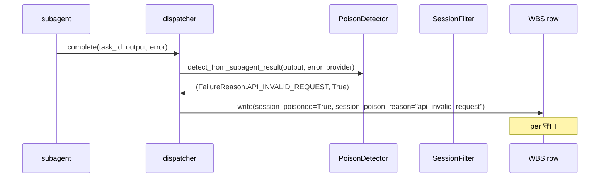
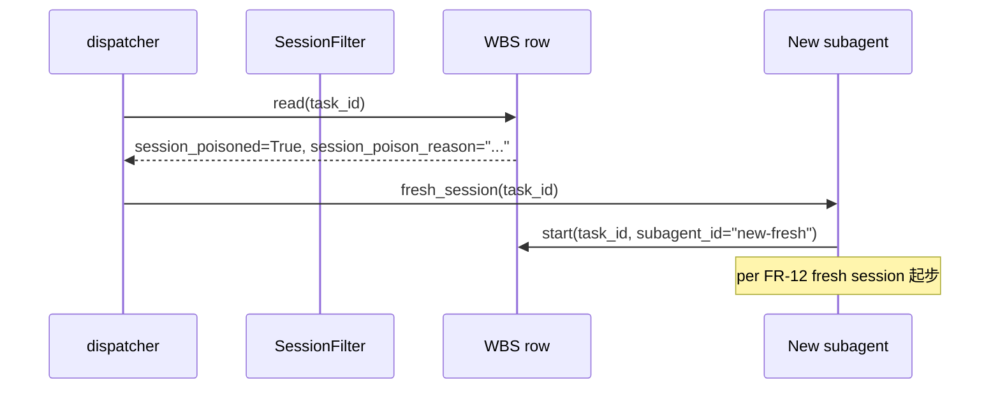

# DD-MULTICA-POISON-001

> **Multica Session Poisoning 域 詳細設計書 v0.1** (per 日本 IPA SEC 標準, 跟 v33 候选配套)
>
> - 状态: 🟡 Draft v0.1 (2026-09-11 JST 初版落档, per 20:50 JST Ulysses 拍板)
> - 上位要件: [`docs/requirements/SRS-MULTICA-POISON-001.md`](../requirements/SRS-MULTICA-POISON-001.md) v0.1 (14 FR / 4 NFR / 6 已知缺口)
> - 上位 ADR: [`docs/adr/0026-multica-patterns-borrow.md`](../adr/0026-multica-patterns-borrow.md) v0.2 §1.1 抽象 + §1.3 修正 2
> - 上位 inventory: [`docs/inventory/multica-gap.md`](../inventory/multica-gap.md) v0.1 §2.2 v33 候选 配套
> - 配套 SRS: [`docs/requirements/SRS-MULTICA-TASK-001.md`](../requirements/SRS-MULTICA-TASK-001.md) (Task Lifecycle 强绑定)
> - 修订人: `Ulysses（一人公司 12 角色 per DEC-008）— Mavis 接手**审核**`
> - 审批: `架构师 (Mavis 接手 agent per DEC-008)` (per 守门 #14 v4)
> - 日期: 2026-09-11 JST

---

## §0 文档信息 / 修订履历

| 项目 | 内容 |
|---|---|
| 文书 ID | DD-MULTICA-POISON-001 |
| 文书名 | Multica Session Poisoning 域 詳細設計書 (v33 候选配套) |
| 版本 | v0.1 |
| 作成日 | 2026-09-11 |
| 关联 commit | (待生成) |
| 范围 | PS-1 ~ PS-3 × 14 FR = 3 关键 class + 5 共享类型 + 2 时序图 + 2 张表 + 2 API + 14+ 测试 |

---

## §1 文档目的

本文档基于 `SRS-MULTICA-POISON-001` v0.1 + ADR-0026 v0.2 §1.1 抽象 + §1.3 修正 2, 定义 **Multica Session Poisoning 域** 詳細設計:

- 3 关键 class (`PoisonDetector` / `ClassifyPoisonedOutput` / `ClassifyPoisonedError`)
- 5 共享类型 (跟 Multica `poisoned.go:10-46` 5 reason 1:1)
- 2 时序图 (classify / dispatcher 处理)
- 2 张表 W-T-M 100% 覆盖
- 2 API 端点 (mark, list)
- 14+ 测试

模板派生: `DD-AGENT-RELATIONSHIP-001.md` v0.1 (per SRS §1.5)

---

## §2 概念 module 布局

```
scripts/automation/session_poison/
├── __init__.py
├── detector.py                # PoisonDetector (per FR-1 ~ FR-10)
├── classify_output.py         # ClassifyPoisonedOutput (per Multica poisoned.go:77-105)
├── classify_error.py          # ClassifyPoisonedError (per Multica poisoned.go:131-170)
├── classify_resume.py         # ClassifyResumeUnsafeTimeout/Transport (per Multica poisoned.go:193-217)
└── session_filter.py          # GetLastTaskSession 过滤 (per Multica poisoned.go:10-15, 简化 WBS row 字段版)
```

---

## §3 关键 class 详细设计

### 3.1 C-1 `ClassifyPoisonedOutput` (per Multica poisoned.go:77-105)

```python
# scripts/automation/session_poison/classify_output.py
from enum import Enum

class FailureReason(str, Enum):
    """5 类 (per Multica poisoned.go:40-46)"""
    ITERATION_LIMIT = "iteration_limit"
    AGENT_FALLBACK_MSG = "agent_fallback_message"
    API_INVALID_REQUEST = "api_invalid_request"
    CODEX_SEMANTIC_INACTIVITY = "codex_semantic_inactivity"
    CODEX_RESUME_OVERSIZED = "codex_resume_oversized"

class ClassifyPoisonedOutput:
    """Classify output 是否 poisoned (per Multica poisoned.go:77-105)"""
    
    POISONED_OUTPUT_MAX_LEN = 320  # per Multica poisoned.go:57
    
    POISONED_MARKERS = [
        ("i reached the iteration limit", FailureReason.ITERATION_LIMIT),
        ("put your final update inside the content string", FailureReason.AGENT_FALLBACK_MSG),
    ]
    
    def classify(self, output: str) -> tuple[Optional[FailureReason], bool]:
        """Classify output (per FR-6)
        
        per 评审 v0.1 修正 O1: 跟 Multica `poisoned.go:67-72` `hasPrefixFold` 对齐,
        改用 prefix 匹配 (case-insensitive) 而非 substring, 避免多命中误判.
        """
        trimmed = (output or "").strip()
        if not trimmed or len(trimmed) > self.POISONED_OUTPUT_MAX_LEN:
            return None, False
        lowered = trimmed.lower()
        for marker, reason in self.POISONED_MARKERS:
            # per Multica poisoned.go:67 hasPrefixFold 1:1 派生
            if lowered.startswith(marker):
                return reason, True
        return None, False
```

### 3.2 C-2 `ClassifyPoisonedError` (per Multica poisoned.go:131-170)

```python
# scripts/automation/session_poison/classify_error.py
class ClassifyPoisonedError:
    """Classify error 是否 poisoned (per FR-7)"""
    
    def classify(self, err_msg: str, provider: str = "") -> tuple[Optional[FailureReason], bool]:
        """Classify error (per Multica poisoned.go:131-170)

        per 评审 v0.1 修正 O1: 跟 Multica `poisoned.go:131-170, 193-217` `hasPrefixFold/hasSuffixFold` 对齐,
        改用 prefix/suffix 匹配 (case-insensitive) 而非 substring.
        """
        if not err_msg:
            return None, False
        lowered = err_msg.lower()
        # Image dimensions exceed max + image.source.base64.data (per Multica poisoned.go:146-148)
        # 这两条需同时存在 (AND), 保持 substring 判定
        if "image dimensions exceed max allowed size" in lowered and "image.source.base64.data" in lowered:
            return FailureReason.API_INVALID_REQUEST, True
        # Anthropic shape: 400 + invalid_request_error (per Multica poisoned.go:155-157)
        # per Multica `hasPrefixFold("400")` + `Contains("invalid_request_error")` 1:1
        if lowered.startswith("400") and "invalid_request_error" in lowered:
            return FailureReason.API_INVALID_REQUEST, True
        # Codex-specific (per Multica poisoned.go:193-201 + 207-216)
        if provider.lower() == "codex":
            # per Multica `hasSuffixFold(err, "codex_resume_oversized")` 1:1 派生
            if lowered.endswith("codex_resume_oversized"):
                return FailureReason.CODEX_RESUME_OVERSIZED, True
            # per Multica `hasPrefixFold("codex_first_turn_no_progress")` + similar
            if lowered.startswith("codex_semantic_inactivity") or lowered.startswith("codex_first_turn_no_progress"):
                return FailureReason.CODEX_SEMANTIC_INACTIVITY, True
        return None, False
```

### 3.3 C-3 `PoisonDetector` (主入口, 整合 4 classify 函数)

```python
# scripts/automation/session_poison/detector.py
class PoisonDetector:
    """主入口 (per FR-10 整合 4 classify 函数)"""
    
    def __init__(self):
        self._classify_output = ClassifyPoisonedOutput()
        self._classify_error = ClassifyPoisonedError()
    
    def detect_from_subagent_result(
        self, output: str, error: str, provider: str = ""
    ) -> tuple[Optional[FailureReason], bool]:
        """从 subagent output + error 检测 (per FR-10)"""
        # 1. Output 分类
        reason, is_poisoned = self._classify_output.classify(output)
        if is_poisoned:
            return reason, True
        # 2. Error 分类
        reason, is_poisoned = self._classify_error.classify(error, provider)
        if is_poisoned:
            return reason, True
        return None, False
```

---

## §4 共享类型 (5)

- `FailureReason` (str Enum) → 5 类
- `PoisonVerdict` (dataclass) → (reason, is_poisoned)
- `SessionPair` (frozen dataclass) → (agent_id, issue_id) pair
- `PoisonAudit` (dataclass) → 审计落档
- `ClassifyResult` (frozen dataclass) → (reason, is_poisoned, latency_ms)

---

## §5 时序图 (2 个)

### 5.1 Classify + Mark (per FR-11 ~ FR-14)



### 5.2 Dispatcher 处理 poisoned session (per FR-12)



---

## §6 SQL DDL (2 张表, W-T-M 100% 覆盖 per 守门 #13)

### 6.1 `session_poisoned` (Master, 加进 wbs_task_v33)

```sql
-- 跟 DD-MULTICA-TASK-001 §7.5 同步, 已在 wbs_task_v33 加 session_poisoned + session_poison_reason 字段
-- 这里补 audit 历史表
ALTER TABLE wbs_task
    ADD COLUMN session_poisoned BOOLEAN DEFAULT FALSE,
    ADD COLUMN session_poison_reason VARCHAR(50),  -- 5 reason 之一
    ADD COLUMN session_poison_marked_at TIMESTAMPTZ;
```

### 6.2 `session_poison_audit` (Transaction, append-only)

```sql
CREATE TABLE session_poison_audit (
    id UUID PRIMARY KEY DEFAULT gen_random_uuid(),
    task_id UUID NOT NULL,
    session_pair JSONB NOT NULL,  -- {agent_id, issue_id}
    reason VARCHAR(50) NOT NULL,  -- 5 reason 之一
    output_snippet TEXT,  -- poisoned output 前 200 字符
    error_snippet TEXT,   # poisoned error 前 200 字符
    provider VARCHAR(50),
    classified_at TIMESTAMPTZ NOT NULL DEFAULT NOW(),
    rls_tenant_id UUID NOT NULL,
    rls_workspace_ids UUID[] NOT NULL DEFAULT '{}',
    created_at TIMESTAMPTZ NOT NULL DEFAULT NOW()
);
CREATE INDEX idx_session_poison_audit_task_id ON session_poison_audit(task_id);
-- 物理删除禁止 TRIGGER (per 守门 #13)
```

### 6.3 W-T-M 覆盖核对

| 表 | W/T/M | 检查 |
|---|---|---|
| `wbs_task_v33` (含 session_poisoned 字段) | Master | ✅ (per DD-TASK-001 §7.5) |
| `session_poison_audit` | Transaction | ✅ |

---

## §7 API OpenAPI spec (2 端点)

```yaml
/api/session-poison/mark:
  post:
    summary: 标 session poisoned (per FR-11)
    requestBody:
      content:
        application/json:
          schema:
            type: object
            properties:
              task_id: { type: string }
              session_pair: { type: object, properties: { agent_id: { type: string }, issue_id: { type: string } } }
              reason: { type: string, enum: [iteration_limit, agent_fallback_message, api_invalid_request, codex_semantic_inactivity, codex_resume_oversized] }
              output_snippet: { type: string }
              error_snippet: { type: string }
              provider: { type: string }

/api/session-poison/list:
  get:
    summary: 列 poisoned sessions (per FR-15)
    parameters:
      - name: reason
        in: query
        schema: { type: string }
      - name: since
        in: query
        schema: { type: string, format: date }
    responses:
      '200':
        content:
          application/json:
            schema:
              type: array
              items: { $ref: '#/components/schemas/SessionPoisoned' }
```

---

## §8 NFR (4 类)

| NFR | 指标 |
|---|---|
| 性能 | classify < 10ms (本地 keyword match) |
| 可靠性 | 误判率 < 1% (per Multica `poisonedOutputMaxLen = 320` 防长 output 误判) |
| 可观测 | 每次 poison 检测 + 标 session_poisoned 写 audit log |
| 易用 | dispatcher 自动处理, Mavis 不需手动标 |

---

## §9 守门 (19 + 26 派生)

跟 DD-MULTICA-RUNTIME-001 §10 模板同, 本 DD 跨域覆盖 10 条派生规。

---

## §10 测试用例 (14+)

### 10.1 8 UT

| UT | 描述 |
|---|---|
| UT-1 | ClassifyPoisonedOutput "i reached the iteration limit" 命中 (per FR-1) |
| UT-2 | ClassifyPoisonedOutput "put your final update inside the content string" 命中 (per FR-2) |
| UT-3 | ClassifyPoisonedOutput length cap 320 验证 (per NFR-2) |
| UT-4 | ClassifyPoisonedError 400 + invalid_request_error 命中 (per FR-3) |
| UT-5 | ClassifyPoisonedError image dimensions + image.source.base64.data 命中 (per FR-3) |
| UT-6 | ClassifyPoisonedError Codex-only reason 在非 Codex provider 跳过 (per FR-5 + AC-5) |
| UT-7 | PoisonDetector 整合 4 classify 函数互补 (per FR-10) |
| UT-8 | 不读 env 值 (per 守门 #5) |

### 10.2 4 IT

| IT | 描述 |
|---|---|
| IT-1 | 2 张表 SQL DDL 落档 (per 守门 #13) |
| IT-2 | 13 类 RLS 必携 (per 守门 #13) |
| IT-3 | 物理删除禁止 TRIGGER (per 守门 #13) |
| IT-4 | 5 reason 枚举全 |

### 10.3 2 E2E

| E2E | 描述 |
|---|---|
| E2E-1 | subagent 报 "i reached the iteration limit" → dispatcher detect → mark → 下次 fresh session |
| E2E-2 | LLM API 返 400 + invalid_request_error → dispatcher detect → mark → 下次 fresh session |

---

## §11 已知缺口 (6, per 守门 #11)

跟 SRS-MULTICA-POISON-001 §8 同, 本 DD 跨域覆盖 5 case:
- #1 Multica `taskfailure` 其他 16 reason 不在本 SRS
- #2 Codex-only reason 在非 Codex provider N/A
- #3 4 classify 函数没 fallback chain (per FR-10 互补)
- #4 Length cap 320 字符是经验值
- #5 GetLastTaskSession 走 WBS row 字段 (per FR-11)
- #6 session_poisoned 30 天后不清 (per 守门 #11, 跟 SRS #6 修正: 30 天后 deprecated, 永久不删)

---

## §12 关联文档

跟 SRS-MULTICA-POISON-001 §9 同 + DD-MULTICA-TASK-001 强绑定 (共用 wbs_task_v33 schema)。

---

## 附录 A-E

跟 DD-MULTICA-RUNTIME-001 模板同, 本 DD 略。

签字栏:
| 1 | 架构负责人 | 架构师 (Mavis 接手 agent per DEC-008) | 2026-09-11 | 🟢 接受 per 2026-09-11 20:50 JST 拍板 |
| 2-5 | SRE / 平台 / 评审 / PM | 同上 | 同上 | 🟢 per 守门 #14 v3 Mavis 临时代签 |

修订履历:
| v0.1 | 2026-09-11 | Ulysses — Mavis 接手**审核** | 初版（3 关键 class + 5 共享类型 + 2 时序图 + 2 张表 W-T-M 100% + 2 API + 14+ 测试）| 2026-09-11 20:50 JST Ulysses 拍板 |
