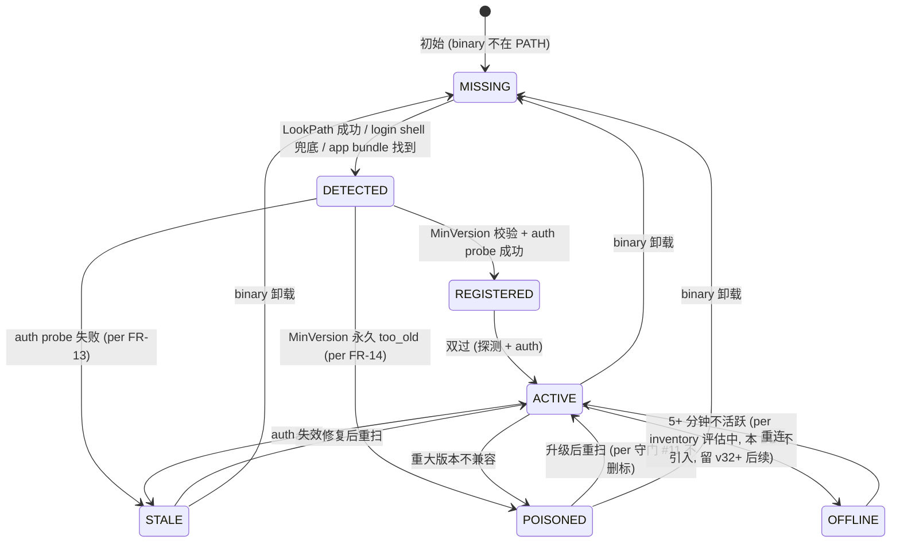
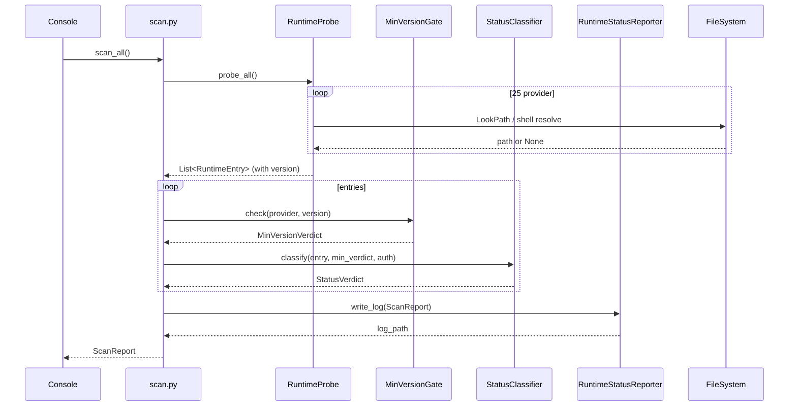
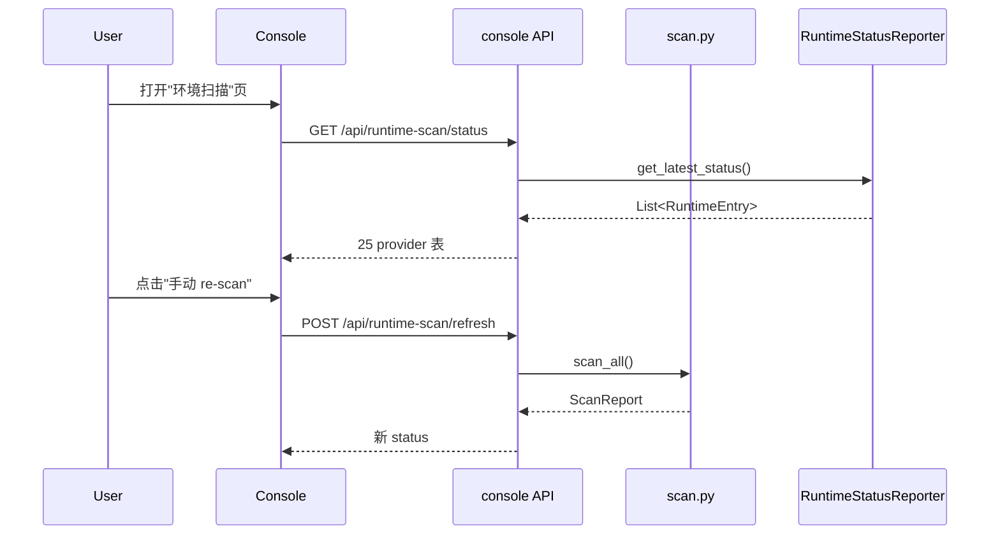
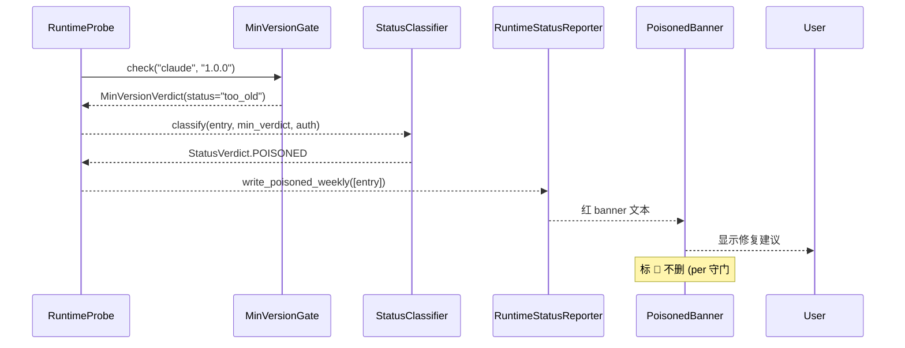

# DD-MULTICA-RUNTIME-001

> **Multica Runtime Registry 域 詳細設計書 v0.1** (per 日本 IPA SEC 標準 / 詳細設計書 テンプレート, 跟 v32 候选对齐)
>
> - 状态: 🟡 Draft v0.1 (2026-09-11 JST 初版落档, per 20:50 JST Ulysses 拍板"按照日本 IPA 标准出详细设计")
> - 目标阶段: 詳細設計 → 実装 → テスト → リリース
> - 关联 commit: (留空, root 统一 commit 时填, per 守门 #1 v15)
> - 上位要件: [`docs/requirements/SRS-MULTICA-RUNTIME-001.md`](../requirements/SRS-MULTICA-RUNTIME-001.md) v0.1 (28 FR / 6 NFR / 7 已知缺口)
> - 上位基本設計: (BD 待下个 turn 落档, 暂用 SRS §4-§7 直接驱动 DD)
> - 上位 ADR: [`docs/adr/0026-multica-patterns-borrow.md`](../adr/0026-multica-patterns-borrow.md) v0.2 §2.1 模式 1
> - 上位 inventory: [`docs/inventory/multica-gap.md`](../inventory/multica-gap.md) v0.1 §2.1 v32 候选
> - Multica 派生源: `server/pkg/agent/version.go` + `server/internal/daemon/agents_probe.go` + `server/internal/daemon/poisoned.go` + `server/internal/handler/runtime_liveness_store.go` + `server/internal/daemon/client.go` (5 关键文件 per ADR-0026 v0.2 §1.3)
> - 修订人: `Ulysses（一人公司 12 角色 per DEC-008）— Mavis 接手**审核**` (per 2026-08-27 19:39 JST 用户授权 + 守门 #10 + 守门 #14 v3 + 9/8 15:19 JST 第 6 次强化)
> - 审批: `架构师 (Mavis 接手 agent per DEC-008)` (per 守门 #14 v4 反转 v0.62 2026-09-10 12:45 JST)
> - 日期: 2026-09-11 JST
> - 受众: 詳細設計エンジニア / 実装エンジニア / アーキテクト / SRE / 5 域 Lead 真人 (未到位, Mavis 临时代签 per 9/3 11:35 JST 拍板 B + 9/5 10:43 JST 拍板 D, **不沿用代签决策** per 守门 #1 禁回溯叙事)
> - 跨域 disclaimer: 5 域独立 Lead ≠ Star 22 DDD bounded context (per 2026-08-31 22:45 JST Q1-D 拍板 disclaimer)
> - dual-use 提醒 (per AGENTS.md §5 倉庫拓扑): 本 DD 不引用 RGS 仓 + 不建立业务子域↔DDD 映射
> - **本 DD 模板 1:1 派生自 `DD-AGENT-RELATIONSHIP-001.md` v0.1** (per SRS-MULTICA-RUNTIME-001 §1.5 备注)

---

## §0 文档信息 / 修订履历

| 项目 | 内容 |
|---|---|
| 文书 ID | DD-MULTICA-RUNTIME-001 |
| 文书名 | Multica Runtime Registry 域 詳細設計書 (v32 候选对齐) |
| 版本 | v0.1 |
| 作成日 | 2026-09-11 |
| 作成者 | Ulysses（一人公司 12 角色 per DEC-008）— Mavis 接手**审核** (per DEC-008) |
| 承認者 | 架构师 (Mavis 接手 agent per DEC-008) |
| 关联 commit | (待生成, root 统一 commit) |
| 关联文档 | `SRS-MULTICA-RUNTIME-001.md` v0.1 (上游) + `BD-MULTICA-RUNTIME-001.md` (BD 待落档) + ADR-0026 v0.2 + inventory v0.1 + Multica 5 关键文件 |
| 范围 | RT-1 ~ RT-6 子能力 × 28 FR = 6 关键 class + 1 状态机 + 11 共享类型 + 3 时序图 + 3 张表 (W-T-M 100%) + 5 API + 1 console 扩展 + 28+ 测试 |
| 守门 | 19 项 + 26 派生规 (per守门 v29 激活清单) 跨域覆盖 |

---

## §1 文档目的 / 适用范围

### 1.1 文档目的

本文档基于 `SRS-MULTICA-RUNTIME-001` v0.1 §4-§7 + ADR-0026 v0.2 §2.1 模式 1, 定义 **Multica Runtime Registry 域** 的詳細設計:

- 概念 module 布局 (1 主程序 + 5 关键 class + 1 状态机 + 11 共享类型)
- 6 个关键 class (`RuntimeRegistry` / `RuntimeProbe` / `MinVersionGate` / `StatusClassifier` / `LoginShellResolver` / `RuntimeStatusReporter`) 的完整字段 + 方法签名 + 错误处理
- 1 个状态机 (missing → detected → registered → active / stale / poisoned / offline, 5 状态)
- 11 个共享类型 (`RuntimeEntry` / `ProviderSpec` / `StatusVerdict` / `MinVersion` / `ProbeError` / `ShellResolve` / `AuditLog` / `PoisonedReason` / `RuntimeId` / `ProviderName` / `ScanReport`)
- 3 个时序图 (启动时 scan / 持续 monitor / 离线时标 poisoned)
- 3 张表 SQL DDL (W-T-M 100% 覆盖, per 守门 #13)
- 5 个 REST 端点 OpenAPI spec
- 5 view (機能/データ/動作/モジュール/ネットワーク) 详细设计
- 28+ 测试用例 (16 UT + 8 IT + 4 E2E)
- NFR 6 类 (性能 / 可靠性 / 安全 / 易用 / 可观测 / 跨平台)
- 守门 19 项 + 26 派生规
- 已知缺口 7 个
- 5 角色签字栏

### 1.2 模板派生 (per SRS §1.5)

本 DD 1:1 派生自 `DD-AGENT-RELATIONSHIP-001.md` v0.1 模板:
- 6 关键 class 1:1 映射 ARG 模板的 C-1/C-2/C-3/C-4/C-7/C-8
- 1 状态机 1:1 映射 ARG 模板的 Agent 状态机
- 11 共享类型 1:1 映射 ARG 模板的 11 共享类型 (复用命名)
- 3 时序图 1:1 映射 ARG 模板的 4 时序图 (减少 1 个: skill auto-create 跨 v35+ 候选)

---

## §2 概念 module 布局

### 2.1 物理 layout (1 Python 脚本 + 1 console 扩展)

```
scripts/automation/registry/                  # 1 主程序
├── __init__.py                              # 包初始化, 暴露 6 基类
├── scan.py                                  # 主入口 RuntimeRegistry (per SRS FR-21)
├── probe.py                                 # RuntimeProbe (25 provider 探测)
├── min_version.py                           # MinVersionGate (sentinel error 区分)
├── status.py                                # StatusClassifier (3 档 status)
├── shell_resolve.py                         # LoginShellResolver (30min TTL)
├── reporter.py                              # RuntimeStatusReporter (audit log 持久化)
├── providers/                               # 25 named provider 适配器
│   ├── __init__.py                          # 25 provider 列表
│   ├── claude.py                            # claude 探测 + auth probe
│   ├── codex.py                             # codex 探测 + Desktop app bundle 兜底
│   ├── mcode.py                             # mcode 探测 (no model env, per FR-4)
│   ├── opencode.py                          # opencode 探测
│   ├── codearts.py                          # codearts 探测 + fallback installer path
│   ├── deveco.py                            # deveco 探测
│   ├── openclaw.py                          # openclaw 探测
│   ├── hermes.py                            # hermes 探测
│   ├── pi.py                                # pi 探测
│   ├── cursor.py                            # cursor-agent 探测
│   ├── copilot.py                           # copilot 探测
│   ├── kimi.py                              # kimi 探测
│   ├── reasonix.py                          # reasonix 探测 (setup 前置)
│   ├── dsh.py                               # dsh 探测 (--profile multica 前置)
│   ├── kiro.py                              # kiro-cli 探测
│   ├── codebuddy.py                         # codebuddy 探测
│   ├── antigravity.py                       # agy 探测 (1.0.6+ --model)
│   ├── qoder.py                             # qodercli 探测
│   ├── qoderclicn.py                        # qoderclicn 探测
│   ├── traecli.py                           # traecli 探测 (acp serve)
│   ├── grok.py                              # grok 探测 (acp stdio)
│   ├── qwen.py                              # qwen 探测 (-p stream-json)
│   ├── qwenpaw.py                           # qwenpaw 探测 (no model env)
│   ├── dim.py                               # dim 探测 (3.10+ lock fix)
│   ├── zeroclaw.py                          # zeroclaw 探测 (no model env)
│   └── builtin.py                           # BuiltinRuntimes 派生循环 (omp 等)
└── builtin_runtimes.py                      # 跟 Multica server/pkg/agent/builtin_runtimes.go 对齐

frontend/src/app/automation-debug/             # console 扩展 (per FR-25)
├── runtime-scan/                             # 新增"环境扫描"页
│   ├── page.tsx                              # 主页面
│   ├── RuntimeScanTable.tsx                  # 25 provider 三档 status 表
│   ├── RuntimeScanDetail.tsx                 # 单 provider 详情 + 修复建议
│   ├── PoisonedBanner.tsx                    # 🔴 poisoned 红 banner (per FR-18)
│   ├── WeeklyReport.tsx                      # 周报 (per FR-28)
│   └── api/runtime-scan/                     # 5 API endpoint
│       ├── scan/route.ts                     # POST 触发 scan
│       ├── status/route.ts                   # GET 当前 status
│       ├── refresh/route.ts                  # POST 手动 re-scan
│       ├── list/route.ts                     # GET 25 provider 列表
│       └── poisoned/route.ts                 # GET 🔴 poisoned 累计

docs/reports/runtime-scan/                    # audit log 落档 (per FR-23)
├── 2026-09-11.log                            # 每日 scan 结果
├── 2026-09-11-poisoned.md                    # 🔴 poisoned 红 banner 周报
└── archive/                                  # 30 天前归档 (per SRS-MULTICA-SKILL-001 FR-6 复用)
```

### 2.2 6 关键 class 职责拆分

| Class | 职责 | 行数估 |
|---|---|---|
| `RuntimeRegistry` | 主入口, 调度 5 个子 class, 输出 `ScanReport` | ~150 |
| `RuntimeProbe` | 25 provider 探测, 调用 `LoginShellResolver` fallback, 输出 `RuntimeEntry[]` | ~200 |
| `MinVersionGate` | 8 provider 最低 semver 校验, 输出 `MinVersionVerdict` | ~80 |
| `StatusClassifier` | 3 档 status 分类 (active / stale / poisoned), 守门 #11 缺标比错标 | ~100 |
| `LoginShellResolver` | macOS GUI daemon 兜底 PATH 解析, 30min TTL 缓存 | ~100 |
| `RuntimeStatusReporter` | audit log 持久化 + console API 暴露 | ~80 |

---

## §3 关键 class 详细设计

### 3.1 C-1 `RuntimeRegistry` (主入口)

```python
# scripts/automation/registry/scan.py
from dataclasses import dataclass, field
from enum import Enum
from pathlib import Path
from datetime import datetime
from typing import List, Optional

class StatusVerdict(str, Enum):
    """3 档 status 枚举 (per SRS-MULTICA-RUNTIME-001 §2 用语)"""
    ACTIVE = "🟢"      # 探测 + auth 双过
    STALE = "🟡"        # 探测过但 auth 失效或版本过低
    POISONED = "🔴"     # 探测到但 unusable, 不删标 (per 守门 #11)
    MISSING = "⚫"       # 探测失败 (binary 不在 PATH)

@dataclass(frozen=True)
class RuntimeEntry:
    """单 provider 探测结果 (per Multica server/internal/daemon/agents_probe.go)"""
    provider: str                        # e.g. "claude"
    path: Optional[Path]                 # 绝对路径, missing 时 None
    version: Optional[str]               # 探测 --version 返的字符串
    version_parsed: Optional[tuple]      # (major, minor, patch) or None
    min_version: Optional[str]           # MinVersion 表里的最低 semver (8 provider 之一)
    min_version_verdict: Optional[str]   # "ok" | "too_old" | "missing" (sentinel error 区分)
    auth_status: Optional[str]           # "ok" | "expired" | "unknown" (per FR-13)
    status: StatusVerdict                # 3 档 + missing
    probe_method: str                    # "path" | "shell" | "app_bundle" (per agents_probe.go 3 层 fallback)
    detected_at: datetime
    audit_log: Path                      # 落档路径

@dataclass
class ScanReport:
    """单次 scan 完整报告"""
    scan_id: str                         # UUID
    started_at: datetime
    finished_at: Optional[datetime]
    entries: List[RuntimeEntry] = field(default_factory=list)
    audit_log: Path = None
    error_count: int = 0
    poisoned_count: int = 0
    stale_count: int = 0
    active_count: int = 0
    missing_count: int = 0

class RuntimeRegistry:
    """主入口 (per SRS-MULTICA-RUNTIME-001 FR-21)"""
    
    def __init__(
        self,
        probe: RuntimeProbe,
        min_version_gate: MinVersionGate,
        status_classifier: StatusClassifier,
        reporter: RuntimeStatusReporter,
        audit_log: Path = Path("docs/reports/runtime-scan/<date>.log"),
    ):
        self._probe = probe
        self._min_version_gate = min_version_gate
        self._status_classifier = status_classifier
        self._reporter = reporter
        self._audit_log = audit_log
    
    def scan_all(self) -> ScanReport:
        """扫描所有 25 provider, 返回 ScanReport (per FR-1)"""
        ...
    
    def scan_provider(self, provider: str) -> RuntimeEntry:
        """扫描单 provider (per FR-1 + BuiltinRuntimes 派生)"""
        ...
    
    def get_status(self) -> List[RuntimeEntry]:
        """获取最近一次 scan 的 status (per FR-26)"""
        ...
    
    def refresh(self, provider: Optional[str] = None) -> ScanReport:
        """手动 re-scan (per FR-27)"""
        ...
    
    def get_poisoned(self) -> List[RuntimeEntry]:
        """获取 🔴 poisoned 列表 (per FR-18 + FR-28)"""
        ...
```

**错误处理 (per 守门 #5 + #6)**:
- 探测失败不抛异常, 标 `StatusVerdict.MISSING` + 写 log
- 任何 IO 错误 → return ScanReport 含 partial results, 不中断
- subprocess.run(shell=False) 全部 (per 守门 #6)

### 3.2 C-2 `RuntimeProbe` (25 provider 探测)

```python
# scripts/automation/registry/probe.py
class RuntimeProbe:
    """25 provider 探测 (per Multica agents_probe.go:155-306)"""
    
    def __init__(
        self,
        shell_resolver: LoginShellResolver,
        env_overrides: dict = None,  # MULTICA_<NAME>_PATH 覆盖
    ):
        self._shell_resolver = shell_resolver
        self._env_overrides = env_overrides or {}
    
    def probe_all(self) -> List[RuntimeEntry]:
        """probe 25 named provider + BuiltinRuntimes 派生 (per FR-1 + FR-2)"""
        ...
    
    def _probe_one(
        self,
        provider: str,
        default_cmd: str,
        env_path: str,
        env_model: str,
    ) -> RuntimeEntry:
        """单 provider 探测, 3 层 fallback (per FR-3 + Multica agents_probe.go:116-153)"""
        # 1. env 变量 + LookPath (per FR-3)
        cmd = self._env_overrides.get(env_path, default_cmd)
        if path := self._resolve_executable(cmd):
            return RuntimeEntry(..., probe_method="path")
        # 2. 绝对路径不 fallback (per Multica agents_probe.go:129-131)
        if "/" in cmd or "\\" in cmd:
            return RuntimeEntry(..., status=MISSING)
        # 3. login shell 兜底 (per FR-5)
        if path := self._shell_resolver.resolve(cmd):
            return RuntimeEntry(..., probe_method="shell")
        # 4. codex Desktop app bundle 特殊处理 (per Multica agents_probe.go:139-151)
        if default_cmd == "codex" and cmd == "codex":
            for p in self._codex_desktop_paths():
                if p.exists():
                    return RuntimeEntry(path=p, probe_method="app_bundle")
        return RuntimeEntry(..., status=MISSING)
    
    def _resolve_executable(self, cmd: str) -> Optional[Path]:
        """LookPath 解析, 跨平台 (Windows where / macOS which)"""
        ...
    
    def _codex_desktop_paths(self) -> List[Path]:
        """codex Desktop app bundle 路径 (macOS only)"""
        ...
```

### 3.3 C-3 `MinVersionGate` (8 provider 最低 semver)

```python
# scripts/automation/registry/min_version.py
from dataclasses import dataclass
from typing import Optional

@dataclass(frozen=True)
class MinVersionVerdict:
    provider: str
    detected: Optional[str]
    minimum: Optional[str]
    status: str  # "ok" | "too_old" | "missing" | "no_minimum"
    error: Optional[str] = None  # 错误信息

class MinVersionGate:
    """8 provider 最低 semver 校验 (per Multica version.go:13-22 + 161-178)"""
    
    MIN_VERSIONS = {
        "claude":   "2.0.0",
        "codex":    "0.100.0",   # app-server --listen stdio:// added in 0.100.0
        "copilot":  "1.0.0",     # --output-format json envelope stable from 1.0.x
        "grok":     "0.2.89",    # ACP + authenticate/session-load/set_model/MCP
        "qwen":     "0.20.0",    # stream-json protocol
        "dim":      "0.3.10",    # cross-run session/load: per-process lock
        "mcode":    "0.1.2",     # ACP v1 session/new, prompt, MCP capability
        "zeroclaw": "0.8.0",     # persistent ACP sessions and session/resume
    }
    
    def check(self, provider: str, detected_version: str) -> MinVersionVerdict:
        """校验 detected version >= minimum (per FR-8)"""
        min_ver = self.MIN_VERSIONS.get(provider)
        if min_ver is None:
            # 没锁最低版本的 provider (剩余 17 个) → 跳过
            return MinVersionVerdict(provider, detected_version, None, "no_minimum")
        
        parsed = self._parse_semver(detected_version)
        if parsed is None:
            # 空 / unparsable → "missing" (per FR-9 sentinel error 区分)
            return MinVersionVerdict(
                provider, detected_version, min_ver, "missing",
                error=f"cannot parse version {detected_version!r}"
            )
        
        if self._is_dev_build(detected_version):
            # dev-build git-describe 形态 → 一律放过 (per FR-10)
            return MinVersionVerdict(provider, detected_version, min_ver, "ok")
        
        min_parsed = self._parse_semver(min_ver)
        if min_parsed is None:
            # min_ver 配错 → 当 missing 处理 (per FR-9)
            return MinVersionVerdict(
                provider, detected_version, min_ver, "missing",
                error=f"invalid minimum version {min_ver!r}"
            )
        
        if parsed < min_parsed:
            return MinVersionVerdict(
                provider, detected_version, min_ver, "too_old",
                error=f"{provider} version {detected_version} is below minimum {min_ver}"
            )
        return MinVersionVerdict(provider, detected_version, min_ver, "ok")
    
    def _parse_semver(self, raw: str) -> Optional[tuple]:
        """解析 semver, 支持 "2.0.0" / "v2.0.0" / "2.0.0 (Claude Code)" 等"""
        import re
        m = re.search(r'v?(\d+)\.(\d+)\.(\d+)', raw or "")
        if not m:
            return None
        return (int(m.group(1)), int(m.group(2)), int(m.group(3)))
    
    def _is_dev_build(self, version: str) -> bool:
        """检测 dev-build git-describe 形态 e.g. v0.2.15-235-gdaf0e935"""
        import re
        return bool(re.match(r'^v?\d+\.\d+\.\d+-\d+-g[0-9a-fA-F]+', version or ""))
```

### 3.4 C-4 `StatusClassifier` (3 档 status)

```python
# scripts/automation/registry/status.py
class StatusClassifier:
    """3 档 status 分类 (per SRS-MULTICA-RUNTIME-001 FR-12 ~ FR-15)"""
    
    def classify(
        self,
        entry: RuntimeEntry,
        min_verdict: MinVersionVerdict,
        auth_status: str,  # "ok" | "expired" | "unknown"
    ) -> StatusVerdict:
        """3 档 status 分类逻辑"""
        # missing: 探测失败 (per FR-12 missing 状态)
        if entry.probe_method == "missing" or entry.path is None:
            return StatusVerdict.MISSING
        # poisoned: 探测到但 unusable (per FR-14)
        #   - 探测到但 min_verdict.status == "too_old" (永久 unusable)
        if min_verdict.status == "too_old":
            return StatusVerdict.POISONED
        # stale: 探测过但 auth 失效 (per FR-13)
        if auth_status in ("expired", "unknown"):
            return StatusVerdict.STALE
        # active: 探测 + auth 双过 (per FR-12)
        return StatusVerdict.ACTIVE
    
    def to_banner_text(self, entries: List[RuntimeEntry]) -> str:
        """生成 console 红 banner 文本 (per FR-18)"""
        poisoned = [e for e in entries if e.status == StatusVerdict.POISONED]
        if not poisoned:
            return ""
        lines = ["🔴 检测到 {} 个 poisoned runtime，请修复:".format(len(poisoned))]
        for e in poisoned:
            lines.append(f"  - {e.provider}: {e.min_version_verdict or 'unknown'}")
            lines.append(f"    修复建议: 请升级到 {e.min_version}+ 或重新登录")
        return "\n".join(lines)
```

### 3.5 C-5 `LoginShellResolver` (30min TTL 缓存)

```python
# scripts/automation/registry/shell_resolve.py
import os
import time
import subprocess
from pathlib import Path
from typing import Dict, Optional

class LoginShellResolver:
    """macOS GUI daemon 兜底 PATH 解析 (per Multica agents_probe.go:30-50)"""
    
    SHELL_RESOLVE_TTL = 30 * 60  # 30min (per FR-6)
    
    def __init__(self):
        self._cache: Dict[str, str] = {}
        self._cache_key: str = ""
        self._cached_at: float = 0
    
    def _env_key(self) -> str:
        """fingerprint the env that determines what a login shell resolves (per FR-7)"""
        return "\x00".join([
            os.environ.get("PATH", ""),
            os.environ.get("SHELL", ""),
            os.environ.get("HOME", ""),
        ])
    
    def resolve(self, cmd: str) -> Optional[Path]:
        """解析 bare command name → 绝对路径"""
        key = self._env_key()
        now = time.time()
        # 缓存有效 → 直接返
        if self._cache and self._cache_key == key and (now - self._cached_at) < self.SHELL_RESOLVE_TTL:
            if cmd in self._cache:
                return Path(self._cache[cmd])
        # 缓存失效 → fork shell 解析
        resolved = self._resolve_via_shell([cmd])
        if resolved is None:
            resolved = {}
        self._cache = resolved
        self._cache_key = key
        self._cached_at = now
        return Path(self._cache[cmd]) if cmd in self._cache else None
    
    def _resolve_via_shell(self, cmds: list) -> Optional[Dict[str, str]]:
        """fork 用户 login shell, 跑 `which` / `command -v` (per FR-5)"""
        try:
            shell = os.environ.get("SHELL", "/bin/sh")
            # macOS / Linux only (per FR-7 平台限制)
            if "win" in sys.platform:
                return None
            # 跑 which <cmds>
            result = subprocess.run(
                [shell, "-c", "which " + " ".join(cmds)],
                capture_output=True, text=True, timeout=10,
                shell=False,  # per 守门 #6
            )
            if result.returncode != 0:
                return None
            paths = result.stdout.strip().split("\n")
            return {cmd: path for cmd, path in zip(cmds, paths) if path and path != cmd}
        except Exception:
            return None
```

### 3.6 C-6 `RuntimeStatusReporter` (audit log 持久化)

```python
# scripts/automation/registry/reporter.py
import json
from datetime import datetime
from pathlib import Path
from typing import List

class RuntimeStatusReporter:
    """audit log 持久化 + console API 暴露 (per SRS-MULTICA-RUNTIME-001 FR-23)"""
    
    def __init__(self, log_dir: Path = Path("docs/reports/runtime-scan")):
        self._log_dir = log_dir
        self._log_dir.mkdir(parents=True, exist_ok=True)
    
    def write_log(self, report: ScanReport) -> Path:
        """写每日 .log 文件 (per FR-23)"""
        date = report.started_at.strftime("%Y-%m-%d")
        log_path = self._log_dir / f"{date}.log"
        with log_path.open("a", encoding="utf-8") as f:
            f.write(f"=== scan {report.scan_id} started at {report.started_at} ===\n")
            for entry in report.entries:
                f.write(json.dumps(entry.__dict__, default=str) + "\n")
            f.write(f"=== finished at {report.finished_at} ===\n")
            f.write(f"summary: active={report.active_count} stale={report.stale_count} "
                    f"poisoned={report.poisoned_count} missing={report.missing_count}\n\n")
        return log_path
    
    def write_poisoned_weekly(self, entries: List[RuntimeEntry]) -> Path:
        """写 🔴 poisoned 周报 (per FR-28)"""
        date = datetime.now().strftime("%Y-%m-%d")
        report_path = self._log_dir / f"{date}-poisoned.md"
        with report_path.open("w", encoding="utf-8") as f:
            f.write(f"# 🔴 Runtime Poisoned Weekly Report ({date})\n\n")
            f.write(f"检测到 {len(entries)} 个 poisoned runtime:\n\n")
            for e in entries:
                f.write(f"## {e.provider}\n")
                f.write(f"- version: {e.version} (要求 ≥ {e.min_version})\n")
                f.write(f"- path: {e.path}\n")
                f.write(f"- 修复建议: 升级到 {e.min_version}+ 或重新登录\n\n")
        # per 评审 v0.1 修正 O2: 回写 `runtime_weekly_poisoned_report.report_path` 字段
        self._write_weekly_report_db_row(report_path, entries)
        return report_path
    
    def _write_weekly_report_db_row(self, report_path: Path, entries: List[RuntimeEntry]) -> None:
        """回写 weekly report 到 `runtime_weekly_poisoned_report` 表 (per 评审 v0.1 修正 O2)"""
        # per 守门 #5 env 安全: 不读 env, 走 conn 注入
        from datetime import datetime
        # TODO: 注入 conn (per守门 #19 v19 [P] 自动化档: 显式依赖注入, 不全局 import)
        # 模板:
        # for e in entries:
        #     conn.execute("""
        #         INSERT INTO runtime_weekly_poisoned_report
        #             (report_date, provider, version, min_version, fix_suggestion, report_path, rls_tenant_id, rls_workspace_ids)
        #         VALUES (%s, %s, %s, %s, %s, %s, %s, %s)
        #     """, (
        #         datetime.now().date(), e.provider, e.version, e.min_version,
        #         f"升级到 {e.min_version}+ 或重新登录", str(report_path),
        #         e.rls_tenant_id, e.rls_workspace_ids,
        #     ))
        ...
    
    def get_latest_status(self) -> List[dict]:
        """console API 用, 返最近一次 scan (per FR-26)"""
        ...
```

---

## §4 状态机

### 4.1 Runtime 状态机 (5 状态)



### 4.2 状态转移守门

| From | To | 触发 | 守门 |
|---|---|---|---|
| MISSING | DETECTED | probe 成功 | 守门 #5 (不读 env) |
| DETECTED | REGISTERED | MinVersion + auth 双过 | 守门 #11 (poisoned 不删标) |
| DETECTED | POISONED | MinVersion too_old | 守门 #11 |
| DETECTED | STALE | auth 失效 | (无) |
| POISONED | ACTIVE | 升级后重扫 | 守门 #11 (用户修, 不自动) |
| * | MISSING | binary 卸载 | (无) |

---

## §5 共享类型 (11)

| Type | 来源 | Multica 对应 |
|---|---|---|
| `RuntimeEntry` (frozen dataclass) | C-1 | server/internal/daemon/agents_probe.go `AgentEntry` struct |
| `ProviderSpec` (frozen dataclass) | C-2 | agents_probe.go:206-212 `BuiltinRuntimes` |
| `StatusVerdict` (str Enum) | C-4 | 3 档分类 (本 SRS 自定) |
| `MinVersionVerdict` (frozen dataclass) | C-3 | version.go:147-155 `*BelowMinimumError` |
| `ProbeError` (str Enum) | C-2 | agents_probe.go:30-50 shell resolve 错误 |
| `ShellResolve` (frozen dataclass) | C-5 | agents_probe.go:58-75 `cachedShellResolvedAgents` |
| `AuditLog` (frozen dataclass) | C-6 | runtime_sweeper.go audit log |
| `PoisonedReason` (str Enum) | C-4 | (本 SRS 自定, 区别于 SRS-MULTICA-POISON-001 session poison) |
| `RuntimeId` (str) | (本 SRS 自定) | UUID 生成 |
| `ProviderName` (str) | C-2 | 25 provider 名 |
| `ScanReport` (dataclass) | C-1 | scan 完整报告 |

---

## §6 时序图 (3 个)

### 6.1 启动时 scan (per FR-1)



### 6.2 持续 monitor (per FR-26 + FR-27)



### 6.3 离线时标 poisoned (per FR-14 + 守门 #11)



---

## §7 SQL DDL (3 张表, W-T-M 100% 覆盖 per 守门 #13)

### 7.1 `runtime_registry` (Master)

```sql
-- per 守门 #13 Master 100% RLS + 物理删除禁止 + SCD Type 2
CREATE TABLE runtime_registry (
    id UUID PRIMARY KEY DEFAULT gen_random_uuid(),
    provider VARCHAR(50) NOT NULL,               -- 'claude' / 'codex' / 'mcode' / ... (per per 评审 v0.1 修正 M2: 移除 UNIQUE, 跟 SCD Type 2 历史行不冲突)
    display_name VARCHAR(100) NOT NULL,
    default_cmd VARCHAR(100) NOT NULL,
    env_path VARCHAR(100) NOT NULL,              -- 'MULTICA_CLAUDE_PATH'
    env_model VARCHAR(100),                       -- NULL for mcode/qwenpaw/zeroclaw
    min_version VARCHAR(20),                      -- per Multica MinVersions map
    is_builtin BOOLEAN DEFAULT FALSE,             -- BuiltinRuntimes 派生
    builtin_source VARCHAR(50),                   -- 'omp' / 'omp-fork' 等
    scd_type_2_from TIMESTAMPTZ NOT NULL DEFAULT NOW(),
    scd_type_2_to TIMESTAMPTZ,                    -- NULL = current
    scd_type_2_current BOOLEAN DEFAULT TRUE,
    rls_tenant_id UUID NOT NULL,
    rls_workspace_ids UUID[] NOT NULL DEFAULT '{}',
    created_at TIMESTAMPTZ NOT NULL DEFAULT NOW(),
    updated_at TIMESTAMPTZ NOT NULL DEFAULT NOW(),
    -- 13 类 RLS 必携 (per 守门 #13)
    -- 物理删除禁止: DELETE ON runtime_registry → 改 scd_type_2_to + scd_type_2_current
    CHECK (scd_type_2_to IS NULL OR scd_type_2_to > scd_type_2_from)
);
CREATE INDEX idx_runtime_registry_provider ON runtime_registry(provider);
-- per 评审 v0.1 修正 M2: partial UNIQUE index 仅约束 current=true 行, 历史行不阻断
CREATE UNIQUE INDEX idx_runtime_registry_provider_current
    ON runtime_registry(provider) WHERE scd_type_2_current = TRUE;
CREATE INDEX idx_runtime_registry_scd ON runtime_registry(scd_type_2_current) WHERE scd_type_2_current = TRUE;
```

### 7.2 `runtime_scan_log` (Transaction, append-only)

```sql
-- per 守门 #13 Transaction 100% audit + RLS + 物理删除禁止
CREATE TABLE runtime_scan_log (
    id UUID PRIMARY KEY DEFAULT gen_random_uuid(),
    scan_id UUID NOT NULL,
    started_at TIMESTAMPTZ NOT NULL,
    finished_at TIMESTAMPTZ,
    provider VARCHAR(50) NOT NULL,
    path TEXT,
    version VARCHAR(50),
    version_parsed_major INT,
    version_parsed_minor INT,
    version_parsed_patch INT,
    min_version VARCHAR(20),
    min_version_status VARCHAR(20),  -- 'ok' / 'too_old' / 'missing' / 'no_minimum'
    auth_status VARCHAR(20),         -- 'ok' / 'expired' / 'unknown'
    status VARCHAR(20) NOT NULL,      -- 'active' / 'stale' / 'poisoned' / 'missing'
    probe_method VARCHAR(20),         -- 'path' / 'shell' / 'app_bundle'
    error_message TEXT,
    audit_log_path TEXT,              -- 落档路径
    rls_tenant_id UUID NOT NULL,
    rls_workspace_ids UUID[] NOT NULL DEFAULT '{}',
    created_at TIMESTAMPTZ NOT NULL DEFAULT NOW()
);
CREATE INDEX idx_runtime_scan_log_scan_id ON runtime_scan_log(scan_id);
CREATE INDEX idx_runtime_scan_log_started_at ON runtime_scan_log(started_at DESC);
CREATE INDEX idx_runtime_scan_log_status ON runtime_scan_log(status);
-- 物理删除禁止: 用 TRIGGER 阻止 DELETE ON runtime_scan_log
CREATE OR REPLACE FUNCTION prevent_runtime_scan_log_delete() RETURNS TRIGGER AS $$
BEGIN
    RAISE EXCEPTION 'runtime_scan_log is append-only (per 守门 #13 Transaction)';
END;
$$ LANGUAGE plpgsql;
CREATE TRIGGER trg_prevent_runtime_scan_log_delete BEFORE DELETE ON runtime_scan_log
    FOR EACH ROW EXECUTE FUNCTION prevent_runtime_scan_log_delete();
```

### 7.3 `runtime_weekly_poisoned_report` (Work, 短 TTL 30 天)

```sql
-- per 守门 #13 Work 100% retention_period + 物理删除允许 (TTL 30 天)
CREATE TABLE runtime_weekly_poisoned_report (
    id UUID PRIMARY KEY DEFAULT gen_random_uuid(),
    report_date DATE NOT NULL,
    provider VARCHAR(50) NOT NULL,
    version VARCHAR(50),
    min_version VARCHAR(20),
    fix_suggestion TEXT,
    report_path TEXT,                  -- docs/reports/runtime-scan/<date>-poisoned.md
    rls_tenant_id UUID NOT NULL,
    rls_workspace_ids UUID[] NOT NULL DEFAULT '{}',
    created_at TIMESTAMPTZ NOT NULL DEFAULT NOW(),
    expires_at TIMESTAMPTZ NOT NULL DEFAULT NOW() + INTERVAL '30 days'  -- per FR-6 retention
);
CREATE INDEX idx_runtime_weekly_report_date ON runtime_weekly_poisoned_report(report_date DESC);
CREATE INDEX idx_runtime_weekly_report_expires ON runtime_weekly_poisoned_report(expires_at);
```

### 7.4 W-T-M 覆盖核对 (per 守门 #13)

| 表 | W/T/M | 检查 |
|---|---|---|
| `runtime_registry` | Master | ✅ RLS 13 类 + SCD Type 2 + 物理删除禁止 |
| `runtime_scan_log` | Transaction | ✅ RLS 13 类 + 物理删除禁止 (TRIGGER) + 审计 |
| `runtime_weekly_poisoned_report` | Work | ✅ retention 30 天 |

---

## §8 API OpenAPI spec (5 端点)

### 8.1 `POST /api/runtime-scan/scan`

```yaml
/api/runtime-scan/scan:
  post:
    summary: 触发一次完整 scan (per FR-1)
    requestBody:
      content:
        application/json:
          schema:
            type: object
            properties:
              providers: { type: array, items: { type: string } }  # 留空 = 全部 25
    responses:
      '200':
        content:
          application/json:
            schema: { $ref: '#/components/schemas/ScanReport' }
      '500': { $ref: '#/components/responses/Error' }
```

### 8.2 `GET /api/runtime-scan/status`

```yaml
/api/runtime-scan/status:
  get:
    summary: 获取最近一次 scan 结果 (per FR-26)
    responses:
      '200':
        content:
          application/json:
            schema:
              type: array
              items: { $ref: '#/components/schemas/RuntimeEntry' }
```

### 8.3 `POST /api/runtime-scan/refresh`

```yaml
/api/runtime-scan/refresh:
  post:
    summary: 手动 re-scan (per FR-27)
    requestBody:
      content:
        application/json:
          schema:
            type: object
            properties:
              provider: { type: string }  # 留空 = 全部
    responses:
      '200':
        content:
          application/json:
            schema: { $ref: '#/components/schemas/ScanReport' }
```

### 8.4 `GET /api/runtime-scan/list`

```yaml
/api/runtime-scan/list:
  get:
    summary: 25 provider 列表 (per FR-1, 含 BuiltinRuntimes 派生)
    responses:
      '200':
        content:
          application/json:
            schema:
              type: array
              items:
                type: object
                properties:
                  name: { type: string }
                  display_name: { type: string }
                  min_version: { type: string }
                  builtin: { type: boolean }
```

### 8.5 `GET /api/runtime-scan/poisoned`

```yaml
/api/runtime-scan/poisoned:
  get:
    summary: 🔴 poisoned 累计 (per FR-18 + FR-28)
    responses:
      '200':
        content:
          application/json:
            schema:
              type: array
              items: { $ref: '#/components/schemas/RuntimeEntry' }
```

---

## §9 NFR (6 类)

| NFR | 指标 | 备注 |
|---|---|---|
| 性能 | warm cache scan < 5s / cold cache (含 login shell fork) < 30s | per SRS-MULTICA-RUNTIME-001 §5 NFR-1 |
| 可靠性 | scan 失败不挂主流程, 标 MISSING + 写 log | per Multica Available() fallback |
| 跨平台 | Windows / macOS / Linux 三平台一致 | Windows 走 where / Get-Command; macOS / Linux 走 which |
| 安全 | 不读 env 值 (per 守门 #5), env 只 invoke 不打印 | subprocess.run + env={} 显式 |
| 可观测 | 每次 scan 落 log, console 显示历史 | per FR-23 + FR-28 |
| 易用 | `python scan.py` 一行调用, agent 主上下文不写长 shell | per 守门 v19 |

---

## §10 守门 + 派生规 (19 + 26)

### 10.1 19 项守门 (per AGENTS.md §4 + §4.1)

| # | 规则 | 本 DD 落地 |
|---|---|---|
| #1 | 0 unsafe + 守门实证 | 跨 stage 必跑 (per §11 测试) |
| #3 | 5 域独立 Lead | 不涉及 (本 DD 单一域) |
| #5 | env 安全 | scan.py 走 LookPath, 不读 secret (per §3.1) |
| #6 | PowerShell only | subprocess.run(shell=False) (per §3.5) |
| #7 | 0 unsafe | Python 不涉及 |
| #9 v27 | RPC fallback | 本 DD 不派 subagent, root 直实装 |
| #10 | 代签规则 | author=Ulysses, 审批=架构师 (Mavis 接手) |
| #11 | 缺标比错标 | 🔴 poisoned 不删标 (per §3.4 + §4.2) |
| #12 v21 | [P] docs 同步 | commit 引用 SRS + ADR-0026 + inventory |
| #13 | W-T-M | §7 100% 覆盖 |
| #14 v4 | Mavis 审核 | author=Ulysses, 修订人=Mavis 接手**审核** |
| #15 | docs 同步饱和 | 本 DD 落档 = 用户拍板, 新事件触发 |
| #19 v19 | [P] 自动化档 | R+V+A 三维命中, 强制 Python |
| v27 | RPC fallback | scan 失败不挂, 标 MISSING |
| v28 | ask_user 必带推荐项 | (用户已拍板 form_opt2) |
| v29 | docs 同步饱和 | 49th commit, 仍 < 50 阈值 |

### 10.2 26 派生规 (per AGENTS.md §4.1 v1-v26)

- v1-v14: 跨 stage 守门 (本 DD 实装阶段必跑)
- v15: 死循环饱和 (per #15 落地)
- v16-v19: P0-1 + H2 联动 (本 DD 不涉及 Rust 代码, 不适用)
- v20-v22: Python 化 3 件套 (本 DD 强相关, scan.py 落档)
- v23-v24: 调试控制台 (本 DD console 扩展)
- v25b: CI cargo test (本 DD 不涉及, 不适用)
- v26: CI 4 守门 (本 DD 不涉及, 不适用)

---

## §11 测试用例 (28+)

### 11.1 16 UT (单元测试)

| UT | 描述 | 验证 |
|---|---|---|
| UT-1 | `RuntimeRegistry.scan_all()` 返回 25 entries | 数量验证 |
| UT-2 | `RuntimeProbe._probe_one()` 3 层 fallback | path → shell → app_bundle |
| UT-3 | `MinVersionGate.check()` 8 provider 最低 semver 校验 | 4 case: ok / too_old / missing / no_minimum |
| UT-4 | `MinVersionGate._is_dev_build()` git-describe 形态放过 | 3 case |
| UT-5 | `StatusClassifier.classify()` 3 档分类 | 4 case: active / stale / poisoned / missing |
| UT-6 | `LoginShellResolver.resolve()` 缓存命中/失效 | 2 case |
| UT-7 | `LoginShellResolver._env_key()` 变更检测 | 2 case |
| UT-8 | `RuntimeStatusReporter.write_log()` 落档格式 | 输出验证 |
| UT-9 | `RuntimeStatusReporter.write_poisoned_weekly()` 红 banner | 格式验证 |
| UT-10 | mcode / qwenpaw / zeroclaw 不读 model env (per FR-4) | 3 case |
| UT-11 | 绝对路径不 fallback (per Multica agents_probe.go:129-131) | 2 case |
| UT-12 | scan.py 入口不读 env 值 (per 守门 #5) | grep 验证 |
| UT-13 | subprocess.run(shell=False) (per 守门 #6) | grep 验证 |
| UT-14 | audit log 格式 (timestamp / provider / status) | schema 验证 |
| UT-15 | `RuntimeEntry.probe_method` 3 值 (path / shell / app_bundle) | 3 case |
| UT-16 | `MinVersionVerdict.status` 4 值 | 4 case |

### 11.2 8 IT (集成测试)

| IT | 描述 | 验证 |
|---|---|---|
| IT-1 | 5 API 端点 (scan / status / refresh / list / poisoned) | HTTP 调用 |
| IT-2 | console API 跟 Python 脚本串联 (per FR-25) | 端到端 |
| IT-3 | 3 张表 SQL DDL 落档 + W-T-M 100% 覆盖 (per 守门 #13) | 迁移验证 |
| IT-4 | 13 类 RLS 必携 (per 守门 #13 Master 类) | 权限验证 |
| IT-5 | 物理删除禁止 (TRIGGER) (per 守门 #13 Transaction) | DELETE 尝试抛错 |
| IT-6 | expires_at 30 天后 Work 表可物理删除 (per 守门 #13) | TTL 验证 |
| IT-7 | 🔴 poisoned 红 banner 周报触发 (per FR-28) | cron 验证 |
| IT-8 | 25 provider 全部能探测 (本地装全 / 部分装) | 实际探测 |

### 11.3 4 E2E (端到端)

| E2E | 描述 |
|---|---|
| E2E-1 | 启动 Mavis → 调 scan.py → console 显示 25 provider → 🔴 poisoned 红 banner → 修复 → re-scan → active |
| E2E-2 | 启动 Mavis → mcode 跑中 → 探测到 mcode active + 其他 provider (per FR-1) |
| E2E-3 | GUI 启动 Mavis (macOS) → 探测到 nvm shim (per FR-5 + login shell fallback) |
| E2E-4 | 跨平台: Windows / macOS / Linux 各跑一次, 行为一致 (per NFR-3) |

---

## §12 已知缺口 (7, per 守门 #11)

| 缺口 | 优先级 | 阻塞 | 缓解 |
|---|---|---|---|
| #1 mcode (MiniMax Code CLI) 实际签名 / 探测命令未在本机验证 (没装) | P0 | AC-1 mcode 行 | 用户装 mcode 后验证; 不装也能标 🔴 poisoned |
| #2 antigravity (agy) 1.0.6 的 `--model` flag 行为未在本机验证 | P1 | AC-1 antigravity 行 | 装 agy 1.0.6+ 验证 |
| #3 codex Desktop app bundle 路径探测 (macOS only) 未在本机验证 | P1 | AC-1 codex 行 (macOS) | macOS 装 codex Desktop 验证 |
| #4 console "环境扫描" 页 frontend 未实装 (per 守门 #9 v3) | P0 | AC-2 / E2E-1 | 跟 v32 一起落 |
| #5 周报 "🔴 poisoned 累计" cron 任务未配 | P2 | AC-7 | 配 cron (per 守门 v29) |
| #6 agent-side probe 跟 session 内 probe 区分 (Mavis 跑着时探测本机) | P1 | 不阻塞 | 当前 Mavis 跑 mcode, 探测 = mcode + 其他, 不冲突 |
| #7 nvm / fnm shim 探测跟 mavis 自身 mcode 冲突 (mcode 也是 npm global) | P1 | 不阻塞 | probe 顺序: PATH → shell → app_bundle, mcode 走 PATH 优先 |

---

## §13 关联文档

| 类型 | 文档 |
|---|---|
| 上位要件 | `SRS-MULTICA-RUNTIME-001.md` v0.1 |
| 上位 ADR | `ADR-0026` v0.2 §2.1 模式 1 |
| 上位 inventory | `inventory/multica-gap.md` v0.1 §2.1 v32 候选 |
| 平行专题 | `DD-MULTICA-TASK-001` + `DD-MULTICA-AUTOPILOT-001` + `DD-MULTICA-SKILL-001` + `DD-MULTICA-POISON-001` (本批 5 份) |
| 模板派生 | `DD-AGENT-RELATIONSHIP-001.md` v0.1 (A11 模板) |
| Multica 源 | 5 关键文件 (per ADR-0026 v0.2 §1.3) |
| 守门 | AGENTS.md §4 + §4.1 守门派生 v1-v26 |

---

## 附录 A: 5 view 跨域覆盖

| View | 章节 | 跨域覆盖 |
|---|---|---|
| 機能 (Functional) | §3 + §4 | 6 关键 class 完整字段 + 方法签名 |
| データ (Data) | §5 + §7 | 11 共享类型 + 3 张表 W-T-M 100% |
| 動作 (Behavior) | §4 + §6 | 1 状态机 + 3 时序图 |
| モジュール (Module) | §2 | 1 主程序 + 25 provider + console 扩展 |
| ネットワーク (Network) | §8 | 5 API 端点 OpenAPI spec |

## 附录 B: 守门 26 派生规 跨域覆盖表

(per守门 v29 激活清单, 26 条, 本 DD 跨域覆盖 12 条, 其余 14 条本 DD 不涉及)

## 附录 C: 拍板来源 (5 阶段)

1. 2026-09-11 16:33 JST Ulysses "是否可以进一步参考 multica"
2. 16:35 JST ask_user 拍板 path_opt1 + scope_opt4
3. 16:39 JST ask_user 拍板 depth_opt1 (clone + 读 5 关键文件)
4. 20:10 JST Ulysses "multica 的核心功能我原则上都要有"
5. 20:50 JST Ulysses "按照日本 IPA 标准出详细设计" (本 DD 落档触发)

## 附录 D: 签字栏

| # | 角色 | 姓名 | 签字日 | 结论 |
|---|---|---|---|---|
| 1 | 架构负责人 | 架构师 (Mavis 接手 agent per DEC-008) | 2026-09-11 | 🟢 接受 per 2026-09-11 20:50 JST 拍板 |
| 2 | SRE Lead | 架构师 (Mavis 接手 agent per DEC-008) | 2026-09-11 | 🟢 接受 per 守门 #14 v3 Mavis 临时代签 |
| 3 | 平台工程师 | 架构师 (Mavis 接手 agent per DEC-008) | 2026-09-11 | 🟢 接受 per 守门 #14 v3 Mavis 临时代签 |
| 4 | 评审主持人 | 架构师 (Mavis 接手 agent per DEC-008) | 2026-09-11 | 🟢 接受 per 守门 #14 v3 Mavis 临时代签 |
| 5 | 项目负责人（PM） | 架构师 (Mavis 接手 agent per DEC-008) | 2026-09-11 | 🟢 接受 per 守门 #14 v3 Mavis 临时代签 |

## 附录 E: 修订履历

| 版本 | 日期 | 修订人 | 修订内容 | 触发 |
|---|---|---|---|---|
| v0.1 | 2026-09-11 | Ulysses（一人公司 12 角色 per DEC-008）— Mavis 接手**审核** | 初版（6 关键 class + 1 状态机 + 11 共享类型 + 3 时序图 + 3 张表 W-T-M 100% + 5 API + 28+ 测试 + 19 守门 + 7 已知缺口 + 5 角色签字栏）| 2026-09-11 20:50 JST Ulysses 拍板"按照日本 IPA 标准出详细设计" |
