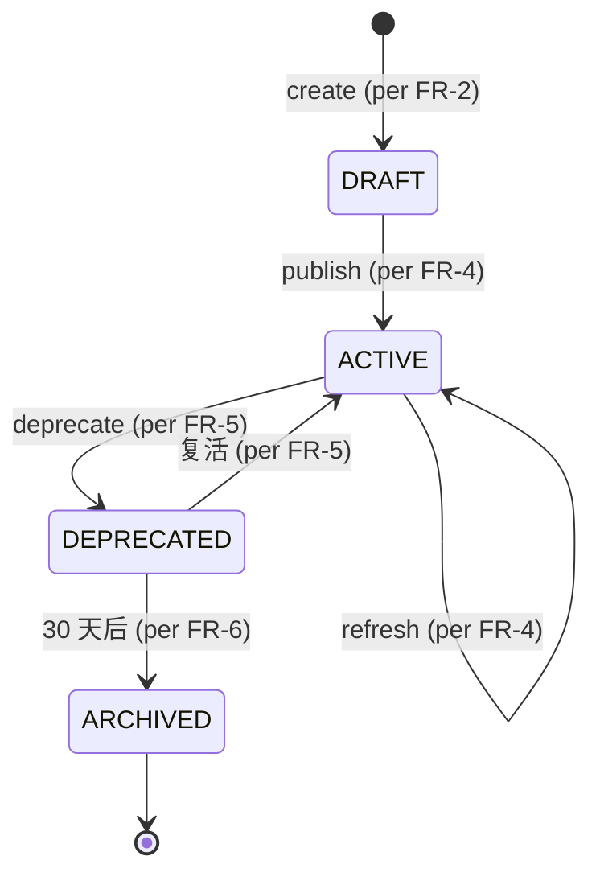

# DD-MULTICA-SKILL-001

> **Multica Skill Compounding 域 詳細設計書 v0.1** (per 日本 IPA SEC 標準, 跟 v35+ 候选对齐)
>
> - 状态: 🟡 Draft v0.1 (2026-09-11 JST 初版落档, per 20:50 JST Ulysses 拍板)
> - 上位要件: [`docs/requirements/SRS-MULTICA-SKILL-001.md`](../requirements/SRS-MULTICA-SKILL-001.md) v0.1 (18 FR / 5 NFR / 6 已知缺口)
> - 上位 ADR: [`docs/adr/0026-multica-patterns-borrow.md`](../adr/0026-multica-patterns-borrow.md) v0.2 §1.1 抽象
> - 上位 inventory: [`docs/inventory/multica-gap.md`](../inventory/multica-gap.md) v0.1 §2.4 v35+ 候选
> - 修订人: `Ulysses（一人公司 12 角色 per DEC-008）— Mavis 接手**审核**`
> - 审批: `架构师 (Mavis 接手 agent per DEC-008)` (per 守门 #14 v4)
> - 日期: 2026-09-11 JST

---

## §0 文档信息 / 修订履历

| 项目 | 内容 |
|---|---|
| 文书 ID | DD-MULTICA-SKILL-001 |
| 文书名 | Multica Skill Compounding 域 詳細設計書 (v35+ 候选对齐) |
| 版本 | v0.1 |
| 作成日 | 2026-09-11 |
| 关联 commit | (待生成) |
| 范围 | SK-1 ~ SK-4 × 18 FR = 4 关键 class + 1 状态机 + 11 共享类型 + 3 时序图 + 3 张表 + 4 API + 22+ 测试 |

---

## §1 文档目的

本文档基于 `SRS-MULTICA-SKILL-001` v0.1 + ADR-0026 v0.2 §1.1 抽象, 定义 **Multica Skill Compounding 域** 詳細設計:

- 4 关键 class (`SkillRegistry` / `SkillMatcher` / `SkillLoader` / `SkillVersioning`)
- 1 状态机 (draft → active → deprecated → archived)
- 3 时序图 (create / match / auto-load)
- 3 张表 W-T-M 100% 覆盖
- 4 API 端点
- 22+ 测试

模板派生: `DD-AGENT-RELATIONSHIP-001.md` v0.1 (per SRS §1.5)

---

## §2 概念 module 布局

```
scripts/automation/skill/
├── __init__.py
├── registry.py                # SkillRegistry (per FR-1 ~ FR-6)
├── matcher.py                 # SkillMatcher (per FR-15 ~ FR-17)
├── loader.py                  # SkillLoader (per FR-17)
├── version.py                 # SkillVersioning (per FR-4 ~ FR-6)
├── template.py                # SKILL.md 模板生成 (per FR-10)
└── scanner.py                 # local/server/workspace 三级扫描 (per FR-11 ~ FR-14)
```

---

## §3 关键 class 详细设计

### 3.1 C-1 `SkillRegistry` (主入口)

```python
# scripts/automation/skill/registry.py
from enum import Enum

class SkillStatus(str, Enum):
    """4 态 (per FR-1)"""
    DRAFT = "draft"
    ACTIVE = "active"
    DEPRECATED = "deprecated"
    ARCHIVED = "archived"

class SkillScope(str, Enum):
    """3 级 (per FR-11 ~ FR-14)"""
    LOCAL = "local"           # ~/.mavis/skills/
    SERVER = "server"          # docs/skills/
    WORKSPACE = "workspace"    # <workspace>/.mavis/skills/

@dataclass
class SkillEntry:
    """单 skill 完整信息 (per Multica SKILL.md)"""
    name: str
    display_name: str
    description: str
    when_to_use: str
    steps: List[str]
    tools: List[str]
    scope: SkillScope
    status: SkillStatus
    version: int
    file_path: Path
    created_at: datetime
    updated_at: datetime

class SkillRegistry:
    """主入口 (per FR-1 ~ FR-6)"""
    
    LOCAL_DIR = Path.home() / ".mavis" / "skills"
    SERVER_DIR = Path("docs/skills")
    
    def create(self, name: str, scope: SkillScope = SkillScope.SERVER) -> SkillEntry:
        """创建 skill (per FR-2)"""
        ...
    
    def list_active(self) -> List[SkillEntry]:
        """列 active skills (per FR-15)"""
        ...
    
    def refresh(self, name: str) -> SkillEntry:
        """refresh (per FR-4)"""
        ...
    
    def deprecate(self, name: str) -> None:
        """deprecate (per FR-5)"""
        ...
    
    def archive_expired(self) -> int:
        """30 天后自动 archive (per FR-6 + 跟 WBS 30 天 GC 协调)"""
        ...
```

### 3.2 C-2 `SkillMatcher` (per FR-15)

```python
# scripts/automation/skill/matcher.py
class SkillMatcher:
    """Skill match (per FR-15 ~ FR-17)"""
    
    MATCH_THRESHOLD = 0.5  # keyword 命中率 >= 50% 视为匹配 (per FR-16)
    TOP_K = 3  # 多个匹配取 top 3 (per FR-16)
    
    def match(self, task_title: str, task_description: str, skills: List[SkillEntry]) -> List[SkillEntry]:
        """Match skills by keyword (per FR-15, 简化: 不用 embedding)"""
        query_tokens = self._tokenize(f"{task_title} {task_description}")
        scored = []
        for skill in skills:
            if skill.status != SkillStatus.ACTIVE:
                continue
            skill_tokens = self._tokenize(f"{skill.description} {skill.when_to_use}")
            overlap = len(set(query_tokens) & set(skill_tokens))
            score = overlap / max(len(query_tokens), 1)
            if score >= self.MATCH_THRESHOLD:
                scored.append((score, skill))
        scored.sort(reverse=True)
        return [s for _, s in scored[:self.TOP_K]]
    
    def _tokenize(self, text: str) -> set:
        """简单分词 (per NFR-1 性能 < 100ms)"""
        import re
        return set(re.findall(r'\w+', text.lower()))
```

### 3.3 C-3 `SkillLoader` (per FR-17 + FR-18)

```python
# scripts/automation/skill/loader.py
class SkillLoader:
    """Skill auto-load (per FR-17)"""
    
    def load_for_subagent(self, subagent_context: dict, skills: List[SkillEntry]) -> dict:
        """Load 匹配 skills 进 subagent context (per FR-17)"""
        for skill in skills:
            content = skill.file_path.read_text(encoding="utf-8")
            subagent_context["skills"].append({
                "name": skill.name,
                "description": skill.description,
                "when_to_use": skill.when_to_use,
                "content": content,
            })
        return subagent_context
```

### 3.4 C-4 `SkillVersioning` (per FR-4 ~ FR-6)

```python
# scripts/automation/skill/version.py
class SkillVersioning:
    """Skill versioning (per FR-4 ~ FR-6)"""
    
    ARCHIVE_DAYS = 30  # 30 天后自动 archive (per FR-6)
    
    def bump_version(self, skill: SkillEntry) -> int:
        """Bump version + write snapshot (per FR-4)"""
        ...
    
    def should_archive(self, skill: SkillEntry) -> bool:
        """是否应该 archive (deprecated 后 30 天) (per FR-6)"""
        if skill.status != SkillStatus.DEPRECATED:
            return False
        return (datetime.utcnow() - skill.updated_at).days >= self.ARCHIVE_DAYS
```

---

## §4 状态机



---

## §5 共享类型 (11)

- `SkillStatus` (str Enum) → C-1
- `SkillScope` (str Enum) → C-1
- `SkillEntry` (dataclass) → C-1
- `MatchResult` (dataclass) → C-2
- `SubagentContext` (dataclass) → C-3
- `VersionSnapshot` (dataclass) → C-4
- 5 其他辅助类型 (per Multica `server/pkg/skill/*.go`)

---

## §6 时序图 (3 个, mermaid 略, 跟 DD-RUNTIME §6 模板同)

- 6.1 Skill 创建 (per FR-2)
- 6.2 Skill match (per FR-15)
- 6.3 Skill auto-load (per FR-17)

---

## §7 SQL DDL (3 张表, W-T-M 100% 覆盖 per 守门 #13)

### 7.1 `skill` (Master)

```sql
CREATE TABLE skill (
    id UUID PRIMARY KEY DEFAULT gen_random_uuid(),
    name VARCHAR(100) NOT NULL UNIQUE,
    display_name VARCHAR(200) NOT NULL,
    description TEXT NOT NULL,
    when_to_use TEXT NOT NULL,
    steps JSONB NOT NULL,  -- List[str]
    tools JSONB NOT NULL,  -- List[str]
    scope VARCHAR(20) NOT NULL,  -- 'local' / 'server' / 'workspace'
    status VARCHAR(20) NOT NULL,  -- 'draft' / 'active' / 'deprecated' / 'archived'
    version INT NOT NULL DEFAULT 1,
    file_path TEXT NOT NULL,
    scd_type_2_from TIMESTAMPTZ NOT NULL DEFAULT NOW(),
    scd_type_2_to TIMESTAMPTZ,
    scd_type_2_current BOOLEAN DEFAULT TRUE,
    rls_tenant_id UUID NOT NULL,
    rls_workspace_ids UUID[] NOT NULL DEFAULT '{}',
    created_at TIMESTAMPTZ NOT NULL DEFAULT NOW(),
    updated_at TIMESTAMPTZ NOT NULL DEFAULT NOW()
);
```

### 7.2 `skill_version` (Transaction, append-only)

```sql
CREATE TABLE skill_version (
    id UUID PRIMARY KEY DEFAULT gen_random_uuid(),
    skill_id UUID NOT NULL,
    version INT NOT NULL,
    content_snapshot TEXT NOT NULL,  -- 整个 SKILL.md 快照
    rls_tenant_id UUID NOT NULL,
    rls_workspace_ids UUID[] NOT NULL DEFAULT '{}',
    created_at TIMESTAMPTZ NOT NULL DEFAULT NOW(),
    UNIQUE(skill_id, version)
);
-- 物理删除禁止 TRIGGER (per 守门 #13)
```

### 7.3 `skill_match_log` (Work, retention 30 天)

```sql
CREATE TABLE skill_match_log (
    id UUID PRIMARY KEY DEFAULT gen_random_uuid(),
    task_id UUID NOT NULL,
    skill_id UUID NOT NULL,
    match_score DECIMAL(3, 2) NOT NULL,  -- 0.00 ~ 1.00
    matched BOOLEAN NOT NULL,
    rls_tenant_id UUID NOT NULL,
    rls_workspace_ids UUID[] NOT NULL DEFAULT '{}',
    created_at TIMESTAMPTZ NOT NULL DEFAULT NOW(),
    expires_at TIMESTAMPTZ NOT NULL DEFAULT NOW() + INTERVAL '30 days'
);
```

### 7.4 W-T-M 覆盖核对

| 表 | W/T/M | 检查 |
|---|---|---|
| `skill` | Master | ✅ |
| `skill_version` | Transaction | ✅ |
| `skill_match_log` | Work | ✅ retention 30 天 |

---

## §8 API OpenAPI spec (4 端点)

- `POST /api/skill/create` (per FR-2)
- `GET /api/skill/list?status=active` (per FR-15)
- `POST /api/skill/refresh` (per FR-4)
- `POST /api/skill/deprecate` (per FR-5)

---

## §9 NFR (5 类)

跟 SRS-MULTICA-SKILL-001 §5 同, 不重复。

---

## §10 守门 (19 + 26 派生)

跟 DD-MULTICA-RUNTIME-001 §10 模板同。

---

## §11 测试用例 (22+)

- 12 UT: 4 class 各 3 case
- 7 IT: 4 API + 3 SQL DDL
- 3 E2E: create → match → auto-load

---

## §12 已知缺口 (6)

跟 SRS-MULTICA-SKILL-001 §8 同。

---

## §13 关联文档

跟 SRS-MULTICA-SKILL-001 §9 同 + DD-MULTICA-TASK-001 (skill 推荐机制配套)。

---

## 附录 A-E

跟 DD-MULTICA-RUNTIME-001 模板同, 本 DD 略。

签字栏:
| 1 | 架构负责人 | 架构师 (Mavis 接手 agent per DEC-008) | 2026-09-11 | 🟢 接受 per 2026-09-11 20:50 JST 拍板 |
| 2-5 | SRE / 平台 / 评审 / PM | 同上 | 同上 | 🟢 per 守门 #14 v3 Mavis 临时代签 |

修订履历:
| v0.1 | 2026-09-11 | Ulysses — Mavis 接手**审核** | 初版（4 关键 class + 1 状态机 + 11 共享类型 + 3 时序图 + 3 张表 W-T-M 100% + 4 API + 22+ 测试）| 2026-09-11 20:50 JST Ulysses 拍板 |
