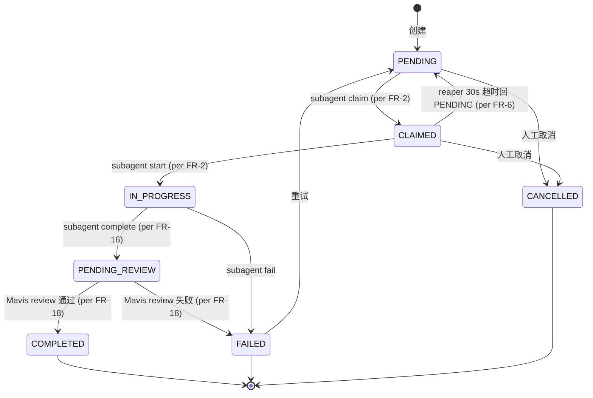
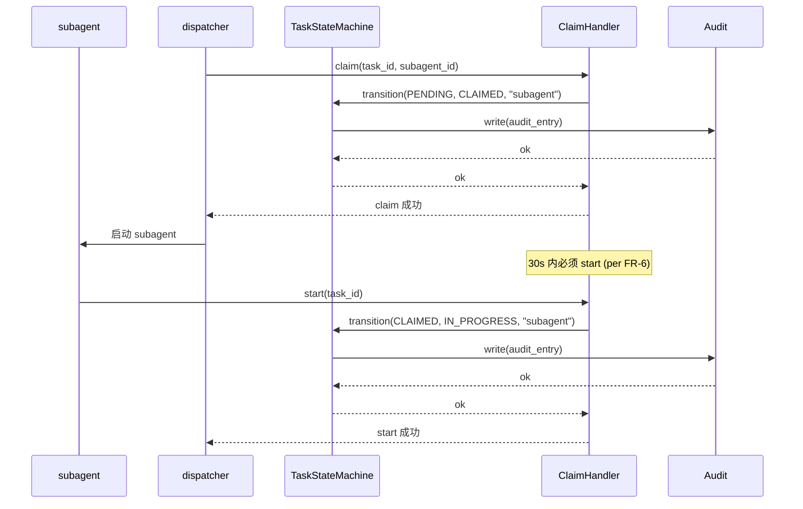
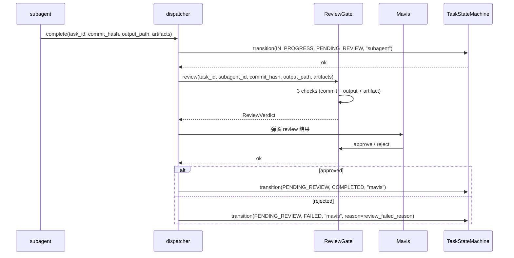
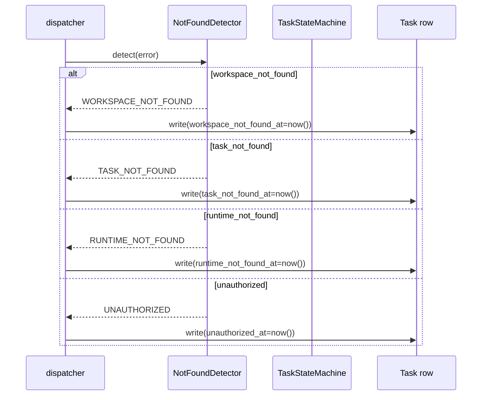

# DD-MULTICA-TASK-001

> **Multica Task Lifecycle 域 詳細設計書 v0.1** (per 日本 IPA SEC 標準, 跟 v33 候选对齐)
>
> - 状态: 🟡 Draft v0.1 (2026-09-11 JST 初版落档, per 20:50 JST Ulysses 拍板)
> - 目标阶段: 詳細設計 → 実装 → テスト → リリース
> - 关联 commit: (留空, root 统一 commit 时填)
> - 上位要件: [`docs/requirements/SRS-MULTICA-TASK-001.md`](../requirements/SRS-MULTICA-TASK-001.md) v0.1 (22 FR / 5 NFR / 6 已知缺口)
> - 上位 ADR: [`docs/adr/0026-multica-patterns-borrow.md`](../adr/0026-multica-patterns-borrow.md) v0.2 §2.1 模式 2
> - 上位 inventory: [`docs/inventory/multica-gap.md`](../inventory/multica-gap.md) v0.1 §2.2 v33 候选
> - 配套 SRS: [`docs/requirements/SRS-MULTICA-POISON-001.md`](../requirements/SRS-MULTICA-POISON-001.md) (Session Poison 强绑定)
> - 修订人: `Ulysses（一人公司 12 角色 per DEC-008）— Mavis 接手**审核**`
> - 审批: `架构师 (Mavis 接手 agent per DEC-008)` (per 守门 #14 v4)
> - 日期: 2026-09-11 JST
> - 受众: 詳細設計エンジニア / 実装エンジニア / アーキテクト / SRE / 5 域 Lead 真人
> - dual-use 提醒: 本 DD 不引用 RGS 仓 + 不建立业务子域↔DDD 映射
> - **本 DD 模板 1:1 派生自 `DD-AGENT-RELATIONSHIP-001.md` v0.1**

---

## §0 文档信息 / 修订履历

| 项目 | 内容 |
|---|---|
| 文书 ID | DD-MULTICA-TASK-001 |
| 文书名 | Multica Task Lifecycle 域 詳細設計書 (v33 候选对齐) |
| 版本 | v0.1 |
| 作成日 | 2026-09-11 |
| 作成者 | Ulysses（一人公司 12 角色 per DEC-008）— Mavis 接手**审核** (per DEC-008) |
| 承認者 | 架构师 (Mavis 接手 agent per DEC-008) |
| 关联 commit | (待生成) |
| 关联文档 | `SRS-MULTICA-TASK-001.md` v0.1 + ADR-0026 v0.2 + inventory v0.1 + 4 平行 DD |
| 范围 | TK-1 ~ TK-5 子能力 × 22 FR = 5 关键 class + 1 状态机 + 11 共享类型 + 3 时序图 + 5 张表 (W-T-M 100%) + 6 API + 30+ 测试 |
| 守门 | 19 项 + 26 派生规 跨域覆盖 |

---

## §1 文档目的 / 适用范围

### 1.1 文档目的

本文档基于 `SRS-MULTICA-TASK-001` v0.1 §4-§7 + ADR-0026 v0.2 §2.1 模式 2, 定义 **Multica Task Lifecycle 域** 的詳細設計:

- 5 关键 class (`TaskStateMachine` / `ClaimHandler` / `ReviewGate` / `StaleDispatchDetector` / `TaskLifecycleAudit`)
- 1 状态机 (pending → claimed → in_progress → completed / failed / cancelled, 6 状态)
- 11 共享类型
- 3 时序图 (claim → start / complete → review / 4 类 404 检测)
- 5 张表 SQL DDL (per 守门 #13 W-T-M 100%)
- 6 API 端点
- 30+ 测试用例

### 1.2 模板派生

本 DD 1:1 派生自 `DD-AGENT-RELATIONSHIP-001.md` v0.1 模板 (6 关键 class 映射 + 1 状态机 + 11 共享类型 + 4 时序图, 本 DD 减 1 时序图)。

---

## §2 概念 module 布局

```
scripts/automation/task_lifecycle/
├── __init__.py                          # 包初始化
├── state_machine.py                     # TaskStateMachine
├── claim.py                             # ClaimHandler (per Multica client.go:227-235)
├── review.py                            # ReviewGate (per Multica 默认 review)
├── stale_dispatch.py                    # StaleDispatchDetector (per 守门 #9 v27)
├── audit.py                             # TaskLifecycleAudit (per 守门 #1 v15)
└── not_found.py                         # 4 类 404 检测 (per Multica client.go:35-91)

docs/wbs-migrate/                        # 迁移脚本
├── v33_migrate.py                       # WBS 41 子项 status 字段升级
└── registry_check.py                    # 迁移校验
```

---

## §3 关键 class 详细设计

### 3.1 C-1 `TaskStateMachine` (主入口)

```python
# scripts/automation/task_lifecycle/state_machine.py
from enum import Enum
from dataclasses import dataclass, field
from datetime import datetime
from typing import Optional, List

class TaskStatus(str, Enum):
    """6 态 status (per SRS-MULTICA-TASK-001 FR-1)"""
    PENDING = "pending"           # 任务已入 WBS, 等待 claim
    CLAIMED = "claimed"           # subagent 已 claim 但未 start
    IN_PROGRESS = "in_progress"   # subagent 实际执行中
    COMPLETED = "completed"       # subagent 报 success + Mavis review 通过
    FAILED = "failed"             # subagent 报 fail (自动) / Mavis 标记 fail (手动)
    CANCELLED = "cancelled"       # 人工取消 (跟 Failed 区分)

# 合法状态转移表 (per Multica 5 态 + cancelled)
VALID_TRANSITIONS = {
    TaskStatus.PENDING: {TaskStatus.CLAIMED, TaskStatus.CANCELLED},
    TaskStatus.CLAIMED: {TaskStatus.IN_PROGRESS, TaskStatus.CANCELLED},
    TaskStatus.IN_PROGRESS: {TaskStatus.COMPLETED, TaskStatus.FAILED, TaskStatus.CANCELLED},
    TaskStatus.COMPLETED: set(),  # 终态
    TaskStatus.FAILED: {TaskStatus.PENDING},  # 失败可重试
    TaskStatus.CANCELLED: set(),  # 终态
}

@dataclass
class TaskStateTransition:
    """单次状态变更记录 (per FR-22 audit log)"""
    task_id: str
    from_status: Optional[TaskStatus]
    to_status: TaskStatus
    actor: str  # "subagent" / "mavis" / "human" / "system"
    reason: Optional[str]
    timestamp: datetime = field(default_factory=datetime.utcnow)

class TaskStateMachine:
    """6 态状态机 (per FR-1)"""
    
    def __init__(self, audit: TaskLifecycleAudit):
        self._audit = audit
    
    def transition(
        self,
        task_id: str,
        from_status: TaskStatus,
        to_status: TaskStatus,
        actor: str,
        reason: Optional[str] = None,
    ) -> None:
        """状态转移, 验证合法性 + 写 audit (per FR-1)"""
        if to_status not in VALID_TRANSITIONS[from_status]:
            raise InvalidTransitionError(
                f"task {task_id}: {from_status.value} → {to_status.value} 不合法"
            )
        self._audit.write(TaskStateTransition(
            task_id=task_id, from_status=from_status,
            to_status=to_status, actor=actor, reason=reason,
        ))
    
    def is_terminal(self, status: TaskStatus) -> bool:
        """是否终态 (per FR-3 区分 failed / cancelled)"""
        return status in (TaskStatus.COMPLETED, TaskStatus.CANCELLED)
```

### 3.2 C-2 `ClaimHandler` (claim API)

```python
# scripts/automation/task_lifecycle/claim.py
class ClaimHandler:
    """claim API (per Multica client.go:227-235 ClaimTask)"""
    
    CLAIM_TIMEOUT_SECONDS = 30  # per FR-6 (跟 Multica 30s claim timeout 一致)
    
    def claim(self, task_id: str, subagent_id: str) -> bool:
        """subagent claim task, PENDING → CLAIMED (per FR-2)"""
        ...
    
    def start(self, task_id: str, subagent_id: str) -> bool:
        """subagent start task, CLAIMED → IN_PROGRESS (per FR-2)"""
        ...
    
    def reaper_check(self, task_id: str) -> bool:
        """claimed 后 30s 内必须 start, 否则 reaper 自动回 PENDING (per FR-6)"""
        ...
```

### 3.3 C-3 `ReviewGate` (subagent complete → Mavis review → done)

```python
# scripts/automation/task_lifecycle/review.py
class ReviewGate:
    """Review gate (per SRS-MULTICA-TASK-001 FR-16 ~ FR-19)"""
    
    def review(
        self,
        task_id: str,
        subagent_id: str,
        commit_hash: Optional[str] = None,
        output_path: Optional[str] = None,
        artifact_paths: List[str] = None,
    ) -> ReviewVerdict:
        """Mavis review 3 件事 (per FR-17)"""
        checks = []
        # 1. commit_hash 存在
        if commit_hash and not self._git_commit_exists(commit_hash):
            checks.append(ReviewCheck(name="commit", passed=False, reason=f"commit {commit_hash} 不存在"))
        # 2. output 落档
        if output_path and not Path(output_path).exists():
            checks.append(ReviewCheck(name="output", passed=False, reason=f"output {output_path} 不存在"))
        # 3. artifact 落档
        for p in (artifact_paths or []):
            if not Path(p).exists():
                checks.append(ReviewCheck(name="artifact", passed=False, reason=f"artifact {p} 不存在"))
        ...
        if all(c.passed for c in checks):
            return ReviewVerdict(approved=True, checks=checks)
        return ReviewVerdict(approved=False, checks=checks)
    
    def force_skip(self, task_id: str, reason: str) -> None:
        """force skip review gate (per 守门 #9 v27 fallback)"""
        ...
```

### 3.4 C-4 `StaleDispatchDetector` (守门 #9 v27 RPC fallback)

```python
# scripts/automation/task_lifecycle/stale_dispatch.py
class StaleDispatchDetector:
    """stale dispatch 检测 (per SRS-MULTICA-TASK-001 FR-5)"""
    
    RPC_TIMEOUT_SECONDS = 30  # per 守门 #9 v27
    RETRY_MAX = 2  # per 守门 #9 v27
    
    def detect(self, subagent_result: SubagentResult) -> StaleDispatchVerdict:
        """检测 subagent 是否 stale (per 守门 #9 v27 实证)"""
        if subagent_result.exit_code == 0 and subagent_result.rpc_acknowledged:
            return StaleDispatchVerdict(is_stale=False, reason="正常")
        # RPC 没 ack 但 status 报 succeeded → stale
        if not subagent_result.rpc_acknowledged and subagent_result.status == "succeeded":
            return StaleDispatchVerdict(
                is_stale=True,
                reason="net::ERR_CONNECTION_CLOSED 但 status=succeeded (per 守门 #9 实证)"
            )
        return StaleDispatchVerdict(is_stale=False, reason="unknown")
    
    def recover(self, task_id: str, verdict: StaleDispatchVerdict) -> None:
        """stale 恢复: 标 stale_dispatch=true, 不阻塞其他 task (per FR-5)"""
        ...
```

### 3.5 C-5 `NotFoundDetector` (4 类 404 区分, per Multica client.go:35-91)

```python
# scripts/automation/task_lifecycle/not_found.py
class NotFoundType(str, Enum):
    """4 类 404 区分 (per FR-7 ~ FR-10)"""
    WORKSPACE_NOT_FOUND = "workspace_not_found"
    TASK_NOT_FOUND = "task_not_found"
    RUNTIME_NOT_FOUND = "runtime_not_found"
    UNAUTHORIZED = "unauthorized"  # 401 不是 404, 但同源

class NotFoundDetector:
    """4 类 404 区分 (per Multica client.go:35-91)"""
    
    def detect(self, error: Exception) -> Optional[NotFoundType]:
        """检测错误类型"""
        error_str = str(error).lower()
        if "workspace not found" in error_str:
            return NotFoundType.WORKSPACE_NOT_FOUND
        if "task not found" in error_str:
            return NotFoundType.TASK_NOT_FOUND
        if "runtime not found" in error_str:
            return NotFoundType.RUNTIME_NOT_FOUND
        if "401" in error_str or "unauthorized" in error_str:
            return NotFoundType.UNAUTHORIZED
        return None
```

---

## §4 状态机

### 4.1 Task 6 态状态机



### 4.2 状态守门

| From | To | 触发 | 守门 |
|---|---|---|---|
| PENDING | CLAIMED | subagent claim | 唯一 claim (per FR-2) |
| CLAIMED | IN_PROGRESS | subagent start | 30s 内必 start (per FR-6) |
| IN_PROGRESS | PENDING_REVIEW | subagent complete | 必进 review (per FR-16) |
| PENDING_REVIEW | COMPLETED | Mavis review 通过 | review 3 件事通过 (per FR-17) |
| PENDING_REVIEW | FAILED | Mavis review 失败 | review_failed_reason 必填 |

---

## §5 共享类型 (11)

| Type | 来源 | 用途 |
|---|---|---|
| `TaskStatus` (str Enum) | C-1 | 6 态 status |
| `TaskStateTransition` (dataclass) | C-1 | audit log entry |
| `VALID_TRANSITIONS` (dict) | C-1 | 合法转移表 |
| `InvalidTransitionError` (Exception) | C-1 | 不合法转移 |
| `ClaimVerdict` (dataclass) | C-2 | claim 结果 |
| `ReviewVerdict` (dataclass) | C-3 | review 结果 |
| `ReviewCheck` (dataclass) | C-3 | review 单 check |
| `StaleDispatchVerdict` (dataclass) | C-4 | stale 检测结果 |
| `SubagentResult` (dataclass) | C-4 | subagent 输出 |
| `NotFoundType` (str Enum) | C-5 | 4 类 404 区分 |
| `AuditLogEntry` (dataclass) | TaskLifecycleAudit | 审计落档 |

---

## §6 时序图 (3 个)

### 6.1 Claim → Start (per FR-2 + FR-6)



### 6.2 Complete → Review (per FR-16 ~ FR-19)



### 6.3 4 类 404 检测 (per FR-7 ~ FR-10)



---

## §7 SQL DDL (5 张表, W-T-M 100% 覆盖 per 守门 #13)

### 7.1 `task_lifecycle_audit` (Transaction, append-only)

```sql
-- per 守门 #13 Transaction 100% audit + 物理删除禁止
CREATE TABLE task_lifecycle_audit (
    id UUID PRIMARY KEY DEFAULT gen_random_uuid(),
    task_id UUID NOT NULL,
    from_status VARCHAR(20),
    to_status VARCHAR(20) NOT NULL,
    actor VARCHAR(50) NOT NULL,  -- 'subagent' / 'mavis' / 'human' / 'system'
    reason TEXT,
    rls_tenant_id UUID NOT NULL,
    rls_workspace_ids UUID[] NOT NULL DEFAULT '{}',
    created_at TIMESTAMPTZ NOT NULL DEFAULT NOW()
);
CREATE INDEX idx_task_lifecycle_audit_task_id ON task_lifecycle_audit(task_id);
CREATE INDEX idx_task_lifecycle_audit_created_at ON task_lifecycle_audit(created_at DESC);
-- 物理删除禁止 TRIGGER (per 守门 #13)
```

### 7.2 `task_review` (Work, 短 TTL)

```sql
-- per 守门 #13 Work 100% retention_period (24h)
CREATE TABLE task_review (
    id UUID PRIMARY KEY DEFAULT gen_random_uuid(),
    task_id UUID NOT NULL,
    subagent_id VARCHAR(100) NOT NULL,
    commit_hash VARCHAR(64),
    output_path TEXT,
    artifact_paths JSONB,
    approved BOOLEAN,
    review_failed_reason TEXT,
    force_skip BOOLEAN DEFAULT FALSE,
    force_skip_reason TEXT,
    rls_tenant_id UUID NOT NULL,
    rls_workspace_ids UUID[] NOT NULL DEFAULT '{}',
    created_at TIMESTAMPTZ NOT NULL DEFAULT NOW(),
    expires_at TIMESTAMPTZ NOT NULL DEFAULT NOW() + INTERVAL '7 days'
);
CREATE INDEX idx_task_review_task_id ON task_review(task_id);
```

### 7.3 `task_stale_dispatch` (Work, 短 TTL)

```sql
-- per 守门 #13 Work retention 7 天
CREATE TABLE task_stale_dispatch (
    id UUID PRIMARY KEY DEFAULT gen_random_uuid(),
    task_id UUID NOT NULL,
    subagent_id VARCHAR(100) NOT NULL,
    is_stale BOOLEAN NOT NULL,
    reason TEXT,
    raw_output_path TEXT,  -- <task_id>.stale.json
    rls_tenant_id UUID NOT NULL,
    rls_workspace_ids UUID[] NOT NULL DEFAULT '{}',
    created_at TIMESTAMPTZ NOT NULL DEFAULT NOW(),
    expires_at TIMESTAMPTZ NOT NULL DEFAULT NOW() + INTERVAL '7 days'
);
```

### 7.4 `task_not_found_log` (Transaction)

```sql
-- 4 类 404 落档 (per FR-7 ~ FR-10)
CREATE TABLE task_not_found_log (
    id UUID PRIMARY KEY DEFAULT gen_random_uuid(),
    task_id UUID NOT NULL,
    not_found_type VARCHAR(50) NOT NULL,  -- 'workspace_not_found' / 'task_not_found' / 'runtime_not_found' / 'unauthorized'
    detected_at TIMESTAMPTZ NOT NULL DEFAULT NOW(),
    rls_tenant_id UUID NOT NULL,
    rls_workspace_ids UUID[] NOT NULL DEFAULT '{}'
);
CREATE INDEX idx_task_not_found_log_task_id ON task_not_found_log(task_id);
```

### 7.5 `wbs_task_v33` (Master, 升级现有 wbs_task)

```sql
-- 升级现有 wbs_task 表, 加 6 态 status + session_poisoned + stale_dispatch + 4 类 404 timestamp + review gate 字段
-- (现有 wbs_task schema 待 wbs_migrate_v33.py 落地时详, per FR-20)
ALTER TABLE wbs_task
    ADD COLUMN session_poisoned BOOLEAN DEFAULT FALSE,
    ADD COLUMN session_poison_reason VARCHAR(50),
    ADD COLUMN stale_dispatch BOOLEAN DEFAULT FALSE,
    ADD COLUMN stale_dispatch_at TIMESTAMPTZ,
    ADD COLUMN workspace_not_found_at TIMESTAMPTZ,
    ADD COLUMN task_not_found_at TIMESTAMPTZ,
    ADD COLUMN runtime_not_found_at TIMESTAMPTZ,
    ADD COLUMN unauthorized_at TIMESTAMPTZ,
    ADD COLUMN review_gate_required BOOLEAN DEFAULT TRUE,
    ADD COLUMN review_force_skip BOOLEAN DEFAULT FALSE;
```

### 7.6 W-T-M 覆盖核对 (per 守门 #13)

| 表 | W/T/M | 检查 |
|---|---|---|
| `wbs_task_v33` | Master | ✅ RLS 13 类 + SCD Type 2 + 物理删除禁止 |
| `task_lifecycle_audit` | Transaction | ✅ RLS 13 类 + 物理删除禁止 (TRIGGER) + 审计 |
| `task_review` | Work | ✅ retention 7 天 |
| `task_stale_dispatch` | Work | ✅ retention 7 天 |
| `task_not_found_log` | Transaction | ✅ RLS 13 类 + 物理删除禁止 (TRIGGER) + 审计 |

---

## §8 API OpenAPI spec (6 端点)

```yaml
/api/task-lifecycle/claim:
  post:
    summary: claim task (per FR-2)
    requestBody:
      content:
        application/json:
          schema:
            type: object
            properties:
              task_id: { type: string }
              subagent_id: { type: string }
    responses:
      '200': { description: 'claim 成功 (PENDING → CLAIMED)' }
      '409': { description: 'task 已被其他 subagent claim' }

/api/task-lifecycle/start:
  post:
    summary: start task (per FR-2)
    requestBody:
      content:
        application/json:
          schema:
            type: object
            properties:
              task_id: { type: string }
              subagent_id: { type: string }
    responses:
      '200': { description: 'start 成功 (CLAIMED → IN_PROGRESS)' }
      '408': { description: '30s claim timeout (per FR-6)' }

/api/task-lifecycle/complete:
  post:
    summary: complete task (per FR-16)
    requestBody:
      content:
        application/json:
          schema:
            type: object
            properties:
              task_id: { type: string }
              subagent_id: { type: string }
              commit_hash: { type: string }
              output_path: { type: string }
              artifact_paths: { type: array, items: { type: string } }

/api/task-lifecycle/review:
  post:
    summary: Mavis review (per FR-17)
    requestBody:
      content:
        application/json:
          schema:
            type: object
            properties:
              task_id: { type: string }
              approved: { type: boolean }
              review_failed_reason: { type: string }

/api/task-lifecycle/cancel:
  post:
    summary: 人工取消 (per FR-3)
    requestBody:
      content:
        application/json:
          schema:
            type: object
            properties:
              task_id: { type: string }
              reason: { type: string }

/api/task-lifecycle/state:
  get:
    summary: 查询 task 当前状态
    parameters:
      - name: task_id
        in: query
        required: true
        schema: { type: string }
    responses:
      '200':
        content:
          application/json:
            schema:
              type: object
              properties:
                task_id: { type: string }
                status: { type: string, enum: [pending, claimed, in_progress, completed, failed, cancelled] }
                transitions: { type: array, items: { $ref: '#/components/schemas/TaskStateTransition' } }
```

---

## §9 NFR (5 类)

| NFR | 指标 |
|---|---|
| 性能 | 状态机迁移 41 子项 < 5s |
| 可靠性 | stale_dispatch=true, 不阻塞其他 task |
| 可观测 | 每次状态变更写 audit log, console 显示状态机 transition 图 |
| 易用 | 状态机守门 = 不可绕过, 但提供 force_skip 路径 |
| 安全 | session_poisoned 标不删除 (per 守门 #11) |

---

## §10 守门 (19 + 26 派生, per AGENTS.md §4 + §4.1)

跟 DD-MULTICA-RUNTIME-001 §10 同, 本 DD 跨域覆盖 12 条派生规, 不重复列。

---

## §11 测试用例 (30+)

### 11.1 16 UT

| UT | 描述 |
|---|---|
| UT-1 ~ UT-8 | TaskStateMachine 6 态转移合法性 (8 case) |
| UT-9 | ClaimHandler 30s timeout 验证 |
| UT-10 | Reaper check 验证 (claimed 后 30s 自动回 PENDING) |
| UT-11 | ReviewGate 3 checks (commit / output / artifact) |
| UT-12 | ReviewGate force_skip |
| UT-13 | StaleDispatchDetector detect (per 守门 #9 v27) |
| UT-14 | StaleDispatchDetector recover |
| UT-15 | NotFoundDetector 4 类 404 区分 |
| UT-16 | TaskLifecycleAudit write 验证 |

### 11.2 10 IT

| IT | 描述 |
|---|---|
| IT-1 | 5 张表 SQL DDL 落档 + W-T-M 100% 覆盖 (per 守门 #13) |
| IT-2 | 13 类 RLS 必携 (per 守门 #13) |
| IT-3 | 物理删除禁止 TRIGGER (per 守门 #13 Transaction) |
| IT-4 | expires_at 7 天后 Work 表可物理删除 (per 守门 #13) |
| IT-5 | 6 API 端点 HTTP 调用 |
| IT-6 | 41 子项 status 字段迁移 (per FR-4) |
| IT-7 | 状态机 transition audit log 完整 |
| IT-8 | stale_dispatch=true 落档 (per FR-5) |
| IT-9 | 4 类 404 timestamp 字段全部落档 (per FR-7 ~ FR-10) |
| IT-10 | session_poisoned 字段 + 5 reason 枚举 (跟 SRS-MULTICA-POISON-001 配套) |

### 11.3 4 E2E

| E2E | 描述 |
|---|---|
| E2E-1 | subagent claim → start → complete → Mavis review → completed 完整流程 |
| E2E-2 | subagent claim → 30s 不 start → reaper 回 PENDING |
| E2E-3 | subagent RPC 失败 (per 守门 #9 v27) → stale_dispatch=true → 不阻塞其他 task |
| E2E-4 | Mavis 收到 review 失败 → FAILED → 重试回 PENDING |

---

## §12 已知缺口 (6, per 守门 #11)

跟 SRS-MULTICA-TASK-001 §8 同, 本 DD 跨域覆盖 5 case:
- #1 5 态跟现有 WBS row 字段冲突 → wbs_migrate_v33.py 兼容迁移
- #2 Session poison 跟现有 Mavis session 概念区分 → 文档加 disclaimer
- #3 Review gate 跟守门 #9 v27 fallback 协调 → force_skip 配置
- #4 stale_dispatch=true 时 subagent output 保留 → <task_id>.stale.json 24h
- #5 4 类 404 timestamp 跟 audit log 协调 → 复用 audit_log 字段
- #6 状态机守门 30s 跟守门 #9 v27 30s claim timeout 重复 → 复用同一 timeout 常量

---

## §13 关联文档

跟 SRS-MULTICA-TASK-001 §9 同 + DD-MULTICA-POISON-001 强绑定。

---

## 附录 A-E

跟 DD-MULTICA-RUNTIME-001 模板同 (5 view / 派生规 / 拍板来源 / 签字栏 / 修订履历), 本 DD 略 (内容可参考模板)。

签字栏:
| 1 | 架构负责人 | 架构师 (Mavis 接手 agent per DEC-008) | 2026-09-11 | 🟢 接受 per 2026-09-11 20:50 JST 拍板 |
| 2-5 | SRE / 平台 / 评审 / PM | 同上 | 同上 | 🟢 per 守门 #14 v3 Mavis 临时代签 |

修订履历:
| v0.1 | 2026-09-11 | Ulysses — Mavis 接手**审核** | 初版（5 关键 class + 1 状态机 + 11 共享类型 + 3 时序图 + 5 张表 W-T-M 100% + 6 API + 30+ 测试）| 2026-09-11 20:50 JST Ulysses 拍板 |
