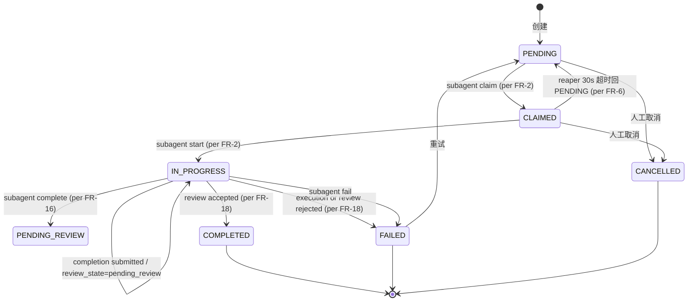
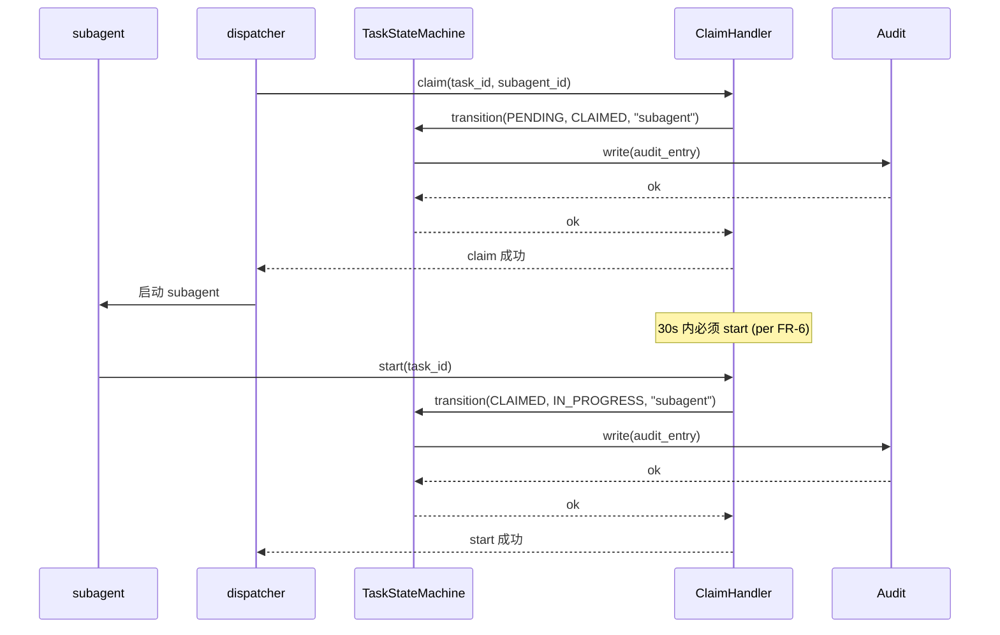
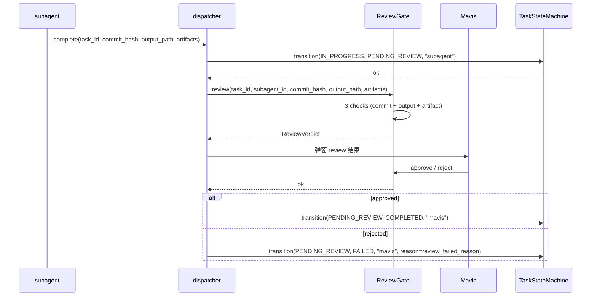
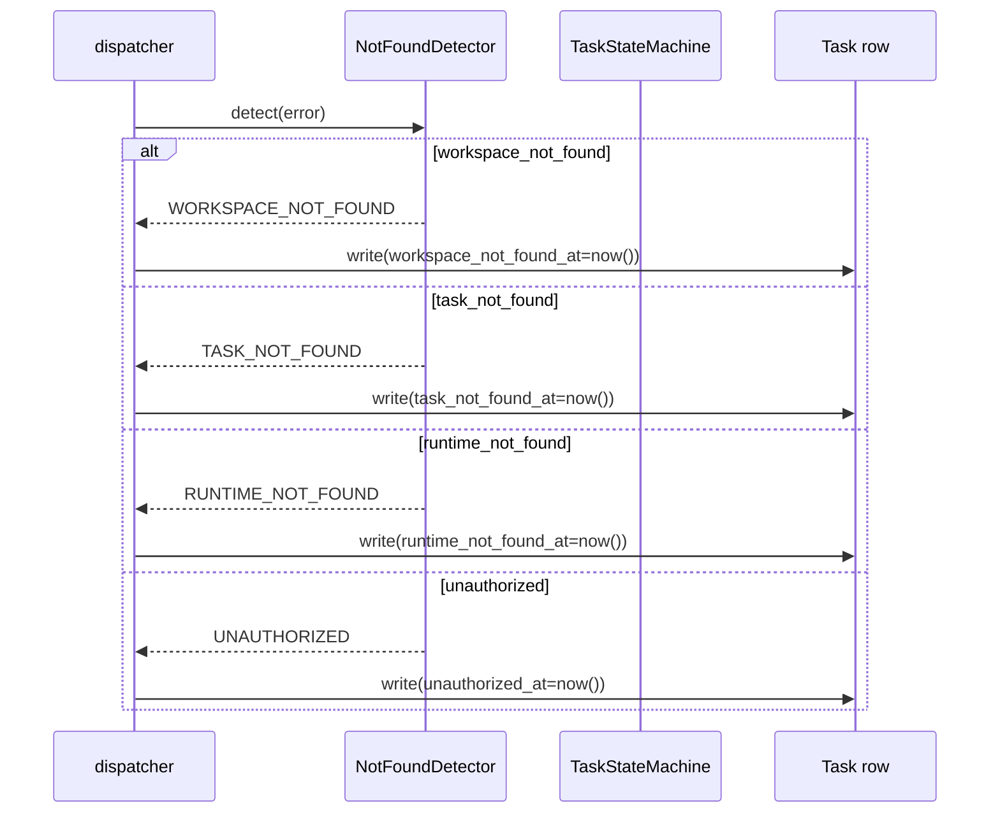

# DD-MULTICA-TASK-001

> **Multica Task Lifecycle 域 詳細設計書 v1.25** (per 日本 IPA SEC 标准，补充 Run Task Cards bounded UI projection、Run-local Engineering Loop controller 与 Schedule recurrence/lease adapter)
>
> - 状态: 🟡 Draft v1.25 (Run/BI、Agent Profile、双 Loop 与 Hook contract 已设计；Phase 8A/8B/9D-5b/9E-4A/9E-4B1/9E-4B2/9E-4B3/9E-4B4/9E-4C1/9E-4C2/9E-4C3、9F1/9F2/9F3 有条件式代码/schema 切片或设计收口；Run-local Rust Loop controller 已有 bounded state、snapshot guard、budget stop、独立验证与 drain receipt；Schedule 已有 typed parser/materializer/PostgreSQL occurrence/lease adapter 并通过 disposable PostgreSQL 18.6 集成场景，候选槽和 DST 转换探测均有 32,768 步硬上限，disabled Rule 双层 fail closed、lease-expired audit 对齐旧 attempt/fence，domain release tests 26/26，但无生产 Rule write API、常驻 worker 或 Run admission；Loop 尚未接 Run admission/Auth、CLI/provider/OS process、持久化/checkpoint、BI 或跨 Run fair scheduler；Run Task Cards bounded UI/client 已有条件式只读代码切片，旧 Tauri demo Task/fallback 已退役；目标 DB/RLS、生产 provisioner、ACL/provider、reservation lifecycle、catalog publisher 与 BI/Outbox 仍开放)
> - 目标阶段: 詳細設計 → 実装 → テスト → リリース
> - 关联 commit: (留空, root 统一 commit 时填)
> - 关联总要件 / 基本设计: `docs/requirements.md` v5.56 §50；`docs/basic-design.md` v5.53 §16.14-16.23
> - 关联 Group / Hook 详细设计: `docs/design/DD-WORKTREE-GROUP-001.md` v4.35；`docs/detailed-design/DD-MULTICA-HOOK-001.md` v0.5.14
> - 上位要件: [`docs/requirements/SRS-MULTICA-TASK-001.md`](../requirements/SRS-MULTICA-TASK-001.md) v0.12
> - 上位基本設計: [`docs/design/BD-MULTICA-TASK-001.md`](BD-MULTICA-TASK-001.md) v0.5
> - 上位 ADR: [`docs/adr/0026-multica-patterns-borrow.md`](../adr/0026-multica-patterns-borrow.md) v0.2 §2.1 模式 2
> - 上位 inventory: [`docs/inventory/multica-gap.md`](../inventory/multica-gap.md) v0.1 §2.2 v33 候选
> - 配套 SRS: [`docs/requirements/SRS-MULTICA-POISON-001.md`](../requirements/SRS-MULTICA-POISON-001.md) (Session Poison 强绑定)
> - 修订人: `Ulysses（一人公司 12 角色 per DEC-008）— Mavis 接手**审核**`
> - 审核: Ulysses（一人公司 12 角色 per DEC-008）— Mavis 接手审核；v0.2 补充待评审
> - 日期: 2026-10-02 JST
> - 受众: 詳細設計エンジニア / 実装エンジニア / アーキテクト / SRE / 5 域 Lead 真人
> - dual-use 提醒: 本 DD 不引用 RGS 仓 + 不建立业务子域↔DDD 映射
> - **本 DD 模板 1:1 派生自 `DD-AGENT-RELATIONSHIP-001.md` v0.1**

---

## §0 文档信息 / 修订履历

| 项目 | 内容 |
|---|---|
| 文书 ID | DD-MULTICA-TASK-001 |
| 文书名 | Multica Task Lifecycle 域 詳細設計書 (Worktree Group 集成) |
| 版本 | v1.24 |
| 作成日 | 2026-09-28 |
| 作成者 | Ulysses（一人公司 12 角色 per DEC-008）— Mavis 接手**审核** (per DEC-008) |
| 承認者 | Draft；v1.24 Schedule parser/adapter 本地 DB 证据与生产验收边界待评审 |
| 关联 commit | (待生成) |
| 关联文档 | `SRS-MULTICA-TASK-001.md` v0.11 + `BD-MULTICA-TASK-001.md` v0.4 + ADR-0026 v0.2 + `DD-SHARED-TASK-001.md` v0.2 |
| 范围 | TK-1 ~ TK-5 子能力 × 22 FR = 5 关键 class + 1 状态机 + 11 共享类型 + 3 时序图 + 5 张表 (W-T-M 100%) + 6 API + 30+ 测试 |
| 守门 | 19 项 + 26 派生规 跨域覆盖 |

---

## §1 文档目的 / 适用范围

### 1.1 文档目的

本文档基于 `SRS-MULTICA-TASK-001` v0.1 §4-§7 + ADR-0026 v0.2 §2.1 模式 2, 定义 **Multica Task Lifecycle 域** 的詳細設計:

- 5 关键 class (`TaskStateMachine` / `ClaimHandler` / `ReviewGate` / `StaleDispatchDetector` / `TaskLifecycleAudit`)
- 1 状态机 (pending → claimed → in_progress → completed / failed / cancelled, 6 状态)
- 11 共享类型
- 3 时序图 (claim → start / complete → review / 4 类 404 检测)
- 5 张表 SQL DDL (per 守门 #13 W-T-M 100%)
- 6 API 端点
- 30+ 测试用例

### 1.2 模板派生

本 DD 1:1 派生自 `DD-AGENT-RELATIONSHIP-001.md` v0.1 模板 (6 关键 class 映射 + 1 状态机 + 11 共享类型 + 4 时序图, 本 DD 减 1 时序图)。

---

## §2 概念 module 布局

```
scripts/automation/task_lifecycle/
├── __init__.py                          # 包初始化
├── state_machine.py                     # TaskStateMachine
├── claim.py                             # ClaimHandler (per Multica client.go:227-235)
├── review.py                            # ReviewGate (per Multica 默认 review)
├── stale_dispatch.py                    # StaleDispatchDetector (per 守门 #9 v27)
├── audit.py                             # TaskLifecycleAudit (per 守门 #1 v15)
└── not_found.py                         # 4 类 404 检测 (per Multica client.go:35-91)

docs/wbs-migrate/                        # 迁移脚本
├── v33_migrate.py                       # WBS 41 子项 status 字段升级
└── registry_check.py                    # 迁移校验
```

---

## §3 关键 class 详细设计

### 3.1 C-1 `TaskStateMachine` (主入口)

```python
# scripts/automation/task_lifecycle/state_machine.py
from enum import Enum
from dataclasses import dataclass, field
from datetime import datetime
from typing import Optional, List

class TaskStatus(str, Enum):
    """6 态 status (per SRS-MULTICA-TASK-001 FR-1)"""
    PENDING = "pending"           # 任务已入 WBS, 等待 claim
    CLAIMED = "claimed"           # subagent 已 claim 但未 start
    IN_PROGRESS = "in_progress"   # subagent 实际执行中
    COMPLETED = "completed"       # subagent 报 success + Mavis review 通过
    FAILED = "failed"             # subagent 报 fail (自动) / Mavis 标记 fail (手动)
    CANCELLED = "cancelled"       # 人工取消 (跟 Failed 区分)

# 合法状态转移表 (per Multica 5 态 + cancelled)
VALID_TRANSITIONS = {
    TaskStatus.PENDING: {TaskStatus.CLAIMED, TaskStatus.CANCELLED},
    TaskStatus.CLAIMED: {TaskStatus.IN_PROGRESS, TaskStatus.CANCELLED},
    TaskStatus.IN_PROGRESS: {TaskStatus.COMPLETED, TaskStatus.FAILED, TaskStatus.CANCELLED},
    TaskStatus.COMPLETED: set(),  # 终态
    TaskStatus.FAILED: {TaskStatus.PENDING},  # 失败可重试
    TaskStatus.CANCELLED: set(),  # 终态
}

@dataclass
class TaskStateTransition:
    """单次状态变更记录 (per FR-22 audit log)"""
    task_id: str
    from_status: Optional[TaskStatus]
    to_status: TaskStatus
    actor: str  # "subagent" / "mavis" / "human" / "system"
    reason: Optional[str]
    timestamp: datetime = field(default_factory=datetime.utcnow)

class TaskStateMachine:
    """6 态状态机 (per FR-1)"""
    
    def __init__(self, audit: TaskLifecycleAudit):
        self._audit = audit
    
    def transition(
        self,
        task_id: str,
        from_status: TaskStatus,
        to_status: TaskStatus,
        actor: str,
        reason: Optional[str] = None,
    ) -> None:
        """状态转移, 验证合法性 + 写 audit (per FR-1)"""
        if to_status not in VALID_TRANSITIONS[from_status]:
            raise InvalidTransitionError(
                f"task {task_id}: {from_status.value} → {to_status.value} 不合法"
            )
        self._audit.write(TaskStateTransition(
            task_id=task_id, from_status=from_status,
            to_status=to_status, actor=actor, reason=reason,
        ))
    
    def is_terminal(self, status: TaskStatus) -> bool:
        """是否终态 (per FR-3 区分 failed / cancelled)"""
        return status in (TaskStatus.COMPLETED, TaskStatus.CANCELLED)
```

### 3.2 C-2 `ClaimHandler` (claim API)

```python
# scripts/automation/task_lifecycle/claim.py
class ClaimHandler:
    """claim API (per Multica client.go:227-235 ClaimTask)"""
    
    CLAIM_TIMEOUT_SECONDS = 30  # per FR-6 (跟 Multica 30s claim timeout 一致)
    
    def claim(self, task_id: str, subagent_id: str) -> bool:
        """subagent claim task, PENDING → CLAIMED (per FR-2)"""
        ...
    
    def start(self, task_id: str, subagent_id: str) -> bool:
        """subagent start task, CLAIMED → IN_PROGRESS (per FR-2)"""
        ...
    
    def reaper_check(self, task_id: str) -> bool:
        """claimed 后 30s 内必须 start, 否则 reaper 自动回 PENDING (per FR-6)"""
        ...
```

### 3.3 C-3 `ReviewGate` (subagent complete → Mavis review → done)

```python
# scripts/automation/task_lifecycle/review.py
class ReviewGate:
    """Review gate (per SRS-MULTICA-TASK-001 FR-16 ~ FR-19)"""
    
    def review(
        self,
        task_id: str,
        subagent_id: str,
        commit_hash: Optional[str] = None,
        output_path: Optional[str] = None,
        artifact_paths: List[str] = None,
    ) -> ReviewVerdict:
        """Mavis review 3 件事 (per FR-17)"""
        checks = []
        # 1. commit_hash 存在
        if commit_hash and not self._git_commit_exists(commit_hash):
            checks.append(ReviewCheck(name="commit", passed=False, reason=f"commit {commit_hash} 不存在"))
        # 2. output 落档
        if output_path and not Path(output_path).exists():
            checks.append(ReviewCheck(name="output", passed=False, reason=f"output {output_path} 不存在"))
        # 3. artifact 落档
        for p in (artifact_paths or []):
            if not Path(p).exists():
                checks.append(ReviewCheck(name="artifact", passed=False, reason=f"artifact {p} 不存在"))
        ...
        if all(c.passed for c in checks):
            return ReviewVerdict(approved=True, checks=checks)
        return ReviewVerdict(approved=False, checks=checks)
    
    def force_skip(self, task_id: str, reason: str) -> None:
        """force skip review gate (per 守门 #9 v27 fallback)"""
        ...
```

### 3.4 C-4 `StaleDispatchDetector` (守门 #9 v27 RPC fallback)

```python
# scripts/automation/task_lifecycle/stale_dispatch.py
class StaleDispatchDetector:
    """stale dispatch 检测 (per SRS-MULTICA-TASK-001 FR-5)"""
    
    RPC_TIMEOUT_SECONDS = 30  # per 守门 #9 v27
    RETRY_MAX = 2  # per 守门 #9 v27
    
    def detect(self, subagent_result: SubagentResult) -> StaleDispatchVerdict:
        """检测 subagent 是否 stale (per 守门 #9 v27 实证)"""
        if subagent_result.exit_code == 0 and subagent_result.rpc_acknowledged:
            return StaleDispatchVerdict(is_stale=False, reason="正常")
        # RPC 没 ack 但 status 报 succeeded → stale
        if not subagent_result.rpc_acknowledged and subagent_result.status == "succeeded":
            return StaleDispatchVerdict(
                is_stale=True,
                reason="net::ERR_CONNECTION_CLOSED 但 status=succeeded (per 守门 #9 实证)"
            )
        return StaleDispatchVerdict(is_stale=False, reason="unknown")
    
    def recover(self, task_id: str, verdict: StaleDispatchVerdict) -> None:
        """stale 恢复: 标 stale_dispatch=true, 不阻塞其他 task (per FR-5)"""
        ...
```

### 3.5 C-5 `NotFoundDetector` (4 类 404 区分, per Multica client.go:35-91)

```python
# scripts/automation/task_lifecycle/not_found.py
class NotFoundType(str, Enum):
    """4 类 404 区分 (per FR-7 ~ FR-10)"""
    WORKSPACE_NOT_FOUND = "workspace_not_found"
    TASK_NOT_FOUND = "task_not_found"
    RUNTIME_NOT_FOUND = "runtime_not_found"
    UNAUTHORIZED = "unauthorized"  # 401 不是 404, 但同源

class NotFoundDetector:
    """4 类 404 区分 (per Multica client.go:35-91)"""
    
    def detect(self, error: Exception) -> Optional[NotFoundType]:
        """检测错误类型"""
        error_str = str(error).lower()
        if "workspace not found" in error_str:
            return NotFoundType.WORKSPACE_NOT_FOUND
        if "task not found" in error_str:
            return NotFoundType.TASK_NOT_FOUND
        if "runtime not found" in error_str:
            return NotFoundType.RUNTIME_NOT_FOUND
        if "401" in error_str or "unauthorized" in error_str:
            return NotFoundType.UNAUTHORIZED
        return None
```

---

## §4 状态机

### 4.1 Task 6 态状态机


```mermaid
stateDiagram-v2
    [*] --> PENDING : 创建
    PENDING --> CLAIMED : subagent claim (per FR-2)
    PENDING --> CANCELLED : 人工取消
    CLAIMED --> IN_PROGRESS : subagent start (per FR-2)
    CLAIMED --> PENDING : reaper 30s 超时回 PENDING (per FR-6)
    CLAIMED --> CANCELLED : 人工取消
    IN_PROGRESS --> PENDING_REVIEW : subagent complete (per FR-16)
    IN_PROGRESS --> IN_PROGRESS : completion submitted / review_state=pending_review
    IN_PROGRESS --> COMPLETED : review accepted (per FR-18)
    IN_PROGRESS --> FAILED : execution or review rejected (per FR-18)
    IN_PROGRESS --> FAILED : subagent fail
    FAILED --> PENDING : 重试
    COMPLETED --> [*]
    FAILED --> [*]
    CANCELLED --> [*]
```

### 4.2 状态守门

| From | To | 触发 | 守门 |
|---|---|---|---|
| PENDING | CLAIMED | subagent claim | 唯一 claim (per FR-2) |
| CLAIMED | IN_PROGRESS | subagent start | 30s 内必 start (per FR-6) |
| IN_PROGRESS | IN_PROGRESS | completion submitted | 主状态不变；独立设 `review_state=pending_review` (per FR-16) |
| IN_PROGRESS | COMPLETED | review accept | review 3 件事通过 (per FR-17) |
| IN_PROGRESS | FAILED | execution failure / review reject | `failure_reason` / `review_failed_reason` 必填 |

---

## §5 共享类型 (11)

| Type | 来源 | 用途 |
|---|---|---|
| `TaskStatus` (str Enum) | C-1 | 6 态 status |
| `TaskStateTransition` (dataclass) | C-1 | audit log entry |
| `VALID_TRANSITIONS` (dict) | C-1 | 合法转移表 |
| `InvalidTransitionError` (Exception) | C-1 | 不合法转移 |
| `ClaimVerdict` (dataclass) | C-2 | claim 结果 |
| `ReviewVerdict` (dataclass) | C-3 | review 结果 |
| `ReviewCheck` (dataclass) | C-3 | review 单 check |
| `StaleDispatchVerdict` (dataclass) | C-4 | stale 检测结果 |
| `SubagentResult` (dataclass) | C-4 | subagent 输出 |
| `NotFoundType` (str Enum) | C-5 | 4 类 404 区分 |
| `AuditLogEntry` (dataclass) | TaskLifecycleAudit | 审计落档 |

---

## §6 时序图 (3 个)

### 6.1 Claim → Start (per FR-2 + FR-6)


```mermaid
sequenceDiagram
    participant S as subagent
    participant D as dispatcher
    participant SM as TaskStateMachine
    participant C as ClaimHandler
    participant A as Audit

    D->>C: claim(task_id, subagent_id)
    C->>SM: transition(PENDING, CLAIMED, "subagent")
    SM->>A: write(audit_entry)
    A-->>SM: ok
    SM-->>C: ok
    C-->>D: claim 成功
    D->>S: 启动 subagent
    Note over C: 30s 内必须 start (per FR-6)
    S->>C: start(task_id)
    C->>SM: transition(CLAIMED, IN_PROGRESS, "subagent")
    SM->>A: write(audit_entry)
    A-->>SM: ok
    SM-->>C: ok
    C-->>D: start 成功
```

### 6.2 Complete → Review (per FR-16 ~ FR-19)


```mermaid
sequenceDiagram
    participant S as subagent
    participant D as dispatcher
    participant R as ReviewGate
    participant M as Mavis
    participant SM as TaskStateMachine

    S->>D: complete(task_id, commit_hash, output_path, artifacts)
    D->>SM: transition(IN_PROGRESS, PENDING_REVIEW, "subagent")
    SM-->>D: ok
    D->>R: review(task_id, subagent_id, commit_hash, output_path, artifacts)
    R->>R: 3 checks (commit + output + artifact)
    R-->>D: ReviewVerdict
    D->>M: 弹窗 review 结果
    M->>R: approve / reject
    R-->>D: ok
    alt approved
        D->>SM: transition(PENDING_REVIEW, COMPLETED, "mavis")
    else rejected
        D->>SM: transition(PENDING_REVIEW, FAILED, "mavis", reason=review_failed_reason)
    end
```

### 6.3 4 类 404 检测 (per FR-7 ~ FR-10)


```mermaid
sequenceDiagram
    participant D as dispatcher
    participant N as NotFoundDetector
    participant SM as TaskStateMachine
    participant T as Task row

    D->>N: detect(error)
    alt workspace_not_found
        N-->>D: WORKSPACE_NOT_FOUND
        D->>T: write(workspace_not_found_at=now())
    else task_not_found
        N-->>D: TASK_NOT_FOUND
        D->>T: write(task_not_found_at=now())
    else runtime_not_found
        N-->>D: RUNTIME_NOT_FOUND
        D->>T: write(runtime_not_found_at=now())
    else unauthorized
        N-->>D: UNAUTHORIZED
        D->>T: write(unauthorized_at=now())
    end
```

---

## §7 SQL DDL (v0.1 baseline; v0.2 canonical data model in §14.2)

### 7.1 `task_lifecycle_audit` (Transaction, append-only)

```sql
-- per 守门 #13 Transaction 100% audit + 物理删除禁止
CREATE TABLE task_lifecycle_audit (
    event_id UUID PRIMARY KEY DEFAULT gen_random_uuid(),
    tenant_id UUID NOT NULL,
    worktree_id UUID NOT NULL,
    work_item_id UUID NOT NULL,
    task_card_id UUID NOT NULL,
    event_type VARCHAR(48) NOT NULL,
    from_status VARCHAR(20),
    to_status VARCHAR(20),
    review_state VARCHAR(20),
    actor_id UUID NOT NULL,
    correlation_id UUID NOT NULL,
    idempotency_key TEXT,
    target_worktree_id UUID,
    target_result VARCHAR(24),
    payload_redacted JSONB NOT NULL DEFAULT '{}'::jsonb,
    occurred_at TIMESTAMPTZ NOT NULL DEFAULT NOW()
);
CREATE INDEX idx_task_lifecycle_audit_item_time
  ON task_lifecycle_audit(tenant_id, worktree_id, work_item_id, occurred_at DESC);
-- 物理删除禁止 TRIGGER (per 守门 #13)
```

### 7.2 `task_review` (Work, 短 TTL)

```sql
-- per 守门 #13 Work 100% retention_period (24h)
CREATE TABLE task_review (
    id UUID PRIMARY KEY DEFAULT gen_random_uuid(),
    task_id UUID NOT NULL,
    subagent_id VARCHAR(100) NOT NULL,
    commit_hash VARCHAR(64),
    output_path TEXT,
    artifact_paths JSONB,
    approved BOOLEAN,
    review_failed_reason TEXT,
    force_skip BOOLEAN DEFAULT FALSE,
    force_skip_reason TEXT,
    rls_tenant_id UUID NOT NULL,
    rls_workspace_ids UUID[] NOT NULL DEFAULT '{}',
    created_at TIMESTAMPTZ NOT NULL DEFAULT NOW(),
    expires_at TIMESTAMPTZ NOT NULL DEFAULT NOW() + INTERVAL '7 days'
);
CREATE INDEX idx_task_review_task_id ON task_review(task_id);
```

### 7.3 `task_stale_dispatch` (Work, 短 TTL)

```sql
-- per 守门 #13 Work retention 7 天
CREATE TABLE task_stale_dispatch (
    id UUID PRIMARY KEY DEFAULT gen_random_uuid(),
    task_id UUID NOT NULL,
    subagent_id VARCHAR(100) NOT NULL,
    is_stale BOOLEAN NOT NULL,
    reason TEXT,
    raw_output_path TEXT,  -- <task_id>.stale.json
    rls_tenant_id UUID NOT NULL,
    rls_workspace_ids UUID[] NOT NULL DEFAULT '{}',
    created_at TIMESTAMPTZ NOT NULL DEFAULT NOW(),
    expires_at TIMESTAMPTZ NOT NULL DEFAULT NOW() + INTERVAL '7 days'
);
```

### 7.4 `task_not_found_log` (Transaction, v0.1; consolidated into `task_session_health` in v0.2)

```sql
-- 4 类 404 落档 (per FR-7 ~ FR-10)
CREATE TABLE task_not_found_log (
    id UUID PRIMARY KEY DEFAULT gen_random_uuid(),
    task_id UUID NOT NULL,
    not_found_type VARCHAR(50) NOT NULL,  -- 'workspace_not_found' / 'task_not_found' / 'runtime_not_found' / 'unauthorized'
    detected_at TIMESTAMPTZ NOT NULL DEFAULT NOW(),
    rls_tenant_id UUID NOT NULL,
    rls_workspace_ids UUID[] NOT NULL DEFAULT '{}'
);
CREATE INDEX idx_task_not_found_log_task_id ON task_not_found_log(task_id);
```

### 7.5 `wbs_task_v33` (legacy WBS compatibility projection; not a canonical W/T/M fact table)

```sql
-- 升级现有 wbs_task 表, 加 6 态 status + session_poisoned + stale_dispatch + 4 类 404 timestamp + review gate 字段
-- (现有 wbs_task schema 待 wbs_migrate_v33.py 落地时详, per FR-20)
ALTER TABLE wbs_task
    ADD COLUMN session_poisoned BOOLEAN DEFAULT FALSE,
    ADD COLUMN session_poison_reason VARCHAR(50),
    ADD COLUMN stale_dispatch BOOLEAN DEFAULT FALSE,
    ADD COLUMN stale_dispatch_at TIMESTAMPTZ,
    ADD COLUMN workspace_not_found_at TIMESTAMPTZ,
    ADD COLUMN task_not_found_at TIMESTAMPTZ,
    ADD COLUMN runtime_not_found_at TIMESTAMPTZ,
    ADD COLUMN unauthorized_at TIMESTAMPTZ,
    ADD COLUMN review_gate_required BOOLEAN DEFAULT TRUE,
    ADD COLUMN review_state VARCHAR(20) NOT NULL DEFAULT 'none'
        CHECK (review_state IN ('none','pending_review','accepted','rejected')),
    ADD COLUMN review_force_skip BOOLEAN DEFAULT FALSE,
    -- per 评审 v0.1 修正 M3: 6 态 status CHECK 约束
    ADD CONSTRAINT chk_wbs_task_status_v33
    CHECK (status IN ('pending','claimed','in_progress','completed','failed','cancelled')),
    -- per 评审 v0.1 修正 M5: 5 reason enum CHECK 约束 (跟 DD-POISON-001 配套)
    ADD CONSTRAINT chk_wbs_task_session_poison_reason
    CHECK (session_poison_reason IS NULL OR session_poison_reason IN (
        'iteration_limit','agent_fallback_message',
        'api_invalid_request','codex_semantic_inactivity','codex_resume_oversized'
    ));
```

### 7.6 v0.1 W-T-M 盘点 (v0.2 canonical coverage is §14.2)

| 表 | W/T/M | 检查 |
|---|---|---|
| `wbs_task_v33` | Compatibility projection | ⚠️ 混合字段，按 §14.2 拆出 canonical Work / Transaction / Master 来源 |
| `task_lifecycle_audit` | Transaction | ✅ RLS 13 类 + 物理删除禁止 (TRIGGER) + 审计 |
| `task_review` | Work | ✅ retention 7 天；审查结论必须另写 audit event |
| `task_stale_dispatch` | Work | ✅ retention 7 天 |
| `task_not_found_log` | Transaction (v0.1) | v0.2 合并至 `task_session_health`，保留历史事件 |

---

## §8 API OpenAPI spec (6 端点)

```yaml
/api/task-lifecycle/claim:
  post:
    summary: claim task (per FR-2)
    requestBody:
      content:
        application/json:
          schema:
            type: object
            properties:
              task_id: { type: string }
              subagent_id: { type: string }
    responses:
      '200': { description: 'claim 成功 (PENDING → CLAIMED)' }
      '409': { description: 'task 已被其他 subagent claim' }

/api/task-lifecycle/start:
  post:
    summary: start task (per FR-2)
    requestBody:
      content:
        application/json:
          schema:
            type: object
            properties:
              task_id: { type: string }
              subagent_id: { type: string }
    responses:
      '200': { description: 'start 成功 (CLAIMED → IN_PROGRESS)' }
      '408': { description: '30s claim timeout (per FR-6)' }

/api/task-lifecycle/complete:
  post:
    summary: complete task (per FR-16)
    requestBody:
      content:
        application/json:
          schema:
            type: object
            properties:
              task_id: { type: string }
              subagent_id: { type: string }
              commit_hash: { type: string }
              output_path: { type: string }
              artifact_paths: { type: array, items: { type: string } }

/api/task-lifecycle/review:
  post:
    summary: Mavis review (per FR-17)
    requestBody:
      content:
        application/json:
          schema:
            type: object
            properties:
              task_id: { type: string }
              approved: { type: boolean }
              review_failed_reason: { type: string }

/api/task-lifecycle/cancel:
  post:
    summary: 人工取消 (per FR-3)
    requestBody:
      content:
        application/json:
          schema:
            type: object
            properties:
              task_id: { type: string }
              reason: { type: string }

/api/task-lifecycle/state:
  get:
    summary: 查询 task 当前状态
    parameters:
      - name: task_id
        in: query
        required: true
        schema: { type: string }
    responses:
      '200':
        content:
          application/json:
            schema:
              type: object
              properties:
                task_id: { type: string }
                status: { type: string, enum: [pending, claimed, in_progress, completed, failed, cancelled] }
                transitions: { type: array, items: { $ref: '#/components/schemas/TaskStateTransition' } }
```

---

## §9 NFR (5 类)

| NFR | 指标 |
|---|---|
| 性能 | 状态机迁移 41 子项 < 5s |
| 可靠性 | stale_dispatch=true, 不阻塞其他 task |
| 可观测 | 每次状态变更写 audit log, console 显示状态机 transition 图 |
| 易用 | 状态机守门 = 不可绕过, 但提供 force_skip 路径 |
| 安全 | session_poisoned 标不删除 (per 守门 #11) |

---

## §10 守门 (19 + 26 派生, per AGENTS.md §4 + §4.1)

跟 DD-MULTICA-RUNTIME-001 §10 同, 本 DD 跨域覆盖 12 条派生规, 不重复列。

---

## §11 测试用例 (30+)

### 11.1 16 UT

| UT | 描述 |
|---|---|
| UT-1 ~ UT-8 | TaskStateMachine 6 态转移合法性 (8 case) |
| UT-9 | ClaimHandler 30s timeout 验证 |
| UT-10 | Reaper check 验证 (claimed 后 30s 自动回 PENDING) |
| UT-11 | ReviewGate 3 checks (commit / output / artifact) |
| UT-12 | ReviewGate force_skip |
| UT-13 | StaleDispatchDetector detect (per 守门 #9 v27) |
| UT-14 | StaleDispatchDetector recover |
| UT-15 | NotFoundDetector 4 类 404 区分 |
| UT-16 | TaskLifecycleAudit write 验证 |

### 11.2 10 IT

| IT | 描述 |
|---|---|
| IT-1 | 5 张表 SQL DDL 落档 + W-T-M 100% 覆盖 (per 守门 #13) |
| IT-2 | 13 类 RLS 必携 (per 守门 #13) |
| IT-3 | 物理删除禁止 TRIGGER (per 守门 #13 Transaction) |
| IT-4 | expires_at 7 天后 Work 表可物理删除 (per 守门 #13) |
| IT-5 | 6 API 端点 HTTP 调用 |
| IT-6 | 41 子项 status 字段迁移 (per FR-4) |
| IT-7 | 状态机 transition audit log 完整 |
| IT-8 | stale_dispatch=true 落档 (per FR-5) |
| IT-9 | 4 类 404 timestamp 字段全部落档 (per FR-7 ~ FR-10) |
| IT-10 | session_poisoned 字段 + 5 reason 枚举 (跟 SRS-MULTICA-POISON-001 配套) |

### 11.3 4 E2E

| E2E | 描述 |
|---|---|
| E2E-1 | subagent claim → start → complete → Mavis review → completed 完整流程 |
| E2E-2 | subagent claim → 30s 不 start → reaper 回 PENDING |
| E2E-3 | subagent RPC 失败 (per 守门 #9 v27) → stale_dispatch=true → 不阻塞其他 task |
| E2E-4 | Mavis 收到 review 失败 → FAILED → 重试回 PENDING |

---

## §12 已知缺口 (6, per 守门 #11)

跟 SRS-MULTICA-TASK-001 §8 同, 本 DD 跨域覆盖 5 case:
- #1 5 态跟现有 WBS row 字段冲突 → wbs_migrate_v33.py 兼容迁移
- #2 Session poison 跟现有 Mavis session 概念区分 → 文档加 disclaimer
- #3 Review gate 跟守门 #9 v27 fallback 协调 → force_skip 配置
- #4 stale_dispatch=true 时 subagent output 保留 → <task_id>.stale.json 24h
- #5 4 类 404 timestamp 跟 audit log 协调 → 复用 audit_log 字段
- #6 状态机守门 30s 跟守门 #9 v27 30s claim timeout 重复 → 复用同一 timeout 常量

---

## §13 关联文档

跟 SRS-MULTICA-TASK-001 §9 同 + DD-MULTICA-POISON-001 强绑定。

## §14 渡口 Worktree 群组集成契约 (v0.6)

本节是 v0.3 的规范性补充，与 [`BD-MULTICA-TASK-001.md`](BD-MULTICA-TASK-001.md) v0.1、[`SRS-MULTICA-TASK-001.md`](../requirements/SRS-MULTICA-TASK-001.md) v0.2 和总需求 §50.8 对齐。旧样例中的 `task_id` 表示兼容别名；新接口的 canonical key 是 `work_item_id`。旧 §7 中把整个 `wbs_task_v33` 视为 Master、或把 `pending_review` 放入 status enum 的内容不再作为 v0.3 的物理设计依据。

### 14.1 领域事实源与身份

| 身份/事实 | 唯一所有者 | 详细规则 |
|---|---|---|
| `worktree_id` | Worktree Domain | WorkItem 可关联 0..N 个 Worktree；WORKTREE 命令携带当前 `worktree_id`，Task/Run 历史可在 Worktree 外按 Project/Task 授权读取；Run 上保存可空历史快照，不建立阻止 workspace 清理的外键 |
| `work_item_id` | WorkItem Domain | 跨 Multica、Jira 等价视图、Task Card 和 Canvas 引用的 canonical ID；源系统 ID 通过 alias 映射，不做字符串强转 |
| `task_card_id` | Task Card Manager | 执行工作面的稳定 ID；`work_item_id` 唯一关联当前 Task Card，执行重试另建 Run/Session ID |
| lifecycle `status` | Multica Lifecycle Service | 唯一允许改变六态状态的命令入口 |
| `review_state` | Review Gate | `none/pending_review/accepted/rejected` 与主状态分列；提交 review 不产生第七种任务状态 |
| `task_execution_run_id` | Task Execution | 每次执行尝试的稳定 ID；同一 WorkItem 可拥有多个 Run；它不等同于 Chat/LangGraph `group_chat_run` |
| Canvas 元素与位置 | Canvas Domain | 保存布局、元素和类型化 EntityRef；任务状态只能经 Multica 命令更新 |
| 插件入口/capability | Group App Registry | 管理启用及 capability 暴露，不拥有任务状态与 Task Card |

Multica、Jira 等价视图、Task Card Index、Group Infinite Canvas 和已启用插件是 Worktree 群组的同级入口。Canvas 对 WorkItem 只存 `EntityRef(type, id, worktree_id)`；空白便签必须经过显式“创建任务”命令才会生成 WorkItem。Project/Repository 的 Worktree Overview Graph 由 `DD-WORKTREE-CANVAS-001` 管理，不能映射成群组 Infinite Canvas 对象。

### 14.2 生命周期与持久化表 (W/T/M)

| 物理表/数据集 | 分类 | 关键约束 | 保留规则 |
|---|---|---|---|
| `task_lifecycle_current` | Work | PK `work_item_id`; `worktree_id`, `task_card_id`, `tenant_id`, 六态 `status`, 独立 `review_state`, claim lease, Runtime session ref, `version` | 必含 `retention_period` 与 `expires_at`; 到期清理或由 Transaction 事件重建 |
| `task_review` | Work | 保存待审 artifact/output refs 与审查工作载荷；通过 `work_item_id` + `task_card_id` 关联 | 必含 `retention_period`; 决策结果不靠此表留存 |
| `task_stale_dispatch` | Work | 最近一次 dispatch verify 状态及临时输出引用 | 必含 `retention_period`; 原始诊断内容脱敏后到期清理 |
| `task_metadata` | Master | WorkItem 标题、描述、标签、优先级、执行策略引用；SCD Type 2 | 物理删除禁止；RLS 13 类必携 |
| `task_lifecycle_audit` | Transaction | 状态/Review/TMO/ACL/dispatch 事件，带 `worktree_id`, `work_item_id`, `task_card_id`, `actor_id`, `correlation_id`, `event_id` | append-only，物理删除禁止；RLS 13 类和 audit 必携 |
| `task_session_health` | Transaction | poison/404/fresh-session 决策及 session ref，不能覆写历史事件 | append-only，物理删除禁止；RLS 13 类和 audit 必携 |
| `task_contract` | Master | goal/scope/dependencies/acceptance criteria 的版本快照；按 WorkItem + version SCD Type 2 | 物理删除禁止；RLS 13 类必携；每次更改追加 Transaction audit |
| `task_contract_change_audit` | Transaction | Contract create/supersede、actor、version、correlation | append-only，物理删除禁止；RLS 13 类和 audit 必携 |
| `task_execution_run` | Transaction | 每次尝试的 Task/Input/Acceptance snapshot、可空资源预算、渠道、Actor、版本与可空 Worktree/repo/ref 快照 | append-only，物理删除禁止；RLS 13 类和 audit 必携；Worktree/repo 是无 FK 历史引用 |
| `task_execution_run_event` | Transaction | 执行、Agent 声明、验证、人工评审/返工、集成、介入、成本、失败和有限资源 high-water summary 的独立事件 | append-only，物理删除禁止；RLS 13 类和 audit 必携 |
| `task_execution_evidence` | Transaction | 脱敏摘要、类型、digest、byte length 与受控 artifact locator；不存 artifact 正文 | append-only，物理删除禁止；RLS 13 类和 audit 必携 |
| `task_execution_run_idempotency` | Work | CLI start 的短期幂等映射；actor/key/fingerprint → run_id | `retention_period=30 days` + `expires_at`; 到期可删且不能删除所映射的 Run |
| `agent_execution_profile` | Master | Project/Worktree scoped typed Profile document 与 active/disabled 状态；稳定 profile ID 下按 revision SCD2 | 物理删除禁止；scope/schema/digest 与 document 一致；FORCE RLS；更新追加 Transaction audit |
| `agent_execution_profile_audit_event` | Transaction | Profile publish/rollback/enable/disable revision、操作者、correlation 与脱敏 details | append-only，禁止 UPDATE/DELETE/TRUNCATE；FORCE RLS；不得包含 Secret/prompt/raw process output |
| `wbs_task_v33` | Compatibility projection | 旧 WBS row 的导入/查询兼容层；通过 alias 映射到 canonical `work_item_id` | 不得成为第二个生命周期事实源；迁移期写入只经 Lifecycle Service |

**W/T/M 覆盖**：Work 4 个（`task_lifecycle_current`, `task_review`, `task_stale_dispatch`, `task_execution_run_idempotency`）；Master 3 个（`task_metadata`, `task_contract`, `agent_execution_profile`）；Transaction 7 个（`task_lifecycle_audit`, `task_session_health`, `task_contract_change_audit`, `task_execution_run`, `task_execution_run_event`, `task_execution_evidence`, `agent_execution_profile_audit_event`）。资源逐样本 telemetry 为有界 TTL Work/runtime buffer，不追加事务事实；Run 高水位摘要属于 `task_execution_run_event`。`wbs_task_v33` 是迁移兼容投影，不作为混合分类主表计入。所有 Work 表定义 TTL，所有 Master 使用 SCD2 + RLS，所有 Transaction 使用 append-only + audit + RLS。

所有 Work 数据都有 `retention_period`；Master 全表使用 SCD Type 2 + RLS；Transaction 全表 append-only + audit + RLS。v0.1 §7 的旧 DDL 供迁移字段参考；实施时按本节分类拆分动态当前态、Master metadata 与不可变审计事件，不允许把混合 WBS 行整表归入一个分类。

```sql
CREATE TABLE task_lifecycle_current (
  work_item_id UUID PRIMARY KEY,
  worktree_id UUID NOT NULL,
  task_card_id UUID NOT NULL UNIQUE,
  tenant_id UUID NOT NULL,
  status VARCHAR(20) NOT NULL CHECK (status IN
    ('pending','claimed','in_progress','completed','failed','cancelled')),
  review_state VARCHAR(20) NOT NULL DEFAULT 'none' CHECK (review_state IN
    ('none','pending_review','accepted','rejected')),
  claim_actor_id UUID,
  claim_expires_at TIMESTAMPTZ,
  runtime_session_id UUID,
  stale_dispatch BOOLEAN NOT NULL DEFAULT FALSE,
  version BIGINT NOT NULL DEFAULT 1,
  retention_period INTERVAL NOT NULL,
  expires_at TIMESTAMPTZ NOT NULL,
  updated_at TIMESTAMPTZ NOT NULL DEFAULT NOW()
);
CREATE INDEX idx_task_lifecycle_worktree_status
  ON task_lifecycle_current (tenant_id, worktree_id, status);

CREATE TABLE task_metadata (
  work_item_id UUID NOT NULL,
  version BIGINT NOT NULL,
  tenant_id UUID NOT NULL,
  worktree_id UUID NOT NULL,
  title TEXT NOT NULL,
  description TEXT,
  priority VARCHAR(16) NOT NULL,
  labels JSONB NOT NULL DEFAULT '[]'::jsonb,
  execution_policy_ref UUID,
  valid_from TIMESTAMPTZ NOT NULL,
  valid_to TIMESTAMPTZ,
  is_current BOOLEAN NOT NULL DEFAULT TRUE,
  PRIMARY KEY (work_item_id, version)
);
CREATE UNIQUE INDEX uq_task_metadata_current
  ON task_metadata (tenant_id, work_item_id) WHERE is_current;

-- `task_lifecycle_audit` uses the append-only DDL from §7.1 (canonical columns shown there).

CREATE TABLE task_session_health (
  event_id UUID PRIMARY KEY,
  tenant_id UUID NOT NULL,
  worktree_id UUID NOT NULL,
  work_item_id UUID NOT NULL,
  task_card_id UUID NOT NULL,
  runtime_session_id UUID NOT NULL,
  health_event VARCHAR(32) NOT NULL,
  reason_code VARCHAR(64),
  actor_id UUID NOT NULL,
  correlation_id UUID NOT NULL,
  occurred_at TIMESTAMPTZ NOT NULL DEFAULT NOW()
);
CREATE INDEX idx_task_session_health_item_time
  ON task_session_health (tenant_id, worktree_id, work_item_id, occurred_at DESC);
```

`task_review` retains the v0.1 review artifact fields but must add `worktree_id`, `work_item_id`, `task_card_id`, `retention_period`, and `expires_at`. `task_stale_dispatch` uses the same identity envelope and Work retention. The v0.1 `task_not_found_log` is migrated into `task_session_health` event rows without losing event IDs/timestamps. `task_lifecycle_audit`, `task_session_health`, and `task_metadata` must carry the repository's applicable RLS policies; event tables forbid UPDATE/DELETE and Master rows use SCD Type 2. The DDL is logical target schema; exact production SQL policy names and FK table names are finalized against the owning WorkItem/Worktree migrations.

### 14.3 命令 envelope 与授权

```json
{
  "scope_kind": "WORKTREE | GLOBAL",
  "worktree_id": "required for WORKTREE",
  "target_worktree_ids": ["required explicitly for GLOBAL writes"],
  "work_item_id": "canonical WorkItem ID",
  "task_card_id": "Task Card ID",
  "idempotency_key": "per command",
  "correlation_id": "end-to-end trace"
}
```

`actor_id`、tenant、permission snapshot 只能从认证 principal 和服务端授权结果取得，拒收客户端声明的权限。WORKTREE 命令只能操作 `worktree_id` 下对象；GLOBAL 写操作先逐目标授权，再执行允许的目标并为每个目标回传 allowed/denied/succeeded/failed 结果。空目标返回 `422 target_required`；单目标无权返回 `403 target_forbidden` 且无副作用。`task_id` 仅作为过渡兼容字段，服务端先查 alias，响应总是带 canonical ID。

所有 `claim/start/submit_completion/review_accept/review_reject/cancel/TMO` 命令都带相同 envelope 并由 Lifecycle Service 在事务内校验 `worktree_id + work_item_id + task_card_id` 对应关系、当前 status、权限、version 和 idempotency key。状态转换及每个 GLOBAL 目标的授权结论写入 Transaction audit/outbox；Canvas 与插件不能直写上述表。

### 14.4 卡内 CLI、LangGraph 与插件交互

Task Card Detail 从 Multica/Jira/Canvas 任一同级入口打开时，先用 canonical `work_item_id` 获取同一卡片。每次实际启动前由服务端建立 `TaskExecutionRun` 并快照当前 Task Contract；CLI provisioner 接收 `task_run_id`，其 Session 是 Run 的执行资源，不是 Run 自身。`TaskExecutionContext(task_run_id, worktree_id, work_item_id, task_card_id, actor_id, tenant_id, scope_kind, runtime_profile, permission_snapshot_ref, correlation_id)` 再由 Runtime/AgentPolicy 验证工作目录、可执行工具、secret capability 与目标授权。浏览器 URL、Canvas 节点 ID 和外部 Jira key 均不得直接成为执行目录或授权凭据。

Group App Registry 与 LangGraph `SubAgentRegistry` 是两个分离注册表：前者决定群组入口及插件 capability，后者决定 agent graph type。插件通过 capability bridge 请求 Lifecycle Command 或只读 API；每次调用均复验 enabled/scope/ACL。卸载插件即时阻止新 capability 调用，并保留已有 WorkItem、审计和 disabled EntityRef。

### 14.5 一致性验收补充

| ID | 验收 |
|---|---|
| DD-MG-01 | Multica、Jira 等价任务视图、Task Card 与 Canvas 对同一 canonical `work_item_id` 显示同一 lifecycle version |
| DD-MG-02 | 任一写入来源都经过 Lifecycle Service；并发/重放由 version + idempotency key 收敛 |
| DD-MG-03 | Task Card CLI 只能在绑定 Worktree 内运行；跨 Worktree GLOBAL 操作按目标逐项授权并审计 |
| DD-MG-04 | `review_state=pending_review` 时主 status 保持 `in_progress`；未接受 review 不可进入 `completed` |
| DD-MG-05 | 插件 disable 后新调用失败，但核心任务、Transaction audit 和 Canvas EntityRef 保持可读 |
| DD-MG-06 | Task Contract 每次变更追加 SCD2 successor 与 audit；已有 Run 保存创建时的合同版本和验收快照 |
| DD-MG-07 | 同一 Task 多次执行各有独立 Run；Worktree/repo 是无 FK 快照；清理 checkout 不删除 Run/Event/Evidence |
| DD-MG-08 | Agent 声明、自动验证、人工验收/返工与集成状态分列；任何一个状态不得自动推导另一个状态 |
| DD-MG-09 | 相同 CLI start key/fingerprint 重放返回同一 `task_run_id`；新 key 建立新 Run；`group_chat_run` 不共用身份/状态 |
| DD-MG-10 | 每个 Project BI metric 可解释 formula、分母、time window、coverage/version 并下钻到 Run/Evidence；unknown 不计为零 |
| DD-MG-11 | Pi 仅为架构参考；Rust-native scheduler 根据 DAG readiness、Project/Worktree fairness、bounded queue 和 hierarchical resource budget 管理独立 Run；禁止无界 fan-out 和 L1→L1 直连 |
| DD-MG-12 | Run budget snapshot 不可变且可为空；每 Run 至多 append 一个含 units/source/window 的 resource summary；缺测保持 unknown；cancel/deadline/revoke 必须级联并验收 drain |
| DD-MG-13 | Rust desktop 使用固定 workload 验收分页/虚拟化/Canvas culling/lazy artifact/bounded terminal buffer/offscreen pause；设备内存和延迟目标经实测定标 |

### 14.6 尚待详细裁定

- 旧 `wbs_task` 与 canonical `work_item_id` 的 alias 回填冲突/重复处理，按 migration rehearsal 确认；不得以猜测自动合并。
- 历史 CLI Session 的生产 provisioner / terminal sink 应回传或引用 `task_run_id`；Run 事实不由 Runtime Session 表替代，也不因 Worktree checkout 清理而丢失。
- GLOBAL 批量操作已定义逐目标授权与结果；跨目标补偿是否自动执行由 LangGraph/TMO review 决定。

### 14.7 Task Contract 与 Execution Run 数据契约

`task_contract` 是 canonical WorkItem 下的 Master/SCD2 版本：goal、scope、dependencies 与 acceptance criteria 组成当前合同。更新必须在一笔领域事务中关闭当前版本、追加 successor、追加 `task_contract_change_audit` 与 Outbox；物理删除禁止。Run 创建时读取当前合同与 Task metadata，在 `task_execution_run.task_snapshot` / `acceptance_snapshot` 中固定快照；没有合同的旧 Task 将 acceptance snapshot 存为 `NULL`，不能写空数组伪装为“零验收项”。历史 Run 不跟随 Task Contract 后续版本变更。

`task_execution_run` 是 Transaction/append-only 的一次尝试事实。它保存 Task/Project/Actor、`run_origin` / execution channel、相关 Agent/Model/Skill/Orchestrator/Strategy 版本、合同版本、输入/验收快照、profile/provider/API version/content digest/grant snapshot、resource budget、loop policy、HookSet/evaluator 与可选 `ProjectEngineeringManifest` snapshot，以及 correlation 和可空 `worktree_id / repository_id / runtime_id / start_ref / start_commit_ref`。Phase 8A 为兼容旧写入允许新快照列为空；Phase 9D-5b 条件式 CLI admission 已将 verified effective HookSet snapshot 写入新 Run，其他 Agent/Profile/Loop/Provider snapshot 仍由后续 resolver/provider 接入填充，不能用空 object 伪装选择完成。预算快照记录当次 admitted 上限，不代表真实消耗；Worktree/repo/runtime 仅作为当时上下文的 ID/Ref 快照，不设置外键；在删除 checkout 或关闭 Worktree binding 后，Run 与证据仍按 Project/Task 权限可查。数据库里的 Worktree 主记录若仍被旧 lifecycle audit 的 `ON DELETE RESTRICT` 引用，仍不得绕过该约束硬删；host checkout 清理和平台身份保留是两个不同生命周期。

Schedule Run 以 `run_origin='schedule'` 标记，必须保存 `automation_rule_id / automation_rule_version / automation_occurrence_id`，并用 `(tenant_id, automation_occurrence_id)` 唯一索引防止重复创建 Run。该 Rule/Occurrence 的权威数据仍归 `domain-automation`，此 migration 仅保存不可变 ID/version 关联，不建第二张 schedule definition 表；目前 schedule 字段尚无 producer。

`task_execution_run_event` 以独立 nullable 列记录执行器状态、Agent 声明、验证结果、人工接受/返工和集成状态。`agent_declaration=declared_complete` 只说明 Agent 自报；不得自动写 verifier passed、human accepted 或 integrated。cost record 将 `actual_cost_amount` 与 `estimated_cost_amount` 分开且必须携带 `cost_unit`；unknown 用 `NULL`。Schedule occurrence link、Loop iteration/decision/stop、Hook evaluate/override 和 `resource_summary` 都是 append-only event；Hook 事件固定规则/evaluator version+digest、phase/decision/reason class/latency/timeout，Loop event 固定 iteration/phase/decision/stop reason。Run 完成时最多追加一条 `resource_summary`，单位固定记录 peak RSS bytes、CPU time ms、child process high-water 与 input/output bytes，并携带 measurement source/window；未采到的值为 NULL，高频 telemetry 只进入短 TTL 有界 buffer。失败事件保存稳定 `failure_category`，`details` 只允许脱敏 metadata，不存 prompt、完整 tool transcript 或思维过程。`task_execution_evidence` 只保存类型、摘要、digest、媒体类型、长度和受控 artifact locator；artifact 正文由独立受权/保留策略管理。

Phase 8A 已新增 additive migration `db/migrations/2026-09-30-worktree-task-execution-run.sql`，并将 CLI Session start 命令与 Run ID 连接：在授权的 lifecycle transaction 中创建 Run/input/acceptance snapshot、`run_origin='cli'`、Run started event 与 30 天 actor/key/fingerprint 幂等映射；同幂等请求重放返回原 Run ID，新幂等键产生新尝试。Migration 也预留版本化 Execution Profile/Provider/Loop/HookSet/Project Engineering snapshot、Automation Rule/Occurrence reference、Loop/Hook/resource typed event 字段和每 Run 唯一资源汇总索引。9D-5b producer capability 关闭时保留旧 CLI start writer；能力打开后，新 Run writer 还在同一 admission transaction 写 `hook_set_snapshot` 与 HookEvent/RunEvent dual-write，其他未接入的 Profile/Loop snapshot 仍为 NULL。CLI writer 产生 started/provisioning-failure 事件；Runtime start 的真实 running/exit 事件仍依赖未装配的 production provisioner。该 migration 已在隔离临时 PostgreSQL 集群重复应用两次，并确认 6 张 Run 表启用 `FORCE ROW LEVEL SECURITY`；这不是目标数据库部署或目标 runtime role 的 RLS 验收。真实 status/exit、验证、人工 review、integration、cost/evidence/resource-summary producer、Schedule/Loop provider 与 Runtime adapter 尚未接入。`group_chat_run` 仍保留为短 TTL Chat/LangGraph queue projection，可关联 `task_run_id`，但不可复用 Run PK 或状态机。

#### 14.7.1 Run 查询 API 与 Task Card 历史面板

授权查询必须以当前 Worktree + canonical WorkItem 为路径作用域，不从客户端接受 Project ID 作为授权事实：

| 方法 / 路径 | 行为与边界 |
|---|---|
| `GET /api/v1/engineering-runs/{engineering_run_id}/work-items/{work_item_id}/runs?limit=&cursor_started_at=&cursor_run_id=` | canonical Run-owned query；验证 Bearer Actor、`work-item:read`、Project/Branch/Run membership 与 WorkItem/Run 归属；默认 20 条、最多 50 条；复合 `(started_at, run_id)` 倒序游标；返回最小 Run summary、独立状态维度和下一游标 |
| `GET /api/v1/engineering-runs/{engineering_run_id}/work-items/{work_item_id}/runs/{run_id}` | 使用相同 Run scope 授权并确认 TaskExecutionRun 属于路径 Task；最多返回 100 个 Event 与 100 个 Evidence 的结构化 projection |
| `GET /api/v1/worktrees/{worktree_id}/work-items/{work_item_id}/runs...` | 当前 Phase 8B 兼容实现；服务端验证 Worktree→Run binding 后代理至 canonical owner query，不构成 Worktree ownership |

两个 canonical 响应均 `Cache-Control: no-store`。读取层不序列化任意 Event `details`、artifact locator、文件正文、prompt、完整 transcript 或模型推理；敏感证据的正文/locator 需由另外的、逐次授权的 artifact API 提供。execution / verification / human acceptance 各自取对应字段最新的非空 Event，不能按整行最新事件把彼此状态覆盖。Task Card 的 Run History 面板只在认证 Run API provider 下出现，保留当前有界页面而不缓存整个历史；加载错误/身份变化必须清空数据，不回退本地 seed。现有 Worktree route 与 UI 是 Phase 8B 条件式 compatibility slice；目标 DB/Run registry/RLS migration 与 canonical Run API 仍未完成。

当前实现状态：list/detail 路由和 Task Card 条件式历史面板已落代码；查询边界由 actor/context/关联校验执行。单测与前端类型检查已通过。隔离 PostgreSQL migration 重放与 FORCE RLS 检查已通过，但 `localhost:5432` 目标开发库不可用，目标 DB/runtime grants 和 API 对真实 RLS 的端到端验收仍未完成。Task Contract 写命令、其余 Run Event/Evidence producer 与生产 Runtime 仍为未完成项。

#### 14.7.2 Run Admission Hook snapshot 与事件原子性（Phase 9D-5b）

新 Task CLI Run 的 admission 顺序将 Host Runtime 外部等待与数据库事务分离：先以短事务读取并授权当前 Worktree/Task/Runtime/lifecycle/idempotency，再提交释放行锁；新 Run 通过 `TaskCliSessionProvisioner::prepare_run_admission` 在事务外最多等待 2 秒取得 Runtime health 和一次性 admission fence。Readiness 观测年龄不超过 5 秒；fence 必须非空、至少保留 5 秒事务提交余量且 expiry 不超过 30 秒，并绑定完整 tenant/actor/project/repository/worktree/task/runtime/lifecycle/approved profile/correlation/request fingerprint。

REST 随后开短事务重新设置 tenant/actor scope，重验 membership、Worktree/Task binding、Task active/owner/status、Runtime、expected lifecycle version 和 idempotency；读取当前 verified effective HookSet 并运行 `BeforeRunAdmission` evaluator。Allow 时同事务创建 `task_execution_run`（保存 immutable `hook_set_snapshot`）、`run_started`、append-only `hook_execution_event` 和 `task_execution_run_event.hook_evaluated`。两类 HookEvent 投影共享唯一 `event_id`，供 summary v2 以 `(tenant_id,event_id)` 去重。Deny/RequireHuman/Defer 仅追加 Hook ledger，不创建 Run；因 RunEvent FK 不允许无 Run 事件，拒绝 ledger 的 `work_item_id/run_id` 均为 NULL，attempted WorkItem ID 只出现在 ≤4 KiB sanitized details。策略/evaluator/ledger/Run 写入失败使 admission transaction 回滚。

提交后，REST 将 fence ID 交给 `start_task_cli_session`；Runtime adapter 必须一次性消费并复验完整 scope、fingerprint 与 expiry，在发放 execution grant / spawn 前重新授权。缺失/不可用 adapter 保持 capability=false，Builder 与 policy publish/rollback gate 均关闭。幂等重放返回既有 Run，不重复求值或重新申请 fence。当前代码已实现 REST seam、Run snapshot 与双事件事务写入逻辑，但没有生产 `TaskCliSessionProvisioner` adapter，因此尚不能证明实际 Runtime spawn 已受 Hook admission 保护；目标 DB/RLS/grants/真实 auth Provider 与并发/重试数据库集成仍未验收。

### 14.8 Project BI、Benchmark 与改进闭环

Run BI/Benchmark 是 Engineering Run workspace 内与 Task Card/Canvas 同级的只读 App，分析 Run/Event/Evidence/Audit 且不产生第二套事实。Project Quality & Improvement 是跨 Branch/Run 的 aggregate view，可从 Project Worktree Index 或 Project summary 进入；它消费授权 Run projections 并下钻 Task → TaskExecutionRun → Evidence。每个 `metric_version` 固定 formula、numerator/denominator、unit、window、cohort、coverage 和 source event types；缺数据不补零。按 task type/complexity 分层，核心度量包括 acceptance、first-pass acceptance、rework、人工介入、cycle time、accepted-task cost。EngineeringRun 是 Work Item/Canvas/Workflow/BI 的范围；Worktree 是可选执行 checkout，与 `TaskExecutionRun` 区分。

Benchmark 保存固定 task set/version、repository commit、运行环境、Task Contract、scoring rule 与隔离 replay receipt；tuning/holdout 分集并禁止候选策略查看 holdout 后回写标准。不可复现条件明确保存为 metadata。Improvement proposal 串起触发失败事件、假设、实验、benchmark 对比、授权采纳版本与 rollback 版本。Phase 10-11 尚无生产实现；schema、Metric API/UI、隔离 runner、approval policy 和 BI coverage 尚待各阶段完成。

### 14.9 Pi-inspired Rust Agent core 与并行资源契约

Pi 的可借鉴部分是小而稳定的执行核心、组合式 tool/skill/extension、生命周期事件、可持久分支的 session/context history，以及只将活动分支装入 prompt、超预算时压缩上下文但保留原始历史。渡口从头实现这些边界为 Rust traits/protocols；Pi/Node 不是依赖或 subprocess backend。Task Contract 和每次 TaskExecutionRun 是产品事实；Agent 对话 branch 是 Run 内的执行上下文，不替代 Run/Event/Evidence，也不允许 Agent 自报状态推进人工验收。

参考 Pi 官方资料：[project README](https://github.com/earendil-works/pi/blob/main/packages/coding-agent/README.md)、[session branches and context](https://github.com/earendil-works/pi/blob/main/packages/coding-agent/docs/sessions.md)、[session tree format](https://github.com/earendil-works/pi/blob/main/packages/coding-agent/docs/session-format.md)、[extensions](https://github.com/earendil-works/pi/blob/main/packages/coding-agent/docs/extensions.md)。这些仅作为设计参考，不引入其 JS runtime 或依赖。

多 Agent 并行由 Rust Project Coordinator 和 Worktree Coordinator 负责。Scheduler 只 admission 依赖已满足的 DAG 节点，使用 Project/Worktree 配额、work-conserving weighted fairness 和有界队列；队列满时背压/排队/拒绝，不无界 fan-out。父 Run 为子 Agent/Plugin 分配 memory、CPU concurrency、process/fd、provider/tool concurrency、event buffer 和 wall-clock 子预算；预算随 Run 快照保存，消耗实测与估计分开，未知保持 NULL。Agent lease 与路径 claim 用于执行互斥；Git retention lock 只表示 Git 元数据保护，三者独立。

RunEvent 追加一条可选、每 Run 至多一条的 `resource_summary`，记录 peak RSS bytes、CPU time ms、child process high-water、输入/输出字节和采样来源/区间；高频样本只能进入有界短 TTL telemetry buffer，不追加逐帧 Transaction。取消、deadline、撤权和 Worktree drain 传播到所有 child Run/process 并等待释放；超时保留可见 incomplete 状态，不报告 drained。跨 Agent 协作经当前授权的 coordinator command/event，GLOBAL L0 为每个 Worktree 目标派生独立 L1，禁止 L1↔L1 直连。

Rust desktop UI 只读取受授权分页/增量 projection，Worktree/Run 使用虚拟列表，Canvas 基于 viewport/spatial index 裁剪，CLI 用有界 ring buffer 与 disk-backed evidence。共享不可变 snapshot 避免跨状态 store 复制大型对象；可见页面外停止 poll/subscription，图片/大证据 lazy-load；网络、磁盘和 layout 不阻塞 UI 线程，worker/channel/cache 各有硬上限和取消。桌面 renderer framework 不在未测情况下定型：Phase 12 使用同一 Worktree/Run/Canvas/CLI workload 评估 Rust UI 候选的 peak RSS、CPU、首屏/更新 p95、Canvas frame time 与平台覆盖，指标先标 `TBD-MEASURE` 再以实测 baseline 固定。

Plugin 仅通过版本化 manifest/capability contract 接入 Rust core；运行采用受限 WASM 或独立隔离进程，不能把任意 native library 动态载入桌面主进程。热插拔先拒绝新调用、撤销授权、drain/cancel 运行中调用、回收 instance/进程，再切换 Registry projection。隔离方案需同时验收内存/CPU/并发预算和 host API 兼容性。

### 14.10 Schedule Loop 与 Engineering Loop

Schedule Loop 的唯一规则与时间 occurrence owner 是 `domain-automation` 的版本化 `AutomationScheduleRuleRevisionV1` / `AutomationOccurrenceSnapshotV1`。一次 occurrence 由 tenant/rule/version/UTC slot 构成稳定幂等键，固定 trigger/timezone/parser/tzdb/target scope/concurrency/overlap/misfire/retry/deadline/pause policy，并保留 local-time/UTC offset 与创建时的 Task/Worktree/Profile/Hook identity；规则后续修改不得回写既有 occurrence 或 Run。`star-scheduler` 只做 DAG 依赖 readiness，Workflow/LangGraph 只编排已接受的 Run，不创建第二套 Cron rule store 或时钟。Phase 9F2 已增加 `automation.schedule_rule_revision`、`automation.schedule_rule_audit`、`automation.occurrence`、`automation.occurrence_dispatch`、`automation.occurrence_event` schema substrate；migration 尚未部署，cron/tzdb parser、persistence adapter、rule API、due materializer、claim/recovery worker 与 occurrence-to-Run admission 尚未实现。

Engineering Loop 是 Run 内的 Plan/Act/Observe/Verify/Decision 次序。每轮引用固定 Task Contract、acceptance、AgentExecutionProfile、HookSet 与 Validation policy snapshot；循环不能自行修改这些基线。预算至少限制 iteration、wall-clock、peak RSS、CPU、child process、provider/tool concurrency 与累计调用成本；无进展/振荡、budget/deadline、撤权/cancel 均停止新动作并触发 child drain，最后写不可变 stop reason、验证结果与 drain outcome。进度采样可重建，停止/验收/Occurrence/Run facts 必须持久化。

#### 14.10.1 Phase 9F1 Run-local Rust controller slice

`domain-agent::engineering_loop` 提供纯域层控制器切片。构造需要 `VerifiedAgentExecutionProfile`，并固定 tenant/project/Run/Task/Worktree、Task Contract、acceptance、HookSet 与 Validation provider/suite/toolchain identities；每次 iteration begin/finish 重读调用方提供的当前快照并拒绝 identity 漂移。Profile provider 与独立 Validation provider 必须身份分离。控制器只维护有限 fingerprint history 和 digest-only 阶段 receipt，不缓存 prompt、reasoning、日志或未界定事件队列。

Loop 与 Profile 两组预算共同约束 iteration、wall-clock、runtime、CPU、peak RSS、child process、provider calls、captured output、event-buffer 与本 Run tool concurrency。`ToolPermitPool` 使用原子计数和 RAII 归还 permit，满额直接返回 backpressure，不建立等待队列。budget/deadline/no-progress/oscillation/身份漂移等结果停止新工作并进入显式终态；validator 必须与 Agent provider 不同且精确匹配固定 suite/toolchain，验证成功只进入 `AwaitingReview`，Task/Run owner workflow 负责最终状态转换。

Drain 结果以 bounded receipt 表示；只有已观察到的 child-process 数与已释放数一致才可标为 drained，deadline 或不一致必须保留 incomplete。当前切片未装配 Run admission 与 actor/grant recheck、真实 provider/CLI/OS child process、durable state/checkpoint/resume/Outbox、Schedule occurrence/worker、BI consumer、Project 聚合 quota 与跨 Run 公平调度。Profile v1 也没有累计成本预算，retry/backoff 未实现；因此这是受限 controller foundation，不构成生产 Engineering Loop 闭环。

#### 14.10.2 Phase 9F2 Schedule rule/occurrence durable substrate

`domain-automation::schedule` 定义 `AutomationScheduleRuleRevisionV1`、`AutomationOccurrenceKey`、`AutomationOccurrenceSnapshotV1` 与 `AutomationOccurrenceLeaseFenceV1`。Rule revision 固定 tenant/Project、cron expression、timezone、recurrence parser/tzdb version、DST gap/fold、overlap、misfire、pause、retry/backoff、deadline，以及 Cloud Branch/EngineeringRun/repository/Worktree/Work Item/ExecutionProfile/HookSet identity。profile/hook digest 要求 lowercase SHA-256；Rule 必须完整绑定 Worktree-first target 且 target Project 与 rule Project 相同；overlap concurrency ≤64、catch-up ≤256、attempts ≤25、backoff/deadline ≤24 小时。当前 validator 对 cron/timezone 只做 bounded shape 验证，不解析 cron 文法或校验 IANA tzdb 存在性。

Occurrence 的幂等键为 `(tenant_id, rule_id, rule_version, scheduled_for_utc)`；tenant 是身份的一部分，UTC instant 区分 DST fold 两个重复本地时刻，local label、UTC offset、parser version 与 tzdb version 用于解释 materialization。rule successor 不能修改旧 occurrence snapshot。每个 occurrence 的 Work dispatch row 保存 next attempt、attempt count、lease owner/expiry、deadline 与 monotonic fencing generation；过期重领必须在同一事务增 generation。数据库 trigger 限制 generation 连续递增、新 claim 同步增加 attempt、禁止盗取未过期 lease，并要求同 generation heartbeat 保留 owner 且不缩短 expiry；terminal row 不得改写，且只在 `terminal_at + retention_period` 到期后允许删除。Lease fence validator 检查 tenant/occurrence/owner/generation、当前 deadline 和 lease 不超过 occurrence deadline，但 writer 仍须在事务内比较数据库当前 generation。

Migration `db/migrations/2026-10-02-automation-schedule-occurrence.sql` 定义五表并落实 W/T/M：schedule rule revision 为 close-only SCD2 Master；rule audit、immutable occurrence 和 occurrence event 为 append-only Transaction；dispatch state 为具显式 retention/expiry 的 Work。五表都用 `app.tenant_id` FORCE RLS；发生事实不可更新或删除；Master 可关闭一次但不得改写历史字段；Occurrence 按 tenant/rule/version/UTC slot 唯一；event 的 tenant/Project/occurrence tuple 必须匹配 owner occurrence；dispatch trigger enforce state transition、monotonic fencing、terminal TTL 与到期后删除。9F2 完成时这些表仍只是 schema substrate，数据库执行证据在后续 9F3 建立。

#### 14.10.3 Phase 9F3 recurrence materializer 与 PostgreSQL lease adapter

`domain-automation::schedule::materialize_schedule_window` 使用精确依赖 `cron = 0.17.0` 与 `chrono-tz = 0.10.4`，并将 parser contract 固定为 `star-cron-compat-1+cron-0.17.0`、时区数据构建身份固定为 `chrono-tz-0.10.4`。兼容五字段 Cron 时显式补 `second=0`；解析后要求规则声明的 parser/tzdb identity 完全匹配，不在运行时回退到其他版本。候选槽扫描最多 32,768 个时刻、输出页最多 256；启用 ShiftForward 时另限制最多 32,768 次小时级 DST 转换探测，超限返回 bounded-window error，由调用方拆分窗口并沿 occurrence UTC 游标续页。分页游标、misfire Skip/CoalesceLatest/受限 CatchUp 与 UTC occurrence key 共同避免重启后无界补跑。IANA timezone 使用 tzdb 进行本地时间解释，occurrence 固定 local label 和 offset；DST fold 按 earlier/later policy 选择 UTC instant，gap 按 skip 或 first-valid-time shift policy 决定，重复 UTC slot 去重。

`PgAutomationScheduleRepository` 在每次事务中设置 transaction-local `app.tenant_id`。Current rule reader 只读取当前 revision；materialization writer 将输入 snapshot 与已持久化 rule identity/policy 比较，再使用 `(tenant_id, rule_id, rule_version, scheduled_for_utc)` 唯一键原子插入 occurrence、dispatch Work 与初始事件，重放无重复写入。Claim 使用 `FOR UPDATE SKIP LOCKED` 与数据库时间批量领取、attempt/generation 同步递增；过期 lease 被重新领取时旧 worker 的 fence 失效。Claim 同时 bounded sweep deadline 已过期与次数耗尽的 expired lease，分别写 failed terminal Work 与不可变 `deadline_expired` / `dispatch_failed` event。Heartbeat 只延长当前 owner/generation 的有效 lease；failure 根据 rule snapshot 计算有界 exponential backoff 或 final failure；finish 校验未过期 fencing token；TTL purge 只删除到期 terminal Work，Occurrence 与 Event Transaction facts 保留。

最终自审修正后，materializer 与 adapter 均拒绝 disabled Rule 的 occurrence 创建；`lease_expired` event 保存被回收前的 attempt 与旧 fencing generation，避免 BI/audit 把新一代 claim 误归给过期执行者；候选扫描与小时级 timezone transition 探测分别受 32,768 次硬上限约束。验证通过一次性 PostgreSQL 18.6 loopback cluster 完成：同一 migration 两次应用成功、五表 FORCE RLS catalog assertion 成功、非 superuser runtime role 下的 tenant isolation 与实际 Repository 操作成功。4 个 ignored integration cases 覆盖幂等/RLS/append-only、并发 claim/heartbeat/stale fence、retry/exhaustion/TTL/lease reclaim、deadline 与重试耗尽终态；`domain-automation` 最终 release tests 26/26、adapter all-targets check/Clippy 与 focused rustfmt 通过。这个集群是本地 disposable 验证，不能替代目标 DB migration/grants/Auth 验收。

**验收边界**：9F3 不提供 Rule 写 API、tzdb registry、常驻 clock/worker、生产租约调度器、occurrence-to-Run writer 或 Auth/target authorization；不会凭 occurrence 自行产生 Run。Phase 9F4 必须在同一最终事务重授权 target、Profile/Hook/catalog 与 quota，校验当前 fencing generation，然后写 schedule-origin TaskExecutionRun、reservation、occurrence state/event 和 transactional outbox。Run 唯一 occurrence index 是第二道防线，不能代替 occurrence ledger。目标 DB/runtime grants/Auth provider/BI/生产执行器未就绪时 Schedule producer capability 保持关闭。

### 14.11 Agent Execution Profile 与 Provider 扩展

`AgentExecutionProfile` 固定组合 Agent、Memory、Skill、Context、Validation、Loop、HookSet 和资源策略的稳定 ID、schema/API version、implementation version、content digest、scope/capabilities、兼容性及 grant snapshot。每次 Run admission 解析并冻结实际选择；撤销、缺失或不兼容的 provider 不回退为更宽权限。Memory 需具来源、scope、ACL、TTL 与删除/保留声明；Skill manifest 含版本/digest/capability/resource budget；Context assembly 限定字节/token 预算、记录 source provenance 和压缩边界，不能静默截断权限、Task Contract 或验收条件；ValidationProvider 独立于 Agent 声明，保存输入/toolchain/rule digest、逐项覆盖、结果与 Evidence。ProjectEngineeringManifest 可按 repository commit 配置任务模板、已批准验证命令 ID、toolchain/env profile、fixtures 和 artifact/redaction 映射，仓库文本不可自行启用命令能力。

第一阶段可经 Star-owned Rust `AgentCliAdapter` 调用现有 CLI。Adapter 只接受直接 executable+argv、allowlisted env、canonical Worktree cwd、明确 grant、bounded I/O/event channel、deadline/cancel 和进程树回收；CLI 不控制授权、scope、Loop budget、Hook decision 或最终验收。后续 Rust-native provider 替换 CLI 时沿用同一版本化 contract 和 Run Event/Evidence，不改变 WorkItem/Run 主身份模型。Pi 继续只作为 session branch/context compaction 的设计参考，不依赖 Pi/Node runtime。

#### 14.11.1 Rust Profile snapshot 类型与验证边界

Phase 9E-1 在 domain-agent 的 execution_profile 模块定义 AgentExecutionProfileDraft、AgentExecutionProfileDocument 和只读 VerifiedAgentExecutionProfile。schema_version 当前为 1；JSON unknown fields 被拒绝，输入完整 document 上限为 65,536 bytes，content_digest 为 profile payload 序列化后的 lowercase SHA-256。profile payload 仅用固定字段顺序结构与 canonical sorted unique vectors，不含 map、Secret、raw prompt、完整日志或模型隐式推理；seal 先验证字段与各资源界限，再产生 digest，decode_and_verify 先限制输入长度再反序列化，verify 返回的包装仅提供不可变借用。

Profile 固定 tenant/project/可选 worktree scope、Agent provider/version/实现与非敏感配置 digest、Memory 状态、Skill ID/version/content digest、ContextAssembler provider/version/digest 与字节/token/source 上限及 compaction digest、独立 Validation provider/suite/toolchain/acceptance criteria、LoopPolicy provider/version/digest 与 Loop budget、Run resource ceilings、HookSet version/digest、capability grant version/expiry，以及可选 repository commit 与 engineering manifest digest。Agent/Memory/Skill/ContextAssembler/Validation/LoopPolicy provider 声明的 capabilities 必须按字典序唯一且是 grant snapshot 的子集；Validation provider ID 必须与 Agent provider 不同；Memory 仅接受显式 Disabled 或带正值硬上限及 provenance_required 的 Enabled，Unavailable 令 profile admission fail closed。绑定 Worktree 的 profile 和 Memory scope 不可扩大到 Project；Project profile 可在同租户同 Project 的 Worktree 内使用，最终 Run scope 必须有 Worktree ID。Schedule occurrence、Task/acceptance 与检索到的 Memory source 摘要另存于不可变 Run admission snapshot，不写入共享 Profile Master。

边界常量：Profile ≤64 KiB；Skill ≤128；单 capability 列表 ≤64；Acceptance criteria ≤256；Context ≤64 MiB、16,777,216 tokens、4,096 sources；Memory ≤4,096 items、16 MiB、4,194,304 tokens、10 年 source age；单 Run ≤8 GiB RSS、24 小时 CPU/runtime、256 child processes、256 parallel tools、100,000 provider calls、128 MiB captured output、16 MiB event buffer。实际 Project/主机并行总配额仍由后续 scheduler admission 汇总，Phase 12 benchmark 可基于设备档收紧，profile 中的每 Run 上限不能替代聚合公平调度。

VerifiedProfile scope check 仅校验冻结 scope 与请求的 tenant/project/worktree 关系；它不证明当前 actor ACL/grant 仍有效。每次真实 Run create/resume 仍须重新授权、复核 grant expiry/provider availability/Worktree lifecycle，并原子固定该 Profile digest 与 Task Contract、HookSet 和 Schedule occurrence。Phase 9E-2 已实现纯域层 resolver；9E-3 新增 Profile Master/SCD2 与 Audit migration，但尚未部署目标 DB，也没有 registry API 或 Run writer 联接。provider compatibility negotiation、Rust CLI adapter、Automation occurrence dispatcher、Loop runtime 与 scheduler 仍未实现；SQL 中已有 snapshot 列不等于该 producer 已启用。

#### 14.11.2 当前依赖 resolver 与 admission seam

Phase 9E-2 的 `ExecutionProfileResolver` 只接受经过 9E-1 immutable verifier 的 Profile 与外层已授权 caller 提供的 `ExecutionProfileAdmissionFacts`。先确认 tenant/project/worktree scope 与 Worktree 必须为 Active；再检查 current grant 与 Profile grant snapshot 的 ID/version/capabilities/expiry 完全相等并且未过期；逐个精确解析 Agent、Memory（若启用）、ContextAssembler、Validation、LoopPolicy provider 与 Skill ID/version，要求 provider implementation/config digest、capabilities、Skill content digest 全部匹配且可用；effective HookSet ID/version/digest 必须一致。不同 provider/Skill version 不作为 fallback，任何 drift/revoke/missing 都以稳定 fail-closed error 退出。

Provider catalog 最多 256 项，Skill catalog 最多 4,096 项；二者都必须已按 stable key 排序、唯一且每个条目通过字段校验。catalog validation 对 bounded input 做线性扫描，具体 dependency lookup 走 binary search；resolver 返回只借用原始 immutable Profile 的 `ResolvedAgentExecutionProfile`，不会 clone Profile、Context、Skill 或 prompt 数据。catalog/profile 由 Rust caller 持有，resolver 不持有锁、不访问数据库，也不实现 actor ACL：调用者必须在构造 facts 前完成当前 actor/GroupContext 授权。

本 seam 不代表 provider/Skill registry 已持久化，不写 `task_execution_run.execution_profile_snapshot`，不创建 `TaskExecutionRun`，也不锁定跨 Project/host 的资源配额。Phase 9E-3 提供 Profile Master/SCD2 与 audit schema substrate；实际 Run create/resume 还要将 current authorization、Profile/Task/acceptance/HookSet/Schedule occurrence snapshot 与 scheduler 的原子 reservation 接入同一 admission 生命周期；没有 availability、quota reservation 或 runtime adapter 时继续 fail closed。

#### 14.11.3 Profile Master/SCD2 与 Run snapshot persistence

Phase 9E-3 的 additive migration 新增 `multica.agent_execution_profile`（Master）与 `multica.agent_execution_profile_audit_event`（Transaction）。Profile 表以 `(tenant_id, profile_id, profile_version)` 识别不可变 revision；稳定 profile ID 的 Project/Worktree scope 在首次建立后不可迁移，Project profile 的 `worktree_id` 必须为空，Worktree profile 必须带 Worktree ID。每行保存完整 9E-1 `AgentExecutionProfileDocument` JSONB、schema version、content digest、操作者和 SCD2 有效区间。数据库 check 对照 document 的 tenant/project/worktree、schema version 和顶层 digest。Rust verifier 对 canonical document 使用 65,536 字节上限；数据库对 JSONB 文本表示另设 131,072 字节存储防线，该值不改变 canonical encoding 规则。DB 只校验 digest 字段一致性，真正 SHA-256 仍由 Rust verifier 计算并在读取时重验。

SCD2 trigger 使用事务级锁按 `(tenant_id, profile_id)` 串行化首次发布与 successor；初版从 1 开始，后续版本必须连续递增且不存在未关闭 current row。UPDATE 仅允许把 current row 的 `valid_to` 从 NULL 关闭一次，所有历史字段不变；DELETE 拒绝。数据库唯一索引保证每个 profile 最多一个 current version。scope、Project/Worktree 绑定、Profile payload 和 digest 变化必须新建 successor；scope 迁移应创建新 profile ID 并在更高层显式审批。

Audit 保存目标 profile/version、`profile_published` / `profile_rolled_back` / `profile_disabled` / `profile_reenabled`、操作者、correlation、可选 rollback source version 和最多 4 KiB 脱敏 metadata；外键确保目标/来源 revision 存在，scope/state guard 与 Profile 一致。Audit 拒绝 UPDATE/DELETE/TRUNCATE。Profile/Audit 表均开启并 FORCE tenant RLS；RLS 只隔离 tenant，不取代 Group API 的当前 actor/Project membership/Worktree role 授权。两表为 M/T，无 Draft/Work 表；后续可视配置 API 如需临时 Draft，须另以有明确 TTL/retention 的 Work 表设计。

Run 的 `execution_profile_id/version/digest/snapshot` 保持 nullable 以兼容旧 Run。新 Run writer 应将 registry 中再次 decode/verify、经 9E-2 当前依赖 resolver 通过的完整 document 自包含复制到 `execution_profile_snapshot`，并在同一短事务内固定 Profile revision、Task/acceptance、HookSet、Schedule occurrence 与 resource reservation。Run snapshot 不设置 Profile FK：即使 Profile successor 发布或 Project/Worktree 状态变化，历史执行仍独立保留可审计证据。当前 migration 尚未部署到目标 DB；current read API 在 9E-4B1 已有代码切片，Project/Worktree Profile 生命周期写 API 在 9E-4B2 已有代码切片；事务 Run writer 与同事务资源 reservation 仍在后续阶段。

#### 14.11.4 Run/Profile snapshot 数据库不变量

Phase 9E-4A 在 Run 表增加两个 CHECK：Profile ID、version、digest、snapshot 必须全空或全有；存在 snapshot 时，document tenant/project 与 Run envelope 一致，document Worktree scope 若非空必须等于 Run Worktree，顶层 digest 必须等于 Run digest。Rust verifier 仍负责 canonical SHA-256 与 schema 语义校验，数据库 CHECK 只绑定 envelope 字段。约束不创建 Profile 外键，因此 Run 历史只依赖本行自包含 document，旧的无 Profile Run 保持有效。迁移依赖 2026-09-30 Run schema，重复执行不重复创建约束；隔离 PostgreSQL 验收通过：旧 Run 与 Project/Worktree 完整 snapshot 接受，5 类部分 tuple/scope/digest mismatch 拒绝，迁移重复应用成功，Profile FK 为 0，临时库已清理。

#### 14.11.5 Worktree current Profile read API

Group API 增加两个只读 endpoint：`GET /api/v1/worktrees/{worktree_id}/execution-profiles?limit=&cursor=` 与 `GET /api/v1/worktrees/{worktree_id}/execution-profiles/{profile_id}`。两者先验证 Bearer actor 与 `worktree:read`，在设置 tenant RLS 的事务中 `FOR SHARE` Worktree 和有效 Project binding，再验证当前 actor 的 Project membership；仅返回 `valid_to IS NULL` 且 `lifecycle_state='active'` 的当前 Profile，Project scope 对该 Worktree 可见，Worktree scope 必须等于 path Worktree。列表默认 20、上限 50，以 UUID `profile_id` 升序 keyset cursor 翻页，每项只返回 ID/scope/version/schema/digest 元数据，不读取或复制 Profile JSON。详情单项读取当前 document 并在 Rust 中重新 `decode_and_verify`，对照 DB envelope 的 project/scope/schema/digest 后调用 `validate_for_scope`；历史 revision、disabled Profile、其他 Worktree Profile 均不经此 current endpoint 暴露。所有成功响应设置 `Cache-Control: no-store`。

读取结果不等于 Run admission：9E-4B1 的只读切片不提供 Profile publish/rollback；生命周期写 API 由 §14.11.6 描述。两片均不接当前 Provider/Skill/Grant catalog adapter、资源 reservation 或 Run writer；调用者仍须按 9E-2 用当前依赖事实重新 resolve，并在 Run admission 时原子重授权、冻结 Profile/Task/HookSet/Occurrence 与资源 reservation。4 个 Rust 单测验证分页边界、游标、Project/Worktree scope 与 digest fail-closed、no-store；它们未执行 SQL/HTTP Auth/RLS 集成。目标数据库部署、真实 Auth Provider 与 RLS/grants 验收仍开放。Hooks 的设置入口继续遵循 ULYS-235：Settings“高级设置”内容区中的 Hooks 并列 tab，不是 Worktree Group 子级。

#### 14.11.6 Project/Worktree Profile 生命周期写 API

Group API 以 `POST /api/v1/projects/{project_id}/execution-profiles/{profile_id}/lifecycle` 管理 Project Profile，以 `POST /api/v1/worktrees/{worktree_id}/execution-profiles/{profile_id}/lifecycle` 管理该 Worktree 的 Profile。body 是 tagged union，`action` 仅允许 `publish`、`disable`、`reenable`、`rollback`，Serde `deny_unknown_fields`；Project 与 Worktree scope 均由 URL 和授权查询确定，typed document 中的 scope 必须逐字段匹配，禁止客户端指定或迁移 Profile scope。请求总字节数 ≤67,584，完整 Profile document ≤65,536 bytes。发布 document 在打开 DB transaction 前执行 Rust `verify`（schema、字段界限和 canonical SHA-256）；落库前再与当前 actor tenant、授权 Project、URL scope 对照。历史 document 在事务中读取并重新 `decode_and_verify`。

每个 action 要求 Bearer actor、`execution-profile:publish` token scope、tenant RLS、当前 Project membership 和 `tenant_admin` / `project_admin` 绑定角色。Worktree URL 还 `FOR SHARE` 解析有效 Project binding；由 Worktree URL 请求的既有 Profile 必须为同 Worktree scope，由 Project URL 请求的必须为 Project scope。角色不足返回 forbidden，跨租户/Project/scope 查询按 not found 处理。实际身份服务尚未为该新 token scope 配发权限，生产默认不可用。

`publish` 接受 `expected_current_version=0` 作为首次注册；已有 Profile 则必须提交当前正版本。`disable`、`reenable` 与 `rollback` 必须提交精确 expected current version；任何过期 CAS 都冲突失败。`disable` 只接受 active current；`reenable` 只接受 disabled current；两者复制已验证 current document 为新 successor，只改变 `lifecycle_state` 并产生版本递增。`rollback` 要求 target 是同一个 `profile_id` 下的严格历史版本；历史记录须与所请求的 Project/Worktree scope 相符且通过 digest/schema 校验。Rollback 不复活旧 row，而是把其 document 复制到 `current+1` 新 revision，state 为 active，Audit event 标记 `profile_rolled_back` 与 `source_profile_version`。因此旧 Run 的自包含 Profile snapshot 不受新发布/回滚影响。

事务顺序：设置 `app.tenant_id` → 重新授权 current Project binding → 使用与 SCD2 trigger 相同的 `(tenant_id, profile_id)` advisory transaction lock → `SELECT current FOR UPDATE` → 比较版本与 action state → 验证 candidate/历史 document → 仅将 current `valid_to` 设为 `clock_timestamp()` → 插入 `profile_version+1`、`valid_from=clock_timestamp()` 的 successor → 插入对应 append-only Audit → commit。首个版本为 1。Profile/Audit deferred constraint、scope/state guard、唯一 current index、连续 revision 由 migration 再次约束；任一写入/Audit/commit 失败则整笔回滚。Audit `details` 只放 content digest，不记录完整 Profile、Secret、prompt 或 CLI output。写事务不做网络/Runtime 调用。响应只返回 revision/profile ID、version、state、digest、可选 source version；所有响应包括路由错误均添加 `Cache-Control: no-store`。

定向单测验证首次/后续 publish、CAS、disable/reenable 的状态限制和 rollback successor/source version；Rust compile 不证明 SQL transaction、RLS、grant、并发与 deferred trigger 集成。当前目标 DB 未部署，真实 Auth scope、SQL concurrent writer、SCD2/Audit 数据库验收、Profile 可视化编辑、current Provider/Skill/Grant registry、Run writer、同事务资源 reservation 和 production runtime adapter 仍开放。此 API 只管理 Profile Master，不作 Run admission，也不改变 ULYS-235 导航：Hooks 仍在 Settings“高级设置”内容区，与 Skills/MCP/Plugins 并列。

#### 14.11.7 Phase 9E-4B3 effective HookSet admission identity

`load_verified_effective_run_snapshot(tx, tenant, project, worktree)` 在调用方已授权的当前事务中按 Project baseline、Worktree overlay 顺序读取策略行；`load_current_policy(..., false)` 使用 `FOR SHARE`，使两个 current row 在 Run admission 短事务提交前保持稳定。缺少 Project baseline 返回 `None`；存在 overlay 时必须满足 `inherited_project_policy_set_id == current_project.policy_set_id`，并且 overlay document 的 `project_version` 与 `project_rules` 必须和 current baseline 完全相同；否则返回冲突/内部错误，不生成可用于 admission 的 snapshot。对 effective document 重新执行 Rust `verify` 后返回 verified policy 与其 `HookSetSnapshot`.

身份映射固定为：`hook_set_id = current_worktree_policy.policy_set_id`（存在 overlay）或 `current_project_policy.policy_set_id`（仅 Project baseline）；`version = verified_policy.effective_version()`；`effective_digest = lowercase_hex(verified_policy.digest())`。Worktree overlay 的有效 digest 覆盖其继承 Project rules/version 与 Worktree rules/version，因此 Profile resolver 比较的是一个不可拆分的 effective HookSet。Project/Worktree ID、version 和 digest 必须来自同一已授权、已验证的当前读取，禁止用客户端 Profile 字段、缓存或 seed 值补齐。

`load_verified_effective_snapshot` 保留旧 evaluator 调用形态，只投影返回 verified policy；Run/Profile admission 调用 richer snapshot 读取 HookSet 身份。该函数提供 identity adapter seam，不创建 `TaskExecutionRun`，不写 `execution_profile_snapshot` / Hook ledger / RunEvent，不加载 Provider/Skill/Grant catalog，也不执行 quota/resource reservation。完整 Run writer 必须在最终锁内重新授权和重读这些事实，并与 Task/acceptance/Profile/occurrence snapshot、Hook ledger、RunEvent 和资源预约按已定义事务边界提交。

该代码切片新增 overlay 与 Project baseline 两种身份/digest 单测并通过（首次链接遇 LNK1104，确认无同名进程后重试成功），且 `cargo check -p star-api-rest --all-targets -j 4` 通过；这不证明 SQL/Auth/RLS/并发/目标 DB 或 production Runtime 集成。ULYS-235 导航不变：Hooks 仍是 Settings“高级设置”内容区的 tab，与 Skills/MCP/Plugins 并列；现有 Main/Project sidebar scope 与其属于不同导航层。

#### 14.11.8 Phase 9E-4B4/4C1 Task Card CLI 与 AgentExecutionProfile identity 分离

`approved_launch_profile_id` 与 `execution_profile_id` 是不同领域对象。前者是 Local Runtime 的 Approved Task Launch Profile，决定被允许的 executable/argv、环境变量与 canonical Worktree cwd；后者是 Multica 的 AgentExecutionProfile，固定 Agent/Memory/Skill/ContextAssembler/Validation/LoopPolicy/HookSet/grants/resource budget 版本。不得把 approved launch ID 当作 Agent Profile ID，不得由 CLI、客户端 seed 或当前唯一可见选项隐式推导 Profile。Task Card 必须提供明确 Profile 选择或经过授权的确定性 Project default；未来 CLI start request 将分别提交两个 ID。

最终 admission 需要顺序完成：锁外读取 Runtime readiness/fence 与 bounded current catalog revision；短事务内设置 tenant/actor、重授权 GroupContext 与 Worktree/Task、锁定并重读 active Profile revision 和 verified effective HookSet、检查 registry/grant revision fence、调用 `ExecutionProfileResolver`，随后将 canonical AgentExecutionProfile document 写入 Run 的 `execution_profile_id/version/digest/snapshot`，并在相同业务事务写 Task/acceptance snapshot、HookSet、Hook ledger 与共享 `tenant_id + event_id` 的 RunEvent，以及由 scheduler 同步预留的资源配额。锁内不得调用网络/CLI/插件；profile/current-catalog envelope 超时、revision drift、授权撤销、quota 不足或任一写入失败均回滚，不创建 Run。Commit 后的一次性 Runtime fence 同时包含 `approved_launch_profile_id/version/digest` 与 `execution_profile_id/version/digest`、Task/Worktree/Runtime/actor/request fingerprint；Runtime spawn 前复验 scope、budget 与两个版本，并消费 fence 一次。

Phase 9E-4C1 已接入 Task Card 的 AgentExecutionProfile metadata picker，并将独立 `execution_profile_id` 传入 REST body、readiness command 与 CLI session start command。Profile 列表最多读取 50 项；客户端校验 ID、Project/Worktree scope、revision/schema version、digest 格式与重复项；无效列表、读取失败、空列表或存在下一页时均不提供默认 Profile 且不能启动。`approved_launch_profile_id` 与该字段在 UI 中分开选择、分别进入请求幂等键。带 Profile ID 的 request fingerprint 前置 `cli_session_start_v2` 版本标记；缺 Profile 字段的 body 使用 serde 跳过该字段并按原 tuple 编码，保持旧 Run fingerprint replay。

REST 新 Run admission 在任何 readiness/preparation 前要求非空、非 nil 的 `execution_profile_id` 和 `supports_profile_bound_run_admission()`。`supports_current_execution_catalogs()` 与 Profile-bound capability 均默认 false；`run_admission_producer_available` 必须同时要求 Run admission、authoritative current-catalog adapter 与 Profile-bound snapshot writer。9E-4C2 已实现 current catalog schema/read/recheck 切片；catalog publisher、生产数据装载、目标 DB/RLS grants 与 Runtime provisioner 仍缺，因此相关 capability 默认关闭，该 slice 不能创建或 spawn 新 Profile-bound Run。既有 Run 状态读取与幂等重放继续兼容。

#### 14.11.9 Phase 9E-4C2 current catalog snapshot 与 revision fence

执行时的 current catalog 不是租户全量目录副本。Adapter 先验证 Profile，再只查询其依赖引用：最多 5 个不同 Provider（Agent、Memory、Context、Validation、Loop roles）和最多 128 个 Skill，并读取精确的 current GrantSet；查询必须在数据源端按 profile 引用、scope 和 ID 过滤，再应用行数/字节上限，禁止先加载全量后在内存截断。Rust `CurrentExecutionCatalogSnapshot` 对 Provider/Skill 使用不可变 `Arc<[T]>`，上界分别为 5/128，估算载荷 ≤1 MiB；构造时校验 grant ID/version、字段 digest、canonical 顺序、重复项和边界。

`ExecutionCatalogRevisionFence` 同时绑定 tenant/Project/Worktree scope、Profile ID/version/digest、Provider catalog revision、Skill registry revision、GrantSet ID/version 与 `observed_at/expires_at`。每次目录或 grant mutation 必须在其权威 source transaction 递增 revision。Fence TTL 最长 5 秒；进入最终 Run transaction 至少剩余 1 秒。事务中重授权并读取当前 revisions，任一 revision 变化、scope/Profile mismatch、观察来自未来或 fence 过期/余量不足均拒绝 admission；不在数据库锁内调用外部 Provider/CLI/Plugin。`ExecutionProfileResolver::resolve_current_snapshot` 先验证 fence 与已 verify Profile digest，再以 borrowed references 执行原始 resolver，不复制 Profile/catalog。

9E-4C2 已增加 `db/migrations/2026-10-01-multica-agent-execution-catalog.sql`：Provider、Skill、GrantSet 为 Project-scoped Master/SCD2，能力关联分表存储，Provider/Skill revision 由 mutation trigger 单调递增，audit 为 append-only Transaction；FORCE RLS、SCD2/immutability、parent/child same-xid 与 deferred capability-count guard 防止跨事务或数量不一致的发布。隔离 PostgreSQL 18 验证迁移重复应用、Provider 发布/关闭时 revision 与 audit 增量，以及 capability_count 错误被拒绝。

`star-api-rest::execution_catalogs` 在已授权 Worktree/Task transaction 中按 Profile 引用读取最多 5 个 Provider 和 128 个 Skill，查询其规范化能力行与 current GrantSet；载入 Skill capability label 前先以数据库聚合拒绝预计 heap 超过 384 KiB 的目录，避免超限 labels 先进入 Rust；Profile document 先经 Rust verifier，域对象再以 ≤1 MiB Arc-backed snapshot 绑定精确 scope/Profile/catalog/Grant revisions、GrantSet ID/version 和 ≤5 秒 fence。preflight 使用短 REPEATABLE READ transaction 并在 Runtime readiness 前释放；final admission transaction 重新锁定并核验当前 Profile、revision projection、GrantSet、effective HookSet 与至少 1 秒余量，再走 `ExecutionProfileResolver::resolve_current_snapshot`。该快照通过 Arc 传给 Runtime readiness adapter，不在 REST/Runtime 边界克隆每项目录实体。

当前仍缺 Provider/Skill/Grant publisher/source mutation API、真实 catalog 装载、目标数据库 migration/RLS grants 验收与生产 `TaskCliSessionProvisioner`；`supports_current_execution_catalogs()` 与 Profile-bound Run capability 均保持默认 false，因此数据库切片不能被称为 production authorization source 或可运行 Profile-bound Run。`domain-llm::ProviderRegistry` 的 mock fallback 与 CLI-only `SkillRegistry` 不能绕过该 gate。9E-4C3 在这些 production prerequisites 尚未装配时交付条件式 writer slice，具体事务与配额规则见 §14.11.10；后续 9E-4C4 复验并消费双 Profile identity spawn fence。Hooks 设置入口继续位于 Settings“高级设置”内容区，和 Skills/MCP/Plugins 并列，不进入 Worktree 树。

#### 14.11.10 Phase 9E-4C3 Run snapshot 与 Project resource reservation 原子提交

新 Profile-bound CLI Run 的最终事务采用短 `REPEATABLE READ`：重授权 GroupContext/Worktree/Task，重验 readiness fence 与 bounded catalog revision fence，读取并校验 canonical AgentExecutionProfile、effective HookSet、Task/acceptance 与 optional Schedule occurrence；调用 Rust `ExecutionProfileResolver` 后，同一事务写 Run 的 Profile ID/version/digest/document、ResourceBudget 与 Loop snapshot、Task/acceptance/Hook snapshot、Hook ledger、RunEvent 和 pending resource reservation。锁内不得执行 CLI、Provider、Plugin 或网络调用。任何 scope/授权/revision/fence 漂移、缺 active quota、预算转换溢出、容量不足或下游写入错误都回滚整笔事务，不产生可 spawn Run。

`project_execution_resource_quota` 是 Project-wide Master/SCD2：一个 Project 下全部 Worktree 共用 active-run、RSS、CPU/runtime per-run、child-process、parallel-tool、provider-call、output 与 event-buffer ceilings；不配置默认 quota。Admission 用 Profile immutable snapshot 中的 per-Run maxima，checked conversion 后同时检查逐 Run 最大值与当前有效 pending/active reservations 的 Project aggregate。Reservation 是 Work，pending lease 不晚于 Runtime admission fence expiry；`reserved_maxima` 只表示上限，不得填充 observed RSS/CPU/output measurement。Reservation 的 reserved/activated/released event 是 append-only Transaction，activation/release 由 Runtime provisioner 在 consume/reject fence 时于同一事务完成；尚无 Runtime adapter 时，不开启 Profile-bound producer。

`REPEATABLE READ` 中的行锁等待不会刷新既有快照。为防止两个并行 Worktree admission 都读取相同剩余容量，writer 在 quota 与 reservation usage 查询前先对 `(tenant_id, project_id)` 原子 `INSERT ... ON CONFLICT DO UPDATE` `project_execution_resource_admission_lock` allocation epoch。epoch 写冲突使并发旧快照事务收到 SQLSTATE `40001`，REST 映射为 retryable conflict；调用方必须整体重试，并在新快照中重读 quota/reservations，不能仅重试 reservation insert。Lock row 是带 30 天 expiry 的 W；租户 maintenance 必须清理过期行。quota、reservation、reservation event、admission lock 都启用 tenant `FORCE ROW LEVEL SECURITY`。

Run insert、reservation、reservation Transaction event 与 `task_execution_run_event` 镜像共享事务；两种事件用相同 `event_id`、Run、WorkItem、actor、correlation 与 bounded details 建立 BI 关联。重复 idempotency key 先返回既有 Run，reservation 只在新 Run insert 成功后创建，因此 replay 不会二次占额。隔离 PostgreSQL 18 已验证 migration 两次应用、SCD2 quota/audit、Run Profile budget 与 Loop snapshot guard、reservation/RunEvent 同 event ID、RLS、append-only 和 reservation 状态转换。生产 catalog publisher/装载、目标 DB 与 runtime role grants、host Auth/ACL、epoch/reservation TTL maintenance、Runtime activate/release、Outbox/BI outcome join 及 C4 双身份 spawn fence 仍未完成；C3 的代码/迁移 slice 不代表生产 Run admission 已开启。

#### 14.11.11 Phase 9E-4C4 双 Profile 一次性 Runtime spawn fence

Run admission 和 Local Runtime process create 由一个 typed `TaskRunSpawnFence` contract 串联。Readiness 命令携带当前已授权的 tenant/actor/Project/repository/Worktree/Task/Runtime/lifecycle、请求 fingerprint、独立的 Approved Launch Profile ID，以及 `Arc<CurrentExecutionAdmissionSnapshot>`。Runtime readiness 在 DB 行锁外解析 Approved Launch Profile 的当前 revision，返回 fence UUID/expiry、binding 和 binding digest；该 readiness 仍须满足 observed age ≤5 秒、剩余 TTL >5 秒且 TTL ≤30 秒，Runtime health 必须为 healthy。

`TaskRunSpawnFenceBinding` 是有界值对象，固定：

- scope：tenant、actor、Project、repository、Worktree、WorkItem、Runtime 和 expected lifecycle version；
- Approved Launch Profile 与 AgentExecutionProfile 各自独立的 ID/version/lowercase SHA-256 digest；
- Provider catalog revision、Skill registry revision、GrantSet ID/version；
- 当前 verified effective HookSet ID/version/digest；
- Profile 中的 typed ResourceBudget 上限与客户端 request fingerprint。

Catalog entries 不复制到 fence：readiness command 继续共享 Arc-backed snapshot，binding 只携带版本/revision tuple 与固定大小预算字段。`binding_digest` 使用 `star.task_run_spawn_fence.v1\0` domain separator 和 Rust typed struct 的版本化序列化，覆盖上述全部字段。REST 根据请求与已验证 execution snapshot 重建期望 binding，强制比较所有字段和 digest；Approved Launch Profile identity 必须由 Runtime 当前策略解析并 attestation，profile ID 必须与 request 相等，version/digest 必须非空、有效且为当前 revision。binding 不匹配、无效 digest、不可用 Runtime、观察过期、fence 缺失或不健康均 fail closed。

Final transaction 在事务快照中重授权 GroupContext、actor membership、Worktree/Task/lifecycle 和 idempotency，锁定并重验 AgentExecutionProfile、catalog revisions、GrantSet、effective HookSet 与 quota/reservations；同时确认 fence binding 仍等于当前 readiness command、TTL 足够。新 Run 保存 AgentExecutionProfile document/version/digest、Approved Launch Profile ID/version/digest、`spawn_fence_binding_digest`、Task/acceptance/Hook/ResourceBudget/Loop snapshots；Run、Reservation、reservation ledger、Hook ledger 和共享 `event_id` RunEvent 按 C3 的事务边界提交。`task_execution_run` 的双 Profile fence tuple 为 all-null（legacy/pre-C4）或完整非空；opaque `fence_id` 只作为 Runtime/Reservation 内部关联值，不持久化到 Run Detail/API。

Commit 后把同一 fence 对象交给 `TaskCliSessionProvisioner::start_task_cli_session`。任何支持 Profile-bound admission 的 Runtime adapter 必须使用原子 compare-and-consume 单次消费 issued fence；在 OS/process grant 前重验当前 actor ACL、scope/lifecycle、两份 Profile 的版本/digest、catalog revisions、HookSet 与 ResourceBudget/Project quota，并联动 reservation activate/reject/release。重复消费、错绑请求、profile/catalog/HookSet drift、ACL 撤回、预算不足、TTL 过期、reservation 状态不符或 runtime/store 故障时不 spawn。无 fence 的 idempotent replay 只能恢复已存在 Run/session，不得创建新进程。成功消费后的 Runtime receipt/state event 应携带非秘密 binding digest 与 Run ID 供 BI 去重；digest 表示决策绑定，只有 Runtime outcome event 能证明消费/启动结果。

幂等 `request_fingerprint` 与 `spawn_fence_binding_digest` 承担不同职责：前者以显式版本兼容旧 Run replay，表示客户端请求身份并固定所选 Profile IDs；后者额外绑定服务端解析到的 Profile versions/digests、catalog/HookSet revisions、资源预算和安全 scope，因此 catalog revision 改变不能沿用旧 fence，也不会把一次批准误作成功执行。Run Summary/Detail 返回两类 Profile identity 与 binding digest，不返回可重放 fence handle。

9E-4C4 已交付 REST typed contract/binding validator、Run identity migration/writer 与 Run list/detail projection。9E-4C5 将同一 strict fence wire type 提取到 `star-dto::task_run`，新增 grant signature v2 对完整 fence 的认证，同时保留缺省 fence 的 v1 序列化兼容；Local Runtime 新增 current-binding compare、Profile revision/digest 校验与 nonce+fence 同事务 one-time receipt consume helper，并为 receipt 设置 50,000 条硬上限及到期后 5 分钟清理窗口。该 helper 尚未由 `TaskCliSessionProvisioner` 调用，不具备实时 ACL/provider/catalog/HookSet/reservation authority，也不创建或监督 OS process，因此它是 consumer foundation，不是 production C4 consumer。Production Approved Launch Profile authority/provider、当前授权与依赖 source、target DB/RLS grants、catalog publisher、reservation activate/release、OS spawn/sandbox、Outcome event/BI 仍未接通；`supports_profile_bound_run_admission()` 与 current catalog capability 继续默认 false，不允许新 Profile-bound Run spawn。Hooks 仍按 ULYS-235 位于 Settings 主导航“高级设置”父入口下，规范路由 `/settings/advanced/hooks` 是页面内容区与 Skills/MCP/Plugins 并列的 tab；不是独立主导航项或 Worktree 树节点。

#### 14.11.12 Phase 9E-4C5 Runtime 双 Profile fence 消费基础设施

REST 与 Local Runtime 共用 `star-dto::task_run` 中的 `TaskRunSpawnFenceBindingV1`。DTO 采用 `deny_unknown_fields`，字段为固定 UUID/整数/32-byte fingerprint、3 个 lowercase SHA-256 identity digest 和固定 ResourceBudget；不承载 Provider/Skill entries、prompt、CLI output、secret 或 Profile document。binding 字段顺序与 C4 REST contract 一致，`binding_digest()` 使用原 `star.task_run_spawn_fence.v1\0` domain separator，因此 C4 digest 格式保持稳定。Fence envelope 增加 `issued_at`；REST 要求 Runtime readiness timestamp 不早于 issue time、差值 ≤5 秒，并校验 expiry 给提交保留 ≥5 秒、总 TTL ≤30 秒。

`TaskExecutionContext.spawn_fence` 是向后兼容的可选字段：None 使用原 `star.task-cli.execution-grant.v1\0` 并从 JSON 序列化中跳过，保留旧签名 payload；存在 fence 时签名 domain 升为 `star.task-cli.execution-grant.v2\0`，完整 fence、typed binding、expiry 与 digest 均受 Ed25519 签名覆盖。签名/验证前会校验 fence binding、固定 digest 长度、时限与 digest 一致性，避免异常超长字段进入序列化/hash 临时缓冲。只有新增 Profile-bound consume helper 接受该 fence；legacy prepare/consume helper 明确拒绝含 fence grant，不能绕过专用校验或隐式切换 producer capability。

Runtime helper 在签名验证后校验 fence issue/expiry（最大 30 秒窗口）、当前批准的 launch Profile ID/version/digest、grant scope，并将收到的整个 binding 与调用方刚从当前 authority/source 重建的 `current_binding` 作精确相等比较，再重算 binding digest。调用方在调用前仍须完成实时 actor ACL、Worktree/Task/lifecycle、Runtime health、Profile/catalog/HookSet、Project reservation 状态检查；当前 binding 缺失或无法权威重建时必须拒绝。该函数仅产出有界 `PreparedTaskCliExecution` 与非秘密 digest 回执字段，不会创建 OS process；process create 之前 adapter 还要完成 Reservation 状态原子转换及 sandbox/child-process 监管。

Local Runtime SQLite dedicated WAL connection 用 FULL synchronous 与 `BEGIN IMMEDIATE` 同事务写 nonce ledger 和 fence receipt ledger。先写入的一方遇到另一方 replay 时事务自动回滚；不同 nonce 重放同一 fence 返回 fence replay，且未留下 nonce receipt。Fence receipt 最多保留 50,000 条，cleanup 仅删除过期并跨过 5 分钟 clock-skew window 的记录；达到上限、存储故障、过期或 digest/scope/profile mismatch 均 fail closed。此本地 ledger 是短期 Work/replay protection，不替代 append-only Run/Hook/Runtime Outcome Transaction 或 BI。

本阶段没有 production caller：approved launch profile authority、live ACL/catalog/HookSet adapters、Run/Reservation transaction writer、Runtime reservation activate/reject/release、OS process spawn/sandbox 与 Run outcome/Outbox/BI 均未连接。REST 的 `supports_profile_bound_run_admission()` 和 current-catalog capability 仍默认 false；必须在完整 adapter、单次消费并发/失败恢复、reservation 竞态、权限撤销与实际进程生命周期验收通过后才能开启。Memory 限制：Runtime fence 只持有固定大小 value fields；Profile/catalog snapshot 继续借用 Arc，不 clone 目录；receipt 容量是显式硬上限。

#### 14.11.13 ERUN-P2 CLI admission 的 canonical Engineering Run 身份

本节定义当前 CLI admission 契约；§14.11.11-12 的 fence binding V1 / signature V2 格式被本节的 binding V2 / signature V3 替代。客户端仍仅提交 Task、Worktree、两份 Profile selection、lifecycle version 和 correlation/idempotency 输入；`StartTaskCliSessionBody` 拒绝额外的 `engineering_run_id`，不接受浏览器声明的 Run 授权。服务端从当前持久目录解析 `tenant/Project/Repository/Branch/EngineeringRun/Worktree/WorkItem`，其中 `TaskExecutionRun.run_id` 是执行尝试身份，不能复用 `EngineeringRun.engineering_run_id`。

`TaskRunEngineeringRunIdentityV1` 由 REST 和 Runtime 共享，冻结上述 tuple、canonical `branch_full_ref`、Worktree→Project binding ID/version、Project writer grant ID/version/role、Branch active revision 与 writer grant ID/version、Engineering Run active revision 与 writer grant ID/version、EngineeringRun→Worktree binding ID/version。解析 query 必须连接同 tenant/Project/repository 的目录事实，验证所有 current SCD2 行 `valid_from <= now()`、`valid_to IS NULL`、Branch/Run state active、Worktree 非 archived，并将 Worktree 当前 branch 转为 full ref 后与 Branch revision 比较。Task→Worktree current relation、Task metadata 和 lifecycle 继续在同一事务校验；仅 `tenant_admin/project_admin/developer/agent` 可在三个授权 scope 写入。

锁外 readiness 前的短事务与 admission 的最终 `REPEATABLE READ` 事务都读取该目录身份。两个事务间 tuple、grant ID/version/role、Branch/Run revision 或 binding version 改变，必须拒绝新的 admission；此复核与既有 Profile/catalog/HookSet/budget/resource reservation 校验同时生效。幂等映射命中时也重新解析当前目录/grants，并要求其与存储的完整 typed snapshot 相同；NULL legacy snapshot、失去 grant、已移动/archived Run 或 checkout 均不得用旧幂等键启动。无 fence 的已绑定 replay 只能返回同一既有 session；生产 adapter 不得据此创建进程。

重新连接 attachment 也必须在 ticket 签发前复核。REST 在同一授权事务中读取当前目录/grants，并通过 server 写入的 `execution_state_changed.details.cli_session_id` receipt 关联存储的 CLI TaskExecutionRun；query 按 tenant/Project/repository/Worktree/Task/runtime/session/initiating actor 限定，partial index 支持 session lookup，最多取 2 个不同 Run 判定唯一性。缺失/歧义 receipt、legacy NULL snapshot、失去 grant、directory/revision/binding drift 均明确冲突拒绝，不退回旧 Project-only attach。仅当前 admission actor 且完整 grant snapshot 仍匹配可重新连接；provider 在事务提交后还须重验存储/current identity 与 session/runtime/actor 绑定。安全 status/cancel cleanup 保持当前 Project/Task 授权，不因 Branch/Run 撤权或归档阻止取消。此 receipt join 是现有兼容 seam；未实现独立的 durable session→TaskExecutionRun FK/production runtime adapter，不能据此宣称恢复闭环已完成。

`TaskRunSpawnFenceBindingV2` 必须包含该目录身份并校验内部 scope 与外层 scope 相同；digest domain 为 `star.task_run_spawn_fence.v2\0`。携带 fence 的 `TaskExecutionContext` 签名 domain 为 `star.task-cli.execution-grant.v3\0`，完整目录/grant snapshot、fence ID、TTL 和 digest 均受 Ed25519 签名覆盖。无 fence 的 legacy non-Run grant 继续使用 V1 payload，但不能进入新 CLI TaskExecutionRun 的 admission。Runtime dedicated consumer 接受调用方从实时 authority、Git checkout、Task/lifecycle、Profile/catalog/HookSet 与 committed budget 重建的 `current_binding`，与 signed binding 精确比较，然后原子消费 nonce/fence；`PreparedTaskCliExecution` 保留已验证的 Engineering Run 身份供后续 audit。仅复制收到的 snapshot 不能算实时重授权。

新增 `2026-10-02-task-run-engineering-run-binding.sql` 为 TaskExecutionRun 增加 nullable Branch、EngineeringRun、Project binding、Run/Worktree binding IDs 和 immutable JSON snapshot。完整 identity 用 composite FK 约束同一 tenant/Project/repository/Branch/Run/Worktree 及 Project binding fact，JSON tuple 必须与列一致且不超过 8 KiB。原生 insert gate 精确要求 shared DTO 的全部 25 字段，无 missing/unknown 字段：14 个非 nil UUID、7 个正 i32 integer version、3 个 writer role string 与有界 canonical full ref；拒绝仅写 tuple 而没有授权/revision 证据的行。新增 `BEFORE INSERT` gate 对新 CLI 行禁止全 NULL identity，现有 append-only guard 继续禁止重写历史；既存 NULL rows 保留且不猜测回填，bounded Run History read 仍可读取。非 CLI channel 的 NULL compatibility 没有在本阶段迁移。新 FK 指向目录/binding 持久事实，没有新增 TaskExecutionRun 到物理 checkout 的直接生命周期依赖；物理 checkout cleanup 与目录事实保留仍须遵循既有 Worktree cleanup 契约。

同一幂等键的并发 admission 可能因 REPEATABLE READ 快照早于 advisory lock 等待而看不到获胜事务的 idempotency row。若 TaskRun 插入仅命中唯一约束 task_execution_run_idempotency_pkey 且 SQLSTATE=23505，REST 必须回滚整笔尝试事务，再以新 REPEATABLE READ transaction 重新读取当前 actor scope、Worktree/Task、工程目录 writer grants/revisions、完整 directory snapshot 与 request fingerprint。仅所有身份仍匹配且当前授权允许 replay 时返回 winner 的既有 TaskExecutionRun；不生成新 fence、不再次 spawn。请求内容/key 冲突、目录/grant/revision 漂移、撤权或 lifecycle 不可执行均拒绝；其它唯一冲突/数据库错误不得当作幂等成功。当前 Rust 切片处理了精确 constraint/SQLSTATE 分支与新快照重验；执行事务另设 3 秒 statement_timeout 和 1 秒 lock_timeout，但尚无 PostgreSQL 双会话 race integration test，生产 capability 继续关闭，须在启用前补测 winner/loser 并发、撤权及目录漂移。
本阶段仅交付条件式 REST→shared DTO→Runtime consumer 契约。Task Contract/metadata/lifecycle/relation 仍为 Project/Worktree compatibility owner，尚未成为 Run-owned Task API。Production provisioner、真实 current grant/Git/profile/catalog sources、target DB/RLS grants、reservation activate/reject/release、OS spawn/sandbox、取消/恢复、独立验证及 Outcome/Outbox/BI 回写仍未闭合；相关 capability 默认 false。代码编译、签名/消费单测或隔离 DDL 验证不能代表生产 Task CLI 已可执行。

### 14.12 Rust-native Hook 与高级设置导航契约

Hook 规则的唯一配置入口沿用 ULYS-235：Settings 主导航中的“高级设置”是父入口，页面路由为 `/settings/advanced`；Hooks 规范路由为 `/settings/advanced/hooks`，位于页面内容区的 tabs，与 Skills/MCP/Plugins 并列。这里维护可视化 typed rule、Project baseline/Worktree restrictive overlay、version diff、冲突解释、dry-run、影响预览、审批发布与 rollback。不得给 Worktree Group tree 增加 Hook app，也不得要求用户编写 Python/JS/shell/native handler。Worktree Index 显示 effective HookSet/version/health/deny summary，Run detail/BI 可查对应事件并深链回 Advanced Settings Hooks 过滤视图。

安全关键 Hook evaluator 属于 Rust core，内置不可关闭规则并在 Run/tool/validation/review/archive/cleanup gate 执行；decision 仅限 allow/deny/require_human/defer，不可授予权限或修改 command/acceptance facts。policy/evaluator/audit 失败或超时 fail closed；插件 Hook 仅能在隔离、有 grant 的 advisory/post-commit 边界运行。Worktree archive/cleanup 在 Domain Command 前重验 actor ACL、lifecycle version、active Run/Agent/path claim、child process/handle drain 与新鲜 Git lock observation，再由 Domain Command 原子复查；旧 Python handler 不具有 Star 产品授权 authority。

每条 Hook event 关联 Project/Worktree/Task/Run/correlation ID 与 HookSet/rule/evaluator version/digest、phase、decision、reason class、latency、timeout/failure/override provenance，禁止存 Secret、raw prompt、完整 CLI output。BI 根据这些事件派生覆盖率、deny/人工处理、超时/故障、覆盖操作和 cleanup/claim/drain 与 validation/返工关系；漏数显式 unknown，不补零。引擎、设置 UI、Domain Command gate 和 BI consumer 均尚待 Phase 9-10 实装。

---

### 14.13 Engineering Run 所有权、API 与服务边界

`EngineeringRun` 是 Work Item、Task Card、Run Canvas、Workflow/LangGraph、Run BI/Benchmark 与 Run Plugin Apps 的协作 workspace。`TaskExecutionRun` 是单张 Task Card 的一次不可变执行尝试；一次尝试可绑定 0..1 个 Worktree/repository/ref snapshot，不拥有 Run workspace。Worktree 选择只设 focus/CLI/Git target，不改变 Task、Canvas、BI 或 Plugin 的 canonical owner scope。首期 Run-owned canonical API 使用 `/api/v1/engineering-runs/{engineering_run_id}/...`；Phase 8A/8B 的 `/api/v1/worktrees/{worktree_id}/...` 仍是兼容实现，必须解析当前 Run binding 后委托 domain owner。未创建 Run registry、未迁移表/RLS/API 前，不能宣称 Worktree-scoped schema 已变成 Run-owned。

Task Contract/Lifecycle/Relation 由 Work Item owner；TaskExecutionRun/Event/Evidence 与调度准入由 Agent Runtime owner；Canvas Document/Element/EntityRef 由 Canvas owner；Metric/Benchmark/Proposal 由 BI owner。每个 owner 定义版本化 API/DTO、schema/table grants、RLS、SCD2/Audit 及独立配额。调用方不得直接写其它 owner 表。Stored procedure/function 仅由所属 owner API 调用，用于同域 transaction 内 CAS/行锁/RLS/原子多行更新；禁止将其当跨服务 RPC 或暴露浏览器。跨域同步 command 访问目标 owner API；owner transaction 与本地 Outbox 同提交；consumer 使用 Inbox/event ID 幂等更新可重建投影；Saga/Run coordinator 处理多 owner 流程，需可重放、可补偿、全链审计，不承诺跨域 ACID。

当前事件传输沿用 PostgreSQL SoR + Transactional Outbox + NATS JetStream。Kafka/Fluvio 不是仓库 runtime dependency；当前不增加第二个 broker。未来若 BI connector/保留/replay SLO 促成 broker 替换，Kafka 优先 PoC（Connect/Streams 生态），Fluvio 仅作为经 RSS/恢复实测的资源敏感 Rust/Kubernetes 候选；决策和版本注意项见 requirements §50.8F / basic design §16.19。首期部署为 modular monolith，只有有 workload/故障域证据且授权、Outbox/Inbox、resource budget、migration/rollback 门齐全时才提取微服务。

#### 14.13.1 Run Task Cards bounded projection UI

Run-scoped列表 API 是 UI 唯一任务读入口：`GET /api/v1/engineering-runs/{engineering_run_id}/work-items?limit=12[&after=<uuid>]`。客户端以当前宿主 Bearer 会话发出 no-store 请求，并检查 Project/Repository/Branch/Run tuple、Task Card/WorkItem identity alias、field bounds、重复 ID 与稳定游标。UI 在 Run Workspace 默认选中 Task Cards tab，只保留当前最多 12 条结果，每页响应最多 2 MiB、浏览最多 100 页；请求使用 15 秒 deadline，Run/Worktree route 变化后取消在途请求。服务端拒绝、未配置 provider 或 capability false 时显示明确状态，禁止读取 Worktree 兼容列表、旧演示 seed/Tauri MockDb 或其他 Run 任务。Tauri/browser-dev 不得回退到本地任务数组；provider 未配置时返回阻断错误。隔离测试只用 `test-*` Task ID。

当前实现只提供只读列表投影和 CLI disabled affordance，不实现任务编辑/创建。根 `Providers` 尚未传入可信 `RunDirectoryHostSession`，服务端 RunContext 将 `run_owned_apps_available` 与 `execution_admission_available` 固定为 false，Task Owner migration 与应用身份 RLS 也未在目标数据库验收；所以真实环境不会开放 Task Cards 请求。卡内 CLI 在 Runtime/OS sandbox、权限和资源复验、取消/恢复、独立验证与结果回写闭环完成前不得启用。

## 附录 A-E

跟 DD-MULTICA-RUNTIME-001 模板同 (5 view / 派生规 / 拍板来源 / 签字栏 / 修订履历), 本 DD 略 (内容可参考模板)。

签字栏:
| 1 | 架构负责人 | 架构师 (Mavis 接手 agent per DEC-008) | 2026-09-11 | 🟢 接受 per 2026-09-11 20:50 JST 拍板 |
| 2-5 | SRE / 平台 / 评审 / PM | 同上 | 同上 | 🟢 per 守门 #14 v3 Mavis 临时代签 |

修订履历:
| v0.1 | 2026-09-11 | Ulysses — Mavis 接手**审核** | 初版（5 关键 class + 1 状态机 + 11 共享类型 + 3 时序图 + 5 张表 W-T-M 100% + 6 API + 30+ 测试）| 2026-09-11 20:50 JST Ulysses 拍板 |
| v0.2 | 2026-09-28 | Ulysses（一人公司 12 角色 per DEC-008）— Mavis 接手审核 | 将 Worktree/WorkItem/Task Card 设为统一身份契约；把 review_state 与六态 lifecycle 分离；补充 scope 授权、卡内 CLI、插件 capability、Outbox 及 W/T/M 物理数据边界。旧版签字记录只适用于 v0.1 | 用户要求基本设计合入 dev 后继续完成详细设计 |
| v0.3 | 2026-09-30 | Ulysses（一人公司 12 角色 per DEC-008）— Mavis 接手审核 | 新增 Task Contract Master/SCD2 与 TaskExecutionRun/Event/Evidence Transaction 设计；Run 独立于 Worktree，冻结输入和验收快照，分离声明/验证/人工接受/集成状态；为 CLI start 加 Run ID 和 30 天幂等映射；定义 Project 级 BI、Benchmark、可回滚 Improvement Proposal，标注实现阶段和当前缺口 | 用户引用“AI提升方向”对话，要求 Run 与 BI 架构并入 Worktree-first 任务 |
| v0.4 | 2026-09-30 | Ulysses（一人公司 12 角色 per DEC-008）— Mavis 接手审核 | 将 Pi 的小核心、组合扩展、显式事件与分支 session/context 原则映射为 Rust-native contract；新增 DAG/公平调度、资源层级预算、有界队列、取消/drain、Run 资源摘要、隔离 Plugin 和高性能 Rust 桌面设计/验收；不依赖 Pi/Node runtime | 用户要求多 Agent 并行并确保低内存、高性能 Rust 桌面端 |
| v0.5 | 2026-09-30 | Ulysses（一人公司 12 角色 per DEC-008）— Mavis 接手审核 | 同步 Group DD v4.19、Basic Design v5.3 与 Hook DD v0.5；新增唯一 Automation Schedule occurrence source、Run 内 Engineering Loop、版本化 Agent/Memory/Skill/Context/Validation/Hook/Loop profile、首期 Rust CLI adapter、Advanced Settings Hooks tab 与 Rust-native Worktree safety/BI 事件契约；计划与 SQL schema 仅定义边界，未实现的 engine/provider/UI 保持未完成 | 用户要求将 AI 提升方向、Loop 与原生可视化 Hook 体系纳入当前架构 |
| v0.6 | 2026-09-30 | Ulysses（一人公司 12 角色 per DEC-008）— Mavis 接手审核 | 同步 requirements v5.20、Basic Design v5.4 与 Group DD v4.20；补充 Worktree-scoped Run list/detail API 的 auth、游标、结果上限、字段脱敏与状态维度投影，并记录 Task Card Run History 面板；纠正旧文对 read API/UI 与 migration 的完成状态，区分临时 PostgreSQL 验证与目标 DB/RLS 未部署；Hook DD 对齐 v0.5.1 | Phase 8B 有界 Run 查询/API/UI 条件式切片落地后更新详细设计 |
| v0.7 | 2026-10-01 | Ulysses（一人公司 12 角色 per DEC-008）— Mavis 接手审核 | 补充 9D-5b CLI Run Admission 的锁外 readiness/fence 与锁内重授权、HookSet snapshot、Run/Hook ledger/RunEvent 原子双写；要求镜像共享 event_id 并说明 Deny ledger 无 Task/Run FK；区分条件式 REST seam 与尚未装配的生产 Runtime adapter，Hooks 保持 Advanced Settings 标签 | 将 native Hook admission 从 evaluator phase contract 推进到 Task Run 创建路径并同步 BI identity contract |

| v0.8 | 2026-10-01 | Ulysses（一人公司 12 角色 per DEC-008）— Mavis 接手审核 | 新增 §14.11.1 Phase 9E-1 Profile schema v1、bounded canonical digest、provider/grant/scope 校验、Memory/Context/Validation 与 Loop/RSS/queue 上限和测试证据；明确 registry/resolver/Run persistence/CLI/occurrence/Loop scheduler 仍未实现；Hooks 继续沿用 ULYS-235 Advanced Settings 并列 tab | AgentExecutionProfile Rust 类型化快照核心首片落地 |
| v0.9 | 2026-10-01 | Ulysses（一人公司 12 角色 per DEC-008）— Mavis 接手审核 | Profile schema 增加 ContextAssembler 与 LoopPolicy 的版本化 provider/digest/grant 引用；将 Schedule occurrence、Task/acceptance、Memory source 与证据明确留在 Run admission snapshot；同步总要件 v5.25 与基本设计 v5.21，ULYS-235 导航不变 | 自审发现原 verifier 未冻结 ContextAssembler/LoopPolicy 的实现版本 |
| v1.0 | 2026-10-01 | Ulysses（一人公司 12 角色 per DEC-008）— Mavis 接手审核 | 新增 §14.11.2 bounded current dependency resolver 的 scope/grant/provider/Skill/HookSet/lifecycle 精确校验、目录上限、no-fallback 与借用式返回；明确外层 ACL、DB registry、Run snapshot writer、资源 reservation 与 Production adapter 未接通；ULYS-235 导航保持 | Phase 9E-2 resolver core 完成并纳入受入边界 |
| v1.1 | 2026-10-01 | Ulysses（一人公司 12 角色 per DEC-008）— Mavis 接手审核 | 新增 §14.11.3 Profile Master/SCD2 + append-only Audit 的 scope/digest/schema consistency、连续 revision、FORCE RLS 和 Run self-contained snapshot 设计；同步 W/T/M 覆盖至 Work 4 / Master 3 / Transaction 7；明确 migration-only substrate 与未部署 DB/API/Run writer 边界，ULYS-235 导航不变 | Phase 9E-3 建立 Profile 持久化 schema 基底 |
| v1.2 | 2026-10-01 | Ulysses（一人公司 12 角色 per DEC-008）— Mavis 接手审核 | 新增 §14.11.4 Run/Profile snapshot all-or-none、tenant/project/Worktree scope 与 digest CHECK；保留无 FK 历史快照与旧 Run 兼容；记录 9E-4A migration 尚待隔离库执行验收，ULYS-235 Advanced Settings 导航不变 | 补齐 Run Profile snapshot envelope 数据库不变量 |

| v1.3 | 2026-10-01 | Ulysses（一人公司 12 角色 per DEC-008）— Mavis 接手审核 | 记录 Phase 9E-4A Run/Profile guard migration 隔离 PostgreSQL 验收：重复应用、legacy Run、Project/Worktree snapshot、5 类负例与 no-FK 均通过；生产 API/Run writer 与目标 DB 部署仍开放 | 完成 snapshot envelope 数据库不变量验收 |
| v1.5 | 2026-10-01 | Ulysses（一人公司 12 角色 per DEC-008）— Mavis 接手审核 | 新增 §14.11.6 Project/Worktree typed lifecycle POST API、admin auth scope、65,536-byte Profile/67,584-byte request bound、expected-version CAS、publish/disable/reenable/rollback successor 状态机、advisory lock + SCD2 + same-transaction append-only Audit、no-store receipt 和生产集成限制；ULYS-235 Hooks 仍是高级设置内容区并列 tab | Phase 9E-4B2 Profile lifecycle write API 代码切片完成 |
| v1.6 | 2026-10-01 | Ulysses（一人公司 12 角色 per DEC-008）— Mavis 接手审核 | 新增 §14.11.7：在同一授权事务中验证 Project baseline/Worktree overlay 继承，并将 effective policy 映射为 Profile HookSet ID/version/digest；保留 policy-only evaluator wrapper；明确此 seam 不创建 Run、不解析 catalogs、不做资源预约；Hooks 仍位于 Advanced Settings 并列 tab | Phase 9E-4B3 HookSet admission identity adapter 落地 |
| v1.7 | 2026-10-01 | Ulysses（一人公司 12 角色 per DEC-008）— Mavis 接手审核 | 新增 §14.11.8，区分 Approved Launch Profile 与 AgentExecutionProfile，记录当前 CLI Run DTO/fingerprint/writer 的实际缺口，并拆分 Profile picker/idempotency、权威 catalogs、原子 snapshot/reservation writer 与双身份 Runtime fence 四个后续阶段；Hooks 仍是 Advanced Settings 内并列 tab | Run writer 复核发现 Launch Profile 不等同于 AgentExecutionProfile |
| v1.8 | 2026-10-01 | Ulysses（一人公司 12 角色 per DEC-008）— Mavis 接手审核 | 记录 Phase 9E-4C1 Profile metadata picker、独立 CLI Run identity 输入、50 项上限与无 fallback、versioned request fingerprint 和 legacy replay 兼容；新 Run 仍要求默认关闭的 Profile-bound producer capability；C2-C4 与生产 Run/Profile snapshot writer、resource reservation、Runtime fence 保持开放；Hooks 沿用 ULYS-235 Advanced Settings 并列 tab | 将已实现的 Profile 选择/幂等身份 seam 与 fail-closed 限制同步入详细设计 |
| v1.9 | 2026-10-01 | Ulysses（一人公司 12 角色 per DEC-008）— Mavis 接手审核 | 增加 §14.11.9 reference-scoped Arc current catalog snapshot、Provider ≤5/Skill ≤128/1 MiB 上限、revision fence 与 5 秒 TTL/1 秒事务余量；限制生产 Resolver 走 fenced snapshot 并新增默认关闭的 current-catalog capability；明确 Provider/Skill/Grant stores 与 SQL recheck adapter 缺失，故 C2 仍未完成；重申 ULYS-235 规范路由 `/settings/advanced/hooks` 位于高级设置内容区并列 tab | 推进 9E-4C2 Rust contract 并确认 Hook 设置导航沿用既有需求 |
| v1.10 | 2026-10-01 | Ulysses（一人公司 12 角色 per DEC-008）— Mavis 接手审核 | 更新 §14.11.9 以覆盖 Project-scoped current catalog migration、normalized capability rows、SCD2/append-only audit/FORCE RLS/deferred count guard、Rust bounded reader 与 final transaction recheck；记录 PG18 migration 验证及 133/118 tests 与 REST lib check；明确 catalog publisher、target DB/RLS grants、Runtime adapter 与 C3 Run writer 尚未完成且 capability 默认关闭；Hooks 规范路由继续为 `/settings/advanced/hooks` 并列 tab | 完成 9E-4C2 当前 catalog 持久化与有界读/重验代码切片 |


| v1.11 | 2026-10-01 | Ulysses（一人公司 12 角色 per DEC-008）— Mavis 接手审核 | 修正 9E-4C2 当前 SQL adapter 与 production gates 描述；补充 Skill capability 在数据库侧先通过 ≤384 KiB 聚合 heap 预算再载入 labels，减少并发 admission 峰值内存；同步 requirements v5.37/basic design v5.33 并保留 `/settings/advanced/hooks` 为 Advanced Settings 并列 tab | 完成 Phase 9E-4C2 内存上限与文档状态自审 |
| v1.12 | 2026-10-01 | Ulysses（一人公司 12 角色 per DEC-008）— Mavis 接手审核 | 新增 §14.11.10：定义 C3 final REPEATABLE READ transaction、Profile/ResourceBudget/Loop/Task/Hook/RunEvent/reservation 原子边界、Project 跨 Worktree aggregate quota 与 no-default policy；以 Project allocation epoch write 防止 waiter 使用旧快照超额预留，SQLSTATE 40001 映射冲突；说明 W/T/M、RLS、idempotent replay、reserved maxima 与 observed metrics 区分及尚未闭合的 publisher/Runtime/DB/BI/C4 gates；Hooks 仍是 Advanced Settings 内容区并列 tab | Phase 9E-4C3 Run/resource writer 与并发审查 |
| v1.13 | 2026-10-01 | Ulysses（一人公司 12 角色 per DEC-008) — Mavis 接手审核 | 新增 §14.11.11：定义 typed dual-Profile one-time spawn fence、domain-separated binding digest、scope/catalog/HookSet/ResourceBudget 字段、final transaction Run identity 与 reservation 写入、Runtime 原子消费/重授权顺序、request fingerprint 与 fence digest 的不同职责、Run Detail 投影和 fail-closed capability；记录本轮 Rust/migration/projection slice 与未装配的 production Runtime/Auth/catalog/DB/BI 前置；Hooks 保持 ULYS-235 Advanced Settings 内容区并列 tab | 推进 Phase 9E-4C4 双 Profile Runtime spawn-fence contract |
| v1.14 | 2026-10-01 | Ulysses（一人公司 12 角色 per DEC-008) — Mavis 接手审核 | 明确 `domain-local-runtime::task_execution` 现存签名授权、scope/profile/path/nonce 基础校验不包含 C4 双 Profile fence；将 ULYS-235 固定为 Settings 主导航“高级设置”父入口、`/settings/advanced/hooks` 页面并列 tab，并排除独立主导航/Worktree Group 节点 | 用户重申 Hooks 属于高级设置选项卡，并要求保留既有导航层级与路径 |
| v1.15 | 2026-10-01 | Ulysses（一人公司 12 角色 per DEC-008) — Mavis 接手审核 | 新增 §14.11.12：共享 strict fence DTO、C4 signature v2/legacy v1 payload 兼容、Runtime current-binding recheck、nonce/fence SQLite 原子消费与 50,000 receipt cap；标注本地 foundation 不是生产 ACL/Reservation/OS spawn/BI consumer，capability 继续默认关闭；同步 requirements v5.41 与 basic design v5.37 | 推进 Phase 9E-4C5 Runtime fence consume foundation |
| v1.16 | 2026-10-01 | Ulysses（一人公司 12 角色 per DEC-008) — Mavis 接手审核 | 将 Run BI/Benchmark 设为 Engineering Run 同级 App，Project BI 作为跨 Run aggregate；区分 EngineeringRun workspace 与 TaskExecutionRun attempt；新增 Run-owned API、owner service / stored procedure / Outbox-Inbox 边界及 NATS 当前基线、Kafka 优先 PoC 与 Fluvio 受限候选；明确现有 Worktree-scoped Run APIs 是兼容实现且 schema/RLS 迁移尚未完成 | 同步 requirements v5.42、basic design v5.39 与 Group DD v4.25 |
| v1.18 | 2026-10-02 | Ulysses（一人公司 12 角色 per DEC-008）— Mavis 接手审核 | 精确规定 same-key RR stale-snapshot race：仅 idempotency primary key + SQLSTATE 23505 回滚并在新快照下重新授权/核对 fingerprint 后返回 winner，其他错误不吞；记录 3s statement / 1s lock timeout 和待补的双会话 PG race integration test；同步 requirements v5.46/basic v5.43/Group DD v4.30 与 infrastructure v0.2，保持 production execution gates 开放 | 独立源码复核发现并修复幂等竞争边界；同步基础设施商用开源准入 |
| v1.19 | 2026-10-02 | Ulysses（一人公司 12 角色 per DEC-008）— Mavis 接手审核 | 增加 §14.13.1，规定 Run Task Cards 只读 UI 使用 canonical Run list API、完整 owner tuple 验证、有界内存/分页/取消及无 mock/Worktree 回退；记录宿主 session、服务端 capability、目标 DB/RLS、CLI Runtime 和验证回写仍为阻断门；同步 requirements v5.50/basic v5.47/Group DD v4.34/SRS v0.6 | 把 Task Cards UI/client 代码切片与详细设计及生产状态对账 |
| v1.20 | 2026-10-02 | Ulysses（一人公司 12 角色 per DEC-008）— Mavis 接手审核 | 扩展 §14.13.1 与 AC-15：清除旧 Tauri MockDb Task 和 browser-dev fallback，provider 缺失时 fail closed，测试 fixture 使用 `test-*`；同步 requirements v5.51/basic v5.48/Group DD v4.35/SRS v0.7；不把未知服务器 owner 行按 mock 假设删除 | 全仓复核发现独立桌面端仍有旧演示 Task Card |
| v1.17 | 2026-10-02 | Ulysses（一人公司 12 角色 per DEC-008) — Mavis 接手审核 | 新增 §14.11.13：CLI 服务端 canonical EngineeringRun tuple、三层 current writer grants/revisions、双事务复核、binding V2/signature V3 与 Runtime consumer、immutable snapshot/composite FK、新 CLI NULL insert 拒绝及 legacy read compatibility；保持 Task owner 迁移与 production 执行闭环开放 | ERUN-P2-CLI-RUN-CONTINUE 接续实现并复核授权边界 |
| v1.21 | 2026-10-02 | Ulysses（一人公司 12 角色 per DEC-008）— Mavis 接手审核 | 新增 §14.10.1 Run-local Rust Engineering Loop controller slice：verified Profile 与 Run/Task/Worktree/Contract/Acceptance/Hook/Validation identities 固定、迭代快照重验、有界 fingerprint 与 digest-only receipt、Resource/Loop budget、原子 ToolPermitPool backpressure、独立 Validation gate 和严格 drain receipt；明确 Run admission/Auth、真实 CLI/provider/process、durable checkpoint/Outbox、Schedule、BI、跨 Run fairness、累计成本预算与 retry/backoff 仍缺；同步 requirements v5.52/basic v5.49/SRS v0.8 | Phase 9F1 受限 Loop controller 实现并完成设计对账 |
| v1.22 | 2026-10-02 | Ulysses（一人公司 12 角色 per DEC-008）— Mavis 接手审核 | 新增 §14.10.2 与 Phase 9F2 对账：版本化 Automation Schedule rule/target/profile/hook/DST/overlap/misfire/retry/deadline contract、UTC-slot occurrence snapshot、TTL/fencing dispatch 与五表 W/T/M + FORCE RLS migration；明确 cron/tzdb validation/adapter/worker/Run transaction/Outbox/BI/目标 DB 仍未完成；同步 Task SRS v0.9/Task BD v0.2/根要求 v5.53/根设计 v5.50 | 交付 durable Schedule occurrence schema/domain slice |
| v1.23 | 2026-10-02 | Ulysses（一人公司 12 角色 per DEC-008）— Mavis 接手审核 | 精确复合 occurrence key 为 tenant/rule/version/UTC slot；详细规定 terminal-based retention、单调连续 fence/attempt、过期 lease reclaim 与禁止抢占 active lease 的数据库触发器；同步 Task SRS v0.10、Task BD v0.3、根要求 v5.54、根设计 v5.51 与 Data Design v0.4 | Phase 9F2 migration/domain 约束对账与安全收紧 |
| v1.24 | 2026-10-02 | Ulysses（一人公司 12 角色 per DEC-008）— Mavis 接手审核 | 新增 §14.10.3：固定版本 Cron/IANA tzdb bounded materializer、DST/misfire semantics、PostgreSQL rule/occurrence/dispatch adapter、事务内 tenant RLS、claim/reclaim/fencing/heartbeat/retry/deadline/TTL 与 4 个 disposable PostgreSQL 18.6 integration scenarios；同步 SRS v0.11、BD v0.4、根要求 v5.55、基本设计 v5.52/Data Design v0.5；保留 Rule API/常驻 worker/Run/Auth/Outbox/BI/目标 DB 为阻断门 | Phase 9F3 实现和真实 PostgreSQL 集成验证对账 |
| v1.25 | 2026-10-03 | Ulysses（一人公司 12 角色 per DEC-008）— Mavis 接手审核 | 自审补强 32,768 候选槽/DST 探测硬上限、disabled Rule 双层 fail-closed、lease-expired event 的旧 attempt/fencing generation 语义与 domain release 26/26；同步 Task SRS v0.12、BD v0.5、根要求 v5.56、基本设计 v5.53/Data Design v0.6；保留生产 API/worker/Run/Auth/Outbox/BI/目标 DB 阻断门 | 最终源码复核发现 DST transition scan 需独立硬上限，并收紧 Schedule 安全与审计契约 |
