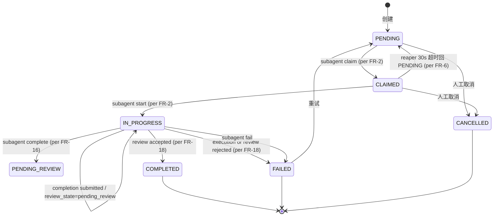
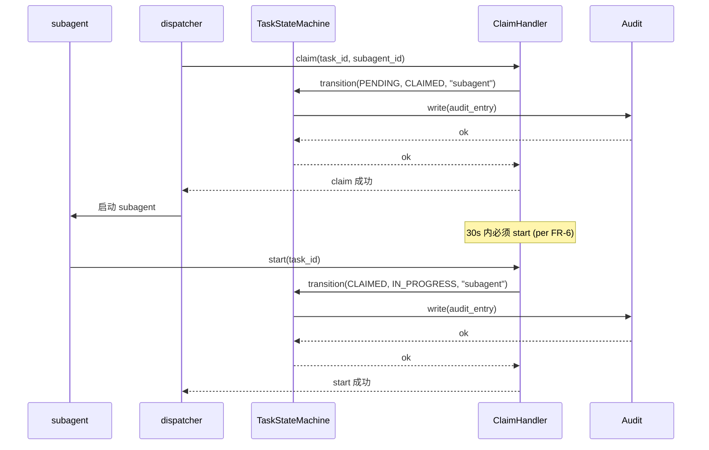
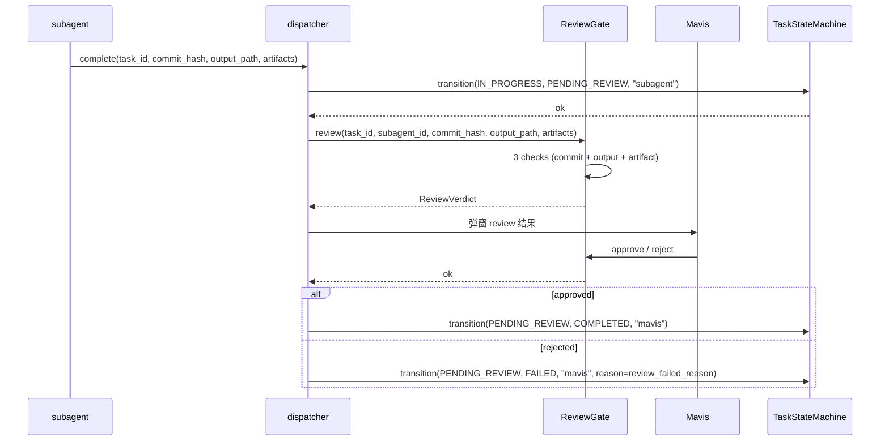
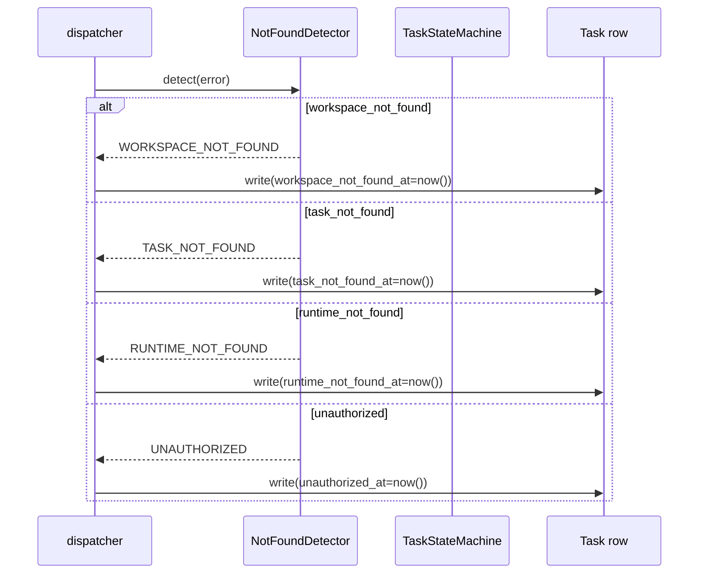

# DD-MULTICA-TASK-001

> **Multica Task Lifecycle 域 詳細設計書 v0.3** (per 日本 IPA SEC 標準, Worktree 群组执行策略收口)
>
> - 状态: 🟡 Draft v0.3 (执行身份、GLOBAL 部分失败策略与兼容门补充待评审)
> - 目标阶段: 詳細設計 → 実装 → テスト → リリース
> - 关联 commit: (留空, root 统一 commit 时填)
> - 上位要件: [`docs/requirements/SRS-MULTICA-TASK-001.md`](../requirements/SRS-MULTICA-TASK-001.md) v0.2
> - 上位基本設計: [`docs/design/BD-MULTICA-TASK-001.md`](BD-MULTICA-TASK-001.md) v0.1
> - 上位 ADR: [`docs/adr/0026-multica-patterns-borrow.md`](../adr/0026-multica-patterns-borrow.md) v0.2 §2.1 模式 2
> - 上位 inventory: [`docs/inventory/multica-gap.md`](../inventory/multica-gap.md) v0.1 §2.2 v33 候选
> - 配套 SRS: [`docs/requirements/SRS-MULTICA-POISON-001.md`](../requirements/SRS-MULTICA-POISON-001.md) (Session Poison 强绑定)
> - 修订人: `Ulysses（一人公司 12 角色 per DEC-008）— Mavis 接手**审核**`
> - 审核: Ulysses（一人公司 12 角色 per DEC-008）— Mavis 接手审核；v0.3 补充待评审
> - 日期: 2026-09-28 JST
> - 受众: 詳細設計エンジニア / 実装エンジニア / アーキテクト / SRE / 5 域 Lead 真人
> - dual-use 提醒: 本 DD 不引用 RGS 仓 + 不建立业务子域↔DDD 映射
> - **本 DD 模板 1:1 派生自 `DD-AGENT-RELATIONSHIP-001.md` v0.1**

---

## §0 文档信息 / 修订履历

| 项目 | 内容 |
|---|---|
| 文书 ID | DD-MULTICA-TASK-001 |
| 文书名 | Multica Task Lifecycle 域 詳細設計書 (Worktree Group 集成) |
| 版本 | v0.3 |
| 作成日 | 2026-09-28 |
| 作成者 | Ulysses（一人公司 12 角色 per DEC-008）— Mavis 接手**审核** (per DEC-008) |
| 承認者 | Draft；v0.3 群组执行策略补充待评审 |
| 关联 commit | (待生成) |
| 关联文档 | `SRS-MULTICA-TASK-001.md` v0.2 + `BD-MULTICA-TASK-001.md` v0.1 + ADR-0026 v0.2 + `DD-SHARED-TASK-001.md` v0.2 |
| 范围 | TK-1 ~ TK-5 子能力 × 22 FR = 5 关键 class + 1 状态机 + 11 共享类型 + 3 时序图 + 5 张表 (W-T-M 100%) + 6 API + 30+ 测试 |
| 守门 | 19 项 + 26 派生规 跨域覆盖 |

---

## §1 文档目的 / 适用范围

### 1.1 文档目的

本文档基于 `SRS-MULTICA-TASK-001` v0.1 §4-§7 + ADR-0026 v0.2 §2.1 模式 2, 定义 **Multica Task Lifecycle 域** 的詳細設計:

- 5 关键 class (`TaskStateMachine` / `ClaimHandler` / `ReviewGate` / `StaleDispatchDetector` / `TaskLifecycleAudit`)
- 1 状态机 (pending → claimed → in_progress → completed / failed / cancelled, 6 状态)
- 11 共享类型
- 3 时序图 (claim → start / complete → review / 4 类 404 检测)
- 5 张表 SQL DDL (per 守门 #13 W-T-M 100%)
- 6 API 端点
- 30+ 测试用例

### 1.2 模板派生

本 DD 1:1 派生自 `DD-AGENT-RELATIONSHIP-001.md` v0.1 模板 (6 关键 class 映射 + 1 状态机 + 11 共享类型 + 4 时序图, 本 DD 减 1 时序图)。

---

## §2 概念 module 布局

```
scripts/automation/task_lifecycle/
├── __init__.py                          # 包初始化
├── state_machine.py                     # TaskStateMachine
├── claim.py                             # ClaimHandler (per Multica client.go:227-235)
├── review.py                            # ReviewGate (per Multica 默认 review)
├── stale_dispatch.py                    # StaleDispatchDetector (per 守门 #9 v27)
├── audit.py                             # TaskLifecycleAudit (per 守门 #1 v15)
└── not_found.py                         # 4 类 404 检测 (per Multica client.go:35-91)

docs/wbs-migrate/                        # 迁移脚本
├── v33_migrate.py                       # WBS 41 子项 status 字段升级
└── registry_check.py                    # 迁移校验
```

---

## §3 关键 class 详细设计

### 3.1 C-1 `TaskStateMachine` (主入口)

```python
# scripts/automation/task_lifecycle/state_machine.py
from enum import Enum
from dataclasses import dataclass, field
from datetime import datetime
from typing import Optional, List

class TaskStatus(str, Enum):
    """6 态 status (per SRS-MULTICA-TASK-001 FR-1)"""
    PENDING = "pending"           # 任务已入 WBS, 等待 claim
    CLAIMED = "claimed"           # subagent 已 claim 但未 start
    IN_PROGRESS = "in_progress"   # subagent 实际执行中
    COMPLETED = "completed"       # subagent 报 success + Mavis review 通过
    FAILED = "failed"             # subagent 报 fail (自动) / Mavis 标记 fail (手动)
    CANCELLED = "cancelled"       # 人工取消 (跟 Failed 区分)

# 合法状态转移表 (per Multica 5 态 + cancelled)
VALID_TRANSITIONS = {
    TaskStatus.PENDING: {TaskStatus.CLAIMED, TaskStatus.CANCELLED},
    TaskStatus.CLAIMED: {TaskStatus.IN_PROGRESS, TaskStatus.CANCELLED},
    TaskStatus.IN_PROGRESS: {TaskStatus.COMPLETED, TaskStatus.FAILED, TaskStatus.CANCELLED},
    TaskStatus.COMPLETED: set(),  # 终态
    TaskStatus.FAILED: {TaskStatus.PENDING},  # 失败可重试
    TaskStatus.CANCELLED: set(),  # 终态
}

@dataclass
class TaskStateTransition:
    """单次状态变更记录 (per FR-22 audit log)"""
    task_id: str
    from_status: Optional[TaskStatus]
    to_status: TaskStatus
    actor: str  # "subagent" / "mavis" / "human" / "system"
    reason: Optional[str]
    timestamp: datetime = field(default_factory=datetime.utcnow)

class TaskStateMachine:
    """6 态状态机 (per FR-1)"""
    
    def __init__(self, audit: TaskLifecycleAudit):
        self._audit = audit
    
    def transition(
        self,
        task_id: str,
        from_status: TaskStatus,
        to_status: TaskStatus,
        actor: str,
        reason: Optional[str] = None,
    ) -> None:
        """状态转移, 验证合法性 + 写 audit (per FR-1)"""
        if to_status not in VALID_TRANSITIONS[from_status]:
            raise InvalidTransitionError(
                f"task {task_id}: {from_status.value} → {to_status.value} 不合法"
            )
        self._audit.write(TaskStateTransition(
            task_id=task_id, from_status=from_status,
            to_status=to_status, actor=actor, reason=reason,
        ))
    
    def is_terminal(self, status: TaskStatus) -> bool:
        """是否终态 (per FR-3 区分 failed / cancelled)"""
        return status in (TaskStatus.COMPLETED, TaskStatus.CANCELLED)
```

### 3.2 C-2 `ClaimHandler` (claim API)

```python
# scripts/automation/task_lifecycle/claim.py
class ClaimHandler:
    """claim API (per Multica client.go:227-235 ClaimTask)"""
    
    CLAIM_TIMEOUT_SECONDS = 30  # per FR-6 (跟 Multica 30s claim timeout 一致)
    
    def claim(self, task_id: str, subagent_id: str) -> bool:
        """subagent claim task, PENDING → CLAIMED (per FR-2)"""
        ...
    
    def start(self, task_id: str, subagent_id: str) -> bool:
        """subagent start task, CLAIMED → IN_PROGRESS (per FR-2)"""
        ...
    
    def reaper_check(self, task_id: str) -> bool:
        """claimed 后 30s 内必须 start, 否则 reaper 自动回 PENDING (per FR-6)"""
        ...
```

### 3.3 C-3 `ReviewGate` (subagent complete → Mavis review → done)

```python
# scripts/automation/task_lifecycle/review.py
class ReviewGate:
    """Review gate (per SRS-MULTICA-TASK-001 FR-16 ~ FR-19)"""
    
    def review(
        self,
        task_id: str,
        subagent_id: str,
        commit_hash: Optional[str] = None,
        output_path: Optional[str] = None,
        artifact_paths: List[str] = None,
    ) -> ReviewVerdict:
        """Mavis review 3 件事 (per FR-17)"""
        checks = []
        # 1. commit_hash 存在
        if commit_hash and not self._git_commit_exists(commit_hash):
            checks.append(ReviewCheck(name="commit", passed=False, reason=f"commit {commit_hash} 不存在"))
        # 2. output 落档
        if output_path and not Path(output_path).exists():
            checks.append(ReviewCheck(name="output", passed=False, reason=f"output {output_path} 不存在"))
        # 3. artifact 落档
        for p in (artifact_paths or []):
            if not Path(p).exists():
                checks.append(ReviewCheck(name="artifact", passed=False, reason=f"artifact {p} 不存在"))
        ...
        if all(c.passed for c in checks):
            return ReviewVerdict(approved=True, checks=checks)
        return ReviewVerdict(approved=False, checks=checks)
    
    def force_skip(self, task_id: str, reason: str) -> None:
        """force skip review gate (per 守门 #9 v27 fallback)"""
        ...
```

### 3.4 C-4 `StaleDispatchDetector` (守门 #9 v27 RPC fallback)

```python
# scripts/automation/task_lifecycle/stale_dispatch.py
class StaleDispatchDetector:
    """stale dispatch 检测 (per SRS-MULTICA-TASK-001 FR-5)"""
    
    RPC_TIMEOUT_SECONDS = 30  # per 守门 #9 v27
    RETRY_MAX = 2  # per 守门 #9 v27
    
    def detect(self, subagent_result: SubagentResult) -> StaleDispatchVerdict:
        """检测 subagent 是否 stale (per 守门 #9 v27 实证)"""
        if subagent_result.exit_code == 0 and subagent_result.rpc_acknowledged:
            return StaleDispatchVerdict(is_stale=False, reason="正常")
        # RPC 没 ack 但 status 报 succeeded → stale
        if not subagent_result.rpc_acknowledged and subagent_result.status == "succeeded":
            return StaleDispatchVerdict(
                is_stale=True,
                reason="net::ERR_CONNECTION_CLOSED 但 status=succeeded (per 守门 #9 实证)"
            )
        return StaleDispatchVerdict(is_stale=False, reason="unknown")
    
    def recover(self, task_id: str, verdict: StaleDispatchVerdict) -> None:
        """stale 恢复: 标 stale_dispatch=true, 不阻塞其他 task (per FR-5)"""
        ...
```

### 3.5 C-5 `NotFoundDetector` (4 类 404 区分, per Multica client.go:35-91)

```python
# scripts/automation/task_lifecycle/not_found.py
class NotFoundType(str, Enum):
    """4 类 404 区分 (per FR-7 ~ FR-10)"""
    WORKSPACE_NOT_FOUND = "workspace_not_found"
    TASK_NOT_FOUND = "task_not_found"
    RUNTIME_NOT_FOUND = "runtime_not_found"
    UNAUTHORIZED = "unauthorized"  # 401 不是 404, 但同源

class NotFoundDetector:
    """4 类 404 区分 (per Multica client.go:35-91)"""
    
    def detect(self, error: Exception) -> Optional[NotFoundType]:
        """检测错误类型"""
        error_str = str(error).lower()
        if "workspace not found" in error_str:
            return NotFoundType.WORKSPACE_NOT_FOUND
        if "task not found" in error_str:
            return NotFoundType.TASK_NOT_FOUND
        if "runtime not found" in error_str:
            return NotFoundType.RUNTIME_NOT_FOUND
        if "401" in error_str or "unauthorized" in error_str:
            return NotFoundType.UNAUTHORIZED
        return None
```

---

## §4 状态机

### 4.1 Task 6 态状态机


```mermaid
stateDiagram-v2
    [*] --> PENDING : 创建
    PENDING --> CLAIMED : subagent claim (per FR-2)
    PENDING --> CANCELLED : 人工取消
    CLAIMED --> IN_PROGRESS : subagent start (per FR-2)
    CLAIMED --> PENDING : reaper 30s 超时回 PENDING (per FR-6)
    CLAIMED --> CANCELLED : 人工取消
    IN_PROGRESS --> PENDING_REVIEW : subagent complete (per FR-16)
    IN_PROGRESS --> IN_PROGRESS : completion submitted / review_state=pending_review
    IN_PROGRESS --> COMPLETED : review accepted (per FR-18)
    IN_PROGRESS --> FAILED : execution or review rejected (per FR-18)
    IN_PROGRESS --> FAILED : subagent fail
    FAILED --> PENDING : 重试
    COMPLETED --> [*]
    FAILED --> [*]
    CANCELLED --> [*]
```

### 4.2 状态守门

| From | To | 触发 | 守门 |
|---|---|---|---|
| PENDING | CLAIMED | subagent claim | 唯一 claim (per FR-2) |
| CLAIMED | IN_PROGRESS | subagent start | 30s 内必 start (per FR-6) |
| IN_PROGRESS | IN_PROGRESS | completion submitted | 主状态不变；独立设 `review_state=pending_review` (per FR-16) |
| IN_PROGRESS | COMPLETED | review accept | review 3 件事通过 (per FR-17) |
| IN_PROGRESS | FAILED | execution failure / review reject | `failure_reason` / `review_failed_reason` 必填 |

---

## §5 共享类型 (11)

| Type | 来源 | 用途 |
|---|---|---|
| `TaskStatus` (str Enum) | C-1 | 6 态 status |
| `TaskStateTransition` (dataclass) | C-1 | audit log entry |
| `VALID_TRANSITIONS` (dict) | C-1 | 合法转移表 |
| `InvalidTransitionError` (Exception) | C-1 | 不合法转移 |
| `ClaimVerdict` (dataclass) | C-2 | claim 结果 |
| `ReviewVerdict` (dataclass) | C-3 | review 结果 |
| `ReviewCheck` (dataclass) | C-3 | review 单 check |
| `StaleDispatchVerdict` (dataclass) | C-4 | stale 检测结果 |
| `SubagentResult` (dataclass) | C-4 | subagent 输出 |
| `NotFoundType` (str Enum) | C-5 | 4 类 404 区分 |
| `AuditLogEntry` (dataclass) | TaskLifecycleAudit | 审计落档 |

---

## §6 时序图 (3 个)

### 6.1 Claim → Start (per FR-2 + FR-6)


```mermaid
sequenceDiagram
    participant S as subagent
    participant D as dispatcher
    participant SM as TaskStateMachine
    participant C as ClaimHandler
    participant A as Audit

    D->>C: claim(task_id, subagent_id)
    C->>SM: transition(PENDING, CLAIMED, "subagent")
    SM->>A: write(audit_entry)
    A-->>SM: ok
    SM-->>C: ok
    C-->>D: claim 成功
    D->>S: 启动 subagent
    Note over C: 30s 内必须 start (per FR-6)
    S->>C: start(task_id)
    C->>SM: transition(CLAIMED, IN_PROGRESS, "subagent")
    SM->>A: write(audit_entry)
    A-->>SM: ok
    SM-->>C: ok
    C-->>D: start 成功
```

### 6.2 Complete → Review (per FR-16 ~ FR-19)


```mermaid
sequenceDiagram
    participant S as subagent
    participant D as dispatcher
    participant R as ReviewGate
    participant M as Mavis
    participant SM as TaskStateMachine

    S->>D: complete(task_id, commit_hash, output_path, artifacts)
    D->>SM: transition(IN_PROGRESS, PENDING_REVIEW, "subagent")
    SM-->>D: ok
    D->>R: review(task_id, subagent_id, commit_hash, output_path, artifacts)
    R->>R: 3 checks (commit + output + artifact)
    R-->>D: ReviewVerdict
    D->>M: 弹窗 review 结果
    M->>R: approve / reject
    R-->>D: ok
    alt approved
        D->>SM: transition(PENDING_REVIEW, COMPLETED, "mavis")
    else rejected
        D->>SM: transition(PENDING_REVIEW, FAILED, "mavis", reason=review_failed_reason)
    end
```

### 6.3 4 类 404 检测 (per FR-7 ~ FR-10)


```mermaid
sequenceDiagram
    participant D as dispatcher
    participant N as NotFoundDetector
    participant SM as TaskStateMachine
    participant T as Task row

    D->>N: detect(error)
    alt workspace_not_found
        N-->>D: WORKSPACE_NOT_FOUND
        D->>T: write(workspace_not_found_at=now())
    else task_not_found
        N-->>D: TASK_NOT_FOUND
        D->>T: write(task_not_found_at=now())
    else runtime_not_found
        N-->>D: RUNTIME_NOT_FOUND
        D->>T: write(runtime_not_found_at=now())
    else unauthorized
        N-->>D: UNAUTHORIZED
        D->>T: write(unauthorized_at=now())
    end
```

---

## §7 SQL DDL (v0.1 baseline; v0.2 canonical data model in §14.2)

### 7.1 `task_lifecycle_audit` (Transaction, append-only)

```sql
-- per 守门 #13 Transaction 100% audit + 物理删除禁止
CREATE TABLE task_lifecycle_audit (
    event_id UUID PRIMARY KEY DEFAULT gen_random_uuid(),
    tenant_id UUID NOT NULL,
    worktree_id UUID NOT NULL,
    work_item_id UUID NOT NULL,
    task_card_id UUID NOT NULL,
    event_type VARCHAR(48) NOT NULL,
    from_status VARCHAR(20),
    to_status VARCHAR(20),
    review_state VARCHAR(20),
    actor_id UUID NOT NULL,
    correlation_id UUID NOT NULL,
    idempotency_key TEXT,
    target_worktree_id UUID,
    target_result VARCHAR(24),
    payload_redacted JSONB NOT NULL DEFAULT '{}'::jsonb,
    occurred_at TIMESTAMPTZ NOT NULL DEFAULT NOW()
);
CREATE INDEX idx_task_lifecycle_audit_item_time
  ON task_lifecycle_audit(tenant_id, worktree_id, work_item_id, occurred_at DESC);
-- 物理删除禁止 TRIGGER (per 守门 #13)
```

### 7.2 `task_review` (Work, 短 TTL)

```sql
-- per 守门 #13 Work 100% retention_period (24h)
CREATE TABLE task_review (
    id UUID PRIMARY KEY DEFAULT gen_random_uuid(),
    task_id UUID NOT NULL,
    subagent_id VARCHAR(100) NOT NULL,
    commit_hash VARCHAR(64),
    output_path TEXT,
    artifact_paths JSONB,
    approved BOOLEAN,
    review_failed_reason TEXT,
    force_skip BOOLEAN DEFAULT FALSE,
    force_skip_reason TEXT,
    rls_tenant_id UUID NOT NULL,
    rls_workspace_ids UUID[] NOT NULL DEFAULT '{}',
    created_at TIMESTAMPTZ NOT NULL DEFAULT NOW(),
    expires_at TIMESTAMPTZ NOT NULL DEFAULT NOW() + INTERVAL '7 days'
);
CREATE INDEX idx_task_review_task_id ON task_review(task_id);
```

### 7.3 `task_stale_dispatch` (Work, 短 TTL)

```sql
-- per 守门 #13 Work retention 7 天
CREATE TABLE task_stale_dispatch (
    id UUID PRIMARY KEY DEFAULT gen_random_uuid(),
    task_id UUID NOT NULL,
    subagent_id VARCHAR(100) NOT NULL,
    is_stale BOOLEAN NOT NULL,
    reason TEXT,
    raw_output_path TEXT,  -- <task_id>.stale.json
    rls_tenant_id UUID NOT NULL,
    rls_workspace_ids UUID[] NOT NULL DEFAULT '{}',
    created_at TIMESTAMPTZ NOT NULL DEFAULT NOW(),
    expires_at TIMESTAMPTZ NOT NULL DEFAULT NOW() + INTERVAL '7 days'
);
```

### 7.4 `task_not_found_log` (Transaction, v0.1; consolidated into `task_session_health` in v0.2)

```sql
-- 4 类 404 落档 (per FR-7 ~ FR-10)
CREATE TABLE task_not_found_log (
    id UUID PRIMARY KEY DEFAULT gen_random_uuid(),
    task_id UUID NOT NULL,
    not_found_type VARCHAR(50) NOT NULL,  -- 'workspace_not_found' / 'task_not_found' / 'runtime_not_found' / 'unauthorized'
    detected_at TIMESTAMPTZ NOT NULL DEFAULT NOW(),
    rls_tenant_id UUID NOT NULL,
    rls_workspace_ids UUID[] NOT NULL DEFAULT '{}'
);
CREATE INDEX idx_task_not_found_log_task_id ON task_not_found_log(task_id);
```

### 7.5 Legacy `wbs_task` migration source (not a v0.3 target schema)

```sql
-- 历史迁移样例：现有 wbs_task 曾混存 Master、Work 与 Transaction 字段。
-- 本 ALTER 仅供识别迁移来源，不可作为 v0.3 的新表结构执行。
-- 上线前必须拆分到 §14.2 的 canonical 表；legacy source 后续只读/归档策略由 migration rehearsal 定稿。
ALTER TABLE wbs_task
    ADD COLUMN session_poisoned BOOLEAN DEFAULT FALSE,
    ADD COLUMN session_poison_reason VARCHAR(50),
    ADD COLUMN stale_dispatch BOOLEAN DEFAULT FALSE,
    ADD COLUMN stale_dispatch_at TIMESTAMPTZ,
    ADD COLUMN workspace_not_found_at TIMESTAMPTZ,
    ADD COLUMN task_not_found_at TIMESTAMPTZ,
    ADD COLUMN runtime_not_found_at TIMESTAMPTZ,
    ADD COLUMN unauthorized_at TIMESTAMPTZ,
    ADD COLUMN review_gate_required BOOLEAN DEFAULT TRUE,
    ADD COLUMN review_state VARCHAR(20) NOT NULL DEFAULT 'none'
        CHECK (review_state IN ('none','pending_review','accepted','rejected')),
    ADD COLUMN review_force_skip BOOLEAN DEFAULT FALSE,
    -- per 评审 v0.1 修正 M3: 6 态 status CHECK 约束
    ADD CONSTRAINT chk_wbs_task_status_v33
    CHECK (status IN ('pending','claimed','in_progress','completed','failed','cancelled')),
    -- per 评审 v0.1 修正 M5: 5 reason enum CHECK 约束 (跟 DD-POISON-001 配套)
    ADD CONSTRAINT chk_wbs_task_session_poison_reason
    CHECK (session_poison_reason IS NULL OR session_poison_reason IN (
        'iteration_limit','agent_fallback_message',
        'api_invalid_request','codex_semantic_inactivity','codex_resume_oversized'
    ));
```

### 7.6 v0.1 W-T-M 盘点 (v0.2 canonical coverage is §14.2)

| 表 | W/T/M | 检查 |
|---|---|---|
| `wbs_task_v33` | Master（主分类） | ⚠️ 迁移期已知混合字段：`status` → Work；poison/review/404 事实 → Transaction；上线前必须拆分，见 §14.2 |
| `task_lifecycle_audit` | Transaction | ✅ RLS 13 类 + 物理删除禁止 (TRIGGER) + 审计 |
| `task_review` | Work | ✅ retention 7 天；审查结论必须另写 audit event |
| `task_stale_dispatch` | Work | ✅ retention 7 天 |
| `task_not_found_log` | Transaction (v0.1) | v0.2 合并至 `task_session_health`，保留历史事件 |

---

## §8 API OpenAPI spec (6 端点)

```yaml
/api/task-lifecycle/claim:
  post:
    summary: claim task (per FR-2)
    requestBody:
      content:
        application/json:
          schema:
            type: object
            properties:
              task_id: { type: string }
              subagent_id: { type: string }
    responses:
      '200': { description: 'claim 成功 (PENDING → CLAIMED)' }
      '409': { description: 'task 已被其他 subagent claim' }

/api/task-lifecycle/start:
  post:
    summary: start task (per FR-2)
    requestBody:
      content:
        application/json:
          schema:
            type: object
            properties:
              task_id: { type: string }
              subagent_id: { type: string }
    responses:
      '200': { description: 'start 成功 (CLAIMED → IN_PROGRESS)' }
      '408': { description: '30s claim timeout (per FR-6)' }

/api/task-lifecycle/complete:
  post:
    summary: complete task (per FR-16)
    requestBody:
      content:
        application/json:
          schema:
            type: object
            properties:
              task_id: { type: string }
              subagent_id: { type: string }
              commit_hash: { type: string }
              output_path: { type: string }
              artifact_paths: { type: array, items: { type: string } }

/api/task-lifecycle/review:
  post:
    summary: Mavis review (per FR-17)
    requestBody:
      content:
        application/json:
          schema:
            type: object
            properties:
              task_id: { type: string }
              approved: { type: boolean }
              review_failed_reason: { type: string }

/api/task-lifecycle/cancel:
  post:
    summary: 人工取消 (per FR-3)
    requestBody:
      content:
        application/json:
          schema:
            type: object
            properties:
              task_id: { type: string }
              reason: { type: string }

/api/task-lifecycle/state:
  get:
    summary: 查询 task 当前状态
    parameters:
      - name: task_id
        in: query
        required: true
        schema: { type: string }
    responses:
      '200':
        content:
          application/json:
            schema:
              type: object
              properties:
                task_id: { type: string }
                status: { type: string, enum: [pending, claimed, in_progress, completed, failed, cancelled] }
                transitions: { type: array, items: { $ref: '#/components/schemas/TaskStateTransition' } }
```

---

## §9 NFR (5 类)

| NFR | 指标 |
|---|---|
| 性能 | 状态机迁移 41 子项 < 5s |
| 可靠性 | stale_dispatch=true, 不阻塞其他 task |
| 可观测 | 每次状态变更写 audit log, console 显示状态机 transition 图 |
| 易用 | 状态机守门 = 不可绕过, 但提供 force_skip 路径 |
| 安全 | session_poisoned 标不删除 (per 守门 #11) |

---

## §10 守门 (19 + 26 派生, per AGENTS.md §4 + §4.1)

跟 DD-MULTICA-RUNTIME-001 §10 同, 本 DD 跨域覆盖 12 条派生规, 不重复列。

---

## §11 测试用例 (30+)

### 11.1 16 UT

| UT | 描述 |
|---|---|
| UT-1 ~ UT-8 | TaskStateMachine 6 态转移合法性 (8 case) |
| UT-9 | ClaimHandler 30s timeout 验证 |
| UT-10 | Reaper check 验证 (claimed 后 30s 自动回 PENDING) |
| UT-11 | ReviewGate 3 checks (commit / output / artifact) |
| UT-12 | ReviewGate force_skip |
| UT-13 | StaleDispatchDetector detect (per 守门 #9 v27) |
| UT-14 | StaleDispatchDetector recover |
| UT-15 | NotFoundDetector 4 类 404 区分 |
| UT-16 | TaskLifecycleAudit write 验证 |

### 11.2 10 IT

| IT | 描述 |
|---|---|
| IT-1 | 5 张表 SQL DDL 落档 + W-T-M 100% 覆盖 (per 守门 #13) |
| IT-2 | 13 类 RLS 必携 (per 守门 #13) |
| IT-3 | 物理删除禁止 TRIGGER (per 守门 #13 Transaction) |
| IT-4 | expires_at 7 天后 Work 表可物理删除 (per 守门 #13) |
| IT-5 | 6 API 端点 HTTP 调用 |
| IT-6 | 41 子项 status 字段迁移 (per FR-4) |
| IT-7 | 状态机 transition audit log 完整 |
| IT-8 | stale_dispatch=true 落档 (per FR-5) |
| IT-9 | 4 类 404 timestamp 字段全部落档 (per FR-7 ~ FR-10) |
| IT-10 | session_poisoned 字段 + 5 reason 枚举 (跟 SRS-MULTICA-POISON-001 配套) |

### 11.3 4 E2E

| E2E | 描述 |
|---|---|
| E2E-1 | subagent claim → start → complete → Mavis review → completed 完整流程 |
| E2E-2 | subagent claim → 30s 不 start → reaper 回 PENDING |
| E2E-3 | subagent RPC 失败 (per 守门 #9 v27) → stale_dispatch=true → 不阻塞其他 task |
| E2E-4 | Mavis 收到 review 失败 → FAILED → 重试回 PENDING |

---

## §12 已知缺口 (6, per 守门 #11)

跟 SRS-MULTICA-TASK-001 §8 同, 本 DD 跨域覆盖 5 case:
- #1 5 态跟现有 WBS row 字段冲突 → wbs_migrate_v33.py 兼容迁移
- #2 Session poison 跟现有 Mavis session 概念区分 → 文档加 disclaimer
- #3 Review gate 跟守门 #9 v27 fallback 协调 → force_skip 配置
- #4 stale_dispatch=true 时 subagent output 保留 → <task_id>.stale.json 24h
- #5 4 类 404 timestamp 跟 audit log 协调 → 复用 audit_log 字段
- #6 状态机守门 30s 跟守门 #9 v27 30s claim timeout 重复 → 复用同一 timeout 常量

---

## §13 关联文档

跟 SRS-MULTICA-TASK-001 §9 同 + DD-MULTICA-POISON-001 强绑定。

## §14 渡口 Worktree 群组集成契约 (v0.3)

本节是 v0.3 的规范性补充，与 [`BD-MULTICA-TASK-001.md`](BD-MULTICA-TASK-001.md) v0.1 和 [`SRS-MULTICA-TASK-001.md`](../requirements/SRS-MULTICA-TASK-001.md) v0.2 对齐。旧样例中的 `task_id` 表示兼容别名；新接口的 canonical key 是 `work_item_id`。旧 §7 中把整个 `wbs_task_v33` 视为 Master、或把 `pending_review` 放入 status enum 的内容不再作为 v0.3 的物理设计依据。

### 14.1 领域事实源与身份

| 身份/事实 | 唯一所有者 | 详细规则 |
|---|---|---|
| `worktree_id` | Worktree Domain / GroupContext | 同一 WorkItem 可关联 0..N 个 Worktree（沿用 `docs/basic-design.md` §16.1）；每次 Task Card 命令/CLI/Agent Run 必须选择一个明确且已授权的 Worktree。执行中的唯一绑定放在 `active_worktree_id`，不是 WorkItem 的全局归属 |
| `work_item_id` | WorkItem Domain | 跨 Multica、Jira 等价视图、Task Card 和 Canvas 引用的 canonical ID；源系统 ID 通过 alias 映射，不做字符串强转 |
| `task_card_id` | Task Card projection | v1 等于 canonical `work_item_id`，不建立第二个任务身份；执行重试另建 Run/Session ID |
| lifecycle `status` | Multica Lifecycle Service | 唯一允许改变六态状态的命令入口 |
| `review_state` | Review Gate | `none/pending_review/accepted/rejected` 与主状态分列；提交 review 不产生第七种任务状态 |
| Canvas 元素与位置 | Canvas Domain | 保存布局、元素和类型化 EntityRef；任务状态只能经 Multica 命令更新 |
| 插件入口/capability | Group App Registry | 管理启用及 capability 暴露，不拥有任务状态与 Task Card |

Multica、Jira 等价视图、Task Card Index、Group Infinite Canvas 和已启用插件是 Worktree 群组的同级入口。Canvas 对 WorkItem 只存 `EntityRef(type, id, worktree_id)`；空白便签必须经过显式“创建任务”命令才会生成 WorkItem。Project/Repository 的 Worktree Overview Graph 由 `DD-WORKTREE-CANVAS-001` 管理，不能映射成群组 Infinite Canvas 对象。

### 14.2 生命周期与持久化表 (W/T/M)

| 物理表/数据集 | 分类 | 关键约束 | 保留规则 |
|---|---|---|---|
| `task_lifecycle_current` | Work | PK `work_item_id`; 可空 `active_worktree_id`, `task_card_id`, `tenant_id`, 六态 `status`, 独立 `review_state`, claim lease, Runtime session ref, `version` | 必含 `retention_period` 与 `expires_at`; 到期清理或由 Transaction 事件重建 |
| `task_review` | Work | 保存待审 artifact/output refs 与审查工作载荷；通过 `work_item_id` + `task_card_id` 关联 | 必含 `retention_period`; 决策结果不靠此表留存 |
| `task_stale_dispatch` | Work | 最近一次 dispatch verify 状态及临时输出引用 | 必含 `retention_period`; 原始诊断内容脱敏后到期清理 |
| `task_metadata` | Master | WorkItem 标题、描述、标签、优先级、执行策略引用；以 `project_id` 归属，不复制单个 `worktree_id`；SCD Type 2 | 物理删除禁止；RLS 13 类必携 |
| `task_lifecycle_audit` | Transaction | 状态/Review/TMO/ACL/dispatch 事件，带 `worktree_id`, `work_item_id`, `task_card_id`, `actor_id`, `correlation_id`, `event_id` | append-only，物理删除禁止；RLS 13 类和 audit 必携 |
| `task_session_health` | Transaction | poison/404/fresh-session 决策及 session ref，不能覆写历史事件 | append-only，物理删除禁止；RLS 13 类和 audit 必携 |
| `wbs_task_v33` | Master（主分类） | 迁移期 legacy source；标题/描述/优先级/alias 属 Master，SCD Type 2 + RLS；已知混合列见本节 gap，拆分完成后不得继续写 lifecycle 或事件字段 |

**v0.3 W/T/M 覆盖**：canonical Work 3/3 (`task_lifecycle_current`, `task_review`, `task_stale_dispatch`)；Transaction 2/2 (`task_lifecycle_audit`, `task_session_health`)；Master 1/1 (`task_metadata`)；另有 legacy source `wbs_task_v33` 主分类 Master 1/1。共 7 个数据集/迁移源均已分配主分类；legacy source 仍含已列明的 Work/Transaction 混合列，是 release blocker，必须拆分并 rehearsal 验证。拆分后 Master 静态字段写入 `task_metadata`，状态写 `task_lifecycle_current`，不可变决定/诊断写 append-only Transaction。

所有 Work 数据都有 `retention_period`；Master 全表使用 SCD Type 2 + RLS；Transaction 全表 append-only + audit + RLS。v0.1 §7 的旧 DDL 供迁移字段参考；实施时按本节分类拆分动态当前态、Master metadata 与不可变审计事件，不允许把混合 WBS 行整表归入一个分类。

```sql
CREATE TABLE task_lifecycle_current (
  work_item_id UUID PRIMARY KEY,
  active_worktree_id UUID,
  task_card_id UUID NOT NULL UNIQUE,
  tenant_id UUID NOT NULL,
  status VARCHAR(20) NOT NULL CHECK (status IN
    ('pending','claimed','in_progress','completed','failed','cancelled')),
  review_state VARCHAR(20) NOT NULL DEFAULT 'none' CHECK (review_state IN
    ('none','pending_review','accepted','rejected')),
  claim_actor_id UUID,
  claim_expires_at TIMESTAMPTZ,
  runtime_session_id UUID,
  stale_dispatch BOOLEAN NOT NULL DEFAULT FALSE,
  version BIGINT NOT NULL DEFAULT 1,
  retention_period INTERVAL NOT NULL,
  expires_at TIMESTAMPTZ NOT NULL,
  updated_at TIMESTAMPTZ NOT NULL DEFAULT NOW(),
  CHECK (task_card_id = work_item_id),
  CHECK (
    (status IN ('claimed','in_progress') AND active_worktree_id IS NOT NULL) OR
    (status NOT IN ('claimed','in_progress') AND active_worktree_id IS NULL)
  )
);
CREATE INDEX idx_task_lifecycle_worktree_status
  ON task_lifecycle_current (tenant_id, active_worktree_id, status);

CREATE TABLE task_metadata (
  work_item_id UUID NOT NULL,
  version BIGINT NOT NULL,
  tenant_id UUID NOT NULL,
  project_id UUID NOT NULL,
  title TEXT NOT NULL,
  description TEXT,
  priority VARCHAR(16) NOT NULL,
  labels JSONB NOT NULL DEFAULT '[]'::jsonb,
  execution_policy_ref UUID,
  valid_from TIMESTAMPTZ NOT NULL,
  valid_to TIMESTAMPTZ,
  is_current BOOLEAN NOT NULL DEFAULT TRUE,
  PRIMARY KEY (work_item_id, version)
);
CREATE UNIQUE INDEX uq_task_metadata_current
  ON task_metadata (tenant_id, work_item_id) WHERE is_current;

-- `task_lifecycle_audit` uses the append-only DDL from §7.1 (canonical columns shown there).

CREATE TABLE task_session_health (
  event_id UUID PRIMARY KEY,
  tenant_id UUID NOT NULL,
  worktree_id UUID NOT NULL,
  work_item_id UUID NOT NULL,
  task_card_id UUID NOT NULL,
  runtime_session_id UUID NOT NULL,
  health_event VARCHAR(32) NOT NULL,
  reason_code VARCHAR(64),
  actor_id UUID NOT NULL,
  correlation_id UUID NOT NULL,
  occurred_at TIMESTAMPTZ NOT NULL DEFAULT NOW()
);
CREATE INDEX idx_task_session_health_item_time
  ON task_session_health (tenant_id, worktree_id, work_item_id, occurred_at DESC);
```

`task_review` retains the v0.1 review artifact fields but must add `worktree_id`, `work_item_id`, `task_card_id`, `retention_period`, and `expires_at`. `task_stale_dispatch` uses the same identity envelope and Work retention. The v0.1 `task_not_found_log` is migrated into `task_session_health` event rows without losing event IDs/timestamps. `task_lifecycle_audit`, `task_session_health`, and `task_metadata` must carry the repository's applicable RLS policies; event tables forbid UPDATE/DELETE and Master rows use SCD Type 2. The DDL is logical target schema; exact production SQL policy names and FK table names are finalized against the owning WorkItem/Worktree migrations.

### 14.3 命令 envelope 与授权

```json
{
  "scope_kind": "WORKTREE | GLOBAL",
  "worktree_id": "required for WORKTREE",
  "target_worktree_ids": ["required explicitly for GLOBAL writes"],
  "work_item_id": "canonical WorkItem ID",
  "task_card_id": "Task Card ID",
  "idempotency_key": "per command",
  "correlation_id": "end-to-end trace"
}
```

`actor_id`、tenant、permission snapshot 只能从认证 principal 和服务端授权结果取得，拒收客户端声明的权限。WORKTREE 命令只能操作 `worktree_id` 下对象；GLOBAL 写操作先逐目标授权，再执行允许的目标并为每个目标回传 allowed/denied/succeeded/failed 结果。空目标返回 `422 target_required`；单目标无权返回 `403 target_forbidden` 且无副作用。`task_id` 仅作为过渡兼容字段，服务端先查 alias，响应总是带 canonical ID。

所有 `claim/start/submit_completion/review_accept/review_reject/cancel/TMO` 命令都带相同 envelope 并由 Lifecycle Service 在事务内校验 `worktree_id + work_item_id + task_card_id` 对应关系、当前 status、权限、version 和 idempotency key。状态转换及每个 GLOBAL 目标的授权结论写入 Transaction audit/outbox；Canvas 与插件不能直写上述表。

### 14.4 卡内 CLI、LangGraph 与插件交互

Task Card Detail 从 Multica/Jira/Canvas 任一同级入口打开时，先用 canonical `work_item_id` 获取同一卡片。卡内 CLI/Agent Session 启动前创建 `TaskExecutionContext(worktree_id, work_item_id, task_card_id, actor_id, tenant_id, scope_kind, runtime_profile, permission_snapshot_ref, correlation_id)`；Runtime/AgentPolicy 再验证工作目录、可执行工具、secret capability 与目标授权。浏览器 URL、Canvas 节点 ID 和外部 Jira key 均不得直接成为执行目录或授权凭据。

Group App Registry 与 LangGraph `SubAgentRegistry` 是两个分离注册表：前者决定群组入口及插件 capability，后者决定 agent graph type。插件通过 capability bridge 请求 Lifecycle Command 或只读 API；每次调用均复验 enabled/scope/ACL。卸载插件即时阻止新 capability 调用，并保留已有 WorkItem、审计和 disabled EntityRef。

### 14.5 一致性验收补充

| ID | 验收 |
|---|---|
| DD-MG-01 | Multica、Jira 等价任务视图、Task Card 与 Canvas 对同一 canonical `work_item_id` 显示同一 lifecycle version |
| DD-MG-02 | 任一写入来源都经过 Lifecycle Service；并发/重放由 version + idempotency key 收敛 |
| DD-MG-03 | Task Card CLI 只能在绑定 Worktree 内运行；跨 Worktree GLOBAL 操作按目标逐项授权并审计 |
| DD-MG-04 | `review_state=pending_review` 时主 status 保持 `in_progress`；未接受 review 不可进入 `completed` |
| DD-MG-05 | 插件 disable 后新调用失败，但核心任务、Transaction audit 和 Canvas EntityRef 保持可读 |

### 14.6 待迁移 / 实现验证

- 旧 `wbs_task` 与 canonical `work_item_id` 的重复/冲突 alias 在 migration rehearsal 中隔离到 reconciliation 清单；禁止按标题、Jira key 或相似字段自动合并。唯一来源确认后才写 alias 映射。
- `task_card_id` 在 v1 与 `work_item_id` 相同；历史执行尝试使用不同的 Run/Runtime Session ID。Runtime 表归属由 Runtime DD 落定，不得由 UI 临时生成执行凭据。
- GLOBAL 操作按目标独立授权与执行；v1 不做自动跨目标补偿。响应每个目标的部分结果，任何重试用原 idempotency key；需要补偿时必须发起新的、显式授权的 Lifecycle Command。

### 14.7 SDK 与恢复兼容门

- 本 DD 定义 LangGraph 需要的上下文语义，不把特定 SDK 的 `context_schema`、Runtime 或 checkpointer 方法名视为已部署 API。LangGraph 实装前，必须以仓库锁定的 Python SDK 版本跑 compile/import 与最小 resume compatibility check，并把实际版本记入实现报告。
- LangGraph thread、Chat Session、WorkItem、Task Card、Run ID 各自独立；checkpoint 仅保存计算状态与权限 snapshot reference。每次 start/resume 都通过 GroupContextResolver 重新授权，旧 snapshot 不可恢复已撤销的 scope 或 plugin capability。
- PostgreSQL checkpointer Tier 3 是否可启动须按 ADR-0047 与当前 AGENTS 治理门复核；未满足前置条件时不得把 PostgreSQL 列为已启用后端，较低 Tier 的选择也必须遵守当前批准的部署策略。
- 每个 GLOBAL target 先完成 ACL preflight 再产生副作用；authorized targets 允许部分成功，denied targets 不调用插件、不启动 Run、不写 WorkItem 状态。

---

## 附录 A-E

跟 DD-MULTICA-RUNTIME-001 模板同 (5 view / 派生规 / 拍板来源 / 签字栏 / 修订履历), 本 DD 略 (内容可参考模板)。

签字栏:
| 1 | 架构负责人 | 架构师 (Mavis 接手 agent per DEC-008) | 2026-09-11 | 🟢 接受 per 2026-09-11 20:50 JST 拍板 |
| 2-5 | SRE / 平台 / 评审 / PM | 同上 | 同上 | 🟢 per 守门 #14 v3 Mavis 临时代签 |

修订履历:
| v0.1 | 2026-09-11 | Ulysses — Mavis 接手**审核** | 初版（5 关键 class + 1 状态机 + 11 共享类型 + 3 时序图 + 5 张表 W-T-M 100% + 6 API + 30+ 测试）| 2026-09-11 20:50 JST Ulysses 拍板 |
| v0.2 | 2026-09-28 | Ulysses（一人公司 12 角色 per DEC-008）— Mavis 接手审核 | 将 Worktree/WorkItem/Task Card 设为统一身份契约；把 review_state 与六态 lifecycle 分离；补充 scope 授权、卡内 CLI、插件 capability、Outbox 及 W/T/M 物理数据边界。旧版签字记录只适用于 v0.1 | 用户要求基本设计合入 dev 后继续完成详细设计 |
| v0.3 | 2026-09-28 | Ulysses（一人公司 12 角色 per DEC-008）— Mavis 接手审核 | 收口 Task Card ID 与 WorkItem ID 一致策略、WorkItem 0..N Worktree 关联和 active execution binding、WBS alias 冲突隔离、GLOBAL 部分成功且不自动补偿、LangGraph SDK/checkpointer 兼容门；显式列出 legacy WBS mixed-field migration gap | Worktree Group 实施计划审查发现身份/失败语义/SDK 版本门未闭合 |
