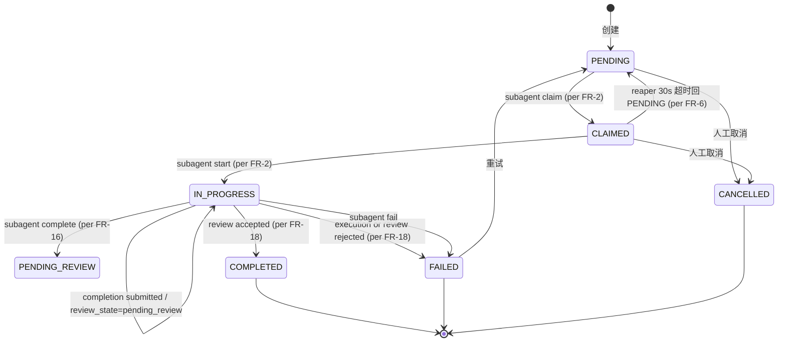
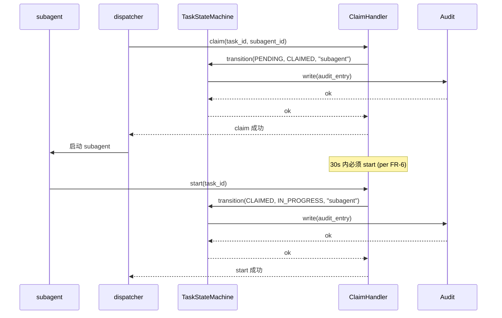
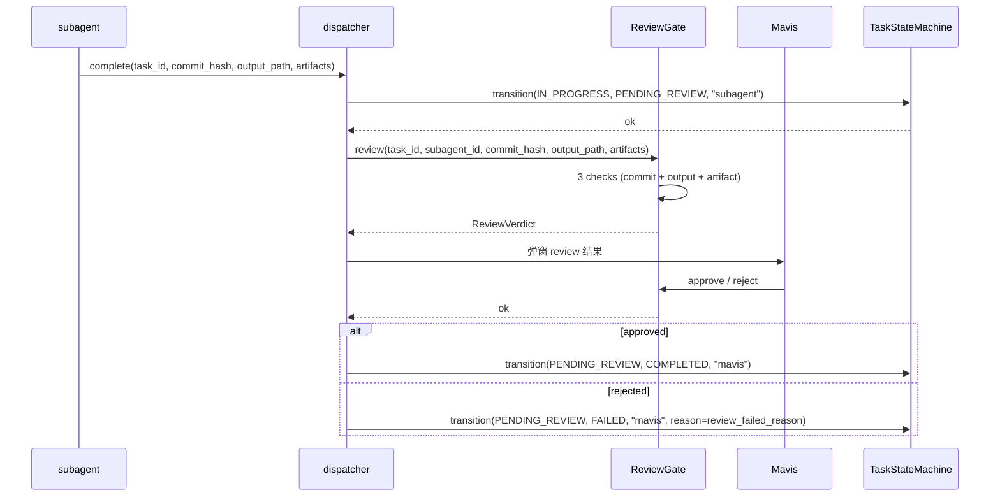
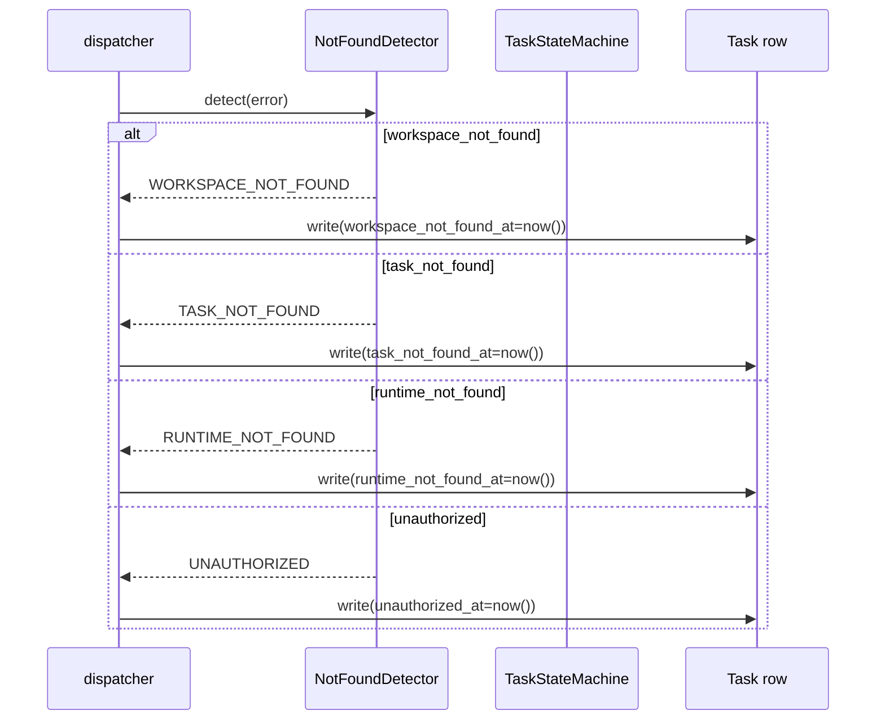

# DD-MULTICA-TASK-001

> **Multica Task Lifecycle 域 詳細設計書 v0.9** (per 日本 IPA SEC 标准，补充条件式 Run Admission Hook 事务契约)
>
> - 状态: 🟡 Draft v0.9 (Run/BI、Agent Profile、双 Loop 与 Hook contract 已设计；Phase 8A/8B/9D-5b/9E-1 有条件式代码切片，生产 Runtime adapter 与目标环境验收仍开放)
> - 目标阶段: 詳細設計 → 実装 → テスト → リリース
> - 关联 commit: (留空, root 统一 commit 时填)
> - 关联总要件 / 基本设计: `docs/requirements.md` v5.25 §50；`docs/basic-design.md` v5.21 §16.14-16.17
> - 关联 Group / Hook 详细设计: `docs/design/DD-WORKTREE-GROUP-001.md` v4.24；`docs/detailed-design/DD-MULTICA-HOOK-001.md` v0.5.14
> - 上位要件: [`docs/requirements/SRS-MULTICA-TASK-001.md`](../requirements/SRS-MULTICA-TASK-001.md) v0.2
> - 上位基本設計: [`docs/design/BD-MULTICA-TASK-001.md`](BD-MULTICA-TASK-001.md) v0.1
> - 上位 ADR: [`docs/adr/0026-multica-patterns-borrow.md`](../adr/0026-multica-patterns-borrow.md) v0.2 §2.1 模式 2
> - 上位 inventory: [`docs/inventory/multica-gap.md`](../inventory/multica-gap.md) v0.1 §2.2 v33 候选
> - 配套 SRS: [`docs/requirements/SRS-MULTICA-POISON-001.md`](../requirements/SRS-MULTICA-POISON-001.md) (Session Poison 强绑定)
> - 修订人: `Ulysses（一人公司 12 角色 per DEC-008）— Mavis 接手**审核**`
> - 审核: Ulysses（一人公司 12 角色 per DEC-008）— Mavis 接手审核；v0.2 补充待评审
> - 日期: 2026-09-28 JST
> - 受众: 詳細設計エンジニア / 実装エンジニア / アーキテクト / SRE / 5 域 Lead 真人
> - dual-use 提醒: 本 DD 不引用 RGS 仓 + 不建立业务子域↔DDD 映射
> - **本 DD 模板 1:1 派生自 `DD-AGENT-RELATIONSHIP-001.md` v0.1**

---

## §0 文档信息 / 修订履历

| 项目 | 内容 |
|---|---|
| 文书 ID | DD-MULTICA-TASK-001 |
| 文书名 | Multica Task Lifecycle 域 詳細設計書 (Worktree Group 集成) |
| 版本 | v0.4 |
| 作成日 | 2026-09-28 |
| 作成者 | Ulysses（一人公司 12 角色 per DEC-008）— Mavis 接手**审核** (per DEC-008) |
| 承認者 | Draft；v0.3 Run/Evidence 扩展待评审 |
| 关联 commit | (待生成) |
| 关联文档 | `SRS-MULTICA-TASK-001.md` v0.2 + `BD-MULTICA-TASK-001.md` v0.1 + ADR-0026 v0.2 + `DD-SHARED-TASK-001.md` v0.2 |
| 范围 | TK-1 ~ TK-5 子能力 × 22 FR = 5 关键 class + 1 状态机 + 11 共享类型 + 3 时序图 + 5 张表 (W-T-M 100%) + 6 API + 30+ 测试 |
| 守门 | 19 项 + 26 派生规 跨域覆盖 |

---

## §1 文档目的 / 适用范围

### 1.1 文档目的

本文档基于 `SRS-MULTICA-TASK-001` v0.1 §4-§7 + ADR-0026 v0.2 §2.1 模式 2, 定义 **Multica Task Lifecycle 域** 的詳細設計:

- 5 关键 class (`TaskStateMachine` / `ClaimHandler` / `ReviewGate` / `StaleDispatchDetector` / `TaskLifecycleAudit`)
- 1 状态机 (pending → claimed → in_progress → completed / failed / cancelled, 6 状态)
- 11 共享类型
- 3 时序图 (claim → start / complete → review / 4 类 404 检测)
- 5 张表 SQL DDL (per 守门 #13 W-T-M 100%)
- 6 API 端点
- 30+ 测试用例

### 1.2 模板派生

本 DD 1:1 派生自 `DD-AGENT-RELATIONSHIP-001.md` v0.1 模板 (6 关键 class 映射 + 1 状态机 + 11 共享类型 + 4 时序图, 本 DD 减 1 时序图)。

---

## §2 概念 module 布局

```
scripts/automation/task_lifecycle/
├── __init__.py                          # 包初始化
├── state_machine.py                     # TaskStateMachine
├── claim.py                             # ClaimHandler (per Multica client.go:227-235)
├── review.py                            # ReviewGate (per Multica 默认 review)
├── stale_dispatch.py                    # StaleDispatchDetector (per 守门 #9 v27)
├── audit.py                             # TaskLifecycleAudit (per 守门 #1 v15)
└── not_found.py                         # 4 类 404 检测 (per Multica client.go:35-91)

docs/wbs-migrate/                        # 迁移脚本
├── v33_migrate.py                       # WBS 41 子项 status 字段升级
└── registry_check.py                    # 迁移校验
```

---

## §3 关键 class 详细设计

### 3.1 C-1 `TaskStateMachine` (主入口)

```python
# scripts/automation/task_lifecycle/state_machine.py
from enum import Enum
from dataclasses import dataclass, field
from datetime import datetime
from typing import Optional, List

class TaskStatus(str, Enum):
    """6 态 status (per SRS-MULTICA-TASK-001 FR-1)"""
    PENDING = "pending"           # 任务已入 WBS, 等待 claim
    CLAIMED = "claimed"           # subagent 已 claim 但未 start
    IN_PROGRESS = "in_progress"   # subagent 实际执行中
    COMPLETED = "completed"       # subagent 报 success + Mavis review 通过
    FAILED = "failed"             # subagent 报 fail (自动) / Mavis 标记 fail (手动)
    CANCELLED = "cancelled"       # 人工取消 (跟 Failed 区分)

# 合法状态转移表 (per Multica 5 态 + cancelled)
VALID_TRANSITIONS = {
    TaskStatus.PENDING: {TaskStatus.CLAIMED, TaskStatus.CANCELLED},
    TaskStatus.CLAIMED: {TaskStatus.IN_PROGRESS, TaskStatus.CANCELLED},
    TaskStatus.IN_PROGRESS: {TaskStatus.COMPLETED, TaskStatus.FAILED, TaskStatus.CANCELLED},
    TaskStatus.COMPLETED: set(),  # 终态
    TaskStatus.FAILED: {TaskStatus.PENDING},  # 失败可重试
    TaskStatus.CANCELLED: set(),  # 终态
}

@dataclass
class TaskStateTransition:
    """单次状态变更记录 (per FR-22 audit log)"""
    task_id: str
    from_status: Optional[TaskStatus]
    to_status: TaskStatus
    actor: str  # "subagent" / "mavis" / "human" / "system"
    reason: Optional[str]
    timestamp: datetime = field(default_factory=datetime.utcnow)

class TaskStateMachine:
    """6 态状态机 (per FR-1)"""
    
    def __init__(self, audit: TaskLifecycleAudit):
        self._audit = audit
    
    def transition(
        self,
        task_id: str,
        from_status: TaskStatus,
        to_status: TaskStatus,
        actor: str,
        reason: Optional[str] = None,
    ) -> None:
        """状态转移, 验证合法性 + 写 audit (per FR-1)"""
        if to_status not in VALID_TRANSITIONS[from_status]:
            raise InvalidTransitionError(
                f"task {task_id}: {from_status.value} → {to_status.value} 不合法"
            )
        self._audit.write(TaskStateTransition(
            task_id=task_id, from_status=from_status,
            to_status=to_status, actor=actor, reason=reason,
        ))
    
    def is_terminal(self, status: TaskStatus) -> bool:
        """是否终态 (per FR-3 区分 failed / cancelled)"""
        return status in (TaskStatus.COMPLETED, TaskStatus.CANCELLED)
```

### 3.2 C-2 `ClaimHandler` (claim API)

```python
# scripts/automation/task_lifecycle/claim.py
class ClaimHandler:
    """claim API (per Multica client.go:227-235 ClaimTask)"""
    
    CLAIM_TIMEOUT_SECONDS = 30  # per FR-6 (跟 Multica 30s claim timeout 一致)
    
    def claim(self, task_id: str, subagent_id: str) -> bool:
        """subagent claim task, PENDING → CLAIMED (per FR-2)"""
        ...
    
    def start(self, task_id: str, subagent_id: str) -> bool:
        """subagent start task, CLAIMED → IN_PROGRESS (per FR-2)"""
        ...
    
    def reaper_check(self, task_id: str) -> bool:
        """claimed 后 30s 内必须 start, 否则 reaper 自动回 PENDING (per FR-6)"""
        ...
```

### 3.3 C-3 `ReviewGate` (subagent complete → Mavis review → done)

```python
# scripts/automation/task_lifecycle/review.py
class ReviewGate:
    """Review gate (per SRS-MULTICA-TASK-001 FR-16 ~ FR-19)"""
    
    def review(
        self,
        task_id: str,
        subagent_id: str,
        commit_hash: Optional[str] = None,
        output_path: Optional[str] = None,
        artifact_paths: List[str] = None,
    ) -> ReviewVerdict:
        """Mavis review 3 件事 (per FR-17)"""
        checks = []
        # 1. commit_hash 存在
        if commit_hash and not self._git_commit_exists(commit_hash):
            checks.append(ReviewCheck(name="commit", passed=False, reason=f"commit {commit_hash} 不存在"))
        # 2. output 落档
        if output_path and not Path(output_path).exists():
            checks.append(ReviewCheck(name="output", passed=False, reason=f"output {output_path} 不存在"))
        # 3. artifact 落档
        for p in (artifact_paths or []):
            if not Path(p).exists():
                checks.append(ReviewCheck(name="artifact", passed=False, reason=f"artifact {p} 不存在"))
        ...
        if all(c.passed for c in checks):
            return ReviewVerdict(approved=True, checks=checks)
        return ReviewVerdict(approved=False, checks=checks)
    
    def force_skip(self, task_id: str, reason: str) -> None:
        """force skip review gate (per 守门 #9 v27 fallback)"""
        ...
```

### 3.4 C-4 `StaleDispatchDetector` (守门 #9 v27 RPC fallback)

```python
# scripts/automation/task_lifecycle/stale_dispatch.py
class StaleDispatchDetector:
    """stale dispatch 检测 (per SRS-MULTICA-TASK-001 FR-5)"""
    
    RPC_TIMEOUT_SECONDS = 30  # per 守门 #9 v27
    RETRY_MAX = 2  # per 守门 #9 v27
    
    def detect(self, subagent_result: SubagentResult) -> StaleDispatchVerdict:
        """检测 subagent 是否 stale (per 守门 #9 v27 实证)"""
        if subagent_result.exit_code == 0 and subagent_result.rpc_acknowledged:
            return StaleDispatchVerdict(is_stale=False, reason="正常")
        # RPC 没 ack 但 status 报 succeeded → stale
        if not subagent_result.rpc_acknowledged and subagent_result.status == "succeeded":
            return StaleDispatchVerdict(
                is_stale=True,
                reason="net::ERR_CONNECTION_CLOSED 但 status=succeeded (per 守门 #9 实证)"
            )
        return StaleDispatchVerdict(is_stale=False, reason="unknown")
    
    def recover(self, task_id: str, verdict: StaleDispatchVerdict) -> None:
        """stale 恢复: 标 stale_dispatch=true, 不阻塞其他 task (per FR-5)"""
        ...
```

### 3.5 C-5 `NotFoundDetector` (4 类 404 区分, per Multica client.go:35-91)

```python
# scripts/automation/task_lifecycle/not_found.py
class NotFoundType(str, Enum):
    """4 类 404 区分 (per FR-7 ~ FR-10)"""
    WORKSPACE_NOT_FOUND = "workspace_not_found"
    TASK_NOT_FOUND = "task_not_found"
    RUNTIME_NOT_FOUND = "runtime_not_found"
    UNAUTHORIZED = "unauthorized"  # 401 不是 404, 但同源

class NotFoundDetector:
    """4 类 404 区分 (per Multica client.go:35-91)"""
    
    def detect(self, error: Exception) -> Optional[NotFoundType]:
        """检测错误类型"""
        error_str = str(error).lower()
        if "workspace not found" in error_str:
            return NotFoundType.WORKSPACE_NOT_FOUND
        if "task not found" in error_str:
            return NotFoundType.TASK_NOT_FOUND
        if "runtime not found" in error_str:
            return NotFoundType.RUNTIME_NOT_FOUND
        if "401" in error_str or "unauthorized" in error_str:
            return NotFoundType.UNAUTHORIZED
        return None
```

---

## §4 状态机

### 4.1 Task 6 态状态机


```mermaid
stateDiagram-v2
    [*] --> PENDING : 创建
    PENDING --> CLAIMED : subagent claim (per FR-2)
    PENDING --> CANCELLED : 人工取消
    CLAIMED --> IN_PROGRESS : subagent start (per FR-2)
    CLAIMED --> PENDING : reaper 30s 超时回 PENDING (per FR-6)
    CLAIMED --> CANCELLED : 人工取消
    IN_PROGRESS --> PENDING_REVIEW : subagent complete (per FR-16)
    IN_PROGRESS --> IN_PROGRESS : completion submitted / review_state=pending_review
    IN_PROGRESS --> COMPLETED : review accepted (per FR-18)
    IN_PROGRESS --> FAILED : execution or review rejected (per FR-18)
    IN_PROGRESS --> FAILED : subagent fail
    FAILED --> PENDING : 重试
    COMPLETED --> [*]
    FAILED --> [*]
    CANCELLED --> [*]
```

### 4.2 状态守门

| From | To | 触发 | 守门 |
|---|---|---|---|
| PENDING | CLAIMED | subagent claim | 唯一 claim (per FR-2) |
| CLAIMED | IN_PROGRESS | subagent start | 30s 内必 start (per FR-6) |
| IN_PROGRESS | IN_PROGRESS | completion submitted | 主状态不变；独立设 `review_state=pending_review` (per FR-16) |
| IN_PROGRESS | COMPLETED | review accept | review 3 件事通过 (per FR-17) |
| IN_PROGRESS | FAILED | execution failure / review reject | `failure_reason` / `review_failed_reason` 必填 |

---

## §5 共享类型 (11)

| Type | 来源 | 用途 |
|---|---|---|
| `TaskStatus` (str Enum) | C-1 | 6 态 status |
| `TaskStateTransition` (dataclass) | C-1 | audit log entry |
| `VALID_TRANSITIONS` (dict) | C-1 | 合法转移表 |
| `InvalidTransitionError` (Exception) | C-1 | 不合法转移 |
| `ClaimVerdict` (dataclass) | C-2 | claim 结果 |
| `ReviewVerdict` (dataclass) | C-3 | review 结果 |
| `ReviewCheck` (dataclass) | C-3 | review 单 check |
| `StaleDispatchVerdict` (dataclass) | C-4 | stale 检测结果 |
| `SubagentResult` (dataclass) | C-4 | subagent 输出 |
| `NotFoundType` (str Enum) | C-5 | 4 类 404 区分 |
| `AuditLogEntry` (dataclass) | TaskLifecycleAudit | 审计落档 |

---

## §6 时序图 (3 个)

### 6.1 Claim → Start (per FR-2 + FR-6)


```mermaid
sequenceDiagram
    participant S as subagent
    participant D as dispatcher
    participant SM as TaskStateMachine
    participant C as ClaimHandler
    participant A as Audit

    D->>C: claim(task_id, subagent_id)
    C->>SM: transition(PENDING, CLAIMED, "subagent")
    SM->>A: write(audit_entry)
    A-->>SM: ok
    SM-->>C: ok
    C-->>D: claim 成功
    D->>S: 启动 subagent
    Note over C: 30s 内必须 start (per FR-6)
    S->>C: start(task_id)
    C->>SM: transition(CLAIMED, IN_PROGRESS, "subagent")
    SM->>A: write(audit_entry)
    A-->>SM: ok
    SM-->>C: ok
    C-->>D: start 成功
```

### 6.2 Complete → Review (per FR-16 ~ FR-19)


```mermaid
sequenceDiagram
    participant S as subagent
    participant D as dispatcher
    participant R as ReviewGate
    participant M as Mavis
    participant SM as TaskStateMachine

    S->>D: complete(task_id, commit_hash, output_path, artifacts)
    D->>SM: transition(IN_PROGRESS, PENDING_REVIEW, "subagent")
    SM-->>D: ok
    D->>R: review(task_id, subagent_id, commit_hash, output_path, artifacts)
    R->>R: 3 checks (commit + output + artifact)
    R-->>D: ReviewVerdict
    D->>M: 弹窗 review 结果
    M->>R: approve / reject
    R-->>D: ok
    alt approved
        D->>SM: transition(PENDING_REVIEW, COMPLETED, "mavis")
    else rejected
        D->>SM: transition(PENDING_REVIEW, FAILED, "mavis", reason=review_failed_reason)
    end
```

### 6.3 4 类 404 检测 (per FR-7 ~ FR-10)


```mermaid
sequenceDiagram
    participant D as dispatcher
    participant N as NotFoundDetector
    participant SM as TaskStateMachine
    participant T as Task row

    D->>N: detect(error)
    alt workspace_not_found
        N-->>D: WORKSPACE_NOT_FOUND
        D->>T: write(workspace_not_found_at=now())
    else task_not_found
        N-->>D: TASK_NOT_FOUND
        D->>T: write(task_not_found_at=now())
    else runtime_not_found
        N-->>D: RUNTIME_NOT_FOUND
        D->>T: write(runtime_not_found_at=now())
    else unauthorized
        N-->>D: UNAUTHORIZED
        D->>T: write(unauthorized_at=now())
    end
```

---

## §7 SQL DDL (v0.1 baseline; v0.2 canonical data model in §14.2)

### 7.1 `task_lifecycle_audit` (Transaction, append-only)

```sql
-- per 守门 #13 Transaction 100% audit + 物理删除禁止
CREATE TABLE task_lifecycle_audit (
    event_id UUID PRIMARY KEY DEFAULT gen_random_uuid(),
    tenant_id UUID NOT NULL,
    worktree_id UUID NOT NULL,
    work_item_id UUID NOT NULL,
    task_card_id UUID NOT NULL,
    event_type VARCHAR(48) NOT NULL,
    from_status VARCHAR(20),
    to_status VARCHAR(20),
    review_state VARCHAR(20),
    actor_id UUID NOT NULL,
    correlation_id UUID NOT NULL,
    idempotency_key TEXT,
    target_worktree_id UUID,
    target_result VARCHAR(24),
    payload_redacted JSONB NOT NULL DEFAULT '{}'::jsonb,
    occurred_at TIMESTAMPTZ NOT NULL DEFAULT NOW()
);
CREATE INDEX idx_task_lifecycle_audit_item_time
  ON task_lifecycle_audit(tenant_id, worktree_id, work_item_id, occurred_at DESC);
-- 物理删除禁止 TRIGGER (per 守门 #13)
```

### 7.2 `task_review` (Work, 短 TTL)

```sql
-- per 守门 #13 Work 100% retention_period (24h)
CREATE TABLE task_review (
    id UUID PRIMARY KEY DEFAULT gen_random_uuid(),
    task_id UUID NOT NULL,
    subagent_id VARCHAR(100) NOT NULL,
    commit_hash VARCHAR(64),
    output_path TEXT,
    artifact_paths JSONB,
    approved BOOLEAN,
    review_failed_reason TEXT,
    force_skip BOOLEAN DEFAULT FALSE,
    force_skip_reason TEXT,
    rls_tenant_id UUID NOT NULL,
    rls_workspace_ids UUID[] NOT NULL DEFAULT '{}',
    created_at TIMESTAMPTZ NOT NULL DEFAULT NOW(),
    expires_at TIMESTAMPTZ NOT NULL DEFAULT NOW() + INTERVAL '7 days'
);
CREATE INDEX idx_task_review_task_id ON task_review(task_id);
```

### 7.3 `task_stale_dispatch` (Work, 短 TTL)

```sql
-- per 守门 #13 Work retention 7 天
CREATE TABLE task_stale_dispatch (
    id UUID PRIMARY KEY DEFAULT gen_random_uuid(),
    task_id UUID NOT NULL,
    subagent_id VARCHAR(100) NOT NULL,
    is_stale BOOLEAN NOT NULL,
    reason TEXT,
    raw_output_path TEXT,  -- <task_id>.stale.json
    rls_tenant_id UUID NOT NULL,
    rls_workspace_ids UUID[] NOT NULL DEFAULT '{}',
    created_at TIMESTAMPTZ NOT NULL DEFAULT NOW(),
    expires_at TIMESTAMPTZ NOT NULL DEFAULT NOW() + INTERVAL '7 days'
);
```

### 7.4 `task_not_found_log` (Transaction, v0.1; consolidated into `task_session_health` in v0.2)

```sql
-- 4 类 404 落档 (per FR-7 ~ FR-10)
CREATE TABLE task_not_found_log (
    id UUID PRIMARY KEY DEFAULT gen_random_uuid(),
    task_id UUID NOT NULL,
    not_found_type VARCHAR(50) NOT NULL,  -- 'workspace_not_found' / 'task_not_found' / 'runtime_not_found' / 'unauthorized'
    detected_at TIMESTAMPTZ NOT NULL DEFAULT NOW(),
    rls_tenant_id UUID NOT NULL,
    rls_workspace_ids UUID[] NOT NULL DEFAULT '{}'
);
CREATE INDEX idx_task_not_found_log_task_id ON task_not_found_log(task_id);
```

### 7.5 `wbs_task_v33` (legacy WBS compatibility projection; not a canonical W/T/M fact table)

```sql
-- 升级现有 wbs_task 表, 加 6 态 status + session_poisoned + stale_dispatch + 4 类 404 timestamp + review gate 字段
-- (现有 wbs_task schema 待 wbs_migrate_v33.py 落地时详, per FR-20)
ALTER TABLE wbs_task
    ADD COLUMN session_poisoned BOOLEAN DEFAULT FALSE,
    ADD COLUMN session_poison_reason VARCHAR(50),
    ADD COLUMN stale_dispatch BOOLEAN DEFAULT FALSE,
    ADD COLUMN stale_dispatch_at TIMESTAMPTZ,
    ADD COLUMN workspace_not_found_at TIMESTAMPTZ,
    ADD COLUMN task_not_found_at TIMESTAMPTZ,
    ADD COLUMN runtime_not_found_at TIMESTAMPTZ,
    ADD COLUMN unauthorized_at TIMESTAMPTZ,
    ADD COLUMN review_gate_required BOOLEAN DEFAULT TRUE,
    ADD COLUMN review_state VARCHAR(20) NOT NULL DEFAULT 'none'
        CHECK (review_state IN ('none','pending_review','accepted','rejected')),
    ADD COLUMN review_force_skip BOOLEAN DEFAULT FALSE,
    -- per 评审 v0.1 修正 M3: 6 态 status CHECK 约束
    ADD CONSTRAINT chk_wbs_task_status_v33
    CHECK (status IN ('pending','claimed','in_progress','completed','failed','cancelled')),
    -- per 评审 v0.1 修正 M5: 5 reason enum CHECK 约束 (跟 DD-POISON-001 配套)
    ADD CONSTRAINT chk_wbs_task_session_poison_reason
    CHECK (session_poison_reason IS NULL OR session_poison_reason IN (
        'iteration_limit','agent_fallback_message',
        'api_invalid_request','codex_semantic_inactivity','codex_resume_oversized'
    ));
```

### 7.6 v0.1 W-T-M 盘点 (v0.2 canonical coverage is §14.2)

| 表 | W/T/M | 检查 |
|---|---|---|
| `wbs_task_v33` | Compatibility projection | ⚠️ 混合字段，按 §14.2 拆出 canonical Work / Transaction / Master 来源 |
| `task_lifecycle_audit` | Transaction | ✅ RLS 13 类 + 物理删除禁止 (TRIGGER) + 审计 |
| `task_review` | Work | ✅ retention 7 天；审查结论必须另写 audit event |
| `task_stale_dispatch` | Work | ✅ retention 7 天 |
| `task_not_found_log` | Transaction (v0.1) | v0.2 合并至 `task_session_health`，保留历史事件 |

---

## §8 API OpenAPI spec (6 端点)

```yaml
/api/task-lifecycle/claim:
  post:
    summary: claim task (per FR-2)
    requestBody:
      content:
        application/json:
          schema:
            type: object
            properties:
              task_id: { type: string }
              subagent_id: { type: string }
    responses:
      '200': { description: 'claim 成功 (PENDING → CLAIMED)' }
      '409': { description: 'task 已被其他 subagent claim' }

/api/task-lifecycle/start:
  post:
    summary: start task (per FR-2)
    requestBody:
      content:
        application/json:
          schema:
            type: object
            properties:
              task_id: { type: string }
              subagent_id: { type: string }
    responses:
      '200': { description: 'start 成功 (CLAIMED → IN_PROGRESS)' }
      '408': { description: '30s claim timeout (per FR-6)' }

/api/task-lifecycle/complete:
  post:
    summary: complete task (per FR-16)
    requestBody:
      content:
        application/json:
          schema:
            type: object
            properties:
              task_id: { type: string }
              subagent_id: { type: string }
              commit_hash: { type: string }
              output_path: { type: string }
              artifact_paths: { type: array, items: { type: string } }

/api/task-lifecycle/review:
  post:
    summary: Mavis review (per FR-17)
    requestBody:
      content:
        application/json:
          schema:
            type: object
            properties:
              task_id: { type: string }
              approved: { type: boolean }
              review_failed_reason: { type: string }

/api/task-lifecycle/cancel:
  post:
    summary: 人工取消 (per FR-3)
    requestBody:
      content:
        application/json:
          schema:
            type: object
            properties:
              task_id: { type: string }
              reason: { type: string }

/api/task-lifecycle/state:
  get:
    summary: 查询 task 当前状态
    parameters:
      - name: task_id
        in: query
        required: true
        schema: { type: string }
    responses:
      '200':
        content:
          application/json:
            schema:
              type: object
              properties:
                task_id: { type: string }
                status: { type: string, enum: [pending, claimed, in_progress, completed, failed, cancelled] }
                transitions: { type: array, items: { $ref: '#/components/schemas/TaskStateTransition' } }
```

---

## §9 NFR (5 类)

| NFR | 指标 |
|---|---|
| 性能 | 状态机迁移 41 子项 < 5s |
| 可靠性 | stale_dispatch=true, 不阻塞其他 task |
| 可观测 | 每次状态变更写 audit log, console 显示状态机 transition 图 |
| 易用 | 状态机守门 = 不可绕过, 但提供 force_skip 路径 |
| 安全 | session_poisoned 标不删除 (per 守门 #11) |

---

## §10 守门 (19 + 26 派生, per AGENTS.md §4 + §4.1)

跟 DD-MULTICA-RUNTIME-001 §10 同, 本 DD 跨域覆盖 12 条派生规, 不重复列。

---

## §11 测试用例 (30+)

### 11.1 16 UT

| UT | 描述 |
|---|---|
| UT-1 ~ UT-8 | TaskStateMachine 6 态转移合法性 (8 case) |
| UT-9 | ClaimHandler 30s timeout 验证 |
| UT-10 | Reaper check 验证 (claimed 后 30s 自动回 PENDING) |
| UT-11 | ReviewGate 3 checks (commit / output / artifact) |
| UT-12 | ReviewGate force_skip |
| UT-13 | StaleDispatchDetector detect (per 守门 #9 v27) |
| UT-14 | StaleDispatchDetector recover |
| UT-15 | NotFoundDetector 4 类 404 区分 |
| UT-16 | TaskLifecycleAudit write 验证 |

### 11.2 10 IT

| IT | 描述 |
|---|---|
| IT-1 | 5 张表 SQL DDL 落档 + W-T-M 100% 覆盖 (per 守门 #13) |
| IT-2 | 13 类 RLS 必携 (per 守门 #13) |
| IT-3 | 物理删除禁止 TRIGGER (per 守门 #13 Transaction) |
| IT-4 | expires_at 7 天后 Work 表可物理删除 (per 守门 #13) |
| IT-5 | 6 API 端点 HTTP 调用 |
| IT-6 | 41 子项 status 字段迁移 (per FR-4) |
| IT-7 | 状态机 transition audit log 完整 |
| IT-8 | stale_dispatch=true 落档 (per FR-5) |
| IT-9 | 4 类 404 timestamp 字段全部落档 (per FR-7 ~ FR-10) |
| IT-10 | session_poisoned 字段 + 5 reason 枚举 (跟 SRS-MULTICA-POISON-001 配套) |

### 11.3 4 E2E

| E2E | 描述 |
|---|---|
| E2E-1 | subagent claim → start → complete → Mavis review → completed 完整流程 |
| E2E-2 | subagent claim → 30s 不 start → reaper 回 PENDING |
| E2E-3 | subagent RPC 失败 (per 守门 #9 v27) → stale_dispatch=true → 不阻塞其他 task |
| E2E-4 | Mavis 收到 review 失败 → FAILED → 重试回 PENDING |

---

## §12 已知缺口 (6, per 守门 #11)

跟 SRS-MULTICA-TASK-001 §8 同, 本 DD 跨域覆盖 5 case:
- #1 5 态跟现有 WBS row 字段冲突 → wbs_migrate_v33.py 兼容迁移
- #2 Session poison 跟现有 Mavis session 概念区分 → 文档加 disclaimer
- #3 Review gate 跟守门 #9 v27 fallback 协调 → force_skip 配置
- #4 stale_dispatch=true 时 subagent output 保留 → <task_id>.stale.json 24h
- #5 4 类 404 timestamp 跟 audit log 协调 → 复用 audit_log 字段
- #6 状态机守门 30s 跟守门 #9 v27 30s claim timeout 重复 → 复用同一 timeout 常量

---

## §13 关联文档

跟 SRS-MULTICA-TASK-001 §9 同 + DD-MULTICA-POISON-001 强绑定。

## §14 渡口 Worktree 群组集成契约 (v0.6)

本节是 v0.3 的规范性补充，与 [`BD-MULTICA-TASK-001.md`](BD-MULTICA-TASK-001.md) v0.1、[`SRS-MULTICA-TASK-001.md`](../requirements/SRS-MULTICA-TASK-001.md) v0.2 和总需求 §50.8 对齐。旧样例中的 `task_id` 表示兼容别名；新接口的 canonical key 是 `work_item_id`。旧 §7 中把整个 `wbs_task_v33` 视为 Master、或把 `pending_review` 放入 status enum 的内容不再作为 v0.3 的物理设计依据。

### 14.1 领域事实源与身份

| 身份/事实 | 唯一所有者 | 详细规则 |
|---|---|---|
| `worktree_id` | Worktree Domain | WorkItem 可关联 0..N 个 Worktree；WORKTREE 命令携带当前 `worktree_id`，Task/Run 历史可在 Worktree 外按 Project/Task 授权读取；Run 上保存可空历史快照，不建立阻止 workspace 清理的外键 |
| `work_item_id` | WorkItem Domain | 跨 Multica、Jira 等价视图、Task Card 和 Canvas 引用的 canonical ID；源系统 ID 通过 alias 映射，不做字符串强转 |
| `task_card_id` | Task Card Manager | 执行工作面的稳定 ID；`work_item_id` 唯一关联当前 Task Card，执行重试另建 Run/Session ID |
| lifecycle `status` | Multica Lifecycle Service | 唯一允许改变六态状态的命令入口 |
| `review_state` | Review Gate | `none/pending_review/accepted/rejected` 与主状态分列；提交 review 不产生第七种任务状态 |
| `task_execution_run_id` | Task Execution | 每次执行尝试的稳定 ID；同一 WorkItem 可拥有多个 Run；它不等同于 Chat/LangGraph `group_chat_run` |
| Canvas 元素与位置 | Canvas Domain | 保存布局、元素和类型化 EntityRef；任务状态只能经 Multica 命令更新 |
| 插件入口/capability | Group App Registry | 管理启用及 capability 暴露，不拥有任务状态与 Task Card |

Multica、Jira 等价视图、Task Card Index、Group Infinite Canvas 和已启用插件是 Worktree 群组的同级入口。Canvas 对 WorkItem 只存 `EntityRef(type, id, worktree_id)`；空白便签必须经过显式“创建任务”命令才会生成 WorkItem。Project/Repository 的 Worktree Overview Graph 由 `DD-WORKTREE-CANVAS-001` 管理，不能映射成群组 Infinite Canvas 对象。

### 14.2 生命周期与持久化表 (W/T/M)

| 物理表/数据集 | 分类 | 关键约束 | 保留规则 |
|---|---|---|---|
| `task_lifecycle_current` | Work | PK `work_item_id`; `worktree_id`, `task_card_id`, `tenant_id`, 六态 `status`, 独立 `review_state`, claim lease, Runtime session ref, `version` | 必含 `retention_period` 与 `expires_at`; 到期清理或由 Transaction 事件重建 |
| `task_review` | Work | 保存待审 artifact/output refs 与审查工作载荷；通过 `work_item_id` + `task_card_id` 关联 | 必含 `retention_period`; 决策结果不靠此表留存 |
| `task_stale_dispatch` | Work | 最近一次 dispatch verify 状态及临时输出引用 | 必含 `retention_period`; 原始诊断内容脱敏后到期清理 |
| `task_metadata` | Master | WorkItem 标题、描述、标签、优先级、执行策略引用；SCD Type 2 | 物理删除禁止；RLS 13 类必携 |
| `task_lifecycle_audit` | Transaction | 状态/Review/TMO/ACL/dispatch 事件，带 `worktree_id`, `work_item_id`, `task_card_id`, `actor_id`, `correlation_id`, `event_id` | append-only，物理删除禁止；RLS 13 类和 audit 必携 |
| `task_session_health` | Transaction | poison/404/fresh-session 决策及 session ref，不能覆写历史事件 | append-only，物理删除禁止；RLS 13 类和 audit 必携 |
| `task_contract` | Master | goal/scope/dependencies/acceptance criteria 的版本快照；按 WorkItem + version SCD Type 2 | 物理删除禁止；RLS 13 类必携；每次更改追加 Transaction audit |
| `task_contract_change_audit` | Transaction | Contract create/supersede、actor、version、correlation | append-only，物理删除禁止；RLS 13 类和 audit 必携 |
| `task_execution_run` | Transaction | 每次尝试的 Task/Input/Acceptance snapshot、可空资源预算、渠道、Actor、版本与可空 Worktree/repo/ref 快照 | append-only，物理删除禁止；RLS 13 类和 audit 必携；Worktree/repo 是无 FK 历史引用 |
| `task_execution_run_event` | Transaction | 执行、Agent 声明、验证、人工评审/返工、集成、介入、成本、失败和有限资源 high-water summary 的独立事件 | append-only，物理删除禁止；RLS 13 类和 audit 必携 |
| `task_execution_evidence` | Transaction | 脱敏摘要、类型、digest、byte length 与受控 artifact locator；不存 artifact 正文 | append-only，物理删除禁止；RLS 13 类和 audit 必携 |
| `task_execution_run_idempotency` | Work | CLI start 的短期幂等映射；actor/key/fingerprint → run_id | `retention_period=30 days` + `expires_at`; 到期可删且不能删除所映射的 Run |
| `wbs_task_v33` | Compatibility projection | 旧 WBS row 的导入/查询兼容层；通过 alias 映射到 canonical `work_item_id` | 不得成为第二个生命周期事实源；迁移期写入只经 Lifecycle Service |

**v0.4 W/T/M 覆盖**：Work 4 个（`task_lifecycle_current`, `task_review`, `task_stale_dispatch`, `task_execution_run_idempotency`）；Master 2 个（`task_metadata`, `task_contract`）；Transaction 6 个（`task_lifecycle_audit`, `task_session_health`, `task_contract_change_audit`, `task_execution_run`, `task_execution_run_event`, `task_execution_evidence`）。资源逐样本 telemetry 为有界 TTL Work/runtime buffer，不追加事务事实；Run 高水位摘要属于 `task_execution_run_event`。`wbs_task_v33` 是迁移兼容投影，不作为混合分类主表计入。所有 Work 表定义 TTL，所有 Master 使用 SCD2 + RLS，所有 Transaction 使用 append-only + audit + RLS。

所有 Work 数据都有 `retention_period`；Master 全表使用 SCD Type 2 + RLS；Transaction 全表 append-only + audit + RLS。v0.1 §7 的旧 DDL 供迁移字段参考；实施时按本节分类拆分动态当前态、Master metadata 与不可变审计事件，不允许把混合 WBS 行整表归入一个分类。

```sql
CREATE TABLE task_lifecycle_current (
  work_item_id UUID PRIMARY KEY,
  worktree_id UUID NOT NULL,
  task_card_id UUID NOT NULL UNIQUE,
  tenant_id UUID NOT NULL,
  status VARCHAR(20) NOT NULL CHECK (status IN
    ('pending','claimed','in_progress','completed','failed','cancelled')),
  review_state VARCHAR(20) NOT NULL DEFAULT 'none' CHECK (review_state IN
    ('none','pending_review','accepted','rejected')),
  claim_actor_id UUID,
  claim_expires_at TIMESTAMPTZ,
  runtime_session_id UUID,
  stale_dispatch BOOLEAN NOT NULL DEFAULT FALSE,
  version BIGINT NOT NULL DEFAULT 1,
  retention_period INTERVAL NOT NULL,
  expires_at TIMESTAMPTZ NOT NULL,
  updated_at TIMESTAMPTZ NOT NULL DEFAULT NOW()
);
CREATE INDEX idx_task_lifecycle_worktree_status
  ON task_lifecycle_current (tenant_id, worktree_id, status);

CREATE TABLE task_metadata (
  work_item_id UUID NOT NULL,
  version BIGINT NOT NULL,
  tenant_id UUID NOT NULL,
  worktree_id UUID NOT NULL,
  title TEXT NOT NULL,
  description TEXT,
  priority VARCHAR(16) NOT NULL,
  labels JSONB NOT NULL DEFAULT '[]'::jsonb,
  execution_policy_ref UUID,
  valid_from TIMESTAMPTZ NOT NULL,
  valid_to TIMESTAMPTZ,
  is_current BOOLEAN NOT NULL DEFAULT TRUE,
  PRIMARY KEY (work_item_id, version)
);
CREATE UNIQUE INDEX uq_task_metadata_current
  ON task_metadata (tenant_id, work_item_id) WHERE is_current;

-- `task_lifecycle_audit` uses the append-only DDL from §7.1 (canonical columns shown there).

CREATE TABLE task_session_health (
  event_id UUID PRIMARY KEY,
  tenant_id UUID NOT NULL,
  worktree_id UUID NOT NULL,
  work_item_id UUID NOT NULL,
  task_card_id UUID NOT NULL,
  runtime_session_id UUID NOT NULL,
  health_event VARCHAR(32) NOT NULL,
  reason_code VARCHAR(64),
  actor_id UUID NOT NULL,
  correlation_id UUID NOT NULL,
  occurred_at TIMESTAMPTZ NOT NULL DEFAULT NOW()
);
CREATE INDEX idx_task_session_health_item_time
  ON task_session_health (tenant_id, worktree_id, work_item_id, occurred_at DESC);
```

`task_review` retains the v0.1 review artifact fields but must add `worktree_id`, `work_item_id`, `task_card_id`, `retention_period`, and `expires_at`. `task_stale_dispatch` uses the same identity envelope and Work retention. The v0.1 `task_not_found_log` is migrated into `task_session_health` event rows without losing event IDs/timestamps. `task_lifecycle_audit`, `task_session_health`, and `task_metadata` must carry the repository's applicable RLS policies; event tables forbid UPDATE/DELETE and Master rows use SCD Type 2. The DDL is logical target schema; exact production SQL policy names and FK table names are finalized against the owning WorkItem/Worktree migrations.

### 14.3 命令 envelope 与授权

```json
{
  "scope_kind": "WORKTREE | GLOBAL",
  "worktree_id": "required for WORKTREE",
  "target_worktree_ids": ["required explicitly for GLOBAL writes"],
  "work_item_id": "canonical WorkItem ID",
  "task_card_id": "Task Card ID",
  "idempotency_key": "per command",
  "correlation_id": "end-to-end trace"
}
```

`actor_id`、tenant、permission snapshot 只能从认证 principal 和服务端授权结果取得，拒收客户端声明的权限。WORKTREE 命令只能操作 `worktree_id` 下对象；GLOBAL 写操作先逐目标授权，再执行允许的目标并为每个目标回传 allowed/denied/succeeded/failed 结果。空目标返回 `422 target_required`；单目标无权返回 `403 target_forbidden` 且无副作用。`task_id` 仅作为过渡兼容字段，服务端先查 alias，响应总是带 canonical ID。

所有 `claim/start/submit_completion/review_accept/review_reject/cancel/TMO` 命令都带相同 envelope 并由 Lifecycle Service 在事务内校验 `worktree_id + work_item_id + task_card_id` 对应关系、当前 status、权限、version 和 idempotency key。状态转换及每个 GLOBAL 目标的授权结论写入 Transaction audit/outbox；Canvas 与插件不能直写上述表。

### 14.4 卡内 CLI、LangGraph 与插件交互

Task Card Detail 从 Multica/Jira/Canvas 任一同级入口打开时，先用 canonical `work_item_id` 获取同一卡片。每次实际启动前由服务端建立 `TaskExecutionRun` 并快照当前 Task Contract；CLI provisioner 接收 `task_run_id`，其 Session 是 Run 的执行资源，不是 Run 自身。`TaskExecutionContext(task_run_id, worktree_id, work_item_id, task_card_id, actor_id, tenant_id, scope_kind, runtime_profile, permission_snapshot_ref, correlation_id)` 再由 Runtime/AgentPolicy 验证工作目录、可执行工具、secret capability 与目标授权。浏览器 URL、Canvas 节点 ID 和外部 Jira key 均不得直接成为执行目录或授权凭据。

Group App Registry 与 LangGraph `SubAgentRegistry` 是两个分离注册表：前者决定群组入口及插件 capability，后者决定 agent graph type。插件通过 capability bridge 请求 Lifecycle Command 或只读 API；每次调用均复验 enabled/scope/ACL。卸载插件即时阻止新 capability 调用，并保留已有 WorkItem、审计和 disabled EntityRef。

### 14.5 一致性验收补充

| ID | 验收 |
|---|---|
| DD-MG-01 | Multica、Jira 等价任务视图、Task Card 与 Canvas 对同一 canonical `work_item_id` 显示同一 lifecycle version |
| DD-MG-02 | 任一写入来源都经过 Lifecycle Service；并发/重放由 version + idempotency key 收敛 |
| DD-MG-03 | Task Card CLI 只能在绑定 Worktree 内运行；跨 Worktree GLOBAL 操作按目标逐项授权并审计 |
| DD-MG-04 | `review_state=pending_review` 时主 status 保持 `in_progress`；未接受 review 不可进入 `completed` |
| DD-MG-05 | 插件 disable 后新调用失败，但核心任务、Transaction audit 和 Canvas EntityRef 保持可读 |
| DD-MG-06 | Task Contract 每次变更追加 SCD2 successor 与 audit；已有 Run 保存创建时的合同版本和验收快照 |
| DD-MG-07 | 同一 Task 多次执行各有独立 Run；Worktree/repo 是无 FK 快照；清理 checkout 不删除 Run/Event/Evidence |
| DD-MG-08 | Agent 声明、自动验证、人工验收/返工与集成状态分列；任何一个状态不得自动推导另一个状态 |
| DD-MG-09 | 相同 CLI start key/fingerprint 重放返回同一 `task_run_id`；新 key 建立新 Run；`group_chat_run` 不共用身份/状态 |
| DD-MG-10 | 每个 Project BI metric 可解释 formula、分母、time window、coverage/version 并下钻到 Run/Evidence；unknown 不计为零 |
| DD-MG-11 | Pi 仅为架构参考；Rust-native scheduler 根据 DAG readiness、Project/Worktree fairness、bounded queue 和 hierarchical resource budget 管理独立 Run；禁止无界 fan-out 和 L1→L1 直连 |
| DD-MG-12 | Run budget snapshot 不可变且可为空；每 Run 至多 append 一个含 units/source/window 的 resource summary；缺测保持 unknown；cancel/deadline/revoke 必须级联并验收 drain |
| DD-MG-13 | Rust desktop 使用固定 workload 验收分页/虚拟化/Canvas culling/lazy artifact/bounded terminal buffer/offscreen pause；设备内存和延迟目标经实测定标 |

### 14.6 尚待详细裁定

- 旧 `wbs_task` 与 canonical `work_item_id` 的 alias 回填冲突/重复处理，按 migration rehearsal 确认；不得以猜测自动合并。
- 历史 CLI Session 的生产 provisioner / terminal sink 应回传或引用 `task_run_id`；Run 事实不由 Runtime Session 表替代，也不因 Worktree checkout 清理而丢失。
- GLOBAL 批量操作已定义逐目标授权与结果；跨目标补偿是否自动执行由 LangGraph/TMO review 决定。

### 14.7 Task Contract 与 Execution Run 数据契约

`task_contract` 是 canonical WorkItem 下的 Master/SCD2 版本：goal、scope、dependencies 与 acceptance criteria 组成当前合同。更新必须在一笔领域事务中关闭当前版本、追加 successor、追加 `task_contract_change_audit` 与 Outbox；物理删除禁止。Run 创建时读取当前合同与 Task metadata，在 `task_execution_run.task_snapshot` / `acceptance_snapshot` 中固定快照；没有合同的旧 Task 将 acceptance snapshot 存为 `NULL`，不能写空数组伪装为“零验收项”。历史 Run 不跟随 Task Contract 后续版本变更。

`task_execution_run` 是 Transaction/append-only 的一次尝试事实。它保存 Task/Project/Actor、`run_origin` / execution channel、相关 Agent/Model/Skill/Orchestrator/Strategy 版本、合同版本、输入/验收快照、profile/provider/API version/content digest/grant snapshot、resource budget、loop policy、HookSet/evaluator 与可选 `ProjectEngineeringManifest` snapshot，以及 correlation 和可空 `worktree_id / repository_id / runtime_id / start_ref / start_commit_ref`。Phase 8A 为兼容旧写入允许新快照列为空；Phase 9D-5b 条件式 CLI admission 已将 verified effective HookSet snapshot 写入新 Run，其他 Agent/Profile/Loop/Provider snapshot 仍由后续 resolver/provider 接入填充，不能用空 object 伪装选择完成。预算快照记录当次 admitted 上限，不代表真实消耗；Worktree/repo/runtime 仅作为当时上下文的 ID/Ref 快照，不设置外键；在删除 checkout 或关闭 Worktree binding 后，Run 与证据仍按 Project/Task 权限可查。数据库里的 Worktree 主记录若仍被旧 lifecycle audit 的 `ON DELETE RESTRICT` 引用，仍不得绕过该约束硬删；host checkout 清理和平台身份保留是两个不同生命周期。

Schedule Run 以 `run_origin='schedule'` 标记，必须保存 `automation_rule_id / automation_rule_version / automation_occurrence_id`，并用 `(tenant_id, automation_occurrence_id)` 唯一索引防止重复创建 Run。该 Rule/Occurrence 的权威数据仍归 `domain-automation`，此 migration 仅保存不可变 ID/version 关联，不建第二张 schedule definition 表；目前 schedule 字段尚无 producer。

`task_execution_run_event` 以独立 nullable 列记录执行器状态、Agent 声明、验证结果、人工接受/返工和集成状态。`agent_declaration=declared_complete` 只说明 Agent 自报；不得自动写 verifier passed、human accepted 或 integrated。cost record 将 `actual_cost_amount` 与 `estimated_cost_amount` 分开且必须携带 `cost_unit`；unknown 用 `NULL`。Schedule occurrence link、Loop iteration/decision/stop、Hook evaluate/override 和 `resource_summary` 都是 append-only event；Hook 事件固定规则/evaluator version+digest、phase/decision/reason class/latency/timeout，Loop event 固定 iteration/phase/decision/stop reason。Run 完成时最多追加一条 `resource_summary`，单位固定记录 peak RSS bytes、CPU time ms、child process high-water 与 input/output bytes，并携带 measurement source/window；未采到的值为 NULL，高频 telemetry 只进入短 TTL 有界 buffer。失败事件保存稳定 `failure_category`，`details` 只允许脱敏 metadata，不存 prompt、完整 tool transcript 或思维过程。`task_execution_evidence` 只保存类型、摘要、digest、媒体类型、长度和受控 artifact locator；artifact 正文由独立受权/保留策略管理。

Phase 8A 已新增 additive migration `db/migrations/2026-09-30-worktree-task-execution-run.sql`，并将 CLI Session start 命令与 Run ID 连接：在授权的 lifecycle transaction 中创建 Run/input/acceptance snapshot、`run_origin='cli'`、Run started event 与 30 天 actor/key/fingerprint 幂等映射；同幂等请求重放返回原 Run ID，新幂等键产生新尝试。Migration 也预留版本化 Execution Profile/Provider/Loop/HookSet/Project Engineering snapshot、Automation Rule/Occurrence reference、Loop/Hook/resource typed event 字段和每 Run 唯一资源汇总索引。9D-5b producer capability 关闭时保留旧 CLI start writer；能力打开后，新 Run writer 还在同一 admission transaction 写 `hook_set_snapshot` 与 HookEvent/RunEvent dual-write，其他未接入的 Profile/Loop snapshot 仍为 NULL。CLI writer 产生 started/provisioning-failure 事件；Runtime start 的真实 running/exit 事件仍依赖未装配的 production provisioner。该 migration 已在隔离临时 PostgreSQL 集群重复应用两次，并确认 6 张 Run 表启用 `FORCE ROW LEVEL SECURITY`；这不是目标数据库部署或目标 runtime role 的 RLS 验收。真实 status/exit、验证、人工 review、integration、cost/evidence/resource-summary producer、Schedule/Loop provider 与 Runtime adapter 尚未接入。`group_chat_run` 仍保留为短 TTL Chat/LangGraph queue projection，可关联 `task_run_id`，但不可复用 Run PK 或状态机。

#### 14.7.1 Run 查询 API 与 Task Card 历史面板

授权查询必须以当前 Worktree + canonical WorkItem 为路径作用域，不从客户端接受 Project ID 作为授权事实：

| 方法 / 路径 | 行为与边界 |
|---|---|
| `GET /api/v1/worktrees/{worktree_id}/work-items/{work_item_id}/runs?limit=&cursor_started_at=&cursor_run_id=` | 验证 Bearer Actor、`work-item:read`、tenant、当前 Project membership、Worktree binding 与 WorkItem/Worktree 归属；默认 20 条、最多 50 条；复合 `(started_at, run_id)` 倒序游标；返回最小 Run summary、独立状态维度和下一游标 |
| `GET /api/v1/worktrees/{worktree_id}/work-items/{work_item_id}/runs/{run_id}` | 使用相同 scope 授权并确认 Run 属于路径 Task；最多返回 100 个 Event 与 100 个 Evidence 的结构化 projection |

两个响应均 `Cache-Control: no-store`。读取层不序列化任意 Event `details`、artifact locator、文件正文、prompt、完整 transcript 或模型推理；敏感证据的正文/locator 需由另外的、逐次授权的 artifact API 提供。execution / verification / human acceptance 各自取对应字段最新的非空 Event，不能按整行最新事件把彼此状态覆盖。Task Card 的 Run History 面板只在认证 Group API provider 下出现，保留当前有界页面而不缓存整个历史；加载错误/身份变化必须清空数据，不回退本地 seed。该前端不增加 Worktree 导航层级。

当前实现状态：list/detail 路由和 Task Card 条件式历史面板已落代码；查询边界由 actor/context/关联校验执行。单测与前端类型检查已通过。隔离 PostgreSQL migration 重放与 FORCE RLS 检查已通过，但 `localhost:5432` 目标开发库不可用，目标 DB/runtime grants 和 API 对真实 RLS 的端到端验收仍未完成。Task Contract 写命令、其余 Run Event/Evidence producer 与生产 Runtime 仍为未完成项。

#### 14.7.2 Run Admission Hook snapshot 与事件原子性（Phase 9D-5b）

新 Task CLI Run 的 admission 顺序将 Host Runtime 外部等待与数据库事务分离：先以短事务读取并授权当前 Worktree/Task/Runtime/lifecycle/idempotency，再提交释放行锁；新 Run 通过 `TaskCliSessionProvisioner::prepare_run_admission` 在事务外最多等待 2 秒取得 Runtime health 和一次性 admission fence。Readiness 观测年龄不超过 5 秒；fence 必须非空、至少保留 5 秒事务提交余量且 expiry 不超过 30 秒，并绑定完整 tenant/actor/project/repository/worktree/task/runtime/lifecycle/approved profile/correlation/request fingerprint。

REST 随后开短事务重新设置 tenant/actor scope，重验 membership、Worktree/Task binding、Task active/owner/status、Runtime、expected lifecycle version 和 idempotency；读取当前 verified effective HookSet 并运行 `BeforeRunAdmission` evaluator。Allow 时同事务创建 `task_execution_run`（保存 immutable `hook_set_snapshot`）、`run_started`、append-only `hook_execution_event` 和 `task_execution_run_event.hook_evaluated`。两类 HookEvent 投影共享唯一 `event_id`，供 summary v2 以 `(tenant_id,event_id)` 去重。Deny/RequireHuman/Defer 仅追加 Hook ledger，不创建 Run；因 RunEvent FK 不允许无 Run 事件，拒绝 ledger 的 `work_item_id/run_id` 均为 NULL，attempted WorkItem ID 只出现在 ≤4 KiB sanitized details。策略/evaluator/ledger/Run 写入失败使 admission transaction 回滚。

提交后，REST 将 fence ID 交给 `start_task_cli_session`；Runtime adapter 必须一次性消费并复验完整 scope、fingerprint 与 expiry，在发放 execution grant / spawn 前重新授权。缺失/不可用 adapter 保持 capability=false，Builder 与 policy publish/rollback gate 均关闭。幂等重放返回既有 Run，不重复求值或重新申请 fence。当前代码已实现 REST seam、Run snapshot 与双事件事务写入逻辑，但没有生产 `TaskCliSessionProvisioner` adapter，因此尚不能证明实际 Runtime spawn 已受 Hook admission 保护；目标 DB/RLS/grants/真实 auth Provider 与并发/重试数据库集成仍未验收。

### 14.8 Project BI、Benchmark 与改进闭环

BI 是 Run/Event/Evidence/Audit 的只读、可重建 Project projection，不产生第二套事实。每个 `metric_version` 固定 formula、numerator/denominator、unit、window、cohort、coverage 和 source event types；缺数据不补零。按 task type/complexity 分层，核心度量包括 acceptance、first-pass acceptance、rework、人工介入、cycle time、accepted-task cost，并下钻到 Task → Run → Evidence。项目导航只在 Project Worktree Index 提供 Quality & Improvement 入口；Worktree 内不添加“Run”导航层级，Run 留在 Task Card detail。

Benchmark 保存固定 task set/version、repository commit、运行环境、Task Contract、scoring rule 与隔离 replay receipt；tuning/holdout 分集并禁止候选策略查看 holdout 后回写标准。不可复现条件明确保存为 metadata。Improvement proposal 串起触发失败事件、假设、实验、benchmark 对比、授权采纳版本与 rollback 版本。Phase 10-11 尚无生产实现；schema、Metric API/UI、隔离 runner、approval policy 和 BI coverage 尚待各阶段完成。

### 14.9 Pi-inspired Rust Agent core 与并行资源契约

Pi 的可借鉴部分是小而稳定的执行核心、组合式 tool/skill/extension、生命周期事件、可持久分支的 session/context history，以及只将活动分支装入 prompt、超预算时压缩上下文但保留原始历史。渡口从头实现这些边界为 Rust traits/protocols；Pi/Node 不是依赖或 subprocess backend。Task Contract 和每次 TaskExecutionRun 是产品事实；Agent 对话 branch 是 Run 内的执行上下文，不替代 Run/Event/Evidence，也不允许 Agent 自报状态推进人工验收。

参考 Pi 官方资料：[project README](https://github.com/earendil-works/pi/blob/main/packages/coding-agent/README.md)、[session branches and context](https://github.com/earendil-works/pi/blob/main/packages/coding-agent/docs/sessions.md)、[session tree format](https://github.com/earendil-works/pi/blob/main/packages/coding-agent/docs/session-format.md)、[extensions](https://github.com/earendil-works/pi/blob/main/packages/coding-agent/docs/extensions.md)。这些仅作为设计参考，不引入其 JS runtime 或依赖。

多 Agent 并行由 Rust Project Coordinator 和 Worktree Coordinator 负责。Scheduler 只 admission 依赖已满足的 DAG 节点，使用 Project/Worktree 配额、work-conserving weighted fairness 和有界队列；队列满时背压/排队/拒绝，不无界 fan-out。父 Run 为子 Agent/Plugin 分配 memory、CPU concurrency、process/fd、provider/tool concurrency、event buffer 和 wall-clock 子预算；预算随 Run 快照保存，消耗实测与估计分开，未知保持 NULL。Agent lease 与路径 claim 用于执行互斥；Git retention lock 只表示 Git 元数据保护，三者独立。

RunEvent 追加一条可选、每 Run 至多一条的 `resource_summary`，记录 peak RSS bytes、CPU time ms、child process high-water、输入/输出字节和采样来源/区间；高频样本只能进入有界短 TTL telemetry buffer，不追加逐帧 Transaction。取消、deadline、撤权和 Worktree drain 传播到所有 child Run/process 并等待释放；超时保留可见 incomplete 状态，不报告 drained。跨 Agent 协作经当前授权的 coordinator command/event，GLOBAL L0 为每个 Worktree 目标派生独立 L1，禁止 L1↔L1 直连。

Rust desktop UI 只读取受授权分页/增量 projection，Worktree/Run 使用虚拟列表，Canvas 基于 viewport/spatial index 裁剪，CLI 用有界 ring buffer 与 disk-backed evidence。共享不可变 snapshot 避免跨状态 store 复制大型对象；可见页面外停止 poll/subscription，图片/大证据 lazy-load；网络、磁盘和 layout 不阻塞 UI 线程，worker/channel/cache 各有硬上限和取消。桌面 renderer framework 不在未测情况下定型：Phase 12 使用同一 Worktree/Run/Canvas/CLI workload 评估 Rust UI 候选的 peak RSS、CPU、首屏/更新 p95、Canvas frame time 与平台覆盖，指标先标 `TBD-MEASURE` 再以实测 baseline 固定。

Plugin 仅通过版本化 manifest/capability contract 接入 Rust core；运行采用受限 WASM 或独立隔离进程，不能把任意 native library 动态载入桌面主进程。热插拔先拒绝新调用、撤销授权、drain/cancel 运行中调用、回收 instance/进程，再切换 Registry projection。隔离方案需同时验收内存/CPU/并发预算和 host API 兼容性。

### 14.10 Schedule Loop 与 Engineering Loop

Schedule Loop 的唯一规则与时间 occurrence owner 是 `domain-automation` 的版本化 `AutomationRule` / `AutomationOccurrence`。一次 occurrence 使用稳定 ID、幂等 dispatch、fencing lease，固定 trigger/timezone/target scope/concurrency/overlap/misfire/retry/deadline/pause policy，并在创建时绑定当时的 Task/Worktree/Profile/Hook policy 版本；规则后续修改不得回写既有 occurrence 或 Run。`star-scheduler` 只做 DAG 依赖 readiness，Workflow/LangGraph 只编排已触发的 Run，不创建第二套 Cron rule store 或时钟。现有 Schedule/Cron schema 仍为候选，生产 worker 与恢复逻辑尚未实现。

Engineering Loop 是 Run 内的 Plan/Act/Observe/Verify/Decision 次序。每轮引用固定 Task Contract、acceptance、AgentExecutionProfile、HookSet 与 Validation policy snapshot；循环不能自行修改这些基线。预算至少限制 iteration、wall-clock、peak RSS、CPU、child process、provider/tool concurrency 与累计调用成本；无进展/振荡、budget/deadline、撤权/cancel 均停止新动作并触发 child drain，最后写不可变 stop reason、验证结果与 drain outcome。进度采样可重建，停止/验收/Occurrence/Run facts 必须持久化。

### 14.11 Agent Execution Profile 与 Provider 扩展

`AgentExecutionProfile` 固定组合 Agent、Memory、Skill、Context、Validation、Loop、HookSet 和资源策略的稳定 ID、schema/API version、implementation version、content digest、scope/capabilities、兼容性及 grant snapshot。每次 Run admission 解析并冻结实际选择；撤销、缺失或不兼容的 provider 不回退为更宽权限。Memory 需具来源、scope、ACL、TTL 与删除/保留声明；Skill manifest 含版本/digest/capability/resource budget；Context assembly 限定字节/token 预算、记录 source provenance 和压缩边界，不能静默截断权限、Task Contract 或验收条件；ValidationProvider 独立于 Agent 声明，保存输入/toolchain/rule digest、逐项覆盖、结果与 Evidence。ProjectEngineeringManifest 可按 repository commit 配置任务模板、已批准验证命令 ID、toolchain/env profile、fixtures 和 artifact/redaction 映射，仓库文本不可自行启用命令能力。

第一阶段可经 Star-owned Rust `AgentCliAdapter` 调用现有 CLI。Adapter 只接受直接 executable+argv、allowlisted env、canonical Worktree cwd、明确 grant、bounded I/O/event channel、deadline/cancel 和进程树回收；CLI 不控制授权、scope、Loop budget、Hook decision 或最终验收。后续 Rust-native provider 替换 CLI 时沿用同一版本化 contract 和 Run Event/Evidence，不改变 WorkItem/Run 主身份模型。Pi 继续只作为 session branch/context compaction 的设计参考，不依赖 Pi/Node runtime。

#### 14.11.1 Rust Profile snapshot 类型与验证边界

Phase 9E-1 在 domain-agent 的 execution_profile 模块定义 AgentExecutionProfileDraft、AgentExecutionProfileDocument 和只读 VerifiedAgentExecutionProfile。schema_version 当前为 1；JSON unknown fields 被拒绝，输入完整 document 上限为 65,536 bytes，content_digest 为 profile payload 序列化后的 lowercase SHA-256。profile payload 仅用固定字段顺序结构与 canonical sorted unique vectors，不含 map、Secret、raw prompt、完整日志或模型隐式推理；seal 先验证字段与各资源界限，再产生 digest，decode_and_verify 先限制输入长度再反序列化，verify 返回的包装仅提供不可变借用。

Profile 固定 tenant/project/可选 worktree scope、Agent provider/version/实现与非敏感配置 digest、Memory 状态、Skill ID/version/content digest、ContextAssembler provider/version/digest 与字节/token/source 上限及 compaction digest、独立 Validation provider/suite/toolchain/acceptance criteria、LoopPolicy provider/version/digest 与 Loop budget、Run resource ceilings、HookSet version/digest、capability grant version/expiry，以及可选 repository commit 与 engineering manifest digest。Agent/Memory/Skill/ContextAssembler/Validation/LoopPolicy provider 声明的 capabilities 必须按字典序唯一且是 grant snapshot 的子集；Validation provider ID 必须与 Agent provider 不同；Memory 仅接受显式 Disabled 或带正值硬上限及 provenance_required 的 Enabled，Unavailable 令 profile admission fail closed。绑定 Worktree 的 profile 和 Memory scope 不可扩大到 Project；Project profile 可在同租户同 Project 的 Worktree 内使用，最终 Run scope 必须有 Worktree ID。Schedule occurrence、Task/acceptance 与检索到的 Memory source 摘要另存于不可变 Run admission snapshot，不写入共享 Profile Master。

边界常量：Profile ≤64 KiB；Skill ≤128；单 capability 列表 ≤64；Acceptance criteria ≤256；Context ≤64 MiB、16,777,216 tokens、4,096 sources；Memory ≤4,096 items、16 MiB、4,194,304 tokens、10 年 source age；单 Run ≤8 GiB RSS、24 小时 CPU/runtime、256 child processes、256 parallel tools、100,000 provider calls、128 MiB captured output、16 MiB event buffer。实际 Project/主机并行总配额仍由后续 scheduler admission 汇总，Phase 12 benchmark 可基于设备档收紧，profile 中的每 Run 上限不能替代聚合公平调度。

VerifiedProfile scope check 仅校验冻结 scope 与请求的 tenant/project/worktree 关系；它不证明当前 actor ACL/grant 仍有效。每次真实 Run create/resume 仍须重新授权、复核 grant expiry/provider availability/Worktree lifecycle，并原子固定该 Profile digest 与 Task Contract、HookSet 和 Schedule occurrence。此阶段尚未实现 profile registry/resolver、Master/SCD2 持久化、Run writer 联接、provider compatibility negotiation、Rust CLI adapter、Automation occurrence dispatcher、Loop runtime 或 scheduler；SQL 中已有 snapshot 列不等于该 producer 已启用。

### 14.12 Rust-native Hook 与高级设置导航契约

Hook 规则的唯一配置入口沿用 ULYS-235：Settings 主导航中的“高级设置”是父入口，Hooks 位于该页面内容区的 tabs，与 Skills/MCP/Plugins 并列；这里维护可视化 typed rule、Project baseline/Worktree restrictive overlay、version diff、冲突解释、dry-run、影响预览、审批发布与 rollback。不得给 Worktree Group tree 增加 Hook app，也不得要求用户编写 Python/JS/shell/native handler。Worktree Index 显示 effective HookSet/version/health/deny summary，Run detail/BI 可查对应事件并深链回 Advanced Settings Hooks 过滤视图。

安全关键 Hook evaluator 属于 Rust core，内置不可关闭规则并在 Run/tool/validation/review/archive/cleanup gate 执行；decision 仅限 allow/deny/require_human/defer，不可授予权限或修改 command/acceptance facts。policy/evaluator/audit 失败或超时 fail closed；插件 Hook 仅能在隔离、有 grant 的 advisory/post-commit 边界运行。Worktree archive/cleanup 在 Domain Command 前重验 actor ACL、lifecycle version、active Run/Agent/path claim、child process/handle drain 与新鲜 Git lock observation，再由 Domain Command 原子复查；旧 Python handler 不具有 Star 产品授权 authority。

每条 Hook event 关联 Project/Worktree/Task/Run/correlation ID 与 HookSet/rule/evaluator version/digest、phase、decision、reason class、latency、timeout/failure/override provenance，禁止存 Secret、raw prompt、完整 CLI output。BI 根据这些事件派生覆盖率、deny/人工处理、超时/故障、覆盖操作和 cleanup/claim/drain 与 validation/返工关系；漏数显式 unknown，不补零。引擎、设置 UI、Domain Command gate 和 BI consumer 均尚待 Phase 9-10 实装。

---

## 附录 A-E

跟 DD-MULTICA-RUNTIME-001 模板同 (5 view / 派生规 / 拍板来源 / 签字栏 / 修订履历), 本 DD 略 (内容可参考模板)。

签字栏:
| 1 | 架构负责人 | 架构师 (Mavis 接手 agent per DEC-008) | 2026-09-11 | 🟢 接受 per 2026-09-11 20:50 JST 拍板 |
| 2-5 | SRE / 平台 / 评审 / PM | 同上 | 同上 | 🟢 per 守门 #14 v3 Mavis 临时代签 |

修订履历:
| v0.1 | 2026-09-11 | Ulysses — Mavis 接手**审核** | 初版（5 关键 class + 1 状态机 + 11 共享类型 + 3 时序图 + 5 张表 W-T-M 100% + 6 API + 30+ 测试）| 2026-09-11 20:50 JST Ulysses 拍板 |
| v0.2 | 2026-09-28 | Ulysses（一人公司 12 角色 per DEC-008）— Mavis 接手审核 | 将 Worktree/WorkItem/Task Card 设为统一身份契约；把 review_state 与六态 lifecycle 分离；补充 scope 授权、卡内 CLI、插件 capability、Outbox 及 W/T/M 物理数据边界。旧版签字记录只适用于 v0.1 | 用户要求基本设计合入 dev 后继续完成详细设计 |
| v0.3 | 2026-09-30 | Ulysses（一人公司 12 角色 per DEC-008）— Mavis 接手审核 | 新增 Task Contract Master/SCD2 与 TaskExecutionRun/Event/Evidence Transaction 设计；Run 独立于 Worktree，冻结输入和验收快照，分离声明/验证/人工接受/集成状态；为 CLI start 加 Run ID 和 30 天幂等映射；定义 Project 级 BI、Benchmark、可回滚 Improvement Proposal，标注实现阶段和当前缺口 | 用户引用“AI提升方向”对话，要求 Run 与 BI 架构并入 Worktree-first 任务 |
| v0.4 | 2026-09-30 | Ulysses（一人公司 12 角色 per DEC-008）— Mavis 接手审核 | 将 Pi 的小核心、组合扩展、显式事件与分支 session/context 原则映射为 Rust-native contract；新增 DAG/公平调度、资源层级预算、有界队列、取消/drain、Run 资源摘要、隔离 Plugin 和高性能 Rust 桌面设计/验收；不依赖 Pi/Node runtime | 用户要求多 Agent 并行并确保低内存、高性能 Rust 桌面端 |
| v0.5 | 2026-09-30 | Ulysses（一人公司 12 角色 per DEC-008）— Mavis 接手审核 | 同步 Group DD v4.19、Basic Design v5.3 与 Hook DD v0.5；新增唯一 Automation Schedule occurrence source、Run 内 Engineering Loop、版本化 Agent/Memory/Skill/Context/Validation/Hook/Loop profile、首期 Rust CLI adapter、Advanced Settings Hooks tab 与 Rust-native Worktree safety/BI 事件契约；计划与 SQL schema 仅定义边界，未实现的 engine/provider/UI 保持未完成 | 用户要求将 AI 提升方向、Loop 与原生可视化 Hook 体系纳入当前架构 |
| v0.6 | 2026-09-30 | Ulysses（一人公司 12 角色 per DEC-008）— Mavis 接手审核 | 同步 requirements v5.20、Basic Design v5.4 与 Group DD v4.20；补充 Worktree-scoped Run list/detail API 的 auth、游标、结果上限、字段脱敏与状态维度投影，并记录 Task Card Run History 面板；纠正旧文对 read API/UI 与 migration 的完成状态，区分临时 PostgreSQL 验证与目标 DB/RLS 未部署；Hook DD 对齐 v0.5.1 | Phase 8B 有界 Run 查询/API/UI 条件式切片落地后更新详细设计 |
| v0.7 | 2026-10-01 | Ulysses（一人公司 12 角色 per DEC-008）— Mavis 接手审核 | 补充 9D-5b CLI Run Admission 的锁外 readiness/fence 与锁内重授权、HookSet snapshot、Run/Hook ledger/RunEvent 原子双写；要求镜像共享 event_id 并说明 Deny ledger 无 Task/Run FK；区分条件式 REST seam 与尚未装配的生产 Runtime adapter，Hooks 保持 Advanced Settings 标签 | 将 native Hook admission 从 evaluator phase contract 推进到 Task Run 创建路径并同步 BI identity contract |

| v0.8 | 2026-10-01 | Ulysses（一人公司 12 角色 per DEC-008）— Mavis 接手审核 | 新增 §14.11.1 Phase 9E-1 Profile schema v1、bounded canonical digest、provider/grant/scope 校验、Memory/Context/Validation 与 Loop/RSS/queue 上限和测试证据；明确 registry/resolver/Run persistence/CLI/occurrence/Loop scheduler 仍未实现；Hooks 继续沿用 ULYS-235 Advanced Settings 并列 tab | AgentExecutionProfile Rust 类型化快照核心首片落地 |
| v0.9 | 2026-10-01 | Ulysses（一人公司 12 角色 per DEC-008）— Mavis 接手审核 | Profile schema 增加 ContextAssembler 与 LoopPolicy 的版本化 provider/digest/grant 引用；将 Schedule occurrence、Task/acceptance、Memory source 与证据明确留在 Run admission snapshot；同步总要件 v5.25 与基本设计 v5.21，ULYS-235 导航不变 | 自审发现原 verifier 未冻结 ContextAssembler/LoopPolicy 的实现版本 |
