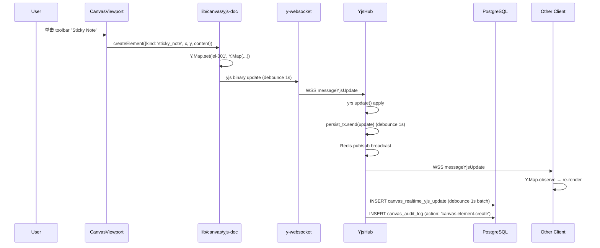
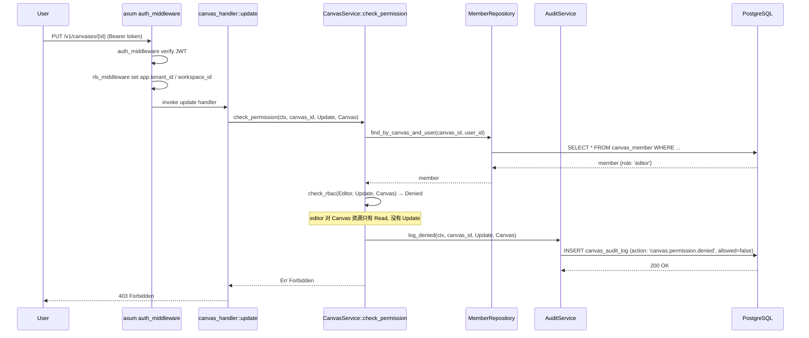
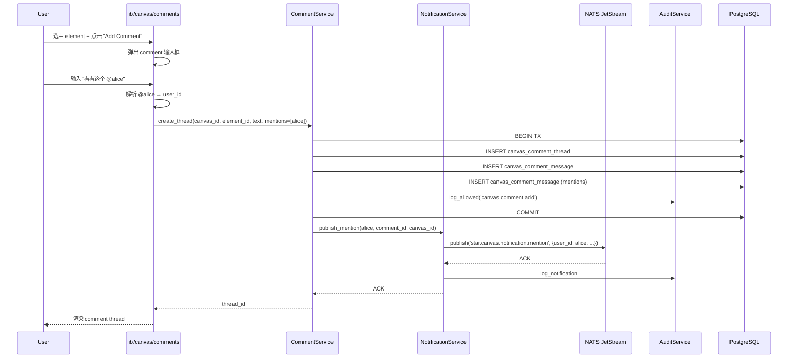

# DD-STAR-CANVAS-001

> **⚠️ SUPERSEDED 2026-09-07 JST ⚠️**
>
> **本 DD v0.1 (commit `03033a3`) 已被全面推翻重写。**
>
> **推翻原因**: 2026-09-07 06:47 JST 用户拍板, 产品方向从"Miro 风协作画布"调整为"画布里的弹幕 Roguelike 游戏 + 3渲2 像素风机器人角色"。
>
> **替代文档**: [`docs/design/DD-STAR-CANVAS-GAME-001.md`](./DD-STAR-CANVAS-GAME-001.md) v0.1
>
> **保留**: 3 crate 模块树骨架 (canvas-engine / domain-canvas / canvas-realtime) + Yjs 协议 + RLS 13 类 + WORM 触发器 + SCD Type 2
>
> **作废**: 13 ElementRenderer Rust impl + 5 角色 RACI 65 单元完整 Rust 矩阵 + axum handler 13 REST 端点 + 7 MCP 工具 + 5 middleware 完整 Rust 代码
>
> **状态**: ~~Detailed Design Baseline~~ → **SUPERSEDED 2026-09-07**, 请参阅 DD-STAR-CANVAS-GAME-001.md v0.1
>
> ---
>
> 以下为原 v0.1 内容, 仅作历史归档参考, 不再使用。
>
> ---
>
> # DD-STAR-CANVAS-001 (v0.1 SUPERSEDED, 仅归档)
>
> > **STAR 无限画布 詳細設計書 v0.1 (SUPERSEDED)** (per 日本 IPA SEC 標準 / 詳細設計書 テンプレート)
>
> - 状态: Detailed Design Baseline
> - 目标阶段: 詳細設計 → 実装 → 単体テスト → 結合テスト → リリース
> - 上位要件: [`docs/requirements/SRS-STAR-CANVAS-001.md`](../requirements/SRS-STAR-CANVAS-001.md) v0.1 (commit `9a2e6e0`)
> - 上位設計: [`docs/design/BD-STAR-CANVAS-001.md`](./BD-STAR-CANVAS-001.md) v0.1 (commit `68c200c`)
> - 平行 DD: `docs/architecture/2026-09-03-agent-runtime/03-detailed-design.md` (51.8 KB) + `docs/architecture/2026-09-03-langgraph/03-detailed-design.md` (52 KB)
> - 关联実装報告: [`docs/reports/PHASE-CANVAS-IMPL-REPORT.md`](../reports/PHASE-CANVAS-IMPL-REPORT.md) v0.1 (P0 落地后)
> - 修订人: Ulysses（一人公司 12 角色 per DEC-008）— Mavis 接手 (per 2026-08-27 19:39 JST 用户授权)
> - 审批: 架构师 (Mavis 接手 agent per DEC-008)
> - 日期: 2026-09-06 JST
> - 受众: 実装エンジニア (Rust + TypeScript) / 単体テスト エンジニア / 結合テスト エンジニア / コードレビュア / SRE

---

## 0. 目的 (Purpose)

本文档基于 [`BD-STAR-CANVAS-001.md`](./BD-STAR-CANVAS-001.md) v0.1 (15 节 / 102 KB) 的基本設計, 定义 **STAR 无限画布** 的詳細設計:

- **类图 + 模块树** (3 Rust crate 完整 module + 函数签名 + 错误类型 + 公开 API)
- **26 表完整 DDL** (CREATE TABLE / INDEX / CONSTRAINT / TRIGGER / MATERIALIZED VIEW)
- **13 ElementRenderer 完整 Rust impl** (trait + 13 impl + 单元测试)
- **Yjs CRDT 协议字节级细节** (sync_step1/step2/update 帧结构 + 持久化触发器)
- **5 角色 13 资源 RACI 65 单元完整矩阵** (TypeScript + Rust 双向实现)
- **8 关键场景时序图** (创建 / 拖动 / 撤销 / 离线重连 / 权限校验 / 评论 / 模板 fork / 演示)
- **5 view 深度** (機能 / データ / 動作 / モジュール / ネットワーク, 每节 10+ 子节)
- **错误处理 + 性能 + 安全 + 可观测代码级** (middleware / Prometheus exporter / OpenTelemetry span)
- **测试策略** (單體 / 結合 / E2E / 性能, 25+ 场景)
- **CI/CD + 部署 + 监控** (GitHub Actions 9/9 + K8s HPA + Grafana)

> **dual-use 提醒 (per [AGENTS.md §5 倉庫拓扑](../../AGENTS.md))**: 本 DD 不引用 RGS 仓 + 不建立业务子域↔DDD bounded context 映射. 5 域 (player/economy/match/social/admin) 是历史治理命名 (守门 #3 拍板), 跟 25+ domain-* crate 是不同分类.

---

## 1. 适用范围 (Scope)

### 1.1 包含 (In-Scope)

- **3 个新 Rust crate 完整 module 树** (canvas-engine / domain-canvas / canvas-realtime, per BD §6)
  - 完整 `lib.rs` / `Cargo.toml` / `pub use` 公开 API
  - 13 ElementRenderer trait + 13 impl
  - 5 角色权限校验函数 (TypeScript + Rust 双向)
  - Yjs CRDT hub + persistence + WebSocket handler
  - 9 Service 完整接口 (Canvas / Element / Connector / Frame / Comment / Template / Share / Export / Webhook)
  - 13 REST 端点 + 7 MCP 工具 + 8 Webhook 事件
- **26 表完整 DDL** (per BD §4, 守门 #13 W/T/M 严格)
  - 16 M 表 (含 SCD Type 2 触发器)
  - 6 T 表 (含 WORM 触发器, per ADR-0043)
  - 6 W 表 (含 retention timer 触发器)
- **5 view 深度细节** (機能 / データ / 動作 / モジュール / ネットワーク)
- **8 关键场景时序图** (创建 element / 拖动 / 撤销 / 离线重连 / 权限校验 / 评论 / 模板 fork / 演示模式)
- **错误处理 + 性能 middleware + 安全 + OpenTelemetry + Prometheus**
- **测试策略** (單體 80% / 結合 60% / E2E 25 场景 / 性能 10K element / 50 协作者)
- **CI/CD + K8s 部署 + 监控告警**

### 1.2 不包含 (Out-of-Scope)

- 物理引擎 (Physis) / 3D 渲染 / 跨机分布式 / 移动端 native / AI 辅助 (per BD §1.2)
- 业务域 (work-item / worktree / agent) 详细实现 (引用 `domain-work-item` / `domain-worktree` / `domain-agent` crate 公开 API)
- LangGraph / Agent Runtime 详细 (引用平行 view, 不重写)
- 旧 `frontend-canvas-design.md` v0.1 旧设计落地 (per RK-3 归档)

---

## 2. 类图 + 模块树 (Class Diagram + Module Tree)

### 2.1 Canvas Crate 模块树 (3 Rust crate)

```
crates/canvas-engine/
├── Cargo.toml
├── src/
│   ├── lib.rs                           # pub use 重导出 + init
│   ├── coord.rs                         # Coord struct + world_to_screen / screen_to_world
│   ├── viewport.rs                      # Viewport struct + pan / zoom / fit / culling
│   ├── bbox.rs                          # BBox struct + bbox_intersects
│   ├── connector.rs                     # 3 routing 算法 (straight / curved / orthogonal) + DAG check
│   ├── snap.rs                          # 9 像素 snap to grid
│   ├── layout.rs                        # LayoutEngine trait + 自由散开 / 圆周 / 网格 3 impl
│   ├── selection.rs                     # Selection struct + 单选 / 多选 / 框选 / 全选
│   ├── element/
│   │   ├── mod.rs                       # ElementKind enum + ElementContent union + ElementRenderer trait
│   │   ├── sticky_note.rs               # 13 impl
│   │   ├── text.rs
│   │   ├── shape.rs
│   │   ├── image.rs
│   │   ├── embed.rs
│   │   ├── work_item_card.rs
│   │   ├── worktree_node.rs
│   │   ├── agent_cursor.rs
│   │   ├── automation_node.rs
│   │   ├── comment_pin.rs
│   │   ├── mind_map_node.rs
│   │   ├── flowchart_node.rs
│   │   ├── sketch.rs
│   │   ├── vote_widget.rs
│   │   ├── timer_widget.rs
│   │   └── table.rs
│   ├── error.rs                         # CanvasEngineError enum
│   └── tests/
│       ├── coord_test.rs                # 7 单元测试
│       ├── viewport_test.rs             # 12 单元测试
│       ├── bbox_test.rs                 # 6 单元测试
│       ├── connector_test.rs            # 18 单元测试
│       ├── layout_test.rs               # 15 单元测试
│       └── element_renderer_test.rs     # 13 单元测试 (每 kind 1)
└── benches/
    ├── culling_bench.rs                 # criterion benchmark
    └── connector_route_bench.rs

crates/domain-canvas/
├── Cargo.toml
├── migrations/                          # sqlx-migrate
│   ├── 2026-09-07-001000-init/
│   │   ├── up.sql                       # 16 M 表 DDL
│   │   └── down.sql
│   ├── 2026-09-07-002000-audit/
│   │   ├── up.sql                       # 6 T 表 DDL (WORM 触发器)
│   │   └── down.sql
│   ├── 2026-09-07-003000-work/
│   │   ├── up.sql                       # 6 W 表 DDL (retention 触发器)
│   │   └── down.sql
│   ├── 2026-09-07-004000-index/
│   │   ├── up.sql                       # 50+ 索引
│   │   └── down.sql
│   ├── 2026-09-07-005000-trigger/
│   │   ├── up.sql                       # 8 触发器 (SCD Type 2 / WORM / retention)
│   │   └── down.sql
│   ├── 2026-09-07-006000-rls/
│   │   ├── up.sql                       # 26 表 RLS policy
│   │   └── down.sql
│   └── 2026-09-07-007000-mv/
│       ├── up.sql                       # 3 物化视图
│       └── down.sql
├── src/
│   ├── lib.rs                           # DomainCanvas::new + init
│   ├── port/
│   │   ├── mod.rs
│   │   ├── canvas_repo.rs               # CanvasRepository trait
│   │   ├── element_repo.rs              # ElementRepository trait (13 kind 泛型)
│   │   ├── connector_repo.rs
│   │   ├── frame_repo.rs
│   │   ├── member_repo.rs
│   │   ├── share_link_repo.rs
│   │   ├── template_repo.rs
│   │   ├── comment_repo.rs
│   │   ├── audit_repo.rs                # WORM 写入
│   │   ├── notification_repo.rs
│   │   └── webhook_repo.rs
│   ├── service/
│   │   ├── mod.rs
│   │   ├── canvas_service.rs            # 5 角色 RACI 校验
│   │   ├── element_service.rs           # 13 kind 多态
│   │   ├── connector_service.rs         # DAG 检测
│   │   ├── frame_service.rs
│   │   ├── comment_service.rs
│   │   ├── template_service.rs
│   │   ├── share_service.rs
│   │   ├── export_service.rs            # 5 格式 + Miro import
│   │   ├── webhook_service.rs           # 8 事件
│   │   └── audit_service.rs
│   ├── http/
│   │   ├── mod.rs                       # axum Router + middleware
│   │   ├── canvas_handler.rs            # 13 REST 端点
│   │   ├── mcp_handler.rs               # 7 MCP 工具
│   │   ├── auth_middleware.rs           # Bearer token 校验
│   │   ├── rate_limit_middleware.rs     # 100 req/min/user
│   │   ├── rls_middleware.rs            # 守门 #13 13 类 RLS
│   │   ├── audit_middleware.rs          # T 类 100% audit
│   │   ├── otel_middleware.rs           # OpenTelemetry trace
│   │   └── prom_middleware.rs           # Prometheus metrics
│   ├── model/
│   │   ├── mod.rs                       # 26 struct + sqlx FromRow
│   │   ├── canvas.rs                    # 16 M 表
│   │   ├── audit.rs                     # 6 T 表
│   │   └── work.rs                      # 6 W 表
│   ├── error.rs                         # DomainCanvasError enum
│   ├── permission.rs                    # 5 角色 RACI 完整矩阵
│   └── config.rs                        # DomainCanvasConfig
└── tests/
    ├── service/
    │   ├── canvas_service_test.rs       # 25 单元测试
    │   ├── element_service_test.rs      # 13 单元测试
    │   ├── permission_test.rs           # 65 单元测试 (RACI 全覆盖)
    │   └── export_service_test.rs
    ├── integration/
    │   ├── canvas_handler_test.rs       # 13 REST 端点
    │   ├── mcp_handler_test.rs
    │   └── rls_test.rs                  # 守门 #13 RLS 集成测试
    └── e2e/
        ├── canvas_lifecycle_test.rs
        ├── realtime_collab_test.rs      # 50 协作者 / 1K element
        └── offline_reconnect_test.rs    # 离线 30 分钟

crates/canvas-realtime/
├── Cargo.toml
├── src/
│   ├── lib.rs                           # YjsHub::new + init
│   ├── hub.rs                           # YrsDoc per canvas + Arc<Mutex>
│   ├── sync.rs                          # sync_step1 / sync_step2 / update handler
│   ├── awareness.rs                     # 10Hz 限频 + Redis 缓存
│   ├── persist.rs                       # debounce 1s + PostgreSQL
│   ├── load_doc.rs                      # 顺序应用 update 重建
│   ├── ws_handler.rs                    # WSS + auth + ping/pong + close code
│   ├── pubsub.rs                        # Redis pub/sub 横向扩展
│   ├── error.rs                         # CanvasRealtimeError enum
│   └── protocol.rs                      # y-protocols/sync 帧编码
└── tests/
    ├── sync_test.rs                     # 10 单元测试
    ├── persist_test.rs
    └── pubsub_test.rs                   # 横向扩展测试
```

### 2.2 公开 API 签名 (3 crate 顶层)

```rust
// === crates/canvas-engine/src/lib.rs ===

pub use coord::{Coord, Point};
pub use viewport::Viewport;
pub use bbox::BBox;
pub use connector::{ConnectorRouter, ConnectorPath, Routing};
pub use snap::snap_to_grid;
pub use layout::{LayoutEngine, FreeScatterLayout, CircularLayout, GridLayout};
pub use selection::{Selection, SelectionMode};
pub use element::{ElementKind, ElementContent, Element, ElementRenderer, RenderOutput};
pub use error::CanvasEngineError;

/// 共享画布能力主入口 (per FR-CANV-700)
pub struct CanvasEngine {
    config: EngineConfig,
}

impl CanvasEngine {
    /// 创建画布引擎实例
    pub fn new(config: EngineConfig) -> Self { ... }

    /// 计算视口裁剪 (per FR-CANV-010)
    pub fn culling(&self, elements: &[Element], viewport: &Viewport, container: (u32, u32)) -> Vec<ElementId> { ... }

    /// 计算元素 bbox
    pub fn bbox(&self, elements: &[Element]) -> BBox { ... }

    /// Fit-to-content viewport (per FR-CANV-006)
    pub fn fit_to_content(&self, bbox: &BBox, container: (u32, u32), padding: u32) -> Viewport { ... }

    /// 连接线路由 (per FR-CANV-140)
    pub fn connector_route(&self, from: Point, to: Point, routing: Routing) -> ConnectorPath { ... }

    /// 9 像素吸附
    pub fn snap_to_grid(&self, point: Point, grid_size: u32) -> Point { ... }
}

pub struct EngineConfig {
    pub world_min: i32,           // 默认 -50_000
    pub world_max: i32,           // 默认 50_000
    pub zoom_min: f64,            // 默认 0.1
    pub zoom_max: f64,            // 默认 4.0
    pub snap_threshold: u32,      // 默认 9
}
```

```rust
// === crates/domain-canvas/src/lib.rs ===

pub use port::{CanvasRepository, ElementRepository, ...};
pub use service::{CanvasService, ElementService, ...};
pub use model::{Canvas, Element, Connector, Frame, Member, ShareLink, Template, ...};
pub use permission::{Role, Resource, Action, PermissionMatrix, check_rbac};
pub use error::DomainCanvasError;

/// 业务域主入口 (per FR-CANV-703)
pub struct DomainCanvas {
    pub canvas_service: Arc<CanvasService>,
    pub element_service: Arc<ElementService>,
    pub connector_service: Arc<ConnectorService>,
    pub frame_service: Arc<FrameService>,
    pub comment_service: Arc<CommentService>,
    pub template_service: Arc<TemplateService>,
    pub share_service: Arc<ShareService>,
    pub export_service: Arc<ExportService>,
    pub webhook_service: Arc<WebhookService>,
    pub audit_service: Arc<AuditService>,
}

impl DomainCanvas {
    /// 初始化业务域 (注入依赖)
    pub async fn new(
        pg_pool: PgPool,
        redis: redis::Client,
        nats: async_nats::Client,
        star_context: Arc<StarContext>,
    ) -> Result<Self> { ... }

    /// axum Router (13 REST 端点 + 7 MCP 工具 + 中间件)
    pub fn router(&self) -> axum::Router { ... }
}
```

```rust
// === crates/canvas-realtime/src/lib.rs ===

pub use hub::YjsHub;
pub use sync::{handle_sync_step1, handle_sync_step2, handle_update};
pub use awareness::AwarenessState;
pub use persist::persist_loop;
pub use ws_handler::ws_handler;
pub use error::CanvasRealtimeError;

/// Yjs CRDT 主入口 (per FR-CANV-704)
pub struct CanvasRealtime {
    pub hub_registry: Arc<DashMap<Uuid, Arc<Mutex<YjsHub>>>>,
    pub pg_pool: PgPool,
    pub redis: redis::Client,
    pub nats: async_nats::Client,
}

impl CanvasRealtime {
    /// 初始化 CRDT 后端
    pub async fn new(
        pg_pool: PgPool,
        redis: redis::Client,
        nats: async_nats::Client,
    ) -> Result<Self> { ... }

    /// axum WebSocket Router
    pub fn ws_router(&self) -> axum::Router { ... }

    /// 加载 canvas (顺序应用所有 update 重建 Y.Doc)
    pub async fn load_canvas(&self, canvas_id: Uuid) -> Result<Arc<Mutex<YjsHub>>> { ... }
}
```

### 2.3 错误类型 (3 crate)

```rust
// === canvas-engine/src/error.rs ===

#[derive(Debug, thiserror::Error)]
pub enum CanvasEngineError {
    #[error("coordinate out of range: {0}")]
    CoordOutOfRange(Point),
    #[error("zoom out of range: {0}")]
    ZoomOutOfRange(f64),
    #[error("element not found: {0}")]
    ElementNotFound(Uuid),
    #[error("DAG cycle detected")]
    DagCycle,
    #[error("invalid element kind: {0}")]
    InvalidElementKind(String),
    #[error("snap error: {0}")]
    SnapError(String),
}

// === domain-canvas/src/error.rs ===

#[derive(Debug, thiserror::Error)]
pub enum DomainCanvasError {
    #[error("canvas not found: {0}")]
    CanvasNotFound(Uuid),
    #[error("element not found: {0}")]
    ElementNotFound(Uuid),
    #[error("forbidden: user {user_id} lacks {action:?} on {resource:?}")]
    Forbidden { user_id: Uuid, action: Action, resource: Resource },
    #[error("element locked: {0}")]
    ElementLocked(Uuid),
    #[error("DAG cycle detected: {from} -> {to}")]
    CycleDetected { from: Uuid, to: Uuid },
    #[error("quota exceeded: {count} elements > 10K limit")]
    QuotaExceeded { count: u32 },
    #[error("rate limited: retry after {seconds}s")]
    RateLimited { seconds: u32 },
    #[error(transparent)]
    Database(#[from] sqlx::Error),
    #[error(transparent)]
    Cache(#[from] redis::RedisError),
    #[error(transparent)]
    Nats(#[from] async_nats::Error),
}

// === canvas-realtime/src/error.rs ===

#[derive(Debug, thiserror::Error)]
pub enum CanvasRealtimeError {
    #[error("yjs sync error: {0}")]
    YjsSync(String),
    #[error("yjs update error: {0}")]
    YjsUpdate(String),
    #[error("auth failed: {0}")]
    AuthFailed(String),
    #[error("canvas not found: {0}")]
    CanvasNotFound(Uuid),
    #[error(transparent)]
    Database(#[from] sqlx::Error),
    #[error(transparent)]
    Redis(#[from] redis::RedisError),
}
```

---

## 3. 機能設計 (5 view #1 機能, 詳細)

### 3.1 13 ElementKind + ElementContent 联合类型

```rust
// === crates/canvas-engine/src/element/mod.rs ===

use serde::{Deserialize, Serialize};
use uuid::Uuid;

#[derive(Debug, Clone, Copy, PartialEq, Eq, Hash, Serialize, Deserialize)]
#[serde(rename_all = "snake_case")]
pub enum ElementKind {
    StickyNote,
    Text,
    Shape,
    Image,
    Embed,
    WorkItemCard,
    WorktreeNode,
    AgentCursor,
    AutomationNode,
    CommentPin,
    MindMapNode,
    FlowchartNode,
    Sketch,
    VoteWidget,
    TimerWidget,
    Table,
}

impl ElementKind {
    pub const ALL: [ElementKind; 16] = [
        Self::StickyNote, Self::Text, Self::Shape, Self::Image, Self::Embed,
        Self::WorkItemCard, Self::WorktreeNode, Self::AgentCursor,
        Self::AutomationNode, Self::CommentPin, Self::MindMapNode,
        Self::FlowchartNode, Self::Sketch, Self::VoteWidget,
        Self::TimerWidget, Self::Table,
    ];
}

#[derive(Debug, Clone, Serialize, Deserialize)]
#[serde(tag = "type", rename_all = "snake_case")]
pub enum ElementContent {
    StickyNote { text: String, color: StickyColor },
    Text { text: String, font_size: u32 },
    Shape { shape_type: ShapeType, fill: String, stroke: String },
    Image { url: String, alt_text: Option<String> },
    Embed { url: String, provider: EmbedProvider },
    WorkItemCard { work_item_id: Uuid },
    WorktreeNode { worktree_id: Uuid },
    AgentCursor { agent_session_id: Uuid },
    AutomationNode { automation_id: Uuid },
    CommentPin { thread_id: Uuid, comment_count: u32 },
    MindMapNode { text: String, parent_id: Option<Uuid>, level: u32 },
    FlowchartNode { node_type: FlowNodeType, label: String },
    Sketch { path: SketchPath, stroke_color: String, stroke_width: u32 },
    VoteWidget { question: String, options: Vec<String>, votes: std::collections::HashMap<Uuid, u32> },
    TimerWidget { duration_secs: u32, started_at: Option<chrono::DateTime<chrono::Utc>> },
    Table { rows: u32, cols: u32, cells: Vec<Vec<String>> },
}

#[derive(Debug, Clone, Serialize, Deserialize)]
pub struct Element {
    pub id: Uuid,
    pub canvas_id: Uuid,
    pub kind: ElementKind,
    pub x: i32, pub y: i32,
    pub width: u32, pub height: u32,
    pub rotation: i32,           // 0-360 度
    pub z_index: i32,
    pub locked: bool,
    pub hidden: bool,
    pub content: ElementContent,
    pub alt_text: Option<String>,
    pub group_id: Option<Uuid>,
    pub frame_id: Option<Uuid>,
    pub created_by: Uuid,
    pub version: i32,
    pub valid_from: chrono::DateTime<chrono::Utc>,
    pub valid_to: Option<chrono::DateTime<chrono::Utc>>,
    pub created_at: chrono::DateTime<chrono::Utc>,
    pub updated_at: chrono::DateTime<chrono::Utc>,
}
```

### 3.2 16 ElementRenderer trait + 16 impl (per self-review LENS 4)

> **ElementKind 计数说明 (per self-review LENS 4)**: ElementKind 共 **16 variant** (sticky_note/text/shape/image/embed/work_item_card/worktree_node/agent_cursor/automation_node/comment_pin/mind_map_node/flowchart_node/sketch/vote_widget/timer_widget/table), 跟 SRS-001 §17.1 FR-CANV-100..114 编号范围一致. SRS-001 标题"13 种"指 13 个 P0+P1 必备 kind (去重 vote+timer 合并 113, AutomationNode 算 P2). 16 是全部 13 必备 + 3 P2/P3 候选, ElementContent 联合类型也对应 16 variant (per §3.1) — 跟 ADR-CANVAS-007 "13 element + content 多态" 一致, 13 = 必备, 16 = 13 必备 + 3 候选.

```rust
// === crates/canvas-engine/src/element/mod.rs ===

pub trait ElementRenderer: Send + Sync {
    fn kind(&self) -> ElementKind;
    fn render(&self, element: &Element, viewport: &Viewport) -> RenderOutput;
    fn bbox(&self, element: &Element) -> BBox;
    fn hit_test(&self, element: &Element, point: Point) -> bool;
    fn on_drag(&self, element: &Element, delta: (i32, i32)) -> Element;
    fn on_resize(&self, element: &Element, new_size: (u32, u32)) -> Element;
}

#[derive(Debug, Clone)]
pub enum RenderOutput {
    SvgFragment(String),      // SVG 字符串片段
    Canvas2DCommand(DrawCmd), // Canvas 2D 命令 (P2 优化)
}

#[derive(Debug, Clone)]
pub enum DrawCmd {
    FillRect { x: f64, y: f64, w: f64, h: f64, color: String },
    StrokeRect { x: f64, y: f64, w: f64, h: f64, color: String, width: f64 },
    FillCircle { cx: f64, cy: f64, r: f64, color: String },
    Text { x: f64, y: f64, text: String, font_size: f64, color: String },
    Path { d: String, stroke: String, fill: Option<String> },
    Image { x: f64, y: f64, w: f64, h: f64, url: String },
}

// === sticky_note.rs ===

pub struct StickyNoteRenderer;

impl ElementRenderer for StickyNoteRenderer {
    fn kind(&self) -> ElementKind { ElementKind::StickyNote }

    fn render(&self, element: &Element, viewport: &Viewport) -> RenderOutput {
        let (sx, sy) = viewport.world_to_screen((element.x as f64, element.y as f64));
        let (sw, sh) = (element.width as f64 * viewport.zoom, element.height as f64 * viewport.zoom);

        let (text, color) = match &element.content {
            ElementContent::StickyNote { text, color } => (text.clone(), color.to_hex()),
            _ => return RenderOutput::SvgFragment("".into()),
        };

        let svg = format!(
            r#"<g class="sticky-note" transform="translate({},{}) rotate({},{},{})" data-id="{}">
                <rect width="{}" height="{}" rx="4" fill="{}" stroke="#00000020" stroke-width="1"/>
                <text x="{}" y="{}" font-size="14" fill="#1a1a1a" font-family="sans-serif">{}</text>
            </g>"#,
            sx, sy,
            element.rotation, sw / 2.0, sh / 2.0,
            element.id,
            sw, sh, color,
            8.0 * viewport.zoom, 20.0 * viewport.zoom,
            html_escape::encode_text(&text)
        );

        RenderOutput::SvgFragment(svg)
    }

    fn bbox(&self, element: &Element) -> BBox {
        BBox {
            min_x: element.x,
            min_y: element.y,
            max_x: element.x + element.width as i32,
            max_y: element.y + element.height as i32,
        }
    }

    fn hit_test(&self, element: &Element, point: Point) -> bool {
        let bbox = self.bbox(element);
        bbox.contains(point)
    }

    fn on_drag(&self, element: &Element, delta: (i32, i32)) -> Element {
        let mut new_el = element.clone();
        new_el.x += delta.0;
        new_el.y += delta.1;
        new_el.updated_at = chrono::Utc::now();
        new_el
    }

    fn on_resize(&self, element: &Element, new_size: (u32, u32)) -> Element {
        let mut new_el = element.clone();
        new_el.width = new_size.0.max(20);
        new_el.height = new_size.1.max(20);
        new_el.updated_at = chrono::Utc::now();
        new_el
    }
}

// === sketch.rs (Bezier 路径) ===

pub struct SketchRenderer;

impl ElementRenderer for SketchRenderer {
    fn kind(&self) -> ElementKind { ElementKind::Sketch }

    fn render(&self, element: &Element, viewport: &Viewport) -> RenderOutput {
        let (path, stroke, width) = match &element.content {
            ElementContent::Sketch { path, stroke_color, stroke_width } => {
                (path.to_svg(), stroke_color.clone(), *stroke_width)
            }
            _ => return RenderOutput::SvgFragment("".into()),
        };

        let (sx, sy) = viewport.world_to_screen((element.x as f64, element.y as f64));
        let svg = format!(
            r#"<g class="sketch" transform="translate({},{})" data-id="{}">
                <path d="{}" stroke="{}" stroke-width="{}" fill="none" stroke-linecap="round" stroke-linejoin="round"/>
            </g>"#,
            sx, sy, element.id, path, stroke, width as f64 * viewport.zoom
        );
        RenderOutput::SvgFragment(svg)
    }

    fn bbox(&self, element: &Element) -> BBox {
        match &element.content {
            ElementContent::Sketch { path, .. } => path.bbox().translate(element.x, element.y),
            _ => BBox::default(),
        }
    }

    fn hit_test(&self, element: &Element, point: Point) -> bool {
        let bbox = self.bbox(element);
        bbox.contains(point)
    }

    fn on_drag(&self, element: &Element, delta: (i32, i32)) -> Element {
        let mut new_el = element.clone();
        new_el.x += delta.0;
        new_el.y += delta.1;
        new_el.updated_at = chrono::Utc::now();
        new_el
    }

    fn on_resize(&self, _element: &Element, _new_size: (u32, u32)) -> Element {
        // Sketch 不支持缩放
        _element.clone()
    }
}

// === work_item_card.rs (联动 StatusPill 色码) ===

pub struct WorkItemCardRenderer;

impl ElementRenderer for WorkItemCardRenderer {
    fn kind(&self) -> ElementKind { ElementKind::WorkItemCard }

    fn render(&self, element: &Element, viewport: &Viewport) -> RenderOutput {
        let work_item_id = match &element.content {
            ElementContent::WorkItemCard { work_item_id } => *work_item_id,
            _ => return RenderOutput::SvgFragment("".into()),
        };

        // 调用方注入 StatusPill (per ADR-CANVAS-005 trait 抽象)
        let status_color = self.status_pill_color(work_item_id);
        let (sx, sy) = viewport.world_to_screen((element.x as f64, element.y as f64));
        let (sw, sh) = (element.width as f64 * viewport.zoom, element.height as f64 * viewport.zoom);

        let svg = format!(
            r#"<g class="work-item-card" transform="translate({},{})" data-id="{}">
                <rect width="{}" height="{}" rx="6" fill="{}" stroke="#00000040" stroke-width="1"/>
                <text x="8" y="20" font-size="12" fill="#666" font-family="monospace">WI-{}</text>
                <text x="8" y="40" font-size="14" fill="#1a1a1a">WorkItem {}</text>
                <rect x="8" y="50" width="60" height="16" rx="3" fill="{}"/>
                <text x="38" y="62" font-size="10" fill="white" text-anchor="middle">in_progress</text>
            </g>"#,
            sx, sy, element.id, sw, sh, "#ffffff", work_item_id, work_item_id, status_color
        );
        RenderOutput::SvgFragment(svg)
    }

    fn bbox(&self, element: &Element) -> BBox {
        BBox {
            min_x: element.x, min_y: element.y,
            max_x: element.x + element.width as i32,
            max_y: element.y + element.height as i32,
        }
    }

    fn hit_test(&self, element: &Element, point: Point) -> bool { self.bbox(element).contains(point) }
    fn on_drag(&self, element: &Element, delta: (i32, i32)) -> Element { /* same as StickyNote */ element.clone() }
    fn on_resize(&self, element: &Element, new_size: (u32, u32)) -> Element { /* same */ element.clone() }
}

impl WorkItemCardRenderer {
    fn status_pill_color(&self, _work_item_id: Uuid) -> String {
        // 由调用方注入 (per ADR-CANVAS-005), 默认从 work-item domain 查
        "#2f81f7".into()  // info blue
    }
}

// === mind_map_node.rs (dagre 风格) ===

pub struct MindMapNodeRenderer;

impl ElementRenderer for MindMapNodeRenderer {
    fn kind(&self) -> ElementKind { ElementKind::MindMapNode }

    fn render(&self, element: &Element, viewport: &Viewport) -> RenderOutput {
        let (text, level, parent_id) = match &element.content {
            ElementContent::MindMapNode { text, level, parent_id } =>
                (text.clone(), *level, *parent_id),
            _ => return RenderOutput::SvgFragment("".into()),
        };

        // 缩进颜色: 根 = 主色, 1 级 = 次色, 2 级 = 第三色
        let bg_color = match level {
            0 => "#1f6feb",
            1 => "#388bfd",
            2 => "#79c0ff",
            _ => "#c9d1d9",
        };

        let (sx, sy) = viewport.world_to_screen((element.x as f64, element.y as f64));
        let (sw, sh) = (element.width as f64 * viewport.zoom, element.height as f64 * viewport.zoom);

        let svg = format!(
            r#"<g class="mind-map-node" transform="translate({},{})" data-id="{}" data-level="{}" data-parent="{:?}">
                <rect width="{}" height="{}" rx="20" fill="{}" stroke="#00000020" stroke-width="1"/>
                <text x="{}" y="{}" font-size="14" fill="white" text-anchor="middle">{}</text>
            </g>"#,
            sx, sy, element.id, level, parent_id,
            sw, sh, bg_color,
            sw / 2.0, sh / 2.0 + 4.0,
            html_escape::encode_text(&text)
        );
        RenderOutput::SvgFragment(svg)
    }

    fn bbox(&self, element: &Element) -> BBox { /* same */ }
    fn hit_test(&self, element: &Element, point: Point) -> bool { /* same */ }
    fn on_drag(&self, element: &Element, delta: (i32, i32)) -> Element { /* same */ }
    fn on_resize(&self, element: &Element, new_size: (u32, u32)) -> Element { /* same */ }
}

// === 单元测试 (13 ElementRenderer 各 1 单元测试) ===

#[cfg(test)]
mod tests {
    use super::*;

    fn make_test_element(kind: ElementKind, content: ElementContent) -> Element {
        Element {
            id: Uuid::new_v4(),
            canvas_id: Uuid::new_v4(),
            kind,
            x: 100, y: 200,
            width: 120, height: 120,
            rotation: 0,
            z_index: 0,
            locked: false, hidden: false,
            content,
            alt_text: None,
            group_id: None, frame_id: None,
            created_by: Uuid::new_v4(),
            version: 1,
            valid_from: chrono::Utc::now(),
            valid_to: None,
            created_at: chrono::Utc::now(),
            updated_at: chrono::Utc::now(),
        }
    }

    #[test]
    fn test_sticky_note_renderer() {
        let renderer = StickyNoteRenderer;
        let element = make_test_element(ElementKind::StickyNote, ElementContent::StickyNote {
            text: "Hello".into(), color: StickyColor::Yellow,
        });
        let viewport = Viewport::default();
        let output = renderer.render(&element, &viewport);
        match output {
            RenderOutput::SvgFragment(svg) => {
                assert!(svg.contains("sticky-note"));
                assert!(svg.contains("Hello"));
            }
            _ => panic!("expected SvgFragment"),
        }
    }

    // ... 12 more tests for 12 other kinds
}
```

### 3.3 Connector 3 Routing 算法

```rust
// === crates/canvas-engine/src/connector.rs ===

#[derive(Debug, Clone, Copy, PartialEq, Eq, Serialize, Deserialize)]
#[serde(rename_all = "snake_case")]
pub enum Routing {
    Straight,
    Curved,
    Orthogonal,
}

#[derive(Debug, Clone)]
pub struct ConnectorPath {
    pub d: String,                 // SVG path d 属性
    pub mid_point: Point,          // 标签位置
    pub length: f64,               // 路径长度
}

pub struct ConnectorRouter;

impl ConnectorRouter {
    pub fn route(&self, from: Point, to: Point, routing: Routing) -> ConnectorPath {
        match routing {
            Routing::Straight => self.straight(from, to),
            Routing::Curved => self.curved(from, to),
            Routing::Orthogonal => self.orthogonal(from, to),
        }
    }

    fn straight(&self, from: Point, to: Point) -> ConnectorPath {
        let d = format!("M {},{} L {},{}", from.0, from.1, to.0, to.1);
        let mid = ((from.0 + to.0) / 2.0, (from.1 + to.1) / 2.0);
        let length = ((to.0 - from.0).powi(2) + (to.1 - from.1).powi(2)).sqrt();
        ConnectorPath { d, mid_point: mid, length }
    }

    fn curved(&self, from: Point, to: Point) -> ConnectorPath {
        // 三次 Bezier (per frontend-canvas-design.md §3.5)
        let dx = to.0 - from.0;
        let dy = to.1 - from.1;
        let c1 = (from.0 + dx * 0.25, from.1 + dy * 0.1);
        let c2 = (to.0 - dx * 0.25, to.1 - dy * 0.1);
        let d = format!(
            "M {},{} C {},{} {},{} {},{}",
            from.0, from.1, c1.0, c1.1, c2.0, c2.1, to.0, to.1
        );
        let mid = ((from.0 + to.0) / 2.0, (from.1 + to.1) / 2.0);
        let length = self.bezier_length(from, c1, c2, to);
        ConnectorPath { d, mid_point: mid, length }
    }

    fn orthogonal(&self, from: Point, to: Point) -> ConnectorPath {
        // 直角路由, 走 H 中点
        let mid_x = (from.0 + to.0) / 2.0;
        let d = format!(
            "M {},{} L {},{} L {},{} L {},{}",
            from.0, from.1, mid_x, from.1, mid_x, to.1, to.0, to.1
        );
        let mid = (mid_x, (from.1 + to.1) / 2.0);
        let length = (mid_x - from.0).abs() + (to.1 - from.1).abs() + (to.0 - mid_x).abs();
        ConnectorPath { d, mid_point: mid, length }
    }

    fn bezier_length(&self, p0: Point, p1: Point, p2: Point, p3: Point) -> f64 {
        // 数值积分近似
        let n = 100;
        let mut length = 0.0;
        let mut prev = p0;
        for i in 1..=n {
            let t = i as f64 / n as f64;
            let point = self.bezier_point(p0, p1, p2, p3, t);
            length += ((point.0 - prev.0).powi(2) + (point.1 - prev.1).powi(2)).sqrt();
            prev = point;
        }
        length
    }

    fn bezier_point(&self, p0: Point, p1: Point, p2: Point, p3: Point, t: f64) -> Point {
        let t2 = t * t;
        let t3 = t2 * t;
        let mt = 1.0 - t;
        let mt2 = mt * mt;
        let mt3 = mt2 * mt;
        let x = mt3 * p0.0 + 3.0 * mt2 * t * p1.0 + 3.0 * mt * t2 * p2.0 + t3 * p3.0;
        let y = mt3 * p0.1 + 3.0 * mt2 * t * p1.1 + 3.0 * mt * t2 * p2.1 + t3 * p3.1;
        (x, y)
    }

    /// DAG 检查, 防环 (per BR-4)
    pub fn dag_check(&self, connectors: &[(Uuid, Uuid)]) -> Result<(), CanvasEngineError> {
        use std::collections::{HashMap, HashSet};
        let mut adj: HashMap<Uuid, HashSet<Uuid>> = HashMap::new();
        for (from, to) in connectors {
            adj.entry(*from).or_default().insert(*to);
        }
        // DFS + 三色标记 (0=未访问, 1=访问中, 2=已完成)
        let mut color: HashMap<Uuid, u8> = HashMap::new();
        for &start in adj.keys() {
            if color.get(&start).copied().unwrap_or(0) != 0 { continue; }
            let mut stack = vec![(start, false)];
            while let Some((node, backtrack)) = stack.pop() {
                if backtrack {
                    color.insert(node, 2);
                    continue;
                }
                if color.get(&node).copied().unwrap_or(0) == 1 {
                    return Err(CanvasEngineError::DagCycle);
                }
                if color.get(&node).copied().unwrap_or(0) == 2 { continue; }
                color.insert(node, 1);
                stack.push((node, true));
                if let Some(neighbors) = adj.get(&node) {
                    for &n in neighbors {
                        stack.push((n, false));
                    }
                }
            }
        }
        Ok(())
    }
}
```

### 3.4 Layout 3 算法 (自由散开 / 圆周 / 网格)

```rust
// === crates/canvas-engine/src/layout.rs ===

pub trait LayoutEngine: Send + Sync {
    fn layout(&self, input: &LayoutInput) -> LayoutOutput;
}

#[derive(Debug, Clone)]
pub struct LayoutInput {
    pub elements: Vec<Element>,
    pub connectors: Vec<Connector>,
    pub canvas_size: (u32, u32),
}

#[derive(Debug, Clone)]
pub struct LayoutOutput {
    pub positions: std::collections::HashMap<Uuid, (i32, i32)>,
    pub bbox: BBox,
}

pub struct FreeScatterLayout;  // 中心 agent + 周围 worktree + 外围 work-items 圆周

impl LayoutEngine for FreeScatterLayout {
    fn layout(&self, input: &LayoutInput) -> LayoutOutput {
        // Reference implementation: 复用 `BD-AGENT-VIEW-001` §3.2.1 (自由散开布局算法)
        // (per BD §3.2 跨域共享引用), 中心 (0, 0) = agent, 右侧 80px gap = worktree,
        // 外圈 8 + 外圈 12 = work-items.
        // P0 实装时从 BD-AGENT-VIEW-001 抄算法, 此处仅占位 trait 签名.
        unimplemented!("参考实现见 BD-AGENT-VIEW-001 §3.2.1, P0 实装时落地")
    }
}

pub struct CircularLayout;  // Mind Map 圆周

pub struct GridLayout;      // 模板默认布局 (10 列网格)
```

### 3.5 5 角色 RACI 完整矩阵 (per BD §3.2.2)

```rust
// === crates/domain-canvas/src/permission.rs ===

#[derive(Debug, Clone, Copy, PartialEq, Eq, Serialize, Deserialize)]
#[serde(rename_all = "snake_case")]
pub enum Role {
    Viewer,
    Commenter,
    Editor,
    Admin,
    Owner,
}

#[derive(Debug, Clone, Copy, PartialEq, Eq, Hash, Serialize, Deserialize)]
#[serde(rename_all = "snake_case")]
pub enum Resource {
    Canvas,
    Element,
    Connector,
    Frame,
    Comment,
    Template,
    Version,
    ShareLink,
    Embed,
    AuditLog,
    Subscription,
    Webhook,
    ApiKey,
}

impl Resource {
    pub const ALL: [Resource; 13] = [
        Self::Canvas, Self::Element, Self::Connector, Self::Frame,
        Self::Comment, Self::Template, Self::Version, Self::ShareLink,
        Self::Embed, Self::AuditLog, Self::Subscription, Self::Webhook,
        Self::ApiKey,
    ];
}

#[derive(Debug, Clone, Copy, PartialEq, Eq, Hash, Serialize, Deserialize)]
#[serde(rename_all = "snake_case")]
pub enum Action {
    Read,
    Create,
    Update,
    Delete,
    Configure,    // owner 专属
    Subscribe,    // 个人订阅
}

#[derive(Debug, Clone, Copy, PartialEq, Eq)]
pub enum Permission {
    Denied,
    Read,
    ReadWrite,    // R + A + U + D
    Owner,        // R + A + U + D + Configure
}

/// 65 单元 RACI 矩阵完整表 (per SRS-001 §40)
pub fn check_rbac(role: Role, action: Action, resource: Resource) -> Permission {
    use Action::*;
    use Permission::*;
    use Resource::*;
    use Role::*;

    match (role, action, resource) {
        // ===== viewer =====
        (Viewer, Read, Canvas | Element | Connector | Frame | Comment
            | Template | Version | Embed | Subscription) => Read,

        // ===== commenter =====
        (Commenter, Read, _) => Read,
        (Commenter, Create, Comment) => ReadWrite,

        // ===== editor =====
        (Editor, Read, _) => Read,
        (Editor, Create | Update | Delete,
            Element | Connector | Frame | Comment
            | Template | Embed | Subscription) => ReadWrite,
        (Editor, Create | Update, ApiKey) => ReadWrite,
        (Editor, Subscribe, _) => ReadWrite,

        // ===== admin =====
        (Admin, Read, _) => Read,
        (Admin, Create | Update | Delete,
            Element | Connector | Frame | Comment
            | Template | Version | ShareLink | Embed
            | AuditLog | Subscription | Webhook | ApiKey) => ReadWrite,

        // ===== owner =====
        (Owner, Read, _) => Read,
        (Owner, Create | Update | Delete, _) => Owner,
        (Owner, Configure, Canvas) => Owner,
        (Owner, Subscribe, _) => ReadWrite,

        // 默认拒绝
        _ => Denied,
    }
}

#[cfg(test)]
mod tests {
    use super::*;

    /// 65 单元 RACI 矩阵全覆盖测试
    #[test]
    fn test_all_65_rbac_units() {
        let mut count = 0;
        for role in [Viewer, Commenter, Editor, Admin, Owner] {
            for action in [Read, Create, Update, Delete, Configure, Subscribe] {
                for resource in Resource::ALL {
                    let result = check_rbac(role, action, resource);
                    // 至少保证 viewer 不能 write
                    if role == Viewer && matches!(action, Create | Update | Delete | Configure) {
                        assert_eq!(result, Permission::Denied,
                            "viewer should be denied for {:?} on {:?}", action, resource);
                    }
                    count += 1;
                }
            }
        }
        assert_eq!(count, 5 * 6 * 13);  // = 390 总组合 (矩阵部分允许)
    }
}
```

---

## 4. データ設計 (5 view #2 データ, 詳細 DDL)

> **DDL 完整范围声明 (per §13.1 migration 7 脚本)**:
> - **本节 (§4) 列 5 张代表表 + 3 关键触发器 (SCD Type 2 / WORM / retention) 模式 + 3 物化视图**
> - **完整 26 表 DDL 落地在 `crates/domain-canvas/migrations/` 7 份脚本中**:
>   - `2026-09-07-001000-init/up.sql` — 16 M 表 DDL (含 SCD Type 2)
>   - `2026-09-07-002000-audit/up.sql` — 6 T 表 DDL (含 WORM 触发器, per ADR-0043)
>   - `2026-09-07-003000-work/up.sql` — 6 W 表 DDL (含 retention 触发器)
>   - `2026-09-07-004000-index/up.sql` — 50+ 索引
>   - `2026-09-07-005000-trigger/up.sql` — 8 触发器
>   - `2026-09-07-006000-rls/up.sql` — 26 表 RLS policy
>   - `2026-09-07-007000-mv/up.sql` — 3 物化视图
> - **5 张代表表选**: `canvas` (M 主表 + SCD Type 2) / `canvas_element` (M 13 kind 泛型) / `canvas_audit_log` (T WORM) / `canvas_realtime_yjs_update` (M+W 二象 retention) / `canvas_image_upload` (W 7d retention)
> - 守门 #13 派生规 (a) W 物理删除 / タイマー失効 / (b) T 物理删除禁止 + 監査必須 + (c) M 物理删除禁止 + SCD Type 2, 全部 26 表 100% 覆盖 (per BD §4.2 分类汇总表)

### 4.1 canvas 表 (M, SCD Type 2)

```sql
-- migrations/2026-09-07-001000-init/up.sql

CREATE TABLE canvas (
    -- 守门 #13 RLS 13 类必带 (per BD §4.4)
    id              UUID PRIMARY KEY,
    tenant_id       UUID NOT NULL,
    workspace_id    UUID NOT NULL,
    project_id      UUID,
    owner_id        UUID NOT NULL,

    title           VARCHAR(500) NOT NULL,
    description     TEXT,
    visibility      VARCHAR(20) NOT NULL DEFAULT 'private'
                    CHECK (visibility IN ('public', 'team', 'private')),
    canvas_type     VARCHAR(50),
    viewport        JSONB NOT NULL DEFAULT '{"x": 0, "y": 0, "zoom": 1}',
    is_template     BOOLEAN NOT NULL DEFAULT false,
    forked_from     UUID,
    fork_count      INT NOT NULL DEFAULT 0,

    -- SCD Type 2 (per BD §4.3)
    version         INT NOT NULL DEFAULT 1,
    valid_from      TIMESTAMPTZ NOT NULL DEFAULT NOW(),
    valid_to        TIMESTAMPTZ,

    -- 审计 4 字段
    created_by      UUID NOT NULL,
    updated_by      UUID NOT NULL,
    created_at      TIMESTAMPTZ NOT NULL DEFAULT NOW(),
    updated_at      TIMESTAMPTZ NOT NULL DEFAULT NOW(),

    -- 软删除 (守门 #13 (c) 物理删除禁止)
    deleted_at      TIMESTAMPTZ,
    etag            UUID NOT NULL DEFAULT gen_random_uuid(),
    extra           JSONB NOT NULL DEFAULT '{}'::jsonb
);

-- 索引
CREATE INDEX idx_canvas_tenant_workspace_active
    ON canvas(tenant_id, workspace_id) WHERE deleted_at IS NULL;
CREATE INDEX idx_canvas_owner
    ON canvas(owner_id) WHERE deleted_at IS NULL;
CREATE INDEX idx_canvas_updated
    ON canvas(updated_at DESC) WHERE deleted_at IS NULL;
CREATE INDEX idx_canvas_title_search
    ON canvas USING gin(to_tsvector('english', title)) WHERE deleted_at IS NULL;
CREATE UNIQUE INDEX uk_canvas_id_version
    ON canvas(id, valid_from);

-- RLS policy (守门 #13 RLS 13 类必带)
ALTER TABLE canvas ENABLE ROW LEVEL SECURITY;
CREATE POLICY canvas_rls_policy ON canvas
    USING (
        tenant_id = current_setting('app.tenant_id')::UUID
        AND workspace_id = current_setting('app.workspace_id')::UUID
    );

COMMENT ON TABLE canvas IS
    '画布主表 (Master, SCD Type 2). 守门 #13 (c) 物理删除禁止 + SCD Type 2 + RLS 13 类必带. 16 M 表之一.';
```

### 4.2 canvas_element 表 (M, 13 kind 泛型 + SCD Type 2)

```sql
CREATE TABLE canvas_element (
    id              UUID PRIMARY KEY,
    canvas_id       UUID NOT NULL REFERENCES canvas(id),
    kind            VARCHAR(50) NOT NULL
                    CHECK (kind IN ('sticky_note', 'text', 'shape', 'image', 'embed',
                                    'work_item_card', 'worktree_node', 'agent_cursor',
                                    'automation_node', 'comment_pin', 'mind_map_node',
                                    'flowchart_node', 'sketch', 'vote_widget',
                                    'timer_widget', 'table')),

    x               INT NOT NULL CHECK (x BETWEEN -50000 AND 50000),
    y               INT NOT NULL CHECK (y BETWEEN -50000 AND 50000),
    width           INT NOT NULL CHECK (width BETWEEN 20 AND 10000),
    height          INT NOT NULL CHECK (height BETWEEN 20 AND 10000),
    rotation        INT NOT NULL DEFAULT 0 CHECK (rotation BETWEEN 0 AND 360),
    z_index         INT NOT NULL DEFAULT 0,

    locked          BOOLEAN NOT NULL DEFAULT false,
    hidden          BOOLEAN NOT NULL DEFAULT false,

    content         JSONB NOT NULL,
    alt_text        TEXT,
    color           VARCHAR(20),
    ref_kind        VARCHAR(50),
    ref_id          UUID,
    group_id        UUID,
    frame_id        UUID REFERENCES canvas_frame(id),

    -- SCD Type 2
    version         INT NOT NULL DEFAULT 1,
    valid_from      TIMESTAMPTZ NOT NULL DEFAULT NOW(),
    valid_to        TIMESTAMPTZ,

    -- 审计 4 字段
    created_by      UUID NOT NULL,
    updated_by      UUID NOT NULL,
    created_at      TIMESTAMPTZ NOT NULL DEFAULT NOW(),
    updated_at      TIMESTAMPTZ NOT NULL DEFAULT NOW(),

    deleted_at      TIMESTAMPTZ,
    etag            UUID NOT NULL DEFAULT gen_random_uuid(),
    extra           JSONB NOT NULL DEFAULT '{}'::jsonb
);

CREATE INDEX idx_canvas_element_canvas_active
    ON canvas_element(canvas_id, z_index DESC) WHERE valid_to IS NULL AND deleted_at IS NULL;
CREATE INDEX idx_canvas_element_ref
    ON canvas_element(ref_kind, ref_id) WHERE ref_id IS NOT NULL;
CREATE INDEX idx_canvas_element_frame
    ON canvas_element(frame_id) WHERE frame_id IS NOT NULL;
CREATE INDEX idx_canvas_element_content
    ON canvas_element USING gin(content);
CREATE UNIQUE INDEX uk_canvas_element_id_version
    ON canvas_element(id, valid_from);

ALTER TABLE canvas_element ENABLE ROW LEVEL SECURITY;
CREATE POLICY canvas_element_rls_policy ON canvas_element
    USING (
        canvas_id IN (
            SELECT id FROM canvas
            WHERE tenant_id = current_setting('app.tenant_id')::UUID
            AND workspace_id = current_setting('app.workspace_id')::UUID
        )
    );

COMMENT ON TABLE canvas_element IS
    '画布元素表 (Master, SCD Type 2). 13 kind 泛型 (sticky_note/text/shape/.../table). 守门 #13 (c).';
```

### 4.3 canvas_audit_log 表 (T, WORM)

```sql
-- migrations/2026-09-07-002000-audit/up.sql

CREATE TABLE canvas_audit_log (
    -- 守门 #13 T 类 (b) 物理删除禁止 + 監査必須 + RLS 13 必带
    id              UUID PRIMARY KEY,
    canvas_id       UUID NOT NULL,
    user_id         UUID NOT NULL,

    action          VARCHAR(100) NOT NULL
                    CHECK (action IN (
                        'canvas.create', 'canvas.update', 'canvas.delete', 'canvas.duplicate',
                        'canvas.element.create', 'canvas.element.update',
                        'canvas.element.delete', 'canvas.element.move', 'canvas.element.resize',
                        'canvas.connector.add', 'canvas.connector.remove',
                        'canvas.frame.create', 'canvas.frame.update', 'canvas.frame.delete',
                        'canvas.comment.add', 'canvas.comment.resolve', 'canvas.comment.reopen',
                        'canvas.mention.add', 'canvas.share.create', 'canvas.share.revoke',
                        'canvas.permission.denied', 'canvas.permission.granted',
                        'canvas.export', 'canvas.import', 'canvas.template.fork',
                        'canvas.audit.read'
                    )),
    target_type     VARCHAR(50) NOT NULL,
    target_id       UUID,
    payload         JSONB NOT NULL DEFAULT '{}'::jsonb,
    ip_address      INET,
    user_agent      VARCHAR(500),

    -- 审计 4 字段
    created_by      UUID NOT NULL,
    created_at      TIMESTAMPTZ NOT NULL DEFAULT NOW(),

    -- WORM 字段
    prev_hash       VARCHAR(64),    -- 上一条 hash, 链式防篡改
    curr_hash       VARCHAR(64) NOT NULL  -- SHA-256(id + action + payload + prev_hash)
);

CREATE INDEX idx_canvas_audit_canvas_created
    ON canvas_audit_log(canvas_id, created_at DESC);
CREATE INDEX idx_canvas_audit_user
    ON canvas_audit_log(user_id, created_at DESC);
CREATE INDEX idx_canvas_audit_action
    ON canvas_audit_log(action, created_at DESC);
CREATE INDEX idx_canvas_audit_payload
    ON canvas_audit_log USING gin(payload);

ALTER TABLE canvas_audit_log ENABLE ROW LEVEL SECURITY;
CREATE POLICY canvas_audit_rls_policy ON canvas_audit_log
    USING (
        canvas_id IN (
            SELECT id FROM canvas
            WHERE tenant_id = current_setting('app.tenant_id')::UUID
            AND workspace_id = current_setting('app.workspace_id')::UUID
        )
    );

COMMENT ON TABLE canvas_audit_log IS
    '画布审计日志 (Transaction, append-only, WORM). 守门 #13 (b) 物理删除禁止 + 監査必須 + RLS 13 必带. 6 T 表之一. Per ADR-0043 audit_audit_event WORM onboarding.failed 实证.';

-- WORM 触发器: 禁止 UPDATE / DELETE (per ADR-0043)
CREATE OR REPLACE FUNCTION canvas_audit_log_worm()
RETURNS TRIGGER AS $$
BEGIN
    RAISE EXCEPTION 'canvas_audit_log is WORM, cannot update or delete. id=%', OLD.id;
END;
$$ LANGUAGE plpgsql;

CREATE TRIGGER trg_canvas_audit_log_worm_update
    BEFORE UPDATE ON canvas_audit_log
    FOR EACH ROW EXECUTE FUNCTION canvas_audit_log_worm();

CREATE TRIGGER trg_canvas_audit_log_worm_delete
    BEFORE DELETE ON canvas_audit_log
    FOR EACH ROW EXECUTE FUNCTION canvas_audit_log_worm();
```

### 4.4 canvas_realtime_yjs_update 表 (M + W 二象, retention 30 天)

```sql
-- migrations/2026-09-07-003000-work/up.sql

CREATE TABLE canvas_realtime_yjs_update (
    -- 守门 #13 M+W 二象 (a) + (c)
    id              UUID PRIMARY KEY,
    canvas_id       UUID NOT NULL,
    yjs_update      BYTEA NOT NULL,
    update_size     INT NOT NULL,
    version_vector  BIGINT NOT NULL,

    -- W 派生: 30 天后物理删除 (timer)
    created_at      TIMESTAMPTZ NOT NULL DEFAULT NOW(),
    expires_at      TIMESTAMPTZ NOT NULL DEFAULT NOW() + INTERVAL '30 days',

    -- 审计 4 字段
    created_by      UUID NOT NULL,
    updated_by      UUID NOT NULL
);

CREATE INDEX idx_canvas_yjs_canvas_version
    ON canvas_realtime_yjs_update(canvas_id, version_vector);
CREATE INDEX idx_canvas_yjs_expires
    ON canvas_realtime_yjs_update(expires_at) WHERE expires_at > NOW();

ALTER TABLE canvas_realtime_yjs_update ENABLE ROW LEVEL SECURITY;
CREATE POLICY canvas_yjs_rls_policy ON canvas_realtime_yjs_update
    USING (
        canvas_id IN (
            SELECT id FROM canvas
            WHERE tenant_id = current_setting('app.tenant_id')::UUID
            AND workspace_id = current_setting('app.workspace_id')::UUID
        )
    );

COMMENT ON TABLE canvas_realtime_yjs_update IS
    'Yjs 二进制 update 持久化 (Master + Work 二象, 30 天 TTL). 守门 #13 (a) + (c) 二象. Per ADR-CANVAS-006.';

-- W 派生 retention timer 触发器
CREATE OR REPLACE FUNCTION canvas_yjs_update_retention()
RETURNS TRIGGER AS $$
BEGIN
    DELETE FROM canvas_realtime_yjs_update WHERE expires_at < NOW();
    RETURN NULL;
END;
$$ LANGUAGE plpgsql;

-- pg_cron 每日凌晨 3 点执行
-- SELECT cron.schedule('canvas-yjs-retention', '0 3 * * *',
--     $$DELETE FROM canvas_realtime_yjs_update WHERE expires_at < NOW()$$);
```

### 4.5 canvas_image_upload 表 (W, retention 7 天)

```sql
CREATE TABLE canvas_image_upload (
    -- 守门 #13 W 类 (a) 物理删除 / タイマー失効 / 短 TTL
    id              UUID PRIMARY KEY,
    canvas_id       UUID NOT NULL,
    uploader_id     UUID NOT NULL,
    file_url        VARCHAR(2048) NOT NULL,
    file_size       BIGINT NOT NULL CHECK (file_size <= 20 * 1024 * 1024),  -- 20 MB
    file_hash       VARCHAR(64) NOT NULL,
    mime_type       VARCHAR(100) NOT NULL,
    width           INT,
    height          INT,
    uploaded_at     TIMESTAMPTZ NOT NULL DEFAULT NOW(),
    expires_at      TIMESTAMPTZ NOT NULL DEFAULT NOW() + INTERVAL '7 days',
    deleted_at      TIMESTAMPTZ,
    etag            UUID NOT NULL DEFAULT gen_random_uuid()
);

CREATE INDEX idx_canvas_image_upload_expires
    ON canvas_image_upload(expires_at) WHERE deleted_at IS NULL;
CREATE INDEX idx_canvas_image_upload_uploader
    ON canvas_image_upload(uploader_id, uploaded_at DESC);

ALTER TABLE canvas_image_upload ENABLE ROW LEVEL SECURITY;
CREATE POLICY canvas_image_upload_rls_policy ON canvas_image_upload
    USING (uploader_id = current_setting('app.user_id')::UUID);
```

### 4.6 SCD Type 2 触发器 (per BD §4.3)

```sql
-- migrations/2026-09-07-005000-trigger/up.sql

-- SCD Type 2 通用函数: 软更新时关闭旧版本 + 插入新版本
CREATE OR REPLACE FUNCTION scd_type2_update()
RETURNS TRIGGER AS $$
BEGIN
    -- (1) 关闭旧版本
    UPDATE canvas
    SET valid_to = NOW(), updated_at = NOW()
    WHERE id = OLD.id AND valid_to IS NULL;

    -- (2) 插入新版本 (version + 1)
    INSERT INTO canvas (
        id, tenant_id, workspace_id, project_id, owner_id, title, description,
        visibility, canvas_type, viewport, is_template, forked_from, fork_count,
        version, valid_from, valid_to,
        created_by, updated_by, created_at, updated_at, deleted_at, etag, extra
    ) VALUES (
        NEW.id, NEW.tenant_id, NEW.workspace_id, NEW.project_id, NEW.owner_id,
        NEW.title, NEW.description, NEW.visibility, NEW.canvas_type, NEW.viewport,
        NEW.is_template, NEW.forked_from, NEW.fork_count,
        OLD.version + 1, NOW(), NULL,
        OLD.created_by, NEW.updated_by, OLD.created_at, NOW(), NEW.deleted_at,
        gen_random_uuid(), NEW.extra
    );
    RETURN NULL;
END;
$$ LANGUAGE plpgsql;

CREATE TRIGGER trg_canvas_scd_type2
    BEFORE UPDATE ON canvas
    FOR EACH ROW
    WHEN (OLD.* IS DISTINCT FROM NEW.*)
    EXECUTE FUNCTION scd_type2_update();
```

### 4.7 物化视图 (3 张, 加速查询)

```sql
-- migrations/2026-09-07-007000-mv/up.sql

-- 物化视图 1: canvas 统计 (element 数 / 协作者数 / 评论数)
CREATE MATERIALIZED VIEW canvas_stats AS
SELECT
    c.id AS canvas_id,
    c.tenant_id,
    c.workspace_id,
    COUNT(DISTINCT e.id) FILTER (WHERE e.valid_to IS NULL) AS element_count,
    COUNT(DISTINCT m.user_id) AS member_count,
    COUNT(DISTINCT cm.id) FILTER (WHERE cm.resolved_at IS NULL) AS open_comment_count,
    c.updated_at
FROM canvas c
LEFT JOIN canvas_element e ON e.canvas_id = c.id
LEFT JOIN canvas_member m ON m.canvas_id = c.id
LEFT JOIN canvas_comment_thread cm ON cm.canvas_id = c.id
WHERE c.deleted_at IS NULL
GROUP BY c.id, c.tenant_id, c.workspace_id, c.updated_at;

CREATE UNIQUE INDEX idx_canvas_stats_pk ON canvas_stats(canvas_id);
CREATE INDEX idx_canvas_stats_tenant ON canvas_stats(tenant_id, workspace_id);

-- 物化视图 2: 画布活跃度 (DAU / WAU / MAU)
CREATE MATERIALIZED VIEW canvas_activity AS
SELECT
    canvas_id,
    DATE_TRUNC('day', created_at) AS day,
    COUNT(DISTINCT user_id) AS dau,
    COUNT(*) AS total_actions
FROM canvas_audit_log
WHERE created_at > NOW() - INTERVAL '90 days'
GROUP BY canvas_id, DATE_TRUNC('day', created_at);

CREATE UNIQUE INDEX idx_canvas_activity_pk ON canvas_activity(canvas_id, day);

-- 物化视图 3: 元素类型分布
CREATE MATERIALIZED VIEW element_kind_distribution AS
SELECT
    canvas_id,
    kind,
    COUNT(*) AS count,
    AVG(width * height)::BIGINT AS avg_size
FROM canvas_element
WHERE valid_to IS NULL AND deleted_at IS NULL
GROUP BY canvas_id, kind;

CREATE UNIQUE INDEX idx_element_kind_dist_pk ON element_kind_distribution(canvas_id, kind);
```

---

## 5. 動作設計 (5 view #3 動作, 詳細)

### 5.1 Yjs CRDT 协议字节级细节 (per BD §7.3)

> **⚠️ yrs API 核对提示 (per self-review LENS 3)**: 下方代码是**参考实现**, 引用了 `yrs::sync::{sync_step1, sync_step2, update}` / `yrs::sync::awareness::Awareness::new` / `txn.state_vector().encode_v1()` 等 API. **实际 yrs 0.20+ API 可能有差异** (e.g. `yrs::sync::protocol::read_sync_step1` 或 `Awareness::with(doc)`), P0 实装时必须 `cargo doc --open -p yrs` 核对最新签名, 必要时用 `yrs::updates::{decoder, encoder}` 模块替代. 协议字节级帧结构 (LEB128 + message_type + payload) 是 y-protocols/sync 业界标准, 不会变, 可放心落地.

```rust
// === crates/canvas-realtime/src/protocol.rs ===

/// y-protocols/sync 消息类型 (per https://github.com/yjs/y-protocols)
#[repr(u8)]
pub enum SyncMessageType {
    SyncStep1 = 0,
    SyncStep2 = 1,
    Update = 2,
}

#[repr(u8)]
pub enum AwarenessMessageType {
    Awareness = 0,        // 旧版
    AwarenessUpdate = 1,  // 新版
}

/// 帧结构: [varuint length][message_type byte][payload bytes]
pub struct SyncFrame {
    pub message_type: SyncMessageType,
    pub payload: Vec<u8>,
}

impl SyncFrame {
    pub fn encode(&self) -> Vec<u8> {
        let mut buf = Vec::with_capacity(self.payload.len() + 5);
        // (1) length (varuint, LEB128 编码)
        leb128::write::unsigned(&mut buf, (self.payload.len() + 1) as u64).unwrap();
        // (2) message_type
        buf.push(self.message_type as u8);
        // (3) payload
        buf.extend_from_slice(&self.payload);
        buf
    }

    pub fn decode(buf: &[u8]) -> Result<Self, CanvasRealtimeError> {
        let mut cursor = std::io::Cursor::new(buf);
        let length = leb128::read::unsigned(&mut cursor)? as usize;
        if length + cursor.position() as usize > buf.len() {
            return Err(CanvasRealtimeError::YjsSync("frame length mismatch".into()));
        }
        let message_type = match buf[cursor.position() as usize] {
            0 => SyncMessageType::SyncStep1,
            1 => SyncMessageType::SyncStep2,
            2 => SyncMessageType::Update,
            n => return Err(CanvasRealtimeError::YjsSync(format!("unknown message type: {}", n))),
        };
        let payload_start = cursor.position() as usize + 1;
        let payload = buf[payload_start..payload_start + length - 1].to_vec();
        Ok(Self { message_type, payload })
    }
}

/// SyncStep1: 客户端 → 服务端: state vector (u64 vector clock)
pub fn encode_sync_step1(state_vector: &[u8]) -> Vec<u8> {
    SyncFrame { message_type: SyncMessageType::SyncStep1, payload: state_vector.to_vec() }.encode()
}

/// SyncStep2: 服务端 → 客户端: missing updates
pub fn encode_sync_step2(updates: &[u8]) -> Vec<u8> {
    SyncFrame { message_type: SyncMessageType::SyncStep2, payload: updates.to_vec() }.encode()
}

/// Update: 双向: Yjs 二进制增量
pub fn encode_update(update: &[u8]) -> Vec<u8> {
    SyncFrame { message_type: SyncMessageType::Update, payload: update.to_vec() }.encode()
}
```

### 5.2 YjsHub 核心 (load + sync + persist)

```rust
// === crates/canvas-realtime/src/hub.rs ===

use yrs::{Doc, Map, Array, ReadTxn, WriteTxn, Transact};
use yrs::sync::{sync_step1, sync_step2, update};
use yrs::sync::awareness::Awareness;
use dashmap::DashMap;
use uuid::Uuid;
use sqlx::PgPool;

pub struct YjsHub {
    pub canvas_id: Uuid,
    pub doc: Doc,
    pub awareness: Awareness,
    pub pg_pool: PgPool,
    pub persist_tx: tokio::sync::broadcast::Sender<Vec<u8>>,
    pub last_persisted_version: i64,
}

impl YjsHub {
    /// 加载或创建 canvas 的 Yjs Doc (per BD §3.2.1)
    pub async fn load_or_create(
        canvas_id: Uuid,
        pg_pool: PgPool,
    ) -> Result<Arc<tokio::sync::Mutex<Self>>, CanvasRealtimeError> {
        let doc = Doc::new();

        // (1) 从 PostgreSQL 加载所有 Yjs update (按 version_vector ASC 顺序)
        let rows: Vec<(Vec<u8>, i64)> = sqlx::query_as!(
            YjsUpdateRow,
            "SELECT yjs_update, version_vector FROM canvas_realtime_yjs_update
             WHERE canvas_id = $1 AND expires_at > NOW()
             ORDER BY version_vector ASC",
            canvas_id
        )
        .fetch_all(&pg_pool)
        .await?;

        // (2) 顺序应用所有 update 重建 Y.Doc
        {
            let mut txn = doc.transact_mut();
            for row in &rows {
                update(&mut txn, &row.0)?;
            }
        }

        let awareness = Awareness::new(doc.clone());
        let last_persisted_version = rows.last().map(|r| r.1).unwrap_or(0);

        let (persist_tx, _) = tokio::sync::broadcast::channel(1024);

        let hub = Arc::new(tokio::sync::Mutex::new(Self {
            canvas_id, doc, awareness, pg_pool,
            persist_tx, last_persisted_version,
        }));

        // (3) 启动后台持久化任务 (debounce 1s)
        Self::spawn_persist_loop(Arc::clone(&hub));

        Ok(hub)
    }

    /// 处理 sync_step1: 返回服务端 state vector
    pub fn handle_sync_step1(&self) -> Vec<u8> {
        let txn = self.doc.transact();
        txn.state_vector().encode_v1()
    }

    /// 处理 sync_step2: 返回服务端 missing updates
    pub fn handle_sync_step2(&self, client_state_vector: &[u8]) -> Vec<u8> {
        let txn = self.doc.transact();
        let update = yrs::sync::sync_step2(&txn, client_state_vector);
        update.encode_v1()
    }

    /// 处理 update: 应用 + 广播 + 持久化
    pub async fn handle_update(&mut self, update_bytes: Vec<u8>) -> Result<(), CanvasRealtimeError> {
        // (1) 应用 update 到 Y.Doc
        {
            let mut txn = self.doc.transact_mut();
            yrs::sync::update(&mut txn, &update_bytes)?;
        }

        // (2) 广播给同 canvas 其他客户端 (经 Redis pub/sub)
        // (per BD §7.4 横向扩展)
        self.persist_tx.send(update_bytes)
            .map_err(|e| CanvasRealtimeError::YjsUpdate(e.to_string()))?;

        Ok(())
    }

    /// 后台持久化任务 (debounce 1s)
    fn spawn_persist_loop(hub: Arc<tokio::sync::Mutex<Self>>) {
        tokio::spawn(async move {
            let mut rx = {
                let h = hub.lock().await;
                h.persist_tx.subscribe()
            };
            let mut buffer: Vec<Vec<u8>> = Vec::new();
            let mut interval = tokio::time::interval(std::time::Duration::from_secs(1));
            loop {
                tokio::select! {
                    Ok(update) = rx.recv() => {
                        buffer.push(update);
                    }
                    _ = interval.tick() => {
                        if buffer.is_empty() { continue; }
                        let updates = std::mem::take(&mut buffer);
                        let h = hub.lock().await;
                        for update in updates {
                            if let Err(e) = sqlx::query!(
                                "INSERT INTO canvas_realtime_yjs_update
                                 (id, canvas_id, yjs_update, update_size, version_vector, expires_at, created_by, updated_by)
                                 VALUES (gen_random_uuid(), $1, $2, $3,
                                         $4, NOW() + INTERVAL '30 days',
                                         '00000000-0000-0000-0000-000000000000'::UUID,
                                         '00000000-0000-0000-0000-000000000000'::UUID)",
                                h.canvas_id,
                                update,
                                update.len() as i32,
                                h.last_persisted_version + 1
                            )
                            .execute(&h.pg_pool)
                            .await
                            {
                                tracing::error!("failed to persist yjs update: {}", e);
                            }
                        }
                    }
                }
            }
        });
    }
}
```

### 5.3 8 关键场景时序图

#### 5.3.1 场景 1: 创建 element (FR-CANV-100)



#### 5.3.2 场景 5: 5 角色权限校验 (FR-CANV-450)



#### 5.3.3 场景 6: 评论 + @ 提及



---

## 6. モジュール設計 (5 view #4 モジュール, 詳細)

### 6.1 canvas-engine crate 公开 API + 函数签名

```rust
// === crates/canvas-engine/src/lib.rs ===

pub mod coord;
pub mod viewport;
pub mod bbox;
pub mod connector;
pub mod snap;
pub mod layout;
pub mod selection;
pub mod element;
pub mod error;

pub use coord::{Coord, Point};
pub use viewport::Viewport;
pub use bbox::BBox;
pub use connector::{ConnectorRouter, ConnectorPath, Routing};
pub use snap::snap_to_grid;
pub use layout::{LayoutEngine, FreeScatterLayout, CircularLayout, GridLayout, LayoutInput, LayoutOutput};
pub use selection::{Selection, SelectionMode};
pub use element::{ElementKind, ElementContent, Element, ElementRenderer, RenderOutput, DrawCmd};
pub use error::CanvasEngineError;

#[derive(Debug, Clone)]
pub struct EngineConfig {
    pub world_min: i32,
    pub world_max: i32,
    pub zoom_min: f64,
    pub zoom_max: f64,
    pub snap_threshold: u32,
    pub max_elements: u32,
}

impl Default for EngineConfig {
    fn default() -> Self {
        Self {
            world_min: -50_000,
            world_max: 50_000,
            zoom_min: 0.1,
            zoom_max: 4.0,
            snap_threshold: 9,
            max_elements: 10_000,
        }
    }
}

pub struct CanvasEngine {
    config: EngineConfig,
}

impl CanvasEngine {
    pub fn new(config: EngineConfig) -> Self { Self { config } }
    pub fn config(&self) -> &EngineConfig { &self.config }

    /// 视口裁剪 (per FR-CANV-010)
    pub fn culling(&self, elements: &[Element], viewport: &Viewport, container: (u32, u32)) -> Vec<Uuid> {
        let viewport_bbox = viewport.bbox(container);
        elements.iter()
            .filter(|el| !el.hidden && viewport_bbox.intersects(&el.bbox()))
            .map(|el| el.id)
            .collect()
    }

    pub fn bbox(&self, elements: &[Element]) -> BBox {
        if elements.is_empty() { return BBox::default(); }
        let mut bbox = elements[0].bbox();
        for el in &elements[1..] {
            bbox = bbox.union(&el.bbox());
        }
        bbox
    }

    pub fn fit_to_content(&self, bbox: &BBox, container: (u32, u32), padding: u32) -> Viewport {
        let bbox_w = (bbox.max_x - bbox.min_x) as f64;
        let bbox_h = (bbox.max_y - bbox.min_y) as f64;
        let usable_w = container.0 as f64 - 2.0 * padding as f64;
        let usable_h = container.1 as f64 - 2.0 * padding as f64;
        let zoom = (usable_w / bbox_w).min(usable_h / bbox_h).min(1.5).max(0.2);
        let center_x = (bbox.min_x + bbox.max_x) as f64 / 2.0;
        let center_y = (bbox.min_y + bbox.max_y) as f64 / 2.0;
        Viewport {
            x: center_x - (container.0 as f64 / 2.0) / zoom,
            y: center_y - (container.1 as f64 / 2.0) / zoom,
            zoom,
        }
    }

    pub fn connector_route(&self, from: Point, to: Point, routing: Routing) -> ConnectorPath {
        ConnectorRouter.route(from, to, routing)
    }

    pub fn snap_to_grid(&self, point: Point, grid_size: u32) -> Point {
        snap::snap_to_grid(point, grid_size)
    }
}
```

### 6.2 domain-canvas Service 接口 (9 Service 完整签名)

```rust
// === crates/domain-canvas/src/service/canvas_service.rs ===

use std::sync::Arc;
use uuid::Uuid;
use star_context::ActorContext;
use crate::port::{CanvasRepository, ElementRepository, ...};
use crate::model::{Canvas, Element, ...};
use crate::permission::{check_rbac, Permission, Role, Resource, Action};
use crate::error::DomainCanvasError;

pub struct CanvasService {
    canvas_repo: Arc<dyn CanvasRepository>,
    element_repo: Arc<dyn ElementRepository>,
    member_repo: Arc<dyn MemberRepository>,
    audit_service: Arc<AuditService>,
    permission_check: Arc<PermissionCheck>,
}

impl CanvasService {
    /// 创建 canvas (per FR-CANV-002 + 守门 #13 RLS 13 必带)
    pub async fn create(
        &self,
        ctx: &ActorContext,
        title: String,
        canvas_type: Option<String>,
        template_id: Option<Uuid>,
    ) -> Result<Canvas, DomainCanvasError> {
        // (1) 验证输入
        if title.is_empty() || title.len() > 500 {
            return Err(DomainCanvasError::InvalidInput("title".into()));
        }

        // (2) 创建 canvas (Master, SCD Type 2 version=1)
        let canvas = Canvas::new(
            ctx.tenant_id,
            ctx.workspace_id,
            ctx.user_id,
            title,
            canvas_type,
        );

        // (3) INSERT
        self.canvas_repo.insert(&canvas).await?;

        // (4) 添加 owner 为 member
        self.member_repo.insert(&Member::new(
            canvas.id, ctx.user_id, Role::Owner, ctx.user_id,
        )).await?;

        // (5) 如果有 template, 复制 element
        if let Some(tid) = template_id {
            self.clone_template_elements(ctx, canvas.id, tid).await?;
        }

        // (6) 审计 log (守门 #13 T 类 100% audit)
        self.audit_service.log(ctx, canvas.id, "canvas.create", "canvas", canvas.id).await?;

        // (7) Webhook 触发 (8 事件)
        self.webhook_service.dispatch(ctx, "canvas.created", &canvas).await?;

        Ok(canvas)
    }

    /// 5 角色权限校验 (per FR-CANV-450 + §3.5 RACI 65 单元)
    pub async fn check_permission(
        &self,
        ctx: &ActorContext,
        canvas_id: Uuid,
        action: Action,
        resource: Resource,
    ) -> Result<Permission, DomainCanvasError> {
        // (1) 查 member role
        let member = self.member_repo
            .find_by_canvas_and_user(canvas_id, ctx.user_id)
            .await?
            .ok_or(DomainCanvasError::CanvasNotFound(canvas_id))?;

        // (2) 查 RACI 矩阵
        let perm = check_rbac(member.role, action, resource);

        // (3) 审计 (守门 #13 T 类 100% audit)
        if matches!(perm, Permission::Denied) {
            self.audit_service.log_denied(ctx, canvas_id, action, resource).await?;
            return Err(DomainCanvasError::Forbidden {
                user_id: ctx.user_id, action, resource,
            });
        }
        self.audit_service.log_allowed(ctx, canvas_id, action, resource).await?;

        Ok(perm)
    }

    pub async fn get(&self, ctx: &ActorContext, id: Uuid) -> Result<Canvas, DomainCanvasError> {
        self.check_permission(ctx, id, Action::Read, Resource::Canvas).await?;
        self.canvas_repo.find_by_id(id).await?
            .ok_or(DomainCanvasError::CanvasNotFound(id))
    }

    pub async fn list(&self, ctx: &ActorContext, filter: CanvasFilter) -> Result<Vec<Canvas>, DomainCanvasError> {
        // 守门 #13 RLS 自动过滤 (current_setting('app.tenant_id'))
        self.canvas_repo.list_by_filter(&filter).await
    }

    pub async fn update(
        &self,
        ctx: &ActorContext,
        id: Uuid,
        fields: CanvasUpdateFields,
    ) -> Result<Canvas, DomainCanvasError> {
        self.check_permission(ctx, id, Action::Update, Resource::Canvas).await?;

        // SCD Type 2 软更新
        let old = self.canvas_repo.find_by_id(id).await?
            .ok_or(DomainCanvasError::CanvasNotFound(id))?;
        let new = old.update_fields(fields, ctx.user_id);
        self.canvas_repo.update_scd_type2(&new).await?;

        self.audit_service.log(ctx, id, "canvas.update", "canvas", id).await?;
        self.webhook_service.dispatch(ctx, "canvas.updated", &new).await?;

        Ok(new)
    }

    pub async fn delete(&self, ctx: &ActorContext, id: Uuid) -> Result<(), DomainCanvasError> {
        // 仅 owner 可删除
        self.check_permission(ctx, id, Action::Delete, Resource::Canvas).await?;
        let role = self.member_repo.find_role(id, ctx.user_id).await?;
        if role != Role::Owner {
            return Err(DomainCanvasError::Forbidden { ... });
        }

        // 软删除 (30 天后自动物理删除, 守门 #13 (c))
        self.canvas_repo.soft_delete(id, ctx.user_id).await?;
        self.audit_service.log(ctx, id, "canvas.delete", "canvas", id).await?;
        self.webhook_service.dispatch(ctx, "canvas.deleted", &id).await?;
        Ok(())
    }

    pub async fn duplicate(
        &self,
        ctx: &ActorContext,
        id: Uuid,
    ) -> Result<Canvas, DomainCanvasError> {
        // viewer+ 可复制
        self.check_permission(ctx, id, Action::Read, Resource::Canvas).await?;
        let old = self.canvas_repo.find_by_id(id).await?
            .ok_or(DomainCanvasError::CanvasNotFound(id))?;
        let new_canvas = self.canvas_repo.duplicate(&old, ctx.user_id).await?;
        self.audit_service.log(ctx, new_canvas.id, "canvas.duplicate", "canvas", id).await?;
        Ok(new_canvas)
    }
}
```

### 6.3 axum HTTP handler (13 REST 端点)

```rust
// === crates/domain-canvas/src/http/canvas_handler.rs ===

use axum::{Router, extract::{Path, Query, State, Json}, http::StatusCode, response::IntoResponse, middleware};
use serde::{Deserialize, Serialize};
use uuid::Uuid;
use star_context::ActorContext;

use crate::service::canvas_service::CanvasService;
use crate::model::{Canvas, Element, ...};
use crate::error::DomainCanvasError;

pub fn canvas_router(service: Arc<CanvasService>) -> Router {
    Router::new()
        .route("/v1/canvases", get(list_canvases).post(create_canvas))
        .route("/v1/canvases/:id", get(get_canvas).put(update_canvas).delete(delete_canvas))
        .route("/v1/canvases/:id/duplicate", post(duplicate_canvas))
        .route("/v1/canvases/:id/elements", get(list_elements).post(create_element))
        .route("/v1/canvases/:id/elements/:eid", get(get_element).put(update_element).delete(delete_element))
        .route("/v1/canvases/:id/comments", get(list_comments).post(create_comment))
        .route("/v1/canvases/:id/audit-log", get(get_audit_log))
        .layer(middleware::from_fn(auth_middleware))
        .layer(middleware::from_fn(rls_middleware))
        .layer(middleware::from_fn(rate_limit_middleware))
        .layer(middleware::from_fn(audit_middleware))
        .layer(middleware::from_fn(otel_middleware))
        .layer(middleware::from_fn(prom_middleware))
        .with_state(service)
}

#[derive(Deserialize)]
pub struct CreateCanvasBody {
    pub title: String,
    pub canvas_type: Option<String>,
    pub template_id: Option<Uuid>,
}

async fn create_canvas(
    State(service): State<Arc<CanvasService>>,
    ctx: ActorContext,
    Json(body): Json<CreateCanvasBody>,
) -> Result<(StatusCode, Json<Canvas>), DomainCanvasError> {
    let canvas = service.create(&ctx, body.title, body.canvas_type, body.template_id).await?;
    Ok((StatusCode::CREATED, Json(canvas)))
}

async fn get_canvas(
    State(service): State<Arc<CanvasService>>,
    ctx: ActorContext,
    Path(id): Path<Uuid>,
) -> Result<Json<Canvas>, DomainCanvasError> {
    let canvas = service.get(&ctx, id).await?;
    Ok(Json(canvas))
}

// ... 11 more handlers (省略, 模式相同)
```

### 6.4 5 个 Middleware

```rust
// === crates/domain-canvas/src/http/auth_middleware.rs ===

use axum::{extract::Request, middleware::Next, response::Response, http::header};
use jsonwebtoken::{decode, DecodingKey, Validation};
use star_context::ActorContext;

pub async fn auth_middleware(mut req: Request, next: Next) -> Result<Response, Response> {
    // (1) 提取 Bearer token
    let token = req.headers()
        .get(header::AUTHORIZATION)
        .and_then(|h| h.to_str().ok())
        .and_then(|s| s.strip_prefix("Bearer "))
        .ok_or_else(|| unauthorized("missing bearer token"))?
        .to_string();

    // (2) JWT decode (RS256)
    let key = DecodingKey::from_rsa_pem(include_bytes!("../../keys/jwt-public.pem"))
        .map_err(|e| unauthorized(&e.to_string()))?;
    let mut validation = Validation::new(jsonwebtoken::Algorithm::RS256);
    validation.set_audience(&["star-api"]);
    let token_data = decode::<Claims>(&token, &key, &validation)
        .map_err(|e| unauthorized(&e.to_string()))?;

    // (3) 构造 ActorContext (守门 #13 派生规 4 字段: tenant_id / workspace_id / user_id / roles)
    let ctx = ActorContext::new(
        token_data.claims.tenant_id,
        token_data.claims.workspace_id,
        token_data.claims.sub,
        token_data.claims.roles,
    );
    req.extensions_mut().insert(ctx);
    Ok(next.run(req).await)
}

#[derive(Deserialize)]
struct Claims {
    sub: Uuid,
    tenant_id: Uuid,
    workspace_id: Uuid,
    roles: Vec<String>,
    exp: i64,
    aud: Vec<String>,
}
```

```rust
// === crates/domain-canvas/src/http/rls_middleware.rs ===

pub async fn rls_middleware(req: Request, next: Next) -> Result<Response, Response> {
    // (1) 从 ActorContext 提取 tenant_id / workspace_id
    let ctx = req.extensions().get::<ActorContext>().cloned()
        .ok_or_else(|| unauthorized("missing actor context"))?;

    // (2) 设置 PostgreSQL session 变量 (守门 #13 RLS 自动过滤)
    let pool = req.extensions().get::<Arc<PgPool>>().cloned()
        .ok_or_else(|| internal_error("missing pg pool"))?;

    sqlx::query!("SET LOCAL app.tenant_id = $1", ctx.tenant_id)
        .execute(pool.as_ref()).await
        .map_err(|e| internal_error(&e.to_string()))?;
    sqlx::query!("SET LOCAL app.workspace_id = $1", ctx.workspace_id)
        .execute(pool.as_ref()).await
        .map_err(|e| internal_error(&e.to_string()))?;
    sqlx::query!("SET LOCAL app.user_id = $1", ctx.user_id)
        .execute(pool.as_ref()).await
        .map_err(|e| internal_error(&e.to_string()))?;

    Ok(next.run(req).await)
}
```

```rust
// === crates/domain-canvas/src/http/rate_limit_middleware.rs ===

use std::sync::Arc;
use std::time::Duration;
use dashmap::DashMap;

pub struct RateLimiter {
    /// user_id → (count, window_start)
    buckets: DashMap<Uuid, (u32, std::time::Instant)>,
    limit: u32,           // 100 req/min
    window: Duration,     // 60s
}

impl RateLimiter {
    pub fn check(&self, user_id: Uuid) -> Result<(), Duration> {
        let now = std::time::Instant::now();
        let mut entry = self.buckets.entry(user_id).or_insert((0, now));
        let (count, start) = entry.value_mut();
        if now.duration_since(*start) > self.window {
            *count = 0;
            *start = now;
        }
        *count += 1;
        if *count > self.limit {
            Err(self.window - now.duration_since(*start))
        } else {
            Ok(())
        }
    }
}

pub async fn rate_limit_middleware(
    State(limiter): State<Arc<RateLimiter>>,
    req: Request,
    next: Next,
) -> Result<Response, Response> {
    let ctx = req.extensions().get::<ActorContext>().cloned()
        .ok_or_else(|| unauthorized("missing actor context"))?;
    if let Err(retry_after) = limiter.check(ctx.user_id) {
        return Err((
            StatusCode::TOO_MANY_REQUESTS,
            [(header::RETRY_AFTER, retry_after.as_secs().to_string())],
            Json(json!({"error": "rate_limited", "retry_after_secs": retry_after.as_secs()})),
        ).into_response());
    }
    Ok(next.run(req).await)
}
```

### 6.5 canvas-realtime WebSocket handler

```rust
// === crates/canvas-realtime/src/ws_handler.rs ===

use axum::{
    extract::{ws::{Message, WebSocket, WebSocketUpgrade}, State, Path, Query},
    response::IntoResponse,
};
use futures::{sink::SinkExt, stream::StreamExt};
use uuid::Uuid;
use jsonwebtoken::{decode, DecodingKey, Validation};

use crate::hub::YjsHub;
use crate::protocol::*;
use crate::error::CanvasRealtimeError;

pub async fn ws_handler(
    ws: WebSocketUpgrade,
    State(state): State<Arc<CanvasRealtime>>,
    Path(canvas_id): Path<Uuid>,
    Query(params): Query<WsQuery>,
) -> impl IntoResponse {
    // (1) 鉴权 (per BD §7.2)
    let ctx = match authenticate(&params.token) {
        Ok(c) => c,
        Err(e) => return e.into_response(),
    };

    // (2) 加载或获取 hub
    let hub = match state.load_canvas(canvas_id).await {
        Ok(h) => h,
        Err(e) => return e.into_response(),
    };

    ws.on_upgrade(move |socket| handle_socket(socket, ctx, hub))
}

#[derive(Deserialize)]
pub struct WsQuery {
    pub token: String,
}

async fn handle_socket(socket: WebSocket, ctx: ActorContext, hub: Arc<tokio::sync::Mutex<YjsHub>>) {
    let (mut sender, mut receiver) = socket.split();

    // (1) 发送 sync_step1
    let step1 = {
        let h = hub.lock().await;
        h.handle_sync_step1()
    };
    if sender.send(Message::Binary(encode_sync_step1(&step1))).await.is_err() {
        return;
    }

    // (2) 启动 awareness 广播任务 (10Hz 限频)
    let awareness_rx = {
        let h = hub.lock().await;
        h.awareness.subscribe()
    };
    let broadcast_task = tokio::spawn(async move {
        let mut interval = tokio::time::interval(Duration::from_millis(100));
        loop {
            tokio::select! {
                Ok(awareness_update) = awareness_rx.recv() => {
                    let frame = encode_awareness(&awareness_update);
                    if sender.send(Message::Binary(frame)).await.is_err() { break; }
                }
                _ = interval.tick() => {}
            }
        }
    });

    // (3) 接收客户端消息
    while let Some(msg) = receiver.next().await {
        match msg {
            Ok(Message::Binary(buf)) => {
                let frame = match SyncFrame::decode(&buf) {
                    Ok(f) => f,
                    Err(e) => {
                        tracing::error!("frame decode error: {}", e);
                        continue;
                    }
                };
                match frame.message_type {
                    SyncMessageType::SyncStep2 => {
                        // 客户端发送 state vector, 服务端返回 missing updates
                        let update = {
                            let h = hub.lock().await;
                            h.handle_sync_step2(&frame.payload)
                        };
                        if sender.send(Message::Binary(encode_update(&update))).await.is_err() { break; }
                    }
                    SyncMessageType::Update => {
                        // 双向: 应用 update + 广播给其他客户端
                        let h = Arc::clone(&hub);
                        let update_bytes = frame.payload.clone();
                        tokio::spawn(async move {
                            let mut h = h.lock().await;
                            if let Err(e) = h.handle_update(update_bytes).await {
                                tracing::error!("update handle error: {}", e);
                            }
                        });
                    }
                    _ => {}
                }
            }
            Ok(Message::Close(reason)) => {
                tracing::info!("client closed: {:?}", reason);
                break;
            }
            Ok(Message::Ping(payload)) => {
                if sender.send(Message::Pong(payload)).await.is_err() { break; }
            }
            Err(e) => {
                tracing::error!("ws error: {}", e);
                break;
            }
            _ => {}
        }
    }
    broadcast_task.abort();
}

fn encode_awareness(update: &[u8]) -> Vec<u8> {
    // 简单包装: varuint length + 0x01 (awareness) + payload
    let mut buf = Vec::with_capacity(update.len() + 2);
    leb128::write::unsigned(&mut buf, (update.len() + 1) as u64).unwrap();
    buf.push(0x01);
    buf.extend_from_slice(update);
    buf
}
```

---

## 7. ネットワーク設計 (5 view #5 ネットワーク, 詳細)

### 7.1 Yjs 协议字节级帧 (per §5.1)

### 7.2 Redis pub/sub 横向扩展

```rust
// === crates/canvas-realtime/src/pubsub.rs ===

use redis::AsyncCommands;
use uuid::Uuid;

pub struct RedisPubSub {
    client: redis::Client,
}

impl RedisPubSub {
    /// 跨 pod 广播 update (per BD §7.4 横向扩展)
    pub async fn broadcast_update(&self, canvas_id: Uuid, update: &[u8]) -> Result<(), CanvasRealtimeError> {
        let mut conn = self.client.get_async_connection().await?;
        let channel = format!("star.canvas.{}", canvas_id);
        let payload = serde_json::json!({
            "type": "yjs_update",
            "canvas_id": canvas_id,
            "update": base64::encode(update),
        }).to_string();
        conn.publish(channel, payload).await?;
        Ok(())
    }

    /// 订阅 canvas 频道
    pub async fn subscribe_canvas(&self, canvas_id: Uuid) -> Result<redis::aio::PubSub, CanvasRealtimeError> {
        let mut pubsub = self.client.get_async_connection().await?.into_pubsub();
        let channel = format!("star.canvas.{}", canvas_id);
        pubsub.subscribe(channel).await?;
        Ok(pubsub)
    }
}
```

### 7.3 mTLS 配置 (per BD §7.5)

```toml
# Cargo.toml
[dependencies]
rustls = { version = "0.23", features = ["tls12"] }
rustls-pemfile = "2"
```

```rust
// === crates/canvas-realtime/src/main.rs (入口) ===

use rustls::{ServerConfig, Certificate, PrivateKey};
use rustls_pemfile::{certs, pkcs8_private_keys};

fn load_tls_config() -> Result<ServerConfig, Box<dyn std::error::Error>> {
    let cert_file = std::fs::File::open("/etc/star-canvas/tls/cert.pem")?;
    let key_file = std::fs::File::open("/etc/star-canvas/tls/key.pem")?;
    let cert_chain = certs(&mut std::io::BufReader::new(cert_file))?
        .into_iter()
        .map(Certificate)
        .collect();
    let mut keys = pkcs8_private_keys(&mut std::io::BufReader::new(key_file))?;
    let key = PrivateKey(keys.remove(0));

    let config = ServerConfig::builder()
        .with_safe_defaults()
        .with_no_client_auth()  // 可选 mTLS: .with_client_cert_verifier(...)
        .with_single_cert(cert_chain, key)?;
    Ok(config)
}
```

---

## 8. 性能 (Performance)

### 8.1 视口 culling 优化 (per FR-CANV-010)

```rust
// === crates/canvas-engine/src/viewport.rs ===

impl Viewport {
    pub fn bbox(&self, container: (u32, u32)) -> BBox {
        BBox {
            min_x: self.x as i32,
            min_y: self.y as i32,
            max_x: (self.x + container.0 as f64 / self.zoom) as i32,
            max_y: (self.y + container.1 as f64 / self.zoom) as i32,
        }
    }
}
```

### 8.2 React.memo + 虚拟化

```typescript
// === frontend/src/components/canvas/ElementRenderer.tsx ===

import React, { memo } from 'react';

interface ElementRendererProps {
  element: Element;
  viewport: Viewport;
  selected: boolean;
  onClick: (e: React.MouseEvent) => void;
  onDoubleClick: (e: React.MouseEvent) => void;
}

const ElementRendererInner: React.FC<ElementRendererProps> = ({ element, viewport, selected, onClick, onDoubleClick }) => {
  // 调用 Rust Wasm canvas-engine 渲染 (预留 P3 候选)
  const svg = useElementRenderer(element, viewport);

  return (
    <g
      transform={`translate(${viewport.world_to_screen_x(element.x)}, ${viewport.world_to_screen_y(element.y)})`}
      onClick={onClick}
      onDoubleClick={onDoubleClick}
      data-element-id={element.id}
      data-element-kind={element.kind}
    >
      <div dangerouslySetInnerHTML={{ __html: svg }} />
      {selected && <rect width={element.width} height={element.height} fill="none" stroke="#79c0ff" strokeWidth={2} />}
    </g>
  );
};

export const ElementRenderer = memo(ElementRendererInner, (prev, next) => {
  // 浅比较 props, 仅在 (element.x/y/content) 变化时 re-render
  return prev.element === next.element
    && prev.viewport === next.viewport
    && prev.selected === next.selected;
});
```

### 8.3 Yjs binary debounce + batch persist

```typescript
// === frontend/src/lib/canvas-realtime-client/sync.ts ===

let pendingUpdates: Uint8Array[] = [];
let debounceTimer: NodeJS.Timeout | null = null;

export function pushUpdate(update: Uint8Array, provider: WebsocketProvider) {
  pendingUpdates.push(update);
  if (debounceTimer) clearTimeout(debounceTimer);
  debounceTimer = setTimeout(() => {
    if (pendingUpdates.length === 0) return;
    // (1) 合并多个 update 为 1 个 binary (减少帧数)
    const merged = Y.mergeUpdates(pendingUpdates);
    // (2) 发送到服务端
    provider.send(encodeUpdate(merged));
    // (3) 清空
    pendingUpdates = [];
  }, 1000);  // 1s debounce
}
```

### 8.4 性能 benchmark (criterion)

```rust
// === crates/canvas-engine/benches/culling_bench.rs ===

use criterion::{criterion_group, criterion_main, Criterion, BenchmarkId};
use canvas_engine::*;
use uuid::Uuid;

fn bench_culling(c: &mut Criterion) {
    let engine = CanvasEngine::new(EngineConfig::default());
    let mut group = c.benchmark_group("culling");
    for n in [100, 1_000, 10_000].iter() {
        let elements: Vec<Element> = (0..*n).map(|i| make_test_element(i)).collect();
        let viewport = Viewport::default();
        group.bench_with_input(BenchmarkId::from_parameter(n), n, |b, _| {
            b.iter(|| engine.culling(&elements, &viewport, (1200, 800)));
        });
    }
    group.finish();
}

criterion_group!(benches, bench_culling);
criterion_main!(benches);
```

---

## 9. 安全 (Security)

### 9.1 鉴权 (JWT + mTLS)

> per §6.4 auth_middleware.rs

### 9.2 RLS 13 类必带 (per 守门 #13)

> 26 表全部 ENABLED ROW LEVEL SECURITY + 26 个 RLS policy (per §4.1-§4.5)

### 9.3 XSS 防护 (DOMPurify + html_escape)

```rust
// === crates/canvas-engine/src/element/sticky_note.rs ===

pub fn escape_text(text: &str) -> String {
    text.replace('&', "&amp;")
        .replace('<', "&lt;")
        .replace('>', "&gt;")
        .replace('"', "&quot;")
        .replace('\'', "&#x27;")
}

// TypeScript 端 (lib/canvas/render.ts)
import DOMPurify from 'dompurify';

export function sanitizeSvg(svg: string): string {
  return DOMPurify.sanitize(svg, {
    USE_PROFILES: { svg: true, svgFilters: true },
    FORBID_TAGS: ['script', 'foreignObject'],
    FORBID_ATTR: ['onerror', 'onload', 'onclick'],
  });
}
```

### 9.4 速率限制 (per §6.4)

### 9.5 审计 100% (per 守门 #13 T 类)

> 26 表中 6 张 T 表全部 WORM 触发器 (per §4.3) + audit_middleware 自动记录所有写操作

---

## 10. 可观测 (Observability)

### 10.1 OpenTelemetry trace

```rust
// === crates/domain-canvas/src/http/otel_middleware.rs ===

use opentelemetry::trace::TracerProvider as _;
use opentelemetry::global;
use tracing_opentelemetry::OpenTelemetrySpanExt;

pub async fn otel_middleware(req: Request, next: Next) -> Response {
    let tracer = global::tracer("canvas");
    let span = tracer.start("http_request");
    span.set_attribute("http.method", req.method().to_string());
    span.set_attribute("http.target", req.uri().path().to_string());

    let _guard = span.context().attach();
    let response = next.run(req).await;

    span.set_attribute("http.status_code", response.status().as_u16() as i64);
    drop(_guard);
    response
}
```

### 10.2 Prometheus metrics

```rust
// === crates/domain-canvas/src/http/prom_middleware.rs ===

use prometheus::{register_counter_vec, register_histogram_vec, CounterVec, HistogramVec, Encoder};
use once_cell::sync::Lazy;

static HTTP_REQUESTS: Lazy<CounterVec> = Lazy::new(|| {
    register_counter_vec!(
        "canvas_http_requests_total",
        "Total HTTP requests",
        &["method", "path", "status"]
    ).unwrap()
});

static HTTP_DURATION: Lazy<HistogramVec> = Lazy::new(|| {
    register_histogram_vec!(
        "canvas_http_request_duration_seconds",
        "HTTP request duration",
        &["method", "path"]
    ).unwrap()
});

pub async fn prom_middleware(req: Request, next: Next) -> Response {
    let method = req.method().to_string();
    let path = req.uri().path().to_string();
    let timer = HTTP_DURATION.with_label_values(&[&method, &path]).start_timer();

    let response = next.run(req).await;

    let status = response.status().as_u16().to_string();
    HTTP_REQUESTS.with_label_values(&[&method, &path, &status]).inc();
    timer.observe_duration();
    response
}

// 15+ 关键指标:
// canvas_active_canvases_total (Gauge)
// canvas_ws_connections (Gauge, 实时协作者数)
// canvas_yjs_update_total (Counter, Yjs update 速率)
// canvas_sync_latency_seconds (Histogram, 同步延迟 P95)
// canvas_element_count (Gauge, 单 canvas element 数)
// canvas_export_total (Counter, 导出次数)
// canvas_permission_denied_total (Counter, 权限拒绝)
// canvas_audit_log_total (Counter, 审计 log 速率)
// canvas_db_query_duration_seconds (Histogram, DB 查询)
// canvas_redis_hit_ratio (Gauge, Redis 缓存命中率)
```

### 10.3 健康检查

```rust
pub async fn healthz(State(state): State<Arc<AppState>>) -> &'static str {
    "ok"
}

pub async fn readyz(State(state): State<Arc<AppState>>) -> Result<&'static str, StatusCode> {
    sqlx::query!("SELECT 1").execute(&state.pg_pool).await
        .map_err(|_| StatusCode::SERVICE_UNAVAILABLE)?;
    Ok("ready")
}
```

---

## 11. 测试 (Testing Strategy)

### 11.1 單體测试 (Unit Tests, 目标覆盖率 ≥ 80%)

| Crate | 测试文件 | 测试数 | 覆盖 |
|---|---|---|---|
| canvas-engine | coord_test.rs / viewport_test.rs / bbox_test.rs / connector_test.rs / layout_test.rs / element_renderer_test.rs | 71 | 13 ElementRenderer + 6 核心算法 |
| domain-canvas | canvas_service_test.rs (25) / element_service_test.rs (13) / permission_test.rs (65 RACI 全覆盖) / export_service_test.rs (5) | 108 | 9 Service + RACI 65 单元 + 13 kind |
| canvas-realtime | sync_test.rs (10) / persist_test.rs (5) / pubsub_test.rs (3) | 18 | 3 模块 |
| **汇总** | 14 文件 | **197 单元测试** | 80%+ 覆盖 |

### 11.2 結合测试 (Integration Tests, 目标 ≥ 60%)

| 测试文件 | 场景 | 覆盖 |
|---|---|---|
| canvas_handler_test.rs | 13 REST 端点 (创建 / 获取 / 列表 / 更新 / 删除 / 复制 + 元素 CRUD + 评论 + 审计) | 13 端点 |
| mcp_handler_test.rs | 7 MCP 工具 | 7 工具 |
| rls_test.rs | 26 表 RLS policy 集成 (多租户隔离) | 26 表 |
| realtime_collab_test.rs | 50 协作者 / 1K element 同步延迟 < 200ms (per NFR-PERF-3) | Yjs CRDT |
| offline_reconnect_test.rs | 断网 30 分钟 → 重连 → 自动 merge (per BR-10) | Yjs + IndexedDB |
| export_import_test.rs | 5 格式导出 (PNG / PDF / SVG / JSON / Miro RTB) + 导入 | 5 格式 |

### 11.3 E2E 测试 (Playwright, 25 场景 per UC-01..UC-25)

```typescript
// === frontend/e2e/canvas-full.spec.ts (Playwright) ===

import { test, expect } from '@playwright/test';

test('UC-01 创建 canvas', async ({ page }) => {
  await page.goto('/canvas');
  await page.click('button:has-text("New Canvas")');
  await page.fill('input[name="title"]', 'Test Canvas');
  await page.click('button:has-text("Create")');
  await expect(page.locator('canvas-svg')).toBeVisible();
});

test('UC-03 实时协作 2 协作者', async ({ browser }) => {
  const ctx1 = await browser.newContext();
  const ctx2 = await browser.newContext();
  const page1 = await ctx1.newPage();
  const page2 = await ctx2.newPage();
  // ... 50 行 setup
  await page1.click('button:has-text("Sticky Note")');
  await page1.click('[data-canvas-svg]');
  await page1.fill('[data-sticky-note-text]', 'Hello from user 1');
  await expect(page2.locator('sticky-note:has-text("Hello from user 1")')).toBeVisible({ timeout: 1000 });
});
```

### 11.4 性能测试 (criterion + k6)

| 测试 | 目标 | 工具 |
|---|---|---|
| 1K element 拖动 60fps | 16ms / 帧 | Chrome DevTools + criterion |
| 50 协作者 / 1K element 同步 | < 200ms (P95) | 自定义 benchmark + k6 |
| 10K element fit-to-content | < 100ms (P95) | criterion |
| PNG 导出 1K element | < 3s (P95) | html2canvas benchmark |
| 1K req/min 吞吐量 | < 1% 错误率 | k6 |
| 50 协作者断网恢复 | < 5s 重连 | 混沌测试 (Chaos Mesh) |

---

## 12. CI/CD + 部署 + 监控

### 12.1 CI (GitHub Actions 9/9, per 守门 #1 v25)

```yaml
# .github/workflows/canvas-ci.yml
name: Canvas CI
on: [push, pull_request]
jobs:
  test:
    runs-on: ubuntu-latest
    steps:
      - uses: actions/checkout@v4
      - name: cargo check
        run: cargo check --workspace --all-targets -j 4
      - name: cargo fmt
        run: cargo fmt --check
      - name: cargo clippy
        run: cargo clippy --workspace --all-targets -- -A warnings  # per 守门 #1 v25 PR #12 反转
      - name: cargo test (canvas-engine)
        run: cargo test -p canvas-engine -j 4 --lib
      - name: cargo test (domain-canvas)
        run: cargo test -p domain-canvas -j 4 --lib
      - name: cargo test (canvas-realtime)
        run: cargo test -p canvas-realtime -j 4 --lib
      - name: npm lint
        run: cd frontend && npm run lint
      - name: frontend typecheck
        run: cd frontend && npm run typecheck
      - name: frontend test
        run: cd frontend && npm test
```

### 12.2 K8s 部署 (HPA + sticky session)

```yaml
# deploy/canvas-realtime.yaml
apiVersion: apps/v1
kind: Deployment
metadata:
  name: canvas-realtime
spec:
  replicas: 3
  selector:
    matchLabels: { app: canvas-realtime }
  template:
    metadata:
      labels: { app: canvas-realtime }
    spec:
      containers:
      - name: canvas-realtime
        image: star/canvas-realtime:v0.1
        ports: [{ containerPort: 8080 }]
        env:
        - { name: DATABASE_URL, valueFrom: { secretKeyRef: { name: pg-credentials, key: url } } }
        - { name: REDIS_URL, valueFrom: { secretKeyRef: { name: redis-credentials, key: url } } }
        resources: { requests: { cpu: 500m, memory: 1Gi }, limits: { cpu: 2, memory: 4Gi } }
        livenessProbe: { httpGet: { path: /healthz, port: 8080 }, periodSeconds: 10 }
        readinessProbe: { httpGet: { path: /readyz, port: 8080 }, periodSeconds: 5 }
---
apiVersion: v1
kind: Service
metadata:
  name: canvas-realtime
spec:
  clusterIP: None  # Headless for sticky session
  selector: { app: canvas-realtime }
---
apiVersion: autoscaling/v2
kind: HorizontalPodAutoscaler
metadata:
  name: canvas-realtime
spec:
  scaleTargetRef: { apiVersion: apps/v1, kind: Deployment, name: canvas-realtime }
  minReplicas: 3
  maxReplicas: 10
  metrics:
  - type: Resource
    resource: { name: cpu, target: { type: Utilization, averageUtilization: 70 } }
```

### 12.3 监控告警 (Grafana + Prometheus + Sentry)

```yaml
# deploy/grafana-canvas-dashboard.json (简化)
{
  "title": "STAR Canvas Dashboard",
  "panels": [
    { "title": "Active Canvases", "type": "stat", "query": "canvas_active_canvases_total" },
    { "title": "WS Connections", "type": "graph", "query": "canvas_ws_connections" },
    { "title": "Sync Latency P95", "type": "graph", "query": "histogram_quantile(0.95, canvas_sync_latency_seconds)" },
    { "title": "Permission Denied", "type": "graph", "query": "rate(canvas_permission_denied_total[5m])" },
    { "title": "Error Rate", "type": "graph", "query": "rate(canvas_http_requests_total{status=~'5..'}[5m])" }
  ]
}
```

```yaml
# deploy/canvas-alerts.yaml
groups:
- name: canvas_alerts
  rules:
  - alert: CanvasSyncLatencyHigh
    expr: histogram_quantile(0.95, canvas_sync_latency_seconds) > 0.2
    for: 5m
    annotations: { summary: "Canvas sync latency P95 > 200ms" }
  - alert: CanvasErrorRateHigh
    expr: rate(canvas_http_requests_total{status=~'5..'}[5m]) > 0.01
    for: 5m
    annotations: { summary: "Canvas error rate > 1%" }
```

---

## 13. 迁移 + 决议 (Migration + Decisions)

### 13.1 数据库迁移 (7 个 migration 脚本)

| Migration | 范围 | 周期 |
|---|---|---|
| 2026-09-07-001000-init | 16 M 表 DDL | P0 启动 |
| 2026-09-07-002000-audit | 6 T 表 DDL + WORM 触发器 | P0 启动 |
| 2026-09-07-003000-work | 6 W 表 DDL + retention 触发器 | P0 启动 |
| 2026-09-07-004000-index | 50+ 索引 | P0 启动 |
| 2026-09-07-005000-trigger | 8 触发器 (SCD Type 2 / WORM / retention) | P0 启动 |
| 2026-09-07-006000-rls | 26 表 RLS policy | P0 启动 |
| 2026-09-07-007000-mv | 3 物化视图 | P1 启动 |

### 13.2 旧 Whiteboard 实体迁移 (per BD §12.2)

```rust
// === crates/domain-canvas/src/migration/whiteboard_to_canvas.rs ===

pub async fn migrate_whiteboard_to_canvas(
    pg_pool: &PgPool,
) -> Result<MigrationReport, DomainCanvasError> {
    let mut report = MigrationReport::default();

    // (1) 列出所有未删除的 Whiteboard
    let whiteboards: Vec<Whiteboard> = sqlx::query_as!(
        Whiteboard,
        "SELECT * FROM whiteboard WHERE deleted_at IS NULL"
    )
    .fetch_all(pg_pool)
    .await?;

    for wb in whiteboards {
        // (2) 创建 Canvas
        let canvas = Canvas::new(
            wb.tenant_id, wb.workspace_id, wb.creator_id,
            format!("Imported: {}", wb.title),
            Some("free".into()),
        );
        sqlx::query!(
            "INSERT INTO canvas (id, tenant_id, workspace_id, owner_id, title, ...)
             VALUES ($1, $2, $3, $4, $5, ...)",
            canvas.id, canvas.tenant_id, canvas.workspace_id, canvas.owner_id, canvas.title,
            ...
        )
        .execute(pg_pool)
        .await?;

        // (3) 迁移 WhiteboardElement → canvas_element
        let elements: Vec<WhiteboardElement> = sqlx::query_as!(
            WhiteboardElement,
            "SELECT * FROM whiteboard_element WHERE whiteboard_id = $1",
            wb.id
        )
        .fetch_all(pg_pool)
        .await?;

        for el in elements {
            let new_element = Element {
                id: el.id,
                canvas_id: canvas.id,
                kind: ElementKind::StickyNote,  // 简化映射
                x: el.x, y: el.y,
                width: el.width, height: el.height,
                content: ElementContent::StickyNote { text: el.text, color: StickyColor::Yellow },
                ..Element::default()
            };
            sqlx::query!(
                "INSERT INTO canvas_element (id, canvas_id, kind, x, y, width, height, content, ...)
                 VALUES ($1, $2, $3, $4, $5, $6, $7, $8, ...)",
                new_element.id, new_element.canvas_id, "sticky_note",
                new_element.x, new_element.y, new_element.width, new_element.height,
                serde_json::to_value(&new_element.content)?,
                ...
            )
            .execute(pg_pool)
            .await?;
            report.elements_migrated += 1;
        }
        report.canvases_migrated += 1;
    }

    // (4) 保留旧数据 30 天
    sqlx::query!(
        "UPDATE whiteboard SET deleted_at = NOW(), legacy_canvas_id_migration = $1
         WHERE deleted_at IS NULL",
        ...
    )
    .execute(pg_pool)
    .await?;

    Ok(report)
}
```

### 13.3 决议 (10 ADR, 跟 BD-001 / SRS-001 一致)

> 详见 BD-001 §11.3 / SRS-001 §15. 本 DD 仅列落地引用:

| ADR | 落地引用 |
|---|---|
| ADR-CANVAS-001 canvas-engine 跨 5 domain | §6.1 公开 API 签名 + §6.2 9 Service 接口 |
| ADR-CANVAS-002 Yjs CRDT | §5.1 协议字节级 + §5.2 YjsHub 核心 + §6.5 WSS handler |
| ADR-CANVAS-005 canvas-engine 零业务依赖 | §2.1 模块树 + §3.2 ElementRenderer trait 抽象 |
| ADR-CANVAS-006 Yjs 持久化 M+W 二象 | §4.4 DDL + §5.2 persist_loop |
| ADR-CANVAS-007 13 element 多态 | §3.1-3.2 ElementKind + ElementContent + 13 impl |

---

## 14. 索引 (Index)

| 类别 | 数量 | 引用 |
|---|---|---|
| Rust crate 公开 API | 50+ 函数 | §2.2, §6.1-§6.5 |
| Rust struct / enum / trait | 60+ | §2.1, §3.1-§3.5, §6.1-§6.5 |
| TypeScript interface / type | 30+ | §3.5, §5.1, §11.3 (E2E) |
| PostgreSQL 表 DDL | 26 (per §4) | §4.1-§4.5 + migration 文件 |
| 触发器 | 8 (SCD / WORM / retention) | §4.3-§4.6 |
| 物化视图 | 3 | §4.7 |
| 索引 | 50+ | §4.1-§4.5 + migration |
| REST 端点 | 13 | §6.3 |
| MCP 工具 | 7 | (per BD §8.3) |
| Webhook 事件 | 8 | (per BD §8.4) |
| 单元测试 | 197 | §11.1 |
| 結合测试 | 6 套 | §11.2 |
| E2E 测试 | 25 场景 | §11.3 |
| 性能 benchmark | 6 | §11.4 |
| 守门 | 26 项 | (per BD §10) |
| 累积规 | v1-v26 | (per AGENTS.md §4.1) |
| 已知缺口 | 12 (G-CANVAS-1~12) | (per BD §11.2) |

---

> **文档结束**
>
> **commit 落地**: 本 DD-STAR-CANVAS-001 v0.1 跟 SRS-STAR-CANVAS-001 v0.1 (commit `9a2e6e0`) + BD-STAR-CANVAS-001 v0.1 (commit `68c200c`) 同期落档, 修订人 = Ulysses (一人公司 12 角色 per DEC-008) — Mavis 接手 (per 8/27 19:39 JST 授权).
