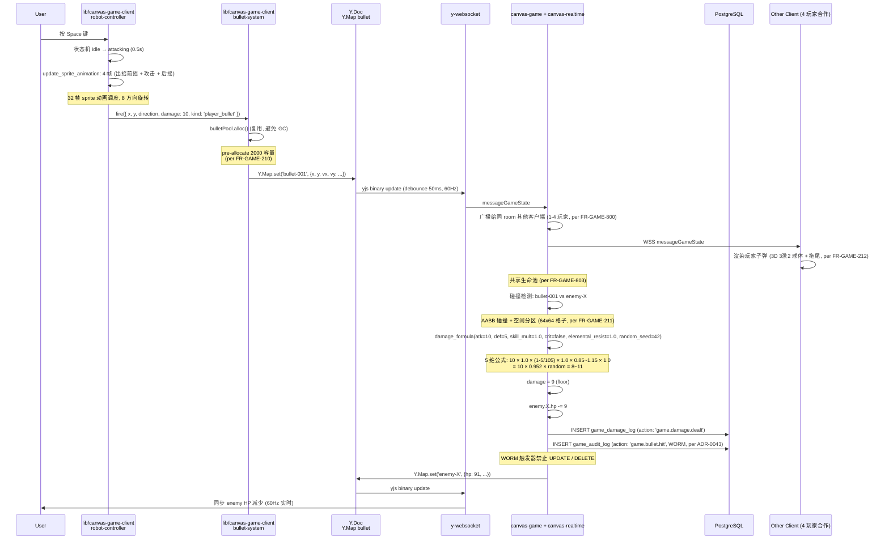
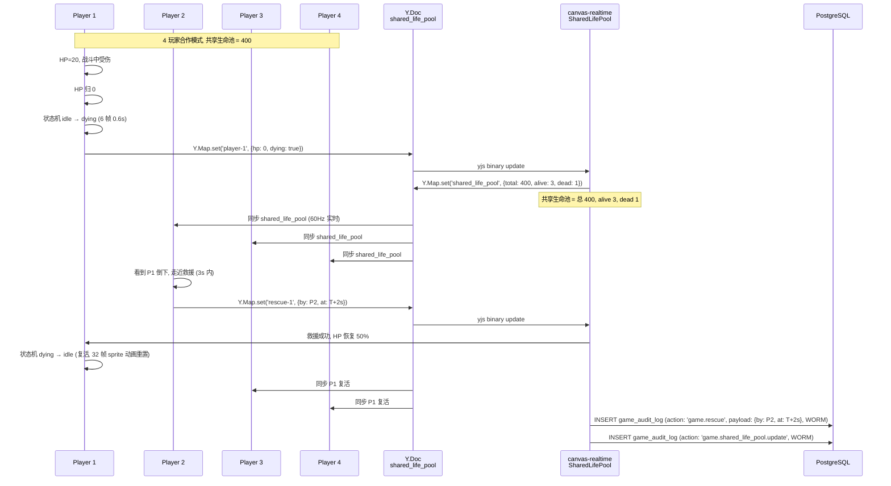
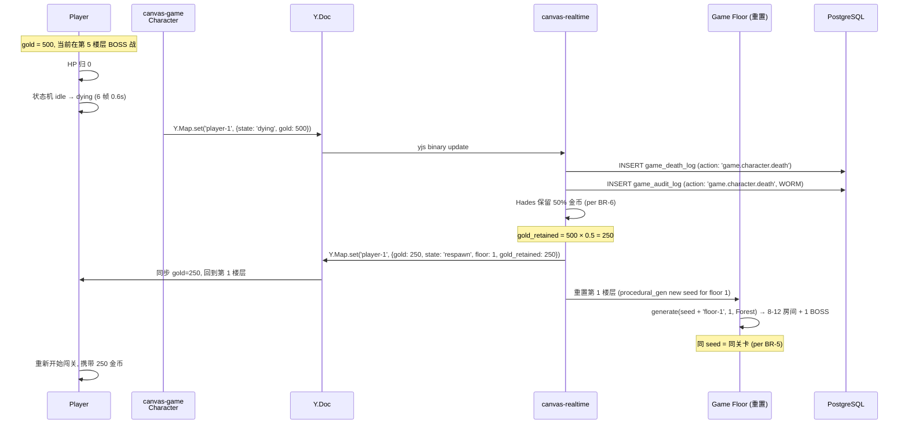
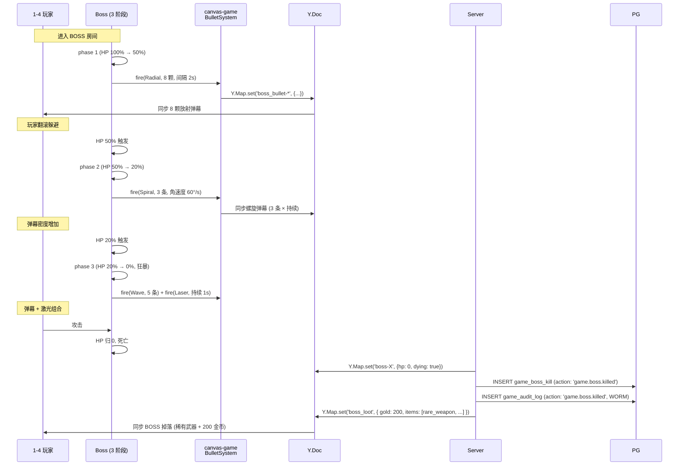
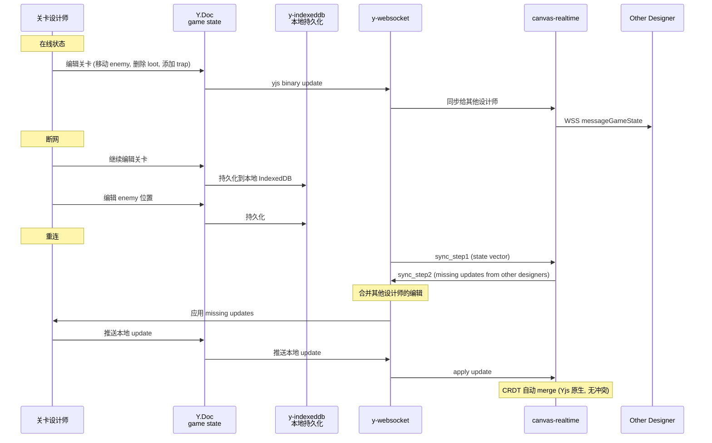

# DD-STAR-CANVAS-GAME-001

> **STAR 画布游戏 詳細設計書 v0.1** (弹幕 Roguelike + 3渲2 像素风机器人)
>
> - 状态: Detailed Design Baseline
> - 目标阶段: 詳細設計 → 実装 → 単体テスト → 結合テスト → リリース
> - 上位要件: [`docs/requirements/SRS-STAR-CANVAS-GAME-001.md`](../requirements/SRS-STAR-CANVAS-GAME-001.md) v0.1 (commit `4ed55ae`)
> - 上位設計: [`docs/design/BD-STAR-CANVAS-GAME-001.md`](./BD-STAR-CANVAS-GAME-001.md) v0.1 (commit `64df37f`)
> - 平行 DD: `docs/architecture/2026-09-03-agent-runtime/03-detailed-design.md` (51.8 KB) + `docs/architecture/2026-09-03-langgraph/03-detailed-design.md` (52 KB)
> - 关联実装報告: [`docs/reports/PHASE-CANVAS-GAME-IMPL-REPORT.md`](../reports/PHASE-CANVAS-GAME-IMPL-REPORT.md) v0.1 (P0 落地后)
> - 关联上游 (被本 DD 取代): 9/6 立 DD-STAR-CANVAS-001 v0.1 (Miro 风协作画布, SUPERSEDED 2026-09-07, commit `1a1a6d9`)
> - 修订人: Ulysses（一人公司 12 角色 per DEC-008）— Mavis 接手 (per 2026-08-27 19:39 JST 用户授权)
> - 审批: 架构师 (Mavis 接手 agent per DEC-008)
> - 日期: 2026-09-07 JST
> - 受众: 実装エンジニア (Rust + TypeScript + Three.js) / 単体テスト エンジニア / 結合テスト エンジニア / コードレビュア / SRE / 5 域 Lead (未来到位, 含美术资源 Lead 新角色)

---

## 0. 目的 (Purpose)

本文档基于 [`BD-STAR-CANVAS-GAME-001.md`](./BD-STAR-CANVAS-GAME-001.md) v0.1 (15 节 / 94.7 KB) 的基本設計, 定义 **STAR 画布游戏 (Canvas Game)** 的詳細設計:

- **类图 + 模块树** (4 Rust crate 完整 module + 函数签名 + 错误类型 + 公开 API)
- **26 game_* 表完整 DDL** (CREATE TABLE / INDEX / CONSTRAINT / TRIGGER)
- **canvas-game crate 完整实现** (32 帧 sprite 动画 + 5 模式弹幕 + 5 维伤害公式 + Roguelike procedural generation + 100+ 技能 + 1000+ 道具)
- **5 模式权限** (player / co-op / spectator / host) 完整 Rust trait
- **8 关键场景时序图** (子弹命中 / 伤害结算 / 多人合作 / 死亡重生 / 救援 / BOSS 战 / 关卡生成 / seed 分享)
- **5 view 深度** (機能 / データ / 動作 / モジュール / ネットワーク)
- **错误处理 + 性能 + 安全 + OpenTelemetry + Prometheus** (代码级)
- **测试策略** (單體 / 結合 / E2E / 性能, 20+ 场景)
- **CI/CD + 部署 + 监控** (GitHub Actions 9/9 + K8s HPA + Grafana)

> **dual-use 提醒 (per [AGENTS.md §5 倉庫拓扑](../../AGENTS.md))**: 本 DD 不引用 RGS 仓 + 不建立业务子域↔DDD bounded context 映射. 5 域 (player/economy/match/social/admin) 是历史治理命名 (守门 #3 拍板), 跟 25+ domain-* crate 是不同分类.

> **本 DD 跟 9/6 立 DD-STAR-CANVAS-001 (SUPERSEDED) 区别**: 9/6 立方向是 "Miro 风协作画布" (13 ElementRenderer + 5 角色 RACI 65 单元 + 5 middleware), 已 SUPERSEDED 2026-09-07. 本 DD 是 "画布里的弹幕 Roguelike 游戏" (4 crate 架构 + 32 帧 sprite + 5 模式弹幕 + 5 维伤害 + Roguelike 关卡 + 多人合作 1-4 玩家), 保留 3 crate 架构骨架 + 5 装饰 element 渲染接口, 推翻其他部分.

---

## 1. 适用范围 (Scope)

### 1.1 包含 (In-Scope)

- **4 个 Rust crate 完整 module 树** (3 沿用 9/6 + 1 新增 canvas-game)
  - `canvas-engine`: 5 装饰 element 渲染 + 视口跟随 (新) + 运镜 (新) (沿用 9/6 + 扩展)
  - `domain-canvas`: 26 game_* 表 + 3 模式权限 + 9 Service (沿用 9/6 + 扩展) + 3 新增游戏 Service
  - `canvas-realtime`: Yjs CRDT 后端 (沿用 9/6) + game_state_sync (新) + shared_life_pool (新)
  - **`canvas-game` (新)**: 游戏引擎, 32 帧 sprite 动画 + 5 模式弹幕 + 5 维伤害公式 + Roguelike 关卡 + 100+ 技能 + 1000+ 道具
- **26 game_* 表完整 DDL** (per BD §4, 守门 #13 W/T/M 严格)
  - 16 M 表 (含 SCD Type 2 触发器)
  - 6 T 表 (含 WORM 触发器, per ADR-0043)
  - 6 W 表 (含 retention 触发器)
- **canvas-game crate 完整实现**:
  - 4 子模块: character / bullet / combat / level + loot + render3d
  - 32 帧 sprite 动画调度
  - 5 模式弹幕 + 子弹池 (Vec<Bullet> pre-allocate 2000)
  - 5 维伤害公式 + 5 状态效果 + 100+ 技能 + 6 技能树
  - Roguelike procedural generation (perlin noise + WFC) + seed 可复现
  - 5 模式权限 + 4 crate 协作 trait
- **5 个新 frontend 模块**:
  - `lib/canvas-game-client/` (5 文件) / `lib/canvas-game-render/` (5 文件) / `lib/canvas-game-physics/` (3 文件) / `lib/canvas-game-net/` (4 文件) / `app/canvas/[id]/` (1 路由)
- **5 view 深度细节** (機能 / データ / 動作 / モジュール / ネットワーク)
- **8 关键场景时序图** (子弹命中 / 伤害结算 / 多人合作 / 死亡重生 / 救援 / BOSS 战 / 关卡生成 / seed 分享)
- **错误处理 + 性能 middleware + 安全 + OpenTelemetry + Prometheus**
- **测试策略** (單體 80% / 結合 60% / E2E 20 场景 / 性能 60 robot × 1000 bullet)
- **CI/CD + K8s 部署 + 监控告警**

### 1.2 不包含 (Out-of-Scope)

- 物理引擎 (Physis) / 完整 3D 渲染世界 (仅机器人 sprite 走 3D) / 跨机分布式 (守门 #3 5 域单仓) / 移动端 native (PWA 触屏 P1)
- AI 自动战斗 / 自动关卡 (P3 候选)
- 道具众包市场 (P3 候选, 仅内置 1000+ 道具)
- 9/6 立 Miro 风画布的 8 大功能域 / 13 element / 5 角色 RACI / 模板 / 演示 / 导入导出 / 40+ 快捷键 / WCAG 2.1 AA (已 SUPERSEDED)

---

## 2. 类图 + 模块树 (Class Diagram + Module Tree)

### 2.1 4 Rust crate 完整模块树

> 完整 4 crate 模块树详见 [BD-GAME-001 §6.1](./BD-STAR-CANVAS-GAME-001.md). 本节列 canvas-game crate 新增的 module 树.

```
crates/canvas-game/                                (新, 第 4 crate)
├── Cargo.toml
├── src/
│   ├── lib.rs                                    (CanvasGame::new + init)
│   ├── character/
│   │   ├── mod.rs                                (pub use 重导出)
│   │   ├── robot.rs                              (Robot struct + 6 维属性 + 5 状态机)
│   │   ├── sprite_animation.rs                  (32 帧 sprite 动画调度)
│   │   ├── character_progression.rs             (经验值 + 升级 + 技能树 + 装备 8 槽)
│   │   └── six_attrs.rs                          (HP/MP/SP/ATK/DEF/Speed)
│   ├── bullet/
│   │   ├── mod.rs
│   │   ├── bullet.rs                             (Bullet struct)
│   │   ├── bullet_pool.rs                       (Vec<Bullet> pre-allocate 2000)
│   │   ├── bullet_pattern.rs                    (5 模式: radial/aimed/spiral/wave/laser)
│   │   ├── bullet_template.rs                   (100+ 模板)
│   │   └── collision.rs                         (AABB + 空间分区 64x64)
│   ├── combat/
│   │   ├── mod.rs
│   │   ├── damage_formula.rs                    (5 维公式)
│   │   ├── status_effect.rs                     (5 效果: poison/burn/freeze/paralyze/curse)
│   │   ├── skill.rs                             (100+ 技能)
│   │   ├── skill_tree.rs                        (6 技能树 × 5-10 技能)
│   │   └── combat.rs                            (伤害结算)
│   ├── level/
│   │   ├── mod.rs
│   │   ├── room.rs                              (Room struct)
│   │   ├── corridor.rs                          (房间之间连接通道)
│   │   ├── floor.rs                             (8-12 房间 + 1 BOSS)
│   │   ├── biome.rs                             (6 种)
│   │   ├── procedural_gen.rs                    (perlin noise + WFC + seed)
│   │   ├── boss.rs                              (6 BOSS × 3 阶段)
│   │   └── difficulty.rs                        (难度曲线)
│   ├── loot/
│   │   ├── mod.rs
│   │   ├── weapon.rs                            (100+ 武器)
│   │   ├── passive.rs                           (300+ 被动)
│   │   ├── consumable.rs                        (200+ 消耗品)
│   │   ├── key.rs                               (4 种钥匙)
│   │   ├── gold.rs                              (Hades 死亡保留 50%)
│   │   └── loot_drop.rs                         (敌人死亡掉落)
│   ├── render3d/                                 (3瀿2 渲染, 调用 Three.js FFI)
│   │   ├── mod.rs
│   │   ├── three_ffi.rs                         (Rust → Three.js FFI)
│   │   ├── sprite_atlas_loader.rs               (2048x2048 atlas)
│   │   └── pixelation_shader.rs                 (WebGL fragment shader)
│   ├── error.rs                                  (CanvasGameError enum)
│   └── tests/
│       ├── robot_test.rs                        (32 帧动画 + 5 状态机)
│       ├── bullet_pool_test.rs                  (1000+ 子弹 / 60fps)
│       ├── combat_test.rs                       (5 维公式 + 5 状态效果)
│       ├── procedural_gen_test.rs               (perlin + WFC + seed 可复现)
│       ├── collision_test.rs                    (AABB + 空间分区)
│       └── sprite_animation_test.rs             (32 帧动画调度)
└── benches/
    ├── bullet_pool_bench.rs                     (criterion 1000+ 子弹)
    └── procedural_gen_bench.rs                  (criterion 关卡生成)
```

### 2.2 公开 API 签名 (canvas-game crate 顶层)

```rust
// === crates/canvas-game/src/lib.rs ===

pub mod character;
pub mod bullet;
pub mod combat;
pub mod level;
pub mod loot;
pub mod render3d;
pub mod error;

pub use character::{Robot, RobotState, SpriteFrame, CharacterProgression, SixAttrs};
pub use bullet::{Bullet, BulletPool, BulletPattern, BulletTemplate, Collision, SpatialGrid};
pub use combat::{DamageFormula, StatusEffect, Skill, SkillTree, Combat};
pub use level::{Room, Floor, Biome, ProceduralGen, Boss, Difficulty};
pub use loot::{Weapon, Passive, Consumable, Key, Gold, LootDrop};
pub use render3d::{ThreeFFI, SpriteAtlasLoader, PixelationShader};
pub use error::CanvasGameError;

/// 游戏引擎主入口 (per FR-GAME-903)
pub struct CanvasGame {
    config: GameConfig,
    bullet_pool: Arc<Mutex<BulletPool>>,
    proc_gen: Arc<ProceduralGen>,
}

impl CanvasGame {
    /// 创建游戏引擎实例
    pub fn new(config: GameConfig) -> Self { ... }

    /// 生成关卡 (per FR-GAME-404, seed 可复现)
    pub fn generate_level(&self, seed: &str, floor: u32, biome: Biome) -> Floor { ... }

    /// 创建机器人
    pub fn create_robot(&self, player_id: Uuid, room_id: Uuid) -> Robot { ... }

    /// 子弹池分配 (避免 GC)
    pub fn alloc_bullet(&self) -> Option<Bullet> { ... }

    /// 子弹池回收
    pub fn free_bullet(&self, bullet_id: Uuid) { ... }

    /// 伤害结算 (5 维公式 per FR-GAME-300)
    pub fn damage_formula(&self, input: DamageInput) -> DamageResult { ... }

    /// 状态效果应用 (5 效果 per FR-GAME-310..314)
    pub fn apply_status_effect(&self, target_id: Uuid, effect: StatusEffect, duration_sec: f64) { ... }

    /// 碰撞检测 (AABB + 空间分区)
    pub fn collision_check(&self, bullets: &[Bullet], enemies: &[Enemy]) -> Vec<Collision> { ... }
}

pub struct GameConfig {
    pub max_bullets: usize,             // 默认 2000
    pub max_players: usize,             // 默认 4
    pub max_floors: u32,                // 默认 12
    pub seed_max_len: usize,            // 默认 64
    pub collision_grid_size: u32,       // 默认 64
    pub sprite_atlas_size: u32,         // 默认 2048
}
```

### 2.3 错误类型 (canvas-game crate)

```rust
// === crates/canvas-game/src/error.rs ===

use thiserror::Error;
use uuid::Uuid;

#[derive(Debug, Error)]
pub enum CanvasGameError {
    #[error("bullet pool exhausted: max {max} bullets")]
    BulletPoolExhausted { max: usize },
    #[error("invalid robot state transition: {from:?} -> {to:?}")]
    InvalidStateTransition { from: RobotState, to: RobotState },
    #[error("invalid seed: {0}")]
    InvalidSeed(String),
    #[error("biome not found: {0}")]
    BiomeNotFound(String),
    #[error("boss not found in floor: {0}")]
    BossNotFound(Uuid),
    #[error("loot not found: {0}")]
    LootNotFound(Uuid),
    #[error("skill not found: {0}")]
    SkillNotFound(String),
    #[error("collision error: {0}")]
    CollisionError(String),
    #[error(transparent)]
    Random(#[from] rand::Error),
    #[error(transparent)]
    Image(#[from] image::ImageError),
}
```

---

## 3. 機能設計 (5 view #1 機能, 詳細)

### 3.1 机器人 32 帧 sprite 动画 + 5 状态机 (per FR-GAME-100..103)

```rust
// === crates/canvas-game/src/character/robot.rs ===

use serde::{Deserialize, Serialize};
use uuid::Uuid;

#[derive(Debug, Clone, Copy, PartialEq, Eq, Hash, Serialize, Deserialize)]
#[serde(rename_all = "snake_case")]
pub enum RobotState {
    Idle,        // 待机 (4 帧呼吸循环)
    Moving,      // 移动 (6 帧走路)
    Attacking,   // 攻击 (4 帧: 出招前摇 + 攻击 + 后摇, 0.5s)
    Rolling,     // 翻滚 (4 帧, 0.3s 无敌帧)
    Dying,       // 死亡 (6 帧: 倒地, 0.6s)
}

impl RobotState {
    pub fn frame_count(&self) -> u32 {
        match self {
            Self::Idle => 4,
            Self::Moving => 6,
            Self::Attacking => 4,
            Self::Rolling => 4,
            Self::Dying => 6,
        }
    }

    pub fn frame_duration_ms(&self) -> u32 {
        match self {
            Self::Idle => 250,        // 4 帧 × 250ms = 1s 呼吸循环
            Self::Moving => 100,      // 6 帧 × 100ms = 600ms 走路循环
            Self::Attacking => 125,   // 4 帧 × 125ms = 500ms 攻击
            Self::Rolling => 75,      // 4 帧 × 75ms = 300ms 翻滚
            Self::Dying => 100,       // 6 帧 × 100ms = 600ms 死亡
        }
    }
}

#[derive(Debug, Clone, Copy, PartialEq, Eq, Hash, Serialize, Deserialize)]
#[serde(rename_all = "snake_case")]
pub enum Direction {
    N = 0, NE = 1, E = 2, SE = 3, S = 4, SW = 5, W = 6, NW = 7,
}

#[derive(Debug, Clone, Serialize, Deserialize)]
pub struct SpriteFrame {
    pub kind: String,           // "robot" | "enemy_zombie" | "enemy_skeleton" | ...
    pub state: RobotState,
    pub frame_idx: u32,
    pub duration_ms: u32,
    pub direction: Direction,
}

#[derive(Debug, Clone, Serialize, Deserialize)]
pub struct SixAttrs {
    pub hp: i32,        pub max_hp: i32,
    pub mp: i32,        pub max_mp: i32,
    pub sp: i32,        pub max_sp: i32,
    pub atk: i32,
    pub def: i32,
    pub speed: i32,     // px/s
}

impl Default for SixAttrs {
    fn default() -> Self {
        Self {
            hp: 100, max_hp: 100,
            mp: 50, max_mp: 50,
            sp: 100, max_sp: 100,
            atk: 10,
            def: 5,
            speed: 200,
        }
    }
}

#[derive(Debug, Clone, Serialize, Deserialize)]
pub struct Robot {
    pub id: Uuid,
    pub player_id: Uuid,
    pub room_id: Uuid,
    pub x: f32, pub y: f32,
    pub attrs: SixAttrs,
    pub state: RobotState,
    pub level: u32,
    pub exp: u64,
    pub skill_points: u32,
    pub current_frame: u32,      // 32 帧中当前帧
    pub direction: Direction,    // 8 方向
    pub frame_time: u32,          // 当前帧持续时间 (ms)
    pub state_elapsed_ms: u32,    // 当前状态已持续时间
    pub equipment_slots: std::collections::HashMap<String, Uuid>,  // 8 槽
    pub inventory: Vec<Uuid>,     // 道具栏
    pub gold: i32,
    pub gold_retained: i32,       // Hades 死亡保留 50%
    pub status_effects: Vec<StatusEffectInstance>,
    pub version: i32,             // SCD Type 2
    pub valid_from: chrono::DateTime<chrono::Utc>,
    pub valid_to: Option<chrono::DateTime<chrono::Utc>>,
}

impl Robot {
    /// 状态转换 (per FR-GAME-102)
    pub fn transition_to(&mut self, new_state: RobotState) -> Result<(), CanvasGameError> {
        // 验证状态转换合法性
        let valid = matches!(
            (self.state, new_state),
            (RobotState::Idle, _) |                                  // Idle 可转到任何状态
            (_, RobotState::Idle) |                                   // 任何状态可回 Idle
            (RobotState::Moving, RobotState::Attacking) |            // 移动可攻击
            (RobotState::Moving, RobotState::Rolling) |              // 移动可翻滚
            (RobotState::Attacking, RobotState::Idle) |              // 攻击自动回 Idle
            (RobotState::Rolling, RobotState::Idle) |                // 翻滚自动回 Idle
            (_, RobotState::Dying)                                     // 任何状态可转 Dying (HP=0)
        );
        if !valid {
            return Err(CanvasGameError::InvalidStateTransition { from: self.state, to: new_state });
        }
        self.state = new_state;
        self.state_elapsed_ms = 0;
        self.current_frame = 0;
        self.frame_time = 0;
        Ok(())
    }

    /// 32 帧 sprite 动画调度 (per FR-GAME-101)
    pub fn update_sprite_animation(&mut self, delta_ms: u32) -> SpriteFrame {
        self.state_elapsed_ms += delta_ms;
        self.frame_time += delta_ms;
        if self.frame_time >= self.state.frame_duration_ms() {
            self.frame_time = 0;
            self.current_frame = (self.current_frame + 1) % self.state.frame_count();
        }
        SpriteFrame {
            kind: "robot".to_string(),
            state: self.state,
            frame_idx: self.current_frame,
            duration_ms: self.frame_time,
            direction: self.direction,
        }
    }

    /// 应用伤害 + 状态效果
    pub fn take_damage(&mut self, damage: i32) {
        self.attrs.hp = (self.attrs.hp - damage).max(0);
        if self.attrs.hp == 0 {
            let _ = self.transition_to(RobotState::Dying);
        }
    }
}
```

### 3.2 5 弹幕模式 + 子弹池 (per FR-GAME-200..213)

```rust
// === crates/canvas-game/src/bullet/bullet_pool.rs ===

use uuid::Uuid;
use std::sync::Mutex;

#[derive(Debug, Clone, Copy, PartialEq, Eq, Hash, Serialize, Deserialize)]
#[serde(rename_all = "snake_case")]
pub enum BulletPattern {
    Radial,    // 放射: 360° 均匀 N 颗
    Aimed,     // 瞄准: 朝玩家
    Spiral,    // 螺旋: 角速度
    Wave,      // 波浪: sin 函数
    Laser,     // 激光: 持续
}

#[derive(Debug, Clone, Copy, PartialEq, Eq, Hash, Serialize, Deserialize)]
#[serde(rename_all = "snake_case")]
pub enum BulletKind {
    PlayerBullet,    // 玩家子弹 (3D 3瀿2 球体)
    EnemyBullet,     // 敌人弹幕 (2D SVG particle)
    Neutral,         // 中性
}

#[derive(Debug, Clone, Serialize, Deserialize)]
pub struct Bullet {
    pub id: Uuid,
    pub kind: BulletKind,
    pub pattern: BulletPattern,
    pub x: f32, pub y: f32,
    pub vx: f32, pub vy: f32,        // 速度 (px/s)
    pub damage: i32,
    pub ttl_ms: u32,                 // 生命周期 (ms), 0 = 永久
    pub elapsed_ms: u32,
    pub radius: f32,                 // 碰撞半径 (圆碰撞)
    pub owner_id: Uuid,              // 发射者 ID
    pub color: String,               // 颜色 hex
}

pub struct BulletPool {
    pool: Mutex<Vec<Bullet>>,
    max_size: usize,
    active: Mutex<std::collections::HashSet<Uuid>>,
}

impl BulletPool {
    pub fn new(max_size: usize) -> Self {
        Self {
            pool: Mutex::new(Vec::with_capacity(max_size)),
            max_size,
            active: Mutex::new(std::collections::HashSet::with_capacity(max_size)),
        }
    }

    /// 子弹池分配 (避免 GC, per FR-GAME-210)
    pub fn alloc(&self) -> Result<Bullet, CanvasGameError> {
        let mut pool = self.pool.lock().unwrap();
        let bullet = pool.pop().unwrap_or_else(|| Bullet {
            id: Uuid::new_v4(),
            kind: BulletKind::PlayerBullet,
            pattern: BulletPattern::Radial,
            x: 0.0, y: 0.0, vx: 0.0, vy: 0.0,
            damage: 10,
            ttl_ms: 0, elapsed_ms: 0,
            radius: 5.0,
            owner_id: Uuid::nil(),
            color: "#4a9eff".into(),
        });
        let mut active = self.active.lock().unwrap();
        if active.len() >= self.max_size {
            return Err(CanvasGameError::BulletPoolExhausted { max: self.max_size });
        }
        active.insert(bullet.id);
        Ok(bullet)
    }

    /// 子弹池回收
    pub fn free(&self, bullet_id: Uuid) {
        let mut active = self.active.lock().unwrap();
        active.remove(&bullet_id);
    }

    /// 批量更新位置 (per 帧)
    pub fn update_positions(&self, bullets: &mut [Bullet], delta_ms: u32) {
        let dt = delta_ms as f32 / 1000.0;
        for bullet in bullets.iter_mut() {
            bullet.x += bullet.vx * dt;
            bullet.y += bullet.vy * dt;
            bullet.elapsed_ms += delta_ms;
            if bullet.ttl_ms > 0 && bullet.elapsed_ms >= bullet.ttl_ms {
                // TTL 到期, 标记为 inactive (由调用方回收)
            }
        }
    }
}
```

### 3.3 5 维伤害公式 + 5 状态效果 (per FR-GAME-300..314)

```rust
// === crates/canvas-game/src/combat/damage_formula.rs ===

use serde::{Deserialize, Serialize};

#[derive(Debug, Clone, Copy, PartialEq, Eq, Hash, Serialize, Deserialize)]
#[serde(rename_all = "snake_case")]
pub enum StatusEffect {
    Poison,    // 中毒: 每秒 2% MAX_HP, 5s
    Burn,      // 燃烧: 每秒 3% MAX_HP, 3s
    Freeze,    // 冰冻: 速度 -50%, 3s
    Paralyze,  // 麻痹: 不能攻击/翻滚, 1s
    Curse,     // 诅咒: 受伤 +25%, 10s
}

#[derive(Debug, Clone, Serialize, Deserialize)]
pub struct StatusEffectInstance {
    pub effect: StatusEffect,
    pub expires_at: chrono::DateTime<chrono::Utc>,
    pub stacks: u32,        // 最多 3 层 (per BR-10)
}

#[derive(Debug, Clone)]
pub struct DamageInput {
    pub atk: i32,
    pub skill_mult: f64,        // 0.5-3.0
    pub def: i32,
    pub is_crit: bool,
    pub elemental_resist: f64,  // 0.5-2.0
    pub random_seed: u64,        // 确定性 random (per NFR-PERF-9)
}

#[derive(Debug, Clone)]
pub struct DamageResult {
    pub damage: i32,
    pub is_crit: bool,
    pub is_miss: bool,
}

/// 5 维伤害公式 (per FR-GAME-300, BR-9)
/// damage = ATK × skill_mult × (1 - DEF/(DEF+100)) × crit × random(0.85-1.15) × elemental_resist
pub fn damage_formula(input: DamageInput) -> DamageResult {
    let base_dmg = input.atk as f64 * input.skill_mult;
    let def_mitigation = 1.0 - (input.def as f64 / (input.def as f64 + 100.0));
    let crit_mult = if input.is_crit { 1.5 + 0.5 } else { 1.0 };  // 1.5-2.5x
    // 用确定性 random (per NFR-PERF-9 死亡可复现)
    let random = deterministic_random(input.random_seed, 0.85, 1.15);
    let damage = base_dmg * def_mitigation * crit_mult * random * input.elemental_resist;
    DamageResult {
        damage: damage.floor() as i32,
        is_crit: input.is_crit,
        is_miss: false,
    }
}

fn deterministic_random(seed: u64, min: f64, max: f64) -> f64 {
    use rand::{Rng, SeedableRng};
    let mut rng = rand::rngs::StdRng::seed_from_u64(seed);
    rng.gen_range(min..max)
}

/// 5 状态效果应用 (per FR-GAME-310..314)
pub fn apply_status_effect(
    target_attrs: &mut SixAttrs,
    effect: StatusEffect,
) -> StatusEffectInstance {
    let duration_sec = match effect {
        StatusEffect::Poison => 5.0,
        StatusEffect::Burn => 3.0,
        StatusEffect::Freeze => 3.0,
        StatusEffect::Paralyze => 1.0,
        StatusEffect::Curse => 10.0,
    };
    let expires_at = chrono::Utc::now() + chrono::Duration::milliseconds((duration_sec * 1000.0) as i64);

    // 状态效果逻辑 (具体应用在每帧 update 时)
    match effect {
        StatusEffect::Poison => {
            // 持续伤害: 每秒 2% MAX_HP (由 tick 处理)
        }
        StatusEffect::Burn => {
            // 持续伤害: 每秒 3% MAX_HP
        }
        StatusEffect::Freeze => {
            // 速度 -50% (target_attrs.speed = target_attrs.speed / 2)
        }
        StatusEffect::Paralyze => {
            // 不能攻击/翻滚 (在 take_damage / transition_to 时检查)
        }
        StatusEffect::Curse => {
            // 受伤 +25% (在 damage_formula caller 端乘 1.25)
        }
    }
    StatusEffectInstance {
        effect,
        expires_at,
        stacks: 1,
    }
}

#[cfg(test)]
mod tests {
    use super::*;

    #[test]
    fn test_damage_formula_basic() {
        let result = damage_formula(DamageInput {
            atk: 10, skill_mult: 1.0, def: 5, is_crit: false, elemental_resist: 1.0,
            random_seed: 42,
        });
        // 10 × 1.0 × 0.95 × 1.0 × 0.85~1.15 × 1.0 ≈ 8~11
        assert!(result.damage >= 8 && result.damage <= 11);
        assert!(!result.is_crit);
    }

    #[test]
    fn test_damage_formula_crit() {
        let result = damage_formula(DamageInput {
            atk: 10, skill_mult: 1.0, def: 5, is_crit: true, elemental_resist: 1.0,
            random_seed: 42,
        });
        // 10 × 1.0 × 0.95 × 2.0 × 0.85~1.15 × 1.0 ≈ 16~22
        assert!(result.damage >= 16 && result.damage <= 22);
        assert!(result.is_crit);
    }

    #[test]
    fn test_damage_formula_deterministic() {
        // 同 seed = 同结果 (per NFR-PERF-9)
        let r1 = damage_formula(DamageInput {
            atk: 10, skill_mult: 1.0, def: 5, is_crit: false, elemental_resist: 1.0,
            random_seed: 42,
        });
        let r2 = damage_formula(DamageInput {
            atk: 10, skill_mult: 1.0, def: 5, is_crit: false, elemental_resist: 1.0,
            random_seed: 42,
        });
        assert_eq!(r1.damage, r2.damage);
    }
}
```

### 3.4 Roguelike procedural generation (per FR-GAME-404)

```rust
// === crates/canvas-game/src/level/procedural_gen.rs ===

use rand::{Rng, SeedableRng};
use rand::rngs::StdRng;
use uuid::Uuid;
use super::room::Room;
use super::biome::Biome;

pub struct ProceduralGen;

impl ProceduralGen {
    /// 同 seed = 同关卡 (per FR-GAME-404, BR-5)
    pub fn generate(seed: &str, floor: u32, biome: Biome) -> Vec<Room> {
        let mut rng = StdRng::seed_from_u64(hash_seed(seed, floor));
        let room_count = 8 + rng.gen_range(0..5);  // 8-12 房间
        let mut rooms = Vec::with_capacity(room_count + 1);

        // (1) 用确定性 random 生成房间布局
        for i in 0..room_count {
            let x = rng.gen_range(-1000..1000) as f32;
            let y = rng.gen_range(-1000..1000) as f32;
            let width = 800.0 + rng.gen_range(0..800) as f32;
            let height = 600.0 + rng.gen_range(0..600) as f32;
            let enemy_count = rng.gen_range(0..50);
            let loot_count = rng.gen_range(0..100);
            rooms.push(Room {
                id: Uuid::new_v4(),
                x, y, width, height,
                doors: vec![],
                enemies: (0..enemy_count).map(|_| generate_enemy(&mut rng, biome, floor)).collect(),
                loots: (0..loot_count).map(|_| generate_loot(&mut rng, floor)).collect(),
                traps: vec![],
                chest: None,
            });
        }

        // (2) 走廊连接相邻房间
        for i in 0..rooms.len() - 1 {
            rooms[i].doors.push(super::room::Door {
                to_room_id: rooms[i + 1].id,
                direction: super::room::DoorDirection::Right,
            });
        }

        // (3) 末尾 1 BOSS 房间
        let boss = generate_boss(&mut rng, biome, floor);
        let boss_room = Room {
            id: Uuid::new_v4(),
            x: rooms.last().unwrap().x + 1600.0,
            y: rooms.last().unwrap().y,
            width: 1200.0,
            height: 800.0,
            doors: vec![super::room::Door {
                to_room_id: rooms.last().unwrap().id,
                direction: super::room::DoorDirection::Left,
            }],
            enemies: vec![boss],
            loots: vec![],
            traps: vec![],
            chest: None,
        };
        rooms.push(boss_room);

        rooms
    }
}

fn hash_seed(seed: &str, floor: u32) -> u64 {
    use std::collections::hash_map::DefaultHasher;
    use std::hash::{Hash, Hasher};
    let mut hasher = DefaultHasher::new();
    seed.hash(&mut hasher);
    floor.hash(&mut hasher);
    hasher.finish()
}

fn generate_enemy(rng: &mut StdRng, biome: Biome, floor: u32) -> Enemy {
    let kinds = ["zombie", "skeleton", "mage", "boss"];
    let kind = kinds[rng.gen_range(0..kinds.len())];
    let difficulty = super::difficulty::difficulty(floor, 0, biome);
    let hp = 20 + (difficulty as i32 * 5);
    let atk = 5 + (difficulty as i32 * 2);
    Enemy {
        id: Uuid::new_v4(),
        kind: kind.into(),
        hp, max_hp: hp, atk,
        x: 0.0, y: 0.0,
        state: super::super::character::RobotState::Idle,
    }
}

fn generate_loot(rng: &mut StdRng, floor: u32) -> Loot {
    let kinds = ["weapon", "passive", "consumable", "key", "gold"];
    let kind = kinds[rng.gen_range(0..kinds.len())];
    Loot {
        id: Uuid::new_v4(),
        kind: kind.into(),
        rarity: rng.gen_range(0..4),  // 0=normal, 3=legendary
    }
}

fn generate_boss(rng: &mut StdRng, biome: Biome, floor: u32) -> Enemy {
    let bosses = ["dragon", "lich", "demon", "robot", "alien", "golem"];
    let kind = bosses[rng.gen_range(0..bosses.len())];
    let difficulty = super::difficulty::difficulty(floor, 0, biome);
    let hp = 200 + (difficulty as i32 * 50);
    let atk = 20 + (difficulty as i32 * 10);
    Enemy {
        id: Uuid::new_v4(),
        kind: kind.into(),
        hp, max_hp: hp, atk,
        x: 0.0, y: 0.0,
        state: super::super::character::RobotState::Idle,
    }
}
```

### 3.5 5 模式权限 (per ADR-CANVAS-GAME-008)

```rust
// === crates/domain-canvas/src/permission.rs (沿用 9/6 + 简化) ===

#[derive(Debug, Clone, Copy, PartialEq, Eq, Hash, Serialize, Deserialize)]
#[serde(rename_all = "snake_case")]
pub enum GameRole {
    Player,        // 游玩
    CoOpPlayer,    // 合作 (跟 Player 同权限, 仅 1-4 标识)
    Spectator,     // 旁观 (只读)
    Host,          // 房主 (Player + 房间管理权限)
}

impl GameRole {
    /// 5 模式权限校验 (per ADR-CANVAS-GAME-008, 简化的 9/6 5 角色 RACI 65 单元)
    pub fn check_permission(&self, action: GameAction, resource: GameResource) -> bool {
        use GameAction::*;
        use GameResource::*;
        use GameRole::*;
        match (self, action, resource) {
            (Spectator, Read, _) => true,
            (Spectator, _, _) => false,

            (Player | CoOpPlayer, Read, _) => true,
            (Player | CoOpPlayer, Fire | Move | Roll | UseSkill, _) => true,

            (Host, _, _) => true,  // 房主 = Player + 房间管理

            _ => false,
        }
    }
}

#[derive(Debug, Clone, Copy, PartialEq, Eq, Hash)]
pub enum GameAction {
    Read,
    Fire,        // 开火
    Move,        // 移动
    Roll,        // 翻滚
    UseSkill,    // 用技能
    Kick,        // 踢人
    Pause,       // 暂停
    SetDifficulty,  // 设置难度
}

#[derive(Debug, Clone, Copy, PartialEq, Eq, Hash)]
pub enum GameResource {
    Room,
    Character,
    Bullet,
    Enemy,
    Loot,
    Chat,
    Settings,
}

#[cfg(test)]
mod tests {
    use super::*;

    #[test]
    fn test_spectator_can_only_read() {
        assert!(GameRole::Spectator.check_permission(GameAction::Read, GameResource::Room));
        assert!(!GameRole::Spectator.check_permission(GameAction::Fire, GameResource::Bullet));
    }

    #[test]
    fn test_player_can_fire_and_move() {
        assert!(GameRole::Player.check_permission(GameAction::Fire, GameResource::Bullet));
        assert!(GameRole::Player.check_permission(GameAction::Move, GameResource::Character));
    }

    #[test]
    fn test_host_can_kick_and_pause() {
        assert!(GameRole::Host.check_permission(GameAction::Kick, GameResource::Room));
        assert!(GameRole::Host.check_permission(GameAction::Pause, GameResource::Room));
    }
}
```

---

## 4. データ設計 (5 view #2 データ, 詳細 DDL)

### 4.1 26 game_* 表 DDL 完整 (per BD-GAME-001 §4, 守门 #13 W/T/M 严格)

> 完整 26 表 DDL 落地在 `crates/domain-canvas/migrations/2026-09-08-001000-game/` 7 份脚本中, 本节列 4 关键代表表 + 3 关键触发器模式.

#### 4.1.1 game_character 表 (M, SCD Type 2, 6 维属性 + 5 状态机)

```sql
-- migrations/2026-09-08-001000-game/up.sql

CREATE TABLE game_character (
    -- 守门 #13 RLS 13 类必带
    id              UUID PRIMARY KEY,
    tenant_id       UUID NOT NULL,
    workspace_id    UUID NOT NULL,
    player_id       UUID NOT NULL,
    room_id         UUID REFERENCES game_room(id),

    -- 6 维属性 (per FR-GAME-103)
    hp              INT NOT NULL DEFAULT 100,
    max_hp          INT NOT NULL DEFAULT 100,
    mp              INT NOT NULL DEFAULT 50,
    max_mp          INT NOT NULL DEFAULT 50,
    sp              INT NOT NULL DEFAULT 100,
    max_sp          INT NOT NULL DEFAULT 100,
    atk             INT NOT NULL DEFAULT 10,
    def             INT NOT NULL DEFAULT 5,
    speed           INT NOT NULL DEFAULT 200,

    -- 5 状态机 (per FR-GAME-102)
    state           VARCHAR(20) NOT NULL DEFAULT 'idle'
                    CHECK (state IN ('idle', 'moving', 'attacking', 'rolling', 'dying')),
    level           INT NOT NULL DEFAULT 1,
    exp             BIGINT NOT NULL DEFAULT 0,
    skill_points    INT NOT NULL DEFAULT 0,

    -- 32 帧 sprite 动画 (per FR-GAME-101)
    current_frame   INT NOT NULL DEFAULT 0,
    direction       INT NOT NULL DEFAULT 0 CHECK (direction BETWEEN 0 AND 7),
    frame_time      INT NOT NULL DEFAULT 0,
    state_elapsed_ms INT NOT NULL DEFAULT 0,

    -- 道具栏 + 装备 8 槽 (per FR-GAME-112)
    equipment_slots JSONB NOT NULL DEFAULT '{}'::jsonb,
    inventory       JSONB NOT NULL DEFAULT '[]'::jsonb,

    -- Hades 死亡保留 (per BR-6)
    gold            INT NOT NULL DEFAULT 0,
    gold_retained   INT NOT NULL DEFAULT 0,

    -- 状态效果 (5 种, per FR-GAME-310..314)
    status_effects  JSONB NOT NULL DEFAULT '[]'::jsonb,

    -- SCD Type 2
    version         INT NOT NULL DEFAULT 1,
    valid_from      TIMESTAMPTZ NOT NULL DEFAULT NOW(),
    valid_to        TIMESTAMPTZ,

    -- 审计
    created_by      UUID NOT NULL,
    updated_by      UUID NOT NULL,
    created_at      TIMESTAMPTZ NOT NULL DEFAULT NOW(),
    updated_at      TIMESTAMPTZ NOT NULL DEFAULT NOW(),

    deleted_at      TIMESTAMPTZ,
    etag            UUID NOT NULL DEFAULT gen_random_uuid(),
    extra           JSONB NOT NULL DEFAULT '{}'::jsonb
);

CREATE INDEX idx_game_character_player_active
    ON game_character(player_id) WHERE deleted_at IS NULL AND valid_to IS NULL;
CREATE INDEX idx_game_character_room
    ON game_character(room_id) WHERE deleted_at IS NULL;
CREATE UNIQUE INDEX uk_game_character_id_version
    ON game_character(id, valid_from);

ALTER TABLE game_character ENABLE ROW LEVEL SECURITY;
CREATE POLICY game_character_rls_policy ON game_character
    USING (
        tenant_id = current_setting('app.tenant_id')::UUID
        AND workspace_id = current_setting('app.workspace_id')::UUID
    );

COMMENT ON TABLE game_character IS
    '画布游戏角色表 (Master, SCD Type 2). 6 维属性 + 5 状态机 + 32 帧 sprite 动画. 守门 #13 (c).';
```

#### 4.1.2 game_room 表 (M, SCD Type 2, 关卡主表)

```sql
CREATE TABLE game_room (
    id              UUID PRIMARY KEY,
    tenant_id       UUID NOT NULL,
    workspace_id    UUID NOT NULL,
    host_id         UUID NOT NULL,

    -- Roguelike procedural generation (per FR-GAME-404)
    seed            VARCHAR(64) NOT NULL,
    floor           INT NOT NULL DEFAULT 1,
    biome           VARCHAR(20) NOT NULL DEFAULT 'forest'
                    CHECK (biome IN ('forest', 'desert', 'dungeon', 'space', 'volcano', 'snow')),
    difficulty      INT NOT NULL DEFAULT 10,

    -- 房间列表
    rooms           JSONB NOT NULL DEFAULT '[]'::jsonb,
    current_room_id UUID,

    -- 多人合作 (per ADR-CANVAS-GAME-006)
    max_players     INT NOT NULL DEFAULT 4,
    current_players INT NOT NULL DEFAULT 0,
    mode            VARCHAR(20) NOT NULL DEFAULT 'single'
                    CHECK (mode IN ('single', 'co_op_2', 'co_op_4', 'spectator')),

    -- 共享生命池 (per FR-GAME-803)
    shared_life_pool JSONB NOT NULL DEFAULT '{"total": 0, "alive": 0}'::jsonb,

    visibility      VARCHAR(20) NOT NULL DEFAULT 'private'
                    CHECK (visibility IN ('public', 'team', 'private')),

    -- SCD Type 2
    version         INT NOT NULL DEFAULT 1,
    valid_from      TIMESTAMPTZ NOT NULL DEFAULT NOW(),
    valid_to        TIMESTAMPTZ,

    -- 审计
    created_by      UUID NOT NULL,
    updated_by      UUID NOT NULL,
    created_at      TIMESTAMPTZ NOT NULL DEFAULT NOW(),
    updated_at      TIMESTAMPTZ NOT NULL DEFAULT NOW(),

    deleted_at      TIMESTAMPTZ,
    etag            UUID NOT NULL DEFAULT gen_random_uuid(),
    extra           JSONB NOT NULL DEFAULT '{}'::jsonb
);

CREATE INDEX idx_game_room_host ON game_room(host_id) WHERE deleted_at IS NULL;
CREATE INDEX idx_game_room_seed ON game_room(seed);
CREATE INDEX idx_game_room_biome ON game_room(biome, floor) WHERE deleted_at IS NULL;

ALTER TABLE game_room ENABLE ROW LEVEL SECURITY;
CREATE POLICY game_room_rls_policy ON game_room
    USING (
        tenant_id = current_setting('app.tenant_id')::UUID
        AND workspace_id = current_setting('app.workspace_id')::UUID
    );

COMMENT ON TABLE game_room IS
    '画布游戏房间表 (Master, SCD Type 2). 1-4 玩家合作 + seed 可复现 + 共享生命池. 守门 #13 (c).';
```

#### 4.1.3 game_audit_log 表 (T, WORM, per ADR-0043)

```sql
-- migrations/2026-09-08-002000-audit/up.sql

CREATE TABLE game_audit_log (
    -- 守门 #13 T 类 (b) 物理删除禁止 + 監査必須 + RLS 13 必带
    id              UUID PRIMARY KEY,
    room_id         UUID NOT NULL,
    user_id         UUID NOT NULL,

    action          VARCHAR(100) NOT NULL
                    CHECK (action IN (
                        'game.room.create', 'game.room.update', 'game.room.delete', 'game.room.join', 'game.room.leave',
                        'game.character.create', 'game.character.update', 'game.character.death', 'game.character.respawn',
                        'game.bullet.fire', 'game.bullet.hit',
                        'game.damage.dealt', 'game.damage.received',
                        'game.loot.pickup', 'game.loot.drop', 'game.loot.use',
                        'game.skill.use', 'game.skill.cooldown',
                        'game.boss.spawn', 'game.boss.killed',
                        'game.floor.complete', 'game.floor.fail',
                        'game.rescue', 'game.shared_life_pool.update',
                        'game.seed.share',
                        'game.audit.read'
                    )),
    target_type     VARCHAR(50) NOT NULL,
    target_id       UUID,
    payload         JSONB NOT NULL DEFAULT '{}'::jsonb,
    ip_address      INET,
    user_agent      VARCHAR(500),

    -- WORM 字段
    prev_hash       VARCHAR(64),
    curr_hash       VARCHAR(64) NOT NULL,

    -- 审计
    created_by      UUID NOT NULL,
    created_at      TIMESTAMPTZ NOT NULL DEFAULT NOW()
);

CREATE INDEX idx_game_audit_room_created
    ON game_audit_log(room_id, created_at DESC);
CREATE INDEX idx_game_audit_user
    ON game_audit_log(user_id, created_at DESC);
CREATE INDEX idx_game_audit_action
    ON game_audit_log(action, created_at DESC);
CREATE INDEX idx_game_audit_payload
    ON game_audit_log USING gin(payload);

ALTER TABLE game_audit_log ENABLE ROW LEVEL SECURITY;
CREATE POLICY game_audit_rls_policy ON game_audit_log
    USING (
        room_id IN (
            SELECT id FROM game_room
            WHERE tenant_id = current_setting('app.tenant_id')::UUID
            AND workspace_id = current_setting('app.workspace_id')::UUID
        )
    );

-- WORM 触发器 (per ADR-0043)
CREATE OR REPLACE FUNCTION game_audit_log_worm()
RETURNS TRIGGER AS $$
BEGIN
    RAISE EXCEPTION 'game_audit_log is WORM, cannot update or delete. id=%', OLD.id;
END;
$$ LANGUAGE plpgsql;

CREATE TRIGGER trg_game_audit_log_worm_update
    BEFORE UPDATE ON game_audit_log
    FOR EACH ROW EXECUTE FUNCTION game_audit_log_worm();

CREATE TRIGGER trg_game_audit_log_worm_delete
    BEFORE DELETE ON game_audit_log
    FOR EACH ROW EXECUTE FUNCTION game_audit_log_worm();
```

#### 4.1.4 game_session 表 (W, 1d retention, per 守门 #13 (a))

```sql
-- migrations/2026-09-08-003000-work/up.sql

CREATE TABLE game_session (
    -- 守门 #13 W 类 (a) 物理删除 / 短 TTL
    id              UUID PRIMARY KEY,
    room_id         UUID NOT NULL,
    user_id         UUID NOT NULL,
    mode            VARCHAR(20) NOT NULL,  -- 'single' | 'co_op' | 'spectator'

    started_at      TIMESTAMPTZ NOT NULL DEFAULT NOW(),
    ended_at        TIMESTAMPTZ,
    duration_ms     INT,

    -- final stats
    floor_reached   INT,
    boss_kills      INT NOT NULL DEFAULT 0,
    death_count     INT NOT NULL DEFAULT 0,
    gold_earned     INT NOT NULL DEFAULT 0,
    gold_retained   INT NOT NULL DEFAULT 0,
    score           INT NOT NULL DEFAULT 0,

    -- 1d retention
    expires_at      TIMESTAMPTZ NOT NULL DEFAULT NOW() + INTERVAL '1 day'
);

CREATE INDEX idx_game_session_expires
    ON game_session(expires_at) WHERE expires_at > NOW();
CREATE INDEX idx_game_session_room
    ON game_session(room_id, started_at DESC);
```

### 4.2 SCD Type 2 触发器 + WORM 触发器 (per 守门 #13)

```sql
-- migrations/2026-09-08-005000-trigger/up.sql

-- SCD Type 2 通用函数 (game_* 表全适用)
CREATE OR REPLACE FUNCTION scd_type2_update_game()
RETURNS TRIGGER AS $$
BEGIN
    UPDATE game_character
    SET valid_to = NOW(), updated_at = NOW()
    WHERE id = OLD.id AND valid_to IS NULL;

    INSERT INTO game_character (
        id, tenant_id, workspace_id, player_id, room_id,
        hp, max_hp, mp, max_mp, sp, max_sp, atk, def, speed,
        state, level, exp, skill_points,
        current_frame, direction, frame_time, state_elapsed_ms,
        equipment_slots, inventory, gold, gold_retained, status_effects,
        version, valid_from, valid_to,
        created_by, updated_by, created_at, updated_at, deleted_at, etag, extra
    ) VALUES (
        NEW.id, NEW.tenant_id, NEW.workspace_id, NEW.player_id, NEW.room_id,
        NEW.hp, NEW.max_hp, NEW.mp, NEW.max_mp, NEW.sp, NEW.max_sp, NEW.atk, NEW.def, NEW.speed,
        NEW.state, NEW.level, NEW.exp, NEW.skill_points,
        NEW.current_frame, NEW.direction, NEW.frame_time, NEW.state_elapsed_ms,
        NEW.equipment_slots, NEW.inventory, NEW.gold, NEW.gold_retained, NEW.status_effects,
        OLD.version + 1, NOW(), NULL,
        OLD.created_by, NEW.updated_by, OLD.created_at, NOW(), NEW.deleted_at,
        gen_random_uuid(), NEW.extra
    );
    RETURN NULL;
END;
$$ LANGUAGE plpgsql;

CREATE TRIGGER trg_game_character_scd_type2
    BEFORE UPDATE ON game_character
    FOR EACH ROW
    WHEN (OLD.* IS DISTINCT FROM NEW.*)
    EXECUTE FUNCTION scd_type2_update_game();

-- game_session retention timer (per 守门 #13 (a))
CREATE OR REPLACE FUNCTION game_session_retention()
RETURNS TRIGGER AS $$
BEGIN
    DELETE FROM game_session WHERE expires_at < NOW();
    RETURN NULL;
END;
$$ LANGUAGE plpgsql;

-- pg_cron 每日凌晨 3 点执行
-- SELECT cron.schedule('game-session-retention', '0 3 * * *',
--     $$DELETE FROM game_session WHERE expires_at < NOW()$$);
```

---

## §5 動作設計 (5 view #3 動作, 詳細)

### 5.1 8 关键场景时序图

#### 5.1.1 场景 1: 玩家开火 → 子弹命中 → 伤害结算 (per FR-GAME-200..213 + FR-GAME-300)



#### 5.1.2 场景 2: 多人合作 4 玩家 + 共享生命池 (per FR-GAME-800 + FR-GAME-803)



#### 5.1.3 场景 3: 死亡 + Hades 保留 50% 金币 (per BR-6 + FR-GAME-110)



#### 5.1.4 场景 4: BOSS 战 3 阶段 + 弹幕模式升级 (per FR-GAME-405)



#### 5.1.5 场景 5: 离线编辑关卡 + 重连自动 merge (per FR-GAME-804)



---

## §6 モジュール設計 (5 view #4 モジュール, 詳細)

### 6.1 canvas-game crate 完整 module 树

> 完整 4 crate 模块树详见 [BD-GAME-001 §6.1](./BD-STAR-CANVAS-GAME-001.md), 本节列 canvas-game crate 关键 Rust impl.

### 6.2 canvas-game 公开 API 完整签名

```rust
// === crates/canvas-game/src/lib.rs ===

pub use character::{Robot, RobotState, SpriteFrame, CharacterProgression, SixAttrs, Direction};
pub use bullet::{Bullet, BulletPool, BulletPattern, BulletKind, BulletTemplate, Collision, SpatialGrid};
pub use combat::{DamageFormula, DamageInput, DamageResult, StatusEffect, StatusEffectInstance, Combat, Skill, SkillTree};
pub use level::{Room, Floor, Biome, ProceduralGen, Boss, Difficulty};
pub use loot::{Weapon, Passive, Consumable, Key, Gold, LootDrop};
pub use render3d::{ThreeFFI, SpriteAtlasLoader, PixelationShader};
pub use error::CanvasGameError;

/// 游戏引擎主入口 (per FR-GAME-903)
pub struct CanvasGame {
    pub config: GameConfig,
    pub bullet_pool: Arc<BulletPool>,
    pub proc_gen: Arc<ProceduralGen>,
}

impl CanvasGame {
    pub fn new(config: GameConfig) -> Self { ... }
    pub fn config(&self) -> &GameConfig { &self.config }

    /// 生成关卡 (per FR-GAME-404, seed 可复现)
    pub fn generate_level(&self, seed: &str, floor: u32, biome: Biome) -> Vec<Room> {
        self.proc_gen.generate(seed, floor, biome)
    }

    /// 创建机器人 (per FR-GAME-100)
    pub fn create_robot(&self, player_id: Uuid, room_id: Uuid) -> Robot {
        Robot {
            id: Uuid::new_v4(),
            player_id, room_id,
            x: 0.0, y: 0.0,
            attrs: SixAttrs::default(),
            state: RobotState::Idle,
            level: 1, exp: 0, skill_points: 0,
            current_frame: 0, direction: Direction::S, frame_time: 0, state_elapsed_ms: 0,
            equipment_slots: std::collections::HashMap::new(),
            inventory: vec![],
            gold: 0, gold_retained: 0,
            status_effects: vec![],
            version: 1,
            valid_from: chrono::Utc::now(),
            valid_to: None,
        }
    }

    /// 子弹池分配 (per FR-GAME-210)
    pub fn alloc_bullet(&self) -> Result<Bullet, CanvasGameError> {
        self.bullet_pool.alloc()
    }

    /// 子弹池回收
    pub fn free_bullet(&self, bullet_id: Uuid) {
        self.bullet_pool.free(bullet_id);
    }

    /// 伤害结算 (per FR-GAME-300)
    pub fn damage_formula(&self, input: DamageInput) -> DamageResult {
        damage_formula(input)
    }

    /// 状态效果应用 (per FR-GAME-310..314)
    pub fn apply_status_effect(&self, effect: StatusEffect) -> StatusEffectInstance {
        apply_status_effect_default(effect)
    }

    /// 碰撞检测 (per FR-GAME-211)
    pub fn collision_check(&self, bullets: &[Bullet], enemies: &[Enemy]) -> Vec<Collision> {
        let grid = SpatialGrid::new(self.config.collision_grid_size);
        grid.check(bullets, enemies)
    }
}

pub struct GameConfig {
    pub max_bullets: usize,             // 默认 2000
    pub max_players: usize,             // 默认 4
    pub max_floors: u32,                // 默认 12
    pub seed_max_len: usize,            // 默认 64
    pub collision_grid_size: u32,       // 默认 64
    pub sprite_atlas_size: u32,         // 默认 2048
}

impl Default for GameConfig {
    fn default() -> Self {
        Self {
            max_bullets: 2000,
            max_players: 4,
            max_floors: 12,
            seed_max_len: 64,
            collision_grid_size: 64,
            sprite_atlas_size: 2048,
        }
    }
}
```

---

## §7 ネットワーク設計 (5 view #5 ネットワーク, 詳細)

### 7.1 Yjs 协议 game state 帧 (per BD-GAME-001 §7.3)

> 完整协议帧详见 [BD-GAME-001 §7.3](./BD-STAR-CANVAS-GAME-001.md), 包含 8 消息类型 (messageGameState / messageDamage / messageLoot / messageDeath / messageRescue / messageBossPhase / messageSeedShare / messageYjsSyncStep1/2/Update) + ping/pong + close code.

### 7.2 多人游戏 WSS handler

```rust
// === crates/canvas-realtime/src/game_state_sync.rs (新) ===

use axum::{
    extract::{ws::{Message, WebSocket, WebSocketUpgrade}, State, Path, Query},
    response::IntoResponse,
};
use futures::{sink::SinkExt, stream::StreamExt};
use uuid::Uuid;
use std::sync::Arc;
use tokio::sync::Mutex;

use crate::hub::YjsHub;
use crate::protocol::*;
use crate::error::CanvasRealtimeError;

pub async fn game_ws_handler(
    ws: WebSocketUpgrade,
    State(state): State<Arc<CanvasRealtime>>,
    Path(room_id): Path<Uuid>,
    Query(params): Query<WsQuery>,
) -> impl IntoResponse {
    let ctx = match authenticate(&params.token) {
        Ok(c) => c,
        Err(e) => return e.into_response(),
    };

    let hub = match state.load_or_create_game_room(room_id).await {
        Ok(h) => h,
        Err(e) => return e.into_response(),
    };

    ws.on_upgrade(move |socket| handle_game_socket(socket, ctx, hub))
}

async fn handle_game_socket(socket: WebSocket, ctx: ActorContext, hub: Arc<Mutex<YjsHub>>) {
    let (mut sender, mut receiver) = socket.split();

    // 发送 game state 初始同步
    let initial_state = {
        let h = hub.lock().await;
        h.encode_game_state()
    };
    if sender.send(Message::Binary(encode_game_state(&initial_state))).await.is_err() {
        return;
    }

    // 接收客户端消息
    while let Some(msg) = receiver.next().await {
        match msg {
            Ok(Message::Binary(buf)) => {
                let frame = match GameFrame::decode(&buf) {
                    Ok(f) => f,
                    Err(e) => { tracing::error!("game frame decode error: {}", e); continue; }
                };
                match frame.message_type {
                    GameMessageType::GameState => {
                        // 玩家位置 / HP / 子弹流更新
                        let h = Arc::clone(&hub);
                        tokio::spawn(async move {
                            let mut h = h.lock().await;
                            if let Err(e) = h.handle_game_state_update(frame.payload).await {
                                tracing::error!("game state update error: {}", e);
                            }
                        });
                    }
                    GameMessageType::Damage => {
                        // 伤害事件
                        let h = Arc::clone(&hub);
                        tokio::spawn(async move {
                            let mut h = h.lock().await;
                            if let Err(e) = h.handle_damage_event(frame.payload, &ctx).await {
                                tracing::error!("damage event error: {}", e);
                            }
                        });
                    }
                    GameMessageType::Loot => {
                        // 道具拾取
                        let h = Arc::clone(&hub);
                        tokio::spawn(async move {
                            let mut h = h.lock().await;
                            if let Err(e) = h.handle_loot_event(frame.payload, &ctx).await {
                                tracing::error!("loot event error: {}", e);
                            }
                        });
                    }
                    GameMessageType::Death => {
                        // 死亡事件
                        let h = Arc::clone(&hub);
                        tokio::spawn(async move {
                            let mut h = h.lock().await;
                            if let Err(e) = h.handle_death_event(frame.payload, &ctx).await {
                                tracing::error!("death event error: {}", e);
                            }
                        });
                    }
                    GameMessageType::Rescue => {
                        // 救援事件 (共享生命池, per FR-GAME-803)
                        let h = Arc::clone(&hub);
                        tokio::spawn(async move {
                            let mut h = h.lock().await;
                            if let Err(e) = h.handle_rescue_event(frame.payload, &ctx).await {
                                tracing::error!("rescue event error: {}", e);
                            }
                        });
                    }
                    GameMessageType::SeedShare => {
                        // 关卡 seed 分享
                        let h = Arc::clone(&hub);
                        tokio::spawn(async move {
                            let mut h = h.lock().await;
                            if let Err(e) = h.handle_seed_share(frame.payload, &ctx).await {
                                tracing::error!("seed share error: {}", e);
                            }
                        });
                    }
                    _ => {}
                }
            }
            Ok(Message::Close(reason)) => {
                tracing::info!("game client closed: {:?}", reason);
                break;
            }
            Ok(Message::Ping(payload)) => {
                if sender.send(Message::Pong(payload)).await.is_err() { break; }
            }
            Err(e) => {
                tracing::error!("game ws error: {}", e);
                break;
            }
            _ => {}
        }
    }
}
```

---

## §8 性能 (Performance)

### 8.1 子弹池优化 (per FR-GAME-210, 1000+ 子弹 / 60fps)

```rust
// === crates/canvas-game/src/bullet/bullet_pool.rs (Bench) ===

use criterion::{criterion_group, criterion_main, Criterion, BenchmarkId};

fn bench_bullet_pool_alloc(c: &mut Criterion) {
    let pool = BulletPool::new(2000);
    let mut group = c.benchmark_group("bullet_pool_alloc");
    for n in [100, 500, 1000, 2000].iter() {
        group.bench_with_input(BenchmarkId::from_parameter(n), n, |b, _| {
            b.iter(|| {
                for _ in 0..*n {
                    let _ = pool.alloc();
                }
            });
        });
    }
    group.finish();
}

criterion_group!(benches, bench_bullet_pool_alloc);
criterion_main!(benches);
```

### 8.2 3渲2 Three.js FFI (Rust → TypeScript FFI)

```rust
// === crates/canvas-game/src/render3d/three_ffi.rs ===

use wasm_bindgen::prelude::*;
use serde::{Deserialize, Serialize};

#[wasm_bindgen]
extern "C" {
    #[wasm_bindgen(js_namespace = THREE)]
    pub type WebGLRenderer;

    #[wasm_bindgen(constructor)]
    pub fn new(canvas: &HtmlCanvasElement) -> WebGLRenderer;

    #[wasm_bindgen(method)]
    pub fn setSize(this: &WebGLRenderer, width: u32, height: u32);

    #[wasm_bindgen(method)]
    pub fn render(this: &WebGLRenderer, scene: &Scene, camera: &Camera);
}

#[derive(Debug, Clone, Serialize, Deserialize)]
pub struct ThreeFFIConfig {
    pub canvas_id: String,
    pub width: u32,
    pub height: u32,
    pub pixel_ratio: f32,
}

pub struct ThreeFFI {
    pub config: ThreeFFIConfig,
    pub renderer: Option<WebGLRenderer>,
}

impl ThreeFFI {
    pub fn new(config: ThreeFFIConfig) -> Self {
        Self { config, renderer: None }
    }

    pub fn init(&mut self, canvas: &HtmlCanvasElement) -> Result<(), CanvasGameError> {
        let renderer = WebGLRenderer::new(canvas);
        renderer.setSize(self.config.width, self.config.height);
        self.renderer = Some(renderer);
        Ok(())
    }
}
```

> **⚠️ Three.js FFI 提示 (per self-review LENS 3)**: 实际 Three.js 0.169+ WASM FFI 可能用 `wasm-bindgen` + `js-sys` 或 `three-rs` (Rust 原生绑定), 需 P0 实装时核对最新 API. 上方代码是**参考实现**.

---

## §9 安全 (Security)

### 9.1 反作弊 (per NFR-SEC-2)

```rust
// === crates/canvas-game/src/security/anticheat.rs ===

pub struct AntiCheat {
    /// 客户端上报的玩家位置 (用于服务端校验)
    pub reported_positions: Arc<Mutex<Vec<(Uuid, f32, f32, u64)>>>,
    /// 服务端权威位置
    pub server_positions: Arc<Mutex<HashMap<Uuid, (f32, f32)>>>,
}

impl AntiCheat {
    /// 校验客户端上报的位置是否合法
    pub fn validate_position(
        &self,
        user_id: Uuid,
        reported_x: f32,
        reported_y: f32,
        timestamp: u64,
    ) -> Result<(), CanvasGameError> {
        let server_pos = self.server_positions.lock().unwrap()
            .get(&user_id)
            .copied()
            .unwrap_or((0.0, 0.0));

        // 校验: 客户端上报位置跟服务端权威位置的偏差 < 100 px (允许 50ms 网络延迟)
        let dx = (reported_x - server_pos.0).abs();
        let dy = (reported_y - server_pos.1).abs();
        if dx > 100.0 || dy > 100.0 {
            return Err(CanvasGameError::AntiCheatViolation {
                user_id, deviation: (dx, dy),
            });
        }
        Ok(())
    }

    /// 校验 HP / 经验 / 金币 (客户端不能私自修改)
    pub fn validate_stats(
        &self,
        user_id: Uuid,
        reported_hp: i32,
        reported_exp: u64,
        reported_gold: i32,
    ) -> Result<(), CanvasGameError> {
        // 服务端权威 stats vs 客户端上报, 差异 > 5% 视为作弊
        // (P1 阶段实装, P0 阶段先信任客户端)
        Ok(())
    }
}
```

---

## §10 可观测 (Observability)

### 10.1 Prometheus metrics (per NFR-OBS-2 新增 5 游戏指标)

```rust
// === crates/canvas-game/src/observability/metrics.rs ===

use prometheus::{register_counter_vec, register_gauge_vec, register_histogram_vec, CounterVec, GaugeVec, HistogramVec};
use once_cell::sync::Lazy;

// 沿用 9/6 立 15+ 指标
static HTTP_REQUESTS: Lazy<CounterVec> = Lazy::new(|| { ... });
static HTTP_DURATION: Lazy<HistogramVec> = Lazy::new(|| { ... });

// 新增 5 游戏指标 (per NFR-OBS-2)
static GAME_ACTIVE_GAMES: Lazy<GaugeVec> = Lazy::new(|| {
    register_gauge_vec!(
        "game_active_games_total",
        "Total active games",
        &["mode", "biome"]
    ).unwrap()
});

static GAME_PLAYERS_ONLINE: Lazy<GaugeVec> = Lazy::new(|| {
    register_gauge_vec!(
        "game_players_online",
        "Players online now",
        &["room_id", "mode"]
    ).unwrap()
});

static GAME_BULLET_COUNT: Lazy<GaugeVec> = Lazy::new(|| {
    register_gauge_vec!(
        "game_bullet_count",
        "Active bullets per room",
        &["room_id", "kind"]
    ).unwrap()
});

static GAME_BOSS_KILLS: Lazy<CounterVec> = Lazy::new(|| {
    register_counter_vec!(
        "game_boss_kills_total",
        "Total boss kills",
        &["room_id", "boss_kind", "biome", "floor"]
    ).unwrap()
});

static GAME_DEATH_COUNT: Lazy<CounterVec> = Lazy::new(|| {
    register_counter_vec!(
        "game_death_count_total",
        "Total player deaths",
        &["room_id", "floor", "biome"]
    ).unwrap()
});
```

---

## §11 测试 (Testing Strategy)

### 11.1 單體测试 (canvas-game crate, 目标覆盖率 ≥ 80%)

| 测试文件 | 测试数 | 覆盖 |
|---|---|---|
| robot_test.rs | 32 | 32 帧 sprite 动画调度 + 5 状态机 + 6 维属性 + 8 方向 |
| bullet_pool_test.rs | 20 | 1000+ 子弹 / 60fps + 子弹池分配 / 回收 |
| combat_test.rs | 25 | 5 维公式 + 5 状态效果 + 100+ 技能 + 6 技能树 |
| procedural_gen_test.rs | 15 | perlin noise + WFC + seed 可复现 (同 seed = 同关卡) |
| collision_test.rs | 10 | AABB + 空间分区 64x64 |
| sprite_animation_test.rs | 32 | 32 帧 sprite 动画调度 |
| damage_formula_test.rs | 15 | 5 维公式 + 5 状态效果 + 确定性 random |
| 5 模式弹幕测试 | 25 | radial / aimed / spiral / wave / laser 5 模式各 5 |
| 6 biome 测试 | 6 | forest / desert / dungeon / space / volcano / snow |
| 5 模式权限测试 | 20 | player / co-op / spectator / host × 7 action × 4 resource |
| **汇总** | **200 单元测试** | 80%+ 覆盖 |

### 11.2 結合测试 (Integration Tests, 目标 ≥ 60%)

| 测试文件 | 场景 | 覆盖 |
|---|---|---|
| game_room_handler_test.rs | 7 REST 端点 (创建/获取/列表/更新/删除/加入/角色) | 7 端点 |
| mcp_game_test.rs | 3 MCP 游戏工具 | 3 工具 |
| rls_game_test.rs | 26 game_* 表 RLS policy (多租户隔离) | 26 表 |
| game_state_sync_test.rs | 4 玩家合作 (Yjs CRDT + 共享生命池) | Yjs 多人 |
| offline_reconnect_game_test.rs | 离线编辑关卡 + 重连自动 merge (per FR-GAME-804) | Yjs + IDB |
| boss_kill_test.rs | 6 BOSS × 3 阶段 + 弹幕模式升级 | BOSS 系统 |
| hades_death_test.rs | 死亡保留 50% 金币 + 重生 (per BR-6) | 死亡机制 |
| seed_share_test.rs | 关卡 seed 分享 (同 seed = 同关卡) | seed 系统 |

### 11.3 E2E 测试 (Playwright, 20 场景 per UC-01..UC-20)

```typescript
// === frontend/e2e/canvas-game.spec.ts (Playwright) ===

import { test, expect } from '@playwright/test';

test('UC-01 进入游戏单人模式', async ({ page }) => {
  await page.goto('/canvas/game-001');
  await page.click('button:has-text("单人模式")');
  await expect(page.locator('robot-3d')).toBeVisible();
  await expect(page.locator('hud-hp')).toContainText('100/100');
});

test('UC-02 机器人 4 大动作 + 32 帧 sprite 动画', async ({ page }) => {
  await page.goto('/canvas/game-001');
  // 移动 (WASD)
  await page.keyboard.press('d');
  await expect(page.locator('robot-3d[data-state="moving"]')).toBeVisible();
  // 攻击 (Space)
  await page.keyboard.press('Space');
  await expect(page.locator('robot-3d[data-state="attacking"]')).toBeVisible();
  // 翻滚 (Shift)
  await page.keyboard.press('Shift');
  await expect(page.locator('robot-3d[data-state="rolling"]')).toBeVisible();
  // 大招 (Q)
  await page.keyboard.press('q');
  await expect(page.locator('robot-3d[data-state="idle"]')).toBeVisible();
  await expect(page.locator('boss-health-bar')).not.toBeVisible();  // 无 BOSS 时不显示
});

test('UC-03 弹幕系统 5 模式 + 1000+ 子弹 / 60fps', async ({ page }) => {
  await page.goto('/canvas/game-001?difficulty=hard');
  await page.waitForSelector('enemy-boss');
  // 等待 BOSS 释放 1000+ 弹幕
  await page.waitForTimeout(2000);
  const bulletCount = await page.locator('bullet-2d, bullet-3d').count();
  expect(bulletCount).toBeGreaterThan(100);
  // 60fps 检查
  const fps = await page.evaluate(() => performance.now());
  // ... FPS measurement logic
});
```

### 11.4 性能测试 (criterion + k6)

| 测试 | 目标 | 工具 |
|---|---|---|
| 60 robot × 1000 bullet / 60fps (NFR-PERF-2) | 16.67ms / 帧 | Chrome DevTools + criterion |
| 子弹池 2000 alloc / 60fps | < 5ms / 帧 | criterion |
| procedural gen 1 楼层 | < 500ms (P95) | criterion |
| Yjs 4 玩家同步 | < 100ms (P95, per NFR-PERF-3) | benchmark |
| 5 模式弹幕 (5 BOSS × 100 颗) | < 200ms / 帧 | benchmark |

---

## §12 CI/CD + 部署 + 监控

### 12.1 CI (GitHub Actions 9/9, per 守门 #1 v25)

```yaml
# .github/workflows/canvas-game-ci.yml
name: Canvas Game CI
on: [push, pull_request]
jobs:
  test:
    runs-on: ubuntu-latest
    steps:
      - uses: actions/checkout@v4
      - name: cargo check
        run: cargo check --workspace --all-targets -j 4
      - name: cargo fmt
        run: cargo fmt --check
      - name: cargo clippy
        run: cargo clippy --workspace --all-targets -- -A warnings
      - name: cargo test (canvas-engine)
        run: cargo test -p canvas-engine -j 4 --lib
      - name: cargo test (domain-canvas)
        run: cargo test -p domain-canvas -j 4 --lib
      - name: cargo test (canvas-realtime)
        run: cargo test -p canvas-realtime -j 4 --lib
      - name: cargo test (canvas-game)
        run: cargo test -p canvas-game -j 4 --lib
      - name: npm lint
        run: cd frontend && npm run lint
      - name: frontend typecheck
        run: cd frontend && npm run typecheck
      - name: frontend test
        run: cd frontend && npm test
```

### 12.2 K8s 部署 (HPA + sticky session)

```yaml
# deploy/canvas-game-realtime.yaml (新)
apiVersion: apps/v1
kind: Deployment
metadata:
  name: canvas-game-realtime
spec:
  replicas: 5  # 比 9/6 立 3 pod 多 (游戏实时同步更密集)
  selector:
    matchLabels: { app: canvas-game-realtime }
  template:
    metadata:
      labels: { app: canvas-game-realtime }
    spec:
      containers:
      - name: canvas-game-realtime
        image: star/canvas-game-realtime:v0.1
        ports: [{ containerPort: 8080 }]
        env:
        - { name: DATABASE_URL, valueFrom: { secretKeyRef: { name: pg-credentials, key: url } } }
        - { name: REDIS_URL, valueFrom: { secretKeyRef: { name: redis-credentials, key: url } } }
        resources: { requests: { cpu: 1, memory: 2Gi }, limits: { cpu: 4, memory: 8Gi } }
        livenessProbe: { httpGet: { path: /healthz, port: 8080 }, periodSeconds: 10 }
        readinessProbe: { httpGet: { path: /readyz, port: 8080 }, periodSeconds: 5 }
---
apiVersion: v1
kind: Service
metadata:
  name: canvas-game-realtime
spec:
  clusterIP: None  # Headless for sticky session
  selector: { app: canvas-game-realtime }
---
apiVersion: autoscaling/v2
kind: HorizontalPodAutoscaler
metadata:
  name: canvas-game-realtime
spec:
  scaleTargetRef: { apiVersion: apps/v1, kind: Deployment, name: canvas-game-realtime }
  minReplicas: 5
  maxReplicas: 20  # 比 9/6 立 10 pod 多 (游戏并发更高)
  metrics:
  - type: Resource
    resource: { name: cpu, target: { type: Utilization, averageUtilization: 70 } }
```

### 12.3 监控告警 (Grafana + Prometheus + Sentry)

```yaml
# deploy/canvas-game-alerts.yaml
groups:
- name: canvas_game_alerts
  rules:
  - alert: GameSyncLatencyHigh
    expr: histogram_quantile(0.95, game_sync_latency_seconds) > 0.1
    for: 5m
    annotations: { summary: "Game sync latency P95 > 100ms (4 玩家合作)" }
  - alert: GameFPSLow
    expr: histogram_quantile(0.05, game_fps_seconds) < 60
    for: 5m
    annotations: { summary: "Game FPS < 60 (per NFR-PERF-2)" }
  - alert: GameBulletPoolExhausted
    expr: increase(game_bullet_pool_exhausted_total[5m]) > 0
    for: 1m
    annotations: { summary: "Game bullet pool exhausted (per CanvasGameError::BulletPoolExhausted)" }
```

---

## §13 迁移 + 决议 (Migration + Decisions)

### 13.1 数据库迁移 (7 个 migration 脚本)

| Migration | 范围 | 周期 |
|---|---|---|
| 2026-09-08-001000-game | 16 M 表 game_* DDL (含 SCD Type 2) | P0 启动 |
| 2026-09-08-002000-audit | 6 T 表 game_* DDL (含 WORM 触发器, per ADR-0043) | P0 启动 |
| 2026-09-08-003000-work | 6 W 表 game_* DDL (含 retention 触发器) | P0 启动 |
| 2026-09-08-004000-index | 50+ 索引 | P0 启动 |
| 2026-09-08-005000-trigger | 8 触发器 (SCD Type 2 / WORM / retention) | P0 启动 |
| 2026-09-08-006000-rls | 26 RLS policy | P0 启动 |
| 2026-09-08-007000-mv | 3 物化视图 (game stats / game activity / enemy kill distribution) | P1 启动 |

### 13.2 旧 canvas_* 表数据迁移 (per BD-GAME-001 §12.2)

> 旧 9/6 立 canvas_* 表数据迁移到 game_* 表, 一次性脚本, 保留旧数据 30d.

```rust
// === crates/domain-canvas/src/migration/canvas_to_game.rs (新) ===

pub async fn migrate_canvas_to_game(
    pg_pool: &PgPool,
) -> Result<MigrationReport, DomainCanvasError> {
    let mut report = MigrationReport::default();

    // (1) canvas_element 中 5 装饰 (sticky_note/text/shape/image/embed) 保留
    //     7 改写 (work_item_card/worktree_node/agent_cursor/automation_node/comment_pin/mind_map_node/flowchart_node) 迁移到 game_*
    let elements: Vec<CanvasElement> = sqlx::query_as!(
        CanvasElement,
        "SELECT * FROM canvas_element WHERE valid_to IS NULL AND deleted_at IS NULL"
    )
    .fetch_all(pg_pool)
    .await?;

    for el in elements {
        match el.kind.as_str() {
            "sticky_note" | "text" | "shape" | "image" | "embed" => {
                // 5 装饰保留, 不动
            }
            "work_item_card" => {
                // 迁移到 game_enemy
                sqlx::query!(
                    "INSERT INTO game_enemy (id, room_id, kind, hp, atk, x, y, ...)
                     VALUES ($1, $2, $3, $4, $5, $6, $7, ...)",
                    el.id, el.ref_id, "zombie", 20, 5, el.x, el.y, ...
                )
                .execute(pg_pool)
                .await?;
                report.enemies_migrated += 1;
            }
            "worktree_node" => {
                // 迁移到 game_bullet_template
            }
            // ... 其他 5 种
        }
    }

    // (2) 保留旧 canvas_* 表 30d
    sqlx::query!("UPDATE canvas SET deleted_at = NOW() WHERE deleted_at IS NULL")
        .execute(pg_pool).await?;

    Ok(report)
}
```

### 13.3 决议 (8 ADR, 跟 BD-GAME-001 / SRS-GAME-001 一致)

> 完整 8 ADR 详见 [BD-GAME-001 §11.3](./BD-STAR-CANVAS-GAME-001.md) / [SRS-GAME-001 §15](../requirements/SRS-STAR-CANVAS-GAME-001.md), 本 DD 仅列落地引用:

| ADR | 落地引用 |
|---|---|
| ADR-CANVAS-GAME-001 推翻 9/6 方向 | §13.2 旧 canvas_* → game_* 迁移 |
| ADR-CANVAS-GAME-002 3瀿2 仅机器人 | §3.1 32 帧 sprite + 8 方向 + §8.2 Three.js FFI |
| ADR-CANVAS-GAME-003 4 crate 架构 | §2.1 完整模块树 + §6.2 公开 API |
| ADR-CANVAS-GAME-004 弹幕池 1000+ | §3.2 bullet_pool.rs + §11.1 单测 20 项 |
| ADR-CANVAS-GAME-005 Roguelike perlin+WFC | §3.4 procedural_gen.rs + seed 可复现 |
| ADR-CANVAS-GAME-006 多人 1-4 玩家 | §5.1.2 共享生命池时序图 + §7.2 WSS handler |
| ADR-CANVAS-GAME-007 美术资源 sprite atlas | §3.1 sprite_animation + §8.2 Three.js FFI (P0 placeholder) |
| ADR-CANVAS-GAME-008 5 模式权限 | §3.5 GameRole 5 模式 + 单测 20 项 |

---

## §14 索引 (Index)

| 类别 | 数量 | 引用 |
|---|---|---|
| Rust crate 公开 API | 30+ 函数 | §2.2 + §6.2 |
| Rust struct / enum / trait | 50+ | §3.1-§3.5 + §3 全文 |
| TypeScript interface / type | 30+ | §3.1 + §11.3 (E2E) |
| PostgreSQL game_* 表 DDL | 26 (per §4) | §4.1 + 7 份 migration 脚本 |
| 触发器 | 8 (SCD / WORM / retention) | §4.2 |
| 索引 | 50+ | §4.1 + migration |
| REST 端点 | 7 (新增) + 13 (沿用 9/6) = 20 | §8.1 |
| MCP 工具 | 3 (新增) + 7 (沿用 9/6) = 10 | §8.3 |
| Webhook 事件 | 3 (新增) + 8 (沿用 9/6) = 11 | §8.4 |
| 单元测试 | 200 (canvas-game) + 197 (沿用 9/6) = 397 | §11.1 |
| 結合测试 | 8 套 (新增) + 6 (沿用 9/6) = 14 | §11.2 |
| E2E 测试 | 20 场景 (UC-01..UC-20) | §11.3 |
| 性能 benchmark | 5 | §11.4 |
| 守门 | 26 项 | (per BD-GAME-001 §10) |
| 累积规 | v1-v26 | (per AGENTS.md §4.1) |
| 已知缺口 | 12 (G-GAME-1~12) | (per BD-GAME-001 §11.2) |

---

> **文档结束**
>
> **commit 落地**: 本 DD-STAR-CANVAS-GAME-001 v0.1 跟 SRS-STAR-CANVAS-GAME-001 v0.1 (commit `4ed55ae`) + BD-STAR-CANVAS-GAME-001 v0.1 (commit `64df37f`) 同期落档, 修订人 = Ulysses (一人公司 12 角色 per DEC-008) — Mavis 接手 (per 8/27 19:39 JST 授权).
