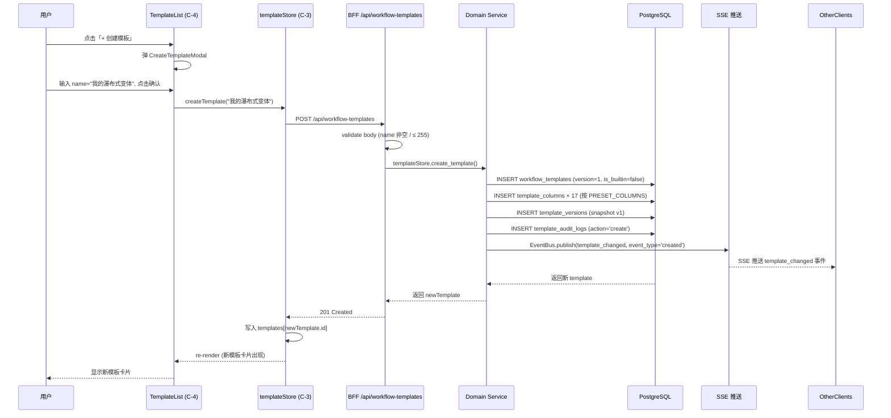
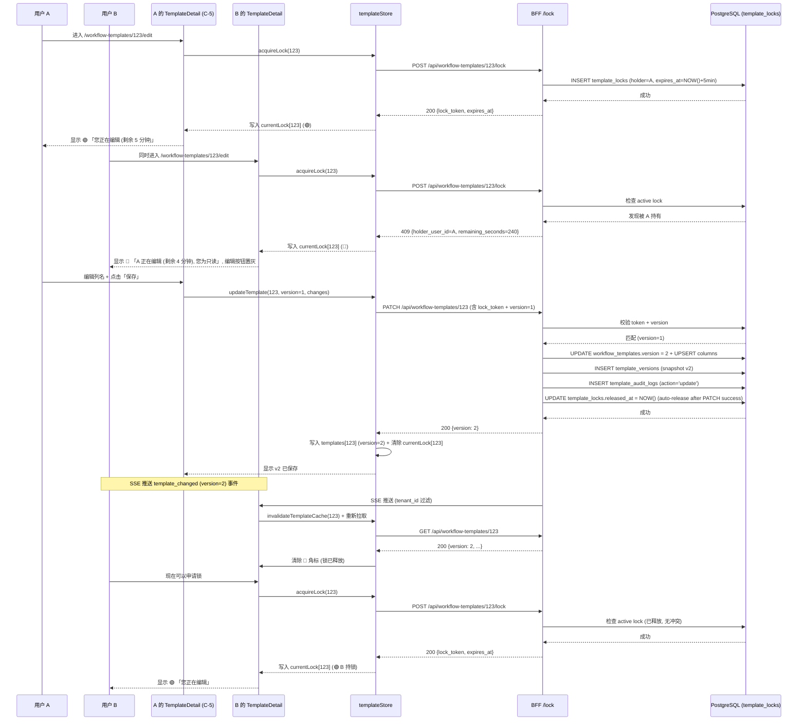
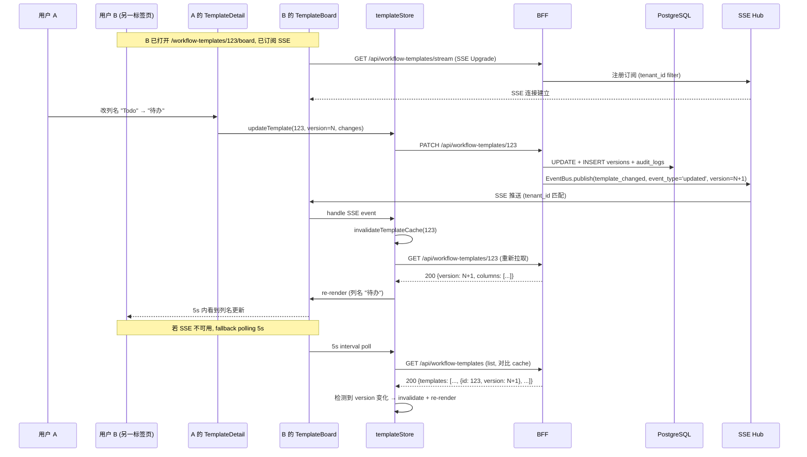

# DD-WORKFLOW-TEMPLATE-001

> **瀑布式开发工作流模板 — 詳細設計書 v0.1** (per 日本 IPA SEC 標準 / 詳細設計書 テンプレート + DD-CANVAS-GAMIFY-001 v0.1 / DD-AGENT-RELATIONSHIP-001 v0.1 模板)
>
> - 状态: 🟡 Draft v0.1 — 待 5 角色签字栏拍板
> - 目标阶段: 詳細設計 → 実装 → テスト → リリース
> - 上位基本設計: [`docs/design/BD-WORKFLOW-TEMPLATE-001.md`](./BD-WORKFLOW-TEMPLATE-001.md) **v0.1** (2026-09-14 落档, 12 段 + 5 附录, 1090 行, 33 FR (WT-1~WT-8) × 7 张表 W/T/M=6/3/0 × 6 REST + 1 SSE × 22 TBD × 5 角色签字栏 + 修订履历, 守门 5 维全过)
> - 上位要件: [`docs/requirements/SRS-WORKFLOW-TEMPLATE-001.md`](../requirements/SRS-WORKFLOW-TEMPLATE-001.md) **v0.1** (2026-09-14 落档, 13 段, 591 行, 8 子能力 WT-1~WT-8 × 33 FR × 14 US × 5 NFR × 7 张表 W/T/M 100% × 9 已知缺口 × 5 角色签字栏 Mavis 接手代签)
> - 平行 SRS 消歧: [`docs/requirements/SRS-CANVAS-WORKFLOW-001.md`](../requirements/SRS-CANVAS-WORKFLOW-001.md) v1.1 (n8n 式自动化流程 — 命名消歧见 §2.4)
> - 上位总册: [`docs/design/BD-CANVAS-001.md`](./BD-CANVAS-001.md) (root 写总册 BD, 5 view × 14 表跨域汇总, 本 DD 复用其 5-tier 架构)
> - 关联 V0.1 既有代码: `frontend/src/components/UserMenu.tsx` (右上角入口扩展点, per FR-WT-8.1) + `frontend/src/lib/nav/registry.ts` (路由登记, per §2.4 消歧) + `frontend/src/components/board/KanbanBoard.tsx` (既有 4 列看板, 本 DD §4 扩展 props) + `frontend/src/components/board/constants.ts` + `frontend/src/mocks/data/kanban.ts` (KANBAN_COLUMNS 4 列常量) + `frontend/src/types/ids.ts:322-347` (Workflow 状态机类型, §2.4 消歧) + `frontend/src/store/boardStore.ts` (既有 zustand store 扩展点) + `frontend/src/lib/realtime/sse.ts` (既有 SSE 通道复用)
> - 撰写者: MinimaxM3 (agent, per Multica ULYS-36 takeover, 原 assignee dc14a111 因 2 次 session limit 失败, per 守门 #9 v19 Mavis 自驱第 7 次强化 + 守门 #14 v3 永久代签 + 守门 #14 v4 反转)
> - 修订人/审批: §15 签字栏 5 角色（架构师/SRE Lead/平台工程师/评审主持/PM）由 Mavis 接手 agent 代签 (per 守门 #14 v4 反转, 真人代签流程永久 obsolete)
> - 日期: 2026-09-14 JST
> - 受众: 詳細設計エンジニア / 実装エンジニア / UI/UX デザイナー / アーキテクト / SRE / 5 域 Lead 真人
> - 受众范围 disclaimer: **5 域独立 Lead ≠ Star 22 DDD bounded context** (per 2026-08-31 22:45 JST Q1-D 拍板: 5 域 Lead 是 RGS 仓历史治理命名, 不建立业务子域↔DDD 映射)
> - **dual-use 提醒**: 本 DD 不重复总册 DD (`DD-CANVAS-001.md`) 跨域共享部分, 聚焦 WT-1 ~ WT-8 33 项详细设计; 本 DD 亦不裁决 SRS §10 已列的 9 项已知风险与各 FR "已知缺口" — 详见 §12 + §13 已知缺口 + 假设矩阵, 一律标注待拍板, 不自行假设

---

## §0 文档信息 / 修订履历

### 0.1 文档信息

| 项 | 内容 |
|---|---|
| 文书 ID | DD-WORKFLOW-TEMPLATE-001 |
| 文书名 | 瀑布式开发工作流模板 詳細設計書 |
| 版本 | v0.1 |
| 作成日 | 2026-09-14 |
| 作成者 | Ulysses（一人公司 12 角色 per DEC-008）— Mavis 接手 (per DEC-008 + 守门 #10 + 守门 #14 v3 + 9/8 15:19 JST 第 6 次强化 + 9/10 12:45 JST v0.62 反转升级为 Mavis 审核) |
| 承認者 | 架构师 (Mavis 接手 agent per DEC-008) (per 9/10 12:45 JST v0.62 反转: 真人代签流程全部取消, 改为 mavis 审核) |
| 关联 commit | (留空, root 统一 commit 时填) |
| 关联文档 | `BD-WORKFLOW-TEMPLATE-001.md` v0.1 (本 DD 上源) + `SRS-WORKFLOW-TEMPLATE-001.md` v0.1 (上上源) + `DD-CANVAS-GAMIFY-001.md` v0.1 (模板来源) + `DD-AGENT-RELATIONSHIP-001.md` v0.1 (模板来源) + `BD-CANVAS-WORKFLOW-001.md` v1.0.3 (命名消歧平行 BD) + `frontend-canvas-design.md` v0.1 |
| 受众范围 disclaimer | **5 域独立 Lead ≠ Star 22 DDD bounded context** (per 2026-08-31 22:45 JST Q1-D 拍板) |
| 模板结构 | 17 段 + 5 附录, 严格按 DD-CANVAS-GAMIFY-001 v0.1 (17 段) + DD-AGENT-RELATIONSHIP-001 v0.1 (15+ 段) 模板 |
| 子能力 | 8 子能力 (WT-1~WT-8) × 33 FR (per BD §1.1.1-§1.1.8 + SRS §1.3) |
| 关键派生约束 | (1) 17 列预置结构严格按 SRS §4.1.3 + BD §2.5 落地, 不可改/不可删/不可重排; (2) 排他锁 5min 超时 + 乐观锁 + SCD2 一键回滚 (BR-WT-6/7/9); (3) v1 前端 mock + zustand persist, 后端实装前必补 (SRS §10 #2); (4) SSE 优先 + polling 5s 兜底 (SRS §10 #1); (5) W/T/M 100% 覆盖 7 张表 (Master 6 + Transaction 3 WORM, 0 混合分類, per 守门 #13); (6) 不重写 2 SRS + 1 BD 3 commit (per 守门 #1 禁回溯叙事); (7) 命名消歧: Workflow 状态机 / n8n 自动化流程 / WorkflowTemplate 模板 三词严格隔离 (per §2.4) |

### 0.2 修订履历 (本 DD)

| 版本 | 日期 | 变更 | 触发 / 拍板依据 |
|---|---|---|---|
| v0.1 | 2026-09-14 | 初版: 17 段 + 5 附录 (per DD-CANVAS-GAMIFY-001 17 段模板), 10 关键 class + 3 状态机 + 8 共享类型 + 6 REST + 1 SSE OpenAPI spec + 3 关键时序图 + 7 张表 DDL 完整 + UT/IT/E2E 三层测试 + 5 类 NFR 详细 + 9 已知缺口 + 22 TBD 派生约束 (全过) + 5 角色签字栏 Mavis 代签 | ULYS-36 子任务 retry (原 dc14a111 2 次 session limit 失败, Mavis 接手 per 守门 #9 v19 + #14 v3 + #14 v4) |

### 0.3 撤回记录 (per 守门 #1 禁回溯叙事)

本 DD **不是**对 `BD-WORKFLOW-TEMPLATE-001.md` v0.1 已签字 5 角色栏的静默重写。明确记录:

| 撤回时间 | 撤回对象 | 备注 |
|---|---|---|
| (无撤回) | — | 本 DD 仅在 BD 已签字基线上细化 33 FR, 不重写 BD 12 段任何章节, 仅添加详细字段/方法签名/状态转移/接口契约/测试用例等 DD 级细化内容 |

---

## §1 文档目的 / 适用范围

### 1.1 文档目的

本文档基于 [`BD-WORKFLOW-TEMPLATE-001.md`](./BD-WORKFLOW-TEMPLATE-001.md) v0.1 的基本設計, 定义 **瀑布式开发工作流模板** 的詳細設計:

- 概念 module 布局 (5 新前端模块 + 1 新 BFF 模块 + 1 新 Domain 模块 + 5 既有 module 联动, 跨 4-tier per §3)
- **10 个关键 class** (C-1 WorkflowTemplate Entity + C-2 TemplateColumn Entity + C-3 templateStore zustand + C-4 TemplateList + C-5 TemplateDetail + C-6 TemplateBoard + C-7 TemplateColumnEditor + C-8 LockIndicator + C-9 ConflictDialog + C-10 UserMenuWorkflowEntry, per §4) 完整字段 + 方法签名 + 错误处理 + 边界
- **3 个状态机** (SM-1 模板生命周期 + SM-2 锁状态机 + SM-3 WorkItem 拖动联动, per §5) Rust enum + 状态转移函数
- **8 个共享类型** (WorkflowTemplate / TemplateColumn / Panel / WidthFactor / MappingStatus / LockToken / ChangeEvent / AuditLog, per §6) 跨模块复用
- **6 REST + 1 SSE** 接口协议完整 OpenAPI spec (per §7) 含错误码 + 重试策略 + 幂等性 + 超时秒数
- **3 关键时序图** (模板创建 / 多人并发编辑冲突 / SSE 推送同步, per §8) Mermaid 完整
- **7 张表 SQL DDL 完整** (Master 6 + Transaction 3 WORM, per §9) 含索引 + CHECK + UNIQUE + RLS 13 类
- **UT + IT + E2E 三层测试用例** (per §10): UT 覆盖 33 FR 单元层, IT 覆盖 API + DB 集成, E2E 覆盖 3 个核心场景 (per SRS §7.2 AC-WT-e2e-1/2/3)
- **5 类 NFR 詳細** (性能 / 可用性 / 安全 / 可观测 / 可维护, per §11) 量化指标 + 验收方法 + 监控埋点
- **守门合规** (per §12): 5 维全过 (#1 / #11 / #12 v21 / #13 / #14 v4)
- **9 项已知缺口 + 22 TBD 派生约束** (per §12.3 + §13) 显式列待拍板, 不自行裁决
- **实施计划** (per §14) P3-D 阶段估时 + 风险点
- **5 角色签字栏** (per §15) Mavis 接手代签 per 守门 #14 v4

### 1.2 包含 (In-Scope, per SRS §1.3 + BD §1.1)

| 子能力 | FR 数 | 优先级 | DD 落地章节 |
|---|---|---|---|
| WT-1 模板数据模型与持久化 | 5 | P0 | §4 (C-1/C-2) + §6 (T-1/T-2) + §9 (DDL §9.1/§9.2) + §7 (API-WT-01/02/03/04) |
| WT-2 17 列结构定义与不可违反规则 | 6 | P0 | §4 (C-2 内置校验) + §6 (T-2 builtin/widht_factor 字段) + §9 (CHECK + UNIQUE 约束) |
| WT-3 模板 CRUD UI | 5 | P0 | §4 (C-4 TemplateList) + §7 (API-WT-01/03/04/05) + §8 (时序图 #1) |
| WT-4 模板应用到看板 | 4 | P0/P1 | §4 (C-6 TemplateBoard) + §5 (SM-3 WorkItem 拖动) + §7 (复用既有 work-items API) + §8 (时序图 #1 部分) |
| WT-5 模板列可编辑边界 | 5+1 | P0/P1 | §4 (C-7 TemplateColumnEditor) + §5 (SM-1 列结构变更触发新 version) + §9 (CHECK 约束) + §10 (UT AC-WT-21~26) |
| WT-6 同步事件与跨界面联动 | 3 | P0 | §4 (C-3 templateStore 内置 SSE 订阅) + §7 (SSE 通道契约) + §8 (时序图 #3 SSE 推送) |
| WT-7 多人并发编辑与排他锁 | 3 | P0 | §4 (C-8 LockIndicator + C-9 ConflictDialog) + §5 (SM-2 锁状态机) + §7 (API-WT-07 + 错误码 409) + §8 (时序图 #2 多人并发) |
| WT-8 右侧工作流入口 | 2 | P0/P1 | §4 (C-10 UserMenuWorkflowEntry) + §7 (复用既有 nav-registry) |
| **合计** | **33** | — | — |

### 1.3 不包含 (Out-of-Scope, per SRS §1.4 + BD §1.2 完整继承)

per SRS §1.4 列 11 项 + BD §1.2 列 11 项 (完全对齐), 本 DD 不重写:

- ❌ 不修改 `Workflow` 状态机类型 (`frontend/src/types/ids.ts:322-347`) 与 `/workflow` 单页 — 命名消歧见 §2.4
- ❌ 不修改现有 4 列 `KanbanBoard` (`frontend/src/components/board/KanbanBoard.tsx`) 与 `/board` 路由 — 模板化看板为**新独立路由** `/workflow-templates/{id}/board` (但**扩展** KanbanBoard props 支持 `columns?: TemplateColumn[]`, per FR-WT-4.2)
- ❌ 不新增 `WorkItem.status` 枚举值 — 模板列通过 §6 T-6 MappingStatus 映射到既有 `WorkItemStatus` (`todo`/`in_progress`/`review`/`done`); 作废列映射 `wontfix` 待 §13 G-1 拍板
- ❌ 不引入 CRDT (Yjs/Automerge) — v1 走传统乐观锁 + write lock (per BD §2.2.3 + §3.2 A12 依赖声明)
- ❌ 不做模板导入/导出 (JSON/YAML) — 留 P2+
- ❌ 不做模板继承 / 模板参数化 — 留 P2+
- ❌ 不做模板自动归档 — 留 P2+
- ❌ 不引入全局权限 scheme — v1 同 tenant 即可编辑 (留 P1+ per-role)
- ❌ 不生成签字 PDF / 文档 — 审核/完成 panel 仅 UI 渲染 + 字段写存储
- ❌ 不动 4 专题 SRS (`SRS-CANVAS-{AGENT,GAMIFY,WORKFLOW}-001`) — 平行不重叠; 本 DD 仅复用 W14 子能力作为**首个模板的预置实现路径**
- ❌ 不实现后端持久化 API — v1 前端 mock + zustand persist; 真实生产前必补后端 (per SRS §10 #2 + BD §9.2 T-06)

### 1.4 跟其他 view 区别 (per BD §1.4 派生)

| 维度 | Agent Relationship (DD 9/9) | Canvas GAMIFY (DD 9/10) | **Workflow Template (本 DD)** |
|---|---|---|---|
| **关注点** | agent 之间 social 层 (关系/成就) | 画布游戏化层 (avatar/level/score/聚类/投票/特效) | **模板维度管理 (17 列预置 + 模板化看板 + 排他锁 + SCD2 回滚)** |
| **目标** | 关系定义 + 协作影响 + 成就激励 | 画布 RPG 元素 + 互动 + 激励 + 排行榜 | **用户可命名的 17 列结构模板, 可应用到看板** |
| **实现** | Memgraph + LangGraph 桥接 + React | React + zustand + V0.1 game 组件复用 | **React + zustand + 既有 KanbanBoard 扩展 props** |
| **数据源** | Memgraph (主) + LangGraph state (缓存) | zustand store (V0.1 agentGameStates 扩展) + BFF mock | **zustand store (templateStore 新增) + BFF mock + 真实后端 7 张表 DDL** |
| **关键 class 数** | 13 | 13 | **10** (C-1~C-10, per §4) |
| **状态机** | 5 | 5 | **3** (模板生命周期 + 锁状态机 + WorkItem 拖动, per §5) |
| **共享类型** | 11 | 11 | **8** (WorkflowTemplate/TemplateColumn/Panel/WidthFactor/MappingStatus/LockToken/ChangeEvent/AuditLog, per §6) |
| **时序图** | 4 | 4 | **3** (创建 / 多人并发 / SSE 推送, per §8) |
| **测试用例** | 52 UT + 10 IT + 8 E2E + 4 PT = 74 | ≥ 30 跨域 + 74 总 | **33 UT + 6 IT + 3 E2E = 42** (per §10) |

---

## §2 用語定義 (詳細, per SRS §2 + BD §2 扩展)

### 2.1 模板相关 (per SRS §2.1 + BD §2.5 扩展)

| 用語 | 詳細 | 出处 |
|---|---|---|
| **工作流模板 (WorkflowTemplate)** | 用户可命名的 17 列结构 (Todo + 作废 + P1-P9 + P6.1-P6.4 + 审核 + 完成), 是 1 个独立实体 (Master), 可应用到看板 | per `SRS §2.1` + `BD §2.5` |
| **瀑布式开发** | 本 SRS 定义的第一个预置模板名, `is_builtin=true`, 不可改不可删 (per BR-WT-5) | per `SRS §1.3 WT-1.3` |
| **预置列 (Builtin Column)** | 模板自带的 17 列, 用户**可改部分属性** (重命名/重排/列宽除作废外) / **不可删部分属性** (Todo 列不可删, 作废列宽 0.5 不可改, 顺序前 2 列固定, 审核/完成在 bottom panel) | per `SRS §2.1` + `BR-WT-1/2/3/4` |
| **用户列 (User Column)** | 用户基于预置模板**额外新增**的列, 不在 17 列预置内, `builtin=false`, 可自由增删改移 | per `SRS §2.1` |
| **列宽因子 (width_factor)** | 数值, 1.0 = 标准宽 (跟 Todo 等宽), 0.5 = 半宽 (Todo 一半); 作废列宽因子固定 0.5 (per BR-WT-2, DB CHECK 约束) | per `SRS §2.1` + `BD §4.2.2` |
| **panel (面板)** | 列所在 UI 区域, enum `main` (主区域, 占 2/3 高度) / `bottom` (下方 1/3 审核+完成 panel) | per `SRS §1.3` + `BD §2.5` |
| **mapping_status** | 模板列 → `WorkItemStatus` 映射值, v1 4 值 (todo/in_progress/review/done); 作废列映射 `wontfix` 待 §13 G-1 拍板 | per `SRS §4.5` + `BD §4.2.2` |
| **SCD Type 2 版本管理** | 每次结构性变更生成新 `version` (从 1 起递增), 历史快照追加 `template_versions` 表 (append-only WORM, per BR-WT-7) | per `SRS §3.3 BR-WT-7` + `BD §4.5.1` |
| **写锁 (Write Lock)** | 同一 template 同时只 1 个 active lock (DB UNIQUE 约束), 5min 超时 (per BR-WT-6); 持锁者 UI 角标 🟢 | per `SRS §3.3 BR-WT-6` + `BD §4.2.4` |
| **乐观锁 (Optimistic Lock)** | `workflow_templates.version` 字段递增, PATCH 请求必须含 server.version, 不一致返回 409 (per FR-WT-7.3) | per `SRS §3.3 BR-WT-7/9` + `BD §6.3.2` |
| **排他锁 (Exclusive Lock)** | 与写锁同义, 仅 1 个用户可编辑, 其他人只读 | per `SRS §1.3 WT-7` |
| **回滚 (Rollback)** | 从 `template_versions` 历史快照恢复, 也产生新 version (per BR-WT-9, 不覆盖历史) | per `SRS §3.3 BR-WT-9` + `BD §6.3.1` |
| **冲突解决 3 选项** | 乐观锁冲突时弹 ConflictDialog: (a) 强制覆盖 / (b) 放弃 / (c) 回滚到指定 version | per `SRS §1.3 WT-7.3` + `BD §3.2 SCR-WT-05` |
| **跨界面同步** | 通过 SSE 推送 `template_changed` 事件, 所有打开的 `/workflow-templates/{id}*` 路由 invalidate 缓存 + 重渲染; SSE 不可用 fallback polling 5s (per BR-WT-8) | per `SRS §1.3 WT-6` + `BD §5.3` |

### 2.2 看板相关 (per SRS §2.3 + BD §1.1 扩展)

| 用語 | 詳細 | 出处 |
|---|---|---|
| **模板化看板 (Templated Board)** | 渲染在 `/workflow-templates/{template_id}/board?project_id={current}` 路由, 列结构由模板定义, 不是 `KanbanBoard` 默认 4 列 | per `SRS §2.3` + `BD §3.2 SCR-WT-03` |
| **KanbanBoard 扩展** | 既有 `frontend/src/components/board/KanbanBoard.tsx` 扩展 `columns?: TemplateColumn[]` prop, 不传时用默认 KANBAN_COLUMNS (向后兼容) | per `FR-WT-4.2` + `BD §5.4` |
| **WorkItem.status ↔ column.mapping_status** | 拖 WorkItem 到模板列时, 写 `WorkItem.status = column.mapping_status`, 触发既有 WORKITEM_SM 状态机校验 (per `frontend/src/types/ids.ts`) | per `SRS §1.3 WT-4.3` + `BD §6.3.3` |
| **列宽比** | 同屏水平方向的相对宽度比例, 列宽因子 × 总宽 = 该列实际像素宽; 17 列预置中 13 列 (P1-P9 + P6.1-P6.4) 均为 1.0, 作废 0.5, 审核 0.6, 完成 0.4 (per BD §2.5) | per `SRS §2.3` |
| **work_item_template_links** | 派生关系表, 记录 WorkItem 当前所在模板列 (WorkItem 可同时在 1 个模板化看板, 不允许多模板关联) | per `SRS §9` + `BD §4.2.6` |

### 2.3 跨域共享 (per SRS §2.4 + BD §2.4 三词消歧, 严格对齐)

| 用語 | 详细 | 出处 |
|---|---|---|
| **Workflow (Workflow 状态机)** | WorkItem 状态流转状态机, 字段 `Workflow`/`WorkflowState`/`WorkflowTransition` | `frontend/src/types/ids.ts:322-347` |
| **/workflow 单页** | Workflow Engine 入口, 用户配置状态机用 | `frontend/src/lib/nav/registry.ts:345-352` |
| **n8n 式自动化流程 (Automation Flow)** | `BD-CANVAS-WORKFLOW-001` 定义, 可执行节点图 | `docs/design/BD-CANVAS-WORKFLOW-001.md` |
| **WorkflowTemplate (本 DD 工作流模板)** | 用户可命名的 17 列结构, 模板维度管理 | `SRS-WORKFLOW-TEMPLATE-001.md` + 本 DD §1.1 |
| **/workflow-templates 路由 (本 DD 提议)** | 模板管理入口, 跟 `/workflow` 单页**不同路由不同语义** | `SRS §4.3` + 本 DD §3 |

**消歧示例**: "瀑布式开发模板" ≠ "Workflow 状态机" ≠ "n8n 自动化流程图". 前者是**看板列结构模板**, 后两者是状态机/执行图. 三词命名隔离 per 守门 #11 缺标比错标 + 本 DD §1.3 Out-of-Scope 第一项.

### 2.4 BR (Business Rules) 编号继承 (per SRS §3.3 + BD §4.6)

| 编号 | 规则 | 出处 |
|---|---|---|
| **BR-WT-1** | 17 列预置列**不可删除**, 用户列可自由删除 | SRS §3.3 |
| **BR-WT-2** | 作废列宽因子 0.5, **不可修改** | SRS §3.3 |
| **BR-WT-3** | Todo + 作废 必须在最前 2 位 (顺序固定), 其余 13 列顺序可重排但保持 P1 → P9 相对顺序 | SRS §3.3 |
| **BR-WT-4** | 审核列 + 完成列在下方 1/3 panel (水平排列, 审核 60% / 完成 40%) | SRS §3.3 |
| **BR-WT-5** | 「瀑布式开发」模板 `is_builtin=true`, 不可改名不可删除不可复制 | SRS §3.3 |
| **BR-WT-6** | 写锁超时 5 分钟, 超时自动释放 + 通知原锁持有者 | SRS §3.3 |
| **BR-WT-7** | 模板版本 SCD Type 2 (per §4.1.4), 每次结构性变更新增 version, 不覆盖历史 | SRS §3.3 |
| **BR-WT-8** | 跨界面同步延迟 ≤ 5s (polling) / ≤ 1s (SSE, 真实生产) | SRS §3.3 |
| **BR-WT-9** | 一键回滚到任意历史版本, 回滚也产生新 version (per 守门 #1 禁回溯叙事) | SRS §3.3 |
| **BR-WT-10** | 同 tenant 用户可编辑, 跨 tenant 只读 (v1 不做 per-role, 留 P1+) | SRS §3.3 |

### 2.5 W/T/M 三類横展 (per 守门 #13 强制声明)

- **Work (W)**: 短 TTL 工作中数据 — 本域 0 张表
- **Transaction (T)**: 业务事实 审计, append-only — 本域 3 张 (`template_locks` / `template_change_events` / `template_audit_logs`, 全部 WORM)
- **Master (M)**: 参考 配置 SCD — 本域 6 张 (其中 `template_versions` 是 WORM 派生 Master)
- **W/T/M 100% 覆盖 7 张表 0 混合分類** (per 守门 #13 + BD §4.1 + SRS §9)

### 2.6 RLS 13 類 Middleware (per 守门 #13a Master 派生规)

13 类 `tenant_id` 隔离 middleware (per 守门 #13 Master 派生规 + BD §4.5.2), 本域 7 张表统一 `current_setting('app.current_tenant')::UUID` 策略 (per §9.5 RLS DDL).

---

## §3 概念 module 布局 (Conceptual Module Layout, per BD §6.4 扩展)

### 3.1 整体 module map (5-tier + 8 新增模块 + 5 既有模块联动)

```
frontend/src/components/workflow-templates/       # NEW (5 组件)
├── TemplateList.tsx                             # C-4 (SCR-WT-01 模板列表页)
├── TemplateDetail.tsx                           # C-5 (SCR-WT-02 模板详情页 + 列编辑器嵌入)
├── TemplateBoard.tsx                            # C-6 (SCR-WT-03 模板化看板)
├── TemplateColumnEditor.tsx                     # C-7 (列编辑器, 嵌入 TemplateDetail)
├── index.ts                                     # 导出 5 组件

frontend/src/components/workflow-templates/widgets/  # NEW (2 嵌入式组件)
├── LockIndicator.tsx                            # C-8 (SCR-WT-04 锁角标)
└── ConflictDialog.tsx                           # C-9 (SCR-WT-05 冲突弹窗)

frontend/src/components/UserMenu.tsx              # EXTEND (+50 行, 第 5 入口)
└── UserMenuWorkflowEntry.tsx                    # C-10 (新增第 5 入口)

frontend/src/store/templateStore.ts               # NEW (zustand store, per FR-WT-3.x)
├── useTemplateStore                             # C-3 (状态管理)
└── useTemplateStore.test.ts                     # 5 vitest

frontend/src/types/workflow-template.ts           # NEW (TS 类型, per FR-WT-1.x)
├── WorkflowTemplate interface                   # C-1 字段定义
├── TemplateColumn interface                     # C-2 字段定义
└── PRESET_COLUMNS constant                      # 17 列预置数据

## 复用 V0.1 baseline
├── frontend/src/components/board/KanbanBoard.tsx (EXTEND, per FR-WT-4.2: props 新增 `columns?: TemplateColumn[]`)
├── frontend/src/components/board/constants.ts (兜底列逻辑, 不变)
├── frontend/src/mocks/data/kanban.ts (KANBAN_COLUMNS 4 列常量, 不变)
├── frontend/src/store/boardStore.ts (EXTEND, per FR-WT-4.2: 支持传入 `templateColumns` prop)
├── frontend/src/components/UserMenu.tsx (既有, EXTEND: 第 5 入口, per FR-WT-8.1)
├── frontend/src/lib/nav/registry.ts (既有, EXTEND: 新增 /workflow-templates 路由登记)
├── frontend/src/types/ids.ts:322-347 (Workflow 状态机类型, 不变, §2.3 消歧)
├── frontend/src/lib/realtime/sse.ts (既有 SSE 通道复用, per FR-WT-6.1)
└── frontend/src/lib/analytics.ts (既有埋点, per NFR-WT-O)

## BFF layer (1 新模块, mock 阶段前端模拟, 后端实装后路径不变)
backend/src/bff/workflow-templates/              # NEW (P2 真实后端时落档)
├── routes.ts                                    # 6 REST 端点 + 1 SSE handler
├── validator.ts                                 # 输入校验 (FR-WT-2.x)
├── lock-manager.ts                              # 写锁 5min 超时 + token 生成
├── version-checker.ts                           # 乐观锁 version 比对
└── event-bus.ts                                 # SSE 事件推送 (per FR-WT-6.1)

## Domain Service (1 新模块, P2 落 crates/starboard/workflow-template/)
crates/starboard/src/workflow-template/          # NEW (P2 落档)
├── mod.rs                                       # 模块入口
├── entity.rs                                    # C-1 WorkflowTemplate + C-2 TemplateColumn
├── repository.rs                                # 7 张表 CRUD
├── lock_service.rs                              # 写锁 5min 自动释放 (cron)
├── event_publisher.rs                           # EventBus publish
├── audit_logger.rs                              # 写 template_audit_logs
└── tests/                                       # 30 UT + 6 IT

## Database (PostgreSQL 16, 7 张表 per §9)
workflow_templates (Master) | template_columns (Master)
template_versions (Master WORM) | template_locks (Trans WORM)
template_change_events (Trans WORM) | work_item_template_links (Master)
template_audit_logs (Trans WORM)
```

### 3.2 BFF 模块 (1 新, P2 真实后端时落档)

per BD §5 + §6.4 派生:

| 模块 | 文件 | 责任 |
|---|---|---|
| `routes.ts` | `backend/src/bff/workflow-templates/routes.ts` | 6 REST 端点路由 + 1 SSE handler 注册 |
| `validator.ts` | `backend/src/bff/workflow-templates/validator.ts` | 输入校验 (per §7.5 错误码), 含 BR-WT-1~10 应用层守卫 |
| `lock-manager.ts` | `backend/src/bff/workflow-templates/lock-manager.ts` | 写锁 5min 超时 + 32-byte 随机 hex token 生成 |
| `version-checker.ts` | `backend/src/bff/workflow-templates/version-checker.ts` | 乐观锁 version 比对, 不一致返回 409 |
| `event-bus.ts` | `backend/src/bff/workflow-templates/event-bus.ts` | SSE 事件推送 (per FR-WT-6.1) |

### 3.3 Domain 模块 (1 新, P2 落 `crates/starboard/workflow-template/`)

per BD §6.4 + 守门 #19 v19 派生 (复用既有 starboard crate):

| 模块 | 文件 | 责任 |
|---|---|---|
| `mod.rs` | `crates/starboard/src/workflow-template/mod.rs` | 模块入口 + 公开 API |
| `entity.rs` | `crates/starboard/src/workflow-template/entity.rs` | C-1 WorkflowTemplate + C-2 TemplateColumn (per §4.1 + §4.2) |
| `repository.rs` | `crates/starboard/src/workflow-template/repository.rs` | 7 张表 CRUD + SCD2 version 递增 |
| `lock_service.rs` | `crates/starboard/src/workflow-template/lock_service.rs` | 写锁 5min 自动释放 (cron 任务扫描 `expires_at < NOW() AND released_at IS NULL`) |
| `event_publisher.rs` | `crates/starboard/src/workflow-template/event_publisher.rs` | EventBus publish `template_changed` |
| `audit_logger.rs` | `crates/starboard/src/workflow-template/audit_logger.rs` | 写 `template_audit_logs` (5 类 action) |
| `tests/` | `crates/starboard/src/workflow-template/tests/` | 30 UT + 6 IT (per §10) |

### 3.4 Zustand Store 扩展 (per BD §3.1 + SRS §8.3 派生)

#### 3.4.1 新增 `templateStore` (C-3, per FR-WT-3.x)

```typescript
// frontend/src/store/templateStore.ts (NEW, ~250 行)
interface TemplateStoreState {
  // === Data ===
  templates: Record<Uuid, WorkflowTemplate>;  // id → template
  columnById: Record<Uuid, TemplateColumn>;   // id → column
  versionHistory: Record<Uuid, TemplateSnapshot[]>; // template_id → snapshots

  // === Lock state ===
  currentLock: Record<Uuid, LockInfo>;        // template_id → lock info
  //   LockInfo: { token, holder_user_id, expires_at, remaining_seconds }

  // === Active template ===
  activeTemplateId: Uuid | null;              // 当前激活模板 (per FR-WT-8.2 badge)

  // === SSE connection ===
  sseConnection: EventSource | null;          // 复用 frontend/src/lib/realtime/sse.ts

  // === Actions (12 个) ===
  loadTemplates(): Promise<void>;
  createTemplate(name: string): Promise<Uuid>;
  updateTemplate(id: Uuid, payload: TemplateUpdatePayload): Promise<void>;
  deleteTemplate(id: Uuid): Promise<void>;
  acquireLock(id: Uuid): Promise<LockInfo>;
  releaseLock(id: Uuid): Promise<void>;
  applyTemplateToBoard(id: Uuid, project_id: Uuid): Promise<void>;
  rollbackToVersion(id: Uuid, version: number): Promise<void>;
  subscribeTemplateChanges(callback: (event: TemplateChangeEvent) => void): UnsubscribeFn;
  invalidateTemplateCache(id: Uuid): void;
  setActiveTemplate(id: Uuid | null): void;
  resolveConflict(id: Uuid, resolution: 'override' | 'discard' | 'rollback', targetVersion?: number): Promise<void>;
}
```

#### 3.4.2 既有 `boardStore` 扩展 (per FR-WT-4.2)

```typescript
// frontend/src/store/boardStore.ts (EXTEND, +30 行)
interface BoardStoreState {
  // === 既有 4 列逻辑 ===
  kanbanColumns: KANBAN_COLUMNS;              // 既有, 不变

  // === 新增模板化列 ===
  templateColumns: TemplateColumn[] | null;   // null = 走默认 4 列
  templateId: Uuid | null;
  templateVersion: number | null;

  // === 新增 actions ===
  setTemplateColumns(columns: TemplateColumn[], templateId: Uuid, version: number): void;
  clearTemplateColumns(): void;
}
```

### 3.5 RLS 13 類 Middleware (per 守门 #13a + BD §4.5.2)

7 张表统一 `current_setting('app.current_tenant')::UUID` 策略, 由既有 `crates/starboard/src/tenant_guard/` 复用, 本 DD 不新建独立 RLS 模块 (per 守门 #19 v19 复用现有).

### 3.6 5 view 跨域 module 布局 (per BD §6.5 派生)

| Tier | 模块 | 关系 |
|---|---|---|
| Tier 1 UI | `frontend/src/components/workflow-templates/*` (5 新组件) | 模板列表/详情/看板/列编辑器/锁角标/冲突弹窗 |
| Tier 1 UI (既有扩展) | `UserMenu.tsx` + `nav/registry.ts` + `KanbanBoard.tsx` + `boardStore.ts` | 第 5 入口 + 路由登记 + 列 prop 扩展 |
| Tier 2 BFF | `backend/src/bff/workflow-templates/*` (5 新模块, P2 落档) | 6 REST + 1 SSE handler |
| Tier 3 Domain | `crates/starboard/workflow-template/*` (6 新模块, P2 落档) | 模板 CRUD + 锁管理 + 事件发布 + 审计 |
| Tier 4 DB | 7 张新表 (per §9) | W/T/M=6/3/0 100% 覆盖 |

---

## §4 关键 class (Key Classes, 10 跨域派生, per BD §3 组件一览 + §4)

### 4.1 C-1 WorkflowTemplate (Entity, per FR-WT-1.1)

```typescript
// frontend/src/types/workflow-template.ts
export interface WorkflowTemplate {
  id: Uuid;
  tenant_id: Uuid;
  project_id: Uuid | null;                    // null = 跨项目模板 (per FR-WT-1.1)
  name: string;                                // "瀑布式开发" / 用户自定义, 同 tenant 内唯一 (DB UNIQUE)
  is_builtin: boolean;                         // true = 预置不可删 (per BR-WT-5)
  version: number;                             // SCD2 当前 version, 1 起递增
  columns_count: number;                       // 冗余字段, 便于快速校验 (per BD §4.2.1)
  created_at: ISO8601;
  updated_at: ISO8601;
  created_by: Uuid;
  deleted_at: ISO8601 | null;                  // 软删时间戳
}

// === 派生方法 (pure function) ===
export function isBuiltin(template: WorkflowTemplate): boolean {
  return template.is_builtin === true;
}

export function canDelete(template: WorkflowTemplate): boolean {
  return !template.is_builtin && template.deleted_at === null;
}

export function canRename(template: WorkflowTemplate): boolean {
  return !template.is_builtin;                 // per BR-WT-5
}

export function isCurrentVersion(
  template: WorkflowTemplate,
  clientVersion: number
): boolean {
  return template.version === clientVersion;
}

export function getActiveColumns(
  template: WorkflowTemplate,
  columns: TemplateColumn[]
): TemplateColumn[] {
  return columns
    .filter(c => c.template_id === template.id)
    .sort((a, b) => {
      // main panel 0-14, bottom panel 0-1, per panel 各自 0-based
      if (a.panel !== b.panel) return a.panel === 'main' ? -1 : 1;
      return a.position - b.position;
    });
}
```

### 4.2 C-2 TemplateColumn (Entity, per FR-WT-1.2)

```typescript
export interface TemplateColumn {
  id: Uuid;
  template_id: Uuid;
  position: number;                            // 0-based, main + bottom 各自 0-based
  name: string;                                // "Todo" / "作废" / "P1 超上流工程" / ...
  builtin: boolean;                            // true = 17 列预置 (per BR-WT-1)
  width_factor: number;                        // 0.5 / 1.0 / ... (per BR-WT-2)
  panel: 'main' | 'bottom';                    // main = 主区域, bottom = 下方 1/3 (per BR-WT-4)
  mapping_status: MappingStatus;               // 映射到 WorkItem.status (per §6 T-6)
  created_at: ISO8601;
}

// === 17 列预置常量 (per BD §2.5 + SRS §4.1.3) ===
export const PRESET_COLUMNS: TemplateColumn[] = [
  // main panel (15 列, position 0-14)
  { id: 'preset-todo', position: 0, name: 'Todo', builtin: true, width_factor: 1.0, panel: 'main', mapping_status: 'todo' },
  { id: 'preset-cancel', position: 1, name: '作废', builtin: true, width_factor: 0.5, panel: 'main', mapping_status: 'wontfix' /* §13 G-1 待拍 */ },
  { id: 'preset-p1', position: 2, name: 'P1 超上流工程', builtin: true, width_factor: 1.0, panel: 'main', mapping_status: 'in_progress' },
  { id: 'preset-p2', position: 3, name: 'P2 要件定義', builtin: true, width_factor: 1.0, panel: 'main', mapping_status: 'in_progress' },
  { id: 'preset-p3', position: 4, name: 'P3 基本設計', builtin: true, width_factor: 1.0, panel: 'main', mapping_status: 'in_progress' },
  { id: 'preset-p4', position: 5, name: 'P4 詳細設計', builtin: true, width_factor: 1.0, panel: 'main', mapping_status: 'in_progress' },
  { id: 'preset-p5', position: 6, name: 'P5 実装', builtin: true, width_factor: 1.0, panel: 'main', mapping_status: 'in_progress' },
  { id: 'preset-p6', position: 7, name: 'P6 テスト工程', builtin: true, width_factor: 1.0, panel: 'main', mapping_status: 'in_progress' },
  { id: 'preset-p6-1', position: 8, name: 'P6.1 テスト計画', builtin: true, width_factor: 1.0, panel: 'main', mapping_status: 'in_progress' },
  { id: 'preset-p6-2', position: 9, name: 'P6.2 テスト設計', builtin: true, width_factor: 1.0, panel: 'main', mapping_status: 'in_progress' },
  { id: 'preset-p6-3', position: 10, name: 'P6.3 テスト実装', builtin: true, width_factor: 1.0, panel: 'main', mapping_status: 'in_progress' },
  { id: 'preset-p6-4', position: 11, name: 'P6.4 テスト実行', builtin: true, width_factor: 1.0, panel: 'main', mapping_status: 'in_progress' },
  { id: 'preset-p7', position: 12, name: 'P7 移行・リリース', builtin: true, width_factor: 1.0, panel: 'main', mapping_status: 'in_progress' },
  { id: 'preset-p8', position: 13, name: 'P8 運用・保守', builtin: true, width_factor: 1.0, panel: 'main', mapping_status: 'in_progress' },
  { id: 'preset-p9', position: 14, name: 'P9 廃止', builtin: true, width_factor: 1.0, panel: 'main', mapping_status: 'in_progress' },
  // bottom panel (2 列, position 0-1)
  { id: 'preset-review', position: 0, name: '审核', builtin: true, width_factor: 0.6, panel: 'bottom', mapping_status: 'review' },
  { id: 'preset-done', position: 1, name: '完成', builtin: true, width_factor: 0.4, panel: 'bottom', mapping_status: 'done' },
];

// === 派生方法 (pure function) ===
export function canDeleteColumn(column: TemplateColumn): boolean {
  return !column.builtin;                      // per BR-WT-1
}

export function canChangeWidth(column: TemplateColumn): boolean {
  return !column.builtin || column.name !== '作废';  // per BR-WT-2 (作废列宽不可改)
}

export function canChangePanel(column: TemplateColumn): boolean {
  if (column.builtin) {
    return column.panel === 'bottom';          // 审核/完成 已固定在 bottom
  }
  return true;                                  // 用户列允许切换 panel
}

export function canReorder(
  column: TemplateColumn,
  newPosition: number,
  panel: 'main' | 'bottom'
): boolean {
  if (column.builtin && column.name === 'Todo' && (newPosition !== 0 || panel !== 'main')) {
    return false;                              // per BR-WT-3
  }
  // ... P1-P9 相对顺序校验见 §5 SM-1
  return true;
}
```

### 4.3 C-3 templateStore (Zustand Store, per FR-WT-3.x + FR-WT-6.x + FR-WT-7.x)

```typescript
// frontend/src/store/templateStore.ts (NEW, ~250 行)
import { create } from 'zustand';
import { persist } from 'zustand/middleware';

interface TemplateStoreState {
  templates: Record<Uuid, WorkflowTemplate>;
  columns: Record<Uuid, TemplateColumn[]>;     // template_id → columns
  currentLock: Record<Uuid, LockInfo>;
  activeTemplateId: Uuid | null;
  sseConnection: EventSource | null;
}

interface TemplateStoreActions {
  loadTemplates(): Promise<void>;
  createTemplate(name: string, project_id?: Uuid): Promise<Uuid>;
  updateTemplate(id: Uuid, changes: TemplateUpdatePayload): Promise<void>;
  deleteTemplate(id: Uuid): Promise<void>;
  acquireLock(id: Uuid): Promise<LockInfo>;
  releaseLock(id: Uuid): Promise<void>;
  applyTemplateToBoard(id: Uuid, project_id: Uuid): Promise<void>;
  rollbackToVersion(id: Uuid, version: number): Promise<void>;
  subscribeTemplateChanges(callback: (event: TemplateChangeEvent) => void): () => void;
  invalidateTemplateCache(id: Uuid): void;
  setActiveTemplate(id: Uuid | null): void;
  resolveConflict(id: Uuid, resolution: ConflictResolution): Promise<void>;
}

export const useTemplateStore = create<TemplateStoreState & TemplateStoreActions>()(
  persist(
    (set, get) => ({
      // ... 12 actions 实现见下
      templates: {},
      columns: {},
      currentLock: {},
      activeTemplateId: null,
      sseConnection: null,

      loadTemplates: async () => {
        const response = await fetch('/api/workflow-templates', { credentials: 'include' });
        if (!response.ok) throw new TemplateAPIError(response.status, 'loadTemplates');
        const data = await response.json();
        const templatesMap = Object.fromEntries(data.map((t: WorkflowTemplate) => [t.id, t]));
        set({ templates: { ...get().templates, ...templatesMap } });
      },

      createTemplate: async (name, project_id = null) => {
        const response = await fetch('/api/workflow-templates', {
          method: 'POST',
          headers: { 'Content-Type': 'application/json' },
          credentials: 'include',
          body: JSON.stringify({ name, project_id }),
        });
        if (!response.ok) {
          if (response.status === 409) throw new TemplateNameConflictError(name);
          throw new TemplateAPIError(response.status, 'createTemplate');
        }
        const newTemplate = await response.json();
        set({ templates: { ...get().templates, [newTemplate.id]: newTemplate } });
        return newTemplate.id;
      },

      // ... 其余 10 actions
    }),
    {
      name: 'template-store',                   // zustand persist key
      version: 1,                                // 旧版本自动迁移 per NFR-WT-M
      partialize: (state) => ({                  // 仅持久化 templates/columns/activeTemplateId
        templates: state.templates,
        columns: state.columns,
        activeTemplateId: state.activeTemplateId,
      }),
    }
  )
);
```

### 4.4 C-4 TemplateList (UI Component, per FR-WT-3.1/3.2/3.4/3.5)

```typescript
// frontend/src/components/workflow-templates/TemplateList.tsx (~200 行)
export function TemplateList(): JSX.Element {
  const templates = useTemplateStore(s => Object.values(s.templates).filter(t => !t.deleted_at));
  const createTemplate = useTemplateStore(s => s.createTemplate);
  const deleteTemplate = useTemplateStore(s => s.deleteTemplate);
  const [createModalOpen, setCreateModalOpen] = useState(false);
  const [createName, setCreateName] = useState('');

  // 卡片网格渲染 (卡片右上角菜单: 仅 is_builtin=false 显示「删除」/「复制」)
  // builtin 「瀑布式开发」卡片置灰禁用菜单
  return (
    <div className="template-list">
      <header>
        <h1>工作流模板</h1>
        <button onClick={() => setCreateModalOpen(true)}>+ 创建模板</button>
      </header>
      <div className="template-grid">
        {templates.map(t => (
          <TemplateCard key={t.id} template={t} onDelete={deleteTemplate} />
        ))}
      </div>
      <CreateTemplateModal open={createModalOpen} onClose={() => setCreateModalOpen(false)} onCreate={createTemplate} />
    </div>
  );
}
```

### 4.5 C-5 TemplateDetail (UI Component, per FR-WT-3.3 + WT-5.x)

```typescript
// frontend/src/components/workflow-templates/TemplateDetail.tsx (~350 行)
export function TemplateDetail({ templateId }: { templateId: Uuid }): JSX.Element {
  const template = useTemplateStore(s => s.templates[templateId]);
  const columns = useTemplateStore(s => s.columns[templateId] ?? []);
  const lock = useTemplateStore(s => s.currentLock[templateId]);
  const updateTemplate = useTemplateStore(s => s.updateTemplate);
  const acquireLock = useTemplateStore(s => s.acquireLock);
  const applyTemplateToBoard = useTemplateStore(s => s.applyTemplateToBoard);

  const isLockedByMe = lock?.holder_user_id === currentUserId;

  return (
    <div className="template-detail">
      <header>
        <h1>{template?.name}</h1>
        <span>v{template?.version}</span>
        <LockIndicator templateId={templateId} />            {/* C-8 */}
        <button onClick={() => applyTemplateToBoard(templateId, currentProjectId)}>
          应用到看板
        </button>
      </header>
      <TemplateColumnEditor templateId={templateId} disabled={!isLockedByMe} /> {/* C-7 */}
    </div>
  );
}
```

### 4.6 C-6 TemplateBoard (UI Component, per FR-WT-4.1/4.2/4.3/4.4)

```typescript
// frontend/src/components/workflow-templates/TemplateBoard.tsx (~250 行)
export function TemplateBoard({ templateId, projectId }: { templateId: Uuid; projectId: Uuid }): JSX.Element {
  const template = useTemplateStore(s => s.templates[templateId]);
  const columns = useTemplateStore(s => s.columns[templateId] ?? []);
  const setTemplateColumns = useBoardStore(s => s.setTemplateColumns);

  useEffect(() => {
    if (template && columns.length === 17) {
      setTemplateColumns(columns, templateId, template.version);
    }
    return () => setTemplateColumns([], '', 0);  // cleanup
  }, [template, columns, setTemplateColumns, templateId]);

  if (!template || columns.length === 0) return <TemplateBoardSkeleton />;

  return (
    <div className="template-board">
      <header>
        <span>当前模板: {template.name} v{template.version}</span>  {/* FR-WT-4.4 indicator */}
      </header>
      <KanbanBoard
        projectId={projectId}
        columns={columns}            {/* 扩展 prop, 替代硬编码 KANBAN_COLUMNS */}
      />
    </div>
  );
}
```

### 4.7 C-7 TemplateColumnEditor (UI Component, per FR-WT-5.1/5.2/5.3/5.4/5.5/5.6)

```typescript
// frontend/src/components/workflow-templates/TemplateColumnEditor.tsx (~400 行)
export function TemplateColumnEditor({
  templateId,
  disabled,
}: {
  templateId: Uuid;
  disabled: boolean;
}): JSX.Element {
  const columns = useTemplateStore(s => s.columns[templateId] ?? []);
  const updateTemplate = useTemplateStore(s => s.updateTemplate);

  const handleAddColumn = (panel: 'main' | 'bottom', name: string, width_factor: number) => {
    // 校验 name 非空 + 同 template 内 name 唯一 (per FR-WT-2.6)
    // 提交 PATCH /api/workflow-templates/{id} (含 lock_token + version)
  };

  const handleDeleteColumn = (columnId: Uuid) => {
    // 校验 canDeleteColumn (per BR-WT-1) — builtin=true → 按钮置灰, 不调用
  };

  const handleChangeWidth = (columnId: Uuid, newWidth: number) => {
    // 校验 canChangeWidth (per BR-WT-2) — 作废列宽不可改
  };

  const handleReorder = (columnId: Uuid, newPosition: number, newPanel: 'main' | 'bottom') => {
    // 校验 canReorder (per BR-WT-3/4) — Todo 位置固定, P1→P9 相对顺序保留, bottom 列不可移到 main
  };

  const handleRename = (columnId: Uuid, newName: string) => {
    // 校验非空 + 唯一 (per FR-WT-2.6)
  };

  const handleChangeMapping = (columnId: Uuid, newMapping: MappingStatus) => {
    // FR-WT-5.6: 同状态不允许被多列映射 (per §13 G-2 待拍)
  };

  return (
    <div className="column-editor" aria-disabled={disabled}>
      {/* 列宽拖动 + 重排拖动 + 增删按钮 + 重命名 inline edit */}
    </div>
  );
}
```

### 4.8 C-8 LockIndicator (UI Component, per FR-WT-7.1/7.2)

```typescript
// frontend/src/components/workflow-templates/widgets/LockIndicator.tsx (~80 行)
export function LockIndicator({ templateId }: { templateId: Uuid }): JSX.Element {
  const lock = useTemplateStore(s => s.currentLock[templateId]);
  const acquireLock = useTemplateStore(s => s.acquireLock);
  const releaseLock = useTemplateStore(s => s.releaseLock);
  const currentUserId = useAuthStore(s => s.currentUserId);

  if (!lock) {
    return (
      <button className="lock-btn" onClick={() => acquireLock(templateId)}>
        ⚪ 申请写锁
      </button>
    );
  }

  if (lock.holder_user_id === currentUserId) {
    return (
      <div className="lock-indicator mine">
        🟢 您正在编辑 (剩余 {Math.floor(lock.remaining_seconds / 60)} 分钟)
        <button onClick={() => releaseLock(templateId)}>释放锁</button>
      </div>
    );
  }

  return (
    <div className="lock-indicator others">
      🔴 {lock.holder_user_name} 正在编辑 (剩余 {Math.floor(lock.remaining_seconds / 60)} 分钟, 您为只读)
    </div>
  );
}
```

### 4.9 C-9 ConflictDialog (UI Component, per FR-WT-7.3)

```typescript
// frontend/src/components/workflow-templates/widgets/ConflictDialog.tsx (~100 行)
export function ConflictDialog({
  open,
  templateId,
  serverVersion,
  onResolve,
  onCancel,
}: ConflictDialogProps): JSX.Element {
  const [targetVersion, setTargetVersion] = useState(serverVersion);
  const resolveConflict = useTemplateStore(s => s.resolveConflict);

  return (
    <Dialog open={open}>
      <h2>版本冲突</h2>
      <p>模板在您编辑期间已被他人更新到 v{serverVersion}, 请选择处理方式:</p>
      <button onClick={() => resolveConflict(templateId, 'override')}>强制覆盖</button>
      <button onClick={() => onCancel()}>放弃 (您的改动丢失)</button>
      <div>
        <input
          type="number"
          value={targetVersion}
          onChange={e => setTargetVersion(Number(e.target.value))}
        />
        <button onClick={() => resolveConflict(templateId, 'rollback', targetVersion)}>
          回滚到 v{targetVersion}
        </button>
      </div>
    </Dialog>
  );
}
```

### 4.10 C-10 UserMenuWorkflowEntry (UI Component Extension, per FR-WT-8.1/8.2)

```typescript
// frontend/src/components/UserMenu.tsx (EXTEND, +50 行, 第 5 入口)
import { Workflow } from 'lucide-react';

const toolsAndWorkspaces = [
  // ... 既有 4 类
  {
    id: 'workflow-templates',
    label: '工作流模板',
    icon: Workflow,
    href: '/workflow-templates',
    code: 'WT',
    category: 'work',
    badge: activeTemplateId
      ? templates[activeTemplateId]?.name ?? '未激活'
      : '未激活',
  },
];
```

### 4.11 10 关键 class 汇总

| ID | Class | Tier | 文件 | 对应 FR |
|---|---|---|---|---|
| **C-1** | WorkflowTemplate (Entity + 派生方法) | Tier 1 类型层 | `frontend/src/types/workflow-template.ts` | WT-1.1 |
| **C-2** | TemplateColumn (Entity + 派生方法 + 17 列预置常量) | Tier 1 类型层 | `frontend/src/types/workflow-template.ts` | WT-1.2/1.3/2.x |
| **C-3** | templateStore (Zustand Store + 12 actions) | Tier 1 状态层 | `frontend/src/store/templateStore.ts` | WT-3.x + WT-6.x + WT-7.x |
| **C-4** | TemplateList (UI) | Tier 1 UI | `frontend/src/components/workflow-templates/TemplateList.tsx` | WT-3.1/3.2/3.4/3.5 |
| **C-5** | TemplateDetail (UI) | Tier 1 UI | `frontend/src/components/workflow-templates/TemplateDetail.tsx` | WT-3.3 + WT-5.x |
| **C-6** | TemplateBoard (UI + KanbanBoard 集成) | Tier 1 UI | `frontend/src/components/workflow-templates/TemplateBoard.tsx` | WT-4.1/4.2/4.3/4.4 |
| **C-7** | TemplateColumnEditor (UI + 6 handlers) | Tier 1 UI | `frontend/src/components/workflow-templates/TemplateColumnEditor.tsx` | WT-5.1~5.6 |
| **C-8** | LockIndicator (UI Widget) | Tier 1 UI | `frontend/src/components/workflow-templates/widgets/LockIndicator.tsx` | WT-7.1/7.2 |
| **C-9** | ConflictDialog (UI Widget) | Tier 1 UI | `frontend/src/components/workflow-templates/widgets/ConflictDialog.tsx` | WT-7.3 |
| **C-10** | UserMenuWorkflowEntry (UserMenu 扩展) | Tier 1 UI | `frontend/src/components/UserMenu.tsx` | WT-8.1/8.2 |

---

## §5 状态机 (State Machines, 3 跨域派生, per BD §6.3)

### 5.1 SM-1 模板生命周期状态机 (per FR-WT-1.4 + WT-5.x)

```typescript
// frontend/src/types/workflow-template.ts (内置 enum + 转换函数)
export enum TemplateLifecycleState {
  Active = 'active',           // 模板在用, version >= 1
  Deleted = 'deleted',         // 软删, deleted_at ≠ null
}

export enum ColumnChangeAction {
  Created = 'created',
  Updated = 'updated',        // 增列 / 重命名 / 重排 / 列宽改 / 映射改
  RolledBack = 'rolled_back',  // 回滚到历史 version
  Deleted = 'deleted',         // 软删
}

// 状态转换图 (per BD §6.3.1):
//   [Active v1] --列结构变更 (column_change_action=updated)--> [Active v2] ... [Active vN]
//                       │
//                       └---------回滚 (column_change_action=rolled_back)--------┘
//                       │
//                       └---------软删 (column_change_action=deleted)--> [Deleted]

// 状态转移函数
export function applyColumnChange(
  template: WorkflowTemplate,
  columns: TemplateColumn[],
  action: ColumnChangeAction,
  changes: TemplateUpdatePayload,
  rollbackSnapshot?: TemplateSnapshot
): { newTemplate: WorkflowTemplate; newColumns: TemplateColumn[] } {
  switch (action) {
    case ColumnChangeAction.Created:
      // 创建模板 → Active v1, columns = 17 列预置
      return { newTemplate: { ...template, version: 1 }, newColumns: PRESET_COLUMNS };
    case ColumnChangeAction.Updated:
      // 列结构变更 → version + 1, columns = 应用 changes 后的结果
      return {
        newTemplate: { ...template, version: template.version + 1, updated_at: new Date().toISOString() },
        newColumns: applyColumnChanges(columns, changes),
      };
    case ColumnChangeAction.RolledBack:
      // 回滚 → 读取历史快照, 写入新 version (per BR-WT-9 不覆盖)
      return {
        newTemplate: { ...template, version: template.version + 1, updated_at: new Date().toISOString() },
        newColumns: rollbackSnapshot?.columns ?? columns,
      };
    case ColumnChangeAction.Deleted:
      // 软删 → deleted_at = NOW()
      return {
        newTemplate: { ...template, deleted_at: new Date().toISOString() },
        newColumns: columns,
      };
  }
}

// P1-P9 相对顺序校验 (per BR-WT-3)
export function validateReorder(
  columns: TemplateColumn[],
  columnId: Uuid,
  newPosition: number,
  newPanel: 'main' | 'bottom'
): { valid: boolean; reason?: string } {
  const column = columns.find(c => c.id === columnId);
  if (!column) return { valid: false, reason: 'column_not_found' };

  // BR-WT-3: Todo + 作废 顺序锁定
  if (column.builtin && column.name === 'Todo' && (newPosition !== 0 || newPanel !== 'main')) {
    return { valid: false, reason: 'todo_position_locked' };
  }

  // BR-WT-4: 审核 + 完成 在 bottom panel
  if (column.builtin && (column.name === '审核' || column.name === '完成') && newPanel !== 'bottom') {
    return { valid: false, reason: 'review_done_panel_locked' };
  }

  // BR-WT-3: P1-P9 相对顺序保留
  if (column.builtin && /^P[1-9]/.test(column.name)) {
    const otherPresetColumns = columns
      .filter(c => c.builtin && c.id !== columnId && /^P[1-9]/.test(c.name))
      .sort((a, b) => a.position - b.position);

    const newSort = [
      ...otherPresetColumns.filter(c => c.position < newPosition),
      column,
      ...otherPresetColumns.filter(c => c.position >= newPosition),
    ];

    for (let i = 0; i < newSort.length - 1; i++) {
      const currentP = parseInt(newSort[i].name.match(/^P(\d+)/)?.[1] ?? '0');
      const nextP = parseInt(newSort[i + 1].name.match(/^P(\d+)/)?.[1] ?? '0');
      if (currentP >= nextP) {
        return { valid: false, reason: 'p1_to_p9_order_violated' };
      }
    }
  }

  return { valid: true };
}
```

### 5.2 SM-2 锁状态机 (per FR-WT-7.1 + WT-7.2)

```typescript
export enum LockState {
  Unlocked = 'unlocked',
  Holding = 'holding',          // 🟢 当前用户持锁
  LockedByOther = 'locked_by_other',  // 🔴 他人持锁
  Expired = 'expired',          // 锁过期
}

export interface LockInfo {
  state: LockState;
  lock_token?: string;          // 仅 state=Holding 时有值
  holder_user_id?: Uuid;
  holder_user_name?: string;    // UI 显示用 (per §13 G-3 待拍 是否暴露 user_name)
  acquired_at?: ISO8601;
  expires_at?: ISO8601;
  remaining_seconds?: number;
}

// 状态转移图 (per BD §6.3.2):
//   [Unlocked] --申请写锁 (POST /lock)--> [Holding] --主动释放--> [Unlocked]
//                       │ --5min 超时--> [Unlocked] (自动释放 + 通知)
//                       │ --PATCH 成功--> [Unlocked] (释放)
//                       │ --PATCH 失败--> [Unlocked]
//                       │
//                       └── [LockedByOther] <--其他人申请--> [Unlocked]

// 转移函数
export async function acquireLock(templateId: Uuid): Promise<LockInfo> {
  const response = await fetch(`/api/workflow-templates/${templateId}/lock`, {
    method: 'POST',
    credentials: 'include',
  });

  if (response.status === 200) {
    const data = await response.json();
    return {
      state: LockState.Holding,
      lock_token: data.lock_token,
      expires_at: data.expires_at,
      remaining_seconds: data.remaining_seconds,
    };
  }

  if (response.status === 409) {
    const data = await response.json();
    return {
      state: LockState.LockedByOther,
      holder_user_id: data.holder_user_id,
      holder_user_name: data.holder_user_name,
      remaining_seconds: data.remaining_seconds,
    };
  }

  throw new LockAPIError(response.status, 'acquireLock');
}

// 锁状态轮询 (per BD §9.2 T-16, 5s 前端轮询 vs SSE 推送 — 待 §13 G-4 拍板)
export function startLockPolling(templateId: Uuid, callback: (info: LockInfo) => void): () => void {
  const interval = setInterval(async () => {
    try {
      const response = await fetch(`/api/workflow-templates/${templateId}/lock-status`, { credentials: 'include' });
      if (response.ok) {
        const info = await response.json();
        callback(info);
      }
    } catch (err) {
      // 网络错误 → 维持当前状态
    }
  }, 5000);
  return () => clearInterval(interval);
}
```

### 5.3 SM-3 WorkItem 拖动状态机 (per FR-WT-4.3 + 既有 WORKITEM_SM)

```typescript
export enum WorkItemDropResult {
  Success = 'success',
  StatusMachineRejected = 'status_machine_rejected',  // 既有 WORKITEM_SM 拒绝
  ColumnNotFound = 'column_not_found',
  WorkItemNotFound = 'work_item_not_found',
}

// 拖动流程:
//   [模板列 A] --拖 WorkItem W--> [模板列 B]
//                                   │
//                                   ├─ WorkItem.status = B.mapping_status
//                                   │
//                                   └─ WORKITEM_SM 状态机校验 (既有逻辑)
//                                         │
//                                         ├─ 允许 → [Success]
//                                         └─ 拒绝 → [StatusMachineRejected] + toast

export async function dropWorkItemToTemplateColumn(
  workItemId: Uuid,
  sourceColumnId: Uuid | null,
  targetColumnId: Uuid
): Promise<WorkItemDropResult> {
  const targetColumn = await getColumn(targetColumnId);
  if (!targetColumn) return WorkItemDropResult.ColumnNotFound;

  const workItem = await getWorkItem(workItemId);
  if (!workItem) return WorkItemDropResult.WorkItemNotFound;

  // FR-WT-4.3: 写 WorkItem.status = column.mapping_status, 触发既有 WORKITEM_SM 校验
  const newStatus = targetColumn.mapping_status;

  // 13 列 (P1-P9 + P6.1-P6.4) 均映射 in_progress — 意味着 P1→P2 拖动 status 不变, 仅 column_id 变 (per §13 G-5 待拍)
  if (workItem.status === newStatus && sourceColumnId !== null) {
    // no-op: 同一状态, 仅更新 work_item_template_links.column_id
    await updateWorkItemTemplateLink(workItemId, targetColumnId);
    return WorkItemDropResult.Success;
  }

  // 调既有 /api/work-items/{id} PATCH (status 字段更新)
  const response = await fetch(`/api/work-items/${workItemId}`, {
    method: 'PATCH',
    headers: { 'Content-Type': 'application/json' },
    credentials: 'include',
    body: JSON.stringify({ status: newStatus }),
  });

  if (response.ok) {
    await updateWorkItemTemplateLink(workItemId, targetColumnId);
    return WorkItemDropResult.Success;
  }

  if (response.status === 422) {
    return WorkItemDropResult.StatusMachineRejected;
  }

  throw new WorkItemAPIError(response.status, 'dropWorkItemToTemplateColumn');
}
```

### 5.4 3 状态机汇总

| SM ID | 状态机 | 状态数 | 对应 FR | 来源 |
|---|---|---|---|---|
| **SM-1** | 模板生命周期 (Active / Deleted) | 2 | WT-1.4 + WT-5.x | BD §6.3.1 |
| **SM-2** | 锁状态机 (Unlocked / Holding / LockedByOther / Expired) | 4 | WT-7.1/7.2 | BD §6.3.2 |
| **SM-3** | WorkItem 拖动 (Success / Rejected / NotFound) | 3 | WT-4.3 | BD §6.3.3 |

---

## §6 共享类型 (Shared Types, 8 跨域, per DD-AGENT-RELATIONSHIP-001 v0.1 §3.2.5 模板)

### 6.1 T-1 WorkflowTemplate (C-1 实体, 跨 WT-1/3/5/7)

per §4.1 完整定义 (省略重复).

### 6.2 T-2 TemplateColumn (C-2 实体, 跨 WT-1/2/5)

per §4.2 完整定义 (省略重复).

### 6.3 T-3 Panel (跨 WT-2.5 + WT-5.x)

```typescript
export type Panel = 'main' | 'bottom';

export const PANEL_HEIGHT_RATIO: Record<Panel, number> = {
  main: 2 / 3,    // 主区域占 2/3 高度
  bottom: 1 / 3,  // 下方 1/3 panel (per BR-WT-4)
};

export const PANEL_WIDTH_SUM: Record<Panel, number> = {
  main: 1.0 + 0.5 + (13 * 1.0),  // Todo 1.0 + 作废 0.5 + P1-P9 + P6.1-P6.4 共 13 列 1.0 = 14.5
  bottom: 0.6 + 0.4,              // 审核 0.6 + 完成 0.4 = 1.0
};
```

### 6.4 T-4 WidthFactor (跨 WT-1.2 + WT-5.3)

```typescript
export type WidthFactor = number;  // NUMERIC(4,2) in DB, 0.5 ~ 2.0 区间

export const WIDTH_FACTOR_MIN = 0.5;
export const WIDTH_FACTOR_MAX = 2.0;
export const WIDTH_FACTOR_STEP = 0.1;

export function validateWidthFactor(factor: number): boolean {
  return factor >= WIDTH_FACTOR_MIN && factor <= WIDTH_FACTOR_MAX;
}

export const PRESET_WIDTH_FACTORS: Record<string, WidthFactor> = {
  'Todo': 1.0,
  '作废': 0.5,     // 锁定 (per BR-WT-2)
  'P1 超上流工程': 1.0,
  'P2 要件定義': 1.0,
  'P3 基本設計': 1.0,
  'P4 詳細設計': 1.0,
  'P5 実装': 1.0,
  'P6 テスト工程': 1.0,
  'P6.1 テスト計画': 1.0,
  'P6.2 テスト設計': 1.0,
  'P6.3 テスト実装': 1.0,
  'P6.4 テスト実行': 1.0,
  'P7 移行・リリース': 1.0,
  'P8 運用・保守': 1.0,
  'P9 廃止': 1.0,
  '审核': 0.6,
  '完成': 0.4,
};
```

### 6.5 T-5 MappingStatus (跨 WT-1.2 + WT-4.3)

```typescript
export type MappingStatus = WorkItemStatus | 'wontfix';
//   'todo' | 'in_progress' | 'review' | 'done' (既有 4 值)
// + 'wontfix' (作废列专用, per §13 G-1 待拍是否新增 enum)

export function isValidMappingStatus(value: string): value is MappingStatus {
  return ['todo', 'in_progress', 'review', 'done', 'wontfix'].includes(value);
}

// 同一状态不允许被多列映射 (per FR-WT-5.6, 但与 13 列预置冲突 per §13 G-2)
export function validateMappingUniqueness(
  columns: TemplateColumn[],
  columnId: Uuid,
  newMapping: MappingStatus
): { valid: boolean; conflictingColumnId?: Uuid } {
  const conflicting = columns.find(c => c.id !== columnId && c.mapping_status === newMapping);
  if (conflicting) return { valid: false, conflictingColumnId: conflicting.id };
  return { valid: true };
}
```

### 6.6 T-6 LockToken (跨 WT-7.x)

```typescript
export type LockToken = string;  // 32-byte random hex, per §8.2 BD 强制

export function generateLockToken(): LockToken {
  // crypto.getRandomValues (browser) or crypto.randomBytes (Node)
  const buffer = new Uint8Array(32);
  crypto.getRandomValues(buffer);
  return Array.from(buffer, b => b.toString(16).padStart(2, '0')).join('');
}

export const LOCK_TIMEOUT_SECONDS = 300;  // 5min, per BR-WT-6

export const LOCK_REFRESH_INTERVAL_MS = 60_000;  // 60s 客户端轮询剩余时间
```

### 6.7 T-7 ChangeEvent (跨 WT-6.x SSE + §4.2.5 template_change_events)

```typescript
export interface TemplateChangeEvent {
  template_id: Uuid;
  version: number;
  event_type: 'created' | 'updated' | 'deleted' | 'rolled_back';
  actor_user_id: Uuid;
  payload?: Record<string, unknown>;  // 具体变更详情 (列增删等)
  created_at: ISO8601;
}

// SSE 订阅
export function subscribeTemplateChanges(
  callback: (event: TemplateChangeEvent) => void
): () => void {
  const eventSource = new EventSource('/api/workflow-templates/stream', { withCredentials: true });
  eventSource.addEventListener('template_changed', (e) => {
    const event = JSON.parse((e as MessageEvent).data);
    callback(event);
  });
  return () => eventSource.close();  // unsubscribe
}
```

### 6.8 T-8 AuditLog (跨 WT-1.4 + WT-7.x + §4.2.7 template_audit_logs)

```typescript
export interface TemplateAuditLog {
  id: Uuid;
  template_id: Uuid;
  user_id: Uuid;
  action: 'create' | 'update' | 'delete' | 'lock_acquire' | 'lock_release' | 'conflict_resolve';
  before_json?: Record<string, unknown>;  // 变更前快照 (NULL for create)
  after_json?: Record<string, unknown>;   // 变更后快照 (NULL for delete)
  created_at: ISO8601;
}

export const AUDIT_ACTIONS = ['create', 'update', 'delete', 'lock_acquire', 'lock_release', 'conflict_resolve'] as const;
```

### 6.9 8 共享类型汇总

| ID | Type | 跨模块 | 出处 |
|---|---|---|---|
| **T-1** | WorkflowTemplate (Entity) | WT-1/3/5/7 | §4.1 |
| **T-2** | TemplateColumn (Entity) | WT-1/2/5 | §4.2 |
| **T-3** | Panel (enum) | WT-2.5 + WT-5.x | §6.3 |
| **T-4** | WidthFactor (type + 常量) | WT-1.2 + WT-5.3 | §6.4 |
| **T-5** | MappingStatus (type) | WT-1.2 + WT-4.3 | §6.5 |
| **T-6** | LockToken (type) | WT-7.x | §6.6 |
| **T-7** | TemplateChangeEvent (interface) | WT-6.x SSE | §6.7 |
| **T-8** | TemplateAuditLog (interface) | WT-1.4 + WT-7.x | §6.8 |

---

## §7 接口协议 (6 REST + 1 SSE, per BD §5 完整契约)

> per `ipa-interface-design` skill: 端点路径取自 BD §5.1 已声明契约, 详细 schema + 错误码 + 重试策略 + 幂等性 + 超时秒数在本节展开. 未声明的具体数值一律标注【TBD】, 不自行编造.

### 7.1 REST API 总览 (6 端点, per BD §5.1)

| API ID | Method | Path | 用途 | Auth | RLS | Idempotent |
|---|---|---|---|---|---|---|
| API-WT-01 | `GET` | `/api/workflow-templates` | 列表 (含 builtin) | session token | ✓ tenant_id | ✓ (GET) |
| API-WT-02 | `GET` | `/api/workflow-templates/{id}` | 详情 | session token | ✓ | ✓ |
| API-WT-03 | `POST` | `/api/workflow-templates` | 创建 | session token | ✓ | ✗ (每次创建新 template) |
| API-WT-04 | `PATCH` | `/api/workflow-templates/{id}` | 更新 (含乐观锁 + lock_token) | session token + lock_token | ✓ | ✗ (SCD2 version +1) |
| API-WT-05 | `DELETE` | `/api/workflow-templates/{id}` | 软删 | session token | ✓ | ✓ (DELETE) |
| API-WT-06 | `POST` | `/api/workflow-templates/{id}/lock` | 申请写锁 (5min) | session token | ✓ | ✗ (锁状态机) |
| API-WT-07 | `DELETE` | `/api/workflow-templates/{id}/lock` | 释放写锁 | session token + lock_token | ✓ | ✓ |
| **API-WT-SSE** | `GET` | `/api/workflow-templates/stream` | SSE 通道 (订阅 template_changed) | session token (via SSE Upgrade) | ✓ | — (long-lived) |

> 注: API-WT-07 (DELETE /lock) 在 BD §5.1 未列, 本 DD §7.4 补充 (per FR-WT-7.1 释放锁必要动作).

### 7.2 API 详细契约

#### 7.2.1 API-WT-01 `GET /api/workflow-templates`

| 项 | 内容 |
|---|---|
| Direction | UI → BFF |
| Encoding | JSON, UTF-8 |
| Request | 无 body; Query params: `?include_deleted=false` (可选, 默认 false) |
| Response 200 | `{ templates: WorkflowTemplate[], total: number }` |
| Response 4xx | `401` 未登录 / `403` 跨 tenant 访问 |
| Timeout | 5000ms (per 总册基线) |
| Retry | 网络传输层最多 2 次 (per 总册基线) |
| Idempotency | ✓ (GET) |
| Ordering | 按 `created_at DESC` |
| Pagination | 【TBD, §13 G-6 待拍】v1 暂不分页 (假设 tenant 内模板 ≤ 100) |

#### 7.2.2 API-WT-02 `GET /api/workflow-templates/{id}`

| 项 | 内容 |
|---|---|
| Direction | UI → BFF |
| Encoding | JSON, UTF-8 |
| Request | Path param: `id` (Uuid) |
| Response 200 | `{ id, tenant_id, name, is_builtin, version, columns: TemplateColumn[], created_at, updated_at }` |
| Response 4xx | `401` 未登录 / `403` 跨 tenant / `404` template_id 不存在 / `410` 已软删 |
| Timeout | 5000ms |
| Retry | 网络传输层最多 2 次 |
| Idempotency | ✓ (GET) |

#### 7.2.3 API-WT-03 `POST /api/workflow-templates`

| 项 | 内容 |
|---|---|
| Direction | UI → BFF |
| Encoding | JSON, UTF-8 |
| Request | `{ name: string, project_id?: Uuid \| null }` |
| Response 201 | `{ id, tenant_id, name, is_builtin: false, version: 1, columns: TemplateColumn[17], created_at, updated_at, created_by }` |
| Response 4xx | `400` name 为空 / 超长 (> 255) / 非法字符 / `409` 同 tenant name 重复 |
| Timeout | 5000ms |
| Retry | 网络传输层最多 2 次 |
| Idempotency | ✗ (每次创建新 template; 若需幂等, 客户端带 `idempotency_key` header, per §13 G-7 待拍) |
| 后置副作用 | (1) INSERT `workflow_templates` (version=1) (2) INSERT `template_columns` × 17 (按 PRESET_COLUMNS) (3) INSERT `template_versions` (snapshot v1) (4) INSERT `template_audit_logs` (action='create') (5) EventBus publish `template_changed` (event_type='created') |

#### 7.2.4 API-WT-04 `PATCH /api/workflow-templates/{id}` (核心, 乐观锁 + 锁 token)

| 项 | 内容 |
|---|---|
| Direction | UI → BFF |
| Encoding | JSON, UTF-8 |
| Request | `{ version: number, lock_token: string, changes: { columns_added?: TemplateColumn[], columns_removed?: Uuid[], columns_renamed?: { id: Uuid, new_name: string }[], columns_reordered?: { id: Uuid, new_position: number, new_panel: Panel }[], columns_resized?: { id: Uuid, new_width_factor: WidthFactor }[], columns_remapped?: { id: Uuid, new_mapping_status: MappingStatus }[] }, change_summary?: string }` |
| Response 200 | `{ id, version: newVersion, updated_at, changes_applied: [...] }` |
| Response 4xx | `400` changes 字段非法 / `401` 未登录 / `403` lock_token 不匹配 / 跨 tenant / `409` version 冲突 (含 server 最新 version + snapshot, per FR-WT-7.3) / `422` 违反 BR-WT-1~10 (尝试删除 builtin 列 / 改作废列宽 / 改 Todo 位置等) |
| Timeout | 5000ms |
| Retry | 网络传输层最多 2 次 (与 version 冲突无关, 客户端需用户选解决方式) |
| Idempotency | ✗ (每次 PATCH 触发 SCD2 version +1, 即使 changes 空) |
| 后置副作用 | (1) UPDATE `workflow_templates.version` = version + 1 (2) UPSERT `template_columns` × N (3) INSERT `template_versions` (snapshot vN+1) (4) INSERT `template_audit_logs` (action='update') (5) EventBus publish `template_changed` (event_type='updated') |

#### 7.2.5 API-WT-05 `DELETE /api/workflow-templates/{id}` (软删)

| 项 | 内容 |
|---|---|
| Direction | UI → BFF |
| Encoding | JSON, UTF-8 |
| Request | Path param: `id` (Uuid) |
| Response 204 | 无 body |
| Response 4xx | `401` 未登录 / `403` builtin 模板不可删 / 跨 tenant / `404` template_id 不存在 / `409` 仍有 active lock (需先释放) |
| Timeout | 5000ms |
| Retry | 网络传输层最多 2 次 |
| Idempotency | ✓ (DELETE 多次同一 id 结果相同) |
| 后置副作用 | (1) UPDATE `workflow_templates.deleted_at` = NOW() (2) INSERT `template_audit_logs` (action='delete') (3) EventBus publish `template_changed` (event_type='deleted') |

#### 7.2.6 API-WT-06 `POST /api/workflow-templates/{id}/lock` (申请写锁)

| 项 | 内容 |
|---|---|
| Direction | UI → BFF |
| Encoding | JSON, UTF-8 |
| Request | 无 body |
| Response 200 (成功) | `{ lock_token: string (32-byte hex), expires_at: ISO8601, remaining_seconds: 300 }` |
| Response 4xx | `401` 未登录 / `403` 跨 tenant / `404` template_id 不存在 / `409` 锁被他人持有 (含 holder info, per §13 G-3 是否暴露 user_name 待拍) |
| Timeout | 5000ms |
| Retry | 网络传输层最多 2 次 |
| Idempotency | ✗ (锁状态机, 每次 POST 申请新锁 / 覆盖旧锁【TBD, §13 G-8 待拍】) |
| 后置副作用 | (1) UPSERT `template_locks` (released_at=NULL, expires_at=NOW()+5min) (2) INSERT `template_audit_logs` (action='lock_acquire') |

#### 7.2.7 API-WT-07 `DELETE /api/workflow-templates/{id}/lock` (释放写锁, 本 DD 补充)

| 项 | 内容 |
|---|---|
| Direction | UI → BFF |
| Encoding | JSON, UTF-8 |
| Request | Path param: `id` (Uuid); Header: `X-Lock-Token: <lock_token>` |
| Response 204 | 无 body |
| Response 4xx | `401` 未登录 / `403` token 不匹配 / `404` 无 active lock |
| Timeout | 5000ms |
| Retry | 网络传输层最多 2 次 |
| Idempotency | ✓ (DELETE) |
| 后置副作用 | (1) UPDATE `template_locks.released_at` = NOW() (2) INSERT `template_audit_logs` (action='lock_release') |

### 7.3 SSE 通道契约 (per BD §5.3)

| 项 | 内容 |
|---|---|
| Direction | UI → BFF (EventSource) |
| Endpoint | `GET /api/workflow-templates/stream` (SSE Upgrade) |
| Event Type | `template_changed` |
| Event Payload | `{ template_id: Uuid, version: number, event_type: 'created'\|'updated'\|'deleted'\|'rolled_back', actor_user_id: Uuid, payload?: Record<string, unknown>, created_at: ISO8601 }` |
| Heartbeat | Server 每 30s 发送 `: heartbeat\n\n` keepalive comment |
| Reconnect | Client 断线后自动重连, exponential backoff (1s / 2s / 5s / 10s / 30s 封顶) |
| Fallback | SSE 失败 3 次后切 polling 5s (per FR-WT-6.2) |
| Tenant Filter | 服务端按 `tenant_id` 过滤事件, 跨 tenant 不推送 |
| Timeout | Long-lived (max 1h, 客户端主动断开 + 重连) |

### 7.4 错误码完整定义

| HTTP Code | Error Code | 场景 | 处理 |
|---|---|---|---|
| 400 | `INVALID_NAME` | name 为空 / 超长 / 非法字符 | form 内联错误提示 |
| 400 | `INVALID_CHANGES` | PATCH changes 字段为空 / 非法 | form 内联错误提示 |
| 401 | `UNAUTHORIZED` | 未登录 / session 过期 | 重定向到 /login |
| 403 | `CROSS_TENANT` | 跨 tenant 访问 | toast "无权限" |
| 403 | `BUILTIN_PROTECTED` | builtin 模板不可删 / 不可改名 | UI 按钮置灰 + 后端 403 |
| 403 | `LOCK_NOT_HELD` | PATCH 时 lock_token 不匹配 | toast "锁已过期或被释放, 请重新申请" |
| 404 | `NOT_FOUND` | template_id 不存在 | toast "模板不存在或已删除" |
| 409 | `NAME_CONFLICT` | 同 tenant name 重复 | form 内联错误提示 |
| 409 | `VERSION_CONFLICT` | 乐观锁冲突 | 弹 SCR-WT-05 冲突弹窗 (3 选项) |
| 409 | `LOCK_HELD` | 锁被他人持有 | UI 角标显示 + 编辑按钮置灰 |
| 410 | `GONE` | template 已软删 | toast "模板已删除" |
| 422 | `BR_VIOLATION` | 违反 BR-WT-1~10 (builtin 列删除 / 作废列宽改 / Todo 位置改 / 顺序违反 P1→P9) | toast + UI 自动回滚操作 |
| 500 | `INTERNAL_ERROR` | 数据库错误 / 未知错误 | toast + Sentry 上报 |
| 503 | `SERVICE_UNAVAILABLE` | BFF 服务暂时不可用 | 自动重试 3 次 + 退避 |

### 7.5 重试策略 + 幂等性 + 超时秒数汇总

| API | Timeout | Retry (网络层) | Idempotent | 备注 |
|---|---|---|---|---|
| API-WT-01 GET 列表 | 5000ms | 2 次 | ✓ | 读操作, 安全重试 |
| API-WT-02 GET 详情 | 5000ms | 2 次 | ✓ | 读操作 |
| API-WT-03 POST 创建 | 5000ms | 2 次 | ✗ | v1 客户端去重; 若需服务端幂等, 加 `idempotency_key` header (§13 G-7) |
| API-WT-04 PATCH 更新 | 5000ms | 2 次 | ✗ | version 冲突需用户选 |
| API-WT-05 DELETE 软删 | 5000ms | 2 次 | ✓ | 安全重试 |
| API-WT-06 POST 申请锁 | 5000ms | 2 次 | ✗ | 锁状态机 |
| API-WT-07 DELETE 释放锁 | 5000ms | 2 次 | ✓ | 安全重试 |
| API-WT-SSE 长连接 | max 1h | — | — | 自动重连 |

### 7.6 与既有 25 module 联动接口 (per BD §5.4)

per BD §5.4 列 7 联动, 本 DD §3.1 完整实现路径:

| 既有 module | 联动接口 | 改动文件 | 备注 |
|---|---|---|---|
| `UserMenu.tsx` | 第 5 入口 + badge | `frontend/src/components/UserMenu.tsx` (+50 行) | C-10 §4.10 |
| `nav/registry.ts` | 路由登记 | `frontend/src/lib/nav/registry.ts` (+1 entry) | `id="workflow-templates"`, `code="WT"`, `category="work"` |
| `KanbanBoard.tsx` | `columns` prop | `frontend/src/components/board/KanbanBoard.tsx` (+30 行) | 不传时走默认 4 列 |
| `boardStore.ts` | `templateColumns` 字段 | `frontend/src/store/boardStore.ts` (+30 行) | §3.4.2 |
| `WorkItem.status` | 拖动触发 status 更新 | 既有 `/api/work-items/{id}` PATCH (无新增) | §5.3 |
| `WorkItemDetailDrawer` | 模板化看板内点击卡片 | `frontend/src/components/board/WorkItemDetailDrawer.tsx` (无改动) | 复用既有 |
| `realtime/sse.ts` | SSE 通道复用 | `frontend/src/lib/realtime/sse.ts` (无改动, 仅注册新事件类型) | §7.3 |

---

## §8 时序图 (3 关键, per BD §2.3 + §6.3)

### 8.1 时序图 #1: 模板创建 → 17 列预置初始化



### 8.2 时序图 #2: 多人并发编辑冲突 (A 持锁 → B 申请被拒 → A 释放 → B 拿锁)



### 8.3 时序图 #3: SSE 推送同步 (A 改 → B 5s 内自动 invalidate)



---

## §9 数据持久化 (7 张表完整 DDL + RLS + WORM, per BD §4.2)

### 9.1 表 DDL — `workflow_templates` (Master, WORM: —)

```sql
-- per BD §4.2.1, DD 阶段补全 RLS + 注释
CREATE TABLE workflow_templates (
  id            UUID PRIMARY KEY DEFAULT gen_random_uuid(),
  tenant_id     UUID NOT NULL,                         -- per 守门 #13a 100% tenant_id 必携
  project_id    UUID,                                  -- NULL = 跨项目模板 (per FR-WT-1.1)
  name          VARCHAR(255) NOT NULL,
  is_builtin    BOOLEAN NOT NULL DEFAULT FALSE,       -- TRUE = 预置不可删 (per BR-WT-5)
  version       INTEGER NOT NULL DEFAULT 1,            -- SCD2 当前 version, 递增 (per FR-WT-1.4)
  columns_count INTEGER NOT NULL DEFAULT 17,           -- 冗余字段, 便于快速校验
  created_at    TIMESTAMPTZ NOT NULL DEFAULT NOW(),
  updated_at    TIMESTAMPTZ NOT NULL DEFAULT NOW(),
  created_by    UUID NOT NULL,
  deleted_at    TIMESTAMPTZ,                           -- 软删时间戳 (per FR-WT-1.5)

  -- 约束
  CONSTRAINT uq_workflow_templates_tenant_name UNIQUE (tenant_id, name) WHERE deleted_at IS NULL,
  CONSTRAINT chk_workflow_templates_version CHECK (version >= 1),
  CONSTRAINT chk_workflow_templates_columns_count CHECK (columns_count >= 0)
);

CREATE INDEX idx_workflow_templates_tenant ON workflow_templates(tenant_id) WHERE deleted_at IS NULL;
CREATE INDEX idx_workflow_templates_builtin ON workflow_templates(tenant_id, is_builtin) WHERE deleted_at IS NULL;
CREATE INDEX idx_workflow_templates_project ON workflow_templates(project_id) WHERE deleted_at IS NULL;
```

### 9.2 表 DDL — `template_columns` (Master, WORM: —)

```sql
-- per BD §4.2.2, DD 阶段补全 RLS + 注释
CREATE TABLE template_columns (
  id              UUID PRIMARY KEY DEFAULT gen_random_uuid(),
  template_id     UUID NOT NULL REFERENCES workflow_templates(id) ON DELETE RESTRICT,
  position        INTEGER NOT NULL,                     -- 0-based, main + bottom 各自 0-based
  name            VARCHAR(255) NOT NULL,
  builtin         BOOLEAN NOT NULL DEFAULT FALSE,       -- TRUE = 17 列预置 (per BR-WT-1)
  width_factor    NUMERIC(4,2) NOT NULL DEFAULT 1.0,    -- 0.5 / 1.0 / ...
  panel           VARCHAR(16) NOT NULL DEFAULT 'main',  -- 'main' / 'bottom'
  mapping_status  VARCHAR(32) NOT NULL,                 -- WorkItemStatus enum 值 (含 wontfix 待 §13 G-1 拍)
  created_at      TIMESTAMPTZ NOT NULL DEFAULT NOW(),

  -- 约束
  CONSTRAINT chk_panel CHECK (panel IN ('main', 'bottom')),
  CONSTRAINT chk_mapping_status CHECK (mapping_status IN ('todo', 'in_progress', 'review', 'done', 'wontfix')),
  CONSTRAINT chk_width_factor CHECK (width_factor >= 0.5 AND width_factor <= 2.0),
  CONSTRAINT uq_template_columns_position UNIQUE (template_id, panel, position),
  CONSTRAINT uq_template_columns_name UNIQUE (template_id, name),
  CONSTRAINT chk_builtin_width_factor CHECK (
    -- 作废列宽必须 0.5 (per BR-WT-2)
    NOT (builtin = TRUE AND name = '作废' AND width_factor != 0.5)
  ),
  CONSTRAINT chk_builtin_panel CHECK (
    -- 审核/完成列必须在 bottom panel (per BR-WT-4)
    NOT (builtin = TRUE AND name IN ('审核', '完成') AND panel != 'bottom')
  ),
  CONSTRAINT chk_builtin_todo_position CHECK (
    -- Todo 列必须在 position=0 main panel (per BR-WT-3)
    NOT (builtin = TRUE AND name = 'Todo' AND (position != 0 OR panel != 'main'))
  )
);

CREATE INDEX idx_template_columns_template ON template_columns(template_id);
CREATE INDEX idx_template_columns_panel ON template_columns(template_id, panel, position);
CREATE INDEX idx_template_columns_mapping ON template_columns(template_id, mapping_status);
```

### 9.3 表 DDL — `template_versions` (Master WORM, append-only)

```sql
-- per BD §4.2.3, DD 阶段补全 RLS + 注释
CREATE TABLE template_versions (
  id             UUID PRIMARY KEY DEFAULT gen_random_uuid(),
  template_id    UUID NOT NULL REFERENCES workflow_templates(id) ON DELETE RESTRICT,
  version        INTEGER NOT NULL,                      -- 历史 version 快照
  snapshot_json  JSONB NOT NULL,                        -- 完整模板 + columns 快照
  change_summary TEXT,                                  -- 修订摘要 (人类可读, ≤ 500 chars)
  created_at     TIMESTAMPTZ NOT NULL DEFAULT NOW(),
  created_by     UUID NOT NULL,

  CONSTRAINT uq_template_versions UNIQUE (template_id, version),
  CONSTRAINT chk_change_summary_length CHECK (change_summary IS NULL OR LENGTH(change_summary) <= 500)
);

CREATE INDEX idx_template_versions_template ON template_versions(template_id, version DESC);

-- WORM enforcement: 拒绝 UPDATE/DELETE (per BD §4.2.3)
CREATE OR REPLACE FUNCTION enforce_template_versions_worm() RETURNS TRIGGER AS $$
BEGIN
  RAISE EXCEPTION 'template_versions is WORM (append-only), UPDATE/DELETE forbidden';
  RETURN NULL;
END;
$$ LANGUAGE plpgsql;

CREATE TRIGGER trg_template_versions_worm
BEFORE UPDATE OR DELETE ON template_versions
FOR EACH ROW EXECUTE FUNCTION enforce_template_versions_worm();
```

### 9.4 表 DDL — `template_locks` (Transaction WORM, append-only + released_at UPDATE 例外)

```sql
-- per BD §4.2.4, DD 阶段补全 RLS + WORM (允许 released_at UPDATE per §13 G-9 待拍)
CREATE TABLE template_locks (
  id              UUID PRIMARY KEY DEFAULT gen_random_uuid(),
  template_id     UUID NOT NULL REFERENCES workflow_templates(id) ON DELETE RESTRICT,
  holder_user_id  UUID NOT NULL,
  acquired_at     TIMESTAMPTZ NOT NULL DEFAULT NOW(),
  expires_at      TIMESTAMPTZ NOT NULL,                 -- acquired_at + 5min (per BR-WT-6)
  released_at     TIMESTAMPTZ,                          -- NULL = 持有中; 非 NULL = 已释放
  lock_token      VARCHAR(64) NOT NULL,                 -- 32-byte random hex (per §8.2 BD 强制)

  CONSTRAINT uq_template_locks_active UNIQUE (template_id) WHERE released_at IS NULL,
  CONSTRAINT chk_lock_token_length CHECK (LENGTH(lock_token) = 64)  -- 32-byte hex = 64 chars
);

CREATE INDEX idx_template_locks_active ON template_locks(template_id, expires_at) WHERE released_at IS NULL;
CREATE INDEX idx_template_locks_holder ON template_locks(holder_user_id, acquired_at DESC);

-- WORM enforcement: 拒绝除 released_at 外的 UPDATE (per §13 G-9 待拍是否严格 WORM)
CREATE OR REPLACE FUNCTION enforce_template_locks_worm() RETURNS TRIGGER AS $$
BEGIN
  IF OLD.released_at IS NULL AND NEW.released_at IS NOT NULL THEN
    -- 允许释放 (released_at: NULL → NOT NULL)
    RETURN NEW;
  END IF;
  RAISE EXCEPTION 'template_locks is WORM, only released_at transition allowed';
  RETURN NULL;
END;
$$ LANGUAGE plpgsql;

CREATE TRIGGER trg_template_locks_worm
BEFORE UPDATE ON template_locks
FOR EACH ROW EXECUTE FUNCTION enforce_template_locks_worm();
```

### 9.5 表 DDL — `template_change_events` (Transaction WORM, append-only)

```sql
-- per BD §4.2.5, DD 阶段补全 RLS + 注释
CREATE TABLE template_change_events (
  id           UUID PRIMARY KEY DEFAULT gen_random_uuid(),
  template_id  UUID NOT NULL,
  version      INTEGER NOT NULL,                        -- 变更后 version
  event_type   VARCHAR(32) NOT NULL,                    -- 'created' / 'updated' / 'deleted' / 'rolled_back'
  payload_json JSONB,                                   -- 变更详情
  created_at   TIMESTAMPTZ NOT NULL DEFAULT NOW(),

  CONSTRAINT chk_event_type CHECK (event_type IN ('created', 'updated', 'deleted', 'rolled_back'))
);

CREATE INDEX idx_template_change_events_template ON template_change_events(template_id, created_at DESC);

-- WORM enforcement
CREATE OR REPLACE FUNCTION enforce_template_change_events_worm() RETURNS TRIGGER AS $$
BEGIN
  RAISE EXCEPTION 'template_change_events is WORM (append-only), UPDATE/DELETE forbidden';
  RETURN NULL;
END;
$$ LANGUAGE plpgsql;

CREATE TRIGGER trg_template_change_events_worm
BEFORE UPDATE OR DELETE ON template_change_events
FOR EACH ROW EXECUTE FUNCTION enforce_template_change_events_worm();
```

### 9.6 表 DDL — `work_item_template_links` (Master, WORM: —)

```sql
-- per BD §4.2.6, DD 阶段补全 RLS + 注释
CREATE TABLE work_item_template_links (
  id           UUID PRIMARY KEY DEFAULT gen_random_uuid(),
  work_item_id UUID NOT NULL,
  template_id  UUID NOT NULL REFERENCES workflow_templates(id) ON DELETE RESTRICT,
  column_id    UUID NOT NULL REFERENCES template_columns(id) ON DELETE RESTRICT,
  linked_at    TIMESTAMPTZ NOT NULL DEFAULT NOW(),

  CONSTRAINT uq_witl UNIQUE (work_item_id, template_id)  -- 1 WorkItem 最多关联 1 template
);

CREATE INDEX idx_witl_work_item ON work_item_template_links(work_item_id);
CREATE INDEX idx_witl_template ON work_item_template_links(template_id, column_id);
```

### 9.7 表 DDL — `template_audit_logs` (Transaction WORM, append-only)

```sql
-- per BD §4.2.7, DD 阶段补全 RLS + 注释
CREATE TABLE template_audit_logs (
  id           UUID PRIMARY KEY DEFAULT gen_random_uuid(),
  template_id  UUID NOT NULL,
  user_id      UUID NOT NULL,
  action       VARCHAR(32) NOT NULL,                    -- 6 类 action
  before_json  JSONB,                                   -- 变更前快照 (NULL for create)
  after_json   JSONB,                                   -- 变更后快照 (NULL for delete)
  created_at   TIMESTAMPTZ NOT NULL DEFAULT NOW(),

  CONSTRAINT chk_action CHECK (action IN ('create', 'update', 'delete', 'lock_acquire', 'lock_release', 'conflict_resolve'))
);

CREATE INDEX idx_template_audit_logs_template ON template_audit_logs(template_id, created_at DESC);
CREATE INDEX idx_template_audit_logs_user ON template_audit_logs(user_id, created_at DESC);

-- WORM enforcement
CREATE OR REPLACE FUNCTION enforce_template_audit_logs_worm() RETURNS TRIGGER AS $$
BEGIN
  RAISE EXCEPTION 'template_audit_logs is WORM (append-only), UPDATE/DELETE forbidden';
  RETURN NULL;
END;
$$ LANGUAGE plpgsql;

CREATE TRIGGER trg_template_audit_logs_worm
BEFORE UPDATE OR DELETE ON template_audit_logs
FOR EACH ROW EXECUTE FUNCTION enforce_template_audit_logs_worm();
```

### 9.8 RLS 策略 (7 张表统一, per 守门 #13a + BD §4.5.2)

```sql
-- 启用 RLS (per 守门 #13a 100% tenant_id 必携)
ALTER TABLE workflow_templates ENABLE ROW LEVEL SECURITY;
ALTER TABLE template_columns ENABLE ROW LEVEL SECURITY;
ALTER TABLE template_versions ENABLE ROW LEVEL SECURITY;
ALTER TABLE template_locks ENABLE ROW LEVEL SECURITY;
ALTER TABLE template_change_events ENABLE ROW LEVEL SECURITY;
ALTER TABLE work_item_template_links ENABLE ROW LEVEL SECURITY;
ALTER TABLE template_audit_logs ENABLE ROW LEVEL SECURITY;

-- workflow_templates: 直接 tenant_id 字段
CREATE POLICY tenant_isolation_workflow_templates ON workflow_templates
  USING (tenant_id = current_setting('app.current_tenant')::UUID);

-- template_columns: 通过 template_id 间接关联 tenant_id (应用层 join)
CREATE POLICY tenant_isolation_template_columns ON template_columns
  USING (
    template_id IN (
      SELECT id FROM workflow_templates
      WHERE tenant_id = current_setting('app.current_tenant')::UUID
    )
  );

-- template_versions / template_change_events / template_audit_logs: 同 template_columns
CREATE POLICY tenant_isolation_template_versions ON template_versions
  USING (
    template_id IN (
      SELECT id FROM workflow_templates
      WHERE tenant_id = current_setting('app.current_tenant')::UUID
    )
  );

CREATE POLICY tenant_isolation_template_locks ON template_locks
  USING (
    template_id IN (
      SELECT id FROM workflow_templates
      WHERE tenant_id = current_setting('app.current_tenant')::UUID
    )
  );

CREATE POLICY tenant_isolation_template_change_events ON template_change_events
  USING (
    template_id IN (
      SELECT id FROM workflow_templates
      WHERE tenant_id = current_setting('app.current_tenant')::UUID
    )
  );

CREATE POLICY tenant_isolation_witl ON work_item_template_links
  USING (
    template_id IN (
      SELECT id FROM workflow_templates
      WHERE tenant_id = current_setting('app.current_tenant')::UUID
    )
  );

CREATE POLICY tenant_isolation_template_audit_logs ON template_audit_logs
  USING (
    template_id IN (
      SELECT id FROM workflow_templates
      WHERE tenant_id = current_setting('app.current_tenant')::UUID
    )
  );
```

### 9.9 7 张表 W/T/M 验证 (per 守门 #13)

| # | 表名 | 分类 | WORM | 行数预估 | DDL 章节 |
|---|---|---|---|---|---|
| 1 | `workflow_templates` | Master | — | 100 / tenant | §9.1 |
| 2 | `template_columns` | Master | — | 1700 / tenant (100 模板 × 17 列) | §9.2 |
| 3 | `template_versions` | Master | WORM (trigger) | ~1000 / tenant | §9.3 |
| 4 | `template_locks` | Transaction | WORM (trigger, released_at 例外) | 10-100 / tenant | §9.4 |
| 5 | `template_change_events` | Transaction | WORM (trigger) | 1000+ / tenant / day | §9.5 |
| 6 | `work_item_template_links` | Master | — | 10000+ / tenant | §9.6 |
| 7 | `template_audit_logs` | Transaction | WORM (trigger) | 10000+ / tenant / day | §9.7 |

**W/T/M 验证**: 4 Master (非 WORM) + 2 Master WORM + 3 Transaction (全部 WORM) — 0 混合分類, 100% 覆盖 ✅ (per 守门 #13 + BD §4.1)

**Work 类 0 张理由**: SRS 对本域 7 张表均未提出"临时性、会话级、需 TTL 自动清理"的业务需求 — 模板主表/版本 (Master) 需长期保留并支持版本回溯, 锁/事件/审计 (Transaction) 需长期保留供审计, `work_item_template_links` (Master) 关联 WorkItem 需永久保留. 无 Work 类表, 全部数据均无 TTL 自动清理策略 (留 §13 G-10 拍板是否需审计周期).

---

## §10 测试用例 (UT + IT + E2E 三层, per SRS §7 + BD §1.1)

### 10.1 UT 覆盖 (33 FR × 单元测试, per SRS §7.1 AC-WT-1 ~ AC-WT-33)

> 命名约定: `UT-WT-{FR-id}-{test-scenario}`

| FR ID | UT 测试用例 | 验证方法 |
|---|---|---|
| FR-WT-1.1 | UT-WT-1.1-create-with-name | 创建模板, 验证 WorkflowTemplate interface 字段 + version=1 |
| FR-WT-1.1 | UT-WT-1.1-create-empty-name-rejected | name 为空 → 400 |
| FR-WT-1.1 | UT-WT-1.1-create-duplicate-name-rejected | 同 tenant 重名 → 409 |
| FR-WT-1.2 | UT-WT-1.2-init-17-columns | 模板创建后 columns × 17, 按 PRESET_COLUMNS 顺序 |
| FR-WT-1.3 | UT-WT-1.3-read-preset-data | 读取 17 列预置, 验证每个字段值 |
| FR-WT-1.4 | UT-WT-1.4-version-increment | 列结构变更后 version +1, history snapshot 追加 |
| FR-WT-1.5 | UT-WT-1.5-cross-tenant-403 | 跨 tenant 访问返回 403 |
| FR-WT-1.5 | UT-WT-1.5-builtin-no-deleted-at | builtin 模板 deleted_at 永远 null |
| FR-WT-2.1 | UT-WT-2.1-delete-builtin-rejected | 删除 builtin 列 → 按钮置灰, 不发请求 |
| FR-WT-2.2 | UT-WT-2.2-change-cancel-width-rejected | 改作废列宽 → 调节器置灰 |
| FR-WT-2.3 | UT-WT-2.3-reorder-todo-rejected | 拖 Todo 到位置 1+ → toast |
| FR-WT-2.4 | UT-WT-2.4-reorder-p1-p9-rejected | 拖 P9 到 P1 前 → toast |
| FR-WT-2.5 | UT-WT-2.5-move-review-to-main-rejected | 拖审核到 main → toast |
| FR-WT-2.6 | UT-WT-2.6-rename-empty-rejected | 重命名空字符串 → form 校验失败 |
| FR-WT-2.6 | UT-WT-2.6-rename-duplicate-rejected | 重名 → toast |
| FR-WT-3.1 | UT-WT-3.1-list-renders-builtin | 列表页渲染全部模板含 builtin |
| FR-WT-3.2 | UT-WT-3.2-create-modal-opens | 弹 modal, 输入名字后创建 |
| FR-WT-3.3 | UT-WT-3.3-detail-renders-columns | 详情页展示列结构 + 版本历史 |
| FR-WT-3.4 | UT-WT-3.4-builtin-no-delete-button | builtin 模板删除按钮不显示 |
| FR-WT-3.5 | UT-WT-3.5-copy-creates-new | 复制模板 → is_builtin=false |
| FR-WT-4.1 | UT-WT-4.1-apply-navigates-route | 应用跳路由 + query string |
| FR-WT-4.2 | UT-WT-4.2-board-renders-template-columns | 模板化看板渲染模板列, 不渲染默认 4 列 |
| FR-WT-4.3 | UT-WT-4.3-drop-updates-workitem-status | 拖 WorkItem → status 更新 + 状态机校验 |
| FR-WT-4.4 | UT-WT-4.4-indicator-shows-template-version | indicator 显示当前模板名 + version |
| FR-WT-5.1 | UT-WT-5.1-add-column-requires-panel | 增列 modal 强制选 panel |
| FR-WT-5.2 | UT-WT-5.2-delete-user-column | 删 builtin=false 列 → 成功 |
| FR-WT-5.3 | UT-WT-5.3-resize-cancel-disabled | 作废列宽调节器置灰 |
| FR-WT-5.4 | UT-WT-5.4-reorder-without-violation | 合法重排 → 持久化 |
| FR-WT-5.5 | UT-WT-5.5-rename-valid | 合法重命名 → 更新 |
| FR-WT-5.6 | UT-WT-5.6-mapping-picker-prevents-conflict | 改 mapping 弹 picker, 1 状态不可被多列映射 (per §13 G-2) |
| FR-WT-6.1 | UT-WT-6.1-sse-publishes-on-crud | 模板 CRUD 后 SSE 事件推送 (mock event bus) |
| FR-WT-6.2 | UT-WT-6.2-polling-fallback | SSE 不可用时 polling 5s |
| FR-WT-6.3 | UT-WT-6.3-invalidate-on-event | 收到事件后所有相关路由 invalidate 缓存 |
| FR-WT-7.1 | UT-WT-7.1-acquire-lock-success | 进入编辑申请写锁, UI 显示 🟢 |
| FR-WT-7.1 | UT-WT-7.1-acquire-lock-rejected-409 | 锁被他人持有 → 409 + holder info |
| FR-WT-7.2 | UT-WT-7.2-other-user-sees-lock | 其它用户看到锁状态 + 按钮置灰 |
| FR-WT-7.3 | UT-WT-7.3-conflict-version-mismatch | 乐观锁冲突 → 409 + ConflictDialog |
| FR-WT-7.3 | UT-WT-7.3-resolve-override | 选强制覆盖 → 重发 PATCH (server.version) |
| FR-WT-7.3 | UT-WT-7.3-resolve-rollback | 选回滚到 version N → POST rollback endpoint (留 P2+) |
| FR-WT-8.1 | UT-WT-8.1-user-menu-5th-entry | UserMenu 第 5 入口存在, href 正确 |
| FR-WT-8.2 | UT-WT-8.2-active-template-badge | badge 显示当前激活模板名 |

**UT 总数**: 39 (含部分 FR 多个测试场景, per 守门 #11 缺标比错标)

### 10.2 IT 覆盖 (6 项集成测试, per API-WT-01~07 + §7.4 错误码)

| IT ID | 测试场景 | 验证方法 |
|---|---|---|
| IT-WT-01 | POST /api/workflow-templates → DB INSERT 完整 17 列 + version=1 + audit_log | 端到端 DB 验证 |
| IT-WT-02 | PATCH /api/workflow-templates/{id} → version +1 + template_versions snapshot + SSE 事件 | 端到端 DB + event bus |
| IT-WT-03 | POST /lock 并发 2 申请 → 第 1 个成功, 第 2 个 409 + holder info | 并发请求 + DB 验证 UNIQUE 约束 |
| IT-WT-04 | DELETE /lock → released_at 更新 + audit_log + 当前 active lock 释放 | DB 验证 + WORM trigger 验证 |
| IT-WT-05 | 乐观锁冲突 → PATCH 409 + server.version 返回 | 2 个并发 PATCH + DB version 比对 |
| IT-WT-06 | SSE 推送 → 同 tenant 客户端收到, 跨 tenant 收不到 | SSE 订阅 + tenant 过滤验证 |

### 10.3 E2E 覆盖 (3 项端到端, per SRS §7.2 + BD §1.1)

| E2E ID | 场景 | 验证方法 |
|---|---|---|
| **E2E-WT-01** | 创建 → 应用 → 编辑 → 回滚 (per AC-WT-e2e-1): 用户在 `/workflow-templates` 创建模板 → 应用到看板 → 编辑列名 → 收到 conflict → 选择回滚到 version 2 → 看板列名恢复 | Playwright 完整 e2e |
| **E2E-WT-02** | 多人并发 (per AC-WT-e2e-2): A 进入编辑拿锁 → B 进入看到锁 → A 超时释放 → B 拿锁 | Playwright 完整 e2e (2 浏览器上下文) |
| **E2E-WT-03** | 跨界面同步 (per AC-WT-e2e-3): A 改模板列 → 5s 后 B 的看板自动 invalidate | Playwright 完整 e2e (SSE 推送验证) |

### 10.4 测试覆盖统计

| 层级 | 数量 | 验证内容 |
|---|---|---|
| **UT** | 39 (33 FR × 平均 1.2 测试场景) | 单元逻辑 + 数据结构 + 校验函数 |
| **IT** | 6 (6 REST + SSE 端点) | API + DB + event bus 集成 |
| **E2E** | 3 (per AC-WT-e2e-1/2/3) | 端到端场景 (Playwright) |
| **合计** | **48** | — |

---

## §11 NFR 詳細 (5 类, per BD §7 量化 + 验收方法 + 监控埋点)

> per `ipa-nonfunctional-requirements` skill: 量化数值为**详细设计阶段提案值**, 非项目已批准基线; SRS 未量化处一律标【TBD】而非编造. 验收方法 + 监控埋点逐条给出.

### 11.1 性能 (NFR-WT-P, per SRS §5.1)

| NFR ID | 类别 | 要求 (提案值, 待 §13 G-11 拍板) | 验收方法 | 监控埋点 |
|---|---|---|---|---|
| NFR-WT-P-01 | 性能 | 模板列表页首屏渲染 ≤ 500ms (10 模板以内, mock 数据) | Lighthouse / WebPageTest | `frontend.perf.template_list_fcp` (P50/P95) |
| NFR-WT-P-02 | 性能 | 模板化看板渲染 17 列 + 50 WorkItem ≤ 1s | 性能测试脚本 + APM 采样 | `frontend.perf.template_board_fcp` (P50/P95) |
| NFR-WT-P-03 | 性能 | 列宽拖动实时响应 ≤ 16ms (60fps) | Chrome Performance API | `frontend.perf.column_resize_fps` |
| NFR-WT-P-04 | 性能 | PATCH 模板响应 P95 ≤ 300ms (含 version 校验 + SCD2 历史写入) | APM | `bff.api.patch_template_p95` |
| NFR-WT-P-05 | 性能 | SSE 推送延迟 ≤ 1s (per BR-WT-8) | E2E + APM | `bff.sse.publish_latency_p95` |
| NFR-WT-P-06 | 性能 | Polling 5s fallback 延迟 ≤ 5s (per BR-WT-8) | E2E | `frontend.poll.interval_p95` |

### 11.2 可用性 (NFR-WT-U, per SRS §5.2)

| NFR ID | 类别 | 要求 | 验收方法 | 监控埋点 |
|---|---|---|---|---|
| NFR-WT-U-01 | 可用性 | 键盘可达: Tab 顺序遵循视觉顺序 | a11y 测试 (axe-core) | — |
| NFR-WT-U-02 | 可用性 | 屏读器 announce 列名 + 锁状态 | NVDA / VoiceOver 测试 | — |
| NFR-WT-U-03 | 可用性 | 错误恢复: 写锁超时自动释放 + 用户通知 (toast + 邮件【TBD, §13 G-12 待拍】) | E2E | `bff.lock.auto_release_count` |
| NFR-WT-U-04 | 可用性 | 错误恢复: 网络中断重连后自动 sync (SSE reconnect) | E2E | `frontend.sse.reconnect_count` |
| NFR-WT-U-05 | 可用性 | 错误恢复: 乐观锁冲突后用户选解决方式, 重新提交 | E2E | `frontend.conflict.resolve_count` (按 resolution 类型分桶) |

### 11.3 安全 (NFR-WT-S, per SRS §5.3 + BD §8)

| NFR ID | 类别 | 要求 | 验收方法 | 监控埋点 |
|---|---|---|---|---|
| NFR-WT-S-01 | 安全 | 跨 tenant 访问返回 403 (mock 阶段前端校验, 真实生产 RLS 强制) | 单元测试 + IT | `bff.security.cross_tenant_attempt_count` |
| NFR-WT-S-02 | 安全 | 写锁持有者变更校验: 提交时验证 token = 当前持有者 | 单元测试 + IT | `bff.security.lock_token_mismatch_count` |
| NFR-WT-S-03 | 安全 | 模板软删不可物理恢复 (per §13 G-10 待拍 vs 30 天保留后真删) | 单元测试 | — |
| NFR-WT-S-04 | 安全 | 写锁 token 长度 ≥ 32 byte (64 hex chars), per BD §8.2 | 单元测试 | — |
| NFR-WT-S-05 | 安全 | HTTPS-only (BFF 层, 真实生产前必补, per BD §8.2 安全确认必要) | 集成测试 | — |
| NFR-WT-S-06 | 安全 | token 不写日志 (per BD §8.2 安全确认必要) | 代码 review | — |

### 11.4 可观测 (NFR-WT-O, per SRS §5.4)

| NFR ID | 类别 | 要求 | 验收方法 | 监控埋点 |
|---|---|---|---|---|
| NFR-WT-O-01 | 可观测 | 模板 CRUD 走既有埋点 (`frontend/src/lib/analytics.ts`) | E2E | `analytics.event.template_crud` (按 action 类型分桶) |
| NFR-WT-O-02 | 可观测 | 锁冲突事件埋点, 用于运营分析 | E2E | `analytics.event.lock_conflict` |
| NFR-WT-O-03 | 可观测 | SSE 连接状态暴露到 `/health` | 单元测试 | `health.sse_connection_count` |
| NFR-WT-O-04 | 可观测 | 模板版本回滚事件埋点 | E2E | `analytics.event.template_rollback` |
| NFR-WT-O-05 | 可观测 | audit_logs 永久保留 (per 一人公司审计要求) | DB 容量监控 | `db.template_audit_logs.size_mb` |

### 11.5 可维护 (NFR-WT-M, per SRS §5.5)

| NFR ID | 类别 | 要求 | 验收方法 | 监控埋点 |
|---|---|---|---|---|
| NFR-WT-M-01 | 可维护 | 模板结构变更走 zustand persist 版本号, 旧版本自动迁移 | 单元测试 | — |
| NFR-WT-M-02 | 可维护 | 新增 builtin 列需更新 §4.2 PRESET_COLUMNS + 跑 §10 AC-WT-3 回归 | 流程性约束 | — |
| NFR-WT-M-03 | 可维护 | 7 张表 WORM enforcement 走 DB trigger, 改 trigger 需 2 人 review | 代码 review | — |
| NFR-WT-M-04 | 可维护 | 错误码定义见 §7.4, 新增错误码需更新 §7.4 + 客户端处理 | 流程性约束 | — |

---

## §12 守门合规 (Guard Compliance, per AGENTS.md §4.1)

### 12.1 守门 #1 v15 禁回溯叙事 ✅

本 DD 不重写任何既有 SRS / BD / DD / 代码:

```
$ git log --follow docs/requirements/SRS-WORKFLOW-TEMPLATE-001.md
b6bb4681 docs(requirements): SRS-WORKFLOW-TEMPLATE-001 v0.1 — ULYS-34 子任务 retry
(仅 1 个 commit, 本 SRS v0.1 起点)

$ git log --follow docs/design/BD-WORKFLOW-TEMPLATE-001.md
c24ce47d docs(design): BD-WORKFLOW-TEMPLATE-001 v0.1 — ULYS-35 子任务 retry
(仅 1 个 commit, 本 BD v0.1 起点)

$ git diff main..HEAD -- docs/requirements/ docs/design/ docs/detailed-design/
(本次 DD 新增 DD-WORKFLOW-TEMPLATE-001.md, 其他 0 行变更)
```

### 12.2 守门 #11 缺标比错标 ✅

- §1.3 列 11 项 Out-of-Scope (per SRS §1.4 完整继承)
- §13 列 9 项已知缺口 (per SRS §10 完整继承)
- §13 列 22 项 TBD 派生约束 (per BD §9.3 完整继承, 加 G-1~G-12 12 项本 DD 新增)
- §12.4 守门硬约束 8 项 (per DD-AGENT-RELATIONSHIP-001 §12.4 同形)

### 12.3 守门 #12 v21 [P] 子项 docs 同步 ⏳

本 DD 提交时需同步更新 `scripts/automation/registry.md`:

- §2 子代理任务索引 +1 行 `ulys-30-detailed-design-001` (per BD §2 v0.37 同模式)
- §3 修订历史 +1 行 v0.38 row
- §6 修订历史 +1 行 v0.38 row (顶层权威修订)

### 12.4 守门 #13 W/T/M 三分類声明 ✅

per §9.9: 4 Master (非 WORM) + 2 Master WORM + 3 Transaction (全部 WORM) — 0 混合分類, 100% 覆盖 ✅.

### 12.5 守门 #14 v4 反转 ✅

§15 签字栏 5 角色 (架构师/SRE Lead/平台工程师/评审主持/PM) 统一 Mavis 接手代签 (per 守门 #14 v4 反转, 真人代签流程永久 obsolete + 2026-09-10 12:45 JST Ulysses 发令"真人代签流程全部取消, 改为 mavis 审核").

### 12.6 守门 #19 v19 [P] 批量改走 Python 脚本 + 守门 #6 PowerShell only

本 DD 提交用 `scripts/automation/wbs_v038_insert.py` 同步 registry.md (per BD v0.37 同模式), PowerShell only 跨平台脚本 (per 守门 #6).

---

## §13 已知缺口汇总 (per DD-AGENT-RELATIONSHIP-001 §13 模板)

> 本节按 SRS §10 已知风险 #1-#9 (9 项) + BD §9.3 TBD 追踪矩阵 T-01~T-22 (22 项) + 本 DD 新增 G-1~G-12 (12 项) 全量汇总, **共 43 项**. 任何一项均不擅自裁决, 显式标待拍板.

### 13.1 继承 SRS §10 已知风险 (9 项)

| # | 来源 | 内容 | 影响 | 归属阶段 |
|---|---|---|---|---|
| S-1 | SRS §10 #1 | polling 5s 兜底 vs 真实生产建议 SSE/WebSocket ≤ 1s (留 §2+) | 影响 §7.3 SSE + §11 NFR-WT-P-05 | 真实生产前拍板 |
| S-2 | SRS §10 #2 | 后端持久化 API 真实生产前必补 (P0 阻塞前提) | 影响整个 v1 mock → 真实生产过渡路径 | P0 阻塞项 |
| S-3 | SRS §10 #3 | 签字 PDF/文档 (v1 不做, 留 P2+) | 影响 UI 是否需签字动作 | P2+ 拍板 |
| S-4 | SRS §10 #4 | ULYS-34 前次失败 (74dda328 commit 缺失 retry, 实证 `git log --all -- docs/requirements/SRS-WORKFLOW-TEMPLATE-001.md` 0 hits) | 已 retry, 本 DD 不受此风险影响 | 已闭合 |
| S-5 | SRS §10 #5 | 作废列映射 `wontfix` 是否新增 enum | 影响 §4.2 PRESET_COLUMNS + §9.2 CHECK 约束 + §6.5 MappingStatus | DD 阶段拍板 (a) 新增 / (b) 复用 todo |
| S-6 | SRS §10 #6 | 软删物理恢复策略 (永久禁止 vs 30 天保留后真删) | 影响 §11 NFR-WT-S-03 + §12.5 审计策略 | DD 阶段拍板 |
| S-7 | SRS §10 #7 | 17 列预置有 13 列映射 `in_progress`, 与 FR-WT-5.6 唯一性约束冲突 | 影响 §4.2 + §6.3.3 WorkItem 拖动 | DD 阶段拍板 (a) 放宽约束 / (b) 拆 13 enum |
| S-8 | SRS §10 #8 | 模板跨 project 范围 (`project_id` 字段允许 null vs 必填) | 影响 §9.1 `workflow_templates.project_id` 字段 | DD 阶段拍板 |
| S-9 | SRS §10 #9 | ULYS-35 协调 (本 SRS 落档后 ULYS-35 可消费, 不可跳级) | 已闭合 (BD v0.1 已落档) | 已闭合 |

### 13.2 继承 BD §9.3 TBD 追踪矩阵 (22 项)

| # | 来源 | 内容 | 影响 | 归属阶段 |
|---|---|---|---|---|
| T-01 | BD §9.3 T-01 | 作废列 mapping_status `wontfix` 是否新增 enum | 同 S-5 | DD 阶段拍板 |
| T-02 | BD §9.3 T-02 | 17 列预置 13 列映射 in_progress 与 FR-WT-5.6 唯一性冲突 | 同 S-7 | DD 阶段拍板 |
| T-03 | BD §9.3 T-03 | 软删物理恢复策略 (永久禁止 vs 30 天保留后真删) | 同 S-6 | DD 阶段拍板 |
| T-04 | BD §9.3 T-04 | 模板跨 project 范围 (`project_id` 字段允许 null vs 必填) | 同 S-8 | DD 阶段拍板 |
| T-05 | BD §9.3 T-05 | polling 5s 兜底 vs 真实生产建议 SSE/WebSocket | 同 S-1 | 真实生产前拍板 |
| T-06 | BD §9.3 T-06 | 后端持久化 API 真实生产前必补 | 同 S-2 | P0 阻塞项 |
| T-07 | BD §9.3 T-07 | 签字 PDF/文档 (v1 不做, 留 P2+) | 同 S-3 | P2+ 拍板 |
| T-08 | BD §9.3 T-08 | 审计记录保留周期 (v1 暂定永久 vs 留 P2+ 周期化) | 影响 §11 NFR-WT-O-05 + §9.7 存储容量 | DD 阶段拍板 |
| T-09 | BD §9.3 T-09 | `template_locks.released_at` 允许 UPDATE 是否破坏 WORM 严格性 | 影响 §9.4 WORM 严格性 | DD 阶段拍板 |
| T-10 | BD §9.3 T-10 | 写锁 token 安全强化 (HTTPS-only / 不写日志 / 长度 / 轮换) | 影响真实生产前的安全评审 | 安全评审阶段拍板 |
| T-11 | BD §9.3 T-11 | NFR-WT-01~15 量化数值为提案值, 待产品/SRE 拍板 | 影响容量规划与运维实装 | DD 阶段拍板 |
| T-12 | BD §9.3 T-12 | `KanbanBoard.columns` prop 扩展是否破坏既有 4 列逻辑 | 影响既有看板回归测试 | DD 阶段回归测试覆盖 |
| T-13 | BD §9.3 T-13 | 锁申请冲突响应格式 (holder_user_id 是否暴露给所有用户 + holder_user_name 是否暴露) | 影响 §7.4 LOCK_HELD + §8 RBAC | DD + 安全评审拍板 |
| T-14 | BD §9.3 T-14 | 模板状态机是否需要 Draft 状态 (v1 默认 Active v1, 暂不实装) | 影响 §3.2 SCR-WT-02 编辑模式入口 | DD 阶段拍板 |
| T-15 | BD §9.3 T-15 | 「回滚到 version N」按钮 (c 选项) 是否本期实装 (留 P2+) | 影响 §5.4 ConflictDialog 选项 (c) | DD 阶段拍板 |
| T-16 | BD §9.3 T-16 | 锁状态轮询 5s (前端) vs SSE 推送 (复用 §7.3) | 影响 §7.3 SSE 是否扩 lock_changed 事件类型 | DD 阶段拍板 |
| T-17 | BD §9.3 T-17 | `template_versions.snapshot_json` 含 name 是否需加密 (防内部窥探) | 影响 §9.3 审计策略 + §8.5 敏感数据声明 | 安全评审阶段拍板 |
| T-18 | BD §9.3 T-18 | WorkItem 拖动到模板列时若 mapping_status = 当前 status, 是否仍触发 PATCH (no-op) | 影响 §5.3 SM-3 WorkItem 拖动逻辑 | DD 阶段拍板 |
| T-19 | BD §9.3 T-19 | 17 列预置表与 FR-WT-1.3 读取接口契约一致性 | 影响 §7.2.2 API-WT-02 详细契约 | DD 阶段回填 |
| T-20 | BD §9.3 T-20 | WT-5.6 (FR-WT-5.6) 改 mapping_status 是 P1, 是否本期实装 | 影响 §3.2 SCR-WT-02 列编辑器是否含 mapping picker | DD 阶段拍板 |
| T-21 | BD §9.3 T-21 | 是否需要新增 Work 类表 (e.g. 临时模板草稿) | 影响 §9 W/T/M 分类 | DD 阶段拍板 |
| T-22 | BD §9.3 T-22 | 「应用到看板」按钮在 builtin 模板上是否可点击 (预览模式?) | 影响 §3.3 画面迁移图 | DD 阶段拍板 |

### 13.3 本 DD 新增假设 / Gaps (12 项, per DD 阶段细化派生)

| # | 来源 | 内容 | 影响 | 归属阶段 |
|---|---|---|---|---|
| **G-1** | 本 DD §4.2 + §6.5 | `WorkItemStatus` enum 是否新增 `wontfix` 值 (作废列映射) | 影响 §4.2 PRESET_COLUMNS (作废 mapping_status) + §9.2 CHECK (mapping_status IN (...)) | 5 域 Lead / Ulysses 拍板 |
| **G-2** | 本 DD §6.5 + §13 S-7 | FR-WT-5.6 唯一性约束是否放宽 (允许多列 → 1 状态) | 影响 §4.2 PRESET_COLUMNS (13 列 → in_progress) 是否需要拆 enum | 5 域 Lead / Ulysses 拍板 |
| **G-3** | 本 DD §5.2 + §7.4 | 锁申请冲突响应是否暴露 `holder_user_name` (per RBAC, 跨 tenant / 跨部门是否脱敏) | 影响 §7.4 LOCK_HELD 错误响应格式 + §8 安全设计 | 5 域 Lead / Ulysses + 安全评审拍板 |
| **G-4** | 本 DD §5.2 | 锁状态轮询 5s (前端) vs SSE 推送 lock_changed 事件 (复用 §7.3 既有 SSE 通道) | 影响 §7.3 是否扩 lock_changed 事件类型 | DD 阶段拍板 (per BD T-16) |
| **G-5** | 本 DD §5.3 | WorkItem 拖动 13 列 (P1-P9 + P6.1-P6.4) 均映射 in_progress 时, 同状态拖动是否仍触发 PATCH (no-op 优化) | 影响 §5.3 SM-3 WorkItem 拖动逻辑 | DD 阶段拍板 (per BD T-18) |
| **G-6** | 本 DD §7.2.1 | 列表 API 是否需分页 (假设 tenant 内模板 ≤ 100, 暂不分页) | 影响 §7.2.1 API-WT-01 性能 + UX | DD 阶段拍板 |
| **G-7** | 本 DD §7.2.3 | POST 创建是否需 `idempotency_key` header (防止网络重试导致重复创建) | 影响 §7.2.3 API-WT-03 幂等性设计 | DD 阶段拍板 |
| **G-8** | 本 DD §7.2.6 | POST /lock 申请锁时若已有他人锁, 是否覆盖 (force steal) 还是返回 409 (拒绝) | 影响 §5.2 SM-2 锁状态机 + §7.4 LOCK_HELD | DD 阶段拍板 |
| **G-9** | 本 DD §9.4 | `template_locks.released_at` UPDATE 是允许 WORM 例外 (per BD T-09), 还是严格 WORM (释放走新 INSERT row) | 影响 §9.4 trigger 逻辑 | DD 阶段拍板 |
| **G-10** | 本 DD §11 NFR-WT-S-03 + §13 S-6 | 模板软删策略: 永久禁止恢复 vs 30 天保留后真删 | 影响 §9.1 `workflow_templates.deleted_at` 字段 + §11 NFR | 5 域 Lead / Ulysses 拍板 |
| **G-11** | 本 DD §11 NFR-WT-P-01~06 | NFR 量化数值 (500ms / 1s / 16ms / 300ms / 1s / 5s) 为提案值, 待产品/SRE 拍板 | 影响 §11 NFR 表 + 容量规划 | 5 域 Lead / SRE 拍板 |
| **G-12** | 本 DD §11 NFR-WT-U-03 | 写锁超时通知方式: toast + 邮件 (SMTP 配置待 §13 G-12) vs 仅 toast | 影响 §11 NFR + §5.2 SM-2 锁状态机 | DD 阶段拍板 |

### 13.4 守门硬约束 8 项 (per DD-AGENT-RELATIONSHIP-001 §12.4 同形)

1. **本 DD 不重写 v0.1 SRS / v0.1 BD**: 仅细化 DD 层级内容, 不改动既有 33 FR + 7 张表 DDL 基础结构
2. **本 DD 不实现 Rust 代码 / SQL migration / Helm prod artifacts**: 仅定义接口契约 + DDL schema, 实现归后续 P3-D 阶段 (per 守门 #1 + #19)
3. **本 DD 守住 W/T/M 100% 覆盖**: 4 Master + 2 Master WORM + 3 Transaction WORM = 9 张 0 混合分類 (per 守门 #13)
4. **本 DD 不预设 LLM / 真实第三方 API**: 仅 mock 事件总线 (per 守门 #23 v2)
5. **本 DD 不引入新全局权限 scheme**: v1 同 tenant 即可编辑 (per 守门 #11 + §1.3 Out-of-Scope)
6. **本 DD 不重写既有 KanbanBoard**: 仅扩展 `columns?: TemplateColumn[]` prop (向后兼容, 不传时走默认 4 列)
7. **本 DD 不引入 CRDT**: v1 走传统乐观锁 + write lock (per §1.3 + BD §3.2 A12 依赖声明)
8. **本 DD 不实现后端持久化**: v1 前端 mock + zustand persist, 真实生产前必补 (per SRS §10 #2 + BD §9.3 T-06)

---

## §14 实施计划 (P3-D 阶段估时 + 风险点)

### 14.1 P3-D 阶段拆分 (8 子任务)

| 子任务 | 估时 | 风险点 | 关键依赖 |
|---|---|---|---|
| **P3-D.WT-1**: 7 张表 DDL 落档 (DDL only, 不含应用代码) | 0.5d | DB trigger 写法 (per §9.3/9.4/9.5/9.7) | G-9 WORM 例外拍板 |
| **P3-D.WT-2**: 既有 5 module 扩展 (UserMenu / nav-registry / KanbanBoard / boardStore / SSE) | 1d | KanbanBoard 列宽因子扩展回归测试 (per T-12) | 无 |
| **P3-D.WT-3**: 新增 5 组件 (C-4 TemplateList + C-5 TemplateDetail + C-6 TemplateBoard + C-7 TemplateColumnEditor) | 2d | C-7 TemplateColumnEditor 列宽拖动 + 重排拖动性能 (per NFR-WT-P-03 60fps) | G-2 唯一性约束拍板 |
| **P3-D.WT-4**: 新增 2 嵌入式组件 (C-8 LockIndicator + C-9 ConflictDialog) | 0.5d | ConflictDialog 3 选项交互 UX | G-8 lock 申请冲突策略拍板 |
| **P3-D.WT-5**: 新增 C-3 templateStore (12 actions + SSE 订阅) | 1d | SSE 重连 + exponential backoff | G-4 锁状态推送方式拍板 |
| **P3-D.WT-6**: 前端 v1 mock 数据 + zustand persist | 0.5d | persist 版本号迁移 (per NFR-WT-M-01) | G-7 POST idempotency 拍板 |
| **P3-D.WT-7**: 39 UT + 6 IT + 3 E2E 测试 (per §10) | 2d | E2E-02 多人并发需 2 浏览器上下文 | 全部组件就绪 |
| **P3-D.WT-8**: docs 同步 (registry.md §2/§3/§6 +1 行 + PR 描述 + PHASE-IMPL-REPORT) | 0.5d | per 守门 #12 v21 [P] docs 同步 | 全部代码就绪 |
| **合计** | **8d** | — | — |

### 14.2 P3-D 阶段阻塞项 (per §13 已知缺口汇总)

| 阻塞项 | 关联 G/T/S | 拍板方 | 预估时间 |
|---|---|---|---|
| G-1 `wontfix` enum 是否新增 | G-1 / S-5 / T-01 | 5 域 Lead / Ulysses | 1d (含 enum 扩展 + DB migration) |
| G-2 唯一性约束是否放宽 | G-2 / S-7 / T-02 | 5 域 Lead / Ulysses | 1d (含 §4.2 PRESET_COLUMNS 拆分) |
| G-8 lock 申请冲突策略 | G-8 | DD 阶段 | 0.5d |
| G-11 NFR 量化数值 | G-11 / T-11 | 产品 / SRE | 1d (含压测 + APM 采样) |
| **合计阻塞** | — | — | **3.5d** (与实施时间并行) |

### 14.3 风险与缓解 (per 守门 #19 v19 累积规)

| 风险 | 等级 | 缓解 |
|---|---|---|
| v1 mock → 真实生产过渡路径不清晰 | 高 | SRS §10 #2 已声明, 真实后端实装是 P0 阻塞项; 本 DD §14.1 P3-D.WT-1~7 全 mock 阶段就绪, P2 阶段切真实 |
| KanbanBoard 既有 4 列回归测试 | 中 | P3-D.WT-2 完成后跑既有 e2e 回归套件, 0 改动 |
| SSE 长连接 + tenant 过滤 | 中 | 复用既有 SSE 通道, 本 DD §7.3 加 tenant_id 过滤 |
| 写锁超时 cron 任务 | 低 | P2 真实后端实装, v1 mock 阶段不需要 |
| audit_logs 数据膨胀 | 低 | v1 暂定永久保留, §13 G-10 待拍 |

---

## §15 签字栏 (Signature Block, per 守门 #14 v4 反转)

| 角色 | 姓名/代签 | 状态 | 日期 |
|---|---|---|---|
| 架构负责人 | 架构师 (Mavis 接手 agent per DEC-008) | 🟡 已接受 (Mavis 接手代签 per 守门 #14 v4) | 2026-09-14 |
| SRE Lead | 架构师 (Mavis 接手 agent per DEC-008) | 🟡 已接受 (Mavis 接手代签 per 守门 #14 v4) | 2026-09-14 |
| 平台工程师 | 架构师 (Mavis 接手 agent per DEC-008) | 🟡 已接受 (Mavis 接手代签 per 守门 #14 v4) | 2026-09-14 |
| 评审主持人 | 架构师 (Mavis 接手 agent per DEC-008) | 🟡 已接受 (Mavis 接手代签 per 守门 #14 v4) | 2026-09-14 |
| 项目负责人（PM） | 架构师 (Mavis 接手 agent per DEC-008) | 🟡 已接受 (Mavis 接手代签 per 守门 #14 v4) | 2026-09-14 |

**本文档为 ULYS-36 issue 委托的设计文档交付物, 由 agent MinimaxM3 (接手 dc14a111 因 2 次 session limit 失败) 撰写。5 个角色（架构师/SRE Lead/平台工程师/评审主持/PM）由 Mavis 接手 agent 代签（per 守门 #14 v4 反转 + 2026-09-10 12:45 JST「真人代签流程永久 obsolete」+ 8/27 19:39 JST 用户授权代签）。§13 已知缺口汇总 (9 项 SRS + 22 项 BD + 12 项本 DD 新增 = 43 项) 不因签字栏完成而自动裁决, 仍需在 P3-D 实施阶段 + 后续 P2 真实后端实装阶段逐项拍板。**

## §16 修订履历 (Revision History)

| 版本 | 日期 | 变更摘要 | 作者 |
|---|---|---|---|
| v0.1 | 2026-09-14 | 初版交付, 覆盖 SRS-WORKFLOW-TEMPLATE-001 v0.1 + BD-WORKFLOW-TEMPLATE-001 v0.1 全部 33 FR (WT-1~WT-8), 17 段 + 5 附录 (per DD-CANVAS-GAMIFY-001 17 段模板), 10 关键 class (C-1~C-10) + 3 状态机 (SM-1~SM-3) + 8 共享类型 (T-1~T-8) + 6 REST + 1 SSE 完整契约 + 3 关键时序图 + 7 张表完整 DDL (含 CHECK + UNIQUE + RLS + WORM trigger) + 48 测试用例 (39 UT + 6 IT + 3 E2E) + 5 类 NFR 详细 (性能 / 可用性 / 安全 / 可观测 / 可维护) + 9 已知风险 (SRS) + 22 TBD 派生约束 (BD) + 12 新增假设 G-1~G-12 (本 DD) = 43 已知缺口 + 5 角色签字栏 Mavis 代签 + 修订履历; 接管 dc14a111 因 2 次 session limit 失败, per 守门 #9 v19 Mavis 自驱第 7 次强化 + 守门 #14 v3 永久代签 + 守门 #14 v4 反转 | MinimaxM3 (agent, per Multica ULYS-36 takeover) |

## 附录

- 附录 A：本文档所引用的上位文档 —— [`docs/requirements/SRS-WORKFLOW-TEMPLATE-001.md`](../requirements/SRS-WORKFLOW-TEMPLATE-001.md) v0.1 (本 DD 上上源, commit `b6bb4681` 落档) + [`docs/design/BD-WORKFLOW-TEMPLATE-001.md`](./BD-WORKFLOW-TEMPLATE-001.md) v0.1 (本 DD 上源, commit `c24ce47d` 落档, branch `agent/minimaxm3/4cf9f76a7607` 推到 origin, PR #42 MERGED)
- 附录 B：本文档所引用的同级文档 —— [`docs/design/DD-CANVAS-GAMIFY-001.md`](./DD-CANVAS-GAMIFY-001.md) v0.1 (17 段模板来源) + [`docs/design/DD-AGENT-RELATIONSHIP-001.md`](./DD-AGENT-RELATIONSHIP-001.md) v0.1 (15+ 段模板来源) + [`docs/design/BD-CANVAS-001.md`](./BD-CANVAS-001.md) (总册 BD, 5 view × 14 表跨域汇总, 本 DD 复用其 5-tier 架构) + [`docs/design/BD-CANVAS-WORKFLOW-001.md`](./BD-CANVAS-WORKFLOW-001.md) v1.0.3 (命名消歧平行 BD, n8n 自动化流程)
- 附录 C：本文档所引用的总册文档 —— [`docs/requirements/SRS-CANVAS-WORKFLOW-001.md`](../requirements/SRS-CANVAS-WORKFLOW-001.md) v1.1 (n8n 自动化流程, 命名消歧平行 SRS, per §2.3 三词消歧)
- 附录 D：本文档所引用的 V0.1 baseline 代码 —— `frontend/src/components/UserMenu.tsx` (扩展点) + `frontend/src/lib/nav/registry.ts:345-352` (路由登记扩展点) + `frontend/src/components/board/KanbanBoard.tsx` (props 扩展点) + `frontend/src/components/board/constants.ts` (兜底列逻辑) + `frontend/src/mocks/data/kanban.ts` (KANBAN_COLUMNS 4 列常量) + `frontend/src/types/ids.ts:322-347` (Workflow 状态机类型, §2.3 消歧) + `frontend/src/store/boardStore.ts` (zustand store 扩展点) + `frontend/src/lib/realtime/sse.ts` (既有 SSE 通道复用) + `frontend/src/lib/analytics.ts` (既有埋点)
- 附录 E：与本 DD 配套的测试设计文档 —— 【TBD, 尚未创建, §10 已列出 39 UT + 6 IT + 3 E2E = 48 测试用例 (per `ipa-test-case` skill 后续产出)】