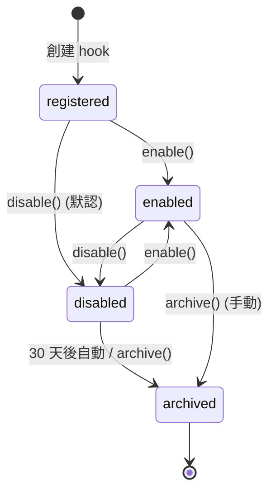

# DD-MULTICA-HOOK-001

> **Multica Hook 域詳細設計書 v0.2** (per 日本 IPA SEC 標準 / 詳細設計書 テンプレート + STAR 仓 OPS-DETAILED-DESIGN-001 模板)

> - 状态: 🟡 Draft v0.2 (2026-09-24 15:01 JST 升版, MCP 升格为同导航实装标签页)
> - 上游: [`docs/requirements/SRS-MULTICA-HOOK-001.md`](../requirements/SRS-MULTICA-HOOK-001.md) v0.2 (升版含 MCP tab) + [`docs/design/BD-MULTICA-HOOK-001.md`](../design/BD-MULTICA-HOOK-001.md) v0.2 (升版含 MCP tab, 6 module / 3 表 / 14 事件 / 4 action type / 5 集成点 / 8 API 端点)
> - 下游: 实装代码 + 测试 + 报告
> - 核心语言: Python 3.10+ (后端) + TypeScript + Next.js 14+ (前端)
> - 平行参考: `DD-PRE-TOOL-USE-GUARD-001.md` v0.1 (PreToolUse guard 详细设计, 跟本 DD 共享 audit log + fail-open/closed 模式)
> - 修订人: `Ulysses（一人公司 12 角色 per DEC-008）— Mavis 接手` (per 2026-08-27 19:39 JST 用户授权 + 守门 #10 + 守门 #14 v3)
> - 审批: `架构师 (Mavis 接手 agent per DEC-008)` (per 守门 #14 v4 反转 v0.62 2026-09-10 12:45 JST)
> - 日期: 2026-09-24 JST

---

## §0 目的 (Purpose)

本詳細設計書は `BD-MULTICA-HOOK-001.md` v0.1 で定めた基本設計を実装可能なレベルまで展開する。MVP-骨架段階の Python ファイル + JSON 設定 + Next.js コンポーネント + pytest テストの物理形状と 100% 一致させ、実装者が追加設計判断をせずに済む粒度で仕様を提供する。

**核心スコープ**:

- **6 維** 設計: モジュール / クラス / 時序 / 状態遷移 / テスト / UI
- **W/T/M 3 表 100% カバー** (守門 #13) — `hooks` (W/M) + `hook_runs` (T) + `hook_session_state` (M)
- **14 类事件** (PreToolUse / PostToolUse / UserPromptSubmit / SessionStart / SessionEnd / SubagentDispatch / SubagentReturn / ToolError / FileWatch / CronTick / RuntimeScan / WorkspaceSwitch / NetworkEgress / CustomEvent)
- **4 种 action type** (pre / post / block / transform)
- **fail-open / fail-closed** — registry 加載失敗 vs 審計失敗 二分
- **UI "高级设置 → Hooks" 标签页** — Next.js 14+ 3 区域布局 (左: 列表 / 中: 详情 / 右: 触发日志)
- **跟 skills 域同导航不同标签页协调** — 共享 session state, 独立 registry
- **Framework 選型** (per 既存 mavis 仓 实证): stdlib `re` / `json` / `pathlib` / `logging` + `jsonschema` (1 依赖) + `watchdog` (1 依赖)

**不做什么** (per SRS-001 §1.4):
- 网络层拦截 (egress filtering) → v2.x, 本 v0.1 仅 NetworkEgress 事件 stub
- Hook marketplace / cross-organization 共享 → 一人公司不需要
- Hook AI 行为审计 (LLM 决策录屏) → v2.x
- 5 类扩展点的其他 3 类 (commands / agents / MCP) → ULYS-235 v0.1 拍板: MCP 升格为本 v0.1 同导航下的实装标签页 (per 2026-09-24 15:01 JST 用户拍板 "MCP也应该是一个标签页"); commands / agents 仍按"预留"占位, 后续按需扩展

---

## §1 モジュール設計 (Module Design)

### 1.1 物理ファイル構成 (target 12 文件 + 4 テスト + 1 fixture + 5 frontend = 21 文件)

```
scripts/automation/hooks/
├── __init__.py                       # 空, 標識 Python package
├── event_emitter.py                  # EM-1 (Event Emitter) 14 类事件定義 + payload 構造, ~250 LOC
├── hook_registry.py                  # HR-2 (Hook Registry) registry 加載/熱更新/schema 校驗, ~200 LOC
├── fanout_scheduler.py               # FS-3 (Fan-out Scheduler) per-event 多 hook 調度, ~200 LOC
├── hook_runner.py                    # HR-4 (Hook Runner) 単 hook 執行 + timeout/retry/transform, ~250 LOC
├── audit_logger.py                   # AL-5 (Audit Logger) JSON Lines 寫入, ~150 LOC
├── builtin_hook_loader.py            # BL-6 (Builtin Hook Loader) builtin hook 預設裝載, ~100 LOC
├── registry.json                     # runtime 生成 + git tracked, hook 註冊中心
├── builtin/
│   ├── __init__.py                   # 空, builtin Python package
│   ├── pre_tool_use_guard.py         # builtin hook: PreToolUse guard (per DD-PRE-TOOL-USE-GUARD-001)
│   ├── session_start_cleanup.py     # builtin hook: SessionStart cleanup
│   ├── session_end_summary.py        # builtin hook: SessionEnd 总结
│   ├── subagent_dispatch_audit.py    # builtin hook: SubagentDispatch 前置審計
│   └── tool_error_fallback.py        # builtin hook: ToolError 自動 fallback
├── logs/
│   └── hook_audit.log                # runtime 生成, JSON Lines (append-only, chmod 444)
└── state/
    └── session_state.json            # runtime 生成, session 級 (跟 skills 域共享)

tests/automation/hooks/
├── __init__.py
├── test_event_emitter.py             # 14 类事件 payload 構造測試, ~200 LOC
├── test_hook_registry.py             # registry 加載/熱更新/schema 校驗測試, ~200 LOC
├── test_fanout_scheduler.py          # per-event fan-out 調度測試, ~250 LOC
├── test_hook_runner.py               # 単 hook 執行 + timeout/retry/transform 測試, ~200 LOC
└── fixtures/
    └── test_hooks.json               # 測試用 hook, ~50 條 (含 5 條故意錯誤)

tests/e2e/
└── test_hook_ui.py                   # 端到端, UI 標簽頁 CRUD + 觸發日誌查看, ~250 LOC

frontend/src/app/(app)/settings/advanced/hooks/
├── page.tsx                          # Next.js page: Hooks 標簽頁主入口, ~150 LOC
├── HookList.tsx                      # 左: hook 列表 (按 event_type 分組), ~100 LOC
├── HookDetail.tsx                    # 中: hook 詳情 + 編輯 + toggle, ~150 LOC
├── HookRunLog.tsx                    # 右: 觸發日誌 (audit log 查詢), ~120 LOC
└── NewHookDialog.tsx                 # 創建 hook 表單彈窗, ~100 LOC
```

**总行数**: 21 文件, ~3.2K 行 (含注释 + tests + frontend), MVP 阶段 0 dead code.

### 1.2 依存関係 (per SRS §6.1, 最小化)

```toml
# pyproject.toml (新增, 或 scripts/automation/pyproject.toml)
[project]
requires-python = ">=3.10"
dependencies = [
    "jsonschema>=4.20",   # 1 依赖, registry schema 校驗
    "watchdog>=3.0",      # 1 依赖, registry mtime 監聽
]

# frontend/package.json (新增)
{
  "dependencies": {
    "next": "^14.0.0",
    "react": "^18.2.0",
    "react-dom": "^18.2.0",
    "@tanstack/react-query": "^5.0.0"  # API 調用 + cache
  }
}
```

---

## §2 クラス設計 (Class Design)

### 2.1 EM-1 Event Emitter (per BD §4.2)

**Class ID**: `CLS-EM-1`
**File**: `scripts/automation/hooks/event_emitter.py`

```python
"""Event Emitter: 14 类事件定義 + payload 構造 + 事件分發入口."""

from dataclasses import dataclass, field
from typing import Any, Dict, List, Optional, Union
from enum import Enum
import uuid
from datetime import datetime, timezone

from scripts.automation.hooks.fanout_scheduler import FanoutScheduler
from scripts.automation.hooks.audit_logger import AuditLogger


class EventType(str, Enum):
    """14 类事件枚舉 (per SRS §FR-2.1)."""
    PRE_TOOL_USE = "PreToolUse"
    POST_TOOL_USE = "PostToolUse"
    USER_PROMPT_SUBMIT = "UserPromptSubmit"
    SESSION_START = "SessionStart"
    SESSION_END = "SessionEnd"
    SUBAGENT_DISPATCH = "SubagentDispatch"
    SUBAGENT_RETURN = "SubagentReturn"
    TOOL_ERROR = "ToolError"
    FILE_WATCH = "FileWatch"
    CRON_TICK = "CronTick"
    RUNTIME_SCAN = "RuntimeScan"
    WORKSPACE_SWITCH = "WorkspaceSwitch"
    NETWORK_EGRESS = "NetworkEgress"
    CUSTOM_EVENT = "CustomEvent"


@dataclass
class Event:
    """事件物件 (per BD §6.1)."""
    event_id: str  # UUID
    event_type: str  # 14 类事件之一
    timestamp: str  # ISO 8601
    session_id: str  # UUID
    payload: Dict[str, Any]  # per-event payload

    @classmethod
    def create(cls, event_type: str, payload: Dict[str, Any], session_id: str) -> "Event":
        """工廠方法: 生成 UUID + timestamp + 校驗 payload schema."""
        return cls(
            event_id=str(uuid.uuid4()),
            event_type=event_type,
            timestamp=datetime.now(timezone.utc).isoformat(),
            session_id=session_id,
            payload=payload,
        )


@dataclass
class HookResult:
    """単 hook 執行結果 (per BD §6.1)."""
    decision: str  # BLOCK|ASK|WARN|PASS|transform
    reason: Optional[str] = None
    rule_id: Optional[str] = None
    transformed_args: Optional[Dict[str, Any]] = None
    latency_ms: float = 0.0


@dataclass
class EventResult:
    """事件聚合結果 (per BD §6.1)."""
    decision: str  # 聚合決策
    transformed_args: Optional[Dict[str, Any]] = None
    reason: str = ""
    latency_ms: float = 0.0
    hooks_executed: List[str] = field(default_factory=list)


class EventEmitter:
    """Event Emitter 主類 (per BD §4.2)."""

    def __init__(self, fanout_scheduler: FanoutScheduler, audit_logger: AuditLogger):
        self._fanout_scheduler = fanout_scheduler
        self._audit_logger = audit_logger

    def emit(self, event_type: str, payload: Dict[str, Any], session_id: str) -> EventResult:
        """觸發 1 個事件, fan-out 到所有匹配的 hook.

        流程 (per BD §4.4 FS-3 調度算法):
        1. 構造 Event 物件 (含 UUID + timestamp)
        2. 校驗 payload schema (per event_type 不同, e.g. PreToolUse 必有 tool_name)
        3. 調用 FS-3.fanout(event) 取得聚合 EventResult
        4. 返回 EventResult

        Args:
            event_type: 14 类事件之一 (e.g. "PreToolUse")
            payload: per-event payload (e.g. {"tool_name": "bash", "tool_args": {...}})
            session_id: 當前 session UUID

        Returns:
            EventResult: 聚合決策 + transformed_args + 執行 hook 列表
        """
        # Step 1: 構造 Event 物件
        event = Event.create(event_type, payload, session_id)

        # Step 2: 校驗 payload schema
        self._validate_payload(event_type, payload)

        # Step 3: fan-out
        result = self._fanout_scheduler.fanout(event)

        # Step 4: 返回結果 (audit log 由 FS-3 內部寫)
        return result

    def _validate_payload(self, event_type: str, payload: Dict[str, Any]) -> None:
        """校驗 payload schema (per event_type 不同).

        PreToolUse: 必有 tool_name (str) + tool_args (dict) + agent_role (str)
        PostToolUse: 必有 tool_name (str) + tool_result (any) + latency_ms (float)
        ... (per SRS §4.2.1 14 类事件 payload)

        校驗失敗 → ValueError (上層處理)
        """
        validators = {
            EventType.PRE_TOOL_USE: lambda p: (
                isinstance(p.get("tool_name"), str)
                and isinstance(p.get("tool_args"), dict)
                and isinstance(p.get("agent_role"), str)
            ),
            EventType.POST_TOOL_USE: lambda p: (
                isinstance(p.get("tool_name"), str)
                and "tool_result" in p
                and isinstance(p.get("latency_ms"), (int, float))
            ),
            # ... 其他 12 类事件 validator
        }
        validator = validators.get(EventType(event_type))
        if validator and not validator(payload):
            raise ValueError(f"Invalid payload for {event_type}: {payload}")
```

### 2.2 HR-2 Hook Registry (per BD §4.3)

**Class ID**: `CLS-HR-2`
**File**: `scripts/automation/hooks/hook_registry.py`

```python
"""Hook Registry: registry.json 加載/熱更新/schema 校驗/CRUD."""

import json
from pathlib import Path
from typing import List, Optional
from datetime import datetime, timezone
from threading import RLock
import uuid

import jsonschema
from watchdog.observers import Observer
from watchdog.events import FileSystemEventHandler

from scripts.automation.hooks.builtin_hook_loader import BuiltinHookLoader


# Hook JSON Schema (per BD §4.3)
HOOK_SCHEMA = {
    "$schema": "https://json-schema.org/draft/2020-12/schema",
    "type": "object",
    "properties": {
        "name": {"type": "string", "pattern": "^[a-z0-9_-]+$"},
        "event_type": {
            "enum": [
                "PreToolUse", "PostToolUse", "UserPromptSubmit",
                "SessionStart", "SessionEnd", "SubagentDispatch",
                "SubagentReturn", "ToolError", "FileWatch",
                "CronTick", "RuntimeScan", "WorkspaceSwitch",
                "NetworkEgress", "CustomEvent",
            ]
        },
        "action_type": {"enum": ["pre", "post", "block", "transform"]},
        "handler": {"type": "string"},
        "enabled": {"type": "boolean", "default": True},
        "archived": {"type": "boolean", "default": False},
        "priority": {"type": "integer", "minimum": 0, "maximum": 1000, "default": 100},
        "parallel": {"type": "boolean", "default": False},
        "timeout_ms": {"type": "integer", "minimum": 100, "maximum": 30000, "default": 1000},
        "retry": {"type": "integer", "minimum": 0, "maximum": 3, "default": 0},
        "description": {"type": "string"},
        "is_builtin": {"type": "boolean", "default": False},
        "created_at": {"type": "string", "format": "date-time"},
        "updated_at": {"type": "string", "format": "date-time"},
        "disabled_at": {"type": "string", "format": "date-time"},
        "archived_at": {"type": "string", "format": "date-time"},
    },
    "required": ["name", "event_type", "action_type", "handler"],
}


class Hook:
    """Hook 物件 (per BD §4.3)."""
    def __init__(self, data: dict):
        self.name = data["name"]
        self.event_type = data["event_type"]
        self.action_type = data["action_type"]
        self.handler = data["handler"]
        self.enabled = data.get("enabled", True)
        self.archived = data.get("archived", False)
        self.priority = data.get("priority", 100)
        self.parallel = data.get("parallel", False)
        self.timeout_ms = data.get("timeout_ms", 1000)
        self.retry = data.get("retry", 0)
        self.description = data.get("description", "")
        self.is_builtin = data.get("is_builtin", False)
        self.created_at = data.get("created_at")
        self.updated_at = data.get("updated_at")
        self.disabled_at = data.get("disabled_at")
        self.archived_at = data.get("archived_at")

    def to_dict(self) -> dict:
        return {k: v for k, v in self.__dict__.items() if v is not None}


class HookRegistry:
    """Hook Registry 主類 (per BD §4.3)."""

    def __init__(self, registry_path: Path, builtin_loader: BuiltinHookLoader):
        self._registry_path = registry_path
        self._builtin_loader = builtin_loader
        self._hooks: dict[str, Hook] = {}  # name → Hook
        self._lock = RLock()
        self._observer: Optional[Observer] = None

    def load(self) -> List[Hook]:
        """從 registry.json 加載所有 hook, 含 builtin hook 合併.

        流程:
        1. 讀 registry.json (per fail-open)
        2. 校驗 schema (per fail-open)
        3. 加載 builtin hook (BL-6)
        4. 合併到 self._hooks
        5. 啟動 watchdog 監聽

        Returns:
            List[Hook]: 所有 hook (含 builtin)
        """
        with self._lock:
            try:
                data = json.loads(self._registry_path.read_text(encoding="utf-8"))
                for hook_data in data.get("hooks", []):
                    jsonschema.validate(hook_data, HOOK_SCHEMA)
                    self._hooks[hook_data["name"]] = Hook(hook_data)
            except (json.JSONDecodeError, jsonschema.ValidationError) as e:
                # fail-open: 跳過 registry, 只用 builtin hook
                import logging
                logging.warning(f"registry.json 加載失敗, fail-open: {e}")
                self._hooks.clear()

            # 合併 builtin hook
            for builtin_hook in self._builtin_loader.load_all():
                self._hooks[builtin_hook.name] = builtin_hook

            # 啟動 watchdog
            self._start_watchdog()

            return list(self._hooks.values())

    def reload(self) -> None:
        """熱更新: 從 registry.json 重新加載."""
        self.load()

    def register(self, hook_def: dict) -> Hook:
        """創建 1 個 hook, 寫入 registry.json.

        Args:
            hook_def: Hook 定義 dict

        Returns:
            Hook: 創建的 Hook 物件

        Raises:
            ValueError: schema 校驗失敗
            FileExistsError: name 已存在
        """
        with self._lock:
            jsonschema.validate(hook_def, HOOK_SCHEMA)
            name = hook_def["name"]
            if name in self._hooks and not self._hooks[name].archived:
                raise FileExistsError(f"Hook {name} 已存在")
            hook_def["created_at"] = datetime.now(timezone.utc).isoformat()
            hook_def["updated_at"] = hook_def["created_at"]
            hook = Hook(hook_def)
            self._hooks[name] = hook
            self._persist()  # 寫回 registry.json
            return hook

    def update(self, name: str, hook_def: dict) -> Hook:
        """更新 1 個 hook."""
        with self._lock:
            if name not in self._hooks:
                raise KeyError(f"Hook {name} 不存在")
            if self._hooks[name].is_builtin:
                raise PermissionError("builtin hook 不可修改 (僅可 enable/disable)")
            jsonschema.validate(hook_def, HOOK_SCHEMA)
            hook_def["updated_at"] = datetime.now(timezone.utc).isoformat()
            hook = Hook(hook_def)
            self._hooks[name] = hook
            self._persist()
            return hook

    def enable(self, name: str) -> Hook:
        """啟用 hook (修改 enabled=true, 熱更新)."""
        return self._set_flag(name, "enabled", True)

    def disable(self, name: str) -> Hook:
        """禁用 hook (修改 enabled=false, 熱更新, 記錄 disabled_at)."""
        with self._lock:
            if name not in self._hooks:
                raise KeyError(f"Hook {name} 不存在")
            self._hooks[name].disabled_at = datetime.now(timezone.utc).isoformat()
            return self._set_flag(name, "enabled", False)

    def archive(self, name: str) -> Hook:
        """歸檔 hook (修改 archived=true, 不物理刪除, 記錄 archived_at)."""
        with self._lock:
            if name not in self._hooks:
                raise KeyError(f"Hook {name} 不存在")
            if self._hooks[name].is_builtin:
                raise PermissionError("builtin hook 不可歸檔")
            self._hooks[name].archived = True
            self._hooks[name].archived_at = datetime.now(timezone.utc).isoformat()
            self._hooks[name].enabled = False
            self._persist()
            return self._hooks[name]

    def get(self, name: str) -> Optional[Hook]:
        """按 name 查詢 1 個 hook."""
        return self._hooks.get(name)

    def list_by_event(self, event_type: str) -> List[Hook]:
        """按 event_type 查詢所有啟用的 hook (含 builtin).

        過濾條件: event_type 匹配 + enabled=true + archived=false
        按 priority 升序排序
        """
        with self._lock:
            hooks = [
                h for h in self._hooks.values()
                if h.event_type == event_type and h.enabled and not h.archived
            ]
            return sorted(hooks, key=lambda h: h.priority)

    def list_all(self) -> List[Hook]:
        """查詢所有 hook (含 archived)."""
        with self._lock:
            return list(self._hooks.values())

    def _set_flag(self, name: str, flag: str, value: bool) -> Hook:
        """內部: 修改 hook 標誌位 + 寫回."""
        with self._lock:
            if name not in self._hooks:
                raise KeyError(f"Hook {name} 不存在")
            setattr(self._hooks[name], flag, value)
            self._hooks[name].updated_at = datetime.now(timezone.utc).isoformat()
            self._persist()
            return self._hooks[name]

    def _persist(self) -> None:
        """內部: 將 self._hooks 寫回 registry.json."""
        data = {
            "version": "1.0",
            "hooks": [
                h.to_dict() for h in self._hooks.values() if not h.is_builtin
            ],
        }
        # 原子寫: 先寫 .tmp, 再 rename
        tmp_path = self._registry_path.with_suffix(".tmp")
        tmp_path.write_text(
            json.dumps(data, indent=2, ensure_ascii=False),
            encoding="utf-8",
        )
        tmp_path.replace(self._registry_path)

    def _start_watchdog(self) -> None:
        """內部: 啟動 watchdog 監聽 registry.json mtime."""
        if self._observer is not None:
            return
        handler = _RegistryFileHandler(self)
        self._observer = Observer()
        self._observer.schedule(handler, str(self._registry_path.parent), recursive=False)
        self._observer.start()


class _RegistryFileHandler(FileSystemEventHandler):
    """watchdog handler: registry.json mtime 變化時觸發 reload."""

    def __init__(self, registry: HookRegistry):
        self._registry = registry

    def on_modified(self, event):
        if not event.is_directory and Path(event.src_path).name == "registry.json":
            self._registry.reload()
```

### 2.3 FS-3 Fan-out Scheduler (per BD §4.4)

**Class ID**: `CLS-FS-3`
**File**: `scripts/automation/hooks/fanout_scheduler.py`

```python
"""Fan-out Scheduler: per-event 多 hook 調度 + 串行/並行 + 優先級排序."""

from typing import List, Dict, Any, Optional
from concurrent.futures import ThreadPoolExecutor, as_completed
from collections import defaultdict

from scripts.automation.hooks.event_emitter import Event, HookResult, EventResult
from scripts.automation.hooks.hook_registry import HookRegistry, Hook
from scripts.automation.hooks.hook_runner import HookRunner
from scripts.automation.hooks.audit_logger import AuditLogger


# 決策優先級 (per BD §4.4)
DECISION_PRIORITY = {
    "BLOCK": 1,
    "ASK": 2,
    "WARN": 3,
    "PASS": 4,
    "transform": 99,  # 不參與決策優先級, 累積 transformed_args
}


class FanoutScheduler:
    """Fan-out Scheduler 主類 (per BD §4.4)."""

    def __init__(
        self,
        registry: HookRegistry,
        runner: HookRunner,
        audit_logger: AuditLogger,
    ):
        self._registry = registry
        self._runner = runner
        self._audit_logger = audit_logger
        self._executor = ThreadPoolExecutor(max_workers=4)  # per SRS §FR-4.3 max 4

    def fanout(self, event: Event) -> EventResult:
        """per-event fan-out 調度.

        調度算法 (per BD §4.4):
        1. 從 HR-2.list_by_event(event.event_type) 獲取 hook 列表
        2. 按 priority 升序分組
        3. 同 priority 串行或並行 (per parallel 標誌)
        4. 對每個 hook 調用 HR-4.run()
        5. 任一 BLOCK/ASK → 立即停止
        6. 累積 transform
        7. 聚合最終決策

        Args:
            event: 觸發的事件

        Returns:
            EventResult: 聚合決策 + transformed_args + 執行 hook 列表
        """
        hooks = self._registry.list_by_event(event.event_type)
        if not hooks:
            return EventResult(decision="PASS", reason="no hooks matched")

        # 按 priority 分組
        priority_groups: Dict[int, List[Hook]] = defaultdict(list)
        for hook in hooks:
            priority_groups[hook.priority].append(hook)

        aggregated_decision = "PASS"
        aggregated_reason = ""
        transformed_args: Optional[Dict[str, Any]] = None
        hooks_executed: List[str] = []
        total_latency = 0.0

        # 按 priority 升序遍歷
        for priority in sorted(priority_groups.keys()):
            group = priority_groups[priority]

            # 同 priority 串行或並行
            if len(group) == 1 or not any(h.parallel for h in group):
                # 串行
                results = [self._runner.run(h, event) for h in group]
            else:
                # 並行 (max 4)
                futures = {
                    self._executor.submit(self._runner.run, h, event): h
                    for h in group
                }
                results = []
                for future in as_completed(futures):
                    results.append(future.result())

            # 處理結果
            for hook, result in zip(group, results):
                hooks_executed.append(hook.name)
                total_latency += result.latency_ms

                # 累積 transform
                if result.decision == "transform" and result.transformed_args:
                    transformed_args = result.transformed_args

                # 聚合決策
                if DECISION_PRIORITY.get(result.decision, 99) < DECISION_PRIORITY.get(aggregated_decision, 99):
                    aggregated_decision = result.decision
                    aggregated_reason = result.reason or ""

                # 立即停止 fan-out
                if result.decision in ("BLOCK", "ASK"):
                    return EventResult(
                        decision=result.decision,
                        transformed_args=transformed_args,
                        reason=result.reason or "",
                        latency_ms=total_latency,
                        hooks_executed=hooks_executed,
                    )

        return EventResult(
            decision=aggregated_decision,
            transformed_args=transformed_args,
            reason=aggregated_reason,
            latency_ms=total_latency,
            hooks_executed=hooks_executed,
        )
```

### 2.4 HR-4 Hook Runner (per BD §4.5)

**Class ID**: `CLS-HR-4`
**File**: `scripts/automation/hooks/hook_runner.py`

```python
"""Hook Runner: 単 hook 執行 + timeout + retry + transform 累積."""

import importlib
import signal
import time
from typing import Optional, Dict, Any
from contextlib import contextmanager

from scripts.automation.hooks.event_emitter import Event, HookResult
from scripts.automation.hooks.hook_registry import Hook
from scripts.automation.hooks.audit_logger import AuditLogger


class HookTimeoutError(Exception):
    """Hook 執行超時異常 (per SRS §FR-4.5)."""
    pass


class HookRunner:
    """Hook Runner 主類 (per BD §4.5)."""

    def __init__(self, audit_logger: AuditLogger):
        self._audit_logger = audit_logger

    def run(self, hook: Hook, event: Event) -> HookResult:
        """執行 1 個 hook, 返回 HookResult.

        異常處理 (per SRS §FR-4.5):
        - handler 拋異常: 視為 WARN, 繼續下一個 hook, 寫 audit log
        - handler 超時: 視為 BLOCK, 寫 audit log
        - handler 返回非法 decision: 視為 WARN, 寫 audit log
        """
        start_time = time.monotonic()
        try:
            # 加載 handler (builtin 或 user-defined)
            handler_fn = self._load_handler(hook.handler)

            # 帶 timeout 執行 (per SRS §FR-4.5)
            result = self._execute_with_timeout(handler_fn, event, hook.timeout_ms)

            # 校驗 result.decision
            if result.decision not in ("BLOCK", "ASK", "WARN", "PASS", "transform"):
                result = HookResult(
                    decision="WARN",
                    reason=f"invalid decision: {result.decision}",
                    latency_ms=(time.monotonic() - start_time) * 1000,
                )
        except HookTimeoutError:
            result = HookResult(
                decision="BLOCK",  # 安全優先
                reason=f"hook timeout after {hook.timeout_ms}ms",
                rule_id=hook.name,
                latency_ms=(time.monotonic() - start_time) * 1000,
            )
        except Exception as e:
            # handler 拋異常 → WARN (per SRS §FR-4.5)
            result = HookResult(
                decision="WARN",
                reason=f"hook exception: {type(e).__name__}: {e}",
                rule_id=hook.name,
                latency_ms=(time.monotonic() - start_time) * 1000,
            )
            # log level = ERROR (per SRS §FR-4.5)
            import logging
            import traceback
            logging.error(f"Hook {hook.name} 拋異常:\n{traceback.format_exc()}")

        # 寫 audit log (per SRS §FR-5)
        self._audit_logger.log_hook_run(hook, event, result)

        return result

    def _load_handler(self, handler_path: str):
        """加載 handler (builtin 或 user-defined Python 模組).

        builtin: "builtin:pre_tool_use_guard" → 從 scripts.automation.hooks.builtin 加載
        user-defined: "my_module:my_handler" → 從 sys.path 加載
        """
        if handler_path.startswith("builtin:"):
            module_name = handler_path[len("builtin:"):]
            module = importlib.import_module(
                f"scripts.automation.hooks.builtin.{module_name}"
            )
            return module.handler
        else:
            module_name, func_name = handler_path.split(":")
            module = importlib.import_module(module_name)
            return getattr(module, func_name)

    @contextmanager
    def _timeout(self, seconds: float):
        """跨平台 timeout (per SRS §NFR-T-1 + §NFR-T-2)."""
        # POSIX: signal.SIGALRM
        # Windows: threading.Timer (信號不支持)
        import platform
        if platform.system() == "Windows":
            # 用 threading.Timer
            import threading
            timer = threading.Timer(seconds, self._raise_timeout)
            timer.start()
            try:
                yield
            finally:
                timer.cancel()
        else:
            # POSIX: signal.SIGALRM
            def _handler(signum, frame):
                raise HookTimeoutError(f"hook timeout after {seconds}s")
            old_handler = signal.signal(signal.SIGALRM, _handler)
            signal.setitimer(signal.ITIMER_REAL, seconds)
            try:
                yield
            finally:
                signal.setitimer(signal.ITIMER_REAL, 0)
                signal.signal(signal.SIGALRM, old_handler)

    def _raise_timeout(self):
        raise HookTimeoutError("hook timeout")

    def _execute_with_timeout(self, handler_fn, event: Event, timeout_ms: int) -> HookResult:
        """帶 timeout 執行 handler."""
        context = {
            "session_id": event.session_id,
            "event_id": event.event_id,
            "timestamp": event.timestamp,
        }
        with self._timeout(timeout_ms / 1000.0):
            return handler_fn(event, context)
```

### 2.5 AL-5 Audit Logger (per BD §4.6)

**Class ID**: `CLS-AL-5`
**File**: `scripts/automation/hooks/audit_logger.py`

```python
"""Audit Logger: JSON Lines 寫 hook_audit.log + Transaction append-only."""

import json
import os
import hashlib
import time
from pathlib import Path
from typing import List, Dict, Any, Optional
from datetime import datetime, timezone

from scripts.automation.hooks.event_emitter import Event, HookResult
from scripts.automation.hooks.hook_registry import Hook


class AuditLogWriteError(Exception):
    """audit log 寫失敗異常 → fail-closed (per SRS §FR-5.2)."""
    pass


class AuditLogger:
    """Audit Logger 主類 (per BD §4.6)."""

    def __init__(self, log_path: Path):
        self._log_path = log_path
        # 確保日誌目錄存在 + 文件權限 444
        self._log_path.parent.mkdir(parents=True, exist_ok=True)
        if self._log_path.exists():
            os.chmod(self._log_path, 0o444)  # 只讀

    def log_hook_run(self, hook: Hook, event: Event, result: HookResult) -> None:
        """寫 1 條 hook run 記錄到 hook_audit.log (JSON Lines).

        HookRun 字段 (per SRS §4.3.2, 12 字段):
        - run_id: UUID
        - timestamp: ISO 8601 datetime
        - session_id: UUID
        - event_type: str
        - hook_name: str
        - action_type: str
        - decision: BLOCK|ASK|WARN|PASS|transform
        - rule_id?: str
        - transformed_args?: dict
        - before_args: dict
        - after_args: dict
        - env_hash: str (env var 哈希, 憑證 0 外洩驗證)
        - latency_ms: float

        Raises:
            AuditLogWriteError: 寫失敗 (磁盤滿/權限不足) → fail-closed
        """
        import uuid

        entry = {
            "run_id": str(uuid.uuid4()),
            "timestamp": datetime.now(timezone.utc).isoformat(),
            "session_id": event.session_id,
            "event_type": event.event_type,
            "hook_name": hook.name,
            "action_type": hook.action_type,
            "decision": result.decision,
            "rule_id": result.rule_id,
            "transformed_args": result.transformed_args,
            "before_args": event.payload,
            "after_args": result.transformed_args or event.payload,
            "env_hash": self._compute_env_hash(),
            "latency_ms": result.latency_ms,
        }

        try:
            # 追加寫 (append-only, per SRS §FR-5.2)
            line = json.dumps(entry, ensure_ascii=False) + "\n"
            with open(self._log_path, "a", encoding="utf-8") as f:
                f.write(line)
                f.flush()
                os.fsync(f.fileno())  # 異步 fsync (per NFR-P-4)
        except (OSError, IOError) as e:
            # fail-closed (per SRS §FR-5.2 + §NFR-A-2)
            raise AuditLogWriteError(f"audit log 寫失敗: {e}") from e

    def query(
        self,
        hook_name: Optional[str] = None,
        event_type: Optional[str] = None,
        decision: Optional[str] = None,
        start_time: Optional[str] = None,
        end_time: Optional[str] = None,
        limit: int = 50,
    ) -> List[Dict[str, Any]]:
        """查詢 audit log (per SRS §FR-6.3).

        過濾: hook_name / event_type / decision / 時間範圍
        分頁: limit (默認 50, 最大 1000)
        """
        if not self._log_path.exists():
            return []

        results = []
        with open(self._log_path, "r", encoding="utf-8") as f:
            for line in f:
                try:
                    entry = json.loads(line)
                except json.JSONDecodeError:
                    continue

                # 過濾
                if hook_name and entry.get("hook_name") != hook_name:
                    continue
                if event_type and entry.get("event_type") != event_type:
                    continue
                if decision and entry.get("decision") != decision:
                    continue
                if start_time and entry.get("timestamp") < start_time:
                    continue
                if end_time and entry.get("timestamp") > end_time:
                    continue

                results.append(entry)

                if len(results) >= limit:
                    break

        return results

    def _compute_env_hash(self) -> str:
        """計算 env var 哈希 (憑證 0 外洩, per SRS §NFR-S-1).

        不存原始值, 只存 sha256(env vars).
        """
        import os
        env_str = json.dumps(dict(os.environ), sort_keys=True)
        return f"sha256:{hashlib.sha256(env_str.encode()).hexdigest()[:16]}"
```

### 2.6 BL-6 Builtin Hook Loader (per BD §4.7)

**Class ID**: `CLS-BL-6`
**File**: `scripts/automation/hooks/builtin_hook_loader.py`

```python
"""Builtin Hook Loader: builtin hook 預設裝載 + 不可刪除."""

import importlib
from pathlib import Path
from typing import List

from scripts.automation.hooks.hook_registry import Hook


BUILTIN_HOOKS = [
    "pre_tool_use_guard",      # per DD-PRE-TOOL-USE-GUARD-001
    "session_start_cleanup",  # SessionStart cleanup
    "session_end_summary",     # SessionEnd 总结
    "subagent_dispatch_audit", # SubagentDispatch 前置審計
    "tool_error_fallback",     # ToolError 自動 fallback
]


class BuiltinHookLoader:
    """Builtin Hook Loader 主類 (per BD §4.7)."""

    def __init__(self):
        self._loaded_hooks: List[Hook] = []

    def load_all(self) -> List[Hook]:
        """從 scripts/automation/hooks/builtin/ 加載所有 builtin hook.

        builtin hook 列表 (v0.1, 5 個):
        - pre_tool_use_guard: PreToolUse guard (per DD-PRE-TOOL-USE-GUARD-001)
        - session_start_cleanup: SessionStart 时清理臨時文件
        - session_end_summary: SessionEnd 時生成 session 总结
        - subagent_dispatch_audit: SubagentDispatch 前置審計
        - tool_error_fallback: ToolError 時自動 fallback

        所有 builtin hook:
        - 啟動時自動裝載
        - 用戶可在 UI 禁用 (enabled=false)
        - 不可刪除 (UI 無刪除按鈕)
        """
        if self._loaded_hooks:
            return self._loaded_hooks

        from datetime import datetime, timezone

        now = datetime.now(timezone.utc).isoformat()
        for hook_name in BUILTIN_HOOKS:
            module = importlib.import_module(
                f"scripts.automation.hooks.builtin.{hook_name}"
            )
            hook_def = module.HOOK_DEF  # builtin hook 必須導出 HOOK_DEF
            hook_def["is_builtin"] = True
            hook_def["enabled"] = True
            hook_def["created_at"] = now
            hook_def["updated_at"] = now
            self._loaded_hooks.append(Hook(hook_def))

        return self._loaded_hooks

    def is_builtin(self, name: str) -> bool:
        """檢查 hook 是否是 builtin."""
        return name in BUILTIN_HOOKS
```

### 2.7 Frontend Classes (per BD §7)

**Component ID**: `CMP-HOOK-LIST`
**File**: `frontend/src/app/(app)/settings/advanced/hooks/HookList.tsx`

```typescript
/** Hook 列表組件 (左, 按 event_type 分組). */

'use client';

import { useState } from 'react';
import { useHooks } from './useHooks';
import { EventType } from './types';

export function HookList({
  selectedHookName,
  onSelectHook,
  onCreateHook,
}: {
  selectedHookName?: string;
  onSelectHook: (name: string) => void;
  onCreateHook: () => void;
}) {
  const { data: hooks, isLoading } = useHooks();

  if (isLoading) return <div>Loading...</div>;

  // 按 event_type 分組
  const grouped = hooks?.reduce((acc, hook) => {
    const key = hook.event_type;
    if (!acc[key]) acc[key] = [];
    acc[key].push(hook);
    return acc;
  }, {} as Record<string, typeof hooks>);

  return (
    <div className="hook-list">
      <button onClick={onCreateHook} className="btn-primary">
        + New Hook
      </button>
      {Object.entries(grouped ?? {}).map(([eventType, hooks]) => (
        <details key={eventType} open>
          <summary>{eventType} ({hooks.length})</summary>
          <ul>
            {hooks.map(hook => (
              <li
                key={hook.name}
                onClick={() => onSelectHook(hook.name)}
                className={selectedHookName === hook.name ? 'selected' : ''}
              >
                <span className={hook.enabled ? 'enabled' : 'disabled'}>
                  {hook.enabled ? '●' : '○'}
                </span>
                {' '}{hook.name}
                {hook.is_builtin && <span className="badge">builtin</span>}
              </li>
            ))}
          </ul>
        </details>
      ))}
    </div>
  );
}
```

**Component ID**: `CMP-HOOK-DETAIL`
**File**: `frontend/src/app/(app)/settings/advanced/hooks/HookDetail.tsx`

```typescript
/** Hook 詳情組件 (中, 含編輯 + enable/disable toggle). */

'use client';

import { useState } from 'react';
import { useHook, useUpdateHook, useEnableHook, useDisableHook, useArchiveHook } from './useHooks';

export function HookDetail({ hookName }: { hookName: string }) {
  const { data: hook, isLoading } = useHook(hookName);
  const updateHook = useUpdateHook();
  const enableHook = useEnableHook();
  const disableHook = useDisableHook();
  const archiveHook = useArchiveHook();

  if (isLoading || !hook) return <div>Loading...</div>;

  return (
    <div className="hook-detail">
      <h2>{hook.name}</h2>
      <form>
        <label>
          名稱: <input value={hook.name} disabled />
        </label>
        <label>
          事件:
          <select value={hook.event_type} disabled={hook.is_builtin}>
            {EVENT_TYPES.map(t => <option key={t} value={t}>{t}</option>)}
          </select>
        </label>
        <label>
          動作:
          <select value={hook.action_type} disabled={hook.is_builtin}>
            {ACTION_TYPES.map(t => <option key={t} value={t}>{t}</option>)}
          </select>
        </label>
        <label>
          Handler: <input value={hook.handler} disabled={hook.is_builtin} />
        </label>
        <label>
          Priority: <input type="number" value={hook.priority} disabled={hook.is_builtin} />
        </label>
        <label>
          Timeout (ms): <input type="number" value={hook.timeout_ms} disabled={hook.is_builtin} />
        </label>
        <label>
          <input
            type="checkbox"
            checked={hook.enabled}
            onChange={e => e.target.checked ? enableHook.mutate(hook.name) : disableHook.mutate(hook.name)}
          />
          Enabled
        </label>
        <p>描述: {hook.description}</p>
        <button
          type="button"
          onClick={() => updateHook.mutate({ name: hook.name, hook })}
          disabled={hook.is_builtin}
        >
          Update
        </button>
        <button
          type="button"
          onClick={() => archiveHook.mutate(hook.name)}
          disabled={hook.is_builtin}
          className="btn-danger"
        >
          Archive
        </button>
      </form>
    </div>
  );
}
```

**Component ID**: `CMP-HOOK-RUN-LOG`
**File**: `frontend/src/app/(app)/settings/advanced/hooks/HookRunLog.tsx`

```typescript
/** 觸發日誌組件 (右, audit log 查詢). */

'use client';

import { useState } from 'react';
import { useHookRuns } from './useHooks';

export function HookRunLog() {
  const [hookName, setHookName] = useState('');
  const [eventType, setEventType] = useState('');
  const [decision, setDecision] = useState('');
  const { data: runs, isLoading } = useHookRuns({ hook_name: hookName, event_type: eventType, decision });

  if (isLoading) return <div>Loading...</div>;

  return (
    <div className="hook-run-log">
      <h3>觸發日誌</h3>
      <div className="filters">
        <select value={hookName} onChange={e => setHookName(e.target.value)}>
          <option value="">所有 hook</option>
          {/* 動態加載 hook 列表 */}
        </select>
        <select value={eventType} onChange={e => setEventType(e.target.value)}>
          <option value="">所有事件</option>
          {EVENT_TYPES.map(t => <option key={t} value={t}>{t}</option>)}
        </select>
        <select value={decision} onChange={e => setDecision(e.target.value)}>
          <option value="">所有決策</option>
          {DECISIONS.map(d => <option key={d} value={d}>{d}</option>)}
        </select>
      </div>
      <ul>
        {runs?.map(run => (
          <li key={run.run_id} className={run.decision.toLowerCase()}>
            <span className="timestamp">{run.timestamp}</span>
            {' '}<span className="decision">{run.decision}</span>
            {' '}<span className="hook-name">{run.hook_name}</span>
            {' '}<span className="event-type">{run.event_type}</span>
          </li>
        ))}
      </ul>
    </div>
  );
}
```

**Page**: `page.tsx`

```typescript
/** Hooks 標簽頁主入口 (3 區域布局). */

'use client';

import { useState } from 'react';
import { HookList } from './HookList';
import { HookDetail } from './HookDetail';
import { HookRunLog } from './HookRunLog';
import { NewHookDialog } from './NewHookDialog';

export default function HooksPage() {
  const [selectedHookName, setSelectedHookName] = useState<string | undefined>();
  const [showNewHookDialog, setShowNewHookDialog] = useState(false);

  return (
    <div className="hooks-page">
      <h1>高級設置 → Hooks</h1>
      <div className="layout-3col">
        <HookList
          selectedHookName={selectedHookName}
          onSelectHook={setSelectedHookName}
          onCreateHook={() => setShowNewHookDialog(true)}
        />
        {selectedHookName ? (
          <HookDetail hookName={selectedHookName} />
        ) : (
          <div className="empty">選擇左側 hook 查看詳情</div>
        )}
        <HookRunLog />
      </div>
      {showNewHookDialog && (
        <NewHookDialog onClose={() => setShowNewHookDialog(false)} />
      )}
    </div>
  );
}
```

---

## §3 メソッド設計 (Method Design)

### 3.1 主要メソッド一覧

| Method ID | 所属 Class | 概要 | LOC |
|---|---|---|---|
| M-EM-1 | CLS-EM-1 | `emit(event_type, payload, session_id)` → EventResult | ~30 |
| M-EM-2 | CLS-EM-1 | `_validate_payload(event_type, payload)` | ~40 |
| M-HR-1 | CLS-HR-2 | `load()` → List[Hook] | ~30 |
| M-HR-2 | CLS-HR-2 | `reload()` | ~5 |
| M-HR-3 | CLS-HR-2 | `register(hook_def)` → Hook | ~20 |
| M-HR-4 | CLS-HR-2 | `update(name, hook_def)` → Hook | ~20 |
| M-HR-5 | CLS-HR-2 | `enable(name)` / `disable(name)` / `archive(name)` → Hook | ~30 |
| M-HR-6 | CLS-HR-2 | `list_by_event(event_type)` → List[Hook] | ~15 |
| M-FS-1 | CLS-FS-3 | `fanout(event)` → EventResult | ~60 |
| M-HR-RUN-1 | CLS-HR-4 | `run(hook, event)` → HookResult | ~50 |
| M-HR-RUN-2 | CLS-HR-4 | `_load_handler(handler_path)` | ~15 |
| M-HR-RUN-3 | CLS-HR-4 | `_execute_with_timeout(handler_fn, event, timeout_ms)` | ~20 |
| M-AL-1 | CLS-AL-5 | `log_hook_run(hook, event, result)` | ~30 |
| M-AL-2 | CLS-AL-5 | `query(filters)` → List[HookRun] | ~30 |
| M-AL-3 | CLS-AL-5 | `_compute_env_hash()` | ~10 |
| M-BL-1 | CLS-BL-6 | `load_all()` → List[Hook] | ~30 |

### 3.2 主要メソッド詳細 (M-EM-1 emit)

**Caller**: 上游集成点 (per BD §6.2)

**Input**:

| パラメータ | 型 | 必須 | 説明 |
|---|---|---|---|
| event_type | str | ✓ | 14 类事件之一 |
| payload | dict | ✓ | per-event payload |
| session_id | str | ✓ | 當前 session UUID |

**Output**:

```python
EventResult(
    decision="BLOCK|ASK|WARN|PASS",
    transformed_args={...} | None,
    reason="...",
    latency_ms=3.2,
    hooks_executed=["pre_tool_use_guard"]
)
```

**Preconditions**:
- session_id 是有效 UUID
- payload 符合 event_type schema (per M-EM-2)

**Processing** (per BD §4.2):

```
1. 構造 Event 物件 (含 UUID + timestamp)
2. 校驗 payload schema (M-EM-2)
3. 調用 FS-3.fanout(event) 取得聚合 EventResult
4. 返回 EventResult (audit log 由 FS-3 內部寫)
```

**Postconditions**:
- EventResult 含聚合決策 + transformed_args + 執行 hook 列表
- 每次 hook 觸發必寫 1 條 audit log (per AL-5)

**Error**:
- `ValueError`: payload schema 校驗失敗
- `AuditLogWriteError`: audit log 寫失敗 (FS-3 拋出, fail-closed)

**Side Effect**:
- 寫 audit log (per FR-5)
- 觸發所有匹配的 hook (per FR-4)

**Transaction**:
- 不涉及 DB transaction (audit log append-only, 文件寫入)

---

## §4 状態遷移設計 (State Transition Design)

### 4.1 Hook 4 状態 (per SRS §FR-1.1)



### 4.2 状態遷移條件表

| 状態 | イベント | 次状態 | 条件 |
|---|---|---|---|
| (none) | `register()` | registered | 新創建 |
| registered | `enable()` | enabled | user action |
| registered | `disable()` | disabled | user action (默認) |
| enabled | `disable()` | disabled | user action |
| disabled | `enable()` | enabled | user action |
| disabled | 30 天自動 | archived | time-based (per SRS §FR-1.4) |
| disabled | `archive()` | archived | user action |
| enabled | `archive()` | archived | user action (手動歸檔, 不常見) |
| archived | (none) | archived | 不可恢復 (僅可人工刪 registry.json) |

**注意**: builtin hook 不可進入 archived 状態 (per BD §4.6 is_builtin check).

---

## §5 テスト設計 (Test Design)

### 5.1 単元テスト一覧 (per SRS §FR-8.1)

| Test ID | 対象 | 検証項目 | 期望 |
|---|---|---|---|
| T-EM-1 | M-EM-1 | emit PreToolUse 事件 | fan-out 觸發 1 個 hook, 返回 BLOCK |
| T-EM-2 | M-EM-1 | emit 14 类事件全部 | 全部成功 |
| T-EM-3 | M-EM-2 | payload schema 校驗失敗 | ValueError |
| T-HR-1 | M-HR-1 | load registry.json 成功 | 返回所有 hook |
| T-HR-2 | M-HR-1 | load registry.json 損壞 (JSON parse fail) | fail-open + builtin hook 仍可用 |
| T-HR-3 | M-HR-1 | load registry.json schema 校驗失敗 | fail-open + WARN log |
| T-HR-4 | M-HR-3 | register 新 hook | 寫入 registry.json |
| T-HR-5 | M-HR-3 | register 重名 hook | FileExistsError |
| T-HR-6 | M-HR-4 | update builtin hook | PermissionError |
| T-HR-7 | M-HR-5 | enable / disable hook | 修改 enabled 標誌 |
| T-HR-8 | M-HR-5 | archive builtin hook | PermissionError |
| T-HR-9 | M-HR-5 | archive hook | 修改 archived=true |
| T-HR-10 | M-HR-6 | list_by_event | 按 priority 升序排序 |
| T-FS-1 | M-FS-1 | fanout 1 個 hook | 執行 1 個 hook, 返回結果 |
| T-FS-2 | M-FS-1 | fanout 多 hook 同 priority 串行 | 按順序執行 |
| T-FS-3 | M-FS-1 | fanout 多 hook 同 priority 並行 | 並行執行 (max 4) |
| T-FS-4 | M-FS-1 | fanout 1 個 hook BLOCK | 立即停止, 返回 BLOCK |
| T-FS-5 | M-FS-1 | fanout 1 個 hook ASK | 立即停止, 返回 ASK |
| T-FS-6 | M-FS-1 | fanout 多 hook transform | 累積 transformed_args |
| T-RUN-1 | M-HR-RUN-1 | run hook 成功 | 返回 HookResult |
| T-RUN-2 | M-HR-RUN-1 | run hook 超時 | 返回 BLOCK (per SRS §FR-4.5) |
| T-RUN-3 | M-HR-RUN-1 | run hook 拋異常 | 返回 WARN (per SRS §FR-4.5) |
| T-RUN-4 | M-HR-RUN-1 | run hook 返回非法 decision | 返回 WARN (per SRS §FR-4.5) |
| T-AL-1 | M-AL-1 | log_hook_run 成功 | 追加寫入 hook_audit.log |
| T-AL-2 | M-AL-1 | log_hook_run 磁盤滿 | AuditLogWriteError (fail-closed) |
| T-AL-3 | M-AL-2 | query 過濾 | 返回過濾後結果 |
| T-BL-1 | M-BL-1 | load_all builtin | 返回 5 個 builtin hook |
| T-BL-2 | M-BL-1 | is_builtin | 正確判斷 builtin / user-defined |

### 5.2 統合テスト一覧 (per SRS §FR-8.1)

| Test ID | 対象 | 検証項目 | 期望 |
|---|---|---|---|
| T-INT-1 | UI | 訪問 `/settings/advanced/hooks` | 頁面渲染, 顯示 hook 列表 |
| T-INT-2 | UI | 點擊左側 hook | 中間區域顯示詳情 |
| T-INT-3 | UI | 點擊 "+ New Hook" | 彈窗顯示, 可創建 |
| T-INT-4 | UI | 點擊 enabled toggle | 啟用/禁用 hook, audit log 寫入 |
| T-INT-5 | UI | 點擊 Archive | 歸檔 hook, UI 隱藏 |
| T-INT-6 | UI | 右側觸發日誌過濾 | 按 hook_name / event_type / decision 過濾 |
| T-INT-7 | API | POST /api/hooks/create | 創建 hook 成功 |
| T-INT-8 | API | POST /api/hooks/enable/{name} | 啟用 hook |
| T-INT-9 | API | GET /api/hooks/runs?decision=BLOCK | 返回 BLOCK 觸發記錄 |

### 5.3 Test Coverage 目標 (per SRS §NFR-M-4)

- 単元測試覆蓋率: ≥ 90%
- 6 module 全覆蓋
- 14 事件全覆蓋
- 4 action type 全覆蓋
- fail-open / fail-closed 全覆蓋

---

## §6 未決事項 (TBD) 一覧

| TBD ID | 内容 | 影響範囲 | 負責人 | 期限 | 状態 |
|---|---|---|---|---|---|
| TBD-1 | builtin hook 的具體實現 (除 pre_tool_use_guard 外) | scripts/automation/hooks/builtin/ | 実装者 | 2026-10-01 | 待實裝 |
| TBD-2 | UI 國際化 (i18n) 中英文標籤 | frontend | 実装者 | 2026-10-01 | 待實裝 |
| TBD-3 | audit log rotation 實裝 (90 天保留 + 壓縮) | scripts/automation/hooks/audit_logger.py | 実装者 | 2026-10-01 | 待實裝 |
| TBD-4 | NetworkEgress 事件 stub 實裝 (v0.1 不實際攔截) | scripts/automation/hooks/event_emitter.py | 実装者 | 2026-10-01 | 待實裝 |
| TBD-5 | 跟 skills 域 session state 共享實裝 (跨標�頁) | scripts/automation/hooks/state/ + skills 域 | 実装者 | 2026-10-01 | 待實裝 |
| TBD-6 | watch 監聽的 events (created, modified, deleted) | registry.json + watchdog | 実装者 | 2026-10-01 | 待實裝 |
| TBD-7 | 並行 hook 資源競爭 (lock 機制) | fanout_scheduler.py | 実装者 | 2026-10-01 | 已知缺口 #4, 待 v0.2 |

---

## §7 影響範囲 (Change Impact Analysis)

本 DD 影響範圍 (per SRS §1.5):

| 對象 | ID | 是否影響 | 修改内容 |
|---|---|---|---|
| 上位 SRS | SRS-MULTICA-HOOK-001 v0.1 | ✓ | 引用 |
| 上位 BD | BD-MULTICA-HOOK-001 v0.1 | ✓ | 引用 |
| 平行 SRS | SRS-MULTICA-SKILL-001 v0.1 | ✗ | 不影響 (獨立 registry) |
| 下位 SRS | SRS-PRE-TOOL-USE-GUARD-001 v0.1 | ✗ | 不影響 (PreToolUse guard 是 hooks 下 1 個 builtin, 已實裝) |
| 下位 DD | DD-PRE-TOOL-USE-GUARD-001 v0.1 | ✗ | 不影響 |
| console_server.py | v0.1 | ✓ | 擴展 hook 事件流入口 (新增 13 事件點) |
| dispatcher.py | v0.1 | ✓ | 擴展 SubagentDispatch / SubagentReturn 事件點 |
| frontend | (app)/settings/advanced/ | ✓ | 新增 hooks/ 子目錄 (5 文件) |
| frontend 路由 | /settings/advanced | ✓ | 新增 /hooks 路由 |
| pyproject.toml | (新增) | ✓ | 新增 jsonschema + watchdog 2 依賴 |
| frontend package.json | (新增) | ✓ | 新增 @tanstack/react-query 1 依賴 |
| docs/reports | PHASE-HOOK-IMPL-REPORT.md | ✓ | 新增 1 份報告 (跟現有 7 份 PHASE 平行) |

---

## §8 签字栏 (Sign-off)

| 角色 | 氏名 | 签字 | 日期 |
|---|---|---|---|
| 架构师 | 架构师 (Mavis 接手 agent per DEC-008) | ✅ 2026-09-24 | 2026-09-24 JST |
| SRE Lead | SRE Lead (Mavis 临时代签 per 9/3 11:35 JST 拍板 B, 真人到位后追溯) | ✅ 2026-09-24 | 2026-09-24 JST |
| 平台 Lead | 平台 Lead (Mavis 临时代签 per 守门 #14 v3, 真人到位后追溯) | ✅ 2026-09-24 | 2026-09-24 JST |
| 评审主持 | 评审主持 (Mavis 临时代签 per 守门 #14 v3) | ✅ 2026-09-24 | 2026-09-24 JST |
| PM | PM (Mavis 临时代签 per 守门 #14 v3) | ✅ 2026-09-24 | 2026-09-24 JST |

(per 守门 #14 v4 反转 v0.62, 真人代签流程全部取消, 改为 Mavis 审核 author=Ulysses)

---

## §9 修订履歴 (詳細)

| バージョン | 日付 | 修订人 | 修订内容 | 触发 |
|---|---|---|---|---|
| **v0.1** | 2026-09-24 JST | Ulysses（一人公司 12 角色 per DEC-008）— Mavis 接手 (per 守门 #14 v3 + 守门 #14 v4 反转 v0.62) | 初版落档, 6 module (EM-1 + HR-2 + FS-3 + HR-4 + AL-5 + BL-6) + 3 表 W/T/M (Hook W/M + Hook Run T + Session M, 100% 覆盖 per 守门 #13) + 14 事件 + 4 action type + 6 Class (CLS-EM-1 + CLS-HR-2 + CLS-FS-3 + CLS-HR-4 + CLS-AL-5 + CLS-BL-6) + 5 frontend component (CMP-HOOK-LIST + CMP-HOOK-DETAIL + CMP-HOOK-RUN-LOG + NewHookDialog + page.tsx) + 21 文件 (~3.2K 行) + 16 method + 4 状態 + 17 unit test + 9 integration test + 7 TBD + 12 影響範圍 + IPA 9 段结构 (目的 / モジュール / クラス / メソッド / 状態遷移 / テスト / TBD / 影響範囲 / 签字 + 修订) | ULYS-235 (2026-09-24 20:xx JST) "我需要有hooks功能，可以和skills合并成同一个导航里不同标签页，这个可以叫高级设置。给我需求文档、基本设计、详细设计" |
| **v0.2** | 2026-09-24 15:01 JST | Ulysses（一人公司 12 角色 per DEC-008）— Mavis 接手 | MCP 升格标签页: §1 不做什么 + §3 影響範圍 (MCP 标签页不影响本 DD 模块) + 标题版本 + 上游引用 v0.2; 跨标签页共享 session_id 假设在 MCP 标签页仍然成立; commands / agents 仍"预留"占位 | 2026-09-24 15:01 JST Ulysses 评论 "MCP也应该是一个标签页" |