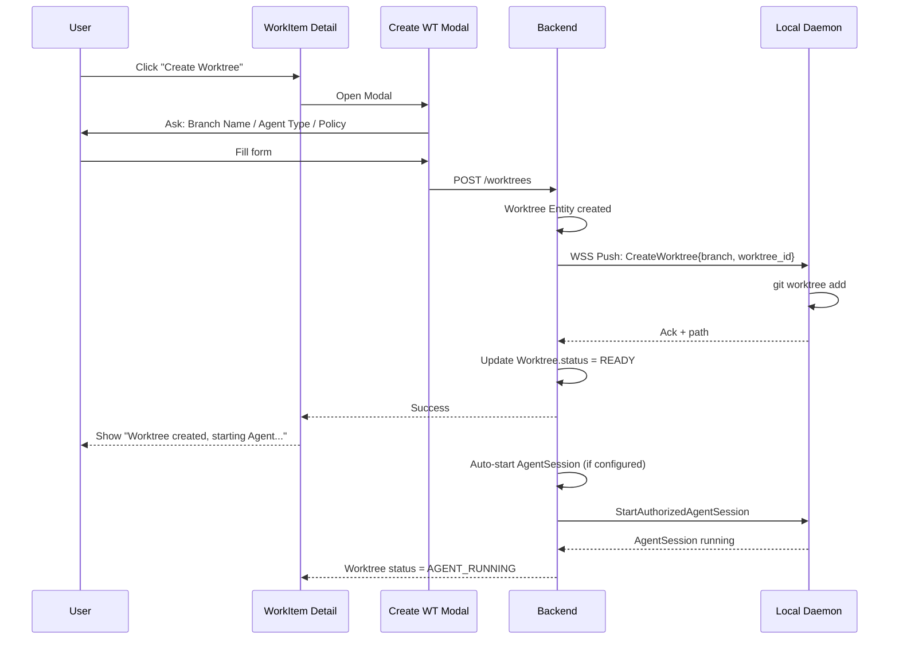
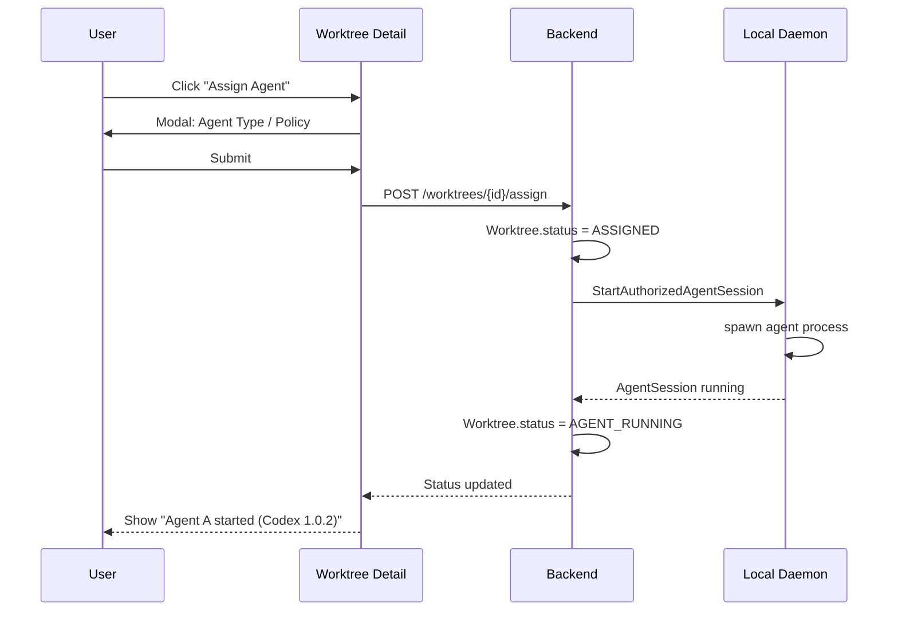
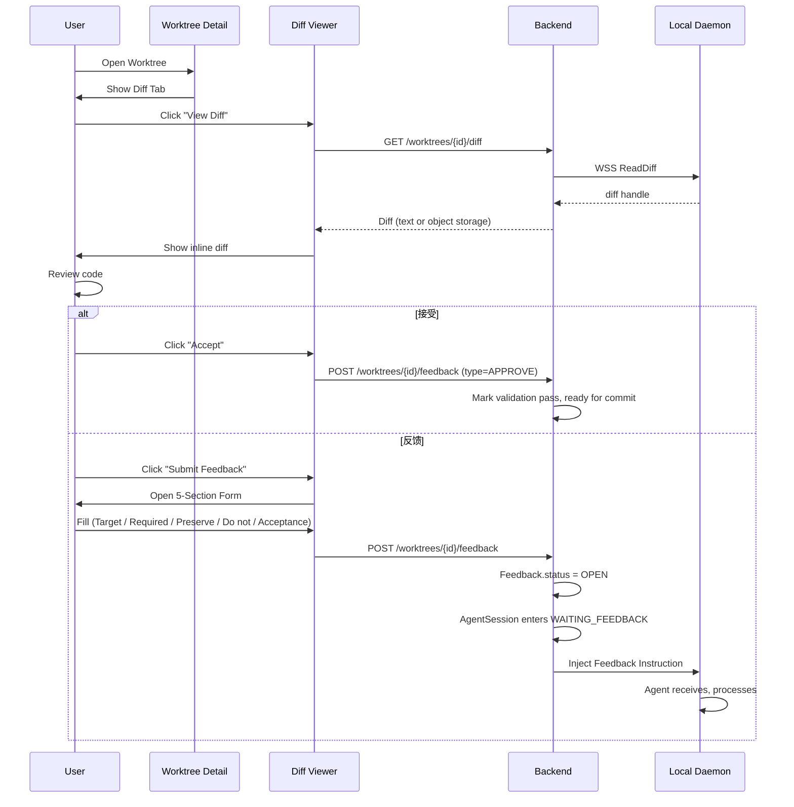
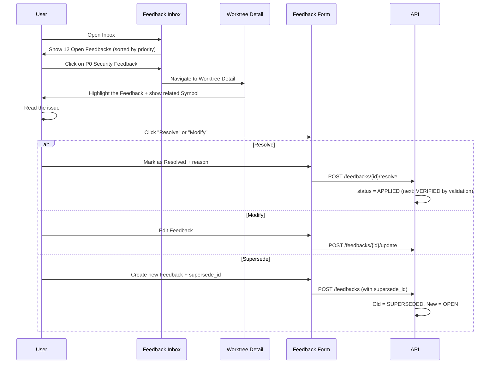
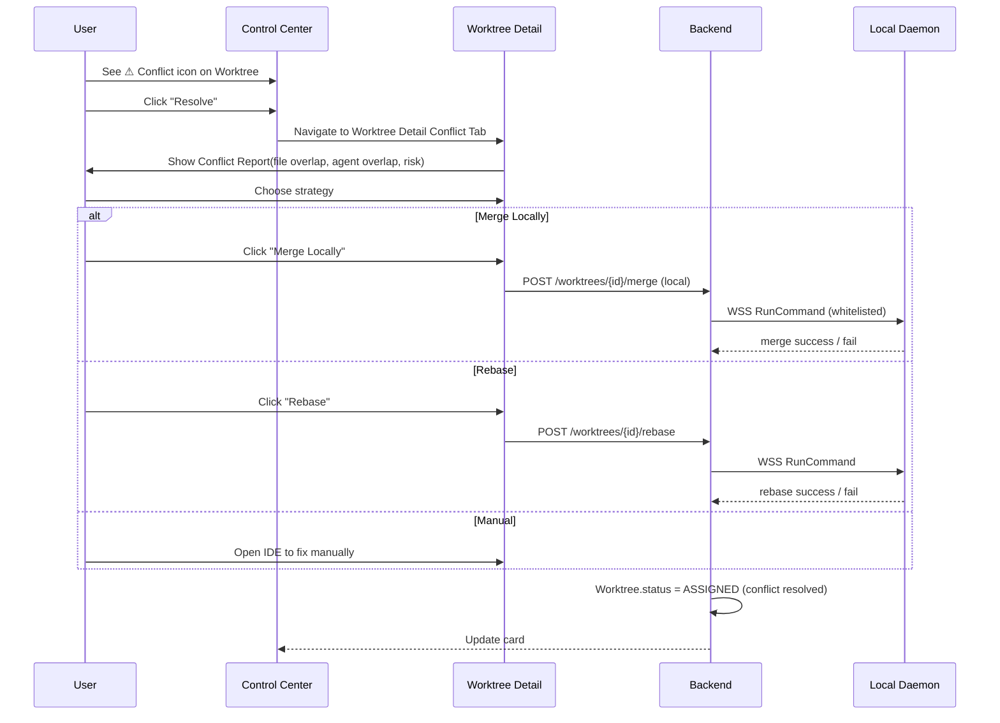
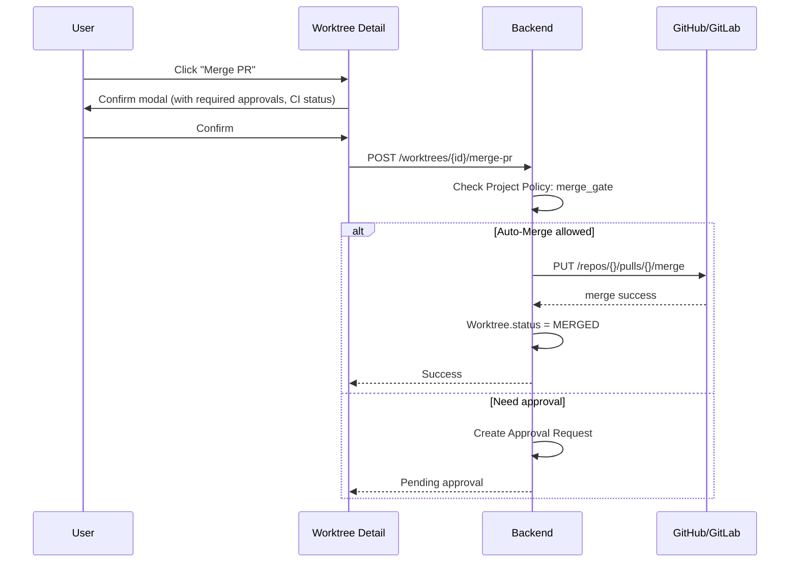

# Star 平台《External Design》(产品 UI/UX 详细设计)

> **文档版本**: v0.1 (2026-08-25)
> **上游**: `docs/requirements.md` v2.0,`docs/basic-design.md` v0.1
> **下游**: Internal Design(组件级)、Implementation(React + Vite)
> **文档定位**: 外部可见的产品 UI/UX 设计:页面结构、信息架构、用户流程。**不**写 React 代码,只描述组件层级、状态、事件。

---

## 0. 文档说明

### 0.1 文档目的与定位

本文档定义 Star 平台所有外部可见 UI 的:

- 设计原则(继承《Requirements》§4 信息架构优先级 + §22.3 Worktree Control Center 优先)
- 信息架构(主导航 + 页面层级)
- 关键页面(目的 / 用户 / 数据源 / 关键交互)
- 关键用户流程
- 设计 Token(颜色 / 字体 / 间距)
- 组件清单(描述,不写代码)
- 响应式 / 可访问性 / i18n
- 给 Internal Design 展开契约

**范围**:
- ✅ Web SPA(主入口)
- ❌ 移动 App(留 V2)
- ✅ 桌面优先,平板次之,手机只读视图

### 0.2 与 Internal Design 的区分

| 维度 | External Design(本文) | Internal Design |
|---|---|---|
| **受众** | 产品经理 / 设计师 / 前端架构师 | 前端工程师 |
| **抽象层级** | 产品 / UX 视角 | 代码组织视角 |
| **产出** | 页面结构 / 组件描述 / 用户流程 | React 组件树 / 状态管理 / API 调用层 |
| **不产出** | React 代码 / 路由实现 | 完整生产代码 |

### 0.3 命名约定

- **页面(Page)**:URL 路径对应一个完整视图
- **视图(View)**:页面内的子区域(Section)
- **组件(Component)**:可复用 UI 元素
- **工作台(Workbench)**:特定用户角色的复合视图(如 Worktree Control Center)
- **Card**:信息卡片,通常 1-2 个核心信息
- **Inbox**:待处理列表视图(Feedback Inbox / Intervention Queue)
- **Drawer**:右侧 / 底部抽屉,用于详情 / 编辑

### 0.4 引用规则

- `§N` 引用《Requirements》v2.0 章节号(最大 §47)
- 引用《Basic Design》使用 `《Basic Design》§X`
- 引用《Internal Design》使用 `《Internal Design》§X`

---

## 1. 设计原则

### 1.1 信息架构优先级(继承《Requirements》§4 + §22.3)

```text
What needs my attention?
    > What is running?
    > What changed?
    > Why did it change?
    > What failed?
    > What should happen next?
    > Chat with AI
```

**翻译为导航结构**:

```text
P0 (主入口,常驻):
  - Worktree Control Center(我的注意力在哪里)
  - Feedback Inbox(谁需要我反馈)
  - Intervention Queue(谁卡住需要介入)

P1 (常驻,次级):
  - Board / Backlog / Sprint / Roadmap
  - Worktree Detail
  - WorkItem Detail

P2 (按需):
  - Settings
  - Audit
  - Admin
```

### 1.2 Worktree Control Center 优先(继承《Requirements》§22.3)

**核心原则**:**AI Chat 不是架构中心,Worktree Control Center 才是。**

Worktree Control Center 满足开发者的核心问题:

```text
今天有哪些 WorkItem 正在开发?
哪些 Agent 正在运行?
哪些 Worktree 正在等待我的反馈?
哪些 Worktree Blocked?
哪些测试失败?
哪些 Worktree 互相冲突?
哪些反馈还没解决?
哪些代码已经 Ready for Review?
哪些 PR/MR 已经准备好?
哪个 Agent 最近偏离了需求?
```

(继承《Requirements》§4)

### 1.3 设计理念

| 原则 | 体现 |
|---|---|
| **Information First** | 信息密度高,少装饰,多数据 |
| **Action by Context** | 每个 Card 都有明确 CTA(进入详情 / Approve / 反馈) |
| **Stale is OK** | UI 显式标注"Possibly Stale"(继承《Requirements》§23.4) |
| **No Hidden State** | Worktree Status、Agent Status、Validation Status 永远可见 |
| **Traceability in 1 Click** | 任何状态都能 1 跳到上游 / 下游(WorkItem ↔ Worktree ↔ AgentSession) |
| **Real-time but Honest** | 实时更新但不假装完美(显示 Online / Offline / Stale) |

### 1.4 反 Anti-Pattern(明确不做)

| 反模式 | 替代 |
|---|---|
| **AI Chat 为主页** | Worktree Control Center 为主页,Chat 是辅助 |
| **花哨的 3D 动画** | 静态 + 微动效 |
| **隐藏工作流配置** | 显示默认 3 态 + 扩展自定义可见 |
| **被动等待通知** | 主动推送 Intervention Queue |
| **统一"Done" 按钮** | 区分 Ready for Review / Ready for Commit / Ready for Merge |

---

## 2. 信息架构(IA)

### 2.1 主导航

```text
┌────────────────────────────────────────────────────────────┐
│ Star [Tenant Picker ▼]                  [Search]  [User ▼] │
├────┬────────────────────────────────────────────────────────┤
│ N  │                                                        │
│ A  │                                                        │
│ V  │                  Main Content                          │
│    │                                                        │
│ 1  │ Worktree Control Center                                │
│ 2  │ Feedback Inbox                                         │
│ 3  │ Intervention Queue                                     │
│ 4  │ Board                                                  │
│ 5  │ Backlog                                                │
│ 6  │ Sprint                                                 │
│ 7  │ Roadmap                                                │
│ 8  │ Worktree Detail (动态)                                 │
│ 9  │ WorkItem Detail (动态)                                 │
│ A  │ Settings                                               │
└────┴────────────────────────────────────────────────────────┘
```

**主导航说明**:

| 编号 | 名称 | URL | 角色 |
|---|---|---|---|
| 1 | Worktree Control Center | `/worktrees` | 全部 |
| 2 | Feedback Inbox | `/inbox/feedback` | 全部 |
| 3 | Intervention Queue | `/inbox/intervention` | 全部 |
| 4 | Board | `/board` | Scrum/Kanban 用户 |
| 5 | Backlog | `/backlog` | PM / Tech Lead |
| 6 | Sprint | `/sprint/{id}` | Scrum 用户 |
| 7 | Roadmap | `/roadmap` | PM / Stakeholder |
| 8 | Worktree Detail | `/worktrees/{id}` | 全部 |
| 9 | WorkItem Detail | `/workitems/{id}` | 全部 |
| A | Settings | `/settings/{tab}` | Admin |

### 2.2 页面层级(深度 = 3 跳内)

```text
L1 (主导航):
  Worktree Control Center / Feedback Inbox / Intervention Queue
  Board / Backlog / Sprint / Roadmap
  Settings

L2 (子页面):
  Worktree Detail(从 L1 跳)
  WorkItem Detail(从 L1 跳)
  Sprint Planning / Gantt(从 Sprint / Roadmap 跳)
  Agent Chat(从 Worktree Detail 跳,附属)

L3 (详情):
  Diff Viewer(从 Worktree Detail 跳)
  Test Result Detail(从 Worktree Detail 跳)
  Feedback Form(从 Worktree Detail 跳)
  Validation Result Detail(从 Worktree Detail 跳)
  Audit Event Detail(从 Settings/Audit 跳)
```

**深度约束**:任何 L1 功能 ≤ 3 跳可达。

### 2.3 全局元素

**Top Bar**(全站常驻):

- 左侧:Star Logo → 点击回 Worktree Control Center
- 中部:Tenant Picker(下拉,显示当前 Tenant)
- 右侧:Search(Cmd+K) / Help / Notifications / User Menu

**Side Nav**:

- 折叠态(默认桌面):图标 + 文字(展开态可配)
- 移动端:Drawer 模式

**Status Bar**(页面底部,可选):

- Connection Status(Online / Offline / Stale)
- Local Daemon Status(若已连接)
- Active Agent Count

---

## 3. 关键页面(每个页面的目的 / 用户 / 数据源 / 关键交互)

### 3.1 Login / Tenant Picker

**URL**:`/login` 或 `/tenant-pick`

**目的**:用户认证 + 选择 Tenant(若多 Tenant)

**用户**:所有未登录用户

**数据源**:
- OIDC / SAML IdP(继承《Integration Design》§5)
- 用户 Membership 列表
- Tenant List(用户被授权的)

**关键交互**:

```text
1. 显示"Sign in with {Provider}"按钮(OIDC 按钮 / SAML 按钮)
2. 点击 → 跳转 IdP 登录
3. 登录成功 → 回调 → 若用户仅 1 个 Tenant → 直接进入 Worktree Control Center
4. 若多 Tenant → 显示 Tenant Picker → 用户选 1 个 → 进入
5. 若 0 Tenant → 提示"无授权 Tenant,联系管理员"
```

**Layout 草图**:

```text
┌──────────────────────────────────────┐
│                                      │
│              [Logo]                   │
│                                      │
│        Sign in to Star                │
│                                      │
│   ┌────────────────────────────┐    │
│   │ [OIDC] Sign in with Okta    │    │
│   └────────────────────────────┘    │
│                                      │
│   ┌────────────────────────────┐    │
│   │ [SAML] Sign in with SSO    │    │
│   └────────────────────────────┘    │
│                                      │
│   ┌────────────────────────────┐    │
│   │ [Local] Username + Pass    │    │
│   └────────────────────────────┘    │
│                                      │
└──────────────────────────────────────┘
```

### 3.2 Worktree Control Center(主页)

**URL**:`/worktrees`

**目的**:同时监督多个 Worktree / Agent,降低认知负担

**用户**:全部角色

**数据源**(继承《Requirements》§22.3,《Basic Design》§4.1):

- Worktree + WorkItem + AgentSession + ChangeSet + ValidationResult + Feedback + Conflict 关联数据
- Observed State(Local Daemon 上报)
- Realtime WebSocket 推送

**关键交互**:

| 操作 | 触发 | 结果 |
|---|---|---|
| Filter | 顶栏 Filter Bar | URL 参数 + Query 过滤 |
| Sort | 列头点击 | 升/降序 |
| Group By | 下拉 | Repository / Agent / Project / WorkItem / Status / Branch |
| Search | Cmd+K | 全字段全文 |
| Click Row | 行点击 | 跳 Worktree Detail |
| Bulk Action | 复选框 | 批量 Approve / Assign |
| Refresh | 顶栏按钮 | 强制拉取最新 |
| View Mode | 切换 | Card / Table / Heatmap |

**Layout 草图**(Table View 默认):

```text
┌──────────────────────────────────────────────────────────────┐
│ Worktree Control Center                       [Refresh] [...]│
├──────────────────────────────────────────────────────────────┤
│ [Filter: Status ▼] [Agent ▼] [Project ▼] [Repo ▼] [Search]   │
│ Group by: [Project ▼]  View: [Table | Card | Heatmap]        │
├──────────────────────────────────────────────────────────────┤
│ ☐ │ Worktree         │ WorkItem  │ Agent    │ Status    │ ... │
├───┼──────────────────┼───────────┼──────────┼───────────┼─────┤
│ ☐ │ star/WT-001      │ WI-123    │ Codex    │ ● Running │     │
│   │ src/auth/        │ Login API │ 3 min    │ P0        │     │
├───┼──────────────────┼───────────┼──────────┼───────────┼─────┤
│ ☐ │ star/WT-002      │ WI-124    │ Claude   │ ⚠ Blocked │     │
│   │ src/api/         │ User CRUD │ 12 min   │ Conflict  │     │
└──┴──────────────────┴───────────┴──────────┴───────────┴─────┘
Status Bar:  Online | Daemon: Connected | 12 Active Agents
```

**Card View**:

```text
┌──────────────────┐  ┌──────────────────┐  ┌──────────────────┐
│ star/WT-001      │  │ star/WT-002      │  │ star/WT-003      │
│ WI-123: Login    │  │ WI-124: User API │  │ WI-125: Email    │
├──────────────────┤  ├──────────────────┤  ├──────────────────┤
│ ● Codex Running  │  │ ⚠ Blocked        │  │ ✓ Ready Review   │
│ 3 min ago        │  │ Conflict         │  │ PR #42           │
│ 4 files changed  │  │ 12 min           │  │ 1d ago           │
│ 3/5 tests pass   │  │ 0 tests          │  │ 5/5 tests        │
│ [View] [Stop]    │  │ [Resolve]        │  │ [Review]         │
└──────────────────┘  └──────────────────┘  └──────────────────┘
```

**Heatmap View**(继承《Requirements》§22.4 Worktree Heatmap):

```text
┌──────────────────────────────────────────────────────────┐
│ Repository: myorg/webapp                                  │
├──────────────────────────────────────────────────────────┤
│ File              │ WT-001 │ WT-002 │ WT-003 │ WT-004   │
├───────────────────┼────────┼────────┼────────┼──────────┤
│ src/auth.rs       │ ●●     │ ●      │        │          │
│ src/api/user.rs   │        │ ●●●    │        │ ●        │
│ src/db/schema.rs  │        │        │ ●●     │          │
│ config/feature.json│      │        │        │ ●●       │
└───────────────────┴────────┴────────┴────────┴──────────┘
Legend: ● = low overlap, ●● = medium, ●●● = high (Conflict Risk)
```

### 3.3 Worktree Detail

**URL**:`/worktrees/{id}`

**目的**:查看单个 Worktree 全貌,做决策

**用户**:全部角色

**数据源**:

- Worktree Entity(17 状态)
- WorkItem 关联
- AgentSession(14 状态,可能多个)
- ChangeSet 列表
- ValidationResult 列表
- Feedback 列表
- Conflict 状态
- Git Diff
- Symbol 索引(检索)
- Activity Timeline

**关键交互**:

| 操作 | 触发 | 结果 |
|---|---|---|
| 状态切换 | 顶部状态徽章 | 显示可执行迁移(下一步) |
| Open in IDE | 按钮 | 启动 IDE 打开 Worktree 路径 |
| View Diff | Tab / 按钮 | 跳 Diff Viewer(子页面) |
| Run Test | 按钮 | 触发 Build Runner |
| Submit Feedback | 按钮 | 打开 Feedback Form |
| Stop Agent | 按钮 | 停止当前 Agent |
| Create PR | 按钮 | 触发 PR 创建 |
| Merge PR | 按钮 | 触发 Merge(走 Project Policy) |
| Abandon | 危险操作 | 标记为 ABANDONED |

**Layout 草图**(3 段式:Header / Tabs / Activity):

```text
┌──────────────────────────────────────────────────────────────┐
│ [← Back] star/WT-001  ● Agent Running                       │
│          WI-123: Implement user login                        │
│          [View WorkItem] [Open in IDE] [Stop] [More ▼]     │
├──────────────────────────────────────────────────────────────┤
│ ┌─ Overview ─┬─ Diff ─┬─ Tests ─┬─ Feedback ─┬─ Activity ─┐│
│ │                                                       │  │
│ │ Status:    AGENT_RUNNING                              │  │
│ │ Agent:     Codex 1.0.2 (gpt-5-codex)                  │  │
│ │ Session:   #42 (12 min, 4 files)                     │  │
│ │ Branch:    star/WT-001/WI-123                        │  │
│ │ Ahead/Behind: 3 / 0                                   │  │
│ │ PR:        #45 (open)                                │  │
│ │ Conflict:  None                                      │  │
│ │ Feedback:  2 Open / 1 Applied                        │  │
│ │ Validation: 3/5 pass                                 │  │
│ │                                                       │  │
│ │ [Submit Feedback] [Run Test] [Create PR]            │  │
│ └───────────────────────────────────────────────────────┘  │
│                                                              │
│ Recent Activity                                              │
│  2 min ago  Agent started test run                          │
│  5 min ago  Feedback FBK-12 received "Use AuthProvider"     │
│  12 min ago Agent session started                           │
└──────────────────────────────────────────────────────────────┘
```

### 3.4 Agent Chat(附属 AI Chat,非架构中心)

**URL**:`/worktrees/{id}/chat` 或 Drawer 嵌入 Worktree Detail

**目的**:与当前 Agent 互动,补充 Context,快速回答问题

**用户**:全部角色

**数据源**:

- Chat History(Decision + Summary, 不全量原始消息)
- Decision 提取
- Context Packet 预览

**关键交互**:

| 操作 | 触发 | 结果 |
|---|---|---|
| 发送消息 | 输入框 | 走 AgentSession,触发 WAITING_FEEDBACK |
| Apply as Decision | 消息上按钮 | 把聊天内容升格为 Decision |
| Apply as Feedback | 消息上按钮 | 升格为 Structured Feedback(走 5 段式) |
| Cite Symbol | 消息上按钮 | 引用 Symbol(自动加 Provenance) |
| Handoff | 工具栏按钮 | 启动 Handoff 流程(切换 Agent) |

**Layout 草图**:

```text
┌──────────────────────────────────────────┐
│ Agent Chat (Codex 1.0.2)        [Handoff] │
├──────────────────────────────────────────┤
│ [User] Use AuthProvider abstraction       │
│                                          │
│ [Agent] I'll refactor auth.rs to use      │
│ the AuthProvider pattern. Let me check    │
│ the current implementation first.         │
│ [View Symbol: AuthService::login]        │
│ [Apply as Decision] [Apply as Feedback]  │
│                                          │
│ [User Decision DEC-5] Use AuthProvider   │
│ for all new auth code. ✓ Active         │
├──────────────────────────────────────────┤
│ [Type message...]              [Send]    │
└──────────────────────────────────────────┘
```

**关键约束**(继承《Requirements》§10 REQ-COLLAB-004):
- ❌ Chat 不得是孤立 Thread,必须关联 WorkItem / Worktree / AgentSession
- ❌ 不得把 Chat 当 Memory,Decision 独立管理

### 3.5 Feedback Inbox

**URL**:`/inbox/feedback`

**目的**:聚合所有等待用户反馈的请求

**用户**:全部角色

**数据源**(继承《Requirements》§25.4):

- Feedback 列表(按 status 过滤)
- 按 target type 分组
- 按 severity / priority 排序
- AgentSession 关联
- 自动优先级推断

**关键交互**:

| 操作 | 触发 | 结果 |
|---|---|---|
| Filter | 顶栏 | 按 type / target / agent 过滤 |
| Sort | 列头 | 按 priority / age / agent |
| Click Row | 行点击 | 跳 Worktree Detail 高亮该 Feedback |
| Quick Reply | 行内按钮 | 弹窗快速回复 / 解决 |
| Batch Resolve | 复选框 + 按钮 | 批量标记 |

**Layout 草图**:

```text
┌────────────────────────────────────────────────────────────┐
│ Feedback Inbox                              [Filter ▼] [...]│
├────────────────────────────────────────────────────────────┤
│ Sort: [Priority ▼]  Group by: [Worktree ▼]                  │
├────────────────────────────────────────────────────────────┤
│ Priority │ Worktree      │ Type    │ Agent  │ Age   │  CTA │
├──────────┼───────────────┼─────────┼────────┼───────┼──────┤
│ P0 ⚠    │ star/WT-001   │ Security│ Codex  │ 2 min │[View]│
│ Security │ src/auth.rs   │         │        │       │      │
├──────────┼───────────────┼─────────┼────────┼───────┼──────┤
│ P1 ⚠    │ star/WT-002   │ Arch    │ Claude │ 12 min│[View]│
│ Arch     │ src/api/      │         │        │       │      │
├──────────┼───────────────┼─────────┼────────┼───────┼──────┤
│ P2       │ star/WT-003   │ Test    │ Gemini │ 1h    │[View]│
│ Test     │ src/api/email │ Failure │        │       │      │
└──────────┴───────────────┴─────────┴────────┴───────┴──────┘
Status Bar: 5 Open, 2 Acknowledged, 12 Applied Today
```

### 3.6 Intervention Queue(Needs Human 视图)

**URL**:`/inbox/intervention`

**目的**:按优先级聚合需要人类决策的事项(继承《Requirements》§25.4)

**用户**:全部角色

**数据源**(继承《Requirements》§25.4):

- Security Decision
- Architecture Feedback
- Merge Conflict
- Test Failure(关键)
- Agent Question
- Optional Refactor

**关键交互**:

| 操作 | 触发 | 结果 |
|---|---|---|
| 拖动排序 | Card 拖动 | 调整优先级 |
| Mark Resolved | 按钮 | 关闭 |
| Open Detail | Card 点击 | 跳对应对象 |

**Layout 草图**(Kanban 式):

```text
┌────────────────────────────────────────────────────────────┐
│ Intervention Queue                          [Filter] [Help]│
├──────────────┬──────────────┬──────────────┬───────────────┤
│ P0 Security  │ P1 Arch      │ P2 Test      │ P3 Optional   │
│              │              │              │               │
│ ┌──────────┐ │ ┌──────────┐ │ ┌──────────┐ │ ┌──────────┐ │
│ │ WT-001   │ │ │ WT-002   │ │ │ WT-005   │ │ │ WT-009   │ │
│ │ Security │ │ │ Arch     │ │ │ Test Fail│ │ │ Refactor │ │
│ │ Risk:hi  │ │ │ Pattern  │ │ │ 3 fail   │ │ │ Optional │ │
│ │ [Solve]  │ │ │ [Solve]  │ │ │ [Solve]  │ │ │ [Solve]  │ │
│ └──────────┘ │ └──────────┘ │ └──────────┘ │ └──────────┘ │
│              │              │              │               │
│ ┌──────────┐ │              │              │               │
│ │ WT-007   │ │              │              │               │
│ │ API Key  │ │              │              │               │
│ │ Leaked?  │ │              │              │               │
│ │ [Solve]  │ │              │              │               │
│ └──────────┘ │              │              │               │
└──────────────┴──────────────┴──────────────┴───────────────┘
```

### 3.7 Board(Kanban + Scrum 板视图)

**URL**:`/board`

**目的**:传统敏捷板视图(继承《Requirements》§9 + REQ-PLAN-003)

**用户**:Scrum / Kanban 用户

**数据源**:

- WorkItem + Status(默认 3 态 + 扩展)
- Sprint 关联
- Assignee / Label

**关键交互**:

| 操作 | 触发 | 结果 |
|---|---|---|
| 拖动 Card | 跨列 | 状态切换 |
| 拖动到 Sprint Backlog | Card 拖到 Sprint 区域 | 分配 Sprint |
| Filter | 顶栏 | 按 Assignee / Label / Sprint |
| Swimlane | 下拉 | 按 Assignee / Epic / Priority |
| WIP Limit | 列头 | 列头红色高亮(超出) |

**Layout 草图**(默认 3 列 + WIP):

```text
┌────────────────────────────────────────────────────────────┐
│ Board: WebApp Team  Sprint: #42 (in progress)              │
│ Filter: [All ▼] [Assignee ▼] [Label ▼]                     │
│ Swimlane: [None ▼]   View: [Kanban | Scrum]                │
├────────────────────────────────────────────────────────────┤
│ TODO (5)         │ IN_PROGRESS (3)   │ DONE (12)          │
│                  │                   │                    │
│ ┌──────────────┐ │ ┌──────────────┐ │ ┌──────────────┐  │
│ │ WI-130       │ │ │ WI-123       │ │ │ WI-100       │  │
│ │ Login page   │ │ │ Login API    │ │ │ Database     │  │
│ │ P1 alice     │ │ │ P0 bob       │ │ │ Setup        │  │
│ │ [3 points]   │ │ │ [5 points]   │ │ │ [8 points]   │  │
│ └──────────────┘ │ └──────────────┘ │ └──────────────┘  │
│                  │                   │                    │
│ ┌──────────────┐ │ ┌──────────────┐ │ ┌──────────────┐  │
│ │ WI-131       │ │ │ WI-124       │ │ │ WI-101       │  │
│ │ Email        │ │ │ User CRUD    │ │ │ Auth Schema  │  │
│ │ P2 alice     │ │ │ P1 bob       │ │ │ P0 charlie   │  │
│ └──────────────┘ │ └──────────────┘ │ └──────────────┘  │
│                  │                   │                    │
└──────────────────┴───────────────────┴────────────────────┘
```

**Gantt 视图**:`/roadmap/gantt/{project_id}`(继承 REQ-PLAN-004)

### 3.8 Sprint Planning

**URL**:`/sprint/{id}/planning`

**目的**:Sprint 计划(开始 / 结束时间盒,Story Point 估算)

**用户**:Scrum Master / PM

**数据源**:

- Backlog
- Sprint 时间盒
- Team Velocity
- Story Point 历史

**关键交互**(继承 REQ-PLAN-002):

- 拖动 Backlog Item 到 Sprint
- 估算 Story Point
- 显示 Velocity 趋势

### 3.9 WorkItem Detail

**URL**:`/workitems/{id}`

**目的**:单个 WorkItem 完整视图(继承《Requirements》§8 + §22)

**用户**:全部角色

**数据源**:

- WorkItem
- 关联 Worktree 列表(继承 REQ-WF-002 多 Worktree 独立状态)
- 关联 Acceptance Criteria
- 关联 Feedback
- 关联 Decision
- Comments + Mentions
- Attachments
- 关联 Validation Result
- Activity Timeline

**关键交互**:

| 操作 | 触发 | 结果 |
|---|---|---|
| Edit | 顶栏 | 内联编辑 |
| Add Comment | 底部 | 走 Comment Port |
| Add Feedback | 顶栏 | 弹 5 段式 Form |
| Create Worktree | 按钮 | 弹 Worktree 创建向导 |
| View Tree | Tab | 显示 Worktree 列表(独立状态) |
| View Graph | Tab | 跳 Traceability 链 |
| View Validation | Tab | 显示 AC + Evidence |
| Promote to Decision | 顶栏 | 升格为 Decision |
| Submit | Workflow | 状态迁移 |

**Layout 草图**(Tabs):

```text
┌────────────────────────────────────────────────────────────┐
│ [← Back] WI-123: Implement user login                       │
│          Status: IN_PROGRESS   Assignee: bob   P0          │
│          [Edit] [Add Comment] [Add Feedback] [Create WT]   │
├────────────────────────────────────────────────────────────┤
│ ┌─ Overview ┬─ Acceptance ┬─ Worktree ┬─ Feedback ┬─ ... ─┐│
│ │                                                       │  │
│ │ Description:                                          │  │
│ │   As a user, I want to log in with email+password    │  │
│ │                                                      │  │
│ │ Acceptance Criteria:                                  │  │
│ │   ✓ AC-001: User can log in (3/3 evidence)          │  │
│ │   ⚠ AC-002: Failed login returns 401 (1/2 evidence) │  │
│ │   ⏸ AC-003: Rate limiting (WAIVED)                  │  │
│ │                                                      │  │
│ │ Linked Worktree:                                     │  │
│ │   star/WT-001: AGENT_RUNNING (Codex)                │  │
│ │                                                      │  │
│ │ Linked PR: #45 (Open)                               │  │
│ └──────────────────────────────────────────────────────┘  │
│                                                              │
│ Activity                                                     │
│  1h ago  Validation passed for AC-001                       │
│  2h ago  Agent session started                             │
│  3h ago  Worktree created                                   │
└────────────────────────────────────────────────────────────┘
```

### 3.10 Settings(分 Tab)

**URL**:`/settings/{tab}`

**Tab 列表**:

| Tab | 内容 | 角色 |
|---|---|---|
| **Profile** | 用户名 / 头像 / 密码 / MFA | All |
| **Project Policy** | Workflow / Permission / Notification Scheme | Project Admin |
| **Agent Policy** | 13 维 Policy(继承《Basic Design》§24.3 + 《AI/Agent Design》§9) | Project Admin |
| **Provider Data Boundary** | 6 维 Policy(继承《AI/Agent Design》§9.1) | Project Admin / Compliance |
| **Integrations** | SCM / Agent / Notification / Identity 配置 | Tenant Admin |
| **Members** | 用户 / 角色管理 | Tenant Admin |
| **Audit** | AI Audit 9 问查询(继承《AI/Agent Design》§8.5) | Compliance / Admin |
| **Billing**(V2) | 订阅 / 用量 | Tenant Admin |
| **Local Runtime** | 设备注册 / Bootstrap / Revoke | Tenant Admin |

**关键交互**:

- 每个 Tab 都有"Edit / Save / Cancel"模式
- 危险操作(删除 Tenant / Revoke Runtime)需二次确认 + 审批
- 审计 Tab:可查询 L1/L2 摘要,看 L3/L4 需 Compliance 权限

---

## 4. 关键用户流程

### 4.1 从 WorkItem 创建 Worktree



### 4.2 分配 Worktree 给 Agent

(已在 §4.1 自动触发,以下是显式分配)



### 4.3 Agent 修改后 Review



### 4.4 处理 Feedback Inbox



### 4.5 处理 Conflict



### 4.6 Merge PR



---

## 5. 设计 Token

### 5.1 颜色

**主色调**(Semantic Tokens,定义值在 Internal Design / CSS 中):

| Token | 用途 | Light | Dark |
|---|---|---|---|
| `--color-primary` | 品牌主色 / CTA | blue-600 | blue-400 |
| `--color-success` | 成功 / Pass | green-600 | green-400 |
| `--color-warning` | 警告 / Blocked | amber-500 | amber-400 |
| `--color-danger` | 危险 / Failed / Conflict | red-600 | red-400 |
| `--color-info` | 信息 / Running | blue-500 | blue-300 |
| `--color-muted` | 弱化文字 | gray-500 | gray-400 |
| `--color-bg` | 背景 | white | gray-900 |
| `--color-bg-elevated` | 卡片 / Modal 背景 | gray-50 | gray-800 |
| `--color-border` | 边框 | gray-200 | gray-700 |

**状态语义色**(Worktree / Agent 状态):

| 状态 | Token | 例子 |
|---|---|---|
| **CREATED / READY** | `--color-info` | 蓝色 |
| **AGENT_RUNNING** | `--color-primary` | 亮蓝(动效 pulse) |
| **WAITING_FEEDBACK** | `--color-warning` | 黄色 |
| **VALIDATING** | `--color-info` | 蓝色 + spinner |
| **BLOCKED** | `--color-warning` | 黄色 |
| **CONFLICTED** | `--color-danger` | 红色 |
| **READY_FOR_REVIEW** | `--color-success` | 绿色 |
| **REVIEWING** | `--color-info` | 蓝色 |
| **MERGED** | `--color-success` | 深绿 |
| **ABANDONED / ARCHIVED** | `--color-muted` | 灰色 |
| **FAILED** | `--color-danger` | 红色 |
| **CRASHED** | `--color-danger` | 红色 + ⚠ |
| **TIMEOUT** | `--color-warning` | 黄色 + ⏱ |

### 5.2 字体

| 用途 | 字体栈 |
|---|---|
| Sans(默认) | `-apple-system, BlinkMacSystemFont, "Segoe UI", "Helvetica Neue", Arial, "PingFang SC", "Hiragino Sans GB", "Microsoft YaHei", sans-serif` |
| Mono(代码) | `"SF Mono", "Monaco", "Inconsolata", "Fira Code", "Source Code Pro", monospace` |

**字号**:

```text
xs:   12px / 1.4
sm:   14px / 1.5
base: 16px / 1.5
lg:   18px / 1.5
xl:   20px / 1.4
2xl:  24px / 1.3
3xl:  30px / 1.2
4xl:  36px / 1.1
```

### 5.3 间距(8px 网格)

```text
0:   0
1:   4px
2:   8px
3:   12px
4:   16px
5:   20px
6:   24px
8:   32px
10:  40px
12:  48px
16:  64px
20:  80px
24:  96px
```

### 5.4 圆角 / 阴影 / 动效

```text
Border Radius:
  none: 0
  sm:   4px
  md:   8px
  lg:   12px
  xl:   16px
  full: 9999px

Shadow:
  sm:    0 1px 2px rgba(0,0,0,0.05)
  md:    0 4px 6px rgba(0,0,0,0.07)
  lg:    0 10px 15px rgba(0,0,0,0.1)

Animation:
  duration-fast: 100ms
  duration-base: 200ms
  duration-slow: 300ms
  easing-default: cubic-bezier(0.4, 0, 0.2, 1)
```

### 5.5 主题(亮 / 暗)

**Light Theme**(默认):

- 背景:white / gray-50
- 文字:gray-900
- 强调:blue-600
- 阴影:soft

**Dark Theme**:

- 背景:gray-900 / gray-800
- 文字:gray-100
- 强调:blue-400
- 阴影:subtle
- 状态色提高亮度(避免对比度不足)

**主题切换**:

- 用户偏好持久化(LocalStorage)
- 跟随系统(`prefers-color-scheme`)
- 切换时整体过渡 200ms

---

## 6. 组件清单(描述,不写代码)

### 6.1 Worktree Card

**用途**:Worktree Control Center 的 Card 视图,展示单个 Worktree 状态摘要

**Prop Interface**(描述):

```text
WorktreeCardProps:
  - worktree: WorktreeSummary
  - agent_session?: AgentSessionSummary
  - work_item: WorkItemSummary
  - validation_summary?: ValidationSummary
  - conflict?: ConflictReport
  - on_click: () => void
  - on_action: (action: WorktreeAction) => void
  - variant: 'compact' | 'detailed'

显示内容:
  - 顶部: Branch Name + Status Badge
  - 中部: WorkItem 标题 + Key(P0/P1/P2 颜色)
  - 底部: Agent 头像 + 耗时 + Tests Pass/Total + Conflict 图标
  - 右侧: 行动按钮(根据 status 显示不同)
```

### 6.2 Agent Status Badge

**用途**:显示 Agent 当前状态(14 状态 + 进程状态)

**Prop Interface**:

```text
AgentStatusBadgeProps:
  - status: AgentSessionStatus (14 状态枚举)
  - pid?: number
  - elapsed_seconds: number
  - on_click?: () => void

显示:
  - 图标(根据状态)
  - 文字(状态名)
  - 可选: 已运行时长(每 10s 更新)
  - 可选: 进程 pid(debug 模式)
```

### 6.3 Diff Viewer

**用途**:展示 Worktree 的 Code Diff(全文或子集)

**Prop Interface**:

```text
DiffViewerProps:
  - diff_handle: DiffHandle
  - file_filter?: string[]
  - symbol_filter?: SymbolRef[]
  - view_mode: 'unified' | 'split' | 'inline'
  - highlight_feedback?: FeedbackId[]  // 高亮相关 Feedback 覆盖行
  - show_symbols: boolean
  - on_symbol_click: (symbol: SymbolRef) => void

显示:
  - 左侧:文件树(可折叠)
  - 中部:行号 + Diff 内容(+/ - / hunk header)
  - 右侧:Symbol 边栏
  - 顶部:Filter / Search
```

### 6.4 Test Result List

**用途**:显示 Validation Result + Test Report

**Prop Interface**:

```text
TestResultListProps:
  - validation_result: ValidationResult
  - test_reports: TestReport[]
  - show_evidence: boolean
  - on_test_click: (test_id: string) => void

显示:
  - 顶部:Summary(Pass / Fail / Skip counts)
  - 列表:每条 Test(name, status, duration, error message if fail)
  - 失败项:可展开(显示 stack trace / log)
  - 关联 AC:可显示对应 AC
```

### 6.5 Conflict Heatmap

**用途**:展示 Repository 内 Worktree 文件/符号重叠

**Prop Interface**:

```text
ConflictHeatmapProps:
  - repository_id: RepositoryId
  - worktree_ids?: WorktreeId[] (默认所有 active)
  - granularity: 'file' | 'symbol'
  - on_cell_click: (worktree_a, worktree_b, overlap_target) => void

显示:
  - 矩阵:行/列 = Worktree
  - Cell:重叠度(0/1/2/3,颜色)
  - Tooltip:具体重叠文件/符号
```

### 6.6 Feedback Item

**用途**:Feedback Inbox 中单条 Feedback,或 Worktree Detail 中嵌入

**Prop Interface**:

```text
FeedbackItemProps:
  - feedback: Feedback
  - variant: 'inbox' | 'inline' | 'compact'
  - show_target: boolean
  - on_resolve: () => void
  - on_edit: () => void
  - on_supersede: () => void

显示:
  - 顶部:Priority Badge + Type Icon + Status
  - 中部:Target 摘要(file:line, symbol, etc.)
  - 底部:5 段式摘要(简略)
  - 操作:Resolve / Edit / Supersede
```

### 6.7 通用组件

| 组件 | 用途 |
|---|---|
| **Status Pill** | 通用状态徽章(Worktree / WorkItem / Agent / Validation) |
| **Tenant Switcher** | 全局 Tenant 切换 |
| **User Avatar** | 用户头像 + 角色 tooltip |
| **Notification Bell** | 站内通知 |
| **Search Bar**(Cmd+K) | 全局搜索 |
| **Drawer** | 右侧 / 底部抽屉 |
| **Modal** | 弹窗 |
| **Toast** | 短时通知 |
| **Confirm Dialog** | 二次确认 |
| **Empty State** | 空状态插画 + CTA |
| **Error Boundary** | 错误边界 + 友好提示 |
| **Skeleton** | 加载骨架屏 |
| **Pagination** | 分页 / 无限滚动 |
| **Filter Bar** | 多条件过滤 |
| **Date Range Picker** | 时间选择 |
| **Code Block** | 语法高亮代码 |
| **Markdown Renderer** | Markdown / MDX 渲染 |
| **File Tree** | 文件树组件 |
| **Tag Input** | 标签输入 |
| **Mention Input** | @ 提及输入 |
| **Attachment Uploader** | 附件上传 |

---

## 7. 响应式与可访问性

### 7.1 响应式断点

| 断点 | 宽度 | 设备 | 布局 |
|---|---|---|---|
| **xs** | < 640px | 手机 | 1 列(只读视图,V2) |
| **sm** | 640~1024px | 平板 | 2 列,简化侧边栏 |
| **md** | 1024~1280px | 小桌面 | 完整功能,中等字号 |
| **lg** | 1280~1536px | 标准桌面 | 完整功能,推荐尺寸 |
| **xl** | > 1536px | 大屏 | 完整功能 + 多列 |

### 7.2 各设备适配策略

**手机(xs)**:

- 只读视图(V2 候选,MVP 不做)
- 简化状态信息
- 关键 CTA 按钮大尺寸
- 抽屉式交互

**平板(sm)**:

- 完整 Worktree Control Center
- Board 简化(2 列)
- 弹窗替代 Drawer
- 触摸友好(按钮 ≥ 44px)

**桌面(md+)**:

- 完整功能
- 完整 Board(3+ 列)
- 多 Pane 并排
- 快捷键支持

### 7.3 可访问性(WCAG 2.1 AA 目标)

| 维度 | 要求 |
|---|---|
| **颜色对比度** | 文字 vs 背景 ≥ 4.5:1(Large Text ≥ 3:1) |
| **键盘导航** | 所有功能可仅用键盘操作 |
| **Focus 可见** | `:focus-visible` 清晰高亮 |
| **ARIA Label** | 所有交互组件有 `aria-label` |
| **Screen Reader** | 关键状态(Status Badge / Agent Status)有 `aria-live` |
| **表单** | 错误提示与字段关联 |
| **图片** | 所有 `img` 有 `alt` |
| **动效** | 尊重 `prefers-reduced-motion` |
| **语言** | `lang` 属性正确 |
| **跳转链接** | "Skip to main content" |

**测试工具**:

- axe DevTools
- Lighthouse Accessibility Audit
- 屏幕阅读器测试(VoiceOver / NVDA)

---

## 8. 国际化(i18n)

### 8.1 文本提取

**所有 UI 文本必须从代码中提取**:**不**允许在 JSX 硬编码。

**MVP 支持语言**:

- English(en,默认)
- 简体中文(zh-CN)
- 日本語(ja)

**实现**(不在本文展开,Internal Design §3.4 描述):

- 使用 `i18next` 或同构方案
- Key 命名:`{namespace}.{component}.{key}`,如 `worktree.status.running`
- 翻译文件:JSON / YAML

### 8.2 翻译流程

```text
1. Developer 写代码,所有 UI 文本用 Key
2. CI 跑 i18n 抽取,生成 `en.json`(源语言)
3. 翻译者(Translators)维护 `zh-CN.json` / `ja.json`
4. 缺翻译 → 兜底为 en
5. CI 阻断:任何 Key 在 en 缺失 → 报错
6. 翻译者评审 + 提交 PR
```

### 8.3 复数 / 性别 / 上下文

**i18n 库必须支持**:

- 复数形式(`1 worktree` vs `2 worktrees`)
- 上下文(同一 Key 不同语义)
- 插值(`{count} files changed`)

### 8.4 时间 / 数字格式

**继承系统 Locale**:

- 日期:`Intl.DateTimeFormat`(`2026-08-25` vs `Aug 25, 2026` vs `2026年8月25日`)
- 时间:`Intl.DateTimeFormat` 带 timeZone
- 数字:`Intl.NumberFormat`(`1,234` vs `1.234`)
- 相对时间:`Intl.RelativeTimeFormat`(`2 hours ago` vs `2時間前`)
- 时区:用户 Profile 设置(默认 Browser TZ)

### 8.5 RTL 支持(未来)

**MVP 不做 RTL**;架构上留余地(CSS logical properties)。

---

## 9. 给下游契约(Internal Design 展开 + Implementation 任务分解)

### 9.1 给 Internal Design(组件级展开)

Internal Design(下一份文档)需基于本文档展开:

- React 组件树(每个 External 组件的子组件拆分)
- 状态管理(Zustand / Redux Toolkit / TanStack Query)
- 路由(React Router v7)
- API 调用层(React Query Hooks)
- 性能预算(LCP / INP / CLS)
- 测试策略(Vitest + React Testing Library + Playwright)

**关键依赖**:

- `WorktreeCard` → 多种 sub-component
- `Agent Status Badge` → 14 状态枚举 + 图标映射
- `Diff Viewer` → 集成 Monaco Editor 或 CodeMirror
- `Conflict Heatmap` → D3.js 或自绘 SVG

### 9.2 给 Implementation(任务分解)

**UI 任务分解**(给 Implementation 团队):

```text
P0 (MVP):
  - Login / Tenant Picker
  - Worktree Control Center(Table + Card + Filter)
  - Worktree Detail(Overview + Diff + Tests + Feedback)
  - Feedback Inbox
  - Intervention Queue
  - WorkItem Detail
  - Board(默认 3 列)
  - Settings(Profile / Project Policy / Agent Policy)

P1 (V1):
  - Heatmap View
  - Sprint Planning / Gantt
  - Settings(Provider Boundary / Integrations)
  - Roadmap

P2 (V2):
  - 移动只读视图
  - 离线缓存
  - 实时协作(光标)
```

### 9.3 与设计协作流程

- Figma 设计稿(并行产出,本设计提供结构与原则)
- 设计师按本文档组件清单产出 Figma Components
- Engineer 按 Figma + 本文档实现
- 设计走查 + a11y 审计

---

## 10. 附录 A:页面导航流程图

```mermaid
flowchart TB
    Login[Login]
    TenantPick[Tenant Picker]
    CC[Worktree Control Center<br/>/worktrees]
    WTD[Worktree Detail<br/>/worktrees/&#123;id&#125;]
    FI[Feedback Inbox<br/>/inbox/feedback]
    IQ[Intervention Queue<br/>/inbox/intervention]
    Board[Board<br/>/board]
    Backlog[Backlog<br/>/backlog]
    Sprint[Sprint<br/>/sprint/&#123;id&#125;]
    Roadmap[Roadmap<br/>/roadmap]
    WID[WorkItem Detail<br/>/workitems/&#123;id&#125;]
    Settings[Settings<br/>/settings/&#123;tab&#125;]
    Diff[Diff Viewer<br/>/worktrees/&#123;id&#125;/diff]
    Test[Test Result Detail<br/>/worktrees/&#123;id&#125;/tests/&#123;tid&#125;]
    FForm[Feedback Form<br/>/worktrees/&#123;id&#125;/feedback/new]
    Chat[Agent Chat<br/>/worktrees/&#123;id&#125;/chat]
    Audit[Audit<br/>/settings/audit]

    Login --> TenantPick
    TenantPick --> CC
    CC --> WTD
    CC --> FI
    CC --> IQ
    CC --> Board
    CC --> Backlog
    CC --> Sprint
    CC --> Roadmap
    WTD --> Diff
    WTD --> Test
    WTD --> FForm
    WTD --> Chat
    WTD --> WID
    WID --> WTD
    FI --> WTD
    IQ --> WTD
    Sprint --> WID
    Backlog --> WID
    Settings --> Audit
```



---

## 11. 附录 B:Worktree Control Center 草图描述

### 11.1 完整草图(ASCII)

```text
┌──────────────────────────────────────────────────────────────────────┐
│ [Star]  Acme Corp ▼              [Search ⌘K]    [🔔]  [Avatar ▼]    │
├────┬─────────────────────────────────────────────────────────────────┤
│ 📋 │ Worktree Control Center                       [+ New WT] [⚙]    │
│    │                                                                 │
│ 📥 │ Showing 12 of 47 worktrees    Filter: [Status ▼] [Agent ▼]    │
│ ⚠  │ Group by: [Project ▼]   View: [Table | Card | Heatmap]         │
│    │                                                                 │
│ 📊 │ ☐ │ Project  │ Worktree      │ WorkItem  │ Agent │ Status   │  │
│    │───┼──────────┼───────────────┼───────────┼───────┼──────────│  │
│    │ ☐ │ WebApp   │ star/WT-001   │ WI-123    │ 🟢 C  │ Running  │  │
│    │ ☐ │ WebApp   │ star/WT-002   │ WI-124    │ 🟡 Cl │ Blocked  │  │
│    │ ☐ │ WebApp   │ star/WT-003   │ WI-125    │ 🟢 G  │ Review   │  │
│    │ ☐ │ API      │ star/WT-010   │ WI-200    │ 🔵 C  │ Ready    │  │
│    │ ☐ │ API      │ star/WT-011   │ WI-201    │ 🟢 C  │ Merged   │  │
│    │ ☐ │ Mobile   │ star/WT-020   │ WI-300    │ ⚪    │ Archived │  │
│    │   │          │               │           │       │          │  │
│    │                                                                 │
│ ── │ Quick Filters: [P0] [Waiting Me] [Conflicted] [Test Failed]     │
│ ⚙  │                                                                 │
│    │ Showing 1-6 of 47    [< Prev]  [Page 1]  [Next >]               │
├────┴─────────────────────────────────────────────────────────────────┤
│ 🟢 Online  |  Daemon: Connected  |  3 Active Agents                  │
└──────────────────────────────────────────────────────────────────────┘

Legend:
  🟢 C  = Codex running
  🟡 Cl = Claude Code, blocked
  🟢 G  = Gemini, ready for review
  🔵 C  = Codex, ready (idle)
  ⚪    = archived
```

### 11.2 关键交互细节

- **行 Hover**:背景色轻微变深,显示 Quick Actions(View / Stop / Feedback)
- **Status Badge**:彩色 Pill,鼠标悬停显示 Tooltip(完整状态名 + 描述)
- **Agent 图标**:厂商 Logo + 颜色标识
- **实时更新**:状态变化时,对应行有短暂高亮动效(0.5s)
- **Stale 标记**:若 Local Daemon 上次 Heartbeat > 5min,行右侧显示 ⚠ "Possibly Stale"
- **Filter Chip**:多 Filter 时,显示为 Chip(可单独移除)
- **Saved View**:用户可保存当前 Filter + Group 配置(走 URL)

---

## 12. Open Issues(继承上游 + 新增 External-J.x)

### 12.1 继承自《Basic Design》§15 J.x

- J-09:高 Cardinality 标签(本设计 §3.2 实时更新,需注意节流)
- J-15:Traceability UI 链展示(本设计 §3.9 WorkItem Detail Tabs)

### 12.2 本设计新增

- **External-J.1**:手机端是否需要"实时控制"(不只只读)?MVP 暂定只读。**V1 候选**。
- **External-J.2**:Worktree Control Center 默认 View(Table / Card / Heatmap)?暂定 Table。**待用户反馈**。
- **External-J.3**:是否需要"声音提醒"(新 Feedback / Crash)?**V1 候选**。
- **External-J.4**:Worktree Card 是否需要显示"下次 ETA"(预计完成时间)?依赖 Agent 历史,精度难。**V1 候选**。
- **External-J.5**:是否需要"键盘快捷键全集"(类似 Gmail / Jira)?P0:MVP 必要(V / E / Esc / Cmd+K)。**P0 实现**。
- **External-J.6**:是否需要"对比模式"(两个 Worktree 并排 diff)?**V1 候选**。
- **External-J.7**:是否需要"虚拟列表"(Worktree 数量 > 1000 时)?**P0 实现**(性能必需)。
- **External-J.8**:是否需要"批量操作"(批量 Approve / Feedback)?**P0 实现**(效率必需)。
- **External-J.9**:Heatmap 是否需要支持跨 Repository 视图?**V1 候选**(复杂度高)。
- **External-J.10**:是否需要"夜间模式自动切换"(根据系统时间)?**P0 实现**(跟随系统即可)。

---

## 13. 接口稳定承诺(给 Internal Design / Implementation)

以下接口在本设计冻结后,**不**因下游阶段而变更:

1. **页面 URL 结构**:§2.1 + §3
2. **主导航列表**:§2.1
3. **页面层级深度约束**:§2.2
4. **Worktree Control Center 信息架构**:§3.2
5. **Worktree Detail Tabs**:§3.3
6. **Feedback Inbox / Intervention Queue 字段**:§3.5 + §3.6
7. **设计 Token(颜色 / 字体 / 间距)**:§5
8. **状态语义色映射**:§5.1
9. **响应式断点**:§7.1
10. **WCAG 2.1 AA 目标**:§7.3
11. **MVP i18n 语言清单**:§8.1
12. **关键用户流程**:§4
13. **组件清单(prop interface)**:§6
14. **信息架构优先级**:§1.1
15. **核心设计原则**:§1.2 + §1.3

**变更流程**:任何对上述接口的修改,需走 RFC + 重新冻结本设计。

---

## 14. 文档元信息

- **章节数**:0~13 主章 + 附录 A/B
- **mermaid 图数**:3(§2.1, §10, §4.1-§4.6 共 6 个时序图,选 3 个为代表)
- **目标行数**:1000~2000
- **目标大小**:30~70KB
- **下游契约**:Internal Design(组件级) / Implementation(React + Vite)
- **关联设计**:《Basic Design》§4(信息架构) + §22(Worktree) + §25(Feedback) + §26(Context)、《Internal Design》(下游)
- **覆盖 25 Module**:本设计主要涉及 domain-work-item(§3.9 + §4 WorkItem Detail)、domain-worktree(§3.2 + §3.3 + §4 Worktree Control Center / Detail)、domain-workflow(§3.7 Board 显示 Workflow 状态)、domain-board(§3.7 Board 视图)、domain-planning(§3.8 Sprint Planning + Gantt)、domain-relation(§3.9 关联显示)、domain-comment(§3.9 + §3.4 Comments + Mentions)、domain-feedback(§3.5 + §3.6 + §4.4 Feedback Inbox + 5 段式表单)、domain-context(§3.4 Agent Chat + Decision 升格)、domain-agent(§3.2 + §3.3 + §3.4 Agent Status + Chat)、domain-scm(§3.3 PR 关联 + §4.6 Merge PR)、domain-development(§3.3 Diff + ChangeSet)、domain-validation(§3.3 Tests + §4.5 Validation 链)、domain-tenant(§3.1 Login + Tenant Picker)、domain-workspace(§2.1 全局 Tenant 维度)、domain-project(§3.10 Settings Project Policy)、domain-permission(§3.10 角色级控制)、domain-identity(§3.1 Login + §3.10 Bootstrap)、domain-notification(§2.1 + §7 Notification 入口)、domain-audit(§3.10 Audit Tab + 9 问必答查询)、domain-automation(§3.10 Project Policy 自动化规则)、domain-integration(§3.10 Integrations Tab)、domain-collaboration(§3.4 Chat 多人协作 + Realtime)、domain-search(§2.1 Search ⌘K 全局)、domain-local-runtime(§3.10 Local Runtime Tab + §2.1 Status Bar Daemon 状态)。**全部 25 Module 至少出现 1 次**。
- **13 类 tenant_id 必带对象**:Worktree(§3.2 + §3.3 + §3.9 #3)、AgentSession(§3.2 + §3.3 + §3.4 + §3.6 #4)、ContextPacket(§3.4 Agent Chat #5)、Feedback(§3.5 + §3.6 #6)、AI Prompt(§3.4 Chat 走 Audit #7)、AI Response(§3.4 同上 #8)、Diff(§3.3 Diff Viewer #9)、Build Log(§3.3 Tests #10)、Test Log(同上 #11)、PR Content(§3.3 + §4.6 #12)、Symbol Index(§3.3 + §3.2 Heatmap #13)、Repository Credential(§3.10 Integrations Tab #1)、Local Runtime(§3.10 Local Runtime Tab #2)。**全部 13 类必带对象至少出现 1 次**。

---

**END of External Design v0.1**
