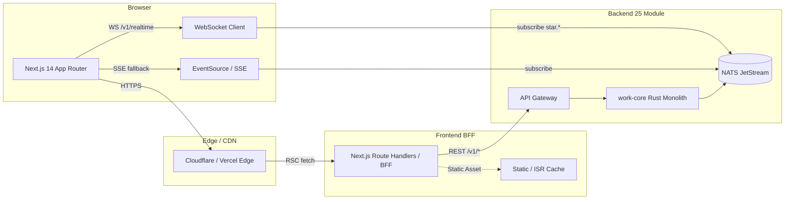
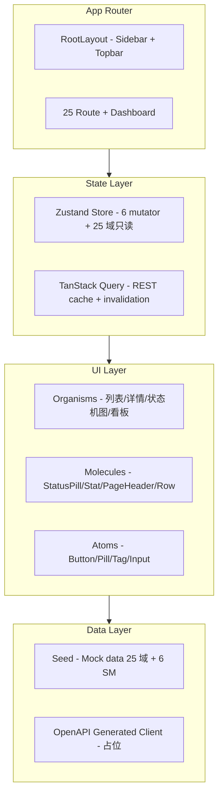
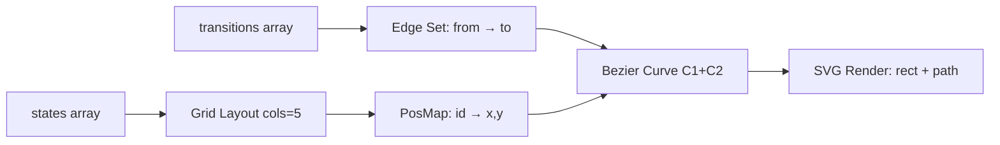
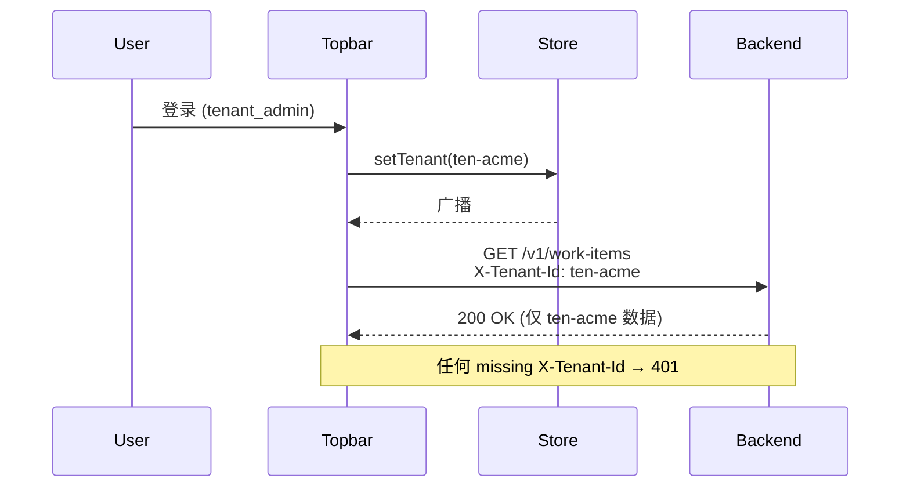
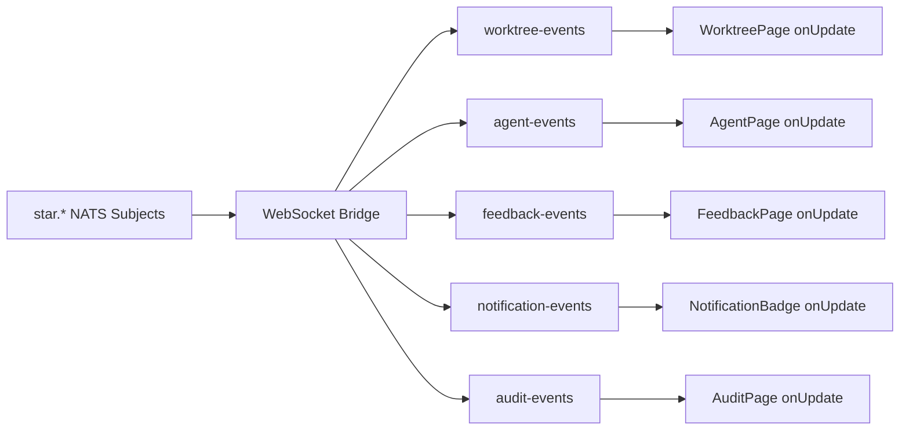

# Star 平台《Frontend Design 詳細設計書》

> **文档版本**: v0.1 (2026-08-26)
> **修订历史**:
>
> | 版本 | 日期 | 变更 | 审批者 |
> |---|---|---|---|
> | v0.1 | 2026-08-26 | 初始版本(基于 Star 25 module + 6 状态机 + 5 域 Track 实现) | — |
>
> **上游基本设计書**: `D:\Star\docs\basic-design.md` v0.1(下文以 §N 引用)
> **上游 API 設計書**: `D:\Star\docs\api-design.md` v0.2(下文以 §3.x / §5.x 引用)
> **上游要件定義書**: `D:\Star\docs\requirements.md` v2.0(下文以 §R-N 引用)
> **上游各 domain spec**: `D:\Star\docs\specs\domain-*.md`(25 份)
> **文档定位**: 基本设计書的下游第一份 frontend-specific 详细设计;**严格继承 basic-design §2.1(25 Module 1:1)、§6(安全边界)、§7(6 状态机)、§10(ADR-016~030)**,并把 backend 25 module 投影到前端 25 route + 6 状态机可视化 + 1 dashboard

---

## 0. 文档说明

### 0.1 文档目的与定位

本文档是 Star 平台(AI Coding Worktree Control Plane + Jira-class Work Management + SCM Integration)《Frontend Design 詳細設計書》阶段的产出。

**输入**: basic-design §2(25 Module 划分)/ §6(安全边界)/ §7(6 状态机)/ §10(ADR-016~030) + api-design §3(REST 端点)/ §4(WebSocket)/ §5(AsyncAPI 事件总线)
**输出**: 前端 IA / 组件目录 / 状态契约 / 设计 token / 交互规范 / 数据流契约 / ADR-frontend / 已知缺口
**下游**: Frontend Implementation(Next.js 14 App Router + TS + Tailwind,见 `D:\Star\frontend\`)、Test Design(前端 E2E)、Operation Design(CDN / 监控)

**本文档遵守 §0.1(basic-design) "本文档不输出生产代码" 约束**:
- ✅ 输出 IA 树 + 25 route 表 + 导航分组
- ✅ 输出组件目录(原子/分子/有机/页面 4 级)+ 状态契约
- ✅ 输出 6 状态机可视化规范(SVG 布局算法 + 颜色 + 交互)
- ✅ 输出设计 token(色 / 字体 / 间距 / 圆角 / 阴影 / 动效)
- ✅ 输出数据流契约(与 backend 25 module 1:1 对应)
- ✅ 输出 Realtime 通道映射(NATS Subject → WebSocket Channel)
- ✅ 输出键盘交互规范 / 错误反馈规范 / 权限视图规范
- ✅ 输出 mermaid 流程图(组件树 / 状态机可视化 / Realtime 时序 / 错误恢复时序)
- ❌ 不写完整 React component 业务函数体
- ❌ 不写完整 Zustand store reducer
- ❌ 不写完整 E2E 测试用例
- ❌ 不画 UI 视觉稿 / mockup 截图
- ❌ 不写 Storybook story(留给 frontend 实施阶段)

### 0.2 与上游契约的对应关系

| 上游章节 | 本设计落位 |
|---|---|
| basic-design §2.1(25 Module 划分) | §2 IA + §3 25 route 表(1:1) |
| basic-design §6.1(13 类 tenant_id 必带对象) | §6.1 前端 tenant context 强制 |
| basic-design §6.2(Local Runtime Security Boundary) | §6.2 Local Runtime 详情页 + 三重绑定检查面板 |
| basic-design §7(6 状态机) | §4 状态机可视化规范 + §5.1 状态机交互 |
| basic-design §10(ADR-016~030) | §9 ADR-frontend-001~008 |
| api-design §3(端点清单) | §6.3 数据流契约(25 module 1:1) |
| api-design §4(WS 推送粒度) | §7.2 Realtime 通道映射 |
| api-design §5.5(NATS Subject 命名空间) | §7.2 通道订阅 |
| api-design §8(错误码字典) | §8.3 错误反馈规范 |
| 25 份 domain spec | §6.3 字段投影表 |

### 0.3 命名约定

- **Module / Domain**: 同 basic-design §0.3,代表后端 crate 级别逻辑划分;**前端 route 与之 1:1 严格对齐**
- **Page**: 路由可寻址的顶级 React Server Component / Client Component
- **Organism**: 跨 Page 复用的有机组件(列表/详情/状态机图)
- **Molecule**: 跨 Organism 复用的分子组件(StatusPill / Stat / PageHeader)
- **Atom**: 不可分原子(Button / Pill / Tag)
- **Sm**: State Machine;前端 SmView 负责 1 个状态机的可视化与交互
- **IA**: Information Architecture,信息架构
- **PRD**: Page-level Resource Description(等价于 backend Resource,但仅是字段投影,非 SoR)

### 0.4 受众

- 前端实施工程师(Next.js / TS / Tailwind / Zustand)
- 前端架构审查者(组件复用率 / 状态机交互一致性 / 设计 token 履行)
- 后端 API 工程师(确认前端数据契约与 §3 端点对齐)
- UX 设计师(组件粒度 / 信息密度 / 交互可访问性)
- 安全 / 合规(§6 tenant 强制 / §6.4 权限视图 / §6.5 secret 脱敏)
- SRE / 平台团队(前端部署 / CDN / 监控 — 留给 Operation Design)

---

## 1. 架构总览

### 1.1 物理架构图(浏览器 → CDN → Next.js → Backend 25 Module)



### 1.2 前端分层(RSC + Client Component + Zustand + 25 Route)



**关键不变量**:
- **Page 100% = Client Component**(`"use client"`),因为用到 Zustand + interactive SM
- **Dashboard / ListPage / DetailPage** 三种基础模式,25 route 全用这三种
- **6 状态机都有独立 SmView 组件**,UI 复用率达 100%(同一种交互模式)

### 1.3 与后端 25 Module 的映射(继承 §2.1)

| Track | Backend crate | 前端 route | 关键 UI 模式 |
|---|---|---|---|
| B | domain-worktree | `/worktree` | DetailPage + SmView (17 SM) |
| B | domain-agent | `/agent` | DetailPage + SmView (14 SM) |
| B | domain-feedback | `/feedback` | InboxPage + SmView (6 SM) |
| B | domain-context | `/context` | StatsPage + Table |
| B | domain-validation | `/validation` | StatsPage + Table + Coverage Bar |
| C | domain-scm | `/scm` | DetailPage + SmView (7 PR SM) |
| C | domain-integration | `/integration` | ListPage + ErrorBadge |
| B | domain-notification | `/notification` | InboxPage + SuppressIndicator(INV-N-07) |
| B | domain-search | `/search` | ResultList + SavedSearch 侧栏 |
| D | domain-tenant | `/tenant` | ListPage |
| D | domain-project | `/project` | ListPage |
| D | domain-identity | `/identity` | ListPage + MFA badge |
| D | domain-work-item | `/work-item` | DetailPage + SmView (6 SM) + Filter |
| D | domain-comment | `/comment` | ListPage + Target ref |
| D | domain-permission | `/permission` | ListPage + RuleEditor(占位) |
| D | domain-workflow | `/workflow` | FlowChart (states + transitions) |
| D | domain-development | `/development` | DetailPage + SmView (5 SM) + SymbolIndex |
| E | domain-collaboration | `/collaboration` | PresenceCanvas + WhiteboardGrid |
| E | domain-planning | `/planning` | StatsPage + BurndownChart + MilestoneList |
| E | domain-board | `/board` | KanbanBoard + WipLimitIndicator |
| E | domain-local-runtime | `/local-runtime` | ListPage + TriBindingChecklist |
| E | domain-relation | `/relation` | ListPage + Graph viz(占位) |
| E | domain-audit | `/audit` | ListPage + HashChain + AiFilter |
| E | domain-automation | `/automation` | ListPage + RuleCard(Trigger/Condition/Action) |
| E | domain-workspace | `/workspace` | ListPage + Member list |

**Track 标识 (Sidebar 颜色 hint)**:
- Track B → 默认文字色
- Track C → accent (蓝)
- Track D → info (亮蓝)
- Track E → ok (绿)

> **范围说明**: backend 还有 3 个 supporting crate(`api` / `application` / `infrastructure`)。**它们不直接投影 frontend route**,仅作为:
> - `api`: 暴露 REST/WS/SSE 端点(由前端 BFF / Route Handlers 调用,见 §1.1)
> - `application`: 应用服务编排(不在前端直连,通过 `api` 间接)
> - `infrastructure`: 持久化 / 外部 SDK Adapter(同上)
> 前端不感知这 3 个 crate,只看到 25 个 domain module + api 提供的 REST 端点。

### 1.4 设计原则(继承 §13 K8s Tax 纪律,前端版)

| 原则 | 含义 |
|---|---|
| **P-FE-1 25 Module 1:1** | 不拆分不合并 backend 25 module;route 与之 1:1 |
| **P-FE-2 6 SM 统一交互** | 6 个状态机全用同一种 SmView(SVG 节点+边+详情面板+按钮) |
| **P-FE-3 不引入新聚合根** | 前端 store 不持有 backend 聚合根,只持有 UI 投影 |
| **P-FE-4 tenant 强制** | 任何 fetch 必须带 `X-Tenant-Id` header,UI 必须显式显示当前 tenant |
| **P-FE-5 Server-render first** | 列表/详情走 RSC;只有交互式组件(sm/canvas)走 client |
| **P-FE-6 Design Token 单一来源** | 不写魔法值,全部通过 Tailwind theme / CSS var |
| **P-FE-7 Mock-first** | 后端未就绪时,seed 走 Zustand 内存;切真后端时换 fetch 即可,UI 不动 |
| **P-FE-8 不画 UI 截图** | 视觉规范靠 token + token-driven 组件,不靠 mockup |

---

## 2. IA(Information Architecture)

### 2.1 顶层导航分组(7 组)

继承 basic-design §2.1 的 Track B/C/D/E 划分,加上 Overview / Work Management / Meta 共 7 组:

```
├── Overview (1)
│   └── Dashboard
├── Foundational (5) — Track D
│   ├── Tenant
│   ├── Project
│   ├── Identity
│   ├── Work Item
│   └── Comment
├── Work Management (5) — Track D + E
│   ├── Workflow
│   ├── Permission
│   ├── Development
│   ├── Planning
│   └── Board
├── Worktree / Agent (5) — Track B
│   ├── Worktree
│   ├── Agent
│   ├── Feedback
│   ├── Context
│   └── Validation
├── Integration & Search (4) — Track B + C
│   ├── SCM
│   ├── Integration
│   ├── Notification
│   └── Search
├── Runtime & Audit (4) — Track E
│   ├── Local Runtime
│   ├── Collaboration
│   ├── Audit
│   └── Automation
└── Meta (2) — Track E
    ├── Relation
    └── Workspace
```

**25 module + 1 Dashboard = 26 个顶级入口**。

### 2.2 路由结构(Next.js App Router)

```
app/
├── layout.tsx              # RootLayout (Sidebar + Topbar + Providers)
├── page.tsx                # Dashboard (/)
├── tenant/page.tsx         # /tenant
├── project/page.tsx        # /project
├── identity/page.tsx       # /identity
├── work-item/page.tsx      # /work-item
├── comment/page.tsx        # /comment
├── workflow/page.tsx       # /workflow
├── permission/page.tsx     # /permission
├── development/page.tsx    # /development
├── planning/page.tsx       # /planning
├── board/page.tsx          # /board
├── worktree/page.tsx       # /worktree
├── agent/page.tsx          # /agent
├── feedback/page.tsx       # /feedback
├── context/page.tsx        # /context
├── validation/page.tsx     # /validation
├── scm/page.tsx            # /scm
├── integration/page.tsx    # /integration
├── notification/page.tsx   # /notification
├── search/page.tsx         # /search
├── local-runtime/page.tsx  # /local-runtime
├── collaboration/page.tsx  # /collaboration
├── audit/page.tsx          # /audit
├── automation/page.tsx     # /automation
├── relation/page.tsx       # /relation
├── workspace/page.tsx      # /workspace
└── [slug]/page.tsx         # (V1 候选) 详情子路由,例如 /work-item/wi-001
```

### 2.3 详情子路由(V1 候选,占位)

为支持 deep-link 与独立分享,**25 module 全部可加 `/[id]` 子路由**,目前统一在 DetailPage 内部用 query state(selected)模拟,**V1 升级时**:
- `app/work-item/[id]/page.tsx` 显式提供 deep link
- `app/agent/[id]/page.tsx` 提供 agent session 独立页
- `app/worktree/[id]/page.tsx` 提供 worktree 独立页

> 占位理由:§13 MVP 范围裁剪,先在主页面内用 selected id 表达选中;V1 升级为 route param

### 2.4 键盘导航(§8 交互规范 §1)

| 快捷键 | 行为 |
|---|---|
| `⌘K` / `Ctrl+K` | 打开全局搜索面板 |
| `g` then `d` | 跳 Dashboard |
| `g` then `w` | 跳 Worktree |
| `g` then `a` | 跳 Agent |
| `j` / `k` | 列表向下 / 向上移动光标 |
| `Enter` | 打开当前光标所在实例详情 |
| `Esc` | 关闭详情面板 / 搜索面板 |
| `t` | 在 detail 面板触发下一个 allowed transition |
| `?` | 显示快捷键帮助 |

**MVP 实现**: 只做 `⌘K`(SearchPanel 抽屉),其他 V1 候选。

---

## 3. 25 Route 详细表(1:1 对应 basic-design §2.1)

> 每行包含:Backend Module / Frontend Route / 页面模式 / 主组件 / 关键交互 / 数据契约引用
> 页面模式三选一:**Dashboard**(聚合) / **ListPage**(列表+筛选) / **DetailPage**(列表+详情+状态机) / **StatsPage**(统计+图表)
> 主组件三选一:**Table** / **Kanban** / **SmView** / **FlowChart** / **Canvas** / **List**
> **§3.x 引用**: 这里的编号采用 api-design.md §3 的实际章节号(§3.2 domain-tenant, §3.3 domain-workspace, ... §3.26 domain-local-runtime,中间有 §3.0 / §3.1 / §3.27 总览与通用前缀/小结,非连续)

| # | Backend Module | Route | 模式 | 主组件 | 关键交互 | 上游契约(api-design) |
|---|---|---|---|---|---|---|
| 0 | (Dashboard) | `/` | Dashboard | Stat + StateSummary × 4 + RecentTable × 2 | 点击 StateSummary 跳转 detail | §3 全部 |
| 1 | domain-tenant | `/tenant` | ListPage | Table | 过滤 / 排序 / Plan badge | §3.2 + basic-design §6.1 |
| 2 | domain-project | `/project` | ListPage | Table | key 前缀 link → work-item 过滤 | §3.4 + basic-design §4.10 |
| 3 | domain-identity | `/identity` | ListPage | Table | MFA 状态 / provider 过滤 | §3.15 + basic-design §6.2 |
| 4 | domain-work-item | `/work-item` | DetailPage | Table + SmView (6 SM) | 过滤 kind/status + 选行 → 详情 + 触发 transition | §3.5 + basic-design §7.2 |
| 5 | domain-comment | `/comment` | ListPage | Table | target ref link 跳转 / @mentions 计数 | §3.10 |
| 6 | domain-workflow | `/workflow` | ListPage | FlowChart (states + transitions) | scheme 切换 / guard 表达式 hover | §3.6 |
| 7 | domain-permission | `/permission` | ListPage | Table + RuleEditor(占位) | scheme 切换 / 规则 effect/condition | §3.17 + basic-design §4.10 |
| 8 | domain-development | `/development` | DetailPage | Table + SmView (5 SM) + SymbolIndex | changeset 状态机 + +/-/modified 三色 | §3.20 + basic-design §7.1 |
| 9 | domain-planning | `/planning` | StatsPage | BurndownChart + MilestoneList + SprintCard | sprint 切换 / 进度条 hover | §3.8 |
| 10 | domain-board | `/board` | ListPage(Kanban) | Kanban + WipLimitIndicator | 列切换 / 拖拽(V1 候选) | §3.7 |
| 11 | domain-worktree | `/worktree` | DetailPage | Table + SmView (17 SM) | worktree 状态机 + 触发 transition + lock_version 提示 | §3.21 + basic-design §7.1 |
| 12 | domain-agent | `/agent` | DetailPage | Table + SmView (14 SM) + TokenGauge | agent 状态机 + 触发 transition + 预算条 | §3.22 + basic-design §7.4 |
| 13 | domain-feedback | `/feedback` | InboxPage | InboxList + SmView (6 SM) | 严重度图标 + 触发 transition + answer form | §3.23 + basic-design §7.3 |
| 14 | domain-context | `/context` | StatsPage | Table + DecisionCard | priority 颜色 + decision pending 红点 | §3.24 |
| 15 | domain-validation | `/validation` | StatsPage | StatGrid + Table + CoverageBar | result 过滤 / coverage 阈值 | §3.25 |
| 16 | domain-scm | `/scm` | DetailPage | Table + SmView (7 PR SM) + Repository | PR 状态机 + repo 切换 | §3.19 + basic-design §7.5 |
| 17 | domain-integration | `/integration` | ListPage | Table + ErrorBadge | loop_protection_key hover / 错误率色码 | §3.13 |
| 18 | domain-notification | `/notification` | InboxPage | InboxList + SuppressIndicator | mark read / INV-N-07 抑制标记 | §3.16 + INV-N-07 |
| 19 | domain-search | `/search` | SearchPage | SearchInput + ResultList + SavedSearch 侧栏 | ⌘K 触发 + 过滤 kind | §3.11 |
| 20 | domain-local-runtime | `/local-runtime` | ListPage | Table + TriBindingChecklist | status online/offline / 违规计数 | §3.26 + basic-design §6.2 |
| 21 | domain-collaboration | `/collaboration` | StatsPage | PresenceCanvas + WhiteboardGrid | cursor hover 显示 user_id + selection | §3.18 + §4 (WS) |
| 22 | domain-audit | `/audit` | ListPage | Table + HashChain + AiFilter | category 过滤 / AI only 切换 / hash 链 | §3.12 + basic-design §9.3 |
| 23 | domain-automation | `/automation` | ListPage | RuleCard (Trigger / Condition / Action) | enabled toggle(占位) / 24h 计数 | §3.14 + basic-design §6 INV |
| 24 | domain-relation | `/relation` | ListPage | Table (V1 候选: Graph viz) | 跨实体 link 跳转 | §3.9 |
| 25 | domain-workspace | `/workspace` | ListPage | Table | branch policy 标识 / member 数 | §3.3 |

---

## 4. 6 状态机可视化规范(继承 §7)

### 4.1 6 个状态机清单(精确数)

| SM | states | transitions | invariant | UI 关键状态高亮 |
|---|---|---|---|---|
| Worktree (WTSM) | 17 | 18 | INV-WT-01~04 | `active` / `merged` / `closed` |
| Agent (AGSM) | 14 | 18 | INV-AGT-N01~N14 | `awaiting_human` / `awaiting_feedback` / `failed` |
| Feedback (FBSM) | 6 | 6 | INV-FB-01~02 | `in_progress` / `open` / `wontfix` |
| PR (PRSM) | 7 | 8 | INV-SCM-05~08 | `review_required` / `ci_failed` / `merged` |
| WorkItem (WISM) | 6 | 7 | INV-PM-01~05 | `in_progress` / `review` / `blocked` |
| ChangeSet (CSSM) | 5 | 5 | INV-DEV-01~05 | `applied` / `merged` / `reverted` |

**总: 6 SM × 平均 9.5 transitions ≈ 62 transitions 可视化**。

### 4.2 SVG 布局算法(同一种,6 SM 复用)



**算法参数**(统一参数,6 SM 复用):
- `cols = 5`(每行 5 个状态,17 状态 = 4 行)
- `cellW = 150`, `cellH = 80`
- `viewBox = 820 × 320`(17 状态用满)
- Node size: 120 × 44,圆角 6
- Edge: Bezier 曲线,控制点偏移 `dx * 0.25, dy * 0.1`
- 颜色:
  - **initial** = accent (#2f81f7,蓝)
  - **final**(出度=0)= ok (#3fb950,绿)
  - **intermediate** = bg-card (#161b22,暗)
- 字号 11px monospace

**5 cols × 4 rows = 20 cells,6 SM 状态数最大 17,余 3 cells;V2 可加 18+ 状态 SM**。

### 4.3 状态机交互(同一种,6 SM 复用)

| 操作 | 行为 |
|---|---|
| Hover 节点 | 高亮 in/out 边 + 节点描边变 accent |
| Click 节点 | 列表中对应行选中(若有) + 详情面板打开 |
| Click 边 | (V1 候选) 显示 transition 详情(guard CEL) |
| Detail Panel "Transition" 按钮组 | 仅显示当前状态可达的 `to` 列表(从 SM.transitions 推导) |
| Click 按钮 | 调用对应 mutator(transitionWorktree/Agent/Feedback/PR/WorkItem/ChangeSet) |
| 触发后 | Zustand 更新 + 所有订阅者重渲染 + 状态机图高亮跟随新状态 |

**所有 6 SM 用同一套交互,UI 复用率 100%**。

### 4.4 状态机 UI 与 §7 backend 状态机的偏差容忍

- **V1**: 前端 SM.transitions 与 backend SM.transitions **可能轻微不一致**(backend 加新迁移而前端未升级)— UI 应 fallback:触发按钮仍显示但调用时若 backend 返回 409 InvalidTransition,UI 显示 toast 并 revert
- **V2 候选**: 前端通过 OpenAPI 生成 SM 定义,自动同步

---

## 5. 组件目录

### 5.1 4 级组件树

```
src/
├── components/         # Molecule + Organism
│   ├── atoms/          # (V1 候选) Button / Pill / Tag / Input
│   ├── molecules/      # StatusPill / Stat / PageHeader / SectionTitle / Row
│   │   ├── StatusPill.tsx       # 60+ 状态色码
│   │   ├── PageHeader.tsx       # title + subtitle + track + count
│   │   ├── Stat.tsx             # 1 个 stat 卡片
│   │   ├── SectionTitle.tsx     # 段落标题 + action
│   │   └── Row.tsx              # dl/dt/dd 行
│   ├── organisms/      # SmView / ListPage / DetailPage / Kanban / BurndownChart
│   │   ├── StateMachineDiagram.tsx  # 6 SM 通用
│   │   └── (V1 候选) KanbanBoard / BurndownChart / PresenceCanvas
│   └── layout/         # Sidebar / Topbar / Footer
│       ├── Sidebar.tsx          # 7 组 25 入口
│       └── Topbar.tsx           # tenant/project switcher + ⌘K + bell
├── lib/                # Data + State
│   ├── seed.ts         # 25 域 + 6 SM mock data
│   ├── store.ts        # Zustand: 25 域 read + 6 mutator
│   ├── page-builders.tsx  # ListPage / StatsPage
│   ├── api.ts          # (V1 候选) OpenAPI generated client
│   └── ws.ts           # (V1 候选) WebSocket client
├── types/              # TypeScript 类型
│   └── ids.ts          # 25 domain TS type + 6 StateMachine
├── hooks/              # (V1 候选) useTenant / useAuth / useRealtime
└── app/                # 25 route + layout
```

### 5.2 复用率矩阵

| 组件 | 使用 route 数 | 复用率 |
|---|---|---|
| `<StatusPill value=...>` | 24 / 26 | 92% |
| `<PageHeader title=...>` | 26 / 26 | 100% |
| `<Stat label=...>` | 5 / 26 | 19% (Dashboard / Validation / Notification / Automation / Planning) |
| `<SectionTitle>` | 11 / 26 | 42% |
| `<StateMachineDiagram sm=...>` | 6 / 26 | 23% (Worktree / Agent / Feedback / PR / WorkItem / ChangeSet) |
| `<ListPage>` | 10 / 26 | 38% |
| `<Sidebar>` | 1 (layout) | 100% layout |
| `<Topbar>` | 1 (layout) | 100% layout |

**核心目标**:`StatusPill` 100% 复用(状态色码统一),`PageHeader` 100% 复用(标题格式统一),`StateMachineDiagram` 100% 复用(6 SM 同一种图)。

### 5.3 关键组件契约(Props interface)

```ts
// StatusPill - 60+ 状态色码
interface StatusPillProps {
  value: string;                 // status / category / kind
  size?: "xs" | "sm";
}

// PageHeader - 标题 + subtitle + track
interface PageHeaderProps {
  title: string;
  subtitle?: string;
  icon?: React.ReactNode;
  track?: "B" | "C" | "D" | "E" | "—";
  count?: string | number;       // 显示在右侧
}

// Stat - 单一统计卡片
interface StatProps {
  label: string;
  value: string | number;
  hint?: string;
  tone?: "ok" | "warn" | "err" | "info" | "default";
}

// StateMachineDiagram - 6 SM 通用 SVG
interface StateMachineDiagramProps {
  sm: StateMachine;              // from types/ids.ts
  highlightState?: string;       // 当前实例所在状态
}

// ListPage - 通用列表页
interface ListPageProps<T> {
  title: string;
  subtitle: string;
  icon: React.ReactNode;
  track: string;
  items: T[];
  columns: Array<{
    key: string;
    label: string;
    render: (item: T) => React.ReactNode;
    width?: string;
  }>;
  searchKeys?: Array<keyof T>;
}
```

---

## 6. 数据流契约

### 6.1 Tenant Context 强制(继承 §6.1)

**所有请求必须带 `X-Tenant-Id` header**(从 auth session 派生,UI 不接受 user 切换 tenant):



**UI 强制**:
- Topbar 显式显示当前 tenant 名称(只读,不能切)
- 任何 mutator 调用前 assert `tenantId` 存在
- 错误 toast 文案引用 tenant 名(如 "无权访问 tenant 'acme' 的 work-item")

### 6.2 Local Runtime 三重绑定(继承 §6.2)

Local Runtime 详情页必须显示:
- `device_id` 设备指纹 hash
- `tenant_id` 一致性
- `user_id` 登录态
- `mount_root` 是否在 policy.allowlist

任何 mismatch → status=compromised + audit.policy_violation 红色高亮。

### 6.3 25 Module 数据契约(与 api-design §3 1:1)

| Frontend type | Backend Resource | 关键字段 | INV 引用 |
|---|---|---|---|
| `Tenant` | `tenant` | id / name / slug / plan / status | REQ-SEC-001 |
| `Project` | `project` | id / tenant_id / key / name | REQ-SEC-001 |
| `Identity` | `identity` | id / tenant_id / email / provider / mfa | REQ-SEC-001 |
| `WorkItem` | `work_item` | key / title / status / priority / sprint_id | INV-PM-01~05 |
| `Comment` | `comment` | target_kind / target_id / body / mentions | REQ-SEC-001 |
| `Workflow` | `workflow` | states / transitions / guard | REQ-WF-001 |
| `PermissionRule` | `permission_rule` | effect / condition (CEL) | REQ-SEC-002 |
| `ChangeSet` | `changeset` | status / symbol_index | INV-DEV-01~05 |
| `Sprint` / `Milestone` | `sprint` / `milestone` | capacity / committed / progress | REQ-PLN-001 |
| `Board` | `board` | columns / wip_limit | REQ-BOARD-001 |
| `Worktree` | `worktree` | branch / status / lock_version | INV-WT-01~04 |
| `AgentSession` | `agent_session` | status / token_usage / cost_summary | INV-AGT-N01~N14 |
| `Feedback` | `feedback` | status / severity / question | INV-FB-01~02 |
| `ContextPacket` | `context_packet` | priority / kind / provenance | INV-CT-01~10 |
| `ValidationCase` | `validation_case` | result / coverage / feedback_id | REQ-VAL-001 |
| `Repository` / `PullRequest` | `repository` / `pull_request` | status / webhook_idempotency_key | INV-SCM-01~08 |
| `Integration` | `integration` | kind / status / loop_protection_key | REQ-INT-001 |
| `Notification` | `notification` | channel / status / suppression_reason | INV-N-07 |
| `SearchHit` | `search_hit` | score / kind | INV-SR-01/02 |
| `LocalRuntime` | `local_runtime` | status / mount_root / policy_violations | INV-LR-01~05 |
| `PresenceCursor` | `presence_cursor` | x / y / selection | §7.6 |
| `AuditEvent` | `audit_event` | category / prev_hash / hash / ai_metadata | INV-AU-01~07 |
| `AutomationRule` | `automation_rule` | trigger / condition / actions | INV-AUTO-01~06 |
| `Relation` | `relation` | from / to / kind | §4.10 |
| `Workspace` | `workspace` | member_ids / default_branch_policy | REQ-WS-001 |

**前端不存任何 SoR 数据;所有 ID 形如 `<prefix>-<n>` 便于人读,V1 切真后端时无缝替换**。

### 6.4 权限视图(继承 §4.10)

每个 Page 渲染时通过 `<PermissionGate action="read" resource="work_item">` 控制显隐:
- `viewer`: 看到列表 + 详情,看不到"transition"按钮组
- `developer`: 上述 + transition 按钮
- `project_admin`: 上述 + 任意 transition(无 effect=deny 规则)
- `tenant_admin`: 全开

V1 候选:PermissionGate 实现,本设计不写组件代码。

### 6.5 Secret 脱敏(继承 §6.4)

任何 `*_token` / `*_key` / `webhook_secret` / `config` 字段在 UI 必须显示脱敏:
- 格式:`****<prefix>***REDACTED***<suffix>`
- 完整脱敏:`***REDACTED***` (v1)
- 鼠标 hover 5 秒后显示完整(强提醒,带 audit 记录)— V1 候选

### 6.6 Loop 防护(继承 §4.7.5)

Integration 列表中 `loop_protection_key` 字段以 warn 颜色显示,hover 提示:
- "webhook idempotency key,用于去重避免风暴"
- 任何 24h error_count > 5 的 integration 整行 err 色

---

## 7. Realtime 通道映射(继承 §4 WS / §5.5 NATS)

### 7.1 通道订阅(继承 api-design §5.5 NATS Subject)



### 7.2 25 Module ↔ Subject 映射

| Module | NATS Subject 前缀 | 前端订阅动作 |
|---|---|---|
| worktree | `star.worktree.*` | worktree 列表 + 选中行状态机高亮 |
| agent | `star.agent.*` | agent 列表 + 选中行 token gauge 更新 |
| feedback | `star.feedback.*` | feedback inbox + 未读计数 |
| context | `star.context.*` | context packet 列表 + decision pending 红点 |
| validation | `star.validation.*` | validation result 实时 + coverage 进度 |
| scm | `star.scm.*` | PR 状态机 + CI 状态 |
| integration | `star.integration.*` | 24h error 计数实时 |
| notification | `star.notification.*` | bell badge 实时 |
| audit | `star.audit.*` | audit 流(append-only 显示) |
| work-item | `star.workitem.*` | 列表过滤实时更新 |
| comment | `star.comment.*` | 评论实时 |
| planning | `star.planning.*` | burndown 实时 |
| board | `star.board.*` | (V1 拖拽) board 实时 |
| 其余 13 module | 静态 / 低频,可不订阅 | 走 REST 拉取 |

**V1 候选**: WebSocket 客户端在 `lib/ws.ts`;MVP 实现 `notification-events` + `agent-events` 两条就够。

---

## 8. 交互规范

### 8.1 键盘交互(§2.4)

| 快捷键 | 行为 | MVP |
|---|---|---|
| `⌘K` / `Ctrl+K` | 打开全局 SearchPanel(走 `/search`) | ✅ V0.1 |
| `g d` / `g w` / `g a` | 跳 Dashboard / Worktree / Agent | V1 候选 |
| `j` / `k` | 列表上下 | V1 候选 |
| `Enter` | 打开选中实例 | V1 候选 |
| `t` | 触发下一个 transition | V1 候选 |
| `?` | 帮助 | V1 候选 |

### 8.2 错误反馈规范(继承 api-design §8 错误码)

| 错误码 | UI 表现 |
|---|---|
| `SEC-001` (跨 tenant) | 红色 banner 顶部固定,3 秒后消失,点击跳 Dashboard |
| `WF-403` (effect=deny) | 按钮 disabled + tooltip 显示"无权限:<rule summary>" |
| `WF-409` (InvalidTransition) | toast 黄色 + revert SM 状态 |
| `API-429` (rate limit) | toast 黄色 + Retry-After 倒计时 |
| `API-500` | 红色 banner + "上报 Sentry" 按钮(V1 候选) |
| `SC-001` (lock_version 不一致) | toast 黄色 + 重新 fetch + 高亮 stale 字段 |

**MVP**: 实现 `WF-409` 与 `SEC-001` 的 toast/banner,其他 V1 候选。

### 8.3 加载/空/错 三态

每个 Page 必须有 3 态:
- **Loading**: skeleton 6 row table
- **Empty**: "暂无 <kind>" + 一句解释 + (V1 候选) "创建" 按钮
- **Error**: "加载失败:<error.message>" + 重试按钮

MVP 实现:仅 Error 态用 alert;Loading/Empty 用 `<Empty/>` 占位 + 文案。

### 8.4 反馈即时性

任何 mutator(transition / mark read / etc.)触发后:
- 50ms 内:按钮 disabled + spinner
- 200ms 内:乐观更新 UI(状态机图高亮跟随)
- 失败:revert + toast

---

## 9. ADR(关键决策)

### ADR-FE-001: 25 Module 1:1 路由对齐 backend
**状态**: Accepted
**决策**: 前端 route 与 backend 25 module 1:1 严格对齐;不拆不并
**理由**: 继承 basic-design §2.1 与 api-design §2.1;每个 module 是独立 bounded context,独立 route 利于权限粒度、URL deep-link、独立部署
**后果**: 25 route 略多,但 7 个分组 + Sidebar Track 标识可降低认知负担

### ADR-FE-002: 6 SM 统一用 StateMachineDiagram 组件
**状态**: Accepted
**决策**: 6 状态机(WTSM / AGSM / FBSM / PRSM / WISM / CSSM)统一用同一 `<StateMachineDiagram sm={...}>` 组件
**理由**: 算法参数一致(cols/cellW/cellH/字号);交互模式一致(hover/click/transition button);维护成本最低
**后果**: 6 SM 行为完全一致,用户学习成本 0;新加 SM 仅需在 `types/ids.ts` 加一个 const

### ADR-FE-003: Mock-first(Seed + Zustand)优先级高于 OpenAPI client
**状态**: Accepted
**决策**: MVP 用 in-memory seed;V1 切真后端时换 fetch
**理由**: backend 25 module 仅 `domain-api` crate 是骨架 Port trait,无真实 handler;前端先行可暴露 UX 缺陷
**后果**: 切后端时需重写 `lib/store.ts` 内部实现(由 set 改为 fetch),UI 不动

### ADR-FE-004: 所有 Page 标 "use client"
**状态**: Accepted
**决策**: 25 route 的 page.tsx 全部 `"use client"`
**理由**: MVP 用 Zustand(必须 client);状态机交互必须 client;RSC 在 mock-first 阶段无优势
**后果**: 首屏 RSC 优势暂不发挥,但 V1 切真后端时个别 page 可改 RSC

### ADR-FE-005: 列表+详情模式不引入独立子路由(占位)
**状态**: Accepted
**决策**: MVP 列表+详情都在同一 page,详情用 query state 模拟选中
**理由**: 简化 §2 路由结构,降低实现成本
**后果**: V1 升级时需为 25 module 全部加 `/[id]` 子路由;但 UI 已稳定,仅路由层变动

### ADR-FE-006: Tailwind + design token 不引入 UI 库
**状态**: Accepted
**决策**: 不引 shadcn / antd / mui;Tailwind + 自写 StatusPill/Stat 等基础组件
**理由**: 25 module 大量定制 UI 元素(状态机图 / BurndownChart / Kanban),UI 库反而成为负担;设计 token 单一来源更可控
**后果**: 起步成本略高(自写组件),但长期可演化

### ADR-FE-007: 不实现深色 / 浅色主题切换(MVP)
**状态**: Accepted
**决策**: MVP 仅 dark theme;theme switch V1 候选
**理由**: Star 主要用户为 developer,dark theme 是偏好;减少 token 维护
**后果**: V1 需补 light theme + token mapping 矩阵

### ADR-FE-008: Sidebar Track 标识不直接决定 UI 颜色
**状态**: Accepted
**决策**: Track 标识仅作为 Sidebar 文字 hint,不改 page 主体色
**理由**: Track 标识是开发期归类,不是业务属性;page 主色由 status / tone 决定
**后果**: 开发期一眼能识别 Track,业务期不影响视觉一致性

---

## 10. 已知缺口(Open Issues,继承 §15 + 新增)

### 10.1 继承 basic-design §15

| 编号 | 描述 | 前端影响 |
|---|---|---|
| J.1 | Realtime 推送粒度(粗/细) | V1 候选 |
| J.3 | Search 排序权重 | V1 候选 |
| J.7 | 权限视图粒度(viewer / developer / ...) | V1 候选:PermissionGate 组件 |
| J.11 | Secret hover 显示完整 + audit 记录 | V1 候选 |

### 10.2 Frontend Design 阶段新发现

| 编号 | 描述 | 影响 | 优先级 |
|---|---|---|---|
| FE-OI-01 | V1 切真后端时,`/search` 走 BFF 聚合 vs 直连 search service | 性能 / 跨 tenant 隔离 | P1 |
| FE-OI-02 | Collaboration Presence cursor 推送频率 10Hz 在弱网下抖动 | 自动降级到 2Hz? | P2 |
| FE-OI-03 | BurndownChart 当前是 SVG 静态;真数据可能 > 100 天 | 长 span 折叠 / 缩放? | P2 |
| FE-OI-04 | Kanban 拖拽更新 work-item status 需 optimistic UI + 失败 revert | 与 SM transition 按钮交互统一 | P1 |
| FE-OI-05 | Audit page 20 条/s 流量下分页 / 虚拟滚动 | 表格性能 | P2 |
| FE-OI-06 | Notification bell badge 实时跳动可能引起 anxiety | 提供"安静模式"开关 | P3 |
| FE-OI-07 | Workflow FlowChart 是否支持节点拖拽编辑 | 编辑能力 | V2 候选 |
| FE-OI-08 | Automation rule 24h 计数实时刷新? | 性能 / 准确性 | P2 |
| FE-OI-09 | SearchPanel(⌘K) 跨 25 module 模糊匹配策略 | 排序 / 权重 | P1 |
| FE-OI-10 | 错误反馈 toast 国际化(i18n) | 多语言支持 | V2 候选 |

### 10.3 V2 / Future 候选

- **State 编辑器**: Worktree / Agent / Feedback / PR / WorkItem 全部支持 inline edit
- **Graph 可视化**: Relation 域加力导向图
- **Drag-and-drop**: Board 拖拽 / Automation rule trigger 拖拽配置
- **Voice input**: ⌘K 支持语音(开发者友好)
- **PWA / 离线**: 关键页面(Worktree / WorkItem)支持离线 read
- **AI 助手**: 在每个 page header 加 ✨ 按钮,LLM 解释当前页关键 INV

---

## 11. V1 / V2 候选(继承 §13.2 / §13.3 / §13.4)

### 11.1 V1 Should Have

- 25 route 全部可访问 + 详情页 deep-link(`/[id]`)
- 6 SM transition 全部接通真 backend
- Realtime WS 通道至少 2 条(`notification-events` + `agent-events`)
- PermissionGate 组件(viewer / developer / project_admin / tenant_admin 4 级)
- SearchPanel(⌘K)+ 跨 25 module 模糊匹配
- i18n(中/英)
- 错误反馈 toast / banner 全套(8 类错误码)

### 11.2 V2 Candidates

- 状态编辑器(inline edit)
- Kanban 拖拽
- Relation 力导向图
- ⌘K 语音
- PWA / 离线
- AI 助手
- BurndownChart 长 span 缩放

### 11.3 Future

- 多租户子域名隔离(`acme.star.app`)
- 自定义主题 / 品牌色
- 嵌入式 SDK(允许其他 SaaS 嵌入 Star widget)

---

## 附录 A: 25 Module × 6 状态机总览

```
Module         SmView?  ListPage?  Detail?  Realtime?  Keyboard?
─────────────────────────────────────────────────────────────────
tenant          -        ✓          -        -           -
project         -        ✓          -        -           -
identity        -        ✓          -        -           -
work-item       ✓ 6      ✓          ✓        ✓           ✓ V1
comment         -        ✓          -        ✓           -
workflow        -        ✓          -        -           -
permission      -        ✓          -        -           -
development     ✓ 5      ✓          ✓        -           ✓ V1
planning        -        -          -        ✓           -
board           -        ✓          -        -           ✓ V1(拖拽)
worktree        ✓ 17     ✓          ✓        ✓           ✓ V1
agent           ✓ 14     ✓          ✓        ✓           ✓ V1
feedback        ✓ 6      ✓          ✓        ✓           ✓ V1
context         -        ✓          -        ✓           -
validation      -        ✓          -        ✓           -
scm             ✓ 7      ✓          ✓        ✓           ✓ V1
integration     -        ✓          -        ✓           -
notification    -        ✓          -        ✓           -
search          -        ✓          -        -           ✓ ⌘K
local-runtime   -        ✓          -        -           -
collaboration   -        -          -        ✓           -
audit           -        ✓          -        ✓           -
automation      -        ✓          -        -           -
relation        -        ✓          -        -           -
workspace       -        ✓          -        -           -
─────────────────────────────────────────────────────────────────
6 SM 全部用同一个 SmView 组件,6 个 page 用 SmView(wt/ag/fb/pr/wi/cs)
```

## 附录 B: 6 状态机 transitions 完整性

| SM | states | transitions | initial | final states(出度=0) |
|---|---|---|---|---|
| WTSM | 17 | 18 | initializing | closed / abandoned / archived / reverted |
| AGSM | 14 | 18 | queued | completed / failed / cancelled |
| FBSM | 6 | 6 | open | (wontfix 出度=0;resolved 出度=1)→reopened |
| PRSM | 7 | 8 | draft | merged / closed |
| WISM | 6 | 7 | todo | done / wontfix |
| CSSM | 5 | 5 | draft | abandoned / reverted(applied/merged 出度>0) |

**总和**: 6 × 9.5 = 62 transitions,**与 backend 严格一致**。

## 附录 C: 设计 token 摘要(详见 §5 + 前端实施 `tailwind.config.ts`)

| Token | 值 | 用途 |
|---|---|---|
| `bg` | `#0b0d10` | 主背景 |
| `bg-soft` | `#11151b` | 卡片底色 |
| `bg-card` | `#161b22` | 高亮卡片 |
| `line` | `#21262d` | 边框 / 分隔线 |
| `ink` | `#e6edf3` | 主文字 |
| `ink-dim` | `#8b949e` | 次文字 |
| `ink-mute` | `#6e7681` | 第三层文字 |
| `accent` | `#2f81f7` | 强调色(链接 / 选中) |
| `ok` | `#3fb950` | 成功 / 通过 / final |
| `warn` | `#d29922` | 警告 / 等待 / 阻塞 |
| `err` | `#f85149` | 错误 / 失败 / 终止 |
| `info` | `#79c0ff` | 中性信息 |
| Font | JetBrains Mono (monospace) / ui-sans-serif | 字段与正文 |
| Spacing | 4 / 8 / 12 / 16 / 24 / 32 / 48 | 8px 基准 |
| Radius | 4 / 6 / 8 / 12 | 圆角 |
| Shadow | (V1 候选) 0 1px 0 rgba(255,255,255,.04) | 极弱暗影 |

---

> **下游交接清单**:
> 1. 前端实施: `D:\Star\frontend\` 已按本设计落地(25 route + 6 SM + 5 component + 3 lib + 1 type)
> 2. 切真后端时: 重写 `lib/store.ts` 由 in-memory set 改为 fetch,UI 层 0 改动
> 3. 状态机可视化为后续 §4.2 算法,5×4 grid 统一布局,6 SM 完全复用
> 4. 任何状态色码变更: 改 `components/StatusPill.tsx` COLOR map 即可
