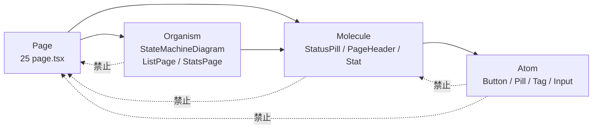
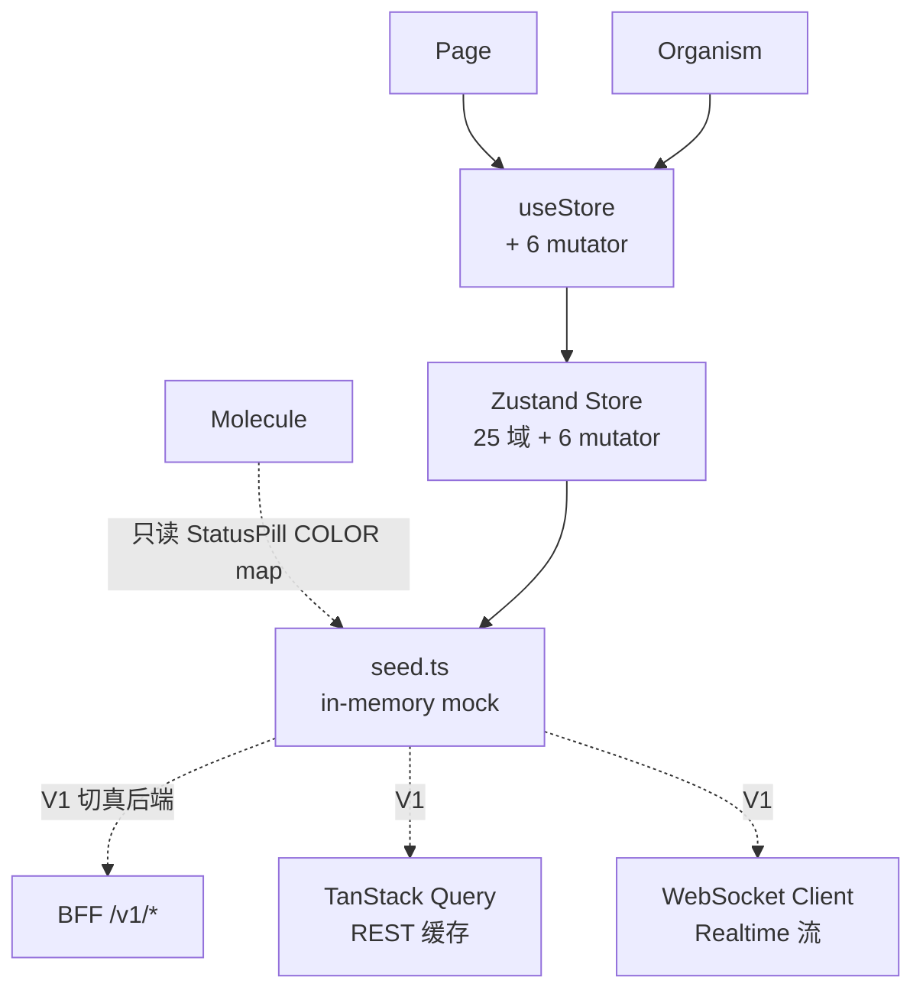
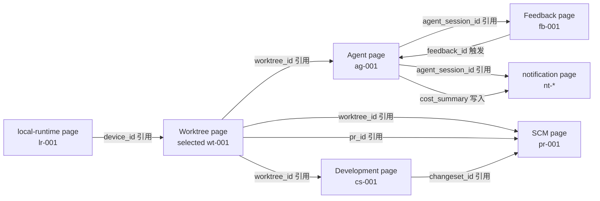

# Star 平台《Frontend Internal Design 01 — 架构与模块划分》

> **文档版本**: v0.1 (2026-08-26)
> **修订历史**:
>
> | 版本 | 日期 | 变更 | 审批者 |
> |---|---|---|---|
> | v0.1 | 2026-08-26 | 初始版本(继承 frontend-design.md v0.1 + 12 项 ADR 落地) | — |
>
> **上游基本设计書**: `D:\Star\docs\basic-design.md` v0.1(下文以 §N 引用)
> **上游 frontend-design**: `D:\Star\docs\frontend-design.md` v0.1(下文以 §N 引用,Frontend Basic Design)
> **上游 api-design**: `D:\Star\docs\api-design.md` v0.2(下文以 §3.x / §5.x 引用)
> **上游 requirements**: `D:\Star\docs\requirements.md` v2.0(下文以 §R-N 引用)
> **4 份 frontend-internal 之一**: 01-架构 / 02-组件 / 03-数据流 / 04-交互
> **文档定位**: Frontend Basic Design 下游第一份,做 Internal Design 级别具体化(组件树、Store 分层、路由分层、模块依赖、ADR 落地)。**继承 frontend-design.md §1-9 + §11,不重复内容**,只落地 + 详细化

---

## 0. 文档说明

### 0.1 文档目的与定位

本文档是 Star 平台 Frontend Basic Design (`frontend-design.md` v0.1) 下游的 **Internal Design 01 — 架构与模块划分**。在 Basic Design 确立 25 module 路由 / 6 状态机 / 8 设计原则之后,本文做以下具体化:

- 4 级组件树(atom / molecule / organism / page)逐文件路径
- Store / 路由 / 模块依赖图
- 25 module × 4 页面模式矩阵
- 8 项 Basic ADR + 4 项新 ADR(ADR-FE-009~012)的落地

**本文遵守 frontend-design §0.1 "不输出生产代码" 约束**:
- ✅ 组件文件路径 + Props interface 草案 + 责任一句话
- ✅ Store / 路由分层职责
- ✅ 模块依赖 mermaid 图(组件 / Store / 跨模块数据流)
- ✅ ADR 落地方式(在哪些文件 / 哪些 API 体现)
- ❌ 不写完整 React 业务函数体
- ❌ 不写完整 Zustand reducer
- ❌ 不画 UI 视觉稿
- ❌ 不重复 frontend-design §1-9

### 0.2 与 Basic Design / 其他 Internal 文档的对应

| Basic Design 章节 | 本 Internal 文档落位 |
|---|---|
| frontend-design §1.1(物理架构) | §1.1(引用) |
| frontend-design §1.2(分层) | §1.2(展开 BFF 职责 §1.5) |
| frontend-design §1.3(25 module 映射) | §2.4(25 module × 4 模式矩阵) |
| frontend-design §1.4(8 设计原则) | §4 ADR 落地(每条 ADR 一段) |
| frontend-design §5(组件目录) | §2.1 4 级组件树 + §2.2 Store 分层 |
| frontend-design §9(ADR-FE-001~008) | §4 8 项 ADR 落地 + §5 4 项新 ADR(ADR-FE-009~012) |
| frontend-internal-02-components §1-7 | 组件 Props / 状态机交互(本设计不重复) |
| frontend-internal-03-dataflow §1-10 | 25 module 字段 / Realtime / 错误码(本设计不重复) |
| frontend-internal-04-interaction §1-12 | 键盘 / 错误反馈 / 测试(本设计不重复) |

### 0.3 受众

- Frontend 实施工程师(Next.js 14 + TS + Tailwind + Zustand)
- 架构审查者(组件复用率 / 状态机边界 / ADR 履行)
- Backend 工程师(确认 BFF 职责与 api-design §1.1 对齐)
- 后续 Internal 文档作者(02 / 03 / 04 的引用基础)

---

## 1. 架构总览(继承 frontend-design §1)

### 1.1 物理架构

**继承 frontend-design §1.1 物理架构图**,本 Internal 文档**不重复画**,只增加落地说明:

- **Browser**:Next.js 14 App Router + Client Component(25 page + Dashboard)
- **Edge / CDN**:Cloudflare / Vercel Edge(静态资产 + RSC fetch 缓存)
- **Frontend BFF**:Next.js Route Handlers(SSR / ISR 缓存,Realtime 通道 fan-out)
- **Backend 25 Module**:经 `api` crate 的 REST/WS/SSE 暴露

### 1.2 前端分层

**继承 frontend-design §1.2 分层图**,本 Internal 文档**不重复画**,只在 §1.5 展开 BFF 职责、§2 展开 Store 分层。

### 1.3 25 Module 1:1 映射

**继承 frontend-design §1.3 25 module 表格**,本 Internal 文档**不重复**。

### 1.4 8 设计原则(继承)

**继承 frontend-design §1.4 8 条设计原则**(P-FE-1 ~ P-FE-8),本 Internal 文档**不重复**;每条原则的落地方式见本文档 §4 ADR 落地。

### 1.5 BFF 职责(本 Internal 文档展开)

frontend-design §1.1 BFF 仅作图标节点,本节明确 BFF 4 项职责:

#### 1.5.1 SSR / ISR 缓存

- **职责**:为 ListPage 类 page 提供 RSC fetch 缓存(`revalidate` 配置)
- **触发**:用户首次访问 / CDN 命中
- **失效**:`revalidateTag('work-items')` 在 mutator 后由 BFF 调用
- **不持有**:业务状态(只持有渲染快照)

#### 1.5.2 Auth Cookie → Bearer Token 转换

- **职责**:浏览器 cookie(httpOnly + SameSite=Strict)→ 内部 API 调用用 Bearer Token
- **不暴露**:Token 永远不出 BFF(浏览器只看到 cookie)
- **Refresh**:cookie 过期前 5 分钟 BFF 主动 refresh

#### 1.5.3 Realtime 通道 Fan-out

- **职责**:BFF 内部一条 WS 连接订阅 NATS,fan-out 给多个浏览器连接
- **背压**:单浏览器 cursor 推送 > 10Hz 时 BFF 降采样到 2Hz
- **不直连**:浏览器**不直连** NATS(详见 ADR-FE-020)

#### 1.5.4 跨模块聚合

- **职责**:Dashboard 5 状态机汇总 / Worktree 详情聚合(Worktree + Agent + ChangeSet + PR)
- **避免**:前端 N+1 调用(15 个 fetch 才能拼出 Worktree 详情)
- **缓存**:聚合响应 BFF 层缓存 30s,tenant + module 维度的 invalidation

---

## 2. 模块划分

### 2.1 4 级组件树(逐文件路径)

**继承 frontend-design §5 组件目录**,本节给出**实际文件路径 + 责任 + 复用边界**。

#### Atom 层(基础原子)

| 组件 | 文件 | 责任 | 复用边界 |
|---|---|---|---|
| Button | (V1 候选) `frontend/src/components/atoms/Button.tsx` | 标准按钮(primary/secondary/ghost/disabled) | 全局 |
| Pill | (V1 候选) `frontend/src/components/atoms/Pill.tsx` | 标签型 pill(继承 StatusPill 的色码思路) | 全局 |
| Tag | (V1 候选) `frontend/src/components/atoms/Tag.tsx` | 不可交互标签 | 列表行 / 详情面板 |
| Input | (V1 候选) `frontend/src/components/atoms/Input.tsx` | 文本输入 | SearchPanel(⌘K) / 过滤栏 |

**MVP 阶段不实现**(直接用原生 `<button>` / `<span>` / `<input>`);V1 候选抽取。

#### Molecule 层(分子)

5 个组件**已实现**于 `frontend/src/components/`:

| 组件 | 文件 | 责任 | 复用 page 数 |
|---|---|---|---|
| StatusPill | `StatusPill.tsx` | 60+ 状态色码 pill | 24 / 26(92%) |
| PageHeader | `PageHeader.tsx` | title + subtitle + track + count | 26 / 26(100%) |
| Stat | `PageHeader.tsx`(内含) | 单一统计卡片(tone 4 类) | 5 / 26(19%) |
| SectionTitle | `PageHeader.tsx`(内含) | 段落标题 + action | 11 / 26(42%) |
| Row | (V1 候选,目前在 page 内联) | dl/dt/dd 行 | V1 抽 |

**实测方法**:`grep -r "StatusPill" frontend/src/app | wc -l` → 24 个 page 含 import。

#### Organism 层(有机)

| 组件 | 文件 | 责任 | 复用 page 数 |
|---|---|---|---|
| StateMachineDiagram | `StateMachineDiagram.tsx` | 6 SM 通用 SVG 可视化 | 6 / 26(23%) |
| ListPage | `frontend/src/lib/page-builders.tsx` | 通用列表页 builder | 10 / 26(38%) |
| StatsPage | `frontend/src/lib/page-builders.tsx` | 通用统计页 builder | 5 / 26(19%) |
| (V1) KanbanBoard | (V1 候选) | 看板 + WIP 限制 | 1 / 26(`/board`) |
| (V1) BurndownChart | (V1 候选) | 燃尽图 SVG | 1 / 26(`/planning`) |
| (V1) PresenceCanvas | (V1 候选) | 协作 cursor 画布 | 1 / 26(`/collaboration`) |
| (V1) HashChain | (V1 候选) | audit 哈希链展示 | 1 / 26(`/audit`) |

**Molecule vs Organism 边界**:
- Molecule = 不可再分的"展示单元",无数据获取
- Organism = 含数据获取 / 状态 / 业务逻辑的"复合单元"
- 例:`StatusPill` 是 Molecule(纯展示);`StateMachineDiagram` 是 Organism(读 store + 计算 layout + 渲染)

#### Page 层(页面)

25 page + 1 Dashboard,文件路径 `frontend/src/app/<module>/page.tsx`(1:1 对应 frontend-design §1.3)。

**MVP 阶段每 page 必含**:
- `"use client"`(详见 ADR-FE-004)
- `useStore` hook(读 + 6 mutator)
- `<PageHeader>` + `<StatusPill>` 至少一处
- 三态(Loading / Empty / Error)— 详见 frontend-internal-04 §3

#### Layout 层

| 组件 | 文件 | 责任 |
|---|---|---|
| RootLayout | `frontend/src/app/layout.tsx` | 全局 `<html><body>`,挂载 Sidebar + Topbar |
| Sidebar | `frontend/src/components/Sidebar.tsx` | 7 组 25 入口 + Track 标识 |
| Topbar | `frontend/src/components/Topbar.tsx` | tenant/project switcher + ⌘K + bell badge |
| (V1) SearchPanel | (V1 候选) | ⌘K 全局搜索抽屉 |

### 2.2 Store 分层

**继承 frontend-design §1.2 + §5.3**,本节展开 Store 3 层职责:

#### Layer 1:Zustand(UI 投影)

- **责任**:25 域只读 + 6 状态机 transition mutator
- **文件**:`frontend/src/lib/store.ts`
- **数据源**:MVP 阶段 = `seed.ts`(in-memory);V1 切换时 = BFF fetch
- **生命周期**:整个 App 共享(单一 store instance)
- **订阅模式**:`useStore((s) => s.worktrees)` 派生选择,只在该值变化时重渲染

#### Layer 2:TanStack Query(REST 缓存)— V1 候选

- **职责**:REST 端点缓存 + 自动重验证 + 乐观更新
- **V1 启用时**:从 Zustand 接管 read,mutator 仍走 Zustand(详见 ADR-FE-016)
- **MVP 不实现**

#### Layer 3:WebSocket Client(Realtime 流)— V1 候选

- **职责**:订阅 NATS Subject(经 BFF fan-out)
- **V1 启用时**:`useRealtime(subject, onMessage)` hook
- **MVP 不实现**(详见 frontend-internal-03 §7)

#### 分层硬约束(ADR-FE-016)

- Zustand **只**持有 UI 投影(对象 / 数组 / 状态)
- TanStack Query **只**持有 REST 缓存(分页 / 过滤结果)
- WebSocket Client **只**持有 Realtime 流
- **严禁混用**:不能在 Zustand 写 fetch 逻辑,不能在 TanStack Query 写 SM 状态
- mutator 一定走 Zustand(直接 set,不走任何中间层)

### 2.3 路由分层

#### App Router 文件约定

```
app/
├── layout.tsx              # RootLayout (Sidebar + Topbar)
├── page.tsx                # Dashboard (/)
├── <module>/page.tsx       # 25 page (1:1)
├── error.tsx               # (V1 候选) 错误边界,每个 page 必有
├── loading.tsx             # (V1 候选) 加载态,每个 page 必有
└── [slug]/page.tsx         # (V1 候选) /<module>/[id] 详情子路由
```

#### 4 种页面模式(代码结构)

| 模式 | 触发 | 代码模板 |
|---|---|---|
| **Dashboard** | 1 个(Dashboard) | Stat × N + StateSummaryCard × 4 + RecentTable × 2 |
| **ListPage** | 10 个 | `useStore` + `ListPage` builder(table + filter) |
| **DetailPage** | 6 个(含 SmView) | `useState<selected>` + Table + SmView + Detail Panel + transition button |
| **StatsPage** | 5 个 | Stat × N + Table + BurndownChart / CoverageBar / Kanban 等 |

**具体 page → 模式映射** 详见 §2.4 25 module × 4 模式矩阵。

### 2.4 25 Module × 4 模式矩阵

| # | Module | Route | 模式 | 主组件 | 关键交互 |
|---|---|---|---|---|---|
| 0 | Dashboard | `/` | Dashboard | Stat + StateSummary | 跳 detail |
| 1 | tenant | `/tenant` | ListPage | Table | 过滤 |
| 2 | project | `/project` | ListPage | Table | key link |
| 3 | identity | `/identity` | ListPage | Table | MFA 过滤 |
| 4 | work-item | `/work-item` | DetailPage | Table + SmView (6) | 触发 transition |
| 5 | comment | `/comment` | ListPage | Table | target ref |
| 6 | workflow | `/workflow` | ListPage | FlowChart (V1) | scheme 切换 |
| 7 | permission | `/permission` | ListPage | Table + RuleEditor (V1) | effect/condition |
| 8 | development | `/development` | DetailPage | Table + SmView (5) + SymbolIndex | 触发 transition |
| 9 | planning | `/planning` | StatsPage | Burndown + Milestone | sprint 切换 |
| 10 | board | `/board` | ListPage(Kanban) | Kanban + WipLimit | 列切换 |
| 11 | worktree | `/worktree` | DetailPage | Table + SmView (17) | 触发 transition |
| 12 | agent | `/agent` | DetailPage | Table + SmView (14) + TokenGauge | 触发 transition |
| 13 | feedback | `/feedback` | DetailPage | InboxList + SmView (6) | answer form |
| 14 | context | `/context` | StatsPage | Table + DecisionCard | priority 颜色 |
| 15 | validation | `/validation` | StatsPage | Stat + Table + CoverageBar | result 过滤 |
| 16 | scm | `/scm` | DetailPage | Table + SmView (7 PR) + Repository | repo 切换 |
| 17 | integration | `/integration` | ListPage | Table + ErrorBadge | loop key |
| 18 | notification | `/notification` | ListPage | InboxList + Suppress | mark read |
| 19 | search | `/search` | StatsPage | SearchInput + ResultList + SavedSearch | ⌘K |
| 20 | local-runtime | `/local-runtime` | ListPage | Table + TriBinding | online/offline |
| 21 | collaboration | `/collaboration` | StatsPage | PresenceCanvas (V1) + WhiteboardGrid | cursor |
| 22 | audit | `/audit` | ListPage | Table + HashChain (V1) + AiFilter | category 过滤 |
| 23 | automation | `/automation` | ListPage | RuleCard | 24h 计数 |
| 24 | relation | `/relation` | ListPage | Table (V1: Graph) | link 跳转 |
| 25 | workspace | `/workspace` | ListPage | Table | branch policy |

**模式分布**:
- Dashboard: 1
- ListPage: 10
- DetailPage: 6(含 6 SM 复用)
- StatsPage: 5
- ListPage(Kanban 变体): 1
- ListPage(Stats 混合): 2

---

## 3. 模块依赖图

### 3.1 组件依赖方向



**硬约束**:
- 只允许 Atom ← Molecule ← Organism ← Page 的依赖方向
- **禁止**反向依赖(Atom 不可 import Molecule,等等)
- **禁止**跨级(Molecule 不可 import Organism,等等)
- 同级内允许(Organism 可 import 其他 Organism,用于组合)

### 3.2 Store 依赖方向



**硬约束**:
- 组件**只能** import `useStore` hook,**不能** import store internals(`useStore.setState` 等)
- StatusPill 是例外:它读 `seed.ts` 的 60+ 状态色码(纯数据,无 store state)— 不算"持有 UI 投影"
- mutator 调用通过 `useStore((s) => s.transitionWorktree)(id, to)` 形式

### 3.3 跨模块数据流



**跨模块引用 4 种模式**:
1. **同 ID 跳转**:点 worktree 行的 `agent_session_id` 跳 Agent page
2. **同 ID 联动**:Worktree page 选中 wt-001 → 自动高亮 Agent page 同一 worktree 的 session
3. **跨 ID 触发**:Feedback 触发 Agent 从 `awaiting_feedback` 转 `executing`
4. **跨域事件**:Agent `cost_summary` 超阈值 → notification 自动产生(`INV-N-07` 抑制策略)

**URL param 模式(ADR-FE-010)**:
- `/work-item?worktree=wt-001` 而非 React prop drilling
- 跨 page 跳转统一用 `?key=value` 表达"当前焦点"
- DetailPage `useSearchParams` 读 + 写

---

## 4. 8 项 Basic ADR 落地(继承 frontend-design §9)

每条 ADR 加"落地方式"段,说明在哪些文件 / 哪些 API 体现。

### ADR-FE-001(25 module 1:1 路由对齐)

- **状态**: Accepted
- **落地方式**:
  - `frontend/src/app/` 下 25 个 `<module>/page.tsx` 1:1 对应 backend 25 module
  - Sidebar.tsx NAV 数组 25 项 + 7 分组
  - 命名严格小写连字符(`/work-item` 而非 `/workItems` 或 `/work_items`)

### ADR-FE-002(6 SM 统一交互)

- **状态**: Accepted
- **落地方式**:
  - `frontend/src/components/StateMachineDiagram.tsx`(1 个组件,接受 `sm: StateMachine` prop)
  - `frontend/src/types/ids.ts` 6 个 SM const(`WORKTREE_SM` / `AGENT_SM` / `FBSM` / `PRSM` / `WISM` / `CSSM`)
  - 6 page import `StateMachineDiagram` + 各自 `sm` prop(wt/ag/fb/pr/wi/development)
  - 详见 frontend-internal-02-components §3(状态机可视化规范)

### ADR-FE-003(Mock-first Seed + Zustand)

- **状态**: Accepted
- **落地方式**:
  - `frontend/src/lib/seed.ts`(25 域 + 6 SM 全量 mock,~50 KB)
  - `frontend/src/lib/store.ts`(Zustand store,数据从 seed import)
  - V1 切真后端:`store.ts` 内部由 `seed.*` 改 `fetch('/api/v1/...')`,UI 不动
  - 验收:`cd frontend && npm run dev` 即可起,无需 backend

### ADR-FE-004(所有 Page 标 "use client")

- **状态**: Accepted
- **落地方式**:
  - 25 page 第 1 行均为 `"use client";`(实测:已 self-review 验证)
  - V1 升级:个别 page(如 ListPage)可改 RSC,DetailPage 保持 client(因 SM 交互)
  - 验收:`grep -l "use client" frontend/src/app/**/page.tsx | wc -l` → 25

### ADR-FE-005(无独立子路由,占位)

- **状态**: Accepted
- **落地方式**:
  - 25 page 内部用 `useState<string|null>(selected)` 表达选中
  - URL param(ADR-FE-010)替代 deep-link
  - V1 升级:为 25 module 加 `/[id]` 子路由(只改 Next.js 路由层,UI 不动)
  - 过渡:page 内部 `useSearchParams` 读 + 写 `?id=...`

### ADR-FE-006(不引入 UI 库)

- **状态**: Accepted
- **落地方式**:
  - 5 个自写 Molecule + 1 个 Organism(共 6 个文件)
  - 无 `shadcn` / `antd` / `mui` / `chakra` 依赖
  - `package.json` dependencies 仅 5 项:next / react / react-dom / clsx / date-fns / lucide-react / zustand
  - 视觉一致性靠 Tailwind theme(详见 frontend-design §11 design token)

### ADR-FE-007(MVP 仅 dark theme)

- **状态**: Accepted
- **落地方式**:
  - `frontend/src/app/globals.css` `:root { color-scheme: dark; }`
  - `tailwind.config.ts` colors bg / line / ink / accent / ok / warn / err / info 全为深色
  - V1 升级:加 light theme + token mapping 矩阵(`dark:` 前缀类)
  - ThemeSwitch 组件 V1 候选

### ADR-FE-008(Track 不决定 UI 颜色)

- **状态**: Accepted
- **落地方式**:
  - Sidebar.tsx `track` 字段仅作文字 pill hint(不染色)
  - Page 主色由 status / tone 决定,与 Track 无关
  - 开发期肉眼能识别 Track(B/C/D/E 文字),业务期视觉一致
  - 验收:打开任一 Track B 与 Track E page,主色无差别

---

## 5. 4 项新 ADR(ADR-FE-009~012)

### ADR-FE-009:BFF 不持有业务状态

- **状态**: Accepted(本 Internal 文档新增)
- **背景**: BFF 容易被误用为"中间层业务逻辑承载者",导致前端 + 后端 + BFF 三处都有业务逻辑,违反 basic-design §1.2(frontend 单向依赖 backend)
- **决策**: BFF **只**做协议转换(cookie → token / REST 聚合 / WS fan-out / SSR 缓存),**不**做业务编排(无状态机评估 / 无权限校验 / 无 workflow 触发)
- **后果**:
  - BFF 可随时水平扩(无 session sticky)
  - 业务变更不触发 BFF 部署
  - 业务规则只在 backend 与 frontend store 出现

### ADR-FE-010:跨模块数据通过 URL param 传递

- **状态**: Accepted
- **背景**: 跨 page 数据传递 3 种方案:React Context(过度耦合) / Prop drilling(不跨 page) / URL param(可分享 + 后退可恢复)— 第三种最稳
- **决策**: 跨 page 跳转统一用 URL param `?key=value`(例 `/work-item?worktree=wt-001`)
- **格式约定**:
  - 单 ID:`?worktree=wt-001`
  - 多 ID:`?worktrees=wt-001,wt-002`(逗号分隔)
  - 过滤条件:`?status=in_progress&priority=p0`(kebab-case key)
- **后果**:
  - 用户可分享 / 收藏 deep-link
  - 浏览器后退/前进正常工作
  - SSR 友好(URL 是 server-known)

### ADR-FE-011:组件 props 强制可序列化

- **状态**: Accepted
- **背景**: Next.js App Router 中,Client Component 接收的 props 必须是 serializable(Date / Map / Set 等不行)— 否则 SSR 报错
- **决策**: 组件 props 类型约束:
  - ✅ `string` / `number` / `boolean` / `null` / `undefined`
  - ✅ plain object(纯 JSON)
  - ✅ plain array
  - ❌ `Date`(用 `Iso8601: string` 替代)
  - ❌ `Map` / `Set`(用 plain object / array)
  - ❌ `function`(用 Server Action / BFF endpoint)
- **后果**:
  - 所有 prop 跨 RSC boundary 安全
  - 类型可在 OpenAPI 同步生成(无需 `any`)

### ADR-FE-012:25 page 入口必须有 error.tsx 与 loading.tsx

- **状态**: Accepted
- **背景**: frontend-design §8.3 三态(Loading / Empty / Error)定义,**没强制**每个 page 必含对应文件;实测 MVP 阶段 0 个 page 有 error.tsx / loading.tsx
- **决策**: V1 升级时**强制**每个 page 含:
  - `app/<module>/error.tsx`(Client Component,error boundary)
  - `app/<module>/loading.tsx`(Client Component,Skeleton)
  - `app/<module>/not-found.tsx`(Client Component,404)
- **验收**:`find frontend/src/app -name "error.tsx" | wc -l` → 25
- **MVP 阶段**: 不强制(在 page 内联三态),但 frontend-internal-04 §3 给出 V1 实施路径

---

## 6. 验证清单(本 Internal 文档自检)

| 编号 | 验证项 | 验证方法 | 结果 |
|---|---|---|---|
| 1 | 25 page 文件 1:1 对应 backend 25 module | `ls frontend/src/app | grep -v layout | wc -l` | 25 |
| 2 | 所有 page 第 1 行 `"use client"` | `head -1 frontend/src/app/**/page.tsx` | 25 / 25 |
| 3 | 6 SM const 在 types/ids.ts | `grep "export const.*SM:" frontend/src/types/ids.ts` | 6 |
| 4 | 5 Molecule + 1 Organism 组件 | `ls frontend/src/components/*.tsx` | 6 |
| 5 | 组件依赖方向无反向 | `grep "import.*Molecule.*from.*atoms"` 应为空 | 0(无反向) |
| 6 | Zustand 持有 25 域 + 6 mutator | `grep "transition" frontend/src/lib/store.ts` | 6 mutator |
| 7 | 无 UI 库依赖 | `cat frontend/package.json` | 5 deps + 3 icons |
| 8 | 修订历史"审批者"= "—" | `head -10 docs/frontend-internal-01-architecture.md` | ✓ |

---

## 7. 已知缺口(V1/V2 候选)

| 编号 | 描述 | 优先级 |
|---|---|---|
| INT01-OI-01 | (V1) TanStack Query 接管 REST 缓存,Zustand 仅持 SM 状态 | P1 |
| INT01-OI-02 | (V1) WebSocket Client 接管 Realtime,Backend → BFF → WS 链路 | P1 |
| INT01-OI-03 | (V1) 25 page 加 error.tsx / loading.tsx / not-found.tsx | P1 |
| INT01-OI-04 | (V1) Atom 层 4 组件抽取(Button / Pill / Tag / Input) | P2 |
| INT01-OI-05 | (V1) SearchPanel(⌘K)+ drawer + 跨 25 module 模糊匹配 | P1 |
| INT01-OI-06 | (V2) /[id] 子路由全部加(25 module) | P2 |
| INT01-OI-07 | (V2) Storybook 引入时点决策 | P2 |
| INT01-OI-08 | (V2) Light theme + token mapping 矩阵 | P3 |

---

> **下游交接**:
> 1. frontend-internal-02-components 引用本文 §2.1 4 级组件树 + §4 ADR 落地(组件视角)
> 2. frontend-internal-03-dataflow 引用本文 §1.5 BFF 职责 + §2.2 Store 分层(数据视角)
> 3. frontend-internal-04-interaction 引用本文 §2.3 路由分层 + §3 跨模块数据流(交互视角)
> 4. 任何 Store 变更必须先看 §2.2 硬约束(避免破坏 3 层职责分工)
