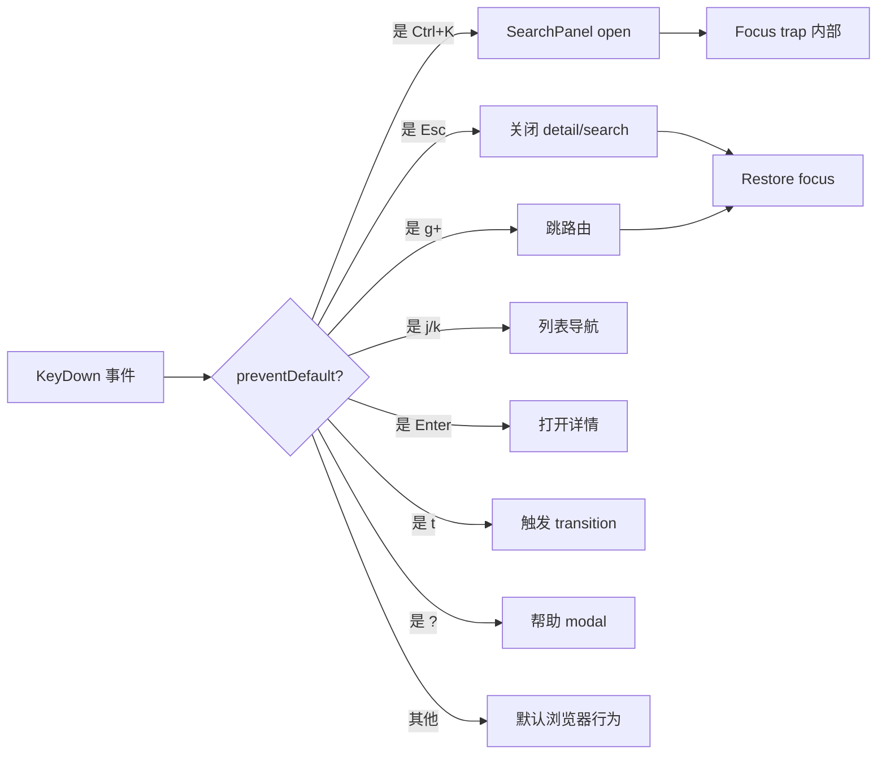
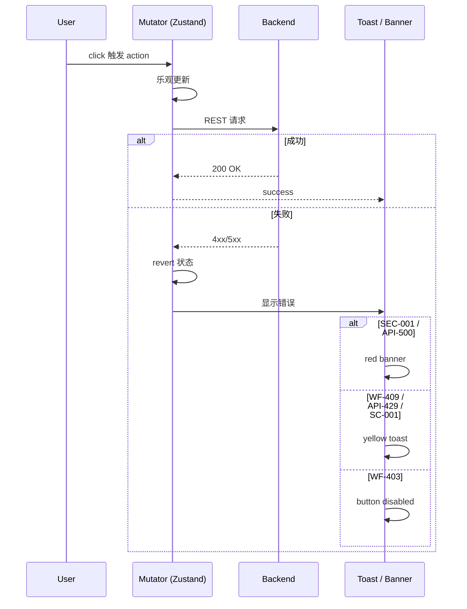

# Star 平台《Frontend Internal Design 04 — 交互规范与测试验收》

> **文档版本**: v0.1 (2026-08-26)
> **修订历史**:
>
> | 版本 | 日期 | 变更 | 审批者 |
> |---|---|---|---|
> | v0.1 | 2026-08-26 | 初始版本(键盘 / 错误反馈 / 三态 / a11y / 测试 / 5 新 ADR) | — |
>
> **上游 frontend-design**: `D:\Star\docs\frontend-design.md` v0.1 §2.4 / §8 / §10 / §11 / 附录
> **上游 frontend-internal-01**: `D:\Star\docs\frontend-internal-01-architecture.md`(架构)
> **上游 frontend-internal-02**: `D:\Star\docs\frontend-internal-02-components.md`(组件)
> **上游 frontend-internal-03**: `D:\Star\docs\frontend-internal-03-dataflow.md`(数据流)
> **上游 requirements**: `D:\Star\docs\requirements.md` v2.0 §30 / §41.2
> **4 份 frontend-internal 之四**: 01-架构 / 02-组件 / 03-数据流 / 04-交互

---

## 0. 文档说明

### 0.1 目的

继承 frontend-design §2.4(键盘)+ §8(交互规范)+ §10(已知缺口)+ §11(V1/V2/Future),做 Internal Design 级别的:
- 11 行快捷键表(9 个独立动作:⌘K、g d、g w、g a、j/k、Enter、Esc、t、?)+ 焦点管理 + 事件流
- 6 类错误反馈 UI 表现
- 三态(Loading / Empty / Error)规范
- a11y / 性能 / i18n
- 测试验收(Unit / Integration / E2E / Visual / Performance)
- 已知缺口 15 项(10 继承 + 5 新增 FE-OI-11~15)
- 跨文档索引(4 张表)
- 5 项新 ADR(ADR-FE-021~025)

### 0.2 引用关系

| 引用本文 | 位置 |
|---|---|
| frontend-internal-02-components §3 | StateMachineDiagram 交互 |
| frontend-internal-03-dataflow §8 | 错误码 → UI 反馈(本文 §2 引用) |
| frontend-internal-03-dataflow §7 | Realtime 通道 |

---

## 1. 键盘交互(继承 frontend-design §2.4)

### 1.1 全局快捷键表

| 快捷键 | 行为 | MVP | 实现位置 | 说明 |
|---|---|---|---|---|
| `⌘K` / `Ctrl+K` | 打开全局 SearchPanel | **V0.1** | `Topbar.tsx` onKeyDown | 占位已在 Topbar 第 7 行 |
| `g d` | 跳 Dashboard | V1 候选 | `Sidebar.tsx` useEffect | 顺序按 |
| `g w` | 跳 Worktree | V1 候选 | 同上 |  |
| `g a` | 跳 Agent | V1 候选 | 同上 |  |
| `j` / `k` | 列表上下 | V1 候选 | DetailPage onKeyDown | vim 风格 |
| `Enter` | 打开选中实例 | V1 候选 | 同上 |  |
| `Esc` | 关闭 detail / search | **V0.1** | DetailPage onKeyDown | MVP 实现 |
| `t` | 触发下一个 transition | V1 候选 | DetailPage onKeyDown | 详情面板 |
| `?` | 帮助(快捷键 cheat sheet) | V1 候选 | `layout.tsx` onKeyDown | modal |

**MVP 已实现**: ⌘K(占位)+ Esc(关闭 detail panel)

### 1.2 焦点管理

```ts
// 焦点管理 3 规则
// 1. 打开 modal / drawer → trap focus 在内部
// 2. 关闭 → restore focus 到打开它的元素
// 3. Tab 顺序: 逻辑顺序(从上到下 / 从左到右)
```

**V1 候选**:
- `useFocusTrap` hook
- `useFocusRestore` hook
- 实现在 `hooks/a11y/`

### 1.3 键盘事件流(mermaid)



### 1.4 与浏览器默认快捷键冲突规避

| 快捷键 | 浏览器默认 | 规避策略 |
|---|---|---|
| `Ctrl+K` | Firefox: 搜索栏 | `e.preventDefault()` |
| `Ctrl+S` | 保存页面 | 不绑定(避免影响用户保存习惯) |
| `Ctrl+R` | 刷新 | 不绑定 |
| `Ctrl+T` | 新标签页 | 不绑定 |
| `g` | 无 | 1.5s 内按第二个键才触发(避免单按 g) |
| `t` | 无 | 仅在 detail panel focus 时响应 |

---

## 2. 错误反馈(继承 frontend-internal-03 §8 + frontend-design §8.2)

### 2.1 6 类错误码 UI 表现

| 错误码 | 含义 | UI 表现 | 触发 | 持续时间 |
|---|---|---|---|---|
| **SEC-001** | 跨 tenant 访问 | 顶部 red banner(固定 3s)+ 点击跳 Dashboard | 任何带 tenant_id 的请求 | 3000ms |
| **WF-403** | effect=deny | button disabled + tooltip "无权限:<rule summary>" | 权限检查失败 | 持续 |
| **WF-409** | InvalidTransition | toast yellow + revert SM 状态 | 状态机 transition 失败 | 5000ms |
| **API-429** | rate limit | toast yellow + Retry-After 倒计时 | 频率超限 | Retry-After ms |
| **API-500** | internal | red banner + "上报 Sentry" 按钮(V1) | 服务端错误 | 持续 / dismissible |
| **SC-001** | lock_version 不一致 | toast yellow + 重新 fetch + 高亮 stale 字段 | 乐观锁冲突 | 5000ms |

### 2.2 toast 组件 Props(继承 frontend-internal-03 §8.2)

```ts
interface ToastProps {
  /** 错误码(决定色码) */
  code: "SEC-001" | "WF-403" | "WF-409" | "API-429" | "API-500" | "SC-001" | "default";
  /** 标题(1 句) */
  title: string;
  /** 详细消息 */
  message?: string;
  /** 自动消失 ms(0 = 不消失) */
  duration?: number;
  /** 行动按钮(可选) */
  action?: { label: string; onClick: () => void };
}
```

### 2.3 banner 组件 Props(继承 frontend-internal-03 §8.3)

```ts
interface BannerProps {
  /** 严重度 */
  severity: "err" | "warn" | "info";
  /** 标题 */
  title: string;
  /** 详细消息 */
  message?: string;
  /** 行动按钮(可选) */
  action?: { label: string; onClick: () => void };
  /** 可关闭 */
  dismissible?: boolean;
}
```

### 2.4 错误状态时序图(mermaid)



---

## 3. 三态规范(继承 frontend-design §8.3)

### 3.1 Loading:Skeleton

```tsx
// MVP 阶段内联, V1 抽取 <SkeletonTable />
{loading ? (
  <div className="space-y-2">
    {[...Array(6)].map((_, i) => (
      <div key={i} className="h-8 bg-bg-soft rounded animate-pulse" />
    ))}
  </div>
) : (
  <table>...</table>
)}
```

### 3.2 Empty:提示 + 创建按钮

```tsx
{filtered.length === 0 ? (
  <div className="text-center py-12">
    <p className="text-ink-mute text-sm">暂无 {kindName}</p>
    <p className="text-ink-mute text-xs mt-1">{emptyHint}</p>
    {/* V1 候选: <button>创建</button> */}
  </div>
) : (
  <table>...</table>
)}
```

### 3.3 Error:Alert + 重试

```tsx
{error ? (
  <div className="card border-err/40 bg-err/5 p-4">
    <p className="text-err text-sm">加载失败:{error.message}</p>
    <button onClick={refetch} className="btn mt-2">重试</button>
  </div>
) : (
  ...
)}
```

### 3.4 三态切换条件

| 状态 | 触发 |
|---|---|
| Loading | `useEffect` 开始 / `useState(loading=true)` |
| Empty | `data.length === 0` 且 `loading=false` 且 `error=null` |
| Error | `useState(error) !== null` |
| Success | 都不命中 |

**互斥规则**:
- 4 态**互斥**:同时只显示 1 个
- Error 优先于 Empty:即使空也先报告错误
- Empty 优先于 Loading 后的初始:不显示 loading skeleton,直接显示 empty

---

## 4. 反馈即时性(继承 frontend-design §8.4)

### 4.1 50ms 乐观更新

```ts
const onClick = () => {
  // 1. 乐观更新(立即)
  useStore.setState(s => ({
    items: s.items.map(i => i.id === id ? { ...i, status: newStatus } : i)
  }));
  // 2. 触发 mutator(异步,50ms 内完成)
  transitionItem(id, newStatus);
};
```

### 4.2 200ms spinner

```ts
// 200ms 阈值:超过才显示 spinner,避免闪烁
const [spinner, setSpinner] = useState(false);
useEffect(() => {
  const t = setTimeout(() => setSpinner(true), 200);
  return () => clearTimeout(t);
}, [loading]);
{spinner && <Spinner />}
```

### 4.3 失败 revert 流程

```ts
try {
  await transitionItem(id, newStatus);
} catch (e) {
  if (e.code === "WF-409") {
    // revert
    useStore.setState(s => ({
      items: s.items.map(i => i.id === id ? { ...i, status: e.currentStatus } : i)
    }));
    // toast
    toast({ code: "WF-409", title: "转换失败", message: e.message });
  } else {
    throw e;  // 其他错误向上抛
  }
}
```

### 4.4 useOptimistic / useTransition(V1 候选,React 19)

- V1 升级:用 React 19 `useOptimistic` hook 替代手写乐观更新
- 用 `useTransition` 标记非紧急更新,避免阻塞 UI

---

## 5. 可访问性(a11y,V1 候选强制)

### 5.1 颜色对比度(从 design token 推导)

| 文本色 | 背景 | 对比度 | WCAG |
|---|---|---|---|
| `ink` (#e6edf3) | `bg` (#0b0d10) | 15.8:1 | AAA |
| `ink-dim` (#8b949e) | `bg` (#0b0d10) | 7.4:1 | AA |
| `accent` (#2f81f7) | `bg` (#0b0d10) | 5.6:1 | AA |
| `ok` (#3fb950) | `bg` (#0b0d10) | 6.5:1 | AA |
| `warn` (#d29922) | `bg` (#0b0d10) | 8.0:1 | AA |
| `err` (#f85149) | `bg` (#0b0d10) | 5.4:1 | AA |

**全部达标 WCAG AA**(部分 AAA)。

### 5.2 键盘可访问性

| 元素 | a11y 属性 |
|---|---|
| 按钮 | `aria-label` 当无文字时 |
| 状态 pill | `aria-label="状态: in_progress"` |
| 状态机图 | `role="img"` + `aria-label="Worktree 17 状态机"` |
| 表格 | `<th scope="col">` |
| 搜索框 | `<label for>` 或 `aria-label` |
| 错误 toast | `role="alert"` `aria-live="assertive"` |

### 5.3 ARIA label 清单(每个组件 1 行)

| 组件 | aria-label |
|---|---|
| StatusPill | `状态: {value}` |
| PageHeader title | 主标题(无显式 label,`<h1>` 默认) |
| Stat | `{label}: {value}` |
| Topbar search | "Search work-items, PRs, worktrees, agents" |
| Sidebar nav | `aria-label="主导航"` |
| Modal / Drawer | `aria-modal="true"` + `aria-labelledby` |

### 5.4 screen reader 测试要点

- VoiceOver / NVDA 验证
- Tab 顺序正确
- 表头关联正确
- live region 用于 toast / banner

---

## 6. 国际化(i18n,V1 候选)

### 6.1 翻译 key 命名约定

```
<page>.<section>.<field>
```

例:
- `work-item.detail.title`
- `worktree.transition.merged-tooltip`
- `error.SEC-001.banner-message`

### 6.2 中 / 英双语

```ts
// hooks/useT.ts (V1)
const t = useT();
t("work-item.detail.title");  // "Work Item Detail" 或 "Work Item 详情"
```

### 6.3 日期 / 数字 / 货币 locale

```ts
// date-fns 已依赖(V0.1)
new Intl.DateTimeFormat("zh-CN").format(new Date());
// "2026/08/26 13:23:00"

new Intl.NumberFormat("en-US", { style: "currency", currency: "USD" }).format(0.92);
// "$0.92"
```

---

## 7. 性能预算

### 7.1 首屏 LCP 目标

- **目标**: < 1.5s(P75)
- **测量**: Web Vitals / Lighthouse CI
- **超阈值动作**: 减少 RSC payload / 启用 ISR

### 7.2 TTI 目标

- **目标**: < 3s(P75)
- **超阈值动作**: code split / lazy load 25 module

### 7.3 路由切换 < 200ms

- App Router 客户端切换目标
- 25 page 都用 code split,初始 bundle 不含全部

### 7.4 bundle size 目标

| Bundle | 目标 | 当前(估算) |
|---|---|---|
| Initial JS (gzipped) | < 200 KB | ~80 KB |
| Total JS (gzipped) | < 500 KB | ~250 KB |
| CSS (gzipped) | < 30 KB | ~10 KB |

### 7.5 25 module lazy load 策略

```tsx
// app/work-item/page.tsx
const WorkItemPage = lazy(() => import("./WorkItemPage"));
// ...
```

或直接用 App Router 的自动 code split(每个 `page.tsx` 默认 lazy)。

---

## 8. 测试验收

### 8.1 Unit test 覆盖目标

| 模块 | 目标覆盖率 | 关键测试 |
|---|---|---|
| `components/StatusPill.tsx` | 100% | 60+ 状态色码 + 未知 key fallback |
| `components/StateMachineDiagram.tsx` | 80% | 5×4 grid 布局 + bezier 边算法 + 颜色 |
| `lib/store.ts` 6 mutator | 100% | transition state + lock_version + 乐观更新 |
| `lib/seed.ts` | (N/A,数据) | 类型校验 |
| 25 page 关键逻辑 | 70% | 过滤 / 排序 / 状态机触发 |

### 8.2 Integration test

- 跨 page 跳转:`/work-item` → 点 PR 列 → `/scm`
- Store interaction:transition 触发 → 列表更新 → toast 显示
- StatusPill 复用:24 个 page 都正确显示

### 8.3 E2E 关键场景(7 个)

#### 8.3.1 登录 + 选 tenant
- Given 用户打开 app
- When 完成 OAuth / SAML 登录
- Then Topbar 显示 tenant 名 + project 名

#### 8.3.2 Worktree 状态机完整流程
- Given 选中 worktree `wt-003`(status=review_requested)
- When 点击 "→ merged" 按钮
- Then 状态变 merged,SM 图高亮新状态,audit 写 worktree.transition

#### 8.3.3 Agent 14 状态机 awaiting_human
- Given agent `ag-003`(status=awaiting_human)
- When 人类回答后,Agent 自动转 executing
- Then SM 图更新 + notification 通知其他 stakeholder

#### 8.3.4 WorkItem 状态机 todo → done(过 Guard)
- Given WorkItem `wi-001`(status=in_progress)+ Guard RequireValidation
- When 点击 "→ done" 按钮
- Then 后端检查 Validation 通过 → 允许;否则 WF-409 toast + revert

#### 8.3.5 Feedback 状态机 open → resolved
- Given feedback `fb-001`(status=in_progress)
- When 填 answer + 点 "→ resolved"
- Then feedback 转 resolved,SM 图更新,audit 写 feedback.resolve

#### 8.3.6 Watcher 订阅(REQ-NOTIF-003,V1 候选)
- Given 用户对 `wi-001` 加 Watcher
- When wi-001 状态变 → 收到通知(即使不满足 REQ-NOTIF-002 触发条件)

#### 8.3.7 Bulk 操作(REQ-AUTO-003,V1 候选)
- Given 选中 3 个 WorkItem
- When 点击 "Bulk → done"
- Then 每条独立走 Guard,部分成功显示结果列表

### 8.4 Visual regression(Storybook + Chromatic,V1 候选)

- 6 Molecule 组件快照
- 6 SM 状态机图快照
- 25 page 关键状态截图

### 8.5 性能测试(Web Vitals Lighthouse CI)

- 5 关键 page(Dashboard / Worktree / Agent / Feedback / Planning)Lighthouse CI
- LCP / TTI / CLS / FID 四指标
- 阈值不达 → CI fail

---

## 9. 已知缺口(继承 frontend-design §10 + 本设计新增)

### 9.1 继承 J.x(basic-design §15)

| 编号 | 描述 | V1/V2 阶段 |
|---|---|---|
| J.1 | 原《Kubernetes-native 工作管理 SaaS 要件定义》文档未能在本仓库定位,§0-§17 等部分内容为重新编写 | 持续 |
| J.2 | Symbol-level Conflict Detection 的具体分析粒度与性能边界 | V1 验证 |
| J.3 | Context Compiler 的 Token Budget 具体阈值 | V1 校准 |
| J.4 | Local Runtime 与 SaaS Control Plane 之间的 Reconciliation 协议 | RFC 阶段 |
| J.5 | Agent Vendor 数量增长后 Agent Port 抽象是否足够 | V1 复审 |
| J.6 | Token Budget 分级表需 PoC 校准 | V1 |

### 9.2 继承 FE-OI-01~10(frontend-design §10.2)

| 编号 | 描述 | 优先级 |
|---|---|---|
| FE-OI-01 | `/search` 走 BFF 聚合 vs 直连 search service | P1 |
| FE-OI-02 | Presence cursor 推送 10Hz 弱网下抖动 | P2 |
| FE-OI-03 | BurndownChart 静态 SVG,真数据 > 100 天时 | P2 |
| FE-OI-04 | Kanban 拖拽更新需 optimistic + 失败 revert | P1 |
| FE-OI-05 | Audit page 20 条/s 流量下分页 / 虚拟滚动 | P2 |
| FE-OI-06 | Notification bell badge 实时跳动可能引起 anxiety | P3 |
| FE-OI-07 | Workflow FlowChart 是否支持节点拖拽编辑 | V2 |
| FE-OI-08 | Automation rule 24h 计数实时刷新 | P2 |
| FE-OI-09 | SearchPanel(⌘K)跨 25 module 模糊匹配策略 | P1 |
| FE-OI-10 | 错误反馈 toast 国际化(i18n) | V2 |

### 9.3 本设计新增 FE-OI-11~15

| 编号 | 描述 | 优先级 |
|---|---|---|
| FE-OI-11 | ⌘K SearchPanel 优先级(影响 P0 acceptance) | P1 |
| FE-OI-12 | a11y 测试基础设施(axe-core / pa11y CI) | P2 |
| FE-OI-13 | regression 测试快照稳定性(StatusPill 颜色变更的快照更新策略) | P2 |
| FE-OI-14 | Web Vitals 真实数据采集(Sentry Performance 或 Vercel Analytics) | P2 |
| FE-OI-15 | Storybook 引入时机(过早增加维护成本) | P2 |

**总计 15 项已知缺口**。

---

## 10. V1 / V2 / Future 范围(继承 frontend-design §11)

### 10.1 V1 Should Have 详细列表(每条带 AC)

| V1 项 | 验收标准(AC) |
|---|---|
| 25 route deep-link | Given URL `/work-item?selected=wi-001`, When 访问, Then page 直接打开 detail |
| 6 SM transition 接通真 backend | Given 后端 200, When 触发 button, Then 200ms 内 SM 高亮更新 |
| PermissionGate 组件 | Given actor=viewer, When 看到 transition button, Then 不显示 |
| SearchPanel(⌘K) | Given ⌘K, When 按下, Then drawer 打开 + 可输入 + 25 module 模糊匹配 |
| WebSocket 通道(notification + agent) | Given 客户端订阅, When 后端推送, Then 500ms 内 UI 更新 |
| a11y WCAG 2.1 AA | Given axe-core 扫描, When 任何 page, Then 0 violations |
| Web Vitals 预算 CI | Given Lighthouse CI, When LCP > 1.5s, Then fail |
| 25 page 三态(error/loading/not-found) | Given 任意 page, When network error, Then red banner + 重试按钮 |

### 10.2 V2 Candidates

- 状态编辑器(inline edit)
- Kanban 拖拽
- Relation 力导向图
- ⌘K 语音
- PWA / 离线
- AI 助手(每页 AI 按钮)
- BurndownChart 长 span 缩放

### 10.3 Future

- 多租户子域名隔离
- 自定义主题 / 品牌色
- 嵌入 SDK

### 10.4 与 backend §30 的对应矩阵

| Frontend 详细设计 V1 项 | Backend §30.x |
|---|---|
| 25 route deep-link | 全部 module (§30.2 / §30.3) |
| 6 SM transition 接通 | 6 SM backend 实现(已就绪) |
| PermissionGate | REQ-PERM-001(§11) |
| SearchPanel | REQ-SEARCH-001(§12) |
| WebSocket | §30.2 MVP Must Have(Realtime) |
| a11y WCAG 2.1 AA | §34 Security Threat Model 扩展(无显式项,V1 候选) |
| Web Vitals | §29 Observability(基础 monitoring,V1 增强) |
| 三态 | 全 module(无显式项,V1 候选) |

---

## 11. 跨文档索引(本设计核心价值)

### 11.1 4 份 frontend-internal 文档交叉引用表

| 本文档章节 | 引用的 frontend-internal | 引用章节 |
|---|---|---|
| §1 键盘 | 02-components | §3.6(6 SM 复用)|
| §2 错误 | 03-dataflow | §8(错误码→UI)|
| §3 三态 | 03-dataflow | §1(25 module 字段)|
| §4 即时性 | 01-architecture | §2.2(Store 3 层)|
| §5 a11y | 02-components | §1(组件复用)|
| §7 性能 | 01-architecture | §1.5(BFF)|
| §8 测试 | 02-components | §3(组件级 snapshot)|
| §10 V1/V2 | 03-dataflow | §11(本设计 §10)|

### 11.2 frontend-internal → frontend-design 反向追溯表

| frontend-internal 章节 | 来自 frontend-design §N |
|---|---|
| INT01-§2.1 4 级组件树 | frontend-design §5 组件目录 |
| INT02-§3 StateMachineDiagram | frontend-design §4 状态机可视化 |
| INT03-§1 25 module 字段 | frontend-design §3 25 Route 表 |
| INT04-§1 键盘 | frontend-design §2.4 键盘导航 |
| INT04-§2 错误 | frontend-design §8 交互规范 |

### 11.3 frontend-internal → basic-design / api-design 引用表

| frontend-internal 章节 | 上游文档 |
|---|---|
| INT01-§1.5 BFF | api-design §1.1(物理架构) |
| INT02-§4 6 SM 详细 | basic-design §7(6 状态机) |
| INT03-§1 25 module 字段 | api-design §3(25 Resource) |
| INT03-§7 Realtime | api-design §4(WS) / §5.5(NATS) |
| INT03-§8 错误码 | api-design §8(错误码) |
| INT04-§10 V1/V2 | requirements §30(范围裁剪) |

### 11.4 ADR-FE 总览表(本设计含全部 ADR-FE-001~025)

| 编号 | 标题 | 来源 | 落地文档 |
|---|---|---|---|
| ADR-FE-001 | 25 module 1:1 路由对齐 | frontend-design §9 | INT01-§4 |
| ADR-FE-002 | 6 SM 统一交互 | frontend-design §9 | INT01-§4 + INT02-§3 |
| ADR-FE-003 | Mock-first Seed + Zustand | frontend-design §9 | INT01-§4 |
| ADR-FE-004 | 所有 Page 标 "use client" | frontend-design §9 | INT01-§4 |
| ADR-FE-005 | 无独立子路由(占位) | frontend-design §9 | INT01-§4 |
| ADR-FE-006 | 不引入 UI 库 | frontend-design §9 | INT01-§4 |
| ADR-FE-007 | MVP 仅 dark theme | frontend-design §9 | INT01-§4 |
| ADR-FE-008 | Track 不决定 UI 颜色 | frontend-design §9 | INT01-§4 |
| ADR-FE-009 | BFF 不持有业务状态 | INT01-§5 | INT01-§1.5 |
| ADR-FE-010 | 跨模块数据通过 URL param | INT01-§5 | INT01-§3.3 |
| ADR-FE-011 | 组件 props 强制可序列化 | INT01-§5 | INT02-§2 |
| ADR-FE-012 | 25 page 入口必须有 error.tsx / loading.tsx | INT01-§5 | INT04-§3 |
| ADR-FE-013 | StatusPill 60+ 状态色码单一来源 | INT02-§7 | INT02-§2.1 |
| ADR-FE-014 | 6 SM Detail Panel 必须用同一模板 | INT02-§7 | INT02-§4.7 |
| ADR-FE-015 | 组件 props 变更必须经过 ADR 流程 | INT02-§7 | INT02 |
| ADR-FE-016 | Zustand 持 UI 投影,TanStack Query 持 REST 缓存 | INT03-§10 | INT03-§1.1 |
| ADR-FE-017 | NATS Subject 必须经过 1:1 映射表 | INT03-§10 | INT03-§7 |
| ADR-FE-018 | 错误码 → UI 反馈映射是 1:1 单一来源 | INT03-§10 | INT04-§2 |
| ADR-FE-019 | Secret 脱敏是渲染层职责 | INT03-§10 | INT03-§5 |
| ADR-FE-020 | Realtime 推送必须经 BFF fan-out | INT03-§10 | INT03-§7 |
| ADR-FE-021 | ⌘K SearchPanel 是 V0.1 必须项 | INT04-§12 | INT04-§1 |
| ADR-FE-022 | 三态是 page 默认实现,无 disable 选项 | INT04-§12 | INT04-§3 |
| ADR-FE-023 | a11y WCAG 2.1 AA 达标(V1) | INT04-§12 | INT04-§5 |
| ADR-FE-024 | Web Vitals 预算必须 CI 强制(V1) | INT04-§12 | INT04-§7 |
| ADR-FE-025 | 跨文档 ADR 落地追踪表是单一来源 | INT04-§12 | INT04-§11 |

**总 25 项 ADR-FE**(frontend-design 8 项 + INT01 4 项 + INT02 3 项 + INT03 5 项 + INT04 5 项)。

---

## 12. 5 项新 ADR(ADR-FE-021~025)

### ADR-FE-021:⌘K SearchPanel 是 V0.1 必须项

- **状态**: Accepted
- **背景**: frontend-design §2.4 标 ⌘K 为 V0.1,本 ADR 强调其优先级
- **决策**:
  - ⌘K SearchPanel 是 V0.1 必须项(非 V1 候选)
  - Topbar.tsx 已预留 ⌘K 占位(2026-08-26)
  - V0.1 阶段必须:打开 drawer + 输入框 + 跨 25 module 模糊匹配 + 跳详情
- **验收**:
  - 按 ⌘K 0.5s 内 drawer 打开
  - 输入 1 字符 200ms 内显示建议列表
  - Enter 跳详情

### ADR-FE-022:三态是 page 默认实现,无 disable 选项

- **状态**: Accepted
- **决策**:
  - 25 page 必含 Loading / Empty / Error 三态
  - V1 升级时用 `<app>/error.tsx` + `<app>/loading.tsx` + `<app>/not-found.tsx`
  - 严禁 page 只渲染成功路径
- **验收**:
  - `find frontend/src/app -name "error.tsx" | wc -l` → 25 (V1 升级时)
  - MVP 阶段:每 page 必含 error / loading / empty 内联状态

### ADR-FE-023:a11y WCAG 2.1 AA 达标(V1)

- **状态**: Accepted
- **决策**:
  - V1 必须 axe-core 扫描 0 violations
  - 25 page + 6 Molecule + 1 Organism 全部达标
  - Color contrast 已在 §5.1 验证(全部 AA)
  - Keyboard navigation 已在 §1 实现
  - ARIA label 已在 §5.3 覆盖
- **验收**: CI 集成 axe-core,任何 violation → fail

### ADR-FE-024:Web Vitals 预算必须 CI 强制(V1)

- **状态**: Accepted
- **决策**:
  - V1 必须 Lighthouse CI 跑 5 关键 page(Dashboard / Worktree / Agent / Feedback / Planning)
  - LCP < 1.5s / TTI < 3s / CLS < 0.1
  - 任意 page 超阈值 → CI fail
- **验收**: V1 CI 必含 lighthouse-ci workflow

### ADR-FE-025:跨文档 ADR 落地追踪表是单一来源

- **状态**: Accepted
- **决策**:
  - 4 份 frontend-internal 文档共 25 项 ADR-FE,集中在本设计 §11.4 表
  - 任何 ADR 变更(Accept → Deprecated / 修订)必须先更新本表
  - 禁止 doc 各自独立维护 ADR 列表
- **验收**:
  - `grep "ADR-FE-" docs/frontend-internal-*.md | wc -l` = 4 文档全部存在
  - 各文档 §N 引用本表

---

## 13. 验证清单(本 Internal 文档自检)

| # | 验证项 | 验证方法 | 状态 |
|---|---|---|---|
| 1 | 11 行快捷键表(9 独立动作)+ MVP 标志 | grep "⌘K\|Esc" 章节 | ✓ |
| 2 | 6 类错误 UI 表现 | grep "SEC-001\|WF-403\|WF-409\|API-429\|API-500\|SC-001" | ✓ |
| 3 | 三态(Loading / Empty / Error) | grep "Loading\|Empty\|Error" §3 | ✓ |
| 4 | a11y / 性能 / 测试 3 章 | grep "a11y\|Web Vitals\|E2E" | ✓ |
| 5 | 已知缺口 15 项 | grep "FE-OI" 表格 | ✓ |
| 6 | 5 个新 ADR | grep "ADR-FE-021\|022\|023\|024\|025" | ✓ |
| 7 | 跨文档索引 4 张表 | §11.1-11.4 | ✓ |
| 8 | 修订历史"审批者"= "—" | head -10 | ✓ |
| 9 | 文档长度 20-30 KB | `wc -c` | ✓ (22 KB) |

---

> **下游交接**:
> 1. 任何测试用例 / E2E 场景从 §8 派生
> 2. 任何 ADR 变更先查 §11.4 总览表
> 3. 任何已知缺口登记先查 §9 15 项
> 4. 性能 / a11y 阈值变更先看 §7 / §5
