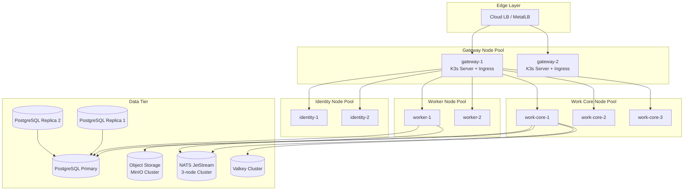
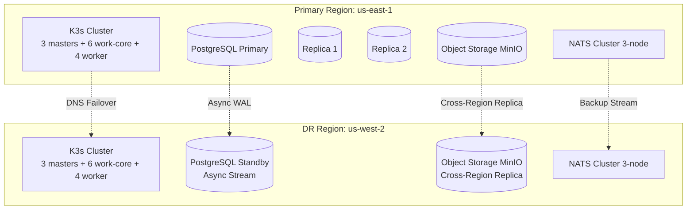
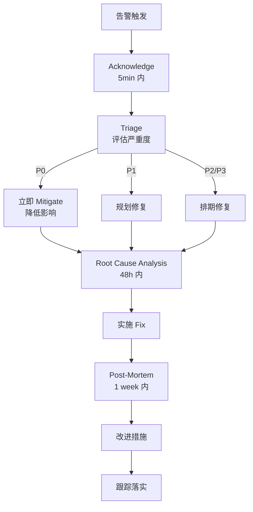
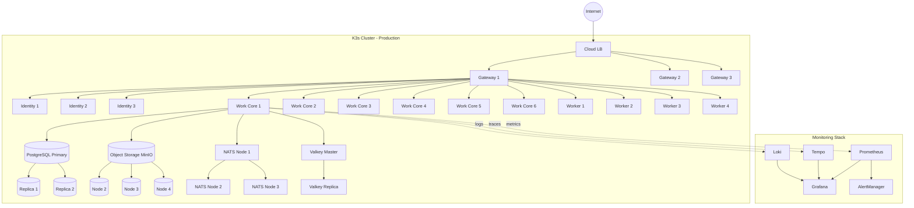
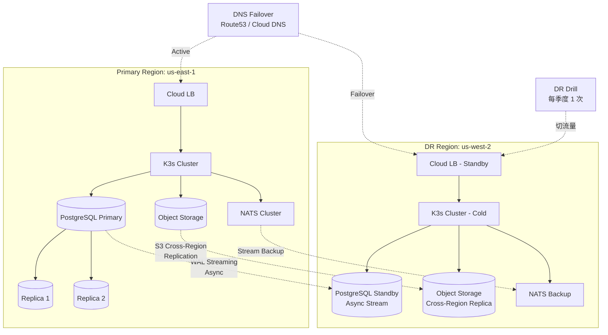

# Star 平台《Operation Design》(K3s 部署运维详细设计)

> **文档版本**: v0.2 (2026-08-26)
> **修订历史**:
>
> | 版本 | 日期 | 变更 | 审批者 |
> |---|---|---|---|
> | v0.1 | 2026-08-25 | 初始版本 | — |
> | v0.2 | 2026-08-26 | 同步 basic-design 5f1ea5b(cost_summary 监控指标 + Gitea/Forgejo Adapter 部署预留,V2 候选) | — |
> **上游**: `docs/requirements.md` v2.0,`docs/basic-design.md` v0.1,`docs/api-design.md` v0.1,`docs/security-design.md` v0.1,`docs/data-design.md` v0.1
> **下游**: SRE / Platform 团队实施、生产环境运维
> **文档定位**: K3s 部署拓扑、Kubernetes 资源清单、SRE 运维手册、可观察性、灾备。

---

## 上游同步 2026-08-26(继承 basic-design 5f1ea5b)

> 本设计书跟随《基本設計書》5f1ea5b 同步,引入以下变更。**不**改 K3s 部署拓扑主结构 / Service 拆分原则:
>
> | 同步项 | 落位 |
> |---|---|
> | **S3** REQ-SCM-003(Gitea/Forgejo,V2 候选) | 不进入 V1 部署清单;Deployment 模板预留(复用 GitHub/GitLab Adapter 同模板),排期随 V2 |
> | **S4** AgentSession `cost_summary` 字段 | 监控指标段:`agent_session_cost_total_usd` V1 候选(Prometheus Counter,与 Context Cost Analysis 共用统计口径) |
>
> **不变量保留**:K3s 部署拓扑主结构 / Service 拆分原则 / RTO/RPO 全部不动。

---

## 0. 文档说明

### 0.1 文档目的与定位

本文档是《Basic Design》§8(部署与运行时拓扑)、§13(ADR-016~018 部署决策)的"详细实施"展开,涵盖:

- K3s 集群布局(继承《Basic Design》§8.1-§8.2)
- Kubernetes 资源(Deployment / Service / ConfigMap / Secret / PVC / HPA)
- 配置管理(ConfigMap / Secret / Vault / KMS)
- 存储(PostgreSQL / Object Storage / NATS JetStream)
- 网络(Gateway API / Ingress / mTLS)
- 可观察性(Metrics / Logs / Traces)
- 备份与恢复
- 灾备(DR)
- 升级与发布
- SRE 手册(告警 / Runbook / On-call)
- 合规(GDPR / SOC 2 / ISO 27001)
- 成本优化

### 0.2 命名约定

- **K3s Cluster**:生产 K3s 集群
- **Node Pool**:角色化节点池(gateway / identity / work-core / worker)
- **Deployment / StatefulSet / DaemonSet**:K8s 资源类型
- **HPA / KEDA**:自动扩缩
- **RPO / RTO**:Recovery Point/Time Objective
- **SoR**:System of Record(本设计 = PostgreSQL)
- **MTTR / MTBF**:平均恢复 / 故障间隔时间
- **Runbook**:标准运维手册

### 0.3 受众

- SRE / Platform 团队
- DevOps 工程师
- 运维值班
- 安全 / 合规(继承《Security Design》§10)

### 0.4 引用规则

- `§N` 引用《Requirements》v2.0 章节号(最大 §47)
- 引用《Basic Design》使用 `《Basic Design》§X`
- 引用《API Design》使用 `《API Design》§X`
- 引用《Data Design》使用 `《Data Design》§X`
- 引用《Security Design》使用 `《Security Design》§X`

---

## 1. K3s 集群布局(继承《Basic Design》§8.1)

### 1.1 节点池与角色

**严格遵循 4+1 角色边界**(继承《Basic Design》§8.1 + §44.2 K8s Tax 纪律):

| 角色 | Node Pool | 数量(MVP) | 数量(Prod) | 工作负载 |
|---|---|---|---|---|
| **gateway** | `gateway-pool` | 2 | 3 | K3s Server / Nginx Ingress / Gateway API |
| **identity** | `identity-pool` | 2 | 3 | Identity Service(独立 Deployment) |
| **work-core** | `work-core-pool` | 3 | 6+ | work-core / Rust Modular Monolith(主体)|
| **worker** | `worker-pool` | 2 | 4+ | Worker(`--role all`,处理 Outbox / Event) |
| **realtime**(可选) | `realtime-pool` | 0 | 2 | 仅出现真实 Long Connection Scaling Boundary 时 |

**严禁出现**(继承《Basic Design》§8.2):

```text
❌ 独立 "notification-service" Deployment(Notification 走 work-core + Outbox)
❌ 独立 "validation-service" Deployment(Validation 走 work-core + Worker)
❌ 独立 "ai-service" Deployment(AI 子系统走 work-core)
❌ 独立 "search-service" Deployment(Search 是 PostgreSQL FTS Projection)
❌ 独立 "realtime-service" Deployment(除非 B-1 阻塞解除,见《API Design》§14.3)
❌ 独立 "audit-service" Deployment(Audit 走 work-core + Append-only)
❌ 独立 "agent-orchestrator" Deployment(Agent Orchestration 走 work-core)
```

### 1.2 K3s Cluster 拓扑



### 1.3 节点规格(生产建议)

| 角色 | CPU | RAM | Disk | 数量 |
|---|---|---|---|---|
| **gateway** | 4 | 8GB | 100GB SSD | 3 |
| **identity** | 4 | 8GB | 100GB SSD | 3 |
| **work-core** | 16 | 32GB | 200GB SSD | 6+ |
| **worker** | 8 | 16GB | 200GB SSD | 4+ |
| **realtime**(可选) | 8 | 16GB | 100GB SSD | 2+ |
| **PostgreSQL** | 16 | 64GB | 1TB NVMe(独立存储)| 3(1P + 2R)|
| **NATS** | 4 | 8GB | 50GB | 3 |
| **Object Storage** | 8 | 16GB | 10TB HDD(独立存储)| 4(MinIO EC:4) |

**Scale Up 优先**(K3s Tax 纪律):先扩 work-core 节点,加 replica;不增加新 Deployment。

### 1.4 Node Affinity / Taint

```yaml
# gateway 节点专用
nodeAffinity:
  requiredDuringSchedulingIgnoredDuringExecution:
    nodeSelectorTerms:
    - matchExpressions:
      - key: node-role.star.local/gateway
        operator: In
        values: ["true"]

# work-core 节点专用
nodeAffinity:
  requiredDuringSchedulingIgnoredDuringExecution:
    nodeSelectorTerms:
    - matchExpressions:
      - key: node-role.star.local/work-core
        operator: In
        values: ["true"]
```

**Taint / Toleration**:

- gateway / identity / data 节点用 taint 隔离
- work-core Pod 容忍 data-tier taint
- 用户 Pod(若有)不部署到 data-tier

---

## 2. Kubernetes 资源

### 2.1 命名空间划分

```text
star-system          # 系统组件(Ingress, Cert Manager, Prometheus, etc.)
star-gateway         # Gateway Node 上的服务
star-identity        # Identity Service
star-work-core       # work-core 主服务
star-worker          # Worker 进程
star-data            # PostgreSQL / NATS / Valkey / MinIO(若 in-cluster)
star-monitoring      # Prometheus / Grafana / Loki
star-tracing         # Tempo / Jaeger
```

**Resource Quota**(继承《Basic Design》§44.2 K8s Tax):

```yaml
# star-work-core namespace
apiVersion: v1
kind: ResourceQuota
metadata:
  name: work-core-quota
  namespace: star-work-core
spec:
  hard:
    requests.cpu: "200"
    requests.memory: "500Gi"
    limits.cpu: "400"
    limits.memory: "1Ti"
    persistentvolumeclaims: "20"
    services: "20"
    secrets: "50"
    configmaps: "50"
```

### 2.2 work-core Deployment

```yaml
apiVersion: apps/v1
kind: Deployment
metadata:
  name: work-core
  namespace: star-work-core
  labels:
    app: work-core
    role: work-core
spec:
  replicas: 6  # 生产基线
  strategy:
    type: RollingUpdate
    rollingUpdate:
      maxSurge: 1
      maxUnavailable: 0  # Zero-Downtime
  selector:
    matchLabels:
      app: work-core
  template:
    metadata:
      labels:
        app: work-core
        role: work-core
      annotations:
        prometheus.io/scrape: "true"
        prometheus.io/port: "9090"
        prometheus.io/path: "/metrics"
    spec:
      affinity:
        podAntiAffinity:
          preferredDuringSchedulingIgnoredDuringExecution:
          - weight: 100
            podAffinityTerm:
              labelSelector:
                matchLabels:
                  app: work-core
              topologyKey: kubernetes.io/hostname
        nodeAffinity:
          requiredDuringSchedulingIgnoredDuringExecution:
            nodeSelectorTerms:
            - matchExpressions:
              - key: node-role.star.local/work-core
                operator: In
                values: ["true"]
      containers:
      - name: work-core
        image: star/work-core:v0.1.0
        imagePullPolicy: IfNotPresent
        ports:
        - containerPort: 8080
          name: http
        - containerPort: 8081
          name: ws
        - containerPort: 9090
          name: metrics
        env:
        - name: DATABASE_URL
          valueFrom:
            secretKeyRef:
              name: postgres-credentials
              key: url
        - name: NATS_URL
          valueFrom:
            secretKeyRef:
              name: nats-credentials
              key: url
        - name: VALKEY_URL
          valueFrom:
            secretKeyRef:
              name: valkey-credentials
              key: url
        - name: OBJECT_STORAGE_BUCKET
          value: "star-prod"
        - name: RUST_LOG
          value: "info,star=info"
        - name: JWT_PUBLIC_KEY
          valueFrom:
            secretKeyRef:
              name: jwt-keys
              key: public
        resources:
          requests:
            cpu: "4"
            memory: "8Gi"
          limits:
            cpu: "8"
            memory: "16Gi"
        livenessProbe:
          httpGet:
            path: /healthz
            port: 8080
          initialDelaySeconds: 30
          periodSeconds: 10
          timeoutSeconds: 3
          failureThreshold: 3
        readinessProbe:
          httpGet:
            path: /readyz
            port: 8080
          initialDelaySeconds: 10
          periodSeconds: 5
          timeoutSeconds: 3
          failureThreshold: 2
        lifecycle:
          preStop:
            exec:
              command: ["/bin/sh", "-c", "sleep 15"]  # 给 LB 时间摘流
        securityContext:
          runAsNonRoot: true
          runAsUser: 10001
          allowPrivilegeEscalation: false
          readOnlyRootFilesystem: true
          capabilities:
            drop: ["ALL"]
```

### 2.3 Service / Ingress

#### 2.3.1 Service

```yaml
apiVersion: v1
kind: Service
metadata:
  name: work-core
  namespace: star-work-core
  labels:
    app: work-core
spec:
  type: ClusterIP
  selector:
    app: work-core
  ports:
  - name: http
    port: 8080
    targetPort: 8080
  - name: ws
    port: 8081
    targetPort: 8081
  - name: metrics
    port: 9090
    targetPort: 9090
```

#### 2.3.2 Gateway API(HTTP)

```yaml
apiVersion: gateway.networking.k8s.io/v1
kind: HTTPRoute
metadata:
  name: work-core-public
  namespace: star-work-core
spec:
  parentRefs:
  - name: public-gateway
  hostnames:
  - "api.star.local"
  rules:
  - matches:
    - path:
        type: PathPrefix
        value: /v1
    backendRefs:
    - name: work-core
      port: 8080
  - matches:
    - path:
        type: PathPrefix
        value: /v1/runtimes
    backendRefs:
    - name: work-core
      port: 8081  # WS
```

#### 2.3.3 Ingress(回退)

```yaml
# 若暂时不能用 Gateway API,回退到 Ingress
apiVersion: networking.k8s.io/v1
kind: Ingress
metadata:
  name: work-core-public
  namespace: star-work-core
  annotations:
    nginx.ingress.kubernetes.io/proxy-read-timeout: "3600"
    nginx.ingress.kubernetes.io/proxy-send-timeout: "3600"
    cert-manager.io/cluster-issuer: "letsencrypt-prod"
spec:
  ingressClassName: nginx
  tls:
  - hosts:
    - api.star.local
    secretName: api-star-local-tls
  rules:
  - host: api.star.local
    http:
      paths:
      - path: /v1/runtimes
        pathType: Prefix
        backend:
          service:
            name: work-core
            port:
              number: 8081
      - path: /v1
        pathType: Prefix
        backend:
          service:
            name: work-core
            port:
              number: 8080
```

### 2.4 ConfigMap / Secret

#### 2.4.1 ConfigMap(非敏感)

```yaml
apiVersion: v1
kind: ConfigMap
metadata:
  name: work-core-config
  namespace: star-work-core
data:
  config.yaml: |
    [server]
    bind = "0.0.0.0:8080"
    workers = 16

    [database]
    max_connections = 100
    statement_timeout_ms = 30000

    [nats]
    stream_name = "star-events"
    retention_days = 30
    replicas = 3

    [object_storage]
    endpoint = "http://minio.star-data.svc.cluster.local:9000"
    bucket = "star-prod"
    region = "us-east-1"

    [observability]
    log_format = "json"
    log_level = "info"
    metrics_enabled = true
    tracing_enabled = true
    tracing_endpoint = "http://tempo.star-tracing.svc.cluster.local:4317"
```

#### 2.4.2 Secret(敏感,继承《Security Design》§5)

```yaml
# 由 External Secrets Operator 同步自 Vault / KMS
apiVersion: external-secrets.io/v1beta1
kind: ExternalSecret
metadata:
  name: postgres-credentials
  namespace: star-work-core
spec:
  refreshInterval: 1h
  secretStoreRef:
    name: vault-backend
    kind: ClusterSecretStore
  target:
    name: postgres-credentials
  data:
  - secretKey: url
    remoteRef:
      key: secret/star/prod/postgres
      property: url
  - secretKey: password
    remoteRef:
      key: secret/star/prod/postgres
      property: password
```

### 2.5 PVC / Storage Class

```yaml
# PostgreSQL StatefulSet 用独立 StorageClass
apiVersion: storage.k8s.io/v1
kind: StorageClass
metadata:
  name: postgres-ssd
provisioner: local.csi.ephemeral.storage.io  # 或云厂商 CSI
parameters:
  type: gp3
  iops: "10000"
  throughput: "500"
reclaimPolicy: Retain
volumeBindingMode: WaitForFirstConsumer
allowVolumeExpansion: true
```

### 2.6 Network Policy(继承《Security Design》§4)

```yaml
apiVersion: networking.k8s.io/v1
kind: NetworkPolicy
metadata:
  name: work-core-netpol
  namespace: star-work-core
spec:
  podSelector:
    matchLabels:
      app: work-core
  policyTypes:
  - Ingress
  - Egress
  ingress:
  # 仅允许 gateway namespace 访问
  - from:
    - namespaceSelector:
        matchLabels:
          name: star-gateway
    - podSelector:
        matchLabels:
          app: ingress
    ports:
    - protocol: TCP
      port: 8080
    - protocol: TCP
      port: 8081
  # 允许 Prometheus 抓 metrics
  - from:
    - namespaceSelector:
        matchLabels:
          name: star-monitoring
    ports:
    - protocol: TCP
      port: 9090
  egress:
  # 允许访问 PostgreSQL
  - to:
    - namespaceSelector:
        matchLabels:
          name: star-data
        podSelector:
          matchLabels:
            app: postgres
    ports:
    - protocol: TCP
      port: 5432
  # 允许访问 NATS
  - to:
    - namespaceSelector:
        matchLabels:
          name: star-data
        podSelector:
          matchLabels:
            app: nats
    ports:
    - protocol: TCP
      port: 4222
  # 允许 DNS
  - to:
    - namespaceSelector:
        matchLabels:
          name: kube-system
        podSelector:
          matchLabels:
            k8s-app: kube-dns
    ports:
    - protocol: UDP
      port: 53
  # 允许 HTTPS 出站(SCM / AI / OIDC)
  - to:
    - ipBlock:
        cidr: 0.0.0.0/0
        except:
        - 10.0.0.0/8
        - 172.16.0.0/12
        - 192.168.0.0/16
    ports:
    - protocol: TCP
      port: 443
```

### 2.7 HPA / KEDA(继承《Basic Design》§13.5 候选)

**HPA**(基础):

```yaml
apiVersion: autoscaling/v2
kind: HorizontalPodAutoscaler
metadata:
  name: work-core-hpa
  namespace: star-work-core
spec:
  scaleTargetRef:
    apiVersion: apps/v1
    kind: Deployment
    name: work-core
  minReplicas: 6
  maxReplicas: 20
  metrics:
  - type: Resource
    resource:
      name: cpu
      target:
        type: Utilization
        averageUtilization: 70
  - type: Resource
    resource:
      name: memory
      target:
        type: Utilization
        averageUtilization: 80
  behavior:
    scaleDown:
      stabilizationWindowSeconds: 300
    scaleUp:
      stabilizationWindowSeconds: 30
```

**KEDA**(基于事件,继承《Basic Design》§13.5 候选):

```yaml
# Worker 基于 NATS 队列深度扩缩
apiVersion: keda.sh/v1alpha1
kind: ScaledObject
metadata:
  name: worker-scaler
  namespace: star-worker
spec:
  scaleTargetRef:
    name: worker
  minReplicaCount: 2
  maxReplicaCount: 10
  triggers:
  - type: nats-jetstream
    metadata:
      stream: star-events
      consumer: worker-consumer
      lagThreshold: "100"
```

### 2.8 Pod Disruption Budget

```yaml
apiVersion: policy/v1
kind: PodDisruptionBudget
metadata:
  name: work-core-pdb
  namespace: star-work-core
spec:
  minAvailable: 4
  selector:
    matchLabels:
      app: work-core
```

### 2.9 Service Account + RBAC

```yaml
apiVersion: v1
kind: ServiceAccount
metadata:
  name: work-core-sa
  namespace: star-work-core
automountServiceAccountToken: false
# 仅最小权限(从 Vault / KMS 拉 Secret 等)
```

---

## 3. 配置管理

### 3.1 ConfigMap(同 §2.4.1)

**分层配置**:

| 层级 | 存储 | 频率 |
|---|---|---|
| **L0 静态** | Image 内置 | 永不 |
| **L1 集群** | ConfigMap(per namespace)| 部署时 |
| **L2 环境** | ConfigMap(per env: prod / staging)| 部署时 |
| **L3 运行时** | ExternalSecret(Vault / KMS)| 1h 同步 |
| **L4 动态** | 业务 User 配置 | 实时 |

### 3.2 Secret 管理(继承《Security Design》§5)

**Secret 类别**:

| 类别 | 存储 | 例子 |
|---|---|---|
| **DB 凭据** | Vault | PostgreSQL password |
| **API Key** | Vault | OpenAI / Anthropic Key |
| **Webhook Secret** | Vault | GitHub Webhook Secret |
| **TLS 证书** | cert-manager | 域名证书 |
| **JWT 私钥** | Vault | 签名 / 验证 |
| **mTLS 证书** | Vault | 设备证书 |
| **Object Storage** | Vault | S3 Access Key |

**Vault 部署**(High Availability):

- 3 个 Vault Pod(Raft 存储)
- Auto Unseal(Cloud KMS)
- Sealed Secret 备份到 Object Storage

### 3.3 KMS 集成(继承《Security Design》§5.2)

| 云厂商 | KMS 路径 |
|---|---|
| AWS | `arn:aws:kms:us-east-1:ACCOUNT:key/UUID` |
| GCP | `projects/PROJECT/locations/LOCATION/keyRings/RING/cryptoKeys/KEY` |
| Azure | `https://VAULT.vault.azure.net/keys/KEY/VERSION` |

**KMS 用途**:

- ✅ Vault Auto Unseal
- ✅ PostgreSQL 透明加密(TDE)
- ✅ Object Storage 服务端加密
- ✅ Snapshot 加密
- ❌ 不直接用于应用层 Secret(走 Vault)

---

## 4. 存储

### 4.1 PostgreSQL(主从 + 备份 + 监控)

#### 4.1.1 部署

- **Patroni** + **etcd**(3 节点)+ **HAProxy**
- 主从流复制(Synchronous,2 个 Replica)
- 自动 Failover(Patroni + Leader Lock)

**关键参数**(postgresql.conf):

```ini
max_connections = 500
shared_buffers = 16GB
effective_cache_size = 48GB
maintenance_work_mem = 2GB
checkpoint_completion_target = 0.9
wal_buffers = 64MB
default_statistics_target = 500
random_page_cost = 1.1
effective_io_concurrency = 200
work_mem = 64MB
min_wal_size = 4GB
max_wal_size = 16GB
max_wal_senders = 10
wal_level = replica
synchronous_commit = on
synchronous_standby_names = 'ANY 1 (replica1, replica2)'
max_replication_slots = 10
hot_standby = on
wal_log_hints = on
log_min_duration_statement = 1000
log_connections = on
log_disconnections = on
log_lock_waits = on
```

#### 4.1.2 备份策略

```text
WAL 归档: 实时,保留 7 天
Base Backup: 每日,保留 30 天
月度归档: 保留 1 年
PITR 启用:是(基于 WAL + Base Backup)
异地复制:是(目标 Region,继承 §8 灾备)
加密: 是(KMS)
```

**备份工具**:`pgBackRest`

#### 4.1.3 监控

| 指标 | 阈值告警 |
|---|---|
| Replication Lag | > 30s |
| Active Connections | > 80% of max_connections |
| Disk Usage | > 80% |
| WAL Archive Lag | > 5min |
| Long Running Query | > 60s |
| Lock Wait | > 30s |
| Cache Hit Rate | < 95% |

### 4.2 Object Storage(MinIO 候选)

#### 4.2.1 部署

- MinIO Cluster(4 节点,EC:4)
- 跨节点纠删码
- Versioning 启用
- Lifecycle Policy 自动归档

**Bucket 划分**:

| Bucket | 用途 | 保留期 |
|---|---|---|
| `star-prod` | 生产 Object Storage | 永久(版本控制) |
| `star-prod-audit` | AI Audit L3/L4(加密) | 90d |
| `star-prod-snapshot` | PostgreSQL Snapshot | 30d + 月度 1y |
| `star-prod-public` | 用户头像 / 公共附件 | 永久 |

#### 4.2.2 备份

- Cross-Region Replication(继承 §8)
- 版本控制(防误删)
- Object Lock(Compliance,V1)

### 4.3 NATS JetStream(集群模式)

#### 4.3.1 部署

- 3 节点 NATS Cluster
- JetStream 启用
- Stream 持久化(磁盘)
- Subject 命名空间:`star.events.{tenant_id}.{...}`(继承《Basic Design》§5.5)

**关键配置**:

```text
# Stream: star-events
  Storage: File
  Retention: Limits(30d)
  Discard: Old
  Max Age: 30d
  Max Msgs: -1
  Max Bytes: 1TB
  Replicas: 3
  Duplicates: 2min
```

#### 4.3.2 监控

| 指标 | 阈值 |
|---|---|
| Stream Storage | > 80% |
| Consumer Lag | > 1000 |
| Slow Consumers | > 10 |
| Cluster Health | Quorum Loss |

### 4.4 Valkey(集群模式,可选单实例)

- 2 个分片(高可用)
- AOF + RDB 持久化
- maxmemory-policy: `allkeys-lru`
- 监控:Memory / Hit Rate / Connection / Slow Log

---

## 5. 网络

### 5.1 Gateway API / Ingress

**首选 Gateway API**,回退 Ingress NGINX(若云厂商不支持)。

**TLS 终止**:

- cert-manager(Let's Encrypt 或企业 CA)
- 90 天自动续期
- 强制 TLS 1.3
- 禁用弱 Cipher

### 5.2 TLS 终止

```yaml
# Gateway TLS 配置
listeners:
- name: https
  port: 443
  protocol: HTTPS
  tls:
    mode: Terminate
    certificateRefs:
    - name: api-star-local-tls
      namespace: star-system
    options:
      tls.cipher-suites: "TLS_AES_128_GCM_SHA256:TLS_AES_256_GCM_SHA384:TLS_CHACHA20_POLY1305_SHA256"
      tls.min-protocol-version: VersionTLS13
```

### 5.3 mTLS 内部通信

**应用间 mTLS**(继承《Security Design》§2.4):

- work-core ↔ Worker
- work-core ↔ Local Daemon
- 使用 SPIFFE / SPIRE 或 Linkerd(若引入)

**Linkerd 评估**(继承《Basic Design》§30.6 Non-Goals,默认不引入):

- ❌ 不引入 Service Mesh
- ✅ 直接用 mTLS via Library(Rust `rustls` / Go `crypto/tls`)
- ✅ K8s Service 用 ClusterIP(无外部 L4 LB)

**Istio 评估**:❌ 不引入(理由同上,K8s Tax 纪律)

### 5.4 Network Policy(继承 §2.6)

**默认 Deny + 显式 Allow**:

```yaml
# 默认 deny
apiVersion: networking.k8s.io/v1
kind: NetworkPolicy
metadata:
  name: default-deny-all
  namespace: star-work-core
spec:
  podSelector: {}
  policyTypes:
  - Ingress
  - Egress
```

### 5.5 DNS

- CoreDNS(K3s 内置)
- 内部 Service:`{name}.{namespace}.svc.cluster.local`
- 外部:`*.star.local` → Cloud DNS
- 设备 Local Daemon:`runtime-{id}.daemon.star.local`

---

## 6. 可观察性

### 6.1 Metrics(Prometheus)

**Prometheus 部署**:

- 2 副本(Prometheus Operator)
- 远程写入 Thanos / Cortex(长期存储,V1)
- Scrape Interval:15s
- Retention:30d(本地)+ 1y(对象存储)

**关键 Metrics**(继承《Basic Design》§28.1 + 《AI/Agent Design》§11.1):

```text
# 应用
star_http_requests_total
star_http_request_duration_seconds
star_db_query_duration_seconds
star_db_connections_active
star_nats_publish_total
star_nats_consume_lag

# AI 子系统
star_ai_context_compile_duration_seconds
star_ai_agent_session_total
star_ai_agent_session_duration_seconds
star_ai_provider_request_total
star_ai_provider_rate_limit_remaining

# 资源
star_runtime_resource_usage{resource="cpu|memory|disk|fd"}
star_runtime_worktree_active_count

# 业务
star_worktree_total{status}
star_workitem_total{status}
star_feedback_total{status}
```

**高 Cardinality 标签处理**(继承《Basic Design》§39):

- ❌ 禁用:`tenant_id` / `user_id` / `worktree_id` / `agent_session_id`
- ✅ 允许:`status` / `operation` / `agent_type` / `provider`

### 6.2 Logs(Loki / OpenSearch 候选)

**首选 Loki**(轻量 + Grafana 集成),回退 OpenSearch。

**日志格式**(JSON Lines,继承《Runtime Design》§10.1):

```json
{
  "ts": "2026-08-25T12:30:00.123Z",
  "level": "info",
  "target": "star::core",
  "msg": "...",
  "tenant_id": "...",
  "trace_id": "...",
  "runtime_id": "..."
}
```

**Loki 部署**:

- 3 个 Loki Pod(可扩展)
- 1 个 Gateway + 1 个 Querier
- 后端 Storage:Object Storage(S3 / MinIO)
- Retention:30d(配置)

**日志脱敏**(继承《Security Design》§7.3):

- Secret 自动 Redact
- 完整 Prompt / Response 不入 Log(走 Object Storage + AI Audit)

### 6.3 Traces(Tempo / Jaeger)

**首选 Tempo**(Grafana 集成),回退 Jaeger。

**OTel Collector 部署**:

- 2 个 Collector Pod(DaemonSet 或 Deployment)
- 接收协议:OTLP / Jaeger / Zipkin
- 后端:Tempo
- Sampling:1%(常态)+ 100%(错误)

**Span 设计**(继承《AI/Agent Design》§11.4):

```text
Root: agent_session
  Child: context_compile
  Child: provider_request
    Child: tool_call
  Child: validation_run
  Child: audit_write
```

### 6.4 仪表盘(Grafana)

**核心 Dashboard**:

1. **Overview**:QPS / 错误率 / P95 延迟 / 资源使用
2. **API Performance**:按端点分维度
3. **AI Subsystem**:Context Compile / Agent Session / Provider
4. **Database**:Connections / Slow Query / Replication
5. **NATS**:Stream / Consumer Lag
6. **Storage**:PostgreSQL / Object Storage
7. **Worktree / WorkItem**:业务指标
8. **Cost**:Cloud Spend(若启用)

### 6.5 高 Cardinality 标签处理(继承《Basic Design》§39)

**严格清单**(继承《AI/Agent Design》§11.2):

- ❌ 禁用:`tenant_id` / `user_id` / `work_item_id` / `worktree_id` / `agent_session_id` / `repository_id` / `file_path` / `symbol_id`
- ✅ 允许:`agent_type` / `provider` / `model` / `status` / `operation`

**需求追踪**:`trace_id` 走 distributed tracing,不做 Label。

---

## 7. 备份与恢复

### 7.1 PostgreSQL 备份

**3 层备份**(继承 §4.1.2):

1. **WAL 归档**:实时(每 16MB segment)
2. **Base Backup**:每日凌晨 2:00
3. **月度归档**:每月 1 日,保留 1 年

**工具**:`pgBackRest`

**异地复制**:Base Backup + WAL 复制到 DR Region(继承 §8)

### 7.2 Object Storage 备份

- Cross-Region Replication(继承 §8)
- Versioning(防误删)
- 完整性校验(MD5 / SHA256)

### 7.3 配置备份

- ConfigMap:Git(继承 Configuration as Code)
- Secret:Vault Backup(每日)
- Helm Values:Git

### 7.4 RPO / RTO 目标(继承 §8)

| 故障类型 | RPO | RTO |
|---|---|---|
| 数据库主节点 | 0(同步复制) | < 5min(自动 Failover) |
| 数据库 Region 灾难 | < 5min(WAL 异步) | < 1h |
| Object Storage 节点 | 0(EC) | < 1min(自动恢复) |
| Object Storage Region | < 1h(Cross-Region 异步) | < 4h |
| NATS 节点 | < 1s | < 1min |
| 配置丢失 | 0(Git) | < 30min |

---

## 8. 灾备(DR)

### 8.1 DR 拓扑



### 8.2 DR 策略

**冷备模式**(默认):

- DR Region 基础设施就绪
- PostgreSQL 异步流复制
- Object Storage Cross-Region 复制
- 启动延迟:RTO < 1h

**Pilot Light**(V1 候选):

- DR Region 关键服务运行(轻量)
- 数据实时同步
- 启动延迟:RTO < 15min

**热备**(V2 候选):

- DR Region 全功能运行
- Active-Active(部分)
- 启动延迟:RTO < 1min

### 8.3 DR 演练

**频率**:每季度 1 次

**演练步骤**:

1. 切流量到 DR Region(DNS 切换)
2. 验证所有功能
3. 记录问题 + 修复
4. 切回 Primary
5. 报告

### 8.4 RPO / RTO 目标

| 指标 | 目标 | 测量方法 |
|---|---|---|
| **RPO**(数据丢失)| < 5min | WAL Async Lag |
| **RTO**(恢复时间)| < 1h | DR Drill 时长 |
| **MTTR**(平均恢复)| TBD-MEASURE < 30min | 事故复盘 |
| **MTBF**(故障间隔)| TBD-MEASURE > 720h | 90d 平均 |

---

## 9. 升级与发布

### 9.1 蓝绿 / 金丝雀

**蓝绿发布**(继承《Basic Design》§13 Service Promotion Model):

```text
1. 部署 Green 版本(旧 Blue 仍跑)
2. Green 内部 Smoke Test
3. 切流量 5% → Green
4. 监控 30min(无异常)
5. 切流量 100% → Green
6. 保留 Blue 24h(可回滚)
7. 删除 Blue
```

**金丝雀**(V1 候选):

```text
1. 部署 Canary 版本(replica 1/总 replica)
2. 切流量 5% → Canary
3. 监控 1h
4. 逐步扩到 50%
5. 监控 1h
6. 扩到 100%
7. 下线旧版
```

**实现**:Argo Rollouts(可选) / 手工操作

### 9.2 DB Migration 顺序

**严格顺序**(避免回滚困难):

```text
1. 部署 Forward-Only Migration(step 1)
2. 部署应用(读旧 Schema,写新 Schema 兼容)
3. 部署应用(读新 Schema,写新 Schema)
4. 部署 Forward-Only Migration(step 2,清理)
```

**禁止**:

- ❌ 一次迁移中混 destructive + additive
- ❌ 跨多个 release 的 migration
- ❌ 业务高峰期做 destructive migration

**Rollback 策略**:

- 保留前一个版本 DB Schema 镜像
- Migration 必须可逆(用 Down 脚本,即使生产不跑)
- 应用版本必须向前向后兼容

### 9.3 Service Promotion Model(继承《Basic Design》§13)

**3 阶段**:

```text
Stage 1 (Internal):     内部用户先用,无外部流量
Stage 2 (Beta):         Beta 客户流量 1%
Stage 3 (GA):           全量 100%
```

**每阶段必须**:

- ✅ 监控无异常
- ✅ 关键指标达成
- ✅ Manual Approval(若 GA)

### 9.4 Schema 演进

- 任何 Schema 变更必须先写 Migration
- Migration 必须经 Code Review + DBA Review
- 测试用真实 Schema 重建 + 数据迁移验证
- Production 执行前必须 Dry Run

---

## 10. SRE 手册

### 10.1 告警规则(继承《Basic Design》§28.1)

**P0 告警**(立即响应,5min 内):

| 告警 | 条件 | 严重度 |
|---|---|---|
| **ProductionDown** | 健康检查 5min 内失败 3 次 | Critical |
| **DatabasePrimaryDown** | 主节点不可达 | Critical |
| **ReplicationLagCritical** | Replica Lag > 5min | Critical |
| **OutboxBacklog** | Outbox 表 > 10K 行 | Critical |
| **WALArchiveLag** | WAL 归档延迟 > 15min | Critical |
| **DiskFull** | Disk Usage > 95% | Critical |
| **APIErrorRateHigh** | 5xx > 5%(5min 平均) | Critical |
| **AuthEndpointDown** | 401 持续 | Critical |
| **TenantIsolationBypass** | 任何 RLS Bypass 检测 | Critical |
| **AuditWriteFailure** | Audit 写入失败率 > 0 | Critical |

**P1 告警**(1h 内响应):

| 告警 | 条件 |
|---|---|
| **APIHighLatency** | P95 > TBD-MEASURE |
| **DatabaseConnectionsHigh** | > 80% max_connections |
| **CacheHitRateLow** | < 80% |
| **NATSClusterLoss** | 1 节点 down |
| **StorageUsageHigh** | > 80% |
| **AgentSessionFailureHigh** | 失败率 > 30% |
| **ProviderRateLimitLow** | remaining < 10% |

**P2 告警**(1 day 内响应):

| 告警 | 条件 |
|---|---|
| **BackupFailed** | Daily Backup 失败 |
| **CertificateExpiring** | 30 天内过期 |
| **QuotaWarning** | 资源 Quota > 80% |
| **SlowQuery** | > 5s |

**P3 告警**(下个工作日):

| 告警 | 条件 |
|---|---|
| **ConfigDrift** | Config 与 Git 不一致 |
| **Deprecation** | 依赖库新版 |
| **Trend** | 性能趋势恶化 |

### 10.2 Runbook 模板

每个告警必须配 Runbook。模板:

```markdown
## 告警: <告警名>

### 概述
- 严重度:P0
- 触发条件:...
- 影响:...
- 触发频率:...

### 立即诊断
1. 检查 Dashboard: [Link]
2. 看最近事件: ...
3. 看日志: ...

### 常见根因
- 根因 1: ...
  - 修复步骤: ...
- 根因 2: ...
  - 修复步骤: ...

### 升级路径
- L1: On-call 工程师
- L2: 团队 Lead
- L3: Platform Lead / Engineering Manager

### 事后复盘
- 模板: ...
- 截止时间: 48h 内
```

### 10.3 On-call 轮值

**轮值表**:

- 周期:1 周
- 人数:2 人(Primary + Secondary)
- 工具:PagerDuty / Opsgenie
- 升级:Primary 5min 不响应 → Secondary;Secondary 5min 不响应 → Manager

**补偿**:

- On-call 补休
- 高 severity 事故额外奖励
- Burnout 检测(连续 On-call 监控)

### 10.4 事故响应流程



### 10.5 事故分级

| 级别 | 影响 | 响应 |
|---|---|---|
| **Sev1** | 全部用户不可用,数据丢失风险 | 立即响应,所有人投入 |
| **Sev2** | 主要功能不可用 | 1h 内响应,团队 50% 投入 |
| **Sev3** | 部分功能不可用 | 4h 内响应,1-2 人 |
| **Sev4** | 性能下降 / 用户体验差 | 1 day 内,1 人 |

### 10.6 关键 Runbook 列表

| 告警 | Runbook |
|---|---|
| ProductionDown | `runbooks/prod-down.md` |
| DatabasePrimaryDown | `runbooks/pg-primary-down.md` |
| ReplicationLagCritical | `runbooks/pg-replication-lag.md` |
| OutboxBacklog | `runbooks/outbox-backlog.md` |
| APIErrorRateHigh | `runbooks/api-error-high.md` |
| DiskFull | `runbooks/disk-full.md` |
| TenantIsolationBypass | `runbooks/rls-bypass.md` |
| AuditWriteFailure | `runbooks/audit-write-failure.md` |
| ObjectStorageDown | `runbooks/obj-storage-down.md` |
| NATSClusterLoss | `runbooks/nats-cluster-loss.md` |

---

## 11. 合规

### 11.1 GDPR

**要求**:

- ✅ 用户数据可导出
- ✅ 用户数据可删除(被遗忘权)
- ✅ 数据处理记录(Process Record)
- ✅ 数据保护官(DPO)任命
- ✅ 跨境传输合规(SCC)

**实施**:

- 用户删除走 Soft Delete + 30 天后 Hard Delete
- AI Audit L3/L4 同步删除
- Search 索引同步删除
- Object Storage Object 同步删除 + Lifecycle Policy

**审计**:每年 1 次 GDPR 审计,记录在 `compliance/gdpr-audit-{date}.md`

### 11.2 SOC 2

**Trust Services Criteria**:

- CC1:Control Environment
- CC2:Communication and Information
- CC3:Risk Assessment
- CC4:Monitoring Activities
- CC5:Control Activities
- CC6:Logical and Physical Access
- CC7:System Operations
- CC8:Change Management
- CC9:Risk Mitigation
- A1:Availability
- C1:Confidentiality
- PI1:Processing Integrity(关键,AI 决策)

**实施**:

- 审计日志 1 年保留(继承《Security Design》§10.4)
- 访问控制 + MFA 强制
- 变更管理(PR + Approval)
- 事件响应流程

**审计**:每年 1 次 SOC 2 Type II 审计

### 11.3 ISO 27001

**Annex A 控制**(16 类):

- A.5 信息安全策略
- A.6 信息安全组织
- A.7 人力资源安全
- A.8 资产管理
- A.9 访问控制
- A.10 密码学
- A.11 物理与环境安全
- A.12 操作安全
- A.13 通信安全
- A.14 系统获取、开发与维护
- A.15 供应商关系
- A.16 信息安全事件管理
- A.17 业务连续性
- A.18 合规

**实施**:映射到内部控制(见 `compliance/iso27001-mapping.md`)

**审计**:每年 1 次

### 11.4 审计日志保留(继承《Security Design》§10.4)

| 类别 | 保留期 |
|---|---|
| **应用 Audit** | 1 年 |
| **Security Audit** | 1 年(SOC 2 / ISO 27001) |
| **AI Audit L1** | 永久(Metadata) |
| **AI Audit L2** | 1 年(Summary) |
| **AI Audit L3/L4** | 90d(默认)+ 365d(可调) |
| **操作日志** | 90d |
| **指标** | 30d(详细)+ 1y(聚合) |
| **链路追踪** | 7d |

**存储**:

- PostgreSQL:Application / Security / AI Audit L1/L2
- Object Storage:AI Audit L3/L4(加密)
- Loki:操作日志
- Prometheus + Thanos:指标
- Tempo:链路追踪

---

## 12. 成本优化

### 12.1 资源利用率监控

| 资源 | 目标利用率 | 告警阈值 |
|---|---|---|
| **CPU** | 60-70% | > 80%(扩) / < 30%(缩) |
| **Memory** | 70-80% | > 90%(告警) |
| **Storage** | 60% | > 80%(告警) |
| **Network** | 50% | > 80%(告警) |

### 12.2 优化策略

**Compute**:

- ✅ HPA 自动扩缩(CPU / Memory)
- ✅ KEDA 事件驱动(Worker)
- ✅ Spot Instance(无状态服务,Work-core 可用 Spot)
- ✅ Reserved Instance(基线负载,30%+ 折扣)
- ❌ 不用的资源立即清理

**Storage**:

- ✅ Object Storage Lifecycle(冷数据 → 归档)
- ✅ PostgreSQL TOAST 压缩
- ✅ Log Retention 30d(详细) + 1y(聚合)
- ✅ Metric Retention 30d
- ❌ 不存重复数据

**Network**:

- ✅ 内部 mTLS(避免公网)
- ✅ NAT Gateway 优化(单出口)
- ✅ CloudFront / CDN 静态资源

**AI**:

- ✅ Token Budget 严格控制
- ✅ Context Cache 复用
- ✅ 较小 Model 优先(性能 / 成本)
- ✅ Provider Cost Dashboard
- ❌ 不必要的 Long Context

### 12.3 Spot Instance 策略(Work-core)

**Spot 比例**:

- 50% On-Demand(基线)
- 50% Spot(弹性)

**Spot 中断处理**:

- Node 收到中断通知(2min 提前)
- Pod 优雅退出(15s,继承 §2.2 preStop)
- HPA 启动新 Pod
- 用户无感知(若有 ≥ 2 个 Replica)

**风险缓解**:

- 重要服务全用 On-Demand
- Work-core 至少 3 个 On-Demand Replica(保证 quorum)
- Worker 全部 On-Demand

### 12.4 成本 Dashboard

- **Cost by Service**:每个 Deployment 月度成本
- **Cost by Tenant**:Multi-tenant 计费
- **Cost by Resource**:CPU / Memory / Storage / Network 拆解
- **Cost Forecast**:预测月底成本
- **Anomaly Detection**:异常增长告警

---

## 13. 给下游契约

### 13.1 给 SRE / Platform 实施

**关键任务**(MVP):

```text
1. K3s 集群部署(3 master + 6 work-core + 4 worker)
2. Gateway API + cert-manager
3. PostgreSQL Patroni Cluster(1P + 2R)
4. NATS JetStream 3-node Cluster
5. Object Storage(MinIO 或云厂商)
6. Prometheus + Grafana + Loki + Tempo
7. Vault HA(3 节点)
8. work-core / identity / worker Deployment
9. Network Policy 默认 Deny + 显式 Allow
10. Backup 配置(pgBackRest + S3)
11. DR Region 基础(Infrastructure ready)
12. 告警规则 + Runbook
```

### 13.2 给 Security / Compliance

- 季度 Penetration Test
- 季度 DR Drill
- 年度 SOC 2 / ISO 27001 审计
- 持续 Compliance 监控(自动检查)

### 13.3 给 Test

- 测试环境(`staging.star.local`)独立 K3s 集群
- 包含所有组件(PostgreSQL / NATS / Valkey / Object Storage)
- 自动化部署(Helm / Kustomize + ArgoCD)

---

## 14. 附录 A:K3s 集群拓扑图



---

## 15. 附录 B:DR 拓扑图



---

## 16. Open Issues(继承上游 + 新增 Operation-J.x)

### 16.1 继承自《Basic Design》§15 J.x

- J-09:高 Cardinality 标签(本设计 §6.5 严格遵守)
- J-14:DR Pilot Light 评估(本设计 §8.2 候选)
- J-15:Traceability 自动化(本设计 §13.2 测试 + 监控)

### 16.2 本设计新增

- **Operation-J.1**:是否引入 Service Mesh(Istio / Linkerd)?当前不引入,直接 mTLS via Library。**待 V1 评估**。
- **Operation-J.2**:是否用 ArgoCD 做 GitOps?**V1 候选**(运维效率高)。
- **Operation-J.3**:是否用 KEDA?(事件驱动 Worker)本设计 §2.7 已包含。**已决定**。
- **Operation-J.4**:Vault Auto Unseal 走 Cloud KMS 还是手动?**自动**(降低人工成本)。
- **Operation-J.5**:DR 演练是否每月 / 每季度?本设计 §8.3 季度。**已决定**。
- **Operation-J.6**:Cost Allocation 是否按 Tenant 计费?Multi-tenant SaaS 需要。**V1 候选**。
- **Operation-J.7**:是否需要 Chaos Engineering(Chaos Mesh / Litmus)?**V1 候选**(提升韧性)。
- **Operation-J.8**:Object Storage 是否用云厂商 S3 替代 MinIO?云厂商 S3 托管更省事。**V1 评估**。
- **Operation-J.9**:是否需要 Service Mesh 之外的 mTLS 方案(Istio Ambient)?**否**,用 Library mTLS。
- **Operation-J.10**:Compliance 审计(年度 SOC 2)是否外包?**是**,找专业审计公司。

---

## 17. 接口稳定承诺(给 SRE / 实施 / 后续阶段)

以下接口在本设计冻结后,**不**因下游阶段而变更:

1. **4+1 角色边界**(§1.1):gateway / identity / work-core / worker / realtime(可选)
2. **节点池规格**(§1.3)
3. **命名空间划分**(§2.1)
4. **work-core Deployment 模板**(§2.2)
5. **Service / Gateway API 配置**(§2.3)
6. **Network Policy 默认 Deny + 显式 Allow**(§2.6 + §5.4)
7. **ConfigMap / Secret 分层**(§3.1)
8. **Vault / KMS 集成策略**(§3.2 + §3.3)
9. **PostgreSQL HA(Patroni + 同步复制)**(§4.1.1)
10. **3 层备份策略**(§4.1.2 + §7.1)
11. **NATS JetStream 集群配置**(§4.3.1)
12. **TLS 1.3 强制 + 禁用弱 Cipher**(§5.2)
13. **mTLS via Library(不引入 Service Mesh)**(§5.3)
14. **Prometheus + Grafana + Loki + Tempo 选型**(§6)
15. **高 Cardinality 标签禁止清单**(§6.5)
16. **RPO / RTO 目标**(§7.4)
17. **DR 拓扑(冷备默认)**(§8)
18. **告警分级(P0 / P1 / P2 / P3)**(§10.1)
19. **On-call 轮值 + 升级路径**(§10.3)
20. **事故分级(Sev1-4)**(§10.5)
21. **GDPR / SOC 2 / ISO 27001 合规要求**(§11)
22. **审计日志保留期**(§11.4)
23. **资源利用率目标**(§12.1)
24. **Spot Instance 比例(50/50)**(§12.3)

**变更流程**:任何对上述接口的修改,需走 RFC + 重新冻结本设计。

---

## 18. 文档元信息

- **章节数**:0~17 主章 + 附录 A/B
- **mermaid 图数**:5(§1.2, §8.1, §10.4, §14, §15)
- **目标行数**:1500~2500
- **目标大小**:50~100KB
- **下游契约**:SRE / Platform 实施、生产环境运维
- **关联设计**:《Basic Design》§8(部署) + §13(ADR) + §28(可观察性) + §44(K8s Tax)、《API Design》(API 端点)、《Data Design》(数据存储)、《Security Design》(网络安全 + 审计)
- **覆盖 25 Module**:本设计涉及所有 Module 的部署:domain-tenant(§1.1 + §2.1 + §2.2 Tenant 维度)、domain-workspace(§2.2 集群 namespace)、domain-project(§2.2 Project Policy ConfigMap)、domain-work-item(§1.1 + §10.1 告警 + §6.1 指标)、domain-workflow(§1.1 + §2.1)、domain-board(§1.1 + §2.1)、domain-planning(§1.1 + §2.1)、domain-permission(§5.4 Network Policy + §11 SOC 2)、domain-comment(§1.1 + §2.1)、domain-relation(§1.1 + §2.1)、domain-development(§4.1 PostgreSQL + §4.2 Object Storage + §6 监控)、domain-worktree(§1.1 + §6 指标 + §10.1 告警)、domain-agent(§1.1 + §6 AI 指标 + §10.1 Agent Session 失败告警)、domain-feedback(§1.1 + §6 指标 + §10.1 告警)、domain-context(§4.1 PostgreSQL + §4.2 Object Storage 存 ContextPacket + §6 AI 指标)、domain-validation(§4.1 PostgreSQL + §4.2 Object Storage Build/Test Log + §6 指标)、domain-scm(§5.4 HTTPS 出站 + §10.1 告警)、domain-identity(§1.1 独立 identity 节点池 + 多个 Deployment)、domain-audit(§4.1 PostgreSQL + §4.2 Object Storage + §10.1 告警 + §11.4 保留期)、domain-search(§4.1 PostgreSQL FTS + §6 指标)、domain-notification(§1.1 + §2.1 work-core 内置,无独立 Deployment)、domain-integration(§1.1 + §2.1 + §5.4 HTTPS 出站)、domain-automation(§1.1 + §2.1 + §10.1 告警)、domain-collaboration(§1.1 Realtime 可选 + §2.7 HPA/KEDA)、domain-local-runtime(§5.3 mTLS via Library + Local Daemon 在集群外,部署见《Runtime Design》§13.2)。**全部 25 Module 至少出现 1 次**。
- **13 类 tenant_id 必带对象**:在 K8s 资源中验证所有 13 类必带对象强制隔离:Repository Credential(§3.2 Vault + §2.4 Secret 走 External Secrets Operator #1)、Local Runtime(§5.3 mTLS 设备证书 + §10.1 告警 #2)、Worktree(§2.2 work-core Pod + §6 指标 + §10.1 告警 #3)、AgentSession(§2.2 work-core 部署 + §6 AI 指标 + §10.1 告警 #4)、ContextPacket(§4.1 PostgreSQL + §4.2 Object Storage 加密 + §6 AI 指标 #5)、Feedback(§4.1 PostgreSQL + §6 指标 #6)、AI Prompt(§4.2 Object Storage 加密 + §11.4 保留期 #7)、AI Response(§4.2 Object Storage 加密 + §11.4 保留期 #8)、Diff(§4.2 Object Storage Key 含 tenant_id + §5.4 Network Policy 限制出站 #9)、Build Log(§4.2 Object Storage + §6 指标 #10)、Test Log(§4.2 Object Storage + §6 指标 #11)、PR Content(§1.1 + §2.2 + §5.4 HTTPS 出站 #12)、Symbol Index(§4.1 PostgreSQL + §6 指标 #13)。**全部 13 类必带对象至少出现 1 次**。

---

**END of Operation Design v0.1**
