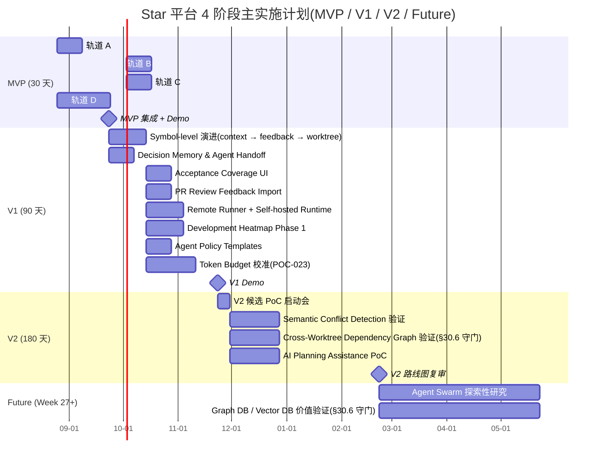
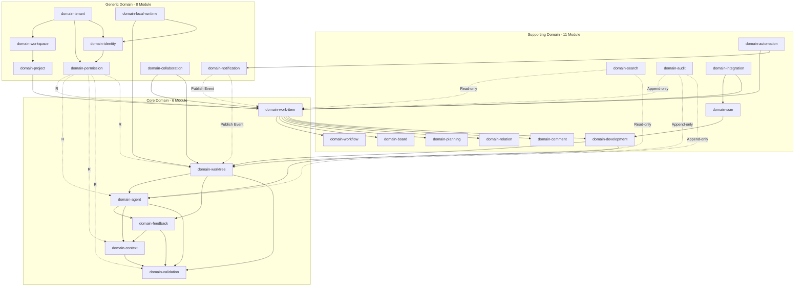

# Star 平台《主实施计划》Master Implementation Plan

> **状态**: Draft v0.1 (2026-08-25)
> **负责人**: TBD (待 PM / 架构师评审指派)
> **目标读者**: 项目经理 / 架构师 / 25 Module 独立 Lead / 投资人 / SRE Lead
> **上游基线**:
> - `docs/requirements.md` v2.0 (§0~§47)
> - `docs/basic-design.md` v0.1 (修复后,F-01~F-08 全部关闭)
> - `docs/api-design.md` / `data-design.md` / `security-design.md` v0.1
> - `docs/runtime-design.md` / `integration-design.md` / `ai-agent-design.md` v0.1
> - `docs/external-design.md` / `internal-design.md` / `test-design.md` / `operation-design.md` v0.1
> - `docs/specs/domain-*-spec.md` (25 Module 实施 spec,各 v0.1)
> - `docs/poc/poc-NNN-*.md` (15 份 PoC, MVP 必做 13 + V1 候选 2)
> - `docs/rfcs/rfc-NNN-*.md` (15 份 RFC, ADR-016~030 草案)
> - `docs/plans/plan-NNN-*.md` (15 份 RFC-1:1 实施计划,已存在)
> **关联下游**: `docs/plan/mvp-30day-execution-plan.md` / `docs/plan/v1-90day-execution-plan.md` / `docs/plan/token-olu-estimate.md`
> **工程纪要**: 本文档不写代码 / DDL / OpenAPI,只编排模块、阶段、Owner、Token、风险、依赖。

---

## 0. 摘要

Star 平台是 **AI Coding Worktree Control Plane + Jira-class Work Management + GitHub/GitLab SCM Integration** 三位一体的 Vibe Coding Work Management SaaS。本主实施计划基于已固化的 25 Module 划分(§2)、13 项 §30.2 MVP Must Have 范围(§2.1)、15 份 RFC-1:1 实施计划(§4)与 15 项 §33 SaaS Risk(§7),给出 **MVP 30 天 / V1 90 天 / V2 180 天 / Future 探索** 四阶段路线图,套用 RGS-TS-001 v0.4 §6.2 的 token-OLU 框架(1 人·天 ≈ 100K-300K tokens)估算总投入约 **MVP 35-50M tokens / V1 50-80M tokens / V2 30-50M tokens**,合计 **115-180M tokens**(不含 buffer)。实施纪律上严格执行 **25 Module 独立 Lead 原则**(用户偏好,继承自 RGS-TS-001 5 域独立 Lead),**不允许 Lead 兼任**(domain-worktree Lead 不兼任 domain-work-item Lead、domain-permission Lead 不兼任 domain-agent Lead 等)。

---

## 1. 项目概述

### 1.1 目标

1. **MVP(30 天)**:打通 **Jira-class 闭环**(Tenant → Workspace → Project → WorkItem → Workflow → Board → Comment → Permission → Audit → Notification)与 **Vibe Coding 最小闭环**(WorkItem → Repository → Worktree → AgentSession → ChangeSet → Validation → Feedback → Commit → PR/MR Link),13 项 §30.2 Must Have 全部可演示、可审计、可回放。
2. **V1(90 天)**:在 MVP 之上交付 §30.3 V1 Should Have 全部 12 项(包含 Symbol-level Feedback / Decision Memory / Agent Handoff / Acceptance Coverage / Saved Worktree Views / Development Heatmap Phase 1 / Agent Policy Templates / Remote Runner 等),并完成 15 份 RFC 的 PoC 验证闭环。
3. **V2(180 天)**:从 §30.4 V2 Candidates 中根据 §30.6 Non-Goals 守门筛选(明确不引入 Graph Database / Vector Database / Microservices / Serverless 等),验证后进入研发。
4. **Future(Week 27+)**:仅验证价值后研究,本期不承诺。

### 1.2 范围

**包含**:
- 25 个逻辑 Module 的实施编排(§2 / §3)
- 15 份 RFC 化决策的落地推进(§4 引用)
- 15 份 RFC-1:1 实施计划的协调(已存在,本计划只编排主从关系)
- 13 项 MVP PoC 的执行节奏(§6)
- 15 项 §33 SaaS Risk(§7)的 Owner 分配与监控指标
- token-OLU 资源估算(§5,详见 token-olu-estimate.md)
- 沟通 / 变更 / 验收机制(§8 / §9 / §10)

**不包含**(继承 §30.6 Explicit Non-Goals):
- ❌ GitHub / GitLab / Jira Enterprise 克隆
- ❌ 自建 Cloud IDE / Git Hosting
- ❌ Agent Swarm / Autonomous Company / Autonomous Production Deployment
- ❌ Service Mesh / 几十个微服务 / Database per Domain
- ❌ Graph Database / Vector Database / OpenSearch Cluster
- ❌ Full Event Sourcing / Complex CQRS
- ❌ 兼任式 Lead 架构(用户偏好,2026-08-21 RustGameServer 决策)

### 1.3 时间线概览

| 阶段 | 起止 | 工作日 | 关键里程碑 | 状态 |
|---|---|---:|---|---|
| **MVP** | Week 1-4(~30 天) | 20-22 | §2.1 / Day 30 Demo | Draft |
| **V1** | Week 5-12(~90 天) | 60-66 | §2.2 / Week 12 全部 §30.3 交付 | Draft |
| **V2** | Week 13-26(~180 天) | 90-100 | §2.3 / Week 26 候选验证完成 | Draft |
| **Future** | Week 27+ | TBD | §2.4 探索性研究 | Backlog |

> 起始基准日期: 2026-08-25(MVP Day 1 = 2026-08-25;Day 30 = 2026-09-23;Day 90 = 2026-11-23;Day 180 = 2027-02-22)

---

## 2. 阶段化路线图

### 2.1 MVP(Week 1-4,~30 天)

**目标**:打通 §30.1 双闭环 + §30.2 13 项 Must Have 全部可演示 + 13 项 PoC 通过初验 + 1 次集成 Demo。

**范围**(继承 §30.2 / basic-design §13.1):
- 13 项 MVP PoC(POC-016/017/018/019/020/021/022/024/026/027/028/029/030,基本设计 §11)
- 25 Module 中的 23 个(MVP 内)全量交付:domain-tenant, domain-identity, domain-workspace, domain-project, domain-permission, domain-work-item, domain-workflow, domain-board, domain-planning, domain-relation, domain-comment, domain-worktree, domain-agent, domain-feedback, domain-context, domain-validation, domain-scm, domain-development, domain-local-runtime, domain-collaboration, domain-audit, domain-notification, domain-integration
- 2 个 Module 仅做 MVP Stub(domain-automation: 触发器-条件-动作最小实现;domain-search: 基础 WorkItem / Comment 投影),V1 完善
- Local Daemon 二进制(集群外进程,与 domain-local-runtime 区分,基本设计 §4.6.1 / §8.5)

**退出标准**:
1. 13 项 MVP PoC 全部通过初验
2. §30.2 13 项 Must Have 逐项可在 Demo 环境复现
3. 17 状态 Worktree 状态机、14 状态 AgentSession 状态机、6 状态 Feedback 状态机单元测试覆盖率 100%
4. 13 类 tenant_id 必带对象(基本设计 §6.1)全部实施并通过 Cross-Tenant 访问拦截测试
5. Local Runtime 9 项 Isolation(§22.5 / POC-030)验证通过
6. 12 项 AgentPolicy 强制点(基本设计 §4.2.5 / POC-029)全部生效
7. 集成 Demo:从创建 WorkItem → 创建 Worktree → 启动 Agent → 提交 Feedback → Agent 修订 → Validation → Commit → PR Link,全链路跑通

**关键里程碑**(详见 mvp-30day-execution-plan.md):
- Day 7:Auth + Tenant + Project + WorkItem 基础
- Day 14:WorkItem CRUD + Workflow + Board + Comment + Permission
- Day 21:Worktree 注册 + Local Daemon + Agent Session + SCM Adapter(GitHub / GitLab)
- Day 28:ChangeSet + Validation + Feedback + Context Packet + Commit/PR Link
- Day 30:MVP 集成 + Demo + 13 PoC 验证报告

### 2.2 V1(Week 5-12,~90 天)

**目标**:交付 §30.3 V1 Should Have 全部 12 项,完成 Symbol-level Context 演进,落地 Decision Memory / Acceptance Coverage / Saved Worktree Views / Agent Policy Templates / Remote Runner 等。

**范围**(基本设计 §13.2):
- Symbol-level Feedback / Symbol-level Conflict(§30.3 上半部分)
- Decision Memory(§26.5)
- Agent Handoff(§24.5 / §52)
- Acceptance Coverage UI(§27.2 / §31)
- Advanced Context Selection(V1 中期评估,§30.3)
- PR Review Feedback Import(§18 / basic-design §4.7)
- Saved Worktree Views(§30.3)
- Development Heatmap Phase 1(§22.4 / basic-design §4.1.6)
- Agent Policy Templates(基本设计 §4.2.5 V1 阶段)
- Remote Runner(Self-hosted Runtime 类型,§23.6)
- Context Cost Analysis(§9 / basic-design §9)
- 2 项 V1 候选 PoC 校准(POC-023 Token Budget 校准 + POC-025 Symbol-level Feedback 准确率)

**退出标准**:
1. §30.3 12 项 V1 Should Have 全部交付并通过 Review
2. Symbol-level Feedback 准确率 > 95%(POC-025 实测)
3. Token Budget 实测 P50 / P95 校准 §4.4.4 表(POC-023)
4. Remote Runner 与 LocalMachine 两种 Runtime 类型并存,数据模型兼容
5. Agent Handoff 流程演示通过(HandoffContextPacket 替代全量聊天)
6. Acceptance Coverage UI 可见,AC → ValidationEvidence 映射可视化

**关键里程碑**(详见 v1-90day-execution-plan.md):
- Week 6:Symbol-level Feedback 准确率达标 + Decision Memory 独立管理
- Week 8:Agent Handoff + Acceptance Coverage UI
- Week 10:PR Review Feedback Import + Saved Views
- Week 12:Development Heatmap Phase 1 + Agent Policy Templates + Remote Runner + Token Budget 校准完成

### 2.3 V2(Week 13-26,~180 天)

**目标**:从 §30.4 V2 Candidates 中根据 §30.6 Non-Goals 守门筛选后,验证后进入研发;不预设必须实现全部 V2 候选。

**候选范围**(基本设计 §13.3):
- Semantic Conflict Detection(AI 辅助)
- Cross-Worktree Dependency Graph(§30.6 限制:不引入 Graph Database,只用 PostgreSQL Relation + Projection)
- AI Planning Assistance(§9 REQ-PLAN-006)
- Multi-Agent Comparison(§30.4)
- Task Parallelization Recommendation
- Agent Performance Analytics(BI 报表)
- Advanced Runtime Isolation(Kata 等重型方案)
- Cloud Development Runtime(§23.6 第四种 Runtime 类型)

**退出标准**:
1. V2 候选 PoC 至少 2 个通过验证
2. 验证失败的候选正式关闭并写入 §15 Open Issue
3. §30.6 Non-Goals 始终未越界

**关键里程碑**(Week 13-26 编排):
- Week 14:V2 候选 PoC 启动会
- Week 18:Semantic Conflict Detection 验证报告
- Week 22:Cross-Worktree Dependency Graph 验证报告(§30.6 守门:不引入 Graph DB)
- Week 26:V2 路线图复审,确认 V3 / 终止 / 重排

### 2.4 Future(Week 27+)

仅在 V2 验证后研究(基本设计 §13.4 / §30.5):
- Agent Swarm / Autonomous Task Decomposition / Autonomous Multi-Agent Scheduling
- Graph Database / Vector Database / Semantic Repository Memory
- Cloud IDE / Managed Git Hosting
- Autonomous Merge / Autonomous Deployment

**本期不承诺**。仅在 §30.6 显式 Non-Goals 不被推翻的前提下,作为探索性研究方向。

---

## 3. 25 Module 实施顺序(由依赖图推导)

> **编排原则**(继承 basic-design §2.3 调用方向硬约束 + §2.4 跨域事务):
> - **P0 阶段(MVP Week 1-2)**:Core Foundation 链 `tenant → identity → workspace → project → permission → work-item`
> - **P1 阶段(MVP Week 2-3)**:Work Management 配套 `workflow / board / planning / relation / comment / notification`
> - **P2 阶段(MVP Week 3)**:Development Core `worktree → agent → feedback → context → validation → scm → development → local-runtime`
> - **P3 阶段(MVP Week 4)**:Cross-cutting `audit / search / automation / integration / collaboration`
> - **V1 阶段**:Symbol-level 演进 + Decision Memory + Handoff + 各种 V1 Should Have
> - **V2 阶段**:V2 候选验证

### 3.1 完整 25 Module 实施序列表

| # | Module | 阶段 | Owner Lead(独立,不允许兼任) | 依赖 | 关键不变量 | 状态机 | 风险 |
|---|---|---|---|---|---|---|---|
| 1 | domain-tenant | MVP W1 | tenant Lead | 无 | 任何聚合根必带 tenant_id(§16) | 3 (Active/Suspended/Disabled) | 低 |
| 2 | domain-identity | MVP W1 | identity Lead | tenant | Device 三重绑定(§23.2) | 5 | RISK-016 |
| 3 | domain-workspace | MVP W1 | workspace Lead | tenant | Workspace → N Project(§7) | 4 | 低 |
| 4 | domain-project | MVP W1-W2 | project Lead | tenant, workspace | Project 独立配置 Workflow/Permission(REQ-TWP-003) | 5 | 低 |
| 5 | domain-permission | MVP W2 | permission Lead | tenant | Agent 操作 Application/Authorization 强制(REQ-PERM-002) | - | RISK-017/018 |
| 6 | domain-work-item | MVP W2 | work-item Lead | tenant, project, workflow | WorkItem ≠ Git Branch(§44.3) | 3 默认 + 扩展 | 低 |
| 7 | domain-workflow | MVP W2 | workflow Lead | work-item | 默认最简三态 TODO/IN_PROGRESS/DONE(REQ-WF-001) | 默认 3 / 扩展由 Project Policy | 低 |
| 8 | domain-board | MVP W2 | board Lead | work-item, planning | Kanban + Scrum 共享数据(REQ-PLAN-003) | - | 低 |
| 9 | domain-planning | MVP W2 | planning Lead | work-item, board | Burndown 最小必需,Velocity/CFD 推 V1(§9) | - | 低 |
| 10 | domain-relation | MVP W2 | relation Lead | work-item | 阻塞/关联是 Gantt 与冲突分析基础(REQ-COLLAB-002) | - | 低 |
| 11 | domain-comment | MVP W2 | comment Lead | work-item | 不替代 Feedback(§25.1) | - | 低 |
| 12 | domain-notification | MVP W2 | notification Lead | tenant | MVP 邮件 + 站内(REQ-NOTIF-001) | - | 低 |
| 13 | domain-audit | MVP W2-W4 | audit Lead | 所有 domain(只追加) | 敏感 Prompt/Code 不默认进入普通日志(§17) | - | 低 |
| 14 | domain-worktree | MVP W3 | **worktree Lead**(独立) | work-item, scm, development | 17 状态(§7.1);Status 独立于 WorkItem Status(REQ-WF-002) | 17 | RISK-022/028 |
| 15 | domain-agent | MVP W3 | **agent Lead**(独立) | worktree, feedback, validation | 1 AgentSession → 1 Active Worktree(REQ-DEV-003) | 14 | RISK-017/023 |
| 16 | domain-feedback | MVP W3-W4 | **feedback Lead**(独立) | work-item, worktree, agent | 6 状态(§7.3);Target 全粒度(§25.1) | 6 | RISK-026 |
| 17 | domain-context | MVP W3-W4 | **context Lead**(独立) | work-item, worktree, feedback, validation | P0-P4 优先级(§4.4.4);Provenance 强制(§26.3) | 3 (Decision) | RISK-024/025 |
| 18 | domain-validation | MVP W4 | **validation Lead**(独立) | work-item, worktree, agent | AI 自我报告不构成完成(VAL-001) | - | 低 |
| 19 | domain-scm | MVP W3 | **scm Lead**(独立) | work-item, worktree | Domain 层无厂商对象(REQ-SCM-002) | - | RISK-027 |
| 20 | domain-development | MVP W3-W4 | **development Lead**(独立) | work-item, worktree, agent, scm | ChangeSet ≠ Git Diff(§21.1) | - | 低 |
| 21 | domain-local-runtime | MVP W3-W4 | **local-runtime Lead**(独立) | worktree, identity | 服务器侧 Registry/Port ≠ Local Daemon 二进制(§4.6.1) | - | RISK-016/029 |
| 22 | domain-collaboration | MVP W4 | collaboration Lead | work-item, worktree | 高频 Token Stream 可不入 SaaS(REQ-RT-003) | - | 低 |
| 23 | domain-integration | MVP W4 | integration Lead | scm, work-item | 区分 Link/Mirror/Bidirectional/Platform-owned(§18.1) | - | RISK-027 |
| 24 | domain-automation | MVP W4(Stub) → V1 完善 | automation Lead | work-item, notification | MVP 不强制可视化配置器(REQ-AUTO-001) | - | 低 |
| 25 | domain-search | MVP W4(Stub) → V1 完善 | search Lead | 所有 domain(只读) | 不得成为业务事实源(REQ-SEARCH-001) | - | 低 |

### 3.2 关键依赖边(强约束,继承 basic-design §2.3)

```text
domain-tenant ← domain-workspace ← domain-project ← domain-work-item
                                                       ↓
                                              domain-workflow / board / planning
                                                       ↓
                                              domain-relation / comment / notification
                                                       ↓
                                              domain-development ← domain-scm
                                                                       ↓
                                                  domain-worktree / agent / feedback
                                                                       ↓
                                                  domain-context / validation
domain-permission ← 所有 domain
domain-audit ← 所有 domain(只追加)
domain-search ← 所有 domain(只读)
domain-identity ← domain-permission
domain-local-runtime ← domain-worktree / identity
domain-automation ← domain-work-item
domain-collaboration ← domain-work-item / worktree
```

**禁线**(不允许反向依赖):
- ❌ domain-worktree → domain-work-item(状态独立)
- ❌ domain-scm → domain-worktree(SCM 是支撑)
- ❌ domain-context → domain-agent(Context 是输入,不依赖内部)
- ❌ domain-feedback → domain-context(Feedback 是 Context 的输入源)
- ❌ domain-audit 读其他 domain(只追加,不可读)

---

## 4. Owner 矩阵(25 Module 独立 Lead,不接受兼任)

> **关键原则(用户偏好,2026-08-21 RustGameServer 决策证据,适用 Star 平台)**:
> 25 Module 各自配独立 Lead,**不允许任何 Lead 兼任**。理由:兼任会把责任矩阵和 RACI 模糊化;安全 / 边界 / 数据完整性相关 Module(permission / worktree / agent / feedback / context / validation / scm / local-runtime)更不允许由"实现相邻 Module 的同一人"担任 Lead,以避免"自己约束自己"。

| Module | Lead Role | 兼职? | 关键职责 | RACI 中的 R |
|---|---|:---:|---|:---:|
| domain-tenant | tenant Lead | ❌ 独立 | Tenant 边界 / 数据隔离 | R |
| domain-identity | identity Lead | ❌ 独立 | User / Device / Credential / DeviceBinding | R |
| domain-workspace | workspace Lead | ❌ 独立 | Workspace 协作单位 | R |
| domain-project | project Lead | ❌ 独立 | Project 模板 / 配置 / Policy | R |
| domain-permission | **permission Lead**(独立) | ❌ **不兼任** agent Lead | Permission Scheme / RBAC / AgentPolicy 12 强制点 | **R / A** |
| domain-work-item | work-item Lead | ❌ **不兼任** worktree Lead | WorkItem CRUD / 关系 | R |
| domain-workflow | workflow Lead | ❌ 独立 | Workflow 状态机(默认 3 态) | R |
| domain-board | board Lead | ❌ 独立 | Kanban / Scrum 视图 | R |
| domain-planning | planning Lead | ❌ 独立 | Sprint / Backlog / Burndown | R |
| domain-relation | relation Lead | ❌ 独立 | 阻塞/关联 | R |
| domain-comment | comment Lead | ❌ 独立 | 评论 / @ 提及 | R |
| domain-notification | notification Lead | ❌ 独立 | 邮件 / 站内 | R |
| domain-audit | audit Lead | ❌ 独立 | 审计 / AI Audit Metadata | R |
| domain-worktree | **worktree Lead**(独立) | ❌ **不兼任** work-item / scm Lead | 17 状态机 / 冲突智能 / Heatmap | **R** |
| domain-agent | **agent Lead**(独立) | ❌ **不兼任** context / permission Lead | 14 状态 AgentSession / Agent Adapter | **R** |
| domain-feedback | **feedback Lead**(独立) | ❌ **不兼任** context / work-item Lead | 6 状态 / Precise Feedback / Inbox | **R** |
| domain-context | **context Lead**(独立) | ❌ **不兼任** agent / feedback Lead | Context Compiler / Decision Memory / P0-P4 优先级 | **R** |
| domain-validation | **validation Lead**(独立) | ❌ **不兼任** agent / work-item Lead | Validation Evidence / Acceptance Coverage | **R** |
| domain-scm | **scm Lead**(独立) | ❌ **不兼任** worktree / integration Lead | SCM Adapter / Repository Ownership | **R** |
| domain-development | **development Lead**(独立) | ❌ **不兼任** worktree / agent Lead | DevelopmentExecution / ChangeSet / SymbolIndex | **R** |
| domain-local-runtime | **local-runtime Lead**(独立) | ❌ **不兼任** worktree / identity Lead | 集群外 Runtime 服务器侧 Registry / Port | **R** |
| domain-collaboration | collaboration Lead | ❌ 独立 | Realtime Presence / 状态广播 | R |
| domain-integration | integration Lead | ❌ 独立 | 第三方平台双向同步抽象 | R |
| domain-automation | automation Lead | ❌ 独立 | 触发器-条件-动作规则 | R |
| domain-search | search Lead | ❌ 独立 | Search 投影(非业务事实源) | R |
| SRE Lead | SRE Lead | ❌ 独立(不兼任任何 domain Lead) | 部署 / 监控 / 容量 / 备份 | A(Cross-domain) |
| PM Lead | PM Lead | ❌ 独立 | 计划 / 协调 / 沟通 / 验收 | A(全部) |

> 兼任禁令适用范围:Lead Role 字段对应 Module 的主 R/A 不得由同一人担任。协同 / Review 关系可跨 Module。

---

## 5. 资源估算

详细 token-OLU 估算见 `docs/plan/token-olu-estimate.md`。本节仅给出汇总(套 RGS-TS-001 v0.4 §6.2:1 人·天 ≈ 100K-300K tokens,1 SRE 上限 = 1 人·周 ≈ 1M tokens):

| 阶段 | Token 估算(主范围) | 阶段 buffer(20-30%) | 总计(含 buffer) | 人·周估算(1M / 周) | SRE Lead 占用 |
|---|---:|---:|---:|---:|---:|
| MVP(30 天) | 35-50M | +9-15M | **44-65M** | 35-65 | 1(20h / 周硬上限) |
| V1(90 天) | 50-80M | +12-24M | **62-104M** | 50-104 | 1-2 |
| V2(180 天) | 30-50M | +7-15M | **37-65M** | 30-65 | 1 |
| Future(Week 27+) | TBD | TBD | TBD | TBD | 探索 |
| **合计(不含 Future)** | **115-180M** | **+28-54M** | **143-234M** | **115-234** | 1-2 名 SRE Lead |

**关键瓶颈 / 风险**:
- domain-context(Decision Memory + P0-P4 优先级 + Provenance + Symbol-level):估算 8-12M tokens,Lead 1 人 14-18 周 → 必须 1 人独立,不能拆
- domain-worktree(17 状态 + Heatmap + Conflict Intelligence + Reconciliation):估算 6-10M tokens,Lead 1 人独立
- domain-local-runtime(9 项 Isolation + 12 强制点集成):估算 5-8M tokens,Lead 1 人独立
- SRE Lead 上限 1 人 / 1 周 ≈ 1M tokens(NFR-OP-010 等价约束),独立 SRE 不能与 PM Lead 兼任

**招聘需求**:
- 25 Module 各配 1 Lead(共 25)
- + SRE Lead 1-2 名
- + PM Lead 1 名
- + 架构师 1-2 名(由 domain-permission / domain-worktree / domain-context 三 Lead 兼任 Review 角色)
- 共 **28-30 名独立 Lead**

---

## 6. 关键依赖与并行

### 6.1 MVP 并行轨道(MVP 30 天,Week 1-4)

| 轨道 | 起始 | Module 序列 | 并行度 | 串行约束 |
|---|---|---|:---:|---|
| **轨道 A:Work Management 基础** | Day 1 | tenant → identity → workspace → project → permission → work-item → workflow → board → planning → relation → comment | 4-5 Module/周 | permission 必须在 work-item 之前 |
| **轨道 B:Development Core** | Day 8 | scm(MVP W3 才进入主实施,但 stub 早)→ worktree → agent → feedback → context → validation | 3-4 Module/周 | worktree 依赖 work-item, agent 依赖 worktree |
| **轨道 C:Runtime 与横切** | Day 12 | local-runtime(独立)→ audit(并行全期)→ development → collaboration → integration | 2-3 Module/周 | local-runtime 早于 worktree 主实施 |
| **轨道 D:PoC 验证** | Day 1 并行 | 13 项 MVP PoC | 持续 | PoC 必须在对应 Module 集成后跑通 |

### 6.2 关键串行约束

1. **permission Lead 必须在 work-item Lead 启动前 1 周启动**(permission 是 work-item / agent / feedback 的共同依赖)
2. **worktree Lead 必须在 work-item Lead 完成 P0 之后启动**(worktree 强依赖 work-item 聚合根)
3. **context Lead 必须在 feedback Lead 启动后启动**(context 消费 feedback 作为输入源之一)
4. **local-runtime Lead 必须在 worktree Lead 完成 P0 之前完成 Isolation 9 项 PoC**(POC-030 是 worktree POC-024 的依赖)
5. **scm Lead 必须在 worktree Lead 主实施前完成 GitHub / GitLab Adapter MVP**(POC-026/027 是 worktree 依赖)
6. **audit Lead 必须在 Week 2 末完成 Append-only Schema**,后续所有 Module 集成前必须先接 audit(避免返工)

### 6.3 V1 并行轨道(Week 5-12)

| 轨道 | 起始 | Module / 任务 | 并行度 |
|---|---|---|:---:|
| **Symbol-level 演进** | Week 5 | context 演进 Symbol 索引 → feedback Symbol Target → worktree Symbol Conflict | 3 Lead 协同 |
| **Decision & Handoff** | Week 6 | context Decision 独立管理 → agent HandoffContextPacket → UI 暴露 | 2-3 Lead |
| **Acceptance Coverage** | Week 8 | validation AcceptanceCoverage 完整化 → UI 映射 | 2 Lead |
| **PR Review Import** | Week 10 | scm PR Review Comment 解析 + feedback import | 2 Lead |
| **Remote Runner** | Week 10 | local-runtime 新增 Self-hosted Runtime 类型 | 1 Lead + SRE |

---

## 7. 风险登记

> 完整 15 项 §33 SaaS Risk 见 basic-design §12,本节仅给出 Owner 分配与监控指标(从 basic-design §12 继承并对齐本计划 25 Module 独立 Lead 原则)。

| ID | 风险 | 影响 | Owner | 监控指标 | 阶段 |
|---|---|:---:|---|---|---|
| RISK-016 | Local Runtime Compromise | Critical | local-runtime Lead | remote_disable 触发次数;异常 Command 占比 | MVP |
| RISK-017 | Agent Escapes Worktree Scope | High | permission Lead + agent Lead | Agent Policy Violation 次数 | MVP |
| RISK-018 | Agent Secret Leakage | High | permission Lead + local-runtime Lead | Secret 命中 Redaction 规则次数 | MVP |
| RISK-019 | Cross-Worktree Context Leakage | High | worktree Lead + context Lead | Cross-Worktree Access 拦截次数 | MVP |
| RISK-020 | Cross-Repository Context Leakage | High | context Lead + permission Lead | Cross-Repository Access 拦截次数 | MVP |
| RISK-021 | Prompt Injection from Repository | Critical | context Lead + scm Lead | Untrusted-as-Instruct 检测次数 | MVP / V1 |
| RISK-022 | Stale Worktree State | Medium | worktree Lead | Stale Worktree 占比 | MVP |
| RISK-023 | Agent Session State Divergence | Medium | agent Lead + local-runtime Lead | AgentSession 状态偏差次数 | MVP |
| RISK-024 | Context Explosion | Medium | context Lead | Context Packet Token P95 | MVP / V1 |
| RISK-025 | Low-quality Context Selection | Medium | context Lead | Relevant Context Ratio;First-pass Acceptance | V1 |
| RISK-026 | Feedback Misinterpretation | Medium | feedback Lead | Feedback Reopen Rate;Feedback Repetition | MVP / V1 |
| RISK-027 | SCM Sync Loop | High | scm Lead + integration Lead | Sync Loop 检测次数 | MVP |
| RISK-028 | Worktree Conflict Explosion | Medium | worktree Lead | Conflict Rate;Heatmap Lag | MVP / V1 |
| RISK-029 | Local Runtime Version Fragmentation | Medium | local-runtime Lead + SRE Lead | Runtime Version 分布 | MVP / V1 |
| RISK-030 | Agent Vendor Lock-in | Medium | agent Lead | Agent Vendor 数量;Adapter 复用率 | V1 |

**关键约束**:
- RISK-017/018/021(Critical / High 安全)Owner 必须 2 名独立 Lead 联合签名,**不允许同一人独自签发缓解措施**(与 §4 独立 Lead 原则一致)
- 监控指标数据由 audit Lead + SRE Lead 联合建设仪表板(Week 2 末启动,Week 3 末交付初版)

---

## 8. 验收标准

### 8.1 MVP 验收(Week 4 末)

1. §30.2 13 项 Must Have 全部在 Demo 环境可复现
2. 13 项 MVP PoC 验证报告签字(PoC Lead + domain Lead 双签)
3. 25 Module 集成测试通过率 > 95%
4. 17/14/6/3 状态机单元测试覆盖率 100%(Worktree/AgentSession/Feedback/Decision)
5. 13 类 tenant_id 必带对象全部通过 Cross-Tenant 拦截测试
6. 9 项 Local Runtime Isolation(POC-030)验证通过
7. 12 项 AgentPolicy 强制点(POC-029)全部生效
8. MVP Demo 全链路(WorkItem → Worktree → Agent → Feedback → Validation → Commit → PR)Demo 通过
9. 15 项 RISK-016~030 监控仪表板上线

### 8.2 V1 验收(Week 12 末)

1. §30.3 12 项 V1 Should Have 全部交付
2. Symbol-level Feedback 准确率 > 95%(POC-025)
3. Token Budget P50 / P95 实测并校准 §4.4.4(POC-023)
4. Remote Runner 与 LocalMachine 两种 Runtime 类型并存
5. Agent Handoff 流程演示通过
6. Acceptance Coverage UI 可见
7. V1 Demo 通过

### 8.3 V2 验收(Week 26 末)

1. 至少 2 个 V2 候选 PoC 通过验证
2. 验证失败的候选正式关闭并写入 §15 Open Issue
3. §30.6 Non-Goals 始终未越界(由架构师 + PM 联合签字)
4. V2 / V3 路线图更新

---

## 9. 沟通与汇报

| 节奏 | 形式 | 参与者 | 输出 |
|---|---|---|---|
| **Daily** | 异步 Standup(Slack / Feishu 文字) | 25 Lead 各 1 行 | Lead 每日提交"昨日 / 今日 / 阻塞" |
| **Weekly** | 周会 60min(同步 / 录屏) | 25 Lead + SRE + PM + 架构师 | 风险 / 阻塞 / 决策点 |
| **Bi-Weekly** | 双周 Demo(2h) | 全员 + 投资人 | MVP 增量 Demo,V1 启动后 V1 增量 Demo |
| **Monthly** | 月度评审(2h) | 25 Lead + SRE + PM + 架构师 + 投资人 | 阶段进度 / Risk 评审 / 路线图调整 |
| **Ad-hoc** | RFC 评审会 | RFC 作者 + 架构师 + 涉及 Module Lead | RFC-1:1 计划变更 |
| **Incident** | 24h 内 Postmortem | 涉事 Lead + SRE + PM | 事故报告 + 改进项 |

---

## 10. 变更管理

### 10.1 变更等级

| 等级 | 触发条件 | 流程 | 决策人 |
|---|---|---|---|
| **L1(微观)** | Task ID 级别调整,不影响 Module 边界 / Owner / 时间 | Lead 内部 + 通知 PM | Module Lead |
| **L2(模块)** | Module 边界 / Owner / 关键不变量变更 | 提 RFC → 评审会 | 架构师 + PM |
| **L3(路线图)** | 阶段范围 / 退出标准 / 风险等级变更 | 月度评审 | 25 Lead 投票 + PM + 投资人 |
| **L4(架构原则)** | 违反 §30.6 Non-Goals / 推翻 §13 列出的 8 项架构原则 | 升 RFC-ADR 草案 → 全体评审 | 架构师 + 投资人 |

### 10.2 已锁定项(基本设计 §"接口稳定承诺"15 项)

以下 15 项接口 / 决策在本期不因详细设计而变更契约(若变更必须走 L4):
1. Domain 列表与依赖方向(25 个)
2. 聚合根与不变量(10 个核心聚合根)
3. Context Priority 分级(P0-P4 五层)
4. Risk Signal 类型(8 种)
5. Worktree 状态机(17 个状态)
6. WorkItem 状态机(3 个默认 + 扩展)
7. Feedback 状态机(6 个状态)
8. AgentSession 状态机(14 个状态)
9. Decision 状态机(3 个状态)
10. NATS Subject 命名空间(`star.*` 前缀)
11. 13 类 tenant_id 必带对象
12. Object Storage vs PostgreSQL 边界草案
13. AI Content Retention Policy 分级
14. ADR-016~030 决策
15. MVP / V1 / V2 范围

可能因 PoC 校准的项(基本设计 §15 Open Issue):Token Budget 具体值 / Object Storage 边界阈值 / Self-hosted Git 支持范围 / Prompt Injection 检测方式。

### 10.3 文档变更纪律

- 任何 L2 及以上变更必须同步更新 `docs/requirements.md` v2.x / `docs/basic-design.md` v0.x / 本主实施计划 v0.x
- 任何 RFC 变更必须同步更新对应的 `docs/plans/plan-NNN-*.md`
- 任何 spec 变更必须同步更新 `docs/specs/domain-*-spec.md` 与对应的 plan-NNN

---

## 附录 A:时间线 Gantt



## 附录 B:25 Module 依赖图



## 附录 C:与 RGS-TS-001 的关系

| 维度 | RGS-TS-001 | Star 平台 |
|---|---|---|
| 域数量 | 5 域(player / economy / match / social / admin) | 25 Module(3 类 6/11/8) |
| 独立 Lead 原则 | 5 域各 1 名独立 Lead,不接受兼任 | **25 Module 各 1 名独立 Lead,不接受兼任**(继承原则,2026-08-21 决策) |
| token-OLU 框架 | 1 人·天 ≈ 100K-300K tokens,1 SRE 上限 1 人·周 ≈ 1M tokens | **完全沿用** |
| 兼任风险 | 兼任会模糊责任矩阵与 RACI;Q-003 Saga 跨域核心问题需要 economy 域 Lead 独立决策权;COC 属 admin 域独立控制面 | **同根风险**:permission / worktree / agent / context Lead 不允许兼任;否则"自己约束自己"风险实现 |
| 预算影响 | 5 域独立 Lead 突破 2 SRE 上限,需申请额外 SRE 编制或调整 OLU | **同根影响**:25 Module 独立 Lead + 1-2 SRE Lead + 1 PM + 1-2 架构师,共 28-30 名独立 Lead |

> **关键承诺**:Star 平台实施过程中,任何"兼任式 Lead 重组"提案(例如把 context Lead 与 feedback Lead 合并)将作为 L4 级变更,需架构师 + 投资人联合签字,不允许 Module Lead 内部投票通过。

---

*文档结束。本主实施计划 v0.1 与三份配套计划(MVP 30 天 / V1 90 天 / token-OLU 估算)共同构成项目级实施文档集。下游团队(25 Module Lead + SRE + PM + 架构师)据此推进。*
