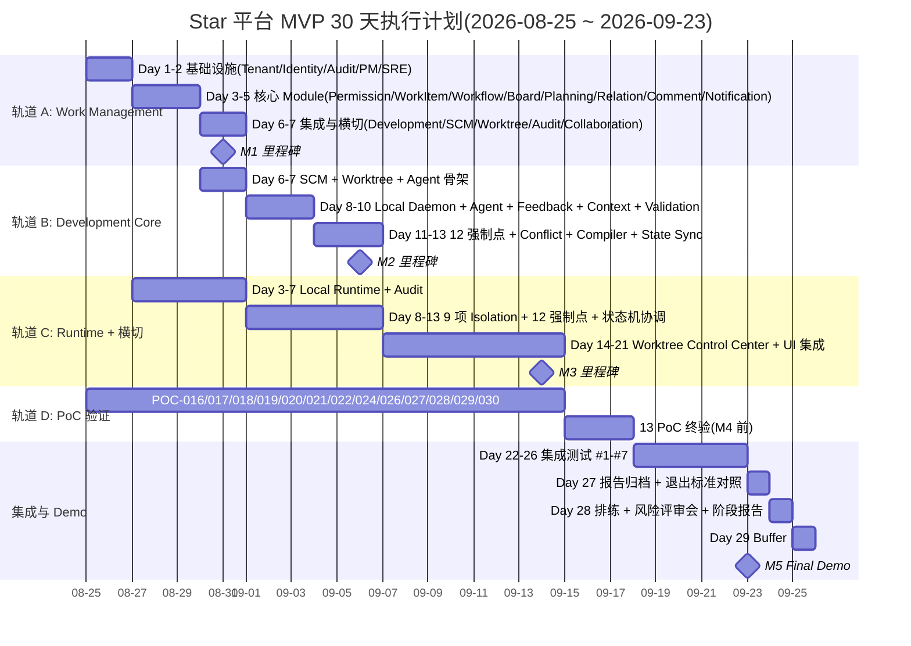

# Star 平台《MVP 30 天执行计划》

> **状态**: Draft v0.1 (2026-08-25)
> **周期**: 2026-08-25 ~ 2026-09-23(Week 1-4, 20-22 工作日)
> **负责人**: TBD (待 PM Lead 指派)
> **目标读者**: 25 Module Lead / SRE Lead / PM Lead / 架构师 / 投资人
> **关联**:
> - 上游:`docs/plan/master-implementation-plan.md` §2.1
> - 上游:`docs/requirements.md` v2.0 §30.1 / §30.2 / §30.6
> - 上游:`docs/basic-design.md` v0.1 §13.1 / §11
> - 上游:`docs/specs/domain-*-spec.md`(25 份)
> - 上游:`docs/poc/poc-016~030`(15 份,MVP 必做 13)
> - 上游:`docs/plans/plan-016~030`(15 份 RFC-1:1 计划)
> - 下游:本计划产出喂入 `docs/plan/token-olu-estimate.md` MVP 段
> **工程纪要**: 本计划不写代码 / DDL / OpenAPI,只编排 Day-by-Day 任务、Owner、依赖、PoC 联动、风险、回滚、退出标准。

---

## 0. 目标

1. **打通双闭环**(§30.1):
   - Jira-class:`Tenant → Workspace → Project → WorkItem → Workflow → Board → Comment → Permission → Audit → Notification`
   - Vibe Coding 最小:`WorkItem → Repository → Worktree → AgentSession → ChangeSet → Validation → Feedback → Commit → PR/MR Link`
2. **交付 §30.2 13 项 Must Have** 全部可演示可审计可回放
3. **13 项 MVP PoC 全部初验通过**(POC-016/017/018/019/020/021/022/024/026/027/028/029/030)
4. **集成 Demo 全链路跑通**(Day 30 末)
5. **15 项 RISK-016~030 监控仪表板上线**(Week 4 末)
6. **25 Module 独立 Lead 全部到位**(Week 1 前 3 天任命完成)
7. **25 Module 状态机单测覆盖 100%**(17 Worktree / 14 AgentSession / 6 Feedback / 3 Decision / 3 默认 WorkItem)

---

## 1. Day-by-Day 任务分解

> **任务 ID 命名**:`M{Day}-{Module}-{序号}`,如 `M05-PERM-01` = Day 5 权限相关任务 01。
> **依赖符号**: `[前序任务 ID]` 形式标注;无依赖项标记 `-`。

| Day | 周 | 任务 | Owner Lead | 依赖 | 产出 | 验收 |
|---:|:---:|---|---|---|---|---|
| **1** | W1 | `M01-TN-01` tenant 聚合根 + `tenants` 表设计 + ID 策略(Snowflake / UUIDv7) | tenant Lead | - | 架构图 + Schema Draft v0.1 | Schema 通过 data-design §4 校对 |
| 1 | W1 | `M01-ID-01` user / device / credential 基础 | identity Lead | M01-TN-01 | ID 实体 + 认证 PoC(本地) | User CRUD 通 |
| 1 | W1 | `M01-AU-01` audit `audit_events` Append-only Schema(基础) | audit Lead | M01-TN-01 | Schema + Append-only 触发器 | 任意 tenant 写入测试通过 |
| 1 | W1 | `M01-PM-01` PM Lead 任命令 + 25 Lead 任命令 + 25 RACI 矩阵 | PM Lead | - | 任命表 + RACI v0.1 | 25 Lead 全部到岗 |
| 1 | W1 | `M01-SRE-01` SRE Lead 任命令 + K3s 集群初始化 + CI/CD 起步 | SRE Lead | - | 集群就绪 + CI 绿 | Deploy 一次通 |
| **2** | W1 | `M02-WS-01` workspace 聚合根 + Workspace 模板 | workspace Lead | M01-TN-01 | workspace CRUD | Schema + 接口通过 |
| 2 | W1 | `M02-ID-02` device 三重绑定(Tenant + User + Project)PoC | identity Lead | M01-ID-01 | Binding 模型 + 测试 | POC-016 子模块通过 |
| 2 | W1 | `M02-PJ-01` project 模板(Software Development / Scrum / Kanban) | project Lead | M02-WS-01 | Project 模板 3 类 | 模板可创建 |
| 2 | W1 | `M02-PM-02` PM 与 25 Lead 1:1 + RACI 校验 | PM Lead | M01-PM-01 | RACI v0.2 | 全员确认 |
| 2 | W1 | `M02-SRE-02` GitOps 仓库初始化 + ArgoCD / Flux 起步 | SRE Lead | M01-SRE-01 | GitOps 仓库就绪 | 一次自动 Deploy |
| **3** | W1 | `M03-PE-01` permission `PermissionScheme` + RBAC 基础 | permission Lead | M02-PJ-01 | Scheme + Role 模板 | CRUD + 检查 API |
| 3 | W1 | `M03-WI-01` work-item 聚合根 + ID + 类型(Epic/Story/Task/Bug/Subtask/AI Task) | work-item Lead | M02-PJ-01, M03-PE-01 | WorkItem CRUD | 6 类型可创建 |
| 3 | W1 | `M03-LR-01` local-runtime 服务器侧 Registry/Port Schema + mTLS 设备认证 PoC | local-runtime Lead | M01-ID-01 | Schema + POC-016 子模块 | POC-016 初验通过 |
| 3 | W1 | `M03-AU-02` audit 接入 permission / work-item | audit Lead | M03-PE-01, M03-WI-01 | 事件流 | 写入可查 |
| **4** | W1 | `M04-WF-01` workflow 状态机(默认 3 态 TODO/IN_PROGRESS/DONE) | workflow Lead | M03-WI-01 | 状态机 + 转换校验 | 单测 100% 覆盖 |
| 4 | W1 | `M04-BO-01` board 基础(Kanban / Scrum 视图) | board Lead | M04-WF-01, M03-WI-01 | 视图 + 列配置 | 列表渲染 OK |
| 4 | W1 | `M04-PL-01` planning Backlog / Sprint 最小闭环 | planning Lead | M04-BO-01, M03-WI-01 | Backlog + Sprint CRUD | 创建 Sprint OK |
| 4 | W1 | `M04-PE-02` permission 接入 work-item 4 项操作(create/read/update/transition) | permission Lead | M03-PE-01, M03-WI-01 | 检查 API | 越权拒绝 |
| 4 | W1 | `M04-LR-02` local-runtime 6 基础能力(register/heartbeat/list_observed_state/revoke/remote_disable/command_token) | local-runtime Lead | M03-LR-01 | API 签名 | 6 能力可调通 |
| **5** | W1 | `M05-RL-01` relation 阻塞/关联/被关联(2 类) | relation Lead | M03-WI-01 | 关系图投影 | 创建关联 OK |
| 5 | W1 | `M05-CO-01` comment + @提及 + 附件 MVP | comment Lead | M03-WI-01 | Comment CRUD | @提及发通知 |
| 5 | W1 | `M05-NT-01` notification 邮件 + 站内通道 MVP | notification Lead | M01-TN-01 | 2 通道 | 发送测试通过 |
| 5 | W1 | `M05-PERM-01` AgentPolicy 值对象 15 字段(权限安全基础) | permission Lead | M03-PE-01 | AgentPolicy Schema | 15 字段校验 |
| 5 | W1 | `M05-PE-03` permission Policy 检查引擎(Application / Authorization 层)骨架 | permission Lead | M05-PERM-01 | 引擎骨架 | 12 强制点骨架 |
| **6** | W1 | `M06-DX-01` development `DevelopmentExecution` 聚合根 + Repository Indexing 最小 | development Lead | M03-WI-01, M04-LR-02 | Schema + 最小索引 | 创建执行 OK |
| 6 | W1 | `M06-SC-01` scm SCM Port trait + GitHub Adapter(基础 Repository / Branch / Commit / PR) | scm Lead | M05-PERM-01 | Port + GitHub Adapter | POC-026 子模块通 |
| 6 | W1 | `M06-WT-01` worktree 聚合根 + 17 状态机骨架 | worktree Lead | M03-WI-01, M06-SC-01 | Schema + 状态机 | 17 状态单测 100% |
| 6 | W1 | `M06-AU-03` audit 接入 scm / worktree | audit Lead | M06-SC-01, M06-WT-01 | 事件流 | 写入可查 |
| **7** | W1 | `M07-SC-02` scm GitLab Adapter(基础) | scm Lead | M06-SC-01 | GitLab Adapter | POC-027 子模块通 |
| 7 | W1 | `M07-WT-02` worktree Observed State Projection 骨架 + 1s Throttle | worktree Lead | M06-WT-01 | Projection + Throttle | 高频写入压测 |
| 7 | W1 | `M07-AG-01` agent AgentSession 聚合根 + 14 状态机骨架 | agent Lead | M06-WT-01 | Schema + 状态机 | 14 状态单测 100% |
| 7 | W1 | `M07-DX-02` development ChangeSet 最小(File-level) | development Lead | M06-DX-01, M06-SC-01 | ChangeSet + Diff 解析 | File-level OK |
| 7 | W1 | `M07-COLLAB-01` collaboration Realtime Presence 最小 | collaboration Lead | M01-ID-01 | Presence 投影 | 状态可查 |
| 7 | W1 | **Milestone #1**:WorkItem CRUD + Workflow + Board + Comment + Permission + Planning + Relation + Notification 全部跑通 | PM Lead | 1-7 | 8 Module 集成 Demo | **Demo 录像 + 状态机覆盖率报告** |
| **8** | W2 | `M08-LR-03` local-runtime 9 项 Isolation(Filesystem / Env / Process / Port / Secret / Build Artifact / Dependency Cache / Agent Memory / Temp) | local-runtime Lead | M04-LR-02 | 9 项 PoC | **POC-030 初验通过** |
| 8 | W2 | `M08-AG-02` agent Agent Adapter(Codex 优先) | agent Lead | M07-AG-01, M05-PERM-01 | Codex Adapter | AgentSession 启动 OK |
| 8 | W2 | `M08-WT-03` worktree 6 命令端口(create/assign/record_observed/transition/abandon/archive) | worktree Lead | M07-WT-02, M05-PERM-01 | Command Port | 6 命令通 |
| 8 | W2 | `M08-FB-01` feedback Feedback 聚合根 + 6 状态机 + 11 Target 类型(WorkItem/Requirement/AC/Worktree/AgentSession/File/Symbol/DiffHunk/Test/Build/Decision) | feedback Lead | M03-WI-01, M06-WT-01, M07-AG-01 | Schema + 状态机 | 6 状态单测 100% |
| 8 | W2 | `M08-CT-01` context ContextPacket 聚合根 + P0-P4 优先级骨架 | context Lead | M03-WI-01, M06-WT-01, M08-FB-01 | Schema + 优先级 | 5 层可配 |
| 8 | W2 | `M08-VL-01` validation ValidationResult + 7 类(Build/Unit Test/Integration Test/Lint/Format/Static Analysis/Security Check) | validation Lead | M06-WT-01, M07-AG-01 | Schema + 7 类 | 7 类可创建 |
| **9** | W2 | `M09-PE-04` permission 12 强制点 Policy 检查(Repository/Worktree/Path/Tool/Network/Secret/Runtime/Context/ChangeScope/Review/Test/Approval) | permission Lead | M08-LR-03, M08-AG-02 | 12 强制点 | **POC-029 初验通过** |
| 9 | W2 | `M09-WT-04` worktree Conflict Intelligence Phase 1(File-level 冲突) | worktree Lead | M08-WT-03, M08-LR-03 | File-level Detector | POC-024 初验通过 |
| 9 | W2 | `M09-FB-02` feedback Precise Feedback Expected/Preserve/Prohibit 三字段 + Feedback Inbox 投影 | feedback Lead | M08-FB-01 | Precise Model | Inbox 可查 |
| 9 | W2 | `M09-CT-02` context Context Compiler 最小骨架(从 WorkItem + 1 Worktree + 3 Feedback 生成 ContextPacket) | context Lead | M08-CT-01, M09-FB-02 | Compiler v0.1 | **POC-022 初验通过** |
| 9 | W2 | `M09-SC-03` scm Rate Limit 兜底 + Webhook 接收 | scm Lead | M07-SC-02 | 限流 + Webhook | 限流 OK |
| 9 | W2 | `M09-DX-03` development ChangeSet 与 Worktree 绑定(DevelopmentExecution.worktree_id) | development Lead | M09-WT-04, M09-DX-02 | 绑定关系 | 联合查询 OK |
| **10** | W2 | `M10-LR-04` local-runtime State Sync 协议(Snapshot + Incremental + Heartbeat + Sequence + Stale) | local-runtime Lead | M08-LR-03 | Sync 协议 | **POC-017 初验通过** |
| 10 | W2 | `M10-AG-03` agent AgentSession 持久化 + 14 状态机与 Local Runtime 状态同步 | agent Lead | M08-AG-02, M10-LR-04 | 状态机 + 同步 | **POC-020 初验通过** |
| 10 | W2 | `M10-WT-05` worktree 5 查询端口(get/list_by_work_item/list_by_agent/detect_conflicts/heatmap) | worktree Lead | M09-WT-04 | Query Port | 5 查询通 |
| 10 | W2 | `M10-VL-02` validation AcceptanceCoverage 映射骨架(AC → ValidationEvidence) | validation Lead | M08-VL-01 | 映射 Schema | 映射可创建 |
| 10 | W2 | `M10-CT-03` context Provenance 强制(每个 Context 节点带 source_ref) | context Lead | M09-CT-02 | Provenance | 全部节点带源 |
| **11** | W2 | `M11-LR-05` local-runtime Offline 缓存 + Reconnect 后 Reconciliation | local-runtime Lead | M10-LR-04 | Offline/Recon | **POC-018 初验通过** |
| 11 | W2 | `M11-WT-06` worktree Worktree Lifecycle(>90d 归档) | worktree Lead + SRE Lead | M10-WT-05 | 归档脚本 | 归档可查 |
| 11 | W2 | `M11-FB-03` feedback State Machine 状态转换校验(OPEN→ACK→APPLIED→VERIFIED/REJECTED/SUPERSEDED) | feedback Lead | M08-FB-01 | 校验 | 转换可拒绝 |
| 11 | W2 | `M11-CT-04` context Context Packet Token Budget 估算器(P50/P95 占位) | context Lead | M10-CT-03 | 估算器 | 占位可调 |
| 11 | W2 | `M11-DX-04` development SymbolIndex 最小(File-level Symbol) | development Lead | M09-DX-03 | Symbol Index v0.1 | 文件扫描 OK |
| **12** | W2 | `M12-LR-06` local-runtime Fault Model 测试(Offline/Crash/Conflict/Version) | local-runtime Lead | M11-LR-05 | 故障模拟 | 故障可恢复 |
| 12 | W2 | `M12-AG-04` agent Agent Handoff Context Packet 骨架(为 V1 准备) | agent Lead | M10-AG-03 | Handoff Packet 骨架 | 数据可生成 |
| 12 | W2 | `M12-WT-07` worktree 100 Worktree / 10k File Heatmap 投影 < 500ms | worktree Lead | M10-WT-05 | Heatmap 性能 | **POC-019 初验通过** |
| 12 | W2 | `M12-PE-05` permission 12 强制点性能压测(P95 < 50ms 目标) | permission Lead | M09-PE-04 | 压测报告 | P95 达标 |
| 12 | W2 | `M12-VL-03` validation AI Completion 判定链(Validation → AC → Feedback → Gate) | validation Lead | M10-VL-02 | 判定链 | 链可走通 |
| **13** | W2 | `M13-FB-04` feedback Intervention Queue 优先级(P0 Security / P1 Architecture / P1 Conflict / P2 Test / P2 Question / P3 Optional) | feedback Lead | M11-FB-03 | Queue 投影 | 优先级可配 |
| 13 | W2 | `M13-CT-05` context Decision Memory 最小(3 状态:Active/Superseded/Invalid) | context Lead | M11-CT-04 | Decision Schema | 3 状态单测 100% |
| 13 | W2 | `M13-SC-04` scm Sync Token + Idempotency(防 Sync Loop) | scm Lead | M09-SC-03 | Token + Idem | Loop 测试通过 |
| 13 | W2 | `M13-DX-05` development Symbol Detection 基础(Rust / TypeScript / Python 各自最小) | development Lead | M11-DX-04 | Symbol Detector v0.1 | 3 语言可扫 |
| 13 | W2 | **Milestone #2**:Worktree 注册 + Local Daemon + Agent Session + SCM Adapter(GitHub / GitLab)+ ChangeSet + Validation 全部跑通 | PM Lead | 8-13 | 10 Module 集成 Demo | **Demo 录像 + 12 强制点验证报告 + 9 项 Isolation 验证报告** |
| **14** | W2 | `M14-FB-05` feedback Structured Feedback → Agent Instruction 编译 | feedback Lead | M13-FB-04 | 编译器 | **POC-021 初验通过** |
| 14 | W2 | `M14-CT-06` context Context Compiler 完善(Worktree + Agent + ChangeSet + Feedback 全输入) | context Lead | M13-CT-05, M14-FB-05 | Compiler v0.2 | Packet 可生成 |
| 14 | W2 | `M14-IN-01` integration 集成抽象(Link / Mirror / Bidirectional / Platform-owned) | integration Lead | M13-SC-04 | 抽象 + 分类 | 4 类可区分 |
| 14 | W2 | `M14-AT-01` automation 触发器-条件-动作 MVP(默认规则库) | automation Lead | M05-NT-01 | 规则引擎 v0.1 | 1 条规则可触发 |
| 14 | W2 | `M14-SR-01` search 全文索引(WorkItem / Comment 投影)MVP | search Lead | M05-CO-01, M03-WI-01 | Search 索引 | 关键字可搜 |
| **15** | W3 | `M15-VL-04` validation Build/Test Runner 适配器(MVP 至少 1 类 shell / cargo) | validation Lead | M12-VL-03 | Runner | 跑 1 个测试 |
| 15 | W3 | `M15-CT-07` context Symbol-level Context Packet(为 V1 准备,本阶段骨架) | context Lead | M14-CT-06 | Symbol-aware v0.1 | Symbol 引用 OK |
| 15 | W3 | `M15-WT-08` worktree Completion 7 检查(Feedback / Test / Build / Conflict / AC / Review / Git State) | worktree Lead | M13-DX-05, M15-VL-04 | 7 检查 | 可走 READY_FOR_REVIEW |
| 15 | W3 | `M15-AG-05` agent 14 状态机与 Worktree 状态机协调 | agent Lead | M12-AG-04, M15-WT-08 | 协调矩阵 | 状态一致 |
| 15 | W3 | `M15-AU-04` audit AI Audit Metadata Schema(满足 §17 / §28.2) | audit Lead | M12-AG-04 | AI Audit Schema | 字段完整 |
| **16** | W3 | `M16-PE-06` permission 12 强制点 × Local Runtime × Agent Adapter 全链路验证 | permission Lead | M15-AG-05, M14-FB-05 | 全链路报告 | **POC-029 终验通过** |
| 16 | W3 | `M16-DX-06` development ChangeSet 8 种 RiskSignal 提取 | development Lead | M15-WT-08 | Risk Signal | 8 类可识别 |
| 16 | W3 | `M16-CT-08` context Token Budget 实际测量 PoC(为 POC-023 校准留数据) | context Lead | M15-CT-07 | 测量脚本 | 数据落库 |
| 16 | W3 | `M16-VL-05` validation Acceptance Coverage UI 数据(为 V1 准备) | validation Lead | M14-IN-01 | 数据 | 可见 |
| 16 | W3 | `M16-COLLAB-02` collaboration Realtime 状态广播 100 Worktree 同屏 | collaboration Lead | M07-COLLAB-01, M15-WT-08 | 广播 | < 500ms |
| **17** | W3 | `M17-WT-09` worktree Status Independence 强制(Worktree 状态机变更不写 WorkItem 字段) | worktree Lead | M15-WT-08, M16-PE-06 | 强制 | 越权拒绝 |
| 17 | W3 | `M17-FB-06` feedback Feedback Inbox 完整(含 Review Finding / Architecture Question / Agent Clarification) | feedback Lead | M14-FB-05 | Inbox v0.1 | 多源聚合 |
| 17 | W3 | `M17-AG-06` agent AgentSession 状态偏差监控(RISK-023) | agent Lead + audit Lead | M15-AU-04, M16-PE-06 | 监控 | 偏差告警 |
| 17 | W3 | `M17-LR-07` local-runtime Version Fragmentation 监控(RISK-029) | local-runtime Lead + SRE Lead | M16-PE-06 | 监控 | 版本分布可查 |
| 17 | W3 | `M17-PM-02` PM 集成会议 #1(Day 17 进度同步 + 风险评审) | PM Lead | 15-17 | 进度报告 v0.1 | 全员同步 |
| **18** | W3 | `M18-PERM-POL` Agent Policy 模板(MVP 默认 3 套:Strict / Standard / Permissive) | permission Lead | M16-PE-06 | 模板 | 3 套可加载 |
| 18 | W3 | `M18-SEC-01` Cross-Tenant 访问拦截测试(13 类对象全覆盖) | permission Lead + tenant Lead | M17-WT-09 | 拦截报告 | 100% 拦截 |
| 18 | W3 | `M18-SEC-02` Secret Redaction 规则(PEM / JWT / API Key / DB URL)MVP | permission Lead + local-runtime Lead | M17-LR-07 | Redaction 规则 | 命中可查 |
| 18 | W3 | `M18-SEC-03` Prompt Injection 防御(MVP:Untrusted P5 与 Trusted P0 优先级分离) | context Lead | M17-FB-06 | 隔离 | 优先级生效 |
| 18 | W3 | `M18-CT-09` context Context Packet 完整字段(继承 §4.4.2) | context Lead | M17-FB-06 | Packet 完整 | 字段齐 |
| **19** | W3 | `M19-DX-07` development Commit Link 与 SCM Commit 双向关联 | development Lead | M13-SC-04 | Commit Link | Link 可查 |
| 19 | W3 | `M19-DX-08` development PR/MR Link 与 SCM PR 双向关联 | development Lead | M19-DX-07 | PR Link | Link 可查 |
| 19 | W3 | `M19-IN-02` integration GitHub Bidirectional Sync(Issue 镜像)MVP | integration Lead | M19-DX-08 | 同步 | Loop 防护 |
| 19 | W3 | `M19-FB-07` feedback PR Review Comment → Feedback 自动转换(为 V1 准备,本阶段骨架) | feedback Lead + scm Lead | M19-DX-08 | 转换器 | 字段映射 |
| 19 | W3 | `M19-AT-02` automation 规则触发验证(WorkItem 状态变更 → 通知 + Audit) | automation Lead | M14-AT-01, M05-NT-01 | 规则运行 | 1 条端到端 |
| **20** | W3 | `M20-PM-03` PM 集成会议 #2(Day 20 进度同步 + 风险评审) | PM Lead | 18-19 | 进度报告 v0.2 | 全员同步 |
| 20 | W3 | `M20-SRE-03` SRE K3s 部署 MVP Demo 环境 | SRE Lead | 19 | 部署 | Demo URL 可用 |
| 20 | W3 | `M20-AU-05` audit 15 项 RISK 监控仪表板 v0.1(基础指标) | audit Lead + SRE Lead | 18-19 | 仪表板 | 15 项可见 |
| 20 | W3 | `M20-PE-07` permission Policy Dry-run 模式(配置验证不立即生效) | permission Lead | M18-PERM-POL | Dry-run | 配置可验证 |
| 20 | W3 | `M20-WT-10` worktree 归档策略(>90d,只读,可恢复 30d) | worktree Lead + SRE Lead | M11-WT-06 | 归档脚本 v0.2 | 归档/恢复可走 |
| **21** | W3 | `M21-COLLAB-03` collaboration Worktree Control Center MVP(100 Worktree 同屏 + Filter/Sort/Group) | collaboration Lead | M20-AU-05 | UI v0.1 | 渲染 < 500ms |
| 21 | W3 | `M21-VL-06` validation Validation 状态在 Worktree Control Center 可见 | validation Lead | M21-COLLAB-03 | UI 集成 | 状态可见 |
| 21 | W3 | `M21-FB-08` feedback Feedback Inbox 在 Worktree Control Center 可见 | feedback Lead | M21-COLLAB-03 | UI 集成 | Inbox 可见 |
| 21 | W3 | `M21-AG-07` agent Agent Status 在 Worktree Control Center 可见 | agent Lead | M21-COLLAB-03 | UI 集成 | 状态可见 |
| 21 | W3 | `M21-CT-10` context Context Usage 在 Worktree Control Center 可见 | context Lead | M21-COLLAB-03 | UI 集成 | Token 可视 |
| 21 | W3 | **Milestone #3**:Worktree Control Center MVP + 13 PoC 全部初验 + 集成 Demo Day 1 试映 | PM Lead | 14-21 | Worktree Control Center v0.1 | **Demo 录像 + 13 PoC 验证报告 + 12 强制点全链路报告** |
| **22** | W4 | `M22-PM-04` PM 集成会议 #3(Day 22 进度 + V1 启动筹备) | PM Lead | 21 | 进度报告 v0.3 | 全员同步 |
| 22 | W4 | `M22-IN-03` integration GitLab Bidirectional Sync(Issue 镜像)MVP | integration Lead | M19-IN-02 | 同步 | Loop 防护 |
| 22 | W4 | `M22-SC-05` scm GitHub / GitLab Webhook 全功能(PR / Issue / Push / Pipeline) | scm Lead | M22-IN-03 | Webhook | 4 类可收 |
| 22 | W4 | `M22-DX-09` development DevelopmentExecution 完整聚合(Worktree[] + AgentSession[] + ChangeSet[] + Feedback[] + Validation[] + Commit[] + PR[]) | development Lead | M19-DX-08 | 完整聚合 | 7 集合齐全 |
| 22 | W4 | `M22-AG-08` agent Agent Handoff 流程(为 V1 准备) | agent Lead | M12-AG-04 | Handoff 流程 | 可演示 |
| **23** | W4 | `M23-VL-07` validation Acceptance Coverage 端到端 AC → Test → Evidence 链路 | validation Lead | M22-DX-09 | 链路 | 端到端通 |
| 23 | W4 | `M23-CT-11` context Decision Memory 端到端(Chat → Decision → Context) | context Lead | M22-AG-08 | 链路 | 端到端通 |
| 23 | W4 | `M23-FB-09` feedback Feedback Resolution Rate / Reopen Rate 监控(RISK-026) | feedback Lead + audit Lead | M20-AU-05 | 监控 | 2 指标可见 |
| 23 | W4 | `M23-WT-11` worktree Conflict Rate / Heatmap Lag 监控(RISK-028) | worktree Lead + SRE Lead | M20-AU-05 | 监控 | 2 指标可见 |
| 23 | W4 | `M23-SRE-04` SRE 容量压测(100 Worktree × 10k File) | SRE Lead | M21-COLLAB-03 | 压测报告 | 性能达标 |
| **24** | W4 | `M24-AU-06` audit AI Audit 完整字段(Prompt / Response / Decision / Feedback / Validation / Commit / PR / Approval 8 项) | audit Lead | M22-DX-09 | 完整字段 | 8 项齐 |
| 24 | W4 | `M24-PM-05` PM 与 25 Lead 全员状态确认 + V1 任务分配 | PM Lead | 23 | V1 计划 v0.1 | V1 启动就绪 |
| 24 | W4 | `M24-SRE-05` SRE 灾备演练(Restore from Backup) | SRE Lead | M24-AU-06 | 演练 | 恢复 SLA 达标 |
| 24 | W4 | `M24-PE-08` permission 完整 12 强制点最终验证报告 | permission Lead | M23 全 | 报告 | 报告签字 |
| 24 | W4 | `M24-LR-08` local-runtime 完整 9 项 Isolation 最终验证报告 | local-runtime Lead | M23 全 | 报告 | 报告签字 |
| **25** | W4 | `M25-PM-06` PM 集成会议 #4(Day 25 集成预演) | PM Lead | 24 | 预演报告 | 阻塞清单 |
| 25 | W4 | `M25-INT-01` 集成测试 #1:WorkItem → Worktree → Agent → Feedback → Validation → Commit | PM Lead + 全部 Lead | 24 | 集成报告 #1 | 链路通 |
| 25 | W4 | `M25-INT-02` 集成测试 #2:13 类 tenant_id 隔离穿透测试 | tenant Lead + permission Lead | 24 | 隔离报告 | 100% 隔离 |
| 25 | W4 | `M25-INT-03` 集成测试 #3:9 项 Local Runtime Isolation 全场景 | local-runtime Lead | 24 | 隔离报告 | 9 项全通过 |
| **26** | W4 | `M26-INT-04` 集成测试 #4:12 强制点 Policy 全场景 | permission Lead | M24-PE-08 | 强制点报告 | 12 项全生效 |
| 26 | W4 | `M26-INT-05` 集成测试 #5:状态机迁移合法性 100% 覆盖(17+14+6+3) | worktree Lead + agent Lead + feedback Lead + context Lead | M15 全 | 覆盖率报告 | 100% 覆盖 |
| 26 | W4 | `M26-INT-06` 集成测试 #6:13 项 PoC 终验签字 | PoC Owner + 架构师 | M13 + M21 | PoC 终验报告 | 13 项签字 |
| 26 | W4 | `M26-INT-07` 集成测试 #7:15 项 RISK 监控全可见 | audit Lead + SRE Lead | M20-AU-05 | 监控报告 | 15 项可见 |
| **27** | W4 | `M27-PM-07` PM 集成会议 #5(Day 27 最终预演) | PM Lead | 26 | 预演报告 #2 | 阻塞清单 |
| 27 | W4 | `M27-DOC-01` 13 PoC 验证报告归档 | PM Lead | M26-INT-06 | 报告归档 | 13 报告完整 |
| 27 | W4 | `M27-DOC-02` 25 Module 集成测试报告归档 | PM Lead | M26-INT-05 | 报告归档 | 25 报告完整 |
| 27 | W4 | `M27-DOC-03` 15 RISK 监控基线报告归档 | audit Lead | M26-INT-07 | 报告归档 | 15 报告完整 |
| 27 | W4 | `M27-DOC-04` MVP 退出标准 8 项(§8.1)对照检查 | PM Lead + 架构师 | M26 | 检查表 | 8 项全过 |
| **28** | W4 | `M28-DEMO-01` MVP Demo 完整排练(全链路) | PM Lead + 全部 Lead | 27 | 排练报告 | 排练通 |
| 28 | W4 | `M28-DEMO-02` MVP 风险评审会(架构师 + 投资人) | PM Lead + 投资人 | M27-DOC-04 | 评审报告 | 投资人签字 |
| 28 | W4 | `M28-DOC-05` MVP 阶段完成报告 v1.0 | PM Lead | 28 | 报告 | 发布 |
| 28 | W4 | `M28-DOC-06` V1 90 天执行计划 v0.1(本计划下游)同步 | PM Lead | 28 | V1 计划 | 同步 |
| **29** | W4 | `M29-BUFFER-01` MVP Buffer Day 1:补漏 / Bug Fix | PM Lead + 相关 Lead | 28 | 修复 | 阻塞清零 |
| 29 | W4 | `M29-BUFFER-02` MVP Buffer Day 2:补漏 / Bug Fix | PM Lead + 相关 Lead | 28 | 修复 | 阻塞清零 |
| 29 | W4 | `M29-BUFFER-03` PoC 失败回滚 / 二次验证 | PoC Owner | 28 | 报告 | 全过 |
| 29 | W4 | `M29-BUFFER-04` 投资人最终审阅 | PM Lead | 28 | 反馈 | 反馈收齐 |
| **30** | W4 | `M30-FINAL-01` **MVP Final Demo**(面向投资人 + 全员) | PM Lead + 25 Lead | 29 | 终版 Demo | **Demo 通过 + 全部 8 项退出标准签字** |
| 30 | W4 | `M30-FINAL-02` V1 启动会(Week 5 Day 1 准备) | PM Lead | 30 | V1 启动 | V1 启动就绪 |
| 30 | W4 | `M30-FINAL-03` MVP 总结报告 + 复盘 | PM Lead | 30 | 复盘报告 | 发布 |
| 30 | W4 | `M30-FINAL-04` 25 Module Lead V1 任务承诺书签字 | PM Lead | 30 | 承诺书 | 25 签字 |

---

## 2. 关键里程碑

| # | 里程碑 | 日期 | 验收标准 |
|---|---|---|---|
| **M1** | Day 7:Auth + Tenant + Workspace + Project + WorkItem 基础 + Workflow + Board + Comment + Permission + Planning + Relation + Notification | 2026-08-31 | 8 Module 集成 Demo + 状态机覆盖率 100% |
| **M2** | Day 13:Worktree 注册 + Local Daemon + Agent Session + SCM Adapter + ChangeSet + Validation 全部跑通 | 2026-09-06 | 10 Module 集成 Demo + 12 强制点验证报告 + 9 项 Isolation 验证报告 |
| **M3** | Day 21:Worktree Control Center MVP + 13 PoC 全部初验 + 集成 Demo Day 1 试映 | 2026-09-14 | Demo 录像 + 13 PoC 验证报告 |
| **M4** | Day 27:13 PoC 终验 + 25 Module 集成测试 + 15 RISK 监控全可见 | 2026-09-20 | 13 PoC 终验报告 + 25 集成测试报告 + 15 RISK 监控报告 |
| **M5** | **Day 30:MVP Final Demo + 8 项退出标准全部签字** | **2026-09-23** | **Demo 通过 + 投资人签字 + V1 启动就绪** |

---

## 3. 风险与回滚

| 风险 | 影响 | 触发条件 | 回滚方案 | Owner |
|---|:---:|---|---|---|
| **R-MVP-01** Local Daemon mTLS / Device 认证 PoC 失败(POC-016) | Critical | Day 3-4 验证未通 | 切换为短期 HMAC Token + 立即补 mTLS,延迟 2 天 | local-runtime Lead |
| **R-MVP-02** Agent Adapter(Codex)SDK 兼容性阻塞 | High | Day 8-9 集成未通 | 启用 OpenAI Compatible Adapter 通用层,延迟 1 天 | agent Lead |
| **R-MVP-03** 12 强制点 Policy 性能 P95 > 50ms 目标 | Medium | Day 12 压测不达标 | 静态规则预编译 + 批量检查,延迟 1 天 | permission Lead |
| **R-MVP-04** Worktree Control Center 100 Worktree / 10k File < 500ms 不达标 | Medium | Day 21 压测不达标 | Projection 索引分片 + 缓存 + 延迟 1 天 | collaboration Lead + worktree Lead |
| **R-MVP-05** GitHub Rate Limit 兜底未生效 | Medium | Day 9 兜底未通 | 启用 ETag 缓存 + Webhook 优先,延迟 1 天 | scm Lead |
| **R-MVP-06** Cross-Tenant 13 类对象拦截测试发现 1+ 漏类 | Critical | Day 18 测试漏类 | 立即补 Schema + 拦截层,延迟 2 天;无法补则 MVP 不可发布 | permission Lead + tenant Lead |
| **R-MVP-07** 任何 1+ 项 PoC 终验未通过(Day 26) | Critical | Day 26 任意 1+ PoC 未签字 | 该 PoC 相关 Module 不能进入 V1;V1 启动推迟 | PoC Owner + PM Lead |
| **R-MVP-08** Buffer Day 用尽仍有关键 Bug | Critical | Day 29 末仍有 P0 | MVP Demo 推迟到 Day 35-37,重新评估 V1 启动 | PM Lead + 投资人 |
| **R-MVP-09** 25 Module Lead 任何 1 人中途退出 | High | 任何时间 | 临时由该 Module 内部协同 Lead 接管,1 周内任命新 Lead;不可由相邻 Module Lead 兼任 | PM Lead |
| **R-MVP-10** 投资人临时要求变更 MVP 范围 | High | 任何时间 | L4 级变更,需架构师 + 投资人联合签字,MVP 重排 | PM Lead + 架构师 + 投资人 |

---

## 4. 资源

### 4.1 Lead 角色清单(Week 1 Day 1 必须全部到岗)

- **PM Lead** × 1(总协调 / 沟通 / 验收)
- **架构师** × 1(独立,不兼任 Module Lead)
- **SRE Lead** × 1(独立,不兼任任何 domain Lead)
- **25 Module Lead**(独立,不允许兼任)
  - Core(6):work-item / worktree / agent / feedback / context / validation
  - Supporting(11):scm / development / workflow / board / planning / relation / comment / search / audit / integration / automation
  - Generic(8):tenant / workspace / project / permission / identity / notification / collaboration / local-runtime
- **总计**:28 名独立 Lead(25 Module + SRE + PM + 架构师)

### 4.2 Token 估算(MVP 30 天)

| 类别 | Token 估算 | 备注 |
|---|---:|---|
| 25 Module MVP 实施 | 28-40M | 1.0-1.5M / Module(含 schema / 状态机 / 接口 / 集成) |
| 13 项 PoC 执行 | 4-6M | 0.3-0.5M / PoC |
| 横切关注点(audit / notification / collaboration / integration) | 1.5-2.5M | 横切 |
| SRE / 部署 / 监控 | 0.8-1.2M | K3s + CI/CD + 监控仪表板 |
| PM 协调 / 沟通 / 报告 | 0.3-0.5M | 集成会议 / 报告 |
| **MVP 合计** | **35-50M** | **主范围** |
| 20-30% buffer(需求变更 / 反馈循环 / PoC 校准) | +9-15M | 风险预留 |
| **MVP 总计(含 buffer)** | **44-65M** | |

> 套 RGS-TS-001 v0.4 §6.2 框架:1 人·天 ≈ 100K-300K tokens,1 SRE 上限 = 1 人·周 ≈ 1M tokens。详见 `docs/plan/token-olu-estimate.md` §3。

### 4.3 关键瓶颈 Lead

- **context Lead**(MVP 估 3-5M tokens):Context Compiler 骨架 + Decision 3 状态 + Token Budget 占位 + Provenance 强制
- **worktree Lead**(MVP 估 3-4.5M tokens):17 状态 + 6 命令 + 5 查询 + Observed State + 7 Completion 检查
- **local-runtime Lead**(MVP 估 2.5-4M tokens):9 项 Isolation + mTLS + 6 能力 + Reconciliation
- **permission Lead**(MVP 估 2.5-4M tokens):12 强制点 + AgentPolicy 15 字段 + Dry-run
- **SRE Lead**(MVP 估 1-1.5M tokens,硬上限 1 人·周 ≈ 1M tokens,需警惕超限)

---

## 5. 依赖与并行

### 5.1 MVP 4 轨道并行结构

```text
┌────────────────────────────────────────────────────────────────────┐
│ 轨道 A:Work Management 基础(Day 1-7)                                │
│   tenant → identity → workspace → project → permission             │
│     → work-item → workflow → board → planning → relation → comment │
│     → notification + audit(并行)                                   │
├────────────────────────────────────────────────────────────────────┤
│ 轨道 B:Development Core(Day 6-13,接力轨道 A)                       │
│   scm(GitHub / GitLab) → worktree(17 状态)→ agent(14 状态)         │
│     → feedback(6 状态)→ context(P0-P4 + Decision 3 状态)          │
│     → validation(7 类)→ development(ChangeSet / SymbolIndex)       │
├────────────────────────────────────────────────────────────────────┤
│ 轨道 C:Runtime + 横切(Day 3 起,贯穿 MVP)                           │
│   local-runtime(独立早启动)→ audit(并行全期)                       │
│     → collaboration → integration → automation(Stub)→ search(Stub) │
├────────────────────────────────────────────────────────────────────┤
│ 轨道 D:PoC 验证(13 项,Day 1 起并行,持续 30 天)                     │
│   POC-016/017/018/019/020/021/022/024/026/027/028/029/030         │
│   必须对应 Module 集成后跑通,Day 13 全部初验,Day 26 终验           │
└────────────────────────────────────────────────────────────────────┘
```

### 5.2 关键串行约束(失败则 Day 30 Demo 推迟)

1. **permission Lead 启动 ≤ Day 5**(work-item / agent / feedback / worktree 共同依赖)
2. **worktree Lead 启动 ≤ Day 6**(scm 完成后立即接力)
3. **context Lead 启动 ≤ Day 8**(feedback 启动后立即接力)
4. **local-runtime 9 项 Isolation PoC 早于 worktree 状态机主实施**(Day 8 必须完成)
5. **scm GitHub / GitLab Adapter MVP 早于 worktree 真实联调**(Day 7 必须完成)
6. **audit Append-only Schema 早于 Week 2 末所有 Module 集成**(Day 7 必须完成)

### 5.3 不允许的并行违反

- ❌ permission Lead 与 agent Lead 同一人(违反 5 域独立 Lead 原则)
- ❌ context Lead 与 feedback Lead 同一人(违反用户偏好)
- ❌ worktree Lead 与 work-item Lead 同一人(违反状态独立原则)
- ❌ scm Lead 与 worktree Lead 同一人(违反支撑与核心分离)
- ❌ SRE Lead 兼任任何 Module Lead(违反 NFR-OP-010 硬上限)

---

## 6. PoC 联动

> 13 项 MVP 必做 PoC 全部联动到对应 Module 实施(基本设计 §11),不可独立于 Module 跑通。

| PoC | 对应 Module 任务 | 初验日 | 终验日 | 失败回滚 |
|---|---|:---:|:---:|---|
| **POC-016** Local Runtime Secure Connection | M01-ID-01, M02-ID-02, M03-LR-01 | Day 4 | Day 26 | HMAC 兜底 + 2 天延迟 |
| **POC-017** Worktree State Synchronization | M10-LR-04 | Day 10 | Day 26 | Snapshot 间隔调整 |
| **POC-018** Worktree Offline / Reconnect | M11-LR-05 | Day 11 | Day 26 | 离线丢弃 + Reconciliation 重做 |
| **POC-019** Multiple Worktree Observation | M12-WT-07 | Day 12 | Day 26 | 投影分片 + 缓存 |
| **POC-020** Agent Session Tracking | M10-AG-03 | Day 10 | Day 26 | 状态机重启动 |
| **POC-021** Structured Feedback → Agent Instruction | M14-FB-05 | Day 14 | Day 26 | 模板化编译 |
| **POC-022** Context Compiler | M09-CT-02 | Day 9 | Day 26 | 简化 Compiler |
| **POC-024** File-level Conflict Detection | M09-WT-04 | Day 9 | Day 26 | 缩冲突检测范围 |
| **POC-026** GitHub Adapter | M06-SC-01 | Day 6 | Day 26 | ETag 缓存 + Webhook |
| **POC-027** GitLab Adapter | M07-SC-02 | Day 7 | Day 26 | 同上 |
| **POC-028** Agent Adapter | M08-AG-02 | Day 8 | Day 26 | OpenAI Compatible 兜底 |
| **POC-029** Agent Policy Enforcement | M09-PE-04(初),M16-PE-06(终) | Day 9 | Day 26 | 强制点降级 |
| **POC-030** Cross-Worktree Isolation | M08-LR-03 | Day 8 | Day 26 | 强隔离容器(Kata 备选) |

**V1 候选 PoC(2 项,Day 1-30 不强制)**:
- POC-023 Context Packet Size / Relevance(V1 Week 6-10 校准 Token Budget)
- POC-025 Symbol-level Feedback(V1 Week 5-8 实测准确率)

---

## 7. 退出标准(Definition of Done)

> MVP 8 项退出标准(继承 master-implementation-plan §8.1):

1. ✅ §30.2 13 项 Must Have 全部在 Demo 环境可复现
2. ✅ 13 项 MVP PoC 验证报告签字(PoC Lead + domain Lead 双签)
3. ✅ 25 Module 集成测试通过率 > 95%
4. ✅ 17/14/6/3 状态机单元测试覆盖率 100%(Worktree / AgentSession / Feedback / Decision)
5. ✅ 13 类 tenant_id 必带对象(基本设计 §6.1)全部实施并通过 Cross-Tenant 访问拦截测试
6. ✅ 9 项 Local Runtime Isolation(§22.5 / POC-030)验证通过
7. ✅ 12 项 AgentPolicy 强制点(基本设计 §4.2.5 / POC-029)全部生效
8. ✅ MVP Demo 全链路(WorkItem → Worktree → Agent → Feedback → Validation → Commit → PR)Demo 通过
9. ✅ 15 项 RISK-016~030 监控仪表板上线
10. ✅ 投资人 Final Demo 签字

---

## 附录 A:30 天 Gantt



---

*文档结束。本 MVP 30 天执行计划与 master-implementation-plan.md / v1-90day-execution-plan.md / token-olu-estimate.md 共同构成项目级实施文档集。*
