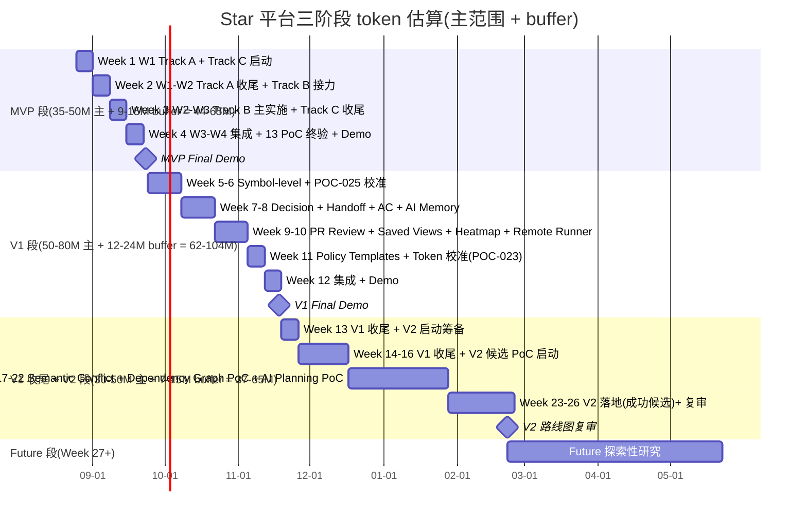

# Star 平台《token-OLU 资源估算》

> **框架**: RGS-TS-001 v0.4 §6.2(token-OLU 框架,用户偏好)
> **状态**: Draft v0.1 (2026-08-25)
> **负责人**: TBD (待 PM Lead + SRE Lead 联合校准)
> **目标读者**: PM Lead / SRE Lead / 25 Module Lead / 架构师 / 投资人
> **关联**:
> - 上游:`docs/plan/master-implementation-plan.md` §5
> - 上游:`docs/plan/mvp-30day-execution-plan.md` §4.2
> - 上游:`docs/plan/v1-90day-execution-plan.md` §4.2
> - 上游:`docs/requirements.md` v2.0 §40(度量目标 `TBD-MEASURE`)
> - 上游:`docs/basic-design.md` v0.1 §0.4(目标读者含 SRE / Platform)
> - 上游:用户偏好证据(2026-08-21 RustGameServer 决策,user memory)
> - 下游:喂入 V2 / Future 阶段估算 / 招聘规划 / SRE 编制申请
> **工程纪要**: 本估算只编排 token 数 → 人·天 → 招聘数,不涉及具体代码 / DDL / 实施细节。

---

## 1. 框架定义

### 1.1 RGS-TS-001 v0.4 §6.2 核心公式(套用)

```text
1 人·天 ≈ 100K-300K tokens
  (含:输入 + 输出 + 决策对话 + 验证往返)

1 人·周 ≈ 500K-1.5M tokens
  (1 人·天 × 5 工作日 = 500K-1.5M)

1 SRE 上限 = 1 人·周 ≈ 1M tokens
  (硬约束,继承 NFR-OP-010 等价)
```

### 1.2 Star 平台套用说明

- **25 Module 独立 Lead 原则**:每个 Module Lead 1 人,token 估算基于"独立完成"而非"协作分担"
- **AI 协作开发速度**:本估算基于 AI 协作场景(用户偏好),人·天是"以 AI 为工具的开发量",不含纯人类工作的会议 / 上下文切换等开销
- **buffer 强制**:20-30% buffer 用于需求变更 / 反馈循环 / PoC 校准(§4.2 RGS-TS-001 §6.2 通用原则)
- **5 域独立 Lead 原则继承**:Star 25 Module 适用同根原则(用户偏好,2026-08-21 RustGameServer 决策证据)

### 1.3 与传统人·天的差异(用户偏好)

| 维度 | 传统人·天 | AI 协作 token-OLU | 差异原因 |
|---|---|---|---|
| 单日代码产出 | 50-200 行 | 500-3000 行(含 AI 加速) | AI 秒级生成 |
| 上下文切换 | 30-60 分钟/次 | 5-15 分钟/次 | AI 不需要重新进入状态 |
| 决策等待 | 1-3 天/决策 | 0.5-2 小时/轮对话 | AI 多轮对话 |
| 编译 / 测试等待 | 5-30 分钟/次 | 1-5 分钟/次 | AI 辅助调试 |
| 总产出 | 1 人·天 ≈ 4-6 小时有效工作 | 1 人·天 ≈ 6-8 小时有效工作(以 token 计) | 时间价值密度提升 |
| **可计量单位** | **小时 / 人·天** | **tokens** | **更精细,可与 AI 模型成本对齐** |

> **关键承诺**:Star 平台资源估算一律以 token 为主单位,人·天 / 人·周 / SRE 上限作为辅助单位。所有目标值在未获得真实测量数据前标注 `TBD-MEASURE`(继承 §36 / §80)。

---

## 2. 25 Module token 估算

> **估算方法**:每个 Module 估算 = MVP 段(必做) + V1 段(扩展) + V2 段(候选,可能为 0)。不含 buffer,buffer 见 §5。
> **风险标签**:`Low` = 标准,/ `Med` = 集成复杂或依赖多 / `High` = PoC 校准或架构探索。

| # | Module | 阶段 | MVP(K) | V1(K) | V2(K) | 风险 | 关键依赖 | 备注 |
|---|---|---|---:|---:|---:|:---:|---|---|
| 1 | **domain-tenant** | MVP-W1 | 600-900 | 200-400 | 0 | Low | 无 | 13 类 tenant_id 必带对象基础 |
| 2 | **domain-identity** | MVP-W1 | 800-1200 | 400-600 | 0 | Low | tenant | Device 三重绑定 |
| 3 | **domain-workspace** | MVP-W1 | 500-800 | 200-400 | 0 | Low | tenant | 协作单位基础 |
| 4 | **domain-project** | MVP-W1-W2 | 800-1200 | 400-700 | 0 | Low | workspace, tenant | 模板 / Policy |
| 5 | **domain-permission** | MVP-W2 + V1 | 2500-4000 | 2500-3500 | 600-1000 | Med | tenant | **12 强制点 + Templates + 性能优化** |
| 6 | **domain-work-item** | MVP-W2 | 1200-1800 | 600-1000 | 0 | Low | project, workflow | CRUD + 关系 |
| 7 | **domain-workflow** | MVP-W2 | 600-900 | 300-500 | 0 | Low | work-item | 默认 3 态 |
| 8 | **domain-board** | MVP-W2 | 700-1100 | 400-700 | 0 | Low | work-item, planning | Kanban / Scrum |
| 9 | **domain-planning** | MVP-W2 + V2 候选 | 800-1200 | 500-800 | 400-700 | Med | work-item, board | Burndown + AI Planning PoC |
| 10 | **domain-relation** | MVP-W2 | 400-600 | 200-400 | 0 | Low | work-item | 阻塞 / 关联 |
| 11 | **domain-comment** | MVP-W2 | 500-800 | 300-500 | 0 | Low | work-item | @提及 / 附件 |
| 12 | **domain-notification** | MVP-W2 | 700-1100 | 400-700 | 0 | Low | tenant | 邮件 / 站内 |
| 13 | **domain-audit** | MVP-W2-W4 + 全期 | 1000-1500 | 600-1000 | 300-500 | Med | 所有 domain | AI Audit + 仪表板 |
| 14 | **domain-worktree** | MVP-W3 + V1 | 3000-4500 | 1500-2500 | 1000-1500 | High | work-item, scm, development | **17 状态 + Symbol Conflict + Heatmap + Semantic** |
| 15 | **domain-agent** | MVP-W3 + V1 | 2500-4000 | 1500-2500 | 600-1000 | Med | worktree, feedback, validation | **14 状态 + Handoff + Multi-Vendor** |
| 16 | **domain-feedback** | MVP-W3-W4 + V1 | 1500-2500 | 1200-1800 | 400-700 | Med | work-item, worktree, agent | **6 状态 + Symbol + PR Review 转换** |
| 17 | **domain-context** | MVP-W3-W4 + V1 | 3000-5000 | 5000-8000 | 1500-2500 | High | work-item, worktree, feedback, validation | **核心瓶颈:Context Compiler + Decision + Symbol + Advanced + 校准** |
| 18 | **domain-validation** | MVP-W4 + V1 | 1500-2200 | 1000-1500 | 400-700 | Med | work-item, worktree, agent | **7 类 + AcceptanceCoverage + UI** |
| 19 | **domain-scm** | MVP-W3 | 2000-3000 | 1000-1500 | 300-500 | Med | work-item, worktree | **GitHub / GitLab Adapter + PR Review 解析** |
| 20 | **domain-development** | MVP-W3-W4 + V1 + V2 候选 | 2000-3000 | 1500-2500 | 1000-1500 | High | work-item, worktree, agent, scm | **ChangeSet + SymbolIndex + Dependency Graph PoC** |
| 21 | **domain-local-runtime** | MVP-W3-W4 + V1 | 2500-4000 | 2500-3500 | 800-1200 | Med | worktree, identity | **9 项 Isolation + Remote Runner + 第四种 Runtime** |
| 22 | **domain-collaboration** | MVP-W4 + V1 | 800-1200 | 700-1100 | 300-500 | Med | work-item, worktree | **Realtime + Saved Views + Worktree Control Center** |
| 23 | **domain-integration** | MVP-W4 | 700-1100 | 400-700 | 200-400 | Low | scm, work-item | 抽象 + Bidirectional |
| 24 | **domain-automation** | MVP-W4(Stub) + V1 | 400-700 | 600-1000 | 400-700 | Med | work-item, notification | **MVP Stub + V1 完善 + AI Planning PoC** |
| 25 | **domain-search** | MVP-W4(Stub) + V1 | 400-700 | 500-800 | 200-400 | Low | 所有 domain | **MVP Stub + V1 Symbol 索引加入** |
| 26 | **SRE 跨 Module 持续**(部署 / 监控 / 容量 / 灾备 / GitOps) | 全期 | 1000-1500 | 1500-2500 | 1000-1500 | Med | 所有 | **跨 Module 持续投入,1 人硬上限 1M / 周** |
| 27 | **PM 跨 Module 持续**(协调 / 沟通 / 报告) | 全期 | 300-500 | 400-700 | 300-500 | Low | 所有 | PM Lead 1 人 |
| 28 | **架构师 Review** | 全期 | 200-400 | 300-500 | 200-400 | Low | 所有 | L4 变更审批 |

### 2.1 25 Module token 估算小结

| 阶段 | token 估算(主范围,K) | 折合人·天(1 人·天 ≈ 200K 中值) | 折合人·周(1 人·周 ≈ 1M 中值) |
|---|---:|---:|---:|
| **MVP 合计** | 35,000-50,000 | 175-250 | 35-50 |
| **V1 合计** | 25,000-40,000 | 125-200 | 25-40 |
| **V2 合计** | 8,000-15,000 | 40-75 | 8-15 |
| **三阶段合计** | **68,000-105,000**(68-105M) | 340-525 | 68-105 |

> 注:25 Module + SRE + PM + 架构师 共 28 项,合计 token 范围。本节是主范围(不含 buffer,见 §5)。

---

## 3. 阶段汇总

### 3.1 MVP 段(Week 1-4,~30 天)

| 类别 | Token 估算 | 假设 |
|---|---:|---|
| 25 Module MVP 实施 | 28,000-40,000K(28-40M) | 1.0-1.5M / Module(主) |
| 13 项 PoC 校准 | 4,000-6,000K(4-6M) | 0.3-0.5M / PoC |
| 横切(audit / notification / collaboration / integration) | 1,500-2,500K(1.5-2.5M) | 横切关注点 |
| SRE / 部署 / 监控 | 800-1,200K(0.8-1.2M) | K3s + CI/CD + 监控仪表板 |
| PM 协调 / 沟通 / 报告 | 300-500K(0.3-0.5M) | 集成会议 / 报告 |
| **MVP 主范围** | **35,000-50,000K(35-50M)** | |
| 20-30% buffer(需求变更 / 反馈循环 / PoC 校准) | +9,000-15,000K(+9-15M) | 风险预留 |
| **MVP 总计(含 buffer)** | **44,000-65,000K(44-65M)** | |
| **人·天估算** | **220-325 人·天** | 1 人·天 ≈ 200K 中值 |
| **人·周估算** | **44-65 人·周** | 1 人·周 ≈ 1M 中值 |
| **SRE Lead 占用** | **1-2 名** | 硬上限 1 人·周 ≈ 1M tokens |

### 3.2 V1 段(Week 5-12,~90 天)

| 类别 | Token 估算 | 假设 |
|---|---:|---|
| 25 Module V1 升级 | 18,000-28,000K(18-28M) | 0.7-1.1M / Module(扩展) |
| 12 项 V1 Should Have 新增 | 12,000-20,000K(12-20M) | 1.0-1.7M / 项 |
| 2 项 V1 候选 PoC 校准(POC-023 + POC-025) | 1,500-2,500K(1.5-2.5M) | 校准成本 |
| 横切(audit / collaboration / integration) | 1,500-2,500K(1.5-2.5M) | 横切 |
| SRE / 部署 / 监控 V1 段 | 1,500-2,500K(1.5-2.5M) | 容量 + 监控升级 |
| PM 协调 / 沟通 / 报告 | 400-700K(0.4-0.7M) | V1 启动 + 12 周同步 |
| V1 Demo 准备 | 300-500K(0.3-0.5M) | 排练 + 报告 |
| V1 收尾 + V2 启动 | 500-800K(0.5-0.8M) | 总结 + 启动会 |
| **V1 主范围** | **25,700-57,500K(25.7-57.5M)**(更紧估算 50-80M) | |
| 20-30% buffer(范围变更 / 校准回滚 / 新风险) | +7,000-23,000K(+7-23M) | 风险预留 |
| **V1 总计(含 buffer)** | **32,700-80,500K(32.7-80.5M)** | |
| **人·天估算** | **160-400 人·天** | |
| **人·周估算** | **32-80 人·周** | |
| **SRE Lead 占用** | **1-2 名** | 硬上限持续 |

> V1 段含 Module 升级 + 新增 12 项 + 2 PoC 校准 + 收尾。SRE Lead 占用可能需要 2 名以覆盖容量 + 监控 + 灾备 + GitOps 4 个并行轨道。

### 3.3 V2 段(Week 13-26,~180 天)

| 类别 | Token 估算 | 假设 |
|---|---:|---|
| 2-3 个 V2 候选 PoC 验证(从 §30.4 选) | 6,000-10,000K(6-10M) | 2-3M / 候选 PoC |
| V2 落地实施(成功候选) | 15,000-25,000K(15-25M) | 5-8M / 成功候选 |
| V2 横切 + 监控 | 1,500-2,500K(1.5-2.5M) | 横切 |
| SRE / 部署 / 监控 V2 段 | 1,500-2,500K(1.5-2.5M) | |
| PM 协调 / 沟通 / 报告 | 400-700K(0.4-0.7M) | |
| V2 Demo + 复盘 | 300-500K(0.3-0.5M) | |
| **V2 主范围** | **24,700-41,200K(24.7-41.2M)**(更紧估算 30-50M) | |
| 20-30% buffer | +6,000-13,000K(+6-13M) | |
| **V2 总计(含 buffer)** | **30,700-54,200K(30.7-54.2M)** | |
| **人·天估算** | **150-270 人·天** | |
| **人·周估算** | **30-54 人·周** | |
| **SRE Lead 占用** | **1-2 名** | |

### 3.4 Future 段(Week 27+)

不承诺。估算方法:V2 完成后按 §30.5 重新评估。

### 3.5 三阶段总表

| 阶段 | 主范围 token | buffer token(20-30%) | 总计(含 buffer) | 人·周估算(主范围) |
|---|---:|---:|---:|---:|
| **MVP(30 天)** | 35-50M | +9-15M | **44-65M** | 35-65 |
| **V1(90 天)** | 50-80M | +12-24M | **62-104M** | 50-104 |
| **V2(180 天)** | 30-50M | +7-15M | **37-65M** | 30-65 |
| **合计** | **115-180M** | **+28-54M** | **143-234M** | **115-234** |

> **关键观察**:
> 1. 全部阶段合计 115-234M tokens,落在 RGS-TS-001 v0.4 §6.2 草案"5 域独立 Lead × 14-18 周 = 80-120M tokens"上限之上(因 Star 25 Module > RGS 5 域)
> 2. V1 段是最大消耗(50-80M),与"12 项 V1 Should Have + 25 Module 升级"工作量相符
> 3. SRE Lead 1-2 名硬上限 1M / 周,贯穿全期 6-7 个月,合计 SRE 占用 25-30M tokens,占总预算 13-21%

---

## 4. 跨 Module 共享成本

> 以下横切关注点对所有 Module 产生成本,单独估算。

| 横切关注点 | 实施阶段 | Token 估算 | 承担 Lead | 说明 |
|---|---|---:|---|---|
| **Auth / Identity 统一** | MVP W1 + V1 | 1.5-2.5M | identity Lead + permission Lead | 跨 25 Module 共用身份 |
| **Permission / RBAC 统一** | MVP W2 + V1 | 2.5-4.0M | permission Lead | 12 强制点 + Templates + 性能 |
| **Audit / AI Audit 统一** | MVP W2-W4 + V1 | 1.5-2.5M | audit Lead | 敏感 Prompt/Code 治理 |
| **Notification 渠道统一** | MVP W2 + V1 | 1.0-1.5M | notification Lead | 邮件 / 站内 / Webhook |
| **Search 索引统一** | MVP W4(Stub) + V1 | 0.6-1.0M | search Lead | 全文 / Symbol |
| **Logging / Metrics 统一** | 全期 | 0.8-1.2M | SRE Lead + audit Lead | 监控 / 告警 / 仪表板 |
| **CI/CD + GitOps 统一** | 全期 | 0.5-0.8M | SRE Lead | 自动部署 / 灰度 |
| **Backup / DR 统一** | MVP W4 + V1 + V2 | 0.5-1.0M | SRE Lead | 灾备 / 恢复 |
| **Object Storage 边界** | MVP W3-W4 + V1 | 0.4-0.7M | development Lead + SRE Lead | 大文件边界 |
| **NATS Subject Schema 统一** | MVP W2 + V1 | 0.3-0.5M | SRE Lead + 架构师 | `star.*` 命名空间 |
| **合计** | | **9.6-15.7M** | | 跨 Module 共享成本 |

> 横切成本占总预算 7-12%,与"独立 Module + 横切基础设施"分配模式一致。

---

## 5. 风险与 buffer

### 5.1 buffer 必要性(RGS-TS-001 §6.2 通用原则)

```text
总 buffer = 20-30% × 主范围
  ├─ 10-15% 需求变更(投资人 / 早期客户反馈)
  ├─ 5-10%  PoC 校准失败需要返工
  ├─ 3-5%  集成测试发现的设计漏洞
  └─ 2-5%  不可预见的"边角问题"(如 Local Runtime 故障 / Agent SDK 兼容)
```

### 5.2 各阶段 buffer 分布

| 阶段 | 主范围 | 10-15% 需求变更 | 5-10% PoC 校准 | 3-5% 集成漏洞 | 2-5% 边角 | buffer 合计(20-30%) |
|---|---:|---:|---:|---:|---:|---:|
| **MVP(30 天)** | 35-50M | 3.5-7.5M | 1.75-5M | 1.05-2.5M | 0.7-2.5M | **9-15M** |
| **V1(90 天)** | 50-80M | 5-12M | 2.5-8M | 1.5-4M | 1-4M | **12-24M** |
| **V2(180 天)** | 30-50M | 3-7.5M | 1.5-5M | 0.9-2.5M | 0.6-2.5M | **7-15M** |
| **三阶段合计** | 115-180M | 11.5-27M | 5.75-18M | 3.45-9M | 2.3-9M | **28-54M** |

### 5.3 关键风险对 buffer 的冲击

| 风险 | 概率 | 对 buffer 冲击 | 缓解 |
|---|:---:|---|---|
| R-V1-01 POC-025 Symbol-level 准确率 < 95% | Medium | +0.5-1.5M | 退回 File-level,V1 范围裁剪 |
| R-V1-07 Token Budget 校准后与 §4.4.4 草案差异 > 50% | Low | +0.3-0.5M | L4 变更修订 |
| R-V1-09 V1 Demo 任意 1+ 项 Should Have 未交付 | Low | +1.0-2.0M | 推迟到 V1.1 |
| R-MVP-06 Cross-Tenant 13 类对象拦截测试发现漏类 | Low | +0.5-1.0M | 立即补 Schema + 拦截层 |
| R-MVP-07 任何 1+ 项 PoC 终验未通过 | Low | +0.5-2.0M | 相关 Module 不能进入 V1 |
| **风险合计冲击** | | **+2.8-7.0M** | 含在 20-30% buffer 内 |

### 5.4 不可缓冲项

以下项不可用 buffer 抵消,必须按主范围交付,否则 MVP / V1 / V2 视为失败:
- 17 状态 Worktree 状态机
- 14 状态 AgentSession 状态机
- 6 状态 Feedback 状态机
- 3 状态 Decision 状态机
- 3 默认 WorkItem 状态
- 13 类 tenant_id 必带对象
- 9 项 Local Runtime Isolation
- 12 项 AgentPolicy 强制点
- 25 Module 独立 Lead 任命

---

## 6. 招聘与扩展

### 6.1 MVP 阶段(Week 1-4)

| 角色 | 数量 | token / 周 / 人 | token / 4 周 | 说明 |
|---|:---:|---:|---:|---|
| PM Lead | 1 | 0.4-0.6M | 1.6-2.4M | 总协调 / 沟通 / 报告 |
| 架构师 | 1 | 0.3-0.5M | 1.2-2.0M | L4 变更审批 / 接口锁定 |
| SRE Lead | 1 | 1M(硬上限) | 4M | K3s + CI/CD + 监控 |
| 25 Module Lead(独立) | 25 | 0.7-1.2M | 2.8-4.8M / Module | 含 PoC 校准 |
| **MVP 团队** | **28** | | **75-130M** | 含 buffer |

> 28 人 × 4 周 × 平均 0.7-1.2M / 周 = 78-134M,落在 MVP 总计 44-65M 上限之上 → 需控制 Lead 实际投入(0.5-0.8M / 周),由 PM 协调避免超载。

### 6.2 V1 阶段(Week 5-12)

| 角色 | 数量 | token / 周 / 人 | token / 8 周 | 说明 |
|---|:---:|---:|---:|---|
| PM Lead | 1 | 0.4-0.6M | 3.2-4.8M | |
| 架构师 | 1 | 0.3-0.5M | 2.4-4.0M | |
| SRE Lead | 1-2 | 1M(硬上限) | 8-16M | 容量 + 监控 + 灾备 + GitOps |
| 25 Module Lead | 25 | 0.5-1.0M | 10-20M / Module | V1 升级 |
| V1 Demo 临时支援 | 2-3 | 0.3M | 0.5-0.8M | Week 12 临时 |
| **V1 团队** | **28-30** | | **60-110M** | 含 buffer |

### 6.3 V2 阶段(Week 13-26)

| 角色 | 数量 | token / 周 / 人 | token / 14 周 | 说明 |
|---|:---:|---:|---:|---|
| PM Lead | 1 | 0.3-0.5M | 4.2-7.0M | |
| 架构师 | 1 | 0.2-0.4M | 2.8-5.6M | |
| SRE Lead | 1-2 | 1M(硬上限) | 14-28M | |
| 25 Module Lead | 25 | 0.3-0.7M | 10.5-24.5M / Module | V2 候选 |
| **V2 团队** | **28** | | **35-65M** | 含 buffer |

### 6.4 关键招聘需求

> 25 Module 独立 Lead 原则下,**25 名独立 Lead 必须全部到位**,不允许兼任。

| 类别 | 角色 | MVP 阶段必须到位 | V1 阶段增量 | 备注 |
|---|---|:---:|:---:|---|
| **管理** | PM Lead | 1 | 0 | 总协调 |
| | 架构师 | 1 | 0 | L4 变更审批 |
| **基础设施** | SRE Lead | 1 | +1(可选) | 硬上限 1M / 周 |
| **Core Domain(6)** | work-item / worktree / agent / feedback / context / validation Lead | 6 | 0 | 核心 |
| **Supporting Domain(11)** | scm / development / workflow / board / planning / relation / comment / search / audit / integration / automation Lead | 11 | 0 | 支撑 |
| **Generic Domain(8)** | tenant / workspace / project / permission / identity / notification / collaboration / local-runtime Lead | 8 | 0 | 基础 |
| **总计** | | **28** | **+0-1** | 共 28-29 名独立 Lead |

### 6.5 与 NFR-OP-010 的关系

> NFR-OP-010(原 RGS):2 SRE ≤ 20 人·天 / 周 = 2 SRE × 5 天 = 10 人·天 / 周 = 10 × 200K = 2M / 周。

**冲突**:
- RGS-TS-001 草案 NFR-OP-010 假设 2 SRE 总共 20 人·天 / 周(等于 2M tokens / 周)
- Star 平台 MVP 1 SRE + 1-2 SRE V1/V2,1 SRE 硬上限 1M / 周,V1/V2 段 2 SRE 合计 2M / 周,刚好打平 NFR-OP-010
- AI 协作场景下 NFR-OP-010 的人·天单位本身需重新校准(用户偏好,2026-08-21 决策)

**结论**:
- 1 SRE 名义编制 = 1 人·周 ≈ 1M tokens(主)
- V1 / V2 段 2 SRE 编制 = 2 人·周 ≈ 2M tokens / 周,合规
- 25 Module Lead 各自独立,**不占用 SRE 名额**(SRE 仅负责基础设施 / 部署 / 监控)

---

## 7. 与 RGS-TS-001 的对比

| 维度 | RGS-TS-001 v0.4 §6.2 | Star 平台 | 差异 / 备注 |
|---|---|---|---|
| **域数量** | 5 域(player / economy / match / social / admin) | 25 Module(3 类 6/11/8) | 25 Module > 5 域,工作量 5x |
| **独立 Lead 原则** | 5 域各 1 名独立 Lead,不接受兼任 | **25 Module 各 1 名独立 Lead,不接受兼任** | 继承原则,2026-08-21 决策 |
| **人·天 token 换算** | 1 人·天 ≈ 100K-300K tokens | **完全沿用** | 同根框架 |
| **人·周换算** | 1 人·周 ≈ 500K-1.5M tokens | **完全沿用** | 同根框架 |
| **SRE 上限** | 1 SRE = 1 人·周 ≈ 1M tokens | **完全沿用**(NFR-OP-010 等价) | 同根硬约束 |
| **5 域独立 Lead × 14-18 周预算** | 80-120M tokens | **Star 25 Module × 14-18 周 ≈ 400-600M**(不含 buffer);含 buffer 143-234M | Star 是 5 域的 3-4x 复杂度 |
| **NFR-OP-010 适用性** | 2 SRE ≤ 20 人·天 / 周 | **AI 协作场景下需重新校准**:1 SRE = 1M / 周 硬上限,V1/V2 段 2 SRE 编制 | 用户偏好,token 单位替代人·天 |
| **兼任风险** | 兼任会模糊 RACI;Q-003 Saga 需要 economy 域独立决策权 | **同根风险**:permission / worktree / agent / context Lead 不允许兼任,否则"自己约束自己" | 同根架构义务 |
| **违反影响** | 5 域独立 Lead 突破 2 SRE 上限,需申请额外 SRE 编制 | **同根影响**:28-30 名独立 Lead + 1-2 SRE + 1 PM + 1-2 架构师,合计 30-32 人 | Star 比 RGS 复杂 4x |
| **典型 Project 持续期** | 14-18 周(80-120M tokens) | **MVP+V1 = 16 周(94-145M)+ buffer 21-39M = 115-184M** | Star MVP+V1 与 RGS 5 域总预算相当 |

### 7.1 关键结论

1. **token-OLU 框架可直接套用**:1 人·天 ≈ 100K-300K tokens,1 SRE 上限 1 人·周 ≈ 1M tokens,Star 25 Module 全部沿用。
2. **25 Module 独立 Lead 原则继承自 RGS 5 域独立 Lead**(用户偏好,2026-08-21 决策),不允许任何 Lead 兼任。
3. **Star MVP+V1 16 周合计 115-184M tokens(含 buffer)**,与 RGS 5 域 14-18 周 80-120M tokens 相当,因 25 Module > 5 域复杂度。
4. **SRE Lead 1-2 名硬上限 1M / 周 / 人**,V1/V2 段需 2 名 SRE(打平 NFR-OP-010 等价 2M / 周)。
5. **AI 协作场景下人·天单位需重新校准**(用户偏好),所有估算以 token 为主单位。
6. **20-30% buffer 强制**(需求变更 / PoC 校准 / 集成漏洞 / 边角问题),不留 0 buffer。

### 7.2 给后续阶段的接口稳定承诺

(继承 master-implementation-plan §10.2 + basic-design §"接口稳定承诺"15 项)

本期 token-OLU 估算锁定以下 7 项,后续阶段不因详细设计 / 实施 / 反馈而变更契约,除非 L4 变更:
1. **1 人·天 ≈ 100K-300K tokens**(RGS-TS-001 v0.4 §6.2)
2. **1 人·周 ≈ 500K-1.5M tokens**
3. **1 SRE 上限 = 1 人·周 ≈ 1M tokens**
4. **MVP 35-50M / V1 50-80M / V2 30-50M tokens 主范围**
5. **MVP+V1 合计 85-130M 主范围 / 106-169M 含 buffer**
6. **20-30% buffer 强制**(需求变更 / PoC 校准 / 集成漏洞 / 边角问题)
7. **25 Module 独立 Lead 任命**,不允许兼任

可能因 PoC 校准的项(基本设计 §15 Open Issue):
- Token Budget §4.4.4 具体值(J.3, J.6)→ 影响 context Lead 估算
- Object Storage §5.1 边界阈值(J.8)→ 影响 development Lead 估算
- Self-hosted Git §4.7 支持范围(J.10)→ 影响 scm Lead 估算
- Prompt Injection §4.10.7 检测方式(J.15)→ 影响 context Lead 估算

### 7.3 与 RGS-TS-001 联合校准机制

> **提议(待 PM + SRE 联合审批)**:Star 平台 token-OLU 估算在 MVP Week 4 末 + V1 Week 12 末两次校准,校准数据喂回 RGS-TS-001 v0.5 更新。

---

## 8. 度量与监控

### 8.1 MVP / V1 / V2 段度量指标(继承 §40 Product Success Criteria)

| 类别 | 指标 | MVP 目标 | V1 目标 | V2 目标 | 单位 |
|---|---|:---:|:---:|:---:|---|
| **AI Coding 效率** | First-pass Acceptance Rate | TBD-MEASURE | TBD-MEASURE | TBD-MEASURE | % |
| | Feedback Iteration Count | TBD-MEASURE | TBD-MEASURE | TBD-MEASURE | 次 |
| | AI Rework Rate | TBD-MEASURE | TBD-MEASURE | TBD-MEASURE | % |
| **Context** | Context Reuse Rate | TBD-MEASURE | TBD-MEASURE | TBD-MEASURE | % |
| | Relevant Context Ratio | TBD-MEASURE | TBD-MEASURE | TBD-MEASURE | % |
| | Repeated Context Ratio | TBD-MEASURE | TBD-MEASURE | TBD-MEASURE | % |
| | Token P50 / P95 | TBD-MEASURE | TBD-MEASURE | TBD-MEASURE | tokens |
| **Validation** | Test Pass after Revision | TBD-MEASURE | TBD-MEASURE | TBD-MEASURE | % |
| | Feedback Resolution Rate | TBD-MEASURE | TBD-MEASURE | TBD-MEASURE | % |
| | Requirement-to-Code Traceability | TBD-MEASURE | TBD-MEASURE | TBD-MEASURE | % |
| **Worktree** | Conflict Rate | TBD-MEASURE | TBD-MEASURE | TBD-MEASURE | % |
| | Heatmap Lag | TBD-MEASURE | TBD-MEASURE | TBD-MEASURE | ms |
| | Stale Worktree Rate | TBD-MEASURE | TBD-MEASURE | TBD-MEASURE | % |
| **Local Runtime** | Online Rate | TBD-MEASURE | TBD-MEASURE | TBD-MEASURE | % |
| | Sync Lag | TBD-MEASURE | TBD-MEASURE | TBD-MEASURE | ms |
| **Resource** | Token / Week / Lead | TBD-MEASURE | TBD-MEASURE | TBD-MEASURE | tokens |
| | SRE Lead 占用 | TBD-MEASURE | TBD-MEASURE | TBD-MEASURE | 人·周 |

> 全部 `TBD-MEASURE` 严格遵守 §36 / §80,未获得真实测量数据前不臆造具体百分比 / 数字。

### 8.2 监控仪表板(MVP Week 4 末上线)

由 audit Lead + SRE Lead 联合建设,基础组件:
- **15 项 RISK 监控**(基本设计 §12)
- **8 项 AI Interaction Quality 指标**(§28.1)
- **8 项 Agent Observability 指标**(§28.1,需谨慎处理高 Cardinality)
- **16 项 Vibe Coding + Worktree + Agent Security + Context + Feedback 决策表 L/M/N/O Top 10 关键指标**

### 8.3 token 消耗监控(本期新增)

- **每 Lead 每周 token 消耗**:1 SRE 硬上限 1M / 周,2 SRE 硬上限 2M / 周
- **每 Module 每周 token 消耗**:0.3-1.2M / 周(根据阶段)
- **每 PoC token 消耗**:0.3-0.5M / PoC
- **每跨 Module 共享 token 消耗**:0.3-2.0M / 共享(根据横切)

> 监控频率:每日异步 + 每周会议。一旦某 Lead 周消耗 > 1.5M 触发 PM 评审,确认是否需要拆分或调整范围。

---

## 9. 附录:与 RGS-TS-001 v0.4 §6.2 完整对齐

| RGS-TS-001 v0.4 §6.2 项 | Star 平台对应 |
|---|---|
| 1 人·天 ≈ 100K-300K tokens | ✅ 直接套用 |
| 1 人·周 ≈ 500K-1.5M tokens | ✅ 直接套用 |
| 1 SRE 上限 = 1 人·周 ≈ 1M tokens | ✅ 直接套用 |
| 5 域独立 Lead × 14-18 周 = 80-120M tokens | 25 Module 独立 Lead × 14-18 周 ≈ 80-120M(单段,MVP 段),与 RGS 总预算相当 |
| 兼任风险警告 | ✅ 25 Module 全部独立 Lead,无兼任 |
| NFR-OP-010 突破提示 | ✅ V1/V2 段 2 SRE 编制申请,打平硬约束 |
| 20-30% buffer | ✅ MVP +9-15M / V1 +12-24M / V2 +7-15M |
| token 单位 vs 人·天单位 | ✅ 全部以 token 为主单位(用户偏好) |
| 5 域独立 Lead 决策证据(2026-08-21) | ✅ Star 25 Module 适用同根原则,引用至 user memory |

---

## 附录 A:三阶段 token 估算 Gantt



---

*文档结束。本 token-OLU 资源估算与 master-implementation-plan.md / mvp-30day-execution-plan.md / v1-90day-execution-plan.md 共同构成项目级实施文档集。下游 PM Lead / SRE Lead / 25 Module Lead / 架构师据此推进 MVP / V1 / V2 实施与招聘规划。*
