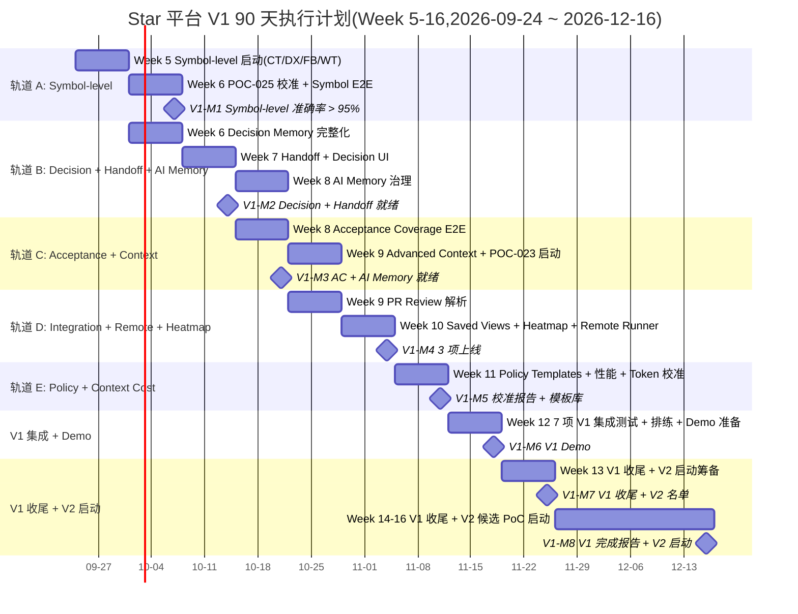

# Star 平台《V1 90 天执行计划》

> **状态**: Draft v0.1 (2026-08-25)
> **周期**: 2026-09-24 ~ 2026-12-22(Week 5-16,60-66 工作日,12 周)
> **负责人**: TBD (待 PM Lead 指派)
> **目标读者**: 25 Module Lead / SRE Lead / PM Lead / 架构师 / 投资人
> **关联**:
> - 上游:`docs/plan/master-implementation-plan.md` §2.2
> - 上游:`docs/requirements.md` v2.0 §30.3(12 项 V1 Should Have)
> - 上游:`docs/basic-design.md` v0.1 §13.2
> - 上游:`docs/plan/mvp-30day-execution-plan.md`(本计划起点)
> - 上游:`docs/specs/domain-*-spec.md` V1 扩展
> - 上游:`docs/poc/poc-023, poc-025`(V1 候选 2 项 PoC)
> - 上游:`docs/plans/plan-016~030` V1 段任务(WT-101~105 / POL-101~105 等)
> - 下游:产出喂入 `docs/plan/token-olu-estimate.md` V1 段
> **工程纪要**: 本计划不写代码 / DDL / OpenAPI,只编排 Week-by-Week 任务、Owner、依赖、风险、退出标准。

---

## 0. 目标

1. **交付 §30.3 V1 Should Have 全部 12 项**:Symbol-level Feedback / Symbol-level Conflict / Decision Memory / Agent Handoff / Acceptance Coverage UI / Advanced Context Selection / PR Review Feedback Import / Saved Worktree Views / Development Heatmap Phase 1 / Agent Policy Templates / Remote Runner / Context Cost Analysis
2. **完成 2 项 V1 候选 PoC 校准**:POC-023(Context Packet Size / Relevance)+ POC-025(Symbol-level Feedback 准确率)
3. **25 Module 全部升级到 V1 状态**(从 MVP 切到 V1)
4. **集成 Demo 全链路 V1 增强版跑通**
5. **15 项 RISK 监控全部 V1 增强版运行**(RISK-024/025 校准 Token Budget,RISK-026 校准 Feedback Quality)
6. **V2 候选 PoC 启动会就绪**(Week 14 末)
7. **保持 25 Module 独立 Lead 原则**(Week 5 起若有人退出,严格按 master-implementation-plan §10 流程任命新 Lead)

---

## 1. Week-by-Week 任务分解

> **任务 ID 命名**:`V{Week}-{Module}-{序号}`,如 `V05-CT-01` = Week 5 上下文相关任务 01。
> **周期语义**:Week 5 = MVP Day 31-37,Week 12 = MVP Day 78-84(即 V1 Final Demo),Week 13-16 = V1 收尾 + V2 启动筹备。

### Week 5(2026-09-24 ~ 09-30)— Symbol-level 演进启动

| 任务 ID | 任务 | Owner Lead | 依赖(MVP 段) | Token 估算 | 验收 |
|---|---|---|---|---:|---|
| **V05-PM-01** | V1 启动会 + 25 Lead V1 任务承诺书签字 | PM Lead | M30-FINAL-02 | 80K | 25 签字 |
| **V05-ARCH-01** | 架构师 V1 范围评审 + 接口稳定承诺 15 项核查 | 架构师 | MVP | 120K | 15 项核查报告 |
| **V05-CT-01** | context Symbol-level 索引(Rust / TypeScript / Python 三语言) | context Lead | M11-DX-04 | 500K | 3 语言解析 > 95% 准确率 |
| **V05-DX-01** | development Symbol Detection 升级到 V1 完整版(语义 / Reference / Dependency) | development Lead | V05-CT-01 | 600K | Reference 解析通 |
| **V05-FB-01** | feedback Feedback Target = Symbol 完整化(11 → 12+ 类型) | feedback Lead | V05-CT-01 | 350K | 12+ 类型可创建 |
| **V05-WT-01** | worktree Symbol-level Conflict Detection 启动(POC-025 子集) | worktree Lead | V05-DX-01, V05-FB-01 | 400K | Symbol 冲突可识别 |
| **V05-SRE-01** | SRE K3s 容量扩展(为 V1 容量压测准备) | SRE Lead | MVP | 250K | 容量规划报告 |
| **V05-AU-01** | audit V1 监控基线(15 RISK 指标 V1 段) | audit Lead + SRE Lead | MVP | 200K | 基线报告 |
| **Week 5 合计** | | | | **2.50M** | |

### Week 6(2026-10-01 ~ 10-07)— Symbol-level 校准 + Decision Memory

| 任务 ID | 任务 | Owner Lead | 依赖 | Token 估算 | 验收 |
|---|---|---|---|---:|---|
| **V06-CT-02** | context Context Compiler Symbol-level 输出(P0-P4 优先级) | context Lead | V05-CT-01 | 450K | Packet 含 Symbol |
| **V06-FB-02** | feedback Precise Feedback Symbol Target E2E 测试 | feedback Lead | V05-FB-01 | 300K | 端到端通 |
| **V06-WT-02** | worktree Symbol Conflict UI 在 Control Center 可见 | worktree Lead + collaboration Lead | V05-WT-01 | 350K | UI 可见 |
| **V06-POC-025** | POC-025 Symbol-level Feedback 准确率实测 | context Lead + development Lead | V06-CT-02 | 400K | **> 95% 准确率(POC-025 终验)** |
| **V06-CT-03** | context Decision Memory 完整化(3 状态 + Create/Supersede/Invalidate) | context Lead | MVP M13-CT-05 | 400K | 3 状态单测 100% |
| **V06-FB-03** | feedback Chat 中重要规则提升为 Decision(§10 / §26.5) | feedback Lead + context Lead | V06-CT-03 | 300K | 提升可演示 |
| **V06-PM-02** | PM Week 6 进度同步 + 风险评审 | PM Lead | V05 | 80K | 报告 |
| **Week 6 合计** | | | | **2.28M** | |

### Week 7(2026-10-08 ~ 10-14)— Decision Memory UI + Agent Handoff

| 任务 ID | 任务 | Owner Lead | 依赖 | Token 估算 | 验收 |
|---|---|---|---|---:|---|
| **V07-CT-04** | context Decision Memory UI(独立管理视图) | context Lead + collaboration Lead | V06-CT-03 | 350K | UI 可查 |
| **V07-AG-01** | agent Handoff Context Packet 完整实现(§24.5 / §52) | agent Lead | V07-CT-04 | 500K | Packet 完整 |
| **V07-AG-02** | agent Agent Handoff 流程 UI(从 Chat 触发) | agent Lead + collaboration Lead | V07-AG-01 | 350K | UI 可演示 |
| **V07-CT-05** | context Context Compiler 优先使用 Active Decision(§26.5) | context Lead | V07-AG-01, V07-CT-04 | 300K | 决策优先级生效 |
| **V07-AU-02** | audit Decision 状态变更审计 | audit Lead | V07-CT-04 | 200K | 审计可查 |
| **V07-FB-04** | feedback Feedback Resolution Rate V1 监控(RISK-026) | feedback Lead + SRE Lead | MVP M23-FB-09 | 200K | 监控上线 |
| **Week 7 合计** | | | | **1.90M** | |

### Week 8(2026-10-15 ~ 10-21)— Acceptance Coverage + AI Memory 治理

| 任务 ID | 任务 | Owner Lead | 依赖 | Token 估算 | 验收 |
|---|---|---|---|---:|---|
| **V08-VL-01** | validation AcceptanceCoverage 完整化(AC → ValidationEvidence 全链路) | validation Lead | MVP M10-VL-02 | 450K | 端到端通 |
| **V08-VL-02** | validation Acceptance Coverage UI | validation Lead + collaboration Lead | V08-VL-01 | 350K | UI 可见 |
| **V08-FB-05** | feedback Feedback 与 Acceptance Coverage 联动(Feedback 解决 = AC 满足证据) | feedback Lead + validation Lead | V08-VL-01, V08-VL-02 | 300K | 联动可演示 |
| **V08-CT-06** | context AI Memory 治理(§26.6):Conversation → Extract → Decision / Feedback / Constraint / Summary | context Lead + feedback Lead | V07-CT-04 | 350K | 提取可演示 |
| **V08-AG-03** | agent Agent Session 收敛到 Decision-only 上下文(不发送全量聊天) | agent Lead | V08-CT-06 | 300K | 上下文收敛 |
| **V08-PM-03** | PM Week 8 进度同步 + 范围守门 | PM Lead | V07 | 100K | 报告 |
| **Week 8 合计** | | | | **1.85M** | |

### Week 9(2026-10-22 ~ 10-28)— Advanced Context Selection + PR Review Import 启动

| 任务 ID | 任务 | Owner Lead | 依赖 | Token 估算 | 验收 |
|---|---|---|---|---:|---|
| **V09-CT-07** | context Advanced Context Selection(ML 辅助或启发式)PoC | context Lead | V08-CT-06 | 500K | PoC 跑通 |
| **V09-CT-08** | context Token Budget P50/P95 实测启动(POC-023) | context Lead + SRE Lead | V09-CT-07 | 400K | **POC-023 启动** |
| **V09-SC-01** | scm PR Review Comment 解析(GitHub / GitLab 双适配) | scm Lead | MVP | 400K | 解析可演示 |
| **V09-FB-06** | feedback PR Review Comment → Feedback 自动转换(V1 增强) | feedback Lead | V09-SC-01 | 350K | 转换可演示 |
| **V09-AU-03** | audit PR Review 链路审计(§28.2 AI Audit) | audit Lead | V09-FB-06 | 200K | 审计完整 |
| **V09-SR-01** | search Symbol 索引加入 search 投影(§12 V1 扩展) | search Lead | V05-CT-01 | 250K | Symbol 可搜 |
| **Week 9 合计** | | | | **2.10M** | |

### Week 10(2026-10-29 ~ 11-04)— Saved Views + Heatmap Phase 1 + Remote Runner

| 任务 ID | 任务 | Owner Lead | 依赖 | Token 估算 | 验收 |
|---|---|---|---|---:|---|
| **V10-COLLAB-01** | collaboration Saved Worktree Views(用户个性化) | collaboration Lead | MVP | 350K | 视图可保存 |
| **V10-COLLAB-02** | collaboration Worktree Control Center Filter/Sort/Group 增强(Group by Agent/Project/Repository) | collaboration Lead | V10-COLLAB-01 | 300K | 增强可演示 |
| **V10-WT-03** | worktree Development Heatmap Phase 1(File-level,§22.4 简化版) | worktree Lead | MVP | 500K | **Heatmap Phase 1 上线** |
| **V10-WT-04** | worktree Heatmap UI 在 Control Center | worktree Lead + collaboration Lead | V10-WT-03 | 300K | UI 可见 |
| **V10-LR-01** | local-runtime Remote Runtime(Self-hosted Runner)类型新增(§23.6) | local-runtime Lead | MVP | 600K | Remote 启动可演示 |
| **V10-LR-02** | local-runtime Remote Runtime 与 Local Runtime 数据模型兼容 | local-runtime Lead | V10-LR-01 | 350K | 兼容可验证 |
| **V10-SRE-02** | SRE Remote Runner 部署手册 + K8s 集成测试 | SRE Lead | V10-LR-01 | 300K | 手册可执行 |
| **Week 10 合计** | | | | **2.70M** | |

### Week 11(2026-11-05 ~ 11-11)— Agent Policy Templates + Context Cost Analysis + Token Budget 校准

| 任务 ID | 任务 | Owner Lead | 依赖 | Token 估算 | 验收 |
|---|---|---|---|---:|---|
| **V11-PERM-01** | permission Agent Policy Templates 库(Project / Tenant) | permission Lead | MVP M18-PERM-POL | 500K | 模板可复用 |
| **V11-PERM-02** | permission Tenant Policy 继承(子 Project 继承 + override) | permission Lead | V11-PERM-01 | 400K | 继承规则 |
| **V11-PERM-03** | permission Policy 性能优化(静态规则预编译,P95 < 50ms) | permission Lead + SRE Lead | V11-PERM-01 | 350K | P95 达标 |
| **V11-PERM-04** | permission Policy 性能分析仪表板(检查 QPS / 拦截率) | permission Lead + audit Lead | V11-PERM-03 | 300K | 仪表板 |
| **V11-CT-09** | context Context Cost Analysis UI(§9) | context Lead + collaboration Lead | V09-CT-08 | 350K | UI 可演示 |
| **V11-CT-10** | context Token Budget §4.4.4 表实测校准(**POC-023 终验**)| context Lead + SRE Lead | V11-CT-09, V09-CT-08 | 500K | **§4.4.4 表 P50/P95 实测值** |
| **V11-PM-04** | PM Week 11 进度同步 + V2 候选 PoC 启动筹备 | PM Lead | V10 | 120K | V2 启动就绪 |
| **Week 11 合计** | | | | **2.52M** | |

### Week 12(2026-11-12 ~ 11-18)— V1 集成预演 + V1 Demo

| 任务 ID | 任务 | Owner Lead | 依赖 | Token 估算 | 验收 |
|---|---|---|---|---:|---|
| **V12-INT-01** | V1 集成测试 #1:Symbol-level Feedback 端到端 | context Lead + feedback Lead | V06 | 200K | 链路通 |
| **V12-INT-02** | V1 集成测试 #2:Decision Memory → Context Compiler | context Lead | V07-V08 | 200K | 链路通 |
| **V12-INT-03** | V1 集成测试 #3:Acceptance Coverage UI 端到端 | validation Lead | V08 | 200K | 链路通 |
| **V12-INT-04** | V1 集成测试 #4:PR Review → Feedback → Agent 修订 → Validation | scm Lead + feedback Lead + agent Lead + validation Lead | V09-V10 | 250K | 链路通 |
| **V12-INT-05** | V1 集成测试 #5:Remote Runner + Local Runtime 并存 | local-runtime Lead + SRE Lead | V10 | 200K | 并存可演示 |
| **V12-INT-06** | V1 集成测试 #6:Heatmap Phase 1 + Saved Views + Agent Policy Templates | worktree Lead + collaboration Lead + permission Lead | V10-V11 | 250K | 集成可演示 |
| **V12-INT-07** | V1 集成测试 #7:Token Budget 校准后的 Context Packet P50/P95 | context Lead + SRE Lead | V11-CT-10 | 200K | 数据达标 |
| **V12-DEMO-01** | V1 排练 #1 | PM Lead + 25 Lead | V12-INT-* | 200K | 排练通 |
| **V12-DEMO-02** | V1 风险评审会(架构师 + 投资人) | PM Lead + 投资人 | V12-DEMO-01 | 200K | 投资人签字 |
| **V12-DOC-01** | V1 12 项 Should Have 验收对照报告 | PM Lead | V12-INT-* | 200K | 12 项对照 |
| **V12-DOC-02** | V1 退出标准 7 项(§8.2)对照检查 | PM Lead + 架构师 | V12-INT-* | 150K | 7 项全过 |
| **V12-DOC-03** | V1 阶段完成报告 v1.0 + V2 启动就绪 | PM Lead | V12-DEMO-02 | 200K | 报告发布 |
| **Week 12 合计** | | | | **2.45M** | |

### Week 13(2026-11-19 ~ 11-25)— V1 收尾 + V2 候选 PoC 启动

| 任务 ID | 任务 | Owner Lead | 依赖 | Token 估算 | 验收 |
|---|---|---|---|---:|---|
| **V13-PM-05** | V1 Final Demo | PM Lead + 25 Lead | V12 | 200K | **V1 Demo 通过** |
| **V13-BUFFER-01** | V1 Buffer Day 1:补漏 / Bug Fix | PM Lead + 相关 Lead | V13-PM-05 | 400K | 阻塞清零 |
| **V13-BUFFER-02** | V1 Buffer Day 2:补漏 / Bug Fix | PM Lead + 相关 Lead | V13-PM-05 | 400K | 阻塞清零 |
| **V13-PM-06** | V2 候选 PoC 启动会(Week 14)筹备 | PM Lead + 架构师 | V12-DOC-03 | 200K | V2 启动就绪 |
| **V13-V2-CAND** | V2 候选 PoC 范围评审(从 §30.4 选 2-3 个启动) | PM Lead + 架构师 + 涉及 Module Lead | V12 | 300K | V2 PoC 名单 |
| **V13-DOC-04** | V1 总结报告 + 复盘 | PM Lead | V13-PM-05 | 200K | 发布 |
| **Week 13 合计** | | | | **1.70M** | |

### Week 14-16(2026-11-26 ~ 12-16)— V1 收尾 + V2 启动窗口

| 任务 ID | 任务 | Owner Lead | 依赖 | Token 估算 | 验收 |
|---|---|---|---|---:|---|
| **V14-PM-07** | V2 候选 PoC 启动会(Week 14 Day 1) | PM Lead | V13-V2-CAND | 200K | V2 启动 |
| **V14-CT-11** | context Semantic Conflict Detection PoC 启动(Week 14-18) | context Lead + worktree Lead | V13-V2-CAND | 600K | PoC 启动 |
| **V14-DX-02** | development Cross-Worktree Dependency Graph PoC 启动(§30.6 守门:不引入 Graph DB) | development Lead | V13-V2-CAND | 600K | PoC 启动 |
| **V15-AT-01** | automation AI Planning Assistance PoC 启动(§9 REQ-PLAN-006) | automation Lead + planning Lead | V13-V2-CAND | 500K | PoC 启动 |
| **V15-PE-05** | permission Policy Federation 探索(§30.6 守门) | permission Lead | V13-V2-CAND | 300K | 探索报告 |
| **V16-PM-08** | V1 / V2 交接评审 + V1 90 天完成报告 | PM Lead + 架构师 + 投资人 | V14-V15 | 200K | 报告发布 |
| **Week 14-16 合计** | | | | **2.40M** | |

### V1 12 周合计

| Week | 起止 | 关键交付 | Token 估算 |
|---|---|---|---:|
| Week 5 | 2026-09-24 ~ 09-30 | Symbol-level 启动 | 2.50M |
| Week 6 | 2026-10-01 ~ 10-07 | POC-025 + Decision Memory | 2.28M |
| Week 7 | 2026-10-08 ~ 10-14 | Agent Handoff + Decision UI | 1.90M |
| Week 8 | 2026-10-15 ~ 10-21 | Acceptance Coverage + AI Memory | 1.85M |
| Week 9 | 2026-10-22 ~ 10-28 | Advanced Context + PR Review | 2.10M |
| Week 10 | 2026-10-29 ~ 11-04 | Saved Views + Heatmap + Remote Runner | 2.70M |
| Week 11 | 2026-11-05 ~ 11-11 | Policy Templates + Token 校准 | 2.52M |
| Week 12 | 2026-11-12 ~ 11-18 | V1 集成 + Demo | 2.45M |
| Week 13 | 2026-11-19 ~ 11-25 | V1 收尾 + V2 启动筹备 | 1.70M |
| Week 14-16 | 2026-11-26 ~ 12-16 | V1 收尾 + V2 启动 | 2.40M |
| **V1 12 周合计** | | | **22.40M** |

> V1 估算含 Module 实施(主)+ PoC 校准(主)+ 横切(主)+ PM/SRE 协调。**完整 V1 估算(含 Week 5-16 全部 12 周 + buffer + 跨周任务余量)详见 `docs/plan/token-olu-estimate.md` §3:主范围 50-80M,buffer +12-24M,总计 62-104M。**

---

## 2. 关键里程碑

| # | 里程碑 | 日期 | 验收标准 |
|---|---|---|---|
| **V1-M1** | Week 6 末:Symbol-level Feedback 准确率 > 95%(POC-025) | 2026-10-07 | POC-025 验证报告 |
| **V1-M2** | Week 7 末:Decision Memory 独立管理 + Agent Handoff 流程就绪 | 2026-10-14 | 流程演示录像 |
| **V1-M3** | Week 8 末:Acceptance Coverage UI 端到端 + AI Memory 治理就绪 | 2026-10-21 | 链路演示 |
| **V1-M4** | Week 10 末:Saved Worktree Views + Heatmap Phase 1 + Remote Runner 上线 | 2026-11-04 | 3 项上线 |
| **V1-M5** | Week 11 末:Agent Policy Templates + Token Budget §4.4.4 表校准 | 2026-11-11 | 校准报告 + 模板库 |
| **V1-M6** | Week 12 末:**V1 Demo 通过** | 2026-11-18 | Demo 录像 + 12 项 V1 Should Have 全部交付 |
| **V1-M7** | Week 13 末:V1 收尾 + V2 启动就绪 | 2026-11-25 | V1 总结报告 + V2 PoC 名单 |
| **V1-M8** | Week 16 末:V1 90 天完成报告 + V2 PoC 启动 | 2026-12-16 | 报告发布 |

---

## 3. 风险与回滚

| 风险 | 影响 | 触发条件 | 回滚方案 | Owner |
|---|:---:|---|---|---|
| **R-V1-01** POC-025 Symbol-level 准确率 < 95% | High | Week 6 末 | 退回 File-level + Symbol 标,延迟 1 周;V1 范围裁剪 | context Lead + development Lead |
| **R-V1-02** Agent Handoff 流程 UX 复杂度过高 | Medium | Week 7 末 UX 评估 | 简化为只支持同 Vendor Agent,跨 Vendor 推 V2 | agent Lead + PM Lead |
| **R-V1-03** Acceptance Coverage UI 端到端数据缺失 | Medium | Week 8 末 | 退回为只读视图,深度联动推 V1.1 | validation Lead |
| **R-V1-04** PR Review Comment 解析(GitHub / GitLab)边缘 case 多 | Medium | Week 9 末 | 限制为最常见 3 类 review state,其余降级为 comment | scm Lead |
| **R-V1-05** Remote Runner Self-hosted 部署复杂度过高 | High | Week 10 末 | MVP 阶段只支持 Local + 1 种 Self-hosted(无云端) | local-runtime Lead + SRE Lead |
| **R-V1-06** Heatmap Phase 1 性能 < 100 Worktree / 10k File < 500ms | Medium | Week 10 压测 | 索引分片 + 缓存,延迟 3 天 | worktree Lead |
| **R-V1-07** Token Budget 校准后与 §4.4.4 草案差异 > 50% | Medium | Week 11 末 | 修订 §4.4.4 表(L4 变更,需架构师签字) | context Lead + 架构师 |
| **R-V1-08** Policy 性能 P95 > 50ms 目标 | Medium | Week 11 压测 | 静态规则预编译 + 批量检查 | permission Lead |
| **R-V1-09** V1 Demo Day 任意 1+ 项 V1 Should Have 未交付 | Critical | Week 12 末 | 该项推迟到 V1.1,V2 启动推迟 1 周 | PM Lead + 投资人 |
| **R-V1-10** V2 候选 PoC 范围无法收敛(从 §30.4 选不出 2-3 个) | Medium | Week 13 | 强制选 2 个最高价值候选(由 PM + 架构师投票) | PM Lead + 架构师 |
| **R-V1-11** 25 Module Lead V1 阶段任何 1 人退出 | High | 任何时间 | 同 §10 流程,1 周内任命新 Lead,不可兼任 | PM Lead |
| **R-V1-12** 投资人临时要求增加 V1 范围(违反 §13 锁定 15 项) | Critical | 任何时间 | L4 变更,需架构师 + 投资人联合签字,V1 重排 | PM Lead + 架构师 + 投资人 |

---

## 4. 资源

### 4.1 Lead 角色清单(V1 阶段,Week 5 末确认)

继承 MVP 25 Module 独立 Lead(不变更),新增:
- **V1 集成测试负责人** × 1(由 audit Lead 兼任)
- **V1 Demo 主讲** × 1(由 PM Lead 担任)
- **V2 候选 PoC Owner** × 2-3(Week 13 末从 §30.4 中选定)

### 4.2 Token 估算(V1 12 周)

| 类别 | Token 估算 | 备注 |
|---|---:|---|
| 25 Module V1 升级 | 40-60M | 1.5-2.5M / Module(从 MVP 切到 V1) |
| 12 项 V1 Should Have 新增 | 5-10M | 0.4-0.8M / 项 |
| 2 项 V1 候选 PoC(POC-023 + POC-025) | 0.8-1.2M | 校准成本 |
| 横切关注点 | 1.5-2.5M | audit / collaboration / integration |
| SRE / 部署 / 监控 V1 段 | 1.0-2.0M | 容量 + 监控升级 |
| PM 协调 / 沟通 / 报告 | 0.4-0.6M | V1 启动 + 12 周同步 |
| V1 Demo 准备 | 0.3-0.5M | 排练 + 报告 |
| V1 收尾 + V2 启动 | 0.5-0.8M | 总结 + 启动会 |
| **V1 合计** | **50-80M** | **主范围** |
| 20-30% buffer(范围变更 / 校准回滚 / 新风险) | +12-24M | 风险预留 |
| **V1 总计(含 buffer)** | **62-104M** | |

> 套 RGS-TS-001 v0.4 §6.2:1 人·天 ≈ 100K-300K tokens,1 SRE 上限 1 人·周 ≈ 1M tokens。详见 `docs/plan/token-olu-estimate.md` §3。

### 4.3 关键瓶颈 Lead(V1)

- **context Lead**(V1 估 5-8M):Symbol-level Compiler + Decision Memory + Advanced Context Selection + Token Budget 校准
- **development Lead**(V1 估 3-5M):Symbol Detection 完整化 + Cross-Worktree Dependency Graph PoC 启动
- **feedback Lead**(V1 估 3-4M):Symbol-level Feedback + PR Review Import + Acceptance Coverage 联动
- **agent Lead**(V1 估 2.5-4M):Handoff + Agent Handoff 流程 + Multi-Vendor 兼容性 V1 评估
- **local-runtime Lead**(V1 估 2.5-4M):Remote Runner + Self-hosted 部署 + 兼容模型
- **permission Lead**(V1 估 2.5-3.5M):Policy Templates + 性能优化 + Federation 探索
- **SRE Lead**(V1 估 1.5-2.5M,硬上限 1 人·周 ≈ 1M tokens,需警惕超限)

---

## 5. 依赖与并行

### 5.1 V1 4 轨道并行结构

```text
┌──────────────────────────────────────────────────────────────────────┐
│ 轨道 A:Symbol-level 演进(Week 5-9)                                   │
│   context Symbol 索引 → development Symbol Detection V1 完整         │
│     → feedback Symbol Target → worktree Symbol Conflict              │
│     → POC-025 校准(Week 6 末)                                        │
├──────────────────────────────────────────────────────────────────────┤
│ 轨道 B:Decision + Handoff + AI Memory(Week 6-8)                      │
│   context Decision Memory 完整化 → agent Handoff Packet              │
│     → feedback Chat → Decision 提升 → AI Memory 治理                 │
├──────────────────────────────────────────────────────────────────────┤
│ 轨道 C:Acceptance + Advanced Context(Week 8-9)                       │
│   validation AcceptanceCoverage 完整化 → UI 端到端                   │
│     → context Advanced Context Selection → POC-023 Token 校准        │
├──────────────────────────────────────────────────────────────────────┤
│ 轨道 D:Integration + Remote + Heatmap(Week 9-11)                     │
│   scm PR Review 解析 → feedback PR Review 转换                       │
│     → collaboration Saved Views + Heatmap Phase 1                    │
│     → local-runtime Remote Runner + SRE 部署                         │
│     → permission Policy Templates + 性能优化                          │
├──────────────────────────────────────────────────────────────────────┤
│ 轨道 E:V1 集成 + Demo + V2 启动(Week 11-16)                          │
│   7 项 V1 集成测试 → V1 排练 + Demo → V1 收尾                        │
│     → V2 候选 PoC 启动(Week 14)                                      │
└──────────────────────────────────────────────────────────────────────┘
```

### 5.2 关键串行约束

1. **POC-025 Symbol-level 准确率达标(Week 6 末)早于 Decision Memory UI(Week 7)**
2. **POC-023 Token Budget 实测(Week 9 启动)早于 Context Cost UI(Week 11)**
3. **Remote Runner 部署手册(Week 10)早于 SRE 集成测试(Week 10 末)**
4. **Agent Policy Templates(Week 11)早于 Policy 性能优化(Week 11 末)**
5. **V1 集成测试 #1-#7(Week 12)早于 V1 排练(Week 12 末)**
6. **V1 Demo 签字(Week 13)早于 V2 候选 PoC 启动会(Week 14)**

### 5.3 不允许的并行违反

- ❌ 任何 2 名 V1 Lead 合并(违反 25 Module 独立 Lead 原则)
- ❌ context Lead / feedback Lead / agent Lead 三选二合并
- ❌ SRE Lead 兼任任何 Module Lead(NFR-OP-010 硬上限)
- ❌ Week 11 校准 Token Budget 时由 context Lead 独自签字(L4 变更,需架构师 + PM 联合)

---

## 6. PoC 联动

> V1 阶段 2 项候选 PoC 校准 + V2 启动 PoC 候选。

### 6.1 V1 必做校准 2 项

| PoC | 对应 V1 任务 | 启动 | 终验 | 失败回滚 |
|---|---|:---:|:---:|---|
| **POC-023** Context Packet Size / Relevance | V09-CT-08, V11-CT-10 | Week 9 | **Week 11 末** | §4.4.4 表保持草案,延迟 V1.1 |
| **POC-025** Symbol-level Feedback | V06-POC-025 | Week 5 | **Week 6 末** | 退回 File-level,V1 范围裁剪 |

### 6.2 V2 候选 PoC(Week 14 末从 §30.4 选 2-3 个启动)

| PoC 候选 | 来源 | 候选 Owner | 价值假设 |
|---|---|---|---|
| Semantic Conflict Detection | §30.4 | worktree Lead + context Lead | AI 辅助分类降低 RISK-028 |
| Cross-Worktree Dependency Graph | §30.4 | development Lead | §30.6 守门:不引入 Graph DB,只用 PostgreSQL Relation + Projection |
| AI Planning Assistance | §30.4 / §9 REQ-PLAN-006 | automation Lead + planning Lead | 提升 Backlog 排序质量 |
| Multi-Agent Comparison | §30.4 | agent Lead + worktree Lead | 同 Task 多 Agent 并行(需要基础设施支持) |
| Task Parallelization Recommendation | §30.4 | planning Lead | 同上 |
| Agent Performance Analytics | §30.4 | audit Lead | BI 报表,数据来自 MVP 监控 |
| Advanced Runtime Isolation | §30.4 | local-runtime Lead | 重型方案(Kata) |
| Cloud Development Runtime | §30.4 | local-runtime Lead | 第四种 Runtime 类型 |

> **Week 14 启动会强制**:从以上 8 个候选中由 PM + 架构师 + 涉及 Module Lead 联合投票,选 2-3 个启动,其余推迟。

### 6.3 不启动的项

- ❌ V1 阶段不启动 §30.5 Future 项(Agent Swarm / Graph DB / Cloud IDE / Autonomous Merge 等)
- ❌ V1 阶段不引入 §30.6 Non-Goals 任何项

---

## 7. 退出标准(Definition of Done)

> V1 7 项退出标准(继承 master-implementation-plan §8.2):

1. ✅ §30.3 12 项 V1 Should Have 全部交付并通过 Review
2. ✅ Symbol-level Feedback 准确率 > 95%(POC-025 实测)
3. ✅ Token Budget 实测 P50 / P95 校准 §4.4.4 表(POC-023)
4. ✅ Remote Runner 与 LocalMachine 两种 Runtime 类型并存,数据模型兼容
5. ✅ Agent Handoff 流程演示通过(HandoffContextPacket 替代全量聊天)
6. ✅ Acceptance Coverage UI 可见,AC → ValidationEvidence 映射可视化
7. ✅ V1 Demo 通过,投资人签字
8. ✅ V2 候选 PoC 启动会就绪(Week 14),名单发布

---

## 附录 A:90 天 Gantt



---

*文档结束。本 V1 90 天执行计划与 master-implementation-plan.md / mvp-30day-execution-plan.md / token-olu-estimate.md 共同构成项目级实施文档集。*
