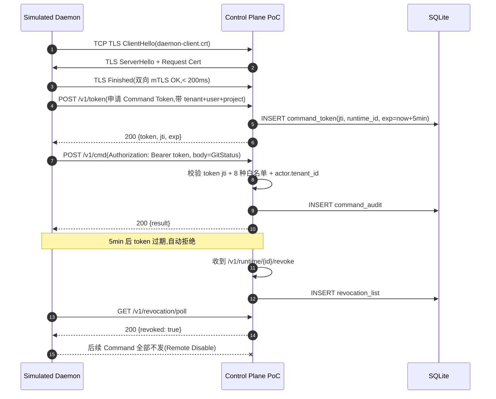

# POC-016: Local Runtime Secure Connection

> **状态**: Draft v0.1 (2026-08-25)
> **优先级**: MVP 必做
> **预估工期**: 3 人·天 / 800K tokens(AI 协作)
> **上游依赖**:
> - 《Requirements》LRT-001 / LRT-002 / REQ-SEC-013
> - 《Basic Design》§4.6(关键)、§4.6.1(服务器侧 Port vs Local Daemon 二进制区分)、§4.6.2(8 种 RuntimeCommand,D-03 修复后)、§4.6.3(mTLS 1h + Command Token 5min + Revocation)、§4.6.5(7 种 RuntimeObservation,独立方向)、§6.2(短时凭据)、§23.2(Device 三重绑定)
> - 《Module Spec》domain-local-runtime-spec.md
> - 《Security Design》§2 / §3.6 / §5.5
> - 《Data Design》§4.25 (`local_runtime` schema)
> - 《ADR-019》Local Runtime 安全模型
> **下游**: 决定 §MVP Must-Have 中"Local Runtime"是否纳入 v0.1;不通过则 V1 重做
> **Owner**: TBD

---

## 1. 目标

验证 Local Runtime 与 Control Plane 之间的安全通信模型在 PoC 阶段可行:
**mTLS 双向认证 + Device 三重绑定(tenant+user+project)+ Command Token 5min TTL + 8 种白名单 Command + Revocation 即时生效**。

**成功标准**(5 条可观测指标):
- [ ] Local Daemon 与 Control Plane 完成 mTLS 握手(双向证书验证),耗时 < 200ms
- [ ] Command Token 颁发后 5min 过期,过期后 Command 被拒
- [ ] 8 种 RuntimeCommand 之外的所有 Command(测试 5 种越权)全部被拒,Audit 100%
- [ ] Revocation 调用后 < 1s 内 Runtime 收到 Remote Disable,后续 Command 全部拒绝
- [ ] tenant_id 缺失或错误的 Runtime 100% 拒绝接入(13 类对象 #2 强制)

## 2. 范围

**PoC 包含**:
- 一对"模拟 Local Daemon" + "Control Plane PoC 服务"双端
- mTLS 双向证书生成 / 签发 / 轮转脚本
- 8 种 RuntimeCommand 的 Server Port stub + Dispatcher
- 7 种 RuntimeObservation 的上报 Channel
- Command Token 颁发 / 校验 / 过期机制
- Revocation 端点 + Remote Disable 触发
- Audit 日志(谁 / 何时 / 哪种 Command / 结果)

**PoC 不包含**:
- Filesystem Scope 强制(留给 POC-030)
- Agent Policy Enforcement 12 强制点(留给 POC-029)
- WebSocket 长连接双工(留 1s HTTP/2 polling,Full duplex 留 V1)
- 完整 Local Daemon 进程(只到 stub 收发层)

## 3. 架构与环境

### 3.1 部署架构

PoC 部署 = 1 台 Linux 开发机(等同未来 K8s 节点)+ 1 个本地 Docker Compose:

```mermaid
flowchart LR
  subgraph Dev["开发机"]
    A["simulated-local-daemon<br/>(Python / Rust stub)<br/>持有 mTLS 证书 + Device Key"]
    B["control-plane-poc<br/>(Rust actix-web)<br/>Server Port: 8443<br/>Database: SQLite"]
    C["audit-sink<br/>(JSON Lines append-only)"]
  end

  A -- mTLS 双向 -->|POST /v1/cmd| B
  A -- mTLS 双向 -->|POST /v1/obs| B
  B -- append --> C
  A -. Revocation Poll .-> B
  B -. Remote Disable .-> A
```

### 3.2 技术栈

- **Control Plane PoC**: Rust 1.78+ / actix-web 4 / tokio-rustls / sqlx(SQLite)
- **Simulated Daemon**: Python 3.12 + `aiohttp` + `cryptography`(快速出 stub);后续可换 Rust
- **mTLS**: 自签 CA(PoC 阶段),生产用 cert-manager + SPIFFE
- **Database**: SQLite(单机 OK),DDL 引用 data-design §4.25
- **日志**: `tracing` + stdout + JSON Lines 文件

### 3.3 环境变量与配置

| 变量 | 默认 | 含义 |
|---|---|---|
| `STAR_POC_CP_BIND` | `0.0.0.0:8443` | Control Plane 监听 |
| `STAR_POC_CA_DIR` | `./pki` | 自签 CA / 证书目录 |
| `STAR_POC_CMD_TOKEN_TTL_SEC` | `300` | Command Token TTL(PoC = 5min) |
| `STAR_POC_MTLS_CERT_HOUR` | `1` | mTLS 证书有效期(PoC = 1h,等同生产) |
| `STAR_POC_REVOCATION_POLL_SEC` | `5` | Daemon 轮询 Revocation 间隔 |
| `STAR_POC_TENANT_ID` | `tnt_001` | 测试 tenant |
| `STAR_POC_USER_ID` | `usr_alice` | 测试 user |
| `STAR_POC_PROJECT_ID` | `prj_demo` | 测试 project |

## 4. 实施步骤

### 步骤 1: PKI 自签 + mTLS 双向证书(0.5d)
- 任务:用 `openssl` 生成 Root CA → 签发 CP Server Cert(带 SAN)→ 签发 Daemon Client Cert
- 输入:无
- 输出:`pki/ca.crt`、`pki/cp-server.crt+key`、`pki/daemon-client.crt+key`
- 验收:`openssl verify` 通过,`openssl s_client -CAfile pki/ca.crt -cert pki/daemon-client.crt -key pki/daemon-client.key -connect localhost:8443` 双向认证成功

### 步骤 2: Control Plane PoC Server + Runtime Port stub(0.5d)
- 任务:用 actix-web 起 `/v1/cmd`、`/v1/obs`、`/v1/revocation/poll` 三个 endpoint;mTLS 强制;Command Token 校验
- 输入:步骤 1 证书
- 输出:可启动的 `control-plane-poc` binary
- 验收:`curl --cert` 双向认证 200;不带 cert 401

### 步骤 3: 8 种 RuntimeCommand Dispatcher(0.5d)
- 任务:实现 `dispatch(cmd: RuntimeCommand) -> RuntimeCommandResult` 8 种分支
- 输入:api-design §3.26 stub
- 输出:`control-plane-poc` 接 Command 后正确路由
- 验收:8 种 Command 各跑一次 stub 返回 Success(即使底层是 `unimplemented!`)

### 步骤 4: Simulated Daemon + 8 Command 客户端(0.5d)
- 任务:Python 脚本,加载 mTLS,遍历 8 种 Command 发送,记录耗时
- 输入:步骤 2 / 3
- 输出:`scripts/poc-016-daemon.py`
- 验收:8 种 Command 全部 200,且 Audit 日志对应 8 条

### 步骤 5: 越权 / 过期 / 错误 tenant 测试(0.5d)
- 任务:5 种越权(`ExecuteArbitraryShell` / `ReadArbitraryFile("*")` / `WriteArbitraryFile("/etc/passwd", ...)` / `DeleteRepo` / 无效 token)+ Token 过期 + tenant_id 错误 + 错 project_id
- 输入:步骤 4
- 输出:`tests/poc-016-negative.txt`(所有 401/403/410 响应码 + 错误信息)
- 验收:所有越权 100% 拒绝,Audit 记录 100%

### 步骤 6: Revocation 端到端(0.3d)
- 任务:CP 端 `POST /v1/runtime/{id}/revoke` → 写 DB → Daemon 5s 轮询发现 → 后续 Command 拒
- 输入:步骤 4
- 输出:Revocation E2E 时序图 + 端到端耗时
- 验收:< 1s 内 Daemon 收到 Remote Disable,再发 Command 全 410 Gone

### 步骤 7: 度量 + 报告(0.2d)
- 任务:mTLS 握手耗时 P50/P95、Command 路由耗时 P95、Audit 写入耗时,JSON 输出
- 输入:步骤 5/6 数据
- 输出:`poc-016-report.md`
- 验收:所有成功标准 5 条全部通过

## 5. 关键脚本与命令

```bash
# 步骤 1: 生成 PKI
mkdir -p pki && cd pki
openssl genrsa -out ca.key 4096
openssl req -x509 -new -nodes -key ca.key -sha256 -days 30 -subj "/CN=Star-PoC-CA" -out ca.crt
# CP server cert(含 SAN)
openssl genrsa -out cp-server.key 2048
openssl req -new -key cp-server.key -subj "/CN=cp-server" -out cp-server.csr
openssl x509 -req -in cp-server.csr -CA ca.crt -CAkey ca.key -CAcreateserial -out cp-server.crt -days 1 -sha256 -extfile <(printf "subjectAltName=DNS:localhost,IP:127.0.0.1")
# Daemon client cert(带 tenant+user+project UID)
openssl genrsa -out daemon-client.key 2048
openssl req -new -key daemon-client.key -subj "/CN=daemon-client" -out daemon-client.csr
openssl x509 -req -in daemon-client.csr -CA ca.crt -CAkey ca.key -CAcreateserial -out daemon-client.crt -days 1 -sha256
cd ..

# 步骤 2: 启动 CP PoC
export STAR_POC_CA_DIR=$(pwd)/pki
cargo run --bin control-plane-poc

# 步骤 4: 跑 Daemon 客户端
python3 scripts/poc-016-daemon.py \
  --cert pki/daemon-client.crt --key pki/daemon-client.key \
  --ca pki/ca.crt --cp https://localhost:8443 \
  --tenant tnt_001 --user usr_alice --project prj_demo

# 步骤 5: 越权回归
bash tests/poc-016-negative.sh
```

```rust
// crates/control-plane-poc/src/port.rs (stub)
use domain_local_runtime::port::{RuntimeCommand, RuntimeCommandResult, RuntimeError};

pub async fn dispatch(
    cmd: RuntimeCommand,
    actor: &ActorContext,  // mTLS + Command Token 已校验
) -> Result<RuntimeCommandResult, RuntimeError> {
    // INV-LR-03 强制:8 种之外的一律不到这里(Filter 在 middleware 完成)
    match cmd {
        RuntimeCommand::GitStatus { worktree_id } => stub_git_status(worktree_id).await,
        RuntimeCommand::CreateWorktree(spec) => stub_create_worktree(spec).await,
        RuntimeCommand::ReadDiff { worktree_id, commit } => stub_read_diff(worktree_id, commit).await,
        RuntimeCommand::RunApprovedTest { worktree_id, test_spec } => stub_run_test(worktree_id, test_spec).await,
        RuntimeCommand::QueryAgentStatus { session_id } => stub_query_agent(session_id).await,
        RuntimeCommand::SubmitFeedback { worktree_id, feedback } => stub_submit_feedback(worktree_id, feedback).await,
        RuntimeCommand::StartAuthorizedAgentSession(start_spec) => stub_start_agent(start_spec).await,
        RuntimeCommand::StopAgentSession { session_id, reason } => stub_stop_agent(session_id, reason).await,
        // 注意:D-03 修复后 ReportObservation 不在 Command 中,走独立 /v1/obs 通道
    }
}
```

## 6. 数据与测试夹具

**SQLite schema 最小集**(引用 data-design §4.25,非完整 DDL):
- `local_runtime(runtime_id, tenant_id, user_id, project_id, device_id, status, last_heartbeat_at, mtls_cert_serial)`
- `command_audit(audit_id, runtime_id, command_type, command_token_jti, result, error_code, created_at)`
- `revocation_list(revocation_id, runtime_id, revoked_at, reason, effective_at)`

**测试 fixture**:
- 1 个合法 Daemon(`pki/daemon-client.crt`,tenant=user=project 正确)
- 1 个"跨 tenant" 证书(同 CA,但 `STAR_POC_TENANT_ID=tnt_other`)
- 1 个过期 token(`STAR_POC_CMD_TOKEN_TTL_SEC=-1` 强制过期)
- 1 个被 revoke 的 Runtime

**样本数据**:8 种 Command 各 1 次调用,5 种越权各 1 次拒绝,1 次 Revocation,1 次 Remote Disable 后再发 Command。

## 7. 验证与度量

| 度量 | 目标 | 测量方式 |
|---|---|---|
| mTLS 握手耗时 P95 | < 200ms | Daemon 端打点 |
| Command 路由耗时 P95 | < 50ms | CP 端 tracing span |
| 越权拒绝率 | 100% | 5 种越权 fixture |
| Token 过期拒绝率 | 100% | 1 个过期 token fixture |
| tenant_id 错误拒绝率 | 100% | 1 个跨 tenant fixture |
| Revocation 端到端 | < 1s | Daemon 5s 轮询 → CP disable → 后续 410 |
| Audit 完整性 | 100% | 每条 Command 对应 1 条 audit |

**PoC Pass / Fail 判定**:5 条成功标准全部满足 → Pass;任一不满足 → 调整设计或推迟 V1。

## 8. 风险与缓解

| 风险 | 缓解 |
|---|---|
| 自签 CA 与生产 SPIFFE 语义差距大 | PoC 报告显式标注,生产切换清单列入 MVP 准备 |
| Command Token 5min TTL 与 Agent 长 session 冲突 | Token 仅用于单次 Command 鉴权,session 凭据另算;此处不展开 |
| Audit 写入 SQLite 单点 | PoC 够用;生产用 PG + Outbox(§6.7) |
| mTLS 证书 1h 过期自动化 | PoC 用短时证书手动重签,生产 cert-manager 自动化 |
| Remote Disable 5s 轮询延迟 | PoC 可接受;生产用 WebSocket 推送(< 1s),V1 引入 |

## 9. 后续阶段输入

PoC 完成后给 MVP / V1 / V2 提供:
- **MVP 决策**:Local Runtime Secure Connection 纳入 v0.1,采用自签 CA → 生产 SPIFFE 迁移清单
- **接口承诺**:`RuntimePort::execute_command` / `report_observation` / `fetch_desired_state` 签名稳定(API Design §3.26)
- **安全基线**:mTLS 1h + Command Token 5min + Revocation 5s 轮询为 MVP 默认值
- **Audit schema**:`command_audit` 表结构作为 §6.7 Audit 子系统基线
- **下一步**:POC-017 Worktree 状态同步依赖本 PoC 的 mTLS 通道

## 附录 A:关键流程时序图(mTLS + Command)



## 附录 B:决策记录

- **D-POC-016-01**:PoC 阶段使用自签 CA,**不**直接接 SPIFFE,理由 = 减少 PoC 复杂度,生产切换清单列入 MVP 准备。
- **D-POC-016-02**:Command Token 5min TTL 与 ADR-019 一致;但 **不** 复用为 AgentSession 长凭据,Session Token 单独处理(留 V1)。
- **D-POC-016-03**:Remote Disable 用 Daemon 主动 5s 轮询,**不**用 WebSocket 反向推送,理由 = 减少 PoC 依赖;V1 再换 WebSocket 降低延迟。
- **D-POC-016-04**:Audit 写 SQLite 而非 Outbox,理由 = PoC 单机,生产 PG + Outbox(§6.7)。
