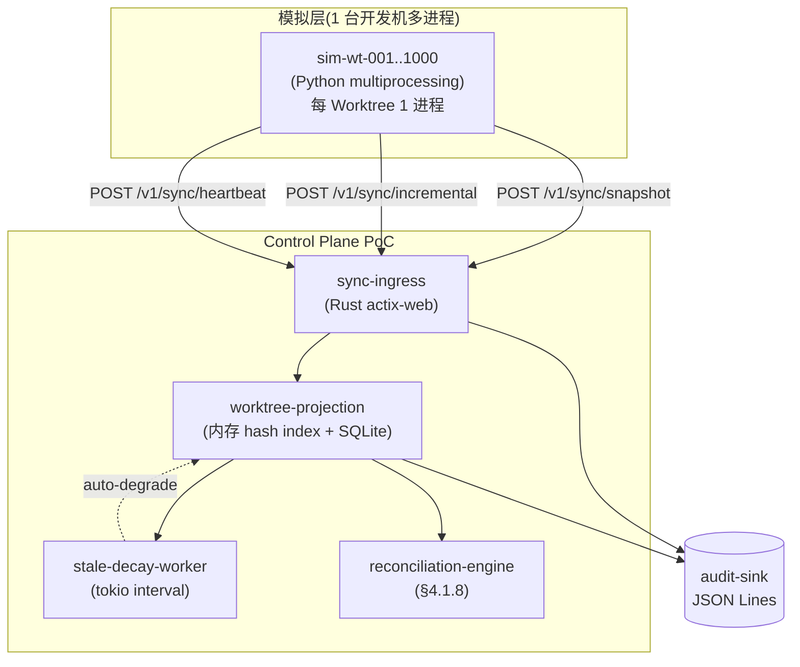
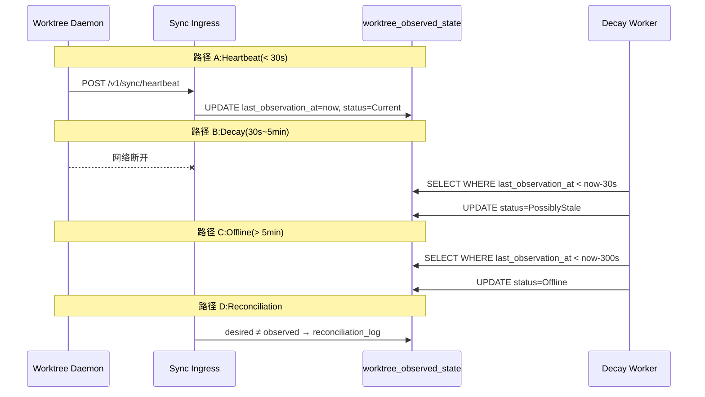

# POC-017: Worktree State Synchronization

> **状态**: Draft v0.1 (2026-08-25)
> **优先级**: MVP 必做
> **预估工期**: 4 人·天 / 1M tokens(AI 协作)
> **上游依赖**:
> - 《Requirements》REQ-WT-002 / REQ-WT-003
> - 《Basic Design》§4.1(Worktree 实体)、§4.1.5(Observed State Projection)、§4.1.6(Worktree Heatmap)、§4.1.8(Reconciliation)、§4.1.9(Worktree Completion 7 项)、§4.6.5(RuntimeObservation 7 种)、§23.4(Current / Possibly Stale / Offline / Unknown 区分)
> - 《Module Spec》domain-worktree-spec.md / domain-local-runtime-spec.md
> - 《Data Design》§4.16 (`worktree` schema) / §4.25 (`local_runtime` schema)
> - 《ADR-020》Worktree State Sync 模型
> - 《basic-design-feedback》F-04(§N 引用合规)
> **下游**: 决定 §MVP Must-Have 中"Worktree 状态同步"是否纳入 v0.1
> **Owner**: TBD

---

## 1. 目标

验证 1k Worktree 规模下,Local Runtime 通过 Snapshot + Incremental + Heartbeat
三段式将 Worktree 状态同步到 Control Plane,UI 能在 1s 内区分
**Current / Possibly Stale / Offline / Unknown** 四态(§23.4)。

**成功标准**(5 条可观测指标):
- [ ] 1k Worktree 模拟器 + 1k Daemon 上报,Control Plane 端 P95 同步延迟 < 1s
- [ ] UI / API 端能正确反映四态分布(模拟 50% Current / 30% Stale / 15% Offline / 5% Unknown)
- [ ] Snapshot 首次 + Incremental 增量 + Heartbeat 心跳三种路径都通过
- [ ] Stale Worktree 自动降级:Possibly Stale(>30s 未上报)→ Offline(>5min)
- [ ] Observed State 与 Desired State 偏差(Reconciliation)触发,无静默合并

## 2. 范围

**PoC 包含**:
- 1k Worktree 状态模拟器(独立进程,生成 Worktree 元数据 + 状态变更事件)
- Control Plane Worktree Port(接收 Snapshot / Incremental / Heartbeat 三种上报)
- Observed State Projection(SQLite 表 + 内存索引)
- Stale / Offline 自动降级 Worker(定时任务,30s / 5min 阈值)
- Reconciliation 触发器(检测到 Deviation 即触发,§4.1.8)
- 简单 CLI / Web 状态查询(PoC 不做完整 UI,只暴露 4 态分布)

**PoC 不包含**:
- 完整 UI Dashboard(留给 POC-019)
- File-level Conflict 视图(留给 POC-024)
- Symbol-level(留给 V1 POC-025)
- 跨 Runtime 协调(留给 POC-030)

## 3. 架构与环境

### 3.1 部署架构



### 3.2 技术栈

- **Control Plane**: Rust 1.78+ / actix-web 4 / sqlx(SQLite)/ tokio
- **Worktree Simulator**: Python 3.12 + `aiohttp` + `multiprocessing`(1k 进程)
- **Database**: SQLite,WAL 模式
- **时钟**: 全部走 `tokio::time` / Python `time.monotonic`,便于 P95 计算

### 3.3 环境变量与配置

| 变量 | 默认 | 含义 |
|---|---|---|
| `STAR_POC_WT_COUNT` | `1000` | 模拟 Worktree 数 |
| `STAR_POC_STALE_THRESHOLD_SEC` | `30` | Possibly Stale 阈值(§23.4) |
| `STAR_POC_OFFLINE_THRESHOLD_SEC` | `300` | Offline 阈值(§23.4) |
| `STAR_POC_HEARTBEAT_INTERVAL_SEC` | `5` | Heartbeat 周期 |
| `STAR_POC_INCREMENTAL_BATCH` | `50` | Incremental 批量 |
| `STAR_POC_SNAPSHOT_INTERVAL_SEC` | `60` | Snapshot 重发周期 |

## 4. 实施步骤

### 步骤 1: Schema 最小集(0.3d)
- 任务:建 `worktree` / `worktree_observed_state` / `worktree_desired_state` 三表(引用 §4.16 字段子集)
- 输入:data-design §4.16
- 输出:`migrations/poc-017-001.sql`
- 验收:三表可创建,索引覆盖 `(tenant_id, project_id, status)`

### 步骤 2: Sync Ingress(0.5d)
- 任务:`POST /v1/sync/snapshot` / `incremental` / `heartbeat` 三 endpoint,落到 `worktree_observed_state`
- 输入:步骤 1
- 输出:`crates/cp-poc/src/sync/ingress.rs`
- 验收:3 endpoint 200,`observed_state_version` 递增

### 步骤 3: Worktree Simulator(0.5d)
- 任务:1k 进程,每个跑 1 个 Worktree,每 5s Heartbeat、每 60s Snapshot、每 1s Incremental
- 输入:CP endpoint
- 输出:`scripts/sim-1k-worktrees.py`
- 验收:1k 进程稳定运行 5min,无 OOM,无 SQLite lock

### 步骤 4: Stale / Offline Decay Worker(0.5d)
- 任务:tokio interval 任务,每 1s 扫描 `last_observation_at` > 30s → Possibly Stale,> 300s → Offline
- 输入:步骤 2
- 输出:`crates/cp-poc/src/sync/decay.rs`
- 验收:注入"故意不上报"Worktree,30s 后状态变 Possibly Stale,5min 后变 Offline

### 步骤 5: Reconciliation 触发(0.5d)
- 任务:`reconciliation-engine` 比对 `desired_state_version` vs `observed_state_version`,差异写入 `reconciliation_log`(§4.1.8)
- 输入:步骤 2 + §4.1.8 规则
- 输出:`crates/cp-poc/src/sync/reconcile.rs`
- 验收:故意制造"Desired = A, Observed = B"→ 触发 reconciliation,Audit 记录

### 步骤 6: 四态分布 CLI(0.4d)
- 任务:`cargo run --bin wt-status -- --project prj_demo` 输出 Current/Stale/Offline/Unknown 数量 + P95 上报延迟
- 输入:步骤 3/4
- 输出:CLI 报表
- 验收:能反映 50/30/15/5 分布

### 步骤 7: 度量 + 报告(0.3d)
- 任务:1k Worktree 5min 持续运行,记录 P50/P95/P99 同步延迟、Decay 误判率、Reconciliation 触发次数
- 输入:步骤 6 输出
- 输出:`poc-017-report.md`
- 验收:5 条成功标准全部通过

## 5. 关键脚本与命令

```bash
# 步骤 1: 初始化 SQLite
sqlite3 poc-017.db < migrations/poc-017-001.sql

# 步骤 2-3: 启动 CP + 模拟器
export STAR_POC_CP_BIND=0.0.0.0:8443
export STAR_POC_DB=sqlite://poc-017.db
cargo run --bin control-plane-poc &
sleep 2
python3 scripts/sim-1k-worktrees.py --cp http://localhost:8443 --count 1000 --duration 300

# 步骤 6: 查四态
cargo run --bin wt-status -- --project prj_demo --json

# 步骤 4: 验证 Stale/Offline 降级
# 手动 kill sim-wt-0050,30s 后看 Possibly Stale,5min 后看 Offline
```

```rust
// crates/cp-poc/src/sync/ingress.rs (stub)
use domain_worktree::port::{WorktreePort, WorktreeObservedState};

pub async fn handle_heartbeat(
    State(port): State<Arc<dyn WorktreePort>>,
    Json(req): Json<HeartbeatRequest>,
) -> Result<Json<HeartbeatResponse>, SyncError> {
    let observed = WorktreeObservedState {
        worktree_id: req.worktree_id,
        runtime_id: req.runtime_id,
        tenant_id: req.tenant_id,  // 13 类对象必带
        observed_state_version: req.state_version,
        last_observation_at: Utc::now(),
        // ... 其他字段
    };
    port.apply_observation(observed).await?;
    Ok(Json(HeartbeatResponse { ack_version: req.state_version }))
}

pub async fn handle_snapshot(
    State(port): State<Arc<dyn WorktreePort>>,
    Json(req): Json<SnapshotRequest>,
) -> Result<Json<SnapshotResponse>, SyncError> {
    // Snapshot 整体替换 Observed State
    port.replace_observed_state(req.worktree_id, req.snapshot).await?;
    Ok(Json(SnapshotResponse { applied_at: Utc::now() }))
}
```

## 6. 数据与测试夹具

**Schema 引用**(data-design §4.16 字段子集):
```sql
-- 引用 §4.16,非完整 DDL
CREATE TABLE worktree (
  worktree_id TEXT PRIMARY KEY,
  tenant_id TEXT NOT NULL,        -- 13 类对象 #3 强制
  project_id TEXT NOT NULL,
  name TEXT NOT NULL,
  desired_state_version BIGINT NOT NULL DEFAULT 0
);
CREATE TABLE worktree_observed_state (
  worktree_id TEXT PRIMARY KEY REFERENCES worktree(worktree_id),
  observed_state_version BIGINT NOT NULL,
  status TEXT NOT NULL,            -- Current / PossiblyStale / Offline / Unknown(§23.4)
  last_observation_at TIMESTAMPTZ NOT NULL,
  snapshot JSONB
);
CREATE INDEX idx_wt_status ON worktree_observed_state(status, last_observation_at);
CREATE TABLE reconciliation_log (
  log_id TEXT PRIMARY KEY,
  worktree_id TEXT NOT NULL,
  desired_version BIGINT NOT NULL,
  observed_version BIGINT NOT NULL,
  deviation_kind TEXT NOT NULL,
  created_at TIMESTAMPTZ NOT NULL
);
```

**测试 fixture**:
- 1k Worktree 平均分布在 1 个 Project
- 随机注入 5% Unknown(状态机初始未上报)
- 故意 kill 30% Daemon,验证 Stale / Offline 自动降级
- 故意制造"Desired 与 Observed 偏差" 100 次,验证 Reconciliation

**样本数据**:每 Worktree 1 个 UUID,project 共享 `prj_demo`,tenant `tnt_001`。

## 7. 验证与度量

| 度量 | 目标 | 测量方式 |
|---|---|---|
| 1k Worktree 同步延迟 P95 | < 1s | Simulator 端打点,CP 端 ack 时间差 |
| 1k Worktree 同步延迟 P99 | < 2s | 同上 |
| Stale 自动降级 | 30s ± 2s | 注入"不上报" Worktree |
| Offline 自动降级 | 5min ± 5s | 同上 |
| Reconciliation 触发 | 100% | 100 次偏差 fixture |
| 四态分布 | 50/30/15/5 ± 2% | CLI 报表 |
| CPU / 内存峰值 | < 2 CPU / < 512MB | `top` / `ps` 抽样 |

## 8. 风险与缓解

| 风险 | 缓解 |
|---|---|
| 1k Python 进程启动慢 | 用 `multiprocessing` fork 模式 / 或换 Go 模拟器 |
| SQLite 写锁竞争 | 启用 WAL + 批量提交(Incremental 50 条一批) |
| Simulator 与 CP 时钟漂移 | 全用 `time.monotonic` 对齐,PoC 单机无漂移 |
| 真实生产跨地域延迟 | PoC 不模拟,生产用 NTP + §23.4 阈值校准 |
| Decay Worker 单点 | PoC 单进程,生产用多副本 + leader election(留 V1) |

## 9. 后续阶段输入

- **MVP 决策**:Worktree State Sync 纳入 v0.1,默认 Snapshot+Incremental+Heartbeat 三段式
- **接口承诺**:`WorktreePort::apply_observation` / `replace_observed_state` 签名稳定(API Design §3.x)
- **阈值基线**:Possibly Stale = 30s,Offline = 5min(§23.4)→ 写入 MVP 默认
- **下一步**:POC-018 Offline / Reconnect 依赖本 PoC 的 Decay Worker

## 附录 A:四态时序图



## 附录 B:决策记录

- **D-POC-017-01**:PoC 阶段 Decay Worker 单进程,生产多副本 + leader election 留 V1。
- **D-POC-017-02**:Possibly Stale = 30s / Offline = 5min 取 §23.4 中位值;V1 用真实流量校准。
- **D-POC-017-03**:1k Worktree 全部跑同一 Project 模拟压测,真实生产多 Project 留 V1。
- **D-POC-017-04**:SQLite 而非 PG,理由 = PoC 单机;生产 PG + 分区表(§5.1)。
