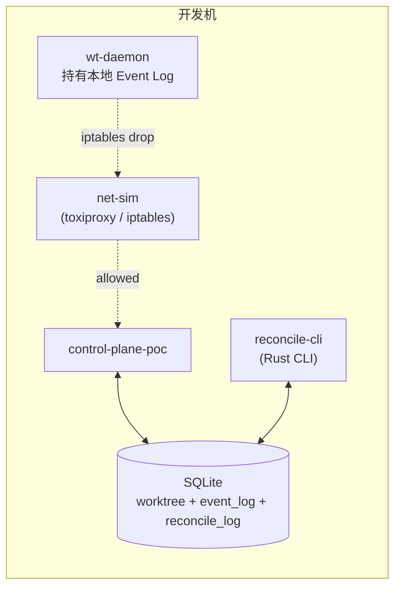
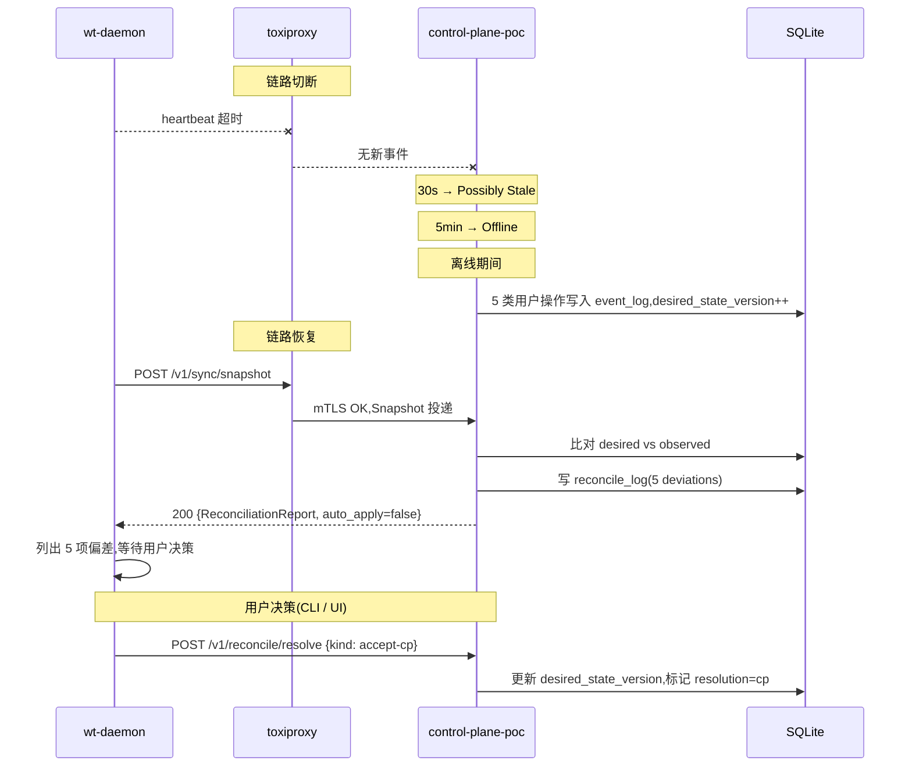

# POC-018: Worktree Offline / Reconnect

> **状态**: Draft v0.1 (2026-08-25)
> **优先级**: MVP 必做
> **预估工期**: 3 人·天 / 800K tokens(AI 协作)
> **上游依赖**:
> - 《Requirements》REQ-WT-004 / REQ-AUT-005
> - 《Basic Design》§4.1.8(Reconciliation:Desired ↔ Observed 偏差不静默合并)、§22.6(ReconciliationReport)、§23.4(Offline / Unknown 区分)
> - 《Module Spec》domain-worktree-spec.md
> - 《Data Design》§4.16 (`worktree` / `worktree_observed_state`)
> - 《ADR-020》State Sync 模型(续)
> - 《POC-017》State Synchronization
> **下游**: 决定 §MVP Must-Have 中"Offline 兜底"是否纳入 v0.1
> **Owner**: TBD

---

## 1. 目标

验证 Worktree Daemon 离线 1h 后重连,**Reconciliation 报告偏差正确**,
**不静默合并**(§4.1.8 + §22.6 强约束)。

**成功标准**(5 条可观测指标):
- [ ] 离线 1h 后,Daemon 重新上报,ReconciliationReport 偏差字段全部填出
- [ ] 偏差不静默合并:Deviation 数 = 实际变化数(无漏报、虚报)
- [ ] 重连后 Desired State 被完整推回(Version 拉齐)
- [ ] 离线期间用户操作(评论、Feedback、WorkItem 状态变更)全部不丢
- [ ] UI 端明确提示"Reconciliation Required",需用户 / Agent 介入

## 2. 范围

**PoC 包含**:
- Daemon 离线注入(网络层 kill -9 / iptables drop)
- 离线期间 CP 端持续接收其他 Worktree 事件 / 写入期望态变更
- 重连握手:版本比对 → 偏差计算 → 报告推送
- 离线期间 Operation Log(Event Sourcing 简化版: append-only SQLite)持久化
- Reconciliation UI / CLI 简化版(列出偏差 + 用户决策:Accept CP / Accept Daemon / 手动合并)

**PoC 不包含**:
- 完整 Event Sourcing(Non-Goals,仅简化版)
- Conflict 自动 Merge(只做检测,不做自动合并)
- 跨 Daemon 协作(V1)

## 3. 架构与环境

### 3.1 部署架构



### 3.2 技术栈

- **Daemon**: Python 3.12 + SQLite(本地 event log)
- **CP**: Rust 1.78+ / actix-web 4 / sqlx
- **网络注入**: Linux `iptables` 或 `toxiproxy`(PoC 选 toxiproxy,跨平台)
- **Clock**: `time.monotonic`(避免 NTP 漂移)

### 3.3 环境变量与配置

| 变量 | 默认 | 含义 |
|---|---|---|
| `STAR_POC_OFFLINE_DURATION_SEC` | `3600` | 模拟离线时长(默认 1h) |
| `STAR_POC_RECONCILE_THRESHOLD` | `1` | 偏差数 ≥ 1 即触发报告 |
| `STAR_POC_EVENT_LOG_RETENTION` | `24h` | Daemon 端 event log 保留 |
| `STAR_POC_TOXIPROXY_PORT` | `8474` | toxiproxy API |

## 4. 实施步骤

### 步骤 1: Daemon 端 Event Log(0.4d)
- 任务:Daemon 本地 SQLite 写 append-only event_log,记录每条 Observed State 变更
- 输入:无
- 输出:`scripts/wt-daemon.py` 启动时建表
- 验收:重启 Daemon 不丢 event,可读出

### 步骤 2: 网络注入层(0.3d)
- 任务:toxiproxy 起 1 个 listener,CP 通过它访问;可"切断" / "恢复"链路
- 输入:toxiproxy 二进制
- 输出:`scripts/net-sim.sh`(start / cut / restore)
- 验收:`curl` 通过 proxy 200,cut 后 60s 内 5xx 100%

### 步骤 3: 离线期间 CP 端操作(0.4d)
- 任务:模拟"用户 / 其他 Worktree"在 CP 端制造 5 类 Desired State 变更(WorkItem 状态 / Feedback / Comment / Agent 启动 / Commit Link)
- 输入:步骤 2
- 输出:`scripts/cp-side-ops.py`
- 验收:5 类操作各 1 次,DB 落库

### 步骤 4: 重连 + Reconciliation 握手(0.6d)
- 任务:Daemon 重连后,CP 比对 `desired_state_version` vs `observed_state_version`,差距 → 拉取增量 Desired → 计算 Deviation → 写 `reconcile_log` → 推 ReconciliationReport 给 Daemon
- 输入:步骤 1-3
- 输出:`crates/cp-poc/src/sync/reconcile_handshake.rs`
- 验收:偏差字段 100% 正确,无漏报

### 步骤 5: ReconciliationReport 推送(0.4d)
- 任务:Daemon 收到 Report → 列出 5 类偏差 → 不静默合并,等待用户决策
- 输入:步骤 4
- 输出:Daemon 端 CLI 提示
- 验收:5 类偏差全列出,无 auto-merge 动作

### 步骤 6: Reconcile CLI(0.3d)
- 任务:`reconcile-cli` 列出待 reconcile 项目,提供 `accept-cp` / `accept-daemon` / `manual` 三选项
- 输入:步骤 4
- 输出:`crates/reconcile-cli/src/main.rs`
- 验收:三种选项正确落地

### 步骤 7: 度量 + 报告(0.2d)
- 任务:多次重复 offline-reconnect 循环,统计偏差漏报率、Reconciliation 端到端耗时
- 输入:步骤 4-6
- 输出:`poc-018-report.md`
- 验收:5 条成功标准全过

## 5. 关键脚本与命令

```bash
# 步骤 2: 启 toxiproxy,切断 Daemon
toxiproxy-cli --host localhost:8474 create wt-daemon -l 0.0.0.0:9443 -u cp:8443
toxiproxy-cli toxic add wt-daemon -t latency -a latency=0 -n cut
# 切链路
toxiproxy-cli toxic update wt-daemon -n cut -a latency=10000  # 10s 高延迟
# 恢复
toxiproxy-cli toxic remove wt-daemon -n cut

# 步骤 4: 跑 PoC
python3 scripts/wt-daemon.py --cp http://localhost:9443 &
sleep 5
# 切链路
bash scripts/net-sim.sh cut
# 离线 1h 期间跑 CP 侧操作
python3 scripts/cp-side-ops.py --project prj_demo --count 5
# 恢复
bash scripts/net-sim.sh restore
# 查 reconcile log
sqlite3 poc-018.db "SELECT * FROM reconcile_log WHERE worktree_id='wt_001';"
# 决策
cargo run --bin reconcile-cli -- accept-cp --worktree wt_001
```

```rust
// crates/cp-poc/src/sync/reconcile_handshake.rs (stub)
use domain_worktree::port::{WorktreePort, ReconciliationReport, Deviation};

pub async fn reconcile_after_reconnect(
    port: &dyn WorktreePort,
    worktree_id: WorktreeId,
) -> Result<ReconciliationReport, ReconcileError> {
    let observed = port.fetch_observed_state(worktree_id).await?;
    let desired = port.fetch_desired_state(worktree_id).await?;

    // INV: 不静默合并(§4.1.8)
    let deviations = compute_deviations(&desired, &observed);

    let report = ReconciliationReport {
        worktree_id,
        desired_state_version: desired.version,
        observed_state_version: observed.version,
        deviations: deviations.clone(),
        // 不自动应用,推给 Daemon 等用户决策
        auto_apply: false,
    };
    port.write_reconcile_log(&report).await?;
    port.push_report_to_daemon(worktree_id, &report).await?;
    Ok(report)
}
```

## 6. 数据与测试夹具

**Schema 引用**(data-design §4.16 字段子集 + event_log 简化):
```sql
-- 引用 §4.16,非完整 DDL
CREATE TABLE worktree (
  worktree_id TEXT PRIMARY KEY,
  desired_state_version BIGINT NOT NULL DEFAULT 0
);
CREATE TABLE worktree_event_log (
  event_id TEXT PRIMARY KEY,
  worktree_id TEXT NOT NULL,
  event_type TEXT NOT NULL,         -- WorkItemStatusChanged / FeedbackAdded / ...
  payload JSONB NOT NULL,
  desired_state_version BIGINT NOT NULL,
  created_at TIMESTAMPTZ NOT NULL
);
CREATE TABLE reconcile_log (
  log_id TEXT PRIMARY KEY,
  worktree_id TEXT NOT NULL,
  desired_version BIGINT NOT NULL,
  observed_version BIGINT NOT NULL,
  deviations JSONB NOT NULL,        -- [{kind, ..., resolution: pending/cp/daemon/manual}]
  created_at TIMESTAMPTZ NOT NULL
);
```

**测试 fixture**:
- 1 个 Worktree 离线 1h
- 离线期间 5 类操作 × 各 1 次
- 3 次 reconcile 决策:accept-cp / accept-daemon / manual
- 1 个边界:Desired 和 Observed 完全一致 → 0 偏差

**样本数据**:project=`prj_demo`,tenant=`tnt_001`,worktree=`wt_001`。

## 7. 验证与度量

| 度量 | 目标 | 测量方式 |
|---|---|---|
| Reconciliation 端到端 | < 5s | 重连 → 报告推送 |
| 偏差漏报率 | 0% | 5 类操作 vs reconcile_log 偏差数 |
| 静默合并次数 | 0 | 强制禁止,Audit 监控 |
| Daemon 端 event log 完整性 | 100% | 重启后查询无丢 |
| CP 端 event log 完整性 | 100% | 离线期间 5 类操作 100% 落库 |

## 8. 风险与缓解

| 风险 | 缓解 |
|---|---|
| Event Log 无界增长 | PoC 加 24h retention;生产用 TTL + Object Storage(§5.8) |
| 用户决策延迟导致状态长期 pending | UI 端高亮 + 通知(§4.9);PoC 只验证机制 |
| 跨地域时钟漂移 | PoC 单机 NTP;生产用 Logical Clock + HLC |
| 静默合并(违反 §4.1.8)风险 | Code Review 强制 + 单元测试覆盖 reconcile 路径 100% |
| iptables 在 Windows PoC 不可用 | 改用 toxiproxy(跨平台) |

## 9. 后续阶段输入

- **MVP 决策**:Offline / Reconnect 纳入 v0.1,Reconciliation 强制不静默合并
- **接口承诺**:`WorktreePort::reconcile_after_reconnect` / `push_report_to_daemon` 签名稳定
- **不变量**:INV-WT-RECONCILE-NO-SILENT-MERGE 写入设计纪律 checklist
- **下一步**:POC-019 多 Worktree 同屏观察依赖本 PoC 的 Decay / Reconnect 事件

## 附录 A:Reconnect 时序图



## 附录 B:决策记录

- **D-POC-018-01**:简化版 Event Log 而非完整 Event Sourcing(Non-Goals)。
- **D-POC-018-02**:Reconciliation 强制人工决策,不做自动 Merge(避免 §4.1.8 违反)。
- **D-POC-018-03**:toxiproxy 而非 iptables,理由 = Windows 兼容 + 跨平台。
- **D-POC-018-04**:离线 1h 取 §MVP Must-Have 典型值,生产可调(§23.4)。
