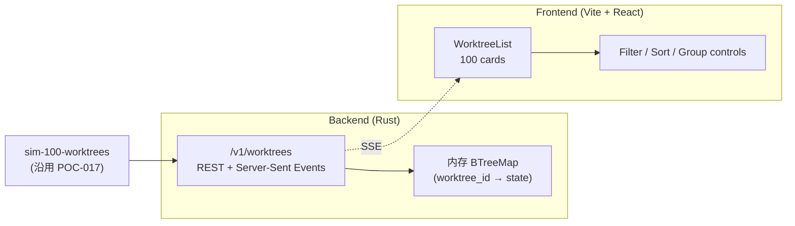
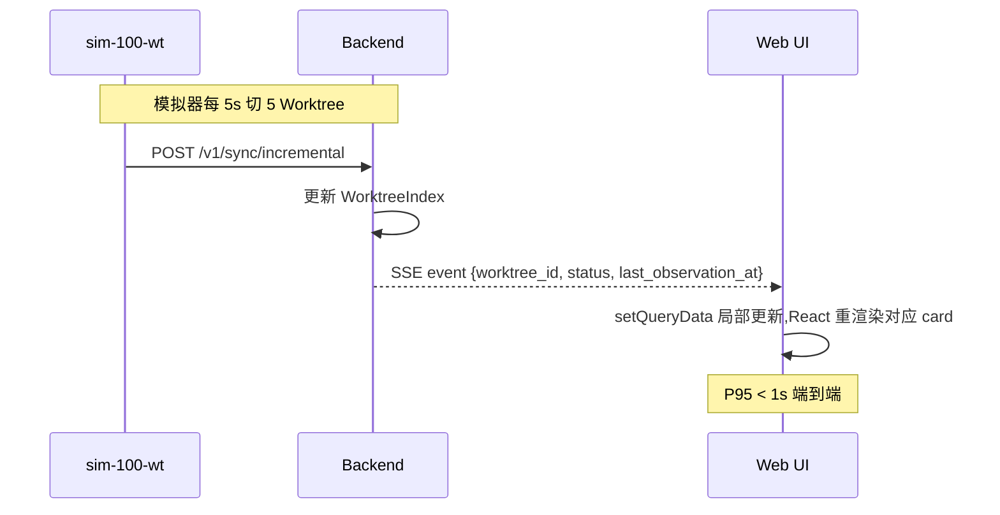

# POC-019: Multiple Worktree Observation

> **状态**: Draft v0.1 (2026-08-25)
> **优先级**: MVP 必做
> **预估工期**: 3 人·天 / 800K tokens(AI 协作)
> **上游依赖**:
> - 《Requirements》REQ-WT-005 / REQ-COLLAB-003
> - 《Basic Design》§4.1.5(Observed State Projection)、§4.1.6(Worktree Heatmap 简化版)、§23.4(状态四态)、§23.6(Realtime 推送)
> - 《Module Spec》domain-collaboration-spec.md(Realtime 通道) / domain-worktree-spec.md
> - 《Data Design》§4.16 / §4.18
> - 《POC-017》State Synchronization
> **下游**: 决定 §MVP Must-Have 中"Worktree Dashboard"是否纳入 v0.1
> **Owner**: TBD

---

## 1. 目标

验证单 Project 下 100 Worktree 同屏观察时:
**UI 渲染 < 500ms** + **Filter / Sort / Group 流畅** + **实时更新**。

**成功标准**(5 条可观测指标):
- [ ] 100 Worktree 列表首屏渲染 P95 < 500ms
- [ ] 4 态 Filter(Current / Stale / Offline / Unknown)切换 < 100ms
- [ ] Sort(按名称 / 状态 / 最后上报时间)< 100ms
- [ ] Group(按状态 / Runtime / 标签)< 200ms
- [ ] Realtime 推送(新事件 → UI 增量更新)< 1s

## 2. 范围

**PoC 包含**:
- 100 Worktree 模拟器(沿用 POC-017 模拟器子集)
- 简单 React Web UI(单页,只覆盖列表 + 4 态指示)
- 4 态 Filter / Sort / Group(本地 + 服务端)
- WebSocket / SSE 实时通道(PoC 选 SSE,实现简单)
- 性能打点(Chrome DevTools / Lighthouse)

**PoC 不包含**:
- 完整 Dashboard(后续 MVP 实施)
- File-level Heatmap(留给 POC-024)
- 跨 Project 切换(V1)
- 移动端响应式

## 3. 架构与环境

### 3.1 部署架构



### 3.2 技术栈

- **Backend**: Rust 1.78+ / actix-web 4 / actix-web-sse
- **Frontend**: Vite + React 18 + TypeScript + TanStack Query(乐观更新)
- **Realtime**: SSE(简单 + 跨域友好);WebSocket 留 V1
- **性能打点**: Chrome DevTools Performance / Lighthouse

### 3.3 环境变量与配置

| 变量 | 默认 | 含义 |
|---|---|---|
| `STAR_POC_WT_COUNT` | `100` | 模拟 Worktree 数 |
| `STAR_POC_SSE_INTERVAL_MS` | `1000` | SSE 推送节流(1s) |
| `STAR_POC_FRONTEND_PORT` | `5173` | Vite dev |
| `STAR_POC_API_PORT` | `8443` | Backend |

## 4. 实施步骤

### 步骤 1: 后端 List / Filter / Sort / Group API(0.5d)
- 任务:`GET /v1/worktrees?status=...&sort=...&group=...` + 内存索引
- 输入:沿用 POC-017 `worktree_observed_state`
- 输出:`crates/cp-poc/src/api/worktree_list.rs`
- 验收:curl 100 条返回 < 50ms,Filter/Sort/Group 正确

### 步骤 2: SSE 实时通道(0.4d)
- 任务:`GET /v1/worktrees/stream` 推送 change events(Snapshot 简化版:仅 ID + 新状态)
- 输入:步骤 1 + POC-017 的 Decay Worker
- 输出:`crates/cp-poc/src/api/sse.rs`
- 验收:SSE 客户端 1s 内收到新事件

### 步骤 3: 前端骨架(0.3d)
- 任务:Vite + React 18 + TS,100 cards 列表(纯 mock 数据先跑通)
- 输入:无
- 输出:`web/poc-019/`
- 验收:`npm run dev` 启动,本地访问 200

### 步骤 4: 接 API + SSE(0.4d)
- 任务:TanStack Query 拉取 + EventSource 订阅,增量更新本地缓存
- 输入:步骤 1-3
- 输出:`web/poc-019/src/App.tsx`
- 验收:100 cards 渲染,模拟器变更时 UI 1s 内更新

### 步骤 5: Filter / Sort / Group UI(0.4d)
- 任务:4 态 Filter 复选框 / Sort 下拉 / Group 下拉,客户端 + 服务端双层
- 输入:步骤 4
- 输出:`web/poc-019/src/Controls.tsx`
- 验收:Filter/Sort/Group 切换 < 200ms

### 步骤 6: 性能打点(0.4d)
- 任务:Lighthouse + Chrome DevTools Performance,跑 5 次取 P95
- 输入:步骤 5
- 输出:`poc-019-perf.md`
- 验收:5 条成功标准全过

### 步骤 7: 度量 + 报告(0.2d)
- 任务:汇总 100 Worktree 渲染 / Filter / Sort / Group / Realtime 5 个指标
- 输入:步骤 6
- 输出:`poc-019-report.md`
- 验收:报告完整

## 5. 关键脚本与命令

```bash
# 步骤 1-2: 启 backend
export STAR_POC_WT_COUNT=100
cargo run --bin control-plane-poc &

# 步骤 3-5: 启 frontend
cd web/poc-019
npm install
npm run dev  # http://localhost:5173

# 步骤 6: 性能打点
npx lighthouse http://localhost:5173 --output json --output-path poc-019-lh.json
# Chrome DevTools Performance 录制 5s,导出 JSON
```

```rust
// crates/cp-poc/src/api/worktree_list.rs (stub)
use actix_web::{web, HttpResponse};
use serde::Deserialize;

#[derive(Deserialize)]
pub struct ListQuery {
    pub status: Option<String>,        // Current | PossiblyStale | Offline | Unknown
    pub sort: Option<String>,          // name | status | last_observation_at
    pub group: Option<String>,         // status | runtime_id | tag
}

pub async fn list_worktrees(
    State(idx): State<Arc<WorktreeIndex>>,
    q: web::Query<ListQuery>,
) -> HttpResponse {
    let mut items = idx.values().cloned().collect::<Vec<_>>();
    // Filter
    if let Some(s) = &q.status { items.retain(|w| w.status == *s); }
    // Sort
    match q.sort.as_deref() {
        Some("name") => items.sort_by(|a,b| a.name.cmp(&b.name)),
        Some("status") => items.sort_by(|a,b| a.status.cmp(&b.status)),
        Some("last_observation_at") => items.sort_by_key(|w| w.last_observation_at),
        _ => {}
    }
    HttpResponse::Ok().json(items)
}
```

```tsx
// web/poc-019/src/App.tsx (snippet)
import { useQuery, useQueryClient } from '@tanstack/react-query';
import { useEffect } from 'react';

export function WorktreeList() {
  const qc = useQueryClient();
  const { data } = useQuery({
    queryKey: ['worktrees'],
    queryFn: () => fetch('/v1/worktrees').then(r => r.json()),
  });

  useEffect(() => {
    const es = new EventSource('/v1/worktrees/stream');
    es.onmessage = (e) => {
      const ev = JSON.parse(e.data);
      qc.setQueryData(['worktrees'], (old: any[] | undefined) =>
        old?.map(w => w.worktree_id === ev.worktree_id ? { ...w, ...ev } : w)
      );
    };
    return () => es.close();
  }, [qc]);

  return <div>{data?.map(w => <WorktreeCard key={w.worktree_id} wt={w} />)}</div>;
}
```

## 6. 数据与测试夹具

**Schema**:沿用 POC-017 `worktree_observed_state` 即可,无需新增表。

**测试 fixture**:
- 100 Worktree,分布:50 Current / 30 Stale / 15 Offline / 5 Unknown
- 模拟器每 5s 切 5 个 Worktree 状态
- 浏览器 profile:Chrome Stable,Mid-tier(等同 4-core / 8GB 笔记本)

**样本数据**:见 POC-017,只取 100 个。

### 6.1 关键交互细节

**Filter 行为**:
- 4 态 Filter 复选框可多选(如同时勾选 Current + Possibly Stale)
- 默认全选,客户端初次加载显示全部
- Filter 切换走服务端,带 `?status=Current,PossiblyStale` 复合查询参数

**Sort 行为**:
- 3 种排序:名称升序 / 状态分组 / 最后上报时间倒序
- 默认按 `last_observation_at desc`(最新的在最上)
- 排序字段走服务端,客户端不重复计算

**Group 行为**:
- 3 种分组:状态 / Runtime / 标签(留 V1)
- 同一组内仍按 Sort 顺序排列
- 组头显示该组 Worktree 数量

**Realtime 行为**:
- SSE 推送节流 1s,避免单 Worktree 高频更新导致 UI 抖动
- 客户端用 TanStack Query 局部 `setQueryData`,不重拉全量
- 断线自动重连(EventSource 原生),UI 显示"Reconnecting"提示

### 6.2 性能预算

| 操作 | 预算 | 优化策略 |
|---|---|---|
| 首屏 SSR + hydrate | < 500ms | 服务端预渲染卡片壳,客户端再注数据 |
| 100 card 渲染 | < 300ms | 虚拟滚动 + memo |
| Filter 切换 | < 100ms | URL 参数 + 客户端缓存命中 |
| Sort 切换 | < 100ms | 客户端 stable sort |
| Group 切换 | < 200ms | 客户端 groupBy + memo |
| SSE 单条处理 | < 50ms | `setQueryData` 局部更新 |
| 100 SSE/秒压力 | < 100ms/条 | throttle + batch flush |
| Lighthouse FCP | < 1s | 代码分割 + 图片 lazy |
| Lighthouse LCP | < 2.5s | 关键路径 inline |

## 7. 验证与度量

| 度量 | 目标 | 测量方式 |
|---|---|---|
| 首屏渲染 P95 | < 500ms | Lighthouse / Performance 录制 |
| Filter 切换 P95 | < 100ms | DevTools Performance 标记 |
| Sort 切换 P95 | < 100ms | 同上 |
| Group 切换 P95 | < 200ms | 同上 |
| Realtime 推送 P95 | < 1s | EventSource 收到 → React 渲染完成 |
| FCP / LCP | < 1s / < 2.5s | Lighthouse |
| CLS | < 0.1 | Lighthouse |

## 8. 风险与缓解

| 风险 | 缓解 |
|---|---|
| 100 卡片 DOM 过多导致卡顿 | 引入虚拟滚动(`@tanstack/react-virtual`) |
| SSE 断线重连 | EventSource 原生重连;UI 加重连提示 |
| 客户端 Sort vs 服务端 Sort 不一致 | PoC 全部走服务端 Sort,客户端只接结果 |
| 移动端体验差 | PoC 不覆盖,留 V1 |
| Lighthouse 在 CI 波动大 | 取 5 次中位数 |

## 9. 后续阶段输入

- **MVP 决策**:Worktree Dashboard 纳入 v0.1,默认 100 Worktree 流畅,Server-Sent Events 优先
- **接口承诺**:`GET /v1/worktrees` 响应 schema 稳定(Sort/Filter 字段)
- **性能基线**:100 Worktree / 首屏 500ms 写入 NFR(§13.1)
- **下一步**:POC-024 File-level Conflict Detection 复用本 PoC 的 WorktreeList 视图

## 附录 A:实时更新时序



## 附录 B:决策记录

- **D-POC-019-01**:SSE 而非 WebSocket,理由 = 单向 + 自动重连 + 跨域友好;V1 双工需求再换 WS。
- **D-POC-019-02**:100 Worktree 而非 1k(本 PoC),1k 留给 V1 大盘视图。
- **D-POC-019-03**:React + TanStack Query,而非 Redux + 手写 fetch,理由 = 缓存 + 乐观更新成熟。
- **D-POC-019-04**:Filter / Sort / Group 全部服务端,客户端只展示,理由 = 数据规模扩大时一致。
