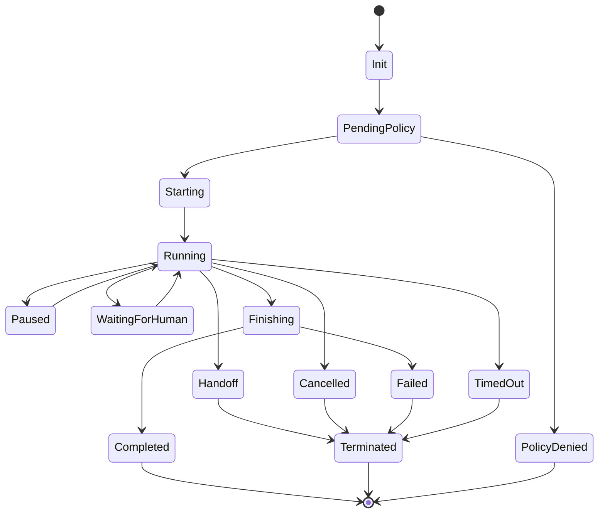
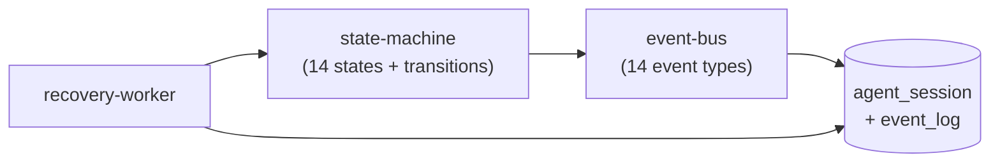
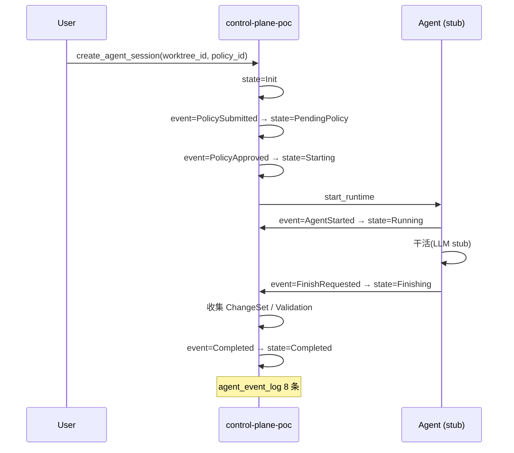

# POC-020: Agent Session Tracking

> **状态**: Draft v0.1 (2026-08-25)
> **优先级**: MVP 必做
> **预估工期**: 4 人·天 / 1M tokens(AI 协作)
> **上游依赖**:
> - 《Requirements》REQ-AGT-001 / REQ-AGT-002 / REQ-AGT-005
> - 《Basic Design》§4.2(AgentSession 实体)、§4.2.4(Agent Port 抽象)、§4.2.6(AgentSession 14 状态,**F-08 修复**)、§4.2.7(HandoffContextPacket)、§4.10.6(Agent 审计)、§4.10.7(Prompt Injection 防护)
> - 《Module Spec》domain-agent-spec.md
> - 《Data Design》§4.5 (`agent_session` schema,含 14 状态字段)
> - 《Security Design》§4.3(P0-P5 优先级)、§5.4(Agent 行为审计)
> - 《AI Agent Design》§3 / §4
> - 《ADR-026》Agent Session Persistence
> **下游**: 决定 §MVP Must-Have 中"Agent Session"是否纳入 v0.1
> **Owner**: TBD

---

## 1. 目标

验证 **AgentSession 14 状态**(F-08 修复后)的状态机迁移完整,
**Domain Event 全部触发** + **持久化可查** + **跨 Session 状态可追踪**。

**成功标准**(5 条可观测指标):
- [ ] 14 个状态全部可触发:Init / PendingPolicy / PolicyDenied / Starting / Running / Paused / WaitingForHuman / Finishing / Completed / Failed / TimedOut / Cancelled / Handoff / Terminated
- [ ] 14 个状态间合法迁移全部通过(每个状态至少 1 个合法 next state)
- [ ] 非法迁移(如 Running → Init)100% 拒绝
- [ ] 每个状态迁移触发对应 Domain Event,Audit 100%
- [ ] Session 持久化,重启后状态可恢复(recovery 测试)

## 2. 范围

**PoC 包含**:
- 14 状态状态机实现(Rust enum + transition 函数)
- 14 种 Domain Event 类型 + 事件总线(简化版:直接 append audit)
- AgentSession 持久化(SQLite)
- Recovery:重启从 DB 加载 Session,根据 `last_event` 决定恢复路径
- 3 个典型场景:Happy Path / Human 中断 / Policy Denied

**PoC 不包含**:
- 真实 LLM 接入(用 stub 模拟 Agent 行为)
- Handoff 协议细节(留 POC-021/022 串联)
- Policy 12 强制点(留给 POC-029)

## 3. 架构与环境

### 3.1 部署架构





### 3.2 技术栈

- **State Machine**: Rust 1.78+ / `enum` + 显式 `transition(state, event) -> Result<State>`
- **Event Bus**: 直接写 SQLite event_log,无内存 broker(PoC 简化)
- **Database**: SQLite,WAL 模式
- **Test**: `cargo test` + 状态机表驱动测试

### 3.3 环境变量与配置

| 变量 | 默认 | 含义 |
|---|---|---|
| `STAR_POC_AGENT_TIMEOUT_SEC` | `600` | Running 状态最长存活(10min) |
| `STAR_POC_HUMAN_WAIT_TIMEOUT_SEC` | `1800` | WaitingForHuman 超时(30min) |
| `STAR_POC_PENDING_POLICY_TIMEOUT_SEC` | `60` | PendingPolicy 超时(1min) |
| `STAR_POC_RECOVERY_BATCH` | `100` | 启动时一次恢复多少 Session |

## 4. 实施步骤

### 步骤 1: AgentSession 数据模型(0.4d)
- 任务:按 data-design §4.5 建表,字段子集: `session_id / tenant_id / worktree_id / runtime_id / agent_type / state(14 enum) / last_event_at / policy_id / change_set_id / handoff_to_session_id`
- 输入:data-design §4.5
- 输出:`migrations/poc-020-001.sql`
- 验收:表创建,索引 `(tenant_id, state)` / `(worktree_id, state)` 覆盖

### 步骤 2: 14 状态枚举(0.3d)
- 任务:`enum AgentState { Init, PendingPolicy, PolicyDenied, Starting, Running, Paused, WaitingForHuman, Finishing, Completed, Failed, TimedOut, Cancelled, Handoff, Terminated }`
- 输入:basic-design §4.2.6
- 输出:`crates/domain-agent/src/state.rs`
- 验收:`Debug / Display / Serialize` 齐全

### 步骤 3: 状态迁移函数(0.6d)
- 任务:`fn transition(current: AgentState, event: AgentEvent) -> Result<AgentState, TransitionError>`
- 输入:14 状态 + 事件 + 合法迁移表
- 输出:`crates/domain-agent/src/transition.rs`
- 验收:单元测试 14×14 = 196 组合,合法 100% pass,非法 100% reject

### 步骤 4: 14 种 Domain Event(0.4d)
- 任务:14 个 event struct + 简化 event bus(直接落 audit_log)
- 输入:basic-design §4.2.6
- 输出:`crates/domain-agent/src/event.rs`
- 验收:每种 event 落 audit 后可查

### 步骤 5: AgentSession Port(0.5d)
- 任务:`create_session` / `apply_event` / `get_session` / `list_sessions`
- 输入:步骤 1-4
- 输出:`crates/domain-agent/src/port.rs`
- 验收:4 个方法 round-trip 正确

### 步骤 6: 3 个典型场景 E2E(0.6d)
- 任务:Happy Path(Init→...→Completed)/ Human 中断(Running→WaitingForHuman→Running→Completed)/ PolicyDenied(PendingPolicy→PolicyDenied→Terminated)
- 输入:步骤 5
- 输出:`tests/poc-020-scenarios.rs`
- 验收:3 场景 100% 通过,Audit 100%

### 步骤 7: Recovery Worker(0.5d)
- 任务:启动时扫 `state IN (PendingPolicy, Starting, Running, Paused, WaitingForHuman, Finishing)` 的 Session,按 `last_event_at` 决定恢复策略(超时 → TimedOut;其他 → 保持)
- 输入:步骤 1
- 输出:`crates/cp-poc/src/recovery.rs`
- 验收:kill -9 + 重启后 Session 状态正确,无重复 Completed

### 步骤 8: 度量 + 报告(0.2d)
- 任务:14 状态各 1 次触发,196 迁移组合,3 场景,Recovery 各 1 次
- 输入:步骤 3-7
- 输出:`poc-020-report.md`
- 验收:5 条成功标准全过

## 5. 关键脚本与命令

```bash
# 步骤 1: 初始化 SQLite
sqlite3 poc-020.db < migrations/poc-020-001.sql

# 步骤 3: 跑状态机单测
cargo test -p domain-agent state::transition
# 期望: 196 个 case,合法 pass,非法 fail

# 步骤 6: 跑 3 场景
cargo test -p domain-agent poc-020-scenarios
# 期望: 3 passed

# 步骤 7: 跑 recovery
# 先起 1 个 Running Session,kill -9
cargo run --bin sim-agent -- --scenario happy &
SIM_PID=$!
sleep 3; kill -9 $SIM_PID
# 重启 CP
cargo run --bin control-plane-poc
sqlite3 poc-020.db "SELECT session_id, state FROM agent_session;"
# 期望: state = TimedOut
```

```rust
// crates/domain-agent/src/state.rs (stub,14 状态)
#[derive(Debug, Clone, Copy, PartialEq, Eq, Serialize, Deserialize, sqlx::Type)]
#[sqlx(type_name = "agent_state")]
pub enum AgentState {
    Init,
    PendingPolicy,
    PolicyDenied,
    Starting,
    Running,
    Paused,
    WaitingForHuman,
    Finishing,
    Completed,
    Failed,
    TimedOut,
    Cancelled,
    Handoff,
    Terminated,  // F-08 修复后 14 个
}

// crates/domain-agent/src/transition.rs (stub)
pub fn transition(current: AgentState, event: AgentEvent) -> Result<AgentState, TransitionError> {
    use AgentState::*;
    match (current, event) {
        (Init, AgentEvent::PolicySubmitted) => Ok(PendingPolicy),
        (PendingPolicy, AgentEvent::PolicyApproved) => Ok(Starting),
        (PendingPolicy, AgentEvent::PolicyRejected) => Ok(PolicyDenied),
        (Starting, AgentEvent::AgentStarted) => Ok(Running),
        (Running, AgentEvent::Paused) => Ok(Paused),
        (Running, AgentEvent::HumanRequested) => Ok(WaitingForHuman),
        (Paused, AgentEvent::Resumed) => Ok(Running),
        (WaitingForHuman, AgentEvent::HumanResponded) => Ok(Running),
        (Running, AgentEvent::FinishRequested) => Ok(Finishing),
        (Finishing, AgentEvent::Completed) => Ok(Completed),
        (Finishing, AgentEvent::Failed) => Ok(Failed),
        (Running, AgentEvent::TimedOut) => Ok(TimedOut),
        (Running, AgentEvent::Cancelled) => Ok(Cancelled),
        (Running, AgentEvent::HandoffRequested) => Ok(Handoff),
        // ... 其他合法迁移
        (s, e) => Err(TransitionError::Illegal { from: s, event: e }),
    }
}
```

## 6. 数据与测试夹具

**Schema 引用**(data-design §4.5 字段子集):
```sql
-- 引用 §4.5,非完整 DDL
CREATE TABLE agent_session (
  session_id TEXT PRIMARY KEY,
  tenant_id TEXT NOT NULL,           -- 13 类对象 #4 强制
  worktree_id TEXT NOT NULL,
  runtime_id TEXT NOT NULL,
  agent_type TEXT NOT NULL,          -- codex | claude_code | future
  state TEXT NOT NULL,               -- 14 种
  policy_id TEXT,
  change_set_id TEXT,
  handoff_to_session_id TEXT,
  last_event_at TIMESTAMPTZ NOT NULL,
  created_at TIMESTAMPTZ NOT NULL
);
CREATE INDEX idx_session_state ON agent_session(tenant_id, state);
CREATE TABLE agent_event_log (
  event_id TEXT PRIMARY KEY,
  session_id TEXT NOT NULL REFERENCES agent_session(session_id),
  event_type TEXT NOT NULL,          -- 14 种
  from_state TEXT,
  to_state TEXT,
  payload JSONB,
  created_at TIMESTAMPTZ NOT NULL
);
```

**测试 fixture**:
- 14 状态各 1 个 happy 路径
- 196 迁移组合(14×14)
- 3 场景 happy / human-interrupt / policy-denied
- 1 个 recovery 案例(Running kill -9 → 重启后 TimedOut)

**样本数据**:tenant=`tnt_001`,worktree=`wt_001`,runtime=`rt_001`。

## 7. 验证与度量

| 度量 | 目标 | 测量方式 |
|---|---|---|
| 14 状态触发覆盖 | 100%(14/14) | 状态机单测 |
| 196 迁移组合 | 100% pass / reject | 表驱动测试 |
| 非法迁移拒绝率 | 100% | 同上 |
| Domain Event 触发 | 100%(每状态迁移都有 event) | 审计 + 状态机埋点 |
| Recovery 正确性 | 100% | 5 种 mid-state 各 kill -9 重启 1 次 |
| Audit 完整性 | 100% | agent_event_log 覆盖所有迁移 |

## 8. 风险与缓解

| 风险 | 缓解 |
|---|---|
| 14 状态机代码膨胀 | 用 table-driven transition 而非手写 match |
| Recovery 与活跃 Session 冲突 | 启动时仅对 `last_event_at` > 阈值(如 60s) 触发超时 |
| Event 总线简化导致丢事件 | 写 SQLite 事务,失败重试 3 次 |
| Handoff 状态边界模糊 | Handoff 后原 Session 立即 Terminated,新 Session 独立 Init |
| 状态字段变更升级 | 枚举用 `strum` + DB 字符串,新增状态走 migration |

## 9. 后续阶段输入

- **MVP 决策**:AgentSession 14 状态 + 状态机 + 持久化纳入 v0.1
- **接口承诺**:`AgentPort::create_session` / `apply_event` / `get_session` 签名稳定
- **不变量**:INV-AGT-14-STATES,F-08 修复纪律写入设计 checklist
- **下一步**:POC-021 Structured Feedback 依赖本 PoC 的 AgentSession 关联

## 附录 A:典型场景时序(Happy Path)



## 附录 B:决策记录

- **D-POC-020-01**:14 状态而非 13 / 12,F-08 修复纪律(必须显式枚举,不留模糊)。
- **D-POC-020-02**:Event Bus 用 SQLite 直写而非内存 broker,理由 = PoC 单机 + 简化;生产用 Outbox(§6.7)。
- **D-POC-020-03**:Recovery 用 `last_event_at` 阈值而非分布式锁,理由 = PoC 单 CP;生产用 leader election。
- **D-POC-020-04**:Handoff 与 Terminated 拆为两个状态,理由 = Handoff 后原 Session 仍可审计;合并会丢审计点。
