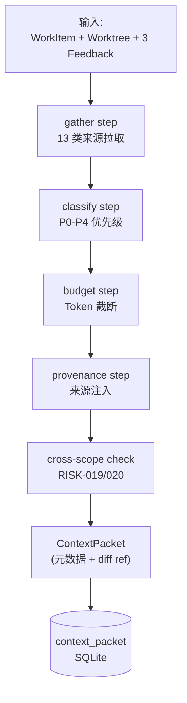

# POC-022: Context Compiler

> **状态**: Draft v0.1 (2026-08-25)
> **优先级**: MVP 必做
> **预估工期**: 5 人·天 / 1.5M tokens(AI 协作)
> **上游依赖**:
> - 《Requirements》REQ-CTX-001~005
> - 《Basic Design》§4.4(Context 全章)、§4.4.1(Minimum Sufficient Context)、§4.4.4(Token Budget + P0-P4 Priority Layer)、§4.4.5(Provenance 强制)、§4.10.7(Prompt Injection)、§26.1(Context Compiler 子系统)、§26.3(Context Packet Persistence)
> - 《Module Spec》domain-context-spec.md
> - 《Data Design》§4.7 (`context_packet` schema)
> - 《AI Agent Design》§6
> - 《ADR-024 / ADR-025》Context Compiler / Persistence
> - 《POC-021》Structured Feedback
> **下游**: 决定 §MVP Must-Have 中"Context Packet Generation"是否纳入 v0.1
> **Owner**: TBD

---

## 1. 目标

验证 **Context Compiler** 能在 1 WorkItem + 1 Worktree + 3 Feedback 输入下,
生成 **最小充分 ContextPacket**,
**Token Budget 符合 §4.4.4** + **Provenance 完整** + **跨 Worktree / Repository 不泄漏**。

**成功标准**(5 条可观测指标):
- [ ] Given 1 WorkItem + 1 Worktree + 3 Feedback,生成 ContextPacket,字段完整
- [ ] Token 总数 ≤ §4.4.4 阈值(MVP = 8K,PoC 校准用真实数据)
- [ ] P0-P4 Priority 5 层全部命中,每层至少有 1 项
- [ ] Provenance 100% 完整(每项来源可反查)
- [ ] 跨 Worktree / Repository 强制拒绝(RISK-019 / RISK-020)

## 2. 范围

**PoC 包含**:
- 13 类 Context 来源(§4.4.1):WorkItem / Acceptance / Worktree / Repository / Relevant Files / Symbols / ADR / Previous Decisions / Open Feedback / Failed Tests / Build Failure / Git Diff / PR Review / Agent Rules
- Token Budget 控制 + 截断策略(P0 永不全裁)
- Priority Layer(P0-P4)排序
- Provenance 字段注入
- Cross-Worktree / Cross-Repository 拦截
- ContextPacket 持久化(元数据,大文件走 Object Storage stub)

**PoC 不包含**:
- 真实 LLM 校验(只做结构化生成)
- ML 辅助 Context Selection(§30.3 V1)
- HandoffContextPacket 协议(留 V1 §4.2.7)
- Symbol-level Context(留 V1 POC-025)

## 3. 架构与环境

### 3.1 部署架构



### 3.2 技术栈

- **Compiler**: Rust 1.78+ / `tiktoken-rs` / `serde` / `sqlx`
- **Storage**: SQLite(元数据)+ 模拟 Object Storage(本地文件目录,引用)
- **Cross-scope Check**: 强制 tenant_id / worktree_id / repository_id 过滤

### 3.3 环境变量与配置

| 变量 | 默认 | 含义 |
|---|---|---|
| `STAR_POC_CTX_BUDGET` | `8000` | Token 上限(§4.4.4 MVP) |
| `STAR_POC_CTX_HARD_LIMIT` | `16000` | 硬上限(超出即截断 + 警告) |
| `STAR_POC_CTX_P0_RESERVE` | `0.2` | P0 预留比例(20%) |
| `STAR_POC_OBJECT_STORE_DIR` | `./obj-store` | 模拟 Object Storage |

## 4. 实施步骤

### 步骤 1: 13 类来源拉取(0.7d)
- 任务:实现 13 个 `gather_*` 函数,每类从对应表 / Adapter 拉数据
- 输入:basic-design §4.4.1
- 输出:`crates/domain-context/src/gather.rs`
- 验收:13 类各能拉到 1 条 fixture,字段对齐

### 步骤 2: Priority 分类(0.5d)
- 任务:`fn classify(items: Vec<ContextItem>) -> Vec<(Priority, ContextItem)>` 按 P0-P4 排序
- 输入:步骤 1
- 输出:`crates/domain-context/src/classify.rs`
- 验收:5 层 Priority 命中,排序稳定

### 步骤 3: Token Budget 截断(0.6d)
- 任务:`fn truncate(items: Vec<(Priority, ContextItem)>, budget: usize) -> Vec<ContextItem>`,P0 永不全裁,P4 先裁
- 输入:步骤 2 + tiktoken
- 输出:`crates/domain-context/src/budget.rs`
- 验收:超 budget 时 P4 全裁,P0 保留

### 步骤 4: Provenance 注入(0.3d)
- 任务:每项 ContextItem 携带 `Provenance { source_kind, source_id, source_version }`
- 输入:步骤 1
- 输出:`crates/domain-context/src/provenance.rs`
- 验收:反查 100% 命中

### 步骤 5: Cross-scope 拦截(0.4d)
- 任务:输入 Worktree / Repository ID,与每项 ContextItem 强校验,跨 ID 一律 0 票(§4.4.1 + RISK-019/020)
- 输入:步骤 1
- 输出:`crates/domain-context/src/scope_check.rs`
- 验收:注入跨 Worktree fixture 100% 拦截

### 步骤 6: ContextPacket 生成(0.5d)
- 任务:`struct ContextPacket { packet_id, workitem_id, worktree_id, items, total_tokens, priority_distribution, provenance_root }`
- 输入:步骤 1-5
- 输出:`crates/domain-context/src/packet.rs`
- 验收:字段齐全,持久化可查

### 步骤 7: 持久化(0.4d)
- 任务:`context_packet` 表 + 元数据落库,大文件(Git Diff > 1MB)走 Object Storage stub
- 输入:步骤 6
- 输出:`migrations/poc-022-001.sql` + `crates/context-store/`
- 验收:回放 5 次生成,内容稳定

### 步骤 8: 端到端 + 度量(0.6d)
- 任务:1 WorkItem + 1 Worktree + 3 Feedback fixture,跑 E2E,统计 5 条成功标准
- 输入:步骤 7
- 输出:`poc-022-report.md`
- 验收:全过

## 5. 关键脚本与命令

```bash
# 步骤 1-7: 跑端到端
cargo run --bin context-compile -- \
  --workitem wi_001 \
  --worktree wt_001 \
  --feedback fb_001,fb_002,fb_003 \
  --budget 8000
# 期望: 输出 ContextPacket JSON,total_tokens ≤ 8000

# 步骤 5: 跑 cross-scope
cargo run --bin context-compile -- \
  --workitem wi_001 \
  --worktree wt_001 \
  --feedback fb_999  # 属于 wt_002
# 期望: 0 票 + 警告日志 "cross_worktree_feedback_detected"

# 步骤 7: 查持久化
sqlite3 poc-022.db "SELECT packet_id, total_tokens FROM context_packet;"
ls obj-store/  # 模拟 Object Storage
```

```rust
// crates/domain-context/src/budget.rs (stub)
use tiktoken_rs::cl100k_base;

pub fn truncate(
    items: Vec<(Priority, ContextItem)>,
    budget: usize,
) -> Result<Vec<ContextItem>, BudgetError> {
    let bpe = cl100k_base().map_err(|_| BudgetError::EncoderUnavailable)?;
    let mut selected: Vec<ContextItem> = Vec::new();
    let mut used = 0usize;
    // P0..P4 顺序;P0 永不全裁
    for prio in [Priority::P0, Priority::P1, Priority::P2, Priority::P3, Priority::P4] {
        for (p, item) in items.iter().filter(|(pp, _)| *pp == prio) {
            let tokens = bpe.encode_with_special_tokens(&item.content).len();
            if prio == Priority::P0 || used + tokens <= budget {
                selected.push(item.clone());
                used += tokens;
            }
        }
    }
    Ok(selected)
}

// crates/domain-context/src/scope_check.rs (stub)
pub fn filter_cross_scope(
    items: Vec<ContextItem>,
    worktree_id: WorktreeId,
    repository_id: RepositoryId,
) -> Vec<ContextItem> {
    items.into_iter().filter(|it| {
        // RISK-019 / RISK-020 强制
        it.worktree_id == worktree_id && it.repository_id == repository_id
    }).collect()
}
```

## 6. 数据与测试夹具

**Schema 引用**(data-design §4.7 字段子集):
```sql
-- 引用 §4.7,非完整 DDL
CREATE TABLE context_packet (
  packet_id TEXT PRIMARY KEY,
  workitem_id TEXT NOT NULL,
  worktree_id TEXT NOT NULL,
  total_tokens INT NOT NULL,
  priority_distribution JSONB NOT NULL,  -- {P0: n, P1: n, ..., P4: n}
  items JSONB NOT NULL,
  provenance_root JSONB NOT NULL,
  created_at TIMESTAMPTZ NOT NULL
);
CREATE TABLE context_object_ref (
  ref_id TEXT PRIMARY KEY,
  packet_id TEXT NOT NULL REFERENCES context_packet(packet_id),
  kind TEXT NOT NULL,            -- git_diff | large_file
  storage_url TEXT NOT NULL,     -- obj-store://...
  size_bytes INT NOT NULL
);
```

**测试 fixture**:
- 1 WorkItem + 1 Worktree + 3 Feedback(1 CodeReview + 1 TestFailure + 1 UserComment)
- 故意超出 budget(注入 100 条历史决策)
- 跨 Worktree fixture(Feedback 属于 wt_002,Worktree = wt_001)
- 13 类来源各 1 条,验证完整拉取

## 7. 验证与度量

| 度量 | 目标 | 测量方式 |
|---|---|---|
| 字段完整 | 100% | schema 校验 |
| Total tokens | ≤ 8000(§4.4.4 MVP) | tiktoken |
| P0-P4 命中 | 5/5 | priority_distribution 字段 |
| Provenance 完整 | 100% | 反查测试 |
| 跨 scope 拦截 | 100% | 1 个 fixture |
| 持久化可回放 | 100% | 5 次生成,内容稳定 |
| P0 永不裁 | 100% | 注入超 budget,P0 仍存在 |

## 8. 风险与缓解

| 风险 | 缓解 |
|---|---|
| Token 估算与真实 LLM 不一致 | tiktoken cl100k_base 作为基线,V1 校准 |
| P0 永不全裁可能撑爆 budget | 设 hard limit 16K,P0 超出时警告 + 强制 fail-fast |
| Cross-scope 检查漏 | 所有 ContextItem 强制带 worktree_id / repository_id,缺则 fail |
| Object Storage stub 不可生产 | 抽象 `ObjectStore` trait,生产用 S3 / GCS |
| 13 类来源拉取性能差 | 拉取 + 分类并行,缓存 WorkItem / Acceptance 重复拉取 |

## 9. 后续阶段输入

- **MVP 决策**:Context Compiler 纳入 v0.1,8K budget + P0-P4 + 跨 scope 强制
- **接口承诺**:`compile(workitem, worktree, feedback) -> ContextPacket` 签名稳定
- **Provenance 协议**:`ProvenanceRef` 与 POC-021 对齐
- **下一步**:POC-023 Token Budget 校准依赖本 PoC 的 30 个真实 WorkItem 数据

## 附录 A:ContextPacket 示例

```json
{
  "packet_id": "cp_001",
  "workitem_id": "wi_001",
  "worktree_id": "wt_001",
  "total_tokens": 6420,
  "priority_distribution": {"P0": 3, "P1": 5, "P2": 8, "P3": 4, "P4": 2},
  "items": [
    {"priority": "P0", "kind": "WorkItem", "content": "Implement session expiry check", "tokens": 120, "provenance": {"source_kind": "work_item", "source_id": "wi_001"}},
    {"priority": "P0", "kind": "Acceptance", "content": "When session.expires_at < now(), return Err(Expired)", "tokens": 80, "provenance": {"source_kind": "acceptance", "source_id": "ac_001"}},
    {"priority": "P0", "kind": "AgentRules", "content": "Never use unwrap() in production code", "tokens": 60, "provenance": {"source_kind": "agent_rules", "source_id": "rules_001"}},
    {"priority": "P1", "kind": "OpenFeedback", "content": "Address: use expect() with error message", "tokens": 100, "provenance": {"source_kind": "feedback", "source_id": "fb_001"}},
    {"priority": "P1", "kind": "FailedTests", "content": "test_session_expiry expected Err(Expired) got Ok", "tokens": 80, "provenance": {"source_kind": "test_failure", "source_id": "tf_001"}},
    {"priority": "P2", "kind": "RelevantFiles", "content": "src/auth/session.rs (last 100 lines diff)", "tokens": 1200, "provenance": {"source_kind": "git_diff", "source_id": "abc123"}},
    {"priority": "P2", "kind": "PreviousDecisions", "content": "ADR-019: mTLS for Local Runtime", "tokens": 200, "provenance": {"source_kind": "adr", "source_id": "adr_019"}},
    {"priority": "P3", "kind": "BuildFailure", "content": "error[E0382]: borrow of moved value", "tokens": 80, "provenance": {"source_kind": "build_log", "source_id": "bld_555"}},
    {"priority": "P4", "kind": "GitDiff", "content": "...(truncated, see obj-store://cp_001/diff)", "tokens": 4500, "provenance": {"source_kind": "git_diff", "source_id": "abc123"}}
  ]
}
```

## 附录 B:决策记录

- **D-POC-022-01**:MVP budget = 8K(§4.4.4 中位值),hard limit = 16K;V1 用 POC-023 校准。
- **D-POC-022-02**:P0 永不全裁,超出 hard limit 时 fail-fast 而非静默裁剪。
- **D-POC-022-03**:Cross-scope 检查在 gather 阶段而非 compile 阶段,理由 = 早失败。
- **D-POC-022-04**:大文件走 Object Storage stub,生产用 S3(§5.4)。
