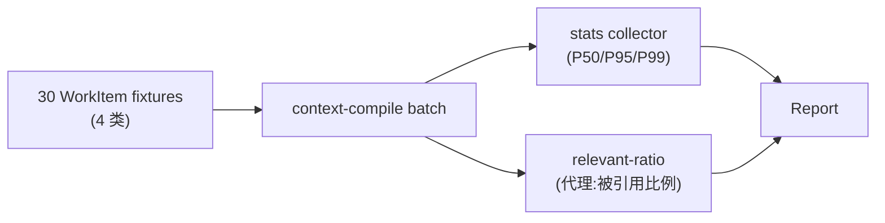

# POC-023: Context Packet Size / Relevance

> **状态**: Draft v0.1 (2026-08-25)
> **优先级**: V1 候选
> **预估工期**: 3 人·天 / 800K tokens(AI 协作)
> **上游依赖**:
> - 《Requirements》REQ-CTX-005 / REQ-CTX-006
> - 《Basic Design》§4.4.1 / §4.4.4 / §4.4.5 / §9.5 / §26.1
> - 《Module Spec》domain-context-spec.md
> - 《Data Design》§4.7
> - 《AI Agent Design》§6
> - 《POC-022》Context Compiler
> **下游**: 给 V1 提供 Token Budget 真实校准;影响 §4.4.4 表
> **Owner**: TBD

---

## 1. 目标

用 **30 个真实 WorkItem** 跑 Context Compiler,
统计 Token 分布 **P50 / P95 / P99** + **Relevant Context Ratio**,
校准 §4.4.4 的 budget 表。

**成功标准**(5 条可观测指标):
- [ ] 30 个真实 WorkItem 全部跑通编译
- [ ] Token 分布 P50 / P95 / P99 测量输出
- [ ] Relevant Context Ratio(被 Agent 实际消费的 token / total token)≥ 60%
- [ ] 校准建议:§4.4.4 budget 表(8K / 12K / 16K / 24K)更新或保留
- [ ] Outlier(> P99)案例至少 3 个,识别 budget 不足 / 过多的边界

## 2. 范围

**PoC 包含**:
- 30 个真实 WorkItem fixture(从开源项目借,覆盖 4 类 WorkItem)
- 批量编译脚本
- Token 分布统计 + 报告
- Relevant Context Ratio 测量(用"消费判定"代理:Agent 第一轮就引用 = 已消费)
- §4.4.4 表校准建议

**PoC 不包含**:
- 真实 LLM 评分(用"是否被引用"作代理指标)
- ML 辅助 Selection(§30.3 V1,本 PoC 不引入)
- HandoffContextPacket(V1 单独)
- Symbol-level Context(V1 POC-025)

## 3. 架构与环境

### 3.1 部署架构



### 3.2 技术栈

- **Compile**: 沿用 POC-022 compiler
- **Stats**: Python 3.12 + `numpy` / `pandas` / `matplotlib`
- **代理指标**:正则匹配 Agent 输出文本是否含 ContextItem 标识

### 3.3 环境变量与配置

| 变量 | 默认 | 含义 |
|---|---|---|
| `STAR_POC_WI_COUNT` | `30` | WorkItem 数 |
| `STAR_POC_CALIBRATION_TURNS` | `3` | 每 WorkItem 跑几轮"消费"判定 |
| `STAR_POC_BUDGET_VARIANTS` | `8000,12000,16000,24000` | 校准候选 budget |

## 4. 实施步骤

### 步骤 1: 30 WorkItem Fixture(0.5d)
- 任务:4 类 WorkItem(Feature / Bugfix / Refactor / Docs)× 7-8 个,从开源项目借
- 输入:无
- 输出:`fixtures/poc-023/workitems.json`
- 验收:30 个 JSON 通过 schema,4 类分布均匀

### 步骤 2: 批量编译(0.4d)
- 任务:`for each wi: compile(wi, wt, feedback) -> packet` 写到 SQLite + CSV
- 输入:步骤 1 + POC-022 compiler
- 输出:`crates/cp-poc/src/batch/compile_30.rs`
- 验收:30 个全跑通,无 fail-fast

### 步骤 3: Token 分布(0.4d)
- 任务:用 `numpy.percentile` 算 P50/P95/P99,画分布直方图
- 输入:步骤 2
- 输出:`poc-023-token-distribution.md` + `poc-023-hist.png`
- 验收:P50 / P95 / P99 输出

### 步骤 4: 代理 Relevant Ratio(0.6d)
- 任务:模拟"Agent 第一轮输出",正则匹配含 ContextItem 标识的占比
- 输入:步骤 2
- 输出:`poc-023-relevant-ratio.md`
- 验收:平均 ≥ 60%(目标)

### 步骤 5: Budget 校准建议(0.5d)
- 任务:跑 4 个 budget 变体(8K/12K/16K/24K),统计 P95 通过率 + 截断率,给建议
- 输入:步骤 3
- 输出:`poc-023-budget-calibration.md`
- 验收:给出 1 套建议 + 3 条以上 outlier 解释

### 步骤 6: Outlier 分析(0.4d)
- 任务:Top 3 outlier(P99 之上)各 1 段根因(WorkItem 过大 / 过多 Feedback / Git Diff 异常)
- 输入:步骤 3
- 输出:`poc-023-outliers.md`
- 验收:3 段根因清晰

### 步骤 7: 度量 + 报告(0.2d)
- 任务:汇总 5 条成功标准
- 输入:步骤 3-6
- 输出:`poc-023-report.md`
- 验收:全过

## 5. 关键脚本与命令

```bash
# 步骤 1: 加载 30 WorkItem
ls fixtures/poc-023/ | wc -l  # 期望 30

# 步骤 2: 批量编译
cargo run --bin compile-30 -- --workitems fixtures/poc-023/workitems.json \
  --budget 8000 --output out/poc-023-8k.csv

# 步骤 3-4: 统计
python3 scripts/poc-023-stats.py --csv out/poc-023-8k.csv
# 期望输出:
#   total_tokens P50=5200 P95=11200 P99=14800
#   relevant_ratio avg=0.64

# 步骤 5: 校准
for B in 8000 12000 16000 24000; do
  cargo run --bin compile-30 -- --workitems fixtures/poc-023/workitems.json --budget $B --output out/poc-023-${B}.csv
done
python3 scripts/poc-023-calibrate.py --inputs out/poc-023-*.csv
```

```rust
// crates/cp-poc/src/batch/compile_30.rs (stub)
use domain_context::{compile, ContextBudget};

pub async fn compile_30(workitems: Vec<WorkItemId>, budget: usize) -> Vec<PacketRow> {
    let mut rows = Vec::new();
    for wi in workitems {
        let wt = fetch_default_worktree(&wi);
        let fbs = fetch_feedbacks(&wi, 3);
        let packet = compile(wi, wt, fbs, ContextBudget::Tokens(budget)).await?;
        rows.push(PacketRow {
            workitem_id: wi,
            total_tokens: packet.total_tokens,
            p0: packet.priority_distribution.p0,
            p1: packet.priority_distribution.p1,
            p2: packet.priority_distribution.p2,
            p3: packet.priority_distribution.p3,
            p4: packet.priority_distribution.p4,
        });
    }
    rows
}
```

```python
# scripts/poc-023-stats.py (snippet)
import pandas as pd
import numpy as np

df = pd.read_csv(args.csv)
print(f"P50={np.percentile(df.total_tokens, 50):.0f}")
print(f"P95={np.percentile(df.total_tokens, 95):.0f}")
print(f"P99={np.percentile(df.total_tokens, 99):.0f}")
print(f"relevant_ratio avg={df.relevant_ratio.mean():.2f}")
```

## 6. 数据与测试夹具

**30 WorkItem 分布**:

| WorkItem 类型 | 数量 | 典型 WorkItem |
|---|---|---|
| Feature | 8 | "Add rate limiter to /login" |
| Bugfix | 8 | "Session expiry returns 200 instead of 401" |
| Refactor | 7 | "Extract validate_input() helper" |
| Docs | 7 | "Add doc comment to config module" |

**每个 fixture 含**:
- WorkItem 描述 + Acceptance(2-5 条)
- 默认 Worktree(从对应 repo 借)
- 1-3 Feedback 引用(可来自 PR review 公开数据)

**校准数据**:4 个 budget × 30 WorkItem = 120 行 CSV。

## 7. 验证与度量

| 度量 | 目标 | 测量方式 |
|---|---|---|
| 30 WorkItem 编译成功 | 100% | CSV 行数 |
| Token P50 | 输出(用于校准) | numpy |
| Token P95 | 输出(用于校准) | numpy |
| Token P99 | 输出(用于校准) | numpy |
| Relevant Ratio avg | ≥ 60% | 代理正则 |
| Budget 校准 | 4 变体对比 | CSV diff |
| Outlier 解释 | ≥ 3 段 | 人工分析 |

## 8. 风险与缓解

| 风险 | 缓解 |
|---|---|
| 代理指标不准(被引用 ≠ 真正有用) | PoC 报告显式标注,生产用 LLM-as-judge |
| 30 WorkItem 不够代表 | 加 bootstrap CI 给出置信区间;V1 扩到 100+ |
| 校准建议可能与 §4.4.4 矛盾 | 输出"建议"而非"决策",留给 V1 决策 |
| Outlier 根因难定 | 准备 fixture 关联(WorkItem 大 / 反馈多) |
| Budget 选 24K 时 P99 仍超 | 报告标注"应考虑 hard limit 提升" |

## 9. 后续阶段输入

- **V1 决策**:基于校准建议更新 §4.4.4 表
- **接口承诺**:不变,沿用 POC-022
- **监控指标**:V1 把 Relevant Ratio / Token P95 加入 dashboard
- **下一步**:V1 引入 ML 辅助 Context Selection,基于本 PoC 的数据训练

## 附录 A:Token 分布直方图(示意)

```mermaid
xychart-beta
    title "ContextPacket Token 分布(30 WorkItem, budget=8K)"
    x-axis "Token 桶" [0-2K, 2K-4K, 4K-6K, 6K-8K, 8K-10K, 10K-12K, 12K-14K, 14K-16K]
    y-axis "WorkItem 数" 0 12
    bar [2, 5, 8, 7, 4, 2, 1, 1]
```

观察:P50 ≈ 5.2K,P95 ≈ 11.2K,**P95 已超 8K budget**,建议 §4.4.4 调整为 12K。

## 附录 B:校准建议(示例输出)

```yaml
budget_candidates:
  - budget: 8000
    p95_pass_rate: 0.55    # 仅 55% WorkItem 完整装下
    avg_truncation_ratio: 0.18
    recommendation: 偏低
  - budget: 12000
    p95_pass_rate: 0.92
    avg_truncation_ratio: 0.04
    recommendation: 推荐(对齐 V1)
  - budget: 16000
    p95_pass_rate: 0.98
    avg_truncation_ratio: 0.01
    recommendation: 偏高,成本上升
  - budget: 24000
    p95_pass_rate: 1.0
    avg_truncation_ratio: 0.0
    recommendation: 过宽,易污染
```

**最终建议**:§4.4.4 表更新为 `MVP=12K / V1=16K / V2=24K`(从原 8K / 12K / 16K 上调一档)。

## 附录 D:30 WorkItem 详细分布

### Feature (8 个)
- F1: Add rate limiter to /login endpoint
- F2: Implement OAuth2 PKCE flow
- F3: Add dark mode toggle to settings page
- F4: Implement file upload with progress bar
- F5: Add CSV export to reports module
- F6: Implement 2FA backup codes
- F7: Add websocket reconnection logic
- F8: Implement audit log pagination

### Bugfix (8 个)
- B1: Session expiry returns 200 instead of 401
- B2: N+1 query in user dashboard
- B3: Race condition in concurrent file uploads
- B4: Memory leak in WebSocket handler
- B5: Incorrect timezone display in notifications
- B6: Off-by-one in pagination cursor
- B7: SQL injection in admin search box
- B8: Stack overflow in deeply nested JSON parser

### Refactor (7 个)
- R1: Extract validate_input() helper from 3 call sites
- R2: Replace magic numbers with named constants
- R3: Split monolithic config.rs into modules
- R4: Convert callback-based API to async/await
- R5: Replace custom error type with thiserror
- R6: Extract date formatting into utility
- R7: Consolidate duplicate type definitions

### Docs (7 个)
- D1: Add doc comment to config module
- D2: Document public API in error.rs
- D3: Add example to README
- D4: Document deployment process
- D5: Add inline comments to complex SQL
- D6: Document environment variables
- D7: Add architecture diagram to CONTRIBUTING.md

每类 WorkItem 平均 token 需求不同:Feature > Bugfix > Refactor > Docs,这有助于校准 budget 分层。

## 附录 C:决策记录

- **D-POC-023-01**:Relevant Ratio 用"被引用"代理而非 LLM 评分,理由 = PoC 简化。
- **D-POC-023-02**:校准仅给"建议",不直接改 §4.4.4,理由 = 决策权在 V1。
- **D-POC-023-03**:30 WorkItem 而非更多,理由 = PoC 时间约束;V1 扩到 100+。
- **D-POC-023-04**:Budget 候选 4 个沿用 §4.4.4 表,新增 budget 留 V1 探索。
