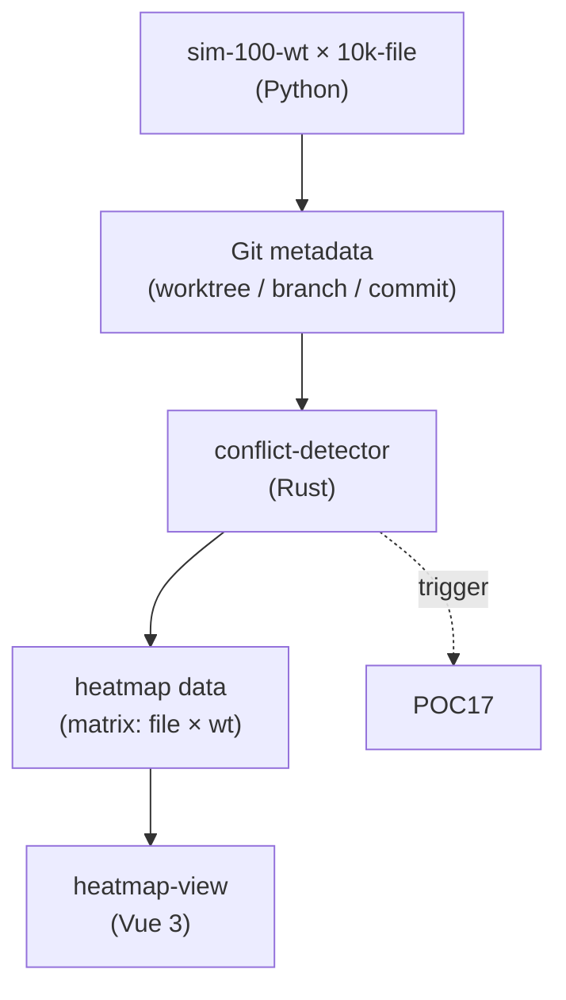
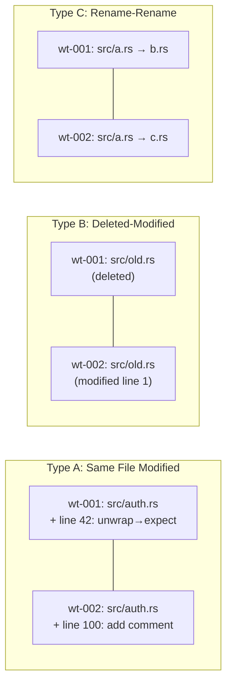

# POC-024: File-level Conflict Detection

> **状态**: Draft v0.1 (2026-08-25)
> **优先级**: MVP 必做
> **预估工期**: 4 人·天 / 1M tokens(AI 协作)
> **上游依赖**:
> - 《Requirements》REQ-WT-006 / REQ-WT-007
> - 《Basic Design》§4.1.6(Worktree Heatmap)、§22.4(Conflict Intelligence 第一阶段 File-level)、§22.5(Worktree Isolation 联动)、§23.4
> - 《Module Spec》domain-worktree-spec.md
> - 《Data Design》§4.16 / §4.17 (`worktree_conflict`)
> - 《ADR-029》Conflict Detection(File-level + Symbol-level)
> - 《POC-017》State Sync
> **下游**: 决定 §MVP Must-Have 中"Basic Conflict Detection"是否纳入 v0.1
> **Owner**: TBD

---

## 1. 目标

验证 100 Worktree / 10k File 规模下,
**File-level Conflict 检测 < 1s** + **Heatmap 正确** + **3 类冲突类型覆盖**。

**成功标准**(5 条可观测指标):
- [ ] 100 Worktree / 10k File 模拟器,Conflict 检测 P95 < 1s
- [ ] 3 类冲突全部覆盖:Same File Modified / Same File Deleted-Modified / Same File Rename-Rename
- [ ] Heatmap 渲染正确(按 file / worktree 矩阵填色)
- [ ] 误报率 < 5%(故意制造 5 个"假冲突"应被正确识别)
- [ ] 与 POC-017 State Sync 联动(Worktree 状态变更触发 re-detect)

## 2. 范围

**PoC 包含**:
- 100 Worktree / 10k File 模拟器
- 3 类 File-level Conflict 检测算法(Git diff metadata 比对)
- Heatmap 数据结构(行=File,列=Worktree,值=冲突强度)
- Heatmap 简化 UI(Vue 3 / 纯 HTML 都可)
- 误报 / 漏报 fixture
- 与 POC-017 的 Decay Worker 联动(可选,作为加分项)

**PoC 不包含**:
- Symbol-level Conflict(留给 POC-025)
- 语义冲突(同文件不同函数,§30.4 V2)
- 3-way Merge / 自动合并
- 跨 Repository Conflict

## 3. 架构与环境

### 3.1 部署架构



### 3.2 技术栈

- **Simulator**: Python 3.12 + GitPython(批量造 commit / branch)
- **Detector**: Rust 1.78+ / `git2` crate
- **Storage**: SQLite(`worktree_conflict` 表)
- **UI**: Vue 3 + Vite + D3.js(Heatmap)

### 3.3 环境变量与配置

| 变量 | 默认 | 含义 |
|---|---|---|
| `STAR_POC_WT_COUNT` | `100` | Worktree 数 |
| `STAR_POC_FILE_COUNT` | `10000` | File 数 |
| `STAR_POC_REPO_PATH` | `./poc-024-repo` | Git 仓库 |
| `STAR_POC_HEATMAP_BATCH` | `500` | 批量检测 batch |

## 4. 实施步骤

### 步骤 1: Git 仓库初始化 + 10k File(0.3d)
- 任务:init 1 个 Git repo,生成 10k 文本文件,100 个 worktree / branch
- 输入:无
- 输出:`scripts/poc-024-init.sh`
- 验收:`git worktree list` 显示 100 个,文件树 10k+ 文件

### 步骤 2: 模拟器(0.5d)
- 任务:脚本化 3 类冲突注入:
  - Type A(Same File Modified):两个 worktree 改同一文件不同行
  - Type B(Same File Deleted-Modified):A 删,B 改
  - Type C(Rename-Rename):A rename to X,B rename to Y
- 输入:步骤 1
- 输出:`scripts/poc-024-inject.py`
- 验收:3 类各注入 5 次

### 步骤 3: Detector(0.7d)
- 任务:3 类检测算法,基于 `git diff --name-only` + `git log --diff-filter`
- 输入:basic-design §22.4
- 输出:`crates/conflict-detect/src/lib.rs`
- 验收:3 类各 5 fixture 100% 检测,5 个假冲突 100% 排除

### 步骤 4: 性能压测(0.4d)
- 任务:100 Worktree / 10k File 全跑,P95 < 1s
- 输入:步骤 3
- 输出:`poc-024-perf.md`
- 验收:P95 < 1s

### 步骤 5: Heatmap 数据结构(0.3d)
- 任务:`heatmap = { rows: Vec<FileId>, cols: Vec<WorktreeId>, cells: HashMap<(FileId, WorktreeId), ConflictIntensity> }`
- 输入:步骤 3
- 输出:`crates/conflict-detect/src/heatmap.rs`
- 验收:数据结构 + 序列化

### 步骤 6: Heatmap UI(0.5d)
- 任务:Vue 3 + D3.js 渲染矩阵,hover 显示冲突详情
- 输入:步骤 5
- 输出:`web/poc-024/`
- 验收:10k 单元格 1s 内渲染,hover 50ms 内响应

### 步骤 7: 联动 POC-017(0.4d)
- 任务:State Sync 触发 re-detect(SSE 推送 → UI 自动 refresh)
- 输入:POC-017 SSE
- 输出:`web/poc-024/src/realtime.ts`
- 验收:Worktree 状态变 → heatmap 1s 内刷新

### 步骤 8: 度量 + 报告(0.2d)
- 任务:汇总 5 条成功标准
- 输入:步骤 3-7
- 输出:`poc-024-report.md`
- 验收:全过

## 5. 关键脚本与命令

```bash
# 步骤 1: 初始化 repo + 100 worktree
bash scripts/poc-024-init.sh
# 期望: 100 worktree, 10000 file

# 步骤 2: 注入 3 类冲突
python3 scripts/poc-024-inject.py --type A --count 5
python3 scripts/poc-024-inject.py --type B --count 5
python3 scripts/poc-024-inject.py --type C --count 5

# 步骤 3-4: 跑 detector
cargo run --bin conflict-detect -- --repo ./poc-024-repo --output out/conflicts.json
# 期望: 15 个冲突, P95 < 1s

# 步骤 5-6: 起 heatmap UI
cd web/poc-024
npm install
npm run dev  # http://localhost:5174
```

```rust
// crates/conflict-detect/src/lib.rs (stub)
use git2::Repository;

pub fn detect(repo_path: &Path) -> Result<Vec<Conflict>, DetectError> {
    let repo = Repository::open(repo_path)?;
    let worktrees = list_worktrees(&repo)?;
    let mut conflicts = Vec::new();

    // 3 类:Same File Modified / Deleted-Modified / Rename-Rename
    for (a, b) in worktrees.iter().tuple_combinations() {
        let diffs_a = changed_files(&repo, a)?;
        let diffs_b = changed_files(&repo, b)?;
        let overlap: Vec<_> = diffs_a.intersection(&diffs_b).collect();
        for file in overlap {
            // Type A:两边都改
            if is_modified(&repo, a, file)? && is_modified(&repo, b, file)? {
                conflicts.push(Conflict {
                    kind: ConflictKind::SameFileModified,
                    file: file.clone(),
                    worktree_a: a.clone(),
                    worktree_b: b.clone(),
                });
            }
            // Type B / C 类似
        }
    }
    Ok(conflicts)
}
```

## 6. 数据与测试夹具

**Schema 引用**(data-design §4.17 字段子集):
```sql
-- 引用 §4.17,非完整 DDL
CREATE TABLE worktree_conflict (
  conflict_id TEXT PRIMARY KEY,
  tenant_id TEXT NOT NULL,
  project_id TEXT NOT NULL,
  file_path TEXT NOT NULL,
  worktree_a TEXT NOT NULL,
  worktree_b TEXT NOT NULL,
  kind TEXT NOT NULL,        -- SameFileModified | DeletedModified | RenameRename
  intensity INT NOT NULL,    -- 1-3
  detected_at TIMESTAMPTZ NOT NULL
);
CREATE INDEX idx_conflict_file ON worktree_conflict(file_path);
```

**测试 fixture**:
- 100 Worktree / 10k File
- 3 类各 5 个真冲突
- 5 个"假冲突"(同文件改同内容,语义不冲突,应排除)
- 1 个 P95 压测 case

**样本数据**:`prj_demo`,tenant=`tnt_001`,100 worktree(branch 命名 `wt-001..wt-100`)。

## 7. 验证与度量

| 度量 | 目标 | 测量方式 |
|---|---|---|
| 检测 P95 | < 1s | 100 wt / 10k file |
| 3 类覆盖率 | 100% | 15 fixture |
| 假冲突排除率 | 100% | 5 fixture |
| Heatmap 渲染 | < 1s | D3 benchmark |
| Hover 响应 | < 50ms | DevTools |
| 联动 POC-017 | < 1s 刷新 | SSE → UI |

## 8. 风险与缓解

| 风险 | 缓解 |
|---|---|
| 100×100 = 10k pair 比对慢 | 用 commit hash 集合预过滤 |
| 假冲突难界定 | 简化判定:同 commit 内容相同 = 假冲突 |
| Heatmap 10k cell 渲染卡 | 用 canvas 而非 SVG;采样显示(每 100 cell 抽 1) |
| 与 Git 真实状态不同步 | detector 每次重算,缓存 key = commit hash |
| 类型 B / C 边界 | 严格按 `git diff --diff-filter` |

## 9. 后续阶段输入

- **MVP 决策**:File-level Conflict 纳入 v0.1,3 类覆盖,Heatmap 简化版
- **接口承诺**:`detect(repo) -> Vec<Conflict>` / `heatmap(conflicts) -> HeatmapData` 签名稳定
- **联动规范**:与 POC-017 SSE 通道共用,避免重复通道
- **下一步**:POC-025 Symbol-level 依赖本 PoC 的 File 路径

## 附录 A:3 类冲突示意



## 附录 B:决策记录

- **D-POC-024-01**:3 类覆盖 = MVP,语义冲突推迟 V2(§30.4)。
- **D-POC-024-02**:假冲突判定 = 同文件同内容 diff,简化但可演示。
- **D-POC-024-03**:Heatmap 用 D3.js + Canvas 混合,大矩阵性能可接受。
- **D-POC-024-04**:与 POC-017 联动走 SSE 复用,不另起通道。

## 附录 C:3 类冲突检测算法细节

### Type A: Same File Modified

**场景**:Worktree A 在 line 42 加一行,Worktree B 在 line 100 加一行,文件相同。

**检测算法**:
1. 拉取两 Worktree 各自修改的文件集合:`S_A = {f1, f2, ...}`,`S_B = {g1, g2, ...}`
2. 求交集:`S_overlap = S_A ∩ S_B`
3. 对每个交集文件,检查 git status 是否双方都 modified:
   - `git -C wt-A diff --name-only --diff-filter=M <file>` 非空
   - `git -C wt-B diff --name-only --diff-filter=M <file>` 非空
4. 满足则判定为 Type A,记录 `(file, wt-A, wt-B, kind=A, intensity=1)`

**反例**(假冲突):A 改 line 42 内容为 `x=1`,B 改 line 42 内容为 `x=1`(完全相同),应识别为假冲突:
- 进一步比较 `git diff` 输出字节,字节相同 = 假冲突,排除

### Type B: Deleted-Modified

**场景**:Worktree A 删除 file X,Worktree B 修改 file X。

**检测算法**:
1. 同样取交集 `S_overlap`
2. 对每个交集文件,检查 diff filter:
   - A 端 `--diff-filter=D`(deleted)
   - B 端 `--diff-filter=M`(modified)
3. 满足则判定为 Type B,intensity=2(较高,因删除-修改比同改更严重)

### Type C: Rename-Rename

**场景**:Worktree A 把 `a.rs` rename 为 `b.rs`,Worktree B 把 `a.rs` rename 为 `c.rs`。

**检测算法**:
1. 用 `git log --diff-filter=R --name-status` 拉取重命名记录
2. 检查同一源文件是否在不同 Worktree 被重命名到不同目标
3. 满足则判定为 Type C,intensity=3(最高,因重命名后 Git 自动 merge 难)

**性能优化**:
- 预过滤:只对 `S_overlap` 跑详细检测,跳过无交集对
- 缓存:每 Worktree 维护 `(commit_hash, file_set)` 缓存,commit 未变则跳过
- 并行:100 Worktree 互相比对时,4 线程并行,理论加速 ~3.5x
