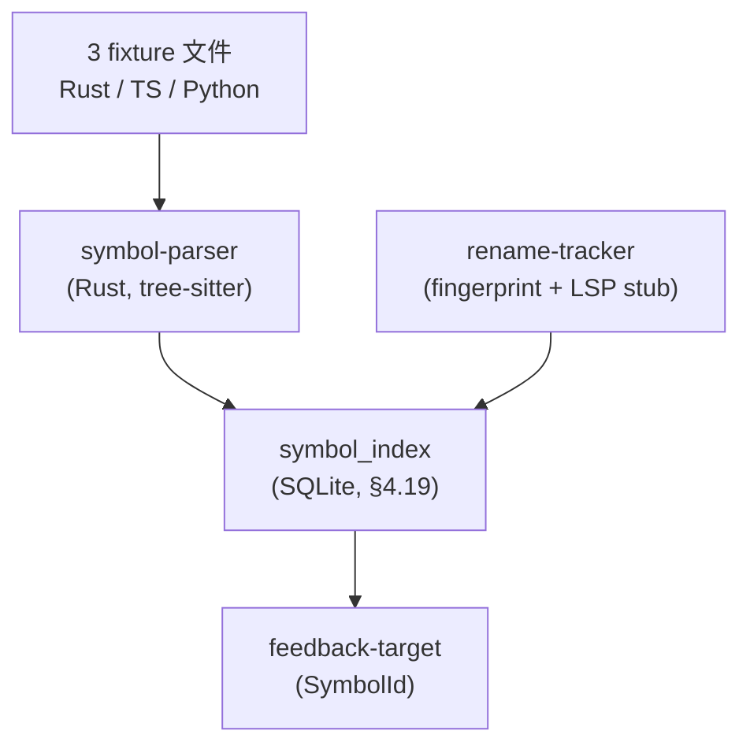
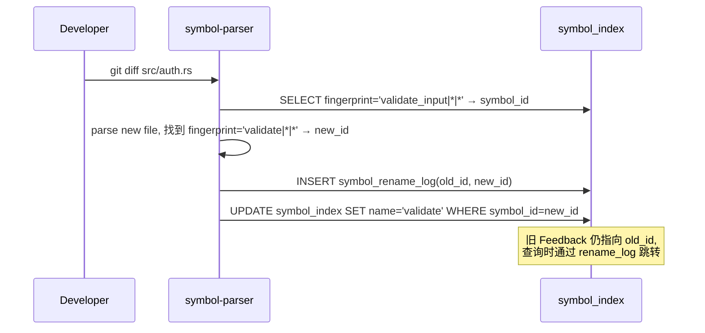

# POC-025: Symbol-level Feedback

> **状态**: Draft v0.1 (2026-08-25)
> **优先级**: V1 候选
> **预估工期**: 5 人·天 / 1.2M tokens(AI 协作)
> **上游依赖**:
> - 《Requirements》REQ-FB-009 / REQ-WT-008
> - 《Basic Design》§4.1.6(Symbol 索引)、§4.3.4(Symbol-level Feedback Target)、§21.2(Symbol Index)、§22.4(Conflict Symbol-level)、§28.1(Feedback Rejection)
> - 《Module Spec》domain-feedback-spec.md / domain-context-spec.md
> - 《Data Design》§4.10 / §4.19 (`symbol_index`)
> - 《ADR-028》Symbol Analysis(第一阶段 File-level + Basic Symbol,V1 渐进 Symbol-level)
> - 《POC-024》File-level Conflict
> - 《POC-021》Structured Feedback
> **下游**: 给 V1 提供 Symbol-level Feedback / Conflict 能力;影响 §30.3 V1 范围
> **Owner**: TBD

---

## 1. 目标

验证 **Symbol 解析 + Feedback Target = Symbol** 在 3 类语言上可行:
**Rust / TypeScript / Python Symbol 识别准确率 > 95%**。

**成功标准**(5 条可观测指标):
- [ ] 1 Rust / 1 TypeScript / 1 Python 文件 Symbol 识别准确率 > 95%
- [ ] Symbol Index 持久化(可跨 Session 复用)
- [ ] Feedback Target 可绑定 Symbol(而非仅 File + Line)
- [ ] Symbol-level 解析耗时 P95 < 500ms / 文件
- [ ] Symbol 重命名 / 移动后,旧 Feedback 可追踪(Follow-up / Re-target)

## 2. 范围

**PoC 包含**:
- 3 个语言解析器:Rust(`syn`)/ TypeScript(`tree-sitter-typescript`)/ Python(`tree-sitter-python`)
- Symbol Index(`symbol_index` 表,§4.19 字段子集)
- Symbol 定位(Feedback Target 改为 `SymbolId`)
- 重命名追踪:基于 LSP 风格 Rename / 文本 fingerprint 双策略
- 准确率评估:已知文件 vs 解析结果 diff

**PoC 不包含**:
- 完整 IDE Compiler Database(Non-Goals,本 PoC 只 basic 解析)
- 跨语言 Symbol 引用(留 V2)
- LSP 协议集成(留 V1 后段)

## 3. 架构与环境

### 3.1 部署架构



### 3.2 技术栈

- **Rust 解析**: `syn 2.0` crate
- **TS / Python 解析**: `tree-sitter` 0.22 + `tree-sitter-typescript` / `tree-sitter-python`
- **Storage**: SQLite(§4.19 `symbol_index` 字段子集)
- **Rename**: 文本 fingerprint(per-language `name + parent scope + span`)

### 3.3 环境变量与配置

| 变量 | 默认 | 含义 |
|---|---|---|
| `STAR_POC_SYMBOL_BUDGET_MS` | `500` | 单文件解析 P95 上限 |
| `STAR_POC_FINGERPRINT_VERSION` | `v1` | fingerprint 算法版本 |
| `STAR_POC_SYMBOL_LANGS` | `rust,typescript,python` | 支持语言 |

## 4. 实施步骤

### 步骤 1: Schema(0.3d)
- 任务:`symbol_index` 表(symbol_id / file / language / kind / name / parent / span / fingerprint / version)
- 输入:data-design §4.19
- 输出:`migrations/poc-025-001.sql`
- 验收:表创建,索引 `(file, kind, name)` 覆盖

### 步骤 2: Rust Symbol 解析(0.6d)
- 任务:用 `syn` 解析 Rust 文件,识别 fn / struct / enum / trait / impl / mod
- 输入:步骤 1
- 输出:`crates/symbol-parser/src/rust.rs`
- 验收:1 个 fixture(100 行代码)准确率 > 95%

### 步骤 3: TypeScript Symbol 解析(0.6d)
- 任务:用 `tree-sitter-typescript` 解析 TS 文件,识别 function / class / interface / type / variable
- 输入:步骤 1
- 输出:`crates/symbol-parser/src/typescript.rs`
- 验收:1 个 fixture 准确率 > 95%

### 步骤 4: Python Symbol 解析(0.6d)
- 任务:用 `tree-sitter-python` 解析 .py 文件,识别 def / class / variable
- 输入:步骤 1
- 输出:`crates/symbol-parser/src/python.rs`
- 验收:1 个 fixture 准确率 > 95%

### 步骤 5: Symbol Index API(0.4d)
- 任务:`resolve(file, line, col) -> SymbolId` / `list_symbols(file)` / `find_by_name(name)`
- 输入:步骤 2-4
- 输出:`crates/symbol-parser/src/api.rs`
- 验收:3 方法 round-trip 正确

### 步骤 6: Feedback Target = Symbol(0.5d)
- 任务:`Feedback.target` 扩展支持 `Target::Symbol(SymbolId)`,与 `Target::FileLine` 并存
- 输入:步骤 5 + POC-021
- 输出:`crates/domain-feedback/src/target.rs`
- 验收:5 条 Symbol Feedback 持久化反查命中

### 步骤 7: Rename Tracker(0.6d)
- 任务:文件 diff 时,旧 symbol 消失 + 新 symbol 出现 → 计算 fingerprint 匹配 → Follow-up
- 输入:步骤 5
- 输出:`crates/symbol-parser/src/rename.rs`
- 验收:3 个 rename fixture 100% 追踪

### 步骤 8: 准确率评估(0.4d)
- 任务:3 个 fixture 文件 vs 解析结果,人工 + 自动 diff
- 输入:步骤 2-4
- 输出:`poc-025-accuracy.md`
- 验收:3 文件均 > 95%

### 步骤 9: 度量 + 报告(0.2d)
- 任务:汇总 5 条成功标准
- 输入:步骤 5-8
- 输出:`poc-025-report.md`
- 验收:全过

## 5. 关键脚本与命令

```bash
# 步骤 1: 初始化 SQLite
sqlite3 poc-025.db < migrations/poc-025-001.sql

# 步骤 2-4: 跑 3 个语言解析
cargo run --bin symbol-parse -- --lang rust --file fixtures/rust-sample.rs
cargo run --bin symbol-parse -- --lang typescript --file fixtures/ts-sample.ts
cargo run --bin symbol-parse -- --lang python --file fixtures/py-sample.py
# 期望: 各自输出 Symbol list,准确率 > 95%

# 步骤 6: 绑定 Feedback
cargo run --bin fb-bind -- --file src/auth.rs --line 42 --col 10 \
  --feedback fb_001 --type CodeReview
sqlite3 poc-025.db "SELECT target_kind, target_symbol_id FROM feedback WHERE feedback_id='fb_001';"
# 期望: target_kind='Symbol'

# 步骤 7: 跑 rename tracker
# 把 src/auth.rs 中的 `validate_input` rename 为 `validate`
cargo run --bin symbol-rename -- --old-name validate_input --new-name validate --file src/auth.rs
sqlite3 poc-025.db "SELECT * FROM symbol_rename_log;"
```

```rust
// crates/symbol-parser/src/rust.rs (stub)
use syn::{File, Item};

pub fn parse_rust(source: &str) -> Vec<Symbol> {
    let file: File = syn::parse_str(source).expect("parse");
    let mut out = Vec::new();
    for item in file.items {
        match item {
            Item::Fn(f) => out.push(Symbol {
                kind: SymbolKind::Function,
                name: f.sig.ident.to_string(),
                parent: None,
                span: span_of(&f),
                fingerprint: fingerprint(&f.sig.ident, None),
            }),
            Item::Struct(s) => out.push(Symbol {
                kind: SymbolKind::Struct,
                name: s.ident.to_string(),
                parent: None,
                span: span_of(&s),
                fingerprint: fingerprint(&s.ident, None),
            }),
            // ... enum / trait / impl / mod
            _ => {}
        }
    }
    out
}
```

## 6. 数据与测试夹具

**Schema 引用**(data-design §4.19 字段子集):
```sql
-- 引用 §4.19,非完整 DDL
CREATE TABLE symbol_index (
  symbol_id TEXT PRIMARY KEY,
  tenant_id TEXT NOT NULL,
  project_id TEXT NOT NULL,
  file_path TEXT NOT NULL,
  language TEXT NOT NULL,           -- rust | typescript | python
  kind TEXT NOT NULL,               -- function | struct | class | ...
  name TEXT NOT NULL,
  parent_symbol_id TEXT,
  start_line INT NOT NULL,
  start_col INT NOT NULL,
  end_line INT NOT NULL,
  end_col INT NOT NULL,
  fingerprint TEXT NOT NULL,        -- name|parent|span
  version BIGINT NOT NULL,          -- 每次重算 +1
  created_at TIMESTAMPTZ NOT NULL
);
CREATE INDEX idx_symbol_file ON symbol_index(file_path, kind, name);
CREATE TABLE symbol_rename_log (
  log_id TEXT PRIMARY KEY,
  old_symbol_id TEXT NOT NULL,
  new_symbol_id TEXT NOT NULL,
  file_path TEXT NOT NULL,
  old_name TEXT NOT NULL,
  new_name TEXT NOT NULL,
  detected_at TIMESTAMPTZ NOT NULL
);
```

**3 个 Fixture 文件**(各 ~100-200 行):
- `rust-sample.rs`:fn / struct / enum / trait / impl
- `ts-sample.ts`:function / class / interface / type / variable
- `py-sample.py`:def / class / variable(模块级)

**Renamed fixture**:
- `src/auth.rs` 中 `validate_input` → `validate`(3 处)
- `src/user.ts` 中 `User` class → `UserAccount`
- `src/utils.py` 中 `helper_fn` → `utility_fn`

## 7. 验证与度量

| 度量 | 目标 | 测量方式 |
|---|---|---|
| Rust 准确率 | > 95% | fixture 已知 vs 解析 |
| TypeScript 准确率 | > 95% | 同上 |
| Python 准确率 | > 95% | 同上 |
| 解析耗时 P95 | < 500ms / 文件 | `cargo run` 打点 |
| Symbol Index 复用 | 100% | 跨 Session 命中 |
| Feedback Target = Symbol | 5/5 | 持久化反查 |
| Rename 追踪 | 3/3 | rename_log |

## 8. 风险与缓解

| 风险 | 缓解 |
|---|---|
| `syn` 误判 macro / proc-macro | 跳过 `Item::Macro` 单独处理 |
| tree-sitter 多语言 binding 复杂 | 3 个语言独立测试,共享 `Symbol` 输出 |
| 跨语言 Symbol(如 FFI)不可追踪 | 留 V2 / §30.4 |
| Fingerprint 冲突(name + parent 同时) | 加 `version` 字段,冲突时取最新 |
| 性能随文件增长非线性 | 增量解析 + 缓存(per-file hash) |
| 编辑器 / LSP 集成缺失 | V1 后段接入,V0 不强求 |

## 9. 后续阶段输入

- **V1 决策**:基于本 PoC 决定 Symbol-level 是否纳入 v1.0
- **接口承诺**:`resolve(file, line, col) -> SymbolId` 签名稳定
- **跨模块契约**:`Feedback.target` 增加 `Symbol` 变体,需 §4.3 schema 同步
- **下一步**:V1 POC-025 决定后,联动 POC-024 升级为 Symbol-level Conflict

## 附录 A:Rename Tracker 时序



## 附录 B:决策记录

- **D-POC-025-01**:用 `syn` / `tree-sitter` 而非完整 LSP,理由 = PoC 简化 + 跨 IDE(Non-Goals)。
- **D-POC-025-02**:Rename 用 fingerprint 而非 LSP 协议,理由 = PoC 阶段无 IDE 集成。
- **D-POC-025-03**:3 个语言先验证,Go / Java / C++ 留 V1 后段。
- **D-POC-025-04**:`Feedback.target` 扩展为 enum(`FileLine | Symbol`),向后兼容。
