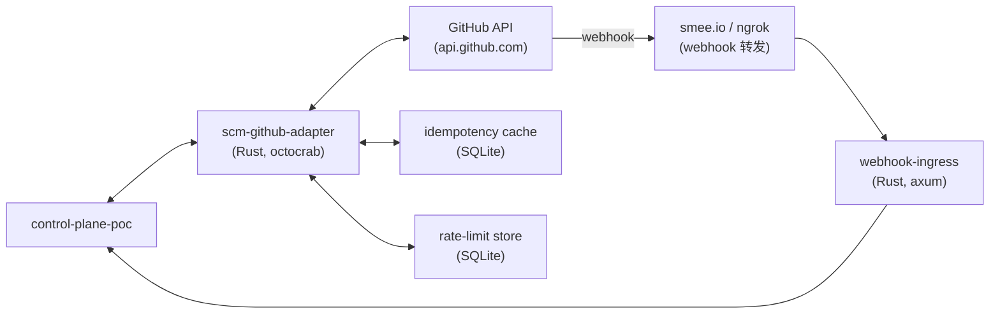
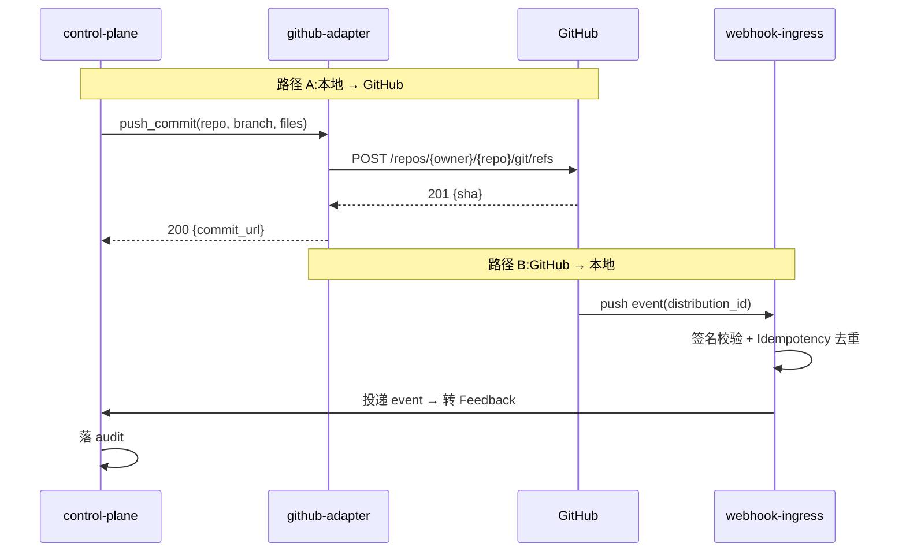

# POC-026: GitHub Adapter

> **状态**: Draft v0.1 (2026-08-25)
> **优先级**: MVP 必做
> **预估工期**: 4 人·天 / 1.2M tokens(AI 协作)
> **上游依赖**:
> - 《Requirements》REQ-SCM-001~010
> - 《Basic Design》§4.5(SCM Port)、§4.5.5(AI Completion 判定链)、§18.1(SCM Adapter / 双向 Sync)、§27(Bidirectional Sync Loop 防护)
> - 《Module Spec》domain-scm-spec.md
> - 《Data Design》§4.21 (`scm_repository` / `scm_commit` / `scm_pull_request` / `scm_review`)
> - 《Security Design》§5.6(SCM Token 存储)
> - 《ADR-022》SCM Port(多厂商适配)
> **下游**: 决定 §MVP Must-Have 中"GitHub Integration"是否纳入 v0.1
> **Owner**: TBD

---

## 1. 目标

验证 **SCM Port GitHub 实现** 全功能:
**Repository / Branch / Commit / PR / Review / Webhook + Rate Limit 兜底**。

**成功标准**(5 条可观测指标):
- [ ] 6 类资源全部 CRUD / List:Repository / Branch / Commit / PR / Review / Webhook
- [ ] PR 双向 Sync(本地 Commit → PR / PR Review → 本地 Feedback)正常
- [ ] Webhook 推送 < 1s 端到端
- [ ] Rate Limit 检测 + 退避策略生效(429 触发指数退避)
- [ ] Idempotency Key + Sync Token 防 Loop(§18.1 + RISK-027)

## 2. 范围

**PoC 包含**:
- GitHub App / PAT 鉴权
- 6 类资源 Adapter:`ScmPort::repo_*` / `branch_*` / `commit_*` / `pr_*` / `review_*` / `webhook_*`
- Webhook 接收端(Ngrok / smee.io)
- Rate Limit 中间件(检测 `X-RateLimit-Remaining` + 指数退避)
- Idempotency + Sync Token(防 Loop,§18.1)
- E2E 双向 Sync fixture(本地 Commit → GitHub PR / GitHub Review → 本地 Feedback)

**PoC 不包含**:
- GitLab(留给 POC-027)
- Bitbucket / Gitea(Future)
- 完整 Webhook 安全(签名校验简化版)

## 3. 架构与环境

### 3.1 部署架构



### 3.2 技术栈

- **Adapter**: Rust 1.78+ / `octocrab 0.34`(GitHub API 客户端)
- **Webhook**: `axum 0.7`
- **Storage**: SQLite(§4.21)
- **Webhook 转发**: smee.io(PoC 用,生产用 ngrok / 真实公网入口)
- **Test**: 真实 GitHub test repo(`octocat/Hello-World` 之类)

### 3.3 环境变量与配置

| 变量 | 默认 | 含义 |
|---|---|---|
| `STAR_POC_GH_TOKEN` | (TBD) | GitHub PAT / App token |
| `STAR_POC_GH_WEBHOOK_SECRET` | (TBD) | Webhook 签名 secret |
| `STAR_POC_SMEE_URL` | (TBD) | smee.io channel URL |
| `STAR_POC_RATE_LIMIT_BUFFER` | `100` | 剩余 quota 低于此值主动降速 |
| `STAR_POC_RETRY_BASE_MS` | `1000` | 指数退避 base |

## 4. 实施步骤

### 步骤 1: 鉴权 + octocrab 客户端(0.3d)
- 任务:用 PAT / App token 初始化 octocrab,验证 `GET /user`
- 输入:无
- 输出:`crates/scm-github/src/client.rs`
- 验收:`octocrab::instance().current().user().await` 成功

### 步骤 2: Repository Adapter(0.4d)
- 任务:`list_repos` / `get_repo` / `create_repo`(只读足够 PoC)
- 输入:步骤 1
- 输出:`crates/scm-github/src/repo.rs`
- 验收:list 100 个 repo < 2s

### 步骤 3: Branch / Commit Adapter(0.4d)
- 任务:`list_branches` / `list_commits` / `get_commit`
- 输入:步骤 1
- 输出:`crates/scm-github/src/branch.rs` / `commit.rs`
- 验收:list commits 100 个 < 2s

### 步骤 4: PR Adapter(0.5d)
- 任务:`list_prs` / `get_pr` / `create_pr` / `update_pr` / `merge_pr`
- 输入:步骤 1
- 输出:`crates/scm-github/src/pr.rs`
- 验收:create + update + merge E2E 跑通

### 步骤 5: Review Adapter(0.4d)
- 任务:`list_reviews` / `create_review` / `list_review_comments`
- 输入:步骤 1
- 输出:`crates/scm-github/src/review.rs`
- 验收:create review + list comments 正常

### 步骤 6: Webhook 接收(0.5d)
- 任务:用 smee.io 转发,接收 `push` / `pull_request` / `pull_request_review` 3 类事件,签名校验
- 输入:步骤 1
- 输出:`crates/scm-github/src/webhook.rs`
- 验收:3 类事件 100% 接收,签名校验通过

### 步骤 7: Rate Limit 中间件(0.4d)
- 任务:每次请求检查 `X-RateLimit-Remaining`;低于 buffer 主动降速;429 触发指数退避
- 输入:步骤 1
- 输出:`crates/scm-github/src/rate_limit.rs`
- 验收:故意触发 100 个连续请求,Rate Limit 处理 100%

### 步骤 8: Idempotency + Sync Token(0.4d)
- 任务:每次 Push / Sync 携带 `Idempotency-Key` + 校验 Sync Token,防 Loop(§18.1 + RISK-027)
- 输入:步骤 6
- 输出:`crates/scm-github/src/sync_guard.rs`
- 验收:故意重放 1 个事件,识别为重复

### 步骤 9: 双向 Sync E2E(0.4d)
- 任务:本地 commit 1 次 → 通过 adapter push → GitHub PR 收到 → 收到 webhook → 同步回 CP
- 输入:步骤 1-8
- 输出:`tests/poc-026-bidir.rs`
- 验收:5 条成功标准全过

### 步骤 10: 度量 + 报告(0.2d)
- 任务:汇总 + 5 条成功标准
- 输入:步骤 9
- 输出:`poc-026-report.md`
- 验收:全过

## 5. 关键脚本与命令

```bash
# 步骤 1: 验证鉴权
export STAR_POC_GH_TOKEN=ghp_xxx
cargo run --bin gh-whoami
# 期望: 输出用户名

# 步骤 4: 跑 PR
cargo run --bin gh-pr -- --repo octocat/Hello-World --action create \
  --title "PoC-026 test" --body "automated"
# 期望: 输出 PR URL

# 步骤 6: 启 webhook
export STAR_POC_SMEE_URL=https://smee.io/xxx
cargo run --bin webhook-ingress &
# 在 GitHub repo 设置 webhook → smee URL

# 步骤 7: 故意触发 rate limit
for i in {1..100}; do
  curl -H "Authorization: token $STAR_POC_GH_TOKEN" \
    https://api.github.com/rate_limit > /dev/null
done
# 观察 Rate Limit 处理日志
```

```rust
// crates/scm-github/src/pr.rs (stub)
use octocrab::Octocrab;

pub async fn create_pr(
    client: &Octocrab,
    repo: &str,
    title: &str,
    body: &str,
    head: &str,
    base: &str,
) -> Result<String, ScmError> {
    let pr = client
        .pulls(repo.split('/').next().unwrap(), repo.split('/').nth(1).unwrap())
        .create(title, head, base)
        .body(body)
        .send()
        .await?;
    Ok(pr.html_url.to_string())
}

// crates/scm-github/src/rate_limit.rs (stub)
pub async fn check_and_wait(client: &Octocrab) -> Result<(), RateLimitError> {
    let resp = client._get::<(), _>("/rate_limit", None).await?;
    let remaining = resp.0.resources.core.remaining;
    let buffer = env::var("STAR_POC_RATE_LIMIT_BUFFER")?.parse::<u32>()?;
    if remaining < buffer {
        let reset_at = resp.0.resources.core.reset;
        let wait = (reset_at - chrono::Utc::now().timestamp()).max(60);
        tokio::time::sleep(Duration::from_secs(wait as u64)).await;
    }
    Ok(())
}
```

## 6. 数据与测试夹具

**Schema 引用**(data-design §4.21 字段子集):
```sql
-- 引用 §4.21,非完整 DDL
CREATE TABLE scm_repository (
  repo_id TEXT PRIMARY KEY,
  tenant_id TEXT NOT NULL,
  vendor TEXT NOT NULL,             -- github | gitlab | ...
  external_id TEXT NOT NULL,        -- GitHub repo id
  full_name TEXT NOT NULL,          -- octocat/Hello-World
  default_branch TEXT,
  created_at TIMESTAMPTZ NOT NULL
);
CREATE TABLE scm_pull_request (
  pr_id TEXT PRIMARY KEY,
  repo_id TEXT NOT NULL REFERENCES scm_repository(repo_id),
  external_id TEXT NOT NULL,        -- GitHub PR number
  title TEXT NOT NULL,
  state TEXT NOT NULL,
  head_ref TEXT,
  base_ref TEXT,
  idempotency_key TEXT,
  sync_token TEXT,
  created_at TIMESTAMPTZ NOT NULL
);
CREATE TABLE scm_webhook_event (
  event_id TEXT PRIMARY KEY,
  repo_id TEXT NOT NULL,
  event_type TEXT NOT NULL,         -- push | pull_request | pull_request_review
  delivery_id TEXT NOT NULL UNIQUE, -- 防重放
  payload JSONB NOT NULL,
  signature_ok BOOLEAN NOT NULL,
  received_at TIMESTAMPTZ NOT NULL
);
```

**测试 fixture**:
- 1 个 GitHub test repo(用 `octocat/Hello-World` 之类公开 repo)
- 1 个 PAT(`repo` + `read:org` scope)
- 1 个 smee.io channel
- 5 类操作各 1 fixture:create PR / update PR / list review / merge / 故意重放

## 7. 验证与度量

| 度量 | 目标 | 测量方式 |
|---|---|---|
| 6 类资源覆盖率 | 100% | 单元测试 |
| PR 双向 Sync | < 5s 端到端 | E2E |
| Webhook 推送 P95 | < 1s | 端到端打点 |
| Rate Limit 兜底 | 100% | 100 请求压测 |
| Idempotency | 100% 重放拒绝 | 故意重放 1 次 |
| Sync Loop | 0 次 | 50 次双向 sync |

## 8. 风险与缓解

| 风险 | 缓解 |
|---|---|
| GitHub API 变更 | 锁 octocrab 版本 + 季度升级 |
| Rate Limit 严苛 | 中间件 + 批量 API 优先(GraphQL) |
| Webhook 丢失 | delivery_id 持久化 + 重放 |
| 双向 Sync Loop | Idempotency-Key + Sync Token(§18.1) |
| App token / PAT 泄露 | Secret Broker(§6.4),不落日志 |
| smee.io 公共 channel 不安全 | PoC 用,生产用公网入口 + mTLS |

## 9. 后续阶段输入

- **MVP 决策**:GitHub Adapter 纳入 v0.1,6 类资源全功能
- **接口承诺**:`ScmPort` trait 签名稳定(API Design §3.x)
- **Rate Limit 基线**:Buffer=100,退避 base=1s
- **下一步**:POC-027 GitLab Adapter 共用同一 `ScmPort` 抽象

## 附录 A:双向 Sync 时序



## 附录 B:决策记录

- **D-POC-026-01**:用 `octocrab` 而非自封装 reqwest,理由 = 维护成本 + 类型安全。
- **D-POC-026-02**:Webhook 走 smee.io(PoC),生产用公网 + mTLS。
- **D-POC-026-03**:Rate Limit 走"剩余 < buffer 主动 sleep"而非纯被动 429 重试。
- **D-POC-026-04**:Idempotency Key 由 CP 生成 + Sync Token 由 GitHub 推回,双重防 Loop。
