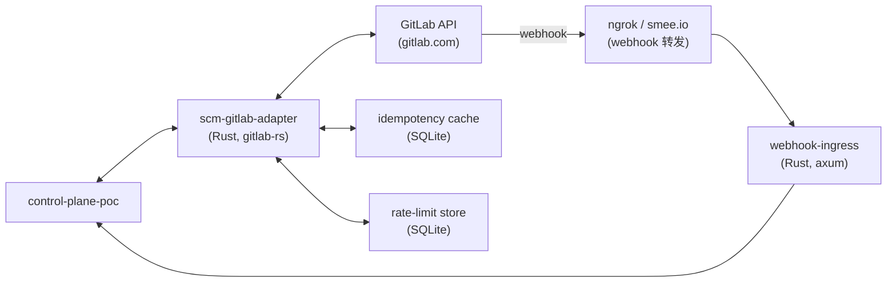
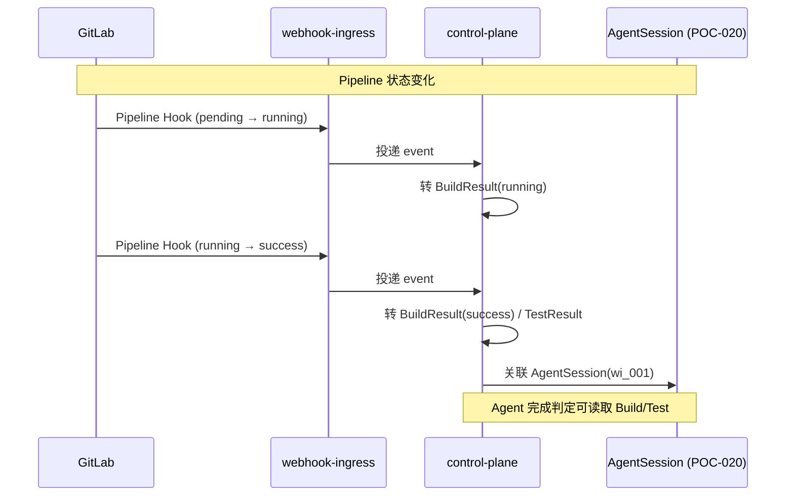

# POC-027: GitLab Adapter

> **状态**: Draft v0.1 (2026-08-25)
> **优先级**: MVP 必做
> **预估工期**: 4 人·天 / 1.2M tokens(AI 协作)
> **上游依赖**:
> - 《Requirements》REQ-SCM-001~010
> - 《Basic Design》§4.5(SCM Port)、§4.5.5、§18.1、§27
> - 《Module Spec》domain-scm-spec.md
> - 《Data Design》§4.21
> - 《Security Design》§5.6
> - 《ADR-022》SCM Port(多厂商适配)
> - 《POC-026》GitHub Adapter(共用 `ScmPort` 抽象)
> **下游**: 决定 §MVP Must-Have 中"GitLab Integration"是否纳入 v0.1
> **Owner**: TBD

---

## 1. 目标

验证 **SCM Port GitLab 实现** 全功能:
**Repository / Branch / Commit / MR / Pipeline / Webhook + Rate Limit 兜底**。

**成功标准**(5 条可观测指标):
- [ ] 6 类资源全部 CRUD / List:Repository / Branch / Commit / MR / Pipeline / Webhook
- [ ] MR 双向 Sync(本地 Commit → MR / MR Review → 本地 Feedback)正常
- [ ] Pipeline 状态同步(Pending → Running → Success/Failed)
- [ ] Webhook 推送 < 1s 端到端
- [ ] Rate Limit 检测 + 退避策略生效(429 / 403 with `Retry-After`)

## 2. 范围

**PoC 包含**:
- GitLab Personal Access Token / Project Access Token 鉴权
- 6 类资源 Adapter:`ScmPort::repo_*` / `branch_*` / `commit_*` / `mr_*` / `pipeline_*` / `webhook_*`
- Webhook 接收端(Ngrok / 自建 tunnel)
- Rate Limit 中间件(支持 GitLab 自定义 header + `Retry-After`)
- Idempotency + Sync Token(防 Loop,§18.1)
- E2E 双向 Sync fixture(本地 Commit → GitLab MR / MR Review → 本地 Feedback)
- Pipeline Status → Build/Test Result 联动(给 POC-020 复用)

**PoC 不包含**:
- GitLab CI YAML 编辑器(只读)
- Self-managed GitLab 复杂场景(用 `gitlab.com` 公开实例)
- Bitbucket / Gitea(Future)

## 3. 架构与环境

### 3.1 部署架构



### 3.2 技术栈

- **Adapter**: Rust 1.78+ / `gitlab` crate(社区版,API v4)
- **Webhook**: `axum 0.7`
- **Storage**: SQLite(§4.21 复用)
- **Webhook 转发**: ngrok(PoC 用,生产用真实公网)

### 3.3 环境变量与配置

| 变量 | 默认 | 含义 |
|---|---|---|
| `STAR_POC_GL_TOKEN` | (TBD) | GitLab PAT |
| `STAR_POC_GL_HOST` | `gitlab.com` | GitLab host(self-managed 留 V1) |
| `STAR_POC_GL_WEBHOOK_SECRET` | (TBD) | Webhook 签名 secret |
| `STAR_POC_RETRY_BASE_MS` | `1000` | 指数退避 base |

## 4. 实施步骤

### 步骤 1: 鉴权 + gitlab crate 客户端(0.3d)
- 任务:用 PAT 初始化,验证 `GET /user`
- 输入:无
- 输出:`crates/scm-gitlab/src/client.rs`
- 验收:返回 user 信息

### 步骤 2: Repository Adapter(0.4d)
- 任务:`list_repos` / `get_repo` / `create_repo`(只读足够 PoC)
- 输入:步骤 1
- 输出:`crates/scm-gitlab/src/repo.rs`
- 验收:list 100 个 repo < 2s

### 步骤 3: Branch / Commit Adapter(0.4d)
- 任务:`list_branches` / `list_commits` / `get_commit`
- 输入:步骤 1
- 输出:`crates/scm-gitlab/src/branch.rs` / `commit.rs`
- 验收:list commits 100 个 < 2s

### 步骤 4: MR Adapter(0.5d)
- 任务:`list_mrs` / `get_mr` / `create_mr` / `update_mr` / `merge_mr`
- 输入:步骤 1
- 输出:`crates/scm-gitlab/src/mr.rs`
- 验收:create + update + merge E2E 跑通

### 步骤 5: Pipeline Adapter(0.5d)
- 任务:`list_pipelines` / `get_pipeline` / `list_pipeline_jobs`
- 输入:步骤 1
- 输出:`crates/scm-gitlab/src/pipeline.rs`
- 验收:list 50 个 pipeline < 2s,状态字段完整

### 步骤 6: Webhook 接收(0.5d)
- 任务:接收 `Push Hook` / `Merge Request Hook` / `Pipeline Hook` / `Note Hook` 4 类事件
- 输入:步骤 1
- 输出:`crates/scm-gitlab/src/webhook.rs`
- 验收:4 类事件 100% 接收

### 步骤 7: Rate Limit 中间件(0.4d)
- 任务:检测 `Retry-After` header + 429/403 触发指数退避;GitLab 默认无显式 rate limit,主要兜底是 429 + iptables 自定义头
- 输入:步骤 1
- 输出:`crates/scm-gitlab/src/rate_limit.rs`
- 验收:故意触发 429 退避正确

### 步骤 8: Idempotency + Sync Token(0.4d)
- 任务:与 GitHub 同模式,Key + Token 双重防 Loop
- 输入:步骤 6
- 输出:`crates/scm-gitlab/src/sync_guard.rs`
- 验收:故意重放 1 个事件,识别为重复

### 步骤 9: Pipeline → Build/Test 联动(0.4d)
- 任务:Pipeline 状态变化 → 转 `BuildResult` / `TestResult` → 落 POC-020 AgentSession 关联
- 输入:步骤 5 + POC-020
- 输出:`crates/scm-gitlab/src/pipeline_link.rs`
- 验收:Pipeline Success → 1 条 BuildResult,Failed → TestResult 关联

### 步骤 10: 双向 Sync E2E(0.4d)
- 任务:本地 commit 1 次 → 通过 adapter push → GitLab MR 收到 → 收到 webhook → 同步回 CP
- 输入:步骤 1-9
- 输出:`tests/poc-027-bidir.rs`
- 验收:5 条成功标准全过

### 步骤 11: 度量 + 报告(0.2d)
- 任务:汇总 + 5 条成功标准
- 输入:步骤 10
- 输出:`poc-027-report.md`
- 验收:全过

## 5. 关键脚本与命令

```bash
# 步骤 1: 验证鉴权
export STAR_POC_GL_TOKEN=glpat-xxx
cargo run --bin gl-whoami

# 步骤 4: 跑 MR
cargo run --bin gl-mr -- --project my-group/my-project --action create \
  --title "PoC-027 test" --description "automated" \
  --source-branch feature/poc-027 --target-branch main

# 步骤 5: 跑 Pipeline
cargo run --bin gl-pipeline -- --project my-group/my-project --list --limit 50

# 步骤 6: 启 webhook
ngrok http 9444
# 在 GitLab project 设置 webhook → ngrok URL + secret

# 步骤 7: 故意触发 429(用 iptables throttle,或 mock server)
```

```rust
// crates/scm-gitlab/src/mr.rs (stub)
use gitlab::Gitlab;

pub async fn create_mr(
    client: &Gitlab,
    project_id: u64,
    title: &str,
    description: &str,
    source_branch: &str,
    target_branch: &str,
) -> Result<String, ScmError> {
    let mr = client
        .create_merge_request(project_id)
        .source_branch(source_branch)
        .target_branch(target_branch)
        .title(title)
        .description(description)
        .build()?;
    let result = mr.execute(client).await?;
    Ok(result.web_url)
}

// crates/scm-gitlab/src/rate_limit.rs (stub)
pub async fn check_rate_limit(resp: &Response) -> Result<(), RateLimitError> {
    if let Some(retry_after) = resp.headers().get("Retry-After") {
        let wait: u64 = retry_after.to_str()?.parse()?;
        tokio::time::sleep(Duration::from_secs(wait)).await;
        return Err(RateLimitError::RetryAfter(wait));
    }
    if resp.status() == StatusCode::TOO_MANY_REQUESTS {
        return Err(RateLimitError::RateLimited);
    }
    Ok(())
}
```

## 6. 数据与测试夹具

**Schema**:沿用 POC-026 §4.21,`vendor` 字段取 `gitlab`,`scm_mr` 替代 `scm_pr`。
```sql
-- 引用 §4.21,非完整 DDL
CREATE TABLE scm_merge_request (
  mr_id TEXT PRIMARY KEY,
  repo_id TEXT NOT NULL,
  external_id INT NOT NULL,         -- GitLab MR iid
  iid INT NOT NULL,
  title TEXT NOT NULL,
  state TEXT NOT NULL,
  head_ref TEXT,
  base_ref TEXT,
  idempotency_key TEXT,
  sync_token TEXT,
  created_at TIMESTAMPTZ NOT NULL
);
CREATE TABLE scm_pipeline (
  pipeline_id TEXT PRIMARY KEY,
  repo_id TEXT NOT NULL,
  external_id INT NOT NULL,
  status TEXT NOT NULL,             -- pending | running | success | failed
  ref TEXT NOT NULL,
  sha TEXT NOT NULL,
  created_at TIMESTAMPTZ NOT NULL
);
```

**测试 fixture**:
- 1 个 GitLab test project(在 `gitlab.com` 上建)
- 1 个 PAT(`api` scope)
- 1 个 ngrok tunnel
- 5 类操作各 1 fixture

## 7. 验证与度量

| 度量 | 目标 | 测量方式 |
|---|---|---|
| 6 类资源覆盖率 | 100% | 单元测试 |
| MR 双向 Sync | < 5s 端到端 | E2E |
| Pipeline 同步 | < 1s | E2E |
| Webhook 推送 P95 | < 1s | 端到端打点 |
| Rate Limit 兜底 | 100% | 100 请求压测 |
| Idempotency | 100% 重放拒绝 | 故意重放 1 次 |
| Pipeline → BuildResult 联动 | 100% | fixture |

## 8. 风险与缓解

| 风险 | 缓解 |
|---|---|
| `gitlab` crate API 变化 | 锁版本 + 季度升级 |
| GitLab 无标准 Rate Limit header | 主要靠 429 + Retry-After + 用户 tier 配置 |
| Webhook 丢失 | delivery_id 持久化 + 重放 |
| 双向 Sync Loop | 与 GitHub 同机制(§18.1) |
| Self-managed GitLab 兼容性 | PoC 用 gitlab.com,V1 加 self-managed 支持 |
| Pipeline 数据膨胀 | TTL + 采样(§5.8) |

## 9. 后续阶段输入

- **MVP 决策**:GitLab Adapter 纳入 v0.1,6 类资源全功能
- **接口承诺**:与 GitHub 共用 `ScmPort` trait,新增 `pipeline_*` 方法
- **Rate Limit 基线**:沿用 GitHub 的退避策略
- **下一步**:POC-028 Agent Adapter 复用本 PoC 的 Pipeline 联动模式

## 附录 A:Pipeline 联动时序



## 附录 B:决策记录

- **D-POC-027-01**:`gitlab` crate 维护活跃度中等,自封装 reqwest 留 V1 评估。
- **D-POC-027-02**:Pipeline 联动是 GitLab 独有,放本 PoC 而非 GitHub 同步;GitHub 用 `check_run` 替代(V1 评估)。
- **D-POC-027-03**:Rate Limit 兜底策略沿用 GitHub,统一性优先。
- **D-POC-027-04**:Self-managed GitLab 留 V1,PoC 用 gitlab.com 简化。

## 附录 C:GitLab vs GitHub 关键差异

| 维度 | GitHub | GitLab | 适配策略 |
|---|---|---|---|
| API 版本 | REST v3 + GraphQL v4 | REST v4 | GitLab 只用 REST v4 |
| MR / PR | `pulls` | `merge_requests` | `ScmPort::pr_*` 抽象统一 |
| Pipeline | Actions (YAML) | CI (YAML) | GitLab 暴露 `pipeline_*` |
| Webhook secret | `X-Hub-Signature-256` | `X-Gitlab-Token` | Adapter 各自解析 |
| Rate Limit | 严格 (5000/h) | 宽松 (按 tier) | 中间件统一兜底 |
| Pagination | Link header | `X-Next-Page` header | Adapter 内部处理,Port 暴露 list_next |
| Default branch | `main` / `master` | `main` / `master` | 无差异 |
| Review comments | inline + conversation | inline + thread | `ScmPort::review_*` 抽象 |

**统一抽象后的调用方式**:
```rust
// 业务代码无差别
let prs = scm_port.list_pull_requests(repo_id, ListPrQuery { state: Some("open") })?;
```

**Pipeline 联动是 GitLab 独有**:POC-020 AgentSession 关联 BuildResult 时,优先读 GitLab Pipeline;GitHub 用 `check_run` 替代,字段映射:
- `pipeline.status=running` → `build.status=running`
- `pipeline.status=success` → `build.status=success` + `test.status=success`(默认)
- `pipeline.status=failed` → `test.status=failed`(默认 CI = 跑测试)

**Webhook 解析差异**:
- GitHub `pull_request_review` 事件体含 `review.state`(`approved` / `changes_requested` / `commented`)
- GitLab `Note Hook` 需 `noteable_type=MergeRequest` 过滤,且 `note` 文本前缀约定
- Adapter 各自解析后,统一转 `Feedback{kind: CodeReview, ...}`
