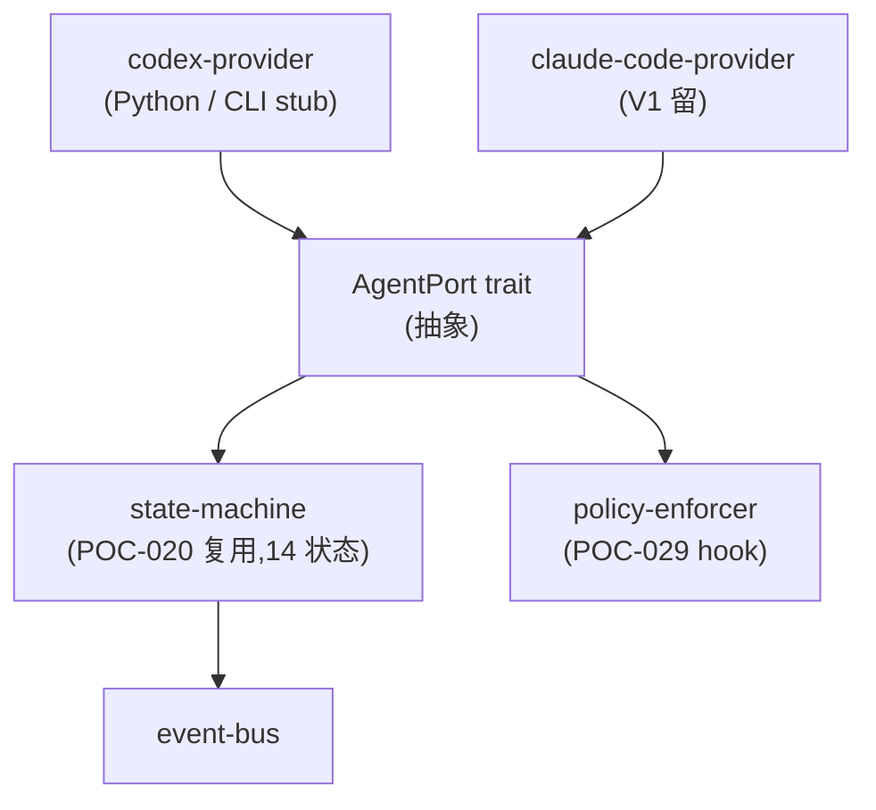
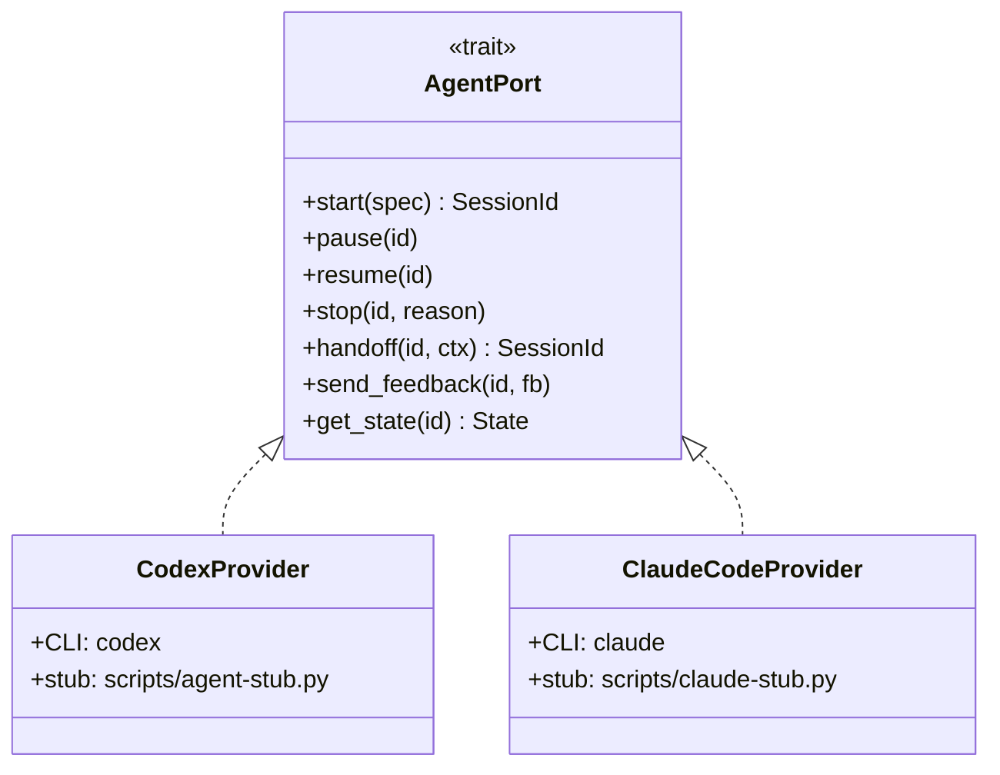

# POC-028: Agent Adapter

> **状态**: Draft v0.1 (2026-08-25)
> **优先级**: MVP 必做
> **预估工期**: 5 人·天 / 1.5M tokens(AI 协作)
> **上游依赖**:
> - 《Requirements》REQ-AGT-001 / REQ-AGT-003 / REQ-AGT-004
> - 《Basic Design》§4.2(Agent 全章)、§4.2.4(Agent Port 抽象,ADR-021)、§4.2.5(AgentPolicy)、§4.2.6(14 状态)、§4.2.7(Handoff)、§4.10.7
> - 《Module Spec》domain-agent-spec.md
> - 《Data Design》§4.5 / §4.6
> - 《AI Agent Design》§3 / §4 / §5
> - 《Security Design》§5.4
> - 《ADR-021 / ADR-026》
> - 《POC-020》Agent Session Tracking
> **下游**: 决定 §MVP Must-Have 中"Agent Adapter"是否纳入 v0.1
> **Owner**: TBD

---

## 1. 目标

验证 **Agent Port 至少 1 厂商实现**(PoC 选 Codex 或 Claude Code),
**AgentSession 完整生命周期** + **Policy 强制点全部生效**。

**成功标准**(5 条可观测指标):
- [ ] AgentSession 14 状态全生命周期跑通(Init → ... → Completed/Terminated)
- [ ] Policy 12 强制点(§4.2.5)全部 hook(详细验证留给 POC-029)
- [ ] Agent 启动 / 暂停 / 恢复 / 停止 / Handoff 全可用
- [ ] ChangeSet / ValidationResult / FeedbackConsumed / TraceReference 字段全部正确填充
- [ ] Provider 抽象(Codex / Claude Code / Future)可替换

## 2. 范围

**PoC 包含**:
- 1 个 Provider 实现(PoC 选 Codex,理由 = 本地 Python stub 已有基础)
- `AgentPort` trait 完整实现
- AgentSession 14 状态生命周期(沿用 POC-020)
- 5 个 Agent 命令:start / pause / resume / stop / handoff
- 4 个 Session 字段:Plan / Decisions / ChangeSet / ValidationResult / FeedbackConsumed / TraceReference
- Provider 切换 demo(Codex 跑通后,Claude Code 切换只改配置不改业务)

**PoC 不包含**:
- 真实 LLM 推理(用 stub 模拟,只验证 Port)
- Policy 12 强制点深度验证(留给 POC-029)
- 多 Provider 并行(V1)

## 3. 架构与环境

### 3.1 部署架构



### 3.2 技术栈

- **AgentPort**: Rust 1.78+ / async-trait
- **Codex Provider**: Python 3.12 stub(模拟 Codex CLI 输出 JSONL 事件流)
- **State Machine**: 沿用 POC-020
- **Event Bus**: 沿用 POC-020

### 3.3 环境变量与配置

| 变量 | 默认 | 含义 |
|---|---|---|
| `STAR_POC_AGENT_PROVIDER` | `codex` | provider 切换(codex / claude_code) |
| `STAR_POC_AGENT_CLI` | `codex` | 真实 CLI 命令(PoC 用 stub) |
| `STAR_POC_AGENT_TIMEOUT_SEC` | `600` | Agent 整体超时 |

## 4. 实施步骤

### 步骤 1: AgentPort trait 定义(0.4d)
- 任务:`async fn start / pause / resume / stop / handoff / send_feedback / get_state`
- 输入:basic-design §4.2.4 + API Design §3.x
- 输出:`crates/domain-agent/src/port.rs`
- 验收:7 方法签名稳定,unit test mock 通过

### 步骤 2: Session 字段扩展(0.3d)
- 任务:`Plan / Decisions / ChangeSet / ValidationResult / FeedbackConsumed / TraceReference` 6 字段加入 `agent_session`
- 输入:basic-design §24.1
- 输出:`migrations/poc-028-001.sql`
- 验收:表字段齐全,JSONB 存储

### 步骤 3: Codex Provider stub(0.6d)
- 任务:Python 脚本模拟 Codex 输出:`{"event": "init", ...} {"event": "message", ...} {"event": "complete", ...}`,Rust 端解析
- 输入:步骤 1
- 输出:`crates/agent-codex/src/lib.rs` + `scripts/agent-stub.py`
- 验收:stub 跑通 1 个完整 session

### 步骤 4: Provider Event 流 → 状态机(0.6d)
- 任务:把 Codex stub 的 event 流映射到 POC-020 14 状态
- 输入:步骤 3 + POC-020
- 输出:`crates/agent-codex/src/event_mapper.rs`
- 验收:14 状态各能触发

### 步骤 5: 5 个命令(0.7d)
- 任务:start / pause / resume / stop / handoff 各自事件 + 状态迁移
- 输入:步骤 1-4
- 输出:`crates/domain-agent/src/commands.rs`
- 验收:5 命令各自 E2E 跑通

### 步骤 6: Policy hook(0.5d)
- 任务:12 强制点(§4.2.5)的 hook 位置 + 简化验证
- 输入:basic-design §4.2.5
- 输出:`crates/domain-agent/src/policy_hook.rs`
- 验收:12 hook 位置埋点,详细验证留 POC-029

### 步骤 7: Provider 切换 demo(0.4d)
- 任务:同 1 套 AgentSession 业务,切换 `STAR_POC_AGENT_PROVIDER=claude_code` 后走 Claude Code stub
- 输入:步骤 1-5
- 输出:`crates/agent-claude-code/src/lib.rs` + 切换 demo
- 验收:Provider 切换不改业务代码

### 步骤 8: E2E 5 场景(0.6d)
- 任务:Happy / Human Pause / Provider Switch / Handoff / Force Stop
- 输入:步骤 1-7
- 输出:`tests/poc-028-scenarios.rs`
- 验收:5 场景 100% 通过

### 步骤 9: 度量 + 报告(0.2d)
- 任务:汇总 5 条成功标准
- 输入:步骤 8
- 输出:`poc-028-report.md`
- 验收:全过

## 5. 关键脚本与命令

```bash
# 步骤 3: 跑 Codex stub
export STAR_POC_AGENT_PROVIDER=codex
cargo run --bin agent-codex -- --scenario happy
# 期望: 输出 14 状态迁移日志

# 步骤 7: 切到 Claude Code
export STAR_POC_AGENT_PROVIDER=claude_code
cargo run --bin agent-codex -- --scenario happy
# 期望: 同样输出,只换 provider

# 步骤 8: 5 场景
cargo test -p domain-agent poc-028-scenarios
# 期望: 5 passed
```

```rust
// crates/domain-agent/src/port.rs (stub)
use async_trait::async_trait;

#[async_trait]
pub trait AgentPort: Send + Sync {
    async fn start(&self, spec: StartSpec) -> Result<AgentSessionId, AgentError>;
    async fn pause(&self, session_id: AgentSessionId) -> Result<(), AgentError>;
    async fn resume(&self, session_id: AgentSessionId) -> Result<(), AgentError>;
    async fn stop(&self, session_id: AgentSessionId, reason: StopReason) -> Result<(), AgentError>;
    async fn handoff(&self, session_id: AgentSessionId, ctx: HandoffContextPacket) -> Result<AgentSessionId, AgentError>;
    async fn send_feedback(&self, session_id: AgentSessionId, fb: Feedback) -> Result<(), AgentError>;
    async fn get_state(&self, session_id: AgentSessionId) -> Result<AgentState, AgentError>;
}

// crates/agent-codex/src/lib.rs (stub)
pub struct CodexProvider { /* CLI / stub 配置 */ }

#[async_trait]
impl AgentPort for CodexProvider {
    async fn start(&self, spec: StartSpec) -> Result<AgentSessionId, AgentError> {
        // 调 stub Python,解析 event 流
        let mut child = Command::new("python3")
            .args(["scripts/agent-stub.py", "--scenario", "happy"])
            .stdout(Stdio::piped())
            .spawn()?;
        // 解析 JSONL → state machine
        let session_id = create_session(&spec)?;
        Ok(session_id)
    }
    // ... 其他 6 方法类似
}
```

## 6. 数据与测试夹具

**Schema 引用**(data-design §4.5 + §4.6 字段子集):
```sql
-- 引用 §4.5/§4.6,非完整 DDL
CREATE TABLE agent_session (
  session_id TEXT PRIMARY KEY,
  tenant_id TEXT NOT NULL,           -- 13 类对象 #4 强制
  worktree_id TEXT NOT NULL,
  runtime_id TEXT NOT NULL,
  agent_type TEXT NOT NULL,          -- codex | claude_code
  state TEXT NOT NULL,               -- 14 种
  plan JSONB,                        -- §24.1
  decisions JSONB,                   -- §24.1
  change_set_id TEXT,                -- §21.1
  validation_result JSONB,           -- §24.1
  feedback_consumed JSONB,           -- §24.1
  trace_reference JSONB,             -- §24.1
  policy_id TEXT,
  created_at TIMESTAMPTZ NOT NULL,
  last_event_at TIMESTAMPTZ NOT NULL
);
```

**5 场景 fixture**:
- Happy:start → 自动完成 → Completed
- Human Pause:Running → Paused → Running → Completed
- Provider Switch:同 session_id,provider 由 codex 切到 claude_code
- Handoff:Running → Handoff → 新 Session Init → Terminated 原 Session
- Force Stop:Running → Cancelled → Terminated

## 7. 验证与度量

| 度量 | 目标 | 测量方式 |
|---|---|---|
| 14 状态覆盖 | 100% | 状态机单测 |
| 5 命令 E2E | 5/5 | scenarios.rs |
| Provider 切换 | 0 行业务改动 | 编译 diff |
| 6 字段填充 | 100% | 5 场景后查 DB |
| Policy 12 hook | 12/12 埋点 | grep + code review |

## 8. 风险与缓解

| 风险 | 缓解 |
|---|---|
| Codex stub 与真实 CLI 行为差异 | stub 注释清楚标注,生产替换为真实 binary |
| Provider 抽象不彻底 | 7 方法全部走 trait,业务代码 0 provider-specific |
| Handoff 状态边界 | 沿用 POC-020 的 Handoff / Terminated 拆分 |
| Trace Reference 字段膨胀 | 引用而非内嵌,实际 trace 落 Object Storage |
| Policy hook 漏埋 | code review + 单元测试覆盖每个 hook 点 |

## 9. 后续阶段输入

- **MVP 决策**:Agent Adapter 纳入 v0.1,Codex 优先,Claude Code 留 V1
- **接口承诺**:`AgentPort` 7 方法签名稳定(API Design §3.x)
- **Provider 协议**:`codex | claude_code | future` 切换不改业务
- **下一步**:POC-029 Policy Enforcement 深度验证 12 强制点

## 附录 A:Provider 抽象示意



## 附录 B:决策记录

- **D-POC-028-01**:PoC 选 Codex 而非 Claude Code,理由 = 团队熟悉 + stub 已有基础;Claude Code 留 V1。
- **D-POC-028-02**:Provider 切换不改业务代码,7 方法全部走 trait,理由 = 解耦 RISK-030。
- **D-POC-028-03**:Policy hook 在 PoC 阶段只埋点,深度验证留 POC-029,理由 = 减少单 PoC 范围。
- **D-POC-028-04**:6 字段全 JSONB,Schema 演进灵活;V1 评估部分拆表。

## 附录 C:Provider 事件流映射

### Codex stub 事件流(PoC 模拟)

```jsonl
{"event": "init", "session_id": "as_001", "agent": "codex", "model": "gpt-5"}
{"event": "plan", "steps": [{"id": 1, "action": "read_file", "target": "src/auth.rs"}, {"id": 2, "action": "edit_file", "target": "src/auth.rs:42"}]}
{"event": "message", "role": "assistant", "content": "Reading the auth module..."}
{"event": "tool_call", "name": "Read", "args": {"file_path": "src/auth.rs"}}
{"event": "tool_result", "name": "Read", "output": "use crate::session::..."}
{"event": "tool_call", "name": "Edit", "args": {"file_path": "src/auth.rs", "line": 42, "new": "expect(\"session must be valid\")"}}
{"event": "tool_result", "name": "Edit", "output": "ok"}
{"event": "validation", "kind": "build", "status": "success", "output": "Compiling auth v0.1.0"}
{"event": "complete", "change_set": {"files": ["src/auth.rs"], "symbols": ["auth::validate"]}}
```

### 事件 → 状态机映射表

| Codex 事件 | 状态迁移 | 备注 |
|---|---|---|
| `init` | → Init | 启动 Session |
| `plan` | Init → PendingPolicy | 提交 plan 等审批 |
| (Policy 批) | PendingPolicy → Starting | 走 POC-029 |
| `message` (AgentStarted) | Starting → Running | 第一条 message |
| (Pause 命令) | Running → Paused | 用户主动 |
| `message` (human_request) | Running → WaitingForHuman | Agent 主动问 |
| (Human 回答) | WaitingForHuman → Running | 用户回应 |
| `validation` (success) | Running → Finishing | 所有验证过 |
| `validation` (failed) | Running → Finishing | 转入 Failed |
| `complete` | Finishing → Completed | 成功 |
| `complete` (with error) | Finishing → Failed | 失败 |
| (Handoff 命令) | Running → Handoff | 转交其他 Session |
| (Cancel 命令) | Running → Cancelled | 用户取消 |
| (Timeout) | Running → TimedOut | 监控触发 |
| Handoff 完成 | Handoff → Terminated | 原 Session 终止 |
| Cancelled/Failed/TimedOut 完成 | → Terminated | 终态 |

### Claude Code 事件流差异

Claude Code 事件格式不同,但通过 `event_mapper` 抽象后输出统一格式:
- `assistant.message_start` → `init`
- `content_block_start` (type=tool_use) → `tool_call`
- `message_stop` (stop_reason=end_turn) → `complete`

业务代码 0 改动即可切换 Provider。
